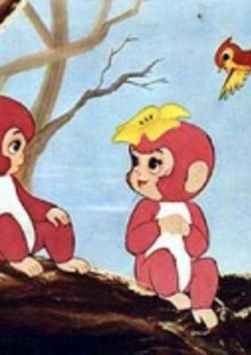
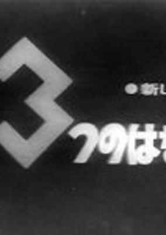

# 1960 in Anime

[← Back to index](../README.md)

3 titles · 3 with a matched synopsis/cover art · [source](https://en.wikipedia.org/wiki/1960_in_anime)

## Releases

### Alakazam the Great

**Genres:** Fantasy, Adventure, Anthropomorphism, Past

> Alakazam is a young and brave monkey who convinces all the other monkeys to make him their king. After attaining the throne and learning magic, he becomes so vain that he goes to heaven to challenge the gods. He is defeated by King Amo, and sentenced to serve as the bodyguard of Prince Amat in order to learn humility.
>
> _Synopsis source: Kitsu_

[Wikipedia](https://en.wikipedia.org/wiki/Alakazam_the_Great) · [Kitsu](https://kitsu.io/anime/alakazam-the-great)

---

### Fashion

**Genres:** Comedy, Dementia

> Experimental anime from animation pioneer Yoji Kuri from 1960.
>
> _Synopsis source: Kitsu_

[Wikipedia](https://en.wikipedia.org/wiki/Y%C5%8Dji_Kuri#Selected_filmography) · [Kitsu](https://kitsu.io/anime/fashion)

---

### Three Tales

**Genres:** Fantasy

> Three Tales was one of the first domestic anime ever televised. It comprised of three stories: "The Third Plate" (第三の皿) by Hirosuke Hamada, "Oppel and the Elephant" (オッペルと象) by Kenji Miyazawa, and "Sleepy Town" (眠い町) by Mimei Ogawa.
>
> _Synopsis source: Kitsu_

[Wikipedia](https://en.wikipedia.org/wiki/Three_Tales_(film)) · [Kitsu](https://kitsu.io/anime/mittsu-no-hanashi)

---
