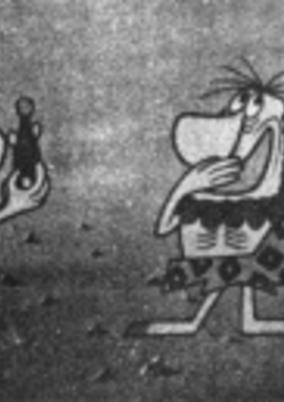
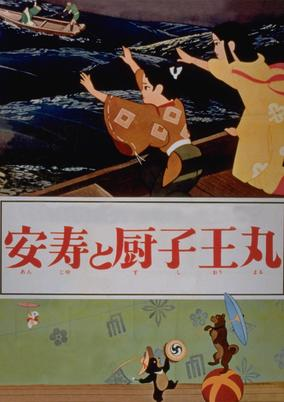

# 1961 in Anime

[← Back to index](../README.md)

3 titles · 2 with a matched synopsis/cover art · [source](https://en.wikipedia.org/wiki/1961_in_anime)

## Releases

### Fantasia of Stamps

[Wikipedia](https://en.wikipedia.org/wiki/Y%C5%8Dji_Kuri#Selected_filmography)

---

### Instant History

**Genres:** Historical

> Each three-minute short features characters learning about important historical events that occurred that day. Shown on Fuji Television, it often featured photographs and film footage taken from the Mainichi Shimbun newspaper, where Ryuuichi Yokoyama's comic strip was running at the time.
>
> _Synopsis source: Kitsu_

[Wikipedia](https://en.wikipedia.org/wiki/Instant_History) · [Kitsu](https://kitsu.io/anime/instant-history)

---

### The Littlest Warrior

**Genres:** Kyoto, Heian Period, Japan, Earth, Asia, Past, Historical, Fantasy

> After their father quarrels with local military men, Anju and Zushio are forced to flee, but they are captured and sold into slavery. When their mother dies, they are sold to Sansho the Bailiff, a cruel man who subjects them to hideous torments. While Anju falls into a lake and is transformed into a swan, Zushio escapes and after being adopted to a nobleman grows to a young man. He will then fight to defeat the evil Dayu and free all the slaves.
>
> _Synopsis source: Kitsu_

[Kitsu](https://kitsu.io/anime/anju-to-zushioumaru)

---
