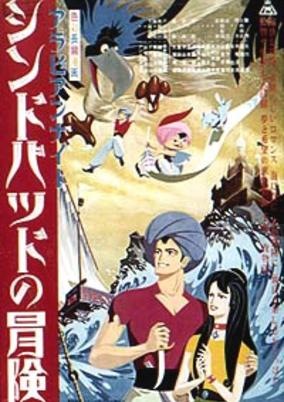
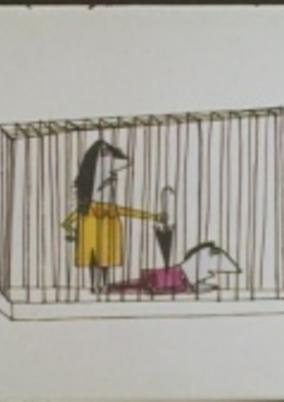
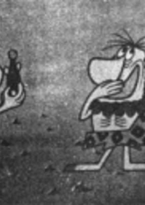
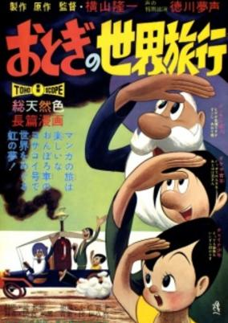

# 1962 in Anime

[← Back to index](../README.md)

7 titles · 6 with a matched synopsis/cover art · [source](https://en.wikipedia.org/wiki/1962_in_anime)

## Releases

### Sindbad the Sailor (Arabian Nights: Sinbad's Adventures)

**Genres:** Action, Fantasy, Adventure

> This is a work by Toei Animation Co., Ltd. with screenplay by Tezuka Osamu in cooperation with novelist Kita Morio. Sinbad and a boy, Ali, are stowaways on the transport ship "Boulder," but they win their proper places on the ship after currying the favor of the captain. Then the beautiful princess Samir jumps on board to escape a wicked minister who wants to marry her, and Sinbad goes through a series of adventures to protect the princess. The story unfolds with ups and downs, full of dramatic episodes from the original story such as a rough-and-tumble battle with a strange bird that is guarding diamonds.
>
> _Synopsis source: Kitsu_

[Kitsu](https://kitsu.io/anime/arabian-nights-sindbad-no-bouken)

---

### Love

[Wikipedia](https://en.wikipedia.org/wiki/Y%C5%8Dji_Kuri#Selected_filmography)

---

### Human Zoo (Clap Vocalism)

**Genres:** Dementia

> A story about a human zoo.
>
> _Synopsis source: Kitsu_

[Wikipedia](https://en.wikipedia.org/wiki/Y%C5%8Dji_Kuri#Selected_filmography) · [Kitsu](https://kitsu.io/anime/ningen-doubutsuen)

---

### Male

**Genres:** Slice of Life

> A cat just wants some alone time with his girl, but is interrupted by his stressed owner. Can't those stupid humans just keep things like relationships simple?
>
> _Synopsis source: Kitsu_

[Wikipedia](https://en.wikipedia.org/wiki/List_of_Osamu_Tezuka_anime#Male) · [Kitsu](https://kitsu.io/anime/osu)

---

### Manga Calendar

**Genres:** Historical

> A continuation of Instant History.
>
> _Synopsis source: Kitsu_

[Wikipedia](https://en.wikipedia.org/wiki/Instant_History#Otogi_Manga_Calendar) · [Kitsu](https://kitsu.io/anime/otogi-manga-calendar)

---

### Otogi's Voyage Around the World

**Genres:** Adventure

> Seven short films combined in one theatrical movie telling the story of Otogi's Studio voyage around the world.
>
> _Synopsis source: Kitsu_

[Kitsu](https://kitsu.io/anime/otogi-no-sekai-ryokou)

---

### Tales of the Street Corner

**Genres:** Earth, Music, Romance

> The scene is set with a poster on a street corner, a girl who cherishes her teddy bear, a street lamp and a playful moth that is drawn to the lamp. These creatures and inanimate objects, each with their own dramas, get involved in a war and the story ends in a tragic climax. This is a private animated piece that expresses feelings rather than telling a story. It can be said that Tezuka Osamu, frustrated with working for big companies, made an attempt here to depict what he really wanted in his animation. This work illustrates that even a poster on the wall can have a vivid drama behind it, and brings the magic of animation alive for us.
>
> _Synopsis source: Kitsu_

[Wikipedia](https://en.wikipedia.org/wiki/List_of_Osamu_Tezuka_anime#Tales_of_the_Street_Corner) · [Kitsu](https://kitsu.io/anime/aru-machi-kado-no-monogatari)

---
