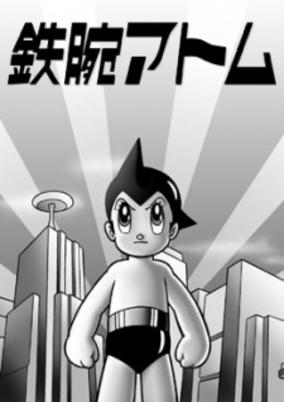
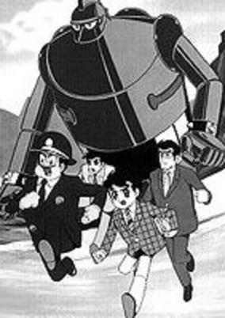
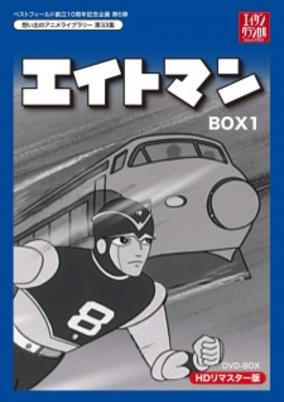
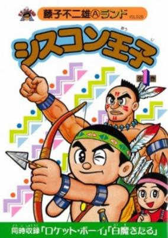
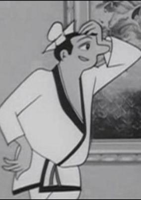
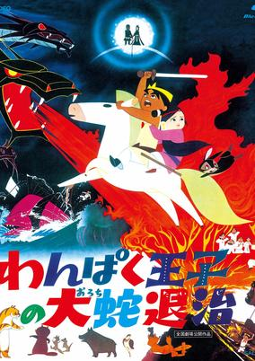

# 1963 in Anime

[← Back to index](../README.md)

8 titles · 6 with a matched synopsis/cover art · [source](https://en.wikipedia.org/wiki/1963_in_anime)

## Releases

### Astro Boy

**Genres:** Mecha, Action, Science Fiction, Adventure

> In the year 2003, Professor Tenma is distraught when his son Tobio is killed in a car accident. He loses himself in his latest project, creating Atom, a robot boy programmed to be forever good. Upset that his Tobio-substitute can never grow up, Tenma sells Atom to Ham Egg, the cruel ringmaster of a robot circus. Atom meets the kindly Professor Ochanomizu, who adopts him, inspires him to become a crusader against evil, and eventually builds him a robot "sister," Uran.
>
> _Synopsis source: Kitsu_

[Wikipedia](https://en.wikipedia.org/wiki/Astro_Boy_(1963_TV_series)) · [Kitsu](https://kitsu.io/anime/astro-boy)

---

### Gigantor

**Genres:** Science Fiction, Mecha, Adventure

> Dr.Haneda was developing experimental giant robot warriors to fight the allies during the Second World War, but before his creations could see action, Allied bombs destroyed the facility and killed him. A decade later criminals discovered two of the surviving prototypes, #26 and 27 in the series, and used the remote controlled robots to commit a number of crimes. Young Shotaro Haneda, the twelve year old son of Dr.Haneda, did some investigating and discovered that the mob were hunting for the twenty-eighth robot in the series, rumoured to be the most powerful of them all. Racing the villains, Shotaro discovers the robot first, along with Dr.Shikashima, a colleague of his father's who was also believed killed by the Allied bombing. Together the two prevent Tetusjin-28 (the robot's official designation) from falling into the hands of the bad guys, and decide to dedicate him to peace rather than war. Shotaro fought crime for a long time, supported by Dr.Shikashima, who would repair Tetsujin-28 when he was damaged, and by police officer Otsuka. Shotaro even battled the alien Magmans, invaders from the planet Magma, who came to Earth late in his career, bringing their own giant robots, Magma X and Gold Wolf, with them.
>
> _Synopsis source: Kitsu_

[Wikipedia](https://en.wikipedia.org/wiki/Gigantor) · [Kitsu](https://kitsu.io/anime/tetsujin-28-go)

---

### 8th Man (8 Man)

**Genres:** Mecha, Action, Science Fiction

> A private investigator working a routine case involving stolen technology is mortally wounded. His only hope for survival comes from sacrificing his humanity to become 8Man—a powerful cyborg crime-fighter enhanced with a living human brain. Resurrected as the ultimate high-tech vigilante, it is up to 8Man to bring the lawless to justice and put an end to the escalating cycle of violence. A classic animated thriller that will leave you breathless.
>
> _Synopsis source: Kitsu_

[Wikipedia](https://en.wikipedia.org/wiki/8_Man) · [Kitsu](https://kitsu.io/anime/eight-man)

---

### Wolf Boy Ken

[Wikipedia](https://en.wikipedia.org/wiki/Wolf_Boy_Ken)

---

### Doggie March

[Wikipedia](https://en.wikipedia.org/wiki/Doggie_March)

---

### Prince Shisukon

**Genres:** Adventure

> Based on a manga by Fujiko (A) Fujio and Fujiko (F) Fujio.
>
> _Synopsis source: Kitsu_

[Kitsu](https://kitsu.io/anime/shisukon-ouji)

---

### Hermit Village

**Genres:** Ecchi, Comedy

> The ancient Chinese town of Taoyuan is populated exclusively by Taoist ascetics. The elder, Lao Shi, conducts research on magic and alchemy, while his pupil Zhi Huang is more interested in the pleasures of the flesh. He fell in love with three beautiful sisters who live close by.
>
> _Synopsis source: Kitsu_

[Kitsu](https://kitsu.io/anime/sennin-buraku)

---

### The Little Prince and the Eight-Headed Dragon (Orochi)

**Genres:** Fantasy, Adventure, Earth, Asia, Past

> This anime film tells the story of the god Susanoo (as a cute boy), whose mother Izanami had passed away. He was deeply hurt by the loss of his mother, but his father Izanagi told him that once she had died, she had gone to the heavens. Despite Izanagi's warnings, Susanoo eventually sets off to find her. Along with his companions Akahana (a little talking rabbit) and Taitanbo (a strong but friendly giant from the Land of Fire), Susanoo overcomes all obstacles in his long, wonderous voyage. He eventually comes to the Izumo Province, where he meets a little girl, Princess Kushinada, whom he becomes friends with (He also thought she was so beautiful that she looks like his mother Izanami). Kushinada's family tells Susanoo that their other seven daughters were sacrificed to the fearsome eight-headed serpent, the Orochi. Susanoo was so infatuated with Kushinada that he decided to help her family protect her and slay the Orochi once and for all, as he, Akahana and Taitanbo prepare for the spectacular showdown...
>
> _Synopsis source: Kitsu_

[Wikipedia](https://en.wikipedia.org/wiki/The_Little_Prince_and_the_Eight-Headed_Dragon) · [Kitsu](https://kitsu.io/anime/wanpaku-ouji-no-orochi-taiji)

---
