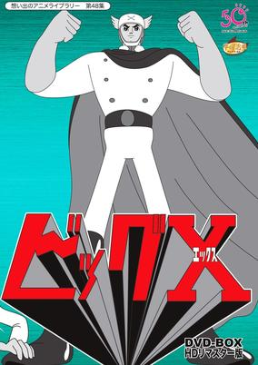
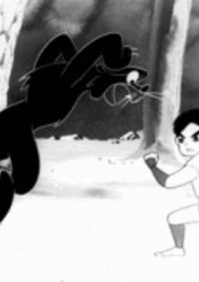
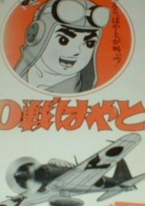

# 1964 in Anime

[← Back to index](../README.md)

7 titles · 4 with a matched synopsis/cover art · [source](https://en.wikipedia.org/wiki/1964_in_anime)

## Releases

### Mighty Atom: The Brave in Space (Astro Boy)

**Genres:** Science Fiction, Mecha, Action, Adventure

> In the year 2003, Professor Tenma is distraught when his son Tobio is killed in a car accident. He loses himself in his latest project, creating Atom, a robot boy programmed to be forever good. Upset that his Tobio-substitute can never grow up, Tenma sells Atom to Ham Egg, the cruel ringmaster of a robot circus. Atom meets the kindly Professor Ochanomizu, who adopts him, inspires him to become a crusader against evil, and eventually builds him a robot "sister," Uran.
>
> _Synopsis source: Kitsu_

[Kitsu](https://kitsu.io/anime/astro-boy)

---

### Big X

**Genres:** Science Fiction, Historical, Action

> Invited to Nazi Germany during World War II, Dr. Asagumo is asked by Hitler to collaborate with him on the research of the new weapon "Big X". Concerned about the possible effects of the completion of Big X, Dr. Asagumo intentionally delays the progress of the research, conspiring with his co-researcher, the devious Dr. Engel. Immediately before Germany is defeated by the Allies, Dr. Asagumo implants a card inscribed with the secret of Big X in his son, Shigeru, and is then shot to death by the German army. Twenty years later, the card is discovered in the body of Shigeru, who is then living in Tokyo. Soon, an organization claiming alliance with the Nazis appears, steals the card, and completes the Big X project. Dr. Engel's grandson has joined the Nazi Alliance. The completed Big X is then revealed to be a drug that can expand the human body without limitation. Recovering Big X from the enemy, Shigeru's son Akira fearlessly challenges the Nazi Alliance and Hans Engel, who are plotting to conquer the world. (Souce: Wikipedia)
>
> _Synopsis source: Kitsu_

[Wikipedia](https://en.wikipedia.org/wiki/Big_X) · [Kitsu](https://kitsu.io/anime/big-x)

---

### Memory

[Wikipedia](https://en.wikipedia.org/wiki/List_of_Osamu_Tezuka_anime#Memory)

---

### Mermaid

[Wikipedia](https://en.wikipedia.org/wiki/List_of_Osamu_Tezuka_anime#Mermaid)

---

### Samurai Kid

**Genres:** Martial Arts, Samurai, Action, Adventure

> Kidnapped and rescued by a Ninja, Fujimaru has mastered martial arts over the years. Now he sets off on a journey to find his mother and also locate an old tome containing secret martial arts techniques.
>
> _Synopsis source: Kitsu_

[Wikipedia](https://en.wikipedia.org/wiki/Samurai_Kid) · [Kitsu](https://kitsu.io/anime/shounen-ninja-kaze-no-fujimaru)

---

### Fujimaru of the Wind: The Mysterious Arabian Doll

---

### Hayato the Zero Fighter

**Genres:** Historical, Military

> The adventures of a zero fighter pilot during World War II.
>
> _Synopsis source: Kitsu_

[Kitsu](https://kitsu.io/anime/zero-sen-hayato)

---
