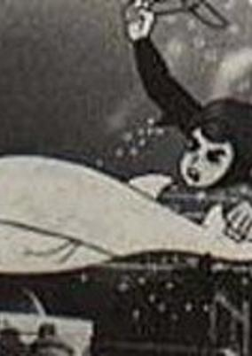
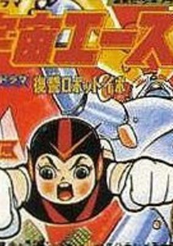
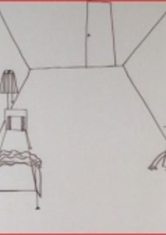
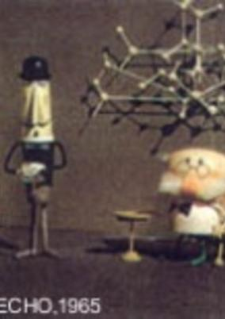
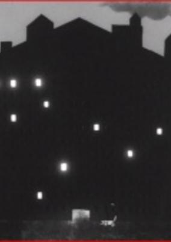
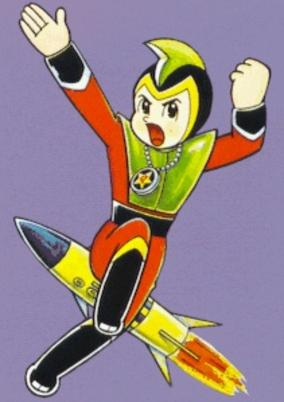
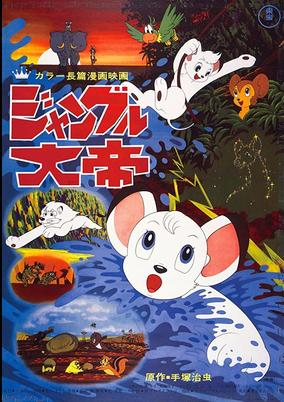
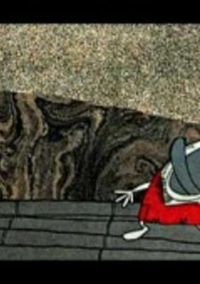

# 1965 in Anime

[← Back to index](../README.md)

22 titles · 20 with a matched synopsis/cover art · [source](https://en.wikipedia.org/wiki/1965_in_anime)

## Releases

### Gulliver's Travels Beyond the Moon

[Wikipedia](https://en.wikipedia.org/wiki/Gulliver%27s_Travels_Beyond_the_Moon)

---

### Dolphin Prince

**Genres:** Action, Science Fiction, Adventure, Kids

> Produced as a short experimental trial series of only 3 episodes and filmed in black and white, Dolphin Prince aired on Fuji TV on Sundays at 7.30pm. The episodes featured young Dolphin Prince, his mermaid friend Neptuna and Dr. Mariner, with stories entitled "Secret Of The Red Vortex", "Call Of The Sea" and "Attack Of The Sea-Star People".
>
> _Synopsis source: Kitsu_

[Wikipedia](https://en.wikipedia.org/wiki/Dolphin_Prince) · [Kitsu](https://kitsu.io/anime/dolphin-ouji)

---

### Pipi the Spaceman

**Genres:** Kids

> An alien from another world lands on Earth and befriends a human boy. Pipi tends to help his human friends by giving them sound advice and sometimes using his advanced technology when needed. This is a drama which is mostly live actors and scenery. The main character, Pipi, and many of the special effects are animated.
>
> _Synopsis source: Kitsu_

[Kitsu](https://kitsu.io/anime/uchuujin-pipi)

---

### Zoran, Space Boy (Space Ace)

**Genres:** Super Power, Action, Science Fiction, Adventure

> Dr. Tatsunoko of Tatsunoko Research Center goes undersea accompanied by his daughter Asari to inquire into some mysterious radiation and discovers there a giant shell and it is known that the radiation comes from a globe laid inside the shell. Then Asari finds an object in the shape of compact with a message in it. It says that a space alien from the Planet of Parlum which is on the verge of extinction is lying in the globe. Suddenly a boy with a strange look appears out of the globe and goes wild. He is the very person mentioned in the message with the name of Ace. His source of energy for superhuman power is what is called space food and he can fly with the help of Silver Ring made with energy collected instantly in the aerial environment. Also he is able to use it as a weapon to fight the enemy with. Supported by his friends including Asari, Ibo the robot dog, and Hermit Crab Reporter, he gallantly goes into action to settle various difficulties caused by mystic robots and brutal space invaders.
>
> _Synopsis source: Kitsu_

[Wikipedia](https://en.wikipedia.org/wiki/Space_Boy_Soran) · [Kitsu](https://kitsu.io/anime/uchuu-ace)

---

### Jun the Space Patrol Hopper (Space Patrol Hopper)

**Genres:** Science Fiction, Space

> After an alien attack, a boy named Jun is rescued by aliens who give him super powers and recruit him into the Space Patrol. The series was renamed Patrol Hopper Uchukko Jun for the final 18 episodes.
>
> _Synopsis source: Kitsu_

[Kitsu](https://kitsu.io/anime/uchuu-patrol-hopper)

---

### Super Jetter

**Genres:** Science Fiction, Action, Super Power, Comedy

> A time patroller from the 30th century goes back to the 20th century to stop a meteor from destroying the world.
>
> _Synopsis source: Kitsu_

[Wikipedia](https://en.wikipedia.org/wiki/Super_Jetter) · [Kitsu](https://kitsu.io/anime/mirai-kara-kita-shounen-super-jetter)

---

### New Treasure Island [ 1 ]

**Genres:** Adventure, Kids

> This was the first episode of Mushi Pro Land, a unique series of 60-minute animated programs. It was also Japan's first 60-minute animated TV program. However, the series never materialized and only this episode was actually aired. The story follows Stevenson's "Treasure Island," featuring characters in the form of animals. For example, the pirate Silver is illustrated as a wolf, where the main character Jim is changed into a rabbit. This has, therefore, nothing to do with the "New Treasure Island," Tezuka's masterpiece Manga.
>
> _Synopsis source: Kitsu_

[Kitsu](https://kitsu.io/anime/shin-takarajima)

---

### Kachi Kachi Yama

**Genres:** Romance, Psychological

> Three short films by the Japanese avant-garde illustrator and animator. Regarded (unfairly) as the Japanese equivalent of Andy Warhol, these films showcase a distinctively commercial illustration look reminiscent of the current pop art movement of that decade (1960s).
>
> _Synopsis source: Kitsu_

[Wikipedia](https://en.wikipedia.org/wiki/Tadanori_Yokoo) · [Kitsu](https://kitsu.io/anime/yokoo-s-3-animation-films)

---

### The Guy Next Door (The Man Next Door)

**Genres:** Slapstick, Comedy

> For the man living next door, a quiet and restful sleep seems to be an elusive wish. Experimental short animation from 1965 from pioneer Yoji Kuri.
>
> _Synopsis source: Kitsu_

[Wikipedia](https://en.wikipedia.org/wiki/Y%C5%8Dji_Kuri#Selected_filmography) · [Kitsu](https://kitsu.io/anime/the-man-next-door)

---

### The Mysterious Medicine

**Genres:** Japan, Slice of Life

> Puppet animation by Tadanari Okamoto.
>
> _Synopsis source: Kitsu_

[Wikipedia](https://en.wikipedia.org/wiki/Tadanari_Okamoto#Filmography) · [Kitsu](https://kitsu.io/anime/fushigi-na-kusuri)

---

### The Window

**Genres:** Comedy

> Short experimental animation from 1965 by Yoji Kuri.
>
> _Synopsis source: Kitsu_

[Wikipedia](https://en.wikipedia.org/wiki/Y%C5%8Dji_Kuri#Selected_filmography) · [Kitsu](https://kitsu.io/anime/the-window)

---

### Space Ace

**Genres:** Super Power, Action, Science Fiction, Adventure

> Dr. Tatsunoko of Tatsunoko Research Center goes undersea accompanied by his daughter Asari to inquire into some mysterious radiation and discovers there a giant shell and it is known that the radiation comes from a globe laid inside the shell. Then Asari finds an object in the shape of compact with a message in it. It says that a space alien from the Planet of Parlum which is on the verge of extinction is lying in the globe. Suddenly a boy with a strange look appears out of the globe and goes wild. He is the very person mentioned in the message with the name of Ace. His source of energy for superhuman power is what is called space food and he can fly with the help of Silver Ring made with energy collected instantly in the aerial environment. Also he is able to use it as a weapon to fight the enemy with. Supported by his friends including Asari, Ibo the robot dog, and Hermit Crab Reporter, he gallantly goes into action to settle various difficulties caused by mystic robots and brutal space invaders.
>
> _Synopsis source: Kitsu_

[Wikipedia](https://en.wikipedia.org/wiki/Space_Ace_(manga)) · [Kitsu](https://kitsu.io/anime/uchuu-ace)

---

### Dr. Zen

**Genres:** Thievery, Adventure, Comedy, Kids

> Each episode features a part of the story in which a detective tries to hunt down and capture a notorious and narcissistic thief. This series aired daily, Monday to Friday, in 8 minutes segments to complete a single story by the end of the week.
>
> _Synopsis source: Kitsu_

[Kitsu](https://kitsu.io/anime/kaitou-pride)

---

### Prince Planet

**Genres:** Super Power, Space, Action, Science Fiction

> Tells the story of a member of the Universal Peace Corps from the Planet Radion coming to Earth on a mission to determine if this world meets standards for membership in the Galactic Union of Worlds and assist its inhabitants during his stay. While on his mission Prince Planet adopts the identity of an Earth boy named Bobby and gains comrades who work together alongside him combating evil forces both alien and terrestrial.
>
> _Synopsis source: Kitsu_

[Wikipedia](https://en.wikipedia.org/wiki/Prince_Planet) · [Kitsu](https://kitsu.io/anime/yuusei-shounen-papii)

---

### The Amazing 3 (Amazing Three)

**Genres:** Science Fiction, Action, Adventure, Comedy

> Wonder 3 is an Osamu Tezuka manga and a black and white anime series. It involved the adventures of three agents from outer space who were sent to Earth to determine whether the planet, a potential threat to the universe, should be destroyed. The instrument of destruction is a device resembling a large black ball with two antennae that is variously called an anti-proton bomb, a solar bomb, and a neutron bomb. Although the three agents (Captain Bokko, Nokko, and Pukko) are originally humanoid in appearance, upon arrival on Earth they take on the appearances of a rabbit (Bokko), a horse (Nokko), and a duck (Pukko) that they had captured as examples of Earth life forms. While on Earth they travel in a tire-shaped vehicle capable of enormous speeds called the Big Wheel, which can travel on both land and water (and, with modifications, through the air). The series tackles a number of issues which were surprisingly progressive for an animated cartoon of that period; particularly ecological concerns and poverty.
>
> _Synopsis source: Kitsu_

[Wikipedia](https://en.wikipedia.org/wiki/The_Amazing_3) · [Kitsu](https://kitsu.io/anime/the-amazing-3)

---

### Space Boy Soran (Space Ace)

**Genres:** Super Power, Action, Science Fiction, Adventure

> Dr. Tatsunoko of Tatsunoko Research Center goes undersea accompanied by his daughter Asari to inquire into some mysterious radiation and discovers there a giant shell and it is known that the radiation comes from a globe laid inside the shell. Then Asari finds an object in the shape of compact with a message in it. It says that a space alien from the Planet of Parlum which is on the verge of extinction is lying in the globe. Suddenly a boy with a strange look appears out of the globe and goes wild. He is the very person mentioned in the message with the name of Ace. His source of energy for superhuman power is what is called space food and he can fly with the help of Silver Ring made with energy collected instantly in the aerial environment. Also he is able to use it as a weapon to fight the enemy with. Supported by his friends including Asari, Ibo the robot dog, and Hermit Crab Reporter, he gallantly goes into action to settle various difficulties caused by mystic robots and brutal space invaders.
>
> _Synopsis source: Kitsu_

[Wikipedia](https://en.wikipedia.org/wiki/Space_Boy_Soran#Anime_television_film) · [Kitsu](https://kitsu.io/anime/uchuu-ace)

---

### Little Ghost Q-Taro

**Genres:** Comedy, Fantasy, School Life, Slice of Life

> Q-taro, a monster, is living with the Ohara family. He can fly and make his body transparent, but he cannot turn his body into other things like other monsters do. He is a scattered mind, and he always makes mistakes and causes trouble.
>
> _Synopsis source: Kitsu_

[Wikipedia](https://en.wikipedia.org/wiki/Obake_no_Q-Tar%C5%8D) · [Kitsu](https://kitsu.io/anime/obake-no-q-taro)

---

### Kimba the White Lion

**Genres:** Earth, Violence, Africa, Action, Adventure, Comedy, Anthropomorphism, Drama, Kids

> Leo the white lion was born on an ocean liner that crashed on the shores of a bustling city, where he spent his childhood learning the language and customs of humans. But something was missing. In search of his family, home, and a place to truly belong, Leo traveled back to Africa and began his journey to become the King of the Jungle. Leo's adventure centers around finding peace between the animals and humans who live in his African home, often competing for space and resources. As he grows, Leo must survive both the area's harsh environment, dangers from other animals, and humans who hunt lions like him for sport. Only communication and mutual understanding can end the fighting, and Leo's knowledge of human culture may be just what the jungle needed.Jungle Taitei is the epic story of a young lion's struggles to survive in a dangerous land.
>
> _Synopsis source: Kitsu_

[Wikipedia](https://en.wikipedia.org/wiki/Kimba_the_White_Lion_(TV_series)) · [Kitsu](https://kitsu.io/anime/jungle-taitei)

---

### The Drop

**Genres:** Present, Earth, Comedy

> A man trapped on a raft in the middle of the ocean is in desperate need of water. Luckily for him, a few drops of rain water are about to fall from the raft's mast. Comedy ensues as the thirsty man attempts to drink the few small drops of water.
>
> _Synopsis source: Kitsu_

[Wikipedia](https://en.wikipedia.org/wiki/List_of_Osamu_Tezuka_anime#The_Drop) · [Kitsu](https://kitsu.io/anime/shizuku)

---

### Cigarettes and Ashes

[Wikipedia](https://en.wikipedia.org/wiki/List_of_Osamu_Tezuka_anime#Cigarettes_and_Ashes)

---

### Hustle Punch

**Genres:** Comedy, Fantasy, Kids

> The show centers around three hobos that live in a broken car on top of a junkyard: Punch, Touch, and Boom. Punch is a bear who is literally strong-headed: his head is as hard as a rock, and nothing can knock him down. Boom the weasel is an expert shot, using not a gun, but a slingshot. Touch the mouse takes advantage of her smallness in order to get into small holes and sneaking into things without the villains knowing. Gari-Gari is a mad scientist wolf who wants to build a mansion over the junkyard, constantly thinking up evil plans to get the money needed to buy the property, whether it’s creating a machine that creates counterfeit 10 yen (about 10 cents in US money) or stealing priceless paintings and selling it to a high bidder. He is an inventor, creating things that can aid him into doing his deed. If Gari-Gari buys the junkyard, this of course means that the three heroes will have no place to stay, so they constantly thwart his schemes. Gari-Gari has two henchmen working for him: Black and Nyu. Black is a gangster cat who welds a gun, often shooting at Punch and the gang with it. Nyu is a simple-minded pig who has big strength. (Source: Cartoon Research)*Based on Hustle Punch by Mori Yasuji, serialized in Manga O.
>
> _Synopsis source: Kitsu_

[Wikipedia](https://en.wikipedia.org/wiki/Hustle_Punch) · [Kitsu](https://kitsu.io/anime/hustle-punch)

---

### Fight! Osper

**Genres:** Science Fiction, Action

> On a distant world, people with paranormal powers battle each other. Based on a story by Yamano Kouichi.
>
> _Synopsis source: Kitsu_

[Wikipedia](https://en.wikipedia.org/wiki/Tatakae!_Osper) · [Kitsu](https://kitsu.io/anime/tatakae-osper)

---
