# 1965 in Anime

[← Back to index](../README.md)

22 titles · 12 with a matched synopsis/cover art · [source](https://en.wikipedia.org/wiki/1965_in_anime)

## Releases

### Gulliver's Travels Beyond the Moon

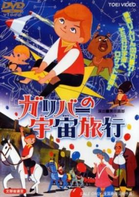

**Genres:** Science Fiction, Adventure

> Ted meets the aged professor Gulliver in a deep, dark forest. Accompanied by Mack the dog, a toy soldier called The General, and the Crow, the two set off on a journey to the Planet of Blue Hope in their spaceship the Gulliver.
>
> _Synopsis source: Kitsu_

[Wikipedia](https://en.wikipedia.org/wiki/Gulliver%27s_Travels_Beyond_the_Moon) · [Kitsu](https://kitsu.io/anime/gulliver-no-uchuu-ryokou)

---

### Dolphin Prince (Marine Boy)

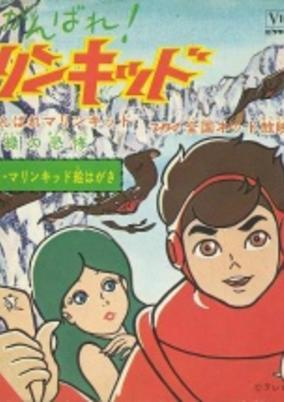

**Genres:** Science Fiction, Action, Adventure, Kids

> An expansion of the original Dolphin Ouji series. Character names were altered, (changing 'Dolphin Prince' to 'Marine Kid' and 'Neptuna' to 'Neptina'), characters were added and concepts expanded. In order to distance the new series from the original trial episodes, the series was re-titled Ganbare! Marine Kid.
>
> _Synopsis source: Kitsu_

[Wikipedia](https://en.wikipedia.org/wiki/Dolphin_Prince) · [Kitsu](https://kitsu.io/anime/ganbare-marine-kid)

---

### Pipi the Spaceman

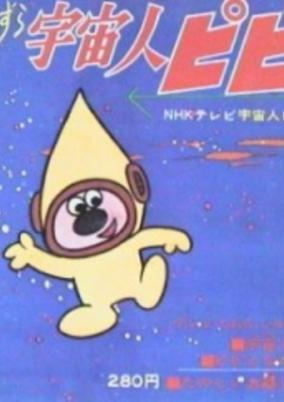

**Genres:** Kids

> An alien from another world lands on Earth and befriends a human boy. Pipi tends to help his human friends by giving them sound advice and sometimes using his advanced technology when needed. This is a drama which is mostly live actors and scenery. The main character, Pipi, and many of the special effects are animated.
>
> _Synopsis source: Kitsu_

[Kitsu](https://kitsu.io/anime/uchuujin-pipi)

---

### Zoran, Space Boy

[Wikipedia](https://en.wikipedia.org/wiki/Space_Boy_Soran)

---

### Jun the Space Patrol Hopper (Space Patrol Hopper)

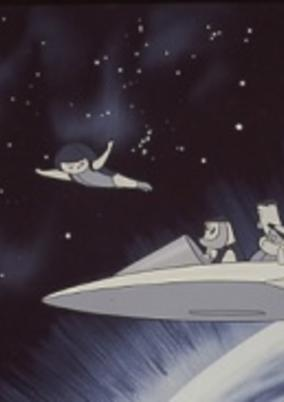

**Genres:** Science Fiction, Space

> After an alien attack, a boy named Jun is rescued by aliens who give him super powers and recruit him into the Space Patrol. The series was renamed Patrol Hopper Uchukko Jun for the final 18 episodes.
>
> _Synopsis source: Kitsu_

[Kitsu](https://kitsu.io/anime/uchuu-patrol-hopper)

---

### Super Jetter

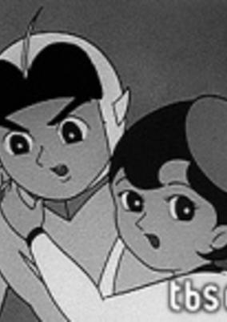

**Genres:** Science Fiction, Action, Super Power, Comedy

> A time patroller from the 30th century goes back to the 20th century to stop a meteor from destroying the world.
>
> _Synopsis source: Kitsu_

[Wikipedia](https://en.wikipedia.org/wiki/Super_Jetter) · [Kitsu](https://kitsu.io/anime/mirai-kara-kita-shounen-super-jetter)

---

### New Treasure Island [ 1 ]

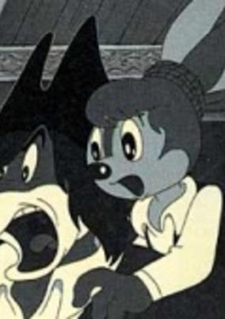

**Genres:** Adventure, Kids

> This was the first episode of Mushi Pro Land, a unique series of 60-minute animated programs. It was also Japan's first 60-minute animated TV program. However, the series never materialized and only this episode was actually aired. The story follows Stevenson's "Treasure Island," featuring characters in the form of animals. For example, the pirate Silver is illustrated as a wolf, where the main character Jim is changed into a rabbit. This has, therefore, nothing to do with the "New Treasure Island," Tezuka's masterpiece Manga.
>
> _Synopsis source: Kitsu_

[Kitsu](https://kitsu.io/anime/shin-takarajima)

---

### Kachi Kachi Yama

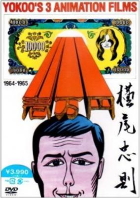

**Genres:** Romance, Psychological

> Three short films by the Japanese avant-garde illustrator and animator. Regarded (unfairly) as the Japanese equivalent of Andy Warhol, these films showcase a distinctively commercial illustration look reminiscent of the current pop art movement of that decade (1960s).
>
> _Synopsis source: Kitsu_

[Wikipedia](https://en.wikipedia.org/wiki/Tadanori_Yokoo) · [Kitsu](https://kitsu.io/anime/yokoo-s-3-animation-films)

---

### The Guy Next Door

[Wikipedia](https://en.wikipedia.org/wiki/Y%C5%8Dji_Kuri#Selected_filmography)

---

### The Mysterious Medicine

[Wikipedia](https://en.wikipedia.org/wiki/Tadanari_Okamoto#Filmography)

---

### The Window

[Wikipedia](https://en.wikipedia.org/wiki/Y%C5%8Dji_Kuri#Selected_filmography)

---

### Space Ace

[Wikipedia](https://en.wikipedia.org/wiki/Space_Ace_(manga))

---

### Dr. Zen

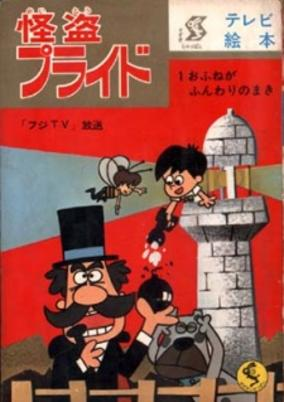

**Genres:** Thievery, Adventure, Comedy, Kids

> Each episode features a part of the story in which a detective tries to hunt down and capture a notorious and narcissistic thief. This series aired daily, Monday to Friday, in 8 minutes segments to complete a single story by the end of the week.
>
> _Synopsis source: Kitsu_

[Kitsu](https://kitsu.io/anime/kaitou-pride)

---

### Prince Planet

[Wikipedia](https://en.wikipedia.org/wiki/Prince_Planet)

---

### The Amazing 3 (Amazing Three)

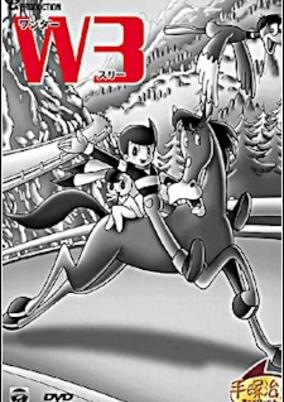

**Genres:** Science Fiction, Action, Adventure, Comedy

> Wonder 3 is an Osamu Tezuka manga and a black and white anime series. It involved the adventures of three agents from outer space who were sent to Earth to determine whether the planet, a potential threat to the universe, should be destroyed. The instrument of destruction is a device resembling a large black ball with two antennae that is variously called an anti-proton bomb, a solar bomb, and a neutron bomb. Although the three agents (Captain Bokko, Nokko, and Pukko) are originally humanoid in appearance, upon arrival on Earth they take on the appearances of a rabbit (Bokko), a horse (Nokko), and a duck (Pukko) that they had captured as examples of Earth life forms. While on Earth they travel in a tire-shaped vehicle capable of enormous speeds called the Big Wheel, which can travel on both land and water (and, with modifications, through the air). The series tackles a number of issues which were surprisingly progressive for an animated cartoon of that period; particularly ecological concerns and poverty.
>
> _Synopsis source: Kitsu_

[Wikipedia](https://en.wikipedia.org/wiki/The_Amazing_3) · [Kitsu](https://kitsu.io/anime/the-amazing-3)

---

### Space Boy Soran

[Wikipedia](https://en.wikipedia.org/wiki/Space_Boy_Soran#Anime_television_film)

---

### Little Ghost Q-Taro

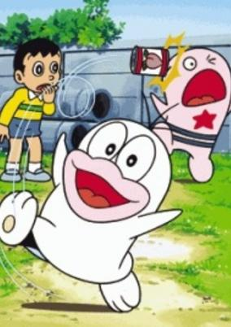

**Genres:** Comedy, Fantasy, School Life, Slice of Life

> Q-taro, a monster, is living with the Ohara family. He can fly and make his body transparent, but he cannot turn his body into other things like other monsters do. He is a scattered mind, and he always makes mistakes and causes trouble.
>
> _Synopsis source: Kitsu_

[Wikipedia](https://en.wikipedia.org/wiki/Obake_no_Q-Tar%C5%8D) · [Kitsu](https://kitsu.io/anime/obake-no-q-taro)

---

### Kimba the White Lion

[Wikipedia](https://en.wikipedia.org/wiki/Kimba_the_White_Lion_(TV_series))

---

### The Drop

[Wikipedia](https://en.wikipedia.org/wiki/List_of_Osamu_Tezuka_anime#The_Drop)

---

### Cigarettes and Ashes

[Wikipedia](https://en.wikipedia.org/wiki/List_of_Osamu_Tezuka_anime#Cigarettes_and_Ashes)

---

### Hustle Punch

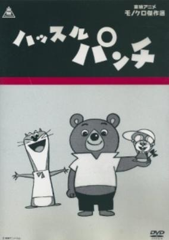

**Genres:** Comedy, Fantasy, Kids

> The show centers around three hobos that live in a broken car on top of a junkyard: Punch, Touch, and Boom. Punch is a bear who is literally strong-headed: his head is as hard as a rock, and nothing can knock him down. Boom the weasel is an expert shot, using not a gun, but a slingshot. Touch the mouse takes advantage of her smallness in order to get into small holes and sneaking into things without the villains knowing. Gari-Gari is a mad scientist wolf who wants to build a mansion over the junkyard, constantly thinking up evil plans to get the money needed to buy the property, whether it’s creating a machine that creates counterfeit 10 yen (about 10 cents in US money) or stealing priceless paintings and selling it to a high bidder. He is an inventor, creating things that can aid him into doing his deed. If Gari-Gari buys the junkyard, this of course means that the three heroes will have no place to stay, so they constantly thwart his schemes. Gari-Gari has two henchmen working for him: Black and Nyu. Black is a gangster cat who welds a gun, often shooting at Punch and the gang with it. Nyu is a simple-minded pig who has big strength. (Source: Cartoon Research)*Based on Hustle Punch by Mori Yasuji, serialized in Manga O.
>
> _Synopsis source: Kitsu_

[Wikipedia](https://en.wikipedia.org/wiki/Hustle_Punch) · [Kitsu](https://kitsu.io/anime/hustle-punch)

---

### Fight! Osper

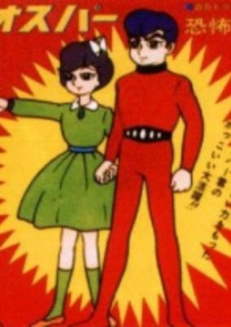

**Genres:** Science Fiction, Action

> On a distant world, people with paranormal powers battle each other. Based on a story by Yamano Kouichi.
>
> _Synopsis source: Kitsu_

[Wikipedia](https://en.wikipedia.org/wiki/Tatakae!_Osper) · [Kitsu](https://kitsu.io/anime/tatakae-osper)

---
