# 1966 in Anime

[← Back to index](../README.md)

17 titles · 13 with a matched synopsis/cover art · [source](https://en.wikipedia.org/wiki/1966_in_anime)

## Releases

### Osomatsu-kun

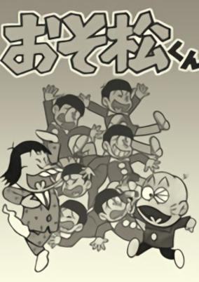

**Genres:** Comedy

> A wacky comedy about identical sextuplets causing wild pranks. Each episode features 2 stories.
>
> _Synopsis source: Kitsu_

[Wikipedia](https://en.wikipedia.org/wiki/Osomatsu-kun) · [Kitsu](https://kitsu.io/anime/osomatsu-kun)

---

### Rainbow Battle Team

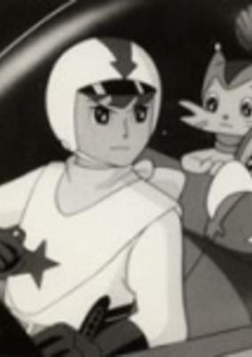

**Genres:** Science Fiction, Action, Adventure

> A squadron of robots defends the planet against alien invaders.
>
> _Synopsis source: Kitsu_

[Wikipedia](https://en.wikipedia.org/wiki/Rainbow_Sentai_Robin) · [Kitsu](https://kitsu.io/anime/rainbow-sentai-robin)

---

### Pirate Prince

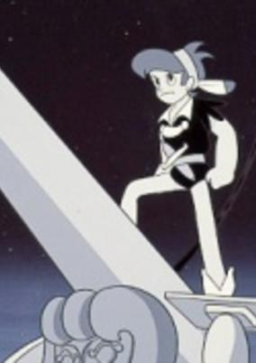

**Genres:** Adventure

> Kid was brought up on a small island which floats on the Carribean Sea. He lives a pleasant life with many animals as his companions. However, this changes when he learns that his dying father is not his real father. Before he passes away, his foster father reveals to Kid that his real father is actually Captain Morgan, the pirate who rules the seven seas. Kid decides to set off in search of his real father, only to learn about his death. Other pirates began to hunger for the title of ruler, one of them being the notorious pirate Tiger Hook. In order to protect the seas, Kid became the pirate king of his father's ship.
>
> _Synopsis source: Kitsu_

[Kitsu](https://kitsu.io/anime/kaizoku-ouji)

---

### Harisu no Kaze

[Wikipedia](https://en.wikipedia.org/wiki/Harris_no_Kaze)

---

### Asteroid Mask

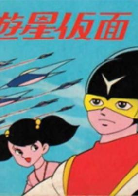

**Genres:** Science Fiction

> Donning a special mask, a young man defends the planet.
>
> _Synopsis source: Kitsu_

[Wikipedia](https://en.wikipedia.org/wiki/Asteroid_Mask) · [Kitsu](https://kitsu.io/anime/yuusei-kamen)

---

### Cyborg 009 Movie

[Wikipedia](https://en.wikipedia.org/wiki/Cyborg_009)

---

### Jungle Emperor Leo Movie

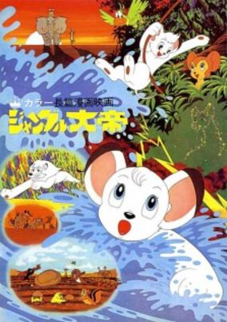

**Genres:** Earth, Africa, Adventure

> The first 2 minutes of this film are taken from the Jungle Emperor Leo (1965) TV series, while the rest is all original. Tezuka was very pleased that this film conveyed his story accurately, something he wasn't able to do with the TV series.
>
> _Synopsis source: Kitsu_

[Kitsu](https://kitsu.io/anime/jungle-taitei-movie)

---

### Robotan

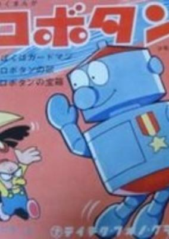

**Genres:** Comedy, Kids

> Based on a manga by Morita Kenji. Household robot Robotan, made by a nerdy school boy named Kan-chan, lives with an everyday Japanese family as a domestic servant and friend to the children.
>
> _Synopsis source: Kitsu_

[Wikipedia](https://en.wikipedia.org/wiki/Robotan) · [Kitsu](https://kitsu.io/anime/tv-1966)

---

### Onward Leo!

[Wikipedia](https://en.wikipedia.org/wiki/Leo_the_Lion_(TV_series))

---

### Hang On! Marine Kid (Marine Boy)

**Genres:** Science Fiction, Action, Adventure, Kids

> An expansion of the original Dolphin Ouji series. Character names were altered, (changing 'Dolphin Prince' to 'Marine Kid' and 'Neptuna' to 'Neptina'), characters were added and concepts expanded. In order to distance the new series from the original trial episodes, the series was re-titled Ganbare! Marine Kid.
>
> _Synopsis source: Kitsu_

[Kitsu](https://kitsu.io/anime/ganbare-marine-kid)

---

### Pictures at an Exhibition

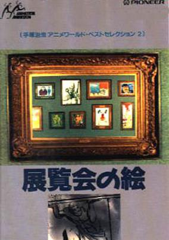

**Genres:** Comedy

> A series of short animated segments, without dialog, explore major characters of modern society, such as the plastic surgeon, the fashion-obsessed woman, the rumor-monger, and others, leading to a concluding comment on the progress of civilization.
>
> _Synopsis source: Kitsu_

[Kitsu](https://kitsu.io/anime/tenrankai-no-e)

---

### Jump Out! Batchiri

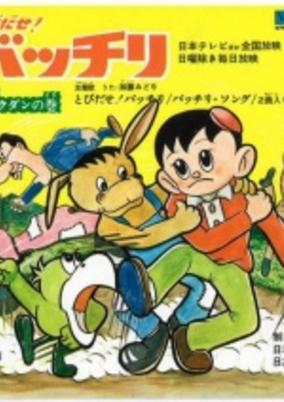

**Genres:** Comedy, Mystery, Kids

> A young detective solves mysterious cases. The 10 minutes episodes aired daily, Monday through Saturday.
>
> _Synopsis source: Kitsu_

[Kitsu](https://kitsu.io/anime/tobidase-bacchiri)

---

### Sally the Witch

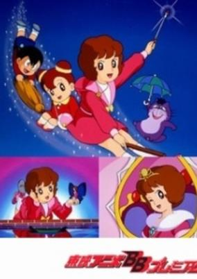

**Genres:** Japan, Elementary School, Magic, School Life, Magical Girl, Fantasy, Kids, Shoujo, Comedy

> Sally was a tomboy and mischievous witch girl. One day, she was attracted by an advertising balloon, and went to the department store. There she found girls of the same age, Sumire and Yoshiko, and she wanted to become friends with them. After she became good friends with them, she made up her mind to pretend to be a human and began to live in the town with her follower, Kabu. Then she began to know more important things than magic.
>
> _Synopsis source: Kitsu_

[Wikipedia](https://en.wikipedia.org/wiki/Sally_the_Witch) · [Kitsu](https://kitsu.io/anime/mahoutsukai-sally)

---

### Chim Chim Cher-ee

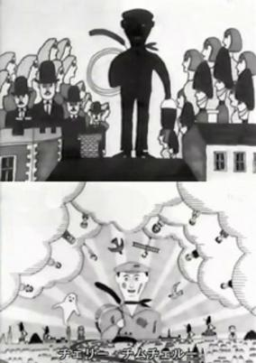

**Genres:** Music, Slice of Life, Kids

> The life of a chimney sweep in a song. This is the Japanese version of the 1964 Academy Award song Chim Chim Cher-ee that was originally sung by Dick Van Dyke and Julie Andrews in the movie 'Mary Poppins". Given the anime treatment by graphic artist and animator Tadanori Yokoo and shown in the Minna no Uta segment of NHK programming.
>
> _Synopsis source: Kitsu_

[Kitsu](https://kitsu.io/anime/chim-chim-cher-ee)

---

### The Fool

---

### The Woodpecker Plan

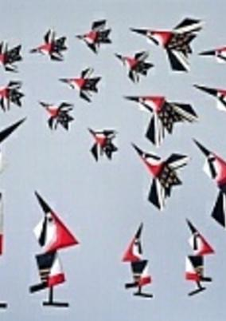

**Genres:** Japan, Crime, Slice of Life

> Puppet animation by Tadanari Okamoto.
>
> _Synopsis source: Kitsu_

[Kitsu](https://kitsu.io/anime/kitsutsuki-keikaku)

---

### Welcome, Aliens

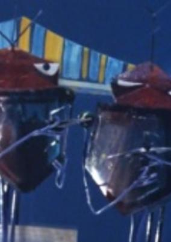

**Genres:** Japan, Performance, Music, Comedy

> Stop motion animation of aliens on a guided tour around an amusement park.
>
> _Synopsis source: Kitsu_

[Kitsu](https://kitsu.io/anime/youkoso-uchuujin)

---
