# 1967 in Anime

[← Back to index](../README.md)

19 titles · 19 with a matched synopsis/cover art · [source](https://en.wikipedia.org/wiki/1967_in_anime)

## Releases

### Adventures of the Monkey King

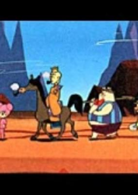

**Genres:** Fantasy, Comedy

> In this film, because of complaints from children that Goku is depicted as too much of an eager student, he is instead portrayed as a very naughty modern boy. It then received so many complaints from the PTA about its bad language that it was forced out of the show after all.
>
> _Synopsis source: Kitsu_

[Wikipedia](https://en.wikipedia.org/wiki/Gok%C5%AB_no_Daib%C5%8Dken) · [Kitsu](https://kitsu.io/anime/gokuu-no-daibouken)

---

### Tales of the Ninja (Manual of Ninja Martial Arts)

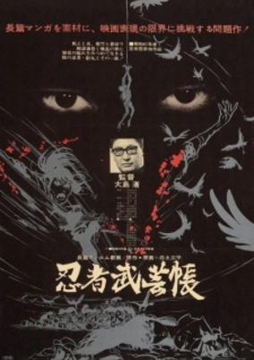

**Genres:** Action

> Also known as Manual of Ninja Martial Arts, the only animation from Japanese New Wave maestro Nagisa Oshima is as provocative as one would expect from such a remarkable filmmaker. The film follows Sanpei Shirato's classic comic story about the son of an assassinated feudal lord in the Muromachi period, who attempts to avenge his father's death and meets Kagemaru, a renegade ninja helping peasants and farmers rebel against Oda Nobunaga's regime.
>
> _Synopsis source: Kitsu_

[Kitsu](https://kitsu.io/anime/band-of-ninja)

---

### Cyborg 009: Monster Wars (Cyborg 009)

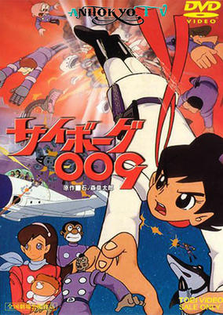

**Genres:** Action, Science Fiction, Adventure

> Original Cyborg 009 1966 movie based on the manga. Features 009's origin and an epic battle against Black Ghost and their evil robot forces.
>
> _Synopsis source: Kitsu_

[Wikipedia](https://en.wikipedia.org/wiki/Cyborg_009#Movies) · [Kitsu](https://kitsu.io/anime/cyborg-009-movie)

---

### Jack and the Witch (Young Jack and the Witch)

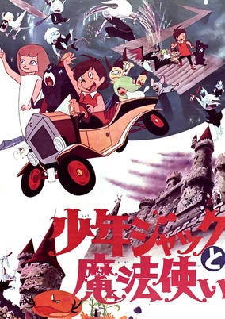

**Genres:** Fantasy, Fantasy World, Adventure

> Jack is a boy who lives with his animal friends Barnaby Bear, Dinah Dog, Squeeker Mouse and Phineas Fox. He's challenged to a race with Allegra, who turns out to be a witch. She takes Jack to the queen witch, Auriana. She plans on turning all her slaves into evil harpies.
>
> _Synopsis source: Kitsu_

[Wikipedia](https://en.wikipedia.org/wiki/Jack_and_the_Witch) · [Kitsu](https://kitsu.io/anime/shounen-jack-to-mahou-tsukai)

---

### Pikkaribee, Boy of the Thunders

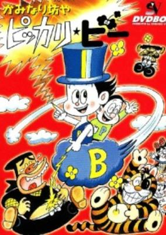

**Genres:** Comedy, Adventure, Kids

> A comedy about a mischievous boy. Each episode contains 2 stories. Based on a manga by Murotani Tsunezou.
>
> _Synopsis source: Kitsu_

[Kitsu](https://kitsu.io/anime/kaminari-boy-pikkaribee)

---

### Golden Bat

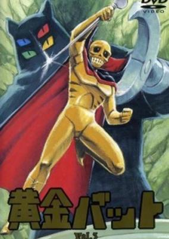

**Genres:** Science Fiction, Super Power, Action

> A golden warrior wearing a cape and a scepter, Ougon Bat was a protector spirit from Atlantis reanimated by a scientist and his friends (specially the sweet Marie) from his tomb covered in hieroglyphics. His entry was heralded by a golden bat and a sinister laugh and he would put good use of his super powers to combat the evil forces of Dr. Zero.
>
> _Synopsis source: Kitsu_

[Wikipedia](https://en.wikipedia.org/wiki/%C5%8Cgon_Bat) · [Kitsu](https://kitsu.io/anime/ougon-bat)

---

### Perman

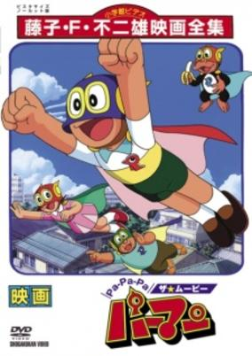

**Genres:** Elementary School, Super Power, Present, Power Suit, Japan, Science Fiction, Adventure, Comedy, Slice of Life

> After Mitsuo receives a mask from a retiring superhero, he becomes Paaman.
>
> _Synopsis source: Kitsu_

[Wikipedia](https://en.wikipedia.org/wiki/Perman#Anime) · [Kitsu](https://kitsu.io/anime/paaman)

---

### Speed Racer

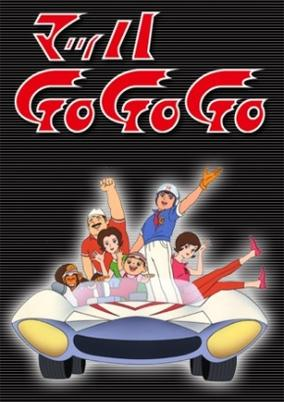

**Genres:** Action, Sports, Motorsport, Adventure

> In a world of racing and high-performance engines, Daisuke Mifune’s design of a 30,000 RPM engine still defies belief. After being refused an opportunity to construct a prototype of his dream-design, Mifune walks out of the company. Of course, this decision has a negative impact on his son, Go Mifune, and his dream of joining the company race team and becoming a professional racer. When a gang of motorcyclists attempt to steal Daisuke’s engine blueprints, Michi Shimura, Go’s girlfriend arrives to help save Daisuke’s designs. All is well and good, but now the big questions are: who is trying to steal the blueprints, and what will Daisuke do to protect his designs? Aya Mifune provides the solution when she and Go urge Daisuke to open his own business. With his ingenious designs, there should be no problem, right? Well, only if they can draw in consistent funds, but that’s not the only thing standing in the way. Mach GOGOGO flings ever more intent villains at the Mifune family, and the family must work together to ensure Daisuke’s designs are not stolen.
>
> _Synopsis source: Kitsu_

[Wikipedia](https://en.wikipedia.org/wiki/Speed_Racer) · [Kitsu](https://kitsu.io/anime/mach-gogogo)

---

### Princess Knight

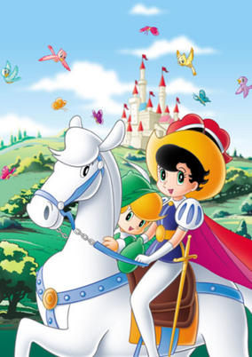

**Genres:** Romance, Fantasy World, Adventure, Action, Angel, Angst, Magic, Demon, Fantasy, Mystery

> Princess Sapphire is a girl raised as a Prince. Through the mischief of an angel, the princess is born with both a girl's body and boy's mind. Since there is no boy successor in her kingdom, Sapphire is raised as a boy, but evil ministers try to reveal her secret. Unable to put up with the kind of vicious conduct prevailing in the kingdom, Sapphire disguises herself as "Princess Knight" and wields her sword of justice. This is an animated version of the girls' manga featuring Sapphire's romance and adventure, which marked the first made-for-TV animated program geared towards girls in Japan.
>
> _Synopsis source: Kitsu_

[Wikipedia](https://en.wikipedia.org/wiki/Princess_Knight#Anime_adaptation) · [Kitsu](https://kitsu.io/anime/ribbon-no-kishi)

---

### Adventure on the Gaboten Island

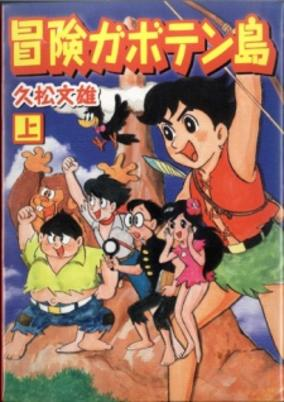

**Genres:** Adventure

> Bouken Gabotenjima is about children who are shipwrecked on a desert island.
>
> _Synopsis source: Kitsu_

[Kitsu](https://kitsu.io/anime/bouken-gabotenjima)

---

### The King Kong Show

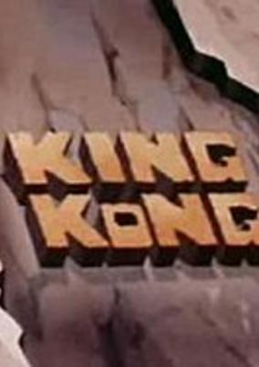

**Genres:** Anime Influenced, Action, Kids, Military

> This series is an animated adaptation of the famous movie monster King Kong with character designs by Jack Davis and Rod Willis. In this series, the giant ape befriends the Bond family, with whom he goes on various adventures, saving both them and the world from monsters, robots, aliens, mad scientists and other threats.
>
> _Synopsis source: Kitsu_

[Wikipedia](https://en.wikipedia.org/wiki/The_King_Kong_Show) · [Kitsu](https://kitsu.io/anime/the-king-kong-show)

---

### Pyun Pyun Maru

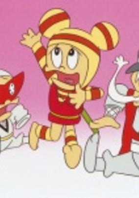

**Genres:** Ninja, Comedy, Detective, Martial Arts

> The Ninja Pyun Pyun-Maru and his brother Chibi-Maru are working at an office that accepts anything. They solve unexpected happenings caused by other Ninjas.
>
> _Synopsis source: Kitsu_

[Kitsu](https://kitsu.io/anime/pyun-pyun-maru)

---

### Don Quijote

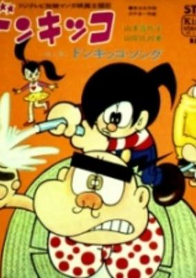

**Genres:** Comedy

> A comedy about the mischievous adventures of a young boy. Each episode contains 2 stories.
>
> _Synopsis source: Kitsu_

[Kitsu](https://kitsu.io/anime/donkikko)

---

### Adventures of the Young Shadar (Adventure Boy Shadar)

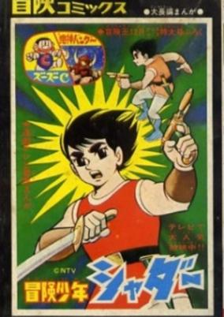

**Genres:** Horror, Adventure

> When Earth is threatened by the invading Ghostar, a young boy with nerves of steel and the strength of 50 men appears from a cave on Mount Fuji. He is Shadar, a boy of unknown origin who, with his faithful dog, Pinboke, fights to save the world.
>
> _Synopsis source: Kitsu_

[Kitsu](https://kitsu.io/anime/bouken-shounen-shadar)

---

### Yadamon the Little Monster

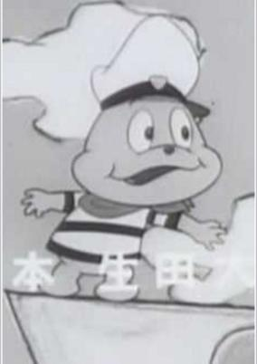

**Genres:** Comedy, Fantasy, Kids

> A comedy about a spoiled and bratty kid monster. Each episode contains 2 stories.
>
> _Synopsis source: Kitsu_

[Wikipedia](https://en.wikipedia.org/wiki/Chibikko_Kaiju_Yadamon) · [Kitsu](https://kitsu.io/anime/chibikko-kaijuu-yadamon)

---

### Skyers 5

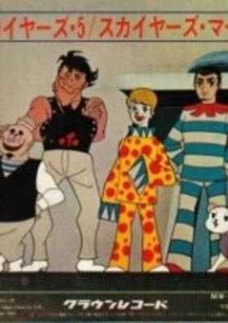

**Genres:** Adventure, Action, Crime, Science Fiction

> A science fiction action series about the future battles between a planetary police force and an international crime syndicate. The series plays out as a mix between science fiction and an old western.
>
> _Synopsis source: Kitsu_

[Wikipedia](https://en.wikipedia.org/wiki/Skyers_5) · [Kitsu](https://kitsu.io/anime/skyers-5)

---

### Gazula the Amicable Monster

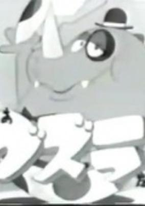

**Genres:** Comedy, Kids

> A comedy about a kind but slow-witted dragon who appears from a nearby volcanic eruption. People find Guzura quite charming and interesting as he can consume metal and change it into useful devices.
>
> _Synopsis source: Kitsu_

[Wikipedia](https://en.wikipedia.org/wiki/Guzura) · [Kitsu](https://kitsu.io/anime/tv-1967)

---

### Heidi, Girl of the Alps: Pilot Version

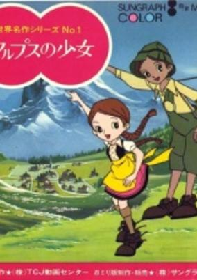

**Genres:** Comedy, Friendship, Slice of Life, Drama

> Pilot episode of the famous anime Heidi.
>
> _Synopsis source: Kitsu_

[Wikipedia](https://en.wikipedia.org/wiki/Heidi,_Girl_of_the_Alps#Production) · [Kitsu](https://kitsu.io/anime/alps-no-shoujo-heidi-pilot)

---

### The Room

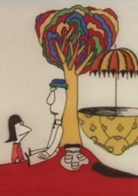

**Genres:** Music, Comedy, Romance

> Experimental short film from Yoji Kuri.
>
> _Synopsis source: Kitsu_

[Wikipedia](https://en.wikipedia.org/wiki/Y%C5%8Dji_Kuri#Selected_filmography) · [Kitsu](https://kitsu.io/anime/love-of-kemoko)

---
