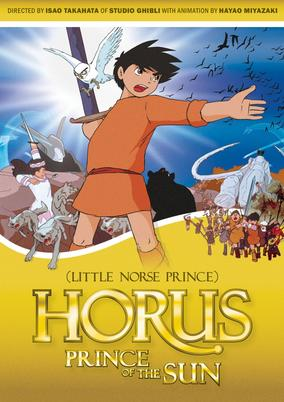
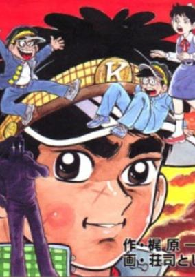

# 1968 in Anime

[← Back to index](../README.md)

23 titles · 9 with a matched synopsis/cover art · [source](https://en.wikipedia.org/wiki/1968_in_anime)

## Releases

### Spooky Kitaro

[Wikipedia](https://en.wikipedia.org/wiki/GeGeGe_no_Kitar%C5%8D#Anime)

---

### Detective Brat Pack

---

### The World of Hans Christian Andersen

**Genres:** Fantasy, Drama, Kids

> Hans Christian Andersen is a little boy with a talent for making up stories. With his skill, his friends of all species, and his positive attitude, he helps brighten the lives of the people around him. This movie contains elements of many of Andersen's tales, most prominently The Red Shoes and The Little Match Girl.
>
> _Synopsis source: Kitsu_

[Wikipedia](https://en.wikipedia.org/wiki/The_World_of_Hans_Christian_Andersen) · [Kitsu](https://kitsu.io/anime/andersen-monogatari-match-uri-no-shoujo)

---

### Star of the Giants

**Genres:** Action, Sports, Baseball

> The story is about Hyuma Hoshi, a promising young baseball pitcher who dreams of becoming a top star like his father Ittetsu Hoshi in the professional Japanese league. His father was once a 3rd baseman until he was injured in World War II and was forced to retire. The boy would join the ever popular Giants team, and soon he realized the difficulty of managing the high expectations. From the grueling training to battling the rival Mitsuru Hanagata on the Hanshin Tigers, he would have to take out his best pitching magic to step up to the challenge.
>
> _Synopsis source: Kitsu_

[Wikipedia](https://en.wikipedia.org/wiki/Star_of_the_Giants#Anime) · [Kitsu](https://kitsu.io/anime/kyojin-no-hoshi)

---

### Animal One

---

### Cyborg 009

[Wikipedia](https://en.wikipedia.org/wiki/Cyborg_009)

---

### Fight, Pyuta!

**Genres:** Comedy, Science Fiction, Action

> A young boy uses his scientific skills to fight enemies.
>
> _Synopsis source: Kitsu_

[Kitsu](https://kitsu.io/anime/fight-da-pyuta)

---

### Little Miss Akane

**Genres:** Japan, Earth, Asia, Comedy, Slice of Life, School Life

> A country girl, Akane was new to a prestigious school. She is full of vitality and everyone likes her. Hidemaro, the rich and arrogant boy likes her too. With everyone's help, she solves problems that come their way.
>
> _Synopsis source: Kitsu_

[Wikipedia](https://en.wikipedia.org/wiki/Little_Miss_Akane) · [Kitsu](https://kitsu.io/anime/akane-chan)

---

### The Monster Kid

[Wikipedia](https://en.wikipedia.org/wiki/The_Monster_Kid)

---

### The Great Adventure of Horus, Prince of the Sun (The Little Norse Prince)

**Genres:** Fantasy, Adventure, Coming Of Age, Magic, Anthropomorphism

> Horus is a boy that one day, hunted by silver wolfs, found the sword of the sun. The day his father died he left his home to find the people from the town his father told him. Together with a small bear named Koro he start the journey an run into a great adventure fighting against Grunwald and his subordinates who wants to rule the world.
>
> _Synopsis source: Kitsu_

[Wikipedia](https://en.wikipedia.org/wiki/The_Great_Adventure_of_Horus,_Prince_of_the_Sun) · [Kitsu](https://kitsu.io/anime/taiyou-no-ouji-horus-no-daibouken)

---

### Spooky Kitaro

[Wikipedia](https://en.wikipedia.org/wiki/GeGeGe_no_Kitar%C5%8D)

---

### Sasuke

---

### The Ringleader of the Sunset

**Genres:** Action

> A transfer student only just arrives and is confronted by the school gang. One by one he defeats the gang members and challenges their leader to a fight. Each 10 minute episode aired Monday through Saturday.
>
> _Synopsis source: Kitsu_

[Kitsu](https://kitsu.io/anime/yuuyake-banchou)

---

### Dokachin the Primitive Boy

**Genres:** Comedy, Kids

> When a time machine explodes, the primitive Dokachin family appears, causing mischief in the neighborhood. Each episode contains 2 stories.
>
> _Synopsis source: Kitsu_

[Wikipedia](https://en.wikipedia.org/wiki/Dokachin_the_Primitive_Boy) · [Kitsu](https://kitsu.io/anime/dokachin)

---

### Sabu & Ichi's Arrest Warrant

**Genres:** Tokugawa Period, Japan, Action, Swordplay, Detective, Martial Arts, Past, Historical, Samurai, Adventure, Slice of Life, Cops

> The series follows the adventures of Sabu, a young Edo bakufu investigator traveling with the blind master swordsman Ichi. In their travels, they assist the common people in solving mysteries and righting wrongs (usually committed by bandits or corrupt officials). Sabu is engaged to Midori, the daughter of his boss, who works as a police officer for the Tokugawa shogunate.
>
> _Synopsis source: Kitsu_

[Wikipedia](https://en.wikipedia.org/wiki/Sabu_to_Ichi_Torimono_Hikae) · [Kitsu](https://kitsu.io/anime/sabu-to-ichi-torimono-hikae)

---

### Humanoid Monster Bem

[Wikipedia](https://en.wikipedia.org/wiki/Humanoid_Monster_Bem)

---

### Tobimaru and the Nine-tailed Fox

**Genres:** Demon, Fantasy

> The film was adapted from a novel by Okamoto Kidou based on a legend surrounding a sterile patch of land at the foot of Mt. Chausu, an active volcano located in Tochigi Prefecture. Since the Heian period the spot has been known to exude poisonous gas (hydrogen sulfide, sulfur dioxide, arsenic) that has killed animals and people who happened to wander near the area. A legend arose at one time that long ago in China a kitsune transformed itself into a beautiful maiden, seduced the emperor and caused numerous misfortunes to befall the kingdom, then found her way to Japan, transformed herself into a beautiful maiden called Tamamo, and seduced the emperor etc., before finally being unmasked and killed. Upon her death she cursed her killers and transformed herself on this spot into a poisonous stone called Sesshoseki.
>
> _Synopsis source: Kitsu_

[Kitsu](https://kitsu.io/anime/kyubi-no-kitsune-to-tobimaru-sesshoseki)

---

### Genesis

[Wikipedia](https://en.wikipedia.org/wiki/List_of_Osamu_Tezuka_anime#Genesis)

---

### Dororo: Pilot Film

[Wikipedia](https://en.wikipedia.org/wiki/Dororo_(1969_TV_series)#Pilot)

---

### Love of Kemeko

[Wikipedia](https://en.wikipedia.org/wiki/Y%C5%8Dji_Kuri#Selected_filmography)

---

### Two Pikes

[Wikipedia](https://en.wikipedia.org/wiki/Y%C5%8Dji_Kuri#Selected_filmography)

---

### Breaking of Branches is Forbidden

[Wikipedia](https://en.wikipedia.org/wiki/Kihachir%C5%8D_Kawamoto#Short_films)

---

### When Grandpa Was a Pirate

[Wikipedia](https://en.wikipedia.org/wiki/Tadanari_Okamoto#Selected_filmography)

---
