# 1968 in Anime

[← Back to index](../README.md)

23 titles · 20 with a matched synopsis/cover art · [source](https://en.wikipedia.org/wiki/1968_in_anime)

## Releases

### Spooky Kitaro

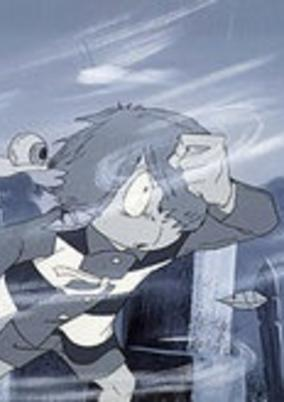

**Genres:** Earth, Contemporary Fantasy, Japan, Asia, Fantasy, Adventure, Horror, Comedy

> A retelling of episodes 5-6 from the 1968 TV anime.
>
> _Synopsis source: Kitsu_

[Wikipedia](https://en.wikipedia.org/wiki/GeGeGe_no_Kitar%C5%8D#Anime) · [Kitsu](https://kitsu.io/anime/gegege-no-kitarou-1968-movie)

---

### Detective Brat Pack

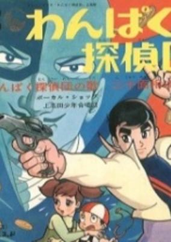

**Genres:** Action, Mystery

> A group of young boys (plus a token girl and her little brother, the obligatory brat) form a detective club, pooling their talents for brain, brawn, invention, and driving skills to solve crimes in Tokyo. Much to the consternation of police chief Nakamura, they often succeed where the professionals fail.
>
> _Synopsis source: Kitsu_

[Kitsu](https://kitsu.io/anime/wanpaku-tanteidan)

---

### The World of Hans Christian Andersen

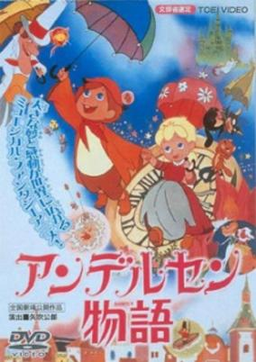

**Genres:** Fantasy, Drama, Kids

> Hans Christian Andersen is a little boy with a talent for making up stories. With his skill, his friends of all species, and his positive attitude, he helps brighten the lives of the people around him. This movie contains elements of many of Andersen's tales, most prominently The Red Shoes and The Little Match Girl.
>
> _Synopsis source: Kitsu_

[Wikipedia](https://en.wikipedia.org/wiki/The_World_of_Hans_Christian_Andersen) · [Kitsu](https://kitsu.io/anime/andersen-monogatari-match-uri-no-shoujo)

---

### Star of the Giants

**Genres:** Action, Sports, Baseball

> The story is about Hyuma Hoshi, a promising young baseball pitcher who dreams of becoming a top star like his father Ittetsu Hoshi in the professional Japanese league. His father was once a 3rd baseman until he was injured in World War II and was forced to retire. The boy would join the ever popular Giants team, and soon he realized the difficulty of managing the high expectations. From the grueling training to battling the rival Mitsuru Hanagata on the Hanshin Tigers, he would have to take out his best pitching magic to step up to the challenge.
>
> _Synopsis source: Kitsu_

[Wikipedia](https://en.wikipedia.org/wiki/Star_of_the_Giants#Anime) · [Kitsu](https://kitsu.io/anime/kyojin-no-hoshi)

---

### Animal One

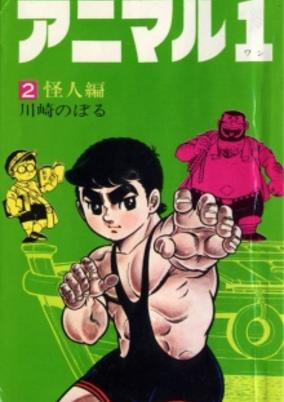

**Genres:** Sports

> Ichirou Azuma, a young amateur wrestler, wants to participate in the Olympics Games in Mexico.
>
> _Synopsis source: Kitsu_

[Kitsu](https://kitsu.io/anime/animal-1)

---

### Cyborg 009

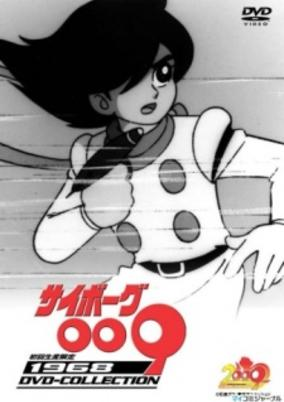

**Genres:** Cyborg, Mecha, Action, Science Fiction, Adventure

> They fight against evil, they help those in need, they're the Cyborg fighters! Together with the scientist Dr. Gilmore, this team of nine cyborgs use their special body modifications to fight against a seemingly endless barrage of enemies, including robotic crabs, aliens, and fellow cyborgs. Each cyborg has his own special power, which they use in their fight against evil. Titular character 009 (aka Hurricane Joe, the famous race car driver) leads the team with his superhuman strength, resistance to bullets, and ability to accelerate through time. His teammates fight by his side to save humanity from falling into evil hands. The team in Cyborg 009 faces many enemies and stops countless threats to their hometown, and even to Earth. No matter what, justice will be served.
>
> _Synopsis source: Kitsu_

[Wikipedia](https://en.wikipedia.org/wiki/Cyborg_009) · [Kitsu](https://kitsu.io/anime/cyborg-009)

---

### Fight, Pyuta!

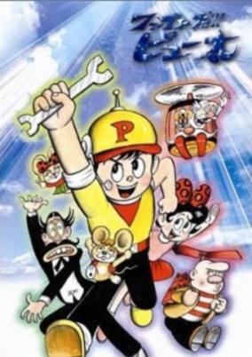

**Genres:** Comedy, Science Fiction, Action

> A young boy uses his scientific skills to fight enemies.
>
> _Synopsis source: Kitsu_

[Kitsu](https://kitsu.io/anime/fight-da-pyuta)

---

### Little Miss Akane

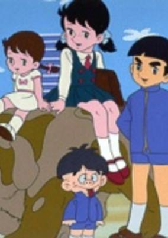

**Genres:** Japan, Earth, Asia, Comedy, Slice of Life, School Life

> A country girl, Akane was new to a prestigious school. She is full of vitality and everyone likes her. Hidemaro, the rich and arrogant boy likes her too. With everyone's help, she solves problems that come their way.
>
> _Synopsis source: Kitsu_

[Wikipedia](https://en.wikipedia.org/wiki/Little_Miss_Akane) · [Kitsu](https://kitsu.io/anime/akane-chan)

---

### The Monster Kid

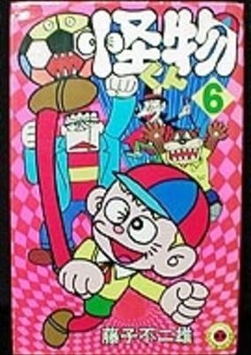

**Genres:** Fantasy, Horror, Comedy

> The prince of Kaibutsu Land, Kaibutsu-kun, decides to go to the human world as part of his training to become the King.
>
> _Synopsis source: Kitsu_

[Wikipedia](https://en.wikipedia.org/wiki/The_Monster_Kid) · [Kitsu](https://kitsu.io/anime/kaibutsu-kun)

---

### The Great Adventure of Horus, Prince of the Sun

[Wikipedia](https://en.wikipedia.org/wiki/The_Great_Adventure_of_Horus,_Prince_of_the_Sun)

---

### Spooky Kitaro

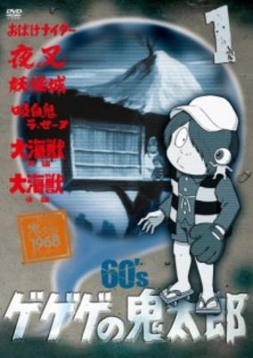

**Genres:** Present, Contemporary Fantasy, Japan, Fantasy, Adventure, Horror, Comedy

> Kitarou, a ghost, spends his afterlife helping humans in need of his skills. He thwarts the plans of evil spirits who live to torment humanity.
>
> _Synopsis source: Kitsu_

[Wikipedia](https://en.wikipedia.org/wiki/GeGeGe_no_Kitar%C5%8D) · [Kitsu](https://kitsu.io/anime/gegege-no-kitarou-1968)

---

### Sasuke

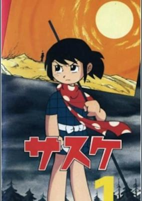

**Genres:** Martial Arts, Historical, Action

> Sasuke is the son of a very skilled ninja, whose name is Ozaru. After the defeat of their lord, Yukimura Sanada, Tokugawa's and Hattori's ninjas begin to persecute all their enemies still alive: that means Ozaru and Sasuke must leave their house and start a violent struggle for their own life. Danger, vengeance, anger, loyalty, pain are the basic elements of this story, where the worst aspects of the human soul are described together with the growth of the main character, the young Sasuke.
>
> _Synopsis source: Kitsu_

[Kitsu](https://kitsu.io/anime/sasuke)

---

### The Ringleader of the Sunset

---

### Dokachin the Primitive Boy

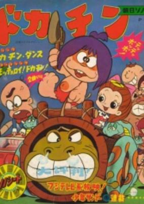

**Genres:** Comedy, Kids

> When a time machine explodes, the primitive Dokachin family appears, causing mischief in the neighborhood. Each episode contains 2 stories.
>
> _Synopsis source: Kitsu_

[Wikipedia](https://en.wikipedia.org/wiki/Dokachin_the_Primitive_Boy) · [Kitsu](https://kitsu.io/anime/dokachin)

---

### Sabu & Ichi's Arrest Warrant

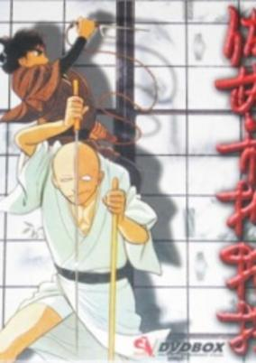

**Genres:** Tokugawa Period, Japan, Action, Swordplay, Detective, Martial Arts, Past, Historical, Samurai, Adventure, Slice of Life, Cops

> The series follows the adventures of Sabu, a young Edo bakufu investigator traveling with the blind master swordsman Ichi. In their travels, they assist the common people in solving mysteries and righting wrongs (usually committed by bandits or corrupt officials). Sabu is engaged to Midori, the daughter of his boss, who works as a police officer for the Tokugawa shogunate.
>
> _Synopsis source: Kitsu_

[Wikipedia](https://en.wikipedia.org/wiki/Sabu_to_Ichi_Torimono_Hikae) · [Kitsu](https://kitsu.io/anime/sabu-to-ichi-torimono-hikae)

---

### Humanoid Monster Bem

[Wikipedia](https://en.wikipedia.org/wiki/Humanoid_Monster_Bem)

---

### Tobimaru and the Nine-tailed Fox

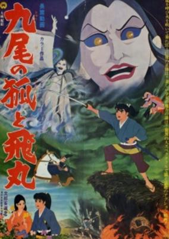

**Genres:** Demon, Fantasy

> The film was adapted from a novel by Okamoto Kidou based on a legend surrounding a sterile patch of land at the foot of Mt. Chausu, an active volcano located in Tochigi Prefecture. Since the Heian period the spot has been known to exude poisonous gas (hydrogen sulfide, sulfur dioxide, arsenic) that has killed animals and people who happened to wander near the area. A legend arose at one time that long ago in China a kitsune transformed itself into a beautiful maiden, seduced the emperor and caused numerous misfortunes to befall the kingdom, then found her way to Japan, transformed herself into a beautiful maiden called Tamamo, and seduced the emperor etc., before finally being unmasked and killed. Upon her death she cursed her killers and transformed herself on this spot into a poisonous stone called Sesshoseki.
>
> _Synopsis source: Kitsu_

[Kitsu](https://kitsu.io/anime/kyubi-no-kitsune-to-tobimaru-sesshoseki)

---

### Genesis (The Genesis)

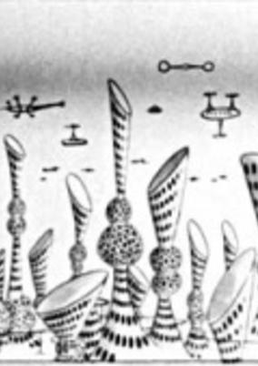

**Genres:** Parody

> This is a short film parodying the major Hollywood film "The Creation" directed by John Houston. This film has the look of a tongue-in-cheek production, done on a small budget by animators who wanted to make fun of great works that cost enormous sums of money.
>
> _Synopsis source: Kitsu_

[Wikipedia](https://en.wikipedia.org/wiki/List_of_Osamu_Tezuka_anime#Genesis) · [Kitsu](https://kitsu.io/anime/souseiki)

---

### Dororo: Pilot Film

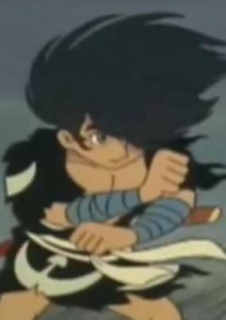

**Genres:** Action

> Before producing a TV series, a pilot film was made to let sponsors and television stations grasp the work's pervasive quality. This is the pilot film for "Dororo" in which the characters are closer to those of the original story compared to the characters in the TV series. The faces and personalities of the characters in the TV series are altered from time to time to gain popularity among its viewers. As a result, sometimes viewers really loved it, but at other times it didn't go over as well. The pilot for "Dororo" was made in color, but the TV series was monochrome due to a tighter budget. The story depicts a journey in which the boy thief named Dororo and a cursed man called Hyakkimaru destroy monsters. Hyakkimaru can be a complete "human" only after he destroys 48 devils.
>
> _Synopsis source: Kitsu_

[Wikipedia](https://en.wikipedia.org/wiki/Dororo_(1969_TV_series)#Pilot) · [Kitsu](https://kitsu.io/anime/dororo-pilot)

---

### Love of Kemeko

**Genres:** Music, Comedy, Romance

> Experimental short film from Yoji Kuri.
>
> _Synopsis source: Kitsu_

[Wikipedia](https://en.wikipedia.org/wiki/Y%C5%8Dji_Kuri#Selected_filmography) · [Kitsu](https://kitsu.io/anime/love-of-kemoko)

---

### Two Pikes

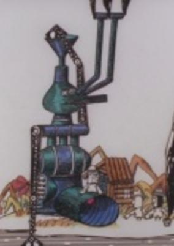

**Genres:** Island, Comedy

> The international version of Ni-hiki no Sanma that is colored, redrawn, and edited.
>
> _Synopsis source: Kitsu_

[Wikipedia](https://en.wikipedia.org/wiki/Y%C5%8Dji_Kuri#Selected_filmography) · [Kitsu](https://kitsu.io/anime/ni-hiki-no-sanma-1968)

---

### Breaking of Branches is Forbidden (The Breaking of Branches is Forbidden)

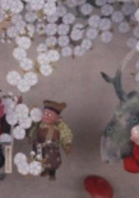

**Genres:** Comedy

> The head monk orders a young acolyte to guard a beautiful cherry tree in the monastery garden while he goes out. But the older man underestimates his colleague’s fondness for sake. As it so happens, a samurai warrior and his servant decide to have a picnic feast in the same garden under the blossoming tree. The acolyte refuses to let them in, but when he smells their sake, his determination is put to the test.... Made in 1968, director Kawamoto’s first puppet film is a moral tale about a disciple who was justly punished for a momentary lapse.
>
> _Synopsis source: Kitsu_

[Wikipedia](https://en.wikipedia.org/wiki/Kihachir%C5%8D_Kawamoto#Short_films) · [Kitsu](https://kitsu.io/anime/hanaori)

---

### When Grandpa Was a Pirate

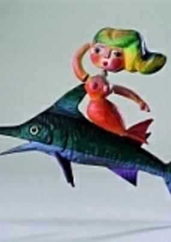

**Genres:** Comedy

> Puppet animation by Tadanari Okamoto.
>
> _Synopsis source: Kitsu_

[Wikipedia](https://en.wikipedia.org/wiki/Tadanari_Okamoto#Selected_filmography) · [Kitsu](https://kitsu.io/anime/ojii-chan-ga-kaizoku-datta-koro)

---
