# 1969 in Anime

[← Back to index](../README.md)

29 titles · 20 with a matched synopsis/cover art · [source](https://en.wikipedia.org/wiki/1969_in_anime)

## Releases

### Space Journey: The First Dream of Wonder-kun

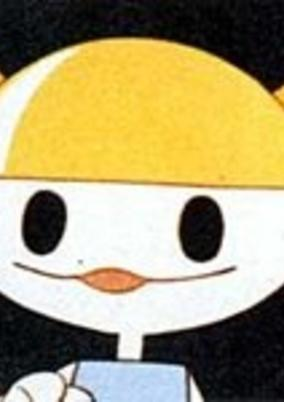

**Genres:** Adventure

> This is the story of a friendship between a boy named Taro and the mysterious Wonder-kun, using "the first dream of the New Year" as a motif. This work, also combining camera-shot scenes and animation, was broadcast by NHK for kids staying at home watching TV over the New Year holidays. Guided by Wonder-kun, Taro departs on a space trip searching for adventure. (Source: Official Site}
>
> _Synopsis source: Kitsu_

[Kitsu](https://kitsu.io/anime/wonder-kun-no-hatsu-yume-uchuu-ryokou)

---

### The Secrets of Akko-chan (Secrets of Akko-chan)

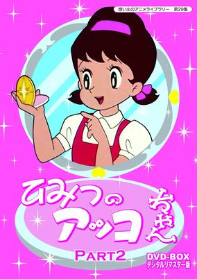

**Genres:** Japan, Magic, Magical Girl, Present, School Life

> Atsuko "Akko-chan" Kagami (known variously as "Stilly," "Caroline," or "Julie" in Western versions of the anime) is an energetic elementary school girl who has an affinity for mirrors. One day, her favorite mirror which was given to Akko by her mother (or in some versions, by her father, as a present from India) is broken, and she prefers to bury it in her yard rather than throw it to the trash can. In her dreams, she is contacted by a spirit (or in some cases the Queen of the Mirror Kingdom) who is moved that the little girl would treat the mirror so respectfully and not simply throw it away. Akko-chan is then given the gift of a magical mirror and taught an enchantment that will allow her to transform into anything she wishes.
>
> _Synopsis source: Kitsu_

[Wikipedia](https://en.wikipedia.org/wiki/Himitsu_no_Akko-chan) · [Kitsu](https://kitsu.io/anime/himitsu-no-akko-chan)

---

### Marine Boy

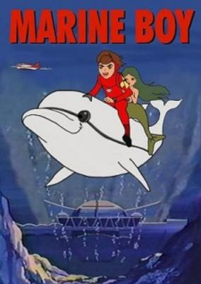

**Genres:** Mecha, Adventure, Action, Science Fiction, Kids

> Yet another expansion of the Marine Boy series. This time 65 episodes were added to the 1966 series and all 78 episodes were sold to the US. The broadcast history of the show in Japan was slightly more complicated, with only the first 36 episodes of the 78 shown at first but later on all 78 were shown, out of which 65 are contained in this entry and 13 in the Ganbare! Marine Kid series.
>
> _Synopsis source: Kitsu_

[Wikipedia](https://en.wikipedia.org/wiki/Marine_Boy) · [Kitsu](https://kitsu.io/anime/kaitei-shounen-marine)

---

### Till a City Beneath the Sea is Built

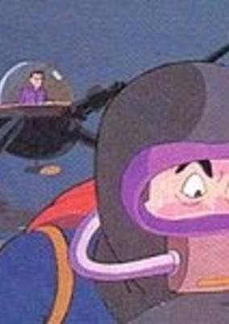

**Genres:** Science Fiction

[Kitsu](https://kitsu.io/anime/kaitei-toshi-no-dekiru-made)

---

### The Wonderful World of Puss 'n Boots

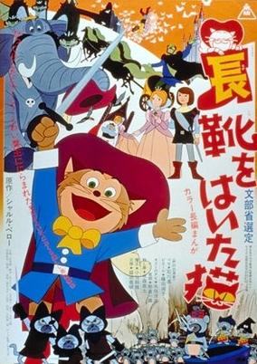

**Genres:** Fantasy, Adventure, Kids

> A comic adaptation of Charles Perrault's classic fairy tale about a clever musketeer feline in boots. His goal is to help the weak and defenseless, but his saving a mouse makes him the most wanted in all Catdom. On the run from the notorious Three Blunderers, Perro befriends a young miller's boy, Pierre, and together, they decide to seek their fame and fortune. When they cross paths with the lovely Princess Rosa, Perro determines to get Pierre hitched to Her Royal Highness. But the wicked ogre, Lucifer, also has his sights on Rosa. Nonetheless, with the help of a band of comic mice thieves, Perro manages to get Pierre to become engaged to Rosa. But on the night of the full moon, Lucifer kidnaps the princess, and Pierre, Perro, and the mice bandits set off to rescue her.
>
> _Synopsis source: Kitsu_

[Wikipedia](https://en.wikipedia.org/wiki/The_Wonderful_World_of_Puss_%27n_Boots) · [Kitsu](https://kitsu.io/anime/nagagutsu-wo-haita-neko)

---

### Freckled Pucchi

---

### Denka the Dried Plum

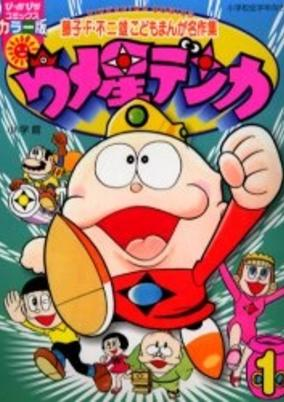

**Genres:** Comedy, Slice of Life

> The goofy tales of a king and his family who make their way to Earth after their planet explodes.
>
> _Synopsis source: Kitsu_

[Kitsu](https://kitsu.io/anime/umeboshi-denka)

---

### Judo Boy

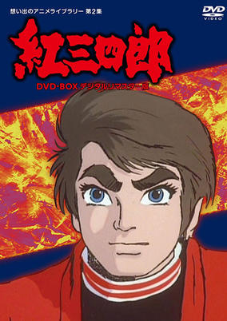

**Genres:** Action, Combat, Sports, Martial Arts

> Young Sanshiro Kurenai is the proud heir of a judo dojo. One day, he finds his beloved father dead and a glass eye not too far from the corpse. Ready to avenge his father and take his honour back, Sanshiro and his friend Ken start searching for the mysterious one-eyed murderer...
>
> _Synopsis source: Kitsu_

[Wikipedia](https://en.wikipedia.org/wiki/Judo_Boy) · [Kitsu](https://kitsu.io/anime/kurenai-sanshiro)

---

### Furious Ataro

[Wikipedia](https://en.wikipedia.org/wiki/M%C5%8Dretsu_Atar%C5%8D)

---

### Dororo and Hyakkimaru

[Wikipedia](https://en.wikipedia.org/wiki/Dororo_(1969_TV_series))

---

### The Chronicles of Kamui the Ninja

[Wikipedia](https://en.wikipedia.org/wiki/Kamui_(1964_manga)#Adaptations)

---

### Six Broken Laws

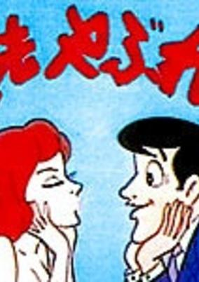

**Genres:** Slice of Life

> Short stories featuring the legal profession. The first anime to be broadcast on the new Nagoya Television Network (NTV). Based on a story by Saga Sen.
>
> _Synopsis source: Kitsu_

[Kitsu](https://kitsu.io/anime/roppou-yabure-kun)

---

### A Thousand and One Nights

[Wikipedia](https://en.wikipedia.org/wiki/A_Thousand_and_One_Nights_(1969_film))

---

### Flying Phantom Ship

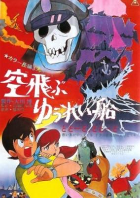

**Genres:** Science Fiction, Mecha, Japan, Adventure, Action

> Hayato's city is devastated by a giant robot, his parents are killed in the massacre. The only friend left to him is his dog Jack, the only things left are mom's shoe and a picture of a man and a woman who, as his father tells him on his deathbed, are his real parents. Now Hayato wants revenge on the one who is said to have sent the robot: the terrible Ghost Ship which threatens ships and is rumored to wish to exterminate everything. But then Hayato stumbles on a secret underground factory of Mr. Kurosio, owner of mostly everything in the city - and realizes things are not as Mr. Kurosio has been telling him... Someone terrible lives in a castle under the sea... Hayato is trying to tell people the truth - but his life is now in danger by from the one who does not wish to be known. Then Hayato is saved by no other than the captain of the Ghost Ship... Hayato is about to uncover more than the one secret he has been searching for.
>
> _Synopsis source: Kitsu_

[Wikipedia](https://en.wikipedia.org/wiki/Flying_Phantom_Ship) · [Kitsu](https://kitsu.io/anime/sora-tobu-yuurei-sen)

---

### Star of the Giants: The Bloody Finals

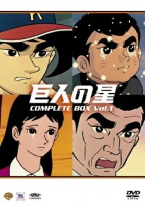

**Genres:** Action, Sports, Baseball

> The story is about Hyuma Hoshi, a promising young baseball pitcher who dreams of becoming a top star like his father Ittetsu Hoshi in the professional Japanese league. His father was once a 3rd baseman until he was injured in World War II and was forced to retire. The boy would join the ever popular Giants team, and soon he realized the difficulty of managing the high expectations. From the grueling training to battling the rival Mitsuru Hanagata on the Hanshin Tigers, he would have to take out his best pitching magic to step up to the challenge.
>
> _Synopsis source: Kitsu_

[Wikipedia](https://en.wikipedia.org/wiki/Star_of_the_Giants#Movies) · [Kitsu](https://kitsu.io/anime/kyojin-no-hoshi)

---

### Pinch & Punch

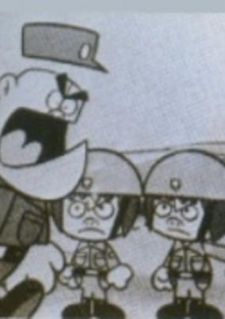

**Genres:** Comedy

> A comedy about two goofy twins in the armed forces.
>
> _Synopsis source: Kitsu_

[Kitsu](https://kitsu.io/anime/pinch-to-punch)

---

### The Ideal Man Boy's Gang Leader

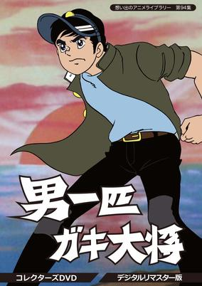

**Genres:** Drama, Action, Shounen, Violence, Middle School, Friendship, Adventure

> TV anime adaptation of Motomiya Hiroshi's manga "Otoko Ippiki Gaki Daishou" about young gang leader and all the trouble and fights his gang gets into, serialized in Weekly Shonen Jump.
>
> _Synopsis source: Kitsu_

[Kitsu](https://kitsu.io/anime/otoko-ippiki-gaki-daishou)

---

### Tiger Mask

**Genres:** Wrestling, Action, Sports, Martial Arts

> Tiger Mask (whose real name was Naoto Date) was a feared heel wrestler in America who was extremely vicious in the ring. However, he became a face after returning to Japan when a young boy said that he wanted to be a villain like Tiger Mask when he grew up. The boy resided in an orphanage, the same one that Tiger Mask grew up in during his childhood. Feeling that he did not want the boy to idolize a villain, Tiger was inspired to be a heroic wrestler. The main antagonist in the manga and anime was Tiger's Cave, a mysterious organization that trained young people to be villainous heel wrestlers on the condition that they gave half of their earnings to the organization. Tiger Mask was once a member of Tiger's Cave under the name "Yellow Devil", but no longer wanted anything to do with them, instead donating his money to the orphanage. This infuriated the leader of the organization and he sent numerous assassins, including other professional wrestlers, to punish him.
>
> _Synopsis source: Kitsu_

[Wikipedia](https://en.wikipedia.org/wiki/Tiger_Mask) · [Kitsu](https://kitsu.io/anime/tiger-mask)

---

### Moomin

[Wikipedia](https://en.wikipedia.org/wiki/Moomin_(1969_TV_series))

---

### The Genie Family (Bob in the Bottle)

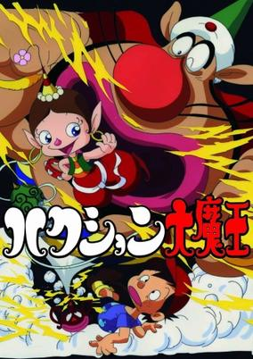

**Genres:** Comedy, Magic, Fantasy, Kids, Supernatural

> One day Kan-chan finds a magic bottle in the attic. Whenever someone sneezes, a genie named Hakushon Daimaou is brought out and must grant any wish of whoever sneezed until he or she sneezes again. Sometimes, however, he accidentally fails and only causes trouble instead of granting any wishes.
>
> _Synopsis source: Kitsu_

[Wikipedia](https://en.wikipedia.org/wiki/The_Genie_Family) · [Kitsu](https://kitsu.io/anime/hakushon-daimaou)

---

### Sazae (Mrs. Sazae)

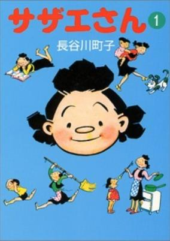

**Genres:** Slice of Life, Comedy

> The main character is a mother named Sazae-san. She lives in a house with her husband, her kids and her parents. The show is the ultimate family program and tends to follow traditional themes. Think of this show as the Japanese equivalent to "The Partridge Family" and you'll get a good feel for this show's atmosphere. Don't expect to see things like violence, swearing, kung-fu action or magical girls. The plots are more like "Today, Sazae-san goes to the new mall and gets lost". Such "boring" plotlines and the simplistic art are often a turn-off to non-Japanese audiences, but most Japanese find the show incredibly good. As a result, it continues to be one of the top ratings grabbers on TV and is one of the few anime that is considered "acceptable" by adults.
>
> _Synopsis source: Kitsu_

[Wikipedia](https://en.wikipedia.org/wiki/Sazae-san) · [Kitsu](https://kitsu.io/anime/sazae-san)

---

### (Secret) Gekiga Ukiyo-e Thousand and One Nights

---

### Attack No. 1

**Genres:** Earth, Japan, Action, Sports, Asia, Volleyball, School Life

> Kozue is a highschool girl and enthusiastic volleyball player. Her dream is to play in the Japanese national volleyball team. During the series she makes it from the school district league up to the Japanese volleyball finals, step by step till the international volleyball championship. But the faster and higher Kozue climbs the career ladder up, the more she gets confronted with the dark side of success: too high expectations, self-conceit and envy are progressing towards serious problems.
>
> _Synopsis source: Kitsu_

[Wikipedia](https://en.wikipedia.org/wiki/Attack_No._1) · [Kitsu](https://kitsu.io/anime/attack-no-1)

---

### Star of the Giants: Go Go Hyūma

**Genres:** Action, Sports, Baseball

> The story is about Hyuma Hoshi, a promising young baseball pitcher who dreams of becoming a top star like his father Ittetsu Hoshi in the professional Japanese league. His father was once a 3rd baseman until he was injured in World War II and was forced to retire. The boy would join the ever popular Giants team, and soon he realized the difficulty of managing the high expectations. From the grueling training to battling the rival Mitsuru Hanagata on the Hanshin Tigers, he would have to take out his best pitching magic to step up to the challenge.
>
> _Synopsis source: Kitsu_

[Wikipedia](https://en.wikipedia.org/wiki/Star_of_the_Giants#Movies) · [Kitsu](https://kitsu.io/anime/kyojin-no-hoshi)

---

### Tomorrow's Joe: Pilot Film (Tomorrow's Joe)

**Genres:** Boxing, Combat, Sports, Asia, Action, Past, Japan, Violence

> Joe, a teenage orphan in the slums of the Doya streets, meets Danpei, a homeless, alcoholic ex-boxing coach. Danpei, seeing Joe's boxing talent, decides to train him. When Joe is sent to a terrible juvenile home for petty crimes, he meets Rikiishi who becomes his boxing rival. Danpei arrives at the home to help Joe to train in order to defeat Rikiishi. When Joe decides to seriously pursue boxing, Danpei cannot get a coaching license because of his reputation as a drunk.
>
> _Synopsis source: Kitsu_

[Wikipedia](https://en.wikipedia.org/wiki/Ashita_no_Joe#Anime_series) · [Kitsu](https://kitsu.io/anime/ashita-no-joe)

---

### Dona, Dona

[Wikipedia](https://en.wikipedia.org/wiki/Dona,_Dona#Other_versions)

---

### Lupin the Third: Pilot Film

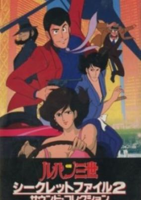

**Genres:** Action, Earth, Thievery, Comedy, Gunfights, Crime, Slapstick, Present

> Two years after the birth of the manga a pilot film was released. It was a brief film of only 13 minutes that had the purpose of assay the response to a possible future anime realization of Lupin III. The pilot opens with a challenge call from Lupin to Zenigata from a public phone. Previously unreleased remastered TV version of this pilot from a year 1971 was released in 1989. It was included on the Lupin III - Secret File OVA.
>
> _Synopsis source: Kitsu_

[Kitsu](https://kitsu.io/anime/lupin-iii-pilot-film)

---

### Tragedy on the G Line

[Wikipedia](https://en.wikipedia.org/wiki/Y%C5%8Dji_Kuri)

---

### 44 Cats

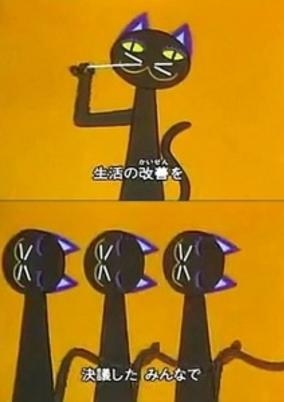

**Genres:** Music, Kids

> The Japanese version of the 1968 '44 Gatti,' an Italian song from the TV program Zecchino D'Oro. It was introduced in the Japanese NHK TV program 'Minna no Uta' in 1969.
>
> _Synopsis source: Kitsu_

[Kitsu](https://kitsu.io/anime/forty-four-hiki-no-neko)

---
