# 1970 in Anime

[← Back to index](../README.md)

28 titles · 23 with a matched synopsis/cover art · [source](https://en.wikipedia.org/wiki/1970_in_anime)

## Releases

### Nobody's Boy

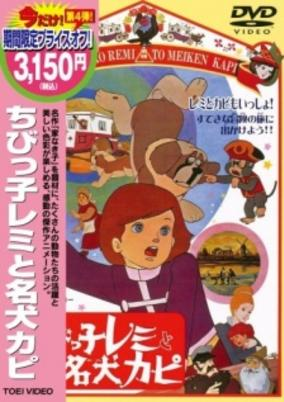

**Genres:** Slice of Life, Drama, Adventure

> Based on Sans Famille by Hector Malot. This is a faithful if compressed adaptation, telling the story of Remi who is sold off to Vitalis the travelling musician and his band of performing animals. It has musical numbers typical this era of Toei films, some awkward slapstic, plenty of scenes tailored to pull on the heartstrings, and very smooth animation. Overall a pleasant film that's interesting to watch for the technical aspects; but the story leaves much to be desired, being on the melodramatic-maudlin side. The later Dezaki/Sugino version is very different, with 52 episodes for the story to breathe in and far more compelling storytelling.
>
> _Synopsis source: Kitsu_

[Wikipedia](https://en.wikipedia.org/wiki/Chibikko_Remi_to_Meiken_Kapi) · [Kitsu](https://kitsu.io/anime/chibikko-remi-to-meiken-kapi)

---

### Tiger Mask

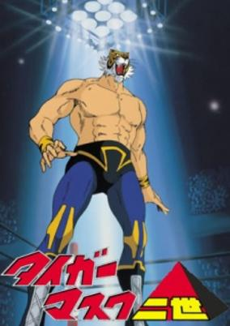

**Genres:** Wrestling, Action, Sports, Martial Arts

> Tiger Mask (whose real name was Naoto Date) was a feared heel wrestler in America who was extremely vicious in the ring. However, he became a face after returning to Japan when a young boy said that he wanted to be a villain like Tiger Mask when he grew up. The boy resided in an orphanage, the same one that Tiger Mask grew up in during his childhood. Feeling that he did not want the boy to idolize a villain, Tiger was inspired to be a heroic wrestler. The main antagonist in the manga and anime was Tiger's Cave, a mysterious organization that trained young people to be villainous heel wrestlers on the condition that they gave half of their earnings to the organization. Tiger Mask was once a member of Tiger's Cave under the name "Yellow Devil", but no longer wanted anything to do with them, instead donating his money to the orphanage. This infuriated the leader of the organization and he sent numerous assassins, including other professional wrestlers, to punish him.
>
> _Synopsis source: Kitsu_

[Wikipedia](https://en.wikipedia.org/wiki/Tiger_Mask#Adaptations) · [Kitsu](https://kitsu.io/anime/tiger-mask)

---

### Star of the Giants: Big League Ball

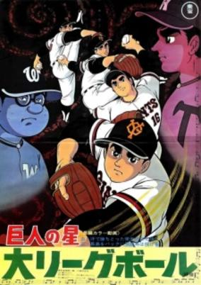

**Genres:** Baseball, Sports

> Third Kyojin no Hoshi movie.
>
> _Synopsis source: Kitsu_

[Wikipedia](https://en.wikipedia.org/wiki/Star_of_the_Giants#Movies) · [Kitsu](https://kitsu.io/anime/kyojin-no-hoshi-dai-league-ball)

---

### Attack No. 1: The Movie

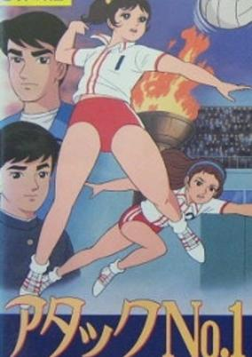

**Genres:** Volleyball, Sports

> Kozue is a high school girl and an enthusiastic volleyball player. Her dream is to play on the Japanese national volleyball team. Over the course of the series she makes it from the school district league up to the Japanese volleyball finals, step by step until the international volleyball championship. But the faster and higher Kozue climbs, the more she is confronted with the dark side of success: too-high expectations, self-conceit, and envy.
>
> _Synopsis source: Kitsu_

[Wikipedia](https://en.wikipedia.org/wiki/Attack_No.1#Movies) · [Kitsu](https://kitsu.io/anime/attack-no-1-1970)

---

### The Gentle Lion

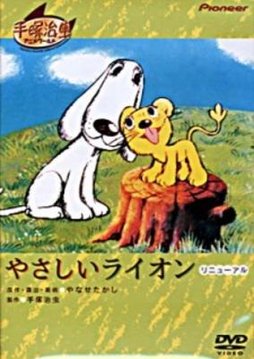

**Genres:** Music, Fantasy, Kids

> This is an animated version of Yanase Takashi's picture book featuring the friendship between a mother dog, Muku-muku, who lost her puppy, and the baby lion Buru-buru, who lost her mother. Although Tezuka Osamu planned to create an entire musical animated series for this story focused on the feelings of the mother dog and baby lion, this animated production was the only one never completed.
>
> _Synopsis source: Kitsu_

[Kitsu](https://kitsu.io/anime/yasashii-lion)

---

### Animal Village Stories

---

### Chippo the Mischievous Angel

---

### Tomorrow's Joe

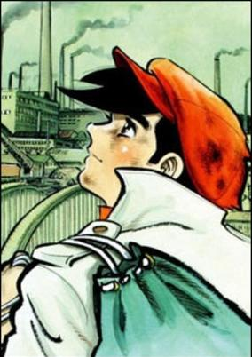

**Genres:** Boxing, Combat, Sports, Asia, Action, Past, Japan, Violence

> Joe, a teenage orphan in the slums of the Doya streets, meets Danpei, a homeless, alcoholic ex-boxing coach. Danpei, seeing Joe's boxing talent, decides to train him. When Joe is sent to a terrible juvenile home for petty crimes, he meets Rikiishi who becomes his boxing rival. Danpei arrives at the home to help Joe to train in order to defeat Rikiishi. When Joe decides to seriously pursue boxing, Danpei cannot get a coaching license because of his reputation as a drunk.
>
> _Synopsis source: Kitsu_

[Wikipedia](https://en.wikipedia.org/wiki/Ashita_no_Joe) · [Kitsu](https://kitsu.io/anime/ashita-no-joe)

---

### Goro the Terrible

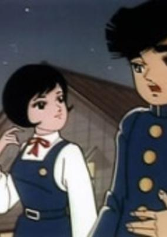

**Genres:** Japan, Sports, Comedy, School Clubs, School Life

> The non-athletic head of the school newspaper department participates in various club activities, including a number of sports clubs, with disastrously hilarious results.
>
> _Synopsis source: Kitsu_

[Kitsu](https://kitsu.io/anime/bakuhatsu-goro)

---

### Fun Anime Theater

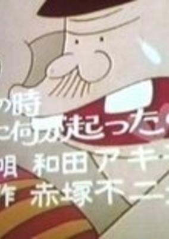

**Genres:** Comedy

> Based on the original story by Studio Zero.
>
> _Synopsis source: Kitsu_

[Kitsu](https://kitsu.io/anime/otanoshimi-anime-gekijou)

---

### The Adventures of Hutch the Honeybee

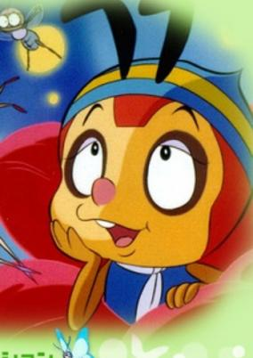

**Genres:** Plot Continuity, Adventure, Comedy, Anthropomorphism

> Hutch is a small honeybee who got separated from his mom when his home was destroyed by invading wasps, and he now desperately wants to find her back. It's the beginning of an adventure that will make him meet all kinds of friendly insects who try to help him out, but unfortunately for most of them, they will not survive the end of the episode...
>
> _Synopsis source: Kitsu_

[Wikipedia](https://en.wikipedia.org/wiki/The_Adventures_of_Hutch_the_Honeybee) · [Kitsu](https://kitsu.io/anime/konchuu-monogatari-minashigo-hutch)

---

### The Dark Red Eleven

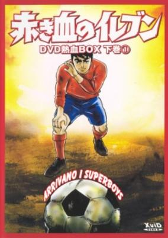

**Genres:** Japan, Sports, Soccer, Coming Of Age, High School, School Life, Plot Continuity, Present

> At Shinsei high school, soccer is almost a combat sport and new team coach Teppei Matsuki is a fully paid up sadist who will push his team as hard as necessary to win. Headstrong school bad boy Shingo Tamai and his friend Ohira are determined not to be bullied into joining Matsuki's team; instead they set up a squad of their own, and at first play just for fun and struggle to keep up with Matsuki's team. As their skills progress, they play other teams and get stronger and craftier, until they face the crack Asakase high school squad and its star player Misugi Yan in the schools' final. In a tangle of subplots involving old rivalries and injuries, and a mixed-race player seeking his identity and his lost mother (who turns out to be in jail), Shingo develops his skills as a center forward and looks forward to playing a visiting Brazilian squad. He is seriously injured in a game, but his talent, which even the legendary Brazilian Pele recognizes, is equaled by his determination. With the help of a friend of his old rival Matsuki, he recovers to help the team to victory. Definitely melodrama rather than a sports series proper, this is the first in the line of Japanese soccer soaps that stretches to Captain Tsubasa and beyond. Based on a manga by Ikki Kajiwara and Kosei Sonoda.
>
> _Synopsis source: Kitsu_

[Wikipedia](https://en.wikipedia.org/wiki/Akakichi_no_Eleven) · [Kitsu](https://kitsu.io/anime/akakichi-no-eleven)

---

### Tiger Mask: War Against the League of Masked Wrestlers

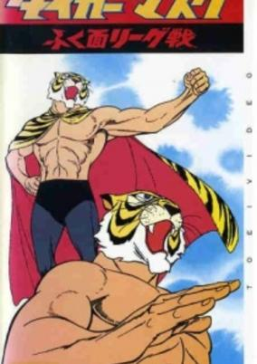

**Genres:** Wrestling, Sports

> Summary of episode 23 to 26.
>
> _Synopsis source: Kitsu_

[Wikipedia](https://en.wikipedia.org/wiki/Tiger_Mask#Adaptations) · [Kitsu](https://kitsu.io/anime/tiger-mask-fuku-men-league-sen)

---

### 30,000 Miles Under the Sea

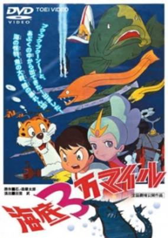

**Genres:** Science Fiction, Mecha, Adventure, Earth, Fantasy

> Returning home from an ocean trip, young Isamu meets the beautiful sea-dweller Angel on a volcanic island. Attacked by a fiery dragon, Isamu and Angel escape on the observation boat See Through, and Angel invites Isamu to see her undersea kingdom of Atlas.
>
> _Synopsis source: Kitsu_

[Wikipedia](https://en.wikipedia.org/wiki/30,000_Miles_Under_the_Sea) · [Kitsu](https://kitsu.io/anime/kaitei-sanman-mile)

---

### Star of the Giants: The Fateful Showdown

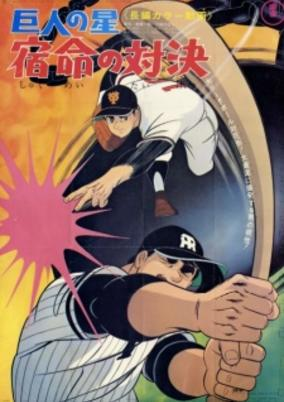

**Genres:** Baseball, Sports

> Fourth Kyojin no Hoshi movie.
>
> _Synopsis source: Kitsu_

[Wikipedia](https://en.wikipedia.org/wiki/Star_of_the_Giants#Movies) · [Kitsu](https://kitsu.io/anime/kyojin-no-hoshi-shukumei-no-taiketsu)

---

### Attack No. 1: Revolution

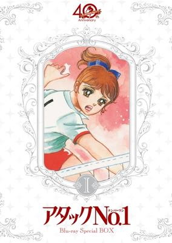

**Genres:** Earth, Japan, Action, Sports, Asia, Volleyball, School Life

> Kozue is a highschool girl and enthusiastic volleyball player. Her dream is to play in the Japanese national volleyball team. During the series she makes it from the school district league up to the Japanese volleyball finals, step by step till the international volleyball championship. But the faster and higher Kozue climbs the career ladder up, the more she gets confronted with the dark side of success: too high expectations, self-conceit and envy are progressing towards serious problems.
>
> _Synopsis source: Kitsu_

[Wikipedia](https://en.wikipedia.org/wiki/Attack_No._1#Movies) · [Kitsu](https://kitsu.io/anime/attack-no-1)

---

### Bullying Grandmother

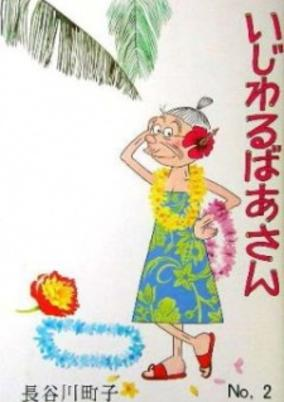

**Genres:** Comedy, Slice of Life

> Based on a 1966 manga by Sazae-san creator Hasegawa Machiko. This is another slice-of-everyday-life tale, centered around a spiteful old woman who causes trouble for neighbours with her constant bumbling and grumbling.
>
> _Synopsis source: Kitsu_

[Kitsu](https://kitsu.io/anime/ijiwaru-baa-san)

---

### Cleopatra

[Wikipedia](https://en.wikipedia.org/wiki/Cleopatra_(1970_film))

---

### The Bridge of Avignon

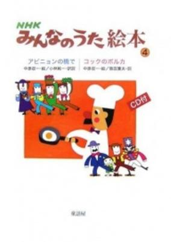

**Genres:** Music, Kids

> A Japanese version of an old 15th century French song 'Sur le Pont d'Avignon,' which describes how people would come and dance on the Pont St. Bénézet (Pont d’Avignon).
>
> _Synopsis source: Kitsu_

[Kitsu](https://kitsu.io/anime/avignon-no-hashi-de)

---

### The Demon of Kickboxing (Demon of the Kick)

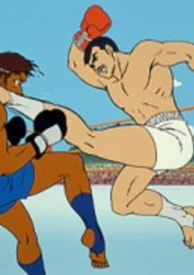

**Genres:** Action, Sports, Martial Arts

> An arrogant karate master named Tadashi Sawamura enters the kickboxing ring to prove his superiority, only to be beaten into a coma by a practictioner of the new art. After recovering, his trainer Endo convinced Sawamura to study kickboxing in order to regain his honor. The series is loosely based on the real-life exploits of champion kickboxer Tadashi Sawamura.
>
> _Synopsis source: Kitsu_

[Wikipedia](https://en.wikipedia.org/wiki/Kick_no_Oni) · [Kitsu](https://kitsu.io/anime/kick-no-oni)

---

### General Inakappe

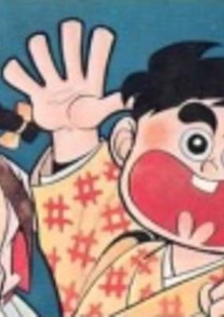

**Genres:** Action, Sports, Martial Arts, Comedy

> A comedy about a country boy that travels to the city to study judo. He ends up meeting the daughter of a prominent dojo and her judo skilled cat. Each episode features 2 stories.
>
> _Synopsis source: Kitsu_

[Wikipedia](https://en.wikipedia.org/wiki/Inakappe_Taish%C5%8D) · [Kitsu](https://kitsu.io/anime/inakappe-taishou)

---

### Mako the Mermaid

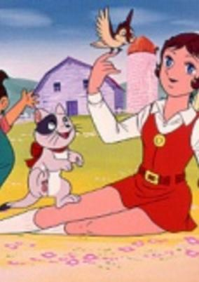

**Genres:** Romance, Fantasy, Magical Girl, Magic

> Mako is a young siren and daughter to the King of the Sea. In a stormy day she rescues the young sport Akira from a wrecked ship, but ends up falling in love with him. So, with help from the Witch of the Sea, she's transformed into a human, and becomes a highschool student who helps everyone with her strong sense of love and justice and her magical pendant, the "Tear of the Mermaid."
>
> _Synopsis source: Kitsu_

[Wikipedia](https://en.wikipedia.org/wiki/Mah%C5%8D_no_Mako-chan) · [Kitsu](https://kitsu.io/anime/mahou-no-mako-chan)

---

### Attack No. 1: World Championship

[Wikipedia](https://en.wikipedia.org/wiki/Attack_No._1#Movies)

---

### Il torero Camomillo

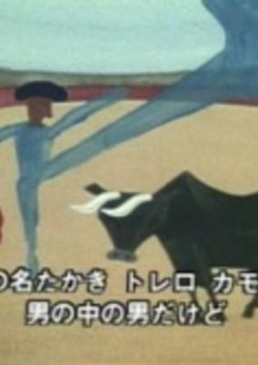

**Genres:** Music, Kids

> Song by the Nishi Rokugo Shonen Shōjo Gasshodan which aired in 1970 on NHK in the Minna no Uta program.
>
> _Synopsis source: Kitsu_

[Kitsu](https://kitsu.io/anime/torero-kamomiro)

---

### The Bathroom

[Wikipedia](https://en.wikipedia.org/wiki/Y%C5%8Dji_Kuri)

---

### Anthropo-Cynical Farce

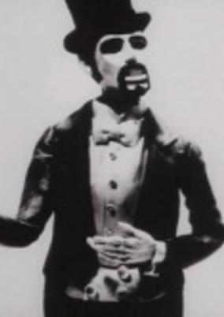

**Genres:** Parody, Psychological

> A dog race is interrupted by a ringmaster, who attaches fish to the dog’s collars and makes them run in circles. The crowd is incensed, but the ringmaster insists that the audience is no better off than the dogs. In the end the ringmaster is assassinated and the race continues, but a single red rose sprouts from the ringmaster’s blood; a symbol of truth in a crazy world? -AniDB
>
> _Synopsis source: Kitsu_

[Wikipedia](https://en.wikipedia.org/wiki/Kihachir%C5%8D_Kawamoto#Short_films) · [Kitsu](https://kitsu.io/anime/kenju-giga)

---

### The Flower and the Mole

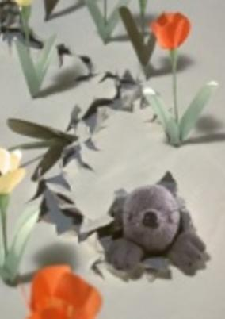

**Genres:** Mecha, Japan, Comedy

> Hanako-chan, a flower loving person, encounters a mole in her garden and wonders what would happen if the moles could be trained to assist in gardening. Then her idea goes with the wind...
>
> _Synopsis source: Kitsu_

[Wikipedia](https://en.wikipedia.org/wiki/Tadanari_Okamoto) · [Kitsu](https://kitsu.io/anime/hana-to-mogura)

---

### Invisible Boy Detective Akira

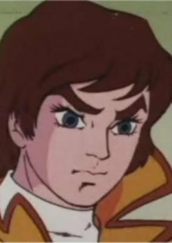

**Genres:** Action

> Pilot episode of the anime Chargeman Ken.
>
> _Synopsis source: Kitsu_

[Kitsu](https://kitsu.io/anime/toumei-shounen-tantei-akira)

---
