# 1971 in Anime

[← Back to index](../README.md)

20 titles · 13 with a matched synopsis/cover art · [source](https://en.wikipedia.org/wiki/1971_in_anime)

## Releases

### Hyppo and Thomas (Hippo and Thomas)

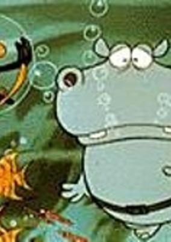

**Genres:** Comedy

> Thomas is a cunning bird who sponges on Hyppo, the good-natured hippopotamus. Although Thomas is a dependent, living in Hyppo's big mouth, he always acts lordly and tries to outsmart his simpleminded host. However, their basic friendship and cooperation endures despite their frequent quarrels. The two play a prime role in this comic series, short yet full of originality.
>
> _Synopsis source: Kitsu_

[Wikipedia](https://en.wikipedia.org/wiki/Hyppo_and_Thomas) · [Kitsu](https://kitsu.io/anime/kabatotto)

---

### Hans Christian Andersen

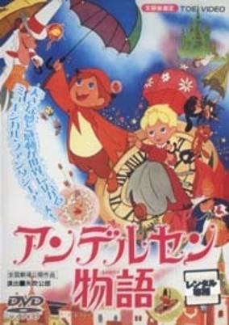

**Genres:** Fantasy, Fantasy World, Kids

> Adaptations of numerous stories written by Hans Christian Andersen.
>
> _Synopsis source: Kitsu_

[Wikipedia](https://en.wikipedia.org/wiki/Andersen_Monogatari_(TV_series)) · [Kitsu](https://kitsu.io/anime/andersen-monogatari)

---

### The Extravagant Muchabei

---

### Attack No. 1: Immortal Bird

[Wikipedia](https://en.wikipedia.org/wiki/Attack_No._1#Movies)

---

### Animal Treasure Island

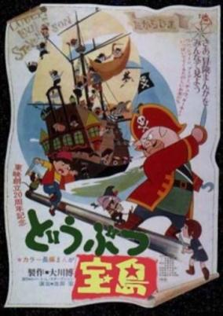

**Genres:** Adventure

> Jim is working as an innkeeper, together with his friend, the mouse Gran. One day, a mysterious man visits the inn, leaving a map behind. The map shows an island with a treasure. So the duo sets off in their own little boat, trying to fulfil their dreams and leaving the inn far behind. But it seems more people knows of the map, as they cross paths with Captain Silver and his band of wild pirates. Jim, Gran and their new friend Kathy tries to beat them in the treasure hunt that ensues. (Source ANN)
>
> _Synopsis source: Kitsu_

[Wikipedia](https://en.wikipedia.org/wiki/Animal_Treasure_Island) · [Kitsu](https://kitsu.io/anime/doubutsu-takarajima)

---

### The Demon of Kickboxing (Demon of the Kick)

**Genres:** Action, Sports, Martial Arts

> An arrogant karate master named Tadashi Sawamura enters the kickboxing ring to prove his superiority, only to be beaten into a coma by a practictioner of the new art. After recovering, his trainer Endo convinced Sawamura to study kickboxing in order to regain his honor. The series is loosely based on the real-life exploits of champion kickboxer Tadashi Sawamura.
>
> _Synopsis source: Kitsu_

[Wikipedia](https://en.wikipedia.org/wiki/Kick_no_Oni) · [Kitsu](https://kitsu.io/anime/kick-no-oni)

---

### Animentary: The Decision

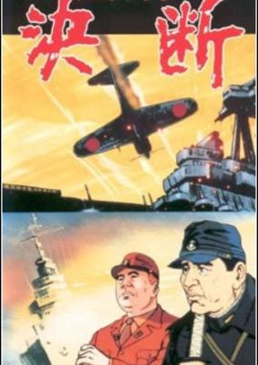

**Genres:** World War II, Past, Historical, Military

> A strict retelling of the Pacific side of WW2.
>
> _Synopsis source: Kitsu_

[Kitsu](https://kitsu.io/anime/ketsudan)

---

### Wandering Sun (Nozomi In The Sun)

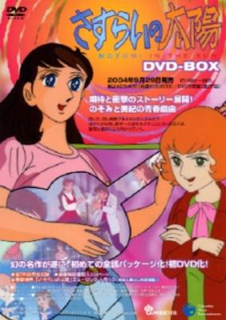

**Genres:** Romance, Japan, Asia, Earth, Performance, Drama, Idol, Plot Continuity, Music

> Two baby girls were born in the same hospital: one of them is the daughter of an aristocratic family while the other belongs to a depraved household which lives in the slums of the city. However, the nurse-in-charge, Michiko, secretly switches the two babies due to a personal grudge, resulting in a change of fates of the girls from then on. Many years later, the lives of the two girls continue to be intertwined with each other, with the rich Miki ill-treating the poor Nozomi, yet both of them hold similar dreams to become a singer.
>
> _Synopsis source: Kitsu_

[Wikipedia](https://en.wikipedia.org/wiki/Wandering_Sun) · [Kitsu](https://kitsu.io/anime/sasurai-no-taiyou)

---

### Ali Baba and the Forty Thieves

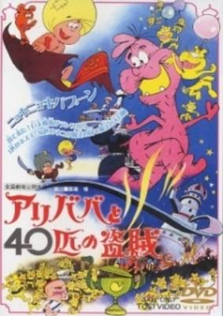

**Genres:** Fantasy, Middle East, Magic, Action

> A film produced for Toei's 20th anniversary. A boy who is the descendant of the leader of the theives who met a grisly fate in the 1001 Nights bands together with 38 cats and a mouse to get back his rightful treasure from Ali Baba XXXIII, the descendent of Ali Baba who now rules the kingdom with an iron fist. This is a reversal of the good guy/bad guy roles in the original story! (perhaps not surprising for being a film in which Hayao Miyazaki was involved) This film is one of the most rollicking and action-packed films made by Toei, and is in an outrageously cartoonish style breaking with the Toei mold. It has a spectacular lineup of animators including Yasuji Mori, Akira Daikubara, Hayao Miyazaki, Yoichi Kotabe and Reiko Okuyama. The original story about Ali Baba and the 40 Thieves itself is recounted at one point in the film in an unexpected and interesting way using shadow-puppets.
>
> _Synopsis source: Kitsu_

[Wikipedia](https://en.wikipedia.org/wiki/Ali_Baba_and_the_Forty_Thieves_(1971_film)) · [Kitsu](https://kitsu.io/anime/ali-baba-to-40-hiki-no-touzoku)

---

### New Q-Taro the Ghost

[Wikipedia](https://en.wikipedia.org/wiki/Obake_no_Q-Tar%C5%8D)

---

### The Genius Bakabon

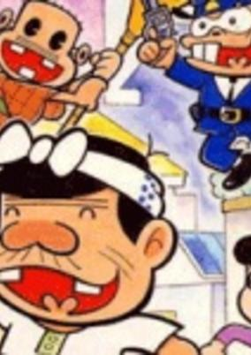

**Genres:** Comedy, Slapstick, Slice of Life

> Tensai Bakabon is the tale of a child prodigy and his "philosophical" father. Bakabon‘s father has his own philosophy and he leaves no stone unturned in his quest for answers. Despite his ability to trouble Trouble, for some reason, Papa Bakabon is regarded as "The Great Philosopher," and is sought after for advice, which of course ends up in disastrous results. Tensai Bakabon joins his father in his philosophical quests which drives the people in their town crazy.
>
> _Synopsis source: Kitsu_

[Wikipedia](https://en.wikipedia.org/wiki/Tensai_Bakabon) · [Kitsu](https://kitsu.io/anime/tensai-bakabon)

---

### The Instructive Trip Around the World

**Genres:** Comedy

> An educational documentary series that depicts a variety of real life places around the world in short 5 minute segments. The series aired Monday through Saturday.
>
> _Synopsis source: Kitsu_

[Kitsu](https://kitsu.io/anime/sekai-monoshiri-ryoko)

---

### Marvelous Melmo

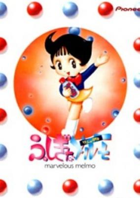

**Genres:** Japan, Asia, Earth, Comedy, Coming Of Age, Magic, Anthropomorphism, Magical Girl, Present

> After nine-year-old Melmo loses her mother in a car accident, she is left to care for her two younger brothers, a task far beyond her age or means. However, in the midst of her grieving, Melmo is visited by the ghost of her deceased mother who gives her a bottle of miraculous candy, capable of transforming her into either an adult (blue candy) or an infant (red candy). A combination of the two can reduce her to a fetus and then change her into any animal she imagines. Drawing on a seemingly inexhaustable supply, Melmo uses her candies to solve the various problems thrown her way, aided by her younger brother Toto (who accidentally morphs into a frog in episode 7) and her cantankerous mentor, Dr Nosehairs.
>
> _Synopsis source: Kitsu_

[Wikipedia](https://en.wikipedia.org/wiki/Marvelous_Melmo) · [Kitsu](https://kitsu.io/anime/fushigi-na-melmo)

---

### Hela Supergirl (Sarutobi Ecchan)

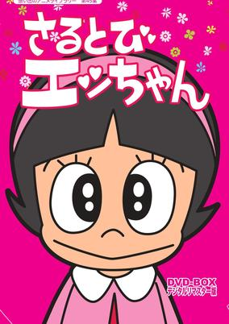

**Genres:** Comedy, Magic, School Life, Kids

> A strange girl transfers to Mitsuba Elementary School. At first glance, she is a normal student. However, she is a great athlete, and can talk to animals. Accoding to her, she is the 33rd descendant of the great ninja, Sarutobi Sasuke. Futhermoe, her dog, Puku, can talk. Because she doesn’t live in any house, she spends a night at Miko-chan’s room. She is tunred out of the room once. However, because they thank her for extingushig the fire, they let her stay at their house. After that, she makes a name at school.
>
> _Synopsis source: Kitsu_

[Wikipedia](https://en.wikipedia.org/wiki/Sarutobi_Ecchan) · [Kitsu](https://kitsu.io/anime/sarutobi-ecchan)

---

### Apache Baseball Team

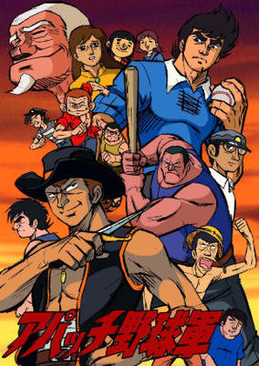

**Genres:** Action, Sports, Baseball, School Life

> A former baseball star who suffered a career crippling injury takes over as coach of a team of misfits in a poor village high school.
>
> _Synopsis source: Kitsu_

[Kitsu](https://kitsu.io/anime/apache-yakyuugun)

---

### Kunimatsu's Got It Right!

[Wikipedia](https://en.wikipedia.org/wiki/Harris_no_Kaze#Anime)

---

### Spooky Kitaro

[Wikipedia](https://en.wikipedia.org/wiki/GeGeGe_no_Kitar%C5%8D#Anime)

---

### Lupin the 3rd

---

### Ryu the Primitive Boy

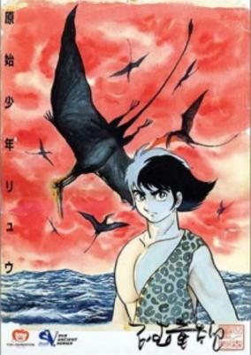

**Genres:** Adventure, Past, Action, Science Fiction, Romance

> When Ryuu is born his tribe tries to sacrifice him to a Tyrannosaurus named Shirano because of the color of his skin. He is however saved by a monkey who raises him as her own son. Meanwhile Ryuu's mother has left the tribe and is out on a quest to find Ryuu. 16 years later Ryuu meets a girl named Ran who was sold to the tribe Ryuu originaly came from. The tribe is not happy to see Ryuu alive and tries to sacrifice him again, this time by burning him alive. Before they can get the deed done the tribe is massacred along with Ryuu's adoptive mother by Shirano. Ryuu then sets out on a quest together with Ran to find his mother and Ran's brother Don.
>
> _Synopsis source: Kitsu_

[Kitsu](https://kitsu.io/anime/genshi-shounen-ryuu)

---

### New Skyers 5

[Wikipedia](https://en.wikipedia.org/wiki/Skyers_5#Shin_Skyers_5)

---
