# 1972 in Anime

[← Back to index](../README.md)

22 titles · 15 with a matched synopsis/cover art · [source](https://en.wikipedia.org/wiki/1972_in_anime)

## Releases

### Yuki's Sun

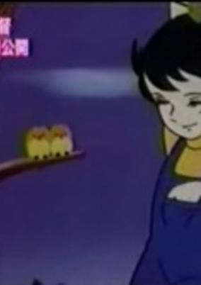

**Genres:** Drama

> This pilot is remembered, really, for one notable reason: this is Miyazaki's first time as a solo director. He teamed up with Takahata for the later episodes of the 1971-72 Lupin III series, but Yuki's Sun marked his first time solely in the captain's seat. Yuki's Sun was based upon a popular shoujo manga (girls' comic) by Tetsuya Chiba which was serialized in 1963. It involves a 10-year-old orphan girl who is adopted into a family. The storyline is somewhat complex, and seems to play out like grand melodrama. Chiba's stories were more sophisticated and grown-up than, say, Osamu Tezuka, who of course was the godfather of postwar Japanese manga.
>
> _Synopsis source: Kitsu_

[Wikipedia](https://en.wikipedia.org/wiki/Yuki%27s_Sun) · [Kitsu](https://kitsu.io/anime/yuki-no-taiyou-pilot)

---

### Mock of the Oak Tree

---

### New Moomin

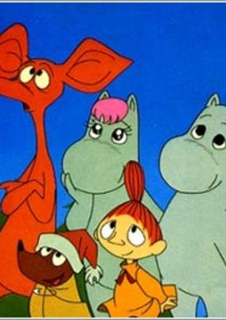

**Genres:** Comedy, Fantasy, Adventure, Slice of Life

> A remake of the 1969-70 Moomin series. This version is more closely based on the books by the Finnish illustrator and writer Tove Jansson.
>
> _Synopsis source: Kitsu_

[Wikipedia](https://en.wikipedia.org/wiki/New_Moomin) · [Kitsu](https://kitsu.io/anime/moomin-1972)

---

### The One Who Loves Justice: Moonlight Mask

[Wikipedia](https://en.wikipedia.org/wiki/Moonlight_Mask#The_1972_anime_series)

---

### The Three Musketeers in Boots

[Wikipedia](https://en.wikipedia.org/wiki/The_Wonderful_World_of_Puss_%27n_Boots#The_Three_Musketeers_in_Boots)

---

### Triton of the Sea

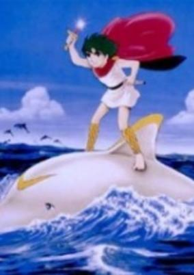

**Genres:** Fantasy, Adventure

> 5000 years ago, the Triton Family was living peacefully in Atlantis until the Poseidon Family destroyed them all. Triton, of the Triton Family line, embarks on an adventurous life in the sea fighting the Poseidon Family.
>
> _Synopsis source: Kitsu_

[Wikipedia](https://en.wikipedia.org/wiki/Triton_of_the_Sea) · [Kitsu](https://kitsu.io/anime/umi-no-triton)

---

### Chappy the Witch

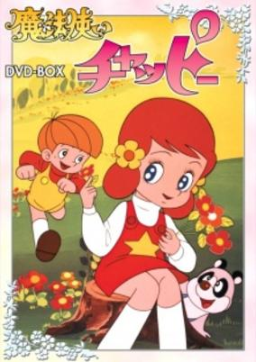

**Genres:** Magical Girl, Magic, Adventure, Kids

> Chappy's story is much like Mahou Tsukai Sally (Little Witch Sally). Chappy becoming sick of the old customs of her people, left the Land of Magic for the human world. Soon her family sees how much she has in the other realm that they decided to join her new home. Chappy is known for being the first witch to use a wand. Her special chant is "Abura Mahariku Maharita Kabura. Mahou Tsukai Chappy is the fifth magical girl anime in history.
>
> _Synopsis source: Kitsu_

[Wikipedia](https://en.wikipedia.org/wiki/Mah%C5%8Dtsukai_Chappy) · [Kitsu](https://kitsu.io/anime/mahou-tsukai-chappy)

---

### Akado Suzunosuke

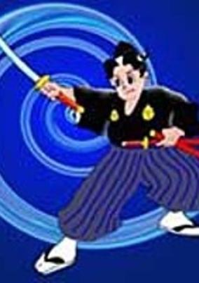

**Genres:** Martial Arts, Historical, Adventure

> A young swordsman finds himself involved in a plot to overthrow the shogunate.
>
> _Synopsis source: Kitsu_

[Wikipedia](https://en.wikipedia.org/wiki/Akado_Suzunosuke) · [Kitsu](https://kitsu.io/anime/akado-suzunosuke)

---

### Road to Munich

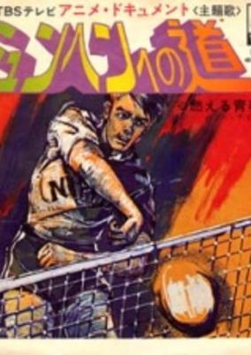

**Genres:** Sports, Volleyball

> A short series based on volleyball at the Munich Olympics. The series features a mix of live action blended with animation.
>
> _Synopsis source: Kitsu_

[Kitsu](https://kitsu.io/anime/anime-document-munchen-e-no-michi)

---

### Devilman

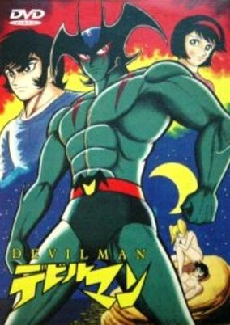

**Genres:** Fantasy, Contemporary Fantasy, Horror, Action, Romance, Demon, Super Power

> Devilman features Akira Fudo, a shy and timid teenager who has gone mountain climbing in the Himalayas with his father. While in the middle of the expedition, both father and son are killed in a tragic accident. Akira's body is found and possessed by the demon soldier Devilman, who uses his new human form as a disguise in order to fulfill his mission of causing chaos on Earth in order to pave the way for a demonic invasion of the planet. Before his mission can begin in earnest, Devilman meets Akira's childhood friend Miki Makimura and quickly falls in love with her. Devilman resolves to protect Miki and humanity as a whole by battling against his fellow demons. Demon Tribe leader Zennon becomes greatly angered at Devilman's betrayal and is quick to send Devilman's former comrades to destroy him. The other demons soon learn that Miki is precious to Devilman and he must now work to protect her, as well as protect himself. Will the power of love be able to overcome that of true evil?
>
> _Synopsis source: Kitsu_

[Wikipedia](https://en.wikipedia.org/wiki/Devilman) · [Kitsu](https://kitsu.io/anime/devilman)

---

### Go Get Team 0011

---

### Mon Chéri CoCo

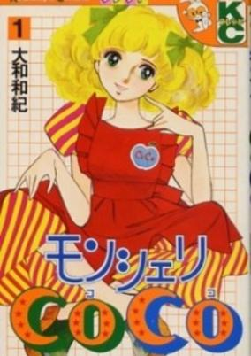

**Genres:** Earth, Romance, France, Europe, The Arts

> A young woman aims to become a famous fashion designer.
>
> _Synopsis source: Kitsu_

[Kitsu](https://kitsu.io/anime/mon-cheri-coco)

---

### Astroganger

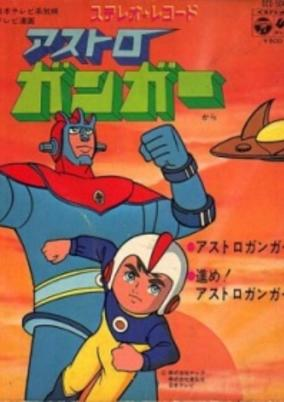

**Genres:** Science Fiction, Mecha, Action, Earth, Alien

> An alien woman named Maya crash-lands on Earth. Her homeworld was destroyed by the Blasters, a cruel alien race who steals the natural resources from other planets. She falls in love with a scientist and gives birth to a human boy named Kentaro. When the Blasters invade the Earth, Kentaro must defeat them by fighting with Astroganger, a robot made from living metal.
>
> _Synopsis source: Kitsu_

[Wikipedia](https://en.wikipedia.org/wiki/Astroganger) · [Kitsu](https://kitsu.io/anime/astroganger)

---

### Tamagon the Counselor

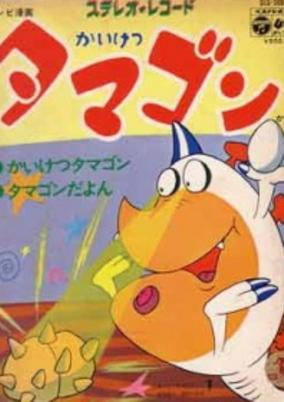

**Genres:** Comedy, Adventure, Kids

> Tamagon is a cute monster who is fond of eggs. He acts as a counselor to those in trouble, asking only eggs in payment. He goes to work as soon as he has eaten his fee. However, despite his schemes, his service usually ends in total failure and he winds up being chased by his irate clients. Short as it is, this program is full of laughs and lively humour.
>
> _Synopsis source: Kitsu_

[Wikipedia](https://en.wikipedia.org/wiki/Tamagon_the_Counselor) · [Kitsu](https://kitsu.io/anime/kaiketsu-tamagon)

---

### Piggyback Ghost

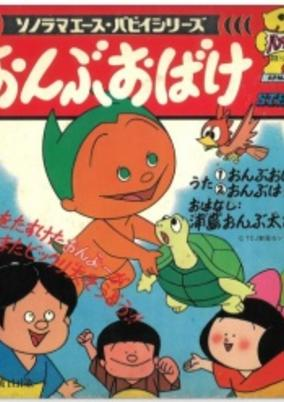

**Genres:** Fantasy

> The mischievous antics of a ghost in an ancient village.
>
> _Synopsis source: Kitsu_

[Kitsu](https://kitsu.io/anime/ryuuichi-manga-gekijou-onbu-obake)

---

### The Gutsy Frog

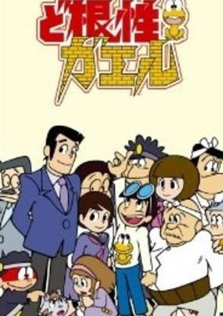

**Genres:** Comedy, Slice of Life

> When Hiroshi was fighting against his rival Gorillaimo, he stumbled over a stone and fell on to a frog. To be surprised, the frog was still alive and it named itself Pyonkichi.
>
> _Synopsis source: Kitsu_

[Wikipedia](https://en.wikipedia.org/wiki/The_Gutsy_Frog) · [Kitsu](https://kitsu.io/anime/dokonjo-gaeru)

---

### Mazinger Z

[Wikipedia](https://en.wikipedia.org/wiki/Mazinger_Z)

---

### Panda! Go Panda!

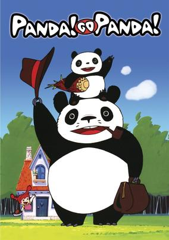

**Genres:** Contemporary Fantasy, Fantasy, Adventure, Comedy, Anthropomorphism, Kids

> Mimiko lives with her grandmother beside a bamboo grove. One day Mimiko's grandmother goes away for a while, leaving Mimiko to herself. A baby panda appears in the garden along with it's father, Papa Panda. Mimiko asks if Mr. Panda could be her father too, and he agrees.
>
> _Synopsis source: Kitsu_

[Wikipedia](https://en.wikipedia.org/wiki/Panda!_Go_Panda!) · [Kitsu](https://kitsu.io/anime/panda-kopanda)

---

### The Midnight Parasites

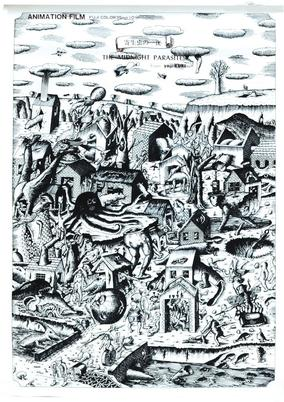

**Genres:** Horror, Dementia

> Short experimental animation from 1972 by Yoji Kuri.
>
> _Synopsis source: Kitsu_

[Wikipedia](https://en.wikipedia.org/wiki/Y%C5%8Dji_Kuri) · [Kitsu](https://kitsu.io/anime/kiseichuu-no-ichiya)

---

### The Demon

[Wikipedia](https://en.wikipedia.org/wiki/Kihachir%C5%8D_Kawamoto)

---

### The Monkey and the Crab

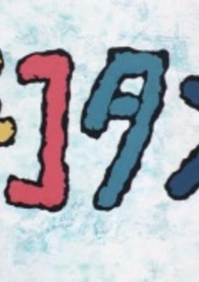

**Genres:** Angst, Music, Psychological

> Okamoto Tadanari short film.
>
> _Synopsis source: Kitsu_

[Wikipedia](https://en.wikipedia.org/wiki/Tadanari_Okamoto) · [Kitsu](https://kitsu.io/anime/chikotan)

---

### Science Ninja Team Gatchaman

[Wikipedia](https://en.wikipedia.org/wiki/Science_Ninja_Team_Gatchaman)

---
