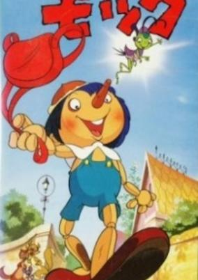
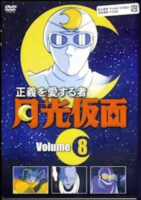
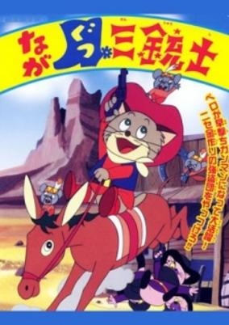
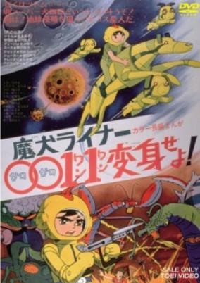
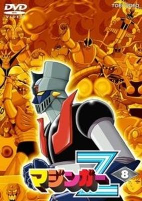
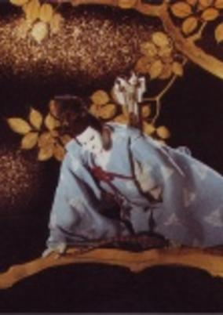
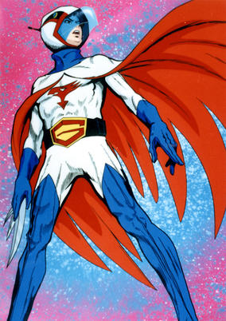

# 1972 in Anime

[← Back to index](../README.md)

22 titles · 20 with a matched synopsis/cover art · [source](https://en.wikipedia.org/wiki/1972_in_anime)

## Releases

### Yuki's Sun

**Genres:** Drama

> This pilot is remembered, really, for one notable reason: this is Miyazaki's first time as a solo director. He teamed up with Takahata for the later episodes of the 1971-72 Lupin III series, but Yuki's Sun marked his first time solely in the captain's seat. Yuki's Sun was based upon a popular shoujo manga (girls' comic) by Tetsuya Chiba which was serialized in 1963. It involves a 10-year-old orphan girl who is adopted into a family. The storyline is somewhat complex, and seems to play out like grand melodrama. Chiba's stories were more sophisticated and grown-up than, say, Osamu Tezuka, who of course was the godfather of postwar Japanese manga.
>
> _Synopsis source: Kitsu_

[Wikipedia](https://en.wikipedia.org/wiki/Yuki%27s_Sun) · [Kitsu](https://kitsu.io/anime/yuki-no-taiyou-pilot)

---

### Mock of the Oak Tree

**Genres:** Fantasy, Adventure

> This version of Pinocchio tells a story of an extremely gullible, naive and morally confused wooden doll brought to life by a mystical blue fairy. Pinocchio (Mokku) is characterized as having many character faults which he must learn to overcome in order to be worthy of being granted humanity. Some of these character faults include selfishness, rudeness, insensitivity, indolence, obstinacy, over- trusting, self-pity, stupidity, disobedience, compulsive lying, arrogance, greed, cowardice, recklessness, cruelty, foolishness and an inability to learn from mistakes. Throughout the entire series Pinocchio (Mokku), partly due to his own delinquency and repetitive disobedience, must undergo other costly ordeals of hardship and pain in which he is continuously tormented, persecuted, bullied, humiliated, tricked, ridiculed, ostracised, beaten, downtrodden and subjected to degrading and inhumane treatment. Its plain depiction of the austere reality of what it would be like to be literally subhuman growing up in a world of danger and hardship, makes this another good example of traditional Japanese stories, which teach moral observance through tough endurance.
>
> _Synopsis source: Kitsu_

[Kitsu](https://kitsu.io/anime/kashi-no-ki-mokku)

---

### New Moomin

[Wikipedia](https://en.wikipedia.org/wiki/New_Moomin)

---

### The One Who Loves Justice: Moonlight Mask

**Genres:** Action, Mystery

> Moonlight Mask's identity has always been a mystery (which is why the Moonlight Mask persona is credited as being played by "?" in the original series). Decked out in white tights, white &amp; red cape, white scarf, yellow gloves &amp; boots, dark glasses, face cloth and Indian-style turban (pinned with a "moon" ornament), Moonlight Mask is armed with a whip, two six-shooters, shuriken and moon-shaped boomerangs. He also rides a motorcycle. However, only audiences know that Moonlight Mask could very well be detective Juurou Iwai who seems to disappear from his friends before the caped crusader rides to the rescue in his motorcycle! Even his comical assistant Gorohachi Fukuro, his friend Inspector Matsuda, and children Shigeru, Kaboko and Fujiko are oblivious to Iwai's secret identity.
>
> _Synopsis source: Kitsu_

[Wikipedia](https://en.wikipedia.org/wiki/Moonlight_Mask#The_1972_anime_series) · [Kitsu](https://kitsu.io/anime/seigi-wo-aisuru-mono-gekko-kamen)

---

### The Three Musketeers in Boots (Return of Pero)

**Genres:** Fantasy, Adventure, Kids

> Once upon a time, near the ruins of an old castle, there lived the King of Cats. He was famous for his violent temper and now he is lashing out at his three gunmen, who had been ordered to bring back Pero, but had returned empty-handed. Pero, a former subject of the angry King, had lived in Cat Country once but he had dared to save a mouse from death. Now, as everyone knows, the mouse is the mortal enemy of all cats, so the King orders his three gunmen to go to the ends of the earth, if necessary, to find Pero. Pero is a happy-go-lucky sort of feline and very hip for a cat. Fleeing from the wrath of the King, he decides to seek his fortune in the wild and wooly west. On the way, he encounters the King’s gunmen hot on his trail but he foils them and blithely goes on his way. On the stagecoach to Go Go Town, he meets Annie, a pretty girl who is returning after finishing her education in the East, and Jimmy, a boy with sleepy eyes and slow movements. They are attacked suddenly by holdups who are after the new sheriff but since he does not seem to be on the coach, they ride off. Sad news awaits Annie in town. Her father had been killed by the Big Bad Boss for finding out about the bogus money he was making to get rich fast. The Big Bad Boss also kills each new sheriff who arrives to keep law and order in town. He is determined to keep the whole place under his thumb. The Big Bad Boss tries to scare Annie into leaving town but she is her father’s daughter and cannot be frightened away by threats. With the help of Pero and Jimmy, she opens a restaurant in the building her father owned. Once again, Pero happens to save a little Indian mouse caught in a trap. The little mouse’s father, the Chieftain of the Indian mice, promises to help Pero and Annie. The sleepy-eyed Jimmy is really the new sheriff. They all join forces and expose the Big Boss’ villainy and his secret bogus money factory. The Big Bad Boss gets his comeuppance and all ends well.
>
> _Synopsis source: Kitsu_

[Wikipedia](https://en.wikipedia.org/wiki/The_Wonderful_World_of_Puss_%27n_Boots#The_Three_Musketeers_in_Boots) · [Kitsu](https://kitsu.io/anime/nagagutsu-sanjuushi)

---

### Triton of the Sea

**Genres:** Fantasy, Adventure

> 5000 years ago, the Triton Family was living peacefully in Atlantis until the Poseidon Family destroyed them all. Triton, of the Triton Family line, embarks on an adventurous life in the sea fighting the Poseidon Family.
>
> _Synopsis source: Kitsu_

[Wikipedia](https://en.wikipedia.org/wiki/Triton_of_the_Sea) · [Kitsu](https://kitsu.io/anime/umi-no-triton)

---

### Chappy the Witch

**Genres:** Magical Girl, Magic, Adventure, Kids

> Chappy's story is much like Mahou Tsukai Sally (Little Witch Sally). Chappy becoming sick of the old customs of her people, left the Land of Magic for the human world. Soon her family sees how much she has in the other realm that they decided to join her new home. Chappy is known for being the first witch to use a wand. Her special chant is "Abura Mahariku Maharita Kabura. Mahou Tsukai Chappy is the fifth magical girl anime in history.
>
> _Synopsis source: Kitsu_

[Wikipedia](https://en.wikipedia.org/wiki/Mah%C5%8Dtsukai_Chappy) · [Kitsu](https://kitsu.io/anime/mahou-tsukai-chappy)

---

### Akado Suzunosuke

**Genres:** Martial Arts, Historical, Adventure

> A young swordsman finds himself involved in a plot to overthrow the shogunate.
>
> _Synopsis source: Kitsu_

[Wikipedia](https://en.wikipedia.org/wiki/Akado_Suzunosuke) · [Kitsu](https://kitsu.io/anime/akado-suzunosuke)

---

### Road to Munich

**Genres:** Sports, Volleyball

> A short series based on volleyball at the Munich Olympics. The series features a mix of live action blended with animation.
>
> _Synopsis source: Kitsu_

[Kitsu](https://kitsu.io/anime/anime-document-munchen-e-no-michi)

---

### Devilman

**Genres:** Fantasy, Contemporary Fantasy, Horror, Action, Romance, Demon, Super Power

> Devilman features Akira Fudo, a shy and timid teenager who has gone mountain climbing in the Himalayas with his father. While in the middle of the expedition, both father and son are killed in a tragic accident. Akira's body is found and possessed by the demon soldier Devilman, who uses his new human form as a disguise in order to fulfill his mission of causing chaos on Earth in order to pave the way for a demonic invasion of the planet. Before his mission can begin in earnest, Devilman meets Akira's childhood friend Miki Makimura and quickly falls in love with her. Devilman resolves to protect Miki and humanity as a whole by battling against his fellow demons. Demon Tribe leader Zennon becomes greatly angered at Devilman's betrayal and is quick to send Devilman's former comrades to destroy him. The other demons soon learn that Miki is precious to Devilman and he must now work to protect her, as well as protect himself. Will the power of love be able to overcome that of true evil?
>
> _Synopsis source: Kitsu_

[Wikipedia](https://en.wikipedia.org/wiki/Devilman) · [Kitsu](https://kitsu.io/anime/devilman)

---

### Go Get Team 0011

**Genres:** Mecha, Action, Science Fiction

> A medium long anime movie (50 minutes) released as one of the programs of 'Toei Manga Festival', and screened with a live-action film "Kamen Rider vs. Ambassador Hell" and others. A near-future Sci-Fi mecha action film featuring four cyborg dogs. An original story based on the concept from Hiroshi Sasagawa's manga "Maken Goro" (serialized in the magazine "Weekly Shonen King" in 1963). A boy named Tsutomu and four cyborg dogs (Queen, Ace, Jack and Joker who coalesce and transform into the spaceship "Liner") fight against aggression by insect-type aliens from the Planet Devil. Directed by Takeshi Tamiya. Music by Takeo Yamashita.
>
> _Synopsis source: Kitsu_

[Kitsu](https://kitsu.io/anime/maken-liner-0011-henshin-seyo)

---

### Mon Chéri CoCo

**Genres:** Earth, Romance, France, Europe, The Arts

> A young woman aims to become a famous fashion designer.
>
> _Synopsis source: Kitsu_

[Kitsu](https://kitsu.io/anime/mon-cheri-coco)

---

### Astroganger

**Genres:** Science Fiction, Mecha, Action, Earth, Alien

> An alien woman named Maya crash-lands on Earth. Her homeworld was destroyed by the Blasters, a cruel alien race who steals the natural resources from other planets. She falls in love with a scientist and gives birth to a human boy named Kentaro. When the Blasters invade the Earth, Kentaro must defeat them by fighting with Astroganger, a robot made from living metal.
>
> _Synopsis source: Kitsu_

[Wikipedia](https://en.wikipedia.org/wiki/Astroganger) · [Kitsu](https://kitsu.io/anime/astroganger)

---

### Tamagon the Counselor

**Genres:** Comedy, Adventure, Kids

> Tamagon is a cute monster who is fond of eggs. He acts as a counselor to those in trouble, asking only eggs in payment. He goes to work as soon as he has eaten his fee. However, despite his schemes, his service usually ends in total failure and he winds up being chased by his irate clients. Short as it is, this program is full of laughs and lively humour.
>
> _Synopsis source: Kitsu_

[Wikipedia](https://en.wikipedia.org/wiki/Tamagon_the_Counselor) · [Kitsu](https://kitsu.io/anime/kaiketsu-tamagon)

---

### Piggyback Ghost

**Genres:** Fantasy

> The mischievous antics of a ghost in an ancient village.
>
> _Synopsis source: Kitsu_

[Kitsu](https://kitsu.io/anime/ryuuichi-manga-gekijou-onbu-obake)

---

### The Gutsy Frog

**Genres:** Comedy, Slice of Life

> When Hiroshi was fighting against his rival Gorillaimo, he stumbled over a stone and fell on to a frog. To be surprised, the frog was still alive and it named itself Pyonkichi.
>
> _Synopsis source: Kitsu_

[Wikipedia](https://en.wikipedia.org/wiki/The_Gutsy_Frog) · [Kitsu](https://kitsu.io/anime/dokonjo-gaeru)

---

### Mazinger Z

**Genres:** Mecha, Piloted Robot, Action, Science Fiction

> The villainous Dr. Hell has amassed an army of mechanical beasts in his secret hideaway, the island of Bardos located in the Aegean Sea. He is capable of controlling mechanized beasts with his cane, and instructs them to unleash devastating attacks. However, Dr. Hell doesn't do all the dirty work by himself; he has his loyal henchman Baron Ashura to carry out his devilish plans. There are also those that will see to it that evil does not prevail. Kouji Kabuto is the young and feisty teenager with a score to settle: his goal is avenging the murder of his grandfather by Dr. Hell. And he might just be able to pull it off, as he is the pilot of Mazinger Z, a mighty giant robot made out of an indestructible metal known as Super-Alloy Z. Mazinger Z boasts several powerful special attacks. By channeling Photonic Energy through its eyes, and unleashing the Koushiryoku Beam, it can cause great destruction. But things get really cool when Mazinger Z launches its Rocket Punch attack. Dr. Hell and his minions might have just found their match!
>
> _Synopsis source: Kitsu_

[Wikipedia](https://en.wikipedia.org/wiki/Mazinger_Z) · [Kitsu](https://kitsu.io/anime/mazinger-z)

---

### Panda! Go Panda!

**Genres:** Contemporary Fantasy, Fantasy, Adventure, Comedy, Anthropomorphism, Kids

> Mimiko lives with her grandmother beside a bamboo grove. One day Mimiko's grandmother goes away for a while, leaving Mimiko to herself. A baby panda appears in the garden along with it's father, Papa Panda. Mimiko asks if Mr. Panda could be her father too, and he agrees.
>
> _Synopsis source: Kitsu_

[Wikipedia](https://en.wikipedia.org/wiki/Panda!_Go_Panda!) · [Kitsu](https://kitsu.io/anime/panda-kopanda)

---

### The Midnight Parasites

**Genres:** Horror, Dementia

> Short experimental animation from 1972 by Yoji Kuri.
>
> _Synopsis source: Kitsu_

[Wikipedia](https://en.wikipedia.org/wiki/Y%C5%8Dji_Kuri) · [Kitsu](https://kitsu.io/anime/kiseichuu-no-ichiya)

---

### The Demon

**Genres:** Historical, Demon, Fantasy

> One morning, two brothers living in a hut with their mother set out for the mountains to set traps for deer. They move silently through the forest undergrowth until suddenly a demon's arm reaches out from the treetops and grabs the younger brother. The older brother aims carefully, calms the shaking of his hands and lets an arrow fly, thus saving his brother's life. The demon's arm is left behind and somehow it looks familiar. After returning home a horrible truth is revealed.... Drawing on an early medieval Japanese legend, the film is reminiscent of the horror psychodrama Kwaidan. The Demon (1972) took awards at many animation festivals.
>
> _Synopsis source: Kitsu_

[Wikipedia](https://en.wikipedia.org/wiki/Kihachir%C5%8D_Kawamoto) · [Kitsu](https://kitsu.io/anime/oni)

---

### The Monkey and the Crab

[Wikipedia](https://en.wikipedia.org/wiki/Tadanari_Okamoto)

---

### Science Ninja Team Gatchaman (Gatchaman)

**Genres:** Future, Violence, Action, Science Fiction, Adventure

> Due to dangers of decreasing resources and growing pollution, the International Scientific Organization is established to improve environmental conditions throughout the world. But an international criminal group, Gallactor, tries to achieve world domination by taking control of the ISO. Gallactor was created by a mysterious being from outer space known as Generalissimo X, who gives orders through its chief commander on Earth, the masked Berg katse. To fight Gallactor and its robot monsters, the ISO's Dr. Nambu enlists five brave youths into a combat squad called Gatchaman,the Science Commandos. Special scientific powers and dramatic birdlike costumes make the Gatchaman Squad a match for Gallactor, wherever on Earth it may strike. Ken(the Eagle) is the wise leader, assisted by sometimes-foolhardy Joe(the Condor), pretty Jun(the Swan), eager little Jinpei(the Swallow), and strong Ryu(the Horned Owl). Each has individual scientific weapons, but their main power lies in their aircraft, the Phoenix, which can transform itself into a fiery arrow capable of piercing the most massive threats. GATCHAMAN is a series of dynamic action and tension as ken, Joe, Jun, Jinpei, and Ryu hold themselves in constant readiness to meet each new threat by Gallactor to conquer the world.
>
> _Synopsis source: Kitsu_

[Wikipedia](https://en.wikipedia.org/wiki/Science_Ninja_Team_Gatchaman) · [Kitsu](https://kitsu.io/anime/kagaku-ninja-tai-gatchaman)

---
