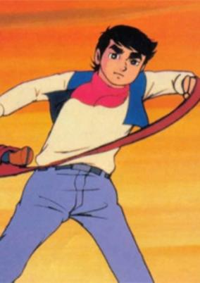
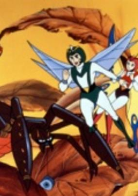
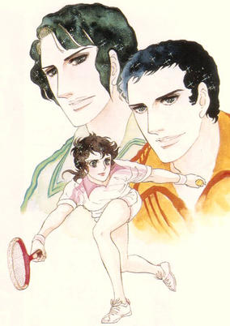

# 1973 in Anime

[← Back to index](../README.md)

23 titles · 18 with a matched synopsis/cover art · [source](https://en.wikipedia.org/wiki/1973_in_anime)

## Releases

### Babel II

[Wikipedia](https://en.wikipedia.org/wiki/Babel_II#Anime_television_(1973))

---

### Demetan Croaker, The Boy Frog (Adventures On Rainbow Pond)

**Genres:** Comedy, Fantasy, Kids

> Demetan comes from such a poor family that he cannot even go to school in his woodland pond community. However, he has a friend named Ranatan, the lovely, gentle frog girl who is the daughter of the pond's rich ruler. Naturally her father is quite displeased by this relationship and he seeks to break it up. Nevertheless the young frogs continue with courage and confidence, not only to live their own lives but to guide the heartless leopard frog to a sense of justice and generosity. Gradually the pond community responds to their sincerity and joins them in a march toward a bright future.
>
> _Synopsis source: Kitsu_

[Wikipedia](https://en.wikipedia.org/wiki/Demetan_Croaker,_The_Boy_Frog) · [Kitsu](https://kitsu.io/anime/kerokko-demetan)

---

### Fables of the Green Forest

**Genres:** Fantasy, Adventure, Kids

> Various stories about a group of animals that live together in a forest. The stories are adaptations from the many children's books written by Thornton W. Burgess.
>
> _Synopsis source: Kitsu_

[Wikipedia](https://en.wikipedia.org/wiki/Fables_of_the_Green_Forest) · [Kitsu](https://kitsu.io/anime/yama-nezumi-rocky-chuck)

---

### Jungle Kurobe

**Genres:** Comedy, Kids

> Urobe was a son of the great chief of Pyrimi, Africa. One day he hung on an airplane and came to Japan. Because of the cold and hunger, he fell on to the yard of Shishio’s house, and Shishio nursed him. Kurobe was very thankful for him and began to repay for his kindness. Kurobe dug a big hole in the yard. Every time he returns the favor, he threw a stone into the hole until stones would fill the hole.
>
> _Synopsis source: Kitsu_

[Wikipedia](https://en.wikipedia.org/wiki/Jungle_Kurobe) · [Kitsu](https://kitsu.io/anime/jungle-kurobee)

---

### Mazinger Z

---

### The Panda's Great Adventure

**Genres:** Adventure, Comedy, Coming Of Age, Anthropomorphism, Slapstick

> This movie, another from the older production from Toei Animetion for children, follows the adventures from a little panda that leaves his current family and wants to travel.
>
> _Synopsis source: Kitsu_

[Kitsu](https://kitsu.io/anime/panda-no-daibouken)

---

### Doraemon

**Genres:** Science Fiction, Mecha, Japan, Slice of Life, Comedy, Android, Present, Fantasy, Adventure, Kids

> Nobita Nobi is so hapless that his 22nd century decendants are still impoverished as a result of his 20th century bumbling. In a bid to raise their social status, their servant, a robotic cat named Doraemon, decides to travel back in time and guide Nobita on the proper path to fortune. Unfortunately Doraemon, a dysfunctional robot that the familly acquired by accident (but chose to keep nonetheless), isn't much better off than Nobita. The robot leads Nobita on many adventures, and while Nobita's life certainly is more exciting with the robot cat from the future, it is questionable if it is in fact better in the way that Doraemon planned.
>
> _Synopsis source: Kitsu_

[Wikipedia](https://en.wikipedia.org/wiki/Doraemon_(1973_TV_series)) · [Kitsu](https://kitsu.io/anime/doraemon)

---

### Little Wansa

**Genres:** Comedy

> The hero of Wansa-kun is Wansa, a puppy who is sold for a pittance, then escapes, and spends much of the rest of the series looking for his mother.
>
> _Synopsis source: Kitsu_

[Wikipedia](https://en.wikipedia.org/wiki/Little_Wansa) · [Kitsu](https://kitsu.io/anime/wansa-kun)

---

### Isamu, Boy of the Wilderness

**Genres:** Earth, Action, Gunfights, United States, Coming Of Age, Law And Order, Historical, Adventure

> The adventures of Isamu, a young boy living in the Far West, searching for his real father.
>
> _Synopsis source: Kitsu_

[Wikipedia](https://en.wikipedia.org/wiki/K%C5%8Dya_no_Sh%C5%8Dnen_Isamu) · [Kitsu](https://kitsu.io/anime/kouya-no-shounen-isamu)

---

### Microsuperman

**Genres:** Science Fiction, Action, Shounen, Adventure, Violence

> This work focuses on environmental issues from the viewpoint of insects. In a refreshing twist, the central character miniaturizes, unlike the conventional hero who grows ever larger. From this perspective, the world looks different and unfamiliar. This work enables the reader to see that the world around is quickly moving towards destruction.
>
> _Synopsis source: Kitsu_

[Wikipedia](https://en.wikipedia.org/wiki/Microsuperman) · [Kitsu](https://kitsu.io/anime/microid-s)

---

### Belladonna of Sadness

[Wikipedia](https://en.wikipedia.org/wiki/Belladonna_of_Sadness)

---

### Mazinger Z vs. Devilman

**Genres:** Mecha, Science Fiction, Action, Demon, Adventure

> The heroes of the series Mazinger Z and Devilman fighting against the evil Demon Clan.
>
> _Synopsis source: Kitsu_

[Wikipedia](https://en.wikipedia.org/wiki/Mazinger_Z_vs._Devilman) · [Kitsu](https://kitsu.io/anime/mazinger-z-vs-devilman)

---

### Miracle Girl Limit-chan

**Genres:** Science Fiction, Human Enhancement, Cyborg, Super Power, Magic, Comedy, School Life

> As a result of a traffic accident, Limit-chan is reborn as a cyborg and is given three types of supernatural powers. However, there is a catch: if she uses too much of them, her life will come to an end.
>
> _Synopsis source: Kitsu_

[Wikipedia](https://en.wikipedia.org/wiki/Miracle_Girl_Limit-chan) · [Kitsu](https://kitsu.io/anime/miracle-shoujo-limit-chan)

---

### Zero Tester

**Genres:** Science Fiction, Mecha, Action, Adventure

> A series of space accidents turn out to be the work of the Armanoid aliens, who plan to conquer Earth. Professor Tachibana gathers a team around him at the Future Science Invention Center and prepares five state-of-the-art vehicles for Shin, Go, Lisa, and Captain Kenmotsu. Three of the Tester vehicles combine to make the giant Zero Tester robot, which successfully sees off the Armanoid invasion in 39 episodes. The rest of the series, retitled ZT: Save the Earth! (Chikyu o Mamotte!), was aimed at a younger age group and featured an attack by the new Gallos aliens.
>
> _Synopsis source: Kitsu_

[Wikipedia](https://en.wikipedia.org/wiki/Zero_Tester) · [Kitsu](https://kitsu.io/anime/zero-tester)

---

### Neo-Human Casshan

[Wikipedia](https://en.wikipedia.org/wiki/Casshan)

---

### Karate Master (The Fanatical Karate Generation)

**Genres:** Adventure, Combat, Sports, Martial Arts, Friendship, Historical

> Failed kamikaze pilot Ken Asuka becomes a rough, tough hooligan who settles all of his problems with karate, until he learns about the legendary swordsman Musashi Miyamoto in the novels of Eiji Yoshikawa. Resolving to live his life like Musashi, he begins to take karate more seriously. Based on a manga by Ikki Kajiwara and Jiro Tsunoda, itself inspired by the real life of Yasunobu Oyama, the founder of the "hard-knock" Kyokushin Karate school.
>
> _Synopsis source: Kitsu_

[Wikipedia](https://en.wikipedia.org/wiki/Karate_Master) · [Kitsu](https://kitsu.io/anime/karate-baka-ichidai)

---

### The Little Judge from Hell

**Genres:** Contemporary Fantasy, Earth, Japan, Fantasy, Asia, Comedy, Horror, Demon

> Monsters are coming to the human world from the Hell in order to get human spirits. As people's minds are getting dirty, being attracted by the dirty spirits, the monsters break the rule to go to the human world. Tsutomu, a boy who goes to Yokai Elementary School, is suddenly assaulted by monsters. Those who save him from the monsters are Enma-kun, the son of Enma, Yukiko, a snow woman, and Kapaeru. They are members of Monster Patrol that are sent to the human world to arrest monsters.
>
> _Synopsis source: Kitsu_

[Wikipedia](https://en.wikipedia.org/wiki/Dororon_Enma-kun#Anime) · [Kitsu](https://kitsu.io/anime/dororon-enma-kun)

---

### Aim for the Ace!

**Genres:** High School, Tennis, Sports, Romance, School Life

> On her first day at Nishi High School, 15-year-old Hiromi Oka is inspired by top player Reika "Ochoufujin" Ryuuzaki to take up tennis. Shortly after joining the school's tennis club, she encounters Jin Munakata, the club's new coach. Munakata puts everyone under rigorous training that even puts Ochoufujin to shame. Despite the hardships, Hiromi's determination prompts the coach to select her as part of the club's main players. Because of this, Hiromi must endure the peer pressure from her seniors to become an ace tennis player.
>
> _Synopsis source: Kitsu_

[Wikipedia](https://en.wikipedia.org/wiki/Aim_for_the_Ace!#Television_series) · [Kitsu](https://kitsu.io/anime/ace-wo-nerae)

---

### The Adventures of Korobokkuru

**Genres:** Adventure

> The adventures of a human and three little gnomes.
>
> _Synopsis source: Kitsu_

[Wikipedia](https://en.wikipedia.org/wiki/B%C5%8Dken_Korobokkuru) · [Kitsu](https://kitsu.io/anime/bouken-korobokkuru)

---

### Samurai Giants

**Genres:** Sports, Comedy, Baseball

> Ban Banjou is an insolent wild boy who was raised on the rough sea in Tosa, southern Japan. He joined the Tokyo Yomiuri Giants in Japanese pro baseball league such a baseball pitcher noted for the blazing fastball and the worst control. He fights hard battles against his rival batters, developing his incredible pitching magics.
>
> _Synopsis source: Kitsu_

[Kitsu](https://kitsu.io/anime/samurai-giants)

---

### Cutey Honey

**Genres:** Science Fiction, Action, School Life

> One day, Honey Kisaragi's a trendy, class-cutting Catholic schoolgirl. The next, her father's been murdered by demonic divas from a dastardly organization called Panther Claw. When his dying message reveals that she's an android, Honey uses the transformative power of the Atmospheric Element Solidifier - the very thing Panther Claw wanted to steal - to seek revenge against the shadowy clan. Can Honey fight her way up Panther Claw's ranks to defeat its leader, the sinister Sister Jill while managing to escape the watchful eyes of Miss Histler, her school's headmistress? Aided by journalist Hayami Seiji, his ninja father, and his lady-loving grade school brother, Honey sometimes appears as a racecar driver, sometimes as a glamorous model, and sometimes as a beggar, but her true identity is none other than the warrior of love, Cutie Honey!
>
> _Synopsis source: Kitsu_

[Wikipedia](https://en.wikipedia.org/wiki/Cutey_Honey#1973_TV_series) · [Kitsu](https://kitsu.io/anime/cutey-honey)

---

### Praise be to Small Ills

**Genres:** Historical, Music

> Stop motion cut-outs animation by Tadanari Okamoto, song narration by Kouhei Oikawa.
>
> _Synopsis source: Kitsu_

[Kitsu](https://kitsu.io/anime/nanmu-ichibyou-sokusai)

---

### The Trip

---
