# 1973 in Anime

[← Back to index](../README.md)

23 titles · 19 with a matched synopsis/cover art · [source](https://en.wikipedia.org/wiki/1973_in_anime)

## Releases

### Babel II

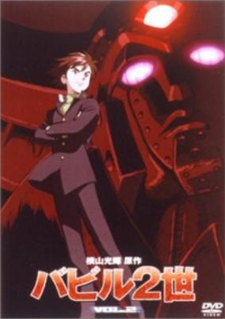

**Genres:** Science Fiction, Adventure

> Life seems simple for Koichi, a young student, until he learns that he is the reincarnation of an alien protector who crashed onto the mantle of responsibility as "defender of the Earth," Koichi/Babel teams up with a trio of super-powered alien companions to battle the the dark forces of an evil cult leader. The war to save humanity takes Babel from the deserts of southern Asia to the upper east side of Manhattan and ultimately to a final showdown with "the master" in a hidden base nestled in the Swiss Alps. The action is fast-paced and deadly. The fate of the world rests in the ability of this courageous youth to tame his latent psychic power and use it to defeat the enemies of mankind.
>
> _Synopsis source: Kitsu_

[Wikipedia](https://en.wikipedia.org/wiki/Babel_II#Anime_television_(1973)) · [Kitsu](https://kitsu.io/anime/babel-nisei-1973)

---

### Demetan Croaker, The Boy Frog (Adventures On Rainbow Pond)

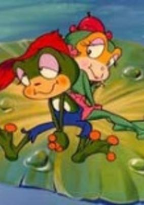

**Genres:** Comedy, Fantasy, Kids

> Demetan comes from such a poor family that he cannot even go to school in his woodland pond community. However, he has a friend named Ranatan, the lovely, gentle frog girl who is the daughter of the pond's rich ruler. Naturally her father is quite displeased by this relationship and he seeks to break it up. Nevertheless the young frogs continue with courage and confidence, not only to live their own lives but to guide the heartless leopard frog to a sense of justice and generosity. Gradually the pond community responds to their sincerity and joins them in a march toward a bright future.
>
> _Synopsis source: Kitsu_

[Wikipedia](https://en.wikipedia.org/wiki/Demetan_Croaker,_The_Boy_Frog) · [Kitsu](https://kitsu.io/anime/kerokko-demetan)

---

### Fables of the Green Forest

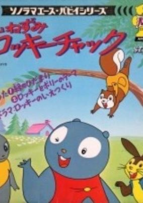

**Genres:** Fantasy, Adventure, Kids

> Various stories about a group of animals that live together in a forest. The stories are adaptations from the many children's books written by Thornton W. Burgess.
>
> _Synopsis source: Kitsu_

[Wikipedia](https://en.wikipedia.org/wiki/Fables_of_the_Green_Forest) · [Kitsu](https://kitsu.io/anime/yama-nezumi-rocky-chuck)

---

### Jungle Kurobe

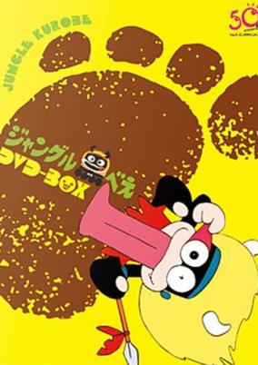

**Genres:** Comedy, Kids

> Urobe was a son of the great chief of Pyrimi, Africa. One day he hung on an airplane and came to Japan. Because of the cold and hunger, he fell on to the yard of Shishio’s house, and Shishio nursed him. Kurobe was very thankful for him and began to repay for his kindness. Kurobe dug a big hole in the yard. Every time he returns the favor, he threw a stone into the hole until stones would fill the hole.
>
> _Synopsis source: Kitsu_

[Wikipedia](https://en.wikipedia.org/wiki/Jungle_Kurobe) · [Kitsu](https://kitsu.io/anime/jungle-kurobee)

---

### Mazinger Z

**Genres:** Mecha, Piloted Robot, Action, Science Fiction

> The villainous Dr. Hell has amassed an army of mechanical beasts in his secret hideaway, the island of Bardos located in the Aegean Sea. He is capable of controlling mechanized beasts with his cane, and instructs them to unleash devastating attacks. However, Dr. Hell doesn't do all the dirty work by himself; he has his loyal henchman Baron Ashura to carry out his devilish plans. There are also those that will see to it that evil does not prevail. Kouji Kabuto is the young and feisty teenager with a score to settle: his goal is avenging the murder of his grandfather by Dr. Hell. And he might just be able to pull it off, as he is the pilot of Mazinger Z, a mighty giant robot made out of an indestructible metal known as Super-Alloy Z. Mazinger Z boasts several powerful special attacks. By channeling Photonic Energy through its eyes, and unleashing the Koushiryoku Beam, it can cause great destruction. But things get really cool when Mazinger Z launches its Rocket Punch attack. Dr. Hell and his minions might have just found their match!
>
> _Synopsis source: Kitsu_

[Kitsu](https://kitsu.io/anime/mazinger-z)

---

### The Panda's Great Adventure

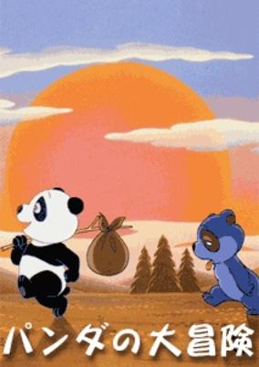

**Genres:** Adventure, Comedy, Coming Of Age, Anthropomorphism, Slapstick

> This movie, another from the older production from Toei Animetion for children, follows the adventures from a little panda that leaves his current family and wants to travel.
>
> _Synopsis source: Kitsu_

[Kitsu](https://kitsu.io/anime/panda-no-daibouken)

---

### Doraemon

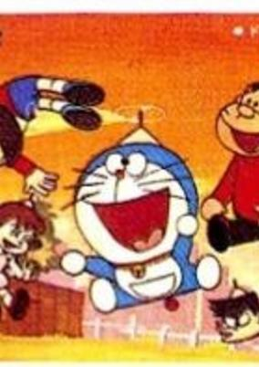

**Genres:** Science Fiction, Mecha, Japan, Slice of Life, Comedy, Android, Present, Fantasy, Adventure, Kids

> Nobita Nobi is so hapless that his 22nd century decendants are still impoverished as a result of his 20th century bumbling. In a bid to raise their social status, their servant, a robotic cat named Doraemon, decides to travel back in time and guide Nobita on the proper path to fortune. Unfortunately Doraemon, a dysfunctional robot that the familly acquired by accident (but chose to keep nonetheless), isn't much better off than Nobita. The robot leads Nobita on many adventures, and while Nobita's life certainly is more exciting with the robot cat from the future, it is questionable if it is in fact better in the way that Doraemon planned.
>
> _Synopsis source: Kitsu_

[Wikipedia](https://en.wikipedia.org/wiki/Doraemon_(1973_TV_series)) · [Kitsu](https://kitsu.io/anime/doraemon)

---

### Little Wansa

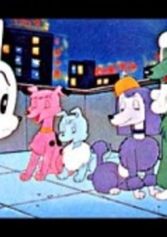

**Genres:** Comedy

> The hero of Wansa-kun is Wansa, a puppy who is sold for a pittance, then escapes, and spends much of the rest of the series looking for his mother.
>
> _Synopsis source: Kitsu_

[Wikipedia](https://en.wikipedia.org/wiki/Little_Wansa) · [Kitsu](https://kitsu.io/anime/wansa-kun)

---

### Isamu, Boy of the Wilderness

[Wikipedia](https://en.wikipedia.org/wiki/K%C5%8Dya_no_Sh%C5%8Dnen_Isamu)

---

### Microsuperman

[Wikipedia](https://en.wikipedia.org/wiki/Microsuperman)

---

### Belladonna of Sadness

[Wikipedia](https://en.wikipedia.org/wiki/Belladonna_of_Sadness)

---

### Mazinger Z vs. Devilman

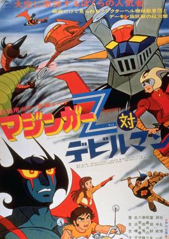

**Genres:** Mecha, Science Fiction, Action, Demon, Adventure

> The heroes of the series Mazinger Z and Devilman fighting against the evil Demon Clan.
>
> _Synopsis source: Kitsu_

[Wikipedia](https://en.wikipedia.org/wiki/Mazinger_Z_vs._Devilman) · [Kitsu](https://kitsu.io/anime/mazinger-z-vs-devilman)

---

### Miracle Girl Limit-chan

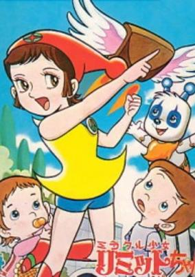

**Genres:** Science Fiction, Human Enhancement, Cyborg, Super Power, Magic, Comedy, School Life

> As a result of a traffic accident, Limit-chan is reborn as a cyborg and is given three types of supernatural powers. However, there is a catch: if she uses too much of them, her life will come to an end.
>
> _Synopsis source: Kitsu_

[Wikipedia](https://en.wikipedia.org/wiki/Miracle_Girl_Limit-chan) · [Kitsu](https://kitsu.io/anime/miracle-shoujo-limit-chan)

---

### Zero Tester

**Genres:** Science Fiction, Mecha, Action, Adventure

> A series of space accidents turn out to be the work of the Armanoid aliens, who plan to conquer Earth. Professor Tachibana gathers a team around him at the Future Science Invention Center and prepares five state-of-the-art vehicles for Shin, Go, Lisa, and Captain Kenmotsu. Three of the Tester vehicles combine to make the giant Zero Tester robot, which successfully sees off the Armanoid invasion in 39 episodes. The rest of the series, retitled ZT: Save the Earth! (Chikyu o Mamotte!), was aimed at a younger age group and featured an attack by the new Gallos aliens.
>
> _Synopsis source: Kitsu_

[Wikipedia](https://en.wikipedia.org/wiki/Zero_Tester) · [Kitsu](https://kitsu.io/anime/zero-tester)

---

### Neo-Human Casshan (Neo Human Casshan)

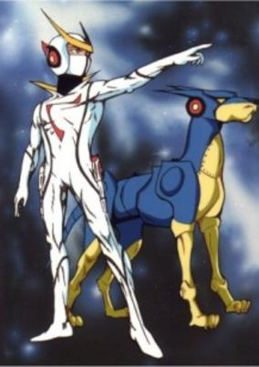

**Genres:** Android, Mecha, Action, Science Fiction

> The brilliant Dr. Azuma created many robots to aid humankind. However, during a thunderstorm his lab was struck by lightning, corrupting the programming of one of his robots, BK-1, who renames himself Braiking Boss and declares that instead of serving mankind, mankind will now serve him! He brings other robots together into an overwhelming army bent on enslaving the human race. Tetsuya, Dr. Azuma's son, asks his father to turn him into an indestructible android so that he will have the power to destroy the threat his father inadvertently created. Shortly thereafter, Braiking Boss captures Dr. Azuma and his wife, Tetsuya, now renamed Casshern, sets out to turn the tide of the war and rescue his parents, with the help of his girlfriend, Luna, and robot dog, Friender.
>
> _Synopsis source: Kitsu_

[Wikipedia](https://en.wikipedia.org/wiki/Casshan) · [Kitsu](https://kitsu.io/anime/shinzou-ningen-casshern)

---

### Karate Master (The Fanatical Karate Generation)

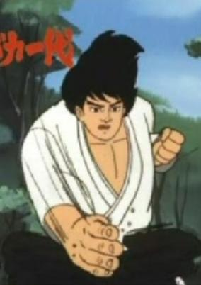

**Genres:** Adventure, Combat, Sports, Martial Arts, Friendship, Historical

> Failed kamikaze pilot Ken Asuka becomes a rough, tough hooligan who settles all of his problems with karate, until he learns about the legendary swordsman Musashi Miyamoto in the novels of Eiji Yoshikawa. Resolving to live his life like Musashi, he begins to take karate more seriously. Based on a manga by Ikki Kajiwara and Jiro Tsunoda, itself inspired by the real life of Yasunobu Oyama, the founder of the "hard-knock" Kyokushin Karate school.
>
> _Synopsis source: Kitsu_

[Wikipedia](https://en.wikipedia.org/wiki/Karate_Master) · [Kitsu](https://kitsu.io/anime/karate-baka-ichidai)

---

### The Little Judge from Hell

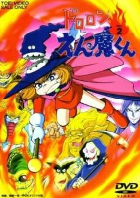

**Genres:** Contemporary Fantasy, Earth, Japan, Fantasy, Asia, Comedy, Horror, Demon

> Monsters are coming to the human world from the Hell in order to get human spirits. As people's minds are getting dirty, being attracted by the dirty spirits, the monsters break the rule to go to the human world. Tsutomu, a boy who goes to Yokai Elementary School, is suddenly assaulted by monsters. Those who save him from the monsters are Enma-kun, the son of Enma, Yukiko, a snow woman, and Kapaeru. They are members of Monster Patrol that are sent to the human world to arrest monsters.
>
> _Synopsis source: Kitsu_

[Wikipedia](https://en.wikipedia.org/wiki/Dororon_Enma-kun#Anime) · [Kitsu](https://kitsu.io/anime/dororon-enma-kun)

---

### Aim for the Ace!

[Wikipedia](https://en.wikipedia.org/wiki/Aim_for_the_Ace!#Television_series)

---

### The Adventures of Korobokkuru

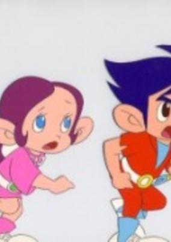

**Genres:** Adventure

> The adventures of a human and three little gnomes.
>
> _Synopsis source: Kitsu_

[Wikipedia](https://en.wikipedia.org/wiki/B%C5%8Dken_Korobokkuru) · [Kitsu](https://kitsu.io/anime/bouken-korobokkuru)

---

### Samurai Giants

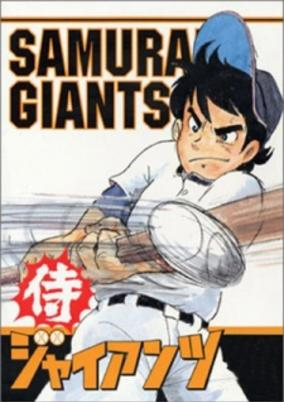

**Genres:** Sports, Comedy, Baseball

> Ban Banjou is an insolent wild boy who was raised on the rough sea in Tosa, southern Japan. He joined the Tokyo Yomiuri Giants in Japanese pro baseball league such a baseball pitcher noted for the blazing fastball and the worst control. He fights hard battles against his rival batters, developing his incredible pitching magics.
>
> _Synopsis source: Kitsu_

[Kitsu](https://kitsu.io/anime/samurai-giants)

---

### Cutey Honey

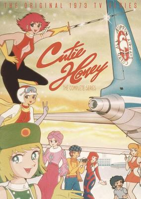

**Genres:** Science Fiction, Action, School Life

> One day, Honey Kisaragi's a trendy, class-cutting Catholic schoolgirl. The next, her father's been murdered by demonic divas from a dastardly organization called Panther Claw. When his dying message reveals that she's an android, Honey uses the transformative power of the Atmospheric Element Solidifier - the very thing Panther Claw wanted to steal - to seek revenge against the shadowy clan. Can Honey fight her way up Panther Claw's ranks to defeat its leader, the sinister Sister Jill while managing to escape the watchful eyes of Miss Histler, her school's headmistress? Aided by journalist Hayami Seiji, his ninja father, and his lady-loving grade school brother, Honey sometimes appears as a racecar driver, sometimes as a glamorous model, and sometimes as a beggar, but her true identity is none other than the warrior of love, Cutie Honey!
>
> _Synopsis source: Kitsu_

[Wikipedia](https://en.wikipedia.org/wiki/Cutey_Honey#1973_TV_series) · [Kitsu](https://kitsu.io/anime/cutey-honey)

---

### Praise be to Small Ills

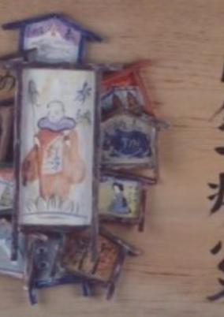

**Genres:** Historical, Music

> Stop motion cut-outs animation by Tadanari Okamoto, song narration by Kouhei Oikawa.
>
> _Synopsis source: Kitsu_

[Kitsu](https://kitsu.io/anime/nanmu-ichibyou-sokusai)

---

### The Trip

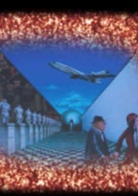

**Genres:** Fantasy, Psychological

> Surreal cutout (kiri-gami) animation following a young girl's physical journey, which is also an inner voyage through which she will learn all the pain and joy of life. She travels to an anonymous Western city, a bizarre dreamscape cluttered with elements from works by Dali, Magritte, de Chirico and Escher. The journey will change her completely but when she returns she will be the only one who knows how she has changed. (The poem in the film is by Su Tong-Po, a famous Chinese poet) -AniDB
>
> _Synopsis source: Kitsu_

[Kitsu](https://kitsu.io/anime/tabi)

---
