# 1974 in Anime

[← Back to index](../README.md)

29 titles · 22 with a matched synopsis/cover art · [source](https://en.wikipedia.org/wiki/1974_in_anime)

## Releases

### The Life of a Poet

[Wikipedia](https://en.wikipedia.org/wiki/Kihachir%C5%8D_Kawamoto)

---

### Polon the Star Child

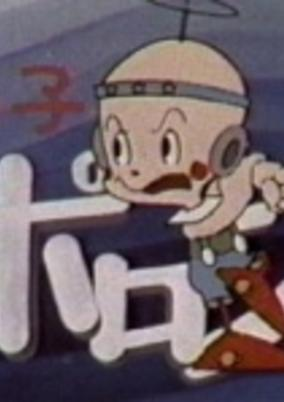

**Genres:** Science Fiction

> Poron/Polon is an alien child who comes in a flying saucer from the distant reaches of space to Earth. There, he soon encounters the native life-forms, although as a new arrival, he is unaware that he has ignored humans, and instead befriends a rabbit, a bear, and a fox. This little-known science fantasy is not to be confused with Chobin the Starchild, which started its TV run a month earlier.
>
> _Synopsis source: Kitsu_

[Wikipedia](https://en.wikipedia.org/wiki/Hoshi_no_Ko_Poron) · [Kitsu](https://kitsu.io/anime/hoshi-no-ko-poron)

---

### Heidi, Girl of the Alps

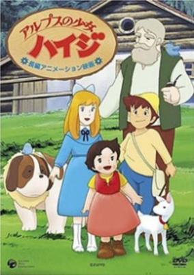

**Genres:** Earth, Slice of Life, Europe, Past, Friendship, Plot Continuity, Historical

> After becoming an orphan, Heidi is forced to live with her grandfather Öhi, who lives in the Alps. She learns he's a very bitter man who only accepted by force to take her in. But Heidi's kindness may be able to open his heart. Together with the shepherd Peter and invalid Klara, she has lots of adventures.
>
> _Synopsis source: Kitsu_

[Wikipedia](https://en.wikipedia.org/wiki/Heidi,_Girl_of_the_Alps) · [Kitsu](https://kitsu.io/anime/alps-no-shoujo-heidi)

---

### No Good Dad

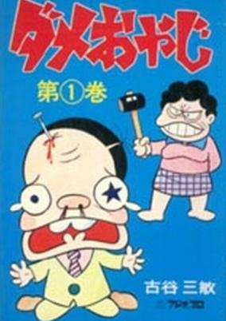

**Genres:** Earth, Japan, Asia, Slice of Life, Slapstick, Violence, Present, Comedy

> Dame Oyaji is the story of Damesuke Amano, a hapless office worker who faces a tremendous amount of bullying on the job and especially at home, where he has (contrary to traditional Japanese notions of family) absolutely no power or say in the runnings of the household whatsoever. Amano lives with his wife, Onibaba, his beautiful teenaged daughter Yukiko, and his grade-schooler son Takobo. Onibaba is an imposing, violent heifer of a woman who regularly berates and even physically assaults her husband and who enjoys nothing more than making his life miserable; Yukiko and Takobo frequently join in physically and psychologically abusing their father. The original manga is said to have been quite shocking to early 1970s Japan, in which the father was often still traditionally regarded as the head of the household.
>
> _Synopsis source: Kitsu_

[Wikipedia](https://en.wikipedia.org/wiki/Dame_Oyaji) · [Kitsu](https://kitsu.io/anime/dame-oyaji)

---

### Mazinger Z vs. Dr. Hell

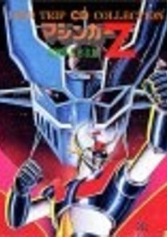

**Genres:** Science Fiction, Mecha, Drama, Action

> Episode 57 "Dr. Hell Occupies Japan" of the original TV show, shown as a movie.
>
> _Synopsis source: Kitsu_

[Kitsu](https://kitsu.io/anime/mazinger-z-vs-dr-hell)

---

### Yaemon, the Locomotive

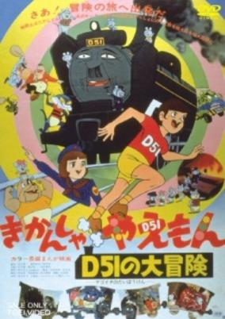

**Genres:** Fantasy, Kids

> Traditionally animated movie based on a bestseller picture book by Agawa Hiroyuki, illustrated by Okabe Fuyuhiko and published in 1959 by Iwanami Shoten Publishing.
>
> _Synopsis source: Kitsu_

[Kitsu](https://kitsu.io/anime/kikansha-yaemon-d51-no-daibouken)

---

### Little Meg the Witch Girl

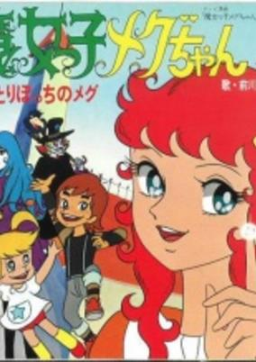

**Genres:** Coming Of Age, Magic, Magical Girl

> Megu is sent to Earth in her early teens, she is adopted by Mammi Kanzaki, a former witch who gave up her royal ambitions to wed a mortal. Mammi bewitches her husband and their two children, Rabi and Apo, into believing that Megu has always been the eldest child of the family. Under Mammi's tutelage, Megu learns to control both her abilities and impulses in order to prove her worthiness for the crown. This Rite-of-Passage subtext is continued throughout the series.
>
> _Synopsis source: Kitsu_

[Wikipedia](https://en.wikipedia.org/wiki/Majokko_Megu-chan) · [Kitsu](https://kitsu.io/anime/majokko-megu-chan)

---

### Hymn to Judo

---

### Chargeman Ken!

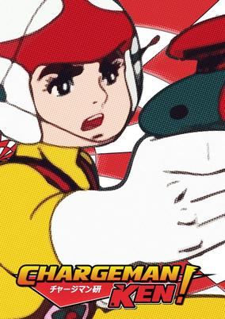

**Genres:** Science Fiction, Action, Adventure

> Ken Izumi is a kid who can charge his powers from surrounding light sources and use them through a laser type gun.
>
> _Synopsis source: Kitsu_

[Wikipedia](https://en.wikipedia.org/wiki/Chargeman_Ken!) · [Kitsu](https://kitsu.io/anime/chargeman-ken)

---

### Vicky the Viking

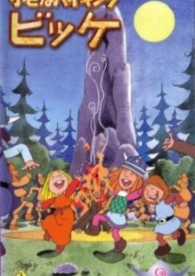

**Genres:** Adventure, Comedy, Swordplay, Europe, Past, Historical, Kids

> Long ago, in a little Viking Village called Flake, young Wickie lives a happy life. His father, Halvar, is the chief of the Vikings, and would have liked a son a little more courageous. So, he and his team take Wicke along on their journeys to give him the experience he'll need to be a real Viking. Yet, somehow Halvar and his men end up trapped or hopelessly stuck somewhere in most cases, and it`s up to Wickie alone to help them out with his flashes of wit.
>
> _Synopsis source: Kitsu_

[Wikipedia](https://en.wikipedia.org/wiki/Vicky_the_Viking) · [Kitsu](https://kitsu.io/anime/chiisana-viking-vickie)

---

### Getter Robo

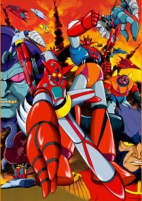

**Genres:** Mecha, Science Fiction, Action

> From deep within the Earth's surface, the Dinosaur Kingdom make their move to wipe out mankind and conquer the planet with their mechanical dinosaurs. After a prototype Getter Robo is shot down by a mechanical dinosaur, the Saotome Research Institute decides to use the real Getter Robo, which is combat-capable. Due to a lack of pilots in the institute, Ryo Nagare goes to his college to persuade martial artist Musashi Tomoe and outcast Hayato Jin to join him and pilot the Getter Machines to combat the new threat and protect mankind.
>
> _Synopsis source: Kitsu_

[Wikipedia](https://en.wikipedia.org/wiki/Getter_Robo) · [Kitsu](https://kitsu.io/anime/getter-robo)

---

### My Neighbor Tamageta

---

### The New Adventures of Hutch the Honeybee

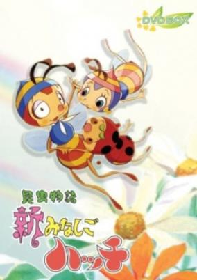

**Genres:** Comedy, Drama, Adventure

> The sequel to Konchuu Monogatari Minashigo Hutch where Hutch struggles with married life.
>
> _Synopsis source: Kitsu_

[Wikipedia](https://en.wikipedia.org/wiki/New_Honeybee_Hutch) · [Kitsu](https://kitsu.io/anime/shin-minashigo-hutch)

---

### Chobin the Star Child (Starchild Chobin)

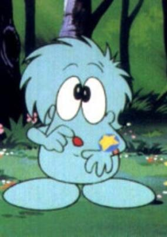

**Genres:** Fantasy, Adventure, Action, Comedy, Alien, Science Fiction

> Chobin is a cute little alien prince from another planet, who crash landed on earth. Looking for his mother, he has a magical bracelet that will help him on his quest.
>
> _Synopsis source: Kitsu_

[Wikipedia](https://en.wikipedia.org/wiki/Hoshi_no_Ko_Chobin) · [Kitsu](https://kitsu.io/anime/hoshi-no-ko-chobin)

---

### The Beardless Gogejabal

---

### Zero Tester

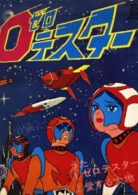

**Genres:** Science Fiction, Mecha, Action, Adventure

> A series of space accidents turn out to be the work of the Armanoid aliens, who plan to conquer Earth. Professor Tachibana gathers a team around him at the Future Science Invention Center and prepares five state-of-the-art vehicles for Shin, Go, Lisa, and Captain Kenmotsu. Three of the Tester vehicles combine to make the giant Zero Tester robot, which successfully sees off the Armanoid invasion in 39 episodes. The rest of the series, retitled ZT: Save the Earth! (Chikyu o Mamotte!), was aimed at a younger age group and featured an attack by the new Gallos aliens.
>
> _Synopsis source: Kitsu_

[Wikipedia](https://en.wikipedia.org/wiki/Zero_Tester) · [Kitsu](https://kitsu.io/anime/zero-tester)

---

### Jack and the Beanstalk

[Wikipedia](https://en.wikipedia.org/wiki/Jack_and_the_Beanstalk_(1974_film))

---

### Mazinger Z vs. The Great General of Darkness

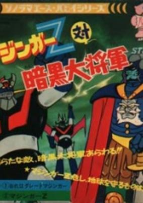

**Genres:** Mecha, Super Robot, Science Fiction, Action, Robot

> Kouji and his friends have defeated Dr. Hell and are now enjoying a break, but suddenly a strange prophet appears and warns everyone of an oncoming danger, mechanical beasts never seen before start appearing all around the world wrecking havoc. Its up to Kouji and his Mazinger Z to stand up to this threat but it seems he is vastly outnumber and outmatched. This film served as an alternative link between the Mazinger Z TV series and the Great Mazinger TV series. It basically introduces Great Mazinger to the audience, as well as his enemies from the Mikene Empire.
>
> _Synopsis source: Kitsu_

[Wikipedia](https://en.wikipedia.org/wiki/Mazinger_Z_vs._The_Great_General_of_Darkness) · [Kitsu](https://kitsu.io/anime/mazinger-z-vs-general-dark)

---

### Getter Robo

**Genres:** Mecha, Science Fiction, Action

> From deep within the Earth's surface, the Dinosaur Kingdom make their move to wipe out mankind and conquer the planet with their mechanical dinosaurs. After a prototype Getter Robo is shot down by a mechanical dinosaur, the Saotome Research Institute decides to use the real Getter Robo, which is combat-capable. Due to a lack of pilots in the institute, Ryo Nagare goes to his college to persuade martial artist Musashi Tomoe and outcast Hayato Jin to join him and pilot the Getter Machines to combat the new threat and protect mankind.
>
> _Synopsis source: Kitsu_

[Kitsu](https://kitsu.io/anime/getter-robo)

---

### Great Mazinger

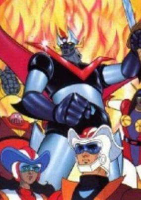

**Genres:** Mecha, Super Robot, Piloted Robot, Science Fiction, Action, Robot

> A manga comic book and anime television series by manga artist Go Nagai, made as a direct continuation of the successful Mazinger Z series. It was aired on Japan in 1974, immediately following the end of the first Mazinger series.
>
> _Synopsis source: Kitsu_

[Wikipedia](https://en.wikipedia.org/wiki/Great_Mazinger) · [Kitsu](https://kitsu.io/anime/great-mazinger)

---

### Jungle Tales (Urikupen Rescue Team)

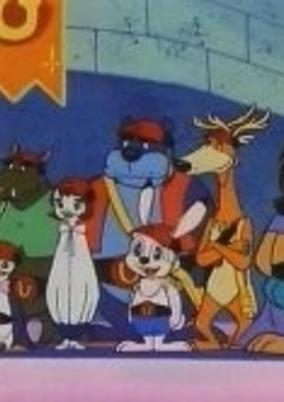

**Genres:** Comedy, Adventure, Kids

> Four young animals, rabbit Seitaro Usagi, squirrel Risu, bear Kuma, and penguin Penguin (U-Ri-Ku-Pen), are part of a team of brave young animals that rescues others in peril. Other team members included a dog, a boar, a deer, a koala, a mouse, a seagull, and a lion. The animals would win a prize for completing a mission, as would the viewers, who were encouraged to write in and guess which of the creatures would save the world by each Friday (a single mission stretched over a week of TV). Created by Mitsuru Kaneko, this show was given a limited broadcast on some American local TV stations for the Japanese community.
>
> _Synopsis source: Kitsu_

[Wikipedia](https://en.wikipedia.org/wiki/Urikupen_Ky%C5%ABjotai) · [Kitsu](https://kitsu.io/anime/urikupen-kyuujotai)

---

### Jim Button

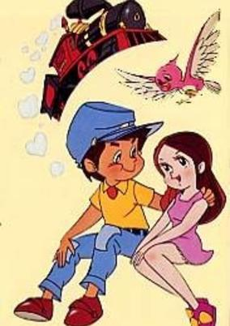

**Genres:** Magic, Fantasy, Adventure, Kids

> Jim Button and his best friend Luke live on an island. When Luke has to leave the island Jim decides to go with him. when they leave they don't have a clue about the hidden dangers in the world. while traveling they learn that a young princess name Lisi was captured by pirates whom brought her to Sorrowland. The evil and dangerous dragon miss. Grindtooth rules in that land. Jim and Luke decide to go to Sorrowland to save princess Lisi.
>
> _Synopsis source: Kitsu_

[Wikipedia](https://en.wikipedia.org/wiki/Jim_Button_and_Luke_the_Engine_Driver#Adaptations) · [Kitsu](https://kitsu.io/anime/jim-button)

---

### Hurricane Polymar

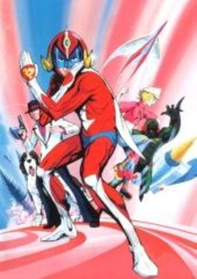

**Genres:** Science Fiction, Comedy, Super Power, Action, Adventure, Cops

> Yoroi Takeshi is a carefree and somewhat naïve youth, who works as an assistant to the bumbling detective wannabe Kuruma Jo (who frequently proclaims himself the heir apparent to the title of Greatest Detective “Sherlock Holmes”). From their rundown and shabby office, they run a humble if not failing private investigation service. The spunky and cute Nanba Teru (who’s father owns the building when Jo and Takeshi reside in) frequently interferes in their affairs by threatening eviction (Jo is continually months behind in back rent). Since they rarely get any clients, they must resort to eavesdropping and spying on the Secret International Police Department headquarters, located in the building across from theirs in order to get their assignments. Unbeknownst to Jo and Teru, Takeshi has a deep secret. Not only is Takeshi the son of the International Police Department Chief but in times of peril and danger, mild-mannered Takeshi uses his trusty Poly-Met (Polymer Helmet) to transform into the Superhero “Hurricane” Polymer, a red suited masked man with incredible fighting abilities and superhuman strength. The only one who knows Takeshi’s secret is his lazy Saint Bernard, Daisaku, who always likes to provide cutting commentary to the audience (using his inner voice). Together Jo and Takeshi (as Polymer) confront and battle a myriad of evil organizations, criminal gangs, mutants and monsters as they fight crime in the future city of Washinkyo (Washington/Tokyo).
>
> _Synopsis source: Kitsu_

[Wikipedia](https://en.wikipedia.org/wiki/Hurricane_Polymar) · [Kitsu](https://kitsu.io/anime/hurricane-polymar)

---

### First Human Giatrus

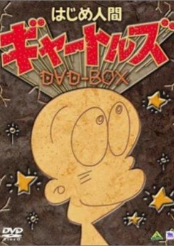

**Genres:** Comedy, Historical

> A comedy about the wacky adventures of Giatrus and his tribe of the first human beings on the planet.
>
> _Synopsis source: Kitsu_

[Wikipedia](https://en.wikipedia.org/wiki/First_Human_Giatrus) · [Kitsu](https://kitsu.io/anime/hajime-ningen-gyatoruz)

---

### Space Battleship Yamato

[Wikipedia](https://en.wikipedia.org/wiki/Space_Battleship_Yamato)

---

### The Song of Tentomushi (Song of the Ladybug)

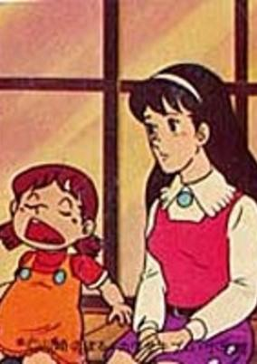

**Genres:** Slice of Life, Drama, Family, Kids

> The adventures of seven orphan who live in poverty, although they have a very rich grandfather.
>
> _Synopsis source: Kitsu_

[Wikipedia](https://en.wikipedia.org/wiki/The_Song_of_Tentomushi) · [Kitsu](https://kitsu.io/anime/tentou-mushi-no-uta)

---

### Calimero

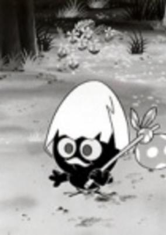

**Genres:** Comedy

> Calimero is a small black bird who has a shell on his head; his dream is to fly like the other birds. When he tries to fly and screws up he is teased by the other birds, but his girlfriend Pricilla is there to cheer him up. Despite his appearance, he is quite smart and thinks up an idea to fly.
>
> _Synopsis source: Kitsu_

[Wikipedia](https://en.wikipedia.org/wiki/Calimero) · [Kitsu](https://kitsu.io/anime/calimero)

---

### Barbapapa

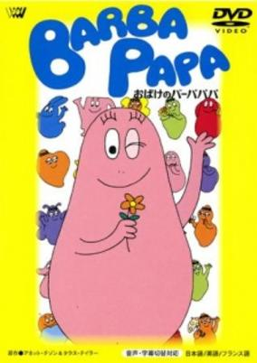

**Genres:** Comedy, Fantasy

> Barbapapa and his family can turn into anything they want. Each member of the family has his or her own personality. Very good show for the youngest children as each episode deals with another problem they will recognize in a way that is 'morally correct'.
>
> _Synopsis source: Kitsu_

[Wikipedia](https://en.wikipedia.org/wiki/Barbapapa#Television) · [Kitsu](https://kitsu.io/anime/barbapapa)

---

### Pop

---
