# 1975 in Anime

[← Back to index](../README.md)

29 titles · 19 with a matched synopsis/cover art · [source](https://en.wikipedia.org/wiki/1975_in_anime)

## Releases

### Dog of Flanders

[Wikipedia](https://en.wikipedia.org/wiki/Dog_of_Flanders_(TV_series))

---

### Japanese Folklore Tales

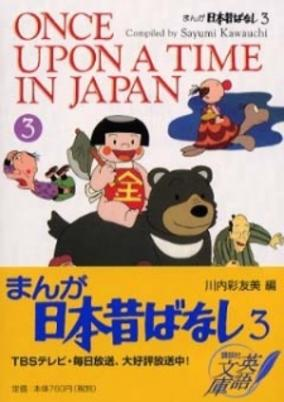

**Genres:** Historical

> This series is an anthology of old Japanese tales.
>
> _Synopsis source: Kitsu_

[Kitsu](https://kitsu.io/anime/manga-nippon-mukashibanashi)

---

### Great Mazinger vs. Getter Robo

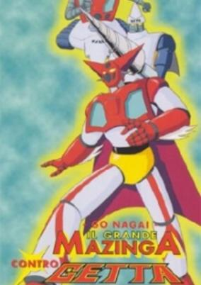

**Genres:** Science Fiction, Mecha, Super Robot, Piloted Robot, Robot, Action

> Go Nagai crossover movie.
>
> _Synopsis source: Kitsu_

[Wikipedia](https://en.wikipedia.org/wiki/Great_Mazinger_vs._Getter_Robo) · [Kitsu](https://kitsu.io/anime/great-mazinger-vs-getter-robo)

---

### Get That Flying Saucer

---

### The Little Mermaid

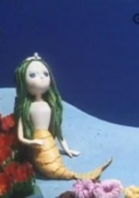

> A stop-motion film adaptation of Hans Christian Andersen's <i>The Little Mermaid</i>.
>
> _Synopsis source: Kitsu_

[Wikipedia](https://en.wikipedia.org/wiki/Hans_Christian_Andersen%27s_The_Little_Mermaid_(1975_film)) · [Kitsu](https://kitsu.io/anime/ningyohime)

---

### Maya the Honey Bee (Maya the Bee)

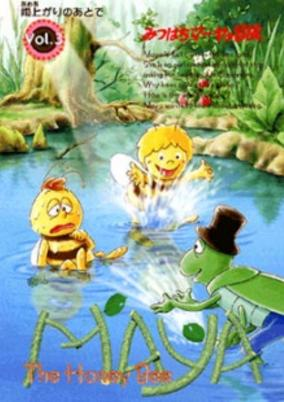

**Genres:** Earth, Adventure, Anthropomorphism, Comedy, Kids

> Maya, a newborn honeybee, brims with curiosity about the world around her. From the time she is born, she is brought up to be a worker bee, but it is difficult for her to understand and follow the strict rules of the hive because of her individuality and strong desire for independence. Having collected all the honey around the honeycomb, Maya decides to set out on an adventure to find a flower garden in order to collect more honey for the hive. Her intentions are noble, but because she leaves the hive without permission, the Queen sends Maya's friend Willy to search for the little troublemaker. Willy joins Maya in her quest, and together, beyond the familiar hive, the two friends marvel at the sheer beauty that nature has to offer. Through many experiences—sometimes enjoyable, sometimes terrible or sad—and encounters with various insects, Maya matures into a strong and wise honeybee.
>
> _Synopsis source: Kitsu_

[Wikipedia](https://en.wikipedia.org/wiki/Maya_the_Honey_Bee) · [Kitsu](https://kitsu.io/anime/mitsubachi-maya-no-bouken)

---

### Reideen the Brave

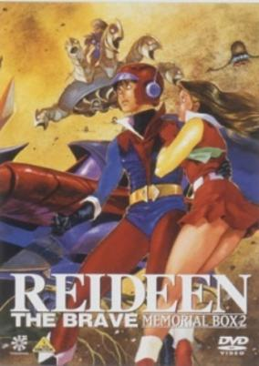

**Genres:** Transforming Craft, Science Fiction, Mecha, Action, Piloted Robot, Stereotypes, Robot, Adventure

> After a slumber of 12 millennia, the Demon Empire returns to seize control of the Earth. Reideen, the giant robot-like protector of the lost continent of Mu, senses the evil presence and awakens within its golden pyramid, revealing to young Japanese boy Akira Hibiki that he is the one descendant of the ancient Mu people who must help Reideen save Earth. He was assisted by his friends, token girl Mari Sakurano (daughter of a scientist fighting the Demon Empire) and several members of his high school soccer team.
>
> _Synopsis source: Kitsu_

[Kitsu](https://kitsu.io/anime/yuusha-raideen)

---

### La Seine no Hoshi

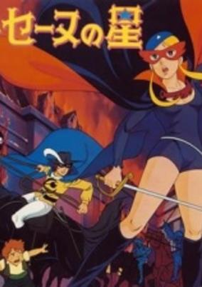

**Genres:** France, Earth, Swordplay, Historical, Adventure

> The story is set in Paris, on the night before the France Revolution. The civilians have been suffering under the tyrannical rule of Louis, the sixteenth. In order to release the people from their suffering, Simone, a young girl whose parents were killed by the aristocrats, decides to challenge the corrupted aristocrats. Covering her face with a red mask and leaving a red carnation as a mark of her presence, Simone is La Seine no Hoshi.
>
> _Synopsis source: Kitsu_

[Wikipedia](https://en.wikipedia.org/wiki/La_Seine_no_Hoshi) · [Kitsu](https://kitsu.io/anime/star-of-the-seine)

---

### The Don Chuck Story (Don Chuck Stories)

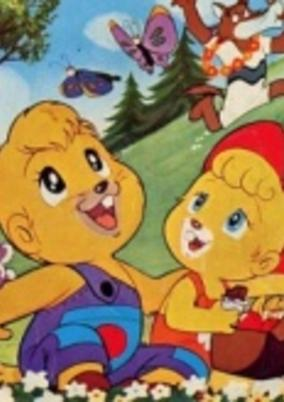

**Genres:** Slice of Life, Adventure, Kids

> Young beaver Chuck's adventure with his little friends. When thy are in trouble, Chuck often asks his father to help them out.
>
> _Synopsis source: Kitsu_

[Wikipedia](https://en.wikipedia.org/wiki/Don_Chuck_Monogatari) · [Kitsu](https://kitsu.io/anime/don-chuck-monogatari)

---

### The Adventures of Gamba (Adventure of Gamba)

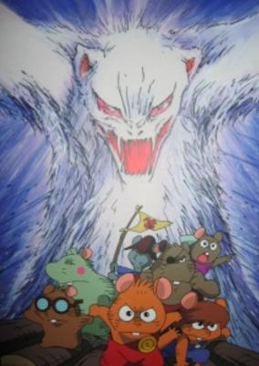

**Genres:** Earth, Adventure, Action, Thriller, Coming Of Age, Anthropomorphism, Plot Continuity, Present, Kids

> An adventurous wild mouse called Gamba travels with his friends to see the ocean but he finds an injured mouse and hears about the violence of white ferret Noroi. Gamba decides to help the mice suffering under Noroi's tyranny.
>
> _Synopsis source: Kitsu_

[Wikipedia](https://en.wikipedia.org/wiki/Gamba_no_B%C5%8Dken) · [Kitsu](https://kitsu.io/anime/gamba-no-bouken)

---

### Young Tokugawa Ieyasu

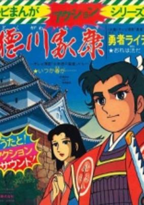

**Genres:** Sengoku Period, Historical

> A historical tale of the early life of Tokugawa Ieyasu, who would eventually become shogun and establish the Edo Period in Japan.
>
> _Synopsis source: Kitsu_

[Kitsu](https://kitsu.io/anime/shounen-tokugawa-ieyasu)

---

### Getter Robo G

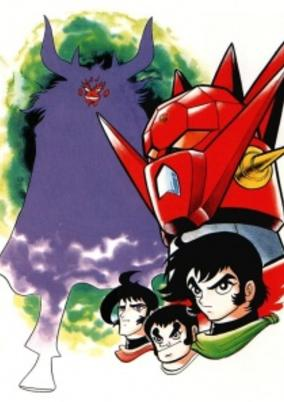

**Genres:** Super Robot, Robot, Science Fiction, Action, Mecha, Demon

> Takes place after the final defeat of the Dinosaur Empire and the death of Musashi Tomoe in the original Getter Robo series. Dr. Saotome, creator of Getter Robo, fears that the peace the Getter Robo team has won will be short lived and that an even greater enemies would appear. Dr. Saotome's fears are justified when the militaristic Hyakki (or "Hundred demons") Empire appears, but Dr. Saotome is prepared with the creation of an even more powerful Getter Robo, Getter Robo G and a new Getter Robo base. Also with Musashi Tomoe dead, Dr. Saotome needs a third pilot which he finds in baseball player Benkei Kuruma.
>
> _Synopsis source: Kitsu_

[Wikipedia](https://en.wikipedia.org/wiki/Getter_Robo_G) · [Kitsu](https://kitsu.io/anime/getter-robo-g)

---

### Tekkaman: The Space Knight

---

### The Great War of the Space Saucers

---

### Great Mazinger vs. Getter Robo G: The Great Clash in the Sky

---

### The Dolphin and the Boy

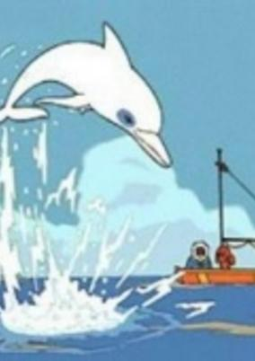

**Genres:** Adventure, Kids

> The series presents the adventures of Zoum, a white dolphin and his friends, two children who live with their sailor uncle. The cast includes several animals including a mynah bird (who understands the dolphin language in addition to the language of the other animals and the humans on the island and acts as a translator), a koala, and a sloth. During their adventures, Zoum meets a beautiful female dolphin, called Za-za-zoom in the English version, with whom he has a baby.
>
> _Synopsis source: Kitsu_

[Wikipedia](https://en.wikipedia.org/wiki/Zoom_the_White_Dolphin) · [Kitsu](https://kitsu.io/anime/iruka-to-shounen)

---

### Dracula's Song

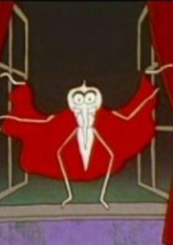

**Genres:** Vampire, Music, Kids

> An imaginative take on Dracula is shown in this musical video from the Minna no Uta franchise.
>
> _Synopsis source: Kitsu_

[Kitsu](https://kitsu.io/anime/dracula-no-uta)

---

### With One Courage As a Friend

---

### World Famous Fairy Tale Series

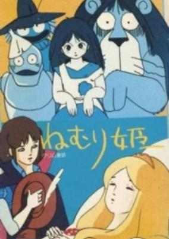

**Genres:** Fantasy

> Another of Toei's World Famous Fairy Tale series consisting of 20 stories, 10 minutes each.
>
> _Synopsis source: Kitsu_

[Kitsu](https://kitsu.io/anime/sekai-meisaku-douwa)

---

### Arabian Nights: Sinbad's Adventures

---

### Kum-Kum (Kum Kum)

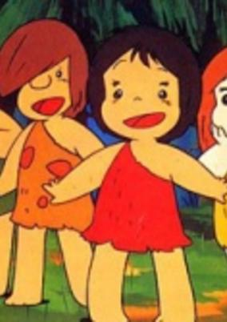

**Genres:** Comedy, Past, Historical, Adventure, Kids

> This is the tale of Kum Kum, a kind of prehistoric "Dennis the Menace" who lived long ago. He and his family and friends belonged to a tribe of Mountain People who lived and hunted and farmed high in the hills near the Fire Mountain. This is a comedy series earmarked by infectious chibi-cuteness mixed with the pathos of every-day prehistoric life. The storylines revolves around the adventures of Kum Kum (pronounced coom-coom) and his young friends. Kum Kum has a real knack for getting himself (and the other kids) in trouble and that's what makes the series fun!
>
> _Synopsis source: Kitsu_

[Wikipedia](https://en.wikipedia.org/wiki/Kum-Kum) · [Kitsu](https://kitsu.io/anime/wanpaku-oomukashi-kum-kum)

---

### Time Bokan

[Wikipedia](https://en.wikipedia.org/wiki/Time_Bokan)

---

### Steel Jeeg

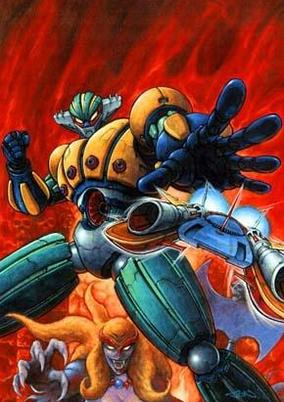

**Genres:** Science Fiction, Mecha, Fantasy, Action, Super Robot, Human Enhancement, Cyborg, Dark Fantasy, Robot, Demon

> Hiroshi Shiba is an outstanding car racer whose father is assassinated upon the discovery of the Bronze Bell from an ancient civilization. This Bronze Bell is coveted by Queen Himika who comes from that ancient era; the Yamatai Kingdom, and whose ambitions are to seize the Bell and dominate earth. Hiroshi is left with a few items from his father which would enable him to morph into a full sized mecha warrior, the Steel Jeeg. With these abilities and the help of his father's brain implanted in a computer and his assistance Miwa "Micchi" Uzuki, they set out to neutralize Himika's plans of world dominion.
>
> _Synopsis source: Kitsu_

[Wikipedia](https://en.wikipedia.org/wiki/Steel_Jeeg) · [Kitsu](https://kitsu.io/anime/koutetsu-jeeg)

---

### UFO Robot Grendizer

**Genres:** Science Fiction, Mecha, Earth, Japan, Action, Super Robot, Robot

> A giant sea monster known as "Dragonsaurus" has emerged from out of nowhere, terrorizing the depths of the oceans. Great Mazinger, Grendizer and the Getter Robo G team join forces to combat the new threat. But their task becomes more complicated when Dragonsaurus swallows up Boss Borot and makes its way toward Tokyo.
>
> _Synopsis source: Kitsu_

[Wikipedia](https://en.wikipedia.org/wiki/Grendizer) · [Kitsu](https://kitsu.io/anime/grendizer-getter-robo-g-great-mazinger-kessen-daikaijuu)

---

### The Original Genius Bakabon

[Wikipedia](https://en.wikipedia.org/wiki/Tensai_Bakabon#Anime)

---

### The Adventures of Pepero (Adventures of Pepero the Andes Boy)

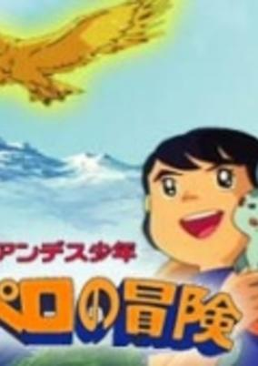

**Genres:** Adventure

> This is the quest of Pepero and his friends in search of the Golden Condor or el Dorado.
>
> _Synopsis source: Kitsu_

[Wikipedia](https://en.wikipedia.org/wiki/The_Adventures_of_Pepero) · [Kitsu](https://kitsu.io/anime/andes-shounen-pepero-no-bouken)

---

### Laura, the Prairie Girl (Laura)

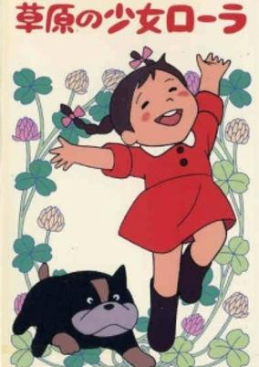

**Genres:** Adventure

> This anime is based on the same work as the famous American live-action TV series Little House on the Prairie.
>
> _Synopsis source: Kitsu_

[Wikipedia](https://en.wikipedia.org/wiki/Laura,_the_Prairie_Girl) · [Kitsu](https://kitsu.io/anime/sougen-no-shoujo-laura)

---

### Ikkyu the Little Monk

[Wikipedia](https://en.wikipedia.org/wiki/Ikky%C5%AB-san_(TV_series))

---

### The Water Seed

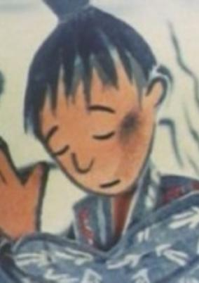

**Genres:** Historical

> Typically brilliant OKAMOTO Tadanari short film, based on a traditional story retold by MATSUTANI Miyoko, with narration by KISHIDA Kyouko.
>
> _Synopsis source: Kitsu_

[Kitsu](https://kitsu.io/anime/mizu-no-tane)

---
