# 1976 in Anime

[← Back to index](../README.md)

27 titles · 24 with a matched synopsis/cover art · [source](https://en.wikipedia.org/wiki/1976_in_anime)

## Releases

### The Adventures of Huckleberry Finn

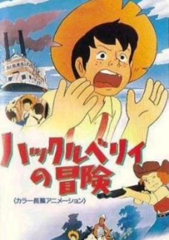

**Genres:** Historical, Drama, Adventure

> Based on Mark Twain's well known masterpiece about Huckleberry Finn, the bright and merry orphan, this film is full of life, laughter, and will be loved by children around the world. When Huckleberry runs away from his orphanage, he teams up with an escaped slave. Together, they travel the Mississippi on a raft, encountering all kinds of people and adventures.
>
> _Synopsis source: Kitsu_

[Wikipedia](https://en.wikipedia.org/wiki/Huckleberry_no_B%C5%8Dken) · [Kitsu](https://kitsu.io/anime/huckleberry-no-bouken)

---

### 3000 Leagues in Search of Mother

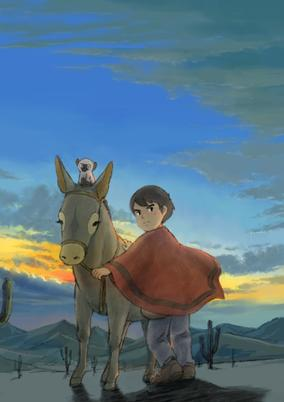

**Genres:** Historical, Slice of Life, Drama, Adventure

> Based on a short section of the novel Cuore by the Italian Edmondo de Amicis, Marco is a young boy living in Genoa, Italy, together with his father Pietro. But the family is not complete, for Marco`s mother left for Argentina around a year earlier in order to find work. Letters from her arrive regularly until one day they suddenly stop. Worry for his mother and what might have happened to her overcomes the young boy. Marco thus decides to embark upon a journey to Argentina in the hope of being reunited with his mother. At first, Pietro is opposed to Marco`s plan, but moved by his son*s enthusiasm, he eventually allows the boy to go. So begins Marco`s long journey of the heart. Marco encounters many people throughout his travels, and finds maturity and self-acceptance as a result of his experiences.
>
> _Synopsis source: Kitsu_

[Wikipedia](https://en.wikipedia.org/wiki/3000_Leagues_in_Search_of_Mother) · [Kitsu](https://kitsu.io/anime/haha-wo-tazunete-sanzenri)

---

### Gloizer X

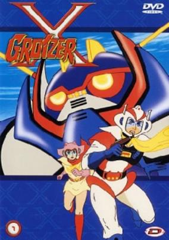

**Genres:** Science Fiction, Mecha, Super Robot, Robot

> The Gaira aliens, hidden in the Arctic, plan to conquer Earth. Captured and forced to work for the aliens, Dr. Yan creates the ultimate weapon, a transformable aerial robot called Gloizer X. Entrusted to his daughter Rita, Gloizer X escapes the clutches of the Gaira and lands in Japan, where pilot Jo Kaisaka meets a wounded Rita. Taking up the controls of Gloizer X, Jo and Rita fight against the Gaira invasion.
>
> _Synopsis source: Kitsu_

[Wikipedia](https://en.wikipedia.org/wiki/Gloizer_X) · [Kitsu](https://kitsu.io/anime/groizer-x)

---

### Japanese Folklore Tales (Season 2)

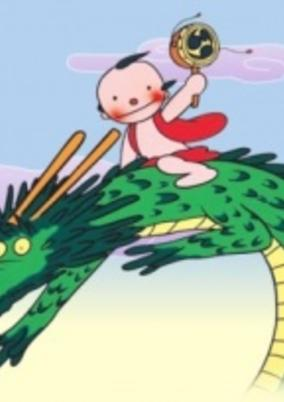

**Genres:** Historical, Fantasy

> An omnibus-format TV series consisting of anime adaptations of Japanese folk tales, this is one of Japan's longest-running TV series, and Group Tac's second TV series (the first was The Road to Munich, a documentary anime about the 1972 Olympics). The governing rule of the series was that the creative staff change from episode to episode. While later other anime series like Nippon Animation's Famous Works of Japanese Literature would attempt the same, none would be as long-lived or successful. The rotation idea was that of director Sugii Gisaburo, a visual visionary unequaled in Japanese film history who has revolutionized anime several times in his career, be it in the 1967 TV series Goku's Big Adventure, in which he sought to shake anime free from the dominance of story development by yanking it back to a more cartoonish form, or The Belladonna of Sadness, where he broke the Disney full-animation mold, creating a full-length animated film in a completely new style that was a hybrid of still drawings and animation. The reason for rotating the staff each episode was so that each episode would have a completely different look and feel from its predecessor, and in this it was eminently successful. This is a series that is genuinely rewarding to watch, and is visually one of the richest in anime history. While this system also meant that quality varied, there were also occasionally superb episodes, as on the staff were many veterans like Group Tac founder SUGII Gisaburo himself, SHIBAYAMA Tsutomu, FURUZAWA Hideo, RIN Taro, and HIKONE Norio. Old episodes started being repeated more and more frequently as the years went on, and production of new episodes finally ceased completely in late 1995, but the series is still widely broadcast.
>
> _Synopsis source: Kitsu_

[Kitsu](https://kitsu.io/anime/manga-nippon-mukashibanashi-1976)

---

### Paul's Miraculous Adventure (Paul in Fantasy Island)

**Genres:** Action, Adventure, Kids

> Paul is a young boy whose friend Nina is kidnapped by Belt Satan, the demonic ruler of another world. He daringly goes on a mission to rescue his friend. Pakkun, a plush doll with magic powers, aids him as they plunge into Belt Satan's dimension of living toys. Paul's journey is beset by many difficulties, but he also encounters a variety of delightful wonders.
>
> _Synopsis source: Kitsu_

[Wikipedia](https://en.wikipedia.org/wiki/Paul%27s_Miraculous_Adventure) · [Kitsu](https://kitsu.io/anime/paul-no-miracle-daisakusen)

---

### UFO Robot Grendizer vs. Great Mazinger

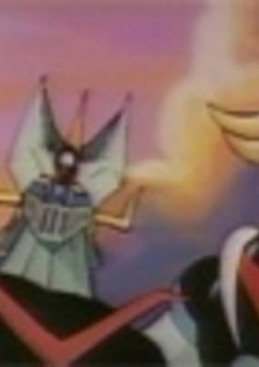

**Genres:** Science Fiction, Mecha, Super Robot, Piloted Robot, Robot

> Alien invaders take over Great Mazinger who is at the entrance of a museum next to Mazinger Z as symbols of peace. Grendizer fights the evil invaders and Great Mazinger is recovered. When the Vegan empire dispatches a new general to oversee the takeover of Earth, he quickly manages to capture Koji Kabuto and, learning of Great Mazinger through interrogation, quickly commandeers it from a museum where it was kept as a symbol of peace. It is now up to Duke Fleed aboard Grendizer to stop humanity's former defender from becoming its destroyer.
>
> _Synopsis source: Kitsu_

[Wikipedia](https://en.wikipedia.org/wiki/UFO_Robot_Grendizer_vs._Great_Mazinger) · [Kitsu](https://kitsu.io/anime/ufo-robo-grendizer-tai-great-mazinger)

---

### Puss 'n Boots Travels Around the World

[Wikipedia](https://en.wikipedia.org/wiki/The_Wonderful_World_of_Puss_%27n_Boots#Puss_'n_Boots_Travels_Around_the_World)

---

### Gaiking

[Wikipedia](https://en.wikipedia.org/wiki/Gaiking)

---

### Dash Machine Hayabusa

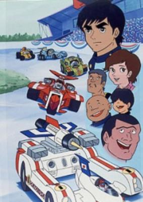

**Genres:** Action, Sports, Motorsport

> Because of the appearance of a villain team, Black Shadow, the international racing was ruined. To compete with Black Shadow, Saionji Racing Team was founded. They developed a racing car, Hayabusa. It was a super racing machine that carries hyper power engine, Cavalier Engine. The main driver of the team was Hayabusa Ken whose big brother was killed by Black Shadow.
>
> _Synopsis source: Kitsu_

[Kitsu](https://kitsu.io/anime/machine-hayabusa)

---

### Cat Eyed Boy

**Genres:** Fantasy, Horror, Adventure, Psychological

[Wikipedia](https://en.wikipedia.org/wiki/Cat_Eyed_Boy#Anime) · [Kitsu](https://kitsu.io/anime/youkaiden-nekome-kozou)

---

### Go-wapper 5 Go-dam (Goliath the Super Fighter)

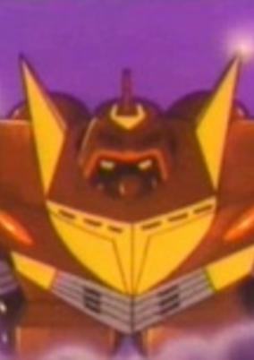

**Genres:** Science Fiction, Mecha, Super Robot, Robot, Action, Adventure

> Five youths from Edo City explore a strange rocky island and discover the mecha that Doctor Hoarai had been creating in order to resist the impending attack by a race of subterranean rock people. Doctor Hoarai was ridiculed by the scientific community for his predictions that such an attack would take place. The youths decide to join the doctor (who was dead but had transferred his mind into a computer) in piloting the vehicles and protecting Earth. The Gowapper 5 Gordam team is born! With the aid of the giant fighting robot Gordam, the Gowapper team under the leadership of Youko Misaki must face the hordes of the inhuman subterranean people.
>
> _Synopsis source: Kitsu_

[Wikipedia](https://en.wikipedia.org/wiki/Gowappa_5_G%C5%8Ddam) · [Kitsu](https://kitsu.io/anime/gowappa-5-gordam)

---

### UFO Warrior Dai Apolon

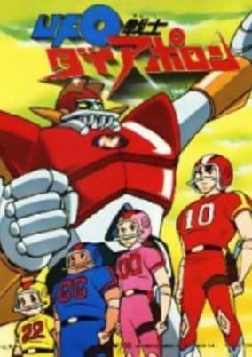

**Genres:** Science Fiction, Mecha, Action, Super Robot, Robot

> The story is about 16 years old boy Takeshi who recently formed an American football team at the BlueSky orphanage. One day the game is interuppted by a light in the sky. Takeshi discovers he is the son of the king of the planet Apolon, spirited away to Earth by his father's retainer Rabi to avoid death at the hands of General Dazaan. He turns out to have special energy abilities which can control UFO saucers from under the ocean floor, which in turn can become robots that are synchronized to their movements.
>
> _Synopsis source: Kitsu_

[Wikipedia](https://en.wikipedia.org/wiki/UFO_Warrior_Dai_Apolon) · [Kitsu](https://kitsu.io/anime/ufo-senshi-dai-apolon)

---

### Combattler V

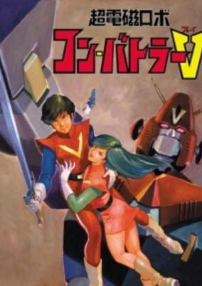

**Genres:** Transforming Craft, Science Fiction, Mecha, Earth, Action, Super Robot, Piloted Robot, Robot Helper, Android, Robot, Adventure

> The first of Tadao Nagahama's Romance Super Robot Trilogy. (#2: Chou Denji Machine Voltes V, #3: Toushou Daimos) Thousands of years ago, the people of the planet Campbell decided to leave their planet and seek out new worlds to inhabit. One group, lead by the scientist Oreana, landed on Earth, but was delayed from their mission. In the early 21st century, Oreana's group reawakens and begins their plan to conquer the Earth. The only effective defense against the Campbellians' giant biomechanical slave beasts is the super-electromagnetic robot, Combattler V and its pilots.
>
> _Synopsis source: Kitsu_

[Wikipedia](https://en.wikipedia.org/wiki/Ch%C5%8Ddenji_Robo_Combattler_V) · [Kitsu](https://kitsu.io/anime/combattler-v)

---

### The Adventures of Piccolino

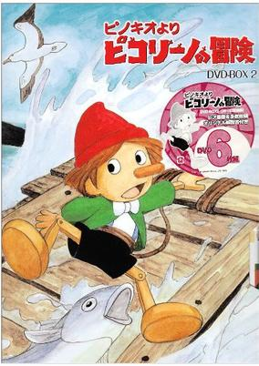

**Genres:** Adventure, Kids

> Well-known and well-loved by readers around the world, Carlo Collodi’s famous story of Pinocchio is transformed in this magical tale of love and deceit. Old Jeppet the carpenter is terribly lonely, and yearns to have a son of his own. One day, a puppet he is carving out of wood begins to speak even before he has finished shaping it. The old man names the puppet Pinocchio, and treats him as the son he never had. The puppet is dreadfully naughty and causes trouble for the old man, but his heart is in the right place and he earns Jeppet’s love as though he were a human son. However, tragedy befalls the pair. Pinocchio is deceived by the wicked fox Dino and his sidekick, the cat Witch, while on his way to school. Pinocchio and his friend Gina the duck are sold to the master of a puppet show, with little hope of ever reuniting with kind old Jeppet. The naughty puppet eventually runs away in order to search for his surrogate father, and finds himself in the middle of adventure after adventure, matching wits with the crafty Dino and Witch. His efforts to stay out of mischief never seem to work, and misfortune always seeks out our wooden hero. If Pinocchio can only manage to stay out of trouble, his ultimate wish will be granted and his dream will become a reality. Delighting and entertaining, The Adventures of Pinocchio shows us that a pure heart and good intentions are rewarded, and that true love can indeed create miracles. (Source: Nipponanimation) Note that the character is actually called "Piccolino" in this adaptation.
>
> _Synopsis source: Kitsu_

[Wikipedia](https://en.wikipedia.org/wiki/Piccolino_no_B%C5%8Dken) · [Kitsu](https://kitsu.io/anime/piccolino-no-bouken)

---

### Blocker Gundan 4 Machine Blaster

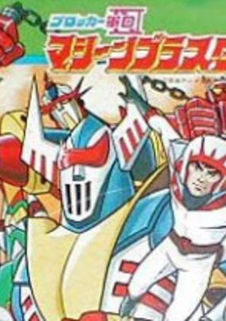

**Genres:** Science Fiction, Mecha, Super Robot, Robot, Action

> The peace of the world is suddenly threatened by Mogool, which is located on the bottom of the sea. Helqeen, tyrannical master of the Mogoolian Empire, attempts to conquer the earth with her faithful companions Goroskie and Zan-gack. In order to frustrate their ambition, Dr. Yuri, who predicted this horrible occasion, organizes four powerful robots to form the Blocker Corps! He also gathers four members who have the super ability known as "elepath" - a talent for maneuvering gigantic robots. A fierce battle begins between our Blocker Corps and Mogool at the risk of their lives! A series of fantastic and fabulous battles unfolds.
>
> _Synopsis source: Kitsu_

[Wikipedia](https://en.wikipedia.org/wiki/Blocker_Gundan_4_Machine_Blaster) · [Kitsu](https://kitsu.io/anime/blocker-gundan-iv-machine-blaster)

---

### Grendizer, Getter Robo G, Great Mazinger: Decisive Battle! The Monster of the Ocean

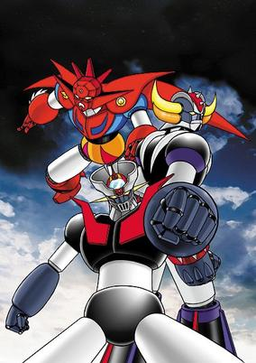

**Genres:** Science Fiction, Mecha, Earth, Japan, Action, Super Robot, Robot

> A giant sea monster known as "Dragonsaurus" has emerged from out of nowhere, terrorizing the depths of the oceans. Great Mazinger, Grendizer and the Getter Robo G team join forces to combat the new threat. But their task becomes more complicated when Dragonsaurus swallows up Boss Borot and makes its way toward Tokyo.
>
> _Synopsis source: Kitsu_

[Kitsu](https://kitsu.io/anime/grendizer-getter-robo-g-great-mazinger-kessen-daikaijuu)

---

### Magnetic Robot Ga Keen

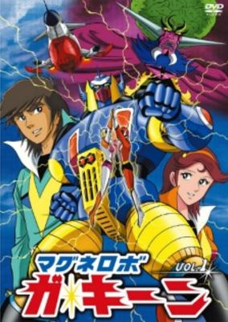

**Genres:** Transforming Craft, Science Fiction, Mecha, Super Robot, Piloted Robot, Robot, Action

> Dr. Kazuki, who perceived of an invasion of Earth by the Izaru people builds a robot based on the science of magnetism and sphere joint theory. Undergoing a dangerous augmentation process, Dr. Kazuki's daughter Mai becomes the pilot of "Mighty" or "Magnetman Minus". Takeshi Houjou becomes the pilot of "Puraiza" or "Magnetman Plus". The pilots would hold each other and then physically trasform their joint bodies in a metallic plate locking itself on the Gakeen (Short for "Gathering Keen") robot's frame thus enabling the super robot to move and fight. This sequence was notable, to an adult's eye, for its almost-sexual connotation.
>
> _Synopsis source: Kitsu_

[Wikipedia](https://en.wikipedia.org/wiki/Magne_Robo_Gakeen) · [Kitsu](https://kitsu.io/anime/magne-robo-gakeen)

---

### The Affectuous Family

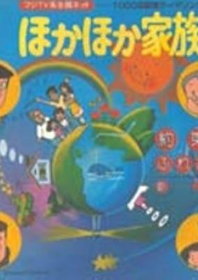

**Genres:** Comedy

> Short comedic stories about events and the daily lives of the members of a large multi-generational family.
>
> _Synopsis source: Kitsu_

[Wikipedia](https://en.wikipedia.org/wiki/Hoka_Hoka_Kazoku) · [Kitsu](https://kitsu.io/anime/hoka-hoka-kazoku)

---

### Candy Candy

[Wikipedia](https://en.wikipedia.org/wiki/Candy_Candy)

---

### Dinosaur Expedition Born Free

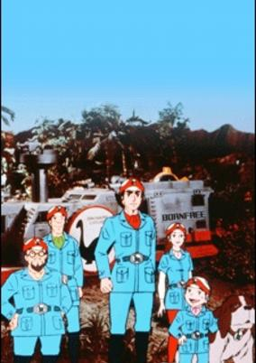

**Genres:** Science Fiction, Action

> When a meteor crashes to Earth, it briefly changes the climate and dinosaurs once again roam the planet. It's up to a newly formed expedition team to relocate the dinosaurs to a safe environment.
>
> _Synopsis source: Kitsu_

[Kitsu](https://kitsu.io/anime/kyouryuu-tankentai-born-free)

---

### The Magnificent Chief Clerk

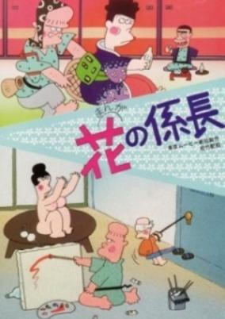

**Genres:** Comedy, Slice of Life

> A wacky comedy about a man from a noble ancestry of long ago, but who in modern times is just a lowly salary man that is constantly being humiliated by his family and co-workers.
>
> _Synopsis source: Kitsu_

[Kitsu](https://kitsu.io/anime/hana-no-kakarichou)

---

### Little Lulu and Her Little Friends (Little Lulu)

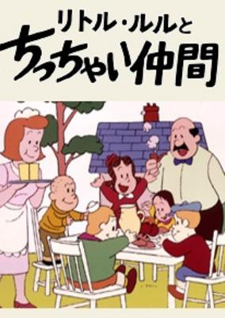

**Genres:** Comedy, Slice of Life, Kids

> The adventures of Little Lulu and her friends. The series is based on the famous character from comic strips and comic books.
>
> _Synopsis source: Kitsu_

[Wikipedia](https://en.wikipedia.org/wiki/Little_Lulu_and_Her_Little_Friends) · [Kitsu](https://kitsu.io/anime/little-lulu-to-chicchai-nakama)

---

### Dokaben

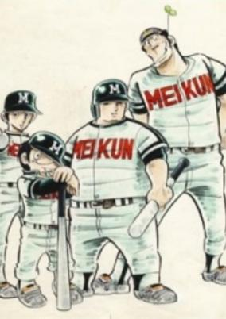

**Genres:** Action, Sports, Baseball, School Life

> Tarou "Dokaben" Yamada, who was a judoist while at junior high, enters Meikun High School and is talked into joining the baseball club. He displays his superb athletic abilities in baseball and becomes well-known as a hard hitter. He and his unique teammates establish Meikun a solid position as No.1 in the High School Baseball Championship games.
>
> _Synopsis source: Kitsu_

[Wikipedia](https://en.wikipedia.org/wiki/Dokaben) · [Kitsu](https://kitsu.io/anime/dokaben)

---

### Manga Fairy Tales of the World

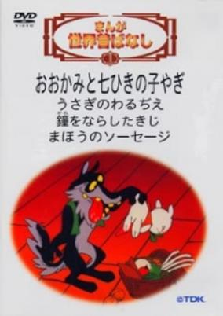

**Genres:** Historical, Fantasy, Drama, Adventure

> Each episode of this series tells the story of a famous fairy tale from all around the world. Some of them are adapted from famous books such as "The Iliad".
>
> _Synopsis source: Kitsu_

[Wikipedia](https://en.wikipedia.org/wiki/Manga_Fairy_Tales_of_the_World) · [Kitsu](https://kitsu.io/anime/manga-sekai-mukashi-banashi)

---

### Robot Child Beeton

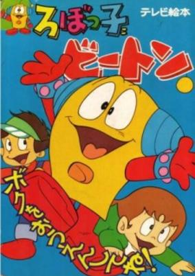

**Genres:** Comedy, Slice of Life, Adventure, Kids

> When a boy's uncle sends him confusing plans for a robot from America, the boy makes a mistake in the assembly which leads to unexpected results.
>
> _Synopsis source: Kitsu_

[Kitsu](https://kitsu.io/anime/robokko-beeton)

---

### UFO Robot Grendizer: The Red Sunset Confrontation

**Genres:** Science Fiction, Mecha, Earth, Japan, Action, Super Robot, Robot

> A giant sea monster known as "Dragonsaurus" has emerged from out of nowhere, terrorizing the depths of the oceans. Great Mazinger, Grendizer and the Getter Robo G team join forces to combat the new threat. But their task becomes more complicated when Dragonsaurus swallows up Boss Borot and makes its way toward Tokyo.
>
> _Synopsis source: Kitsu_

[Wikipedia](https://en.wikipedia.org/wiki/Grendizer) · [Kitsu](https://kitsu.io/anime/grendizer-getter-robo-g-great-mazinger-kessen-daikaijuu)

---

### Dojoji Temple

**Genres:** Drama, Past, Historical

> Based on an ancient legend, Dojoji Temple tells the story of a young priest who finds himself the object of intense infatuation and lust from a young woman. As he rebuffs her advances she becomes more and more desperate eventually turning herself into a gigantic serpent. The priest is hidden under the bell of the temple but the woman's passion is so intense that escape is impossible. A short animation from filmmaker Kihachiro Kawamoto. This film utilizes both stop motion and standard animation techniques.
>
> _Synopsis source: Kitsu_

[Kitsu](https://kitsu.io/anime/dojoji-temple)

---
