# 1977 in Anime

[← Back to index](../README.md)

36 titles · 25 with a matched synopsis/cover art · [source](https://en.wikipedia.org/wiki/1977_in_anime)

## Releases

### Angie Girl

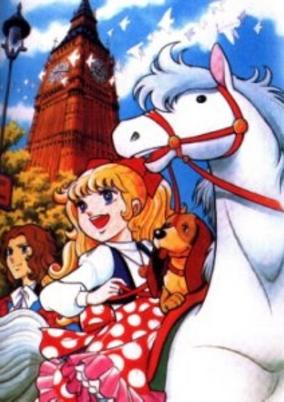

**Genres:** Detective, Historical, Mystery

> 19th century London. Angie is a 12-year-old girl, descended from nobility. She once helped to solve the Queen’s jewel robbery case and since then, the Queen has appointed her to work on particularly difficult cases. Her brilliance and courage overwhelm many grownups. She is assisted by other children and Detective Michael of Scotland Yard. This series is full of fun, suspense and pathos, showing how Angie uses her wits to solve case after case.
>
> _Synopsis source: Kitsu_

[Wikipedia](https://en.wikipedia.org/wiki/Angie_Girl) · [Kitsu](https://kitsu.io/anime/joou-heika-no-petite-angie)

---

### Arrow Emblem: Hawk of the Grand Prix (Super Grand Prix)

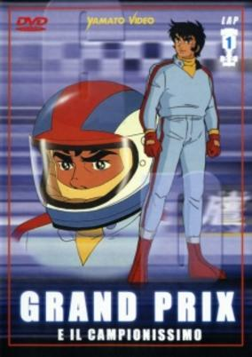

**Genres:** Formula Racing, Action, Sports, Motorsport

> An anime with much of wheel actions ... Takaya Todoroki, a young man who wants to become a famous driver and built a car to be able to participate in a race with a big prize. In the race, because of the poor quality of building, Takaya has a serious accident in which he wrecked his car but he doesn`t hurt himself. That`s when a mysterious driver contact Takaya to enter onto some famous racing team...This mysterious man is a former driver .. a very famous one who appears every now and then to help Takaya fight his own destiny, to set him on the right track and most of all prove himself, unlike him.
>
> _Synopsis source: Kitsu_

[Kitsu](https://kitsu.io/anime/arrow-emblem-grand-prix-no-taka)

---

### Attack on Tomorrow! (Attack on Tomorrow)

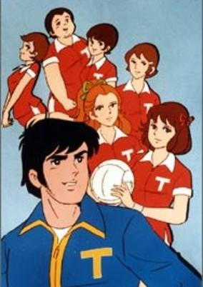

**Genres:** Action, Sports, Volleyball, School Life

> This drama tells the story of girls in high school. Girls who love to play volleyball form a team in their school. Although the team starts out as a weak and unorganized sport club, over time the girls’ extraordinary passion and endeavor enables their team to become one of the best organized and highly recognized teams at the school. Now they aim to win the championship in the National High School Volleyball League. Although it is painful and hard to achieve such a goal, it is nice to have friends to share the feeling, especially the joy. Through volleyball, the girls learn and experience many lessons in life as they grow up. Let’s share their laughter.
>
> _Synopsis source: Kitsu_

[Wikipedia](https://en.wikipedia.org/wiki/Attack_on_Tomorrow!) · [Kitsu](https://kitsu.io/anime/ashita-e-attack)

---

### Balatack

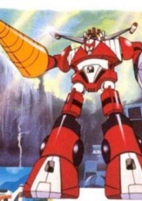

**Genres:** Science Fiction, Mecha, Super Robot, Robot, Adventure

> Late at night, at a lake surrounded by a peaceful forest, a mysterious spaceship landed on the water. The group that emerged from that ship kidnapped the head of space engineering, Professor Katou, and his family. The Professor's second son, American football player Yuuji, who had run away from home was in the middle of a game and knew nothing of what had happened. The four young people watching him were Mark, Dickey, Franco, and Yuri. They were a team of four psychics who had been training in a secret base. They had seen the previous night's events and believed them to be an alien attack. Believing their only option to be the transforming robot Baratack, they used their psychic powers to kidnap Yuuji. Baratack could only move by combining the powers of Yuuji and the other four acting as one. When all five, including the astonished Yuuji, cried "Pentagoras Unite!” Baratack emerged. Yuuji was overcome with a violent rage, his fighting spirit burning to defeat the Golteus reptile army.
>
> _Synopsis source: Kitsu_

[Wikipedia](https://en.wikipedia.org/wiki/Balatack) · [Kitsu](https://kitsu.io/anime/choujin-sentai-baratack)

---

### Charlotte

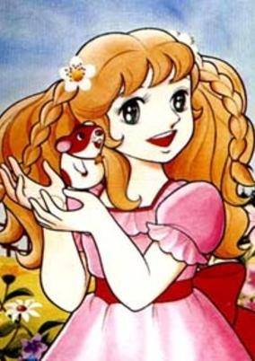

**Genres:** Earth, Americas, Historical, Slice of Life, Kids

> Charlotte is a girl who lives on a farm in Canada. On her 12th birthday, her father tells her that her mother, whom Charlotte has always believed to be dead, is actually alive and living in Paris, but soon she will arrive to live with them! Charlotte is very upset about this at first, but just when she adjusts to the idea, her father soon dies! Now Charlotte must face many challenges to live. She discovers that her father was from a noble family and her grandfather wants to force Charlotte to return to the family. She doesn't know her mother at all. Meanwhile, a landowner is trying to steal away her father's farm! Poor Charlotte...
>
> _Synopsis source: Kitsu_

[Wikipedia](https://en.wikipedia.org/wiki/Wakakusa_no_Charlotte) · [Kitsu](https://kitsu.io/anime/wakakusa-no-charlotte)

---

### Danguard Ace (Dangard Ace)

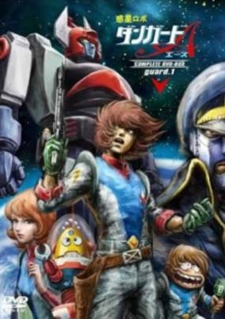

**Genres:** Science Fiction, Mecha, Super Robot, Robot

> In order to explore the newly discovered planet, Promethe, there are many projects are running all over the world. Here in Japan, under the direction of Dr. Oedo, "Space Carrier Jasdum" and "Planet Robot Dangard A" are being built. Ichimonji Takuma is a candidate for the pilot of Dangard A. His father, Ichimonji Dantetsu, was a famous space pilot. However, Dantetsu went missing after a mysterious accident, and the people blamed him for the accident. In order to clear his name, Takuma is trying to become a space pilot and succeed in the project. Will Takuma become the pilot?
>
> _Synopsis source: Kitsu_

[Wikipedia](https://en.wikipedia.org/wiki/Wakusei_Robo_Danguard_Ace) · [Kitsu](https://kitsu.io/anime/wakusei-robo-danguard-ace)

---

### Danguard Ace vs. Insect Robot Troop

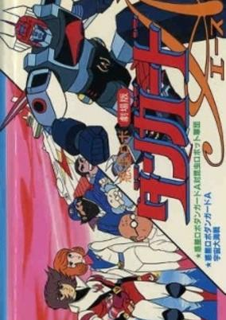

**Genres:** Science Fiction, Mecha

> A new insect enemy that feeds off of the energy of all living things has set its eyes on Earth.
>
> _Synopsis source: Kitsu_

[Kitsu](https://kitsu.io/anime/wakusei-robo-danguard-ace-tai-konchuu-robot-gundan)

---

### Dinosaur War Izenborg

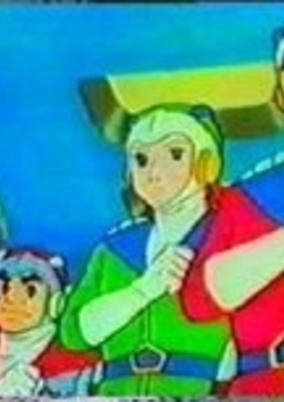

**Genres:** Science Fiction, Super Power, Mecha, Action

> Japan is being besieged by evil Dinosaurs that humanity have long thought extinct, they are back and are creating disaster. To counter the threat, a special team of expert warriors called Aizenborg were created. Lamees and Kamal use their special powers to combine into Super Aizenborg to battle the evil Satola and his Dinosaur army.
>
> _Synopsis source: Kitsu_

[Wikipedia](https://en.wikipedia.org/wiki/Dinosaur_War_Izenborg) · [Kitsu](https://kitsu.io/anime/kyouryuu-daisensou-aizenborg)

---

### Formula 1

---

### Ginguiser

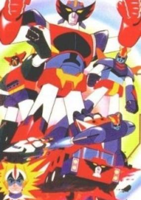

**Genres:** Science Fiction, Mecha, Super Robot, Robot, Adventure

> Twenty thousand years before the creation of mankind, two tribes-Plazmans and Sazorions-came to the earth. The bellicose Sazorions tried to conquer the peaceful Plazmans using the dreadful power of the Scorpio in outer space. Twenty thousand years later-at some time in the future-Dr. Godo, the only survivor of the Plazmans, secretly prepares Ginguiser, the combined magic robot troop, to defend peace in the event that the Sazorions are revived. Dr. Godo commands four brave young men to acquire occult super powers. Each episode of this series features a sequence of fabulous and fantastic battles. These scenes cannot fail to arouse the interest and excitement of the audience, and will be certain to catch every eye.
>
> _Synopsis source: Kitsu_

[Wikipedia](https://en.wikipedia.org/wiki/Ch%C5%8Dgattai_Majutsu_Robo_Ginguiser) · [Kitsu](https://kitsu.io/anime/chogattai-majutsu-robot-ginguiser)

---

### Guyslugger

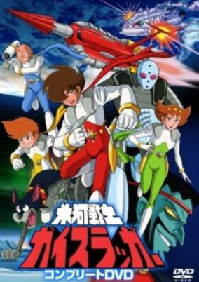

**Genres:** Science Fiction, Mecha, Action

> A cyborg warrior from an ancient Antarctic kingdom awakes 30000 years later from an accidental hibernation to find the Earth changed and an old alien enemy on the verge of invasion. It's up to Guyslugger to use his ancient technology to defeat the aliens.
>
> _Synopsis source: Kitsu_

[Kitsu](https://kitsu.io/anime/hyouga-senshi-gaislugger)

---

### Homerun Kanta

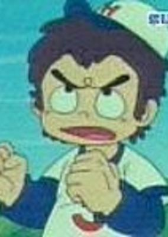

**Genres:** Action, Sports, Baseball, Adventure, Comedy, Kids

> Kanta lives with his mother, brothers, sisters, and dog named Judeth. He likes baseball, but his mom doesn't like him mentioning baseball, because his mother believes this was the cause of her husband's death.
>
> _Synopsis source: Kitsu_

[Wikipedia](https://en.wikipedia.org/wiki/Ippatsu_Kanta-kun) · [Kitsu](https://kitsu.io/anime/ippatsu-kanta-kun)

---

### Invincible Super Man Zambot 3

[Wikipedia](https://en.wikipedia.org/wiki/Invincible_Super_Man_Zambot_3)

---

### Jetter Mars

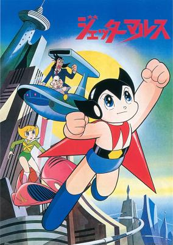

**Genres:** Science Fiction, Future, Android, Mecha, Action

> In the futuristic year of 2015 A.D., the Director of the Ministry of Science, Dr. Yamanoue, teams up with robotics expert Dr. Kawashimo in order to create the greatest robot in the world: Jetter Mars! There's just one problem... Dr. Yamanoue and Dr. Kawashimo have two very different ideas of what makes the greatest robot in the world. Dr. Yamanoue thinks that strength and power will dictate which robot is the greatest, while Dr, Kawashimo believes in kindness and helping others. Jetter Mars struggles with these two sides of himself, and must find a balance in order to truly become the greatest robot in the world!
>
> _Synopsis source: Kitsu_

[Wikipedia](https://en.wikipedia.org/wiki/Jetter_Mars) · [Kitsu](https://kitsu.io/anime/jetter-mars)

---

### Jump Out! Machine Hiryu

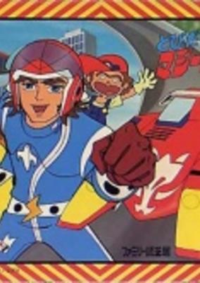

**Genres:** Comedy, Parody, Motorsport

> The bosses of rival car companies decide to fight each other in the sporting arena by backing different race car teams. Chairman Gapporin hires Okkanabichi the supreme racer, while Chairman Misaki hires Riki Kazama, a relatively untried driver for the flying car known as Machine Hiryu. Mixing elements of Speed Racer with Time Bokan, this Tatsunoko production ticks the same boxes, with Riki's cute girlfriend Nana, mini-mechanic Chuta, the cute ape and pooch, and the comic and glamorous villains lurking in the background. Early work from many big names, including Yoshitaka Amano and Kunio Okawara, is strictly in the studio mould. Manga versions of the story ran in several magazines, such as Terebi Magazine and Terebi Land. Racing fever seemed to have struck the Japanese animation business at this time: compare to the same year's Arrow Emblem.
>
> _Synopsis source: Kitsu_

[Kitsu](https://kitsu.io/anime/tobidase-machine-hiryuu)

---

### Little Jumbo

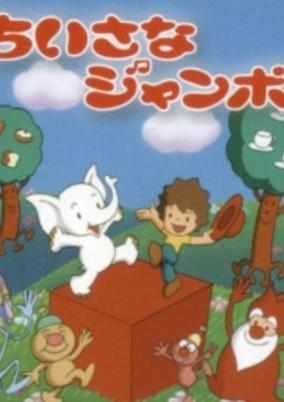

**Genres:** Fantasy, Anthropomorphism, Music, Kids

> This is a colorful, painstakingly animated musical about a boy and his pet white elephant who one day drift onto a peaceful island which soon finds itself caught between two larger islands at war
>
> _Synopsis source: Kitsu_

[Kitsu](https://kitsu.io/anime/chiisana-jumbo)

---

### Lupin the 3rd Part II

[Wikipedia](https://en.wikipedia.org/wiki/Lupin_the_3rd_Part_II)

---

### Mechander Robo (Combining Squadron Mechander Robo)

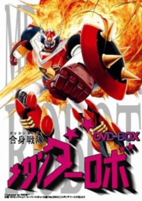

**Genres:** Science Fiction, Mecha, Super Robot, Robot, Space, Military, Mystery

> The Doron Empire from the Ganymede System discovered Earth as an ideal world for them to conquer. The interest of expanding the empire came as a result of the power-hungry General Ozmel who overthrew the current reigning Queen Medusa of the Ganymede System as a start of their universal conquest. Almost completely succumbed to the empire, Earth is at its last days, and one scientist, Dr. Shikishima, had only one hope in restoring Earth from its alien conquerors--- a massive mecha known as the Mechander Robo, specially programmed and designed to battle these invading aliens from complete takeover of Earth. Along with this awesome fighter machine, Dr. Shikishima also recruited three pilots to be placed behind the Mechander Robo's controls--- the mysterious Jimmy Orion, the scientist's son Ryosuke Shikishima, and Kojiro Hachijima. Although the primary storyline is Earth battling the Doron Empire, there is something within lead pliot Jimmy Orion's past that was somewhat connected towards the entire storyline.
>
> _Synopsis source: Kitsu_

[Wikipedia](https://en.wikipedia.org/wiki/Mechander_Robo) · [Kitsu](https://kitsu.io/anime/gasshin-sentai-mechander-robo)

---

### Monarch: The Big Bear of Tallac

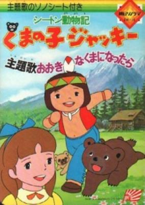

**Genres:** Historical, Drama, Adventure

> One day a native American boy named Lan meets two little bears at the foot of the Sierra Nevada, where he lives with his father. Lan names the brother bear ‘Jacky’ and the sister bear ‘Jill’. As Lan plays with the two bears, they become good friends. However their happiness doesn’t last for long. Lan’s father accidentally shoots the two little bears’ mother to death. Feeling sorry for them, Lan decides to take Jackie and Jill back home to live with him.
>
> _Synopsis source: Kitsu_

[Kitsu](https://kitsu.io/anime/seton-doubutsuki-kuma-no-ko-jacky)

---

### New Star of the Giants

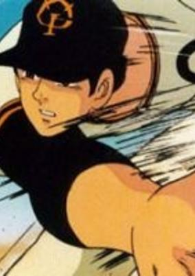

**Genres:** Sports, Baseball

> A continuation of the popular baseball saga about the star pitcher of a professional baseball team.
>
> _Synopsis source: Kitsu_

[Wikipedia](https://en.wikipedia.org/wiki/Shin_Kyojin_no_Hoshi) · [Kitsu](https://kitsu.io/anime/shin-kyojin-no-hoshi)

---

### Nobody's Boy: Remi

---

### Manga

---

### Manga Japanese Picture Scroll

---

### Manga Stories of Great Men

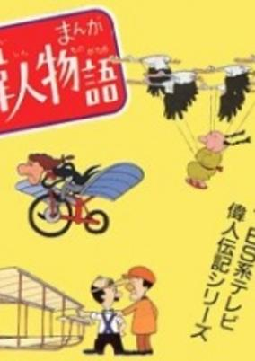

**Genres:** Historical

> From Genghis Khan to Thomas Edison, each episode in this series focuses on the life and achievement of two of history's greatest and most important persons.
>
> _Synopsis source: Kitsu_

[Kitsu](https://kitsu.io/anime/manga-ijin-monogatari)

---

### Rascal the Raccoon

[Wikipedia](https://en.wikipedia.org/wiki/Rascal_the_Raccoon)

---

### The Rose Flower and Joe

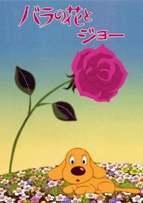

**Genres:** Romance, Fantasy, Fantasy World, Drama, Kids

> It's a Sanrio picture that feels partly like an anime art film and partly like a Warner Bros. cartoon. The film features some very creative imagery, a groovy 70's jazz score, and very little spoken dialogue. It's a story about a dog named Joe that falls in love with a rose and protects it from a mean spirited crow. There's some energetic Fritz Freeling style action. There's also some unexpectedly grim tragedy, not including the anticipated outcome, which does occur as expected.
>
> _Synopsis source: Kitsu_

[Kitsu](https://kitsu.io/anime/bara-no-hana-to-joe)

---

### Song of Baseball Enthusiasts

[Wikipedia](https://en.wikipedia.org/wiki/Yaky%C5%AB-ky%C5%8D_no_Uta)

---

### Space Battleship Yamato: The Movie

[Wikipedia](https://en.wikipedia.org/wiki/Space_Battleship_Yamato_(1977_film))

---

### Supercar Gattiger

[Wikipedia](https://en.wikipedia.org/wiki/Ch%C5%8D_Supercar_Gattiger)

---

### Temple the Balloonist

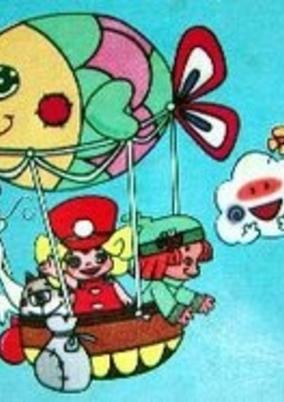

**Genres:** Comedy, Adventure, Kids

> When a little girl who loves music sneaks aboard a balloon, she soon finds herself far from home. She meets other children who also love music and agree to help her find her way back home.
>
> _Synopsis source: Kitsu_

[Wikipedia](https://en.wikipedia.org/wiki/Temple_the_Balloonist) · [Kitsu](https://kitsu.io/anime/fuusen-shoujo-temple-chan)

---

### Teppei (My Name Is Teppei)

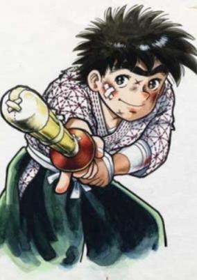

**Genres:** Action, Combat, Sports, Comedy, Shounen, School Life, Slice of Life, Drama

> Teppei, brought up by his father in the mountains, is an energetic boy who is as tough as weeds and acts as free as a bird. His life changes completely when he enrolls in high school, the first school he has ever attended. Despite his eccentric behavior and being a constant source of troubles, he is soon recognized for his talent in sports—especially in Kendo (the Japanese swordplay art)—and becomes the school's hero.
>
> _Synopsis source: Kitsu_

[Wikipedia](https://en.wikipedia.org/wiki/Ore_wa_Teppei) · [Kitsu](https://kitsu.io/anime/ore-wa-teppei)

---

### Tenguri, Boy of the Plains

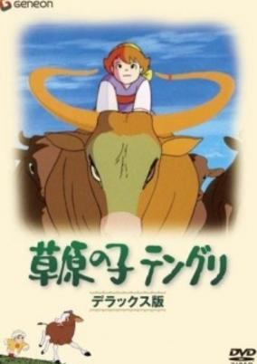

**Genres:** Earth, Asia, Coming Of Age, Past, Historical, Adventure, Kids

> The story surrounds a boy and a cow who have always lived their lives together. One winter, a famine strikes their village. The villagers resolve to the cow, but the boy secretly helped the cow escape. A few years ago, the boy (now grown-up) and the cow meet again...
>
> _Synopsis source: Kitsu_

[Kitsu](https://kitsu.io/anime/sougen-no-ko-tenguri)

---

### Towards the Rainbow

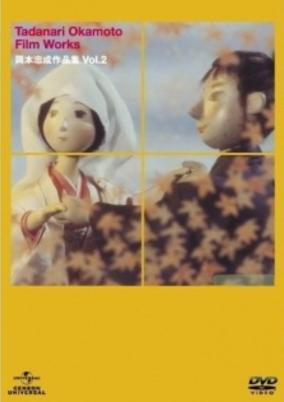

**Genres:** Historical, Romance

> Film by Okamoto Tadanari, winner of the Ōfuji Noburō Award in 1977 for the 32nd Mainichi Film Awards in recognition of animation excellence. The story of two villages on either side of a river who come together to build a bridge to connect their villages and thereby permit a young couple in love to be joined in marriage.
>
> _Synopsis source: Kitsu_

[Kitsu](https://kitsu.io/anime/niji-ni-mukatte)

---

### Voltes V

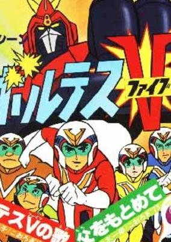

**Genres:** Transforming Craft, Science Fiction, Mecha, Earth, Action, Super Robot, Piloted Robot, Humanoid Alien, Alien, Future, Robot, Adventure

> From out of nowhere, a mysterious alien race known as the Boazan Forces has invaded the Earth. A group of individuals specially trained to handle this kind of situation has been unleashed. Kenichi, Ippei, Daijirou, Hiyoshi &amp; Megumi are the pilots of the Choudenji Machine Voltes V (5), Earth's defense against the Boazan and their terrible Beast Warriors. The plot thickens as the Go Brothers discover their true heritage and the truth behind their father's disappearance. Conflicts and mixed emotions hinder the Go Brothers at times but due to their unwavering desire to find their dad, they must go to the place where it all started. With the help of the rebels based on Earth and on the aliens' homeworld, the Voltes Team has another mission, remove the tyrant Zu Zanbajil and liberate the people of Boazan.
>
> _Synopsis source: Kitsu_

[Wikipedia](https://en.wikipedia.org/wiki/Voltes_V) · [Kitsu](https://kitsu.io/anime/voltes-v)

---

### The Wild Swans

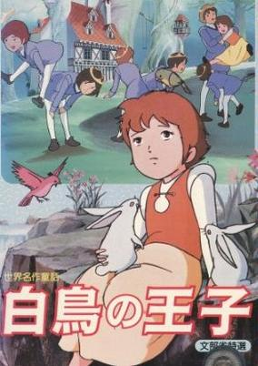

**Genres:** Fantasy, Kids

> Based on the stories The Wild Swans collected in Tales of Hans Christian Andersen and The Six Swans collected in Grimm's Fairy Tales. Young Princess Elisa lives a happy life with her brothers in a secret house in the forest. Her family's happiness is destroyed one day when her father becomes lost in the woods and is convinced by an old witch to take her fair-faced daughter for his new bride. The jealous new queen bewitches all but one of the king's seven children, turning his six sons into swans. Elisa takes it upon herself to find her missing brothers and find a way to restore them to their human forms.
>
> _Synopsis source: Kitsu_

[Wikipedia](https://en.wikipedia.org/wiki/The_Wild_Swans_(1977_film)) · [Kitsu](https://kitsu.io/anime/sekai-meisaku-douwa-hakuchou-no-ouji)

---

### Yatterman

[Wikipedia](https://en.wikipedia.org/wiki/Yatterman)

---
