# 1978 in Anime

[← Back to index](../README.md)

37 titles · 26 with a matched synopsis/cover art · [source](https://en.wikipedia.org/wiki/1978_in_anime)

## Releases

### The Story of Perrine

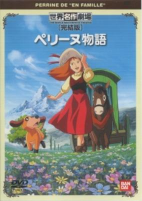

**Genres:** Earth, Europe, Coming Of Age, Angst, Drama, Historical, Slice of Life

> Perrine travels across Europe with her mother, a photographer, in a cabin drawn by a donkey. They are heading to a small village in northern France, the home of Perrine's dead father. Perrine doesn't know that they are unwanted in the village; Perrine's father left the village after having quarrelled with his father (Perrine's grandfather) and married in India against his father's will. After her mother falls ill, Perrine has to sell everything, including her beloved donkey Palikare, to pay for medicine. Mother dies in Paris and before dying tells the girl that she has to make her grandfather love her before he knows who she really is. After a journey full of hardships, Perrine finally arrives in the village where she learns that her grandfather is the rich owner of the factory that feeds all the villagers. Presenting herself under a false name, Perrine gets a job on the factory, searching for a way to the heart of her grandfather.
>
> _Synopsis source: Kitsu_

[Wikipedia](https://en.wikipedia.org/wiki/The_Story_of_Perrine) · [Kitsu](https://kitsu.io/anime/perrine-monogatari)

---

### Magical Girl Tickle

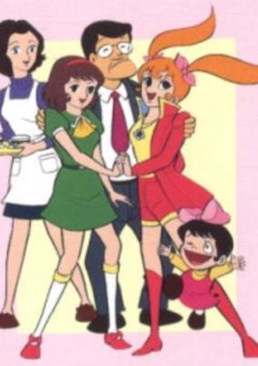

**Genres:** Comedy, Magic

> On Chiiko's 11th birthday, her father gives her a special book. Inside the book is a trapped witch, Majokko Tickle. When Chiiko frees Tickle from the book, she uses her magic to pass off as Chiiko's twin sister.
>
> _Synopsis source: Kitsu_

[Wikipedia](https://en.wikipedia.org/wiki/Majokko_Tickle) · [Kitsu](https://kitsu.io/anime/majokko-tickle)

---

### Metamorphoses

[Wikipedia](https://en.wikipedia.org/wiki/Metamorphoses_(1978_film))

---

### Ringing Bell

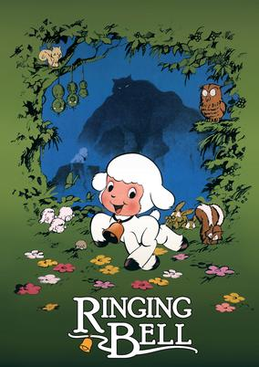

**Genres:** Fantasy, Coming Of Age, Angst, Americas, Drama, Past, Adventure

> A little lamb's life is turned upside down by the wolf that killed his mother. He seeks to avenge his mother, but in order to defeat the wolf, he must become one.
>
> _Synopsis source: Kitsu_

[Wikipedia](https://en.wikipedia.org/wiki/Ringing_Bell) · [Kitsu](https://kitsu.io/anime/chirin-no-suzu)

---

### Space Pirate Captain Harlock

[Wikipedia](https://en.wikipedia.org/wiki/Space_Pirate_Captain_Harlock)

---

### Danguard Ace: The Great Space Battle

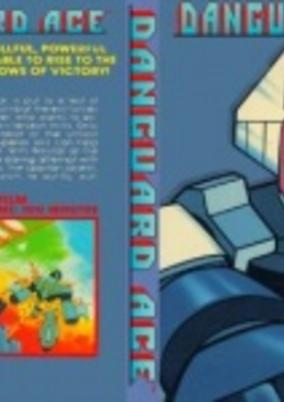

**Genres:** Science Fiction, Mecha

> Doppler has set up a trap for the Jasdam, and it is up to the Danguard Ace to save it.
>
> _Synopsis source: Kitsu_

[Kitsu](https://kitsu.io/anime/wakusei-robo-danguard-ace-uchuu-daikaisen)

---

### Thumbelina (World's Famous Stories for Children: Thumb Princess)

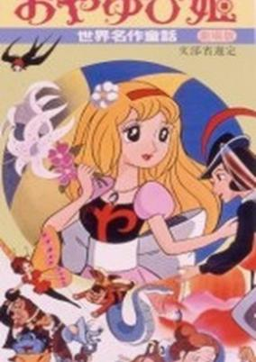

**Genres:** Fantasy, Kids

> This anime movie is an adaption from the famous fairytale for kids Thumbelina, that aired 1978 in Japan.
>
> _Synopsis source: Kitsu_

[Wikipedia](https://en.wikipedia.org/wiki/Thumbelina_(1978_film)) · [Kitsu](https://kitsu.io/anime/sekai-meisaku-douwa-oyayubi-hime)

---

### Ikkyū-san and the Mischievous Princess

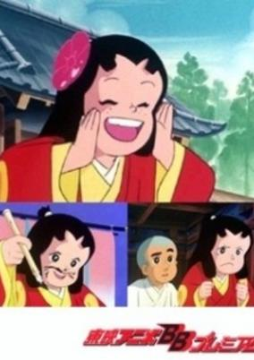

**Genres:** Comedy, Historical, Kids

> Ikkyuu must talk a tomboy into behaving in a more lady-like manner before her habit of calling herself by the boy's name Tsuyumaru and attacking shogun Yoshimitsu Ashikaga with a wooden sword gets her into trouble.
>
> _Synopsis source: Kitsu_

[Kitsu](https://kitsu.io/anime/ikkyuu-san-to-yancha-hime)

---

### Candy Candy: The Call of Spring

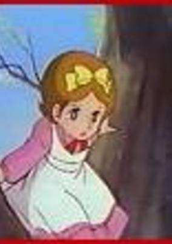

**Genres:** Slice of Life, Coming Of Age, Past

> Candy returns to Pony's Home and she meets a girl who has lost her parents and doesn't associate with the other kids. In order to cheer her up she decides to tell her about herself from the moment she was found by Miss Pony and sister Lane to her decision to leave the boarding school in England and walk her own path.
>
> _Synopsis source: Kitsu_

[Kitsu](https://kitsu.io/anime/candy-candy-haru-no-yobigoe)

---

### Fighting General Daimos

[Wikipedia](https://en.wikipedia.org/wiki/T%C5%8Dsh%C5%8D_Daimos)

---

### Starzinger (Spaceketeers)

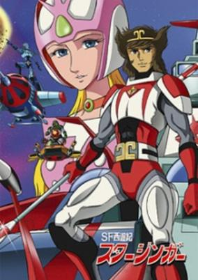

**Genres:** Romance, Space Travel, Science Fiction, Mecha, Adventure, Cyborg, Drama, Future, Space

> The Great Planet is dying, since its Queen is old and powerless... and the universe will perish along with it. Princess Aurora of the Moon volunteers to become the new Queen, so she must set out in a dangerous travel... along with her friends and escorts: the powerful Cyborgs Jan Kogo, Sa Jogo and Don Hakka.
>
> _Synopsis source: Kitsu_

[Wikipedia](https://en.wikipedia.org/wiki/Starzinger) · [Kitsu](https://kitsu.io/anime/sf-saiyuuki-starzinger)

---

### Future Boy Conan

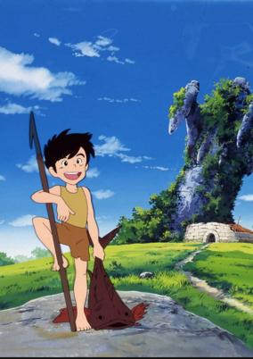

**Genres:** Steampunk, Science Fiction, Post Apocalypse, Adventure, Action, Earth, Future, Stereotypes, Plot Continuity

> July 2008. Mankind was faced with the threat of extinction. An ultra-magnetic weapon, far more devastating than any nuclear weapon known, destroyed half the world in an instant. The earth's crust was rocked by massive movements, the earth was thrown off its axis, and the five continents were torn completely apart and sank deep below the sea... The attempt by a number of people to flee to outer space failed. Their spaceships were forced back to the earth and vanished with their hopes shattered. But one of the spaceships narrowly escaped destruction and crash-landed on a small island which had miraculously survived the devastation. The crew members of the spaceship settled there, as if they were seeds sown on the island. After years, a boy was born. He was a new life in the desert, a ray of light in the darkness of the annihilated earth...
>
> _Synopsis source: Kitsu_

[Wikipedia](https://en.wikipedia.org/wiki/Future_Boy_Conan) · [Kitsu](https://kitsu.io/anime/mirai-shounen-conan)

---

### Highschool Baseball Ninja

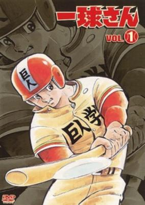

**Genres:** Action, Sports, Baseball, School Life

> High-school student Ikkyuu knows nothing about baseball, but his talents are recognized by the manager of the baseball club, and he takes up this enchanting sport. While his ignorance of the game leads him to make many mistakes, Ikkyuu - who is in fact a descendant of ninja - displays his superhuman abilities and leads the team to the High School Baseball Championships.
>
> _Synopsis source: Kitsu_

[Wikipedia](https://en.wikipedia.org/wiki/Ikky%C5%AB-san_(manga)) · [Kitsu](https://kitsu.io/anime/ikkyuu-san-1978)

---

### Manga History of Origins

---

### Haikara-San: Here Comes Miss Modern

---

### The Adventures of the Little Prince

[Wikipedia](https://en.wikipedia.org/wiki/The_Adventures_of_the_Little_Prince_(TV_series))

---

### Science Ninja Team Gatchaman: The Movie

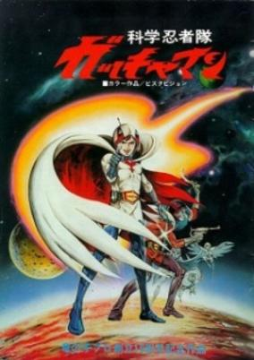

**Genres:** Science Fiction, Action, Adventure

> The sinister mutant Berg Katse has launched armies of henchmen and giant weapons of mass destruction against Earth. But the forces of evil are about to meet their match! The Science Ninja Team stands ready to take the battle back to the bad guys.
>
> _Synopsis source: Kitsu_

[Kitsu](https://kitsu.io/anime/kagaku-ninja-tai-gatchaman-movie)

---

### Space Pirate Captain Harlock: Mystery of the Arcadia

[Wikipedia](https://en.wikipedia.org/wiki/Captain_Harlock_(manga))

---

### Candy Candy's Summer Vacation (Candy Candy: Candy's Summer Vacation)

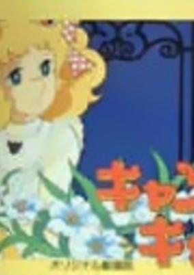

**Genres:** Slice of Life, Drama

> A continuation of the television series.
>
> _Synopsis source: Kitsu_

[Kitsu](https://kitsu.io/anime/candy-candy-candy-no-natsu-yasumi)

---

### Daikengo

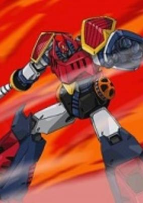

**Genres:** Science Fiction, Mecha, Super Robot, Robot, Space, Action, Adventure

> Giant robot Daikengo flies through space to re-establish galactic peace; on-board prince Ryger, who ran away from his planet Emperius to defeat the menace out of his reign borders, in order to save his people; Cleo, corrupted prime minister's daughter, help him along with two nice little robots, Anike and Otoke. They fight evil Lady Baracross, leading invasion forces, with her assistant Roboleon, wearing a Napoleon style hat. Daikengo is the first robot with scuttles on his mouth. When he opens them, his vampire style teeth are shown and he can spit fire.
>
> _Synopsis source: Kitsu_

[Wikipedia](https://en.wikipedia.org/wiki/Uch%C5%AB_Majin_Daikengo) · [Kitsu](https://kitsu.io/anime/uchuu-mazin-daikengo)

---

### Invincible Steel Man Daitarn 3

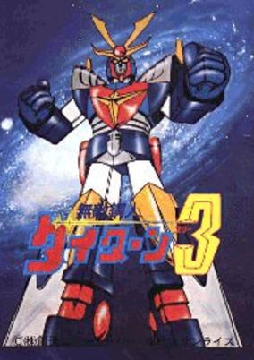

**Genres:** Transforming Craft, Science Fiction, Mecha, Super Robot, Piloted Robot, Robot

> Souzou Haran was a brilliant scientist that was conducting research on Mars. He created a form of cyborg life with the ability to think for itself. These cyborgs, dubbed the Meganoids, soon ran out of control and killed Dr. Haran along with his whole family, save his youngest son, the 16-year-old Banjou Haran. Banjou escapes from Mars on a rocket with a solar-powered super robot called Daitarn 3, which was built with the special metals of Mars. Now eighteen years old and living on Earth in a luxurious mansion, Banjou fights against the Meganoids with the aid of his faithful butler Garrison and his two gorgeous companions Reika and Beauty. Together they must stop the evil Meganoids which aspire to turn all humans into cyborgs and thus "improve" the human race.
>
> _Synopsis source: Kitsu_

[Wikipedia](https://en.wikipedia.org/wiki/Invincible_Steel_Man_Daitarn_3) · [Kitsu](https://kitsu.io/anime/muteki-koujin-daitarn-3)

---

### Farewell to Space Battleship Yamato (Farewell to Space Battleship Yamato: In the Name of Love)

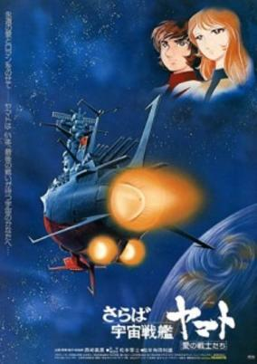

**Genres:** Space Travel, Science Fiction, Space Opera, Humanoid Alien, Future, Space, Military, Action

> In the year 2201, one year after the Yamato saved Earth from radioactive contamination, a new threat emerges. The Yamato makes its final journey to save the Earth from this new threat. Earth has almost recovered from the battle against Gamilus, and reconstruction has expanded to the other planets. When former Yamato crew-mates discover a strange, garbled message that seems to be coming from a white comet headed towards Earth, they hijack their old space fortress and begin a new battle.
>
> _Synopsis source: Kitsu_

[Wikipedia](https://en.wikipedia.org/wiki/Farewell_to_Space_Battleship_Yamato) · [Kitsu](https://kitsu.io/anime/saraba-uchuu-senkan-yamato-ai-no-senshitachi)

---

### One Million-Year Trip: Bander Book (One-Million Year Trip: Bander Book)

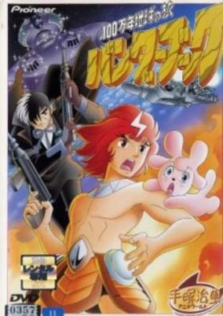

**Genres:** Science Fiction, Adventure, Alien, Future

> To escape the explosion of their ship caused by a terrorist attack, the parents of a young baby put him inside an escape pod and send him out before dying. The pod ends up on a planet inhabited by beings able to transform themselves into animals by using a special ring. The young baby is rescued by the royal family, and grows up to become the prince. When the planet is attacked by pirates, he will be brought by force to Earth and discover everything about his own origins, and forgotten brother.
>
> _Synopsis source: Kitsu_

[Kitsu](https://kitsu.io/anime/one-million-year-trip-bander-book)

---

### I'm Teppei (My Name Is Teppei)

**Genres:** Action, Combat, Sports, Comedy, Shounen, School Life, Slice of Life, Drama

> Teppei, brought up by his father in the mountains, is an energetic boy who is as tough as weeds and acts as free as a bird. His life changes completely when he enrolls in high school, the first school he has ever attended. Despite his eccentric behavior and being a constant source of troubles, he is soon recognized for his talent in sports—especially in Kendo (the Japanese swordplay art)—and becomes the school's hero.
>
> _Synopsis source: Kitsu_

[Wikipedia](https://en.wikipedia.org/wiki/Ore_wa_Teppei) · [Kitsu](https://kitsu.io/anime/ore-wa-teppei)

---

### Galaxy Express 999

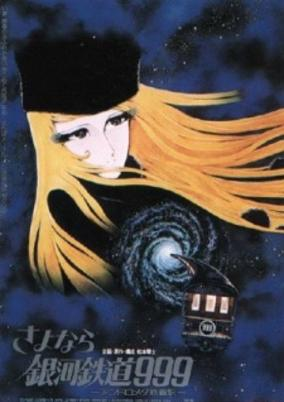

**Genres:** Space Travel, Science Fiction, Adventure, Action, Gunfights, Human Enhancement, Cyborg, Coming Of Age, Dystopia, Other Planet, Shipboard, Drama, Future, Space

> In the distant future, humanity has found a way to live forever by purchasing mechanical bodies, but this way to immortality is extraordinarily expensive. An impoverished boy, Tetsurou Hoshino, desires to purchase a pass on the Galaxy Express 999—a train that travels throughout the universe—because it is said that at the end of the line, those aboard can obtain a mechanical body for free. When Tetsurou's mother is gunned down by the villainous machine-man hybrid Count Mecha, however, all seems lost. Tetsurou is then saved from certain death by the mysterious Maetel, a tall woman with blonde hair and a striking resemblance to his mother. She gives him a pass to the Galaxy Express under one condition: that they travel together. Thus, Tetsurou begins his journey across the universe to many unique planets and thrilling adventures, in hopes of being able to attain that which he most desires. [Written by MAL Rewrite]
>
> _Synopsis source: Kitsu_

[Wikipedia](https://en.wikipedia.org/wiki/Galaxy_Express_999_(film)) · [Kitsu](https://kitsu.io/anime/galaxy-express-999)

---

### King Fang

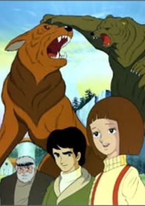

**Genres:** Drama, Adventure

> The conflicting fates of human beings and wild animals are depicted in a naturalistic setting. The main character of the story is Fang, who was born to a hunting dog and a circus-runaway European wolf. Although Fang was raised by a human family, he is a wild animal after all, and is destined to live amongst nature. The story reaches its climax when Fang returns from the circus and faces his foe, a giant brown bear which killed his family.
>
> _Synopsis source: Kitsu_

[Kitsu](https://kitsu.io/anime/daisetsusan-no-yuusha-kibaou)

---

### Gatchaman II (Eagle Riders)

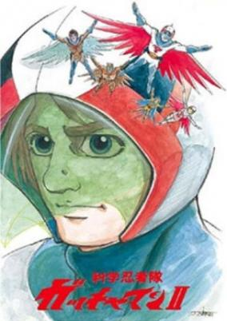

**Genres:** Science Fiction, Action, Adventure

> Two years after the defeat of Galactor and the apparent death of Condor Joe, a cruise ship is attacked by Leader X, killing nearly everyone on board. One of the survivors, a young girl, is captured by X and rapidly aged into the bizarre, masculine-voiced villainess Gel Sadra. Though she has the appearance of an adult, Gel Sadra is not immune to throwing childish tantrums and behaving immaturely. In the midst of the revival of Galactor, the Science Ninja Team is called back into action, with a shady man known as Hawk Getz acting as the replacement for Joe. Getz is quickly revealed to be a Galactor agent in disguise (and had killed the actual Getz who was to join), and winds up killed by a mysterious feather shuriken. After hints spread in the first three episodes, Joe reappears in the fourth episode, having somehow survived his fatal injuries at the end of the first series, and rejoins the team. It is later revealed that he was rescued by an ex-Galactor scientist at the brink of his death, and was the subject of various cybernetic augmentations. Later in the series, a female scientist known as Dr.Pandora is introduced, who had lost her husband and daughter in the cruise ship disaster. Unbeknown to her, her daughter Sammie survived and is in fact Gel Sadra.
>
> _Synopsis source: Kitsu_

[Wikipedia](https://en.wikipedia.org/wiki/Gatchaman_II) · [Kitsu](https://kitsu.io/anime/kagaku-ninja-tai-gatchaman-ii)

---

### Manga Children's Library

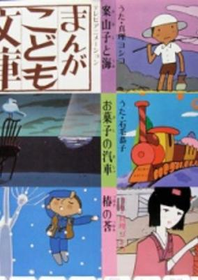

**Genres:** Fantasy, Drama, Kids

> A collection of children's stories and tales from traditional Japanese folklore.
>
> _Synopsis source: Kitsu_

[Kitsu](https://kitsu.io/anime/manga-kodomo-bunko)

---

### Treasure Island

[Wikipedia](https://en.wikipedia.org/wiki/Treasure_Island_(1978_TV_series))

---

### New Aim for the Ace!

[Wikipedia](https://en.wikipedia.org/wiki/Aim_for_the_Ace!#Shin_Ace_o_Nerae!)

---

### Space Battleship Yamato II

[Wikipedia](https://en.wikipedia.org/wiki/Space_Battleship_Yamato_II)

---

### The Pink Lady Story: Angels of Glory

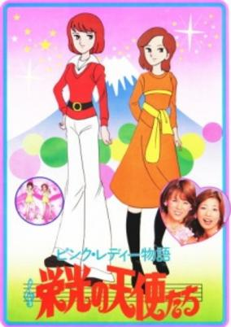

**Genres:** Earth, Japan, Asia, Idol, The Arts, Present, Music, Slice of Life

> Based on the real life-story of Pink Lady, a female pop duo that rose to superstardom in the mid-1970's.
>
> _Synopsis source: Kitsu_

[Kitsu](https://kitsu.io/anime/pink-lady-monogatari-eikou-no-tenshi-tachi)

---

### Captain Future

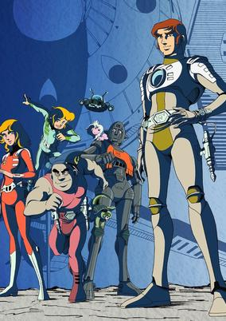

**Genres:** Space Travel, Science Fiction, Action, Space Opera, Other Planet, Humanoid Alien, Future, Adventure

> Curtis Newton, aka Captain Future, is an orphan. His parents died in their artificial satellite while he was an infant. His father was a scientist, who has abandoned earth for the satellite to dedicate his life for science along with his aging friend the genius Dr Simon Wright. Wright senses his death, and decides to implant his brain in a mechanical container. They both manufactured a superior robot and an android. Captain future dedicated his life to fight evil along with his three men, the brain, android, and robot.
>
> _Synopsis source: Kitsu_

[Wikipedia](https://en.wikipedia.org/wiki/Captain_Future#Anime) · [Kitsu](https://kitsu.io/anime/captain-future)

---

### The Mystery of Mamo

[Wikipedia](https://en.wikipedia.org/wiki/The_Mystery_of_Mamo)

---

### The Stingiest Man in Town

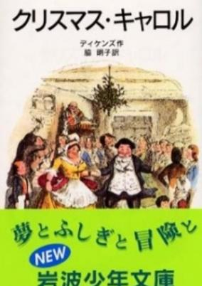

**Genres:** Victorian Period, United Kingdom, Earth, Europe, Past, Historical, Music

> Based on the novel A Christmas Carol by Charles Dickens.
>
> _Synopsis source: Kitsu_

[Wikipedia](https://en.wikipedia.org/wiki/The_Stingiest_Man_in_Town) · [Kitsu](https://kitsu.io/anime/machi-ichiban-no-kechinbou)

---

### Captain Future: The Great Race in the Solar System

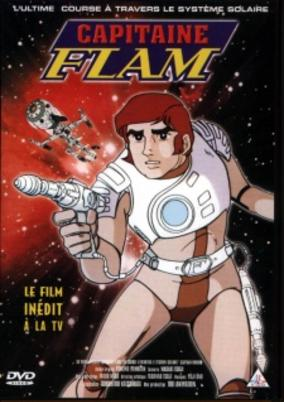

**Genres:** Science Fiction, Action, Adventure

> Sequel of Captain Future.
>
> _Synopsis source: Kitsu_

[Kitsu](https://kitsu.io/anime/captain-future-kareinaru-taiyokei-race)

---

### Picadon

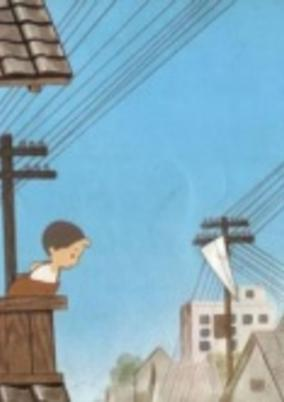

**Genres:** Historical, Drama

> An animation documentary describing the tragic consequences of the A-bomb explosion in Hiroshima on August 6th, 1945. The flash of the A-bomb, 100 times brighter than the sun, is called "PICA", and the enormous shock wave which came right after the flash is called "DON". At the time this film was completed, it was the very first attempt in the world to deal with such a sensitive subject of Hiroshima using animation media. Because of this short film, the City of Hiroshima decided to establish the Hiroshima International Animation Festival in 1984, appreciating animation art as an effective medium.
>
> _Synopsis source: Kitsu_

[Wikipedia](https://en.wikipedia.org/wiki/Picadon) · [Kitsu](https://kitsu.io/anime/pika-don)

---
