# 1979 in Anime

[← Back to index](../README.md)

26 titles · 26 with a matched synopsis/cover art · [source](https://en.wikipedia.org/wiki/1979_in_anime)

## Releases

### Adventures of the Polar Cubs

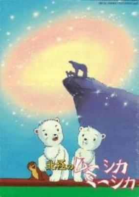

**Genres:** Adventure

> Adventures of the polar cubs is a delightful story of Mushka and Mishka, two polar bear cubs who set out on a series of adventures in the North Pole. Mushka is thoughtful; Mishka is daring. While out on their own Mishka befriends Aura, A prank-playing seal and Mushka stumbles over swan eggs, breaks them and creates havoc in the bird village. The cub's father is Scholar Mu (voice of Joseph Campanella), who is the wise leader of the Great Northern animal kingdom and is in charge of their annual Summer Festival. When Mu is injured by man, the cubs must take on the responsibilities of their father and save the other animals from the hunters.
>
> _Synopsis source: Kitsu_

[Kitsu](https://kitsu.io/anime/hokkyoku-no-muushika-miishika)

---

### Age of the Great Dinosaurs

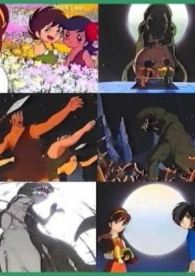

**Genres:** Science Fiction

> Jun, his female companion, Remi, and her little brother, Chobi, are taken to the Cretaceous Period by a flying saucer.
>
> _Synopsis source: Kitsu_

[Kitsu](https://kitsu.io/anime/daikyouryuu-jidai)

---

### Aim for the Ace! (Aim for the Ace! (1979))

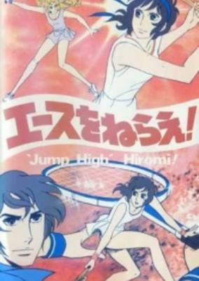

**Genres:** Japan, Tennis, Romance, School Life, Sports

> High school freshman Hiromi joins the tennis club because of her admiration for Ryuzaki. Ryuzaki is a senior, who's the best tennis player on the team and also nicknamed "Ochoufujin", ("Madame Butterfly"), because of her elegance on the tennis court. However, the new coach, Jin Munakata, wants the inexperienced Hiromi to play in a forthcoming tournament. Due to this, Hiromi considers quitting tennis for good but, in the depth of her soul, she soon realizes that she loves tennis after all. She returns to the club and, under Munakata's coaching, her talent starts to bloom. In the end, Hiromi develops a strong emotional bond with her coach, not knowing that Munakata is risking his life because of a chronic illness.
>
> _Synopsis source: Kitsu_

[Wikipedia](https://en.wikipedia.org/wiki/Aim_for_the_Ace!) · [Kitsu](https://kitsu.io/anime/ace-wo-nerae-1979)

---

### Anne of Green Gables

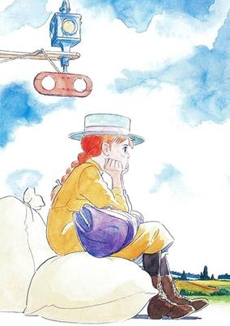

**Genres:** Middle School, Past, Earth, Countryside, Historical, Plot Continuity, Americas, Slice of Life, Coming Of Age

> Anne is an orphan full of imagination. When she arrives at her new home she learns that sometimes you have to be a sensible person too; at the same time her unique character changes, or at least attracts, the people around her. The story covers Anne's growth from about eleven to seventeen years old as she makes friends, goes to school and studies. At a difficult point in her life, Anne will have to make a hard choice and perhaps find a new dream.
>
> _Synopsis source: Kitsu_

[Wikipedia](https://en.wikipedia.org/wiki/Anne_of_Green_Gables_(1979_TV_series)) · [Kitsu](https://kitsu.io/anime/akage-no-anne)

---

### Bannertail: The Story of Gray Squirrel

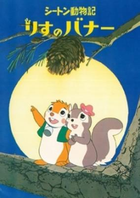

**Genres:** Slice of Life, Comedy, Anthropomorphism, Friendship, Kids

> Soon after birth a young squirrel comesc to a farm, and gets caught by a human. This human then tries to find him to their pet cat. However, the cat feels sorry for the squirrel and adopts him as their child and names the squirrel Banner. Banner and the cat live happily in the farm, but their happy lives don't last long. A fire destoys the farm, and Banner gets separated from his mother the cat.
>
> _Synopsis source: Kitsu_

[Kitsu](https://kitsu.io/anime/bannertail-the-story-of-gray-squirrel)

---

### The Castle of Cagliostro (Lupin the Third: The Castle of Cagliostro)

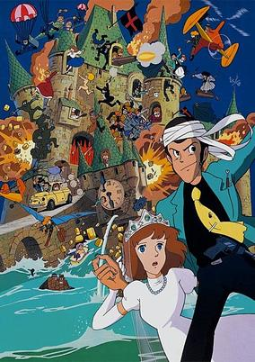

**Genres:** Adventure, Action, Earth, Thievery, Comedy, Europe, Crime

> In the twilight of his career, master thief Lupin the Third's latest and greatest caper has hit a snag. What should've been bags of cash from a national casino turns out to be expert counterfeits! Together with his partner-in-crime Jigen, Lupin heads to the remote European nation of Cagliostro to exact revenge. Not everything goes as planned; the two encounter Clarisse, a royal damsel in distress being forced to marry the sinister Count Cagliostro against her will. Saving her won't be easy, however, as Lupin and Jigen -- together with Lupin's unpredictable ex-girlfriend Fujiko and the swordsman Goemon -- must fight their way through a trap-filled castle, a deadly dungeon, and an army of professional assassins! Can Lupin rescue the girl, evade the cuffs of his long-time nemesis Inspector Zenigata, and uncover the secret treasures of The Castle of Cagliostro?
>
> _Synopsis source: Kitsu_

[Wikipedia](https://en.wikipedia.org/wiki/The_Castle_of_Cagliostro) · [Kitsu](https://kitsu.io/anime/lupin-iii-cagliostro-no-shiro)

---

### Doraemon

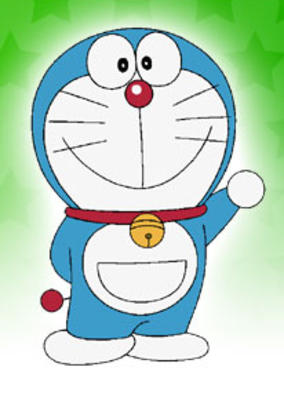

**Genres:** Present, Japan, Science Fiction, Fantasy, Adventure, Comedy, Slice of Life, School Life, Kids

> Nobi Nobita is a 4th-grade boy in Tokyo. One day, a round, blue cat-style robot (minus ears) pops up in his desk drawer. Nobita's great-great-grandson (or something) lives in the 22nd Century, but thanks to Nobita's mistakes, the entire family is living in poverty. To rectify this, Nobita's descendant sends Doraemon back to the past, to help prevent Nobita from making mistakes. Of course this is a difficult task since Nobita is the weakest and least intelligent child in his class. Doraemon does, however, have a 4-dimensional pocket on his front, which contains cool gadgets from the future. With these toys, Doraemon will try to help Nobita. Unfortunately, Nobita also has the bad habit of misusing Doraemon's gadgets and landing himself in yet more trouble!
>
> _Synopsis source: Kitsu_

[Wikipedia](https://en.wikipedia.org/wiki/Doraemon_(1979_TV_series)) · [Kitsu](https://kitsu.io/anime/doraemon-1979)

---

### Galaxy Express 999

**Genres:** Space Travel, Science Fiction, Adventure, Action, Gunfights, Human Enhancement, Cyborg, Coming Of Age, Dystopia, Other Planet, Shipboard, Drama, Future, Space

> In the distant future, humanity has found a way to live forever by purchasing mechanical bodies, but this way to immortality is extraordinarily expensive. An impoverished boy, Tetsurou Hoshino, desires to purchase a pass on the Galaxy Express 999—a train that travels throughout the universe—because it is said that at the end of the line, those aboard can obtain a mechanical body for free. When Tetsurou's mother is gunned down by the villainous machine-man hybrid Count Mecha, however, all seems lost. Tetsurou is then saved from certain death by the mysterious Maetel, a tall woman with blonde hair and a striking resemblance to his mother. She gives him a pass to the Galaxy Express under one condition: that they travel together. Thus, Tetsurou begins his journey across the universe to many unique planets and thrilling adventures, in hopes of being able to attain that which he most desires. [Written by MAL Rewrite]
>
> _Synopsis source: Kitsu_

[Wikipedia](https://en.wikipedia.org/wiki/Galaxy_Express_999_(film)) · [Kitsu](https://kitsu.io/anime/galaxy-express-999)

---

### Good Luck! Our Hit and Run (Hit and Run)

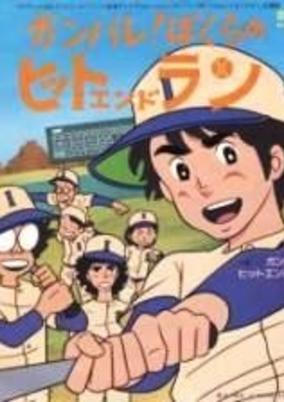

**Genres:** Baseball, Action, School Life, Sports

> Inaba Junior High School's baseball team has been defeated miserably since the senior members left. Because of their poor results, the players are suspended from games and are almost forced to break up. Ironically, however, this hardship makes them band tighter together and intensifies their desire to play. They practice hard in the hope of regaining the respect of the other students and teachers. Soon, their will-power leads them to unbelievable victories. This story portrays the boys' dreams and friendship through baseball.
>
> _Synopsis source: Kitsu_

[Kitsu](https://kitsu.io/anime/ganbare-bokura-no-hit-and-run)

---

### Good Luck!! Tabuchi-kun!!

**Genres:** Sports, Comedy, Baseball

> The Seibu Lions baseball team makes it to the next round of a baseball tournament thanks to the heroic efforts of its star player, Tabuchi, but the next stage will involve hard work and cooperation.
>
> _Synopsis source: Kitsu_

[Wikipedia](https://en.wikipedia.org/wiki/Ganbare!!_Tabuchi-kun!!) · [Kitsu](https://kitsu.io/anime/ganbare-tabuchi-kun)

---

### Hana no Ko Lunlun (Flower Angel)

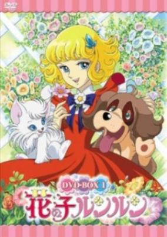

**Genres:** Earth, Europe, Coming Of Age, Magic, Past, Magical Girl

> The King of the Flower Planet is dying, but his heir can't take up the throne until the legendary Seven Color Flower, symbol of the King's power, is found. The Angels, Cateau and Noveau are sent to Earth to find the Flower Girl, a young female who descends from both humans and Flower Angels (who once inhabited Earth a long time ago) - and they find Lunlun in France. They convince her to go in a long journey to find the Flower - she'll know the good and bad sides of humans and Flower Angels (incarnated in the ambitious Togenishia and her sidekick Boris), and will fall in love with Serge Flora, a man who holds a great secret.
>
> _Synopsis source: Kitsu_

[Wikipedia](https://en.wikipedia.org/wiki/Hana_no_Ko_Lunlun) · [Kitsu](https://kitsu.io/anime/hana-no-ko-lunlun)

---

### House of Flames

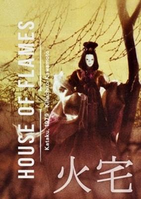

**Genres:** Fantasy, Historical, Demon

> Many years ago, a young woman named Unai-Otome lived in the village of Ikuta. As she was beautiful it was no surprise that she had two suitors, both deeply in love with her. The girl was torn apart over which one to choose. In her desperation she chose a third option - taking her own life. Although her intentions were absolutely pure, not even in death did she find the solace she desired. Many decades later, a pilgrim walking by her grave meets a beautiful young woman and her story once again rises from the depths of time.... With a plot based on a classic play of Noh traditional theatre, the film presents the peak of Kawamoto’s mastery thanks to its expert mediation of the absurdity of the human condition.
>
> _Synopsis source: Kitsu_

[Kitsu](https://kitsu.io/anime/house-of-flames)

---

### Japanese Masterpiece Fairy Tale Series: Heart of the Red Bird

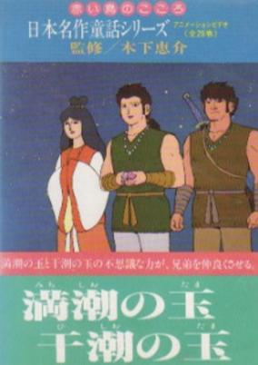

**Genres:** Fantasy, Adventure, Kids

> A collection of children's stories originally printed in the popular magazine Akai Tori, which was published from 1918 to 1936.
>
> _Synopsis source: Kitsu_

[Kitsu](https://kitsu.io/anime/nihon-meisaku-douwa-series-akai-tori-no-kokoro)

---

### Julie the Wild Rose

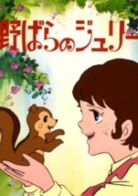

**Genres:** Historical, Music, Drama, Adventure

> Eleven-year-old Julie Braun lives in the lush green mountain pastures of Austria's Southern Tyrol. Her parents are killed by Italian soldiers, and she is sent to Vienna to live with her relatives, the Clementes. She befriends cousins Johan and Tanya but has trouble adjusting to life with Uncle Karl and Aunt Klara. As Austria is plunged into World War I, Karl is fired from his job at a glass factory, and Julie's new family is forced into a life of hardship.
>
> _Synopsis source: Kitsu_

[Kitsu](https://kitsu.io/anime/nobara-no-julie)

---

### Les Misérables

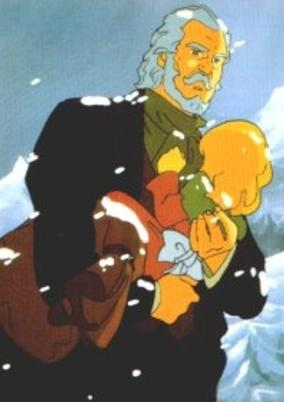

**Genres:** Drama

> Animated adaptation of Victor Hugo's "Les Misérables".
>
> _Synopsis source: Kitsu_

[Kitsu](https://kitsu.io/anime/jean-valjean-monogatari)

---

### Lupin the Thief: Enigma of the 813

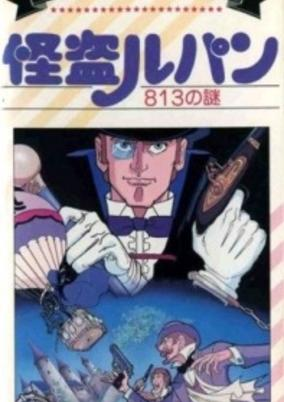

**Genres:** Thievery, Mystery

> Based on the novel "813" by Maurice Leblanc.
>
> _Synopsis source: Kitsu_

[Kitsu](https://kitsu.io/anime/kaitou-lupin-813-no-nazo)

---

### Mobile Suit Gundam

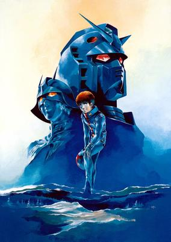

**Genres:** Future, Space, Mecha, Space Travel, Transforming Craft, Piloted Robot, Shipboard, Plot Continuity, Action, Angst

> It is year 0079 of the Universal Century. Mankind has moved to space, living in colony clusters known as "Sides." One of these Sides declares itself the "Principality of Zeon" and declares war on the Earth Federation, the governmental body currently ruling Earth. Using powerful humanoid robots known as "mobile suits," Zeon quickly gains the upper hand.Nine months into the conflict, the Earth Federation has developed its own powerful mobile suit called the Gundam. When Zeon launches an attack on the colony holding the Gundam, a 15-year-old civilian named Amuro Ray suddenly finds himself thrown into a conflict that will take him all across Earth and space, pitting him against the enemy's ace pilot, Char Aznable.[Written by MAL Rewrite]
>
> _Synopsis source: Kitsu_

[Wikipedia](https://en.wikipedia.org/wiki/Mobile_Suit_Gundam) · [Kitsu](https://kitsu.io/anime/mobile-suit-gundam-0079)

---

### Nutcracker Fantasy

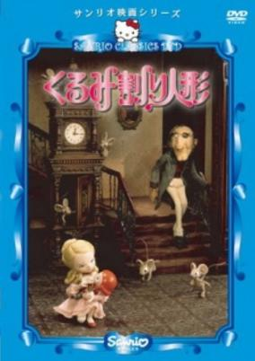

**Genres:** Fantasy, Drama, Romance

> The young girl Clara visits her Aunt Gerda and Uncle Drosselmeyer. Her aunt tells her scary stories about the Ragman, a creepy and mysterious man who turns children into mice if they don't go to bed on time. The Ragman is always spying on sleeping children searching for more victims. Just before Clara goes to bed her eccentric uncle gives her a wooden nutcracker doll. He's a bit embarrassed because the only part on the doll that's perfect is the heart, but Clara loves her new doll. She falls asleep but wakes up hearing mice squeaking...
>
> _Synopsis source: Kitsu_

[Wikipedia](https://en.wikipedia.org/wiki/Nutcracker_Fantasy) · [Kitsu](https://kitsu.io/anime/kurumiwari-ningyou)

---

### Preface Taro

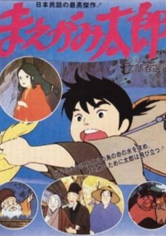

**Genres:** Adventure

> This is a folk-tale-like adventure story of an active boy on a quest for the Water of Life. The boy sets out on this quest after learning that the Water of Life is needed to make his village happy. On the way, he meets gods, demons... Soon, he discovers that the evil snake has stolen the Water, and he heads for the snake`s palace. Defeating the snake is not easy since it has the Water of Life to revive itself. This boy - Maegami Tarou - continues his courageous quest in cooperation with various creatures and the gods.
>
> _Synopsis source: Kitsu_

[Kitsu](https://kitsu.io/anime/maegami-tarou)

---

### The Rose of Versailles

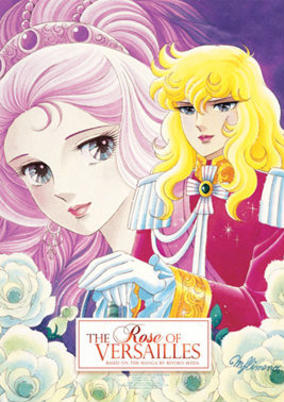

**Genres:** Romance, Earth, France, Swordplay, Europe, Love Polygon, Drama, Past, Plot Continuity, Military, Historical, Adventure

> In 1755, Marie Antoinette is born in the royal family of Austria and raised in luxury. However, the fate of the future queen of France is set in stone—at the young age of 15, she has to leave her family and marry the crown prince of France.At the same time in France, a girl is born in the family of the Commander of the Royal Guards. Upset at not having a male heir, her father decides to raise her as a man and names the girl Oscar. Oscar is trained from a young age to become the leader of the Royal Guards, but she is yet to discern that the will of the queen sometimes does not equal the good of the people.Based on the critically acclaimed manga by Riyoko Ikeda, Rose of Versailles depicts the fateful meeting of Marie Antoinette and Oscar, which is bound to influence history and change the life of the people facing the French Revolution as the clock ticks toward the end of the French royalty.[Written by MAL Rewrite]
>
> _Synopsis source: Kitsu_

[Wikipedia](https://en.wikipedia.org/wiki/The_Rose_of_Versailles) · [Kitsu](https://kitsu.io/anime/rose-of-versailles)

---

### Taro the Dragon Boy

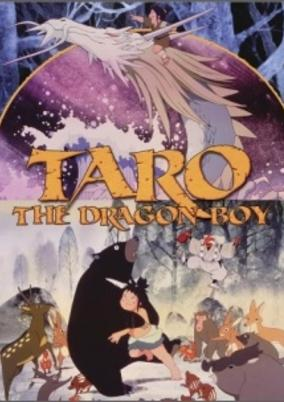

**Genres:** Fantasy, Adventure, Earth, Dragon, Coming Of Age, Anthropomorphism, Past, Demon, Historical

> Patterned after Japanese art and silk screens, Taro, The Dragon Boy is an animated feature about Japanese mythology and cultures, focusing on Taro, a young boy who has to make a voyage to a distant lake to save his mother, who has been turned into a dragon.
>
> _Synopsis source: Kitsu_

[Wikipedia](https://en.wikipedia.org/wiki/Taro_the_Dragon_Boy) · [Kitsu](https://kitsu.io/anime/taro-the-dragon-boy)

---

### Time Bokan Series: Zenderman

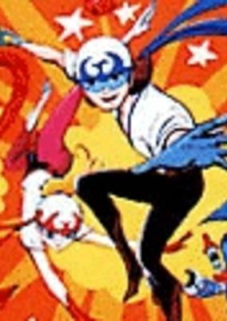

**Genres:** Science Fiction, Mecha, Super Power, Action, Adventure, Comedy

> Dr Monja is a scientist who is curious about the nature of the legendary Elixir of Life which grants the drink eternal lifetimes and forever youth. He built a device called the "Time Tunnel" in order to let a team of youngsters to start a quest down the timeline and various spaces to find an exact answer. A trio of villains, however, is also seemingly after the exact same thing.
>
> _Synopsis source: Kitsu_

[Wikipedia](https://en.wikipedia.org/wiki/Zenderman) · [Kitsu](https://kitsu.io/anime/time-bokan-series-zenderman)

---

### Tomorrow's Eleven

**Genres:** Soccer, Sports

> A boy from the farm with amazing running speed is asked to join a newly formed national soccer team and discovers a natural talent for the game. The movie is inspired by Japan's hosting of the world soccer championships that year.
>
> _Synopsis source: Kitsu_

[Kitsu](https://kitsu.io/anime/ashita-no-eleventachi)

---

### Undersea Super Train: Marine Express

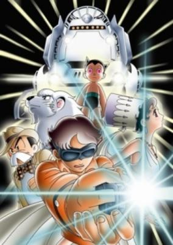

**Genres:** Earth, Science Fiction, Comedy, Adventure, Detective, Future, Android, Stereotypes, Action

> The year is 2002, and the Marine Express, the first underwater train between America and Japan, is ready for its maiden voyage. The chief engineer suspects that the train's test run will be used for illicit purposes and hires private detective Ban Shunsaku. He arrives to his client's mansion only to find that he has just been murdered. Armed with just a glimpse of the murderer's face, Shunsaku boards the Marine Express to get to the bottom of this mystery. This job, however, is much more than what he bargained for, as the train holds secrets beyond anyone's imagination.
>
> _Synopsis source: Kitsu_

[Kitsu](https://kitsu.io/anime/marine-express)

---

### Unico: Black Cloud and White Feather (Black Rain and White Feather)

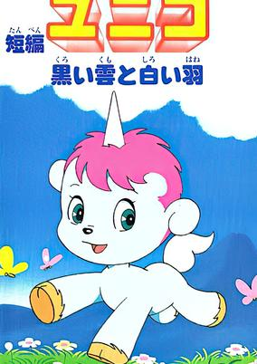

**Genres:** Adventure, Fantasy, United States, Americas, Anthropomorphism, Past, Kids

> The Goddess Venus is jealous of the beautiful human girl Psyche and blames her pet unicorn, Unico, as Psyche's source of good luck that keeps her from the harm of the goddess' cruel intentions.Unico has the amazing power to make anyone he meets happy. Whether it's because of his personality or the powers of his horn, no one knows. Venus has Unico banished, and the West Wind now takes Unico from one place and time to the next. Taken to a heavily polluted city, Unico meets a sickly girl named Chiko who is suffering because of the pollution of a nearby factory that darkens the entire sky. Unico then is determined to cheer her up, cure her, and destroy the nearby factory.
>
> _Synopsis source: Kitsu_

[Kitsu](https://kitsu.io/anime/unico-black-rain-and-white-feather)

---

### Yamato: The New Voyage (Space Battleship Yamato: The New Voyage)

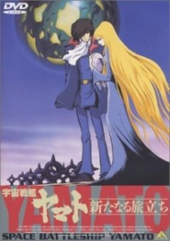

**Genres:** Space Travel, Science Fiction, Space Opera, Other Planet, Shipboard, Alien, Future, Space, Military

> It is the year 2201. The Yamato has returned from the devastating battle with Emperor Zordar and the Comet Empire. Sanada, Aihara, and Shima are released from the hospital, and go to pay their respects to the fallen crew members at Okita's memorial. They meet Tokugawa's son Tasuke, who says that he will be joining the crew once he graduates from cadet school. The next day at his graduation, he ends up capsizing a boat full of new cadets because they are all too busy staring at the Yamato to watch where they are going. After some problems during launch due to the new engine crew hitting the wrong switches and stalling the ship, the Yamato departs on what should be a simple training mission.
>
> _Synopsis source: Kitsu_

[Kitsu](https://kitsu.io/anime/uchuu-senkan-yamato-aratanaru-tabidachi)

---
