# 1980 in Anime

[← Back to index](../README.md)

39 titles · 29 with a matched synopsis/cover art · [source](https://en.wikipedia.org/wiki/1980_in_anime)

## Releases

### The Adventures of Tom Sawyer

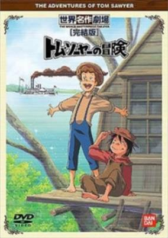

**Studio:** Nippon Animation &nbsp;|&nbsp; **Director:** Hiroshi Saitō &nbsp;|&nbsp; **Aired/Released:** January 6 &nbsp;|&nbsp; **Genres:** Historical, Slice of Life, Drama, Adventure

> Tom Sawyer is a young boy growing up along the Mississippi River in the mid 1800s. Along with his best friend Huckleberry Finn, he spends his days ditching school, fishing, climbing trees and having adventures.
>
> _Synopsis source: Kitsu_

[Wikipedia](https://en.wikipedia.org/wiki/The_Adventures_of_Tom_Sawyer_(anime)) · [Kitsu](https://kitsu.io/anime/tom-sawyer-no-bouken)

---

### The Littl' Bits

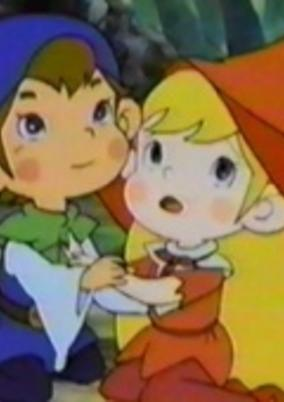

**Studio:** Tatsunoko Production &nbsp;|&nbsp; **Director:** Masayuki Hayashi &nbsp;|&nbsp; **Aired/Released:** January 7 &nbsp;|&nbsp; **Genres:** Fantasy, Adventure, Comedy

> This family-friendly series features a community of tiny forest pixies living in a quaint, old fashioned village. Kind-hearted Belfy, adventurous Lillibit, mischievous Napoleon and tiny Chuchuna have adventures with their friends and help out those around them. With the guidance of wise village elder Ronji, competent (but not always sober) Doctor Dokkorin, authoritative Mayor Maymond and Lillibit's hardworking parents Rock and Marla, the children learn lessons about kindness, friendship, courage, hard work, perseverance, following your dreams, standing up for what's right and rising up to face life's unexpected challenges.
>
> _Synopsis source: Kitsu_

[Wikipedia](https://en.wikipedia.org/wiki/The_Littl%27_Bits) · [Kitsu](https://kitsu.io/anime/mori-no-youki-na-kobito-tachi-belfy-to-lillibit)

---

### The Wonderful Adventures of Nils (The Wonderful Adventures of Nils Movie)

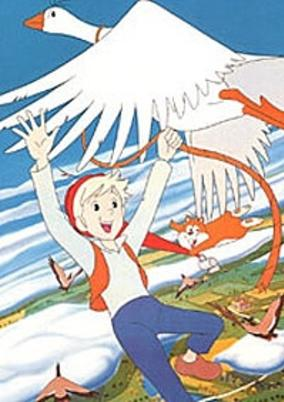

**Studio:** Studio Pierrot &nbsp;|&nbsp; **Director:** Hisayuki Toriumi , Mamoru Oshii &nbsp;|&nbsp; **Aired/Released:** January 8 &nbsp;|&nbsp; **Genres:** Fantasy, Adventure, Kids

> Nils Holgersson is a young boy on a farm who is cruel to the animals. But when he catches the farm's little goblin it becomes one prank too many. He is magically shrunk and suddenly the farm animals are out for revenge. He flees on the back of the goose Morten and they join up with a flock of wild geese. Together they travel all over Sweden, with Nils hoping to find a way to become big again.
>
> _Synopsis source: Kitsu_

[Wikipedia](https://en.wikipedia.org/wiki/The_Wonderful_Adventures_of_Nils_(anime)) · [Kitsu](https://kitsu.io/anime/nils-no-fushigi-na-tabi-movie)

---

### Maeterlinck's Blue Bird: Tyltyl and Mytyl's Adventurous Journey

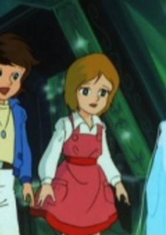

**Studio:** Academy Production &nbsp;|&nbsp; **Director:** Hiroshi Sasagawa &nbsp;|&nbsp; **Aired/Released:** January 9 &nbsp;|&nbsp; **Genres:** Fantasy, Adventure

> On a snowy Christmas Eve, Tyltyl and Mytyl sit in their home. Normally, they would be caught up in the Christmas spirit, but their mother has taken ill. So that evening, they lie awake, unable to sleep, when through the window crashes a strange, mercurial magical spirit named Berylune, who reveals that the world we live in isn't the only one there is. And so Tyltyl and Mytyl, accompanied by various spirits, as well as their now-humanoid pets, are led on a journey to find the blue bird of happiness and save their mother, and along the way they visit some strange and wondrous places, and finally, must face the spirit of darkness to attain their elusive goal.
>
> _Synopsis source: Kitsu_

[Kitsu](https://kitsu.io/anime/maeterlinck-no-aoi-tori)

---

### Invincible Robo Trider G7

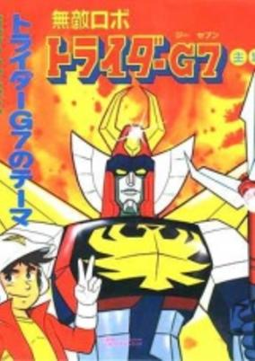

**Studio:** Nippon Sunrise &nbsp;|&nbsp; **Director:** Katsutoshi Sasaki &nbsp;|&nbsp; **Aired/Released:** February 2 &nbsp;|&nbsp; **Genres:** Science Fiction, Mecha, Super Robot, Robot, Space, Comedy

> Takeo Watta inherits a company upon his father's death. The company focuses on space travel, and the transformable robot Trider-G7 is their greatest creation. When an evil space organization lead by Lord Zakuron starts attacking Earth, Watta has to use Trider in a more combat-oriented way.
>
> _Synopsis source: Kitsu_

[Wikipedia](https://en.wikipedia.org/wiki/Invincible_Robo_Trider_G7) · [Kitsu](https://kitsu.io/anime/trider-g7)

---

### Rescueman

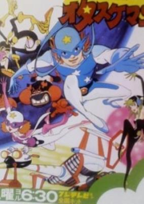

**Studio:** Tatsunoko Productions &nbsp;|&nbsp; **Director:** Hiroshi Sasagawa &nbsp;|&nbsp; **Aired/Released:** February 2 &nbsp;|&nbsp; **Genres:** Science Fiction, Action, Adventure, Comedy

> Burning with ambitions to become the most beautiful woman, the most renowned scientist, and the greatest hero the world has ever known, three villains, Atasha, Sekobitchi and Duwarusuki, unite. The trio are Time Patrollers, the keepers and protectors of the annals of history. But, this is only a cover for the trio, as the villains are league with a nefarious leader, who is trying to alter the course of history to suit his desires, and, under his instructions, the trio travel in time with the aim of tampering with recorded history. Only Hikaru and Nana, disguised as the Otasukemen, stand between the villains and their goals.
>
> _Synopsis source: Kitsu_

[Wikipedia](https://en.wikipedia.org/wiki/Rescueman) · [Kitsu](https://kitsu.io/anime/time-bokan-series-time-patrol-tai-otasukeman)

---

### Back to the Forest

**Studio:** Nippon Animation &nbsp;|&nbsp; **Director:** Yoshio Kuroda &nbsp;|&nbsp; **Aired/Released:** February 3

[Wikipedia](https://en.wikipedia.org/wiki/Back_to_the_Forest)

---

### Monchhichi Twins

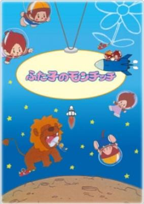

**Studio:** Ashi Productions &nbsp;|&nbsp; **Director:** Hiroshi Jinsenji &nbsp;|&nbsp; **Aired/Released:** February 4 &nbsp;|&nbsp; **Genres:** Comedy, Kids

> Monchichi-chan, the twin sister, loves her twin brother very much. She is a crybaby and always follows her brother. Monchichi-kun, the twin brother, protects his sister. He is a brave adventurer and a fishing champion but sometimes becomes a hasty boy. They enjoy wonderful and mysterious adventures together everyday. When they take a space walk, they ride on a swan of the swan constellation and build a small house with aliens in the space. They can do everything children want to do and dream of. This heartwarming animation series featuring the pretty twins surely gives wonderful dreams, brother-sister love and hopes for the future to all the children in the world.
>
> _Synopsis source: Kitsu_

[Wikipedia](https://en.wikipedia.org/wiki/Monchhichi) · [Kitsu](https://kitsu.io/anime/futago-no-monchhichi)

---

### Lalabel

**Studio:** Toei Animation &nbsp;|&nbsp; **Director:** Masahiro Sasaki &nbsp;|&nbsp; **Aired/Released:** February 15 &nbsp;|&nbsp; **Genres:** Japan, Earth, Asia, Slice of Life, Magic, Magical Girl, Present, Comedy

> Lalabel is a magical girl who arrives in the Human world to stop an evil wizard from stealing various magical objects or items. As a magical girl, she has a kitty for a companion and a magic wand. Coincidentally, she lands on the doorstep of the Tachibana couple and lives in with them during her stay in the human world. She attends the local school and begins to learn about the different things in the human world.
>
> _Synopsis source: Kitsu_

[Wikipedia](https://en.wikipedia.org/wiki/Lalabel) · [Kitsu](https://kitsu.io/anime/mahou-shoujo-lalabel)

---

### Ashita no Joe: Gekijōban

**Studio:** Tokyo Movie Shinsha &nbsp;|&nbsp; **Director:** Mizuho Nishikubo &nbsp;|&nbsp; **Aired/Released:** March 8

[Wikipedia](https://en.wikipedia.org/wiki/Ashita_no_Joe)

---

### Doraemon: Nobita's Dinosaur

**Studio:** Shin-Ei Animation &nbsp;|&nbsp; **Director:** Hiroshi Fukutomi &nbsp;|&nbsp; **Aired/Released:** March 15

---

### Nobody's Boy: Remi

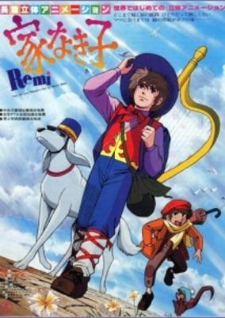

**Studio:** Tokyo Movie Shinsha &nbsp;|&nbsp; **Director:** Osamu Dezaki &nbsp;|&nbsp; **Aired/Released:** March 15 &nbsp;|&nbsp; **Genres:** Slice of Life, Drama, Adventure

> No synopsis has been added for this series yet.Click here to update this information.
>
> _Synopsis source: Kitsu_

[Kitsu](https://kitsu.io/anime/ie-naki-ko-movie)

---

### Phoenix 2772

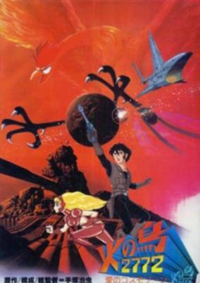

**Studio:** Tezuka Productions , Kobayashi Production , Toho &nbsp;|&nbsp; **Director:** Taku Sugiyama &nbsp;|&nbsp; **Aired/Released:** March 15 &nbsp;|&nbsp; **Genres:** Space Travel, Future, Science Fiction, Space, Fantasy, Adventure

> Phoenix 2772 starts with twelve minutes without dialogue, much like a silent film, recalling the birth and education of Godo. In this brave new world, children are born in test tubes and are raised by computers and robots. Godo learns the skills that will make him into a great pilot, assisted by the robotic wonder Olga. Everything that Godo needs is provided for him until he eventually goes for training with his automaton companion. He soon realizes that the world is not what he expected...
>
> _Synopsis source: Kitsu_

[Wikipedia](https://en.wikipedia.org/wiki/Phoenix_2772) · [Kitsu](https://kitsu.io/anime/hi-no-tori-2772-ai-no-cosmozone)

---

### Twelve Months

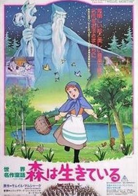

**Studio:** Toei Animation , Soyuzmultfilm &nbsp;|&nbsp; **Director:** Kimio Yabuki , Tetsuo Imazawa &nbsp;|&nbsp; **Aired/Released:** March 15 &nbsp;|&nbsp; **Genres:** Fantasy, Kids

> Twelve Months is the story of an orphaned girl named Anya. When a spoiled princess, who is also orphaned, sees a picture of a Galanthus, she immediately wants one. However, the Galanthus only blooms in spring, in the month of April. It is New Year's Eve and there was no way that such a flower can be found in the middle of the winter. The princess offers a basket of gold to anyone who can bring her a bag of Galanthus.
>
> _Synopsis source: Kitsu_

[Wikipedia](https://en.wikipedia.org/wiki/Twelve_Months_(1980_film)) · [Kitsu](https://kitsu.io/anime/sekai-meisaku-douwa-mori-wa-ikiteiru)

---

### Space Emperor God Sigma

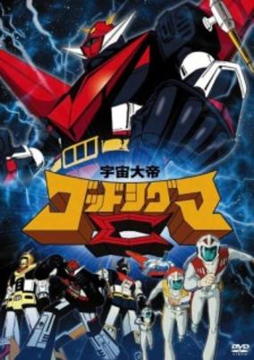

**Studio:** Toei Animation &nbsp;|&nbsp; **Director:** Takeyuki Kanda , Katsuhiko Taguchi &nbsp;|&nbsp; **Aired/Released:** March 19 &nbsp;|&nbsp; **Genres:** Science Fiction, Mecha, Piloted Robot, Future, Robot, Space, Action

> The year is 2050 and an energy crisis is Earth's main concern. A brilliant scientist in Trinity City develops the Trinity energy, a new source of energy powerful enough to supply the entire world. The alien empire of the Elda learn of this energy and plot to seize it by force. They attack Earth's space colony on Jupiter's moon of Io and occupy it. Meanwhile, the Trinity energy has been applied to three giant robots that combine to form God Sigma, a mighty robot led by martial artist-turned-pilot Dantou Shiya. With its mighty sword, it now stands between the peace of Earth and the power of the Elda forces.
>
> _Synopsis source: Kitsu_

[Wikipedia](https://en.wikipedia.org/wiki/Space_Emperor_God_Sigma) · [Kitsu](https://kitsu.io/anime/uchuu-taitei-god-sigma)

---

### Captain

**Studio:** Eiken &nbsp;|&nbsp; **Director:** Tetsu Dezaki &nbsp;|&nbsp; **Aired/Released:** April 2

[Wikipedia](https://en.wikipedia.org/wiki/Captain_(manga))

---

### King Arthur: Prince on White Horse

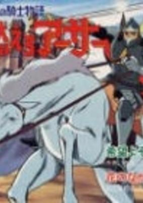

**Studio:** Toei Animation &nbsp;|&nbsp; **Aired/Released:** April 6 &nbsp;|&nbsp; **Genres:** Historical, Drama, Romance, Adventure

> No synopsis has been added for this series yet.Click here to update this information.
>
> _Synopsis source: Kitsu_

[Kitsu](https://kitsu.io/anime/moero-arthur-hakuba-no-oji)

---

### Tsurikichi Sanpei

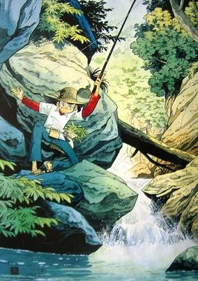

**Studio:** Nippon Animation &nbsp;|&nbsp; **Director:** Yoshikata Nitta &nbsp;|&nbsp; **Aired/Released:** April 7 &nbsp;|&nbsp; **Genres:** Japan, Sports, Slice of Life, Present, Adventure

> Mihira Sanpei talks with a Tohou accent and is a down-to-earth boy with a cheerful and optimistic personality. However, when it comes to fishing, he becomes very serious and is a youth who enjoys fishing more than anything else. The village where he lives in is a natural environment which provides different kinds of fishing challenges. Despite his lack of experience, Sanpei has a first-rate sense with regards to fishing and decides to maxmise his potential by entering into different fishing contests. As he faces various challenges, he learns to solve difficult problems and learn from his mistakes to the extent that he is able to fish anything out of the waters. Along the way, he encounters all kinds of rivals and companions who increase his experience points and help him in his growth.
>
> _Synopsis source: Kitsu_

[Wikipedia](https://en.wikipedia.org/wiki/Tsurikichi_Sanpei) · [Kitsu](https://kitsu.io/anime/tsurikichi-sanpei)

---

### Zukkoke Knight - Don De La Mancha (Don Quixote)

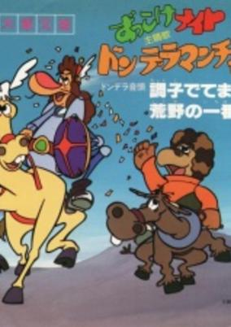

**Studio:** Ashi Productions &nbsp;|&nbsp; **Aired/Released:** April 15 &nbsp;|&nbsp; **Genres:** Romance, Comedy, Historical, Adventure

> Don Quixote, that infinitely popular character, travels the countryside battling windmills and attempting to win the love of his Dulcinea.
>
> _Synopsis source: Kitsu_

[Wikipedia](https://en.wikipedia.org/wiki/Zukkoke_Knight_-_Don_De_La_Mancha) · [Kitsu](https://kitsu.io/anime/zukkoke-knight-don-de-la-mancha)

---

### Toward the Terra

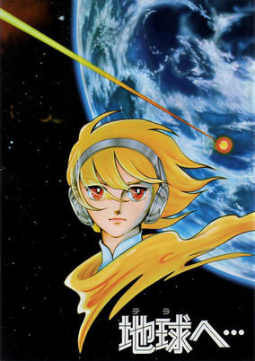

**Studio:** Toei Animation &nbsp;|&nbsp; **Director:** Hideo Onchi &nbsp;|&nbsp; **Aired/Released:** April 26 &nbsp;|&nbsp; **Genres:** Space Travel, Space Opera, Post Apocalypse, Science Fiction, Action, Fantasy World, Dystopia, Other Planet, Shipboard, Navy, Future, Space, Military, Super Power

> In the future, mankind's seemingly utopian society is strictly controlled by the government, and anything that threatens to disrupt the status quo is ruthlessly suppressed. When 14-year-old Jomy begins to question the way the society is run, he suddenly becomes a target for both the government and the Mu, an outcast race with extra-sensory abilities who have been fighting against the government for generations. Now, each is determined to hunt him down - one to kill him and the other to save him.
>
> _Synopsis source: Kitsu_

[Wikipedia](https://en.wikipedia.org/wiki/Toward_the_Terra) · [Kitsu](https://kitsu.io/anime/terra-e-movie)

---

### Ganbare!! Tabuchi-kun!! 2: Gekitō Pennant Race

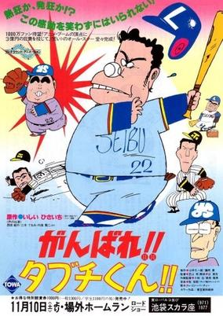

**Studio:** Tokyo Movie Shinsha &nbsp;|&nbsp; **Director:** Tsutomu Shibayama &nbsp;|&nbsp; **Aired/Released:** May 3 &nbsp;|&nbsp; **Genres:** Sports, Comedy, Baseball

> The Seibu Lions baseball team makes it to the next round of a baseball tournament thanks to the heroic efforts of its star player, Tabuchi, but the next stage will involve hard work and cooperation.
>
> _Synopsis source: Kitsu_

[Wikipedia](https://en.wikipedia.org/wiki/Ganbare!!_Tabuchi-kun!!) · [Kitsu](https://kitsu.io/anime/ganbare-tabuchi-kun)

---

### Space Runaway Ideon

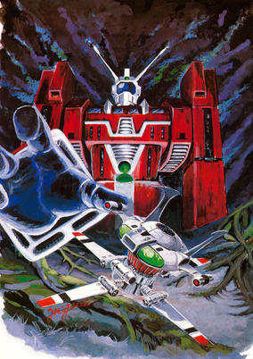

**Studio:** Sunrise &nbsp;|&nbsp; **Director:** Yoshiyuki Tomino &nbsp;|&nbsp; **Aired/Released:** May 8 &nbsp;|&nbsp; **Genres:** Space Travel, Transforming Craft, Science Fiction, Mecha, Action, Other Planet, Humanoid Alien, Plot Continuity, Space, Samurai

> Mankind has traveled to the stars and come across various alien civilizations, now long dead. Upon discovering the archaeological remains of such a civilization on the planet Solo, humanity finally has its first encounter with a living alien species: the Buff Clan. When Karala Ajiba, the daughter of the Buff Clan's military leader, sets foot on the surface of Solo, the Buff Clan launches a brutal assault on the colony to retrieve her. In order to escape, Cosmo Yuki, Kasha Imhof, and Bes Jordan climb aboard three trucks, which soon transform into the giant humanoid robot Ideon. When the settlement on Solo is destroyed, the survivors board a recently discovered spaceship—the Solo Ship—and flee, endeavoring to get away from the aliens and finally find peace. The relentless Buff Clan, however, is still in hot pursuit and will not give up so easily. [Written by MAL Rewrite]
>
> _Synopsis source: Kitsu_

[Wikipedia](https://en.wikipedia.org/wiki/Space_Runaway_Ideon) · [Kitsu](https://kitsu.io/anime/space-runaway-ideon)

---

### Space Warrior Baldios

**Studio:** Ashi Productions &nbsp;|&nbsp; **Director:** Kazuyuki Hirokawa &nbsp;|&nbsp; **Aired/Released:** June 30 &nbsp;|&nbsp; **Genres:** Science Fiction, Mecha, Space, Action

> This film supplied the ending to the cancelled Space Warrior Baldios television series.
>
> _Synopsis source: Kitsu_

[Wikipedia](https://en.wikipedia.org/wiki/Space_Warrior_Baldios) · [Kitsu](https://kitsu.io/anime/space-warrior-baldios-movie)

---

### Magical Girl Lalabel: the Sea Calls for a Summer Vacation

**Studio:** Toei Animation &nbsp;|&nbsp; **Director:** Hiroshi Shidara &nbsp;|&nbsp; **Aired/Released:** July 12 &nbsp;|&nbsp; **Genres:** Japan, Earth, Asia, Slice of Life, Magic, Magical Girl, Present, Comedy

> Lalabel is a magical girl who arrives in the Human world to stop an evil wizard from stealing various magical objects or items. As a magical girl, she has a kitty for a companion and a magic wand. Coincidentally, she lands on the doorstep of the Tachibana couple and lives in with them during her stay in the human world. She attends the local school and begins to learn about the different things in the human world.
>
> _Synopsis source: Kitsu_

[Wikipedia](https://en.wikipedia.org/wiki/Lalabel) · [Kitsu](https://kitsu.io/anime/mahou-shoujo-lalabel)

---

### Ganbare Genki

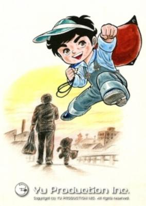

**Studio:** Toei Animation &nbsp;|&nbsp; **Director:** Rintaro &nbsp;|&nbsp; **Aired/Released:** July 16 &nbsp;|&nbsp; **Genres:** Boxing, Action, Combat, Sports, Comedy

> Horiguchi Genki was 5 years old boy. His mother died when he was born, and he was raised only by his father. His father, Shark Horiguchi, was a professional boxer, but he was ruined and become an itinerant boxer. However, Genki believed his father was strong and he would become a champion, and he had a dream to become a strong boxer as his father. After his father’s death, he was adopted by his grandparents. Although they opposed Genki boxing, Genki made up his mind to become a boxer, and he continued training secretly. Meeting with various people, for example, Teacher Ashikiwa who resembles his mother, Mishima who is a high school boxing champion, he made his way to be a boxer.
>
> _Synopsis source: Kitsu_

[Wikipedia](https://en.wikipedia.org/wiki/Ganbare_Genki) · [Kitsu](https://kitsu.io/anime/ganbare-genki)

---

### 3000 Leagues in Search of Mother

**Studio:** Nippon Animation &nbsp;|&nbsp; **Director:** Isao Takahata , Hajime Okayasu &nbsp;|&nbsp; **Aired/Released:** July 19

[Wikipedia](https://en.wikipedia.org/wiki/3000_Leagues_in_Search_of_Mother)

---

### Makoto-chan

**Studio:** Tokyo Movie Shinsha &nbsp;|&nbsp; **Director:** Tsutomu Shibayama &nbsp;|&nbsp; **Aired/Released:** July 26

[Wikipedia](https://en.wikipedia.org/wiki/Makoto-chan)

---

### Be Forever Yamato

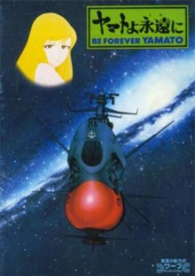

**Studio:** Group TAC , Academy Productions &nbsp;|&nbsp; **Director:** Leiji Matsumoto , Toshio Masuda &nbsp;|&nbsp; **Aired/Released:** August 2 &nbsp;|&nbsp; **Genres:** Romance, Space Travel, Science Fiction, Space Opera, Other Planet, Shipboard, Future, Space, Action, Adventure, Military

> The Black Nebula Empire attacks Earth and threatens to blow up the planet with a bomb they placed on Earth if counter attacked. Earths hopes rest on the Yamato crew as they go to the Black Nebula Planet and try to find a way to difuse the bomb before it's too late.
>
> _Synopsis source: Kitsu_

[Wikipedia](https://en.wikipedia.org/wiki/Be_Forever_Yamato) · [Kitsu](https://kitsu.io/anime/yamato-yo-eien-ni)

---

### Dracula: Sovereign of the Damned

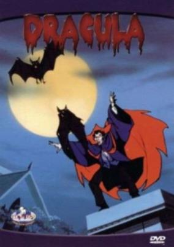

**Studio:** Toei Animation &nbsp;|&nbsp; **Director:** Minoru Okazaki &nbsp;|&nbsp; **Aired/Released:** August 19 &nbsp;|&nbsp; **Genres:** Vampire, Adventure, Contemporary Fantasy, United States, Dark Fantasy, Horror, Past

> In contemporary Boston, Dracula gatecrashes a Satanic ritual and makes off with the intended sacrifice, Delores. Overcome with love for her, he's unable to drink her blood and instead settles down with her and fathers a child, Janus. But Dracula's enemies are massing against him—a team of vampire hunters, including the wheelchair-bound Hans Harker, crossbow wielding and new recruit Frank Drake, a descendant of Dracula, are closing in. And Dracula has been stripped of his vampire powers by Satan and he desperately needs another vampire to restore his powers so that he can both see off his pursuers and avenge the death of Janus at the hands of vengeful Satanists.
>
> _Synopsis source: Kitsu_

[Kitsu](https://kitsu.io/anime/yami-no-teio-kyuuketsuki-dracula)

---

### Fumoon

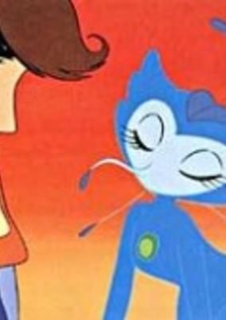

**Studio:** Tezuka Productions &nbsp;|&nbsp; **Director:** Osamu Tezuka &nbsp;|&nbsp; **Aired/Released:** August 31 &nbsp;|&nbsp; **Genres:** Earth, Science Fiction, Anti War, Drama, Future, Stereotypes, Disaster, Super Power

> Nuclear testing has resulted in the abrupt evolution of the Fumoon, a tiny but highly intelligent humanoid race on a small island, who are detected by Dr. Yamadano. Except for a few witnesses including the detective Shinsaku Ban, and the young men Rock and Kenichi and Kenichi’s sister Pichi (Pinoko), no one believes him. The Fumoon are kidnapping animals from around the world to bring with them as they use their space ships to evacuate the earth, because they know Earth is shortly to be destroyed by an enveloping cloud of black gas created by a stellar explosion. The Fumoon intend to abandon mankind, but one Fumoon, Rokoko, who becomes good friends with Kenichi, tries to help Dr. Yamadano and the others to develop a space ship to allow a few humans to escape, with the help of Dr. Ochanomizu and Dr. Frankenstein.
>
> _Synopsis source: Kitsu_

[Wikipedia](https://en.wikipedia.org/wiki/Fumoon) · [Kitsu](https://kitsu.io/anime/fumoon)

---

### Kaibutsu-kun 2

**Studio:** Shin-Ei Animation &nbsp;|&nbsp; **Director:** Hiroshi Fukutomi &nbsp;|&nbsp; **Aired/Released:** September 2

[Wikipedia](https://en.wikipedia.org/wiki/Kaibutsu-kun)

---

### Muteking, The Dashing Warrior

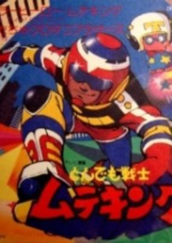

**Studio:** Tatsunoko Production &nbsp;|&nbsp; **Aired/Released:** September 7 &nbsp;|&nbsp; **Genres:** Comedy, Science Fiction, Magic, Super Power, Mecha, Action, Kids

> Twelve-year-old Linn Youki loyally supported his father when the world laughed at the scientist for saying that Earth was about to be invaded from outer space. But Linn did not expect to become personally involved--until he met Takoro, the strange young "deputy sheriff" from another world who was on the trail of notorious space criminals. There were only four Kurodako Brothers, but they plotted to use their alien science and natural shape-changing powers to become the secret masters of Earth. With Takoro's help, Linn became the mighty super-hero, Muteking, to foil their schemes. There is plenty of action and laughs in this light-hearted comedy-drama about a roller-skating costumed hero, his friendly but bumbling alien partner, a gang of klutzy would-be world conquerors, a beautiful police chief, an obsessed scientist, a sarcastic dog, an officious flying saucer, and others. This unusual but appealing cast of characters will charm viewers' hearts while it amuses them.
>
> _Synopsis source: Kitsu_

[Wikipedia](https://en.wikipedia.org/wiki/Muteking,_The_Dashing_Warrior) · [Kitsu](https://kitsu.io/anime/tondemo-senshi-muteking)

---

### Ojamanga Yamada-kun

**Studio:** Nihon Herald Pictures &nbsp;|&nbsp; **Director:** Hiromitsu Furukawa &nbsp;|&nbsp; **Aired/Released:** September 28 &nbsp;|&nbsp; **Genres:** Earth, Japan, Asia, Slice of Life, Comedy, Slapstick, Present

> TV anime adaptation of Hisaichi Ishii's comedy manga "Ojamanga Yamada-kun".
>
> _Synopsis source: Kitsu_

[Wikipedia](https://en.wikipedia.org/wiki/Ojamanga_Yamada-kun) · [Kitsu](https://kitsu.io/anime/ojamanga-yamada-kun)

---

### Astro Boy (Astro Boy (1980))

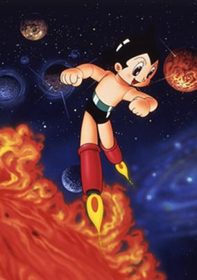

**Studio:** Tezuka Productions &nbsp;|&nbsp; **Director:** Noburo Ishiguro &nbsp;|&nbsp; **Aired/Released:** October 1 &nbsp;|&nbsp; **Genres:** Science Fiction, Action, Mecha, Adventure

> Creating a robotic boy in the image of his recently deceased son Tobio, Professor Tenma thought nothing could go wrong now that his beloved child had been "reborn"... that is, until he comes to realize that this invention could never replace his son. Before long, however, the robot is kidnapped and spirited away to a robot circus in America, where he is soon rescued by Dr. Ochanomizu, and taken into his care. Tobio is given the new name Tetsuwan Atom, and transforms into Japan's crime-fighting hero, although his anti-violent pacifist views and overall childlike naivety tend to clash with his battles often.
>
> _Synopsis source: Kitsu_

[Wikipedia](https://en.wikipedia.org/wiki/Astro_Boy_(1980_TV_series)) · [Kitsu](https://kitsu.io/anime/astro-boy-1980)

---

### Taiyō no Shisha Tetsujin Nijūhachi-gō

**Studio:** Tokyo Movie Shinsha &nbsp;|&nbsp; **Director:** Tetsuo Imazawa &nbsp;|&nbsp; **Aired/Released:** October 3

[Wikipedia](https://en.wikipedia.org/wiki/Tetsujin_28-go)

---

### Space Battleship Yamato III (Star Blazers: The Bolar Wars)

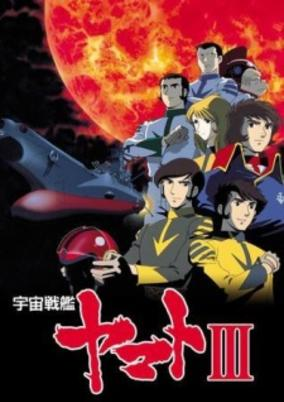

**Studio:** Group TAC , Academy Productions &nbsp;|&nbsp; **Director:** Leiji Matsumoto , Noburo Ishiguro &nbsp;|&nbsp; **Aired/Released:** October 11 &nbsp;|&nbsp; **Genres:** Science Fiction, Space Opera, Space, Action, Adventure, Military

> A stray missile from a confrontation between the Galman empire and the Bolar Federation crashes into the sun, turning it into a time bomb of radiation. The Star Force once again sets off into space, this time on a quest to look for a new world for the human race.
>
> _Synopsis source: Kitsu_

[Wikipedia](https://en.wikipedia.org/wiki/Space_Battleship_Yamato_III) · [Kitsu](https://kitsu.io/anime/uchuu-senkan-yamato-3)

---

### Ashita no Joe 2

**Studio:** Tokyo Movie Shinsha &nbsp;|&nbsp; **Director:** Masayuki Akebi &nbsp;|&nbsp; **Aired/Released:** October 13

[Wikipedia](https://en.wikipedia.org/wiki/Ashita_no_Joe)

---

### Ganbare!! Tabuchi-kun!! Hatsu Warai 3: Aa Tsuppari Jinsei

**Studio:** Tokyo Movie Shinsha &nbsp;|&nbsp; **Director:** Tsutomu Shibayama &nbsp;|&nbsp; **Aired/Released:** December 13 &nbsp;|&nbsp; **Genres:** Sports, Comedy, Baseball

> The Seibu Lions baseball team makes it to the next round of a baseball tournament thanks to the heroic efforts of its star player, Tabuchi, but the next stage will involve hard work and cooperation.
>
> _Synopsis source: Kitsu_

[Wikipedia](https://en.wikipedia.org/wiki/Ganbare!!_Tabuchi-kun!!) · [Kitsu](https://kitsu.io/anime/ganbare-tabuchi-kun)

---

### Chō Ginga Densetsu

**Studio:** Toei Animation &nbsp;|&nbsp; **Director:** Toshio Takeuchi &nbsp;|&nbsp; **Aired/Released:** December 20

[Wikipedia](https://en.wikipedia.org/wiki/Cyborg_009)

---
