# 1981 in Anime

[← Back to index](../README.md)

46 titles · 43 with a matched synopsis/cover art · [source](https://en.wikipedia.org/wiki/1981_in_anime)

## Releases

### The Swiss Family Robinson: Flone of the Mysterious Island

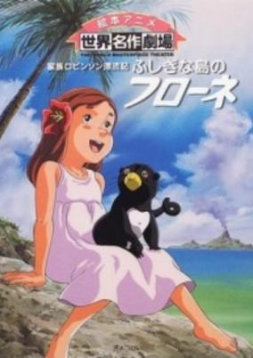

**Studio:** Nippon Animation &nbsp;|&nbsp; **Director:** Yoshio Kuroda &nbsp;|&nbsp; **Aired/Released:** January 4 &nbsp;|&nbsp; **Genres:** Adventure, Earth, Past, Historical, Slice of Life

> 10-year-old Flone is a very active, tomboyish sort of a girl. One day, her father receives a letter from his English friend who is now in Australia. In the letter, the friend asks her father to come down to Australia because of a serious shortage of doctors. The family decides to leave their old house in Bern. Now their drifting voyage has begun! Flone's fantastic adventures will teach children about the importance of family and the joys of living amidst nature's beauty.
>
> _Synopsis source: Kitsu_

[Kitsu](https://kitsu.io/anime/kazoku-robinson-hyouryuuki-fushigi-na-shima-no-flone)

---

### Hashire Melos! (Run Melos)

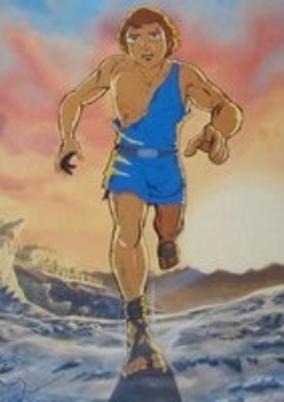

**Studio:** Toei Animation &nbsp;|&nbsp; **Director:** Tomoharu Katsumata &nbsp;|&nbsp; **Aired/Released:** February 7 &nbsp;|&nbsp; **Genres:** Past, Earth, Historical, Europe

> Melos, a Greek country man gets arrested accused of conspiracy against the king. The king gives him three days to travel to his sister's wedding while Selinentius the sculptor and friend of Melos stays as a hostage. Will he get back in time before the king executes Selinentius instead of him?
>
> _Synopsis source: Kitsu_

[Wikipedia](https://en.wikipedia.org/wiki/Hashire_Melos!) · [Kitsu](https://kitsu.io/anime/hashire-melos)

---

### Yattodetaman (Firebird)

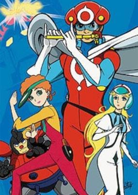

**Studio:** Tatsunoko Productions &nbsp;|&nbsp; **Director:** Hiroshi Sasagawa &nbsp;|&nbsp; **Aired/Released:** February 7 &nbsp;|&nbsp; **Genres:** Mecha, Action, Fantasy, Adventure, Comedy

> Throughout history, the quest for power infected mankind. In the future..nothing much changes. The setting for this exciting, funny and intriguing series is the Kingdom of Fir antic, where two royal houses are locked in combat to determine who will become the future ruler of the Kingdom. To secure the throne, one of two must travel through the aeons of time to find the Firebird. Whoever brings it back to Fir antic will rule from the throne of this mysterious country. The story starts in the present.... Here, in the desolate office of the Ace Detective Agency, Detectives Paul Tuck and Tracy Headly are whiling away the time reading magazines, for want of something better to do. Suddenly, a girl appears before them. From her strange dress the pair can just deduce that the girl couldn't possibly be from their time. She begins to speak..."You are quite right. I am from another era. In time, you two will be married, and I will be born from your bloodline many generations hence". The girl's name is Princess Sara of the Kingdom of Fir antic. Paul and Tracy are amazed by the girl's telepathic powers, and even more amazed to be told that they are to be married. But there is more to come. Princess Sara is looking for the Firebird with the use of a Time Tunnel. Paul and Tracy decide that it is their duty to protect their descendent's future. They offer to help Sara on her quest for the Firebird, but Sara has no idea where it is to be found. The only clue she has is that Princess Miranda and her party have come to this time as well. Sara telepathically discovers the whereabouts of their time machine, and our heroes chase after Miranda, who possesses any and all information concerning the Firebird....
>
> _Synopsis source: Kitsu_

[Wikipedia](https://en.wikipedia.org/wiki/Yattodetaman) · [Kitsu](https://kitsu.io/anime/time-bokan-series-yattodetaman)

---

### Golden Warrior Gold Lightan (Golden Warrior: The Gold Lightan)

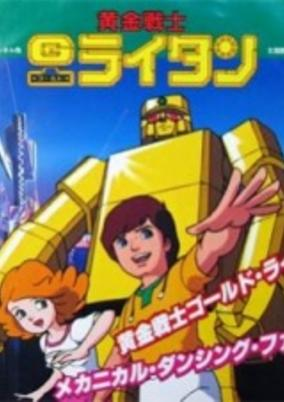

**Studio:** Tatsunoko Production &nbsp;|&nbsp; **Director:** Koichi Mashimo &nbsp;|&nbsp; **Aired/Released:** March 1 &nbsp;|&nbsp; **Genres:** Science Fiction, Mecha

> When a young boy called Hiro finds what appears to be a broken lighter in an empty field, it changes his life forever. This lighter is actually the Gold Lightan, a robot that fell to Earth from the Robot Dimension. When called upon to defend the Earth from Ivalda the Great's evil robots, Gold Lightan transforms into a giant super robot, known as the Golden Warrior. Gold Lightan joins forces with Hiro's and his gang, the One Pack Rangers to protect the Earth from the evil schemes of Ivalda the Great and his armored forces.
>
> _Synopsis source: Kitsu_

[Wikipedia](https://en.wikipedia.org/wiki/Golden_Warrior_Gold_Lightan) · [Kitsu](https://kitsu.io/anime/ougon-senshi-gold-raitan)

---

### Beast King GoLion (Voltron: Defender of the Universe)

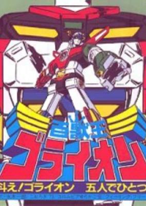

**Studio:** Toei Animation &nbsp;|&nbsp; **Director:** Katsuhito Taguchi &nbsp;|&nbsp; **Aired/Released:** March 4 &nbsp;|&nbsp; **Genres:** Transforming Craft, Science Fiction, Mecha, Action, Other Planet, Alien, Future, Robot, Space, Piloted Robot, Adventure

> Golion, a powerful sentient robot, abuses his great powers by attacking and killing creatures known as Deathblack Beastmen, boasting that no one could defeat him. A divine space being punishes Golion for his arrogance and abuse by seperating him into 5 different lion robots. In the year 1999, a group of 5 young men return to Earth after a space voyage, only to find it ravaged by nuclear war. After encountering the alien race known as the Galra, the 5 youths end up on the planet Altea, and learn that the 5 lion robots that Golion was split into are in hibernation in various parts of Altea. Somehow, they must reunite the lions and form Golion, the only hope for the human race.
>
> _Synopsis source: Kitsu_

[Wikipedia](https://en.wikipedia.org/wiki/Beast_King_GoLion) · [Kitsu](https://kitsu.io/anime/hyakujuu-ou-golion)

---

### Hello! Sandybell

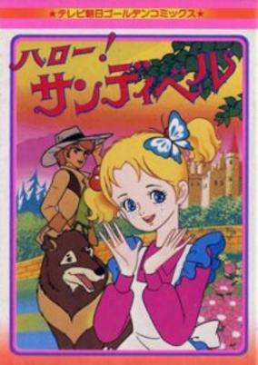

**Studio:** Toei Animation &nbsp;|&nbsp; **Director:** Hiroshi Shitara &nbsp;|&nbsp; **Aired/Released:** March 6 &nbsp;|&nbsp; **Genres:** Romance, Adventure, Earth, Europe

> Sandybell is a playful girl from Scotland. She is happy even if her mum died when she was little. Past secrets begin to reveal after Sandybell gets a white lily from a rich lady. After a tragic act Sandybell moves to London where she is trying to find clues to her past.
>
> _Synopsis source: Kitsu_

[Wikipedia](https://en.wikipedia.org/wiki/Hello!_Sandybell) · [Kitsu](https://kitsu.io/anime/hello-sandybell)

---

### Ohayō! Spank

**Studio:** TMS Entertainment &nbsp;|&nbsp; **Director:** Shigetsugu Yoshida &nbsp;|&nbsp; **Aired/Released:** March 7 &nbsp;|&nbsp; **Genres:** Romance, Japan, Asia, Earth, Slice of Life, Comedy, Present

> Morimura Aiko is a junior high school student who is short for her age. Her father went on a yacht ten years ago and his whereabouts remained in obscurity. Her mother, a designer for hats, left for Paris, leaving Aiko in the care of her uncle, Mr Fujinami. Aiko had a pet dog, Papi, but it died in a car accident. Around the same time, another dog, Spank, appears before her. Having gone through so many unfortunate events in her life, Spank's presence begins to brighten up Aiko's life and put a smile on her face.
>
> _Synopsis source: Kitsu_

[Wikipedia](https://en.wikipedia.org/wiki/Ohay%C5%8D!_Spank) · [Kitsu](https://kitsu.io/anime/ohayo-spank)

---

### Doraemon: The Records of Nobita, Spaceblazer (Doraemon the Movie: The Records of Nobita)

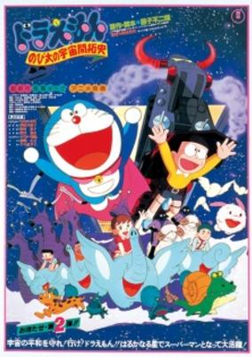

**Studio:** Shin-Ei Animation &nbsp;|&nbsp; **Director:** Hideo Nishimaki &nbsp;|&nbsp; **Aired/Released:** March 14 &nbsp;|&nbsp; **Genres:** Comedy, Fantasy, Adventure, Kids

> Nobita has been having a weird dream about a boy named Roppel and his strange companion Chami traveling in space. By a twist of fate, he met them in person where it turns out that they are real and that they were being pursued in space, causing their space vehicle to malfunction, connecting the space vehicle itself with Nobita's room. They journeyed to Roppel's planet and amidst their enjoyment, Nobita and Doraemon pledged to help Roppel's planet free from their oppressors.
>
> _Synopsis source: Kitsu_

[Kitsu](https://kitsu.io/anime/doraemon-nobita-s-space-story)

---

### The Fantastic Adventures of Unico

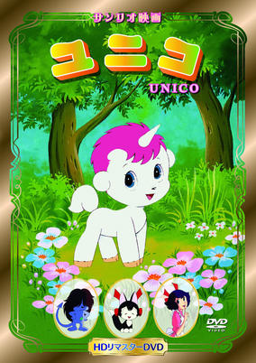

**Studio:** Madhouse &nbsp;|&nbsp; **Director:** Toshio Hirata &nbsp;|&nbsp; **Aired/Released:** March 14 &nbsp;|&nbsp; **Genres:** Fantasy, Adventure, Anthropomorphism, Past, Kids, Friendship

> Unico the Unicorn has the amazing power to make anyone he meets happy. Whether it's because of his personality or the powers of his horn, no one knows. However, the gods become jealous of Unico, thinking that only gods should be able to decide or let people be happy or not. Unico is banished to the Hill of Oblivion, and the West Wind is ordered to take him there. She can't stand giving this fate to an innocent like Unico, so Unico's adventures begin, as the West Wind takes him from one place and time to the next, in a neverending journey to escape the wrath of the gods. In this adventure, Unico meets Beezel a devil child and then Katy (Chao), a cat who wants to be a witch! Can he become friends with them?
>
> _Synopsis source: Kitsu_

[Wikipedia](https://en.wikipedia.org/wiki/Unico) · [Kitsu](https://kitsu.io/anime/unico)

---

### Mobile Suit Gundam

**Studio:** Nippon Sunrise &nbsp;|&nbsp; **Director:** Yoshiyuki Tomino &nbsp;|&nbsp; **Aired/Released:** March 14

[Wikipedia](https://en.wikipedia.org/wiki/Mobile_Suit_Gundam)

---

### Ojamanga Yamada-kun

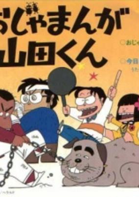

**Studio:** Nihon Herald Pictures &nbsp;|&nbsp; **Director:** Hiromitsu Furukawa &nbsp;|&nbsp; **Aired/Released:** March 14 &nbsp;|&nbsp; **Genres:** Earth, Japan, Asia, Slice of Life, Comedy, Slapstick, Present

> TV anime adaptation of Hisaichi Ishii's comedy manga "Ojamanga Yamada-kun".
>
> _Synopsis source: Kitsu_

[Wikipedia](https://en.wikipedia.org/wiki/Ojamanga_Yamada-kun) · [Kitsu](https://kitsu.io/anime/ojamanga-yamada-kun)

---

### Swan Lake

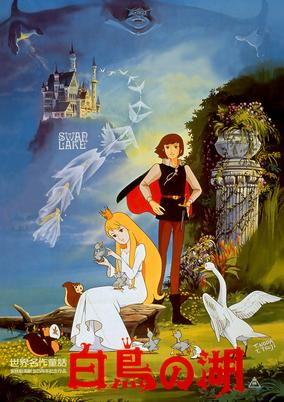

**Studio:** Toei Animation &nbsp;|&nbsp; **Director:** Kimio Yabuki &nbsp;|&nbsp; **Aired/Released:** March 14 &nbsp;|&nbsp; **Genres:** Romance, Fantasy, Germany, Past

> When Prince Siegfried spots a beautiful swan with a crown on its head, for some reason he feels compelled to follow it. He discovers that the swan is, in fact, a princess named Odette, who is under a wizard's curse that causes her to become a swan by day. The wizard, Rothbart, wants to keep Odette to himself, and the only thing that can break the spell on Odette is a man who truly loves her, with all his heart and soul...
>
> _Synopsis source: Kitsu_

[Wikipedia](https://en.wikipedia.org/wiki/Swan_Lake_(1981_film)) · [Kitsu](https://kitsu.io/anime/sekai-meisaku-douwa-hakuchou-no-mizuumi)

---

### Natsu e no Tobira

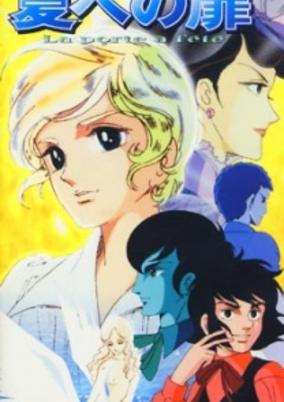

**Studio:** Toei Animation , Madhouse &nbsp;|&nbsp; **Director:** Mamoru Masaki , Toshio Hirata &nbsp;|&nbsp; **Aired/Released:** March 20 &nbsp;|&nbsp; **Genres:** Romance, Earth, France, Europe, Love Polygon, Past, Shounen Ai

> Marion is a young schoolboy who prides himself on his adherence to a philosophy he calls "rationalism". Because of his disdain for emotional display, he ignores anything remotely akin to affection. But when he's entangled in a romantic affair with an older courtesan, his rationalism is revealed to be little more than a cover for his own emotional immaturity. Learning to love, Marion blossoms under his older lover's care but unfortunately, Marion has yet to learn the true price of the affair.
>
> _Synopsis source: Kitsu_

[Wikipedia](https://en.wikipedia.org/wiki/Natsu_e_no_Tobira) · [Kitsu](https://kitsu.io/anime/natsu-e-no-tobira)

---

### Ai no Gakko Cuore Monogatari

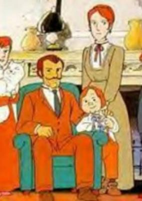

**Studio:** Nippon Animation &nbsp;|&nbsp; **Director:** Eiji Okabe &nbsp;|&nbsp; **Aired/Released:** April 3 &nbsp;|&nbsp; **Genres:** Italy, Slice of Life, Europe, Coming Of Age, Past, School Life, Historical

> Enrico Pocchini is a kind-hearted schoolboy with a strong sense of justice who lives in the Italian town of Torino. As a new term starts, he loses his beloved teacher, Miss Delacci, who is replaced by the stern Sr. Pelboni. Eventually, the boys in Enrico's class come to respect Sr. Pelboni, and learn about love, life and human kindness.
>
> _Synopsis source: Kitsu_

[Wikipedia](https://en.wikipedia.org/wiki/Ai_no_Gakko_Cuore_Monogatari) · [Kitsu](https://kitsu.io/anime/ai-no-gakko-cuore-monogatari)

---

### Dotakon (Mechanical Boy Dotakon)

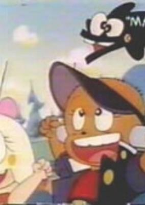

**Studio:** Kokusai Eiga-sha &nbsp;|&nbsp; **Director:** Takeshi Shirato &nbsp;|&nbsp; **Aired/Released:** April 4 &nbsp;|&nbsp; **Genres:** Science Fiction, Comedy

> Geeky genius Michiru has already got her Ph.D. in atomic physics (from California university) by the age of 11. But she still longs for a little brother, so she builds her own. Robot boy Dotakon is soon joined by their little robot sister, Chopiko, and the trio embarks on a series of fantastic adventures fueled by Michiru's inventions.
>
> _Synopsis source: Kitsu_

[Wikipedia](https://en.wikipedia.org/wiki/Dotakon) · [Kitsu](https://kitsu.io/anime/mechakko-dotakon)

---

### Belle and Sebastian

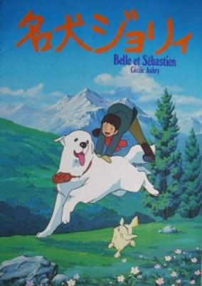

**Studio:** MK Company , Visual 80 , Toho Company, Ltd. &nbsp;|&nbsp; **Director:** Keiji Hayakawa &nbsp;|&nbsp; **Aired/Released:** April 7 &nbsp;|&nbsp; **Genres:** Historical, Adventure

> After befriending a white Pyrenees dog he names Belle, Sebastian sets out on a journey to find the mother he knows is still alive.
>
> _Synopsis source: Kitsu_

[Wikipedia](https://en.wikipedia.org/wiki/Belle_and_Sebastian_(Japanese_TV_series)) · [Kitsu](https://kitsu.io/anime/meiken-jolie)

---

### Little Women

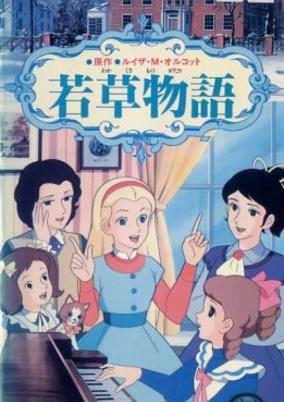

**Studio:** Toei Animation , Kokusai Eiga-sha &nbsp;|&nbsp; **Director:** Kazuya Miyazaki &nbsp;|&nbsp; **Aired/Released:** April 7 &nbsp;|&nbsp; **Genres:** Historical, Slice of Life

> This is a TV special based on the novel, Little Women, by Louisa May Alcott. It covers a year in the lives of four sisters, Meg, Jo, Beth, and Amy as their father is away fighting in the American Civil War.
>
> _Synopsis source: Kitsu_

[Wikipedia](https://en.wikipedia.org/wiki/Little_Women_(1981_TV_series)) · [Kitsu](https://kitsu.io/anime/wakakusa-monogatari)

---

### Dr. Slump - Arale-chan

**Studio:** Toei Animation &nbsp;|&nbsp; **Director:** Minoru Okazaki &nbsp;|&nbsp; **Aired/Released:** April 8 &nbsp;|&nbsp; **Genres:** Android, Alien, Fantasy World, Parody, Humanoid Alien, Science Fiction, Fantasy, Comedy, Slice of Life, School Life

> Dr. Slump creates a little android girl, Arale, who is very stong, happy, and totally common senseless. They live in Penguin Village where the strangest things happen (e.g., the dawn is announced by a little pig wearing a basquee).
>
> _Synopsis source: Kitsu_

[Wikipedia](https://en.wikipedia.org/wiki/Dr._Slump) · [Kitsu](https://kitsu.io/anime/dr-slump-arale-chan)

---

### Furiten-kun

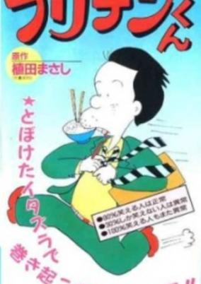

**Studio:** Toho &nbsp;|&nbsp; **Director:** Taku Sugiyama &nbsp;|&nbsp; **Aired/Released:** April 11 &nbsp;|&nbsp; **Genres:** Comedy, Slice of Life

> Based on the yonkoma manga by Ueda Masashi.
>
> _Synopsis source: Kitsu_

[Wikipedia](https://en.wikipedia.org/wiki/Furiten-kun) · [Kitsu](https://kitsu.io/anime/furiten-kun)

---

### Jarinko Chie

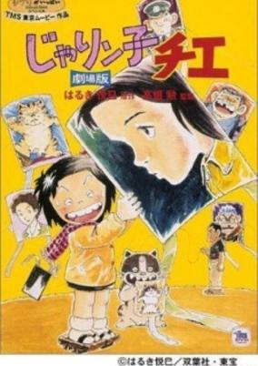

**Studio:** Tokyo Movie Shinsha , Toho &nbsp;|&nbsp; **Director:** Isao Takahata &nbsp;|&nbsp; **Aired/Released:** April 11 &nbsp;|&nbsp; **Genres:** Japan, Asia, Earth, Slice of Life, Comedy, Slapstick, Plot Continuity, Present

> Jarinko Chie is a movie directed by Takahata in 1981. Based on the very popular manga by Etsumi HARUKI, it is about ten year old Chie, "the most unfortunate girl in Japan", who manages her family diner while her unemployed yakuza father and her mother are separated. This sounds really depressing, but it's actually a very funny comedy. The story is set in Osaka, which has a totally different culture from Tokyo. After the success of the movie, a TV series was made, and Takahata worked as the chief director.
>
> _Synopsis source: Kitsu_

[Wikipedia](https://en.wikipedia.org/wiki/Jarinko_Chie) · [Kitsu](https://kitsu.io/anime/jarinko-chie-movie)

---

### Queen Millennia

**Studio:** Toei Animation &nbsp;|&nbsp; **Director:** Nobutaka Nishizawa &nbsp;|&nbsp; **Aired/Released:** April 16 &nbsp;|&nbsp; **Genres:** Science Fiction, Japan, Adventure, Action, Thriller, Coming Of Age, Angst, Humanoid Alien, Drama, Stereotypes, Plot Continuity, Mystery

> The year is 1999. Amamori Hajime is just a normal, everyday elementary school student, trying to study and hanging out with his crazy pals. But then one day as his father is testing a piece of equipment he has been working on, something causes it to blow up, taking the house with it! Now orphaned, Hajime is taken in by his uncle, who is an astronomer. There at his uncle's observatory, he meets a girl he's seen before and developed somewhat of a crush on. He finds out her name is Yukino Yayoi, and her parents run a ramen shop in town. But even better than that, she's his uncle's assistant! What luck! But Yayoi isn't exactly what she seems. There is a reason she helps out Amamori-san at the observatory. She is the Millennial Queen (Sen-Nen Joou), specially chosen by her home planet, LaMetal, to go to Earth and help prepare for the possible annihilation of the planet. What will cause this disaster? LaMetal has an extremely elliptical orbit, which sends it very, very near Earth every 1000 years. When it gets close enough, the earth reacts, causing all sorts of natural disasters. Although she was chosen with the idea of protecting LaMetal in mind, her personal plan is to evacuate as many humans as she can to LaMetal, so if their planet is destroyed, they will survive. However, there is one person who strives to stop her plan, the head of the Millennial Theives. Why does he want to stop Yayoi? And how does he know about the Millennial Queen, anyway?
>
> _Synopsis source: Kitsu_

[Wikipedia](https://en.wikipedia.org/wiki/Queen_Millennia) · [Kitsu](https://kitsu.io/anime/shin-taketori-monogatari-1000-nen-joou)

---

### Tiger Mask II

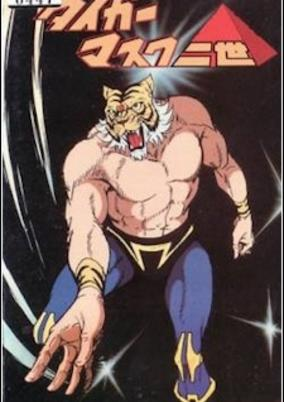

**Studio:** Toei Animation &nbsp;|&nbsp; **Director:** Kozo Morishita &nbsp;|&nbsp; **Aired/Released:** April 20 &nbsp;|&nbsp; **Genres:** Wrestling, Martial Arts, Action, Sports

> Second season to the original Tiger Mask, with a different cast of characters.
>
> _Synopsis source: Kitsu_

[Wikipedia](https://en.wikipedia.org/wiki/Tiger_Mask) · [Kitsu](https://kitsu.io/anime/tiger-mask-nisei)

---

### GoShogun (Macron 1)

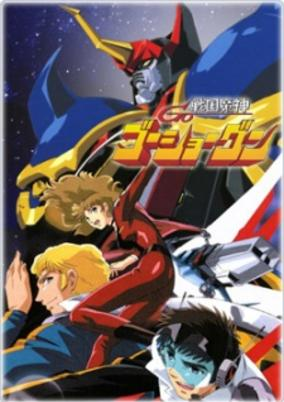

**Studio:** Ashi Productions , Studio Z5 &nbsp;|&nbsp; **Director:** Kunihiko Yuyama &nbsp;|&nbsp; **Aired/Released:** July 3 &nbsp;|&nbsp; **Genres:** Transforming Craft, Super Robot, Piloted Robot, Action, Science Fiction, Mecha, Future, Parody

> A meteor strikes the Earth and is found to emanate a powerful new energy called Beamler, which is used to power a battle robot, GoShogun, and a teleporting fortress, Good Thunder. The Docougar Crime Syndicate, lead by crime lord Neo Neros, try to steal the secret of the energy from the inventor of GoShogun, but he kills himself rather than let them acquire it. His son is targeted by Neo Neros next, but he is taken in by the crew aboard Good Thunder, who travel the world fighting NeoNeros's forces with GoShogun.
>
> _Synopsis source: Kitsu_

[Wikipedia](https://en.wikipedia.org/wiki/GoShogun) · [Kitsu](https://kitsu.io/anime/sengoku-majin-goushougun)

---

### Ashita no Joe 2 (Rocky Joe 2)

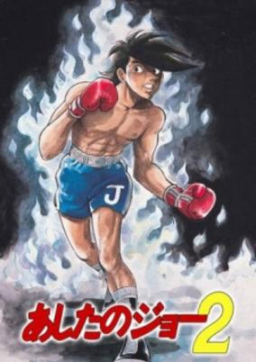

**Studio:** Tokyo Movie Shinsha &nbsp;|&nbsp; **Director:** Osamu Dezaki &nbsp;|&nbsp; **Aired/Released:** July 4 &nbsp;|&nbsp; **Genres:** Boxing, Martial Arts, Present, Earth, Japan, Violence, Combat, Plot Continuity, Asia, Action

> Yabuki Joe is left downhearted and hopeless after a certain tragic event. In attempt to put the past behind him, Joe leaves the gym behind and begins wandering. On his travels he comes across the likes of Wolf Kanagushi and Goromaki Gondo, men who unintentionally fan the dying embers inside him, leading him to putting his wanderings to an end. His return home puts Joe back on the path to boxing, but unknown to himself and his trainer, he now suffers deep-set issues holding him back from fighting. In attempt to quell those issues, Carlos Rivera, a world renowned boxer is invited from Venezuela to help Joe recover.
>
> _Synopsis source: Kitsu_

[Wikipedia](https://en.wikipedia.org/wiki/Ashita_no_Joe) · [Kitsu](https://kitsu.io/anime/ashita-no-joe-2)

---

### Mobile Suit Gundam II: Soldiers of Sorrow

**Studio:** Nippon Sunrise &nbsp;|&nbsp; **Director:** Yoshiyuki Tomino &nbsp;|&nbsp; **Aired/Released:** July 11

[Wikipedia](https://en.wikipedia.org/wiki/Mobile_Suit_Gundam)

---

### Dr. Slump and Arale-chan: Hello! Wonder Island

**Studio:** Toei Animation &nbsp;|&nbsp; **Director:** Minoru Okazaki &nbsp;|&nbsp; **Aired/Released:** July 18 &nbsp;|&nbsp; **Genres:** Android, Alien, Fantasy World, Parody, Humanoid Alien, Science Fiction, Fantasy, Comedy, Slice of Life, School Life

> Dr. Slump creates a little android girl, Arale, who is very stong, happy, and totally common senseless. They live in Penguin Village where the strangest things happen (e.g., the dawn is announced by a little pig wearing a basquee).
>
> _Synopsis source: Kitsu_

[Wikipedia](https://en.wikipedia.org/wiki/Dr._Slump) · [Kitsu](https://kitsu.io/anime/dr-slump-arale-chan)

---

### The Sea Prince and the Fire Child

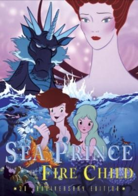

**Studio:** Sanrio &nbsp;|&nbsp; **Aired/Released:** July 18 &nbsp;|&nbsp; **Genres:** Romance, Fantasy, Fantasy World, Adventure, Coming Of Age

> Gods once lived on earth, and two siblings, Oceanus - God of Water, and Hyperia - Goddess of Fire, lived in peace and dearly loved each other. However, the God of Wind, Algaroc, become jealous of the pair's happiness, and spread lies and deceit between them until their hatred for each other brought about war. Finally, Algaroc was imprisoned by the King of Gods, but after that time, the brother and sister still despised each other, so the Children of Fire and Water forever remained apart. But, then Prince Syrius of the Water and Princess Malta of the Fire meet and fall in love. The love of Syrius and Malta may not be enough to surpass their parents' hatred. Whether they can stay together forever may be impossible
>
> _Synopsis source: Kitsu_

[Wikipedia](https://en.wikipedia.org/wiki/The_Sea_Prince_and_the_Fire_Child) · [Kitsu](https://kitsu.io/anime/sirius-no-densetsu)

---

### Enchanted Journey (The Enchanted Journey)

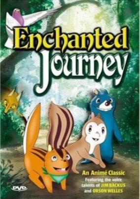

**Studio:** Studio Korumi &nbsp;|&nbsp; **Director:** Hideo Nishimaki &nbsp;|&nbsp; **Aired/Released:** July 21 &nbsp;|&nbsp; **Genres:** Japan, Adventure, Anthropomorphism, Present, Fantasy, Kids

> Glicko is a young chipmunk living in the city with his sister. But after hearing from a carrier pigeon of the Chipmunk homeland, the Great Forest, he leaves home alone. Glicko meets both friends and enemies along his adventure to the find the place where he truly belongs.
>
> _Synopsis source: Kitsu_

[Wikipedia](https://en.wikipedia.org/wiki/Enchanted_Journey) · [Kitsu](https://kitsu.io/anime/enchanted-journey)

---

### Kyoufu Densetsu Kaiki! Frankenstein (The Monster Of Frankenstein)

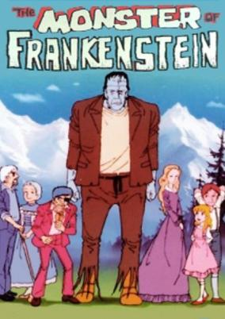

**Studio:** Toei Animation &nbsp;|&nbsp; **Director:** Kentaro Haneda &nbsp;|&nbsp; **Aired/Released:** July 27 &nbsp;|&nbsp; **Genres:** Science Fiction, Horror, Drama

> Airing on TV Asahi in 1981, with a running time of 111 minutes, Frankenstein is a reasonably standard retelling of the classic book by Mary Shelley. In a foreboding castle scientist Dr. Victor Frankenstein performs a hideous experiment which he hopes will bring the dead back to life. With the help of his assistant he is successful in reanimating a man recreated from parts gathered from corpses but the creature is unpredictable and horrifying. The doctor flees back to his home in Switzerland leaving his assistant in charge of destroying the monster. But Dr. Frankenstein soon finds that he cannot hide from his shameful secret forever as mysterious murders are committed around him forcing him to question if his creation really is dead and gone...
>
> _Synopsis source: Kitsu_

[Wikipedia](https://en.wikipedia.org/wiki/Kyoufu_Densetsu_Kaiki!_Frankenstein) · [Kitsu](https://kitsu.io/anime/monster-of-frankenstein)

---

### Adieu Galaxy Express 999

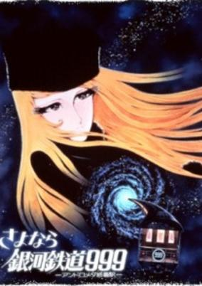

**Studio:** Toei Animation &nbsp;|&nbsp; **Director:** Rintaro &nbsp;|&nbsp; **Aired/Released:** August 1 &nbsp;|&nbsp; **Genres:** Cyborg, Space, Space Travel, Other Planet, Shipboard, Science Fiction, Adventure, Drama, Space Opera

> Two years after the events in Galaxy Express 999, Earth has become a battleground. Tetsuro, older and fighting the Machine People, rejoins Maetel aboard the GE999.
>
> _Synopsis source: Kitsu_

[Wikipedia](https://en.wikipedia.org/wiki/Galaxy_Express_999) · [Kitsu](https://kitsu.io/anime/sayonara-ginga-tetsudou-999-andromeda-shuuchakueki)

---

### New Dokonjō Gaeru

**Studio:** Tokyo Movie Shinsha &nbsp;|&nbsp; **Director:** Tadao Nagahama &nbsp;|&nbsp; **Aired/Released:** September 7

[Wikipedia](https://en.wikipedia.org/wiki/Dokonj%C5%8D_Gaeru)

---

### Ninja Hattori-kun

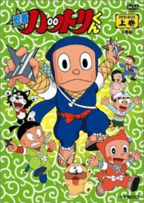

**Studio:** Shin-Ei Animation &nbsp;|&nbsp; **Director:** Fumio Ikeno , Hiroshi Sasagawa &nbsp;|&nbsp; **Aired/Released:** September 28 &nbsp;|&nbsp; **Genres:** Ninja, Japan, Elementary School, Comedy, Swordplay, Present, Martial Arts, Slice of Life

> The everyday Sanyo family gets an unexpected surprise in the shape of a new lodger-Hattori is a ninja boy who has come down from the Iga mountains to attend normal school. Befriending Kenichi Sanyo, who is the same age as he, Hattori starts attending school undercover, occasionally accompanied by his brother, Shinzo, Shishimaru the ninja dog, and Kenichi's girlfriend, Yumeko. The gang is also threatened by the rival Koga ninja, Kemumaki, and his evil sidekick, Kagechiyo the Shadow-cat.
>
> _Synopsis source: Kitsu_

[Wikipedia](https://en.wikipedia.org/wiki/Ninja_Hattori-kun) · [Kitsu](https://kitsu.io/anime/ninja-hattori-kun)

---

### Superbook

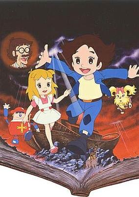

**Studio:** Tatsunoko Productions &nbsp;|&nbsp; **Director:** Masakazu Higuchi &nbsp;|&nbsp; **Aired/Released:** October 1 &nbsp;|&nbsp; **Genres:** Fantasy, Science Fiction, Earth, Time Travel, Past, Motorsport, Historical, Adventure, Kids

> The series beings at the home of a young boy named Sho Azuka discovers the magical Bible "Superbook" that speaks and sends him, his friend Azusa Yamato, and his toy robot Zenmaijikake back in time to the early events of the Old Testament.
>
> _Synopsis source: Kitsu_

[Wikipedia](https://en.wikipedia.org/wiki/Superbook_(1981_TV_series)) · [Kitsu](https://kitsu.io/anime/superbook)

---

### Six God Combination Godmars

**Studio:** Tokyo Movie Shinsha &nbsp;|&nbsp; **Director:** Tetsuo Imazawa &nbsp;|&nbsp; **Aired/Released:** October 2 &nbsp;|&nbsp; **Genres:** Mecha, Science Fiction, Plot Continuity, Space, Action

> In the year 1999, humanity begins to advance beyond the solar system. The planet Gishin, led by the Emperor Zule, which aims to conquer the galaxy, runs into conflict with Earth. He targets Earth for elimination and to do this, he sends a baby called Mars to live among humanity. Accompanying the baby is a giant robot named Gaia, which utilizes a new power source strong enough to destroy an entire planet. As planned, Mars is expected to grow up, where he will activate the bomb within Gaia to fulfill the mission of destroying the Earth. However, when Mars arrives on Earth his is adopted into a Japanese family and given the name Takeru. Seventeen years later, Takeru would grow up with a love for humanity and refuses to detonate the bomb as ordered by Zule. However, if Takeru was to die, the bomb within Gaia would explode destroying the earth. Takeru possesses psychic powers ( ESP ) and decides to join the Earth defense forces and becomes a member of the Crasher Squad (an elite space defense force) where he and his friends take a last stand against the Gishin's attack. The relationship of Takeru with his brother Maag, which fate would have it, pitted the two against each other in the war. Unknown to the Gishin five other robots were created in secrecy along side Gaia by Takeru's father and sent with Gaia to protect Takeru. Whenever Earth is in danger, Takeru is able to summon the five other robots to combine with Gaia form the giant robot Godmars. The five other robots are Sphinx, Uranus, Titan, Shin and Ra.
>
> _Synopsis source: Kitsu_

[Wikipedia](https://en.wikipedia.org/wiki/Six_God_Combination_Godmars) · [Kitsu](https://kitsu.io/anime/rokushin-gattai-god-mars)

---

### Jarinko Chie

**Studio:** Tokyo Movie Shinsha &nbsp;|&nbsp; **Director:** Isao Takahata &nbsp;|&nbsp; **Aired/Released:** October 3 &nbsp;|&nbsp; **Genres:** Japan, Asia, Earth, Slice of Life, Comedy, Slapstick, Plot Continuity, Present

> Jarinko Chie is a movie directed by Takahata in 1981. Based on the very popular manga by Etsumi HARUKI, it is about ten year old Chie, "the most unfortunate girl in Japan", who manages her family diner while her unemployed yakuza father and her mother are separated. This sounds really depressing, but it's actually a very funny comedy. The story is set in Osaka, which has a totally different culture from Tokyo. After the success of the movie, a TV series was made, and Takahata worked as the chief director.
>
> _Synopsis source: Kitsu_

[Wikipedia](https://en.wikipedia.org/wiki/Jarinko_Chie) · [Kitsu](https://kitsu.io/anime/jarinko-chie-movie)

---

### Dash Kappei

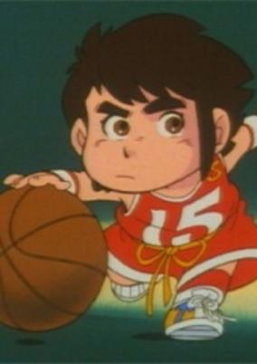

**Studio:** Tatsunoko Production &nbsp;|&nbsp; **Director:** Masayuki Hayashi , Seitaro Hara &nbsp;|&nbsp; **Aired/Released:** October 4 &nbsp;|&nbsp; **Genres:** Ecchi, Basketball, Action, Sports, Comedy

> Kappei is a dramatically short guy but he is a master in every sport. He lives as a guest in sweet Akane's house, and he's in love with her, but there's a strange rival, her dog Salomone (Italian name) who plans evil traps to encumber Kappei. But the dog has also another function: he explains all sport rules when a new sport is depicted. Kappei is fond of white female underwear, always trying to lift girl's skirts up.
>
> _Synopsis source: Kitsu_

[Wikipedia](https://en.wikipedia.org/wiki/Dash_Kappei) · [Kitsu](https://kitsu.io/anime/dash-kappei)

---

### Galaxy Cyclone Braiger (Galactic Whirlwind Braiger)

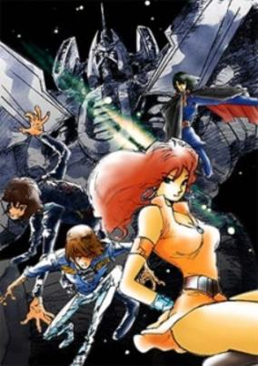

**Studio:** Kokusai Eiga-sha &nbsp;|&nbsp; **Director:** Takao Yotsuji &nbsp;|&nbsp; **Aired/Released:** October 6 &nbsp;|&nbsp; **Genres:** Science Fiction, Mecha, Action, Space, Adventure

> In the year 2111, the solar system has been colonized. The colonized moons and planets are lawless and the police are helpless. In order to battle the evil within the solar system, Isaac Godonov creates J9, made up of himself, Blaster Kid, Stephen Bowie, and Angel Omachi. They are a team that will handle any missions the police will not with their robot Braiger... for a price. Meanwhile, the Nubia section of Earth has a plan to destroy Jupiter to create 30 more planets for human colonization. But this plan will result in the destruction of Earth.
>
> _Synopsis source: Kitsu_

[Wikipedia](https://en.wikipedia.org/wiki/Galaxy_Cyclone_Braiger) · [Kitsu](https://kitsu.io/anime/ginga-senpuu-braiger)

---

### Honey Honey no Suteki na Bouken (Honey Honey's Wonderful Adventures)

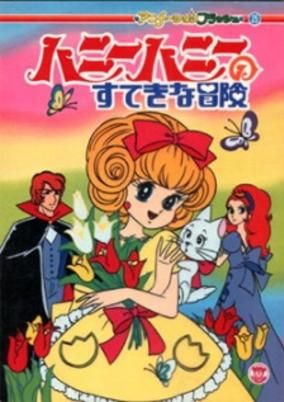

**Studio:** Kokusai Eiga-sha , Toei Animation &nbsp;|&nbsp; **Director:** Takeshi Shirato &nbsp;|&nbsp; **Aired/Released:** October 7 &nbsp;|&nbsp; **Genres:** Romance, Adventure, Earth, Asia, Parody, Comedy, Europe, Past, Plot Continuity, Historical

> Glamorous Paris, entrancing Venice, romantic Rome and irresistible Vienna... These alluring cities of enchantment invite you to witness the story of a young girl who unexpectedly becomes entangled in daring adventures and rollicking romance. Vienna, 1907. Princess Flora, the one and only idol of the entire nation, is celebrating her birthday. Flora is young, beautiful, single and the object of all the men`s desire.
>
> _Synopsis source: Kitsu_

[Wikipedia](https://en.wikipedia.org/wiki/Honey_Honey_no_Suteki_na_Bouken) · [Kitsu](https://kitsu.io/anime/honey-honey-no-suteki-na-bouken)

---

### Miss Machiko

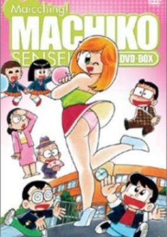

**Studio:** Studio Pierrot &nbsp;|&nbsp; **Director:** Masami Anno &nbsp;|&nbsp; **Aired/Released:** October 8 &nbsp;|&nbsp; **Genres:** Ecchi, Loli, Comedy, Female Teacher, School Life, Female Student

> Mai Machiko is the newest teacher at Asama Elementary; she's young, beautiful, and has the perfect proportions—traits that attract the attention of not only her students, but the rest of the perverted faculty as well. Whether it's luring her in and spraying up her skirt with a hose or leaps and bounds to grab her breasts, there's nothing that Machiko's first year students won't try to do. Regardless of her embarrassing plight, Machiko is always a good sport and tries her best to help out her students—at any cost to her dignity!
>
> _Synopsis source: Kitsu_

[Wikipedia](https://en.wikipedia.org/wiki/Miss_Machiko) · [Kitsu](https://kitsu.io/anime/maicching-machiko-sensei)

---

### Dogtanian and the Three Muskehounds

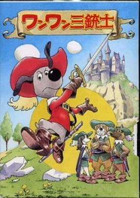

**Studio:** BRB Internacional , Nippon Animation &nbsp;|&nbsp; **Aired/Released:** October 9 &nbsp;|&nbsp; **Genres:** France, Adventure, Swordplay, Anthropomorphism, Past, Plot Continuity, Historical

> The story begins with the arrival of a brave young boy in Paris. His ambition is to join the glorious Imperial Guards, but fierce competition and the minimum age requirement hinder him from joining. The boy then challenges the well-known Three Musketeers in order to demonstrate his excellent skills with the sword. However, at the very moment the fight begins, a power-hungry group cuts in. Realizing their wicked intention, the boy D'artagnan and the Three Musketeers quickly cooperate and defeat them. This is the beginning of their friendship and commitment to fight conspiracy.
>
> _Synopsis source: Kitsu_

[Wikipedia](https://en.wikipedia.org/wiki/Dogtanian_and_the_Three_Muskehounds) · [Kitsu](https://kitsu.io/anime/wanwan-sanjushi)

---

### Ulysses 31

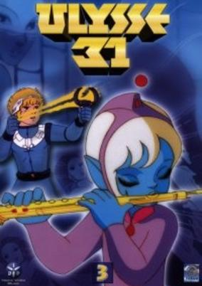

**Studio:** DIC Audiovisuel , Tokyo Movie Shinsha &nbsp;|&nbsp; **Aired/Released:** October 10 &nbsp;|&nbsp; **Genres:** Space, Action, Science Fiction, Adventure

> It is the thirty-first century. Ulysses killed the giant Cyclops when he rescued the children and his son, Telemachus. But the ancient gods of Olympus are angry and threaten a terrible revenge: Ulysses is sentenced to travel through the universe of Olympus with a frozen crew on a quest to find the Kingdom of Hades. Only when he has found the Kingdom of Hades will his crew be free of their curse and he will be able to return to Earth and to his beloved Penelope.
>
> _Synopsis source: Kitsu_

[Wikipedia](https://en.wikipedia.org/wiki/Ulysses_31) · [Kitsu](https://kitsu.io/anime/uchuu-densetsu-ulysses-31)

---

### Urusei Yatsura

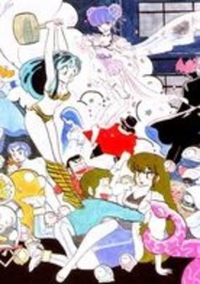

**Studio:** Studio Pierrot , Studio Deen &nbsp;|&nbsp; **Director:** Mamoru Oshii , Kazuo Yamazaki &nbsp;|&nbsp; **Aired/Released:** October 14 &nbsp;|&nbsp; **Genres:** Action, Science Fiction, Adventure, Comedy, Romance, Drama

> Broadcast between episodes 21 and 22, the Spring special was a 1-hr show with 2 parts. The first part, "Urusei Yatsura All-Star All-Out Attack!", was a series of outtakes from the preceding episodes and recaps of the first 21 episodes. The second part, "The School Excursion! Run, Kunoichi!", was an original episode, but not part of the ongoing series.
>
> _Synopsis source: Kitsu_

[Wikipedia](https://en.wikipedia.org/wiki/Urusei_Yatsura_(1981_TV_series)) · [Kitsu](https://kitsu.io/anime/urusei-yatsura-special-it-s-spring-take-off)

---

### Fang of the Sun Dougram

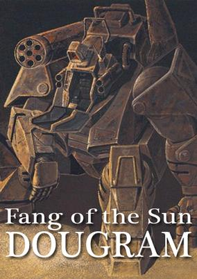

**Studio:** Nippon Sunrise &nbsp;|&nbsp; **Director:** Ryosuke Takahashi &nbsp;|&nbsp; **Aired/Released:** October 23 &nbsp;|&nbsp; **Genres:** Desert, Science Fiction, Mecha, Action, Piloted Robot, Gunfights, Other Planet, War, Future, Plot Continuity, Military

> The story is centered around a small group of guerilla freedom fighters on a colonial planet named Deployer, who are known as the "Deployer 7", or "Sun Fang" team. In an unexpected coup, the elected Governor of Deployer becomes dictator and rules Deployer under martial law with the support of Earth's Federation. Fighting for independence from Earth's Federation influence, the freedom fighters begin a rebellion against the Federation's Combat Armors using a Combat Armor of their own: the Dougram.
>
> _Synopsis source: Kitsu_

[Wikipedia](https://en.wikipedia.org/wiki/Fang_of_the_Sun_Dougram) · [Kitsu](https://kitsu.io/anime/taiyou-no-kiba-dagram)

---

### Shunmao Monogatari Taotao

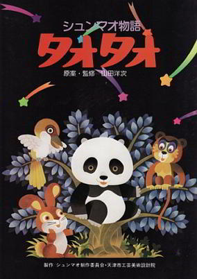

**Aired/Released:** December 26 &nbsp;|&nbsp; **Genres:** Comedy, Fantasy, Kids

> TaoTao is an anime series about the eponymous Taotao, a small panda. In the stories, Taotao has adventures with his animal friends and listens to the stories of his mother, the mommy panda.
>
> _Synopsis source: Kitsu_

[Wikipedia](https://en.wikipedia.org/wiki/Taotao_(anime)) · [Kitsu](https://kitsu.io/anime/xiongmao-monogatari-taotao)

---

### Space Warrior Baldios

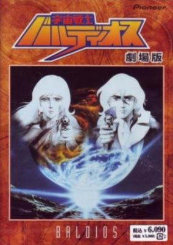

**Studio:** Toei Animation &nbsp;|&nbsp; **Aired/Released:** December 29 &nbsp;|&nbsp; **Genres:** Science Fiction, Mecha, Space, Action

> This film supplied the ending to the cancelled Space Warrior Baldios television series.
>
> _Synopsis source: Kitsu_

[Wikipedia](https://en.wikipedia.org/wiki/Space_Warrior_Baldios) · [Kitsu](https://kitsu.io/anime/space-warrior-baldios-movie)

---

### Daicon III

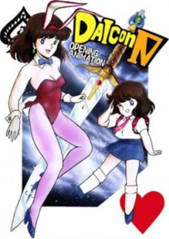

**Director:** Hiroyuki Yamaga &nbsp;|&nbsp; **Genres:** Science Fiction, Mecha, Action, Music, Adventure

> A girl is visited by two men from a space ship. They give her water she needs to water her Daicon (radish). On her journey to deliver the water, this girl has to fight demons and giant robots.
>
> _Synopsis source: Kitsu_

[Wikipedia](https://en.wikipedia.org/wiki/Daicon_III_and_IV_Opening_Animations) · [Kitsu](https://kitsu.io/anime/daicon-opening-animations)

---
