# 1982 in Anime

[← Back to index](../README.md)

42 titles · 37 with a matched synopsis/cover art · [source](https://en.wikipedia.org/wiki/1982_in_anime)

## Releases

### Lucy of the Southern Rainbow (Lucy-May of the Southern Rainbow)

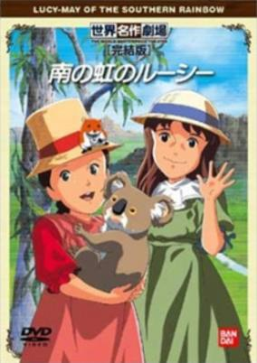

**Studio:** Nippon Animation &nbsp;|&nbsp; **Director:** Hiroshi Saitō &nbsp;|&nbsp; **Aired/Released:** 10 January &nbsp;|&nbsp; **Genres:** Earth, Slice of Life, Plot Continuity, Historical, Adventure

> Lucy's family moves from England to Australia planning to run a big farm. Starting a new life proves to be full of frustrations. Their agonizing days of despair continue until they finally obtain their farmland. However, Lucy and her sisters enjoy a range of new experiences such as discovering exotic animals and meeting with aborigines and other new people.
>
> _Synopsis source: Kitsu_

[Wikipedia](https://en.wikipedia.org/wiki/Lucy_of_the_Southern_Rainbow) · [Kitsu](https://kitsu.io/anime/minami-no-niji-no-lucy)

---

### Gauche the Cellist

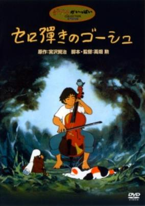

**Studio:** Oh! Production &nbsp;|&nbsp; **Director:** Isao Takahata &nbsp;|&nbsp; **Aired/Released:** 23 January &nbsp;|&nbsp; **Genres:** Earth, Fantasy, Contemporary Fantasy, Japan, Comedy, Asia, Present, Music, Kids

> The story concerns Gauche, a professional cellist. During rehearsals for a performance, he is scolded by the conductor because his playing is not good enough. His timing is off and he seems to have no "feel" for the music. Gauche returns to his lonely cottage and starts practicing. Then a cat enters who tricks him into understanding the inner meaning of the music. The importance of practice is shown by a cuckoo, rhythm by a badger and tenderness by a mouse. In four days he learns the true meaning and feeling of music and develops into a great musician. Laced with popular classical music this special combines fun and inspiration for all ages and audiences.
>
> _Synopsis source: Kitsu_

[Wikipedia](https://en.wikipedia.org/wiki/Gauche_the_Cellist) · [Kitsu](https://kitsu.io/anime/cello-hiki-no-gauche)

---

### Asari-chan

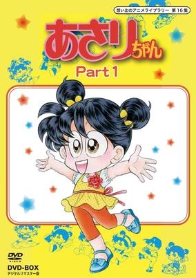

**Studio:** Toei Animation &nbsp;|&nbsp; **Director:** Kazumi Fukushima &nbsp;|&nbsp; **Aired/Released:** 25 January &nbsp;|&nbsp; **Genres:** Comedy, Slice of Life, Kids, Elementary School, Shoujo

> Produced by Toei Animation and directed by Kazumi Fukushima after the manga series by Muroyama Mayumi, this anime follows Asari, a normal fourth-grade girl. One day, while bargain shopping, she wins the lucky ticket at a lottery for a one-person trip to Hawaii. Chaos reigns as her family, the Beach's, fight over who should go. The ticket is lost in a bonfire, ironically. Other circumstances follow when the family finds out that the travel agency offered to "give the equal amount of half the travel expenses in cash for the ticket" from an employee of the supermarket Asahi had shopped at. What will happen to the unlucky Beach family as more elements of despair pelt them?
>
> _Synopsis source: Kitsu_

[Wikipedia](https://en.wikipedia.org/wiki/Asari-chan) · [Kitsu](https://kitsu.io/anime/asari-chan)

---

### Combat Mecha Xabungle

**Studio:** Nippon Sunrise &nbsp;|&nbsp; **Director:** Yoshiyuki Tomino &nbsp;|&nbsp; **Aired/Released:** 6 February &nbsp;|&nbsp; **Genres:** Science Fiction, Mecha, Comedy, Military

> Zora was an outlaw planet where they had a rule that one could own stolen things if he could run away keeping it for three days. When Motorcycle gang, Sand Rat, was driving on the planet, they were attacked by a walker machine. Then, an injured boy, Jiron, helped them. Lag, the leader of Sand Rat was interested in Jiron because he was going to the bazaar to steal a walker machine. That bazaar was held by Charring Cargo who was a courier of Blue Stone, and there must be the guards of Carrying and rowdy fellows at the bazaar. Furthermore, to be surprised, it was Carrying's latest walker machine, Xabungle, that he wanted to steal.
>
> _Synopsis source: Kitsu_

[Wikipedia](https://en.wikipedia.org/wiki/Combat_Mecha_Xabungle) · [Kitsu](https://kitsu.io/anime/sentou-mecha-xabungle)

---

### Gyakuten! Ippatsuman

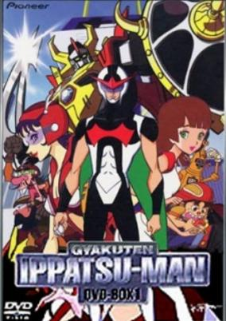

**Studio:** Tatsunoko Productions &nbsp;|&nbsp; **Director:** Hiroshi Sasagawa &nbsp;|&nbsp; **Aired/Released:** 13 February &nbsp;|&nbsp; **Genres:** Science Fiction, Mecha, Action, Comedy

> Gyakuten! Ippatsuman is the sixth in the Time Bokan series. In the 1990s-era Osteandel City is the headquarters of Time Lease, a business that leases almost everything you could ask for including powerful robots. They are proud of themselves for being number one in the international ranking of billionaires, for the past ten consecutive years. Meanwhile there is another lease company in the same city called Skull Lease where the notorious villain trio work as top executives. Their ostensible object is to disgrace the credit of Time Lease and replace them as the leading enterprise. In fact, however, they have a scheme to secure a footing for world conquest. One day a transport robot of Time Lease is assaulted by the villain trio and it is time for Ippatsuman to get on the move to fight for justice.
>
> _Synopsis source: Kitsu_

[Wikipedia](https://en.wikipedia.org/wiki/Gyakuten!_Ippatsuman) · [Kitsu](https://kitsu.io/anime/time-bokan-series-gyakuten-ippatsu-man)

---

### Armored Fleet Dairugger XV

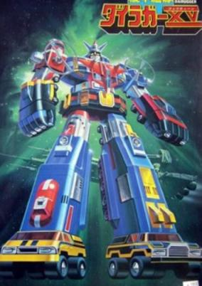

**Studio:** Toei Animation , Daewon Animation &nbsp;|&nbsp; **Director:** Kozo Morishita &nbsp;|&nbsp; **Aired/Released:** 3 March &nbsp;|&nbsp; **Genres:** Space Travel, Science Fiction, Mecha, Super Robot, Piloted Robot, Humanoid Alien, Robot, Space, Action, Adventure, Transforming Craft

> In the original storyline as aired in Japan, Dairugger XV was simply an exploration robot, as well as an intended peace-keeping force. The Earth is in a time of prosperity. The president of the Terran League (the "Galaxy Alliance" in Voltron) launches a mission to explore beyond the galaxy. After commencing its mission of exploration, the starship Rugger-Guard is attacked by a ship of the Galbeston Empire. Dairugger, the super robot, is deployed in order to defend the Earth. It is somewhat by fate that they must help the people of Galbeston find a new planet before it explodes, and liberate it from its despotic Emperor. In the Japanese version, it does not have anything to do with King of the Beasts GoLion, as opposed to the U.S. version, Voltron: Defender of the Universe. There are three assault team units: Land, Air, and Sea. There are a total of 15 parts referred to as "Rugger," which can combine together to form the super-robot Dairugger. The design of the 15 separate Rugger units came from the sport of rugby, since 15 players are required to form a rugby union. The U.S. version would rename the "Galbeston Empire" to "Drule Empire," along with editing a fair amount of violence and sexual content to keep the show safe for general audience broadcast.
>
> _Synopsis source: Kitsu_

[Wikipedia](https://en.wikipedia.org/wiki/Armored_Fleet_Dairugger_XV) · [Kitsu](https://kitsu.io/anime/kikou-kantai-dairugger-xv)

---

### Aladdin and the Wonderful Lamp

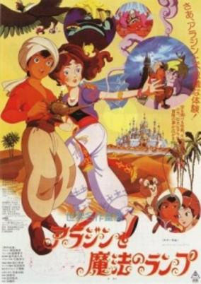

**Studio:** Toei Animation &nbsp;|&nbsp; **Director:** Yoshikatsu Kasai &nbsp;|&nbsp; **Aired/Released:** 13 March &nbsp;|&nbsp; **Genres:** Fantasy, Adventure, Middle East, Action, Magic, Romance

> This film stays very faithful to the original down to the smallest details, save for the kangaroo-rat that suddenly appears twenty minutes into the movie and subsequently follows Aladdin around, serving no purpose in the story but fulfilling the role of token animal mascot. The screenwriter needs no introduction; Akira Miyazaki single-handedly wrote five of the classic WMT series, including Perrine and Rascal, and participated in two others. The only other name among the staff that rings a bell, though, is Yukihide Takekawa, who was responsible for the music in the magnificent and unknown Unico pilot film. The story takes some illogical and confusing jumps at the point where Aladdin begins to court the princess, and the extravagant animation that had characterised Toei films of the 60s, when Toei had the best animators around, had become a thing of the past long before this point; but this is still an above-average film, in large part because of the screenplay that stays so faithful to the original. The character designs are slightly more western-looking than one is accustomed to seeing in anime.
>
> _Synopsis source: Kitsu_

[Wikipedia](https://en.wikipedia.org/wiki/Aladdin_and_the_Wonderful_Lamp_(1982_film)) · [Kitsu](https://kitsu.io/anime/sekai-meisaku-douwa-aladdin-to-mahou-no-lamp)

---

### Asari-chan Ai no Marchen Shōjo

**Studio:** Toei Animation &nbsp;|&nbsp; **Aired/Released:** 13 March &nbsp;|&nbsp; **Genres:** Comedy, Slice of Life, Kids, Elementary School, Shoujo

> Produced by Toei Animation and directed by Kazumi Fukushima after the manga series by Muroyama Mayumi, this anime follows Asari, a normal fourth-grade girl. One day, while bargain shopping, she wins the lucky ticket at a lottery for a one-person trip to Hawaii. Chaos reigns as her family, the Beach's, fight over who should go. The ticket is lost in a bonfire, ironically. Other circumstances follow when the family finds out that the travel agency offered to "give the equal amount of half the travel expenses in cash for the ticket" from an employee of the supermarket Asahi had shopped at. What will happen to the unlucky Beach family as more elements of despair pelt them?
>
> _Synopsis source: Kitsu_

[Wikipedia](https://en.wikipedia.org/wiki/Asari-chan) · [Kitsu](https://kitsu.io/anime/asari-chan)

---

### Doraemon: Nobita and the Haunts of Evil (Doraemon the Movie: Nobita and the Haunts of Evil)

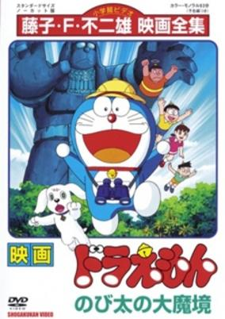

**Studio:** Shin-Ei Animation &nbsp;|&nbsp; **Director:** Hideo Nishimaki &nbsp;|&nbsp; **Aired/Released:** 13 March &nbsp;|&nbsp; **Genres:** Earth, Africa, Japan, Asia, Anthropomorphism, Adventure

> Nobita finds an stray dog and brings him home, little does he knows that the dog is actually a prince in his homeland, a world appart deep in the african "Smokers Forest" were the dogs evolved and have their own empire, so he and his friends take on a journey to take back the young prince to his homeland but when they get there things have changed...
>
> _Synopsis source: Kitsu_

[Kitsu](https://kitsu.io/anime/doraemon-nobita-s-great-demon)

---

### Kaibutsu-kun Demon Sword

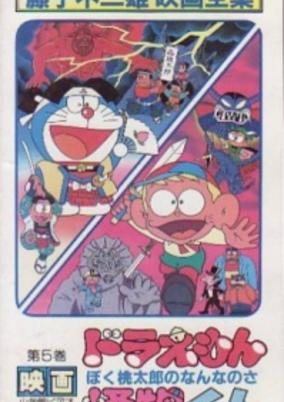

**Studio:** Shin-Ei Animation &nbsp;|&nbsp; **Director:** Hiroshi Fukutomi &nbsp;|&nbsp; **Aired/Released:** 13 March &nbsp;|&nbsp; **Genres:** Horror, Comedy, Kids

> Based on the shounen manga by Fujiko Fujio. Note: Screened as a triple feature with Doraemon: Nobita no Daimakyou and Ninja Hattori-kun: Nin Nin Ninpo Enikki no Maki.
>
> _Synopsis source: Kitsu_

[Wikipedia](https://en.wikipedia.org/wiki/Kaibutsu-kun) · [Kitsu](https://kitsu.io/anime/kaibutsu-kun-demon-no-ken)

---

### Mobile Suit Gundam III: Encounters in Space

**Studio:** Nippon Sunrise &nbsp;|&nbsp; **Director:** Yoshiyuki Tomino &nbsp;|&nbsp; **Aired/Released:** 13 March

[Wikipedia](https://en.wikipedia.org/wiki/Mobile_Suit_Gundam)

---

### Ohayō! Spank

**Studio:** TMS Entertainment &nbsp;|&nbsp; **Director:** Shigetsugu Yoshida &nbsp;|&nbsp; **Aired/Released:** 13 March &nbsp;|&nbsp; **Genres:** Romance, Japan, Asia, Earth, Slice of Life, Comedy, Present

> Morimura Aiko is a junior high school student who is short for her age. Her father went on a yacht ten years ago and his whereabouts remained in obscurity. Her mother, a designer for hats, left for Paris, leaving Aiko in the care of her uncle, Mr Fujinami. Aiko had a pet dog, Papi, but it died in a car accident. Around the same time, another dog, Spank, appears before her. Having gone through so many unfortunate events in her life, Spank's presence begins to brighten up Aiko's life and put a smile on her face.
>
> _Synopsis source: Kitsu_

[Wikipedia](https://en.wikipedia.org/wiki/Ohay%C5%8D!_Spank) · [Kitsu](https://kitsu.io/anime/ohayo-spank)

---

### Queen Millennia

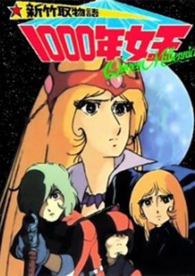

**Studio:** Toei Animation &nbsp;|&nbsp; **Director:** Masayuki Akehi &nbsp;|&nbsp; **Aired/Released:** 13 March &nbsp;|&nbsp; **Genres:** Science Fiction, Japan, Adventure, Action, Thriller, Coming Of Age, Angst, Humanoid Alien, Drama, Stereotypes, Plot Continuity, Mystery

> The year is 1999. Amamori Hajime is just a normal, everyday elementary school student, trying to study and hanging out with his crazy pals. But then one day as his father is testing a piece of equipment he has been working on, something causes it to blow up, taking the house with it! Now orphaned, Hajime is taken in by his uncle, who is an astronomer. There at his uncle's observatory, he meets a girl he's seen before and developed somewhat of a crush on. He finds out her name is Yukino Yayoi, and her parents run a ramen shop in town. But even better than that, she's his uncle's assistant! What luck! But Yayoi isn't exactly what she seems. There is a reason she helps out Amamori-san at the observatory. She is the Millennial Queen (Sen-Nen Joou), specially chosen by her home planet, LaMetal, to go to Earth and help prepare for the possible annihilation of the planet. What will cause this disaster? LaMetal has an extremely elliptical orbit, which sends it very, very near Earth every 1000 years. When it gets close enough, the earth reacts, causing all sorts of natural disasters. Although she was chosen with the idea of protecting LaMetal in mind, her personal plan is to evacuate as many humans as she can to LaMetal, so if their planet is destroyed, they will survive. However, there is one person who strives to stop her plan, the head of the Millennial Theives. Why does he want to stop Yayoi? And how does he know about the Millennial Queen, anyway?
>
> _Synopsis source: Kitsu_

[Wikipedia](https://en.wikipedia.org/wiki/Queen_Millennia) · [Kitsu](https://kitsu.io/anime/shin-taketori-monogatari-1000-nen-joou)

---

### Magical Princess Minky Momo (Fairy Princess Minky Momo)

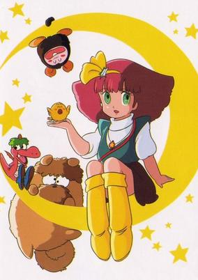

**Studio:** Ashi Productions &nbsp;|&nbsp; **Director:** Kunihiko Yuyama &nbsp;|&nbsp; **Aired/Released:** 18 March &nbsp;|&nbsp; **Genres:** Adventure, Magic, Magical Girl, Present, Shoujo, Kids

> Momo is the princess of Fenarinarsa, a land of dreams that is getting further and further from Earth. She is sent to help the Earth regain faith in its dreams. To assist her are her friends Sindbook, Mocha, and Pipiru and her magic wand that transforms her into an adult. She's ready and willing to help anyone she can in order to make their dream come true, no matter what happens.
>
> _Synopsis source: Kitsu_

[Wikipedia](https://en.wikipedia.org/wiki/Magical_Princess_Minky_Momo) · [Kitsu](https://kitsu.io/anime/mahou-no-princess-minky-momo)

---

### Don Dracula

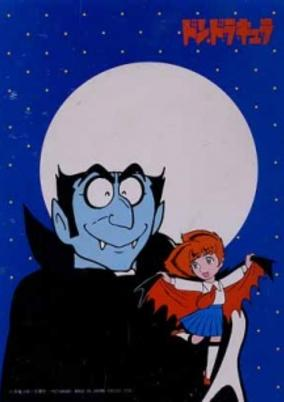

**Studio:** Tezuka Productions &nbsp;|&nbsp; **Director:** Masamune Ochiai &nbsp;|&nbsp; **Aired/Released:** 5 April &nbsp;|&nbsp; **Genres:** Fantasy, Japan, Asia, Earth, Comedy, Tokyo, Vampire, Horror

> After living in Transylvania for several years, "Earl Dracula" (as Osamu Tezuka's official website calls him in English) has moved to Japan. In the Nerima Ward of Tokyo, he and his daughter, Chocola, and faithful servant Igor have taken up residence in an old-Western style house. While Chocola attends Junior High School, Earl Dracula is desperate to drink the blood of beautiful virgin women; an appropriate meal for a vampire of his stature. However, each night that Earl Dracula goes out on the prowl he finds himself getting involved in some kind of disturbance which leads to him causing various trouble for the local residents. With nobody in Japan believing in vampires, his very presence causes trouble amongst the people in town.
>
> _Synopsis source: Kitsu_

[Wikipedia](https://en.wikipedia.org/wiki/Don_Dracula) · [Kitsu](https://kitsu.io/anime/don-dracula)

---

### The Flying House

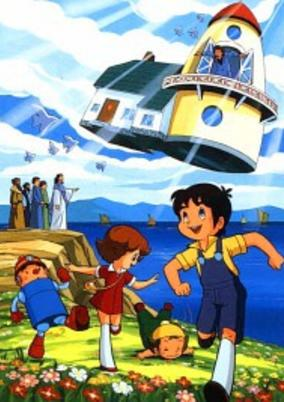

**Studio:** Tatsunoko Productions &nbsp;|&nbsp; **Director:** Masakazu Higuchi , Mineo Fuji &nbsp;|&nbsp; **Aired/Released:** 5 April &nbsp;|&nbsp; **Genres:** Science Fiction, Religion, Historical, Adventure

> The series began in the middle of a game of hide and seek, as a young boy named Justin Casey (Gen) finishes counting and begins searching for his friends Angela (usually called "Angie") and Corkey Roberts (Kanna and Tsukubo Natsuyama). As he searched for the brother and sister in the wooded area, a storm occurred all of a sudden. Justin managed to sneak up on the two before the rain started pouring, forcing them to run for cover. They would eventually find a house in the wooded area, previously unseen according to Justin. At first glance it appeared nobody was home after entering the house, until they discovered a robot named Solar Ion Robot (Kadenchin), or the acronym SIR. They would soon meet the owner of the house, Professor Humphrey Bumble (Dr. Tokio Taimu), who introduced the children to his greatest creation, a time machine. Professor Bumble's attempt at recreating Benjamin Franklin's famous lightning experiment with the use of a kite flying outside the house to get the machine working only led up to SIR's temporary change in personality before sending the entire house on course for the past. The children never realized how long the journey back home would be due to Professor Bumble's misguidance and errors in time travel, but in the meantime they witnessed and participated (with little or no consequences) in numerous events in the Bible's New Testament, from John the Baptist's birth to the rise of the Apostle Paul."
>
> _Synopsis source: Kitsu_

[Wikipedia](https://en.wikipedia.org/wiki/The_Flying_House_(TV_series)) · [Kitsu](https://kitsu.io/anime/the-flying-house)

---

### Game Center Arashi

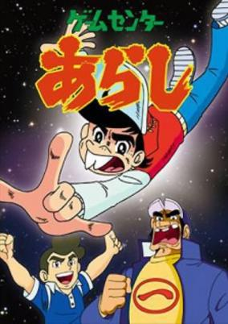

**Studio:** Shin-Ei Animation &nbsp;|&nbsp; **Director:** Tameo Ogawa &nbsp;|&nbsp; **Aired/Released:** 5 April &nbsp;|&nbsp; **Genres:** Comedy, Kids

> Arashi Ishino is Japan's "Space invaders" champion. He must use his skills to beat others at different video games.
>
> _Synopsis source: Kitsu_

[Wikipedia](https://en.wikipedia.org/wiki/Game_Center_Arashi) · [Kitsu](https://kitsu.io/anime/game-center-arashi)

---

### Boku Patalliro!

**Studio:** Toei Animation &nbsp;|&nbsp; **Director:** Nobutaka Nishizawa , Daisuke Nishio &nbsp;|&nbsp; **Aired/Released:** 8 April &nbsp;|&nbsp; **Genres:** Romance, Action, Parody, Comedy, Gunfights, Bishounen, Alternative Present, Shounen Ai, Adventure

> Patarillo! is set in a society much like ours in most ways, with one decided twist. The manga on which it is based is one of the much-read works produced for adolescent Japanese girls that features a healthy proportion of gay men and beautiful teenagers aka bishounen (beautiful boys). Most of the action takes place in Marinera, the land of eternal spring, located somewhere in the South Seas. The country is a major producer of diamonds; they provide much of the basis of conflict in the anime series. They come from one of the most prolific mines in the world, owned by the king of Marinera, the vertically challenged but horizontally endowed boy-king Patarillo himself. The International Diamond Syndicate - a huge semi- criminal organization/ secret society dedicated to taking over the world`s entire diamond supply- wants that mine and will stop at nothing to get it. In the early episodes they send off a number of bishounen assassins to do in Patarillo, which necessitates his having a bodyguard, the English MI6 agent, Major Jack (`Bishounen-Killer`) Bancoran. Bancoran`s nickname doesn`t mean he shoots bishounen in cold blood. The soubriquet comes from the fact that no male under the age of 17 can resist his sexual fascination. This, to Bancoran`s eternal disgust, includes Patarillo himself. The action switches often from Marinera to MI6 headquarters in London (London seems to be an easy two hour`s flight from the South Seas) or Bancoran`s palatial condo in the suburbs of same. (MI6, be it noted, looks a lot like Fritz Lang`s Metropolis, while Jack`s `apartment` bears a passing resemblance to Randolph Hearst`s spread.) The action also goes into the past and future and out into space. Patarillo evidently gets around.
>
> _Synopsis source: Kitsu_

[Wikipedia](https://en.wikipedia.org/wiki/Patalliro!) · [Kitsu](https://kitsu.io/anime/patalliro)

---

### Thunderbirds 2086 (in Japan as Scientific Rescue Team Technoboyager ) (Thunderbirds 2086)

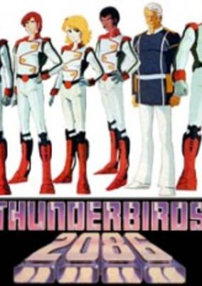

**Studio:** ITC Entertainment , Jin Productions &nbsp;|&nbsp; **Aired/Released:** 11 April &nbsp;|&nbsp; **Genres:** Science Fiction, Action, Mecha, Space, Adventure

> Thunderbirds 2086 takes place roughly twenty years after the original series (generally accepted as taking place around 2065, though other dates are seen on screen) and chronicles the adventures of the Thunderbirds, a rescue team working for the International Rescue Organisation. Unlike the original International Rescue, which was small-scale and family-oriented, the IRO is a vast organisation comprising numerous branches and overseen by the Federation, the 2086 equivalent of the United Nations. No direct historical connections are identified between the two series, but it can be assumed that the original International Rescue evolved into its 2086 incarnation over those thirty years. The Tracy family are not mentioned in the animated series. In the animated series, the actual team is known as the Thunderbirds, whilst in the original series the name merely referred to their vehicles. The animated series is otherwise very similar to the original, with most episodes revolving around a natural or man-made disaster which the Thunderbirds team must investigate and help resolve. Unlike the original series, Thunderbirds 2086 also has an on-going story arc revolving around a breakaway independence group known as the Shadow Axis, led by the mysterious Star Crusher. There is a heavy intimation in the series that Star Crusher is not human and may be some kind of alien entity.
>
> _Synopsis source: Kitsu_

[Wikipedia](https://en.wikipedia.org/wiki/Thunderbirds_2086) · [Kitsu](https://kitsu.io/anime/thunderbirds-2086)

---

### GoShogun

**Studio:** Ashi Productions &nbsp;|&nbsp; **Aired/Released:** 24 April

[Wikipedia](https://en.wikipedia.org/wiki/GoShogun)

---

### Haguregumo

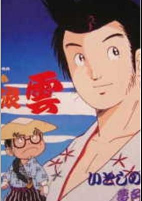

**Studio:** Madhouse , Toei Animation &nbsp;|&nbsp; **Director:** Mori Masaki &nbsp;|&nbsp; **Aired/Released:** 24 April &nbsp;|&nbsp; **Genres:** Comedy, Historical

> Set at the end of the Edo (Tokugawa Shoganate) era, the series depicts Cloud's family with his wife, Turtle, their 11-year-old son and 8-year-old daughter. The Clouds are always ignoring work and playing. Cloud is notorious for womanising.
>
> _Synopsis source: Kitsu_

[Wikipedia](https://en.wikipedia.org/wiki/Haguregumo) · [Kitsu](https://kitsu.io/anime/haguregumo)

---

### Acrobunch

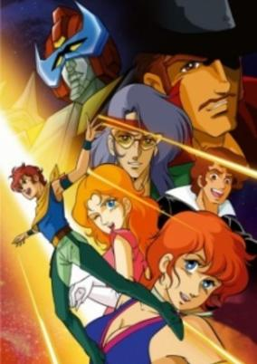

**Studio:** Kokusai Eiga-sha TMS Entertainment &nbsp;|&nbsp; **Director:** Masakazu Yasumura &nbsp;|&nbsp; **Aired/Released:** 5 May &nbsp;|&nbsp; **Genres:** Science Fiction, Mecha, Super Robot, Robot

> Led by scientist Tatsuya Randou, the Randou family undertakes a journey around the globe in order to search out ancient ruins to uncover the legend of Quetzalcoatl, which unlocks the key to a fabulous treasure. However, tailing the Randou family is Gopurin, an evil organisation that covets the legendary treasure for itself. The Randou family has the secret weapon of super robot Acrobunch. It becomes a race around the world of who finds the treasure first.
>
> _Synopsis source: Kitsu_

[Wikipedia](https://en.wikipedia.org/wiki/Acrobunch) · [Kitsu](https://kitsu.io/anime/makyou-densetsu-acrobunch)

---

### Little Pollon

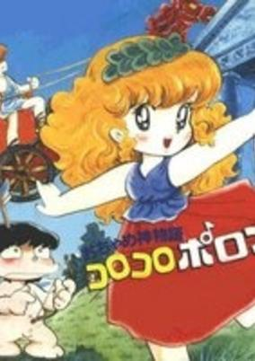

**Studio:** Kokusai Eiga-sha &nbsp;|&nbsp; **Director:** Takao Yotsuji &nbsp;|&nbsp; **Aired/Released:** 8 May &nbsp;|&nbsp; **Genres:** Parody, Comedy, Deity, Slapstick, Magical Girl, Magic

> Anime about the funny lives of the Greek gods up on Mount Olympus. Polon is the naughty daughter of Apollo. With her little cherub friend Eros, she interferes in various comical ways as she tries to show that she is fit to be a goddess. Her activities often misfire, getting her in trouble with some deity or other and causing chaos for gods and humans. Feeling neglected by her godly parent, she often assists him in his woman-chasing in the hopes of getting a new mommy.
>
> _Synopsis source: Kitsu_

[Wikipedia](https://en.wikipedia.org/wiki/Little_Pollon) · [Kitsu](https://kitsu.io/anime/ochamegami-monogatari-korokoro-poron)

---

### The Mysterious Cities of Gold

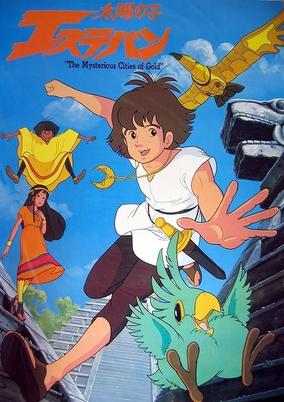

**Studio:** Studio Pierrot , DIC Audiovisuel &nbsp;|&nbsp; **Director:** Bernard Deyriès , Hisayuki Toriumi &nbsp;|&nbsp; **Aired/Released:** 29 June &nbsp;|&nbsp; **Genres:** Historical, Americas, Adventure, Science Fiction

> 1532. Esteban, age 12 is a foundling from Barcelona, with a mysterious power of ordering the Sun to appear, for which he is called "Child of the Sun." Upon the death of his adoptive father, Esteban learns he was rescued as a baby from a sinking ship in the ocean. The mysterious medallion that Esteban wears since ever has a trace somewhere in the New World, probably coming from the Mysterious Cities of Gold. Esteban leaves Spain to find his parents and find out who he is. On the way he meets Zia, an Inca girl who was kidnapped from her people years back and has exactly the same medallion as him. Later on, they are joined by Tao, a young Galapagos robinson, the last descendant of the Empire of Heva, an Empire said to have built the Cities of Gold. Following Coyolite, the shining star represented on their medallions, the three children travel through the unexplored New World, searching for the Cities of Gold, believing that this way is leading them to their lost parents.
>
> _Synopsis source: Kitsu_

[Wikipedia](https://en.wikipedia.org/wiki/The_Mysterious_Cities_of_Gold) · [Kitsu](https://kitsu.io/anime/mysterious-cities-of-gold)

---

### The Wizard of Oz

**Studio:** Toho , Wiz Corporation , Topcraft &nbsp;|&nbsp; **Director:** Fumihiko Takayama &nbsp;|&nbsp; **Aired/Released:** 1 July

[Wikipedia](https://en.wikipedia.org/wiki/The_Wizard_of_Oz_(1982_film))

---

### The Kabocha Wine (The Pumpkin Wine)

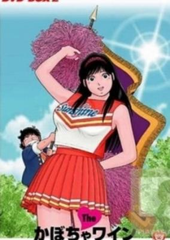

**Studio:** Toei Animation &nbsp;|&nbsp; **Director:** Kimio Yabuki &nbsp;|&nbsp; **Aired/Released:** 5 July &nbsp;|&nbsp; **Genres:** Romance, Ecchi, Comedy, School Life, Slice of Life

> Transfer student, Aoba Shunsuke, arrived at Sunshine School only to find the premises empty. He was secretly gleeful to be the first to reach the school, oblivious to the fact that it was Foundation Day and a rest day for the institution. At that moment, a big-sized "L"(Eru) beauty by the name of Natsumi appeared before him and the two of them hit off together even though Shunsuke was so much smaller than her. Shunsuke's mother runs a women's apparel busines but the shop is in need of manpower. Shunsuke offers to help out at the shop but fumbles a lot because he does not know how to interact with the ladies. Eru decides to step in and help out around the shop and this pleases Shunsuke's mother. This is a romance story that shares the joys and woes of the "SL" combi between Shunsuke and Eru.
>
> _Synopsis source: Kitsu_

[Wikipedia](https://en.wikipedia.org/wiki/The_Kabocha_Wine) · [Kitsu](https://kitsu.io/anime/the-kabocha-wine)

---

### Galactic Gale Baxingar

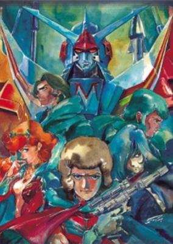

**Studio:** Kokusai Eiga-sha &nbsp;|&nbsp; **Director:** Takao Yotsuji &nbsp;|&nbsp; **Aired/Released:** 6 July &nbsp;|&nbsp; **Genres:** Science Fiction, Mecha, Super Robot, Robot, Action, Adventure

> 600 years after Ginga Senpuu Braiger, Jupiter has been destroyed, and many planets have come from it, bringing about more colonization. To combat the increasing lawless activity, Don Diego Condor gathers Billy the Shot, Samanosuke Dodi, Layla Minesato, and Shuteken Radcliffe, a.k.a. J9-II. They pilot Cosmo Bikes, which combine into the robot Baxingar.
>
> _Synopsis source: Kitsu_

[Wikipedia](https://en.wikipedia.org/wiki/Galactic_Gale_Baxingar) · [Kitsu](https://kitsu.io/anime/ginga-reppuu-baxingar)

---

### The Ideon: A Contact

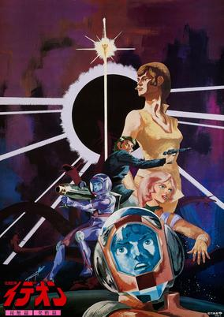

**Studio:** Nippon Sunrise , Sanrio &nbsp;|&nbsp; **Director:** Yoshiyuki Tomino &nbsp;|&nbsp; **Aired/Released:** 10 July &nbsp;|&nbsp; **Genres:** Gunfights, Future, Space, Mecha, Space Travel, Transforming Craft, Piloted Robot, Other Planet, Shipboard, Humanoid Alien

> A movie recap of the Space Runaway Ideon TV Series. Humanity's pursuit of knowledge leads them to the planet Solo, where they find mysterious remains of a long dead alien civilization, including the 3 part super robot 'Ideon', and a powerful warship. Using these, the Earthlings sent to investigate the ruins defend themselves in their constant conflicts against powerful aliens called the Buff Clan, who are in pursuit of 'Id', the mysterious energy that powers the Ideon.
>
> _Synopsis source: Kitsu_

[Wikipedia](https://en.wikipedia.org/wiki/Space_Runaway_Ideon) · [Kitsu](https://kitsu.io/anime/the-ideon-a-contact)

---

### The Ideon: Be Invoked (The Ideon: A Contact)

**Studio:** Nippon Sunrise , Sanrio &nbsp;|&nbsp; **Director:** Yoshiyuki Tomino &nbsp;|&nbsp; **Aired/Released:** 10 July &nbsp;|&nbsp; **Genres:** Gunfights, Future, Space, Mecha, Space Travel, Transforming Craft, Piloted Robot, Other Planet, Shipboard, Humanoid Alien

> A movie recap of the Space Runaway Ideon TV Series. Humanity's pursuit of knowledge leads them to the planet Solo, where they find mysterious remains of a long dead alien civilization, including the 3 part super robot 'Ideon', and a powerful warship. Using these, the Earthlings sent to investigate the ruins defend themselves in their constant conflicts against powerful aliens called the Buff Clan, who are in pursuit of 'Id', the mysterious energy that powers the Ideon.
>
> _Synopsis source: Kitsu_

[Wikipedia](https://en.wikipedia.org/wiki/Space_Runaway_Ideon) · [Kitsu](https://kitsu.io/anime/the-ideon-a-contact)

---

### Space Adventure Cobra

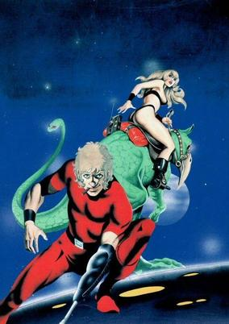

**Studio:** TMS Entertainment &nbsp;|&nbsp; **Director:** Osamu Dezaki &nbsp;|&nbsp; **Aired/Released:** 23 July &nbsp;|&nbsp; **Genres:** Alien, Space Travel, Violence, Action, Other Planet, Science Fiction, Space, Adventure

> Meek salaryman Johnson discovers that he is in fact the notorious (and reportedly dead) space pirate Cobra, with a new face and altered memories. Embedded in his left arm is Cobra's unique Psychogun, a famous weapon powered by his own will. Having recovered his past, his partner-in-crime Armaroid Lady, and his spaceship, he journeys across the galaxy seeking adventure. On his travels he will hunt for the galaxy's ultimate weapon, rob museums, break into and out of maximum-security prison, infiltrate a drug ring in the brutal and deadly sport of Rugball, engineer a coup on an alien world, confront the Pirate Guild's most fearsome leaders, and do much else besides—smoking cigars, chasing women and cracking jokes all the while. This, the 1982–83 Cobra TV anime, adapts the Cobra manga from the beginning, covering the first three major stories and building to a grand conclusion with some shorter one-off tales interspersed along the way. (The 1982 Cobra film has only a loose connection to the TV series—though it involved the same director and some of the same animators.)
>
> _Synopsis source: Kitsu_

[Wikipedia](https://en.wikipedia.org/wiki/Cobra_(manga)) · [Kitsu](https://kitsu.io/anime/space-adventure-cobra)

---

### Arcadia of My Youth

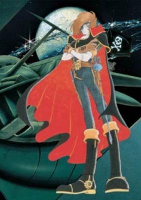

**Studio:** Toei Company , Tōkyū Agency &nbsp;|&nbsp; **Director:** Tomoharu Katsumata &nbsp;|&nbsp; **Aired/Released:** 28 July &nbsp;|&nbsp; **Genres:** Earth, Space Travel, Science Fiction, Space Opera, Thriller, Other Planet, Shipboard, Drama, Future, Space, Action, Adventure

> Earth has been conquered by the evil Illumidus Empire, with parallels drawn to the U.S. post World War II occupation of Japan. Captain Harlock with a group that will become his life long friends begin their fight against this tyranny visited upon the planet Earth, with no regard to the costs the struggle will have on them, caring only for the ideal of restoring freedom to the people of Earth.
>
> _Synopsis source: Kitsu_

[Wikipedia](https://en.wikipedia.org/wiki/Arcadia_of_My_Youth) · [Kitsu](https://kitsu.io/anime/waga-seishun-no-arcadia)

---

### Techno Police 21C (Techno Police)

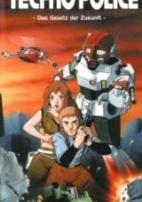

**Studio:** Toho , Eizo, Studio Nue &nbsp;|&nbsp; **Director:** Masashi Matsumoto &nbsp;|&nbsp; **Aired/Released:** 7 August &nbsp;|&nbsp; **Genres:** Action, Special Squads, Cyberpunk, Robot Helper, Law And Order, Cops, Mecha, Science Fiction

> The plot consists of a chase of a hijacked MBT-99A tank, designed by the United States Air Force (which is odd, but will become the saviour of Eleanor, as she can be ejected before the tank explodes, like a fighter jet). The audience is expected to be enamored with this vehicle. At one scene when it looks like the tank is sure to get away, the background music turns into cocktail-lounge jazz and sparkly lights swirl around the tank. The tank carries six ATGM launchers (which Ken is somehow able to dislodge with minimal trouble, along with a piece of the turret, towards the end of the movie), three to each side of the turret, and a laser-based machine-gun-esque installment, in addition to its rifled main gun. The tank's treads are dual-mounted (the tread is split in half, making four sets of treads for the tank). The employment of the laser, however, seems counter-productive to a machine-gun's mission, as it can only fire once every few seconds. If it can fire at higher rates, it does not do so, and tries to acquire a lock on its pursuer (Blader, in this case). This suggests a low ammunition capacity, unlike thousand-round-and-up machine-guns routinely mounted on modern tanks. It does not appear to have any effect on the road, either, which does not say much about its power. Another tank involved is the MBT-90D, which are dispatched by the Army (or Air Force—the movie never makes it clear if it is a joint effort, although the general who arrives midway into the movie is shown riding in something resembling an ADATS) to take out the tank. Despite having at least a platoon of these, the MBT-99 still evades capture. The M-90Ds are armed with a three-barreled autocannon, the calibre of which may be around fifteen to twenty millimeters. The MBT-90D is equipped with three ATGM missile launchers, on the left side of the turret, and its main cannon is mounted on the front, instead of on a turret. After the MBT-99's hijackers (who appear inside the tank after getting away from a recently-committed bank robbery), hired by a shadowy group, backed by a foreign nation seeking an edge in their military (the M-99 is presumably on its way to be tested at a separate base), are forced out by Ken and his team, Eleanor enters to study the tank, and it starts up on its own, having been programmed by the hijackers to head for a pier and drive off its end so as to rendezvous with an enemy submarine. The rest of the movie is made up of the chase through the city, resulting in the destruction of another bank (owned by the same corporation that built the first bank in the movie), and various collateral damage.
>
> _Synopsis source: Kitsu_

[Wikipedia](https://en.wikipedia.org/wiki/Techno_Police_21C) · [Kitsu](https://kitsu.io/anime/techno-police-21c)

---

### Andromeda Stories

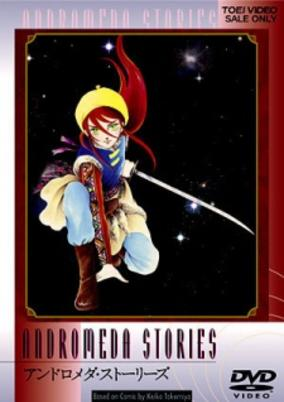

**Studio:** Toei Animation &nbsp;|&nbsp; **Director:** Masamitsu Sasaki &nbsp;|&nbsp; **Aired/Released:** 22 August &nbsp;|&nbsp; **Genres:** Science Fiction, Mecha, Fantasy World, Action, Alien, War, Robot, Disaster, Super Power, Space, Fantasy

> In the Andromeda galaxy there's a planet of a highly developed human civilisation. The gentle Prince Itaka and another kingdom's beautiful Princess Lilia are about to enter a love-marriage and take over the throne, when they discover a strange object on the nightsky. Later it lands on the planet, and an alien, mechanic civilization invades King Itaka's peaceful country making nearly everybody their slave. On a fateful night Queen Lilia gives birth to twins, and to avoid misfortune, the nanny Tarama takes one of the babies away, and entrusts it to the gladiator Balga. They still don't know, that the children were born with strong powers, and hold the key to the fight against the enemy that's searching to destroy every human civilisation on the planet...
>
> _Synopsis source: Kitsu_

[Wikipedia](https://en.wikipedia.org/wiki/Andromeda_Stories) · [Kitsu](https://kitsu.io/anime/andromeda-stories)

---

### The Super Dimension Fortress Macross

**Studio:** Studio Nue , Tatsunoko Production , Artland &nbsp;|&nbsp; **Director:** Noboru Ishiguro &nbsp;|&nbsp; **Aired/Released:** 3 October

[Wikipedia](https://en.wikipedia.org/wiki/The_Super_Dimension_Fortress_Macross)

---

### Robby the Rascal

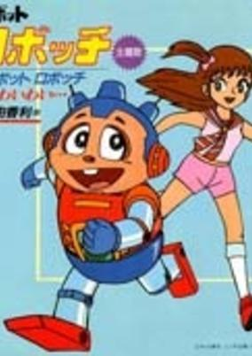

**Studio:** Knack Productions &nbsp;|&nbsp; **Director:** Kazuyuki Okasako &nbsp;|&nbsp; **Aired/Released:** 7 October &nbsp;|&nbsp; **Genres:** Science Fiction, Comedy

> Apparently inspired largely by Akira Toriyama's popular Dr. Slump, Cybot Robocchi is the story of Robocchi, a fun-loving, mischievous robot with a TV set in his stomach. Robocchi lives in a peaceful village with various other robots, all created by the eccentric and somewhat lecherous Dr. Art Deko. Although he is an android, Robocchi has a warm, kind heart and is always willing to help out a friend in need. With his human girlfriend Kurumi, he gets into a variety of wacky adventures.
>
> _Synopsis source: Kitsu_

[Wikipedia](https://en.wikipedia.org/wiki/Robby_the_Rascal) · [Kitsu](https://kitsu.io/anime/cybot-robocchi)

---

### Space Cobra (Space Adventure Cobra)

**Studio:** TMS Entertainment &nbsp;|&nbsp; **Director:** Osamu Dezaki &nbsp;|&nbsp; **Aired/Released:** 7 October &nbsp;|&nbsp; **Genres:** Alien, Space Travel, Violence, Action, Other Planet, Science Fiction, Space, Adventure

> Meek salaryman Johnson discovers that he is in fact the notorious (and reportedly dead) space pirate Cobra, with a new face and altered memories. Embedded in his left arm is Cobra's unique Psychogun, a famous weapon powered by his own will. Having recovered his past, his partner-in-crime Armaroid Lady, and his spaceship, he journeys across the galaxy seeking adventure. On his travels he will hunt for the galaxy's ultimate weapon, rob museums, break into and out of maximum-security prison, infiltrate a drug ring in the brutal and deadly sport of Rugball, engineer a coup on an alien world, confront the Pirate Guild's most fearsome leaders, and do much else besides—smoking cigars, chasing women and cracking jokes all the while. This, the 1982–83 Cobra TV anime, adapts the Cobra manga from the beginning, covering the first three major stories and building to a grand conclusion with some shorter one-off tales interspersed along the way. (The 1982 Cobra film has only a loose connection to the TV series—though it involved the same director and some of the same animators.)
>
> _Synopsis source: Kitsu_

[Wikipedia](https://en.wikipedia.org/wiki/Cobra_(manga)) · [Kitsu](https://kitsu.io/anime/space-adventure-cobra)

---

### Tokimeki Tonight

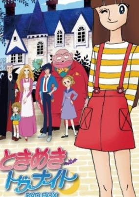

**Studio:** Group TAC , Toho &nbsp;|&nbsp; **Director:** Hiroshi Sasagawa &nbsp;|&nbsp; **Aired/Released:** 7 October &nbsp;|&nbsp; **Genres:** Fantasy, Romance, Earth, Contemporary Fantasy, Japan, Asia, Comedy, Vampire, Coming Of Age

> The main character, Ranze, is a junior high girl with troubles: her father is a vampire and her mother is a werewolf. Ranze has yet to manifest her supernatural powers, and her parents are beginning to get worried she might be normal. So begins the fantasy romantic comedy story.
>
> _Synopsis source: Kitsu_

[Wikipedia](https://en.wikipedia.org/wiki/Tokimeki_Tonight) · [Kitsu](https://kitsu.io/anime/tokimeki-tonight)

---

### Warrior of Love Rainbowman

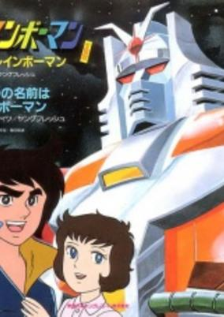

**Studio:** MBS , Ai Kikaku Center &nbsp;|&nbsp; **Director:** Nobuhiro Okasako &nbsp;|&nbsp; **Aired/Released:** 10 October &nbsp;|&nbsp; **Genres:** Piloted Robot, Mecha, Action, Science Fiction, Adventure

> In the mountains of India, a man named Takeshi Yamato gains the abilities of the legendary Rainbow Warrior, allowing him to transform into Rainbowman. With this power, he has to stop aliens from invading the earth.
>
> _Synopsis source: Kitsu_

[Wikipedia](https://en.wikipedia.org/wiki/Warrior_of_Love_Rainbowman) · [Kitsu](https://kitsu.io/anime/ai-no-senshi-rainbowman)

---

### The New Adventures of Maya the Honey Bee

**Studio:** Wako Productions , Apollo Film Wien &nbsp;|&nbsp; **Director:** Mitsuo Kaminashi &nbsp;|&nbsp; **Aired/Released:** 12 October

[Wikipedia](https://en.wikipedia.org/wiki/Maya_the_Honey_Bee)

---

### Arcadia of My Youth: Endless Orbit SSX (Endless Orbit SSX)

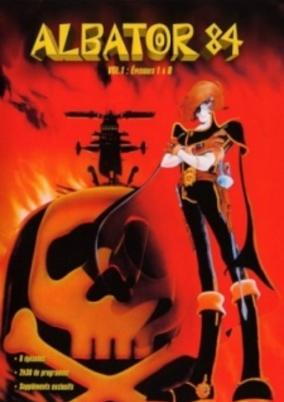

**Studio:** Toei Animation &nbsp;|&nbsp; **Director:** Tomoharu Katsumata &nbsp;|&nbsp; **Aired/Released:** 13 October &nbsp;|&nbsp; **Genres:** Space Travel, Science Fiction, Action, Space Opera, Gunfights, Swordplay, Other Planet, Humanoid Alien, Shipboard, Alien, Drama, Future, Space, Adventure

> At the end of Arcadia of My Youth Capitain Harlock and the crew of the space ship Arcadia had been banished from Earth. The Earth, as well as many other planets in the universe had been taken over by the Illumidus, a race of destructive humanoids who ruin, enslave or destroy almost any inhabitable planet they come across. In "Endless Orbit SSX" Harlock battles the Illumidus while searching for a mythical "Planet of Peace" where all the peoples of the universe can live freely and without war.
>
> _Synopsis source: Kitsu_

[Kitsu](https://kitsu.io/anime/waga-seishun-no-arcadia-mugen-kidou-ssx)

---

### Future War 198X (Future War Year 198X)

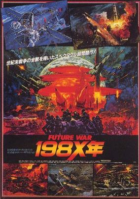

**Studio:** Toei Animation &nbsp;|&nbsp; **Director:** Tomoharu Katsumata , Toshio Masuda &nbsp;|&nbsp; **Aired/Released:** 30 October &nbsp;|&nbsp; **Genres:** Science Fiction, Earth, Alternative Present, Present, Military

> An American scientist constructs a laser–satellite with hope to prevent any nuclear conflicts. However, after a fatal error from both the U.S. and the U.S.S.R. government, war breaks, and humanity faces a new bloodshed.
>
> _Synopsis source: Kitsu_

[Wikipedia](https://en.wikipedia.org/wiki/Future_War_198X) · [Kitsu](https://kitsu.io/anime/future-war-198x-nen)

---

### Godmars (Six God Combination Godmars)

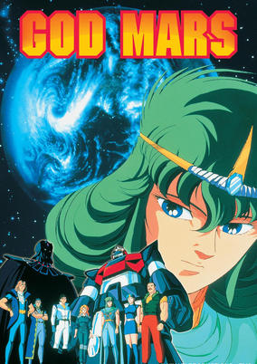

**Studio:** Tokyo Movie Shinsha &nbsp;|&nbsp; **Director:** Tetsuo Imazawa &nbsp;|&nbsp; **Aired/Released:** 18 December &nbsp;|&nbsp; **Genres:** Mecha, Science Fiction, Plot Continuity, Space, Action

> In the year 1999, humanity begins to advance beyond the solar system. The planet Gishin, led by the Emperor Zule, which aims to conquer the galaxy, runs into conflict with Earth. He targets Earth for elimination and to do this, he sends a baby called Mars to live among humanity. Accompanying the baby is a giant robot named Gaia, which utilizes a new power source strong enough to destroy an entire planet. As planned, Mars is expected to grow up, where he will activate the bomb within Gaia to fulfill the mission of destroying the Earth. However, when Mars arrives on Earth his is adopted into a Japanese family and given the name Takeru. Seventeen years later, Takeru would grow up with a love for humanity and refuses to detonate the bomb as ordered by Zule. However, if Takeru was to die, the bomb within Gaia would explode destroying the earth. Takeru possesses psychic powers ( ESP ) and decides to join the Earth defense forces and becomes a member of the Crasher Squad (an elite space defense force) where he and his friends take a last stand against the Gishin's attack. The relationship of Takeru with his brother Maag, which fate would have it, pitted the two against each other in the war. Unknown to the Gishin five other robots were created in secrecy along side Gaia by Takeru's father and sent with Gaia to protect Takeru. Whenever Earth is in danger, Takeru is able to summon the five other robots to combine with Gaia form the giant robot Godmars. The five other robots are Sphinx, Uranus, Titan, Shin and Ra.
>
> _Synopsis source: Kitsu_

[Wikipedia](https://en.wikipedia.org/wiki/Six_God_Combination_Godmars) · [Kitsu](https://kitsu.io/anime/rokushin-gattai-god-mars)

---
