# 1983 in Anime

[← Back to index](../README.md)

54 titles · 40 with a matched synopsis/cover art · [source](https://en.wikipedia.org/wiki/1983_in_anime)

## Releases

### Story of the Alps: My Annette

**Studio:** Nippon Animation &nbsp;|&nbsp; **Director:** Kōzō Kusuba &nbsp;|&nbsp; **Aired/Released:** January 9

---

### Mirai Keisatsu Urashiman (Future Police Urashiman)

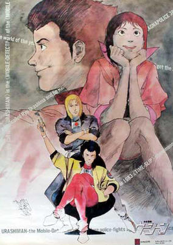

**Studio:** Tatsunoko Productions &nbsp;|&nbsp; **Director:** Seiji Okuda &nbsp;|&nbsp; **Aired/Released:** January 9 &nbsp;|&nbsp; **Genres:** Earth, Science Fiction, Japan, Action, Special Squads, Gunfights, Crime, Future, Law And Order, Comedy, Cops

> By chance, Ryo has slipped from the 1980s into the future, and is trying to get back. In the interim, he's working for the police force of the future, solving cases by applying his unique and often comical approach.
>
> _Synopsis source: Kitsu_

[Wikipedia](https://en.wikipedia.org/wiki/Mirai_Keisatsu_Urashiman) · [Kitsu](https://kitsu.io/anime/mirai-keisatsu-urashiman)

---

### Captain

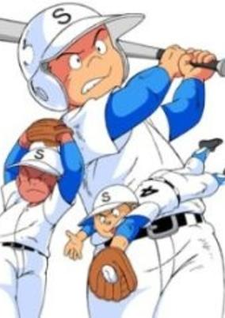

**Studio:** Eiken &nbsp;|&nbsp; **Director:** Tetsu Dezaki &nbsp;|&nbsp; **Aired/Released:** January 10 &nbsp;|&nbsp; **Genres:** Baseball, Sports

> The original is an impressive sports manga featuring not heroes, but common boys, and the story depicts the growth of Sumiya 2 junior high school baseball team (the successive captains and players) in downtown Tokyo. Takao Taniguchi, who was a substitute player of the second team of Aoba Gakuin, a prestigious junior high school in the baseball world, but he transferred to Sumiya 2 and he became the captain of the baseball club. After steady training, the team try to do a final game in the regional preliminaries, against Aoba Gakuin.
>
> _Synopsis source: Kitsu_

[Wikipedia](https://en.wikipedia.org/wiki/Captain_(manga)) · [Kitsu](https://kitsu.io/anime/captain)

---

### Aura Battler Dunbine

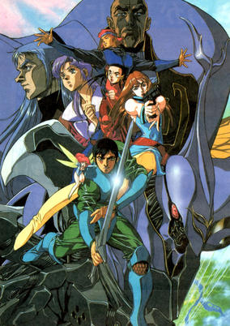

**Studio:** Nippon Sunrise &nbsp;|&nbsp; **Director:** Yoshiyuki Tomino &nbsp;|&nbsp; **Aired/Released:** February 5 &nbsp;|&nbsp; **Genres:** Fantasy, Science Fiction, Mecha, Action, Fantasy World, Piloted Robot, Earth, Gunfights, War, Drama, Robot, Disaster, Military, Adventure, Isekai

> Shou Zama is an ordinary 18-year-old from Tokyo who finds himself summoned to the medieval fantasy world of Byston Well. Upon arrival, he is put into service under the ambitious lord Drake Luft, who seeks to greatly expand his power. Those like Shou who come from "Upper Earth" possess strong aura power and are ordered to pilot "Aura Battlers," insectoid mecha designed by a man named Shot Weapon, who also came from Upper Earth. However, Shou's alliances quickly change when he meets Marvel Frozen, a young woman who has decided to rebel against Drake's political agenda. As he realizes the lord's true intentions, the boy chooses to join the fight against Drake and team up with Neal Given, who leads the resistance movement. The resistance isn't alone—Riml, daughter of their enemy and Neal's secret love, aids their efforts, hoping to escape from her father's clutches. As Shou finds himself fighting alongside his new comrades, they put their lives on the line to prevent the villainous Drake from taking over Byston Well before it's too late. [Written by MAL Rewrite]
>
> _Synopsis source: Kitsu_

[Wikipedia](https://en.wikipedia.org/wiki/Aura_Battler_Dunbine) · [Kitsu](https://kitsu.io/anime/aura-battler-dunbine)

---

### Urusei Yatsura: Only You

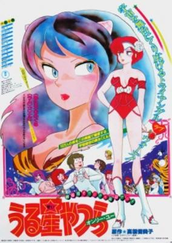

**Studio:** Studio Pierrot &nbsp;|&nbsp; **Director:** Mamoru Oshii &nbsp;|&nbsp; **Aired/Released:** February 13 &nbsp;|&nbsp; **Genres:** Romance, Comedy, Sudden Girlfriend Appearance, Humanoid Alien, Alien, Slapstick, Action, Science Fiction, Adventure

> Lum doesn't need much assistance going ballistic when everyone in Tomobiki gets an invitation to Ataru's wedding -- and she's not listed as the bride! It seems that some 11 years ago, Ataru played "Shadow Tag" with a young girl named Elle and won. Unfortunately, Elle was yet another Alien Princess; and on her planet, if a boy steps on a girl's shadow, they have to marry. When Elle's emissary comes to make arrangements, Lum redefines the term "the atmosphere was electric," but to no avail: a force-field now protects Ataru from her high voltage love-zaps. Lum's friend Benten suggests a pre-emptive wedding, and they proceed to abduct Ataru and all of the wedding guests, and the stage is set for the shotgun wedding of all time!
>
> _Synopsis source: Kitsu_

[Kitsu](https://kitsu.io/anime/urusei-yatsura-movie-1-only-you)

---

### Ai Shite Knight

**Studio:** Toei Animation &nbsp;|&nbsp; **Director:** Osamu Kasai &nbsp;|&nbsp; **Aired/Released:** March 1

[Wikipedia](https://en.wikipedia.org/wiki/Ai_Shite_Knight)

---

### Crusher Joe (Crusher Joe: The Movie)

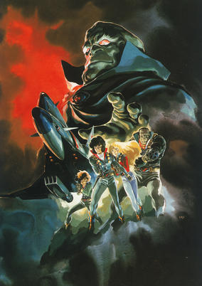

**Studio:** Studio Nue , Nippon Sunrise &nbsp;|&nbsp; **Director:** Yoshikazu Yasuhiko &nbsp;|&nbsp; **Aired/Released:** March 12 &nbsp;|&nbsp; **Genres:** Science Fiction, Adventure, Action, Thriller, Other Planet, Future, Space

> Crushers: intergalactic Jacks-of-All-Trades who will take on any assignment for the right price. Crusher Joe heads a small team of these outer space troubleshooters that includes the cyborg Talos, the beautiful Alfin, and the obligatory kid sidekick Ricky. A routine assignment escorting a cryogenically frozen heiress to a medical facility goes awry when the girl goes missing and Joe and his team are left holding the bag. It seems space pirates are trying to play the Crushers for patsies, but Joe doesn’t take kindly to the setup and tracks the pirates to their home world. The four heroes not only have to rescue their human cargo but take down the pirates in the process, which involves a heck of a lot of space dogfights, explosions, and good old-fashioned hand-to-hand combat.
>
> _Synopsis source: Kitsu_

[Wikipedia](https://en.wikipedia.org/wiki/Crusher_Joe) · [Kitsu](https://kitsu.io/anime/crusher-joe-the-movie)

---

### Doraemon: Nobita and the Castle of the Undersea Devil (Doraemon the Movie: Nobita and the Castle of the Undersea Devil)

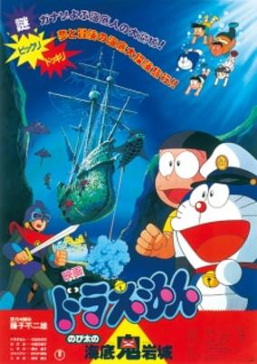

**Studio:** Shin-Ei Animation &nbsp;|&nbsp; **Director:** Tsutomu Shibayama &nbsp;|&nbsp; **Aired/Released:** March 12 &nbsp;|&nbsp; **Genres:** Earth, Science Fiction, Japan, Adventure, Asia, Comedy, Fantasy

> The plot revolves around a summer vacation of Nobita and his friends under the waters of Pacific Ocean. Jaian and Suneo take Doraemon's underwater vehicle and travel through the Atlantic Ocean, trying to find a treasure ship. Along the way, they discover that the environment gun that Doraemon used to protect them is running out of energy leaving them vulnerable to the sea. Fortunately, they are rescued by some marine creatures. Doraemon and his friends are later captured by these creatures, revealed to be inhabinats of the underwater kingdom of Mu. It is revealed that another undersea kingdom, Atlantis, now controlled by robots, was about to destroy the Earth with nuclear weapons after mistaking a volcano eruption for an invasion. With the help of a young boy from Mu, Nobita and his friends attempt to stop the robots, but are all captured. However, when things are at their grimmest, Doraemon's robotic underwater vehicle sacrifices itself to destroy the computer that controlled all the robots and nuclear weapons. After returning to Mu, Doraemon and his friends are hailed as heroes.
>
> _Synopsis source: Kitsu_

[Kitsu](https://kitsu.io/anime/doraemon-nobita-s-monstrous-underwater-castle)

---

### Harmagedon: The Great Battle with Genma (Harmagedon)

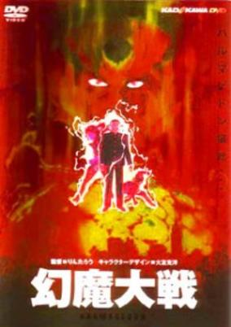

**Studio:** Madhouse &nbsp;|&nbsp; **Director:** Rintaro &nbsp;|&nbsp; **Aired/Released:** March 12 &nbsp;|&nbsp; **Genres:** Earth, Action, Science Fiction, Tokyo, Cyborg, Alien, Present, Super Power, Mecha, Adventure, Comedy

> From the depths of space he is coming... Ancient beyond understanding, his power is immeasurable. He has destroyed half the universe and is on his way here. He is... Genma. Only two people are aware of the imminent catastrophe: Princess Luna, a modern day prophetess and Vega, a cybernetic crusader from a world long since ravaged by Genma. Determined to spare the Earth from a similar fate, Luna and Vega must try to mobilize the most potent psychics in the world. Together, this army of fledging psychic warriors must succeed where billions have tried... and failed. But will they be able to gather their champions in time? Genma's agents are already on Earth to ensure that their master meets with no opposition!
>
> _Synopsis source: Kitsu_

[Wikipedia](https://en.wikipedia.org/wiki/Genma_Taisen) · [Kitsu](https://kitsu.io/anime/genma-taisen)

---

### Ninja Hattori-kun NinxNin Furusato Daisakusen no Maki

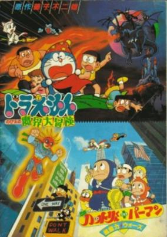

**Studio:** Shin-Ei Animation &nbsp;|&nbsp; **Aired/Released:** March 12 &nbsp;|&nbsp; **Genres:** Martial Arts, Super Power, Japan, Adventure, Comedy

> Crossover film featuring both of Motoo Abiko's work. Both casts gets wrapped up in an ESP war helping a psychic girl named Yuri whose homeland was destroyed by an evil psychic man who is trying to capture all the psychics in the world and use them for world domination. It was screened as a double feature with Doraemon: Nobita no Makai Daibouken.
>
> _Synopsis source: Kitsu_

[Wikipedia](https://en.wikipedia.org/wiki/Ninja_Hattori-kun) · [Kitsu](https://kitsu.io/anime/ninja-hattori-kun-plus-perman-chounouryoku-wars)

---

### Parman: The Birdman Has Arrived!!

**Studio:** Shin-Ei Animation &nbsp;|&nbsp; **Director:** Shin'ichi Suzuki &nbsp;|&nbsp; **Aired/Released:** March 12

[Wikipedia](https://en.wikipedia.org/wiki/Parman_(manga))

---

### Dr. Slump and Arale-chan: Hoyoyo, Great Across-the-World Race (Dr. Slump: "Hoyoyo!" Space Adventure)

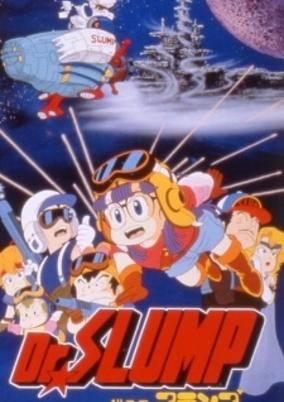

**Studio:** Toei Animation &nbsp;|&nbsp; **Director:** Minoru Okazaki &nbsp;|&nbsp; **Aired/Released:** March 13 &nbsp;|&nbsp; **Genres:** Science Fiction, Comedy

> When local teacher Midori Yamabuki receives an emergency summons to her home planet it turns out to be a trap devised by galactic warlord Dr. Mashirito, and it's up to Dr. Senbei Norimaki and a group of students (including his robot daughter Arale) to venture into space to save her.
>
> _Synopsis source: Kitsu_

[Wikipedia](https://en.wikipedia.org/wiki/Dr._Slump) · [Kitsu](https://kitsu.io/anime/dr-slump-movie-2-hoyoyo-uchuu-daibouken)

---

### Final Yamato (Space Battleship Yamato - Final Chapter)

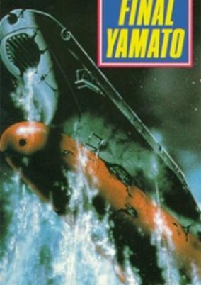

**Studio:** Group TAC , Academy Productions &nbsp;|&nbsp; **Director:** Tomoharu Katsumata &nbsp;|&nbsp; **Aired/Released:** March 19 &nbsp;|&nbsp; **Genres:** Science Fiction, Action, Space Opera, Space, Adventure, Military

> The year is 2203, not long after the Bolar Federation was defeated by Desslok's Galman-Gamilon Empire. A subspace dimensional dislocation has caused a distant Red Galaxy to be relocated in a collision course with the Milky Way. Stars and planets collide, making a wreck of the Galman-Gamilon homeworld. The Star Force is dispatched to investigate. They reach Galmania to find Desslok's palace in ruins. As they pay their respects, tossing white roses down to the surface of the planet, a huge red planet crashes into Galmania, forcing to StarForce to escape with an immediate and uncalculated warp.
>
> _Synopsis source: Kitsu_

[Wikipedia](https://en.wikipedia.org/wiki/Final_Yamato) · [Kitsu](https://kitsu.io/anime/uchuu-senkan-yamato-kanketsu-hen)

---

### Fushigi no Kuni no Alice (Alice in Wonderland)

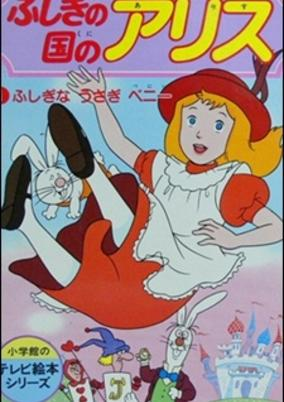

**Studio:** Nippon Animation &nbsp;|&nbsp; **Director:** Shigeo Koshi , Taku Sugiyama &nbsp;|&nbsp; **Aired/Released:** March 26 &nbsp;|&nbsp; **Genres:** Fantasy, Fantasy World, Anthropomorphism, Plot Continuity, Adventure, Kids, Isekai

> A retelling of Lewis Carroll's classic tale of the young girl Alice, who follows a white rabbit into a hole, only to find herself in Wonderland, where she meets many interesting characters, both the mysterious Cheshire Cat and the terrible Queen of Hearts.
>
> _Synopsis source: Kitsu_

[Wikipedia](https://en.wikipedia.org/wiki/Fushigi_no_Kuni_no_Alice) · [Kitsu](https://kitsu.io/anime/fushigi-no-kuni-no-alice)

---

### Lightspeed Electroid Albegas

**Studio:** Toei Animation &nbsp;|&nbsp; **Director:** Kozo Morishita &nbsp;|&nbsp; **Aired/Released:** March 30

[Wikipedia](https://en.wikipedia.org/wiki/Lightspeed_Electroid_Albegas)

---

### Miyuki

**Studio:** Kitty Films &nbsp;|&nbsp; **Director:** Mizuho Nishikubo &nbsp;|&nbsp; **Aired/Released:** March 31

[Wikipedia](https://en.wikipedia.org/wiki/Miyuki_(manga))

---

### Armored Trooper Votoms

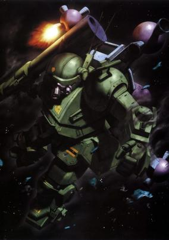

**Studio:** Nippon Sunrise &nbsp;|&nbsp; **Director:** Ryōsuke Takahashi &nbsp;|&nbsp; **Aired/Released:** April 1 &nbsp;|&nbsp; **Genres:** Space Travel, Science Fiction, Mecha, Genetic Modification, Action, Piloted Robot, Rotten World, Other Planet, War, Future, Space, Military

> A century of bloodshed between warring star systems has plunged nearly 200 worlds into the flames of war. Now, an uneasy truce has settled across the Astragius Galaxy... Chirico Cuvie, a special forces powered-armor pilot is suddenly transferred into a unit engaged in a secret and highly illegal mission to steal military secrets—from their own military! Now he's on the run...from his own army! Unsure of his loyalties and to cover their own tracks, Chirico is left behind to die in space. Surviving by luck, the renegade is now hunted by both the conspirators and military intelligence. He is driven by the haunting image of a mysterious and beautiful woman—the objective of their mission, and his sole clue to unraveling their treacherous scheme. But the conspirators will do anything to preserve their mysterious agenda...
>
> _Synopsis source: Kitsu_

[Wikipedia](https://en.wikipedia.org/wiki/Armored_Trooper_Votoms) · [Kitsu](https://kitsu.io/anime/armored-trooper-votoms)

---

### Nanako SOS

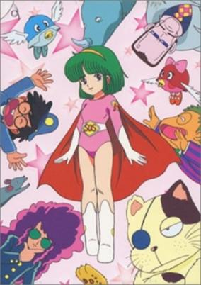

**Studio:** Kokusai Eiga-sha &nbsp;|&nbsp; **Director:** Akira Shigino &nbsp;|&nbsp; **Aired/Released:** April 2 &nbsp;|&nbsp; **Genres:** Comedy, Super Power, Parody, Romance

> Nanako is a young girl who unexpectedly acquires supernatural powers and at the same time loses her past memory. By accident, a scientific genius called Marlow, is present when she acquires her powers. Marlow is an industrious high school boy with extraordinary ambitions. He talks to Nanako into joining his detective agency by promising to help her regain her memory. Nanako innocently believes him, but Marlow's real intent is to use her powers to benefit his agency and himself. The story unfolds as Nanako encounters a variety of dangerous missions and mysterious events, but her natural sunny disposition helps her through all the incidents as she solves each mystery one after the other.
>
> _Synopsis source: Kitsu_

[Wikipedia](https://en.wikipedia.org/wiki/Nanako_SOS) · [Kitsu](https://kitsu.io/anime/nanako-sos)

---

### Kinnikuman

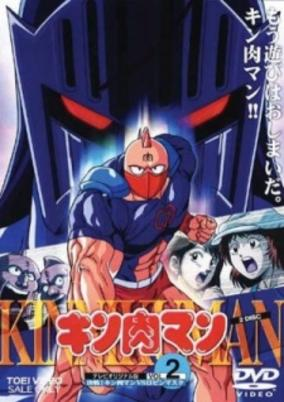

**Studio:** Toei Animation &nbsp;|&nbsp; **Director:** Yasuo Yamayoshi , Takenori Kawada , Tetsuo Imazawa &nbsp;|&nbsp; **Aired/Released:** April 3 &nbsp;|&nbsp; **Genres:** Martial Arts, Super Power, Present, Earth, Parody, Japan, Combat, Asia, Action, Science Fiction

> Kinnikuman is a superhero... a bad one. The one day a person named Meat tells Kinnikuman that he is the prince of an alien planet. Kinnikuman must save the day numerous times fighting evil chiyojins and competing in tournaments to prove himself to his family and to gain respect and money.
>
> _Synopsis source: Kitsu_

[Wikipedia](https://en.wikipedia.org/wiki/Kinnikuman) · [Kitsu](https://kitsu.io/anime/kinnikuman)

---

### Mīmu Iro Iro Yume no Tabi (The Many Dream Journeys of Meme)

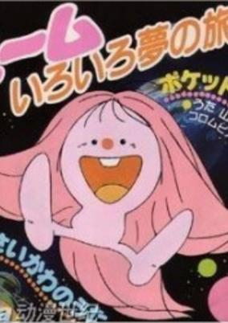

**Studio:** Nippon Animation &nbsp;|&nbsp; **Director:** Kazuyoshi Yokota &nbsp;|&nbsp; **Aired/Released:** April 3 &nbsp;|&nbsp; **Genres:** Science Fiction, School Life, Adventure, Kids

> Meme, a very cute and strange creature, is this leading character of this series. One day Meme comes out of a computer and meets Daisuke and Sayaka. Meme guides the kids throughout his world, where they meet world-famous scientists, inventors and scholars such as Galileo, Pasteur, Kepler, and many more. This series is not only highly entertaining for children and the entire family but is also very interesting and educational.
>
> _Synopsis source: Kitsu_

[Wikipedia](https://en.wikipedia.org/wiki/M%C4%ABmu_Iro_Iro_Yume_no_Tabi) · [Kitsu](https://kitsu.io/anime/miimu-iro-iro-yume-no-tabi)

---

### Mrs. Pepper Pot

**Studio:** Studio Pierrot &nbsp;|&nbsp; **Director:** Tatsuo Hayakawa &nbsp;|&nbsp; **Aired/Released:** April 4

[Wikipedia](https://en.wikipedia.org/wiki/Mrs._Pepper_Pot_(anime))

---

### Parman

**Studio:** Shin-Ei Animation . Tokyo Movie Shinsha &nbsp;|&nbsp; **Aired/Released:** April 4

[Wikipedia](https://en.wikipedia.org/wiki/Parman_(manga))

---

### Superbook II (Superbook 2)

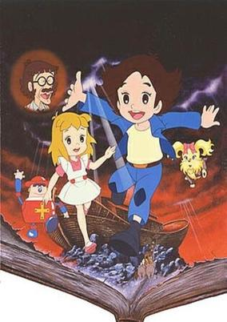

**Studio:** Tatsunoko Productions &nbsp;|&nbsp; **Director:** Masakazu Higuchi &nbsp;|&nbsp; **Aired/Released:** April 4 &nbsp;|&nbsp; **Genres:** Past, Earth, Time Travel, Historical, Motorsport, Science Fiction, Fantasy, Adventure, Kids

> The book fell onto a computer keyboard, giving anybody the ability to see into the past from Sho's home via the monitor. Ruffles, Chris' dog, managed to get lost in time, prompting Zenmaijikake and Sho's cousin Hisashi to search for her. Sho and Azusa kept watch and control of the computer from the present. The older children also had a hard time trying to keep what happened a secret from Sho's parents.
>
> _Synopsis source: Kitsu_

[Wikipedia](https://en.wikipedia.org/wiki/Superbook_(1981_TV_series)) · [Kitsu](https://kitsu.io/anime/superbook-2)

---

### Galactic Whirlwind Sasuraiger

**Studio:** Kokusai Eiga-sha &nbsp;|&nbsp; **Director:** Takao Yotsuji &nbsp;|&nbsp; **Aired/Released:** April 5

[Wikipedia](https://en.wikipedia.org/wiki/Galactic_Whirlwind_Sasuraiger)

---

### Eagle Sam

**Studio:** DAX International Inc. &nbsp;|&nbsp; **Director:** Hideo Nishimaki &nbsp;|&nbsp; **Aired/Released:** April 7

[Wikipedia](https://en.wikipedia.org/wiki/Sam_(Olympic_mascot))

---

### Itadakiman

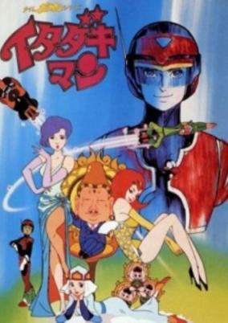

**Studio:** Tatsunoko Productions &nbsp;|&nbsp; **Director:** Hiroshi Sasagawa &nbsp;|&nbsp; **Aired/Released:** April 9 &nbsp;|&nbsp; **Genres:** Science Fiction, Action, Anthropomorphism, Slapstick, Mecha

> The story begins in the year of 20XX. Oshaka School in Kamakuland is a prestige school of the world where only those who are pure and clearheaded descendants of Priest Sanzo's clan may be admitted. As for the familiar villain trio, they are in firm belief that they are genuine descendants of Priest Sanzo's clan although actually they are of uncertain lineage. They study hard to enter the school in spite of their repeated failure. One day three intelligent children are called in by the principal and asked by Shakyamuni dwelling in his body to find missing puzzle copperplates scattered all over the world and complete the puzzle board to heighten honor of Oshaka School. The conversation, however, is overheard by the villain trio and they decide to forestall those selected youngsters. Then they happen to meet with a brilliant boy named koochan who appears handy and so they take him with them and attempt to take away puzzle copperplates from a goblin. At the same time they try to win the goblin over to their side and attack our heroes together. Being aware of the evil scheme, Koochan transforms himself into Itadakiman and fights bravely to drive the wicked trio away.
>
> _Synopsis source: Kitsu_

[Wikipedia](https://en.wikipedia.org/wiki/Itadakiman) · [Kitsu](https://kitsu.io/anime/time-bokan-series-itadakiman)

---

### Lady Georgie

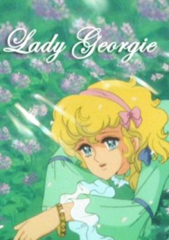

**Studio:** Tokyo Movie Shinsha &nbsp;|&nbsp; **Director:** Shigetsuga Yoshida &nbsp;|&nbsp; **Aired/Released:** April 9 &nbsp;|&nbsp; **Genres:** Romance, Earth, Drama, Past, Historical

> An Australian farmer returns home from the woods with a baby named Georgie. The girl lives ignoring the terrible secret hidden in the golden bracelet on her hand. Her "Father" and Her "brothers", Abel and Arthur, love her dearly, but her "mother" considers her an intruder and doesn't manage to open her heart to the girl. Georgie grows up into a beautiful young girl, and both her "brothers" are deeply in love with her. Not knowing the truth, Georgie eventually falls in love with the handsome grandson of the British Governor. When Mother finally reveals the truth to her and condemns the girl for being an exile's daughter, Georgie leaves for Britain in search of her real parents - and for her love, who has also left Australia. Abel and Arthur follow her and the three are thrown into the cruel world of London aristocracy, lies and intrigues.
>
> _Synopsis source: Kitsu_

[Wikipedia](https://en.wikipedia.org/wiki/Georgie!) · [Kitsu](https://kitsu.io/anime/lady-georgie)

---

### Noel's Fantastic Trip

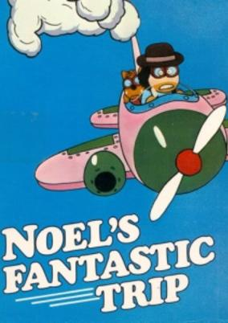

**Studio:** Iruka Office &nbsp;|&nbsp; **Director:** Tsuneo Maeda &nbsp;|&nbsp; **Aired/Released:** April 29 &nbsp;|&nbsp; **Genres:** Comedy, Fantasy, Adventure

> The film is centered around Noel, a young girl and her dog, Pup, who both live on the Planet Noel. While relaxing, Noel comes up with the idea to deliver ice cream to the sun. The two fly off and make their way toward the sun. On their way, the two of them make a stop at the Planet Gaudy. Upon their arrival, the President steps out to welcome the two. The President invites them to a special party, in which the Emcees show off the planet's most beautiful designs. This does not impress Noel, who states that it doesn't matter what clothes one is wearing, they will still be beautiful and loved. This coaxes the President and the citizens of the planet to take their clothes off, as does Noel. Pup gently reminds Noel of their trip to the sun, and the two take off to find him. When they find him, the sun warns of foul smog emanating from some unknown planet. The two leave the sun to find the source of the smog, but it quickly surrounds them. They escape underwater on another nearby planet. They appreciate the fine scenery underwater, but as they traverse further they notice the fish are ill.
>
> _Synopsis source: Kitsu_

[Wikipedia](https://en.wikipedia.org/wiki/Noel%27s_Fantastic_Trip) · [Kitsu](https://kitsu.io/anime/noel-no-fushigi-na-bouken)

---

### Nine

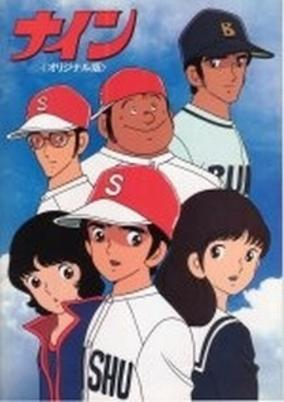

**Studio:** Group TAC &nbsp;|&nbsp; **Director:** Gisaburō Sugii &nbsp;|&nbsp; **Aired/Released:** May 4 &nbsp;|&nbsp; **Genres:** Baseball, Action, School Life, Sports

> Cinema adaption of the manga by Mitsuru Adachi.
>
> _Synopsis source: Kitsu_

[Wikipedia](https://en.wikipedia.org/wiki/Nine_(manga)) · [Kitsu](https://kitsu.io/anime/nine-original-han)

---

### Stop!! Hibari-kun!

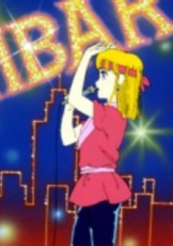

**Studio:** Toei Animation &nbsp;|&nbsp; **Aired/Released:** May 20 &nbsp;|&nbsp; **Genres:** Romance, Cross Dressing, Japan, Mafia, Comedy, Slapstick, Present

> A teenage boy has now moved in the home of his mother's friend, because she had died a while back. It just so happens that the Yakuza family has four beautiful daughters, but one daughter, Hibari, who is more beautiful then the rest of the daughters, is actually a boy. Hibari just can't keep his hands off our hero and so their crazy yet happy lives go on.
>
> _Synopsis source: Kitsu_

[Wikipedia](https://en.wikipedia.org/wiki/Stop!!_Hibari-kun!) · [Kitsu](https://kitsu.io/anime/stop-hibari-kun)

---

### Golgo 13: The Professional

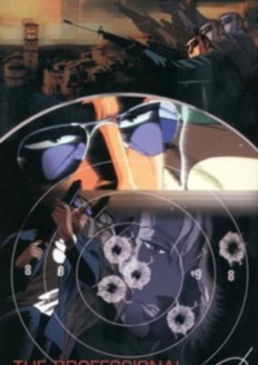

**Studio:** Tokyo Movie Shinsha , Filmlink International &nbsp;|&nbsp; **Director:** Osamu Dezaki &nbsp;|&nbsp; **Aired/Released:** May 28 &nbsp;|&nbsp; **Genres:** Gunfights, Violence, Mafia, Action, Crime, Rotten World, Adventure, Military

> After assassinating the son of business tycoon Leonard Dawson, Golgo 13 finds himself prey to the CIA and the U.S. Army, whom Dawson has personally hired to kill the assassin. As days pass by, Dawson slowly loses his sanity as he continues to plot every attempt to kill Golgo 13 even without caring about who hired the assassin to kill his son.
>
> _Synopsis source: Kitsu_

[Kitsu](https://kitsu.io/anime/golgo-13-the-professional)

---

### Plawres Sanshiro (Plastic Model Wrestling Sanshiro)

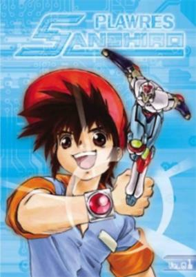

**Studio:** Asatsu DK , Kaname Production , Toho &nbsp;|&nbsp; **Director:** Kunihiko Yuyama &nbsp;|&nbsp; **Aired/Released:** June 5 &nbsp;|&nbsp; **Genres:** Science Fiction, Mecha, Japan, Action, Asia, Earth, Combat, Sports, Comedy, Martial Arts, Conspiracy, Proxy Battles, Android, Present, Adventure, School Life

> Plawres is a wrestling game that the players make their robots, which are about 30 cm tall, fight in the ring. The main character, Sugata Sanshiro, is a plawres player. Using his plawrestler, Juohmaru, he beats strong rivals.
>
> _Synopsis source: Kitsu_

[Wikipedia](https://en.wikipedia.org/wiki/Plawres_Sanshiro) · [Kitsu](https://kitsu.io/anime/plawres-sanshirou)

---

### Creamy Mami, the Magic Angel (Magical Angel Creamy Mami)

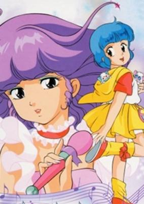

**Studio:** Studio Pierrot &nbsp;|&nbsp; **Director:** Osamu Kobayashi &nbsp;|&nbsp; **Aired/Released:** July 1 &nbsp;|&nbsp; **Genres:** Fantasy, Japan, Elementary School, Comedy, Love Polygon, Magic, Alien, Idol, Slapstick, Magical Girl, Present, Super Power, Science Fiction, Romance, School Life

> Creamy Mami is about a young girl, Yuu, who after seeing a spaceship is given the power to use magic for one year. She is also given 2 cats, Poji and Nega, to watch over and guide her. Using her magic powers to transform into the idol Creamy Mami, Yuu must work hard at acting, singing, helping her parents at their crepe shop, fighting aliens and bad guys, going to school, plus try to get the affections of her childhood friend Toshio.
>
> _Synopsis source: Kitsu_

[Wikipedia](https://en.wikipedia.org/wiki/Creamy_Mami,_the_Magic_Angel) · [Kitsu](https://kitsu.io/anime/mahou-no-tenshi-creamy-mami)

---

### Serendipity the Pink Dragon

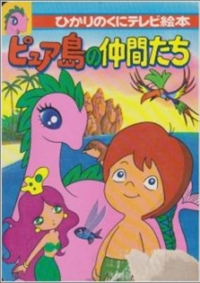

**Studio:** Zuiyo Eizo , Fuji Eight Co., Ltd. &nbsp;|&nbsp; **Director:** Nobuo Onuki &nbsp;|&nbsp; **Aired/Released:** July 1 &nbsp;|&nbsp; **Genres:** Adventure, Earth, Anthropomorphism, Present, Fantasy, Kids

> Kona is a boy who has a friend: a pink dragon named Serendipity with a kind nature. They want to stop the evil captain who tries steal gold from their peaceful island.
>
> _Synopsis source: Kitsu_

[Wikipedia](https://en.wikipedia.org/wiki/Serendipity_the_Pink_Dragon) · [Kitsu](https://kitsu.io/anime/serendipity-the-pink-dragon)

---

### Super Dimension Century Orguss (The Super Dimension Century Orguss)

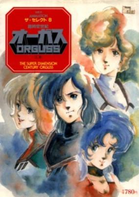

**Studio:** TMS Entertainment &nbsp;|&nbsp; **Director:** Noburo Ishiguro , Yasuyoshi Mikamoto &nbsp;|&nbsp; **Aired/Released:** July 3 &nbsp;|&nbsp; **Genres:** Time Travel, Mecha, Piloted Robot, Action, Science Fiction, Fantasy, Romance, Adventure

> In the year 2062, the world's two superpowers are fighting a long and brutal war. In a desperate attempt to win, pilot Kei Katsuragi is given the mission to detonate a super weapon called the Space/Time Oscillation Bomb. The bomb explodes but the results are completely unexpected: a multitude of dimensions, times, and realities are unleashed into the world. Can Kei reverse the effects and bring life back to normal?
>
> _Synopsis source: Kitsu_

[Wikipedia](https://en.wikipedia.org/wiki/Super_Dimension_Century_Orguss) · [Kitsu](https://kitsu.io/anime/choujikuu-seiki-orguss)

---

### Psycho Armor Govarian

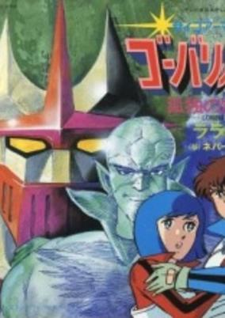

**Studio:** Knack &nbsp;|&nbsp; **Director:** Seiji Okuda &nbsp;|&nbsp; **Aired/Released:** July 6 &nbsp;|&nbsp; **Genres:** Science Fiction, Mecha, Super Power, Action

> The Garadain Empire has exhausted the primary resources of their native planet, so they send different space expeditions to find a new world where to live. One of their main objectives is planet Earth. However, Zeku Alba, an alien scientist, decides to rebel against the imperial rule and flees towards the Earth, where he gathers a group of youngs gifted with the power of "psychogenesis", an ability that consists in creating solid matter from mental energy. The most gifted of the squadron is Isamu, a young orphan whose family was killed in the first attack of the Garadain Empire. He is able to generate the powerful robot Govarian, an armor with which he can battle the alien monsters and is able to regenerate thanks to the psychic energy of the pilot. Helped by two other robots created by his team-mates, Isamu, aboard the robot Govarian, defends the Earth in the long war against the alien invaders.
>
> _Synopsis source: Kitsu_

[Wikipedia](https://en.wikipedia.org/wiki/Psycho_Armor_Govarian) · [Kitsu](https://kitsu.io/anime/psycho-armor-govarian)

---

### Dougram: Documentary of the Fang of the Sun

**Studio:** Nippon Sunrise &nbsp;|&nbsp; **Aired/Released:** July 9

[Wikipedia](https://en.wikipedia.org/wiki/Fang_of_the_Sun_Dougram)

---

### Xabungle Graffiti

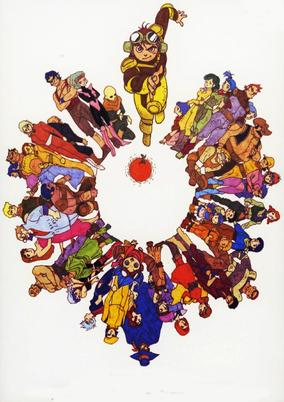

**Studio:** Nippon Sunrise &nbsp;|&nbsp; **Director:** Yoshiyuki Tomino &nbsp;|&nbsp; **Aired/Released:** July 9 &nbsp;|&nbsp; **Genres:** Science Fiction, Mecha, Comedy, Military

> Zora was an outlaw planet where they had a rule that one could own stolen things if he could run away keeping it for three days. When Motorcycle gang, Sand Rat, was driving on the planet, they were attacked by a walker machine. Then, an injured boy, Jiron, helped them. Lag, the leader of Sand Rat was interested in Jiron because he was going to the bazaar to steal a walker machine. That bazaar was held by Charring Cargo who was a courier of Blue Stone, and there must be the guards of Carrying and rowdy fellows at the bazaar. Furthermore, to be surprised, it was Carrying's latest walker machine, Xabungle, that he wanted to steal.
>
> _Synopsis source: Kitsu_

[Wikipedia](https://en.wikipedia.org/wiki/Combat_Mecha_Xabungle) · [Kitsu](https://kitsu.io/anime/sentou-mecha-xabungle)

---

### Cat's Eye

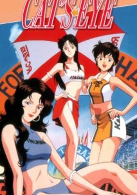

**Studio:** Tokyo Movie Shinsha &nbsp;|&nbsp; **Director:** Yoshio Takeuchi &nbsp;|&nbsp; **Aired/Released:** July 11 &nbsp;|&nbsp; **Genres:** Detective, Present, Earth, Japan, Asia, Action, Thievery, Adventure, Comedy, Romance, Crime, Mystery

> The three Kisugi sisters—Rui, Hitomi and Ai—during the day run a small cafe called "Cat's Eye." To discover the whereabouts of their father, the artist Michael Heintz, who has disappeared, Hitomi and her sisters rob art galleries as the smart and mysterious thief "Cat's Eye" in the hope that his works can give them clues about his vanishing. The crucial point is that Hitomi has a relationship with Toshi, a police inspector who has sworn to catch "Cat's Eye"—and of course he has no idea about Hitomi's double life.
>
> _Synopsis source: Kitsu_

[Wikipedia](https://en.wikipedia.org/wiki/Cat%27s_Eye_(manga)) · [Kitsu](https://kitsu.io/anime/cat-s-eye)

---

### Unico in the Island of Magic

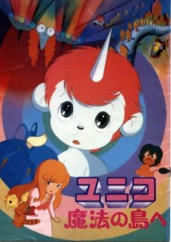

**Studio:** Madhouse &nbsp;|&nbsp; **Director:** Moribi Murano &nbsp;|&nbsp; **Aired/Released:** July 16 &nbsp;|&nbsp; **Genres:** Fantasy World, Fantasy, Adventure, Anthropomorphism, Friendship, Kids

> Based on "Unico and the Kingdom of the Sun," which was newly written as a theater version, this animated film features a battle between the wizard Kukuruku and Unico. Kukuruku builds a castle using dolls transformed from men as building parts. The story revolves around the sorrow and terror of men who have been transfigured into dolls, and a girl named Cherry who wishes to recover the kindness in her brother, who is a student of Kukuruku. This work reminds us of the fact that "transformation" or "transfiguration" - favorite themes of Tezuka Osamu - involves not only material aspects, but also man's immaterial heart.
>
> _Synopsis source: Kitsu_

[Wikipedia](https://en.wikipedia.org/wiki/Unico) · [Kitsu](https://kitsu.io/anime/unico-in-the-island-of-magic)

---

### Barefoot Gen

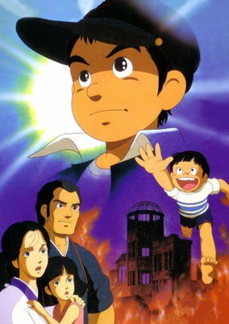

**Studio:** Madhouse &nbsp;|&nbsp; **Director:** Mori Masaki &nbsp;|&nbsp; **Aired/Released:** July 21 &nbsp;|&nbsp; **Genres:** Earth, Japan, World War II, Asia, Slice of Life, Coming Of Age, Angst, Horror, Drama, Violence, Historical, Family

> It's the summer of 1945. 3 years have elapsed since the war between Japan and USA began. Gen is a young boy living a struggling yet satisfying life in the city of Hiroshima, that has been strangely spared by the bombing taken in almost every other Japanese City. Food is scarce, and Gen's family is suffering from severe malnutrition, which endangers his pregnant mother. There isn't much spare time as Gen and his little brother Shinji help their father and mother at work and try to make sure their family survives the tough times. Little do they know, what the Americans have in store for the city of Hiroshima and as of the 6th of August 1945, their lives are about to change dramatically.
>
> _Synopsis source: Kitsu_

[Wikipedia](https://en.wikipedia.org/wiki/Barefoot_Gen_(1983_film)) · [Kitsu](https://kitsu.io/anime/hadashi-no-gen)

---

### Miyuki

**Studio:** Kitty Films , Toho &nbsp;|&nbsp; **Director:** Kazuyuki Izutsu &nbsp;|&nbsp; **Aired/Released:** September 16

[Wikipedia](https://en.wikipedia.org/wiki/Miyuki_(manga))

---

### Nine the Original

**Studio:** Group TAC &nbsp;|&nbsp; **Director:** Gisaburō Sugii &nbsp;|&nbsp; **Aired/Released:** September 16 &nbsp;|&nbsp; **Genres:** Baseball, Action, School Life, Sports

> Cinema adaption of the manga by Mitsuru Adachi.
>
> _Synopsis source: Kitsu_

[Wikipedia](https://en.wikipedia.org/wiki/Nine_(manga)) · [Kitsu](https://kitsu.io/anime/nine-original-han)

---

### Genesis Climber MOSPEADA

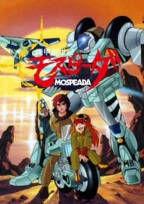

**Studio:** Artmic , Tatsunoko Productions &nbsp;|&nbsp; **Director:** Katsuhisa Yamada &nbsp;|&nbsp; **Aired/Released:** October 2 &nbsp;|&nbsp; **Genres:** Power Suit, Transforming Craft, Post Apocalypse, Gunfights, Alien, Future, Robot, Piloted Robot, Science Fiction, Action, Mecha, Disaster, Military

> The story takes place in the 21st century. Due to the fact that pollution was becoming a major problem, scientists had developed the use of hydrogen fuel called "HBT" as an alternative to fossil fuels. At this time humans have colonized Mars in search of new place to call home as a result of overpopulation. In the year 2050, a mysterious alien race called the Inbit invaded the Earth. Unable to fight the Inbits, Earth became desolate with only a few pockets of human beings scattered throughout the planet. Many of the refugees escape aboard a few remaining shuttles to seek shelter on the Moon. The Inbit sets up their main base of operations in the Great Lakes area of North America called "Reflex Point". However, the Mars colony, dubbed the Mars Base, did not forget about the plight of Earth. Troops were sent in to fight the Inbits from the Moon, only to fail miserably. The Inbits did not attack Mars, and showed no interest towards the other planets. Surprisingly the Inbit show no hostility towards humans unless they are directly provoked. The Inbit can also sense the presence of HBT, and use of the fuel is limited under their supervision, as HBT is a common component in weapons technology. Overnight the Mars base becomes a gigantic military machine, producing vast amounts of advanced weaponry and trained troops. In 2080, Mars Base sent in the next wave of troops. Although equipped with more technologically advanced equipment and transformable mecha, the attempt to recapture the homeworld was nonetheless a failure. Three years later, Mars Base launched another attack called the Second Earth Recapture Force. One of the troops happened to be Lieutenant Stick Bernard (Also called Stig Bernard by some, the original english dub before Robotech used Stick). The mission proved to be unsuccessful as it did three years ago and Stick's fiancée Marlene was killed. After losing her, Stick was forced to crash into Earth, landing in South America. At first, he was sorrowful and depressed at the death of his beloved Marlene. After seeing the holographic recording of his dead betrothed, Stick swore an oath of vengeance. In his quest to reach the Reflex Point on North America, the Inbit 'hive', he meets other characters of the show, forming a group of ragtag freedom fighters on a goal to rid the planet of the Inbits. As the plot unravels, the purpose of the Inbits invasion is revealed. Their sole purpose of coming to the planet was because Earth provides them a suitable place to evolve into more complex beings. However, little did the Inbits know that their endeavor actually threatens to cause the extinction of both humans and Inbits. And thus, it is up to Stick and his group, with the help of human-like Inbits (Aisha and Solzie), to convince the supreme ruler of the Inbit, the Refles, to flee from Earth. MOSPEADA stands for Military Operation Soldier Protect Emergency Aviation Dive Auto, one of the transformable motorcycle-armors the series features. The other primary mecha featured in the show is the three-form transformable fighter called the Armo-Fighter AFC-01 Legioss, which is very much similar to the VF-1 Valkyrie variable fighter in The Super Dimension Fortress Macross.
>
> _Synopsis source: Kitsu_

[Wikipedia](https://en.wikipedia.org/wiki/Genesis_Climber_MOSPEADA) · [Kitsu](https://kitsu.io/anime/genesis-climber-mospeada)

---

### Special Armored Battalion Dorvack

**Studio:** Ashi Productions &nbsp;|&nbsp; **Director:** Hisataro Oniwa &nbsp;|&nbsp; **Aired/Released:** October 7

[Wikipedia](https://en.wikipedia.org/wiki/Special_Armored_Battalion_Dorvack)

---

### Taotao

**Studio:** Mushi Production , Studio Cosmos &nbsp;|&nbsp; **Director:** Shuichi Nakahara , Tatsuo Shimamura &nbsp;|&nbsp; **Aired/Released:** October 7

[Wikipedia](https://en.wikipedia.org/wiki/Taotao_(anime))

---

### Captain Tsubasa

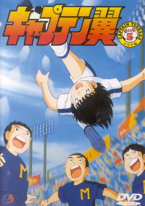

**Studio:** Tsuchida Pro &nbsp;|&nbsp; **Director:** Isamu Imakake &nbsp;|&nbsp; **Aired/Released:** October 10 &nbsp;|&nbsp; **Genres:** Earth, Action, Sports, Soccer, Alternative Present, Present

> Captain Tsubasa is the passionate story of an elementary school student whose thoughts and dreams revolve almost entirely around the love of soccer. 11-year-old Tsubasa Oozora started playing soccer at a very young age, and while it was mostly just a recreational sport for his friends, for him, it developed into something of an obsession. In order to pursue his dream to the best of his elementary school abilities, Tsubasa moves with his mother to Nankatsu city, which is well-known for its excellent elementary school soccer teams. But although he was easily the best in his old town, Nankatsu has a lot more competition, and he will need all of his skill and talent in order to stand out from this new crowd. He encounters not only rivals, but also new friends like the pretty girl Sanae Nakazawa and the talented goalkeeper, Genzo Wakabayashi, who shares the same passion as Tsubasa, and will prove to be a treasured friend in helping him push towards his dreams. Representing Japan in the FIFA World Cup is Tsubasa’s ultimate dream, but it will take a lot more than talent to reach it.
>
> _Synopsis source: Kitsu_

[Wikipedia](https://en.wikipedia.org/wiki/Captain_Tsubasa) · [Kitsu](https://kitsu.io/anime/captain-tsubasa)

---

### The Green Cat

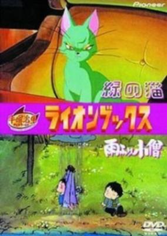

**Studio:** Tezuka Productions , Maki Productions &nbsp;|&nbsp; **Director:** Osamu Tezuka &nbsp;|&nbsp; **Aired/Released:** October 10 &nbsp;|&nbsp; **Genres:** Science Fiction, Detective, Violence, Mystery

> The story is a mystery about a green cat and a private detective who investigates where it came from. The cat was thought to be good luck, but eventually brought misfortune to all those who come in contact. The story was taken directly from the 5th subtitle of the 1950s Lion Books manga.
>
> _Synopsis source: Kitsu_

[Wikipedia](https://en.wikipedia.org/wiki/The_Green_Cat) · [Kitsu](https://kitsu.io/anime/midori-no-neko)

---

### Igano Kabamaru

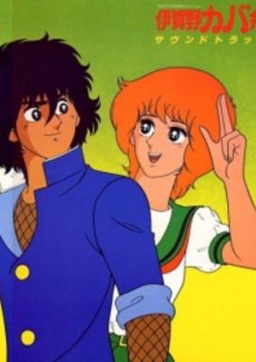

**Studio:** Group TAC &nbsp;|&nbsp; **Director:** Tameo Kohanawa &nbsp;|&nbsp; **Aired/Released:** October 20 &nbsp;|&nbsp; **Genres:** Japan, Earth, Action, Asia, Comedy, Martial Arts, Love Polygon, High School, Slapstick, School Life, Present, Adventure, Romance

> After the death of Saizou, Kabamaru's horribly strict grandfather and Iga ninja teacher (sensei), an old lady, Ran Ookubo, claims that she received a letter from him asking her to take care of his grandson. So Kabamaru runs off with Lady Ookubo to the big city Tokyo to gorge on yakisoba, ramen, chow mein, and attend a regular school—which turns out to have weird quirks of its own.
>
> _Synopsis source: Kitsu_

[Wikipedia](https://en.wikipedia.org/wiki/Igano_Kabamaru) · [Kitsu](https://kitsu.io/anime/igano-kabamaru)

---

### Ginga Hyōryū Vifam

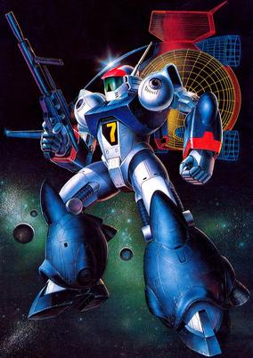

**Studio:** Nippon Sunrise &nbsp;|&nbsp; **Director:** Takeyuki Kanda &nbsp;|&nbsp; **Aired/Released:** October 21 &nbsp;|&nbsp; **Genres:** Alien, Robot, Future, Space, Mecha, Space Travel, Other Planet, Shipboard, Humanoid Alien, Plot Continuity

> AD. 2058, on the Clayad which was the 3rd planet of the Ypserlon system, which was 43 light years away from Earth, suddently aliens raided the planet.The emigrants on the Clayad had to escape from the planet. Because of the confusion during the escape, the children were strayed from their parents and got in the training space ship, Janous. With a lot of sacrifices, they managed to arrive at 4th planet Belwick. However, the Belwick had been already in the war. Therefore, the 13 children had to go to the Earth by themselves.
>
> _Synopsis source: Kitsu_

[Wikipedia](https://en.wikipedia.org/wiki/Ginga_Hy%C5%8Dry%C5%AB_Vifam) · [Kitsu](https://kitsu.io/anime/ginga-hyouryuu-vifam)

---

### Dallos

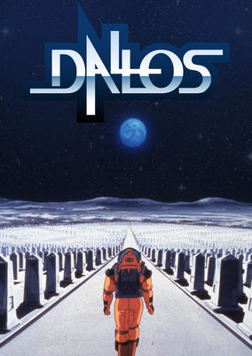

**Studio:** Pierrot &nbsp;|&nbsp; **Director:** Mamoru Oshii &nbsp;|&nbsp; **Aired/Released:** December 12 &nbsp;|&nbsp; **Genres:** Power Suit, Piloted Robot, Science Fiction, Action, Gunfights, Dystopia, Other Planet, Future, Stereotypes, Mecha, Plot Continuity, Space

> At the end of the 21st century, Earth had to confront the problem of population increases combined with shortages in resources. Development of the Moon was seen as the way to solve the situation. The Moon's mineral resources reinvigorated the Earth and brought prosperity. However, the achievement of that vision proved painful for those who'd left their home world to settle on the Moon. One of Man's greatest dreams has become a nightmare for those who have been forced to live it out. Shun Nonomura doesn't realize it, but he's about to discover a weapon - one that can overthrow the oppressive Monopolice and bring freedom to the lunar colonists. The growing resistance movemnt is quick to adopt it, along with its creator, into their ranks as they rally around the mysterious alien monument known as Dallos... Dallos was made in 1983 by Studio Pierrot, becoming world's first OVA series. It was also the directorial debut of Mamoru Oshii, who would later go on to direct such films as Angel's Egg, the first two Urusei Yatsura movies, and Ghost in the Shell.
>
> _Synopsis source: Kitsu_

[Wikipedia](https://en.wikipedia.org/wiki/Dallos) · [Kitsu](https://kitsu.io/anime/dallos)

---

### Nine 2: Sweetheart Declaration

**Studio:** Group TAC &nbsp;|&nbsp; **Director:** Gisaburō Sugii &nbsp;|&nbsp; **Aired/Released:** December 18 &nbsp;|&nbsp; **Genres:** Baseball, Action, School Life, Sports

> Cinema adaption of the manga by Mitsuru Adachi.
>
> _Synopsis source: Kitsu_

[Wikipedia](https://en.wikipedia.org/wiki/Nine_(manga)) · [Kitsu](https://kitsu.io/anime/nine-original-han)

---

### Daicon IV Opening Animation

[Wikipedia](https://en.wikipedia.org/wiki/Daicon_III_and_IV_Opening_Animations)

---

### Patalliro! Stardust Keikaku

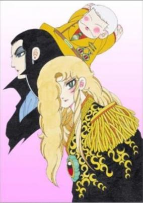

**Studio:** Toei Animation &nbsp;|&nbsp; **Genres:** Romance, Action, Parody, Comedy, Gunfights, Bishounen, Alternative Present, Shounen Ai, Adventure

> Patarillo! is set in a society much like ours in most ways, with one decided twist. The manga on which it is based is one of the much-read works produced for adolescent Japanese girls that features a healthy proportion of gay men and beautiful teenagers aka bishounen (beautiful boys). Most of the action takes place in Marinera, the land of eternal spring, located somewhere in the South Seas. The country is a major producer of diamonds; they provide much of the basis of conflict in the anime series. They come from one of the most prolific mines in the world, owned by the king of Marinera, the vertically challenged but horizontally endowed boy-king Patarillo himself. The International Diamond Syndicate - a huge semi- criminal organization/ secret society dedicated to taking over the world`s entire diamond supply- wants that mine and will stop at nothing to get it. In the early episodes they send off a number of bishounen assassins to do in Patarillo, which necessitates his having a bodyguard, the English MI6 agent, Major Jack (`Bishounen-Killer`) Bancoran. Bancoran`s nickname doesn`t mean he shoots bishounen in cold blood. The soubriquet comes from the fact that no male under the age of 17 can resist his sexual fascination. This, to Bancoran`s eternal disgust, includes Patarillo himself. The action switches often from Marinera to MI6 headquarters in London (London seems to be an easy two hour`s flight from the South Seas) or Bancoran`s palatial condo in the suburbs of same. (MI6, be it noted, looks a lot like Fritz Lang`s Metropolis, while Jack`s `apartment` bears a passing resemblance to Randolph Hearst`s spread.) The action also goes into the past and future and out into space. Patarillo evidently gets around.
>
> _Synopsis source: Kitsu_

[Wikipedia](https://en.wikipedia.org/wiki/Patalliro!) · [Kitsu](https://kitsu.io/anime/patalliro)

---
