# 1984 in Anime

[← Back to index](../README.md)

52 titles · 32 with a matched synopsis/cover art · [source](https://en.wikipedia.org/wiki/1984_in_anime)

## Releases

### Starzan S

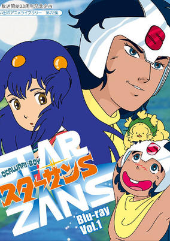

**Studio:** Tatsunoko Production &nbsp;|&nbsp; **Director:** Hidehito Ueda &nbsp;|&nbsp; **Aired/Released:** January 7 &nbsp;|&nbsp; **Genres:** Science Fiction, Adventure, Action

> On planet Kirakira live two tribes: Senobi and Robot. Senobi, quiet and peacefully set, settle down in the forest. Robot comes from the desert and starts war to take control of afforested grounds. A young hero coming from Senobi tries to appease the whole situation.
>
> _Synopsis source: Kitsu_

[Wikipedia](https://en.wikipedia.org/wiki/Starzan_S) · [Kitsu](https://kitsu.io/anime/okawari-boy-starzan-s)

---

### Katri, Girl of the Meadows (Katri)

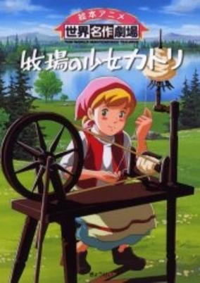

**Studio:** Nippon Animation &nbsp;|&nbsp; **Director:** Hiroshi Saitō &nbsp;|&nbsp; **Aired/Released:** January 8 &nbsp;|&nbsp; **Genres:** Earth, Europe, Historical, Adventure, Slice of Life

> This series tells the story of 9 year-old Katri, a girl who lives on a farm in Finland with her grandparents. Katri's mother has been away in Germany for three years. The farm is not doing well, so to help support her family, she goes to work on a neighboring farm. Katri faces many struggles and challenges.
>
> _Synopsis source: Kitsu_

[Wikipedia](https://en.wikipedia.org/wiki/Katri,_Girl_of_the_Meadows) · [Kitsu](https://kitsu.io/anime/makiba-no-shoujo-katori)

---

### Chō Kōsoku Galvion (Super High Speed Galvion)

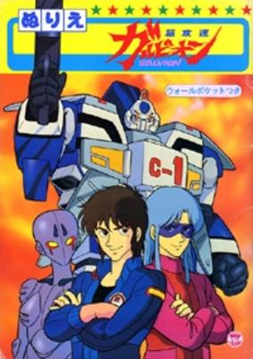

**Studio:** Artmic , Kokusai Eiga-sha , Studio Robin &nbsp;|&nbsp; **Director:** Koichi Ohata &nbsp;|&nbsp; **Aired/Released:** February 3 &nbsp;|&nbsp; **Genres:** Science Fiction, Mecha, Action, Cops, Military

> Super High Speed Galvion features mecha designs by Ohata Koichi (of Gunbuster fame). In the 23rd century billionaire Midoriyama Rei creates a secret organization called Circus to combat a hidden group called Shadow that is taking over the world. When she can't find qualified pilots for Circus' main mecha, the Galvion, she cuts a deal with two convicts, Mu and Maya, to lead the fight against Shadow.
>
> _Synopsis source: Kitsu_

[Wikipedia](https://en.wikipedia.org/wiki/Ch%C5%8D_K%C5%8Dsoku_Galvion) · [Kitsu](https://kitsu.io/anime/chou-kousoku-galvion)

---

### Heavy Metal L-Gaim

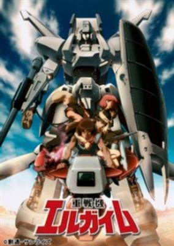

**Studio:** Nippon Sunrise &nbsp;|&nbsp; **Director:** Yoshiyuki Tomino &nbsp;|&nbsp; **Aired/Released:** February 4 &nbsp;|&nbsp; **Genres:** Space Travel, Science Fiction, Mecha, Action, Space, Adventure

> In the Pentagona System, a young man by the name of Daba Myroad leads a rebellion against Pentagona's leader, Oldna Poseidal. Daba's not alone however, meeting a large number of allies along his journey and having in his possession the powerful L-Gaim, a white Heavy Metal left to him by his father.
>
> _Synopsis source: Kitsu_

[Wikipedia](https://en.wikipedia.org/wiki/Heavy_Metal_L-Gaim) · [Kitsu](https://kitsu.io/anime/juusenki-l-gaim)

---

### Yume Senshi Wingman

**Studio:** Toei Animation &nbsp;|&nbsp; **Director:** Tomoharu Katsumata &nbsp;|&nbsp; **Aired/Released:** February 7

[Wikipedia](https://en.wikipedia.org/wiki/Wingman_(manga))

---

### The Star of Cottonland (Fantasy of a Kitten)

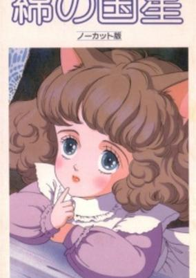

**Studio:** Mushi Production &nbsp;|&nbsp; **Director:** Shinichi Tsuji &nbsp;|&nbsp; **Aired/Released:** February 11 &nbsp;|&nbsp; **Genres:** Fantasy, Angst, Drama, Romance, Psychological, Juujin

> After two-month-old kitten Chibi-neko is abandoned by her former owners, she is found by 18-year-old Tokio. Although his mother is allergic to cats and has a great fear of them, she agrees to let him keep the kitten because she fears he is becoming too withdrawn after failing his university entrance exams. Chibi-neko soon falls in love with Tokio. In her own mind, Chibi-neko is a small human who speaks in human words, although people only ever seem to hear her meow, and she believes that all humans were once kittens like her. A stray cat tells Chibi-neko of a paradise called Cottonland, where dreams can come true.
>
> _Synopsis source: Kitsu_

[Wikipedia](https://en.wikipedia.org/wiki/The_Star_of_Cottonland) · [Kitsu](https://kitsu.io/anime/the-star-of-cottonland)

---

### Urusei Yatsura 2: Beautiful Dreamer

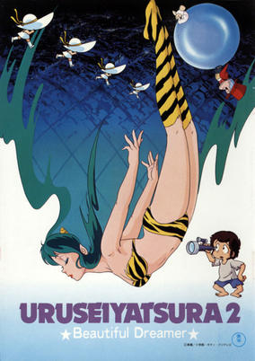

**Studio:** Studio Pierrot &nbsp;|&nbsp; **Director:** Mamoru Oshii &nbsp;|&nbsp; **Aired/Released:** February 11 &nbsp;|&nbsp; **Genres:** Romance, Science Fiction, Japan, Comedy, Love Polygon, Angst, High School, Humanoid Alien, Alien, Slapstick, Action, Adventure

> Not all is normal in Tomobiki, even by its standards. The students have been preparing feverishly for the first day of the student fair, which is scheduled to go on the next day. However, problems arise when some begin to notice that the next day simply will not come. As the students begin to try to find the reason for the problem, their beliefs about reality and the world of dreams are challenged.
>
> _Synopsis source: Kitsu_

[Kitsu](https://kitsu.io/anime/urusei-yatsura-movie-2-beautiful-dreamer)

---

### Lolita Anime

**Studio:** Wonder Kids &nbsp;|&nbsp; **Director:** Kuni Toniro , R. Ching , Mickey Soda , Mickey Masuda &nbsp;|&nbsp; **Aired/Released:** February 21

[Wikipedia](https://en.wikipedia.org/wiki/Lolita_Anime)

---

### Little Memole

**Studio:** Toei Animation &nbsp;|&nbsp; **Director:** Osamu Kasai &nbsp;|&nbsp; **Aired/Released:** March 3

[Wikipedia](https://en.wikipedia.org/wiki/Little_Memole)

---

### Lupin III Part III

**Studio:** TMS &nbsp;|&nbsp; **Director:** Yuzo Aoki , Osamu Nabeshima , Shigetsugu Yoshida &nbsp;|&nbsp; **Aired/Released:** March 3

[Wikipedia](https://en.wikipedia.org/wiki/Lupin_III)

---

### Video Warrior Laserion

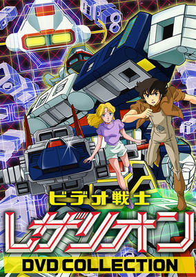

**Studio:** Toei Animation &nbsp;|&nbsp; **Director:** Kozo Morishita &nbsp;|&nbsp; **Aired/Released:** March 4 &nbsp;|&nbsp; **Genres:** Science Fiction, Mecha, Fantasy World, Super Robot, Robot, Virtual Reality, Action

> Takashi Katori is a big fan of online games, and so is his American friend Sarah. However, one of their RPGs goes too far, as their virtual world and the Lezarion robot that Takashi created for the game somehow mix with reality. Takashi is caught, but later the Earth Governement discovers that an evil scientist from the Moon (now a sort of abandoned colony with restricted access) is hacking into virtual worlds and security, so they force Takashi to pilot the Lezarion and, with Sarah's help, fight evil and protect the Earth.
>
> _Synopsis source: Kitsu_

[Wikipedia](https://en.wikipedia.org/wiki/Video_Warrior_Laserion) · [Kitsu](https://kitsu.io/anime/video-senshi-lezarion)

---

### Mirai Shōnen Conan Tokubetsu Hen-Kyodaiki Gigant no Fukkatsu

**Studio:** Nippon Animation &nbsp;|&nbsp; **Director:** Hayao Miyazaki &nbsp;|&nbsp; **Aired/Released:** March 11

[Wikipedia](https://en.wikipedia.org/wiki/Future_Boy_Conan)

---

### Nausicaä of the Valley of the Wind

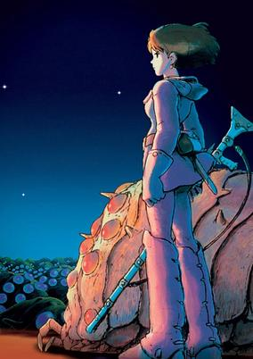

**Studio:** Top Craft , Tokuma Shoten , Hakuhodo &nbsp;|&nbsp; **Director:** Hayao Miyazaki &nbsp;|&nbsp; **Aired/Released:** March 11 &nbsp;|&nbsp; **Genres:** Fantasy, Science Fiction, Post Apocalypse, Adventure, Action, War, Future, Military

> A millennium has passed since the catastrophic nuclear war named the "Seven Days of Fire," which destroyed nearly all life on Earth. Humanity now lives in a constant struggle against the treacherous jungle that has evolved in response to the destruction caused by mankind. Filled with poisonous spores and enormous insects, the jungle spreads rapidly across the Earth and threatens to swallow the remnants of the human race. Away from the jungle exists a peaceful farming kingdom known as the "Valley of the Wind," whose placement by the sea frees it from the spread of the jungle's deadly toxins. The Valley's charismatic young princess, Nausicaä, finds her tranquil kingdom disturbed when an airship from the kingdom of Tolmekia crashes violently in the Valley. After Nausicaä and the citizens of the Valley find a sinister pulsating object in the wreckage, the Valley is suddenly invaded by the Tolmekian military, who intend to revive a dangerous weapon from the Seven Days of Fire. Now Nausicaä must fight to stop the Tolmekians from plunging the Earth into a cataclysm which humanity could never survive, while also protecting the Valley from the encroaching forces of the toxic jungle. [Written by MAL Rewrite]
>
> _Synopsis source: Kitsu_

[Wikipedia](https://en.wikipedia.org/wiki/Nausica%C3%A4_of_the_Valley_of_the_Wind_(film)) · [Kitsu](https://kitsu.io/anime/nausicaa-of-the-valley-of-the-wind)

---

### Ninja Hattori-kun + Perman: ESP Wars

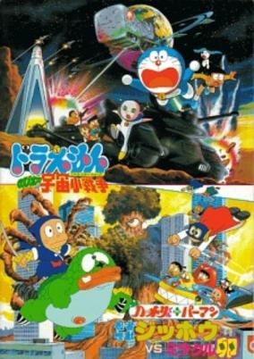

**Studio:** Shin-Ei Animation &nbsp;|&nbsp; **Director:** Masuji Harada &nbsp;|&nbsp; **Aired/Released:** March 17 &nbsp;|&nbsp; **Genres:** Comedy, Science Fiction, Super Power, Adventure, Martial Arts

> Crossover film featuring both of Motoo Abiko's work. Both casts gets wrapped up when an alien egg falls from the sky that becomes a monster seeking destruction of the Earth. It was screened as a double feature with Doraemon: Nobita no Little Star Wars.
>
> _Synopsis source: Kitsu_

[Wikipedia](https://en.wikipedia.org/wiki/Parman_(manga)) · [Kitsu](https://kitsu.io/anime/ninja-hattori-kun-plus-perman-ninja-kaijuu-jippou-tai-miracle-tamago)

---

### Doraemon: Nobita's Great Adventure into the Underworld

**Studio:** Shin-Ei Animation &nbsp;|&nbsp; **Director:** Tsutomu Shibayama &nbsp;|&nbsp; **Aired/Released:** March 17

---

### Gu Gu Ganmo

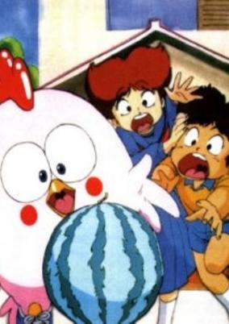

**Studio:** Toei Animation &nbsp;|&nbsp; **Director:** Yoshimichi Nitta &nbsp;|&nbsp; **Aired/Released:** March 18 &nbsp;|&nbsp; **Genres:** Japan, Earth, Elementary School, Comedy, Slapstick, School Life

> The series follows in the footsteps of manga such as Doraemon and Obake no Q-Taro in that the alien Ganmo (who resembles a chicken wearing sneakers) sets out to help his adopted human friend Hanpeita. The series follows the antics of the duo as they find themselves in the middle of much comedic mischief. One morning Tsukune Tsukuda, out of spite, lets her brother’s pet bird go. But later she has misgivings, and comes home with an egg she has found to give to her brother, Hapeita. Hanpeita isn’t all too pleased with the big, odd-looking egg. However, in the meantime it swells up, breaks its shell, and out comes a strange bird-like creature named Ganmo’. It speaks like a human being, and comes to live with the Tsukudas. Not wanting to be a mere freeloader, Ganmo takes the initiative to run errands, clean the house, etc…yet he blunders at everything he does. Ganmo the tries to clear his reputation, but his efforts only ends causing more and more confusion. One day a charming girl comes moving in the house next to the Tsukudas. Her pet is a stange mina, named Deja-vu. It is foppish but has a poisonous tongue. And it always teases Ganmo because of its odd-looking. Thus, the world around Ganmo gets into a mess more and more.
>
> _Synopsis source: Kitsu_

[Wikipedia](https://en.wikipedia.org/wiki/Gu_Gu_Ganmo) · [Kitsu](https://kitsu.io/anime/gu-gu-ganmo)

---

### Giant Gorg

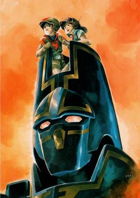

**Studio:** Nippon Sunrise &nbsp;|&nbsp; **Director:** Yoshikazu Yasuhiko &nbsp;|&nbsp; **Aired/Released:** April 5 &nbsp;|&nbsp; **Genres:** Science Fiction, Mecha, Adventure, Action, Plot Continuity

> Austral Island is located 2,000 km south from Samoa islands. The existence of the island was removed from the official records, and Tagami Yu made a journey to search for the reason. He sailed for the island with Dr. Waive who was his father's friend, Doris who is the daughter of Dr. Waive, and Captain who is the friend of Dr. Waive. On their way to the island, GAIL, the international conglomerate, and gangster, Cougar Connection lead by Lady Lynx attacked them. They managed to arrive at the island, but suddenly a mysterious monster began to attack them. When they became ready for death, a blue giant robot appeared. It destroyed the monster and saved them. Although it was an existence far beyond human knowledge, it reminded Yu of something warm and familiar. It was Giant Gorg which is called "Messenger of the God" by the inhabitants of the island. Escaping from the attack of GAIL's assault team, Gorg guided Yu into the underworld. There, he found alien's relic and an alien who woke up after 30,000 years' sleep.
>
> _Synopsis source: Kitsu_

[Wikipedia](https://en.wikipedia.org/wiki/Giant_Gorg) · [Kitsu](https://kitsu.io/anime/kyoshin-gorg)

---

### Showdown! The 7 Justice Supermen vs. The Space Samurais

**Studio:** Toei Animation &nbsp;|&nbsp; **Director:** Yasuo Yamayoshi &nbsp;|&nbsp; **Aired/Released:** April 7

[Wikipedia](https://en.wikipedia.org/wiki/List_of_Kinnikuman_films#Showdown!_The_7_Justice_Supermen_vs._The_Space_Samurais)

---

### Chikkun Takkun

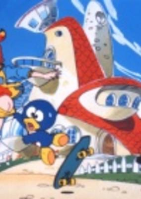

**Studio:** Studio Pierrot &nbsp;|&nbsp; **Director:** Hayakawa Keizi , Osamu Masami &nbsp;|&nbsp; **Aired/Released:** April 9 &nbsp;|&nbsp; **Genres:** Comedy, Science Fiction

> The "Waruchin Ceremony" has been stolen from All Star, a planet that exists in the outskirts of space. The computer that is built into it is programmed to make anything possible. The thief is actually the villain, Doctor Bell. Doctor Bell schemes to invade the other planets through the use of Waruchin. The prince of All Star, Prince Chikkun, together with his trusty advisor, the intellectual Takkun, decides to head towards Earth in pursuit of Doctor Bell.
>
> _Synopsis source: Kitsu_

[Wikipedia](https://en.wikipedia.org/wiki/Chikkun_Takkun) · [Kitsu](https://kitsu.io/anime/chikkun-takkun)

---

### Glass Mask

**Studio:** Eiken &nbsp;|&nbsp; **Director:** Gisaburō Sugii &nbsp;|&nbsp; **Aired/Released:** April 9

[Wikipedia](https://en.wikipedia.org/wiki/Glass_Mask)

---

### Attacker You!

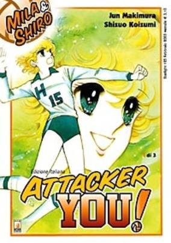

**Studio:** Knack Productions &nbsp;|&nbsp; **Director:** Kazuyuki Okaseko , Masari Sasahiro &nbsp;|&nbsp; **Aired/Released:** April 13 &nbsp;|&nbsp; **Genres:** Romance, Action, Sports, Volleyball

> Attacker You! is the story of ambitious and energetic 13-year-old junior high schoolgirl You Hazuki (variously known as "Mila," "Jeanne" or "Juana" in Western dubbed versions of the anime), who moves to Tokyo from Osaka to live with her father Toshihiko, a cameraman recently returned from Peru, and attend school. You's mother is not in the picture, having left when You was very young. Also living with You and her father is her younger brother Sunny, who is very attached to his older sister and tends to follow her everywhere she goes, including to school and to her volleyball matches. You is also curious about Kyushi Tajima, the pretty blonde woman whom she sees covering volleyball games on television, and about why her father becomes very angry whenever You mentions her. You is passionate about volleyball and dreams of one day being a part of Japan's national women's volleyball team in the 1988 Seoul Olympics. She joins her school's girls' volleyball team and quickly becomes one of the top players, although her coach (who is also her homeroom teacher) is brutal and literally slaps his players around when they don't live up to his expectations. You begins a tumultuous friendship with former school volleyball champ and former arch-rival Nami Hayase (French name: "Peggy"), which comes to a head when the two girls join opposing professional teams. She also develops a crush on So Takiki, the captain of the Hikawa boys' volleyball team (known as "Shiro," "Serge" or "Sergio" in various Western versions), and puts as much effort into trying to win his heart as she does into her game.
>
> _Synopsis source: Kitsu_

[Wikipedia](https://en.wikipedia.org/wiki/Attacker_You!) · [Kitsu](https://kitsu.io/anime/attacker-you)

---

### Witch Era (Locke the Superman)

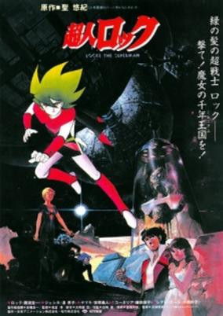

**Studio:** Nippon Animation &nbsp;|&nbsp; **Director:** Hiroshi Fukutomi &nbsp;|&nbsp; **Aired/Released:** April 14 &nbsp;|&nbsp; **Genres:** Science Fiction, Action, Future, Super Power

> A quiet, polite, lonely immortal esper about which little is known, he is called "Locke the Superman", but often denies being so. It is not known where or when he was born, and if asked, Locke will say he does not remember. It is entirely possible this is true. However, when asked by Cornelia Prim in "Millennium of the Witch" which star he was from, Locke replied "Toa." He has appeared at various times throughout the history of the galaxy, either as a direct influence, an indirect influence, or a simple observer. Using his esper abilities, Locke can learn and do most things more quickly than a normal human. His power also allows him to remain eternally young, or even turn himself into a child again to be adopted by kind-hearted families. It is speculated he remains youthful as an excuse not to take responsibility for whatever cause he is approached for, since no one expects youths to have such responsibilities.
>
> _Synopsis source: Kitsu_

[Wikipedia](https://en.wikipedia.org/wiki/Locke_the_Superman) · [Kitsu](https://kitsu.io/anime/choujin-locke)

---

### God Mazinger

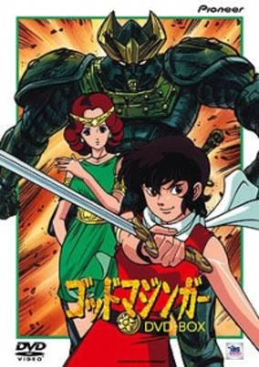

**Studio:** TMS Entertainment &nbsp;|&nbsp; **Director:** Yoshio Hayakawa &nbsp;|&nbsp; **Aired/Released:** April 15 &nbsp;|&nbsp; **Genres:** Action, Fantasy, Mecha, Fantasy World, Parallel Universe

> The story is set in modern times, but the twist to the story is that Mazinger is an ancient weapon of the gods, left on earth to battle the evil space gods who have returned to take over the universe.
>
> _Synopsis source: Kitsu_

[Wikipedia](https://en.wikipedia.org/wiki/God_Mazinger) · [Kitsu](https://kitsu.io/anime/god-mazinger)

---

### Super Dimension Cavalry Southern Cross (Super Dimensional Cavalry Southern Cross)

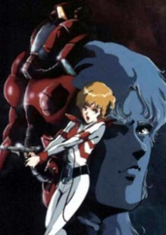

**Studio:** Tatsunoko &nbsp;|&nbsp; **Director:** Yasuo Hasegawa &nbsp;|&nbsp; **Aired/Released:** April 15 &nbsp;|&nbsp; **Genres:** Transforming Craft, Future, Piloted Robot, Science Fiction, Action, Mecha, Military

> By the year 2120, humans have successfully colonized other planets following the near devestation of Earth from the last great world war. However, on Gloire, one such colony are surprised and unprepared at the arrival of The Zor, a group of beings whom were the original inhabitants of the planet and left following similar near fatal events. Coming to reclaim their former home world, a relentless war erupts between both races that ultimately leads to a cataclysmic showdown and into a no-win scenario for either.
>
> _Synopsis source: Kitsu_

[Wikipedia](https://en.wikipedia.org/wiki/Super_Dimension_Cavalry_Southern_Cross) · [Kitsu](https://kitsu.io/anime/choujikuu-kidan-southern-cross)

---

### Persia, the Magic Fairy

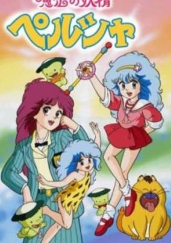

**Studio:** Studio Pierrot &nbsp;|&nbsp; **Director:** Kazuyoshi Katayama &nbsp;|&nbsp; **Aired/Released:** July 6 &nbsp;|&nbsp; **Genres:** Comedy, Magic, Magical Girl

> 11-year-old Persia has grown up alongside the animals on the Serengeti plains of Africa. Twins Riki and Gaku Muroi and their grandfather, Gouken, bring Persia to Japan with them, where she will live with a couple (who Persia calls Mama and Papa) that own a grocery store. During the flight to Japan, Persia finds herself in the "Lovely Dream" where she meets the Fairy Queen, who explains that the Lovely Dream is in danger and requests Persia's help. Giving Persia a magical headband (which can also summon a magical baton) that allows her to transform into a teenage girl, connecting her to the Lovely Dream and allowing her to use magic. She is sent with three kappa back into the regular world with the mission of collecting love energy to thaw the frozen Lovely Dream. If Persia fails her task of collecting love energy or if someone catches her using magic, Riki and Gaku will be transformed into women.
>
> _Synopsis source: Kitsu_

[Wikipedia](https://en.wikipedia.org/wiki/Persia,_the_Magic_Fairy) · [Kitsu](https://kitsu.io/anime/mahou-no-yousei-persia)

---

### Lensman: Secret of The Lens

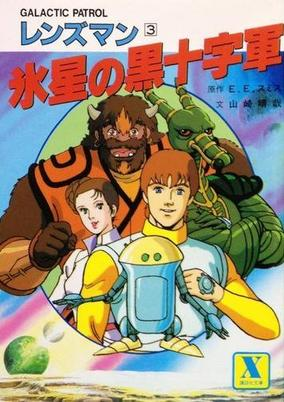

**Studio:** Madhouse , MK Productions &nbsp;|&nbsp; **Director:** Yoshiaki Kawajiri , Kazuyuki Hirokawa &nbsp;|&nbsp; **Aired/Released:** July 7 &nbsp;|&nbsp; **Genres:** Science Fiction, Action, Space Opera, Adventure

> The young Kimball Kinnison is leaving home for a wider education when a Galactic Patrol ship crashes on his family's land and the dying pilot gives him a mysterious Lens. Half-sentient, the Lens now implanted in his hand becomes the focus of changes in Kim's life including his father's death, a space battle, and an encounter with Galactic Patrol nursing officer Chris. Impelled by the Lens, he discovers a new world of experiences opening before him and he risks his life to save Chris and the Universe.
>
> _Synopsis source: Kitsu_

[Kitsu](https://kitsu.io/anime/galactic-patrol-lensman)

---

### Macross: Do You Remember Love?

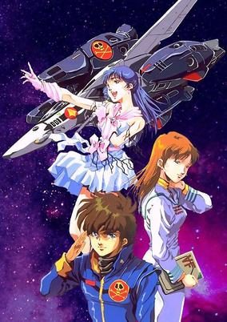

**Studio:** Studio Nue , Artland , Tatsunoko , Topcraft &nbsp;|&nbsp; **Director:** Shōji Kawamori , Noboru Ishiguro &nbsp;|&nbsp; **Aired/Released:** July 7 &nbsp;|&nbsp; **Genres:** Action, Violence, Transforming Craft, Mecha, Post Apocalypse, Space Opera, Piloted Robot, Science Fiction, Romance, Performance, Air Force, Love Polygon, Humanoid Alien, Shipboard, Alien, Future, Idol, Space, Military, Music

> A.D. 2009. The human race is in the middle of a three-way war with a race of giant humanoid aliens called the Zentraedi (male) and Meltrandi (female). After executing a space fold that sent it and part of South Atalia Island to the edge of the Solar System, the space fortress Macross is on its way back to Earth. During a small skirmish with Zentraedi forces, young pilot Hikaru Ichijo rescues idol singer Lynn Minmay and their relationship develops as they're stranded somewhere within the ship. But shortly after returning to Macross City, Minmay is captured by the Zentraedi, and Hikaru and female officer Misa Hayase end up back on Earth—only to view the aftermath of the destruction of their civilization. Only a song discovered eons ago—along with Minmay's voice—can determine the outcome of the war.
>
> _Synopsis source: Kitsu_

[Kitsu](https://kitsu.io/anime/macross-do-you-remember-love)

---

### Noozles

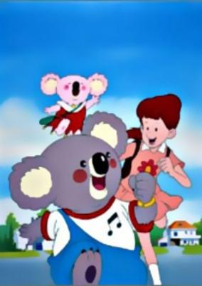

**Studio:** Nippon Animation &nbsp;|&nbsp; **Director:** Taku Sugiyama &nbsp;|&nbsp; **Aired/Released:** July 7 &nbsp;|&nbsp; **Genres:** Fantasy, Comedy, Adventure, Kids

> One day, Sandy's father, Prof. Brown, sends her a stuffed koala doll from one of his trips. Sandy discovers that, after rubbing the koala's nose, he comes alive. His name is Blinky and he is from the magical "down under" Koalawalla Land. They are soon joined by his little sister, Pinky. Adventures ensue in both Sandy's world and Koalawalla land. Among the characters met are 2 men after the "magical talking bear", a lizard that bounces back and forth from the magical realm and the real realm, and kangaroo police officers.
>
> _Synopsis source: Kitsu_

[Wikipedia](https://en.wikipedia.org/wiki/Noozles) · [Kitsu](https://kitsu.io/anime/fushigi-na-koala-blinky)

---

### The Kabocha Wine: Nita no Aijou Monogatari

**Studio:** Toei Animation &nbsp;|&nbsp; **Director:** Kimio Yabuki &nbsp;|&nbsp; **Aired/Released:** July 14

[Wikipedia](https://en.wikipedia.org/wiki/The_Kabocha_Wine)

---

### Kinnikuman

**Studio:** Toei Animation &nbsp;|&nbsp; **Director:** Takeshi Shirato &nbsp;|&nbsp; **Aired/Released:** July 14

[Wikipedia](https://en.wikipedia.org/wiki/Kinnikuman_(film))

---

### Cream Lemon

**Aired/Released:** August 11

[Wikipedia](https://en.wikipedia.org/wiki/Cream_Lemon)

---

### Bagi, the Monster of Mighty Nature (Baggy)

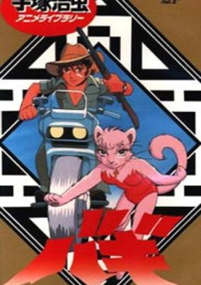

**Studio:** Tezuka Productions &nbsp;|&nbsp; **Director:** Osamu Tezuka &nbsp;|&nbsp; **Aired/Released:** August 19 &nbsp;|&nbsp; **Genres:** Romance, Science Fiction, Genetic Modification, Action, Anthropomorphism

> Ryo is sent out by the people of a village to kill the monster which has been attacking the villagers. It is rumored that this monster is a cat-woman named Bagi. As Ryo waits for the monster to come to its watering hole, he thinks back to how he first met Bagi as a kitten who learned how to write, and later reenters his life on a quest to discover who and what she really is. But now she has gone wild, and as the time of her arrival approaches, he strengthens his resolve to kill her.
>
> _Synopsis source: Kitsu_

[Wikipedia](https://en.wikipedia.org/wiki/Bagi,_the_Monster_of_Mighty_Nature) · [Kitsu](https://kitsu.io/anime/bagi-the-monster-of-mighty-nature)

---

### Nine 3: Final

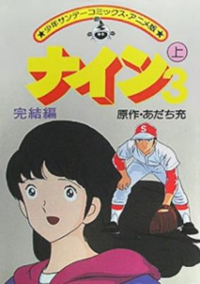

**Studio:** Group TAC &nbsp;|&nbsp; **Director:** Gisaburō Sugii &nbsp;|&nbsp; **Aired/Released:** September 5 &nbsp;|&nbsp; **Genres:** Action, Sports, Baseball, School Life

> Last part of the Nine TV movies.
>
> _Synopsis source: Kitsu_

[Kitsu](https://kitsu.io/anime/nine-3-kanketsuhen)

---

### Birth

**Studio:** Idol , Kaname Production &nbsp;|&nbsp; **Director:** Shinya Sadamitsu &nbsp;|&nbsp; **Aired/Released:** September 5

[Wikipedia](https://en.wikipedia.org/wiki/Birth_(anime))

---

### Futari Daka

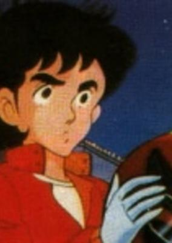

**Studio:** Kokusai Eiga-sha &nbsp;|&nbsp; **Director:** Tokizō Tsuchiya &nbsp;|&nbsp; **Aired/Released:** September 20 &nbsp;|&nbsp; **Genres:** Sports, Motorsport

> Two motor-bike crazy young men meet on a track one day. One almost kills the other and after a while, they discover that they have the same first name. Since they are both excellent at racing, they very quickly become rivals ... but their passion and firstname is not the only thing they have in common.
>
> _Synopsis source: Kitsu_

[Wikipedia](https://en.wikipedia.org/wiki/Futari_Daka) · [Kitsu](https://kitsu.io/anime/futari-daka)

---

### Adventures of the Little Koala (The Adventures of the Little Koala)

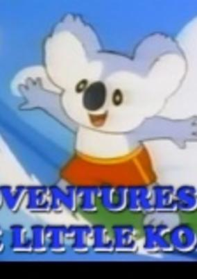

**Studio:** Topcraft &nbsp;|&nbsp; **Director:** Takashi Tanazawa &nbsp;|&nbsp; **Aired/Released:** October 4 &nbsp;|&nbsp; **Genres:** Earth, Comedy

> A little koala and his friends have adventures together and learn lessons about the world while having a lot of fun.
>
> _Synopsis source: Kitsu_

[Wikipedia](https://en.wikipedia.org/wiki/Adventures_of_the_Little_Koala) · [Kitsu](https://kitsu.io/anime/koala-boy-kokki)

---

### Fist of the North Star

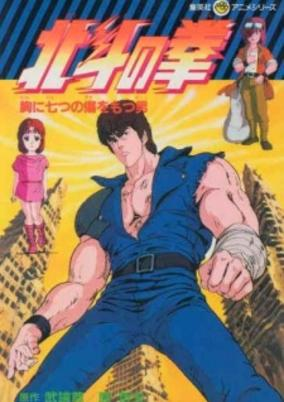

**Studio:** Toei Animation &nbsp;|&nbsp; **Director:** Toyoo Ashida &nbsp;|&nbsp; **Aired/Released:** October 4 &nbsp;|&nbsp; **Genres:** Post Apocalypse, Science Fiction, Action, Earth, Martial Arts, Drama, Future, Plot Continuity, Violence, Super Power

> In the year 19XX, after being betrayed and left for dead, bravehearted warrior Kenshirou wanders a post-apocalyptic wasteland on a quest to track down his rival, Shin, who has kidnapped his beloved fiancée Yuria. During his journey, Kenshirou makes use of his deadly fighting form, Hokuto Shinken, to defend the helpless from bloodthirsty ravagers. It isn't long before his exploits begin to attract the attention of greater enemies, like warlords and rival martial artists, and Keshirou finds himself involved with more than he originally bargained for. Faced with ever-increasing odds, the successor of Hokuto Shinken is forced to put his skills to the test in an effort to take back what he cares for most. And as these new challenges present themselves and the battle against injustice intensifies, namely his conflict with Shin and the rest of the Nanto Seiken school of martial arts, Kenshirou is gradually transformed into the savior of an irradiated and violent world. [Written by MAL Rewrite]
>
> _Synopsis source: Kitsu_

[Wikipedia](https://en.wikipedia.org/wiki/Fist_of_the_North_Star) · [Kitsu](https://kitsu.io/anime/hokuto-no-ken)

---

### Elves of the Forest

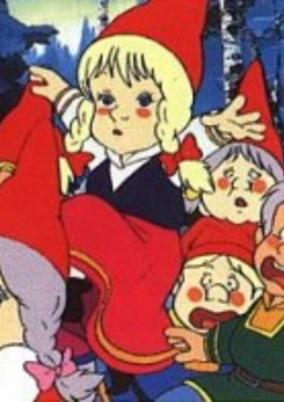

**Studio:** Zuiyo Enterprise , Shaft &nbsp;|&nbsp; **Director:** Masakazu Higuchi &nbsp;|&nbsp; **Aired/Released:** October 5 &nbsp;|&nbsp; **Genres:** Fantasy, Kids

> Deep in the forests of Finland live the little people, or Tontus, the elves who work all year round to keep Joulupukki (Santa Claus) supplied with toys for Christmas Eve.
>
> _Synopsis source: Kitsu_

[Wikipedia](https://en.wikipedia.org/wiki/Elves_of_the_Forest) · [Kitsu](https://kitsu.io/anime/mori-no-tonto-tachi)

---

### Panzer World Galient

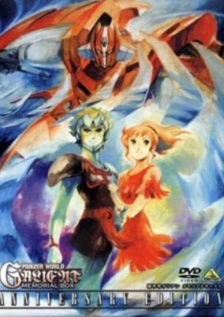

**Studio:** Nippon Sunrise &nbsp;|&nbsp; **Director:** Ryōsuke Takahashi &nbsp;|&nbsp; **Aired/Released:** October 5 &nbsp;|&nbsp; **Genres:** Piloted Robot, Science Fiction, Action, Mecha, Plot Continuity, Fantasy

> Set in a far flung medieval-looking world of Arst, Prince Jordy Volder takes up the fight against the ambitions of the conqueror Marder. Jordy uses the legendary giant robot "panzer" Galient, which is one of many panzers that have been preserved underground for thousands of years. Using an army of advanced robot panzers, Marder is conquering all of Arst in preparation of his plan for dominance of the Crescent Galaxy.
>
> _Synopsis source: Kitsu_

[Wikipedia](https://en.wikipedia.org/wiki/Panzer_World_Galient) · [Kitsu](https://kitsu.io/anime/panzer-world-galient)

---

### Choriki Robo Galatt

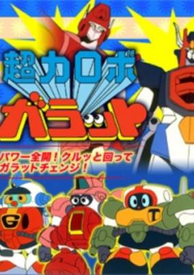

**Studio:** Nippon Sunrise &nbsp;|&nbsp; **Director:** Takeyuki Kanda , Osamu Sekita , Tetsuro Amino , Mamoru Hamazu , Hiroshi Negishi , Hideki Tonokatsu , Susumu Ishizaki , Shinya Sadamitsu &nbsp;|&nbsp; **Aired/Released:** October 5 &nbsp;|&nbsp; **Genres:** Science Fiction, Mecha, Action, Adventure, Comedy

> In a peaceful, disarmed world where small robots are utilized as housekeepers, villains act with huge robots instead of weapons. Dr. Keewee converts Michael’s robot into a transformable one in order to teach them a lesson. This is the birth of Galatt, the town hero.
>
> _Synopsis source: Kitsu_

[Wikipedia](https://en.wikipedia.org/wiki/Choriki_Robo_Galatt) · [Kitsu](https://kitsu.io/anime/chouriki-robo-galatt)

---

### Lensman

**Studio:** MK Productions &nbsp;|&nbsp; **Director:** Hiroshi Fukutomi &nbsp;|&nbsp; **Aired/Released:** October 6

[Wikipedia](https://en.wikipedia.org/wiki/Lensman_(anime))

---

### Bismark

**Studio:** Studio Pierrot &nbsp;|&nbsp; **Director:** Masami Anno &nbsp;|&nbsp; **Aired/Released:** October 7

[Wikipedia](https://en.wikipedia.org/wiki/Bismark_(anime))

---

### Cat's Eye

**Studio:** Tokyo Movie Shinsha &nbsp;|&nbsp; **Director:** Kenji Kodama &nbsp;|&nbsp; **Aired/Released:** October 8 &nbsp;|&nbsp; **Genres:** Detective, Present, Earth, Japan, Asia, Action, Thievery, Adventure, Comedy, Romance, Crime, Mystery

> The three Kisugi sisters—Rui, Hitomi and Ai—during the day run a small cafe called "Cat's Eye." To discover the whereabouts of their father, the artist Michael Heintz, who has disappeared, Hitomi and her sisters rob art galleries as the smart and mysterious thief "Cat's Eye" in the hope that his works can give them clues about his vanishing. The crucial point is that Hitomi has a relationship with Toshi, a police inspector who has sworn to catch "Cat's Eye"—and of course he has no idea about Hitomi's double life.
>
> _Synopsis source: Kitsu_

[Wikipedia](https://en.wikipedia.org/wiki/Cat%27s_Eye_(manga)) · [Kitsu](https://kitsu.io/anime/cat-s-eye)

---

### Taotao

**Studio:** Mushi Production , Studio Cosmos &nbsp;|&nbsp; **Director:** Shuichi Nakahara , Tatsuo Shimamura &nbsp;|&nbsp; **Aired/Released:** October 9

[Wikipedia](https://en.wikipedia.org/wiki/Taotao_(anime))

---

### Eien no Once More (Magical Angel Creamy Mami)

**Studio:** Studio Pierrot &nbsp;|&nbsp; **Director:** Osamu Kobayashi , Mochizuki Tomomichi &nbsp;|&nbsp; **Aired/Released:** October 28 &nbsp;|&nbsp; **Genres:** Fantasy, Japan, Elementary School, Comedy, Love Polygon, Magic, Alien, Idol, Slapstick, Magical Girl, Present, Super Power, Science Fiction, Romance, School Life

> Creamy Mami is about a young girl, Yuu, who after seeing a spaceship is given the power to use magic for one year. She is also given 2 cats, Poji and Nega, to watch over and guide her. Using her magic powers to transform into the idol Creamy Mami, Yuu must work hard at acting, singing, helping her parents at their crepe shop, fighting aliens and bad guys, going to school, plus try to get the affections of her childhood friend Toshio.
>
> _Synopsis source: Kitsu_

[Wikipedia](https://en.wikipedia.org/wiki/Creamy_Mami,_the_Magic_Angel) · [Kitsu](https://kitsu.io/anime/mahou-no-tenshi-creamy-mami)

---

### Kachua Kara no Tayori

**Studio:** Nippon Sunrise &nbsp;|&nbsp; **Director:** Takeyuki Kanda &nbsp;|&nbsp; **Aired/Released:** October 28

[Wikipedia](https://en.wikipedia.org/wiki/Ginga_Hy%C5%8Dry%C5%AB_Vifam)

---

### Sherlock Hound

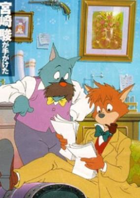

**Studio:** Tokyo Movie Shinsha , RAI &nbsp;|&nbsp; **Director:** Kyosuke Mikuriya , Hayao Miyazaki &nbsp;|&nbsp; **Aired/Released:** November 6 &nbsp;|&nbsp; **Genres:** Earth, United Kingdom, Adventure, Steampunk, Comedy, Europe, Detective, Anthropomorphism, Past, Law And Order, Cops, Mystery

> Loosely based on the "Sherlock Holmes" series by Sir Arthur Conan Doyle, Sherlock Hound turns all the classic characters into dogs. The canine Sherlock Holmes, his assistant Watson, and housemaid Mrs. Hudson work together to solve mysteries. The culprit is usually Professor Moriarty and his gang, who use all kinds of wacky contraptions to steal what they want.
>
> _Synopsis source: Kitsu_

[Wikipedia](https://en.wikipedia.org/wiki/Sherlock_Hound) · [Kitsu](https://kitsu.io/anime/meitantei-holmes)

---

### Lolita Anime

**Studio:** Nikkatsu Video &nbsp;|&nbsp; **Director:** Aki Uchiyama &nbsp;|&nbsp; **Aired/Released:** December 15

---

### Atsumatta 13-nin

**Studio:** Nippon Sunrise &nbsp;|&nbsp; **Director:** Takeyuki Kanda &nbsp;|&nbsp; **Aired/Released:** December 21

[Wikipedia](https://en.wikipedia.org/wiki/Ginga_Hy%C5%8Dry%C5%AB_Vifam)

---

### Dr. Slump and Arale-chan: Hoyoyo! The Treasure of Nanaba Castle

**Studio:** Toei Animation &nbsp;|&nbsp; **Director:** Hiroki Shibata &nbsp;|&nbsp; **Aired/Released:** December 22

[Wikipedia](https://en.wikipedia.org/wiki/Dr._Slump)

---

### Great Riot! Seigi Choujin

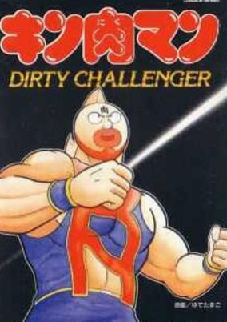

**Studio:** Toei Animation &nbsp;|&nbsp; **Director:** Takeshi Shirato &nbsp;|&nbsp; **Aired/Released:** December 22 &nbsp;|&nbsp; **Genres:** Science Fiction, Action, Sports, Comedy, Martial Arts

[Wikipedia](https://en.wikipedia.org/wiki/Great_Riot!_Seigi_Choujin) · [Kitsu](https://kitsu.io/anime/kinnikuman-daiabare-segi-choujin)

---

### Once Upon a Time... Space (as Galaxy Patrol PJ )

**Studio:** Eiken

[Wikipedia](https://en.wikipedia.org/wiki/Once_Upon_a_Time..._Space)

---
