# 1985 in Anime

[← Back to index](../README.md)

61 titles · 54 with a matched synopsis/cover art · [source](https://en.wikipedia.org/wiki/1985_in_anime)

## Releases

### Princess Sarah (A Little Princess Sara)

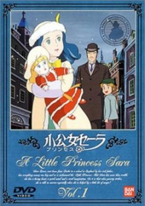

**Studio:** Nippon Animation , Aniplex &nbsp;|&nbsp; **Director:** Fumio Kurokawa &nbsp;|&nbsp; **Aired/Released:** January 6 &nbsp;|&nbsp; **Genres:** United Kingdom, Earth, Slice of Life, Europe, Coming Of Age, All Girls School, Drama, Past, Plot Continuity, Historical

> Sara, a pretty girl born into a rich British family in India, is treated like a little princess at a dormitory school in London. Sara's sweet school life turns to tragedy when she learns of her father's death and the family's bankruptcy. However, Sara endures her hard luck with kindness and imagination and escapes from her misery through fantasies.
>
> _Synopsis source: Kitsu_

[Wikipedia](https://en.wikipedia.org/wiki/Princess_Sarah) · [Kitsu](https://kitsu.io/anime/princess-sara)

---

### Urusei Yatsura 3: Remember My Love

**Studio:** Studio Deen &nbsp;|&nbsp; **Director:** Kazuo Yamazaki &nbsp;|&nbsp; **Aired/Released:** January 26

[Wikipedia](https://en.wikipedia.org/wiki/Urusei_Yatsura_(film_series)#Remember_My_Love)

---

### Area 88

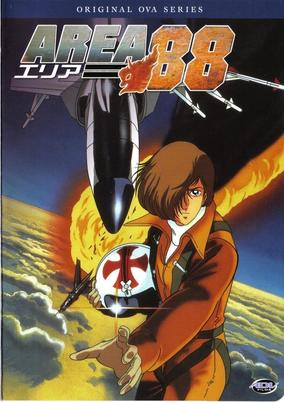

**Studio:** Studio Pierrot &nbsp;|&nbsp; **Director:** Hisayuki Toriumi &nbsp;|&nbsp; **Aired/Released:** February 5 &nbsp;|&nbsp; **Genres:** Action, Air Force, Present, Military, Adventure, Romance

> Shin Kazama, tricked and forced into flying for the remote country of Aslan, can only escape the hell of war by earning money for shooting down enemy planes or die trying. Through the course of the series, Shin must deal with the consequences of killing and friends dying around him as tries to keep his mind on freeing himself from this nightmare.
>
> _Synopsis source: Kitsu_

[Wikipedia](https://en.wikipedia.org/wiki/Area_88) · [Kitsu](https://kitsu.io/anime/area-88)

---

### Kieta 12-nin (Night on the Galactic Railroad)

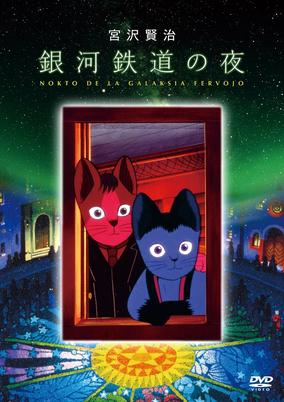

**Studio:** Nippon Sunrise &nbsp;|&nbsp; **Director:** Takeyuki Kanda &nbsp;|&nbsp; **Aired/Released:** February 25 &nbsp;|&nbsp; **Genres:** Past, Historical, Plot Continuity, Parallel Universe, Fantasy, Adventure, Anthropomorphism, Drama, Coming Of Age, Mystery

> Based on a short story by the popular children's writer Kenji Miyazawa, Galactic Railroad offers viewers a slow-paced, dreamlike journey through space and time. When Giovanni, a lonely boy in a hill town, goes to get milk for his ailing mother, he finds himself crossing the Milky Way on a faster-than-light steam railroad. The stations he visits in various constellations, like the planets explored by St. Exupery's Little Prince, offer curious adventures and an assortment of human "types." Reality and fantasy blur aboard the train, and its travels across the light-years sometimes suggests the journey through life. The characters are depicted as cats, presumably to avoid the problems of animating humans.
>
> _Synopsis source: Kitsu_

[Wikipedia](https://en.wikipedia.org/wiki/Ginga_Hy%C5%8Dry%C5%AB_Vifam) · [Kitsu](https://kitsu.io/anime/night-on-the-galactic-railroad)

---

### Leda: The Fantastic Adventure of Yohko (Fantastic Adventure Of Yohko: Leda)

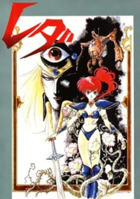

**Studio:** Kaname Production , Toho &nbsp;|&nbsp; **Director:** Kunihiko Yuyama &nbsp;|&nbsp; **Aired/Released:** March 1 &nbsp;|&nbsp; **Genres:** Transforming Craft, Fantasy, Science Fiction, Mecha, Fantasy World, Adventure, Piloted Robot, Magic, Android, Alternative Present, Parallel Universe, Present, Action

> Asagiri Yohko is an ordinary high school student, and she is in love with a boy who does not know it. To help things along, she has written a song to explain how she feels but that song has quite a bit more than a couple of good bridges. Yohko learns that while she is listening to her song, she is transported to Earth's other-dimensional sister world "Ashanti." This song has the potential to open a gateway between Earth and Ashanti wide enough for a conquering force to invade and take over. And it is exactly why it was forbidden eons ago by the legendary warrior Leda who saw this coming. This Leda warrior's duty now falls to Yohko and some newfound friends to stop the onslaught and return the 2 worlds in balance. Maybe Yohko is not so ordinary after all.
>
> _Synopsis source: Kitsu_

[Kitsu](https://kitsu.io/anime/genmu-senki-leda)

---

### Mobile Suit Zeta Gundam

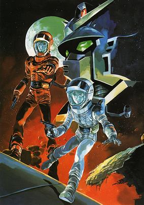

**Studio:** Nippon Sunrise &nbsp;|&nbsp; **Director:** Yoshiyuki Tomino &nbsp;|&nbsp; **Aired/Released:** March 2 &nbsp;|&nbsp; **Genres:** Romance, Space Travel, Transforming Craft, Science Fiction, Mecha, Action, Space Opera, Piloted Robot, Human Enhancement, Angst, War, Future, Plot Continuity, Violence, Military, Space

> It is Universal Century 0087, and the One Year War between the Earth Federation and Principality of Zeon is over. The Earth Federation has created an elite task force, known as the Titans, who are responsible for hunting the remaining Zeon forces. However, the power-hungry Titans have shown themselves to be no better than Zeon, spurring the creation of a rebellious faction called the Anti-Earth Union Group (AEUG). 17-year-old Kamille Bidan lives in the colony Green Noa, home to a Titan base. Kamille gets in trouble after assaulting a Titan officer, an event that coincides with an attack led by former Zeon ace Char Aznable, now known as AEUG pilot Quattro Bajeena. When Kamille steals a Titan's prototype Gundam, he soon finds himself in the middle of the dangerous conflict. [Written by MAL Rewrite]
>
> _Synopsis source: Kitsu_

[Wikipedia](https://en.wikipedia.org/wiki/Mobile_Suit_Zeta_Gundam) · [Kitsu](https://kitsu.io/anime/mobile-suit-zeta-gundam)

---

### Megazone 23 - Part I (Megazone 23)

**Studio:** AIC , Artland , Tatsunoko &nbsp;|&nbsp; **Director:** Noboru Ishiguro &nbsp;|&nbsp; **Aired/Released:** March 9 &nbsp;|&nbsp; **Genres:** Science Fiction, Mecha, Action, Future, Earth, Piloted Robot, Conspiracy, Transforming Craft, Cyberpunk, Virtual Reality, Music, Romance, Mystery

> Shougo Yahagi is a young motorcycle enthusiast living in a world of hot bikes, hard rock, and J-pop idols. The general populace go about their lives in peace, under the watchful eyes of a computer program in the guise of pop idol sensation Eve, unbeknownst to them. Shougo himself is mostly concerned with riding his motorcycle and picking up beautiful women like Yui Takanaka, who aspires to be a dancer. Shougo's life suddenly changes when his friend, Shinji Nakagawa, shows him a top-secret project: the "Garland," an advanced motorcycle that can transform into a robot. Ambushed by the military, Shougo hijacks the Garland and escapes into the city. Evading the military with the help of Yui and her friends, he gradually discovers that their idyllic society is only an illusion. [Written by MAL Rewrite]
>
> _Synopsis source: Kitsu_

[Wikipedia](https://en.wikipedia.org/wiki/Megazone_23) · [Kitsu](https://kitsu.io/anime/megazone-23)

---

### Arei no Kagami (Arei's Mirror ~ Way to the Virgin Space)

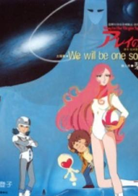

**Studio:** Toei Animation &nbsp;|&nbsp; **Director:** Kozo Morishita &nbsp;|&nbsp; **Aired/Released:** March 16 &nbsp;|&nbsp; **Genres:** Space Travel, Science Fiction, Adventure, Android, Space, Action

> The story follows Daichi Meguru and Mayu, a young boy and a pilot, as they flee their war torn planet and into space. Upon their ship a stowaway android named Zero joins their quest as they travel through Halley's Mirror.
>
> _Synopsis source: Kitsu_

[Wikipedia](https://en.wikipedia.org/wiki/Arei_no_Kagami) · [Kitsu](https://kitsu.io/anime/arei-no-kagami)

---

### The Dagger of Kamui

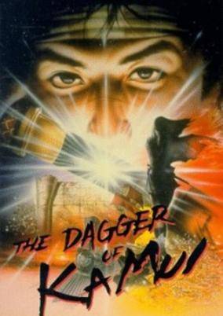

**Studio:** Madhouse &nbsp;|&nbsp; **Director:** Rintaro &nbsp;|&nbsp; **Aired/Released:** March 16 &nbsp;|&nbsp; **Genres:** Ninja, Adventure, Action, Japan, Asia, Earth, United States, Americas, Historical, Fantasy

> A young boy named Jiro finds his mother and sister murdered in his home. Falsely accused of the crime, he flees from his village and meets a priest named Tenkai, who has him kill a rogue ninja named Tarouza. After fulfilling that task, Jiro undergoes training to become a master assassin. Many years later, Jiro finds out that he was an orphan and his real father was Tarouza, who had worked for Tenkai until he aborted his mission when he fell in love with an Ainu woman. The young ninja discovers that the Shogunate was to retrieve the lost treasure of Captain Kidd and use it to once again isolate Japan from the rest of the world. Using the clues that Tarouza had kept secret, Jiro—along with the female ninja Oyuki and a slave named Sam—travels to Russia and America to search for the treasure in hopes of using it to extract revenge from Tenkai.
>
> _Synopsis source: Kitsu_

[Wikipedia](https://en.wikipedia.org/wiki/The_Dagger_of_Kamui) · [Kitsu](https://kitsu.io/anime/kamui-no-ken)

---

### Doraemon: Nobita's Little Star Wars (Doraemon the Movie: Nobita's Little Space War)

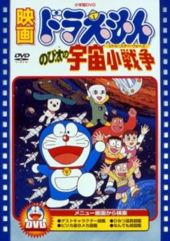

**Studio:** Shin-Ei Animation &nbsp;|&nbsp; **Director:** Tsutomu Shibayama &nbsp;|&nbsp; **Aired/Released:** March 16 &nbsp;|&nbsp; **Genres:** Space, Fantasy, Space Battles, Space Travel, Shipboard, Future, Alien, Humanoid Alien, Kids, Robot Helper, Robot

> Papi, the tiny president of a faraway planet, escapes to Earth to avoid being captured by the military forces that took over. Despite being welcomed by Doraemon, Nobita and their friends, the little alien notices that his enemies have also reached this world and doesn't want to get his human friends involved in this war. Doraemon, Nobita, Gian, Suneo, and Shizuka start a big adventure as they try to hide and protect Papi.
>
> _Synopsis source: Kitsu_

[Kitsu](https://kitsu.io/anime/doraemon-nobita-s-little-star-wars)

---

### GU GU Ganmo

**Studio:** Toei Animation &nbsp;|&nbsp; **Aired/Released:** March 16 &nbsp;|&nbsp; **Genres:** Japan, Earth, Elementary School, Comedy, Slapstick, School Life

> The series follows in the footsteps of manga such as Doraemon and Obake no Q-Taro in that the alien Ganmo (who resembles a chicken wearing sneakers) sets out to help his adopted human friend Hanpeita. The series follows the antics of the duo as they find themselves in the middle of much comedic mischief. One morning Tsukune Tsukuda, out of spite, lets her brother’s pet bird go. But later she has misgivings, and comes home with an egg she has found to give to her brother, Hapeita. Hanpeita isn’t all too pleased with the big, odd-looking egg. However, in the meantime it swells up, breaks its shell, and out comes a strange bird-like creature named Ganmo’. It speaks like a human being, and comes to live with the Tsukudas. Not wanting to be a mere freeloader, Ganmo takes the initiative to run errands, clean the house, etc…yet he blunders at everything he does. Ganmo the tries to clear his reputation, but his efforts only ends causing more and more confusion. One day a charming girl comes moving in the house next to the Tsukudas. Her pet is a stange mina, named Deja-vu. It is foppish but has a poisonous tongue. And it always teases Ganmo because of its odd-looking. Thus, the world around Ganmo gets into a mess more and more.
>
> _Synopsis source: Kitsu_

[Wikipedia](https://en.wikipedia.org/wiki/Gu_Gu_Ganmo) · [Kitsu](https://kitsu.io/anime/gu-gu-ganmo)

---

### Little Memole (A Little Princess Sara)

**Studio:** Toei Animation &nbsp;|&nbsp; **Aired/Released:** March 16 &nbsp;|&nbsp; **Genres:** All Girls School, Past, Earth, Historical, Plot Continuity, United Kingdom, Europe, Slice of Life, Drama, Coming Of Age

> Sara, a pretty girl born into a rich British family in India, is treated like a little princess at a dormitory school in London. Sara's sweet school life turns to tragedy when she learns of her father's death and the family's bankruptcy. However, Sara endures her hard luck with kindness and imagination and escapes from her misery through fantasies.
>
> _Synopsis source: Kitsu_

[Wikipedia](https://en.wikipedia.org/wiki/Little_Memole) · [Kitsu](https://kitsu.io/anime/princess-sara)

---

### Ninja Hattori-kun + Perman: Ninja Beast Jippō vs. Miracle Egg

**Studio:** Shin-Ei Animation &nbsp;|&nbsp; **Director:** Masuji Harada &nbsp;|&nbsp; **Aired/Released:** March 16 &nbsp;|&nbsp; **Genres:** Comedy, Science Fiction, Super Power, Adventure, Martial Arts

> Crossover film featuring both of Motoo Abiko's work. Both casts gets wrapped up when an alien egg falls from the sky that becomes a monster seeking destruction of the Earth. It was screened as a double feature with Doraemon: Nobita no Little Star Wars.
>
> _Synopsis source: Kitsu_

[Wikipedia](https://en.wikipedia.org/wiki/Parman_(manga)) · [Kitsu](https://kitsu.io/anime/ninja-hattori-kun-plus-perman-ninja-kaijuu-jippou-tai-miracle-tamago)

---

### Seigi Choujin vs. Ancient Choujin

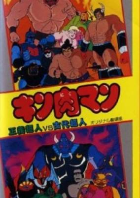

**Studio:** Toei Animation &nbsp;|&nbsp; **Director:** Yasuo Yamayoshi &nbsp;|&nbsp; **Aired/Released:** March 16 &nbsp;|&nbsp; **Genres:** Wrestling, Science Fiction, Earth, Action, Combat, Sports, Comedy, Martial Arts

> While Kinnikuman is on vacation with Mari-san's kindergarten class at Easter Island, the young wheelchair-bound Kouichi-kun laments being with an idiot like Kinnikuman, preferring to instead be with his favorite Seigi Choujin Buffaloman. Meanwhile, the other Seigi Choujins are also vacationing at ancient landmarks.
>
> _Synopsis source: Kitsu_

[Wikipedia](https://en.wikipedia.org/wiki/Seigi_Choujin_vs._Ancient_Choujin) · [Kitsu](https://kitsu.io/anime/kinnikuman-seigi-choujin-vs-kodai-choujin)

---

### Touch

**Studio:** Group TAC , Studio Gallop &nbsp;|&nbsp; **Director:** Hiroko Tokita &nbsp;|&nbsp; **Aired/Released:** March 24

[Wikipedia](https://en.wikipedia.org/wiki/Touch_(manga))

---

### Lovely Serenade

**Studio:** Studio Pierrot &nbsp;|&nbsp; **Director:** Mochizuki Tomomichi &nbsp;|&nbsp; **Aired/Released:** March 28

[Wikipedia](https://en.wikipedia.org/wiki/Creamy_Mami,_the_Magic_Angel)

---

### Dancouga – Super Beast Machine God (Super Bestial Machine God Dancougar)

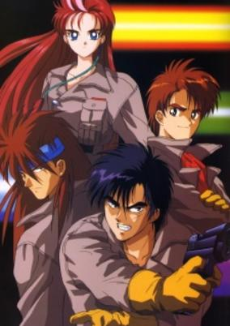

**Studio:** Ashi Productions &nbsp;|&nbsp; **Director:** Seiji Okuda &nbsp;|&nbsp; **Aired/Released:** April 4 &nbsp;|&nbsp; **Genres:** Science Fiction, Mecha, Earth, Action, Super Robot, Piloted Robot, Future, Robot

> Emperor Muge Zarbados and his Empire of Death decide that their next conquest will be the faraway planet of Earth. Muge becomes even more fearsome because of Shapiro Keats, a power-hungry Earthling-turned-traitor. It's up to Shinobu, Sara (Shapiro's old girldfriend), Masato, and Ryo of the Jyusenkitai/Cyber Beast Force to pilot the four Jyusenki/Beast Mecha (Eagle Fighter, Land Cougar, Land Liger, and Big Moth [a mammoth mecha]), which can combine into the giant mech Dancougar.
>
> _Synopsis source: Kitsu_

[Wikipedia](https://en.wikipedia.org/wiki/Dancouga_%E2%80%93_Super_Beast_Machine_God) · [Kitsu](https://kitsu.io/anime/choujuu-kishin-dancougar)

---

### Musashi no Ken

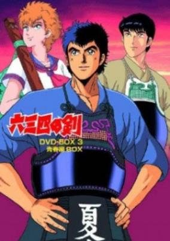

**Studio:** Eiken &nbsp;|&nbsp; **Director:** Toshitaka Tsunoda &nbsp;|&nbsp; **Aired/Released:** April 18 &nbsp;|&nbsp; **Genres:** Earth, Japan, Asia, Combat, Swordplay, Coming Of Age, Drama, Plot Continuity, Present, Sports

> Musashi no Ken is the story of a boy named Musashi who aims to be the Kendo champion. Part of the anime is him as a child, and part is of him as an adult.
>
> _Synopsis source: Kitsu_

[Wikipedia](https://en.wikipedia.org/wiki/Musashi_no_Ken) · [Kitsu](https://kitsu.io/anime/musashi-no-ken)

---

### The Time Étranger (Time Stranger)

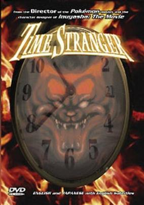

**Studio:** Ashi Productions &nbsp;|&nbsp; **Director:** Kunihiko Yuyama &nbsp;|&nbsp; **Aired/Released:** April 27 &nbsp;|&nbsp; **Genres:** Future, Fantasy World, Other Planet, Violence, Action, Angst, Science Fiction, Dystopia, Drama

> Remy Shimoda is in a hurry. She's on her way to a reunion with the other members of the Go Shogun team, and she's late. A police action with some robbers gets in her way, so she runs the robbers off the road. Her vision blurs and she gets into an accident. The movie splits into two with one plot following Remy's slow decline at the hospital with the Go Shogun members and former enemies at her side, and her experience in a strange city where she, and the rest of the team have their deaths foretold. Remy, herself, is plagued by visions of her death, and visitations from a threatening girl and her panther-like cat. The temple at the center of the city is the key, so the team sets out to battle their way into it. Based on the giant robot series "Go Shogun", this is a story focusing on Remy, the female member of the team.
>
> _Synopsis source: Kitsu_

[Wikipedia](https://en.wikipedia.org/wiki/GoShogun) · [Kitsu](https://kitsu.io/anime/sengoku-majin-goushougun-toki-no-etranger)

---

### Long Goodbye

**Studio:** Studio Pierrot &nbsp;|&nbsp; **Aired/Released:** March 28

[Wikipedia](https://en.wikipedia.org/wiki/Creamy_Mami,_the_Magic_Angel)

---

### Shin Obake no Q-tarō

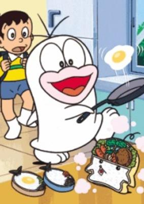

**Studio:** Shin-Ei Animation &nbsp;|&nbsp; **Aired/Released:** April 1 &nbsp;|&nbsp; **Genres:** Fantasy, Comedy, Slice of Life, School Life, Kids

> Sequel of Shin Obake no Q-tarou.
>
> _Synopsis source: Kitsu_

[Wikipedia](https://en.wikipedia.org/wiki/Obake_no_Q-tar%C5%8D) · [Kitsu](https://kitsu.io/anime/obake-no-q-taro-1985)

---

### Onegai! Samia-don

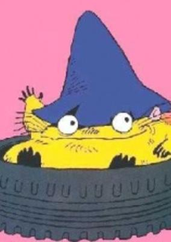

**Studio:** Tōkyō Movie Shinsha &nbsp;|&nbsp; **Director:** Osamu Kobayashi &nbsp;|&nbsp; **Aired/Released:** April 2 &nbsp;|&nbsp; **Genres:** Earth, Contemporary Fantasy, Slice of Life, Comedy, Present, Magic, Fantasy, Kids

> In england, in the mid-80s, three kids encouter the last genie of the sands, who can grant one, and only one wish per day. But the magic does not last, at the sunset, everything disappears. Each episode follows a typical day where the three kids are wishing for every kind of wacky stuff that usually ends in a mess at the end.
>
> _Synopsis source: Kitsu_

[Wikipedia](https://en.wikipedia.org/wiki/Onegai!_Samia-don) · [Kitsu](https://kitsu.io/anime/onegai-samia-don)

---

### Bumpety Boo

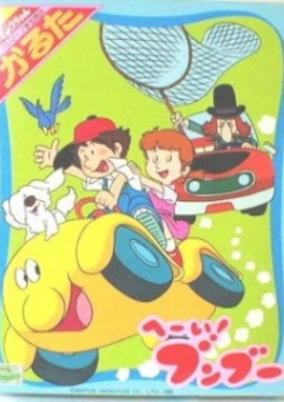

**Studio:** Nippon Animation &nbsp;|&nbsp; **Aired/Released:** April 8 &nbsp;|&nbsp; **Genres:** Adventure, Comedy, Motorsport, Kids

> Bumboo is a very strange car-like creature with a cute yellow body. He was born from a mysterious egg at an automobile factory. Having heard the first cries of a newborn baby, a boy named Ken comes to the factory and meets Bumboo. They soon become good friends and set out on their exciting journey. Traveling the world with his four-wheeled friend and Mister the dog, Ken faces big trouble from Doctor Monkey—who wants to get Bumboo into his own hands—but finds thrills and excitement around every corner.
>
> _Synopsis source: Kitsu_

[Wikipedia](https://en.wikipedia.org/wiki/Bumpety_Boo) · [Kitsu](https://kitsu.io/anime/hey-bumboo)

---

### Honō no Alpen Rose: Judy & Randy (Alpenrose)

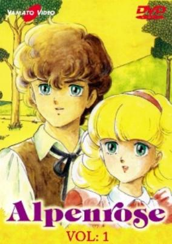

**Studio:** Tatsunoko &nbsp;|&nbsp; **Director:** Hideto Ueda &nbsp;|&nbsp; **Aired/Released:** April 8 &nbsp;|&nbsp; **Genres:** Romance, World War II, Earth, Europe, Past, Historical

> While Randy was walking through the Swiss countryside he finds a small girl, who seemed to be the only survived person from an airplane crash. The little girl didn’t remember anything, and Randy decided to take care of her and he called her Judy. The both go their childhood together. A few years later, Judy, now 16 years old, wants to find her past. With the help of Randy, she leaves to research her origins. Her single clue is a song that she keeps hearing in her head, the song is called Alpine Rose. At a time of world war, these two young people will have to overcome many obstacles to arrive at their goal in this time of war, with having only each other to comfort and support. the depth of their love. (Source : ANN)
>
> _Synopsis source: Kitsu_

[Wikipedia](https://en.wikipedia.org/wiki/Alpen_Rose) · [Kitsu](https://kitsu.io/anime/honoo-no-alpen-rose-judy-randy)

---

### Lunn Flies into the Wind

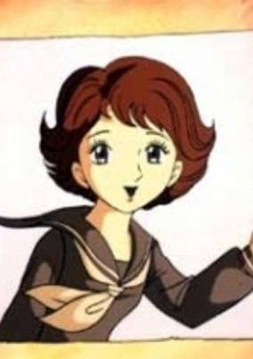

**Studio:** Tezuka Productions &nbsp;|&nbsp; **Director:** Osama Tezuka &nbsp;|&nbsp; **Aired/Released:** April 13 &nbsp;|&nbsp; **Genres:** Romance, Japan, Present

> This is the third episode in the Lion Books Series, in which a boy who has fallen in love with a girl on a poster on the wall starts to look for her. This story depicts the heartache of adolescent first love in a low-key manner.
>
> _Synopsis source: Kitsu_

[Wikipedia](https://en.wikipedia.org/wiki/Lunn_Flies_into_the_Wind) · [Kitsu](https://kitsu.io/anime/lunn-wa-kaze-no-naka)

---

### Magical Emi, the Magic Star

**Studio:** Studio Pierrot &nbsp;|&nbsp; **Director:** Takashi Anno &nbsp;|&nbsp; **Aired/Released:** June 7 &nbsp;|&nbsp; **Genres:** Slice of Life, Magic, Magical Girl, Japan, Present, Comedy

> Kozuki Mai is an elementary student who wants to be a magician and perform in her family's "Magicarat" magical act; however, she is too young, and her magic skills are not very good. Then one day, she encounters a ball of light that was put into a stuffed doll of flying squirrel, bringing it to life and somehow giving her the power to turn in to the 18-year-old magician "Magical Emi." As Emi, Mai was able to join the magic act. But she must keep her identity a secret from her family and from her crush.
>
> _Synopsis source: Kitsu_

[Wikipedia](https://en.wikipedia.org/wiki/Magical_Emi,_the_Magic_Star) · [Kitsu](https://kitsu.io/anime/mahou-no-star-magical-emi)

---

### Dream Hunter Rem

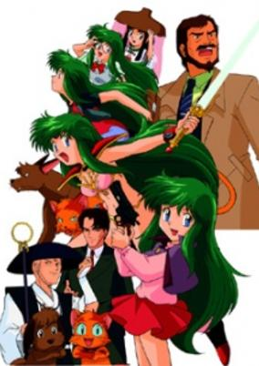

**Studio:** Sai Enterprise , Zain &nbsp;|&nbsp; **Director:** Seiji Okuda &nbsp;|&nbsp; **Aired/Released:** June 10 &nbsp;|&nbsp; **Genres:** Action, Japan, Fantasy, Earth, Asia, Comedy, Contemporary Fantasy, Magic, Horror, Parallel Universe, Violence, Demon, Super Power, Ecchi

> Rem is an ordinary woman in our world but, in the world of dreams, she becomes a dream warrior, defending humanity from the evils there. When dream demons reach the waking world, she fights them with the help of her pets which transform into a tiger and wolf.
>
> _Synopsis source: Kitsu_

[Wikipedia](https://en.wikipedia.org/wiki/Dream_Hunter_Rem) · [Kitsu](https://kitsu.io/anime/dream-hunter-rem)

---

### Long Goodbye: Mahō no Tenshi Creamy Mami VS Mahō no Princess Minky Momo Gekijou no Daikessen (Magical Princess Minky Momo: La Ronde in my Dream)

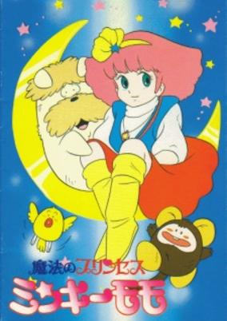

**Studio:** Studio Pierrot &nbsp;|&nbsp; **Director:** Mochizuki Tomomichi &nbsp;|&nbsp; **Aired/Released:** June 15 &nbsp;|&nbsp; **Genres:** Magic, Earth, Fantasy, Adventure

> Minky Momo travels to an island where she finds a land of children and gets tangled up in an absurd, no-holds-barred standoff against the world's nations. Has "Dr. Strangelove" references.
>
> _Synopsis source: Kitsu_

[Wikipedia](https://en.wikipedia.org/wiki/Magical_Princess_Minky_Momo) · [Kitsu](https://kitsu.io/anime/mahou-no-princess-minky-momo-yume-no-naka-no-rondo)

---

### Chonoryoku Shōjo Barabanba

**Studio:** Japan Home Video &nbsp;|&nbsp; **Aired/Released:** June 21

---

### Captain Tsubasa: Europe Daikessen

**Studio:** Tsuchida Production &nbsp;|&nbsp; **Director:** Isamu Imakake &nbsp;|&nbsp; **Aired/Released:** July 13 &nbsp;|&nbsp; **Genres:** Action, Sports

> The first Captain Tsubasa movie is about a match between an "All Europe Boy Soccer Team" and an "All Japan Boy Soccer Team" and takes place at the end of the first TV series. When the Japanese team arrives in Europe they meet incredible players with skills and strength they never had to face before.
>
> _Synopsis source: Kitsu_

[Wikipedia](https://en.wikipedia.org/wiki/Captain_Tsubasa) · [Kitsu](https://kitsu.io/anime/captain-tsubasa-europe-daikessen)

---

### Dr. Slump and Arale-chan: Hoyoyo! Dream Capital Mecha Police (Dr. Slump and Arale-chan: Hoyoyo! The Treasure of Nanaba Castle)

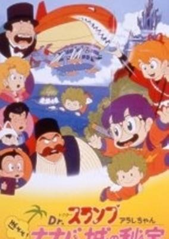

**Studio:** Toei Animation &nbsp;|&nbsp; **Director:** Toyoo Ashida , Kazuhisa Takenouchi &nbsp;|&nbsp; **Aired/Released:** July 13 &nbsp;|&nbsp; **Genres:** Science Fiction, Comedy

> Dr. Slump found the secret treasure named “Eye of Rainbow” of legendary Nanaba Castle in the mountain. This treasure makes every dream come true. When the robbery gang of Arale, Ga-chan tried to steal this treasure, Bisna who is the descendant of Nanaba Kingdom took the treasure. Bisna wanted to revive the devil and Nanaba Kingdom. Arale and her friends went towards the secret Nanaba Castle to get back the treasure.
>
> _Synopsis source: Kitsu_

[Wikipedia](https://en.wikipedia.org/wiki/Dr._Slump) · [Kitsu](https://kitsu.io/anime/dr-slump-movie-4-arale-chan-hoyoyo-nanaba-shiro-no-hihou)

---

### Legend of the Gold of Babylon (Lupin the Third: The Legend of the Gold of Babylon)

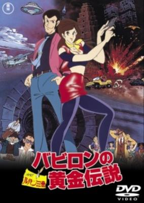

**Studio:** Tokyo Movie Shinsha &nbsp;|&nbsp; **Director:** Seijun Suzuki , Shigetsugu Yoshida &nbsp;|&nbsp; **Aired/Released:** July 13 &nbsp;|&nbsp; **Genres:** Comedy, Action, Thievery, Adventure, Crime

> Mysterious Babylonian Tablets unearthed in Manhattan provide tantilizing clues about the location of the Tower of Babel - not the biblical one, but the original one, built out of solid gold! The Mob is out to get the gold, but so is Lupin III. It's Thugs vs. Thieves when Lupin &amp; Co. go up against a fearsome flyswatting Polish Mafia boss, a bevy of beauty-contest policewomen, Zenigata, the hard-luck Interpol Inspector, a mysterious bag-lady AND his own girl-friend in a trans-continental trust-nobody trek after a treasure of biblical proportions!
>
> _Synopsis source: Kitsu_

[Wikipedia](https://en.wikipedia.org/wiki/Legend_of_the_Gold_of_Babylon) · [Kitsu](https://kitsu.io/anime/lupin-iii-the-legend-of-the-gold-of-babylon)

---

### Night on the Galactic Railroad

**Studio:** Group TAC &nbsp;|&nbsp; **Director:** Gisaburo Sugii &nbsp;|&nbsp; **Aired/Released:** July 13 &nbsp;|&nbsp; **Genres:** Adventure, Fantasy, Coming Of Age, Anthropomorphism, Drama, Past, Parallel Universe, Plot Continuity, Historical, Mystery, Kids

> Based on a short story by the popular children's writer Kenji Miyazawa, Galactic Railroad offers viewers a slow-paced, dreamlike journey through space and time. When Giovanni, a lonely boy in a hill town, goes to get milk for his ailing mother, he finds himself crossing the Milky Way on a faster-than-light steam railroad. The stations he visits in various constellations, like the planets explored by St. Exupery's Little Prince, offer curious adventures and an assortment of human "types." Reality and fantasy blur aboard the train, and its travels across the light-years sometimes suggests the journey through life. The characters are depicted as cats, presumably to avoid the problems of animating humans.
>
> _Synopsis source: Kitsu_

[Wikipedia](https://en.wikipedia.org/wiki/Night_on_the_Galactic_Railroad) · [Kitsu](https://kitsu.io/anime/night-on-the-galactic-railroad)

---

### Dirty Pair: The Original TV Series (Dirty Pair)

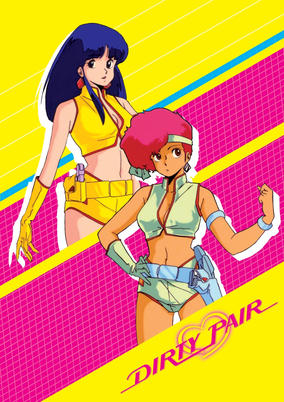

**Studio:** Nippon Sunrise &nbsp;|&nbsp; **Director:** Norio Kashima , Toshifumi Takizawa &nbsp;|&nbsp; **Aired/Released:** July 15 &nbsp;|&nbsp; **Genres:** Space Travel, Science Fiction, Action, Comedy, Gunfights, Swordplay, Detective, Bounty Hunter, Other Planet, Future, Space, Adventure, Cops

> If you're in a big trouble, call the World Welfare Work Association or WWWA. They will send out a team of highly trained capable agents called Trouble Consultants who can solve your problems. But if the team they send you is the Dirty Pair, there will be a lot of collateral damage aside from solving your problems.
>
> _Synopsis source: Kitsu_

[Wikipedia](https://en.wikipedia.org/wiki/Dirty_Pair) · [Kitsu](https://kitsu.io/anime/dirty-pair)

---

### Area 88

**Studio:** Project 88 &nbsp;|&nbsp; **Director:** Hisayuki Toriumi &nbsp;|&nbsp; **Aired/Released:** July 20 &nbsp;|&nbsp; **Genres:** Action, Air Force, Present, Military, Adventure, Romance

> Shin Kazama, tricked and forced into flying for the remote country of Aslan, can only escape the hell of war by earning money for shooting down enemy planes or die trying. Through the course of the series, Shin must deal with the consequences of killing and friends dying around him as tries to keep his mind on freeing himself from this nightmare.
>
> _Synopsis source: Kitsu_

[Wikipedia](https://en.wikipedia.org/wiki/Area_88) · [Kitsu](https://kitsu.io/anime/area-88)

---

### Cosmo Police Justy

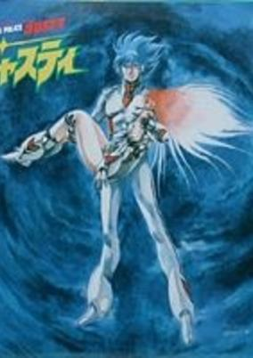

**Studio:** Pierrot &nbsp;|&nbsp; **Director:** Motosuke Takahashi &nbsp;|&nbsp; **Aired/Released:** July 20 &nbsp;|&nbsp; **Genres:** Science Fiction, Action, Future, Violence, Space, Super Power

> In the future humanity is spread throughout the galaxy. In their efforts to combat criminal espers the Cosmo Police are fortunate to have Justy on their side. However the esper criminals also know this and some of them are making plans for Cosmo Policeman Justy. As their leader says "There's only one way to kill the most powerful esper in the galaxy".
>
> _Synopsis source: Kitsu_

[Wikipedia](https://en.wikipedia.org/wiki/Cosmo_Police_Justy) · [Kitsu](https://kitsu.io/anime/cosmo-police-justy)

---

### Magical Princess Minky Momo La Ronde in my Dream (Magical Princess Minky Momo: La Ronde in my Dream)

**Studio:** Ashi Productions &nbsp;|&nbsp; **Director:** Hiroshi Watanabe &nbsp;|&nbsp; **Aired/Released:** July 28 &nbsp;|&nbsp; **Genres:** Magic, Earth, Fantasy, Adventure

> Minky Momo travels to an island where she finds a land of children and gets tangled up in an absurd, no-holds-barred standoff against the world's nations. Has "Dr. Strangelove" references.
>
> _Synopsis source: Kitsu_

[Wikipedia](https://en.wikipedia.org/wiki/Magical_Princess_Minky_Momo) · [Kitsu](https://kitsu.io/anime/mahou-no-princess-minky-momo-yume-no-naka-no-rondo)

---

### Odin: Photon Sailer Starlight (Odin: Starlight Mutiny)

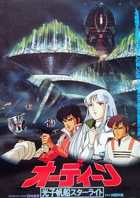

**Studio:** Toei Animation &nbsp;|&nbsp; **Director:** Eiichi Yamamoto , Takeshi Shirato , Toshio Masuda , Yoshinobu Nishioka &nbsp;|&nbsp; **Aired/Released:** August 10 &nbsp;|&nbsp; **Genres:** Science Fiction, Shipboard, Space, Action, Adventure

> In the year 2099, mankind has colonized parts of the Solar System thanks to the evolution of space travel. To venture further beyond what man has accomplished, the space vessel Starlight is launched. After rescuing a mysterious girl from a wreckage near the asteroid fields, the crew of the Starlight plot a perilous journey towards the Canopus system in search of the planet known only as "Odin" - the possible key to all forms of life.
>
> _Synopsis source: Kitsu_

[Kitsu](https://kitsu.io/anime/odin-koushi-hansen-starlight)

---

### Armored Trooper VOTOMS: The Last Red Shoulder

**Studio:** Nippon Sunrise &nbsp;|&nbsp; **Director:** Ryosuke Takahashi &nbsp;|&nbsp; **Aired/Released:** August 21 &nbsp;|&nbsp; **Genres:** Future, Mecha, Piloted Robot, Action, Science Fiction, Revenge, Genetic Modification, War, Rotten World, Military

> Released in 1985, this OVA tells a critical part of the story between the TV show's Uoodo and Kummen arcs. Although the TV series covered the Red Shoulders in some detail, we didn't get to see much of Chirico's time there or the people involved, and we get both of those here.
>
> _Synopsis source: Kitsu_

[Wikipedia](https://en.wikipedia.org/wiki/Armored_Trooper_Votoms) · [Kitsu](https://kitsu.io/anime/armored-trooper-votoms-the-last-red-shoulder)

---

### Akumatō no Purinsu

**Studio:** Toei Animation &nbsp;|&nbsp; **Aired/Released:** August 25

[Wikipedia](https://en.wikipedia.org/wiki/The_Three-Eyed_One)

---

### The Chocolate Panic Picture Show (The Chocolate Picture Panic Show)

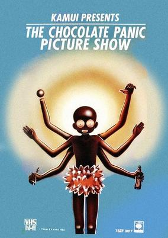

**Studio:** Tezuka Productions &nbsp;|&nbsp; **Director:** Fujiwara Kamui &nbsp;|&nbsp; **Aired/Released:** September 21 &nbsp;|&nbsp; **Genres:** Psychological, Dementia

> Based on a manga by Fujiwara Kamui, serialised in Monthly Super Action and partly inspired by Jamie Uys's The Gods Must Be Crazy (1980). Jaw-droppingly racist musical in which grossly caricatured Africans Manbo, Chinbo, and Chonbo causes chaos in civilisation despite the efforts of their pretty tour guide/bedmate to tame their zany, grass-skirted cannibal ways.
>
> _Synopsis source: Kitsu_

[Kitsu](https://kitsu.io/anime/chocolate-panic-picture-show)

---

### Genesis Climber MOSPEADA: Love Live Alive (Genesis Climber Mospeada: Love)

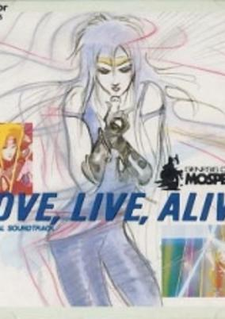

**Studio:** Artmic , Tatsunoko Productions &nbsp;|&nbsp; **Director:** Katsuhisa Yamada &nbsp;|&nbsp; **Aired/Released:** September 21 &nbsp;|&nbsp; **Genres:** Mecha, Music, Action

> After the original run of the television series, an OAV music video titled Genesis Climber Mospeada: Love Live Alive was specially (mostly due to demands of hardcore Mospeada fans) released in Japan in September 1985. The music video consisted of both old and new footage. The story of Love Live Alive chronicled the events after the ending of the original Mospeada, featuring Yellow Belmont as the main character. The music video focused on Yellow's concert and also on his flashback of past events.
>
> _Synopsis source: Kitsu_

[Wikipedia](https://en.wikipedia.org/wiki/Genesis_Climber_MOSPEADA) · [Kitsu](https://kitsu.io/anime/genesis-climber-mospeada-love-live-alive)

---

### "Kate no Kioku" Namida no Dakkai Sakusen!! (Night on the Galactic Railroad)

**Studio:** Nippon Sunrise &nbsp;|&nbsp; **Director:** Takeyuki Kanda &nbsp;|&nbsp; **Aired/Released:** September 21 &nbsp;|&nbsp; **Genres:** Past, Historical, Plot Continuity, Parallel Universe, Fantasy, Adventure, Anthropomorphism, Drama, Coming Of Age, Mystery

> Based on a short story by the popular children's writer Kenji Miyazawa, Galactic Railroad offers viewers a slow-paced, dreamlike journey through space and time. When Giovanni, a lonely boy in a hill town, goes to get milk for his ailing mother, he finds himself crossing the Milky Way on a faster-than-light steam railroad. The stations he visits in various constellations, like the planets explored by St. Exupery's Little Prince, offer curious adventures and an assortment of human "types." Reality and fantasy blur aboard the train, and its travels across the light-years sometimes suggests the journey through life. The characters are depicted as cats, presumably to avoid the problems of animating humans.
>
> _Synopsis source: Kitsu_

[Wikipedia](https://en.wikipedia.org/wiki/Ginga_Hy%C5%8Dry%C5%AB_Vifam) · [Kitsu](https://kitsu.io/anime/night-on-the-galactic-railroad)

---

### Mujigen Hunter Fandora (Dream Dimension Hunter Fandora)

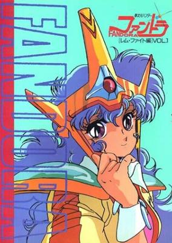

**Studio:** Hiro Media , Kaname Production &nbsp;|&nbsp; **Director:** Kazuyuki Okaseko , Hiroshi Yoshida , Shigenori Kageyama &nbsp;|&nbsp; **Aired/Released:** September 21 &nbsp;|&nbsp; **Genres:** Science Fiction, Fantasy, Action, Swordplay, Bounty Hunter, Demon, Super Power, Adventure

> Space princess Fandora and her sidekick Que are bounty hunters in an age where warp travel has become a reality, along with space criminals. Fandora possesses the red, magic, "Jewel of Lupia" which she uses to fight with when conventional weapons are ineffective. In pursuit of space criminal Red Eye Geran, they encounter in the kingdom of Lemia a mysterious evil religious leader who has taken control from its legitimate rulers. This individual possesses a blue jewel which will unify the dimensions of the universe and start an age of peace or terror if it is conjoined with the "Jewel of Lupia." And so Fandora and he are fated to meet.
>
> _Synopsis source: Kitsu_

[Wikipedia](https://en.wikipedia.org/wiki/Mujigen_Hunter_Fandora) · [Kitsu](https://kitsu.io/anime/dream-dimension-hunter-fandora)

---

### Urusei Yatsura: Ryoko's September Tea Party

**Studio:** Studio Deen &nbsp;|&nbsp; **Aired/Released:** September 24

[Wikipedia](https://en.wikipedia.org/wiki/Urusei_Yatsura_(film_series)#OVA_releases)

---

### Blue Comet SPT Layzner

**Studio:** Nippon Sunrise &nbsp;|&nbsp; **Director:** Ryōsuke Takahashi &nbsp;|&nbsp; **Aired/Released:** October 3 &nbsp;|&nbsp; **Genres:** Science Fiction, Mecha, Earth, Action, Piloted Robot, Humanoid Alien, Alien, Space, Military

> The Story takes place in an alternate reality based in the year 1996, where humanity is advanced enough to develop long-range space travel, as well as bases on both the Moon and Mars. However, the Cold War tensions between the United States and the Soviet Union have not ended; rather, they've escalated as both sides build military facilities in space, and the shadow of nuclear conflict looms over humanity, both on and off Earth. Meanwhile, on the Red Planet, an exchange program created by the United Nations to promote peace and understanding is about to begin; the "Cosmic Culture Club", consisting of 16 boys and girls, as well as their instructor Elizabeth, arrives at the UN Mars base, and are being welcomed by the staff. Among the passengers is Anna a 14 year old girl who serves as the narrator for the story. Suddenly, four unidentified humanoid robots classified as Super Powered Tracers are detected, engaged in fierce combat with each other. The UN base is caught in the crossfire and quickly destroyed, killing all but six members of the "Cosmic Culture Club"--Elizabeth, Arthur, Roan, David, Simone and Anna, and leaving them stranded on an inhospitable planet that has suddenly become a battlefield. As the battle ends, the lone SPT standing lands next to the terrified group and opens up revealing a pilot, who simply announces to them, "Earth is at stake". The robots who destroyed the UN base were the creation of the Grados, an alien race, from the Udoria system, who came to the Sol system for the purpose of conquest, seeing an easy victory as the two superpowers raged against each other to exaustion--however, this could also be described as an act of pre-emptive self-defense; the Gradosian supercomputers have determined that humanity will eventually cease its infighting and become powerful enough to spread through the galaxy, posing a destructive threat to even the far off Grados. However, there were two Grados opposed to the plan: human astronaut Ken Asuka, assumed lost during a deep space mission but discovered by the Grados, and his son Null Albarto (his "human" name being Eiji). As the Grados prepared their invasion fleet, Eiji stows away on board one of the ships and steals their most powerful and advanced weapon, the SPT-LZ-00X Layzner before fleeing, seeking to warn humanity of its impending invasion. It was here where he was attacked. Aside from the Layzner, the surviving humans have now become very important to the Grados; as the only human eyewitnesses to the aliens and their power, the six are the only ones who can convince the warring powers to stand down from destroying each other, and focus on the greater threat.
>
> _Synopsis source: Kitsu_

[Wikipedia](https://en.wikipedia.org/wiki/Blue_Comet_SPT_Layzner) · [Kitsu](https://kitsu.io/anime/aoki-ryuusei-spt-layzner)

---

### Ninja Senshi Tobikage (Ninja Robots)

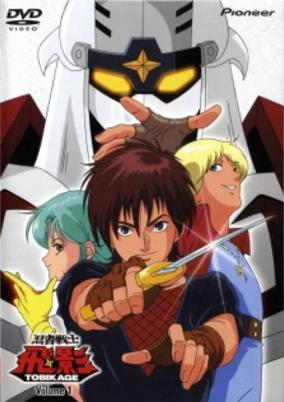

**Studio:** Studio Pierrot &nbsp;|&nbsp; **Director:** Masami Annō &nbsp;|&nbsp; **Aired/Released:** October 6 &nbsp;|&nbsp; **Genres:** Ninja, Science Fiction, Mecha, Earth, Action, Piloted Robot, Martial Arts, Humanoid Alien, Alien, Future, Space, Adventure

> Ninja Senshi Tobikage tells the story of a boy named Joe Maya. One day, Joe, who lives on Mars, witnesses a battle between aliens. Those from Planet Zaboom are attacking the princess of Planet Radorio, she has escaped from the emperor of Zaboom who is scheming to conquer the universe and has crash landed on mars. Joe stumbles aboard the princesses ship, this starts a chain reaction of events that will alter their lives. Joe and his friends wield three powerful mecha beasts against the emperor of Zaboom and his forces, but the odds are stacked heavily against them. When all hope seems to be lost a mysterious ninja robot named Tobikage appears as if from nowhere to provide assitance, able to combine with the 3 mechanical beasts provides Tobikage with unmatched power, with his aide Joe fights the forces of Zaboom...
>
> _Synopsis source: Kitsu_

[Wikipedia](https://en.wikipedia.org/wiki/Ninja_Senshi_Tobikage) · [Kitsu](https://kitsu.io/anime/ninja-senshi-tobikage)

---

### GeGeGe no Kitarō (Spooky Kitaro: Crash!! The Great Rebellion of the Multi-Dimensional Yōkai)

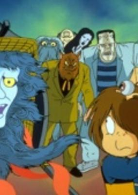

**Studio:** Toei Animation &nbsp;|&nbsp; **Director:** Osamu Kasai , Hiroki Shibata &nbsp;|&nbsp; **Aired/Released:** October 12 &nbsp;|&nbsp; **Genres:** Fantasy, Adventure, Horror, Comedy

> Movie based on the 1985 TV anime with an original plot.
>
> _Synopsis source: Kitsu_

[Wikipedia](https://en.wikipedia.org/wiki/GeGeGe_no_Kitar%C5%8D) · [Kitsu](https://kitsu.io/anime/gegege-no-kitarou-gekitotsu-ijigen-youkai-no-daihanran)

---

### High School! Kimengumi (Funny Faces in High School)

**Studio:** Gallop , Studio Comet &nbsp;|&nbsp; **Director:** Hiroshi Fukutomi &nbsp;|&nbsp; **Aired/Released:** October 12 &nbsp;|&nbsp; **Genres:** Absurdist Humour, Super Deformed, School Life, Comedy, Parody, Romance

> A group of 5 male high school students that call themselves the funny-face group cause trouble at school with their crazy antics.
>
> _Synopsis source: Kitsu_

[Wikipedia](https://en.wikipedia.org/wiki/High_School!_Kimengumi) · [Kitsu](https://kitsu.io/anime/high-school-kimengumi)

---

### Dream-Star Button Nose (Dream Star Button Nose)

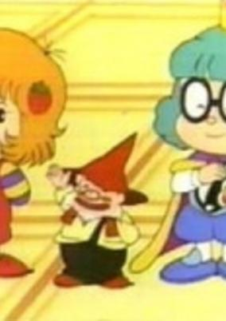

**Studio:** Sanrio , TV Asahi &nbsp;|&nbsp; **Director:** Masami Hata , Toshio Takeuchi , Katsuhisa Yamada, Kazuyuki Hirokawa &nbsp;|&nbsp; **Aired/Released:** October 19 &nbsp;|&nbsp; **Genres:** Fantasy, Adventure, Kids

> Although Trish is her real name, everyone calls her Button Nose because of her button nose. Always happy and nice, she is always shown with strawberries because she's famous for her homemade strawberry jam.
>
> _Synopsis source: Kitsu_

[Wikipedia](https://en.wikipedia.org/wiki/Dream-Star_Button_Nose) · [Kitsu](https://kitsu.io/anime/yume-no-hoshi-no-button-nose)

---

### Fight! Iczer One (Fight!! Iczer-1)

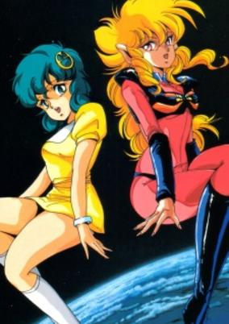

**Studio:** AIC &nbsp;|&nbsp; **Director:** Toshihiro Hirano &nbsp;|&nbsp; **Aired/Released:** October 19 &nbsp;|&nbsp; **Genres:** Science Fiction, Mecha, Earth, Ecchi, Japan, Action, Piloted Robot, Shoujo Ai, Coming Of Age, Angst, Horror, Humanoid Alien, Alien, Plot Continuity, Violence, Present, Adventure

> Nagisa is a schoolgirl with schoolgirl tendencies, waking up late, rushing off to school and meeting up with friends upon the way. One morning Nagisa comes across a woman dressed in a strange uniform who seems to stare at her, unnerving Nagisa. Later that day, whilst staring out the window, Nagisa becomes aware of a ball bouncing by itself which flings itself towards her window seat, shattering the glass yet not harming her... Turning back to the front she finds a gaping mouth bristling with teeth inches from her face and no-one else about. She screams and the world returns to normal with her standing and the centre of curiosity of her class... why did she scream?
>
> _Synopsis source: Kitsu_

[Wikipedia](https://en.wikipedia.org/wiki/Fight!_Iczer_One) · [Kitsu](https://kitsu.io/anime/iczer-one)

---

### A Journey Through Fairyland (Fairy Florence)

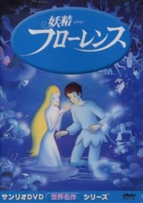

**Studio:** Sanrio &nbsp;|&nbsp; **Director:** Masami Hata &nbsp;|&nbsp; **Aired/Released:** October 19 &nbsp;|&nbsp; **Genres:** Fantasy, Music, Adventure

> A gentle and talented boy named Michael played beautiful music on his oboe, and his greatest love was to play for and tend to the flowers in the greenhouse at the school of music where he attended. Unfortunately, his gardening made him constantly late for orchestra practice and resulted in his dismissal from the school. When Michael fell asleep that same night, he was awakened by a dainty Flower Fairy named Florence, who would take him on an enchanted journey to a land where flowers came alive, treble notes were mischievous, and adventure beckoned. There, he would soon come to realize that his love of flowers and desire to become a great musician could go hand-in-hand and help him to become focused in life and discover himself.
>
> _Synopsis source: Kitsu_

[Wikipedia](https://en.wikipedia.org/wiki/A_Journey_Through_Fairyland) · [Kitsu](https://kitsu.io/anime/yousei-florence)

---

### Chūhai Lemon LOVE 30S

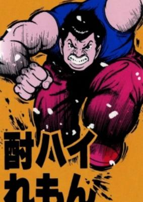

**Studio:** Tsuchida Productions , Wonder Kids &nbsp;|&nbsp; **Director:** Kenzo Koizumi &nbsp;|&nbsp; **Aired/Released:** October 21 &nbsp;|&nbsp; **Genres:** Romance, Comedy, Cops

> Bug-eyed Katsumi (known as Chuhai to his friends) is a muscle-bound detective determined to use his strength and pig-headed stupidity to rescue his teenage girlfriend from a succession of embarrassing situations. Based on a manga by Sho Fumimura and heavily seeded with background music from the 1960s U.S. hit parade.
>
> _Synopsis source: Kitsu_

[Kitsu](https://kitsu.io/anime/chuuhai-lemon-love-30s)

---

### Kimagure Orange Road: Shonen Jump Special (Kimagure Orange Road TV Pilot)

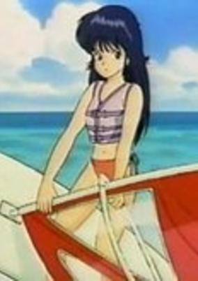

**Studio:** Shueisha , Studio Pierrot &nbsp;|&nbsp; **Director:** Osamu Kobayashi , Tomomi Mochizuki &nbsp;|&nbsp; **Aired/Released:** November 23 &nbsp;|&nbsp; **Genres:** Romance, Drama

> A special made before the rest of the KOR anime to test the possibility of making more. Essentially an alternate TV version of episode 46 , Kyosuke and Madoka go to the beach only to be trapped alone together.
>
> _Synopsis source: Kitsu_

[Wikipedia](https://en.wikipedia.org/wiki/Kimagure_Orange_Road) · [Kitsu](https://kitsu.io/anime/kimagure-orange-road-pilot)

---

### What's Michael?

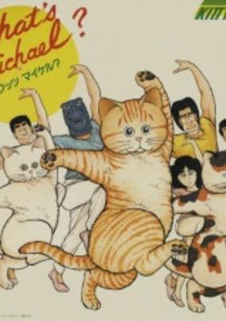

**Studio:** Kitty Films &nbsp;|&nbsp; **Aired/Released:** November 25 &nbsp;|&nbsp; **Genres:** Comedy

> A series of adventures featuring the one cat apparently everyone in the world owns... Michael.
>
> _Synopsis source: Kitsu_

[Wikipedia](https://en.wikipedia.org/wiki/What%27s_Michael%3F) · [Kitsu](https://kitsu.io/anime/what-s-michael)

---

### Angel's Egg

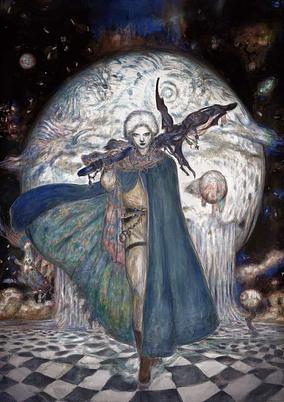

**Studio:** Studio DEEN , Tokuma Shoten &nbsp;|&nbsp; **Director:** Mamoru Oshii &nbsp;|&nbsp; **Aired/Released:** December 15 &nbsp;|&nbsp; **Genres:** Fantasy, Post Apocalypse, Fantasy World, Dark Fantasy, Dementia

> In a desolate and dark world full of shadows, lives one little girl who seems to do nothing but collect water in jars and protect a large egg she carries everywhere. A mysterious man enters her life... and they discuss the world around them.
>
> _Synopsis source: Kitsu_

[Wikipedia](https://en.wikipedia.org/wiki/Angel%27s_Egg) · [Kitsu](https://kitsu.io/anime/angel-s-egg)

---

### Fire Tripper

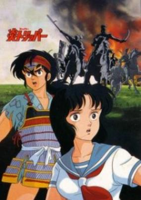

**Studio:** Studio Pierrot &nbsp;|&nbsp; **Director:** Osamu Uemura &nbsp;|&nbsp; **Aired/Released:** December 16 &nbsp;|&nbsp; **Genres:** Japan, Earth, Fantasy, Feudal Warfare, Time Travel, Past, Present, Science Fiction

> It was just another ordinary afternoon for our heroine Suzuko when she suddenly got caught in a giant gas explosion. Instead of getting killed, Suzuko wakes up some 500 years in the past during the Civil War era of Japan. After being saved from a fate worse than death by a handsome, somewhat overbearing young man, Suzuko learns to adapt to the strange realm where she now resides. Along the way, Suzuko finds out more about her mysterious and spotty past. As clues begin to click into place, though, the village is attacked, and Suzuko finds herself travelling through time AGAIN, this time to the present. Will she solve the mystery regarding her origin and where she belongs?
>
> _Synopsis source: Kitsu_

[Wikipedia](https://en.wikipedia.org/wiki/Fire_Tripper) · [Kitsu](https://kitsu.io/anime/fire-tripper)

---

### Captain Tsubasa: Ayaushi, Zen Nippon Jr.

**Studio:** Tsuchida Production &nbsp;|&nbsp; **Director:** Isamu Imakake &nbsp;|&nbsp; **Aired/Released:** December 21 &nbsp;|&nbsp; **Genres:** Action, Sports

> The first Captain Tsubasa movie is about a match between an "All Europe Boy Soccer Team" and an "All Japan Boy Soccer Team" and takes place at the end of the first TV series. When the Japanese team arrives in Europe they meet incredible players with skills and strength they never had to face before.
>
> _Synopsis source: Kitsu_

[Wikipedia](https://en.wikipedia.org/wiki/Captain_Tsubasa) · [Kitsu](https://kitsu.io/anime/captain-tsubasa-europe-daikessen)

---

### Cream Lemon Special: Ami Image White Shadow (Cream Lemon: Ami's Journey)

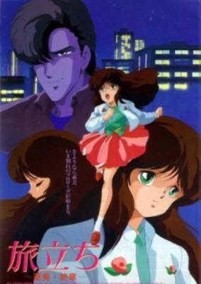

**Aired/Released:** December 21 &nbsp;|&nbsp; **Genres:** Ecchi, Romance, Drama

> Movie based on the Ami series of the Cream Lemon franchise. This movie was co-aired with Project A-Ko movie.
>
> _Synopsis source: Kitsu_

[Wikipedia](https://en.wikipedia.org/wiki/Cream_Lemon) · [Kitsu](https://kitsu.io/anime/tabidachi-ami-shuushou)

---

### Vampire Hunter D

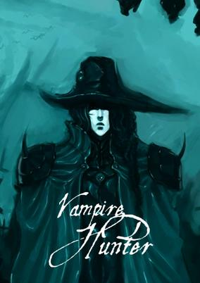

**Studio:** Ashi Productions &nbsp;|&nbsp; **Director:** Toyoo Ashida &nbsp;|&nbsp; **Aired/Released:** December 21 &nbsp;|&nbsp; **Genres:** Contemporary Fantasy, Science Fiction, Post Apocalypse, Action, Vampire, Horror, Future, Violence, Supernatural

> 10,000 years in the future, the world has become a very different place; monsters roam the land freely, and people, although equipped with high tech weapons and cybernetic horses, live a humble life more suited to centuries past. The story focuses on a small hamlet plagued by monster attacks and living under the shadow of rule by Count Magnus Lee, a powerful vampire lord who has ruled the land for thousands of years. When a young girl is bitten by the Count and chosen as his current plaything, she seeks out help of a quiet wandering stranger, D. It so happens that D is one of the world's best vampire hunters, and he takes it upon himself to cut through Magnus Lee's many minions, and put an end to the Count's rule.
>
> _Synopsis source: Kitsu_

[Wikipedia](https://en.wikipedia.org/wiki/Vampire_Hunter_D_(1985_film)) · [Kitsu](https://kitsu.io/anime/vampire-hunter-d)

---

### Affair of Nolandia (Dirty Pair)

**Studio:** Nippon Sunrise &nbsp;|&nbsp; **Director:** Masaharu Okuwaki &nbsp;|&nbsp; **Aired/Released:** December &nbsp;|&nbsp; **Genres:** Space Travel, Science Fiction, Action, Comedy, Gunfights, Swordplay, Detective, Bounty Hunter, Other Planet, Future, Space, Adventure, Cops

> If you're in a big trouble, call the World Welfare Work Association or WWWA. They will send out a team of highly trained capable agents called Trouble Consultants who can solve your problems. But if the team they send you is the Dirty Pair, there will be a lot of collateral damage aside from solving your problems.
>
> _Synopsis source: Kitsu_

[Wikipedia](https://en.wikipedia.org/wiki/Dirty_Pair) · [Kitsu](https://kitsu.io/anime/dirty-pair)

---
