# 1986 in Anime

[← Back to index](../README.md)

75 titles · 60 with a matched synopsis/cover art · [source](https://en.wikipedia.org/wiki/1986_in_anime)

## Releases

### New Robotan

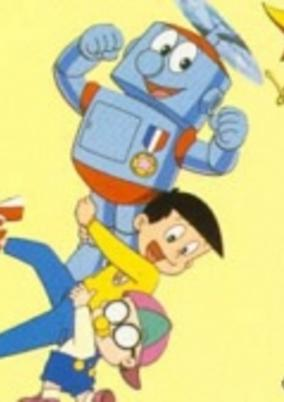

**Studio:** Tokyo Movie Shinsha &nbsp;|&nbsp; **Director:** Kenji Kodama, et al. &nbsp;|&nbsp; **Aired/Released:** January 6 &nbsp;|&nbsp; **Genres:** Comedy, Kids

> The story about robot named Robotan who came from outside the earth, he met with a kid then they become friends but they always stuck with some troubles because of bad people who chase after Robotan however our hero win the fight every time.
>
> _Synopsis source: Kitsu_

[Wikipedia](https://en.wikipedia.org/wiki/Robotan) · [Kitsu](https://kitsu.io/anime/robotan)

---

### Uchūsen Sagittarius

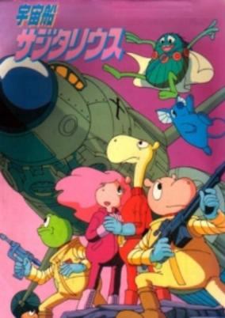

**Studio:** Nippon Animation &nbsp;|&nbsp; **Director:** Kazuyoshi Yokota &nbsp;|&nbsp; **Aired/Released:** January 10 &nbsp;|&nbsp; **Genres:** Science Fiction, Anthropomorphism, Adventure

> Working for a multi-purpose space agency, Toppy and Rana make friends with Giraffe, a scientist, and go through various adventures in space. The three encounter danger at times, but their friendship always saves them just in the nick of time.
>
> _Synopsis source: Kitsu_

[Wikipedia](https://en.wikipedia.org/wiki/Uch%C5%ABsen_Sagittarius) · [Kitsu](https://kitsu.io/anime/uchuusen-sagittarius)

---

### The Story of Pollyanna, Girl of Love

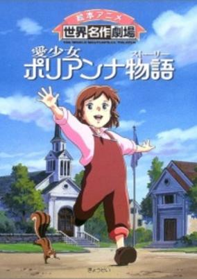

**Studio:** Nippon Animation &nbsp;|&nbsp; **Director:** Kōzō Kuzuha &nbsp;|&nbsp; **Aired/Released:** January 12 &nbsp;|&nbsp; **Genres:** Earth, Slice of Life, United States, Americas, Drama, Past, Plot Continuity, Historical

> Motherless since birth, Pollyanna was an ordinary happy-go-lucky girl, leaving peacefully with her father, the vicar. Then one day her life changes completely when her father dies and she has to live with her aunt whom she has never met before. In the beginning, she seems to be detested by her but as time passes, they develop a very strong bond.
>
> _Synopsis source: Kitsu_

[Wikipedia](https://en.wikipedia.org/wiki/The_Story_of_Pollyanna,_Girl_of_Love) · [Kitsu](https://kitsu.io/anime/ai-shoujo-pollyanna-monogatari)

---

### Maple Town

**Studio:** Toei Animation &nbsp;|&nbsp; **Director:** Junichi Sato , Hiroshi Shidara &nbsp;|&nbsp; **Aired/Released:** January 19 &nbsp;|&nbsp; **Genres:** Fantasy, Slice of Life

> Maple Town Stories is about friendship, adventure and the troubles the children (Patty Rabbit, Bobby Bear and Fanny Fox) who are the main characters of the show, fall into. Wild Wolfe is a homeless thief who lives in the forest and usually steals from the town and does other mischief, but the kids are always there to stop him and set things right slowly making him understand the wrongs of his ways.
>
> _Synopsis source: Kitsu_

[Wikipedia](https://en.wikipedia.org/wiki/Maple_Town) · [Kitsu](https://kitsu.io/anime/maple-town-monogatari)

---

### Maple Town Monogatari (Maple Town)

**Studio:** Toei Animation &nbsp;|&nbsp; **Director:** Junichi Sato , Hiroshi Shidara &nbsp;|&nbsp; **Aired/Released:** January 19 &nbsp;|&nbsp; **Genres:** Fantasy, Slice of Life

> Maple Town Stories is about friendship, adventure and the troubles the children (Patty Rabbit, Bobby Bear and Fanny Fox) who are the main characters of the show, fall into. Wild Wolfe is a homeless thief who lives in the forest and usually steals from the town and does other mischief, but the kids are always there to stop him and set things right slowly making him understand the wrongs of his ways.
>
> _Synopsis source: Kitsu_

[Wikipedia](https://en.wikipedia.org/wiki/Maple_Town) · [Kitsu](https://kitsu.io/anime/maple-town-monogatari)

---

### Panzer World Galient

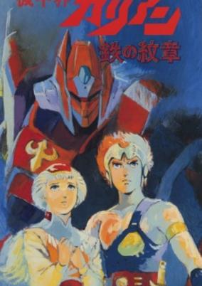

**Studio:** Nippon Sunrise &nbsp;|&nbsp; **Director:** Ryōsuke Takahashi &nbsp;|&nbsp; **Aired/Released:** January 21 &nbsp;|&nbsp; **Genres:** Mecha, Piloted Robot, Action, Science Fiction, Fantasy

> The first two episodes are summaries of the TV series, the third one (Crest of Iron) takes place in an alternate universe.
>
> _Synopsis source: Kitsu_

[Wikipedia](https://en.wikipedia.org/wiki/Panzer_World_Galient) · [Kitsu](https://kitsu.io/anime/panzer-world-galient-ova)

---

### Song Special 2: Curtain Call

**Studio:** Studio Pierrot &nbsp;|&nbsp; **Director:** Kazunori Itō , Mochizuki Tomomichi &nbsp;|&nbsp; **Aired/Released:** February 1

[Wikipedia](https://en.wikipedia.org/wiki/Creamy_Mami,_the_Magic_Angel)

---

### Urusei Yatsura 4: Lum the Forever

**Studio:** Studio Deen &nbsp;|&nbsp; **Director:** Kazuo Yamazaki &nbsp;|&nbsp; **Aired/Released:** February 22

[Wikipedia](https://en.wikipedia.org/wiki/Urusei_Yatsura_(film_series)#Lum_the_Forever)

---

### Dragon Ball

**Studio:** Toei Animation &nbsp;|&nbsp; **Director:** Minoru Okazaki, Daisuke Nishio &nbsp;|&nbsp; **Aired/Released:** February 26

[Wikipedia](https://en.wikipedia.org/wiki/Dragon_Ball_(anime))

---

### Mobile Suit Gundam ZZ

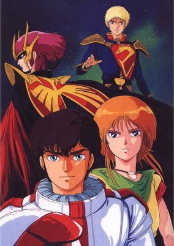

**Studio:** Nippon Sunrise &nbsp;|&nbsp; **Director:** Yoshiyuki Tomino &nbsp;|&nbsp; **Aired/Released:** March 1 &nbsp;|&nbsp; **Genres:** Science Fiction, Mecha, Action, Piloted Robot, Comedy, War, Future, Robot, Disaster, Space, Military

> The year is Universal Century 0088. Directly after the end of the Gryps War, Haman Karn and her army of Zeon remnants on the asteroid Axis begin their quest of reviving the lost empire of the Zabi's, and proclaim themselves as the Neo-Zeon. With the Earth Federation as hapless as ever, only the Anti-Earth Union Group (AEUG) is able oppose the plans of Neo-Zeon. In need of all the help it can get after being decimated in the previous war and losing many of its key members, the AEUG ship Argama enlists the aid of a young junk collector from the Side 1 colony of Shangri-La named Judau Ashta to pilot its newest mobile suit, the Double Zeta Gundam.
>
> _Synopsis source: Kitsu_

[Wikipedia](https://en.wikipedia.org/wiki/Mobile_Suit_Gundam_ZZ) · [Kitsu](https://kitsu.io/anime/mobile-suit-gundam-zz)

---

### Pastel Yumi, the Magic Idol (Magical Idol Pastel Yumi)

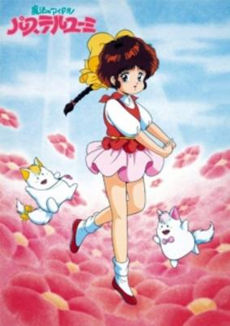

**Studio:** Studio Pierrot &nbsp;|&nbsp; **Director:** Akira Sugino &nbsp;|&nbsp; **Aired/Released:** March 7 &nbsp;|&nbsp; **Genres:** Magic, Magical Girl, Fantasy, Comedy, Kids, Slice of Life, Shoujo

> Yumi is a girl who likes flowers and comics. When Kakimaru and Keshimaru, flower fairies, see Yumi in trouble, they decide to help her. They tell Yumi that flower fairies give magic tools to children who take care of flowers. Kakimaru and Keshimaru, which sees Yumi's pure affection towards flowers, decide to give her a magic cane and a pendant. By using the cane, any pictures she drew in the air takes form and becomes real. However, once the pendant starts to flash, there are only 30 seconds left before the power of the magic disappears. Yumi always tries to use her magical power in a good manner, but she is hasty and goofy. As a result, her magic often causes a big trouble around her. This is the fourth series of Magical Girl Series.
>
> _Synopsis source: Kitsu_

[Wikipedia](https://en.wikipedia.org/wiki/Pastel_Yumi,_the_Magic_Idol) · [Kitsu](https://kitsu.io/anime/mahou-no-idol-pastel-yumi)

---

### Fist of the North Star (Fist of the North Star: The Movie)

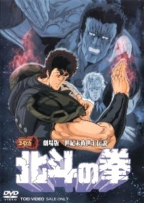

**Studio:** Toei Animation &nbsp;|&nbsp; **Director:** Toyoo Ashida &nbsp;|&nbsp; **Aired/Released:** March 8 &nbsp;|&nbsp; **Genres:** Science Fiction, Post Apocalypse, Action, Martial Arts, Violence, Adventure

> Following a cataclysmic nuclear war, the world teeters on the brink of complete destruction. Civilization is polarized into a degenerate society where opposing packs of marauding scavengers prey on helpless, homeless nomads. For those who are lucky enough to survive the constant brutality and danger, it is a bleak existence. Life an death blur into abstractions. The only hope left for mankind is to find a hero worthy of becoming the next "Fist of the North Star" - an enlightened warrior - who is capable of leading those with the will to survive out of this barrenness into a new world. But in this savage no-man's land of shifting loyalties and power-hungry demi-gods, heroes are in short supply.
>
> _Synopsis source: Kitsu_

[Wikipedia](https://en.wikipedia.org/wiki/Fist_of_the_North_Star_(1986_film)) · [Kitsu](https://kitsu.io/anime/hokuto-no-ken-movie)

---

### Arion

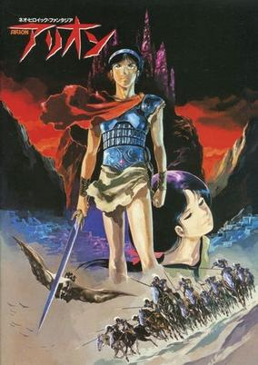

**Studio:** Sunrise &nbsp;|&nbsp; **Director:** Yoshikazu Yasuhiko &nbsp;|&nbsp; **Aired/Released:** March 15 &nbsp;|&nbsp; **Genres:** Fantasy, Action, Europe, Magic, Past, Adventure

> In Thrace, Arion is taken from his mother Demeter by the god Hades. In the Underworld, Arion is trained to be a warrior. His training is driven by revenge: Arion was told that his mother's blindness was caused by Zeus and Zeus' death will remove the curse. Finally, Arion and Geedo (a huge ape-like creature who had become Arion's friend and companion) left the Underworld to find Zeus. Seneca, a small thief, makes off with Arion's sword and this leads Arion to his first encounter with the forces of Zeus, commanded by his daughter Athena. Arion is captured but is later set free by Lesfeena, Athena's mute serving girl. As Arion rejoins Geedo and Seneca (and worries about Lesfeena), the forces of Zeus and Poseidon face each other in battle. In the background sits the scheming Hades, and the calm Apollon who seems to have plans of his own.
>
> _Synopsis source: Kitsu_

[Wikipedia](https://en.wikipedia.org/wiki/Arion_(manga)) · [Kitsu](https://kitsu.io/anime/arion)

---

### Captain Tsubasa: Asu ni Mukatte Hashire

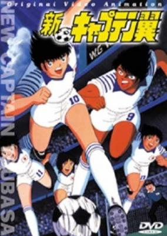

**Studio:** Tsuchida Productions &nbsp;|&nbsp; **Director:** Isamu Imakake &nbsp;|&nbsp; **Aired/Released:** March 15 &nbsp;|&nbsp; **Genres:** Action, Sports

> The first Captain Tsubasa movie is about a match between an "All Europe Boy Soccer Team" and an "All Japan Boy Soccer Team" and takes place at the end of the first TV series. When the Japanese team arrives in Europe they meet incredible players with skills and strength they never had to face before.
>
> _Synopsis source: Kitsu_

[Wikipedia](https://en.wikipedia.org/wiki/Captain_Tsubasa) · [Kitsu](https://kitsu.io/anime/captain-tsubasa-europe-daikessen)

---

### Doraemon: Nobita and the Steel Troops (Doraemon the Movie: Nobita and the Steel Troops)

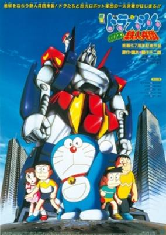

**Studio:** Shin-Ei Animation &nbsp;|&nbsp; **Director:** Tsutomu Shibayama &nbsp;|&nbsp; **Aired/Released:** March 15 &nbsp;|&nbsp; **Genres:** Mecha, Fantasy, Adventure, Comedy, Kids

> Giant robot parts fell from the sky, so Nobita and Doraemon took it into the mirror world to build it and called it the Zandacross. It seems that Zandacross is a dangerous weapon so they kept it a secret. A mysterious girl named Lilulu appeared and asked for Zandacross for the invasion but she doesn't agree to invade the Earth. Doraemon and the others join forces to stop the invasion of the robot army but it seems that Lilulu is the only one that can stop it.
>
> _Synopsis source: Kitsu_

[Kitsu](https://kitsu.io/anime/doraemon-nobita-and-the-platoon-of-iron-men)

---

### Prefectural Earth Defense Force

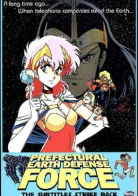

**Studio:** Gallop &nbsp;|&nbsp; **Director:** Keiji Hayakawa &nbsp;|&nbsp; **Aired/Released:** March 21 &nbsp;|&nbsp; **Genres:** Earth, Japan, Asia, Comedy, Human Enhancement, Cyborg, Android, Slapstick, Present, Action, Science Fiction, Adventure

> Telegraph Pole Society, a mysterious group, is planning to conquer the world. The principal of the local high school forms a Defense Force by recruiting students from school: Shogi Morita, Kuho Tasuke, and Akiko Ifukube. Meanwhile the high school crazy scientist, Dr. Inogami, has turned a local boy, Kami Sanchin, into a cyborg. They might just defeat the Telegraph Pole Society with the help of the cyborg, or maybe not...
>
> _Synopsis source: Kitsu_

[Wikipedia](https://en.wikipedia.org/wiki/Prefectural_Earth_Defense_Force) · [Kitsu](https://kitsu.io/anime/prefectural-earth-defense-force)

---

### Maison Ikkoku

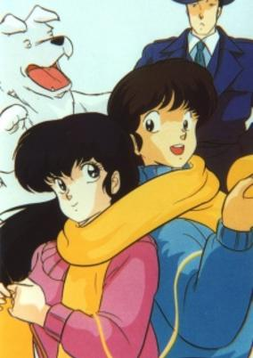

**Studio:** Studio Deen &nbsp;|&nbsp; **Director:** Kazuo Yamazaki, Takashi Annō, Naoyuki Yoshinaga &nbsp;|&nbsp; **Aired/Released:** March 26 &nbsp;|&nbsp; **Genres:** Romance, Japan, Asia, Earth, Slice of Life, Comedy, Love Polygon, Coming Of Age, Slapstick, Present, Seinen

> Maison Ikkoku is an old boarding house in the town of Clock Hill. It is relatively comfortable to live in, but unfortunately, it doesn’t provide its tenants with the excitement and modernity that normal college students prefer. So... they improvise. One of the students is 20-year-old Yusaku Godai, a calm and good-natured young man, who is doing his best to make friends and enjoy life. But being a typical introvert, he is often teased and taken advantage of by his other, more assertive roommates. Too stressed to continue living this way, he makes a decision to move out to a more peaceful residence. However, just as he is about to leave the house, he bumps into the beautiful Kyoko Otonashi, who introduces herself as the new manager. For Godai, this is love at first sight, and even though he was set on finding a new place, her charm allows him to see the light at the end of the tunnel. However, despite her youth and kind nature, Kyoko is actually a widow who lost her husband in a tragic accident. This has left her scarred and very vulnerable, and even though she does her best to be positive, it is evident that depression is taking over her. Godai and Kyoko quickly become very close, and he makes it his ultimate goal in life to make her happy, no matter what.
>
> _Synopsis source: Kitsu_

[Wikipedia](https://en.wikipedia.org/wiki/Maison_Ikkoku) · [Kitsu](https://kitsu.io/anime/maison-ikkoku)

---

### Ginga: Nagareboshi Gin

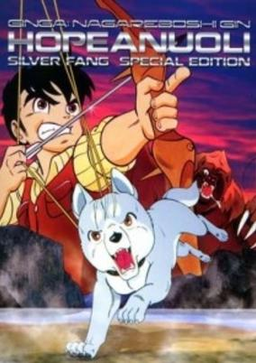

**Studio:** Toei Animation &nbsp;|&nbsp; **Director:** Tomoharu Katsumata &nbsp;|&nbsp; **Aired/Released:** April 7 &nbsp;|&nbsp; **Genres:** Friendship, Action, Violence, Adventure

> Gin is a silver Tora-ge named after his coat color. Shortly after being born, he watches his father, Riki, get killed by Akakabuto, a bear that terrorizes everything in his path. Being the third-generation of bear-dogs to try to stand up against Akakabuto, he ventures out to find dogs to join him in his fight.
>
> _Synopsis source: Kitsu_

[Kitsu](https://kitsu.io/anime/ginga-nagareboshi-gin)

---

### Touch: Sebangō no Nai Ace

**Studio:** Group TAC &nbsp;|&nbsp; **Director:** Gisaburō Sugii &nbsp;|&nbsp; **Aired/Released:** April 12

[Wikipedia](https://en.wikipedia.org/wiki/Touch_(manga))

---

### Wonder Beat Scramble

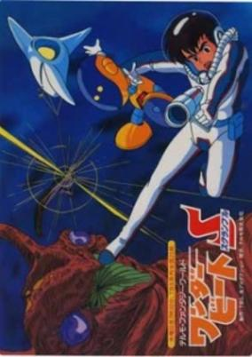

**Studio:** Mushi Production &nbsp;|&nbsp; **Aired/Released:** April 16 &nbsp;|&nbsp; **Genres:** Science Fiction, Action, Space

> In 2119, the spaceship Green Sleeves found 3 planets attacked by X23, a moving planet heading Earth. The Earth government ordered Green Sleeves to attack X23, but Dr. Sugita, the captain of Green Sleeves, refused because he believed they could co-exist. Then, the communication with Green Sleeves was cut abruptly... In 2121, Susumu, the son of Dr. Sugita, is visited by strangers. The take him to Dr. Miya, one of the few supporters to Dr. Sugita's decision, while most blamed him as a traitor. Dr. Miya recommends Susumu to join White Pegasus, a team of special medical recuers. Their Micronizer System can shrink human so that they can cure from the inside of the body. Shortly afterwards, X23 has come in visual range at last. Hues - the aliens of X23 - choose Susumu's friend as their first target. Susumu and the other members of White Pegasus manage to defeat Hues inside of his body. But Susumu finds the signals emitted from the chips within Hues are the music composed by himself and his mother, as a gift to Dr. Sugita...
>
> _Synopsis source: Kitsu_

[Wikipedia](https://en.wikipedia.org/wiki/Wonder_Beat_Scramble) · [Kitsu](https://kitsu.io/anime/wonder-beat-scramble)

---

### Animated Classics of Japanese Literature

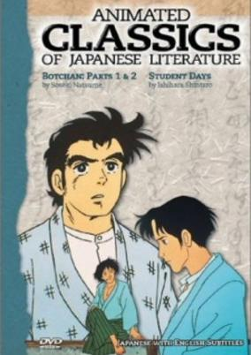

**Studio:** Nippon Animation &nbsp;|&nbsp; **Aired/Released:** April 25 &nbsp;|&nbsp; **Genres:** Drama, Past, Historical, Romance

> A brilliant collection of beautifully animated episodes based on selected masterpieces of Japanese modern literature. The aim of this series is to appeal to the viewer at large and to give him or her some idea of the variety and individuality which Japanese literature has developed over the last hundred years. The authors range from Higuchi Ichiyou (Takekurabe), Mori Ougai (The Dancing Girl) and Natsume Souseki (Botchan) to Kawabata Yasunari (The Izu Dancer), Nobel laureate of 1968, and Mishima Yukio (The Sound of Waves).
>
> _Synopsis source: Kitsu_

[Wikipedia](https://en.wikipedia.org/wiki/Animated_Classics_of_Japanese_Literature) · [Kitsu](https://kitsu.io/anime/seishun-anime-zenshuu)

---

### Requiem for Victims

**Studio:** Ashi Productions &nbsp;|&nbsp; **Director:** Seiji Okuda &nbsp;|&nbsp; **Aired/Released:** April 21

[Wikipedia](https://en.wikipedia.org/wiki/Dancouga_%E2%80%93_Super_Beast_Machine_God)

---

### Saint Elmo – Hikari no Raihousha (Saint Elmo: Apostle of Light)

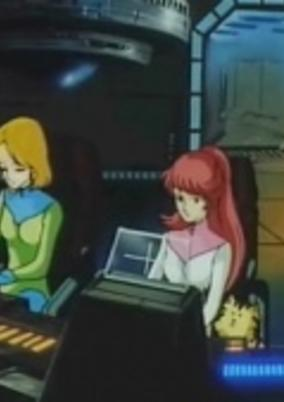

**Studio:** Toei Animation &nbsp;|&nbsp; **Director:** Tomoharu Katsumata &nbsp;|&nbsp; **Aired/Released:** April &nbsp;|&nbsp; **Genres:** Science Fiction

> Inside Mercury, Japan builds a large-sized solar space power plant. The plant supports Earth with its large solar energy supply but suddenly there is an abnormality at the Saint Elmo plant. To pinpoint the problem, Earth sends several technicians to fix it.
>
> _Synopsis source: Kitsu_

[Wikipedia](https://en.wikipedia.org/wiki/Saint_Elmo_%E2%80%93_Hikari_no_Raihousha) · [Kitsu](https://kitsu.io/anime/saint-elmo-hikari-no-raihousha)

---

### Transformers: Scramble City

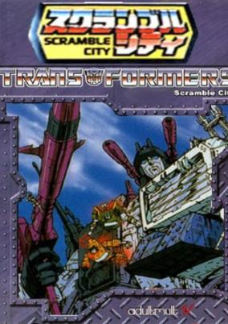

**Studio:** Toei Animation , Takara &nbsp;|&nbsp; **Director:** Yuji Endo &nbsp;|&nbsp; **Aired/Released:** April &nbsp;|&nbsp; **Genres:** Transforming Craft, Science Fiction, Mecha, Action, Earth, Alien, Present

> Beginning with a recap of the coming of the Transformers to Earth and the story of Devastator, the OVA then gets its original story underway, as the Autobots are shown to be in the midst of constructing the powerful "Scramble City," overseen by their newest arrival, Ultra Magnus. When the Decepticons learn of this, their combiner robots are deployed to attack, and a battle between them and their Autobot counterparts ensues.
>
> _Synopsis source: Kitsu_

[Kitsu](https://kitsu.io/anime/transformers-scramble-city)

---

### Hikari no Densetsu

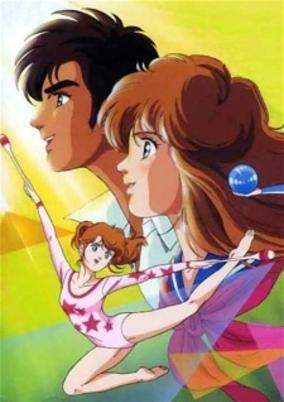

**Studio:** Tatsunoko Productions &nbsp;|&nbsp; **Director:** Tomomi Mochizuki &nbsp;|&nbsp; **Aired/Released:** May 3 &nbsp;|&nbsp; **Genres:** Romance, Action, Sports, Unrequited Love, Love Polygon, Musical Band, The Arts, Music

> Hikari is a young school girl who dreams of becoming a great champion in the sport of rhythmic gymnastics like her idol, Diliana Gueorguiva. Despite all her setbacks while performing, she works hard and with the help and support of Takaaki Oiishi (the best male gymnast of her school) soon becomes a member of the rhythmic gymnastics team in her school. She develops feelings for Oiishi, but she is not the only one—Hazuki Shiina, the best gymnast in the entire school, also has feelings for Oiishi. Soon a friendship between Hikari and Shiina develops, but also a rivalry as well in the sport and for the love of Oiishi. Hikari is also torn between her feelings for Oiishi and her conflicting feelings for Mao Natsukawa, an old childhood friend, who is also the lead singer of the band called Mr. D. He composes the music she uses while performing, and has been developing feelings for her since childhood.
>
> _Synopsis source: Kitsu_

[Wikipedia](https://en.wikipedia.org/wiki/Hikari_no_Densetsu) · [Kitsu](https://kitsu.io/anime/hikari-no-densetsu)

---

### Baribari Legend

**Studio:** Studio Pierrot &nbsp;|&nbsp; **Director:** Nagayuki Toriumi, Satoshi Uemura &nbsp;|&nbsp; **Aired/Released:** May 10

[Wikipedia](https://en.wikipedia.org/wiki/Baribari_Legend)

---

### Sango-sho Densetsu: Aoi Umi no Erufii

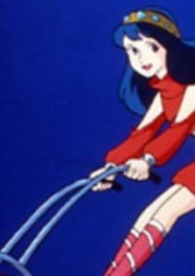

**Studio:** Nippon Animation &nbsp;|&nbsp; **Director:** Yoshio Kuroda &nbsp;|&nbsp; **Aired/Released:** May 19 &nbsp;|&nbsp; **Genres:** Adventure, Earth, Future, Science Fiction

> In the future, the oceans have risen to flood all the continents due to humanity's negligence of the environment. Only a few bits of land have been spared, and one of those is the city-island where Elfie lives with her grandfather. One day, due to an underwater incident, she discovers that she can breathe underwater. Her grandfather reveals that in truth she is one of the mythical sea-people. Using the cityfolk's xenophobia, local politicans spark a war with this hidden people to distract people from their current ressource problems, and Elfie is caught in the middle of it.
>
> _Synopsis source: Kitsu_

[Kitsu](https://kitsu.io/anime/sango-shou-densetsu-aoi-umi-no-elfie)

---

### Maris the Chojo

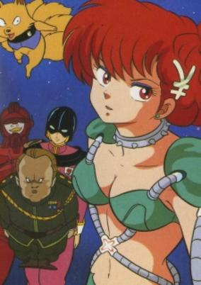

**Studio:** Studio Pierrot , Shogakukan Production &nbsp;|&nbsp; **Director:** Motosuke Takahashi &nbsp;|&nbsp; **Aired/Released:** May 21 &nbsp;|&nbsp; **Genres:** Alien, Super Power, Humanoid Alien, Action, Science Fiction, Comedy

> Despite being a refugee from an extinct planet, having an alcoholic as a father and an airhead for a mother, Maris' biggest problem is that she's a Thanatosian. Considering that Thanatosians are six times stronger than the average Earthling it shouldn't be such a curse, especially in a galaxy where violence is rife. But the accidental destruction she wreaks on everything she touches —even with the exotic alloy restraints she wears— means she's constantly in debt. Every mission she's assigned to by the Inter-Galactic Space Patrol becomes a cash-drain when all the damages are docked from her wage. But when she's selected to rescue the rich and sexy Kogane Maru it's like a dream come true. After setting him free from the terror of his ruthless kidnapper his eternal gratitude will surely guarantee marriage —and an end to all her financial headaches.
>
> _Synopsis source: Kitsu_

[Wikipedia](https://en.wikipedia.org/wiki/Maris_the_Chojo) · [Kitsu](https://kitsu.io/anime/the-choujo)

---

### Mahō no Star Magical Emi Finale! Finale!

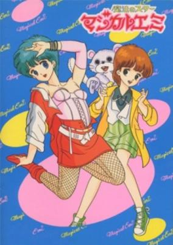

**Studio:** Studio Pierrot &nbsp;|&nbsp; **Aired/Released:** May 25 &nbsp;|&nbsp; **Genres:** Slice of Life, Magic, Magical Girl, Japan, Present, Comedy

> Kozuki Mai is an elementary student who wants to be a magician and perform in her family's "Magicarat" magical act; however, she is too young, and her magic skills are not very good. Then one day, she encounters a ball of light that was put into a stuffed doll of flying squirrel, bringing it to life and somehow giving her the power to turn in to the 18-year-old magician "Magical Emi." As Emi, Mai was able to join the magic act. But she must keep her identity a secret from her family and from her crush.
>
> _Synopsis source: Kitsu_

[Wikipedia](https://en.wikipedia.org/wiki/Magical_Emi,_the_Magic_Star) · [Kitsu](https://kitsu.io/anime/mahou-no-star-magical-emi)

---

### Megazone 23 - Part II (Megazone 23)

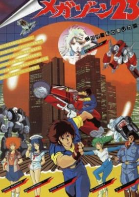

**Studio:** AIC , Artland , Tatsunoko &nbsp;|&nbsp; **Director:** Ichiro Itano &nbsp;|&nbsp; **Aired/Released:** May 30 &nbsp;|&nbsp; **Genres:** Science Fiction, Mecha, Action, Future, Earth, Piloted Robot, Conspiracy, Transforming Craft, Cyberpunk, Virtual Reality, Music, Romance, Mystery

> Shougo Yahagi is a young motorcycle enthusiast living in a world of hot bikes, hard rock, and J-pop idols. The general populace go about their lives in peace, under the watchful eyes of a computer program in the guise of pop idol sensation Eve, unbeknownst to them. Shougo himself is mostly concerned with riding his motorcycle and picking up beautiful women like Yui Takanaka, who aspires to be a dancer. Shougo's life suddenly changes when his friend, Shinji Nakagawa, shows him a top-secret project: the "Garland," an advanced motorcycle that can transform into a robot. Ambushed by the military, Shougo hijacks the Garland and escapes into the city. Evading the military with the help of Yui and her friends, he gradually discovers that their idyllic society is only an illusion. [Written by MAL Rewrite]
>
> _Synopsis source: Kitsu_

[Wikipedia](https://en.wikipedia.org/wiki/Megazone_23) · [Kitsu](https://kitsu.io/anime/megazone-23)

---

### Barefoot Gen 2

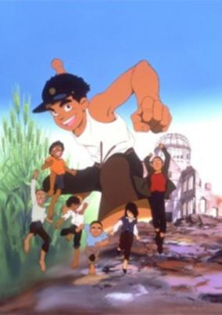

**Studio:** Nippon Sunrise &nbsp;|&nbsp; **Director:** Toshio Hirata &nbsp;|&nbsp; **Aired/Released:** June 14 &nbsp;|&nbsp; **Genres:** Japan, Slice of Life, Coming Of Age, Drama, Past, Historical, Family

> Three years have passed since the bombing of Hiroshima and Gen is now a fourth-grader. Hiroshima is still a ruin, and Gen must scrounge for scrap metal to help keep himself and his remaining family fed, but at least commerce has returned to the land. As his mother gradually grows ill from radiation sickness, Gen and Ryuta befriend a group of orphans led by a tough-nosed older child and including a girl who still bears ugly burn scars from the day of the bomb. An old man suffering from depression is also drawn into the group as they come together to support each other and form a makeshift family. Reality is still harsh, however, as many orphans still die lonely deaths and the grim reminders of what happened linger everywhere.
>
> _Synopsis source: Kitsu_

[Wikipedia](https://en.wikipedia.org/wiki/Barefoot_Gen_2) · [Kitsu](https://kitsu.io/anime/hadashi-no-gen-2)

---

### Project A-ko

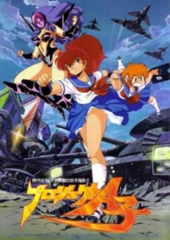

**Studio:** Soeishinsha, APPP &nbsp;|&nbsp; **Director:** Katsuhiko Nishijima &nbsp;|&nbsp; **Aired/Released:** June 21 &nbsp;|&nbsp; **Genres:** Ecchi, Transforming Craft, Science Fiction, Mecha, Japan, Action, Asia, Earth, Parody, Comedy, High School, Future, School Life, Super Power, Adventure

> Sixteen years have passed since a mysterious alien ship crashed on Earth. Graviton City, once leveled by the ship's crash, is now a bustling metropolis. Within the city's high school, superhuman high school student A-Ko Magami dukes it out with the diabolical genius B-Ko Daitokuji, who will stop at nothing to win the friendship of A-Ko's buddy C-Ko Kotobuki. Meanwhile, in outer space, another alien ship is on course towards Earth to find its planet's lost princess.
>
> _Synopsis source: Kitsu_

[Wikipedia](https://en.wikipedia.org/wiki/Project_A-ko) · [Kitsu](https://kitsu.io/anime/project-a-ko)

---

### Violence Jack: Harem Bomber (Violence Jack: Slumking)

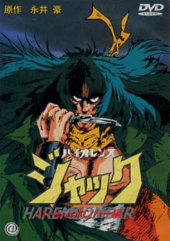

**Studio:** Soei Shinsha, Ashi Production &nbsp;|&nbsp; **Director:** Osamu Kamijo &nbsp;|&nbsp; **Aired/Released:** June &nbsp;|&nbsp; **Genres:** Action, Violence, Earth, Post Apocalypse, Horror

> Kanto Hell Earthquake has demolished the metropolitan completely. After the earthquake, Slum King is kidnapping girls and sell them as sex slaves. Mari is wandering on the devastated field looking for her lover, Ken. But she is also kidnapped by them. While she is tortured and trained as a sex slave, Ken saves her. Ken has become the member of Slum King. The king offers condition to him; in return for releasing her, he has to kill Violence Jack.
>
> _Synopsis source: Kitsu_

[Wikipedia](https://en.wikipedia.org/wiki/Violence_Jack) · [Kitsu](https://kitsu.io/anime/violence-jack)

---

### Machine Robo: Revenge of Cronos (Machine Robo: Revenge of Chronos)

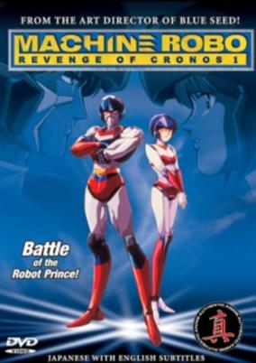

**Studio:** Ashi Productions &nbsp;|&nbsp; **Director:** Hiroshi Yoshida &nbsp;|&nbsp; **Aired/Released:** July 3 &nbsp;|&nbsp; **Genres:** Action, Transforming Craft, Mecha, Science Fiction, Swordplay, Martial Arts, Other Planet, Alien, Android, Space

> The journey of a robot prince begins! The planet Cronos is a world of super-robotic lifeforms, ruled by the wise Master Kirai. But their peaceful existence is shattered by the conquering armies of the Gandora robots. Now, machine combats machine in an epic battle for the planet. Master Kurai's son, Rom, must lead a company of transformable mecha warriors into the fray!
>
> _Synopsis source: Kitsu_

[Kitsu](https://kitsu.io/anime/machine-robo-revenge-of-chronos)

---

### Armored Trooper VOTOMS: Big Battle (Armored Trooper Votoms: The Last Red Shoulder)

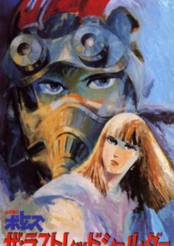

**Studio:** Nippon Sunrise &nbsp;|&nbsp; **Director:** Ryosuke Takahashi &nbsp;|&nbsp; **Aired/Released:** July 5 &nbsp;|&nbsp; **Genres:** Future, Mecha, Piloted Robot, Action, Science Fiction, Revenge, Genetic Modification, War, Rotten World, Military

> Released in 1985, this OVA tells a critical part of the story between the TV show's Uoodo and Kummen arcs. Although the TV series covered the Red Shoulders in some detail, we didn't get to see much of Chirico's time there or the people involved, and we get both of those here.
>
> _Synopsis source: Kitsu_

[Wikipedia](https://en.wikipedia.org/wiki/Armored_Trooper_Votoms) · [Kitsu](https://kitsu.io/anime/armored-trooper-votoms-the-last-red-shoulder)

---

### Chōjikū Romanesque Samy - Missing 99 (Superdimensional Romanesque Samy: Missing 99)

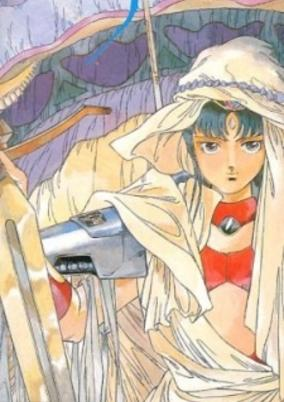

**Studio:** Aubec, Project Team Eikyuu Kikan &nbsp;|&nbsp; **Director:** Seiji Okuda, Hidemi Kubo &nbsp;|&nbsp; **Aired/Released:** July 5 &nbsp;|&nbsp; **Genres:** Fantasy, Science Fiction, Fantasy World, Parallel Universe, Demon, Action

> Getting caught up in a gang fight would be a bad day in anybody's life. But for high school student Sami Yoshino, things go from bad to worse as she finds herself thrown across time and space to unknown worlds. Now she's caught up in a gang fight of biblical proportions, between the divine masters of the universe and the demons who seek to destroy it. As it turns out, Samy hides phenomenal cosmic powers within her, and the demons will stop at nothing to suppress it. Can Samy ever escape the conflict and return to being a normal girl, or is the whole universe going to die?
>
> _Synopsis source: Kitsu_

[Kitsu](https://kitsu.io/anime/choujikuu-romanesque-samy-missing-99)

---

### Kizuoibito (Wounded Man)

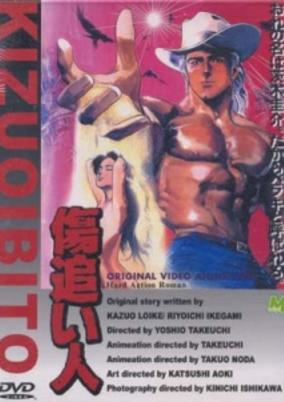

**Studio:** Magic Bus &nbsp;|&nbsp; **Director:** Toshio Takeuchi &nbsp;|&nbsp; **Aired/Released:** July 5 &nbsp;|&nbsp; **Genres:** Earth, Adventure, Action, Mafia, Thriller, Conspiracy, Crime, Revenge, Americas, Plot Continuity, Violence, Present

> Yuko Kusaka is a Japanese journalist sent to Brazil to do a report on the gold rush phenomenon that seems to be making many people rich from night to day. Rumors say that among the many "garimpeiros" (gold diggers) currently on the Amazon forest, there is a Japanese known as Rio Baraki. Reaching their destination, her crew member is promptly attacked and she is raped as a warning to stop their work and return immediately to their home country. Determined to do her job, she stays and finds out from the attacker that he is none other than Baraki, a white haired muscular man with a large scar on his back. Later she discovers that his real name is Keisuke Ibaraki. Once a promising quarterback, he ended up falsely incriminated by a powerful organization known as GPX.
>
> _Synopsis source: Kitsu_

[Wikipedia](https://en.wikipedia.org/wiki/Wounded_Man) · [Kitsu](https://kitsu.io/anime/kizuoibito)

---

### Captain Tsubasa: Sekai Daikessen, Jr. World Cup

**Studio:** Tsuchida Productions &nbsp;|&nbsp; **Director:** Isamu Imakake &nbsp;|&nbsp; **Aired/Released:** July 12 &nbsp;|&nbsp; **Genres:** Action, Sports

> The first Captain Tsubasa movie is about a match between an "All Europe Boy Soccer Team" and an "All Japan Boy Soccer Team" and takes place at the end of the first TV series. When the Japanese team arrives in Europe they meet incredible players with skills and strength they never had to face before.
>
> _Synopsis source: Kitsu_

[Wikipedia](https://en.wikipedia.org/wiki/Captain_Tsubasa) · [Kitsu](https://kitsu.io/anime/captain-tsubasa-europe-daikessen)

---

### High School! Kimengumi (Funny Faces in High School)

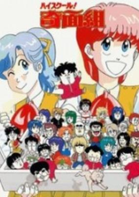

**Studio:** Studio Comet &nbsp;|&nbsp; **Director:** Makoto Moriwaki &nbsp;|&nbsp; **Aired/Released:** July 12 &nbsp;|&nbsp; **Genres:** Absurdist Humour, Super Deformed, School Life, Comedy, Parody, Romance

> A group of 5 male high school students that call themselves the funny-face group cause trouble at school with their crazy antics.
>
> _Synopsis source: Kitsu_

[Wikipedia](https://en.wikipedia.org/wiki/High_School!_Kimengumi) · [Kitsu](https://kitsu.io/anime/high-school-kimengumi)

---

### Legend of Lyon Flare

**Studio:** Kusama Art Ltd. &nbsp;|&nbsp; **Director:** Yorihisa Uchida &nbsp;|&nbsp; **Aired/Released:** July 14

---

### Amon Saga

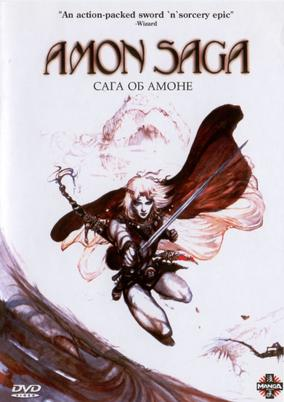

**Studio:** Tohokushinsha Film Corporation &nbsp;|&nbsp; **Director:** Shunji Ōga &nbsp;|&nbsp; **Aired/Released:** July 19 &nbsp;|&nbsp; **Genres:** Fantasy, Adventure, Action

> Set in a world of fantasy and adventure, Amon is a young warrior embarking on a quest to avenge the death of his mother. When the hunt leads him ultimately to the kingdom of Valhiss, Amon enlists in the ranks of the Emperor's army in order to gain an opportunity to exact his revenge. However, a chance encounter with the Princess Lichia, being held captive by the Emperor in an effort to ransom a map away from his main rival, King Darai-Sem, Amon must decide whether to follow his path of revenge or to help rescue the Princess in an effort to save a lost kingdom.
>
> _Synopsis source: Kitsu_

[Wikipedia](https://en.wikipedia.org/wiki/Amon_Saga) · [Kitsu](https://kitsu.io/anime/amon-saga)

---

### Windaria (Once Upon A Time)

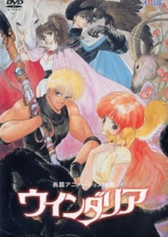

**Studio:** Studio Gallop &nbsp;|&nbsp; **Director:** Kunihiko Yuyama &nbsp;|&nbsp; **Aired/Released:** July 19 &nbsp;|&nbsp; **Genres:** Adventure, Fantasy, Steampunk, Drama, Action, Romance, Fantasy World, Military, Science Fiction

> Two pairs of young lovers become embroiled in a war between two rival kingdoms, the primitive but resplendent Isa and the militaristic but undisciplined Paro. Izu and his young wife, Marin , are simple farmers who live in the unassuming village of Saki, which lies directly between Isa and Paro. While Saki does not have the beauty of Isa nor the war machines of Paro, they do possess a magnificent tree known as "Windaria," to which the villagers give their prayers in return for "good memories." When the war erupts, Izu decides to join Paro's army, enthralled by the fantastic motorbike "given" to him as a bribe. Before he departs, they each take a vow: He will definitely return to her, and until he does, she will wait for him. The other two lovers are Jill, the prince of Paro, and Ahanas, Princess of Isa. They initially want nothing to do with the rapidly escalating conflict, but after Jill's father, Paro's king, dies by his son's hand in an altercation over the war, Jill has little choice but to realize his father's final wish: the taking of Isa. The only problem is that he had promised his beloved, Ahanas, that he would not become involved. Windaria is a war parable set in a fantasy land of unicorns and ghost ships.
>
> _Synopsis source: Kitsu_

[Wikipedia](https://en.wikipedia.org/wiki/Windaria) · [Kitsu](https://kitsu.io/anime/windaria)

---

### Super Mario Bros.: The Great Mission to Rescue Princess Peach!

**Studio:** Kyoto Animation &nbsp;|&nbsp; **Director:** Masami Hata &nbsp;|&nbsp; **Aired/Released:** July 20

---

### Ai City (Love City)

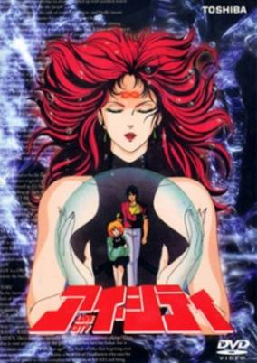

**Studio:** Toho , Movic , Ashi Productions &nbsp;|&nbsp; **Director:** Kōichi Mashimo &nbsp;|&nbsp; **Aired/Released:** July 26 &nbsp;|&nbsp; **Genres:** Super Power, Future, Human Enhancement, Japan, Action, Science Fiction, Dystopia

> It's sometime in the future and the story starts off with Kei and Ai running for their lives. Ai is a little girl who holds a terrible secret which could destroy the current world. The world is now populated by Headmeters, people who have psychic powers and their strength is shown on their forehead when they fight. However, Kei was an experimental subject and his strength never went above level 5 while other surpasses his ability effortlessly. While escaping, when in desperate moments, Kei could increase his ability to infinity when Ai is in trouble. The one who's after her have a deep secret, aided by a small dwarflike man living in a robotic suit. Eventually Ai is captured and Kei, a sherlock holmes detective and another Headmeter who was converted to the good side when Kei unleashed his horrible powers through Ai must go and rescue her. Together they must save Ai and the secret which she holds. What is the secret of Ai? Who is she?
>
> _Synopsis source: Kitsu_

[Wikipedia](https://en.wikipedia.org/wiki/Ai_City) · [Kitsu](https://kitsu.io/anime/ai-city)

---

### Eternal Story (Gall Force 1: Eternal Story)

**Studio:** AIC , ARTMIC &nbsp;|&nbsp; **Director:** Katsuhito Akiyama &nbsp;|&nbsp; **Aired/Released:** July 26 &nbsp;|&nbsp; **Genres:** Space Travel, Science Fiction, Action, Space Opera, Alternative Past, Cyberpunk, Humanoid Alien, Shipboard, Alien, War, Drama, Past, Space, Military, Mecha, Adventure

> Two advanced civilizations, the Paranoids (a race of alien humanoids) and the Solenoids (who are all women) are waging a war that has gone on for centuries. When the Solenoid fleet leaves a battle to defend an experimentally terraformed world from the Paranoids, one damaged Solenoid ship, the Star Leaf, is separated from the fleet. Only seven women remain alive on the ship: Eluza, the captain, Rabby, the solid more or less main character, Lufy, the brash pilot, Catty, the mysterious science officer, Pony, the pink-haired ditzy tech, Patty, a solid crew member, and Remy, the cute one. After narrowly escaping the battle, the crew of the Star Leaf decides to continue with their orders and rendezvous at planet Chaos to defend it. It turns out, however, that their ship is the subject of a Paranoid experiment. In the end, it is up to the remaining crew Star Leaf to defend the artificial paradise of Chaos from the Paranoid fleet and the plans of the Solenoid leaders.
>
> _Synopsis source: Kitsu_

[Wikipedia](https://en.wikipedia.org/wiki/Gall_Force) · [Kitsu](https://kitsu.io/anime/gall-force-1-eternal-story)

---

### Call Me Tonight

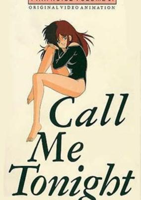

**Studio:** AIC &nbsp;|&nbsp; **Director:** Tatsuya Okamoto &nbsp;|&nbsp; **Aired/Released:** July 28 &nbsp;|&nbsp; **Genres:** Science Fiction, Ecchi, Japan, Asia, Earth, Present, Demon, Horror, Comedy, Romance

> Rumi's met a lot of guys through her job, and it's probably fair to assume that most of them could be said to have some sort of problem, but a man who literally turns into a beast when he gets turned on may be outside of this perky call girl's field of expertise. Still, a little challenge every now and again stimulates the mind and makes life so much more interesting, so she's willing to give it a shot.
>
> _Synopsis source: Kitsu_

[Wikipedia](https://en.wikipedia.org/wiki/Call_Me_Tonight) · [Kitsu](https://kitsu.io/anime/call-me-tonight)

---

### Castle in the Sky

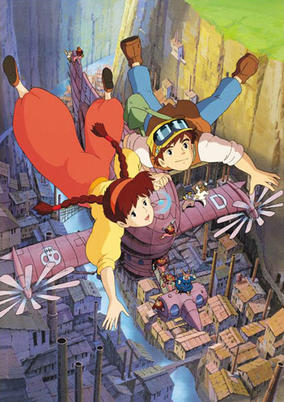

**Studio:** Studio Ghibli &nbsp;|&nbsp; **Director:** Hayao Miyazaki &nbsp;|&nbsp; **Aired/Released:** August 2 &nbsp;|&nbsp; **Genres:** Steampunk, Fantasy, Science Fiction, Mecha, Floating Island, Adventure, Action, Sudden Girlfriend Appearance, Android, Romance

> Tenkuu no Shiro Laputa takes place in a world where humanity once built great flying cities. A catastrophe later destroyed all of these majestic creations, forcing the human race to once again live on the ground. Despite these setbacks, humanity still has a passion for flight and explores the skies with planes and airships. A young girl named Sheeta is on one such airship, having been abducted by the government agent Muska. When the ship is attacked by the air pirate Captain Dola, Sheeta takes the opportunity to escape. Saved by the grace of luck and magic, Sheeta is found by a young boy named Pazu. The two later discover that Sheeta's amulet is the key to finding Laputa—a legendary castle that is said to be the greatest of the flying cities. Together these new friends head out to find the castle and unravel its mysteries before the greedy and evil people of the world do.
>
> _Synopsis source: Kitsu_

[Wikipedia](https://en.wikipedia.org/wiki/Castle_in_the_Sky) · [Kitsu](https://kitsu.io/anime/laputa-castle-in-the-sky)

---

### Yamataro Comes Back

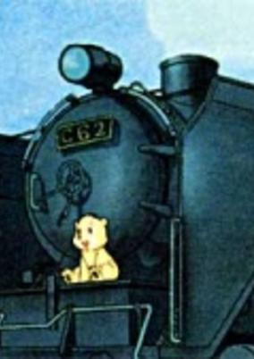

**Studio:** Tezuka Productions &nbsp;|&nbsp; **Director:** Osamu Tezuka &nbsp;|&nbsp; **Aired/Released:** August 15 &nbsp;|&nbsp; **Genres:** Fantasy, Friendship, Kids

> After having lost his parents, Yamatarou, a bear, is raised by a man. Yamatarou's friend is Shi-roku, a steam locomotive, and Yamatarou learns to impersonate the whistle of the locomotive. This is a story for nursery school kids about the friendship between the bear and the steam locomotive. The quality pictures render a sense of warmth to the reader.
>
> _Synopsis source: Kitsu_

[Wikipedia](https://en.wikipedia.org/wiki/Yamataro_Comes_Back) · [Kitsu](https://kitsu.io/anime/yamatarou-kaeru)

---

### Roots Search

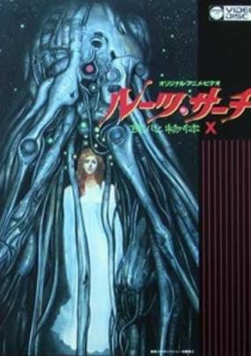

**Aired/Released:** September 10 &nbsp;|&nbsp; **Genres:** Horror, Shipboard, Alien, Future, Space, Science Fiction

> When a research crew in deep space discovers the desolate ship "Green Planet" that warps into their area, they encounter Buzz, the commander and sole surivor of the ship. Being too incapacitated to make them aware of the situation of his ship, the research team will soon discover that they have found something far, far worse...
>
> _Synopsis source: Kitsu_

[Wikipedia](https://en.wikipedia.org/wiki/Roots_Search) · [Kitsu](https://kitsu.io/anime/roots-search)

---

### Memorial Album

**Studio:** Studio Deen &nbsp;|&nbsp; **Aired/Released:** September 15

[Wikipedia](https://en.wikipedia.org/wiki/Urusei_Yatsura_(film_series)#OVA_releases)

---

### Mahō no Star Magical Emi Semishigure

**Studio:** Studio Pierrot &nbsp;|&nbsp; **Aired/Released:** September 21 &nbsp;|&nbsp; **Genres:** Slice of Life, Magic, Magical Girl, Japan, Present, Comedy

> Kozuki Mai is an elementary student who wants to be a magician and perform in her family's "Magicarat" magical act; however, she is too young, and her magic skills are not very good. Then one day, she encounters a ball of light that was put into a stuffed doll of flying squirrel, bringing it to life and somehow giving her the power to turn in to the 18-year-old magician "Magical Emi." As Emi, Mai was able to join the magic act. But she must keep her identity a secret from her family and from her crush.
>
> _Synopsis source: Kitsu_

[Wikipedia](https://en.wikipedia.org/wiki/Magical_Emi,_the_Magic_Star) · [Kitsu](https://kitsu.io/anime/mahou-no-star-magical-emi)

---

### Honey Bee in Toycomland

**Studio:** TMS Entertainment &nbsp;|&nbsp; **Aired/Released:** October 3

[Wikipedia](https://en.wikipedia.org/wiki/Adventure_Island_(video_game)#Anime)

---

### Anmitsu Hime: From Amakara Castle (Princess Anmitsu)

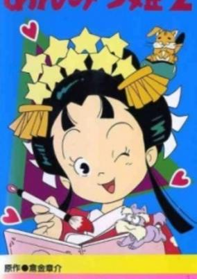

**Studio:** Studio Pierrot &nbsp;|&nbsp; **Director:** Masami Anno &nbsp;|&nbsp; **Aired/Released:** October 5 &nbsp;|&nbsp; **Genres:** Comedy, Historical

> Based on a manga by Kurakane Shousuke serialised in the Shoujo magazine. Anmitsu is a tomboy princess living happily at the Amakara Castle. Our story begins when she turns ten years old and gets a home tutor Castella from the Pudding Kingdom as a present from her parents. But they were very wrong when they thought that Anmitsu will finally start studying seriously, because she will frequently escape from the castle looking for some fun, and in the process she will learn a lot about the outside world, make numerous friends and cause endless trouble for the inhabitants of the castle who are supposed to take care of her.
>
> _Synopsis source: Kitsu_

[Wikipedia](https://en.wikipedia.org/wiki/Anmitsu_Hime) · [Kitsu](https://kitsu.io/anime/anmitsu-hime)

---

### Bosco Adventure

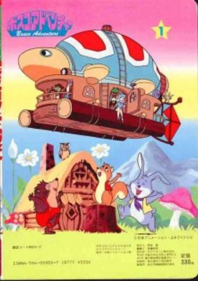

**Studio:** Nippon Animation &nbsp;|&nbsp; **Director:** Taku Sugiyama &nbsp;|&nbsp; **Aired/Released:** October 6 &nbsp;|&nbsp; **Genres:** Fantasy, Adventure, Kids

> Based on the book by Tony Wolf. The Fountain of Life is the source of all life forces in the Bosco World. Princess Apricot, who is supposed to become Queen of Fountainland-the Guardian of the Fountain of Life-is kidnapped by villains who aim to rule the Bosco World. If Princess Apricot can't take the queen's throne by the next solar eclipse, the Fountain of Life will dry up. The animals living in the forest of Bosco, including Frog, Otter and Tortoise, decide to help Princess and take her to Fountainland in order to protect their peaceful life in the Bosco World. So begins the journey in a balloon full of dreams, hope, adventures, and love! Source: Official Website)
>
> _Synopsis source: Kitsu_

[Wikipedia](https://en.wikipedia.org/wiki/Bosco_Adventure) · [Kitsu](https://kitsu.io/anime/bosco-adventure)

---

### Oh! Family

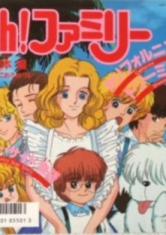

**Studio:** Knack Productions &nbsp;|&nbsp; **Director:** Masamune Ochiai &nbsp;|&nbsp; **Aired/Released:** October 6 &nbsp;|&nbsp; **Genres:** Earth, Slice of Life, Comedy, United States, Americas, Present, Romance

> This story takes place in Florida, USA. The main characters are the lovable members of the Andersons; each one has his or her own different characterstics which conflict and support the others'. By going through many events (meaningful ones as well as weird ones) together, the bond between them grows stronger and tighter.
>
> _Synopsis source: Kitsu_

[Wikipedia](https://en.wikipedia.org/wiki/Oh!_Family) · [Kitsu](https://kitsu.io/anime/oh-family)

---

### The Wonderful Wizard of Oz (The Wizard of Oz)

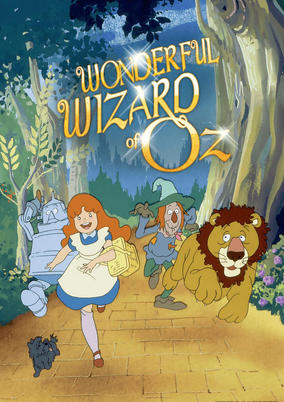

**Studio:** Panmedia &nbsp;|&nbsp; **Director:** Naisho Tonogawa &nbsp;|&nbsp; **Aired/Released:** October 6 &nbsp;|&nbsp; **Genres:** Fantasy World, Adventure, Fantasy, Past, Kids, Isekai

> Based on The Wonderful Wizard of Oz (1900), The Marvelous Land of Oz, Ozma of Oz, and The Emerald City of Oz (1900-1920) by L. Frank Baum (1856-1919).
>
> _Synopsis source: Kitsu_

[Wikipedia](https://en.wikipedia.org/wiki/The_Wonderful_Wizard_of_Oz_(1986_TV_series)) · [Kitsu](https://kitsu.io/anime/oz-no-mahoutsukai-1986)

---

### Saint Seiya (Saint Seiya: Knights of the Zodiac)

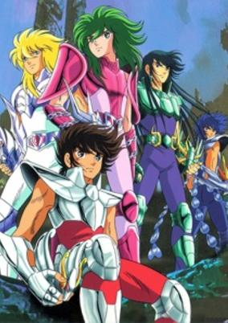

**Studio:** Toei Animation &nbsp;|&nbsp; **Director:** Kōzō Morishita, Kazuhito Kikuchi &nbsp;|&nbsp; **Aired/Released:** October 11 &nbsp;|&nbsp; **Genres:** Fantasy, Science Fiction, Action, Deity, Martial Arts, Drama, Alternative Present, Plot Continuity, Violence, Present, Super Power, Henshin, Adventure, Shounen

> In ancient times, a group of young men devoted their lives to protecting Athena, the Goddess of Wisdom and War. These men were capable of fighting without weapons—a swing of their fist alone was powerful enough to rip the very sky apart and shatter the earth beneath them. These brave heroes became known as Saints, as they could summon up the power of the Cosmos from within themselves. Now, in present day, a new generation of Saints is about to come forth. The young and spirited Seiya is fighting a tough battle for the Sacred Armor of Pegasus, and he isn't about to let anyone get in the way of him and his prize. Six years of hard work and training pay off with his victory and new title as one of Athena's Saints. But Seiya's endeavor doesn't end there. In fact, plenty of perils and dangerous enemies face him and the rest of the Saints throughout the series. What new quests await the heroes of the epic Saint Seiya saga?
>
> _Synopsis source: Kitsu_

[Wikipedia](https://en.wikipedia.org/wiki/Saint_Seiya) · [Kitsu](https://kitsu.io/anime/saint-seiya)

---

### Doteraman

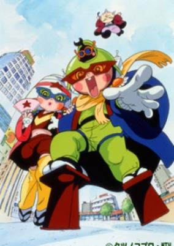

**Studio:** Tatsunoko Production &nbsp;|&nbsp; **Director:** Shinya Sadamitsu &nbsp;|&nbsp; **Aired/Released:** October 14 &nbsp;|&nbsp; **Genres:** Science Fiction, Comedy

> In a small town of Tokyo there lives a middle-aged man, Suzuki, who spends commonplace days conducting a small business. He is ambitious to become such a celebrity as to appear on the cover page of a popular magazine. One day he happens to discover a mysterious entrance that leads to an alien space. Through it he reaches the world of goblins and attaches control devices to goblins there to make them act at his free command. Capitalizing on those zombies, he grows outrageous and notoriously sets his hand to evil things. Meanwhile two witty pupils, Hajime and his girl friend Mariko, come across a strange alien detective who presents them with Doteraman garments. Wearing those garments, they transform themselves into Doteraman and Doterapink with supernatural strength. Then they challenge the wicked ruler and successfully liberate the poor goblins. They continue to fight in the cause of justice creating excitement and entertainment full of pleasure.
>
> _Synopsis source: Kitsu_

[Wikipedia](https://en.wikipedia.org/wiki/Doteraman) · [Kitsu](https://kitsu.io/anime/doteraman)

---

### Ganbare, Kickers! (Fight! Kickers)

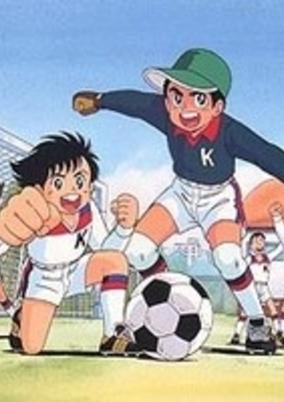

**Studio:** Studio Pierrot &nbsp;|&nbsp; **Director:** Akira Shigino &nbsp;|&nbsp; **Aired/Released:** October 15 &nbsp;|&nbsp; **Genres:** Action, Sports, Soccer, School Life, Comedy

> The Kickers are first and foremost a football team. Actually, they're only playing for their school, but haven't exactly covered themselves with glory. When the new player, Gregor (Daichi Kakeru) arrives at the school, they just had faced a resounding defeat again. However, thanks to Gregor, things are going to change. Highly motivated, they'll try to get rid of their "always-loser-team" image. Their strongest enemy are the Devils, who Gregor provokes right from the start. However, it's not all about football. When the captain, Mario (Hongou Masaru), is not pursued by his female fans, the Kickers often hang around and do stuff together.
>
> _Synopsis source: Kitsu_

[Wikipedia](https://en.wikipedia.org/wiki/Ganbare,_Kickers!) · [Kitsu](https://kitsu.io/anime/ganbare-kickers)

---

### Mock & Sweet

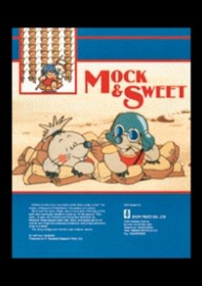

**Studio:** Japcon Mart &nbsp;|&nbsp; **Director:** Hiroyuki Yokoyama, Masahiko Fukutomi, Takajuki Kaneko &nbsp;|&nbsp; **Aired/Released:** October 15 &nbsp;|&nbsp; **Genres:** Fantasy, Adventure, Kids

> Mock and his sister, Sweet, are curious about the fuss on the earth and eventually decide to come out of the ground. They save the poor, the innocent and the brave whenever and wherever these people need help. Mock and Sweet get rid of tyrants, evil kings and notorious emperors, with smart and funny tricks a la Mole! The story background follows major historic events.
>
> _Synopsis source: Kitsu_

[Wikipedia](https://en.wikipedia.org/wiki/Mock_%26_Sweet) · [Kitsu](https://kitsu.io/anime/mock-sweet)

---

### Blue Comet SPT Layzner

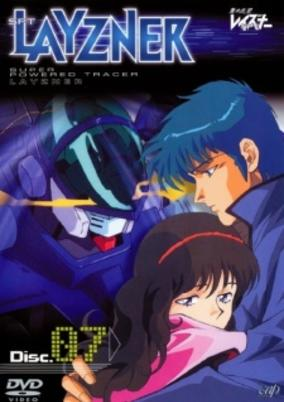

**Studio:** Nippon Sunrise &nbsp;|&nbsp; **Director:** Ryōsuke Takahashi &nbsp;|&nbsp; **Aired/Released:** October 21 &nbsp;|&nbsp; **Genres:** Science Fiction, Mecha, Earth, Action, Piloted Robot, Humanoid Alien, Alien, Space, Military

> The Story takes place in an alternate reality based in the year 1996, where humanity is advanced enough to develop long-range space travel, as well as bases on both the Moon and Mars. However, the Cold War tensions between the United States and the Soviet Union have not ended; rather, they've escalated as both sides build military facilities in space, and the shadow of nuclear conflict looms over humanity, both on and off Earth. Meanwhile, on the Red Planet, an exchange program created by the United Nations to promote peace and understanding is about to begin; the "Cosmic Culture Club", consisting of 16 boys and girls, as well as their instructor Elizabeth, arrives at the UN Mars base, and are being welcomed by the staff. Among the passengers is Anna a 14 year old girl who serves as the narrator for the story. Suddenly, four unidentified humanoid robots classified as Super Powered Tracers are detected, engaged in fierce combat with each other. The UN base is caught in the crossfire and quickly destroyed, killing all but six members of the "Cosmic Culture Club"--Elizabeth, Arthur, Roan, David, Simone and Anna, and leaving them stranded on an inhospitable planet that has suddenly become a battlefield. As the battle ends, the lone SPT standing lands next to the terrified group and opens up revealing a pilot, who simply announces to them, "Earth is at stake". The robots who destroyed the UN base were the creation of the Grados, an alien race, from the Udoria system, who came to the Sol system for the purpose of conquest, seeing an easy victory as the two superpowers raged against each other to exaustion--however, this could also be described as an act of pre-emptive self-defense; the Gradosian supercomputers have determined that humanity will eventually cease its infighting and become powerful enough to spread through the galaxy, posing a destructive threat to even the far off Grados. However, there were two Grados opposed to the plan: human astronaut Ken Asuka, assumed lost during a deep space mission but discovered by the Grados, and his son Null Albarto (his "human" name being Eiji). As the Grados prepared their invasion fleet, Eiji stows away on board one of the ships and steals their most powerful and advanced weapon, the SPT-LZ-00X Layzner before fleeing, seeking to warn humanity of its impending invasion. It was here where he was attacked. Aside from the Layzner, the surviving humans have now become very important to the Grados; as the only human eyewitnesses to the aliens and their power, the six are the only ones who can convince the warring powers to stand down from destroying each other, and focus on the greater threat.
>
> _Synopsis source: Kitsu_

[Wikipedia](https://en.wikipedia.org/wiki/Blue_Comet_SPT_Layzner) · [Kitsu](https://kitsu.io/anime/aoki-ryuusei-spt-layzner)

---

### They Were Eleven

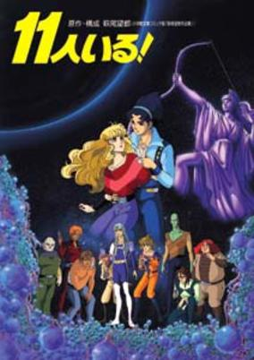

**Studio:** Kitty Film &nbsp;|&nbsp; **Director:** Tetsu Dezaki , Tsuneo Tominaga &nbsp;|&nbsp; **Aired/Released:** November 1 &nbsp;|&nbsp; **Genres:** Science Fiction, Mecha, Cyborg, Humanoid Alien, Shipboard, Alien, Future, Space, Action, Adventure, Romance, Mystery

> The elite Cosmo Academy attracts applicants from every stellar nation in the galaxy. One young hopeful is Tadatos Lane, an orphan esper from Terra. The final stage of the academy's entrance exam is a perilous mission simulation aboard an actual derelict starship. The applicants depart for the ships in groups of ten, but when Tada's crew arrives on the Esperanza, they are horrified to discover that they now number eleven. As the test progresses, things go awry and the atmosphere grows increasingly tense. The crew members begin to suspect sabotage, and Tada appears to be the likely culprit.
>
> _Synopsis source: Kitsu_

[Wikipedia](https://en.wikipedia.org/wiki/They_Were_Eleven) · [Kitsu](https://kitsu.io/anime/they-were-11)

---

### Heavy Metal L-Gaim

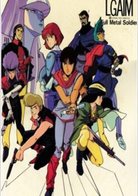

**Studio:** Nippon Sunrise &nbsp;|&nbsp; **Director:** Yoshiyuki Tomino &nbsp;|&nbsp; **Aired/Released:** November 5 &nbsp;|&nbsp; **Genres:** Mecha, Action, Science Fiction

> A side story taking place somewhere before the second half of the series, prior to Daba acquiring the L-Gaim Mk-II. Daba's comrade Leccee is captured by Poseidal's forces, and Daba and his rebels attempt to save her.
>
> _Synopsis source: Kitsu_

[Wikipedia](https://en.wikipedia.org/wiki/Heavy_Metal_L-Gaim) · [Kitsu](https://kitsu.io/anime/juusenki-l-gaim-iii-full-metal-soldier)

---

### Dirty Pair: Project Eden

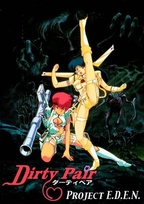

**Studio:** Nippon Sunrise &nbsp;|&nbsp; **Director:** Kōichi Mashimo &nbsp;|&nbsp; **Aired/Released:** November 28 &nbsp;|&nbsp; **Genres:** Detective, Alien, Future, Other Planet, Violence, Action, Science Fiction, Adventure, Comedy, Cops

> Agerna is a planet rich in Vizorium, the one mineral necessary to space travel. So when a series of mysterious attacks on mining operations has the governments of the world pointing fingers and blaming each other, the World Welfare &amp; Works Association naturally sends in their top agents to investigate. But are the lovely angels up to the task of stopping a mad scientist bent on taking a long dormant alien race to its final evolutionary form? Throw in a thief who's hunting a bottle of World War II-vintage wine and it's a safe bet that nobody on the planet is safe. It's more chaos, more mayhem and even more destruction than ever before as the Dirty Pair take on their wildest case yet!
>
> _Synopsis source: Kitsu_

[Kitsu](https://kitsu.io/anime/dirty-pair-project-eden)

---

### Grey: Digital Target

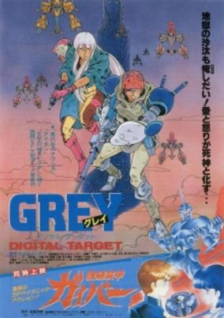

**Studio:** Magic Bus, Tokuma Japan Corp. &nbsp;|&nbsp; **Director:** Tetsu Dezaki &nbsp;|&nbsp; **Aired/Released:** December 13 &nbsp;|&nbsp; **Genres:** Science Fiction, Action, Post Apocalypse, Rotten World, Future, Violence, Military, Fantasy

> Grey is a laconic trooper in a rough, futuristic military system which rewards success in battle with high pay and promotions, but only three precent of troopers live long enough for the final goal - citizenship and the chance for a life above the misery of most of the populace. Grey has managed to keep coming back alive, even earning the nickname Grey Death. But is the society he's fought for worth it?
>
> _Synopsis source: Kitsu_

[Wikipedia](https://en.wikipedia.org/wiki/Grey_(manga)) · [Kitsu](https://kitsu.io/anime/grey-digital-target)

---

### Guyver: Out of Control

**Studio:** Studio Wave &nbsp;|&nbsp; **Director:** Hiroshi Watanabe &nbsp;|&nbsp; **Aired/Released:** December 13 &nbsp;|&nbsp; **Genres:** Power Suit, Science Fiction, Action, Earth, Asia, Human Enhancement, Mecha, Japan, Violence, Present, Super Power, Horror

> The plot of this OVA is a rough adaptation of the first four chapters of the Guyver manga. It covers the same basic elements of these chapters; Genesis of the guyver, Fight with Vamore, Fight with Guyver 2 and the introduction of Guyver 3. Main differences are the exclusion of Tetsuro and his replacement by Mizuki, The replacement of Lisker with a female Agent "Valcuria", and thus a female Guyver 2. There is also a look at Sho's psychology of how he deals with his situation including a very harsh moment where his friends are assassinated in cold blood. One night, high school student Sho Fukamachi discovers a mysterious metal object. Then in a blinding flash of light, Sho finds that he has accidentally fused with the Guyver, a mecha of mysterious alien design. Now, to save his girlfriend, Mizuki Segawa, along with the entire world, Sho must become the Guyver to fight the Chronos Corporation and their biocreatures, called Zoanoids, who are hell-bent on world domination.
>
> _Synopsis source: Kitsu_

[Kitsu](https://kitsu.io/anime/kyoushoku-soukou-guyver)

---

### Touch 2: Sayonara no Okurimono

**Studio:** Group TAC &nbsp;|&nbsp; **Director:** Naoto Hashimoto &nbsp;|&nbsp; **Aired/Released:** December 13

[Wikipedia](https://en.wikipedia.org/wiki/Touch_(manga))

---

### Outlanders

**Studio:** AIC &nbsp;|&nbsp; **Director:** Katsuhisa Yamada &nbsp;|&nbsp; **Aired/Released:** December 16 &nbsp;|&nbsp; **Genres:** Romance, Science Fiction, Space Opera, Sudden Girlfriend Appearance, Humanoid Alien, Shipboard, Alien, Present, Space, Adventure, Comedy, Ecchi

> In the midst of a violent invasion of Earth by unknown alien forces, photojournalist Wakatsuki Tetsuya comes across a scantily-clad alien woman, cutting a swath of death through the Terran ranks with her sword. After a chaotic struggle, Tetsuya is knocked unconscious, only to awaken aboard her starship. To his surprise, she turns out to be Kahm, the invaders' princess - and she has picked Tetsuya for a starring role in her upcoming wedding. As the groom...
>
> _Synopsis source: Kitsu_

[Wikipedia](https://en.wikipedia.org/wiki/Outlanders_(manga)) · [Kitsu](https://kitsu.io/anime/outlanders)

---

### Dragon Ball: Curse of the Blood Rubies (Dragon Ball Movie 1: Curse of the Blood Rubies)

**Studio:** Toei Animation &nbsp;|&nbsp; **Director:** Daisuke Nishio &nbsp;|&nbsp; **Aired/Released:** December 20 &nbsp;|&nbsp; **Genres:** Adventure, Martial Arts, Comedy, Action, Fantasy, Military, Super Power, Shounen

> A retelling of Dragon Ball's origins, this is a different version of the meeting of Goku, Bulma, Oolong, and Yamucha. They are all looking for the dragon balls for different reasons when they cross paths with an evil king named Gourmeth, who is also looking for the dragon balls.
>
> _Synopsis source: Kitsu_

[Kitsu](https://kitsu.io/anime/dragon-ball-movie-1-shen-long-no-densetsu)

---

### Phoenix: Ho-ō

**Studio:** Madhouse , Tezuka Productions &nbsp;|&nbsp; **Director:** Rintaro &nbsp;|&nbsp; **Aired/Released:** December 20

[Wikipedia](https://en.wikipedia.org/wiki/Phoenix_(manga))

---

### Toki no Tabibito -Time Stranger-

**Studio:** Madhouse &nbsp;|&nbsp; **Director:** Mori Masaki &nbsp;|&nbsp; **Aired/Released:** December 21

[Wikipedia](https://en.wikipedia.org/wiki/Toki_no_Tabibito_-Time_Stranger-)

---

### Wanna-Be's

**Studio:** AIC , Artmic , Movic &nbsp;|&nbsp; **Director:** Yasuo Hasegawa &nbsp;|&nbsp; **Aired/Released:** December 25 &nbsp;|&nbsp; **Genres:** Wrestling, Action, Combat, Sports, Comedy, Violence

> This OVA begins with a tag-team battle between the elegant girls of Dream Team and the heavy-face-painted women of Foxy Ladies. Naturally, the Dream Team gets the crap kicked out of them, but not before one of them makes one strong attempt at lifting the 250-pound Foxy lady over her head. The ones to take their place are Eri and Miki of the Wanna-Be's team. Miki and Eri are both just fun girls who want to have fun, but once they begin their new training with the mysterious Kidou Corporation, the same corporation that trained the Dream Team, they discover that there is something deeper behind their training.
>
> _Synopsis source: Kitsu_

[Wikipedia](https://en.wikipedia.org/wiki/Wanna-Be%27s) · [Kitsu](https://kitsu.io/anime/wanna-be-s)

---

### Jūsenkitai Songs

**Studio:** Ashi Productions

[Wikipedia](https://en.wikipedia.org/wiki/Dancouga_%E2%80%93_Super_Beast_Machine_God)

---

### Most Dangerous Soldier

**Studio:** Studio Wave, Zero G-Room &nbsp;|&nbsp; **Director:** Hayato Ikeda &nbsp;|&nbsp; **Genres:** Gunfights, Future, Desert, Mecha, Power Suit, Piloted Robot, Other Planet, Violence, Stereotypes, Action

> In the distant future, mankind has colonized other planets in the universe. While many planets lived in peace, the planet Jerra has been ravaged by decades of war. Geist is an M.D.S. (Most Dangerous Soldier), an enhanced human with unsurpassed combat capabilities and an insatiable lust for battle. Because of his uncontrollable nature, Geist is cryogenically frozen and locked in a satellite. Several years later, the satellite crashes and Geist wakes up from his sleep to engage in another war. This time, to help the army stop the planet's central computer from activating a doomsday device that will lead to total annihilation of all life on Jerra.
>
> _Synopsis source: Kitsu_

[Wikipedia](https://en.wikipedia.org/wiki/MD_Geist) · [Kitsu](https://kitsu.io/anime/md-geist)

---

### My Favorite Fairy Tales

**Studio:** Saban Productions

[Wikipedia](https://en.wikipedia.org/wiki/My_Favorite_Fairy_Tales)

---
