# 1987 in Anime

[← Back to index](../README.md)

66 titles · 44 with a matched synopsis/cover art · [source](https://en.wikipedia.org/wiki/1987_in_anime)

## Releases

### Little Women

**Studio:** Nippon Animation &nbsp;|&nbsp; **Director:** Fumio Kurokawa &nbsp;|&nbsp; **Aired/Released:** January 11

[Wikipedia](https://en.wikipedia.org/wiki/Little_Women_(1987_TV_series))

---

### New Maple Town Stories: Palm Town Chapter (Maple Town)

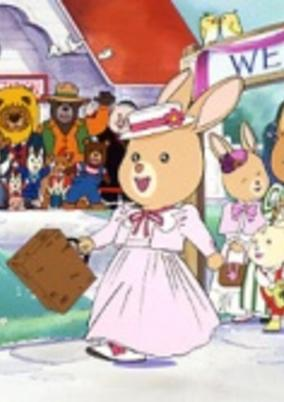

**Studio:** Toei Animation &nbsp;|&nbsp; **Director:** Hiroshi Shidara, Junichi Sato &nbsp;|&nbsp; **Aired/Released:** January 18 &nbsp;|&nbsp; **Genres:** Fantasy, Slice of Life

> Maple Town Stories is about friendship, adventure and the troubles the children (Patty Rabbit, Bobby Bear and Fanny Fox) who are the main characters of the show, fall into. Wild Wolfe is a homeless thief who lives in the forest and usually steals from the town and does other mischief, but the kids are always there to stop him and set things right slowly making him understand the wrongs of his ways.
>
> _Synopsis source: Kitsu_

[Wikipedia](https://en.wikipedia.org/wiki/Maple_Town) · [Kitsu](https://kitsu.io/anime/maple-town-monogatari)

---

### Magical Princess Minky Momo Hitomi no Seiza Minky Momo SONG Special

**Studio:** Ashi Productions &nbsp;|&nbsp; **Aired/Released:** January 21

[Wikipedia](https://en.wikipedia.org/wiki/Magical_Princess_Minky_Momo)

---

### Urotsukidōji

**Studio:** West Cape, Team Mu &nbsp;|&nbsp; **Director:** Hideki Takayama &nbsp;|&nbsp; **Aired/Released:** January 21

[Wikipedia](https://en.wikipedia.org/wiki/Urotsukid%C5%8Dji)

---

### Campus Special Investigator Hikaruon

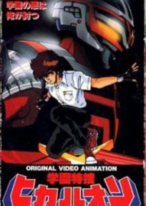

**Studio:** AIC &nbsp;|&nbsp; **Director:** Kazuhiro Ochi &nbsp;|&nbsp; **Aired/Released:** January 28 &nbsp;|&nbsp; **Genres:** Japan, Action, Asia, Earth, Martial Arts, Horror, Stereotypes, Present, Super Power, School Life

> Hikaru is at first sight a student like others but actually it is a super hero defending the Earth of the demons. He has a powerful super bike and a combat suit. Inspired by the classic Space Sheriff (Uchuu Keiji) trilogy of the Metal Heroes Tokusatsu franchise, namely Space Sheriff's Gavan and Sharivan.
>
> _Synopsis source: Kitsu_

[Wikipedia](https://en.wikipedia.org/wiki/Campus_Special_Investigator_Hikaruon) · [Kitsu](https://kitsu.io/anime/gakuen-tokusou-hikaruon)

---

### Metal Armor Dragonar

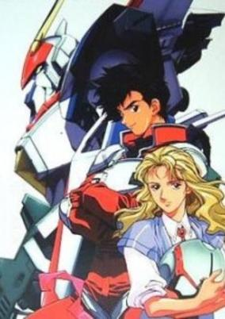

**Studio:** Sunrise &nbsp;|&nbsp; **Director:** Takeyuki Kanda &nbsp;|&nbsp; **Aired/Released:** February 7 &nbsp;|&nbsp; **Genres:** Piloted Robot, Science Fiction, Military, Mecha, Space, Adventure

> A.D. 2087 - the United Lunar Empire Giganos wages war on the Earth Federation Military to take control of the planet and establish a "rebirth" of the human race. During an invasion of a colony by Giganos' forces, three civilian men stumble upon a trio of top-secret Metal Armor units called "Dragonars" and pilot them to combat the enemy forces.
>
> _Synopsis source: Kitsu_

[Wikipedia](https://en.wikipedia.org/wiki/Metal_Armor_Dragonar) · [Kitsu](https://kitsu.io/anime/kikou-senki-dragonar)

---

### Bubblegum Crisis

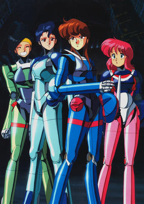

**Studio:** AIC , Artmic &nbsp;|&nbsp; **Director:** Katsuhito Akiyama , Masami Ōbari , Hiroaki Gōda &nbsp;|&nbsp; **Aired/Released:** February 25 &nbsp;|&nbsp; **Genres:** Earth, Power Suit, Science Fiction, Mecha, Japan, Action, Asia, Tokyo, Cyberpunk, Future, Violence, Adventure

> In the near future, Tokyo was left flattened as a result from a great earthquake. A new city, MegaTokyo, was then recreated due in no small part from the aid of a multi-million dollar company, Genom Corp. Genom created and mass-produced biomechanical creatures called Boomers to aid in the restoration of MegaTokyo. When the Boomers began to run out of control, the ADPolice at first tried to stop them, but they proved to be far more difficult to deal with than was first imagined. Under the ever looming Boomer threat, a group of four girls from varying degrees of society banded together. Calling themselves The Knight Sabers, they were the only ones with enough firepower and resourcefullness to defend the fledgling MegaTokyo from Genom and it's berserk Boomers.
>
> _Synopsis source: Kitsu_

[Wikipedia](https://en.wikipedia.org/wiki/Bubblegum_Crisis) · [Kitsu](https://kitsu.io/anime/bubblegum-crisis)

---

### Twilight Q

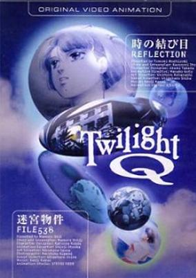

**Studio:** Ajia-do Animation Works , Studio Deen &nbsp;|&nbsp; **Director:** Tomomi Mochizuki , Mamoru Oshii &nbsp;|&nbsp; **Aired/Released:** February 28 &nbsp;|&nbsp; **Genres:** Fantasy, Science Fiction, Japan, Contemporary Fantasy, Asia, Earth, Time Travel, Present, Psychological, Mystery

> A Knot in Time - Reflection Mayu found a camera floating in the ocean while she was on vacation. A very unusual camera. The film, mostly intact, reveals a picture of herself with a man she has never seen before. But that is not all. The unusual part is that this camera has not been made yet... and will not be made for another two years. And soon, Mayu finds herself swinging uncontrollably back and forth through time like a pendulum... Mystery Case - File 538 A down-on-his-luck detective accepts the first case to come his way: surveillance of a man and a little girl. But who are they? And why do aeroplanes that fly over them turn into giant imperial carp? An investigator's normal methods do not apply when reality itself no longer applies... (Source: AniDB) Note: The series was meant to be a showcase for various anime directors. Unfortunately, only two parts ever got made.
>
> _Synopsis source: Kitsu_

[Wikipedia](https://en.wikipedia.org/wiki/Twilight_Q) · [Kitsu](https://kitsu.io/anime/twilight-q)

---

### Hokuto no Ken 2

**Studio:** Toei Animation &nbsp;|&nbsp; **Director:** Toyoo Ashida &nbsp;|&nbsp; **Aired/Released:** March 13

[Wikipedia](https://en.wikipedia.org/wiki/Fist_of_the_North_Star)

---

### Doraemon: Nobita and the Knights on Dinosaurs (Doraemon the Movie: Nobita and the Knights on Dinosaurs)

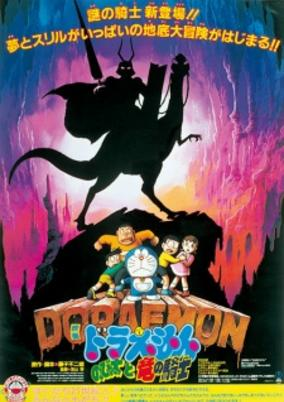

**Studio:** Shin-Ei Animation &nbsp;|&nbsp; **Director:** Tsutomu Shibayama &nbsp;|&nbsp; **Aired/Released:** March 14 &nbsp;|&nbsp; **Genres:** Comedy, Fantasy, Adventure, Kids

> Doraemon created a hideout for everyone in an underground cave and Suneo got lost. Everyone came back out except Suneo. After finding out that he was lost the entrance was broken. They have to find another entrance to the caves and end up in a dinosaur world. Vanho , a soldier rescued them and said that he found Suneo. When they found Suneo they found out about Vanho's people's plans. Their plan it to study Doraemon's group as human specimens and take over Earth's suface .
>
> _Synopsis source: Kitsu_

[Kitsu](https://kitsu.io/anime/doraemon-nobita-and-the-dragon-rider)

---

### Bats & Terry

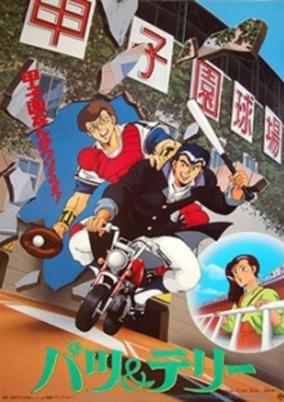

**Studio:** Sunrise &nbsp;|&nbsp; **Director:** Nobuo Mizuta &nbsp;|&nbsp; **Aired/Released:** March 14 &nbsp;|&nbsp; **Genres:** Comedy, Sports, School Life, Drama

> Bats &amp; Terry are the two tough guys in the school. They don't take crap from anyone, not even teachers. They will fight anyone necessary, and will defend strangers (especially pretty girls) from danger. They're good at it too. Some people are in terror of them, and some love them. When they rescue one especially pretty girl from a gang they fight over her, but it's all friendly and they both recognize that she has some scars. The police hassle them and yet admire them when they break up the gang. Oh, and they're the star pitcher and catcher for the high school baseball team!
>
> _Synopsis source: Kitsu_

[Wikipedia](https://en.wikipedia.org/wiki/Bats_%26_Terry) · [Kitsu](https://kitsu.io/anime/batsu-terry)

---

### New Maple Town Stories: Home Town Collection (Maple Town)

**Studio:** Toei Animation &nbsp;|&nbsp; **Director:** Hiroshi Shidara &nbsp;|&nbsp; **Aired/Released:** March 14 &nbsp;|&nbsp; **Genres:** Fantasy, Slice of Life

> Maple Town Stories is about friendship, adventure and the troubles the children (Patty Rabbit, Bobby Bear and Fanny Fox) who are the main characters of the show, fall into. Wild Wolfe is a homeless thief who lives in the forest and usually steals from the town and does other mischief, but the kids are always there to stop him and set things right slowly making him understand the wrongs of his ways.
>
> _Synopsis source: Kitsu_

[Wikipedia](https://en.wikipedia.org/wiki/Maple_Town) · [Kitsu](https://kitsu.io/anime/maple-town-monogatari)

---

### Royal Space Force: The Wings of Honnêamise (Royal Space Force: The Wings of Honneamise)

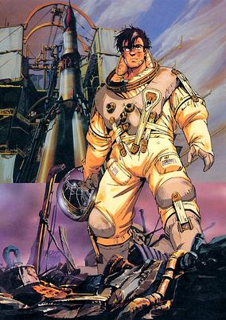

**Studio:** Gainax &nbsp;|&nbsp; **Director:** Hiroyuki Yamaga &nbsp;|&nbsp; **Aired/Released:** March 14 &nbsp;|&nbsp; **Genres:** Science Fiction, Fantasy World, Action, Coming Of Age, Shipboard, Parallel Universe, Space, Military

> "I will not give up. I will realize my dream...even if it means death!" When cadet Shiro Lhadatt signs up with the Royal Space Force, he encounters ridicule and apathy from manipulative leaders and a cynical public. But a chance encounter with a devout young woman spurs Shiro on towards his destiny: to become the first man in space! While military leaders conspire to use the space program to spark an all-out war, Shiro and a team of aging scientists race against time to complete the first launch.
>
> _Synopsis source: Kitsu_

[Kitsu](https://kitsu.io/anime/ouritsu-uchuugun-honneamise-no-tsubasa)

---

### New Cream Lemon (Lemon Angel)

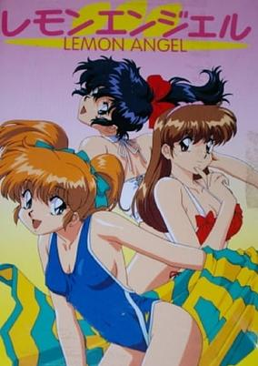

**Aired/Released:** March 21 &nbsp;|&nbsp; **Genres:** Ecchi

> Franchise combining a real life idol trio and limited animation short stories, with their cartoon alter egos thrown into various bizarre and generally sexual situations.
>
> _Synopsis source: Kitsu_

[Wikipedia](https://en.wikipedia.org/wiki/Cream_Lemon) · [Kitsu](https://kitsu.io/anime/cream-lemon-lemon-angel)

---

### Laughing Target

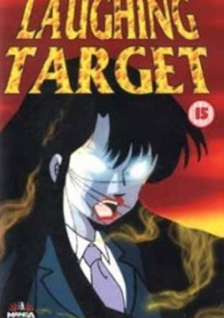

**Studio:** Studio Pierrot &nbsp;|&nbsp; **Director:** Motosuke Takahashi &nbsp;|&nbsp; **Aired/Released:** March 21 &nbsp;|&nbsp; **Genres:** High School, Horror, Japan, Plot Continuity, Present, Mystery, Shounen

> Yuzuru was an average teenager who had almost forgotten that he was betrothed to Azusa when he was only six! Now arriving to claim what she feels is rightfully hers, only Satomi (Yuzuru's current girlfriend) stands in her way... and with the mysterious and frightening powers that Azusa brings, Satomi won't stand in her way for long!
>
> _Synopsis source: Kitsu_

[Wikipedia](https://en.wikipedia.org/wiki/Laughing_Target) · [Kitsu](https://kitsu.io/anime/warau-hyouteki)

---

### Hiatari Ryōkō! (Sunny Ryoko! You Were There in a Dream)

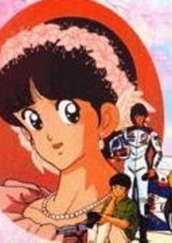

**Studio:** Group TAC &nbsp;|&nbsp; **Director:** Gisaburō Sugii &nbsp;|&nbsp; **Aired/Released:** March 22 &nbsp;|&nbsp; **Genres:** Comedy, Drama, Romance

> The movie starts out with Katsuhiko going to the US, with Kasumi and Yusaku seeing him off at Narita. Two years later, Katsuhiko is a professional racer, and comes back to Japan to race (and to marry Kasumi). Yusaku's hobby is photography.
>
> _Synopsis source: Kitsu_

[Wikipedia](https://en.wikipedia.org/wiki/Hiatari_Ry%C5%8Dk%C5%8D!) · [Kitsu](https://kitsu.io/anime/hiatari-ryoukou-yume-no-naka-ni-kimi-ga-ita)

---

### Digital Devil Story: Megami Tensei

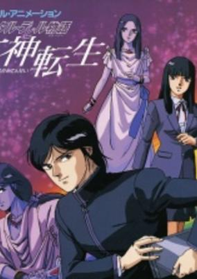

**Director:** Mizuho Nishikubo &nbsp;|&nbsp; **Aired/Released:** March 27 &nbsp;|&nbsp; **Genres:** Contemporary Fantasy, Fantasy, Japan, Asia, Earth, Horror, Violence, Present, Demon, Super Power, Adventure, School Life, Psychological, Mystery

> The story revolves around two high school students Akemi and Yumiko, who share a mysterious intertwining past lives. Akemi bullied at school but a genius has managed to create a demon summoning program to get revenge but chaos ensues.
>
> _Synopsis source: Kitsu_

[Kitsu](https://kitsu.io/anime/digital-devil-monogatari-megami-tensei)

---

### Minna Agechau

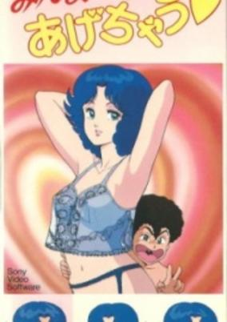

**Studio:** Animate , J.C.Staff &nbsp;|&nbsp; **Director:** Osamu Uemura &nbsp;|&nbsp; **Aired/Released:** March 27 &nbsp;|&nbsp; **Genres:** Ecchi, Japan, Asia, Earth, Comedy, Sudden Girlfriend Appearance, Present, Romance

> A beautiful day Rokurou, a student, was to masturbate when a beautiful girl knocks on his door: You need a virgin? And so begins the story. Rokurou did not know what it was that this beautiful girl was a millionaire family.
>
> _Synopsis source: Kitsu_

[Wikipedia](https://en.wikipedia.org/wiki/Minna_Agechau) · [Kitsu](https://kitsu.io/anime/minna-agechau)

---

### Hoero! Bun Bun

**Studio:** Madhouse &nbsp;|&nbsp; **Director:** Toshio Hirata &nbsp;|&nbsp; **Aired/Released:** April 4

---

### City Hunter

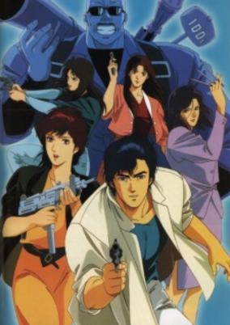

**Studio:** Sunrise &nbsp;|&nbsp; **Director:** Kenji Kodama &nbsp;|&nbsp; **Aired/Released:** April 6 &nbsp;|&nbsp; **Genres:** Mafia, Japan, Violence, Action, Present, Comedy, Violent Retribution For Accidental Infringement, Gunfights, Detective, Crime, Slapstick, Mystery

> Ryo Saeba works the streets of Tokyo as the City Hunter. He's a "sweeper" and with his sidekick Kaori Makimura, he keeps the city clean. People hire the City Hunter to solve their dangerous problems, which he does with a Colt Python. When Ryo's not working on a case, he's working on getting the ladies, and Kaori must keep him in check with her trusty 10 kg hammer.
>
> _Synopsis source: Kitsu_

[Wikipedia](https://en.wikipedia.org/wiki/City_Hunter) · [Kitsu](https://kitsu.io/anime/city-hunter)

---

### Kimagure Orange Road

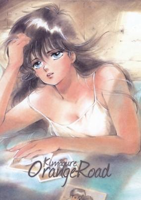

**Studio:** Studio Pierrot &nbsp;|&nbsp; **Director:** Osamu Kobayashi &nbsp;|&nbsp; **Aired/Released:** April 6 &nbsp;|&nbsp; **Genres:** Romance, Japan, Action, Asia, Earth, Comedy, Love Polygon, High School, Slapstick, School Life, Present, Super Power, Slice of Life

> Fifteen-year-old Kyosuke Kasuga moves to a new city and becomes enamored by one Madoka Ayukawa, whom often treats him coldly even though she seemed friendly the first time they met, when he caught her red straw hat on the stairs. Kyosuke also must try to avoid breaking the heart of the slightly childish Hikaru Hiyama, who fell in love with him after she saw him make an impossible shot with a basketball and who likes to shower him with affection. Also, just to make things interesting, Kyosuke, his sisters, his grandfather, and his cousins all have various powers (teleportation, psychokinesis, hypnosis, time travel, personality transference) which Kyosuke desperately tries to keep a secret, though some of the other family members have no such qualms against using their powers in public.
>
> _Synopsis source: Kitsu_

[Wikipedia](https://en.wikipedia.org/wiki/Kimagure_Orange_Road) · [Kitsu](https://kitsu.io/anime/kimagure-orange-road)

---

### Esper Mami

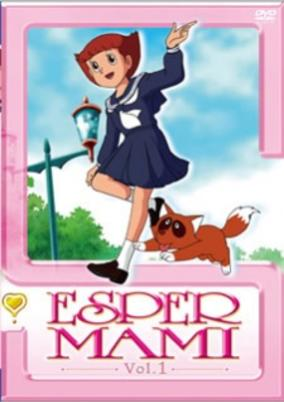

**Studio:** Shin-Ei Animation &nbsp;|&nbsp; **Director:** Keiichi Hara &nbsp;|&nbsp; **Aired/Released:** April 7 &nbsp;|&nbsp; **Genres:** Comedy, School Life, Magical Girl, Magic, Super Power, Ecchi

> Mami Sakura used to be a normal junior high school student, but she happened to acquire supernatural powers. Using her powers and with the help of her best friend, Mr. Takahata, she solves mysterious occurrences. When she senses someone needs help, she uses the "Teleportation Gun" and transports herself there. She then saves the world in trouble with her psychic powers, such as telekinesis and telepathy.
>
> _Synopsis source: Kitsu_

[Wikipedia](https://en.wikipedia.org/wiki/Esper_Mami) · [Kitsu](https://kitsu.io/anime/esper-mami)

---

### Ox Tales

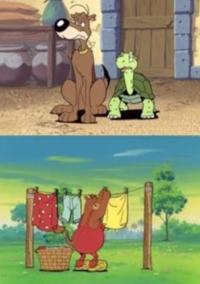

**Studio:** Studio Cosmos, Telecable Benelux B.V. &nbsp;|&nbsp; **Director:** Hiroshi Sasagawa &nbsp;|&nbsp; **Aired/Released:** April 7 &nbsp;|&nbsp; **Genres:** Comedy, Kids

> Farm life has never been this wacky. Where else could you find a turtle with a built in TV under his shell, a bald lion, an elephant whose trunk doubles as a garden hose and an inflatable octopus. All run by a good-natured ox named Olly.
>
> _Synopsis source: Kitsu_

[Wikipedia](https://en.wikipedia.org/wiki/Ox_Tales) · [Kitsu](https://kitsu.io/anime/geragera-boes-monogatari)

---

### Touch 3: Kimi ga Tōri Sugita Ato ni

**Studio:** Group TAC &nbsp;|&nbsp; **Director:** Akinori Takaoka &nbsp;|&nbsp; **Aired/Released:** April 11

[Wikipedia](https://en.wikipedia.org/wiki/Touch_(manga))

---

### Zillion

**Studio:** Tatsunoko , Production I.G &nbsp;|&nbsp; **Director:** Akira Watanabe &nbsp;|&nbsp; **Aired/Released:** April 12

[Wikipedia](https://en.wikipedia.org/wiki/Zillion_(anime))

---

### God Bless Dancouga

**Studio:** Ashi Productions &nbsp;|&nbsp; **Aired/Released:** April 15

[Wikipedia](https://en.wikipedia.org/wiki/Dancouga_%E2%80%93_Super_Beast_Machine_God)

---

### Wicked City

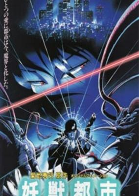

**Studio:** Madhouse &nbsp;|&nbsp; **Director:** Yoshiaki Kawajiri &nbsp;|&nbsp; **Aired/Released:** April 25 &nbsp;|&nbsp; **Genres:** Alternative Present, Dark Fantasy, Japan, Asia, Violence, Special Squads, Earth, Horror, Action, Demon, Super Power, Adventure, Contemporary Fantasy

> There is Earth, our familiar world, and then there is the Black World, a parallel dimension that very few people are aware of. For centuries, a pact between the two worlds has been observed to maintain peace, and terms must be negotiated and renewed soon to continue relative harmony. This time around, there is a militant faction that will stop at nothing to prevent the signing of a new treaty for inter-dimensional peace. Two agents of the elite organization known as the Black guards—defenders of the balance between the two worlds—are charged with insuring the success of the treaty. Director Yoshiaki Kawajiri (Ninja Scroll) blends stylish eroticism, graphic horror and pulse-pounding action as these two race to consummate the peace treaty in time.
>
> _Synopsis source: Kitsu_

[Wikipedia](https://en.wikipedia.org/wiki/Wicked_City_(1987_film)) · [Kitsu](https://kitsu.io/anime/wicked-city)

---

### Project A-ko 2: Plot of the Daitokuji Financial Group

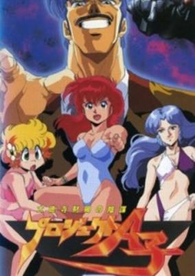

**Studio:** Studio A.P.P.P. &nbsp;|&nbsp; **Director:** Yuji Moriyama &nbsp;|&nbsp; **Aired/Released:** May 21 &nbsp;|&nbsp; **Genres:** Earth, Power Suit, Transforming Craft, Science Fiction, Mecha, Action, Parody, Comedy, Absurdist Humour, Conspiracy, Humanoid Alien, Alien, Female Student, Military, Super Power

> Three weeks after the incident that left Captain Napolipolita's ship balancing on top of Graviton City, A-Ko and the gang go on summer vacation. While A-Ko ponders losing some weight and B-Ko devises another plan to defeat her redheaded rival to win C-Ko, Napolipolita and Spy-D experience severe homesickness - begging for a way to return to their home planet. Meanwhile, Hikari Daitokuji - B-Ko's father and the CEO of the Daitokuji Financial Group - arms the local military with new mecha to attack Napolipolita's ship and obtain its advanced technology.
>
> _Synopsis source: Kitsu_

[Kitsu](https://kitsu.io/anime/project-a-ko-2-daitokuji-zaibatsu-no-inbou)

---

### Yōtōden

**Studio:** J.C.Staff &nbsp;|&nbsp; **Director:** Osamu Yamazaki &nbsp;|&nbsp; **Aired/Released:** May 21

[Wikipedia](https://en.wikipedia.org/wiki/Y%C5%8Dt%C5%8Dden)

---

### Machine Robo: Battle Hackers

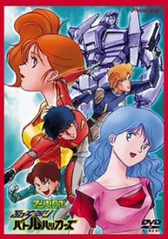

**Studio:** Ashi Productions &nbsp;|&nbsp; **Aired/Released:** June 3 &nbsp;|&nbsp; **Genres:** Mecha, Action, Science Fiction

> A ship crewed by earthlings crashes on Chronos. Believing themselves stranded, the crew volunteers to fight along the Machine Robos.
>
> _Synopsis source: Kitsu_

[Kitsu](https://kitsu.io/anime/machine-robo-butchigiri-battle-hackers)

---

### Shin Kabukicho Story Hana no Asuka-gumi!

**Aired/Released:** June 12

[Wikipedia](https://en.wikipedia.org/wiki/Hana_no_Asuka-gumi!)

---

### Space Fantasia 2001 Nights

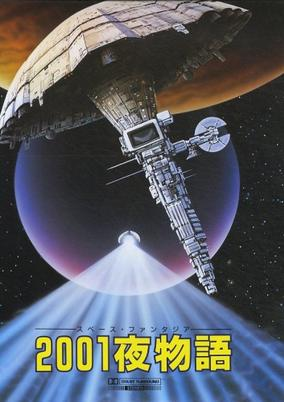

**Studio:** TMS Entertainment &nbsp;|&nbsp; **Director:** Yoshio Takeuchi &nbsp;|&nbsp; **Aired/Released:** June 21 &nbsp;|&nbsp; **Genres:** Space Travel, Science Fiction, Other Planet, Shipboard, Future, Space

> Based on Yukinobu Hoshino's 1984 manga in "Action Comics; shot in "Super Perspective Technique". It is the 21st century, and two young people were chosen. Adam was sent off into a space ship and was sent off into outer space...
>
> _Synopsis source: Kitsu_

[Wikipedia](https://en.wikipedia.org/wiki/2001_Nights) · [Kitsu](https://kitsu.io/anime/space-fantasia-2001-nights)

---

### The Super Dimension Fortress Macross: Flash Back 2012

**Studio:** Studio Nue , Artland , Tatsunoko Production &nbsp;|&nbsp; **Director:** Shoji Kawamori &nbsp;|&nbsp; **Aired/Released:** June 21

---

### Black Magic M-66

**Studio:** AIC &nbsp;|&nbsp; **Director:** Hiroyuki Kitakubo , Masamune Shirow &nbsp;|&nbsp; **Aired/Released:** June 28

[Wikipedia](https://en.wikipedia.org/wiki/Black_Magic_(manga))

---

### Transformers: The Headmasters (Transformers The Headmasters)

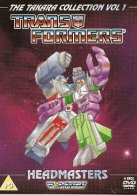

**Studio:** Toei Animation &nbsp;|&nbsp; **Director:** Katsutoshi Sasaki, Shoji Tajima &nbsp;|&nbsp; **Aired/Released:** July 3 &nbsp;|&nbsp; **Genres:** Space Travel, Transforming Craft, Science Fiction, Mecha, Adventure, Action, Gunfights, Other Planet, Alien, Future, Space

> Headmasters starts with Galvatron leading a new batch of Destrons to wage war on Cybertron, the Destron Headmasters. The Cybertrons are rescued by the arrival of the Cybertron Headmasters, led by Fortress (Cerebros, the head of Fortress Maximus). It is revealed that Fortress Maximus left Cybertron millions of years ago in search of energy, and have finally managed to come home. He explains that the Headmasters are from a planet called Master; the human-sized robots who live there built themselves Transformers-sized bodies. They can then transform themselves into the heads of the robots, and have now joined the Cybertron-Destron war.
>
> _Synopsis source: Kitsu_

[Kitsu](https://kitsu.io/anime/transformers-headmasters)

---

### Maps: Densetsu no Samayoeru Seijintachi

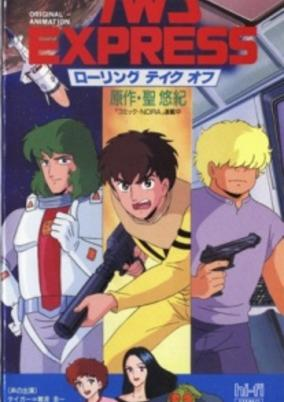

**Studio:** Studio Gallop &nbsp;|&nbsp; **Director:** Keiji Hayakawa &nbsp;|&nbsp; **Aired/Released:** July 14 &nbsp;|&nbsp; **Genres:** Science Fiction, Adventure

> Based on a manga by Hijiri Yuki, serialised in Comic Nora. Note: Shown in theaters as a double bill with the anime feature MAPS: Densetsu no Samayoeru Seijin-tachi.
>
> _Synopsis source: Kitsu_

[Wikipedia](https://en.wikipedia.org/wiki/Maps_(manga)) · [Kitsu](https://kitsu.io/anime/twd-express-rolling-takeoff)

---

### Dragon Ball: Sleeping Princess in Devil's Castle (Dragon Ball Movie 2: Sleeping Princess in Devil's Castle)

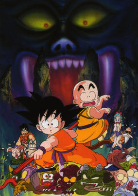

**Studio:** Toei Animation &nbsp;|&nbsp; **Director:** Daisuke Nishio &nbsp;|&nbsp; **Aired/Released:** July 18 &nbsp;|&nbsp; **Genres:** Science Fiction, Action, Comedy, Martial Arts, Vampire, Demon, Super Power, Fantasy, Adventure

> Goku and Kuririn are given an assignment by Kame-Sen'nin: "Retrieve the sleeping princess from Lucifer and I will take you as my students." But the mission proves to be more perilous than originally thought.
>
> _Synopsis source: Kitsu_

[Kitsu](https://kitsu.io/anime/dragon-ball-movie-2-majinjou-no-nemuri-hime)

---

### Inaba the Dreammaker

**Studio:** Studio Deen &nbsp;|&nbsp; **Aired/Released:** July 18

[Wikipedia](https://en.wikipedia.org/wiki/Urusei_Yatsura_(film_series)#OVA_releases)

---

### Saint Seiya: The Movie (Saint Seiya the Movie: Evil Goddess Eris)

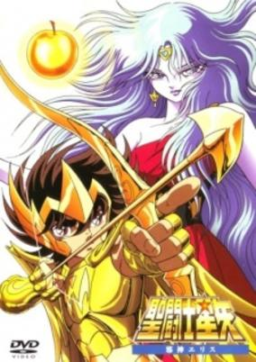

**Studio:** Toei Animation &nbsp;|&nbsp; **Director:** Kōzō Morishita &nbsp;|&nbsp; **Aired/Released:** July 18 &nbsp;|&nbsp; **Genres:** Fantasy, Action, Deity, Super Power, Henshin, Science Fiction, Adventure, Shounen

> Eris is the goddess of chaos and uses the body of Elien, who is a friend of Hyoga, to revive herself. She obtains the golden apple to drain Athena's life energy to make her ressurection complete and to be able to turn the world in a place filled with chaos. But to be able to attack Eris, Seiya and his friends will first have to defeat the Ghost Knights.
>
> _Synopsis source: Kitsu_

[Kitsu](https://kitsu.io/anime/saint-seiya-the-battle-with-eris)

---

### Robot Carnival

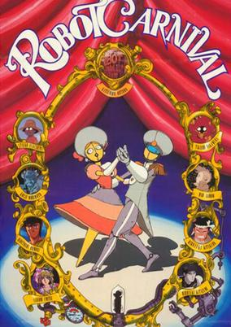

**Studio:** Studio APPP &nbsp;|&nbsp; **Director:** Atsuko Fukushima et al. &nbsp;|&nbsp; **Aired/Released:** July 21 &nbsp;|&nbsp; **Genres:** Steampunk, Piloted Robot, Science Fiction, Mecha, Fantasy, Drama, Robot, Android

> A visual treat for the eyes as well as the mind, Robot Carnival is an anthology collection of nine short films, many done by animators before they got their feet wet in directing. From funny to dramatic, artistic to entertaining, each story reaches towards the furthest corners of time and space to bring you a tale of robots, and the people who make them. Whether you have a love for great hand-drawn animation, an appreciation for fine storytelling, or just like robots, this anthology is a must!
>
> _Synopsis source: Kitsu_

[Wikipedia](https://en.wikipedia.org/wiki/Robot_Carnival) · [Kitsu](https://kitsu.io/anime/robot-carnival)

---

### Crystal Triangle

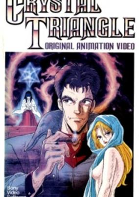

**Studio:** Studio APPP &nbsp;|&nbsp; **Director:** Seiji Okuda &nbsp;|&nbsp; **Aired/Released:** July 22 &nbsp;|&nbsp; **Genres:** Adventure, Earth, Action, Japan, Violence, Super Power, Demon, Military, Mystery

> In times of olde, God gave mankind the ten commandments, and a message that has been lost to the centuries. In the present, Koichiro Kamishiro is a modern day Indiana Jones who scours (and often destroys) ruins for hints of the past, until one day he runs across a box filled with two crystal triangles. Having inadvertently run across the key to God's lost message, Kamishiro suddenly has a lot to deal with including assassination attempts by the KGB and the CIA, aliens hell-bent on destroying the Earth and the love of several women!
>
> _Synopsis source: Kitsu_

[Wikipedia](https://en.wikipedia.org/wiki/Crystal_Triangle) · [Kitsu](https://kitsu.io/anime/kindan-no-mokushiroku-crystal-triangle)

---

### Yamato / Space

**Studio:** Madhouse , Tezuka Productions &nbsp;|&nbsp; **Director:** Toshio Hirata, Yoshiaki Kawajiri &nbsp;|&nbsp; **Aired/Released:** August 1

[Wikipedia](https://en.wikipedia.org/wiki/Phoenix_(manga))

---

### Legend of Lemnear

**Studio:** AIC &nbsp;|&nbsp; **Director:** Kinji Yoshimoto &nbsp;|&nbsp; **Aired/Released:** August 25

[Wikipedia](https://en.wikipedia.org/wiki/Legend_of_Lemnear)

---

### Lily C.A.T.

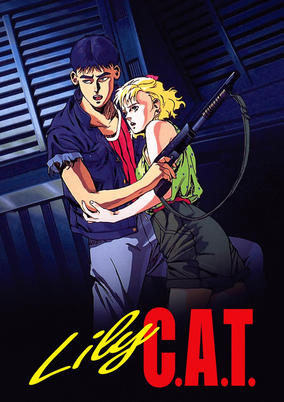

**Studio:** Studio Pierrot &nbsp;|&nbsp; **Director:** Hisayuki Toriumi &nbsp;|&nbsp; **Aired/Released:** September 1 &nbsp;|&nbsp; **Genres:** Parasite, Conspiracy, Shipboard, Alien, Future, Horror, Action, Violence, Science Fiction, Space

> 2264 A.D.: The Starship Saldes is sent into deep space to explore a newly discovered planet. The journey will take twenty years. The Saldes' crew of thirteen, mixing experienced space jockeys with eager but naive scientists, are prepared for anything -- except an unseen alien invader with an insatiable appetite. Along with the ominous force that takes over the ship's controls. The voyage becomes a grim struggle for survival in a vessel that has become a coffin orbiting the paradise world which was to be its destination.
>
> _Synopsis source: Kitsu_

[Wikipedia](https://en.wikipedia.org/wiki/Lily_C.A.T.) · [Kitsu](https://kitsu.io/anime/lily-c-a-t)

---

### Neo Tokyo

**Studio:** Madhouse &nbsp;|&nbsp; **Director:** Rintarō , Yoshiaki Kawajiri , Katsuhiro Ōtomo &nbsp;|&nbsp; **Aired/Released:** September 25

[Wikipedia](https://en.wikipedia.org/wiki/Neo_Tokyo_(film))

---

### Persia, the Magic Fairy: Merry-go-Round

**Studio:** Studio Pierrot &nbsp;|&nbsp; **Aired/Released:** September 25

[Wikipedia](https://en.wikipedia.org/wiki/Persia,_the_Magic_Fairy)

---

### Dangaioh (Great Planet Evil-Destroyer Dangaio)

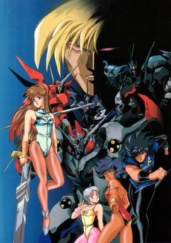

**Studio:** AIC , Artmic &nbsp;|&nbsp; **Director:** Toshiki Hirano &nbsp;|&nbsp; **Aired/Released:** September 28 &nbsp;|&nbsp; **Genres:** Space Travel, Science Fiction, Mecha, Action, Super Robot, Cyborg, Angst, Other Planet, Shipboard, Alien, Drama, Future, Robot, Super Power, Adventure

> Four psychic teenagers—Mia Alice, Roll Kran, Lamba Nom and Pai Thunder—are brainwashed by the scientist Dr. Tarsan as pilots of his greatest experiment—the giant robot Dangaioh. But as their memories slowly return, these pilots use their abilities and Dangaioh to combat the tyranny of Captain Galimos and the Bunker Space Pirates.
>
> _Synopsis source: Kitsu_

[Wikipedia](https://en.wikipedia.org/wiki/Dangaioh) · [Kitsu](https://kitsu.io/anime/haja-taisei-dangaiou)

---

### To-y

**Studio:** Studio Gallop &nbsp;|&nbsp; **Director:** Mamoru Hamatsu &nbsp;|&nbsp; **Aired/Released:** October 1

[Wikipedia](https://en.wikipedia.org/wiki/To-y)

---

### Oraa Guzura Dado

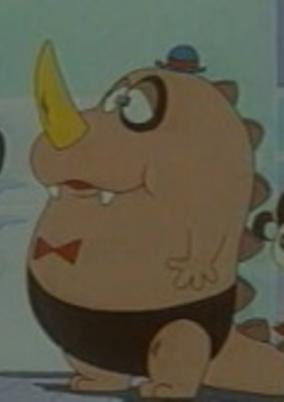

**Studio:** Tatsunoko Productions &nbsp;|&nbsp; **Director:** Hiroshi Sasagawa &nbsp;|&nbsp; **Aired/Released:** October 7 &nbsp;|&nbsp; **Genres:** Comedy, Kids

> Remake of the first series. When Mt. Bikkura erupts a huge egg one day, a chubby little dinosaur name Guzura hatches out of it. The series follows his misadventures as he interacts with humans as well as other animals and creatures
>
> _Synopsis source: Kitsu_

[Wikipedia](https://en.wikipedia.org/wiki/Guzura) · [Kitsu](https://kitsu.io/anime/oraa-guzura-dado)

---

### Mister Ajikko

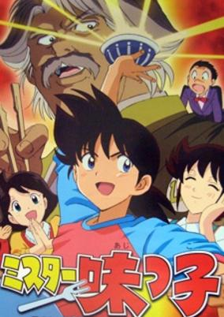

**Studio:** Sunrise &nbsp;|&nbsp; **Director:** Yasuhiro Imagawa &nbsp;|&nbsp; **Aired/Released:** October 8 &nbsp;|&nbsp; **Genres:** Japan, Comedy, Cooking

> Ajiyoshi Yoichi is a culinary prodigy who manages the eating house together with his mother. One day, Murata Genjiro appears in the eating house and is surprised at the delicious taste and delicate culinary skills of the katsu-don prepared by Youichi. Subsequently, Youichi is being invited to the Aji-oh Building in which he is involved in a spaghetti match with the in-house Italian chef, Marui. Youichi's novel culinary ideas, coupled with his enthusiasm of serving the best for his guests, allow him to defeat Marui in the match. From then on, Youichi begins to compete with other rivals in the race for the best tastes and dishes.
>
> _Synopsis source: Kitsu_

[Wikipedia](https://en.wikipedia.org/wiki/Mister_Ajikko) · [Kitsu](https://kitsu.io/anime/mister-ajikko)

---

### The Three Musketeers Anime (The Three Musketeers)

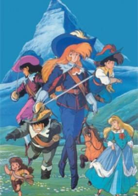

**Studio:** Studio Gallop &nbsp;|&nbsp; **Director:** Kunihiko Yuyama &nbsp;|&nbsp; **Aired/Released:** October 9 &nbsp;|&nbsp; **Genres:** Romance, France, Adventure, Past, Plot Continuity, Historical

> The Three Musketeers: The year is 1625. The young D'Artagnan arrives in Paris at the tender age of 18, and almost immediately offends three musketeers, Porthos, Aramis, and Athos. Instead of dueling, the four are attacked by five of the Cardinal's guards, and the courage of the youth is made apparent during the battle. The four become fast friends and embark upon an adventure that takes them across both France and England in order to thwart the plans of the Cardinal Richelieu. Along the way, they encounter a beautiful young spy, named simply Milady, who will stop at nothing to disgrace Queen Anne of Austria before her husband, Louis XIII, and take her revenge upon the four friends.
>
> _Synopsis source: Kitsu_

[Wikipedia](https://en.wikipedia.org/wiki/The_Three_Musketeers_Anime) · [Kitsu](https://kitsu.io/anime/anime-sanjushi)

---

### Tsuide ni Tonchinkan (Anyway)

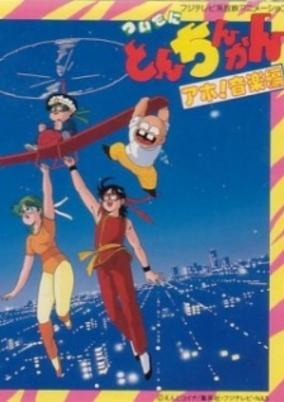

**Studio:** Studio Comet &nbsp;|&nbsp; **Director:** Shin Misawa , Tomomasa Yamazaki &nbsp;|&nbsp; **Aired/Released:** October 10 &nbsp;|&nbsp; **Genres:** Comedy

> Based on the same name gag manga by Endo Koichi. A gang decides to play at burglary without the knowledge of their schoolmates, each masquerading at different times as the master thief Tonchinkan.
>
> _Synopsis source: Kitsu_

[Wikipedia](https://en.wikipedia.org/wiki/Tsuide_ni_Tonchinkan) · [Kitsu](https://kitsu.io/anime/tsuideni-tonchinkan)

---

### Bikkuriman

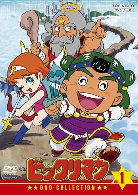

**Studio:** Toei Animation &nbsp;|&nbsp; **Director:** Mitsuru Aoyama &nbsp;|&nbsp; **Aired/Released:** October 11 &nbsp;|&nbsp; **Genres:** Fantasy, Comedy

> In a world divided between angels and evil creatures, only the young hero Yamato Shintei has the power to defeat the demons...
>
> _Synopsis source: Kitsu_

[Wikipedia](https://en.wikipedia.org/wiki/Bikkuriman) · [Kitsu](https://kitsu.io/anime/bikkuriman)

---

### Oraa Guzura Dado

**Studio:** Tatsunoko Productions &nbsp;|&nbsp; **Director:** Hiroshi Sasagawa &nbsp;|&nbsp; **Aired/Released:** October 7 &nbsp;|&nbsp; **Genres:** Comedy, Kids

> Remake of the first series. When Mt. Bikkura erupts a huge egg one day, a chubby little dinosaur name Guzura hatches out of it. The series follows his misadventures as he interacts with humans as well as other animals and creatures
>
> _Synopsis source: Kitsu_

[Wikipedia](https://en.wikipedia.org/wiki/Guzura) · [Kitsu](https://kitsu.io/anime/oraa-guzura-dado)

---

### Ultraman: The Adventure Begins

**Studio:** Madhouse &nbsp;|&nbsp; **Director:** Mitsuo Kusakabe &nbsp;|&nbsp; **Aired/Released:** October 12

---

### Akakage

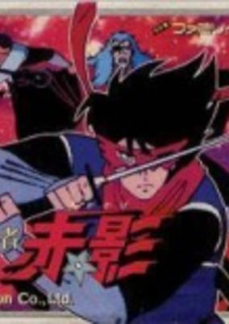

**Studio:** Toei Animation &nbsp;|&nbsp; **Director:** Susumu Ishizaki &nbsp;|&nbsp; **Aired/Released:** October 13 &nbsp;|&nbsp; **Genres:** Martial Arts, Action, Fantasy

> Red Shadow, created by Mitsuteru Yokoyama, is a ninja who wears a red-and-black costume and a stylized red mask. His adventures take place in Feudal Japan, and he and his ninja sidekicks Aokage and Shirokage fight evil warlords, wizards and daikaiju using modern high-tech gadgetry (a blatant oddity in a period setting).
>
> _Synopsis source: Kitsu_

[Wikipedia](https://en.wikipedia.org/wiki/Akakage) · [Kitsu](https://kitsu.io/anime/kamen-no-ninja-akakage)

---

### Grimm Masterpiece Theater (Grimm's Fairy Tale Classics)

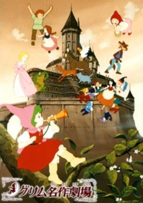

**Studio:** Nippon Animation &nbsp;|&nbsp; **Director:** Hiroshi Saito &nbsp;|&nbsp; **Aired/Released:** October 21 &nbsp;|&nbsp; **Genres:** Romance, Fantasy, High Fantasy, Magic, Adventure, Comedy, Kids

> The series consists of mostly stand-alone episodes which retell different fairy or folk tales. Despite the title, they are not all based on fairy tales collected by the Grimm Brothers.
>
> _Synopsis source: Kitsu_

[Wikipedia](https://en.wikipedia.org/wiki/Grimm%27s_Fairy_Tale_Classics) · [Kitsu](https://kitsu.io/anime/grimm-masterpiece-theater)

---

### Lady Lady!!

**Studio:** Toei Animation &nbsp;|&nbsp; **Director:** Hiroshi Shidara &nbsp;|&nbsp; **Aired/Released:** October 21

[Wikipedia](https://en.wikipedia.org/wiki/Lady!!)

---

### Devilman Tanjo Hen

**Studio:** Oh! Production &nbsp;|&nbsp; **Director:** Tsutomu Iida &nbsp;|&nbsp; **Aired/Released:** November 1

[Wikipedia](https://en.wikipedia.org/wiki/Devilman)

---

### The Song of Wind and Trees: Sanctus (The Poem of Wind and Trees)

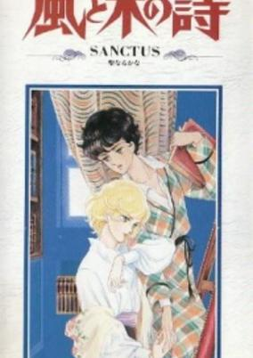

**Director:** Yoshikazu Yasuhiko &nbsp;|&nbsp; **Aired/Released:** November 6 &nbsp;|&nbsp; **Genres:** Romance, France, Europe, Past, Shounen Ai, Historical

> 1887, at a remote, elite boarding school in France: Serge Battour returns after his graduation, and remembers the days of his youth... 1880, at the same school: Son of a viscount and a Roma prostitute (both deceased), Serge is intelligent, sweet, talented, and alienated by his family due to his heritage. Upon being sent to his new school, he rooms with Gilbert Cocteau, a gorgeous loner of a boy who sells his body for reasons unknown. Serge's attempts to reach out to Gilbert fail spectacularly, and yet there is something in both of them that attracts them to each other.
>
> _Synopsis source: Kitsu_

[Wikipedia](https://en.wikipedia.org/wiki/Kaze_to_Ki_no_Uta) · [Kitsu](https://kitsu.io/anime/kaze-to-ki-no-uta-sanctus-sei-naru-kana)

---

### Destruction (Gall Force 1: Eternal Story)

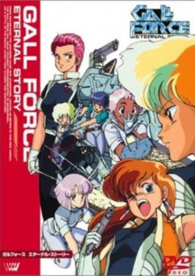

**Studio:** AIC , Artmic &nbsp;|&nbsp; **Director:** Katsuhito Akiyama &nbsp;|&nbsp; **Aired/Released:** November 21 &nbsp;|&nbsp; **Genres:** Space Travel, Science Fiction, Action, Space Opera, Alternative Past, Cyberpunk, Humanoid Alien, Shipboard, Alien, War, Drama, Past, Space, Military, Mecha, Adventure

> Two advanced civilizations, the Paranoids (a race of alien humanoids) and the Solenoids (who are all women) are waging a war that has gone on for centuries. When the Solenoid fleet leaves a battle to defend an experimentally terraformed world from the Paranoids, one damaged Solenoid ship, the Star Leaf, is separated from the fleet. Only seven women remain alive on the ship: Eluza, the captain, Rabby, the solid more or less main character, Lufy, the brash pilot, Catty, the mysterious science officer, Pony, the pink-haired ditzy tech, Patty, a solid crew member, and Remy, the cute one. After narrowly escaping the battle, the crew of the Star Leaf decides to continue with their orders and rendezvous at planet Chaos to defend it. It turns out, however, that their ship is the subject of a Paranoid experiment. In the end, it is up to the remaining crew Star Leaf to defend the artificial paradise of Chaos from the Paranoid fleet and the plans of the Solenoid leaders.
>
> _Synopsis source: Kitsu_

[Wikipedia](https://en.wikipedia.org/wiki/Gall_Force) · [Kitsu](https://kitsu.io/anime/gall-force-1-eternal-story)

---

### Twilight of the Cockroaches

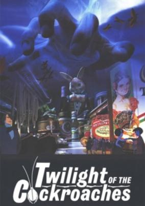

**Studio:** Madhouse &nbsp;|&nbsp; **Director:** Hiroaki Yoshida &nbsp;|&nbsp; **Aired/Released:** November 21 &nbsp;|&nbsp; **Genres:** Japan, Slice of Life, Anthropomorphism, Present, Military

> Hybrid film with animated cockroaches interacting with live-action actors. In a trashy bachelor pad lived a colony of roaches who were able to roam freely for food or for games. Because of the homeowner being gentle with the roaches, they have no fear of traps, spray, or being stepped on. However when the homeowner starts bringing over a woman over, life starts to change for the roaches who are already living an easy life.
>
> _Synopsis source: Kitsu_

[Wikipedia](https://en.wikipedia.org/wiki/Twilight_of_the_Cockroaches) · [Kitsu](https://kitsu.io/anime/gokiburi-tachi-no-tasogare)

---

### Battle Royal High School

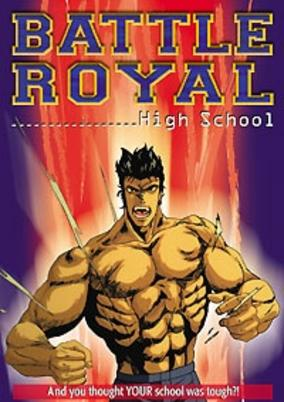

**Studio:** DAST, Tokuma Shoten &nbsp;|&nbsp; **Director:** Ichirō Itano &nbsp;|&nbsp; **Aired/Released:** December 10 &nbsp;|&nbsp; **Genres:** Ecchi, Science Fiction, Asia, Action, Earth, Swordplay, Horror, Stereotypes, Japan, Violence, Present, Super Power, Martial Arts

> Hyoudo Riki is just an ordinary guy who likes to wear a tiger mask while Kung-Fu fighting, which means he fits in real well at BATTLE ROYAL HIGH SCHOOL! Unfortunately for Riki, he`s the doppleganger in our world of Byoudo, Master of the Dark Realm, and when a dimensional gate opens between the two worlds, the evil Fairy Master tricks Byoudo into making an attempt to conquer our beautiful, and better lit, world. Now poor Riki is semi-possessed by his opposite numbed, and the minions of the Fairy Master are mutating his classmates into hideous lustful monsters. To make matters worse, all the inter-dimensional commotion has attracted the attention of a sword-happy exorcist and the heroic Zankan of the Space-Time Police! Which all means that Riki is about to take one bitch of a mid-term. The course is survival, and forget "Pass/Fail". The test is graded "Live/Die".
>
> _Synopsis source: Kitsu_

[Wikipedia](https://en.wikipedia.org/wiki/Battle_Royal_High_School) · [Kitsu](https://kitsu.io/anime/battle-royal-high-school)

---

### Daimajū Gekitō: Hagane no Oni

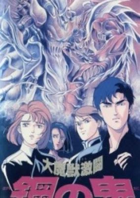

**Studio:** AIC &nbsp;|&nbsp; **Director:** Toshihiro Hirano &nbsp;|&nbsp; **Aired/Released:** December 10 &nbsp;|&nbsp; **Genres:** Science Fiction, Mecha, Earth, Piloted Robot, Future, Horror

> In the year 1999, a team of UN scientists in an attempt to tap into a new energy resource on a deserted island called Sansara, unknownigly open a portal to another universe, unleashing dormant biomechanical entities. Three years later, Takuya Goroza returns to the island of Sansara urged by a mysterious request by college chum Haruka Alford. Little does he know, his old friend isn't what he appears to be...
>
> _Synopsis source: Kitsu_

[Kitsu](https://kitsu.io/anime/daimajuu-gekitou-hagane-no-oni)

---

### Original Dirty Pair

**Studio:** Sunrise &nbsp;|&nbsp; **Director:** Masayoshi Tanidabe &nbsp;|&nbsp; **Aired/Released:** December 21

[Wikipedia](https://en.wikipedia.org/wiki/Dirty_Pair)

---

### The Plot of the Fuma Clan (Lupin the Third:  The Fuma Conspiracy)

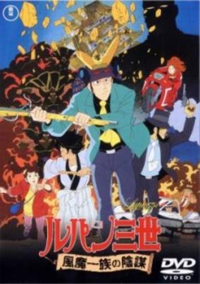

**Studio:** TMS Entertainment &nbsp;|&nbsp; **Director:** Masayuki Ōzeki &nbsp;|&nbsp; **Aired/Released:** December &nbsp;|&nbsp; **Genres:** Comedy, Action, Thievery, Adventure, Crime

> Goemon's wedding to Murasaki Inabe, daughter of a samurai clan's leader, is interrupted when the Fuma ninjas attack, kidnapping the bride-to-be and demanding her family's ancient treasure as ransom. Lupin, Jigen, Goemon and Fujiko work together once again to try to save Murasaki and get to the treasure before the Fuma can steal it.
>
> _Synopsis source: Kitsu_

[Wikipedia](https://en.wikipedia.org/wiki/The_Plot_of_the_Fuma_Clan) · [Kitsu](https://kitsu.io/anime/lupin-iii-the-fuma-conspiracy)

---
