# 1988 in Anime

[← Back to index](../README.md)

90 titles · 73 with a matched synopsis/cover art · [source](https://en.wikipedia.org/wiki/1988_in_anime)

## Releases

### Himitsu no Akko-chan

**Studio:** Toei Animation &nbsp;|&nbsp; **Director:** Hiroki Shibata &nbsp;|&nbsp; **Aired/Released:** January 9

[Wikipedia](https://en.wikipedia.org/wiki/Himitsu_no_Akko-chan)

---

### Little Lord Fauntleroy

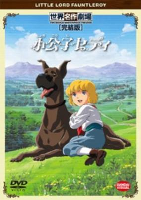

**Studio:** Nippon Animation &nbsp;|&nbsp; **Director:** Kōzō Kusuba &nbsp;|&nbsp; **Aired/Released:** January 10 &nbsp;|&nbsp; **Genres:** Slice of Life, Drama

> After his father's sudden death, Ceddie moves to England as an heir to his grandfather, the Earl of Dorincourt. The Earl is a stubborn and selfish old man. Gradually, however, Ceddie's innocent love opens the Earl's heart and changes him into a caring and generous person. This is based on "Little Lord Fauntleroy" by F.H.Burnett.
>
> _Synopsis source: Kitsu_

[Wikipedia](https://en.wikipedia.org/wiki/Little_Lord_Fauntleroy_(anime)) · [Kitsu](https://kitsu.io/anime/shoukoushi-cedie)

---

### Leina: Wolf Sword Legend

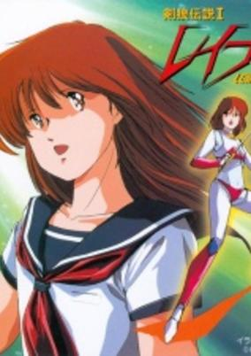

**Studio:** Ashi Productions &nbsp;|&nbsp; **Director:** Takao Kato , Nobuyoshi Habara, Kiyoshi Murayama &nbsp;|&nbsp; **Aired/Released:** February 5 &nbsp;|&nbsp; **Genres:** Fantasy, Action, Martial Arts, Super Power, Mecha

> When Revenge of Cronos left off, Rom and Leina had crossed a dimensional barrier. Their physical forms changed from robot to human and they were separated with blurred memories. Leina Stol is now incarnated as Leina Haruka, a Japanese schoolgirl. As the story progresses, she meets up with Rod Drill, Blue Jet, Triple Jim, and Rom; all of whom are now human.
>
> _Synopsis source: Kitsu_

[Kitsu](https://kitsu.io/anime/machine-robo-leina-the-legend-of-wolf-blade)

---

### Maison Ikkoku: The Final Chapter

**Studio:** Ajia-do Animation Works &nbsp;|&nbsp; **Director:** Tomomi Mochizuki &nbsp;|&nbsp; **Aired/Released:** February 6

[Wikipedia](https://en.wikipedia.org/wiki/Maison_Ikkoku)

---

### Legend of the Galactic Heroes: My Conquest is the Sea of Stars

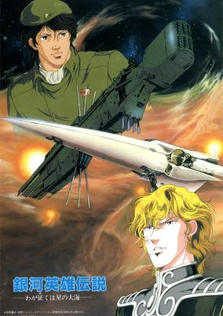

**Studio:** Madhouse , Artland &nbsp;|&nbsp; **Director:** Noboru Ishiguro &nbsp;|&nbsp; **Aired/Released:** February 6 &nbsp;|&nbsp; **Genres:** Space Battles, Space Opera, Shipboard, Future, Science Fiction, Action, Politics, Plot Continuity, Space, Military, Historical

> This movie, based on an anecdote of "Ginga Eiyuu Densetsu" written by novelist Tanaka Yoshiki, preludes the 110-episodes TV series by describing the first encounter between the ambitious young man Reinhard von Müsel under the imperial flag and the passive Yang Wenli who serves a corrupting democracy. Set in an imaginative future, the story describes the first encounter between Yang and Reinhard and discusses how heroes are born.
>
> _Synopsis source: Kitsu_

[Kitsu](https://kitsu.io/anime/ginga-eiyuu-densetsu-waga-yuku-wa-hoshi-no-taikai)

---

### Ultimate Teacher

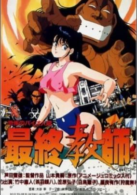

**Studio:** J.C.Staff &nbsp;|&nbsp; **Director:** Toyoo Ashida &nbsp;|&nbsp; **Aired/Released:** February 6 &nbsp;|&nbsp; **Genres:** Martial Arts, Absurdist Humour, Slapstick, Violence, Present, Comedy, Action, Japan, Asia, Earth, Adventure, School Life

> At a run down school the "Ultimate Teacher" Ganpachi is sent to get things back on track and prepare the delinquent students for the real world. But the students don't want Ganpachi ruining the gang they got going so their boss, Hinako, fights back Ganpachi aided by her secret power...her lucky kitty underwear. Things get more interesting when we findout Ganpachi is the result of genetic experiments.
>
> _Synopsis source: Kitsu_

[Wikipedia](https://en.wikipedia.org/wiki/Ultimate_Teacher) · [Kitsu](https://kitsu.io/anime/ultimate-teacher)

---

### Urusei Yatsura: The Final Chapter

**Studio:** Magic Bus &nbsp;|&nbsp; **Director:** Tetsu Dezaki &nbsp;|&nbsp; **Aired/Released:** February 6

[Wikipedia](https://en.wikipedia.org/wiki/Urusei_Yatsura_(film_series))

---

### Osomatsu-kun

**Studio:** Studio Pierrot &nbsp;|&nbsp; **Director:** Akira Shigino &nbsp;|&nbsp; **Aired/Released:** February 13

[Wikipedia](https://en.wikipedia.org/wiki/Osomatsu-kun)

---

### Aura Battler Dunbine: The Tale of Neo Byston Well

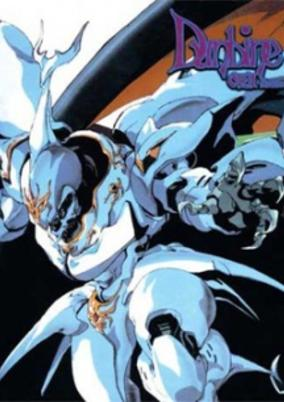

**Studio:** Sunrise &nbsp;|&nbsp; **Director:** Toshifumi Takizawa &nbsp;|&nbsp; **Aired/Released:** February 25 &nbsp;|&nbsp; **Genres:** Mecha, Fantasy, Fantasy World, Action, Piloted Robot, Plot Continuity, Science Fiction, Adventure, Isekai

> Taking place 700 years after the Dunbine TV Series, "The Tale of Neo Byston Well" revolves around Shion Zaba, the reincarnation of series protagonist Sho Zama. Together with Silkie Mau, Reml Jilfried (the reincarnation of Remile Luft), and the Aura Battler Silbine, Shion must stop a twisted Shot Weapon from launching a custom-made nuclear ICBM missile that's poised to wipe out the realm. "The Tale of Neo Byston Well" gained praise not only for its upgraded animation but also for using B-CLUB Magazine's popular AURA FANTASM series as the basis for the new Aura Battler designs.
>
> _Synopsis source: Kitsu_

[Kitsu](https://kitsu.io/anime/aura-battler-dunbine-ova)

---

### Dragon's Heaven

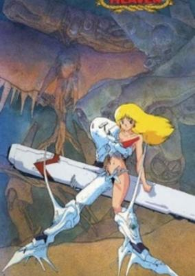

**Studio:** AIC Artmic &nbsp;|&nbsp; **Director:** Makoto Kobayashi &nbsp;|&nbsp; **Aired/Released:** February 25 &nbsp;|&nbsp; **Genres:** Power Suit, Science Fiction, Mecha, Post Apocalypse, Action, Piloted Robot, War, Fantasy, Adventure

> In the year 3195, there was a war between an army of robots and the humans. When Shaian, a sentient combat armor, lost his companion in battle, he shut down until his internal systems spotted a new human. It's now almost a 1000 years later, and Shaian's greatest enemy is still alive and doing battle in Brazil. With a new friend`s help, Shaian may be able to stop this evil force before another war rages over the continent.
>
> _Synopsis source: Kitsu_

[Kitsu](https://kitsu.io/anime/dragon-s-heaven)

---

### Sakigake!! Otokojuku (Charge!! Men's Private School)

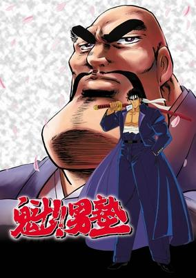

**Studio:** Toei Animation &nbsp;|&nbsp; **Director:** Nobutaka Nishizawa &nbsp;|&nbsp; **Aired/Released:** February 25 &nbsp;|&nbsp; **Genres:** Japan, Earth, Asia, Delinquent, Swordplay, Martial Arts, Friendship, Present, Action, Comedy, School Life

> Otokojuku: a private school for juvenile delinquents that were previously expelled from normal schools. At this school, Japanese chivalry is taught through feudal and military fundamentals. Similar to an action film, the classes are overwhelmed by violence. Only those who survive it become true men.
>
> _Synopsis source: Kitsu_

[Wikipedia](https://en.wikipedia.org/wiki/Sakigake!!_Otokojuku) · [Kitsu](https://kitsu.io/anime/sakigake-otokojuku)

---

### Salamander

**Studio:** Studio Pierrot &nbsp;|&nbsp; **Director:** Hisayuki Toriumi &nbsp;|&nbsp; **Aired/Released:** February 25

[Wikipedia](https://en.wikipedia.org/wiki/Salamander_(anime))

---

### Xanadu: The Legend of Dragon Slayer

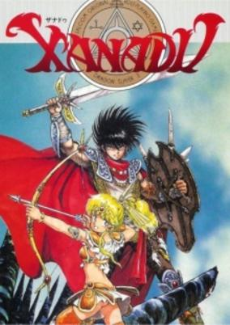

**Studio:** Toei Animation &nbsp;|&nbsp; **Director:** Atsutoshi Umezawa &nbsp;|&nbsp; **Aired/Released:** March 1 &nbsp;|&nbsp; **Genres:** Fantasy, Adventure, Comedy

> Based on the role-playing game "Legend of Xanadu". The evil magician Reichswar has killed the King to gain possession of a magic crystal; now he means to use its power to rule the whole of Xanadu. Then the widowed Queen Rieru is kidnapped. One brave young warrior, wielding the magic blade Dragonslayer, goes to her rescue.
>
> _Synopsis source: Kitsu_

[Wikipedia](https://en.wikipedia.org/wiki/Xanadu_(video_game)#Movie) · [Kitsu](https://kitsu.io/anime/xanadu-dragonslayer-densetsu)

---

### Tsurupika Hagemaru (Little Baldy Hagemaru)

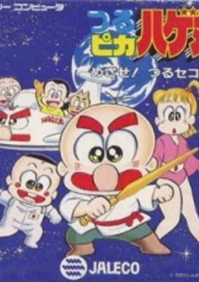

**Studio:** Shin-Ei Animation &nbsp;|&nbsp; **Director:** Hiroshi Sasagawa &nbsp;|&nbsp; **Aired/Released:** March 3 &nbsp;|&nbsp; **Genres:** Comedy, Kids

> Hagemaru Hageda is a young kid, studying in fourth standard living with his parents in Japan. Only child of his parents, he and his parents are a big misers. They do anything for saving money and this is the basic plot of the show. Hagemaru also has a pet dog named Pesu, who often comments about Hagemaru's family being too miser and not giving him anything to eat. He is best friend of his class-mate Masaru Kondo and he has a crush on Midori, a girl from his class. In most of the episodes, Hagemaru goes to school and the story revolves around his teacher (his 'miss') and his friends. At the end of the each episode, top ten snippets are shown.
>
> _Synopsis source: Kitsu_

[Wikipedia](https://en.wikipedia.org/wiki/Tsurupika_Hagemaru) · [Kitsu](https://kitsu.io/anime/tsurupika-hagemaru)

---

### F

**Studio:** Studio Deen &nbsp;|&nbsp; **Director:** Koichi Mashimo &nbsp;|&nbsp; **Aired/Released:** March 9 &nbsp;|&nbsp; **Genres:** Comedy

> TV anime show based on the manga by F. Fujio Fujiko.
>
> _Synopsis source: Kitsu_

[Wikipedia](https://en.wikipedia.org/wiki/F_(manga)) · [Kitsu](https://kitsu.io/anime/chinpui)

---

### Harbor Light Story Fashion Lala yori

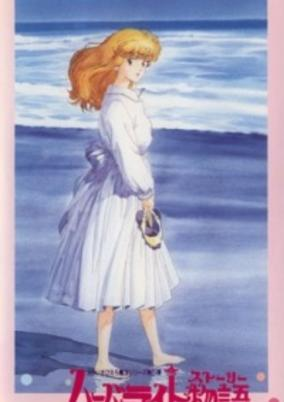

**Studio:** Studio Pierrot &nbsp;|&nbsp; **Director:** Motosuke Takahashi &nbsp;|&nbsp; **Aired/Released:** March 11 &nbsp;|&nbsp; **Genres:** Performance, Magic, Magical Girl, The Arts

> A Cinderella story of sorts, Fashion Lala stars a little girl named Miho who doesn't get along with her family. Miho loves to design clothing, but her aunt and three cousins don't believe that such a young girl is capable and mock her designs. Meanwhile, a contest for the new "Disco Queen" is coming up, and Miho wants nothing more than to be able to design a dress for someone to wear to the competition, since she's too young to enter herself. With determination and a little bit of magic, Miho's dreams just might come true!
>
> _Synopsis source: Kitsu_

[Wikipedia](https://en.wikipedia.org/wiki/Harbor_Light_Story_Fashion_Lala_yori) · [Kitsu](https://kitsu.io/anime/harbor-light-monogatari-fashion-lala-yori)

---

### Bikkuriman: Taiichiji Seima Taisen

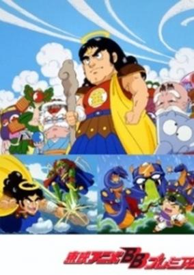

**Studio:** Toei Animation &nbsp;|&nbsp; **Director:** Hiroyuki Kakudou &nbsp;|&nbsp; **Aired/Released:** March 12 &nbsp;|&nbsp; **Genres:** Action, Adventure, Kids

> First Bikkuriman film.
>
> _Synopsis source: Kitsu_

[Kitsu](https://kitsu.io/anime/bikkuriman-daiichiji-seima-taisen)

---

### Doraemon: The Record of Nobita's Parallel Visit to the West (Doraemon the Movie: The Record of Nobita's Parallel Visit to the West)

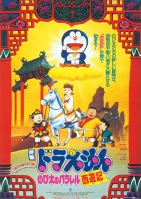

**Studio:** Shin-Ei Animation &nbsp;|&nbsp; **Director:** Tsutomu Shibayama &nbsp;|&nbsp; **Aired/Released:** March 12 &nbsp;|&nbsp; **Genres:** Earth, Science Fiction, Japan, Asia, Time Travel, Fantasy, Adventure, Kids

> Nobita is trying to prove that the Monkey King exists so they went back to the time Sanzo began his pilgrimage. Doraemon used a virtual video game console and let Nobita play "Journey to The West" to give Nobita clothes that the Monkey King wears. Nobita messed up on prooving Monkey king exists. When Nobita and his friends played "Journey to The West" and they finished the game without fighting any demons. Later, they found out thier world is ruled by demons. The problem is that Doraemon left the game console open in the past without closing it and demons started to appear to invade the world. Doraemon and the others now have to go back into the past to vanquish the demons.
>
> _Synopsis source: Kitsu_

[Kitsu](https://kitsu.io/anime/doraemon-nobita-s-version-of-saiyuki)

---

### Esper Mami: Hoshizora no Dancing Doll

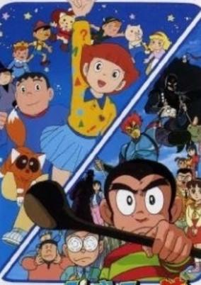

**Studio:** Shin-Ei Animation &nbsp;|&nbsp; **Director:** Keiichi Hara &nbsp;|&nbsp; **Aired/Released:** March 12 &nbsp;|&nbsp; **Genres:** Fantasy

> Schoolgirl Mami Sakura discovers that she has superpowers. She can sense other people in trouble and teleport to help them, but she keeps her secret double-life hidden from her parents with the help of her schoolfriend, Kazuo Takahata. In this short film, Mami uses her powers to make a puppet show for deprived children.
>
> _Synopsis source: Kitsu_

[Kitsu](https://kitsu.io/anime/esper-mami-hoshizora-no-dancing-doll)

---

### The Heated Battle of the Gods

**Studio:** Toei Animation &nbsp;|&nbsp; **Director:** Shigeyasu Yamauchi &nbsp;|&nbsp; **Aired/Released:** March 12

[Wikipedia](https://en.wikipedia.org/wiki/The_Heated_Battle_of_the_Gods)

---

### Mobile Suit Gundam: Char's Counterattack

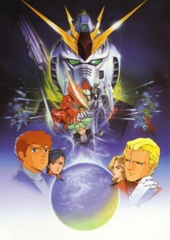

**Studio:** Sunrise &nbsp;|&nbsp; **Director:** Yoshiyuki Tomino &nbsp;|&nbsp; **Aired/Released:** March 12 &nbsp;|&nbsp; **Genres:** Science Fiction, Mecha, Action, Space Opera, Piloted Robot, Future, Violence, Military, Space

> U.C. 0093 - Char Aznable, the infamous "Red Comet" of the One Year War, has come out of hiding to lead the Neo-Zeon Army and wage war against the Earth Federation. Only his greatest rival, Gundam pilot Amuro Ray, can stop him from dropping the Axis asteroid on Earth and causing a major global catastrophe.
>
> _Synopsis source: Kitsu_

[Kitsu](https://kitsu.io/anime/mobile-suit-gundam-char-s-counterattack)

---

### Mobile Suit SD Gundam

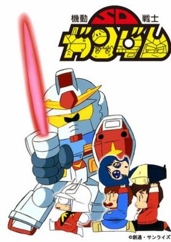

**Studio:** Sunrise &nbsp;|&nbsp; **Director:** Osamu Sekita &nbsp;|&nbsp; **Aired/Released:** March 12 &nbsp;|&nbsp; **Genres:** Science Fiction, Mecha, Parody, Super Deformed

> A collection of short parodies of the Mobile Suit Gundam saga. Episode 1 pokes fun at key events that occurred during the One Year War. In episode 2, Amuro, Kamille and Judau fight over who runs the better pension when Char comes in to crash their party. Episode 3 is the SD Olympics, an array of athletic events pitting man with mobile suit.
>
> _Synopsis source: Kitsu_

[Wikipedia](https://en.wikipedia.org/wiki/Mobile_Suit_SD_Gundam) · [Kitsu](https://kitsu.io/anime/mobile-suit-sd-gundam-mk-i)

---

### The Burning Wild Man

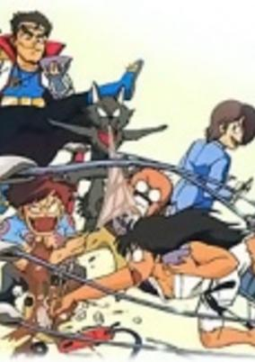

**Studio:** Studio Pierrot &nbsp;|&nbsp; **Director:** Osamu Kobayashi &nbsp;|&nbsp; **Aired/Released:** March 14 &nbsp;|&nbsp; **Genres:** Comedy, Action, Adventure

> When Kenichi Kokuho was a small boy, he was lost in the mountains and never found. However, unknown to anyone, Kenichi has been brought up by his foster father in the wild. When Kenichi becomes 15 years old, his foster father tells him the truth about his background. As he finds out, Kenichi decides to go to a civilized society where his parents live. Everything Kenichi experiences in the town is a series of surprise and wonder. His family is delighted to see their son alive, but shocked at the fact that he has become wild and different from other children. And now, his new life is about to begin. His wild attitude and physical toughness cause various problems in the town. Kenichi has his own way to handle things, but it is too different for the most people to understand what he is up to. Can he get used to life in the town?
>
> _Synopsis source: Kitsu_

[Wikipedia](https://en.wikipedia.org/wiki/The_Burning_Wild_Man) · [Kitsu](https://kitsu.io/anime/moeru-onii-san)

---

### Armored Trooper VOTOMS: The Red Shoulder Document: Roots of Ambition (Armored Trooper Votoms: Red Shoulder Document - Roots of Treachery)

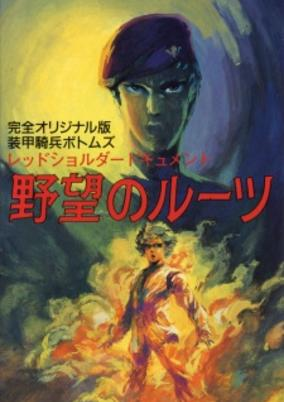

**Studio:** Sunrise &nbsp;|&nbsp; **Director:** Ryosuke Takahashi &nbsp;|&nbsp; **Aired/Released:** March 19 &nbsp;|&nbsp; **Genres:** Science Fiction, Mecha, Genetic Modification, Action, Piloted Robot, Rotten World, Other Planet, War, Future, Military

> After armored trooper pilot Chirico Cuvie is given orders to transfer to Planet Odon, he and all of the other new recruits are sent into a simulated battle to test their abilities. However, this 'simulated battle' turns out to be a serious fight to eliminate those without the necessary skills. Chirico survives along with just three others, despite the fact that he fought while injured. It soon becomes apparent that this is not the first time he has survived against incredible odds, a fact that Colonel Peruzen wishes to exploit. But is Chirico truly immortal?
>
> _Synopsis source: Kitsu_

[Kitsu](https://kitsu.io/anime/armored-trooper-votoms-red-shoulder-document-roots-of-treachery)

---

### Aim for the Ace! 2

**Studio:** Tokyo Movie Shinsha &nbsp;|&nbsp; **Director:** Noboru Furuse &nbsp;|&nbsp; **Aired/Released:** March 25

[Wikipedia](https://en.wikipedia.org/wiki/Aim_for_the_Ace!)

---

### The Adventures of Scamper the Penguin

**Studio:** Soyuzmultfilm , Life Work Corp, Sovinfilm, Aist Corporation &nbsp;|&nbsp; **Director:** Kinjiro Yoshida , Gennady Sokolskiy &nbsp;|&nbsp; **Aired/Released:** March 26

[Wikipedia](https://en.wikipedia.org/wiki/The_Adventures_of_Scamper_the_Penguin)

---

### Kiteretsu Daihyakka (Kiteretsu Encyclopedia)

**Studio:** Studio Gallop &nbsp;|&nbsp; **Director:** Hiro Katsuoka, Keiji Hayakawa &nbsp;|&nbsp; **Aired/Released:** March 27 &nbsp;|&nbsp; **Genres:** Science Fiction, Japan, Slice of Life, Comedy, Present, Kids, Slapstick, Robot Helper, Family, Friendship

> The main character is a scientific genius boy named Kiteretsu, who has built a companion robot named Korosuke. He frequently travels in time with his friends and Korosuke in the time machine he built. Miyoko is a girl in his neighborhood who is basically his girlfriend. Tongari is his rival, who happen to share some similar traits of Honekawa Suneo. Buta Gorilla (Kumada Kaoru) is a typical neighborhood bully, who also share similar traits of Gian (Takeshi Goda) except that he often antagonizes Korosuke (though they are in grade school).
>
> _Synopsis source: Kitsu_

[Wikipedia](https://en.wikipedia.org/wiki/Kiteretsu_Daihyakka) · [Kitsu](https://kitsu.io/anime/kiteretsu-daihyakka)

---

### City Hunter 2

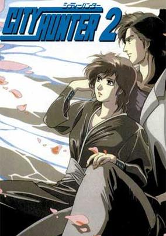

**Studio:** Sunrise &nbsp;|&nbsp; **Director:** Kanetsugu Kodama &nbsp;|&nbsp; **Aired/Released:** April 2 &nbsp;|&nbsp; **Genres:** Romance, Japan, Action, Comedy, Violent Retribution For Accidental Infringement, Gunfights, Detective, Bounty Hunter, Crime, Slapstick, Violence, Present, Mystery

> Ryo Saeba is a "sweeper" know as the City Hunter. He and his sidekick Kaori Makimura are hired to solve problems that the police can't (or won't) handle. When he's not keeping the streets of Tokyo clean, Ryo is chasing the ladies, and Kaori chases after him with a giant anti-ecchi hammer.
>
> _Synopsis source: Kitsu_

[Wikipedia](https://en.wikipedia.org/wiki/City_Hunter_2) · [Kitsu](https://kitsu.io/anime/city-hunter-2)

---

### Wowser

**Studio:** Telescreen Japan &nbsp;|&nbsp; **Director:** Keiichiro Mochizuki &nbsp;|&nbsp; **Aired/Released:** April 5

[Wikipedia](https://en.wikipedia.org/wiki/Wowser_(TV_series))

---

### Dagon in the Land of Weeds

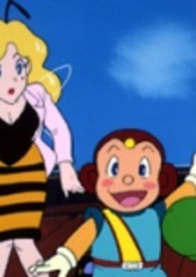

**Studio:** Nippon Animation &nbsp;|&nbsp; **Director:** Kazuyoshi Yokota &nbsp;|&nbsp; **Aired/Released:** April 9 &nbsp;|&nbsp; **Genres:** Fantasy, Adventure

> Dagon's little rocket crashes into a beautiful, blue planet and lands on a bed of green weeds. He quickly becomes friends with all kinds of creatures: Zipzap Mantis, General Ant Garibaldi, Andy Ant, Doctor Marilyn Wasp, and many more. Needless to say they are all insects. Insects? Yes, Dagon is only one centimetre tall! The tiny residents of the land of weeds become curious about the identity of this stranger from another planet. But when Dagon saves them from the danger posed by their ferocious enemies, Gulpo Toad and Godzi Lizard, everyone thinks Dagon is a SUPER-BUG! This planet is also home to a number of creatures that are very terrifying to these little fellows. They are called the Sapiens, or the human beings. Dagon must confront these massive creatures in order to get his rocket back from them! So begins Dagon's funny and thrilling adventure on Earth...
>
> _Synopsis source: Kitsu_

[Wikipedia](https://en.wikipedia.org/wiki/Dagon_in_the_Land_of_Weeds) · [Kitsu](https://kitsu.io/anime/ikinari-dagon)

---

### Transformers: Super-God Masterforce (Transformers Super-God Masterforce)

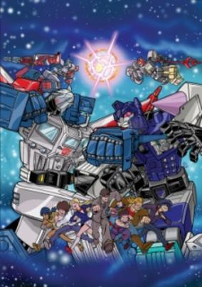

**Studio:** Toei Animation &nbsp;|&nbsp; **Director:** Tetsuo Imazawa &nbsp;|&nbsp; **Aired/Released:** April 12 &nbsp;|&nbsp; **Genres:** Transforming Craft, Science Fiction, Mecha, Earth, Action, Piloted Robot, Gunfights, Future, Adventure

> Even though the Decepticons have been driven off Earth, a small team of Autobot Pretenders have remained behind, just in case. Led by Metalhawk ("Hawk" in his human identity), the Pretenders live among the humans, using their Pretender shells to assume human size and appearance. The Autobots' caution is rewarded: Decepticon Pretenders soon appear, led by a mysterious force called Devil Z. The Autobots and Decepticons soon build up their forces, recruiting humans to become Junior Headmasters and Godmasters (Powermasters).
>
> _Synopsis source: Kitsu_

[Kitsu](https://kitsu.io/anime/transformers-masterforce)

---

### Sonic Soldier Borgman

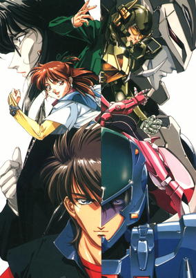

**Studio:** Ashi Production &nbsp;|&nbsp; **Director:** Kiyoshi Murayama &nbsp;|&nbsp; **Aired/Released:** April 13 &nbsp;|&nbsp; **Genres:** Power Suit, Science Fiction, Action, Earth, Future, School Life, Demon

> Sonic Soldier Borgman is a science fiction that comebines super sentai with non-gattai. It features a sentai-like three members team that fight an organization known as Youma. Features 3 characters with 3 basic ranger colors: Pink, Blue and Green.Featuring three main characters : Chuck,Ryo and Anise, Ryo is the leader, Chuck and Anise are teachers at a public school.Sometimes,the students help or make troubles to the Borgman somehow, some even know the Borgman secret identities. Ryo has a talking "modern" blue motorcycle that can upgrade itself. The transformation code is "Borg. Get On". Each member has a personal cannon that matches his/her armor color that appears only to finish the monster they fight.
>
> _Synopsis source: Kitsu_

[Wikipedia](https://en.wikipedia.org/wiki/Sonic_Soldier_Borgman) · [Kitsu](https://kitsu.io/anime/sonic-soldier-borgman)

---

### What's Michael?

**Studio:** Kitty Films &nbsp;|&nbsp; **Director:** Satoru Akahori &nbsp;|&nbsp; **Aired/Released:** April 15

[Wikipedia](https://en.wikipedia.org/wiki/What%27s_Michael%3F)

---

### Mashin Hero Wataru

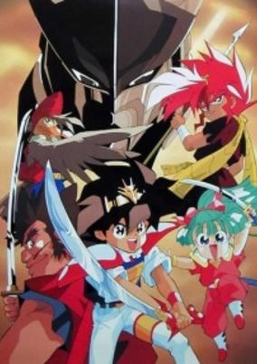

**Studio:** Sunrise &nbsp;|&nbsp; **Director:** Shūji Iuchi &nbsp;|&nbsp; **Aired/Released:** April 15 &nbsp;|&nbsp; **Genres:** Mecha, Fantasy World, Action, Fantasy, Piloted Robot, Comedy, Plot Continuity, Present, Science Fiction, Adventure

> A 9-year-old boy named Wataru Ikusabe is magically transported to a magical realm of the gods called Soukaizan which he is supposed to save. In his quest to save the realm, he manages to transform a clay sculpture into a somewhat autonomous (small) Super Robot.
>
> _Synopsis source: Kitsu_

[Wikipedia](https://en.wikipedia.org/wiki/Mashin_Hero_Wataru) · [Kitsu](https://kitsu.io/anime/mashin-eiyuuden-wataru)

---

### My Neighbor Totoro

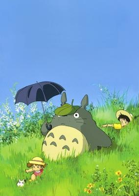

**Studio:** Studio Ghibli &nbsp;|&nbsp; **Director:** Hayao Miyazaki &nbsp;|&nbsp; **Aired/Released:** April 16 &nbsp;|&nbsp; **Genres:** Fantasy, Contemporary Fantasy, Japan, Adventure, Asia, Earth, Countryside, Present, Comedy

> Follow the adventures of Satsuki and her four-year-old sister Mei when they move into a new home in the countryside. To their delight they discover that their new neighbor is a mysterious forest spirit called Totoro who can be seen only through the eyes of a child. Totoro introduces them to extraordinary characters, including a cat that doubles as a bus, takes them on a journey through the wonders of nature.
>
> _Synopsis source: Kitsu_

[Wikipedia](https://en.wikipedia.org/wiki/My_Neighbor_Totoro) · [Kitsu](https://kitsu.io/anime/my-neighbor-totoro)

---

### Grave of the Fireflies

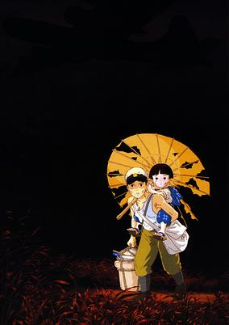

**Studio:** Studio Ghibli &nbsp;|&nbsp; **Director:** Isao Takahata &nbsp;|&nbsp; **Aired/Released:** April 16 &nbsp;|&nbsp; **Genres:** Japan, World War II, Asia, Anti War, Angst, War, Drama, Past, Violence, Historical

> In the aftermath of a World War II bombing, two orphaned children struggle to survive in the Japanese countryside. To Seita and his four-year-old sister, the helplessness and indifference of their countrymen is even more painful than the enemy raids. Through desperation, hunger and grief, these children's lives are as heartbreakingly fragile as their spirit and love is inspiring.
>
> _Synopsis source: Kitsu_

[Wikipedia](https://en.wikipedia.org/wiki/Grave_of_the_Fireflies) · [Kitsu](https://kitsu.io/anime/grave-of-the-fireflies)

---

### Appleseed

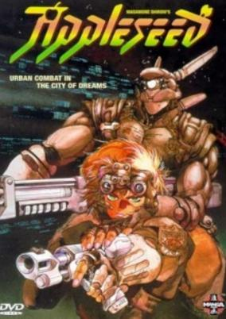

**Studio:** Gainax &nbsp;|&nbsp; **Director:** Kazuyoshi Katayama &nbsp;|&nbsp; **Aired/Released:** April 21 &nbsp;|&nbsp; **Genres:** Power Suit, Science Fiction, Mecha, Earth, Action, Special Squads, Gunfights, Human Enhancement, Cyborg, Future, Law And Order, Adventure, Cops

> Appleseed takes place in the aftermath of World War III, where the General Management Control Office has constructed the experimental city known as Olympus. Built to be a paradise on Earth, Olympus is inhabited by humans, cyborgs, and bioroids (genetically engineered humans designed for increased physical capabilities and decreased emotional capabilities). Bioroids run and control all of the administrative functions of Olympus, ensuring that the city remains the utopian society it was meant to be for all of its citizens. But for some people living in Utopia, the city has become less of a home and more of a cage. Police officer Calon Mautholos has grown to despise Olympus following his wife's suicide, blaming her death on the lack of creative freedom caused by the rules binding the citizens of the city. As his hatred for the city grows, Calon conspires with the terrorist A.J. Sebastian to destroy the Legislature of the Central Management Bureau to send the rules of Olympus that killed his wife tumbling down. But when Calon discovers it is not political malcontent, but rather hatred for bioroids that motives Sebastian, Calon turns renegade and gains the attention of city officials. Deunan Knute and her partner Briareos of the ESWAT counter-terrorism unit are dispatched to hunt down and stop Calon and Sebastian... by any means necessary!
>
> _Synopsis source: Kitsu_

[Wikipedia](https://en.wikipedia.org/wiki/Appleseed_(OVA)) · [Kitsu](https://kitsu.io/anime/appleseed)

---

### Patlabor: Early Days (Patlabor: The Mobile Police)

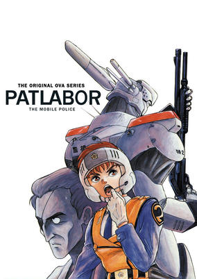

**Studio:** Studio Deen &nbsp;|&nbsp; **Director:** Mamoru Oshii , Naoyuki Yoshinaga &nbsp;|&nbsp; **Aired/Released:** April 25 &nbsp;|&nbsp; **Genres:** Science Fiction, Mecha, Action, Japan, Earth, Asia, Piloted Robot, Comedy, Special Squads, Future, Law And Order, Cops

> In the future, rapidly advancing technology gives birth to giant robots known as "Labors," so named for their usefulness in heavy industry. However, this also gives rise to "Labor crimes," resulting the the need for a new branch of law enforcement equiped with and dedicated to the policing of Labors. When Izumi Noa, a female police officer, becomes the newest recruit of Special Vechicals Devision 2, she and her top of the line "Patrol Labor" (or "Patlabor") Alphonse are swept into a series of adventures featuring crazed construction workers, eco-terrorists, and sea monsters.
>
> _Synopsis source: Kitsu_

[Kitsu](https://kitsu.io/anime/mobile-police-patlabor-early-days)

---

### Topo Gigio (Return of Topo Gigio)

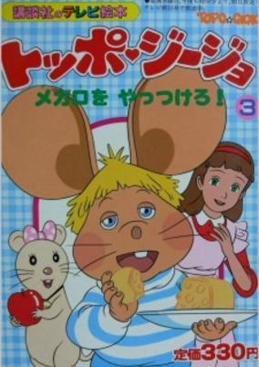

**Studio:** Nippon Animation &nbsp;|&nbsp; **Director:** Noboru Ishiguro , Shigeo Koshi &nbsp;|&nbsp; **Aired/Released:** April 27 &nbsp;|&nbsp; **Genres:** Comedy, Adventure, Kids

> Created by Maria Perego, Topo Gigio has been a beloved character for more than two decades. This animated TV series features numerous exciting stories and introduces many friends. Topo Gigio is the first mouse astronaut to travel the Milky Way. Can a mouse become an astronaut? Well, Topo Gigio has come from a year 2,388,400 years ahead in the future. He is friendly and can talk with humans. He makes friends with his neighbors including a girl, her pet mouse, cats, and other mice.
>
> _Synopsis source: Kitsu_

[Wikipedia](https://en.wikipedia.org/wiki/Topo_Gigio_(1988_TV_series)) · [Kitsu](https://kitsu.io/anime/topo-gigio)

---

### Spirit Warrior

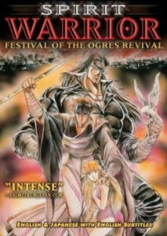

**Studio:** AIC &nbsp;|&nbsp; **Director:** Ichiro Itano, Katsuhito Akiyama &nbsp;|&nbsp; **Aired/Released:** April 29 &nbsp;|&nbsp; **Genres:** Contemporary Fantasy, Fantasy, Earth, Japan, Action, Asia, Martial Arts, Magic, Violence, Present, Demon, Horror

> A young mystic without a past, Kujaku was born under a dark omen possessed of incredible supernatural powers. Raised by priests, he has learned to use these powers for good. But the evil Siegfried von Mittgard seeks to steal his birthright, and rule the world as the Regent of Darkness. He has dispatched bloodthirsty minions to destroy Kujaku before he can awaken to his destiny. Now, Kujaku must unravel the riddle of his past, before the power within consumes him!
>
> _Synopsis source: Kitsu_

[Wikipedia](https://en.wikipedia.org/wiki/Peacock_King) · [Kitsu](https://kitsu.io/anime/kujakuou)

---

### Legendary Armor Samurai Troopers (Ronin Warriors)

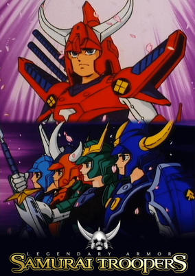

**Studio:** Sunrise &nbsp;|&nbsp; **Director:** Masashi Ikeda, Mamoru Hamatsu &nbsp;|&nbsp; **Aired/Released:** April 30 &nbsp;|&nbsp; **Genres:** Action, Swordplay, Plot Continuity, Super Power, Samurai, Science Fiction, Adventure, Henshin

> Thousands of years ago, the evil emperor Talpa attempted to conquer the Earth. Defeated, he was banished to the Nether Realm and his armor was divided into 9 separate suits. Now, he has returned to conquer Earth, having reclaimed 4 of the suits. The other 5 are in the possesion of those who are the only hope of stopping him: The Ronin Warriors.
>
> _Synopsis source: Kitsu_

[Wikipedia](https://en.wikipedia.org/wiki/Ronin_Warriors) · [Kitsu](https://kitsu.io/anime/yoroiden-samurai-troopers)

---

### Hello! Lady Lynn

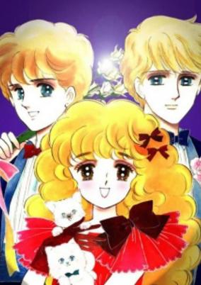

**Studio:** Toei Animation &nbsp;|&nbsp; **Director:** Hiroshi Shidara &nbsp;|&nbsp; **Aired/Released:** May 12 &nbsp;|&nbsp; **Genres:** United Kingdom, Earth, Sports, Europe, Angst, School Life

> This is the second series of Lady Lady. Every year at Lynn's school, an honorable “Lady Quest” is given to the most sophisticated lady. Lynn strives to receive this honor.
>
> _Synopsis source: Kitsu_

[Wikipedia](https://en.wikipedia.org/wiki/Hello!_Lady_Lynn) · [Kitsu](https://kitsu.io/anime/hello-lady-lynn)

---

### Mahjong Hishō-den: Naki no Ryū

**Studio:** Gainax &nbsp;|&nbsp; **Director:** Tetsu Dezaki &nbsp;|&nbsp; **Aired/Released:** May 25

---

### Dominion

**Studio:** Agent 21 &nbsp;|&nbsp; **Director:** Kōichi Mashimo &nbsp;|&nbsp; **Aired/Released:** May 27

[Wikipedia](https://en.wikipedia.org/wiki/Dominion_(manga))

---

### Balthus - Tia's Radiance

**Studio:** Kusama Art &nbsp;|&nbsp; **Director:** Yukihiro Makino &nbsp;|&nbsp; **Aired/Released:** May 25

---

### Mobile Suit SD Gundam

**Studio:** Sunrise &nbsp;|&nbsp; **Aired/Released:** May 25 &nbsp;|&nbsp; **Genres:** Science Fiction, Mecha, Parody, Super Deformed

> A collection of short parodies of the Mobile Suit Gundam saga. Episode 1 pokes fun at key events that occurred during the One Year War. In episode 2, Amuro, Kamille and Judau fight over who runs the better pension when Char comes in to crash their party. Episode 3 is the SD Olympics, an array of athletic events pitting man with mobile suit.
>
> _Synopsis source: Kitsu_

[Kitsu](https://kitsu.io/anime/mobile-suit-sd-gundam-mk-i)

---

### Toyama Sakura Space Book – His Name is Gold

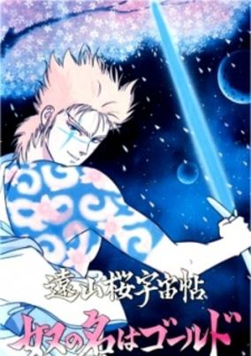

**Studio:** Toei Animation &nbsp;|&nbsp; **Director:** Atsutoshi Umezawa &nbsp;|&nbsp; **Aired/Released:** June &nbsp;|&nbsp; **Genres:** Action, Swordplay, Conspiracy, Future, Android, Science Fiction

> This science-fiction anime was inspired somewhat by the life of Kinshiro Toyama (1793-1855), who was first popularized in the 1893 kabuki play "Toyama no Kinsan."
>
> _Synopsis source: Kitsu_

[Kitsu](https://kitsu.io/anime/touyama-sakura-uchuu-chou-yatsu-no-na-wa-gold)

---

### Godmars: The Untold Legend

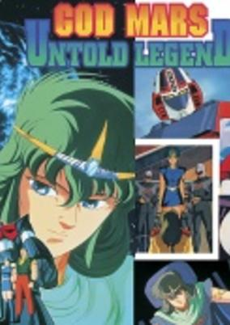

**Studio:** Tokyo Movie Shinsha &nbsp;|&nbsp; **Director:** Masakatsu Iijima &nbsp;|&nbsp; **Aired/Released:** June 5 &nbsp;|&nbsp; **Genres:** Science Fiction, Mecha, Space Opera, Other Planet, Space, Action

> Marg was deprived his little brother, Mars, by Zure, and lost his parents. Therefore, he was living alone on the planet, Gishin. He became a member of guerrilla to riot against the dictator Zure, and he fell in love with Ruru, the daughter of the leader, Ura. However, the organization was destroyed. He was trapped by Zure, and he was brainwashed to become a soldier. Then, his long cherished wish that he would meet his brother again was realized… as a duel with him.
>
> _Synopsis source: Kitsu_

[Kitsu](https://kitsu.io/anime/rokushin-gattai-god-mars-juunanasai-no-densetsu)

---

### Project A-ko 3: Cinderella Rhapsody

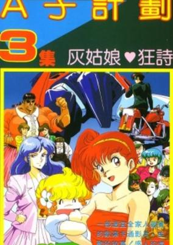

**Studio:** Studio Fantasia &nbsp;|&nbsp; **Director:** Yuji Moriyama &nbsp;|&nbsp; **Aired/Released:** June 20 &nbsp;|&nbsp; **Genres:** Earth, Romance, Power Suit, Transforming Craft, Science Fiction, Mecha, Action, Comedy, Love Polygon, Alien, Slapstick, Female Student, Super Power

> In the middle of another break from school, A-Ko dreams of finding the perfect boyfriend. Because of this, she and C-Ko get into an argument that leads to C-Ko running away and nearly getting hit by a motorcyclist named Kei. While working part-time at a fast-food restaurant to raise money for a party dress, A-Ko meets Kei and immediately falls in love with him. B-Ko happens to like him as well; however, both A-Ko and B-Ko are unaware that C-Ko is the apple of Kei's eyes.
>
> _Synopsis source: Kitsu_

[Kitsu](https://kitsu.io/anime/project-a-ko-3-cinderella-rhapsody)

---

### Zillion: Burning Night

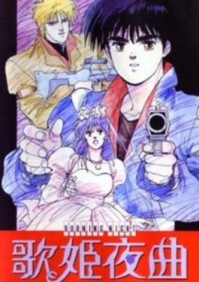

**Studio:** Tatsunoko Production , Production I.G &nbsp;|&nbsp; **Director:** Mizuho Nishikubo &nbsp;|&nbsp; **Aired/Released:** June 21 &nbsp;|&nbsp; **Genres:** Desert, Performance, Dystopia, Other Planet, Musical Band, Future, Science Fiction, Action, Disaster, Adventure

> In the peaceful aftermath of the Nozsa wars, the charismatic heroes known as "The White Knights" have changed career paths to becoming music making rockstars. J.J., Dave, Champ and Apple have formed a rock band called, "The White Nuts". Their music career would soon be interrupted by a new threat of colonial settlers. Apple is kidnapped by the sadistic ODAMA Clan - a family of ruthless killers. Located in a heavily-fortified mountain retreat, J.J. and company attempt a rescue mission with their laser weapon Zillion. But the former Knights only have a limited supply of Zillium for the Zillion guns. A mysterious stranger named Rick turns out to be an old lover of Apple.
>
> _Synopsis source: Kitsu_

[Kitsu](https://kitsu.io/anime/akai-koudan-zillion-utahime-yakyoku)

---

### Ironfist Chinmi (Iron Fist Chinmi)

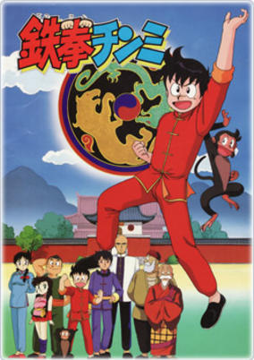

**Studio:** Ashi Productions &nbsp;|&nbsp; **Director:** Jutaro Oba &nbsp;|&nbsp; **Aired/Released:** July 2 &nbsp;|&nbsp; **Genres:** Martial Arts, Historical, Action, Adventure, Shounen, China, Violence, Plot Continuity

> Chinmi is a young Chinese boy devoted to martial arts training. Word of his skill reaches the kung-fu masters at the famous Dailin temple who invite him to study with them. Through his own dedication and the guidance of his teachers, Chinmi becomes one of the top students at the temple. Eventually, the time comes for him to leave Dailin and make a pilgrimage. On his journey he faces a number of dangers that test his skills, but he also meets many people who inspire him in different ways. A chastened but determined Chinmi returns to Dailin for advanced training. But soon his skills are needed again—the Mongol hordes are nearing the temple.
>
> _Synopsis source: Kitsu_

[Wikipedia](https://en.wikipedia.org/wiki/Ironfist_Chinmi) · [Kitsu](https://kitsu.io/anime/tekken-chinmi)

---

### Natsufuku no Shōjo-tachi

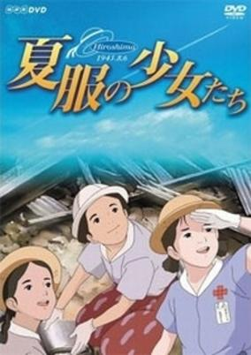

**Studio:** Madhouse &nbsp;|&nbsp; **Director:** Toshio Hirata, Yoshiyuki Momose &nbsp;|&nbsp; **Aired/Released:** July 7 &nbsp;|&nbsp; **Genres:** Japan, World War II, Anti War, Angst, Horror, War, Drama, Past, Disaster, Historical

> In 1945, the second and third-year students of a Hiroshima girls' school are taken away to work in war factories. The remaining 220 girls of the first year try to make the best of their new-found status as the only teenagers in an almost deserted town, even amid the deprivations of wartime. On the 7th of August, an American bomber changes their lives forever. Broadcast on the 43rd anniversary of Hiroshima in memory of "the girls who lost their lives to the atom bomb."
>
> _Synopsis source: Kitsu_

[Kitsu](https://kitsu.io/anime/natsufuku-no-shoujotachi)

---

### Bikkuriman: Moen Zone no Himitsu

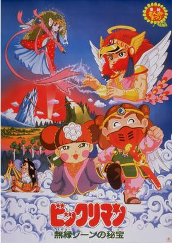

**Studio:** Toei Animation &nbsp;|&nbsp; **Director:** Junichi Sato &nbsp;|&nbsp; **Aired/Released:** July 9 &nbsp;|&nbsp; **Genres:** Action, Adventure, Kids

> No synopsis has been added for this series yet.Click here to update this information.
>
> _Synopsis source: Kitsu_

[Kitsu](https://kitsu.io/anime/bikkuriman-moen-zone-no-himitsu)

---

### Dragon Ball: Mystical Adventure (Dragon Ball Movie 3: Mystical Adventure)

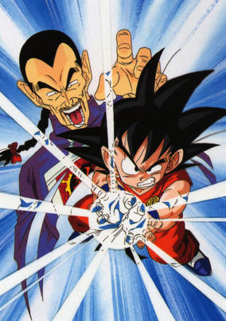

**Studio:** Toei Animation &nbsp;|&nbsp; **Director:** Kazuhisa Takenouchi &nbsp;|&nbsp; **Aired/Released:** July 9 &nbsp;|&nbsp; **Genres:** Comedy, Action, Fantasy, Super Power, Science Fiction, Adventure, Shounen

> Emperor Chiaotzu's wife has gone missing, and he is told by Master Shen that if he collects the seven dragon balls he can call upon the eternal dragon and wish for her return. Meanwhile, Goku and Krillin attend the World Martial Arts Tournament, which is hosted by the Emperor; Bora and his son Upa attempt to hide the dragon ball they found from the emperor's forces, which are under the control of the evil Shen and General Tao; and Bulma conducts her own search for the dragon balls with the help of Yamcha, Puar, and Oolong.
>
> _Synopsis source: Kitsu_

[Kitsu](https://kitsu.io/anime/dragon-ball-movie-3-makafushigi-daibouken)

---

### Akira

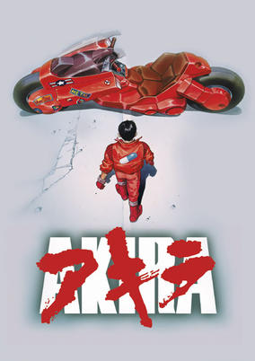

**Studio:** Tokyo Movie Shinsha &nbsp;|&nbsp; **Director:** Katsuhiro Otomo &nbsp;|&nbsp; **Aired/Released:** July 16 &nbsp;|&nbsp; **Genres:** Science Fiction, Post Apocalypse, Japan, Genetic Modification, Action, Human Enhancement, Cyberpunk, Angst, High School, Horror, Future, Violence, Military, Super Power, Adventure

> Japan, 1988. An explosion caused by a young boy with psychic powers tears through the city of Tokyo and ignites the fuse that leads to World War III. In order to prevent any further destruction, he is captured and taken into custody, never to be heard from again. Now, in the year 2019, a restored version of the city known as Neo-Tokyo—an area rife with gang violence and terrorism against the current government—stands in its place. Here, Shoutarou Kaneda leads "the Capsules," a group of misfits known for riding large, custom motorcycles and being in constant conflict with their rivals "the Clowns." During one of these battles, Shoutarou's best friend Tetsuo Shima is caught up in an accident with an esper who finds himself in the streets of Tokyo after escaping confinement from a government institution. Through this encounter, Tetsuo begins to develop his own mysterious abilities, as the government seeks to quarantine this latest psychic in a desperate attempt to prevent him from unleashing the destructive power that could once again bring the city to its knees.
>
> _Synopsis source: Kitsu_

[Wikipedia](https://en.wikipedia.org/wiki/Akira_(1988_film)) · [Kitsu](https://kitsu.io/anime/akira)

---

### Ryūko, the Girl with the White Flag

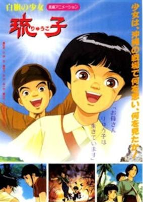

**Studio:** Magic Bus &nbsp;|&nbsp; **Director:** Tetsu Dezaki &nbsp;|&nbsp; **Aired/Released:** July 21 &nbsp;|&nbsp; **Genres:** Japan, World War II, Anti War, Disaster, Historical

> In 1945, American troops land on the island of Okinawa. The Japanese fight a guerrilla war against the invaders, and little Ryuko is forced to leave her grandparents behind and flee with her mother and younger sister, who are eventually killed. Ryuko heads on alone across the war-torn island. Eventually she reaches safety in Japanese-occupied caves, only to witness the Japanese troops committing suicide with hand grenades. Based on a children's book by Akira Aratagawa and Hikuji Norima, itself inspired by real American footage of an Okinawan girl, Tomiko Higa, waving a white flag at the island's surrender.
>
> _Synopsis source: Kitsu_

[Kitsu](https://kitsu.io/anime/shirahata-no-shoujo-ryuuko)

---

### Vampire Princess Miyu

**Studio:** Anime International Company &nbsp;|&nbsp; **Director:** Toshiki Hirano &nbsp;|&nbsp; **Aired/Released:** July 21

[Wikipedia](https://en.wikipedia.org/wiki/Vampire_Princess_Miyu)

---

### Saint Seiya: Legend of Crimson Youth

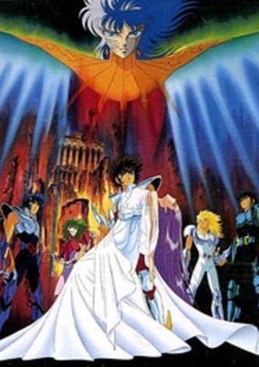

**Studio:** Toei Animation &nbsp;|&nbsp; **Director:** Shigeyasu Yamauchi &nbsp;|&nbsp; **Aired/Released:** July 23 &nbsp;|&nbsp; **Genres:** Science Fiction, Fantasy, Adventure, Henshin, Super Power, Deity, Action, Shounen

> Sun God Apollo the brother of Athena is here to take Athena back to heaven and taking over the sanctuary. He revived the deceased gold saints and use them and a few god saints as bodyguards. But Athena did not obey him, Apollo had no choice but send her to hell. On the otherhand, the bronze saints are on their way to save Athena.
>
> _Synopsis source: Kitsu_

[Kitsu](https://kitsu.io/anime/saint-seiya-legend-of-crimson-youth)

---

### Sakigake!! Otokojuku (Charge!! Men's Private School)

**Studio:** Toei Animation &nbsp;|&nbsp; **Director:** Shigeyasu Yamauchi &nbsp;|&nbsp; **Aired/Released:** July 23 &nbsp;|&nbsp; **Genres:** Japan, Earth, Asia, Delinquent, Swordplay, Martial Arts, Friendship, Present, Action, Comedy, School Life

> Otokojuku: a private school for juvenile delinquents that were previously expelled from normal schools. At this school, Japanese chivalry is taught through feudal and military fundamentals. Similar to an action film, the classes are overwhelmed by violence. Only those who survive it become true men.
>
> _Synopsis source: Kitsu_

[Kitsu](https://kitsu.io/anime/sakigake-otokojuku)

---

### The Tokyo Project

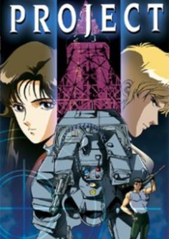

**Studio:** Minamimachi Bugyosho Co., Ltd. &nbsp;|&nbsp; **Director:** Osamu Yamasaki &nbsp;|&nbsp; **Aired/Released:** July 25 &nbsp;|&nbsp; **Genres:** Mecha, Japan, Action, Thriller, Detective, Conspiracy, Science Fiction, Mystery

> One night at a rock concert, a mysterious man dies while leaving a floppy disc with a member of the Rutz Detective Agency. Soon they realize the disk contains information about a deadly new weapon under development. The heroes become involved in a game of political subterfuge and military espionage, hot on the trail of the killer!
>
> _Synopsis source: Kitsu_

[Kitsu](https://kitsu.io/anime/tokyo-vice)

---

### What's Michael? 2

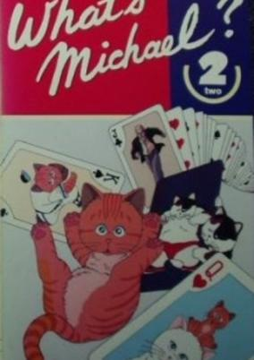

**Studio:** Kitty Films &nbsp;|&nbsp; **Director:** Yoriyasu Kogawa &nbsp;|&nbsp; **Aired/Released:** July 25 &nbsp;|&nbsp; **Genres:** Comedy

> Michael the orange tiger cat returns for another series of vignettes. The sketches this time include a three-part send-up of The Fugitive, the famous 1960's TV show. Richard Kimble is now a veterinarian on the lam (lamb?), running from a false conviction for a murder committed by "a man with overbite." Despite the omnipresent danger, he must stoop and intervene whenever he sees a cat (always Michael) suffering; after treating the patient, he plays a trick on the cat and runs away. (He's a fugitive, after all.) Another sketch draws parallels between wandering husbands and wandering house cats, who seem to have similar proclivities. Two more point out what happens when a cat's instincts run up against the requirements of baseball or pro wrestling.
>
> _Synopsis source: Kitsu_

[Kitsu](https://kitsu.io/anime/what-s-michael-2)

---

### Bride of Deimos

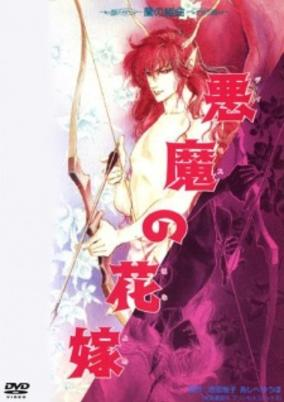

**Studio:** Madhouse &nbsp;|&nbsp; **Director:** Rintaro &nbsp;|&nbsp; **Aired/Released:** July 31 &nbsp;|&nbsp; **Genres:** Romance, Japan, Bishounen, Angst, Dark Fantasy, Horror, Present, Magic, Demon, Fantasy, Psychological, Mystery

> Two siblings were happy on Mt. Olympus, until they fell in love. Deimo's sister Venus got imprisoned in the Swamp of Death. To save Venus's life, he must find a human reincarnation so that they can continue their love.
>
> _Synopsis source: Kitsu_

[Wikipedia](https://en.wikipedia.org/wiki/Bride_of_Deimos) · [Kitsu](https://kitsu.io/anime/deimos-no-hanayome)

---

### Watt Poe and Our Story (Watt Poe)

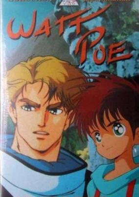

**Studio:** Kaname Production &nbsp;|&nbsp; **Director:** Shigenori Kageyama &nbsp;|&nbsp; **Aired/Released:** August 12 &nbsp;|&nbsp; **Genres:** Post Apocalypse, Adventure, Fantasy World, Future, Science Fiction

> Jam lives in a small coastal village that lives off fish that men bring home every day. One day his grandfather tells him that in recent year the fishing has been scarce. The steel hawks who live nearby on the mountain have kidnapped Watt Poe, a narwhal who is said to be the great protector of the sea, thus depriving the fishermen of his blessing. The boy decides to climb the mountain with the intention of bringing Watt Poe back to the sea...
>
> _Synopsis source: Kitsu_

[Kitsu](https://kitsu.io/anime/watt-poe-to-bokura-no-ohanashi)

---

### Fair, then Partly Piggy

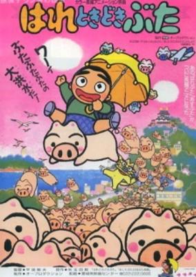

**Studio:** Oh! Production &nbsp;|&nbsp; **Director:** Toshio Hirata &nbsp;|&nbsp; **Aired/Released:** August 23 &nbsp;|&nbsp; **Genres:** Comedy, Kids

> Eight year old Noriyasu writes and draws in his diary, discovering later that everything he writes in it comes true, even if involves talking pigs and strange adventures.
>
> _Synopsis source: Kitsu_

[Wikipedia](https://en.wikipedia.org/wiki/Fair,_then_Partly_Piggy) · [Kitsu](https://kitsu.io/anime/hare-tokidoki-buta-237ed5ac-3592-469b-9b50-efa39eb861ec)

---

### Raining Fire

**Studio:** Mushi Production &nbsp;|&nbsp; **Director:** Seiji Arihara &nbsp;|&nbsp; **Aired/Released:** September 15

---

### Kosuke and Rikimaru: Dragon of Konpei Island

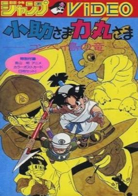

**Studio:** J.C. Staff &nbsp;|&nbsp; **Director:** Toyoo Ashida &nbsp;|&nbsp; **Aired/Released:** September 23 &nbsp;|&nbsp; **Genres:** Earth, Adventure, Action, Asia, Martial Arts, Alternative Present, Present, Super Power

> Kosukesama Rikimarusama: Konpeito no Ryu was a 45 minute long anime TV special produced by J.C. Staff and broadcast on Japanese television in 1988. Similar to Dragon Ball, it was a martial arts adventure story featuring villains that could have stepped out of the Red Ribbon Army, typical Toriyama mecha, and a clone of Son Gohan's Haiya Dragon.
>
> _Synopsis source: Kitsu_

[Kitsu](https://kitsu.io/anime/kosuke-sama-rikimaru-sama-konpeitou-no-ryuu)

---

### Through the Passing Seasons

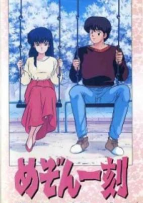

**Studio:** Kitty Films &nbsp;|&nbsp; **Director:** Naoyuki Yoshinaga &nbsp;|&nbsp; **Aired/Released:** September 25 &nbsp;|&nbsp; **Genres:** Japan, Earth, Slice of Life, Asia, Comedy, Coming Of Age, Present, Romance, Seinen

> A recap of the Maison Ikkoku series that focuses on the relationship between Godai and Kyoko. The entire special is taken from footage of the TV series.
>
> _Synopsis source: Kitsu_

[Wikipedia](https://en.wikipedia.org/wiki/Through_the_Passing_Seasons) · [Kitsu](https://kitsu.io/anime/maison-ikkoku-through-the-passing-of-the-seasons)

---

### Crying Freeman

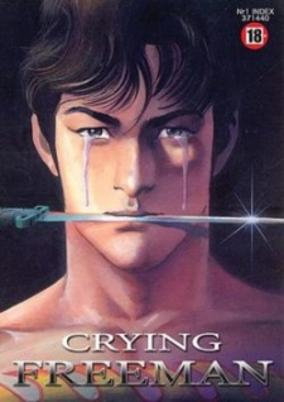

**Studio:** Toei Animation &nbsp;|&nbsp; **Director:** Daisuke Nishio et al. &nbsp;|&nbsp; **Aired/Released:** September &nbsp;|&nbsp; **Genres:** Martial Arts, Present, Earth, Japan, China, Violence, Asia, Action, Crime, Romance, Cops

> Yo Hinomura was an ordinary Japanese potter when a run-in with a Chinese mafia changed his life forever. Now an assassin for the 108 Dragons, Yo is the perfect killing machine. As a sign for remorse over his victims, he sheds tears after eliminating his targets. Because of this, he is infamously known by the Dragons and every crime syndicate in the world as "Crying Freeman."
>
> _Synopsis source: Kitsu_

[Wikipedia](https://en.wikipedia.org/wiki/Crying_Freeman) · [Kitsu](https://kitsu.io/anime/crying-freeman)

---

### Hiatari Ryoko! Ka - su - mi: Yume no Naka ni Kimi ga Ita (Sunny Ryoko! You Were There in a Dream)

**Studio:** Group TAC &nbsp;|&nbsp; **Director:** Minoru Maeda &nbsp;|&nbsp; **Aired/Released:** October 1 &nbsp;|&nbsp; **Genres:** Comedy, Drama, Romance

> The movie starts out with Katsuhiko going to the US, with Kasumi and Yusaku seeing him off at Narita. Two years later, Katsuhiko is a professional racer, and comes back to Japan to race (and to marry Kasumi). Yusaku's hobby is photography.
>
> _Synopsis source: Kitsu_

[Kitsu](https://kitsu.io/anime/hiatari-ryoukou-yume-no-naka-ni-kimi-ga-ita)

---

### New Grimm Masterpiece Theater (Grimm's Fairy Tale Classics)

**Studio:** Nippon Animation &nbsp;|&nbsp; **Director:** Hiroshi Saito &nbsp;|&nbsp; **Aired/Released:** October 2 &nbsp;|&nbsp; **Genres:** Romance, Fantasy World, Fantasy, High Fantasy, Past, Magic, Adventure, Comedy, Kids

> Every episode is a stand-alone retelling of a different fairy or folk tale. Not all of them are based on the fairy tales collected by the Brothers Grimm.
>
> _Synopsis source: Kitsu_

[Wikipedia](https://en.wikipedia.org/wiki/New_Grimm_Masterpiece_Theater) · [Kitsu](https://kitsu.io/anime/grimm-masterpiece-theater-ii)

---

### Soreike! Anpanman

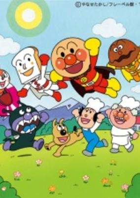

**Studio:** Tokyo Movie Shinsha &nbsp;|&nbsp; **Director:** Akinori Nagaoka, Shunji Ôga &nbsp;|&nbsp; **Aired/Released:** October 3 &nbsp;|&nbsp; **Genres:** Comedy, Fantasy, Kids

> One night, a Star of Life falls down the chimney of a bakery nestled deep in the forest, causing the dough in the oven to come to life. The dough becomes Anpanman, a superhero made of anpan (a sweet roll with bean jam filling). Together with his friends, Anpanman fights his rival Baikinman and helps the malnourished.
>
> _Synopsis source: Kitsu_

[Wikipedia](https://en.wikipedia.org/wiki/Soreike!_Anpanman) · [Kitsu](https://kitsu.io/anime/sore-ike-anpanman)

---

### Gunbuster

**Studio:** Gainax , Studio Fantasia &nbsp;|&nbsp; **Director:** Hideaki Anno &nbsp;|&nbsp; **Aired/Released:** October 7 &nbsp;|&nbsp; **Genres:** Space Travel, Science Fiction, Mecha, Action, Space Battles, Space Opera, Piloted Robot, Shipboard, Alien, War, Future, Friendship, Robot, Disaster, Space, Military, Comedy

> In the near future, humanity has taken its first steps towards journeying into the far reaches of the galaxy. Upon doing so they discover a huge race of insectoid aliens known as “Space Monsters.” These aliens seem dedicated to the eradication of mankind as they near closer and closer to discovering Earth. In response, humanity develops giant fighting robots piloted by hand-picked youth from around the world. Shortly after the discovery of the aliens, Noriko Takaya, the daughter of a famous deceased space captain, enters a training school despite her questionable talents as a pilot. There, she meets her polar opposite, the beautiful and talented Kazumi Amano, and is unexpectedly made to work together with her as they attempt to overcome the trauma of war as well as their own emotions. [Written by MAL Rewrite]
>
> _Synopsis source: Kitsu_

[Wikipedia](https://en.wikipedia.org/wiki/Gunbuster) · [Kitsu](https://kitsu.io/anime/top-wo-nerae)

---

### Yume Miru Topo Gigio

**Studio:** Nippon Animation &nbsp;|&nbsp; **Director:** Noboru Ishiguro, Shigeo Koshi &nbsp;|&nbsp; **Aired/Released:** October 7 &nbsp;|&nbsp; **Genres:** Comedy, Adventure, Kids

> Created by Maria Perego, Topo Gigio has been a beloved character for more than two decades. This animated TV series features numerous exciting stories and introduces many friends. Topo Gigio is the first mouse astronaut to travel the Milky Way. Can a mouse become an astronaut? Well, Topo Gigio has come from a year 2,388,400 years ahead in the future. He is friendly and can talk with humans. He makes friends with his neighbors including a girl, her pet mouse, cats, and other mice.
>
> _Synopsis source: Kitsu_

[Wikipedia](https://en.wikipedia.org/wiki/Yume_Miru_Topo_Gigio) · [Kitsu](https://kitsu.io/anime/yumemiru-toppo-jijo)

---

### Kimagure Orange Road: I Want to Return to That Day

**Studio:** Studio Pierrot &nbsp;|&nbsp; **Director:** Tomomi Mochizuki &nbsp;|&nbsp; **Aired/Released:** October 8 &nbsp;|&nbsp; **Genres:** Earth, Romance, Japan, Asia, Love Polygon, Coming Of Age, Plot Continuity, Present, Comedy, Slice of Life

> After the TV-series of Kimagure Orange Road, Kyosuke and Madoka have finally arrived at the point where they are close to graduation and have to decide where they want to go to college. Naturally, they want to go together, so beside all the studying they also have to look for a proper college where they can enter both. Hikaru, still a year from graduating, wants to support Kyosuke as well and does that in her own way. But while she does that, Madoka feels jealous and tells her feelings to Kyosuke. And then Kyosuke has to take action to finally decide on the girl he loves... thus concluding the story of the Kimagure Orange Road.
>
> _Synopsis source: Kitsu_

[Kitsu](https://kitsu.io/anime/kimagure-orange-road-i-want-to-return-to-that-day)

---

### Oishinbo

**Studio:** Shin-Ei Animation &nbsp;|&nbsp; **Director:** Yoshio Takeuchi &nbsp;|&nbsp; **Aired/Released:** October 17 &nbsp;|&nbsp; **Genres:** Japan, Earth, Asia, Cooking, Plot Continuity, Present, Comedy, Slice of Life

> Oishinbo is a drama about newspaper reporters. The main character is a cynical food critic named Yamaoka. Oishinbo is a popular mainstream comic for adults in Japan. It is even mentioned in an episode of "Iron Chef."
>
> _Synopsis source: Kitsu_

[Wikipedia](https://en.wikipedia.org/wiki/Oishinbo) · [Kitsu](https://kitsu.io/anime/oishinbo)

---

### Demon City Shinjuku

**Studio:** Madhouse &nbsp;|&nbsp; **Director:** Yoshiaki Kawajiri &nbsp;|&nbsp; **Aired/Released:** October 25 &nbsp;|&nbsp; **Genres:** Swordplay, Super Power, Earth, Dark Fantasy, Japan, Tokyo, Asia, Action, Horror, Dystopia, Adventure, Romance

> Kyoya's father was a great warrior, killed at the hands of the diabolical psychic, Rebi Ra, who has now opened a portal to hell in the city of Shinjuku. It falls to Kyoya to finish what his father started and battle his way through demons, while protecting a young woman from harm. The only problem is that he's not exactly your classic hero type, and his powers are still latent.
>
> _Synopsis source: Kitsu_

[Wikipedia](https://en.wikipedia.org/wiki/Demon_City_Shinjuku) · [Kitsu](https://kitsu.io/anime/demon-city-shinjuku)

---

### Starship Troopers

**Studio:** Sunrise , Bandai Visual &nbsp;|&nbsp; **Director:** Tetsurō Amino &nbsp;|&nbsp; **Aired/Released:** October 25 &nbsp;|&nbsp; **Genres:** Space Travel, Power Suit, Science Fiction, Alien, Future, Space, Military, Mecha

> Johnny Rico is a high school student living in Buenos Aires, who doesn't know what to do with his future life. When his friend Carl and his love Carmen, whom he grew up with, join the Federal Military, he does too enlist in the hope to chase after his love into space. However, a war is brewing on the outer planets with a strange bug-like alien enemy and Johnny is thrust into conflict.
>
> _Synopsis source: Kitsu_

[Wikipedia](https://en.wikipedia.org/wiki/Starship_Troopers_(OVA)) · [Kitsu](https://kitsu.io/anime/uchuu-no-senshi)

---

### Dragon Century

**Studio:** Anime International Company &nbsp;|&nbsp; **Director:** Kiyoshi Fukugawa &nbsp;|&nbsp; **Aired/Released:** October 26 &nbsp;|&nbsp; **Genres:** Fantasy, Post Apocalypse, Science Fiction, Action, Dragon, Anthropomorphism, Violence, Demon

> The story of a young girl and a young dragon. Naturally, they are the best of friends, and naturally the rest of the world is against them both. However, when demons decide to trash their world, they side with those who have always been against them.
>
> _Synopsis source: Kitsu_

[Wikipedia](https://en.wikipedia.org/wiki/Dragon_Century) · [Kitsu](https://kitsu.io/anime/ryuu-seiki)

---

### Stardust War

**Studio:** AIC , Artmic &nbsp;|&nbsp; **Director:** Katsuhito Akiyama &nbsp;|&nbsp; **Aired/Released:** November 2 &nbsp;|&nbsp; **Genres:** Science Fiction, Action, Space Opera, Alternative Past, Humanoid Alien, Shipboard, Alien, War, Drama, Past, Space, Military

> The girls are saved ... by none other than Catty Nebulart herself! Now, the race is on as Catty struggles to complete her crowning achievement: a huge machine that will bring life to a lifeless world!
>
> _Synopsis source: Kitsu_

[Wikipedia](https://en.wikipedia.org/wiki/Stardust_War) · [Kitsu](https://kitsu.io/anime/gall-force-3-stardust-war)

---

### Armor Hunter Mellowlink

**Studio:** Sunrise &nbsp;|&nbsp; **Director:** Takeyuki Kanda &nbsp;|&nbsp; **Aired/Released:** November 21 &nbsp;|&nbsp; **Genres:** Rotten World, Other Planet, War, Future, Piloted Robot, Science Fiction, Action, Mecha, Violence, Military

> As the sole survivor from a squad that was sacrificed and hung out as scapegoats for embezzlement of military resources at the end of the 100 years war, Mellowlink Arity is out for revenge. Carrying the dogtags of his deceased comrades and armed with a dated anti AT rifle, he swears to hunt down and exact revenge on the corrupt officers that betrayed his squad, and maybe even uncover the truth behind the plot as well.
>
> _Synopsis source: Kitsu_

[Wikipedia](https://en.wikipedia.org/wiki/Armor_Hunter_Mellowlink) · [Kitsu](https://kitsu.io/anime/kikou-ryohei-mellowlink)

---

### Tama & Friends: Third Street Story

**Studio:** Group TAC &nbsp;|&nbsp; **Director:** Tsuneo Maeda &nbsp;|&nbsp; **Aired/Released:** November 21

---

### Hades Project Zeorymer

**Studio:** AIC , Half H.P. Studio &nbsp;|&nbsp; **Director:** Toshihiro Hirano &nbsp;|&nbsp; **Aired/Released:** November 26 &nbsp;|&nbsp; **Genres:** Earth, Mecha, Piloted Robot, Japan, Asia, Action, Science Fiction, Psychological

> A young man named Akitsu Masato is captured by a secret govt. project known as "Last Guardian". He is told that his life as a normal student was all a lie, and that his real destiny is to be the pilot of a great robot called "Zeorymer of the Heavens". The truth of this is hammered in when Masato sees his parents accept payment for raising him. The Last Guardian is preparing for the resurrection of "Hau Dragon", an organization bent on world conquest. 15 years ago, Hau Dragon built 8 great robots. Each of the mecha represents a force of nature. However, before any of the robots could be used, their creater Kihara Masaki destroyed the robots except for the leader: Zeorymer. He took Zeorymer and an embryo to the government. The embryo became the boy Masato. Now, Hau Dragon has rebuilt the other 7 mecha and wants the 8th. It will be up to Masato and Himuro to pilot Zeorymer and fight against the Hau Dragon, but neither Masato or Himuro are all that they seem.
>
> _Synopsis source: Kitsu_

[Wikipedia](https://en.wikipedia.org/wiki/Hades_Project_Zeorymer) · [Kitsu](https://kitsu.io/anime/mei-ou-project-zeorymer)

---

### One-Pound Gospel (One Pound Gospel)

**Studio:** Studio Gallop &nbsp;|&nbsp; **Director:** Makura Saki &nbsp;|&nbsp; **Aired/Released:** December 2 &nbsp;|&nbsp; **Genres:** Boxing, Japan, Action, Asia, Earth, Combat, Sports, Present, Comedy, Romance

> Hatanaka Kosaku, a hopeful boxer, has a mean KO punch. Unfortunately, his dietary willpower is weak, and he eats even greasy hamburgers right before a bout. As a result, he has to compete in higher weight classes, and as soon as he takes an abdomenal punch, he vomits, which causes him to lose the match in shame. As he tries to grapple with his weak will, he meets Sister Angela, a novitiate at a local convent. While Sister Angela strives to help Hatanaka in his endeavor, he seems to make her training to be a nun more difficult.
>
> _Synopsis source: Kitsu_

[Wikipedia](https://en.wikipedia.org/wiki/One-Pound_Gospel) · [Kitsu](https://kitsu.io/anime/one-pound-gospel)

---

### Metal Skin Panic MADOX-01

**Studio:** Anime International Company &nbsp;|&nbsp; **Director:** Shinji Aramaki &nbsp;|&nbsp; **Aired/Released:** December 16 &nbsp;|&nbsp; **Genres:** Science Fiction, Mecha, Action, Japan, Earth, Asia, Piloted Robot, Tokyo, Present, Military

> In the first test of a revolutionary personal battle-suit, the MADOX-01, Ace female test-pilot Elle Kusomoto smashes an attacking tank force and humiliates Lt. Kilgore, Japan's most-macho tank-jockey, in the process. Kilgore swears he'll get even, and he gets his chance when the prototype MADOX literally falls off the back of a truck in the middle of Tokyo. Meanwhile, the MADOX, which fell off the back of one truck, off a bridge, and into the back of another truck, has found its way into the hands of college student Koji Sujimoto. Intruiged by the MADOX, Koji makes the big mistake of fooling with it without reading the manual first, and soon finds himself locked in the suit and zooming around downtown Tokyo.
>
> _Synopsis source: Kitsu_

[Wikipedia](https://en.wikipedia.org/wiki/Metal_Skin_Panic_MADOX-01) · [Kitsu](https://kitsu.io/anime/metal-skin-panic-madox-01)

---

### Ganbare! Mōdōken Serve

**Studio:** Tama Production &nbsp;|&nbsp; **Director:** Seiji Okuda &nbsp;|&nbsp; **Aired/Released:** December 18

---

### Fairy King

**Studio:** Madhouse &nbsp;|&nbsp; **Director:** Katsuhisa Yamada &nbsp;|&nbsp; **Aired/Released:** December 21 &nbsp;|&nbsp; **Genres:** Fantasy

> Jack has moved to Hokkaido to get treatment for an illness, but he's lonely and unhappy. One night a man on a horse rides through his window to help him. For a reason he doesn't understand, Jack instantly knows the man's name and feels they've met somewhere before. The man, Cu Chulainn, tells Jack to open the moonlight shadow window, which leads him to Nymphidia, the world of Midsummer Night's Dream, whose inhabitants are waiting for a new Fairy King Based on a manga from 1978 by Ryoko Yamagishi.
>
> _Synopsis source: Kitsu_

[Kitsu](https://kitsu.io/anime/yousei-ou)

---

### Legend of the Galactic Heroes

**Studio:** Artland , Magic Bus , Madhouse &nbsp;|&nbsp; **Director:** Noboru Ishiguro &nbsp;|&nbsp; **Aired/Released:** December 21 &nbsp;|&nbsp; **Genres:** Space Travel, Science Fiction, Space Battles, Space Opera, Conspiracy, Other Planet, Shipboard, War, Future, Politics, Plot Continuity, Violence, Space, Military

> For 150 years the galaxy has been locked in an interstellar war between the Galactic Empire and the Free Planets Alliance, fighting battles with thousands of spaceships and millions of soldiers on both sides. The crumbling Goldenbaum dynasty rules the Empire while the Alliance is in an increasingly dysfunctional democratic state. Two new commanders enter the stage: Imperial Admiral Reinhard von Lohengramm and the FPA's Yang Wen-Li. Reinhard is a talented minor aristocrat given a high station—and a powerful grudge—after the Kaiser took his older sister as a concubine. Wen-Li originally joined the military only to fund his university education, but has become a brilliant though reluctant leader. Each begins to attract a circle of similarly gifted soldiers, generals and thinkers around him, and in time the rivalry between these two very different men will shatter the existing stalemate. As they deal with superiors and subordinates, maneuver through personal and political problems, plot strategies and fight battles, both will bend the course of events to their will and, in turn, be tested and changed by the greatest war in human history! Legend of the Galactic Heroes is a vast, sentimental and thoughtful military space opera. This 110-episode OVA is the central part of the franchise, and the other connected titles are supplements to it.
>
> _Synopsis source: Kitsu_

[Wikipedia](https://en.wikipedia.org/wiki/Legend_of_the_Galactic_Heroes) · [Kitsu](https://kitsu.io/anime/ginga-eiyuu-densetsu)

---

### Space Family Carlvinson

**Studio:** Doga Kobo &nbsp;|&nbsp; **Director:** Kimio Yabuki &nbsp;|&nbsp; **Aired/Released:** December 21 &nbsp;|&nbsp; **Genres:** Science Fiction, Mecha, Fantasy World, Comedy, Other Planet, Alien, Future, Slapstick, Fantasy

> When a motley band of travelling performers has a deep-space collision with another spacecraft, they find that the sole survivor of the other craft is a humanoid infant. They decide to raise the child as their own on the nearest planet as they wait for other members of the girl's race to come and find her.
>
> _Synopsis source: Kitsu_

[Wikipedia](https://en.wikipedia.org/wiki/Space_Family_Carlvinson) · [Kitsu](https://kitsu.io/anime/uchuu-kazoku-carlvinson)

---

### Violence Jack: Evil Town

**Studio:** D.A.S.T., Soei Shinsha, Studio88 &nbsp;|&nbsp; **Director:** Ichiro Itano &nbsp;|&nbsp; **Aired/Released:** December 21 &nbsp;|&nbsp; **Genres:** Post Apocalypse, Action, Earth, Violence, Horror

> The World as we know it has been torn apart shattered by a series of natural disasters that have turned civilization into a brutish nightmare of survival and has left whole cities buried beneath the Earth. It's now a lethal and chaotic place, a place where only the strongest and most savage remain alive. The strongest of them all is a giant warrior known as Violence Jack… Violence Jack tries to avert a civil war brewing among the wretched inhabitants of a subterranean metropolis called Evil Town. Based on a character created by manga horror specialist, Go Nagai.
>
> _Synopsis source: Kitsu_

[Kitsu](https://kitsu.io/anime/violence-jack-2)

---

### Purple Eyes in the Dark

**Studio:** Toei Animation , Youmex &nbsp;|&nbsp; **Director:** Mizuho Nishikubo &nbsp;|&nbsp; **Genres:** Fantasy, Music, Horror, Psychological, Mystery

> Based on a shoujo manga written and illustrated by Shinohara Chie serialised in Shoujo Comic. The original story follows the struggles of a teenage girl after she finds herself turning into a lycanthropy-leopard and having to battle her newly found predatory instincts. In 1987 an animated music video of 30 minutes length was made based on the award winning manga.
>
> _Synopsis source: Kitsu_

[Wikipedia](https://en.wikipedia.org/wiki/Purple_Eyes_in_the_Dark) · [Kitsu](https://kitsu.io/anime/yami-no-purple-eye)

---
