# 1989 in Anime

[← Back to index](../README.md)

90 titles · 77 with a matched synopsis/cover art · [source](https://en.wikipedia.org/wiki/1989_in_anime)

## Releases

### Peter Pan: The Animated Series (Peter Pan & Wendy)

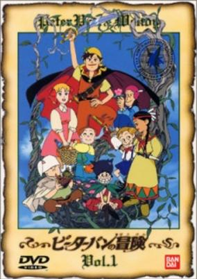

**Studio:** Nippon Animation &nbsp;|&nbsp; **Director:** Yoshio Kuroda &nbsp;|&nbsp; **Aired/Released:** January 15 &nbsp;|&nbsp; **Genres:** Pirate, Fantasy, Fantasy World, Adventure, Past

> Wendy and her two little brothers are brought to the land of adventures, Neverland, by Peter pan, a boy who will never grow up. In Neverland they encounter exciting events and meet with little fairies, mermaids, Indians, and pirates. Required to act as a mother, Wendy never has a moments peace with all that is happening around her, including breath-taking fights with pirates. Later in the series, they set off to find a buried treasure with a map that they obtain from the pirates.
>
> _Synopsis source: Kitsu_

[Kitsu](https://kitsu.io/anime/peter-pan-no-bouken)

---

### Bombing Circuit Romance Twin

**Studio:** Lifework &nbsp;|&nbsp; **Director:** Osamu Sekida &nbsp;|&nbsp; **Aired/Released:** January 24

---

### Goku Midnight Eye (Goku: Midnight Eye)

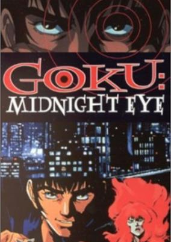

**Studio:** Madhouse, Inc. &nbsp;|&nbsp; **Director:** Yoshiaki Kawajiri &nbsp;|&nbsp; **Aired/Released:** January 27 &nbsp;|&nbsp; **Genres:** Asia, Science Fiction, Earth, Japan, Action, Detective, Tokyo, Cyberpunk, Drama, Future, Violence, Super Power, Mystery

> Furinji Goku is a detective who has an "eye of god". While he was investigating the murder case of his colleague when he had been an officer, he was pressured to stop it by the police executives. However, he continue investigating, and he lost his left eye. When he was about to be killed, a mysterious group helped him and transplant an artificial eye. The eye was a super technological device that connected to the whole computer network in the world, and enabled him to control any computers.
>
> _Synopsis source: Kitsu_

[Wikipedia](https://en.wikipedia.org/wiki/Goku_Midnight_Eye) · [Kitsu](https://kitsu.io/anime/goku-midnight-eye)

---

### Cynical Hysterie Hour: Henshin!

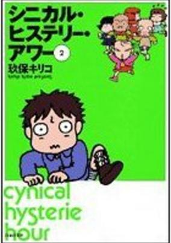

**Studio:** Studio Gallop &nbsp;|&nbsp; **Director:** Kiriko Kubo &nbsp;|&nbsp; **Aired/Released:** February 4 &nbsp;|&nbsp; **Genres:** Comedy

> No synopsis has been added for this series yet.Click here to update this information.
>
> _Synopsis source: Kitsu_

[Kitsu](https://kitsu.io/anime/cynical-hysterie-hour-henshin)

---

### Manga Hajimete Omoshiro Juku

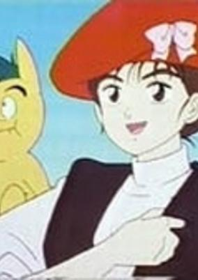

**Studio:** Dax International &nbsp;|&nbsp; **Director:** Hirochika Muraishi &nbsp;|&nbsp; **Aired/Released:** February 4 &nbsp;|&nbsp; **Genres:** Adventure, Kids

> No synopsis has been added for this series yet.Click here to update this information.
>
> _Synopsis source: Kitsu_

[Kitsu](https://kitsu.io/anime/manga-hajimete-omoshiro-juku)

---

### Riding Bean

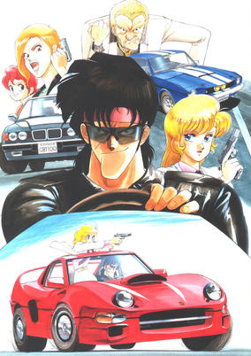

**Studio:** AIC , Artmic &nbsp;|&nbsp; **Director:** Yasuo Hasegawa &nbsp;|&nbsp; **Aired/Released:** February 22 &nbsp;|&nbsp; **Genres:** Action, Gunfights, United States, Violence, Present, Motorsport, Cops

> Bean Bandit and his partner Rally Vincent are couriers for hire - transporting clients and delivering goods in his custom sports car "Roadbuster" for a hefty price. But when they are hired to escort a kidnapped girl named Chelsea to her home, they don't realize they're being framed for kidnapping as their former clients Semmerling and Carrie plan their escape with Chelsea's father and the ransom money.
>
> _Synopsis source: Kitsu_

[Wikipedia](https://en.wikipedia.org/wiki/Riding_Bean) · [Kitsu](https://kitsu.io/anime/riding-bean)

---

### Be-Boy Kidnapp'n Idol

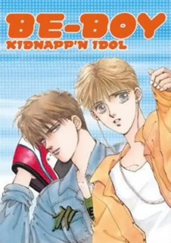

**Studio:** AIC , Youmex &nbsp;|&nbsp; **Director:** Kenichi Yatagai &nbsp;|&nbsp; **Aired/Released:** February 28 &nbsp;|&nbsp; **Genres:** Earth, Japan, Asia, Present, Shounen Ai

> Kazuya is a 16-year-old, popular idol singer who has loads of female fans. Other than rehearse or sign autographs, he plays video games with his friend Akihiko. Akihiko is more violent than sweet toward Kazuya, but he is protective of him despite the many arguments they may get into. Akihiko later on confesses his love to Kazuya.
>
> _Synopsis source: Kitsu_

[Kitsu](https://kitsu.io/anime/be-boy-kidnapp-n-idol)

---

### Cipher the Video (Cipher)

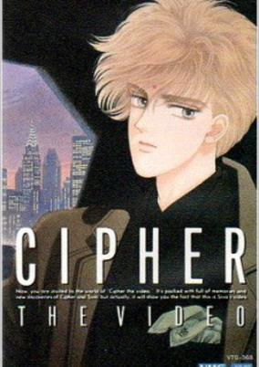

**Studio:** Magic Bus &nbsp;|&nbsp; **Director:** Tsuneo Tominaga &nbsp;|&nbsp; **Aired/Released:** March 3 &nbsp;|&nbsp; **Genres:** Music, Drama

> Two brothers are in the spotlight: one a movie star making a football movie, the other a musician who occasionally goes to school (to cover for his sibling). What will destiny bring them?
>
> _Synopsis source: Kitsu_

[Wikipedia](https://en.wikipedia.org/wiki/Cipher_(manga)#OVA) · [Kitsu](https://kitsu.io/anime/cipher)

---

### Doraemon: Nobita and the Birth of Japan (Doraemon the Movie: Nobita and the Birth of Japan)

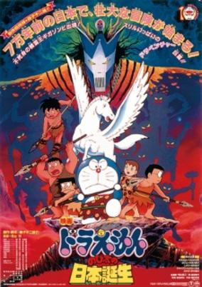

**Studio:** Shin-Ei Animation &nbsp;|&nbsp; **Director:** Tsutomu Shibayama &nbsp;|&nbsp; **Aired/Released:** March 11 &nbsp;|&nbsp; **Genres:** Comedy, Fantasy, Adventure, Kids

> Nobita wants to run away from home, again. He finds out that there is nowhere for him to go. All the land is owned by someone. His friends end up wanting to run away also, even Doraemon. They figure out that the only way to find land that isn't owned by anyone is to go back in time to when no humans existed. They end up helping a prehistoric boy rescue his tribe from Gigazombie.
>
> _Synopsis source: Kitsu_

[Kitsu](https://kitsu.io/anime/doraemon-nobita-at-the-birth-of-japan)

---

### The Five Star Stories

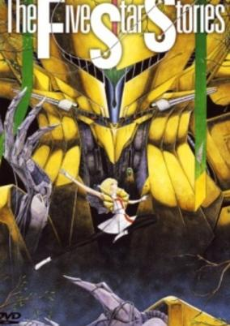

**Studio:** Sunrise &nbsp;|&nbsp; **Director:** Kazuo Yamazaki &nbsp;|&nbsp; **Aired/Released:** March 11 &nbsp;|&nbsp; **Genres:** Science Fiction, Mecha, Action, Fantasy

> Amaterasu is the god of light, the future emperor of the Joker Star System. Under the guise of young mecha conceptor Ladios Sopp, he is compelled by an old friend, Dr Ballanche, to save his two latest Fatimas Lachesis and Clotho. And so began the stories of the Joker System, as well as Amaterasu's love for Lachesis.
>
> _Synopsis source: Kitsu_

[Wikipedia](https://en.wikipedia.org/wiki/The_Five_Star_Stories) · [Kitsu](https://kitsu.io/anime/five-star-stories)

---

### Dorami-chan: Mini-Dora SOS!!!

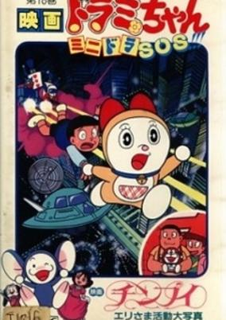

**Studio:** Shin-Ei Animation &nbsp;|&nbsp; **Director:** Makoto Moriwaki &nbsp;|&nbsp; **Aired/Released:** March 11 &nbsp;|&nbsp; **Genres:** Fantasy, Kids

> This episode is set in the future where the main characters from Doraemon are all grown up and have kids. Minidora (mini doraemon) accidently gets delivered to the Nobita's future house. The sons of Jyaiyan, Suneo and Nobita plays with Minidora with the special goods he brings out of his pocket. But trouble happens when they ran away from Dorami, who came to retrieve Minidora.
>
> _Synopsis source: Kitsu_

[Wikipedia](https://en.wikipedia.org/wiki/Mini-Dora_SOS) · [Kitsu](https://kitsu.io/anime/dorami-chan-mini-dora-sos)

---

### Soreike! Anpanman: Kirakira Boshi no Namida (Go! Anpanman: The Shining Star's Tear)

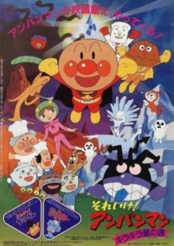

**Studio:** Tokyo Movie Shinsha &nbsp;|&nbsp; **Director:** Akinori Nagaoka &nbsp;|&nbsp; **Aired/Released:** March 11 &nbsp;|&nbsp; **Genres:** Comedy, Super Power, Adventure, Kids

> Anpanman helps the princess Nandananda to find the The Shining Star's Tear.
>
> _Synopsis source: Kitsu_

[Kitsu](https://kitsu.io/anime/sore-ike-anpanman-kirakira-boshi-no-namida)

---

### The Three Musketeers Anime: Aramis' Adventure (The Three Musketeers: Aramis the Adventure)

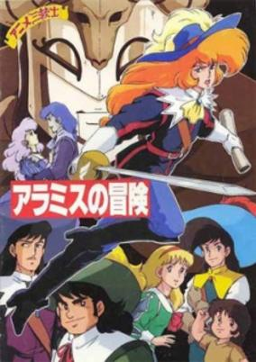

**Studio:** Gallop &nbsp;|&nbsp; **Director:** Kunihiko Yuyama &nbsp;|&nbsp; **Aired/Released:** March 11 &nbsp;|&nbsp; **Genres:** Romance, Action, Swordplay, Europe, Conspiracy, Past, Historical, Adventure

> Aramis fell off her horse and received the aid of a man named Francois. They fell in love with each other at first sight and spent their time happily for a while. Francois was killed by Manson and the Ironmask's people, so Aramis swore revenge. Then she went to Paris to be a musketeer. 1 year after the end of TV series, D'Artagnan had a drink with 3 musketeers and found that Jussac and the Cardinal's Guards harrassed a woman in a tavern in Paris. Of couse, they fought Jussac and the Cardinal's guards and won. On his way to home, D'Artagnan witnessed the woman whom he rescued from Jussac about to jump into the river, and rescued her again. D'Artagnan brought her to home but she disappeared soon. After a day, D'Artagnan heard that the woman was killed last night and Rochefort and Cardinal's guards arrested him for murder because his hat was found by the woman's body. Aramis discovers that the story has a link with Catherine de Médicis, and launches out an investigation. This one will bring back her to the castle of her beloved where she will have to face Pizzaro to protect a dangerous document.
>
> _Synopsis source: Kitsu_

[Kitsu](https://kitsu.io/anime/anime-sanjushi-aramis-no-bouken)

---

### Utsunomiko

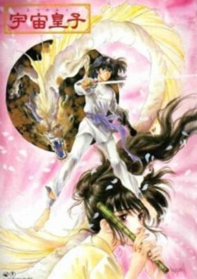

**Studio:** Nippon Animation &nbsp;|&nbsp; **Director:** Kenji Yoshida &nbsp;|&nbsp; **Aired/Released:** March 11 &nbsp;|&nbsp; **Genres:** Demon, Fantasy, Adventure

> In the chaos of the Jinshin-no-Ran civil war of 762, a child with a small horn in his forehead was born. The child's mother condemned him as an oni and cast him away. An elderly shūgenja woman claimed the child and named him Utsunomiko, or 'Divine Child of the Heavens', telling Miko that his horn smybolizes the union of heaven and earth. Miko matured in the wilderness learning the ways of Shugendō, and soon started venturing into villages out of curiosity. He found that the common people of the villages live in poverty and suffering, and began using his spiritual powers to help them. But his anger at the self-serving rulers and their petty power-struggles grew until he came into open conflict with the Imperial Court, setting Miko down a long path as a champion of the oppressed.
>
> _Synopsis source: Kitsu_

[Wikipedia](https://en.wikipedia.org/wiki/Utsunomiko) · [Kitsu](https://kitsu.io/anime/utsunomiko)

---

### Venus Wars

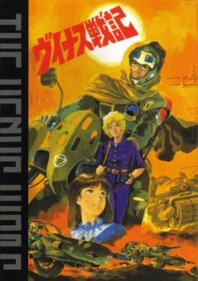

**Studio:** Triangle Staff &nbsp;|&nbsp; **Director:** Yoshikazu Yasuhiko &nbsp;|&nbsp; **Aired/Released:** March 11 &nbsp;|&nbsp; **Genres:** Desert, Science Fiction, Action, Gunfights, Other Planet, War, Future, Space, Military, Motorsport, Adventure

> In the 21st century, mankind lives on two worlds. Following the collision of an ice asteroid, massive terraforming has made Venus a planet now capable of supporting life. Colonists from Earth tamed the hostile world and have thrived for four generations. But they also brought the darker side of humanity. Venus is about to get hostile again. Hiro Seno, a hotshot motorcycle jockey, witnesses the first strike against his country Aphrodia, by the rival nation of Ishtar. Huge battletanks and warplanes quickly lay waste to the city. The Aphrodian army is quick to mobilize and retaliate... and despite his opposition to warfare, Hiro finds himself fighting for his life on the front lines.
>
> _Synopsis source: Kitsu_

[Wikipedia](https://en.wikipedia.org/wiki/Venus_Wars) · [Kitsu](https://kitsu.io/anime/venus-wars)

---

### Himitsu no Akko-chan

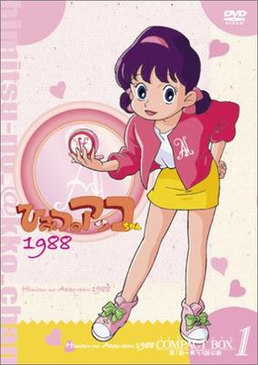

**Studio:** Toei Animation &nbsp;|&nbsp; **Director:** Hiroki Shibata &nbsp;|&nbsp; **Aired/Released:** March 13 &nbsp;|&nbsp; **Genres:** Magic, Magical Girl, School Life, Kids, Shoujo

> Akko-chan is a bright and energetic 5th grader in elementary school whose father is a newscaster and mother is a picture-book writer. Akko always cherishes the palm-sized mirror that was given to her by her father and treats it with care. However, the mirror was accidentally broken by her absent-minded mother. On a night where a beautiful full-moon hangs in the sky, Akko-chan buries the mirror pieces in the garden and goes to sleep. She is awakened by a soft and kind voice which belongs to the Queen of the Mirror Kingdom. She sends her gratitiude to Akko-chan for cherishing the mirror with care and offers her a magical compact mirror. Whenever she sings the magical words, Akko-chan will be able to transform into anything she wants.
>
> _Synopsis source: Kitsu_

[Kitsu](https://kitsu.io/anime/himitsu-no-akko-chan-2)

---

### Transformers: Victory (Transformers Victory)

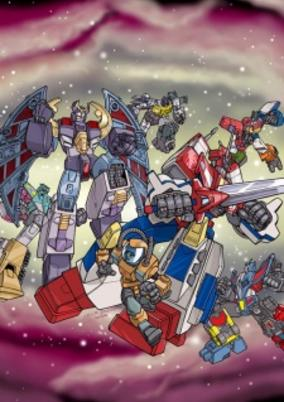

**Studio:** Toei Animation &nbsp;|&nbsp; **Director:** Yoshikata Nitta &nbsp;|&nbsp; **Aired/Released:** March 14 &nbsp;|&nbsp; **Genres:** Transforming Craft, Science Fiction, Mecha, Adventure, Action, Space

> Set in 2025 A.D., Transformers Victory introduces Star Saber, the mightiest Autobot warrior and the greatest swordsman in the galaxy. Following the defeat of the Decepticons on Earth in the Masterforce War, the villains have begun aggressively attacking other planets in the universe. To counter this threat, the Autobots joined with many other civilizations and lifeforms (including Humanity) to form the Galactic Peace Alliance, with Star Saber as its leader. Seeking the energy necessary to free his massive Planet-Destroying Fortress from imprisonment in the Dark Nebula where Star Saber sealed it years ago, the Decepticons' new Emperor of Destruction, Deathsaurus (Dezarus), attacks Earth with his Dinoforce, prompting Star Saber and his team to set up residence on the planet.
>
> _Synopsis source: Kitsu_

[Kitsu](https://kitsu.io/anime/transformers-victory)

---

### Yankee Reppu-tai

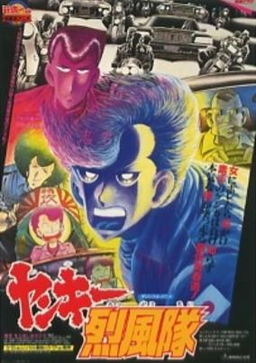

**Studio:** Toei Animation &nbsp;|&nbsp; **Director:** Tetsuro Imazawa &nbsp;|&nbsp; **Aired/Released:** March 17 &nbsp;|&nbsp; **Genres:** Delinquent, Adventure

> Impossibly tough and hairsprayed biker boys and girls fight turf wars in the streets, with much revving of motors and "you killed my buddy, prepare to die" dialogue. Based on the Shonen Magazine manga by Masahide Hashimoto, whose hero was so tough that he transferred schools 20 times. Only a Japanese tough guy would continue to go at all!
>
> _Synopsis source: Kitsu_

[Kitsu](https://kitsu.io/anime/yankee-reppuu-tai)

---

### Osomatsu-kun: Suika no Hoshi Kara Konnichiwa zansu!

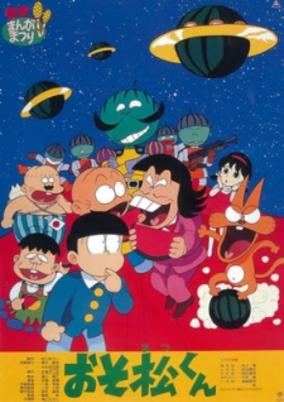

**Studio:** Studio Pierrot &nbsp;|&nbsp; **Director:** Akira Shigino &nbsp;|&nbsp; **Aired/Released:** March 18 &nbsp;|&nbsp; **Genres:** Comedy

> Osomatsu-kun Movie.
>
> _Synopsis source: Kitsu_

[Kitsu](https://kitsu.io/anime/osomatsu-kun-suika-no-hoshi-kara-konnichiwa-zansu)

---

### Warriors of the Final Holy Battle (Saint Seiya: Warriors of the Final Holy Battle)

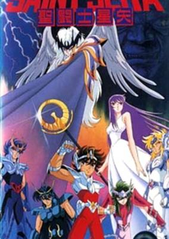

**Studio:** Toei Animation &nbsp;|&nbsp; **Director:** Masayuki Akehi &nbsp;|&nbsp; **Aired/Released:** March 18 &nbsp;|&nbsp; **Genres:** Science Fiction, Henshin, Adventure, Deity, Fantasy, Action, Shounen

> Lucifer has been awoken from his eternal slumber by the spirits of Eris, Abel and Poseidon. He has come to kill Athena and fulfill his heart's burning desire: becoming the strongest of all the gods.
>
> _Synopsis source: Kitsu_

[Wikipedia](https://en.wikipedia.org/wiki/Warriors_of_the_Final_Holy_Battle) · [Kitsu](https://kitsu.io/anime/saint-seiya-warriors-of-the-final-holy-battle)

---

### Rhea Gall Force

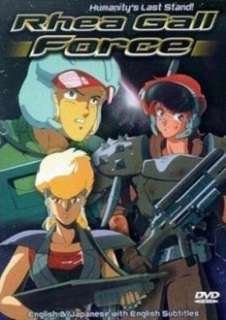

**Studio:** AIC , Artmic &nbsp;|&nbsp; **Director:** Katsuhito Akiyama &nbsp;|&nbsp; **Aired/Released:** March 21 &nbsp;|&nbsp; **Genres:** Science Fiction, Post Apocalypse, Earth, Action, Gunfights, Humanoid Alien, Alien, War, Drama, Future, Disaster, Violence, Military, Mecha

> The Solnoid race is long dead, annihilated along with their enemies in the final battle at Sigma Narse. But their descendants survive on Earth, and have now inherited the sad destiny predicted so many years before. The year is 2085. The third world war between East and West has reduced the cities of Earth to mountains of rubble. The mechanical killing machines created by both sides now ruthlessly hunt down the remnants of humanity. Old hatreds between human factions prevent an effective resistance, and the only hope for survival rests in a desperate plan: evacuate the survivors to Mars Base. There they can rebuild and plan the liberation of the home world. Among them, one young woman carries the guilt of her father`s hand in the destruction of civilization. Unknown to her, she also carries the key to a possible salvation. As destiny draws new friends and allies to her, a new Gall Force is born to rise up against the coming destruction...
>
> _Synopsis source: Kitsu_

[Wikipedia](https://en.wikipedia.org/wiki/Rhea_Gall_Force) · [Kitsu](https://kitsu.io/anime/rhea-gall-force)

---

### Mobile Suit Gundam 0080: War in the Pocket

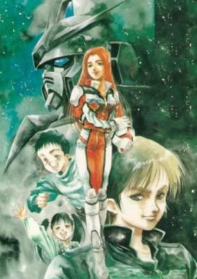

**Studio:** Sunrise &nbsp;|&nbsp; **Director:** Fumihiko Takayama &nbsp;|&nbsp; **Aired/Released:** March 25 &nbsp;|&nbsp; **Genres:** Science Fiction, Mecha, Action, Piloted Robot, Slice of Life, Coming Of Age, Drama, Future, Space, Military, Adventure

> Alfred Izuruha is a 10-year-old who lives in the neutral colony cluster of Side 6 and, like most boys his age, is obsessed with the war between the Earth Federation and the Principality of Zeon. Unbeknownst to him, Al's next-door neighbor, Christina, is the test pilot of a prototype Gundam being developed in secret by the Earth Federation in the colony. A Zeon Special Forces team is assembled and tasked with infiltrating the colony in order to either steal or destroy it. When a skirmish breaks out between the Federation and infiltrating Zeon forces, the fascinated Alfred stumbles upon a Zaku mobile suit that has been shot down, piloted by Zeon rookie Bernard "Bernie" Wiseman. After this encounter, the two start a mutual friendship, so Alfred can learn more about the war that interests him so much, and Bernie can acquire inside information about the colony to aid his team's mission. [Written by MAL Rewrite]
>
> _Synopsis source: Kitsu_

[Kitsu](https://kitsu.io/anime/mobile-suit-gundam-0080-war-in-the-pocket)

---

### Bye Bye, Lady Liberty (Lupin the Third: Goodbye Lady Liberty)

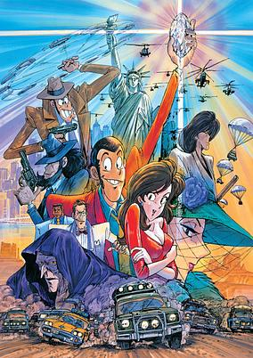

**Studio:** Tokyo Movie Shinsha &nbsp;|&nbsp; **Director:** Osamu Dezaki &nbsp;|&nbsp; **Aired/Released:** April 1 &nbsp;|&nbsp; **Genres:** Action, Comedy, Thievery, Adventure, Crime

> Foiled repeatedly by the predictions of Interpol's supercomputer, professional looter Lupin the Third has settled down. His partner Jigen asks him to pull on last job: recover the Super Egg, a massive diamond hidden somewhere inside the Statue of Liberty. Suddenly a sinister secret organization and a young computer genius are thrown into the mix. And whose side is the buxom Fujiko on this time?
>
> _Synopsis source: Kitsu_

[Wikipedia](https://en.wikipedia.org/wiki/Bye_Bye,_Lady_Liberty) · [Kitsu](https://kitsu.io/anime/lupin-iii-bye-bye-liberty-crisis)

---

### Miracle Giants Dome-kun

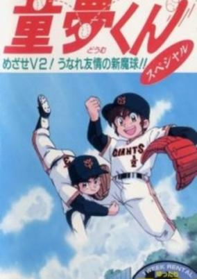

**Studio:** Gallop &nbsp;|&nbsp; **Director:** Takashi Watanabe &nbsp;|&nbsp; **Aired/Released:** April 2 &nbsp;|&nbsp; **Genres:** Action, Sports, Baseball

> Dome Shinjo, a 10-year-old boy who is son of a deceased legendary player of the Yomiuri Giants. From his father he inherited the love for baseball and his great abilities for such sport, although his mother and his older sister try to avoid that he practices it. In fact, his father, before dying, had time to teach him a magical shoot. Dome, after his mother gave him the glove his father used, he makes that shot in a training session of the Giants and is contracted immediately. With the support of the veteran players of the team, this young player will, from this very moment, make the Giants become unbeatable at home and none of the main batters of the Japanese professional league manages to end with his magical shot. Although that does not apply to the games played away, as Dome is just allowed to play at home, in the Tokyo Dome in which his father was consacrated (and the place by which he did chose such name for his son). When the veteran captain of the Dragons manages to bat his shot, it seems that the young boy is finally and definitely defeated, but then he invents another magical shot. New rivals, but also friends (such as Melody Norman, an American girl who disguises herself as a boy because women can't play baseball), will appear in scene, until the arrival of the mysterious Don Carlos, a Spanish ex-bullfighter who plays for the Hiroshima Toyo Carp and seems to have something pending with his father. Will Dome succeed in giving the league to the Giants?
>
> _Synopsis source: Kitsu_

[Wikipedia](https://en.wikipedia.org/wiki/Miracle_Giants_Dome-kun) · [Kitsu](https://kitsu.io/anime/miracle-giants-dome-kun)

---

### Alfred J. Kwak (Alfred J. Quack)

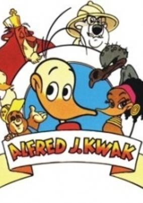

**Studio:** Telescreen Japan Inc , Teleimage Inc, Visual '80 &nbsp;|&nbsp; **Director:** Hiroshi Saitō &nbsp;|&nbsp; **Aired/Released:** April 3 &nbsp;|&nbsp; **Genres:** Adventure, Comedy, Conspiracy, Anthropomorphism, Historical, Fantasy, Kids

> Alfred J Kwak (Dutch, it takes place in Holland) lost his parents, brothers and sisters when he was young. He was raised by a mole. The series covers the life of Alfred from the day he is born. In his life Alfred tries to help all sorts of animals all over the world. The series are meant to entertain children and teach children about life, covering historical aspects like WW II.
>
> _Synopsis source: Kitsu_

[Wikipedia](https://en.wikipedia.org/wiki/Alfred_J._Kwak) · [Kitsu](https://kitsu.io/anime/ahiru-no-quack)

---

### Legend of Heavenly Sphere Shurato

**Studio:** Tatsunoko Production &nbsp;|&nbsp; **Director:** Toshihiko Nishikubo &nbsp;|&nbsp; **Aired/Released:** April 6

[Wikipedia](https://en.wikipedia.org/wiki/Legend_of_Heavenly_Sphere_Shurato)

---

### Blue Blink

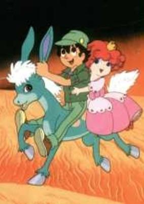

**Studio:** Tezuka Productions &nbsp;|&nbsp; **Director:** Osamu Tezuka &nbsp;|&nbsp; **Aired/Released:** April 7 &nbsp;|&nbsp; **Genres:** Fantasy World, Adventure, Parallel Universe, Fantasy

> Story of a young boy named Kakeru and his adventures together with a magical blue pony named Blink.
>
> _Synopsis source: Kitsu_

[Wikipedia](https://en.wikipedia.org/wiki/Blue_Blink) · [Kitsu](https://kitsu.io/anime/aoi-blink)

---

### Madö King Granzört

**Studio:** Sunrise &nbsp;|&nbsp; **Director:** Shūji Iuchi &nbsp;|&nbsp; **Aired/Released:** April 7

[Wikipedia](https://en.wikipedia.org/wiki/Mad%C3%B6_King_Granz%C3%B6rt)

---

### Cynical Hysterie Hour: Yoru wa Tanoshii

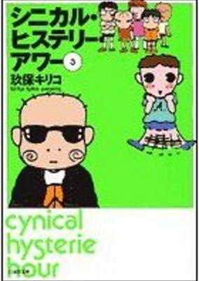

**Studio:** Studio Gallop &nbsp;|&nbsp; **Director:** Kiriko Kubo &nbsp;|&nbsp; **Aired/Released:** April 8 &nbsp;|&nbsp; **Genres:** Comedy

> No synopsis has been added for this series yet.Click here to update this information.
>
> _Synopsis source: Kitsu_

[Kitsu](https://kitsu.io/anime/cynical-hysterie-hour-yoru-wa-tanoshii)

---

### Hengen Taima Yakō Karura Mau! Nara Onryō Emaki (Karura Mau Movie)

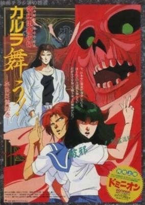

**Studio:** Ginga Teikoku &nbsp;|&nbsp; **Director:** Takaaki Ishiyama &nbsp;|&nbsp; **Aired/Released:** April 8 &nbsp;|&nbsp; **Genres:** Fantasy, Japan, Ghost, Horror, Violence, Demon, Super Power, Action, Adventure

> Shoko and Maiko Ougi are apparently two ordinary schoolgirls in pursuit of graduating and having fun. Shii-chan is the more serious while Mai-chan is more fun-loving. In reality, the two sisters are powerful exorcists from the Karura temple. Each wields half the power...Shii-chan can "see" the spirits, and Mai-chan can banish them. This is the movie adaptation of a spooky series with heavy emphasis on traditionally Japanese occult themes.
>
> _Synopsis source: Kitsu_

[Kitsu](https://kitsu.io/anime/karura-mau-movie)

---

### Ranma ½

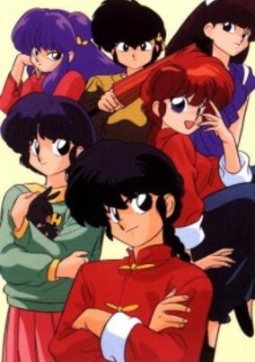

**Studio:** Studio Deen &nbsp;|&nbsp; **Director:** Tomomi Mochizuki , Tsutomu Shibayama &nbsp;|&nbsp; **Aired/Released:** April 15 &nbsp;|&nbsp; **Genres:** Contemporary Fantasy, Fantasy, Japan, Earth, Action, Asia, Comedy, Violent Retribution For Accidental Infringement, Martial Arts, Slapstick, School Life, Present, Romance, Slice of Life, Gender Bender, Shounen, Harem

> Ranma Saotome is a top-class martial artist and prodigy at the Saotome "Anything-Goes" school of martial arts. While training in China, he and his father meet a terrible fate when they accidentally fall into a cursed spring. Now, Ranma is cursed to turn into a girl when splashed with cold water, and only hot water can turn him back into a boy. Things are only complicated further when Ranma discovers that his father has arranged for him to marry one of Soun Tendo's three daughters in order to secure the future of the Tendo dojo. Though Soun learns of Ranma's predicament, he is still determined to go ahead with the engagement, and chooses his youngest daughter Akane, who happens to be a skilled martial artist herself and is notorious for hating men.Ranma ½ follows the hilarious adventures of Ranma and Akane as they encounter various opponents, meet new love interests, and find different ways to make each other angry, all while their engagement hangs over their head. [Written by MAL Rewrite]
>
> _Synopsis source: Kitsu_

[Wikipedia](https://en.wikipedia.org/wiki/Ranma_%C2%BD) · [Kitsu](https://kitsu.io/anime/ranma-nettou-hen)

---

### Akuma-kun

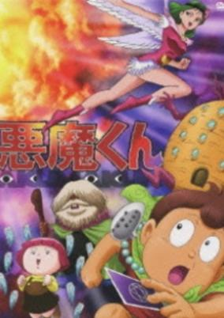

**Studio:** Toei Animation &nbsp;|&nbsp; **Director:** Junichi Sato &nbsp;|&nbsp; **Aired/Released:** April 16 &nbsp;|&nbsp; **Genres:** Magic, Fantasy, Adventure, Horror

> The age of the demons has begun. Dr Faust has foreseen this rise of evil. Unfortunately, he is near death and is unable to personally battle this upcoming threat. Faust entrusts a young boy, Shingo Yamada, to take the responsibility of ridding the Earth of this new evil presence. Faust finds a birthmark on Shingo's forehead that signifies that he is the chosen demon fighter. Faust summons from hell what may be humanity's only hope of surviving: a less than enthusiastic devil named Mephisto rises. After signing a pact in blood to save humankind, Shingo and Mephisto set out to battle the supernatural world.
>
> _Synopsis source: Kitsu_

[Wikipedia](https://en.wikipedia.org/wiki/Akuma-kun#1989_anime_series) · [Kitsu](https://kitsu.io/anime/akuma-kun)

---

### Dragon Ball Z

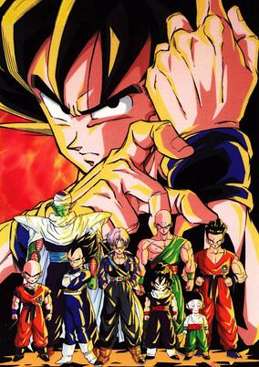

**Studio:** Toei Animation &nbsp;|&nbsp; **Director:** Daisuke Nishio , Shigeyasu Yamauchi &nbsp;|&nbsp; **Aired/Released:** April 26 &nbsp;|&nbsp; **Genres:** Fantasy, Action, Earth, Comedy, Martial Arts, Other Planet, Humanoid Alien, Alien, Plot Continuity, Super Power, Adventure, Shounen

> Five years after winning the World Martial Arts tournament, Gokuu is now living a peaceful life with his wife and son. This changes, however, with the arrival of a mysterious enemy named Raditz who presents himself as Gokuu's long-lost brother. He reveals that Gokuu is a warrior from the once powerful but now virtually extinct Saiyan race, whose homeworld was completely annihilated. When he was sent to Earth as a baby, Gokuu's sole purpose was to conquer and destroy the planet; but after suffering amnesia from a head injury, his violent and savage nature changed, and instead was raised as a kind and well-mannered boy, now fighting to protect others. With his failed attempt at forcibly recruiting Gokuu as an ally, Raditz warns Gokuu's friends of a new threat that's rapidly approaching Earth—one that could plunge Earth into an intergalactic conflict and cause the heavens themselves to shake. A war will be fought over the seven mystical dragon balls, and only the strongest will survive in Dragon Ball Z. [Written by MAL Rewrite]
>
> _Synopsis source: Kitsu_

[Wikipedia](https://en.wikipedia.org/wiki/Dragon_Ball_Z) · [Kitsu](https://kitsu.io/anime/dragon-ball-z)

---

### Beat Shot!! (Watch Me Sink My Putz)

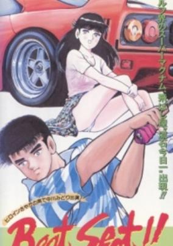

**Studio:** Studio Fantasia , C.MOON , Gainax , Magic Bus &nbsp;|&nbsp; **Director:** Takashi Akimoto &nbsp;|&nbsp; **Aired/Released:** May 23 &nbsp;|&nbsp; **Genres:** Sports, Ecchi

> Expert linksman Akihilo joins the university golf club at the same time as maverick golfer Akikazu. The pair often tee off against each other, though Akikazu is distracted by the charms of his opponent's beautiful caddy, Misako.
>
> _Synopsis source: Kitsu_

[Kitsu](https://kitsu.io/anime/beat-shot)

---

### Wrath of the Ninja

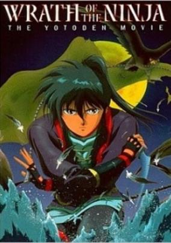

**Studio:** J.C. Staff &nbsp;|&nbsp; **Director:** Osamu Yamazaki &nbsp;|&nbsp; **Aired/Released:** May 27 &nbsp;|&nbsp; **Genres:** Past, Martial Arts, Ninja, Japan, Sengoku Period, Asia, Violence, Alternative Past, Earth, Fantasy, Action, Samurai, Demon

> The year a comet races across the sky, splitting the heavens, from the depths of the Earth the dark god shall arise once again. Then, the dark evil lurking in the shadows shall come out of the depths of Hell and show itself in the present world. The emotions of the blade of the wind shall collect at the source of the blue light. And the three blades shall become one, vanquishing evil. The year is 1580, and the unholy armies of Lord Nobunaga Oda steadily spread across Japan. Narrowly escaping the slaughter of her clan, a young ninja steals into the shadows. She is Ayame, the last of the Kasumi clan, and the dagger she wields is one of three, mystical blades. She is joined by Sakon and Ryoma, renegade ninja and the possessors of the sacred sword and spear. Now, these shadow warriors must unite their weapons and skills to fulfill `The Prophesy of the Enchanted Swords` or die trying... This is a cut version of the earlier OVA.
>
> _Synopsis source: Kitsu_

[Wikipedia](https://en.wikipedia.org/wiki/Wrath_of_the_Ninja) · [Kitsu](https://kitsu.io/anime/sengoku-kitan-youtouden-soushuuhen)

---

### City Hunter: .357 Magnum

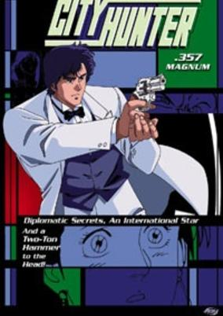

**Studio:** Sunrise &nbsp;|&nbsp; **Director:** Kenji Kodama &nbsp;|&nbsp; **Aired/Released:** June 17 &nbsp;|&nbsp; **Genres:** Earth, Japan, Action, Asia, Comedy, Gunfights, Present, Mystery

> A beautiful pianist comes to Tokyo for a charity concert, and City Hunter is there. But music isn`t his forte; he wants lessons in the language of love. Desperation becomes the word of the day as the bodies start dropping. A foreign dignitary is assassinated in cold blood. Secret agents scour the streets for a missing microchip. Diplomatic infighting swirls around the upcoming concert, and City Hunter is the only hope!
>
> _Synopsis source: Kitsu_

[Kitsu](https://kitsu.io/anime/city-hunter-357-magnum)

---

### Cynical Hysterie Hour: Utakata no Uta

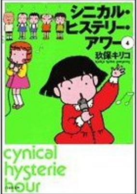

**Studio:** Studio Gallop &nbsp;|&nbsp; **Director:** Kiriko Kubo &nbsp;|&nbsp; **Aired/Released:** June 24 &nbsp;|&nbsp; **Genres:** Comedy

> No synopsis has been added for this series yet.Click here to update this information.
>
> _Synopsis source: Kitsu_

[Kitsu](https://kitsu.io/anime/cynical-hysterie-hour-utakata-no-uta)

---

### Akuma-kun

**Studio:** Toei Animation &nbsp;|&nbsp; **Director:** Junichi Sato &nbsp;|&nbsp; **Aired/Released:** July 15 &nbsp;|&nbsp; **Genres:** Magic, Fantasy, Adventure, Horror

> The age of the demons has begun. Dr Faust has foreseen this rise of evil. Unfortunately, he is near death and is unable to personally battle this upcoming threat. Faust entrusts a young boy, Shingo Yamada, to take the responsibility of ridding the Earth of this new evil presence. Faust finds a birthmark on Shingo's forehead that signifies that he is the chosen demon fighter. Faust summons from hell what may be humanity's only hope of surviving: a less than enthusiastic devil named Mephisto rises. After signing a pact in blood to save humankind, Shingo and Mephisto set out to battle the supernatural world.
>
> _Synopsis source: Kitsu_

[Kitsu](https://kitsu.io/anime/akuma-kun)

---

### Dragon Ball Z: Dead Zone (Dragon Ball Z Movie 01: The Dead Zone)

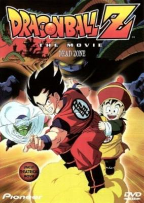

**Studio:** Toei Animation &nbsp;|&nbsp; **Director:** Daisuke Nishio &nbsp;|&nbsp; **Aired/Released:** July 15 &nbsp;|&nbsp; **Genres:** Super Power, Action, Science Fiction, Fantasy, Adventure, Comedy, Shounen

> Kami-sama's old nemesis's son has come to exact revenge on Kami-sama for winning the title of Earth's Guardian. After kidnapping Son Gohan and using the dragon balls to gain immortality, he has a final showdown with Goku.
>
> _Synopsis source: Kitsu_

[Kitsu](https://kitsu.io/anime/dragon-ball-z-movie-01-ora-no-gohan-wo-kaese)

---

### Little Nemo: Adventures in Slumberland

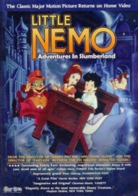

**Studio:** Tokyo Movie Shinsha &nbsp;|&nbsp; **Director:** Masami Hata, William Hurtz &nbsp;|&nbsp; **Aired/Released:** July 15 &nbsp;|&nbsp; **Genres:** Fantasy, Fantasy World, Adventure, Past

> Based on the classic Nemo comic strips by Winsor McCay. A pioneer of animation, McCay created the first Little Nemo animated movie in 1911. Hayao Miyazaki and Isao Takahata were attached to this project at first, but left due to "creative differences." Ray Bradbury is also thought to have left the project in its earlier stages. Little Nemo - Adventures in Slumberland is the first Japanese anime to receive a national (wide) U.S. theatrical release.
>
> _Synopsis source: Kitsu_

[Kitsu](https://kitsu.io/anime/little-nemo)

---

### Himitsu no Akko-chan: Umi da! Obake da!! Natsu Matsuri

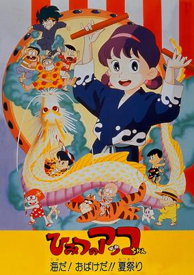

**Studio:** Toei Animation &nbsp;|&nbsp; **Director:** Hiroki Shibata &nbsp;|&nbsp; **Aired/Released:** July 15 &nbsp;|&nbsp; **Genres:** Magic, Kids, Shoujo, Comedy

> Everybody goes to the ocean for a summer festival and the guys sneak off to a cursed island.
>
> _Synopsis source: Kitsu_

[Kitsu](https://kitsu.io/anime/himitsu-no-akko-chan-umi-da-obake-da-natsu-matsuri)

---

### Mobile Suit SD Gundam's Counterattack

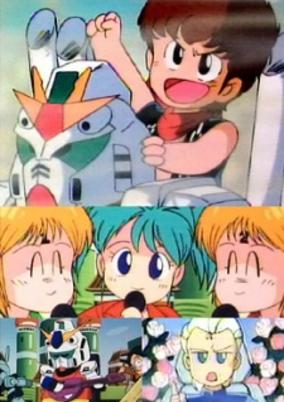

**Studio:** Sunrise &nbsp;|&nbsp; **Director:** Shinji Takamatsu , Tetsuro Amino &nbsp;|&nbsp; **Aired/Released:** July 15 &nbsp;|&nbsp; **Genres:** Super Deformed, Comedy, Parody, Mecha

> It consists of two parts: 1. "The Storm-Calling School Festival" - Char and Haman host a festival to celebrate the union between the Nu School for Boys and the Zeta School for Girls. But all hell breaks loose when the Counterattack School gang - led by Amuro, Judau and Kamille - rush in to crash the party. 2. "The Tale of the SD Warring States: The Chapter of the Violent Final Sky Castle".
>
> _Synopsis source: Kitsu_

[Wikipedia](https://en.wikipedia.org/wiki/Mobile_Suit_SD_Gundam%27s_Counterattack) · [Kitsu](https://kitsu.io/anime/mobile-suit-sd-gundam-s-counterattack)

---

### Patlabor: The Movie

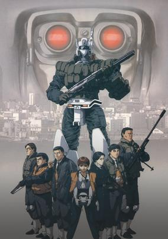

**Studio:** Studio Deen &nbsp;|&nbsp; **Director:** Mamoru Oshii &nbsp;|&nbsp; **Aired/Released:** July 15 &nbsp;|&nbsp; **Genres:** Earth, Science Fiction, Mecha, Japan, Action, Piloted Robot, Asia, Comedy, Special Squads, Detective, Conspiracy, Cyberpunk, Future, Law And Order, Cops, Military

> The year is 1999 and Tokyo's Mobile Police have a new weapon in the war on crime—advanced robots called Labors are used to combat criminals who would use the new technology for illegal means. The suicide of a mysterious man on the massive Babylon Project construction site sets off a cascade of events that may signal the destruction of Tokyo.
>
> _Synopsis source: Kitsu_

[Kitsu](https://kitsu.io/anime/mobile-police-patlabor-the-movie)

---

### Blue Sonnet

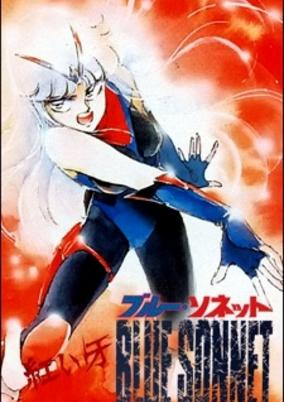

**Studio:** Mushi Production , Tatsunoko Production &nbsp;|&nbsp; **Director:** Takeyuki Kanda &nbsp;|&nbsp; **Aired/Released:** July 16 &nbsp;|&nbsp; **Genres:** Science Fiction, Japan, Action, Asia, Earth, Cyborg, Angst, Violence, Present, Super Power

> Sonnet is a cyborg/esper from a harsh background and now trained to be the ultimate warrior and most powerful weapon in the world. She is sent to Japan to watch Komatsuzaki Lan, who is thought to be controlled by the rage of the esper Akai Kiba (Crimson Fang). Lan is a quiet girl who knows she's different from everybody else and starts to show signs of Crimson Fang after coming into contact with Sonnet. In the course of fighting with Lan, Sonnet starts to rediscover her humanity. At the same time Lan has to fight to retain her humanity and control the Crimson Fang.
>
> _Synopsis source: Kitsu_

[Wikipedia](https://en.wikipedia.org/wiki/Blue_Sonnet) · [Kitsu](https://kitsu.io/anime/blue-sonnet)

---

### ARIEL Visual

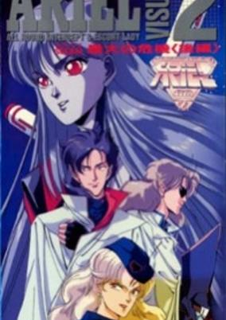

**Studio:** Animate , J.C.Staff &nbsp;|&nbsp; **Director:** Junichi Watanabe &nbsp;|&nbsp; **Aired/Released:** July 21 &nbsp;|&nbsp; **Genres:** Science Fiction, Mecha, Action, Piloted Robot, Comedy, Humanoid Alien, Alien

> To save the Earth from alien invaders and their giant monsters, Dr. Kishida does what any other red-blooded mad scientist would do: he builds a giant robot—the ultimate feminine fighting robot! Unfortunately, his grand-daughters refuse to pilot it! Apparently, they've got more important things to do than becoming teenage super-heroes. Besides, how are you supposed to study for your college entrance exams while getting beaten-up in battle? Fortunately for Dr. Kishida, things aren't too well for the invaders, either. According to their reports, the Earth was the perfect target: lush, peaceful, and relatively defenseless. Theoretically, the planet should've surrendered long ago. Now, the war is at a standstill, the dreaded Accounting Department is warning about the serious cost overruns, and the head of the home office has arrived from Galactic Headquarters to personally oversee operations. Has Headquarters decided to unleash, The Audit—or do they have something even more evil in mind? The fate of the world rests upon two people: Aya Kishida, one of the doctor's granddaughters, who may have to give up prep school to pilot the mighty (and lovely) ARIEL; and a mysterious alien named Saber Starblast, who may have the power to defeat the invaders once and for all...
>
> _Synopsis source: Kitsu_

[Wikipedia](https://en.wikipedia.org/wiki/ARIEL_Visual) · [Kitsu](https://kitsu.io/anime/ariel-visual)

---

### The Adventures of Hutch the Honeybee

**Studio:** Tatsunoko Production &nbsp;|&nbsp; **Director:** Iku Suzuki &nbsp;|&nbsp; **Aired/Released:** July 21

[Wikipedia](https://en.wikipedia.org/wiki/The_Adventures_of_Hutch_the_Honeybee_(1989_series))

---

### My Melody's Little Red Riding Hood

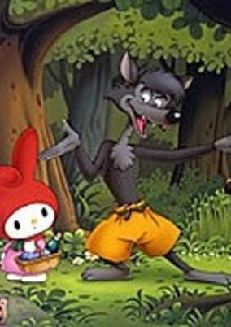

**Studio:** Sanrio , Grouper Productions &nbsp;|&nbsp; **Director:** Hidemi Kubo &nbsp;|&nbsp; **Aired/Released:** July 22 &nbsp;|&nbsp; **Genres:** Fantasy, Kids

> My Melody stars in the re-created story of Little Red Riding Hood.
>
> _Synopsis source: Kitsu_

[Kitsu](https://kitsu.io/anime/my-melody-no-akazukin)

---

### Hello Kitty's Cinderella

**Studio:** Sanrio, Grouper Productions &nbsp;|&nbsp; **Director:** Tameo Kohanawa &nbsp;|&nbsp; **Aired/Released:** July 22

---

### Kiki and Lala's Blue Bird

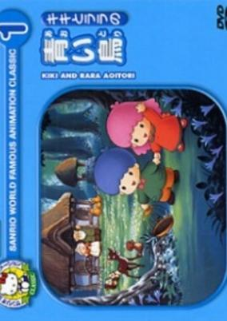

**Studio:** Sanrio, Grouper Productions &nbsp;|&nbsp; **Director:** Masami Hata &nbsp;|&nbsp; **Aired/Released:** July 22 &nbsp;|&nbsp; **Genres:** Kids

> Adventures of Kiki and Lala in search of happiness.
>
> _Synopsis source: Kitsu_

[Kitsu](https://kitsu.io/anime/kiki-to-lala-no-aoi-tori)

---

### Riki-Oh: The Walls of Hell (Riki-Oh: The Wall of Hell)

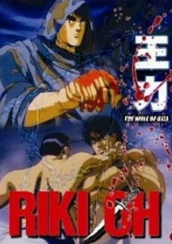

**Studio:** Trans Arts &nbsp;|&nbsp; **Director:** Satoshi Dezaki &nbsp;|&nbsp; **Aired/Released:** July 25 &nbsp;|&nbsp; **Genres:** Japan, Action, Alternative Present, Law And Order, Violence, Martial Arts, Super Power

> A Retelling of the prison arc of the manga RIKI-OH! The story follows Saiga Riki-Oh, a young man blessed with inhuman strength. After taking revenge against a yakuza boss who was responsible for the death of his girlfriend, he ends up in a maximum security prison owned by a private organization. The prison is divided into four blocks, each run by a member of prisoners known as the Gang of Four. The first member is a tattooed knife wielder known as Hai that runs his block in a mafia style family system. The second member is a giant man (known as Tarzan in the live action) with incredible strength. The third member is a effeminate fighter named Huang Chaun that is growing Opium in the prison. The final member is a small man that use sewing needles as his weapons.
>
> _Synopsis source: Kitsu_

[Wikipedia](https://en.wikipedia.org/wiki/Riki-Oh#Original_Video_Animations) · [Kitsu](https://kitsu.io/anime/riki-oh-the-wall-of-hell)

---

### Kiki's Delivery Service

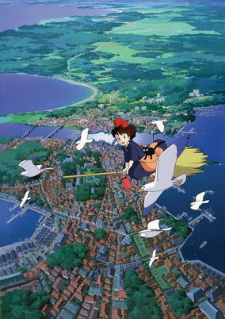

**Studio:** Studio Ghibli &nbsp;|&nbsp; **Director:** Hayao Miyazaki &nbsp;|&nbsp; **Aired/Released:** July 29 &nbsp;|&nbsp; **Genres:** Fantasy, Romance, Adventure, Earth, Slice of Life, Comedy, Coming Of Age, Magic, Alternative Present

> Kiki, a 13-year-old witch-in-training, must spend a year living on her own in a distant town in order to become a full-fledged witch. Leaving her family and friends, Kiki undertakes this tradition when she flies out into the open world atop her broomstick with her black cat Jiji. As she settles down in the coastal town of Koriko, Kiki struggles to adapt and ends up wandering the streets with no place to stay—until she encounters Osono, who offers Kiki boarding in exchange for making deliveries for her small bakery. Before long, Kiki decides to open her own courier service by broomstick, beginning her journey to independence. In attempting to find her place among the townsfolk, Kiki brings with her exciting new experiences and comes to understand the true meaning of responsibility. [Written by MAL Rewrite]
>
> _Synopsis source: Kitsu_

[Wikipedia](https://en.wikipedia.org/wiki/Kiki%27s_Delivery_Service) · [Kitsu](https://kitsu.io/anime/kiki-s-delivery-service)

---

### Amada Anime Series: Super Mario Bros.

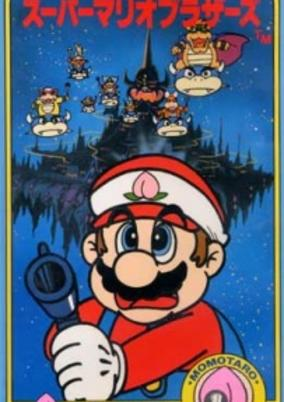

**Studio:** Studio Junio &nbsp;|&nbsp; **Director:** Shinichirō Ueda &nbsp;|&nbsp; **Aired/Released:** August 3 &nbsp;|&nbsp; **Genres:** Fantasy World, Comedy, Adventure

> The Super Mario Amada Series are a series of short Japanese fairy tales anime that is found and released only in Japan. The series are released in August 3, 1989 once again only in Japan; making it extremely rare to people not living in Japan. The series is based on one of the three Japanese fairy tales that are told to children. Additionally, the series contained Mario series that are played in the three short Japanese fairy tales. The characters introduced Mario, Luigi, Princess Peach, Bowser, and his Koopalings during the fairy tales. Each fairy tale shown in anime consists of about 15 minutes. The three Japanese fairy tales contain; Momotaro, Issunboshi, and Snow White.
>
> _Synopsis source: Kitsu_

[Kitsu](https://kitsu.io/anime/amada-anime-series-super-mario-brothers)

---

### Kankara Sanshin

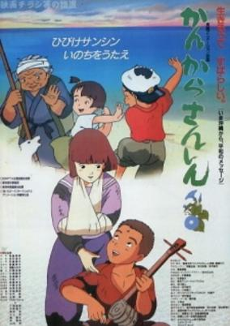

**Studio:** Tokyo Animation Film &nbsp;|&nbsp; **Director:** Osamu Kobayashi &nbsp;|&nbsp; **Aired/Released:** August 4 &nbsp;|&nbsp; **Genres:** Earth, Japan, World War II, Asia, Past, Historical

> A film about the Battle of Okinawa during the last days of World War II. During the World War II island hopping campaign there was a fierce battle on Okinawa that devastated the population and ravaged the land and left a mark on the populace of the Okinawan people forever. After the war Okinawa was under the control of the United Stated Military. Without any goods and extreme scarcity of Natural resources the Okinawans were in a desperate day to day survival for the basic needs of life. The Okinawans however, despite their dire situation used song and dance to lighten their spirit and make the best of the situation. But with the loss of almost everything of value on island due to constant shelling bombing and fighting between the Japanese and American all the regular sanshin (an Okinawan musical instrument and precursor of the Japanese shamisen) had become very scarce and hard to find. The American were supplying the Okinawans with powdered milk among other items to help keep starvation low. And from those cans of food they would find a way to bring music back to the people again.
>
> _Synopsis source: Kitsu_

[Kitsu](https://kitsu.io/anime/kankara-sanshin)

---

### Cinderella Express

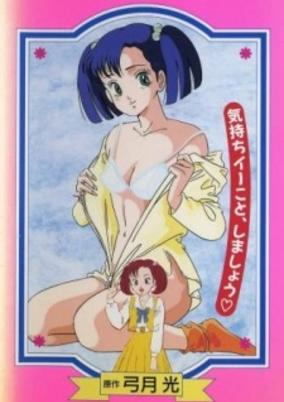

**Studio:** Nichiei Agency, Nihon Eizō, Studio Look &nbsp;|&nbsp; **Director:** Kouichi Sasaki, Michio Mishima, Nanako Shimazaki &nbsp;|&nbsp; **Aired/Released:** August 16 &nbsp;|&nbsp; **Genres:** Comedy, Slapstick, Ecchi, Romance

> Everyday salary man Shimano Yuji meets and beds a pretty young girl at his bachelor party. Meeting her again at his wedding, he realises that he has just began an affair with his sister-in-law.
>
> _Synopsis source: Kitsu_

[Kitsu](https://kitsu.io/anime/cinderella-express)

---

### Tezuka Osamu Monogatari: Boku wa Son Gokû

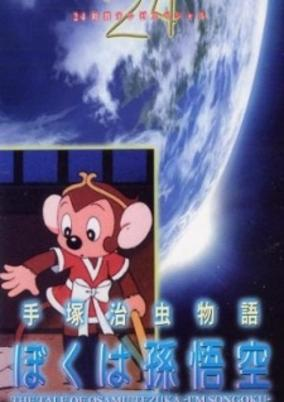

**Studio:** Tezuka Productions &nbsp;|&nbsp; **Director:** Masami Hata, Rintaro &nbsp;|&nbsp; **Aired/Released:** August 27 &nbsp;|&nbsp; **Genres:** Earth, Japan, Asia, Fantasy, Anthropomorphism, Drama, Past, Future, Space, Historical, Adventure

> A semi autobiography of Tezuka Osamu. Son-Gokuu is a monkey who was born from a stone and is endowed with magical powers. He gets carried away and goes on a rampage until at last Buddha confines him within Mt. Gogyo. Saved by Sanzohoshi, Son-Gokuu accompanies him on a journey to India. But on their way, monsters lie in wait for them.
>
> _Synopsis source: Kitsu_

[Kitsu](https://kitsu.io/anime/tezuka-osamu-monogatari-boku-wa-son-goku)

---

### Angel Cop

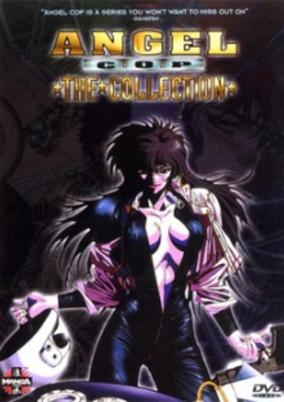

**Studio:** Soei Shinsha &nbsp;|&nbsp; **Director:** Ichirō Itano &nbsp;|&nbsp; **Aired/Released:** September 1 &nbsp;|&nbsp; **Genres:** Power Suit, Science Fiction, Japan, Genetic Modification, Action, Asia, Special Squads, Gunfights, Thriller, Human Enhancement, Cyborg, Conspiracy, Law And Order, Plot Continuity, Violence, Present, Cops, Super Power, Cyberpunk

> Sometime in the future, terrorism in Japan has become commonplace, and the police have become almost as brutal as criminals. A member of the Special Security Force known as Angel, is the best of the best, stopping at nothing in her fight for justice. Things get interesting for Angel and her partner, Raiden, when they begin investigating a series of murders in which the victims were known criminals, killed in very unpleasant ways. This trio of killers known as Hunters, is a group of psychics that have banded together to hunt down the lowest scum in the city and bring them to justice. After a couple of encounters between the cops and the psychics, two of the psychics begin to think that maybe they're not the good guys after all; but the third prefers killing to morality. Augmented by cybernetics from a mysterious source, this third hunter heads out on a killing spree, with the Special Security Force as the first target. Even with help from the other two psychics and her newly cyborged partner (after an unfortunate accident), Angel is going to have her work cut out trying to find the rogue psychic and the organization behind the Hunters.
>
> _Synopsis source: Kitsu_

[Wikipedia](https://en.wikipedia.org/wiki/Angel_Cop) · [Kitsu](https://kitsu.io/anime/angel-cop)

---

### Borgman: The Final Battle (Sonic Soldier Borgman: Last Battle)

**Studio:** Ashi Production &nbsp;|&nbsp; **Director:** Kiyoshi Murayama &nbsp;|&nbsp; **Aired/Released:** September 16 &nbsp;|&nbsp; **Genres:** Action, Special Squads, Human Enhancement, Cyborg, Cyberpunk, Future, Demon, Science Fiction

> It has been three years since the end of the series. Ryo works for NASA as an engineer on a large rocket project. Anise, fellow Borgman and lover, has been reduced to flipping burgers in a restaurant. So naturally, when she gets a letter offering her a professional job in a big, Japanese, high-tech project, she jumps at the chance. Ryo, however, is as indecisive as ever and so she leaves for Japan without him. Chuck Sweager, the third Borgman, is a police officer, as is his girlfriend Miki. When she witnesses a fight amongst several cyborgs she tells Chuck, who says flatly that it cannot be possible, since the only living cyborgs are Ryo, Anise, and himself. But she convinces him and they investigate. Anise arrives for her new job, and when they meet for dinner they explain the situation to her. Anise volunteers to sneak around the Heaven's Gate project, which they believe to be the source of these new cyborgs. Ryo, meanwhile, is en route to Japan to go after his girlfriend. Accompanying him is Hussan, one of the two surviving researchers on the Borgman Project, who has been asked to appear before the Tokyo Police to help investigate. Once the entire cast is in Japan, things begin to get complicated.
>
> _Synopsis source: Kitsu_

[Kitsu](https://kitsu.io/anime/sonic-soldier-borgman-last-battle)

---

### The Guyver: Bio-Booster Armor

**Studio:** Visual '80 &nbsp;|&nbsp; **Director:** Koichi Ishiguro &nbsp;|&nbsp; **Aired/Released:** September 25 &nbsp;|&nbsp; **Genres:** Earth, Power Suit, Science Fiction, Japan, Action, Asia, Parasite, Horror, Violence, Present, Super Power

> Shou and his friend, Tetsurou, stumble upon a strange orb-like mechanism, the Guyver Unit, in the woods. It physically bonds with Shou and turns him into the alien soldier, Guyver. His mission is to protect the Guyver Unit from the Japanese corporation known as Chronos. They are after it and two other units just like it. To retrieve the object, they send out vicious monsters known as Zoanoids. So no one is safe in Shou's life; not even himself.
>
> _Synopsis source: Kitsu_

[Kitsu](https://kitsu.io/anime/kyoushoku-soukou-guyver-1989)

---

### Mandaraya no Ryôta: Kuonidani Onsen Tsuyasho Sodo Tan

**Studio:** Takahashi Studio &nbsp;|&nbsp; **Director:** Yuzo Aoki &nbsp;|&nbsp; **Aired/Released:** September 25

---

### Megazone 23 Part III

**Studio:** AIC , Artland &nbsp;|&nbsp; **Director:** Kenichi Yatagai , Shinji Aramaki &nbsp;|&nbsp; **Aired/Released:** September 28

[Wikipedia](https://en.wikipedia.org/wiki/Megazone_23#Part_III)

---

### The Jungle Book

**Studio:** Nippon Animation &nbsp;|&nbsp; **Director:** Fumio Kurokawa &nbsp;|&nbsp; **Aired/Released:** October 2 &nbsp;|&nbsp; **Genres:** Adventure, Asia, Earth, Anthropomorphism, Past

> After his parents died, Mowgli is raised by the Wolf Pack of the Seeonee Forest led by Akela and other wild animals such as Bagheera and Baloo. The young boy goes through several heartwarming, bittersweet, and life-threatening adventures as he seeks after his true purpose in life. And one of many dangers he has to face is the man-eating tiger, Shere Khan...
>
> _Synopsis source: Kitsu_

[Wikipedia](https://en.wikipedia.org/wiki/The_Jungle_Book_(1989_TV_series)) · [Kitsu](https://kitsu.io/anime/jungle-book-shounen-mowgli)

---

### Momotaro Densetsu

**Studio:** Knack Productions &nbsp;|&nbsp; **Director:** Akinori Yabe &nbsp;|&nbsp; **Aired/Released:** October 2 &nbsp;|&nbsp; **Genres:** Comedy, Adventure

> No synopsis has been added for this series yet.Click here to update this information.
>
> _Synopsis source: Kitsu_

[Kitsu](https://kitsu.io/anime/momotaro-densetsu)

---

### Dash! Yonkuro

**Studio:** Staff 21, Aubekku & Tokyu Agency &nbsp;|&nbsp; **Director:** Hitoshi Nanba &nbsp;|&nbsp; **Aired/Released:** October 3 &nbsp;|&nbsp; **Genres:** Sports, Action, Kids

> The story is a succession of races in imaginative paths and runs to suit her run. The story will focus increasingly what is the real Emperor, will be discovered having this many mini title that will compare against the Emperor of Yonkuro, the epilogue to the epic challenge of the Rally of hell in this race will challenge a group of thugs who want to take advantage of Best of Mini 4WD racers to be able to recover a hidden treasure.The story centers on a brother and sister, Tatsuya and Kiyoko, the children of a scientist at the Twin X facility. This story is used by the very popular main character Yonkuro Hinomaru.
>
> _Synopsis source: Kitsu_

[Wikipedia](https://en.wikipedia.org/wiki/Dash!_Yonkuro) · [Kitsu](https://kitsu.io/anime/dash-yonkuro)

---

### Project A-ko 4: FINAL (Project A-ko: Love & Robots)

**Studio:** Pony Canyon , Soeishinsha, A.P.P.P. , Studio Fantasia &nbsp;|&nbsp; **Director:** Yūji Moriyama &nbsp;|&nbsp; **Aired/Released:** October 7 &nbsp;|&nbsp; **Genres:** Earth, Romance, Power Suit, Transforming Craft, Science Fiction, Mecha, Japan, Action, Piloted Robot, Asia, Comedy, Love Polygon, Female Teacher, Alien, Super Power

> In Iraq, a group of archaeologists discover ancient relics that prophecize the coming of a superior race and the end of all civilization. Meanwhile, back in Graviton City, as A-Ko and B-Ko's rivalry over Kei intensifies, Mr. Daitokuji sets up an arranged marriage between Miss Ayumi and Kei. Furious over the engagement, both A-Ko and B-Ko do whatever it takes to prevent the wedding from going through. Little do they know that another alien fleet is on its way towards Earth.
>
> _Synopsis source: Kitsu_

[Kitsu](https://kitsu.io/anime/project-a-ko-4-final)

---

### Dog Soldier: Shadows of the Past

**Studio:** Animate Film , J.C. Staff &nbsp;|&nbsp; **Director:** Hiroyuki Ebata &nbsp;|&nbsp; **Aired/Released:** October 8 &nbsp;|&nbsp; **Genres:** Japan, Action, Asia, Earth, Gunfights, Violence, Present, Military

> When an American scientist carrying a cure for the AIDS virus is kidnapped by an arms merchant, John Kyosuke is forced back from retirement. He accepts the challenge to regain pocession of the anti-serum. He finds out that some of the people he is after are closely related, which gives his conquest a whole new meaning.
>
> _Synopsis source: Kitsu_

[Kitsu](https://kitsu.io/anime/dog-soldier)

---

### Sally the Witch

**Studio:** Toei Animation &nbsp;|&nbsp; **Director:** Osamu Kasai &nbsp;|&nbsp; **Aired/Released:** October 9 &nbsp;|&nbsp; **Genres:** Elementary School, Magic, Magical Girl, Japan, Fantasy, Comedy, School Life, Kids, Shoujo

> During Sally's coronation ceremony in the magic world, she hears her human friends back on Earth are in trouble. Despite the warnings from her parents, she escapes to Earth to help her friends. Because she was caught using magic in front of humans, she had to erase her friends' memories. Now Sally will remain on Earth so she can regain Sumire and Yoshiko's friendship while helping other humans in trouble. This is a sequel and reboot of the original series.
>
> _Synopsis source: Kitsu_

[Wikipedia](https://en.wikipedia.org/wiki/Sally_the_Witch#Sally_the_Witch_2_(1989–1991)) · [Kitsu](https://kitsu.io/anime/mahoutsukai-sally-2)

---

### The Laughing Salesman (Laughing Salesman)

**Studio:** Shin-Ei Animation &nbsp;|&nbsp; **Director:** Toshirō Kuni &nbsp;|&nbsp; **Aired/Released:** October 10 &nbsp;|&nbsp; **Genres:** Comedy, Slice of Life, Drama, Working Life, Psychological, Supernatural, Seinen

> Each episode follows Fukuzou Moguro, a traveling salesman, and his current customer. Moguro deals in things that give his customers their heart's desire, and once his deals are made and their unhealthy desires are satisfied, Moguro's customers are often left with terrible repercussions, especially if they break the rules of his deals...
>
> _Synopsis source: Kitsu_

[Wikipedia](https://en.wikipedia.org/wiki/The_Laughing_Salesman) · [Kitsu](https://kitsu.io/anime/warau-salesman)

---

### Seton Dōbutsuki (Seton Animal Chronicles)

**Studio:** Eiken &nbsp;|&nbsp; **Director:** Takeshi Shirato &nbsp;|&nbsp; **Aired/Released:** October 10 &nbsp;|&nbsp; **Genres:** Fantasy, Adventure

> Documentary in which the achievement of Ernest "Black Wolf" Thompson is settled in different Episodes. Every single episode is a documentary in which one sort of Animal is described.
>
> _Synopsis source: Kitsu_

[Kitsu](https://kitsu.io/anime/seton-doubutsuki)

---

### Patlabor: The TV Series (Mobile Police Patlabor)

**Studio:** Sunrise &nbsp;|&nbsp; **Director:** Naoyuki Yoshinaga &nbsp;|&nbsp; **Aired/Released:** October 11 &nbsp;|&nbsp; **Genres:** Future, Earth, Mecha, Piloted Robot, Japan, Tokyo, Asia, Action, Science Fiction, Comedy

> In the future, advanced robotics has created heavy robots ("labors") for use in a variety of functions: construction, fire-fighting, military, and more. However, though the robots are only machines, their operators are also only human—and humans sometimes turn to crime. Since a heavy labor unit can be a dangerous weapon, the police of the future are set to fight fire with fire, using advanced patrol labor units, "patlabors." This is the story of the Second Special Vehicles Division, a motley crew of patlabor policemen and women doing their best to fight crime and live a normal life.
>
> _Synopsis source: Kitsu_

[Kitsu](https://kitsu.io/anime/mobile-police-patlabor)

---

### The New Adventures of Kimba The White Lion

**Studio:** Tezuka Productions &nbsp;|&nbsp; **Director:** Takashi Ui, Rintaro &nbsp;|&nbsp; **Aired/Released:** October 12

[Wikipedia](https://en.wikipedia.org/wiki/The_New_Adventures_of_Kimba_The_White_Lion)

---

### Darkness of the Sea, Shadow of the Moon (Darkness of the Sea)

**Studio:** Visual '80 &nbsp;|&nbsp; **Director:** Satoshi Dezaki &nbsp;|&nbsp; **Aired/Released:** October 14 &nbsp;|&nbsp; **Genres:** Japan, Contemporary Fantasy, Earth, Asia, Horror, Present, Romance

> Ruka and Rumi Kobayakawa are twin sisters in love with the same man, athletic upperclassman Katsuyuki Touma. Rumi seems supportive of Ruka's fledgling romance with Katsuyuki, until the twins are infected with a strange bacterium that transforms Rumi's personality and gifts the twins with terrifying psychic powers. Now Rumi will stop at nothing - or no one, that gets between her and Katsuyuki, including her own twin sister...
>
> _Synopsis source: Kitsu_

[Kitsu](https://kitsu.io/anime/umi-no-yami-tsuki-no-kage)

---

### Time Patrol Bon

**Studio:** Staff 21, Gallop &nbsp;|&nbsp; **Director:** Kunihiko Yuyama &nbsp;|&nbsp; **Aired/Released:** October 14 &nbsp;|&nbsp; **Genres:** Action, Adventure

> A Japanese schoolboy, Heibon, is enlisted in the efforts of the time patrol to keep the past out of trouble.
>
> _Synopsis source: Kitsu_

[Kitsu](https://kitsu.io/anime/time-patrol-bon)

---

### City Hunter 3

**Studio:** Sunrise &nbsp;|&nbsp; **Director:** Kenji Kodama &nbsp;|&nbsp; **Aired/Released:** October 15

[Wikipedia](https://en.wikipedia.org/wiki/List_of_City_Hunter_3_episodes)

---

### Yawara!

**Studio:** Toho Doga &nbsp;|&nbsp; **Director:** Kazuo Yoshida &nbsp;|&nbsp; **Aired/Released:** October 16 &nbsp;|&nbsp; **Genres:** Earth, Romance, Japan, Action, Combat, Sports, Asia, Comedy, Love Polygon, Present, Martial Arts, Slice of Life

> Yawara! is a sports anime laced with comedic and romance elements. It starts off with Yawara Inokuma, a high school girl who is most interested in doing the things that your average Japanese high school girl does; however, she has been trained in Judo for years by her grandfather, Jigorou (A former Japan Judo Champion), who has much grander plans in store for her as a Judo superstar. He manipulates matters so that Yawara ends up having to perform in matches and tournaments. His final plan is for Yawara to "Win the Gold Medal in the Olympics and be awarded the Nation Medal of Honor."
>
> _Synopsis source: Kitsu_

[Wikipedia](https://en.wikipedia.org/wiki/Yawara!) · [Kitsu](https://kitsu.io/anime/yawara)

---

### Magical Hat

**Studio:** Studio Pierrot &nbsp;|&nbsp; **Director:** Akira Shigino &nbsp;|&nbsp; **Aired/Released:** October 18 &nbsp;|&nbsp; **Genres:** Fantasy, Adventure, Comedy, Kids

> The series stars Hat, the descendant of a hero who fought an evil king and sealed Devildom. Hat falls into Devildom and finds he has to defeat the evil king.
>
> _Synopsis source: Kitsu_

[Wikipedia](https://en.wikipedia.org/wiki/Magical_Hat) · [Kitsu](https://kitsu.io/anime/magical-hat)

---

### Wrestler Gundan Seisenshi Robin Jr.

**Studio:** Tokyo Movie Shinsha &nbsp;|&nbsp; **Director:** Masaharu Okuwaki &nbsp;|&nbsp; **Aired/Released:** October 19 &nbsp;|&nbsp; **Genres:** Adventure, Super Power, Parody, Action, Science Fiction, Fantasy, Comedy, Kids

> Robin Jr. and his friends fight to save the solar system.
>
> _Synopsis source: Kitsu_

[Kitsu](https://kitsu.io/anime/wrestler-gundan-seisenshi-robin-jr)

---

### Hyper Psychic Geo Garaga (Garaga)

**Studio:** Aubec, AVN &nbsp;|&nbsp; **Director:** Hidemi Kubo &nbsp;|&nbsp; **Aired/Released:** October 21 &nbsp;|&nbsp; **Genres:** Science Fiction, Action, Cyborg, Other Planet, Humanoid Alien, Alien, Future, Android, Violence, Space, Adventure

> The year is 2755. As a result of a system malfunction, the cargo ship XeBeC goes off-course in a warp gate and ends up within the orbit of the distant planet Garaga. After crashing on Garaga's surface, the crew must find ways to survive from hideous monsters, rabid ape soldiers, and a race of mysterious psychics.
>
> _Synopsis source: Kitsu_

[Kitsu](https://kitsu.io/anime/hyper-psychic-geo-garaga)

---

### Baoh (Baoh the Visitor)

**Studio:** Studio Pierrot &nbsp;|&nbsp; **Director:** Hiroyuki Yokoyama &nbsp;|&nbsp; **Aired/Released:** November 1 &nbsp;|&nbsp; **Genres:** Science Fiction, Japan, Violence, Action, Present, Asia, Earth, Martial Arts, Parasite, Horror, Drama, Super Power, Space

> A secret organization called "Doress" has funded the development of a genetically engineered parasite code-named "BAOH." Organisms infected by BAOH become living survival machines, virtually indestructible, able to mutate their body structure to meet any threat. Properly controlled, the BAOH parasite could allow Doress to control the World. Unfortunately, their first human guinea-pig, a young man named Hashizawa Ikuroo, has managed to escape, along with a young girl, Sumire, who has a strange precognitive gift. Unless Doress operatives can find and destroy Ikuroo before the BAOH parasite fully manifests, their evil dream will come to naught. But BAOH, comfortably hiding in Ikuroo's brain, won't make it easy.
>
> _Synopsis source: Kitsu_

[Wikipedia](https://en.wikipedia.org/wiki/Baoh) · [Kitsu](https://kitsu.io/anime/baoh)

---

### Cybernetics Guardian

**Studio:** AIC ASMIK &nbsp;|&nbsp; **Director:** Koichi Ohata &nbsp;|&nbsp; **Aired/Released:** November 1 &nbsp;|&nbsp; **Genres:** Science Fiction, Action, Human Enhancement, Cyborg, Future, Violence, Mecha

> A freak accident unleashes a demonic spirit within researcher John Stalker - transforming him into Saldo, a mythical cyber-beast fueled by hate and evil.
>
> _Synopsis source: Kitsu_

[Kitsu](https://kitsu.io/anime/cybernetics-guardian)

---

### Chimpui

**Studio:** Shin-Ei Animation &nbsp;|&nbsp; **Director:** Mitsuru Hongo &nbsp;|&nbsp; **Aired/Released:** November 2

[Wikipedia](https://en.wikipedia.org/wiki/Chimpui)

---

### Ise-wan Taifu Monogatari

**Studio:** Mushi Production &nbsp;|&nbsp; **Director:** Seijirō Kōyama &nbsp;|&nbsp; **Aired/Released:** November 4

---

### Demon Hunter Makaryūdo

**Studio:** Studio Fantasia , C.MOON &nbsp;|&nbsp; **Director:** Yukio Okamoto &nbsp;|&nbsp; **Aired/Released:** November 8 &nbsp;|&nbsp; **Genres:** Fantasy, Demon

> Yama Rikudo is not your average teenage girl. With her trademark duo horn-like tufted hair, she’s really a kind of demon policewoman, charged with the duty of protecting Japan from demonic monsters that’ve gone AWOL. Even when her demon superiors try and pull her off the job, because demon-human relations are getting too hot for her to handle, she will stay and fight with her giant scythe, because, while disguised as a high school student, she has fallen for fellow student Sho Kurogane. Now she must save Sho, and his friends, from the evil plotting of the school’s eternal youth seeking, soul sucking, Headmistress.
>
> _Synopsis source: Kitsu_

[Kitsu](https://kitsu.io/anime/makaryuudo)

---

### Ano Ko ni 1000% (That Girl is 1000%)

**Studio:** Visual '80 &nbsp;|&nbsp; **Director:** Takehiro Miyano &nbsp;|&nbsp; **Aired/Released:** November 14 &nbsp;|&nbsp; **Genres:** Earth, Japan, Asia, Soccer, Present, Romance, School Life

> Ano Ko ni 1000% is a high school love story. Azusa Kawahara is the soccer team manager, and her love for childhood playmate Ikumi is mutual. Although the whole school knew what was happening between Azusa and Ikumi, there were rivals who came between them.
>
> _Synopsis source: Kitsu_

[Wikipedia](https://en.wikipedia.org/wiki/Ano_Ko_ni_1000%25) · [Kitsu](https://kitsu.io/anime/ano-ko-ni-1000)

---

### Blue Flames

**Studio:** Artland &nbsp;|&nbsp; **Director:** Noboru Ishiguro &nbsp;|&nbsp; **Aired/Released:** November 24

---

### Ace o Nerae! Final Stage

**Studio:** TMS Entertainment &nbsp;|&nbsp; **Director:** Osamu Dezaki &nbsp;|&nbsp; **Aired/Released:** November 25 &nbsp;|&nbsp; **Genres:** Tennis, Sports, Action, Japan, Plot Continuity, Present

> Hiromi continues developing her tennis and shows the results while undergoing an emotional change into an adult.
>
> _Synopsis source: Kitsu_

[Wikipedia](https://en.wikipedia.org/wiki/Ace_o_Nerae!_Final_Stage) · [Kitsu](https://kitsu.io/anime/ace-wo-nerae-final-stage)

---

### Dragon Quest (Dragon Warrior)

**Studio:** Studio Comet &nbsp;|&nbsp; **Director:** Katsuhisa Yamada , Rintarō , Takeyuki Kanda &nbsp;|&nbsp; **Aired/Released:** December 2 &nbsp;|&nbsp; **Genres:** Past, Fantasy World, Action, Fantasy, Adventure

> Dragon Quest is loosely based on Dragon Quest III. The names and some of the characters are familar, but the world map is smaller and a very different shape. The two main characters are Abel and Tialah. Tialah receives the legendary Red Stone from the Aliahan Village sage Master Yogi. Soon after, Tialah is kidnapped by the evil Baramos who wants to use the Red Stone to resurrect The Great Dragon and be granted eternal life. Abel swore to rescue Tialah and he is given the Blue Stone, which can only seal the Dragon once it has been released.
>
> _Synopsis source: Kitsu_

[Wikipedia](https://en.wikipedia.org/wiki/Dragon_Quest_(TV_series)) · [Kitsu](https://kitsu.io/anime/dragon-quest-abel-yuusha-densetsu)

---

### Ogami Matsugoro

**Studio:** Nippon Animation &nbsp;|&nbsp; **Director:** Hidetoshi Ōmori &nbsp;|&nbsp; **Aired/Released:** December 16 &nbsp;|&nbsp; **Genres:** Delinquent, Martial Arts, Action, Romance, School Life

> Based on the same name manga by Itou Minoru, serialized in Kodansha's Weekly Shounen Magazine.
>
> _Synopsis source: Kitsu_

[Kitsu](https://kitsu.io/anime/ogami-matsugorou)

---

### Assemble Insert

**Studio:** Studio Core, Tohokushinsha Film &nbsp;|&nbsp; **Director:** Ayumi Chibuki &nbsp;|&nbsp; **Aired/Released:** December 21 &nbsp;|&nbsp; **Genres:** Law And Order, Action, Japan, Asia, Earth, Comedy, Parody, Super Power, Science Fiction, Cops

> A criminal group known as Demon Seed terrorizes Tokyo with its vast armies of mecha. The local police is afraid to confront them, but one person stands in their way: Maron Namikaze, a 13-year-old idol singer with a catchy voice and unbelievable superhuman strength.
>
> _Synopsis source: Kitsu_

[Wikipedia](https://en.wikipedia.org/wiki/Assemble_Insert) · [Kitsu](https://kitsu.io/anime/assemble-insert)

---

### Inamura no Hi

**Studio:** Gakken

---

### Super Mario's Fire Brigade

**Studio:** Studio Junio , Aoni Production &nbsp;|&nbsp; **Director:** Mamoru Kanbe &nbsp;|&nbsp; **Genres:** Kids

> An obscure anime video animated by Toei that also functions as a fire safety Public Service Announcement. Very little is known about the video and details regarding distribution, plot and character names can only be deduced by the video itself.
>
> _Synopsis source: Kitsu_

[Kitsu](https://kitsu.io/anime/super-mario-no-shouboutai)

---
