# 1990 in Anime

[← Back to index](../README.md)

73 titles · 53 with a matched synopsis/cover art · [source](https://en.wikipedia.org/wiki/1990_in_anime)

## Releases

### Umi Da! Funade Da! Nikoniko, Pun

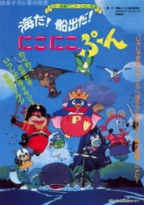

**Studio:** Oh! Production &nbsp;|&nbsp; **Director:** Toshio Hirata &nbsp;|&nbsp; **Aired/Released:** January 4 &nbsp;|&nbsp; **Genres:** Comedy, Fantasy

> Animation movie by Hirata Toshio.
>
> _Synopsis source: Kitsu_

[Kitsu](https://kitsu.io/anime/umi-da-funade-da-nikoniko-pun)

---

### Chibi Maruko-chan

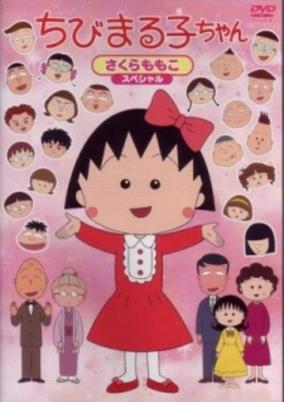

**Studio:** Nippon Animation &nbsp;|&nbsp; **Director:** Yumiko Suda Tsutomu Shibayama &nbsp;|&nbsp; **Aired/Released:** January 7 &nbsp;|&nbsp; **Genres:** Japan, Elementary School, Slice of Life, Comedy, Present

> Momoko Sakura is an elementary school student who likes popular idol Momoe Yamaguchi and mangas. She is often called "Chibi Maruko-chan" due to her young age and small size. She lives together with her parents, her grandparents and her elder sister in a little town. In school, she has many friends with whom she studies and plays together everyday, including her close pal, Tama-chan; the student committee members, Maruo-kun and Migiwa-san; and the B-class trio: 'little master' Hanawa-kun, Hamaji-Bu Taro and Sekiguchi-kun. This is a fun-loving and enjoyable anime that portrays the simple things in life.
>
> _Synopsis source: Kitsu_

[Wikipedia](https://en.wikipedia.org/wiki/Chibi_Maruko-chan) · [Kitsu](https://kitsu.io/anime/chibi-maruko-chan)

---

### My Daddy Long Legs

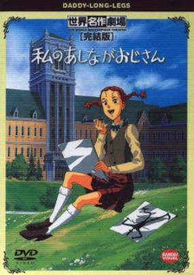

**Studio:** Nippon Animation &nbsp;|&nbsp; **Director:** Kazuyoshi Yokota &nbsp;|&nbsp; **Aired/Released:** January 14 &nbsp;|&nbsp; **Genres:** Romance, Earth, Comedy, United States, Coming Of Age, High School, Americas, All Girls School, Past, School Life, Historical, Slice of Life

> Daddy Long Legs is based on the novel of the same name by Jean Webster. It chronicles the adventures of Judy Abbott, an orphan in New York. During a meeting for the superintendent, with other important and rich people in attendance, a scholarship is offered to Judy by a mysterious benefactor. Catching only a glimpse of his tall shadow as he leaves, Judy calls him "Daddy Long Legs" and writes him letters every month as per his request. While studying at the Lincoln Memorial school, she makes many friends and learns about a world she never knew about before.
>
> _Synopsis source: Kitsu_

[Wikipedia](https://en.wikipedia.org/wiki/My_Daddy_Long_Legs) · [Kitsu](https://kitsu.io/anime/my-daddy-long-legs)

---

### Be-Bop High School

**Studio:** Toei Animation &nbsp;|&nbsp; **Director:** Toshihiko Arisako Hiroyuki Kakudō Junichi Fujise &nbsp;|&nbsp; **Aired/Released:** January 26

[Wikipedia](https://en.wikipedia.org/wiki/Be-Bop_High_School)

---

### Ankoku Shinwa

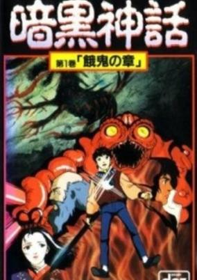

**Studio:** Ajia-do Animation Works &nbsp;|&nbsp; **Director:** Takashi Anno &nbsp;|&nbsp; **Aired/Released:** January 26 &nbsp;|&nbsp; **Genres:** Fantasy, Contemporary Fantasy, Japan, Action, Asia, Earth, Horror, Violence, Present, Demon, Super Power, Psychological, Mystery

> Long ago there were fierce gods of legends who shook the earth to its foundation with their power. There are now prehistoric rivals from the primitive times in Japan, that fought to protect their secrets in the present day. The God of Darkness Susanoah-oh is now sleeping in the shadows of the underworld waiting for his rebirth. However his coming hasn't gone unoticed. There are agents from the Kikuchi Clan (descendants of Japans first inhabitants) who have seen the warning signs of the spreading of darkness's bringing. These investigators are armed with ancient knowledge and artifacts who are willingly prepared to face the God of Darkness. Now they must fight the assembled spirits of hell to find the one young boy who is chosen by fate to grasp the chaotic might of the deadly Gods.
>
> _Synopsis source: Kitsu_

[Kitsu](https://kitsu.io/anime/dark-myth)

---

### Nadia: The Secret of Blue Water (Nadia: The Secret of Blue Water - The Motion Picture)

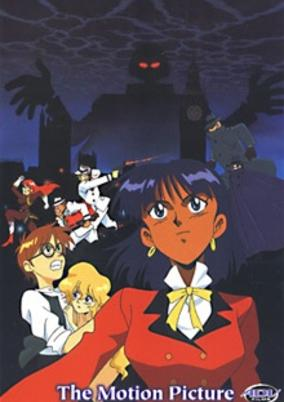

**Studio:** Gainax &nbsp;|&nbsp; **Director:** Hideaki Anno &nbsp;|&nbsp; **Aired/Released:** February 1 &nbsp;|&nbsp; **Genres:** Romance, Science Fiction, Action, Historical, Adventure, Mystery

> Three years after the defeat of Gargoyle and Neo-Atlantis, a new threat has surfaced bent on bringing the world under his control. Geiger, using advanced robot technology, is attempting to begin a world war, and take control of the devistated world after the destruction has stopped. Once again, Nadia and Jean must fight to save the world, only this time from itself.
>
> _Synopsis source: Kitsu_

[Kitsu](https://kitsu.io/anime/fushigi-no-umi-no-nadia-original-movie)

---

### Brave Exkaiser (The Brave Fighter Exkizer)

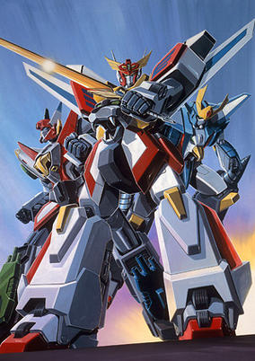

**Studio:** Sunrise &nbsp;|&nbsp; **Director:** Katsuyoshi Yatabe &nbsp;|&nbsp; **Aired/Released:** February 3 &nbsp;|&nbsp; **Genres:** Transforming Craft, Science Fiction, Mecha, Earth, Japan, Action, Super Robot, Asia, Robot

> When aliens plan to invade earth, the young Kouta along with a giant robot from outspace named Exkaiser must team up to save the world and his friends.
>
> _Synopsis source: Kitsu_

[Wikipedia](https://en.wikipedia.org/wiki/Brave_Exkaiser) · [Kitsu](https://kitsu.io/anime/yuusha-exkaiser)

---

### 1+2=Paradise

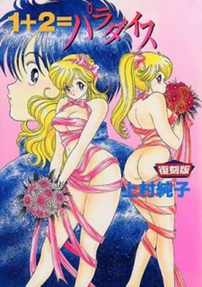

**Studio:** J.C.Staff &nbsp;|&nbsp; **Director:** Junichi Watanabe &nbsp;|&nbsp; **Aired/Released:** February 23 &nbsp;|&nbsp; **Genres:** Romance, Ecchi, Comedy, Love Polygon, Harem

> When Yuusuke awakens from a nightmare in which a demon warns him that women will be his downfall, he discovers that real life isn’t any better! Having a gynaecologist as a father, the poor boy is under pressure to overcome his irrational fear of women, and feisty twin sisters Yuka and Rika are on hand to give a helping hand. Using any method they can think of to seduce the red-faced boy, the racy competition soon heats up as busty Barako bounces onto the scene with an equal determination to seduce Yuusuke. Which of the horny heroines will win his heart, and more importantly, will he survive a non-stop onslaught of naked breasts, panties and bondage?
>
> _Synopsis source: Kitsu_

[Wikipedia](https://en.wikipedia.org/wiki/1%2B2%3DParadise) · [Kitsu](https://kitsu.io/anime/one-2-paradise)

---

### Ojisan Kaizō Kōza

**Studio:** Tokyo Movie Shinsha &nbsp;|&nbsp; **Director:** Tsutomu Shibayama &nbsp;|&nbsp; **Aired/Released:** February 24

---

### Fujiko F. Fujio's SF (Slightly Mysterious) Short Theater

**Studio:** Gallop Magic Bus Animation 21 &nbsp;|&nbsp; **Director:** Hiroshi Sasagawa Hidetoshi Owashi Yoshihiro Takamoto Satoshi Dezaki Tomomi Mochizuki Tsuneo Tominaga &nbsp;|&nbsp; **Aired/Released:** March

---

### Gdleen

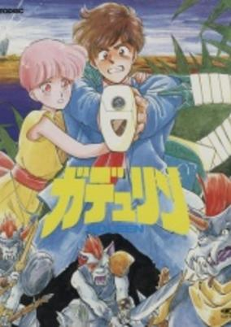

**Studio:** Ashi Productions &nbsp;|&nbsp; **Director:** Takao Kato Toyoo Ashida &nbsp;|&nbsp; **Aired/Released:** March 1 &nbsp;|&nbsp; **Genres:** Fantasy, Adventure, Comedy, Swordplay, Other Planet, Magic, Humanoid Alien, Alien, War, Future, Robot Helper, Super Power, Science Fiction

> Due to spacecraft failure earthlings Ryu with computer robot "MOS" landed on self-navigated planet Gdleen. There Ryu meets a cute Euradonian fairy Fana. At that time, the planet was in the midst of a dispute over a Gavana temple. Self proclaimed God Gavana captured Fana for a sacrifice. Would they be able to escape? And what the identity of Gavana?!
>
> _Synopsis source: Kitsu_

[Kitsu](https://kitsu.io/anime/gdleen)

---

### The Curse of Kazuo Umezu

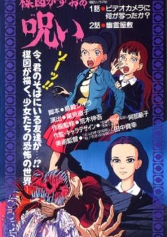

**Studio:** Takahashi Studio &nbsp;|&nbsp; **Director:** Naoko Omi &nbsp;|&nbsp; **Aired/Released:** March 1 &nbsp;|&nbsp; **Genres:** Earth, Japan, Asia, Horror, School Life, Violence

> "Do not toy with the supernatural." Two stories of the consequences that descend upon humans who venture beyond the safe confines of their ordinary worlds. When a gorgeous girl named Rima transfers into Masami's class, she's not only jealous, but also deathly frightened of her. While the boys in class are tripping all over themselves to get to Rima, Masami's having nightmares of a ghastly visitor and finding scars on her body come morning. She asks a friend to help her get evidence to confirm her suspicions about the new girl. But if a picture is worth a thousand words, a video must be worth far more. The truth can set you free, but it can also be more terrifying than anything you can imagine. Shy Miko and her more outgoing friend Nanako are enjoying their summer vacation, trying to make the most of their youth. But when horror-movie marathons just aren't thrilling enough, Nanako sets her eyes on a new target: an abandoned mansion at the edge of town, said to be haunted. With two other friends in tow, a reluctant Miko and a gung-ho Nanako enter the mansion. Soon, everything that can go wrong starts going wrong. Only luck or a miracle will allow them manage to escape the mansion with their lives, their sanity, and even their sense of reality.
>
> _Synopsis source: Kitsu_

[Kitsu](https://kitsu.io/anime/umezu-kazuo-no-noroi)

---

### Mashin Hero Wataru 2 (Spirit Hero Wataru 2)

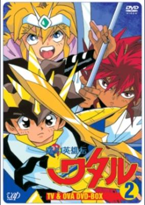

**Studio:** Sunrise &nbsp;|&nbsp; **Director:** Shuji Iuchi &nbsp;|&nbsp; **Aired/Released:** March 3 &nbsp;|&nbsp; **Genres:** Swordplay, Fantasy World, Mecha, Piloted Robot, Plot Continuity, Action, Science Fiction, Adventure, Comedy, Friendship

> This is the sequel to Mashin Eiyuden Wataru first season. Wataru has been lived happily on earth after he defeated Doakudar. When he plays around with his friend, Ryujinmaru appears and ask him to fight again. It appears that the 7 Stars Mountain, the source of Mt. Soukai's rainbow, have been taken over by Doakadar (Doakudar's brother). If all the stars mountain loses their brightness, Mt. Soukai's rainbow will fade and everyone will live in the darkness for eternity. Once again, Wataru has to go through all the 7 stars system and destroy this new stronger enemy.
>
> _Synopsis source: Kitsu_

[Wikipedia](https://en.wikipedia.org/wiki/Mashin_Hero_Wataru#Mashin_Hero_Wataru_2) · [Kitsu](https://kitsu.io/anime/mashin-eiyuuden-wataru-2)

---

### Chinpui: Eri-sama Katsudō Daishashin

**Studio:** Shin-Ei Animation &nbsp;|&nbsp; **Director:** Mitsuru Hongo &nbsp;|&nbsp; **Aired/Released:** March 10

[Wikipedia](https://en.wikipedia.org/wiki/Chimpui)

---

### Doraemon: Nobita and the Animal Planet (Doraemon the Movie: Nobita and the Animal Planet)

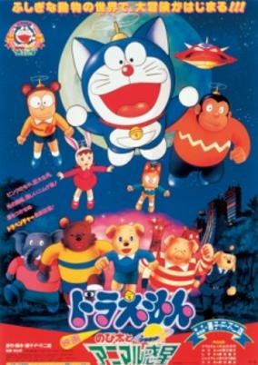

**Studio:** Shin-Ei Animation &nbsp;|&nbsp; **Director:** Tsutomu Shibayama &nbsp;|&nbsp; **Aired/Released:** March 10 &nbsp;|&nbsp; **Genres:** Comedy, Science Fiction, Fantasy, Adventure, Kids

> Nobita went to a world of animals through the "Wherever Gas", the substance to let you travel anywhere, same as the "Wherever Door" Doraemon uses. They came across with Chippo, a boy who looks like a dog and very adventurous. A group called Numiges plans on taking over the animal planet. Doraemon and friends plan to stop them with the animal's help.
>
> _Synopsis source: Kitsu_

[Kitsu](https://kitsu.io/anime/doraemon-nobita-s-animal-planet)

---

### Dragon Ball Z: The World's Strongest (Dragon Ball Z Movie 02: The World's Strongest)

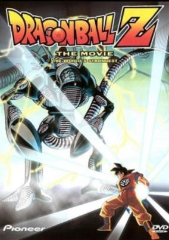

**Studio:** Toei Animation &nbsp;|&nbsp; **Director:** Daisuke Nishio &nbsp;|&nbsp; **Aired/Released:** March 10 &nbsp;|&nbsp; **Genres:** Super Power, Action, Science Fiction, Fantasy, Adventure, Comedy

> The evil Dr. Wheelo has resurrected his brain into a robot and now desires to inhabit the body of the world's strongest warrior. This means he must face Son Goku and company in a fight for Goku's life.
>
> _Synopsis source: Kitsu_

[Kitsu](https://kitsu.io/anime/dragon-ball-z-movie-02-konoyo-de-ichiban-tsuyoi-yatsu)

---

### Carol: A Day in a Girl's Life

**Studio:** Magic Bus &nbsp;|&nbsp; **Director:** Tetsu Dezaki Tsuneo Tominaga &nbsp;|&nbsp; **Aired/Released:** March 21

[Wikipedia](https://en.wikipedia.org/wiki/Carol_(anime))

---

### Like the Clouds, Like the Wind

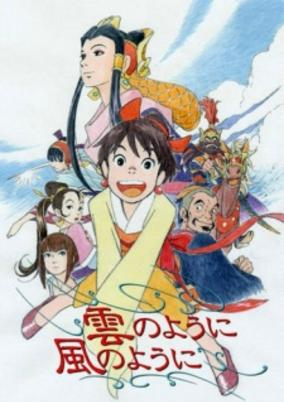

**Studio:** Pierrot &nbsp;|&nbsp; **Director:** Hisayuki Toriumi &nbsp;|&nbsp; **Aired/Released:** March 21 &nbsp;|&nbsp; **Genres:** China, Earth, Asia, Past, Samurai, Historical, Adventure, Romance, Drama

> Ginga, a small town girl sets out to become the Emperors Seihi, highest ranked wife, undaunted by the many other women who seek the same title. Her energetic and eccentric ways aid in her in meeting new people, training to be a Lady of the Emperor and dealing with the drama that ensues.
>
> _Synopsis source: Kitsu_

[Wikipedia](https://en.wikipedia.org/wiki/Like_the_Clouds,_Like_the_Wind) · [Kitsu](https://kitsu.io/anime/kumo-no-you-ni-kaze-no-you-ni)

---

### Sol Bianca

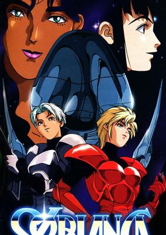

**Studio:** AIC &nbsp;|&nbsp; **Director:** Katsuhito Akiyama Hiroki Hayashi &nbsp;|&nbsp; **Aired/Released:** March 21 &nbsp;|&nbsp; **Genres:** Gunfights, Shipboard, Future, Science Fiction, Action, Space, Adventure

> Five female pirates pilot the Sol Bianca, a starship with a higher level of technology than any other known. With it, they seek out riches, such as the Gnosis, an legendary item of power, and pasha, the most valuable mineral in the galaxy. Along the way, they must consider a stowaway's quest to save the one he loves, and seek revenge against those that have wronged them.
>
> _Synopsis source: Kitsu_

[Wikipedia](https://en.wikipedia.org/wiki/Sol_Bianca) · [Kitsu](https://kitsu.io/anime/sol-bianca)

---

### Guardian of Darkness

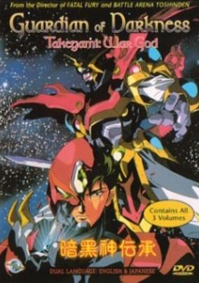

**Studio:** J.C.Staff &nbsp;|&nbsp; **Director:** Osamu Yamazaki &nbsp;|&nbsp; **Aired/Released:** March 23 &nbsp;|&nbsp; **Genres:** Mecha, Japan, Action, Asia, Earth, Angst, Drama, Plot Continuity, Demon, Science Fiction

> A trio of diabolical dragons stirs from eons of slumber deep within the earth. Charging to the surface, they launch a bloody rampage against humanity, feasting on the weak and gaining strength from their hapless victims' souls. It will take the power of ancient god Takegami, the Guardian of Darkness, to vanquish the evil serpent forces. But alas, the mortal body Takegami inhabits belongs to a host reluctant to fight.
>
> _Synopsis source: Kitsu_

[Wikipedia](https://en.wikipedia.org/wiki/Guardian_of_Darkness) · [Kitsu](https://kitsu.io/anime/ankoku-shinden-takegami)

---

### Tistou, the Boy with Green Thumbs (Tistou the Green Thumb)

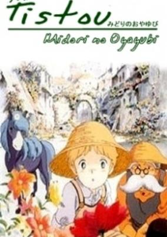

**Studio:** Production I.G &nbsp;|&nbsp; **Director:** Yuji Tanno &nbsp;|&nbsp; **Aired/Released:** March 24 &nbsp;|&nbsp; **Genres:** France, Magic, Historical

> When eight-year-old Tistou is sent home from school after being unable to stop falling asleep at lessons, his father decides that he will continue his education by learning from observation of real life, and where better to start than in the garden! With the gardener Mr. Moustache, Tistou discovers he has a remarkable gift—the green thumbs: everything he touches grows into beautiful plants. His next lesson is with the stern Mr. Turnbull, manager of his father's armament factory who takes Tistou to visit the town to learn about "order." Over the course of the next few days Tistou learns many new things as he visits the town prison, the slums, and the hospital, and everywhere he tries to change the world into a better place with his new extraordinary power. Finally, he learns about war, and upon visiting his father's factory, he finds out that they supply the two countries at war with their weapons...
>
> _Synopsis source: Kitsu_

[Kitsu](https://kitsu.io/anime/tistou-midori-no-oyayubi)

---

### Obatarian

**Studio:** Sunrise &nbsp;|&nbsp; **Director:** Tetsurō Amino &nbsp;|&nbsp; **Aired/Released:** April 3

[Wikipedia](https://en.wikipedia.org/wiki/Obatarian)

---

### Taiman Blues: Ladies-hen - Mayumi

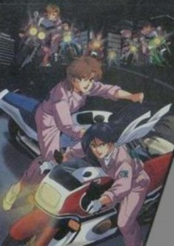

**Studio:** Magic Bus &nbsp;|&nbsp; **Director:** Tetsu Dezaki &nbsp;|&nbsp; **Aired/Released:** April 5 &nbsp;|&nbsp; **Genres:** Japan, Asia, Earth, Friendship

> Fifteen-year-old Mayumi has to move to the rough end of Osaka when her parents split and remarry. She meets Noriko, who helps her settle into her new life. Through Noriko's job at a petrol station, they got to know Big Bear and his biker gang, and eventually get into their own gang of girls racers.
>
> _Synopsis source: Kitsu_

[Kitsu](https://kitsu.io/anime/taiman-blues-ladies-hen-mayumi)

---

### NG Knight Ramune & 40 (NG Knight Lamune & 40)

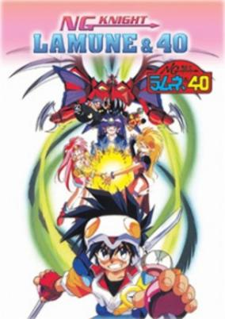

**Studio:** TV Tokyo &nbsp;|&nbsp; **Director:** Hiroshi Negishi &nbsp;|&nbsp; **Aired/Released:** April 6 &nbsp;|&nbsp; **Genres:** Fantasy, Science Fiction, Action, Mecha, Comedy, Fantasy World, Adventure, Isekai, Piloted Robot, Robot Helper

> Lamune is an ordinary 4th grade boy who loves playing video games. He buys one from a peddler girl and helps her sell the rest. At home, he plays the game called "King Sccasher" &amp; beats it. The peddler girl then comes out of the TV screen and asks for his help, calling him "The Blood Relative of the Chosen Hero Lamuness". She is Princess Milk and takes him to Hara-Hara World where his role is to revive the Guardian Knights. To do this, he had to find an unlock the shrine which held Tama-Q, a robot who became Lamuness' Advisor Robot, and key to freeing the Guardian Knights. All of the Knights are free-thinking mechas except for King Sccasher which is piloted by Lamuness. Opposing Lamuness is Don Harumage and his minions Da Cider and Lesuka.
>
> _Synopsis source: Kitsu_

[Wikipedia](https://en.wikipedia.org/wiki/NG_Knight_Ramune_%26_40) · [Kitsu](https://kitsu.io/anime/ng-knight-ramune-40)

---

### Moomin (Moomin Pilot Film)

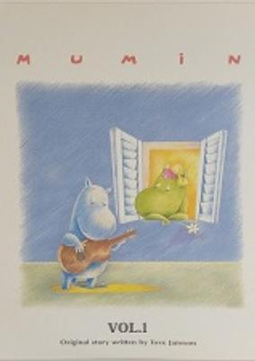

**Studio:** Telecable Benelux B.V. Telescreen Japan Inc. Visual 80 &nbsp;|&nbsp; **Director:** Hiroshi Saitô Masayuki Kojima &nbsp;|&nbsp; **Aired/Released:** April 12 &nbsp;|&nbsp; **Genres:** Fantasy

> The pilot film for the 1969 Moomin TV series. It was released to the public on the first LD volume of the 1969 series.
>
> _Synopsis source: Kitsu_

[Wikipedia](https://en.wikipedia.org/wiki/Moomin_(1990_TV_series)) · [Kitsu](https://kitsu.io/anime/muumin-pilot-film)

---

### Samurai Pizza Cats

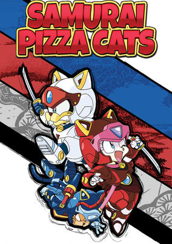

**Studio:** Tatsunoko Production &nbsp;|&nbsp; **Director:** Kunitoshi Okajima &nbsp;|&nbsp; **Aired/Released:** April 13 &nbsp;|&nbsp; **Genres:** Ninja, Power Suit, Science Fiction, Fantasy World, Action, Parody, Comedy, Swordplay, Martial Arts, Anthropomorphism, Slapstick, Stereotypes, Samurai, Super Power, Mecha

> Kyattou Ninden Teyande takes place in the city of Little Tokyo, a meld of feudal and modern Japanese culture, whose citizens are walking, talking animals. When the head palace guard catches wind that the corrupt prime minister Seymour Cheese decides to become emperor and take over Little Tokyo, he knows that only one group can save Little Tokyo: the owners of a local pizza joint, the Pizza Cats! Serving delicious pizza by day, this trio's true occupation is meowvelous warriors of justice! The Samurai Pizza Cats will do whatever it takes to protect Little Tokyo!
>
> _Synopsis source: Kitsu_

[Wikipedia](https://en.wikipedia.org/wiki/Samurai_Pizza_Cats) · [Kitsu](https://kitsu.io/anime/samurai-pizza-cats)

---

### Burning Blood

**Studio:** Magic Bus &nbsp;|&nbsp; **Director:** Osamu Dezaki &nbsp;|&nbsp; **Aired/Released:** April 25

[Wikipedia](https://en.wikipedia.org/wiki/B.B._(manga))

---

### I am THE Reiko Shiratori! (I am THE Shiratori Reiko!)

**Studio:** Ajia-do Animation Works &nbsp;|&nbsp; **Director:** Mitsuru Hongo &nbsp;|&nbsp; **Aired/Released:** April 25 &nbsp;|&nbsp; **Genres:** Romance, Comedy

> 19-year old Reiko is a rich, arrogant, material girl, who refuses to admit her feelings for classmate Tetsuya Akimoto before it's almost too late. Reiko pursues him to Tokyo and enrolls at his university in an attempt to win him back.
>
> _Synopsis source: Kitsu_

[Kitsu](https://kitsu.io/anime/shiratori-reiko-de-gozaimasu)

---

### Flight of the White Wolf (White Fang)

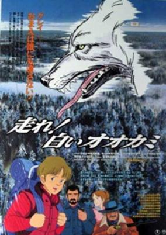

**Studio:** Group TAC &nbsp;|&nbsp; **Director:** Yosei Maeda &nbsp;|&nbsp; **Aired/Released:** April 28 &nbsp;|&nbsp; **Genres:** Adventure, United States, Present

> A boy named Lasset who lives on a farm in the rural northern US makes a perilous trek through the wilderness to a sanctuary 300 miles to the north to save the life of a gray wolf that he had raised from a puppy after an incident in which the wolf kills the family dog.
>
> _Synopsis source: Kitsu_

[Wikipedia](https://en.wikipedia.org/wiki/Flight_of_the_White_Wolf) · [Kitsu](https://kitsu.io/anime/hashire-shiroi-ookami)

---

### AD Police Files

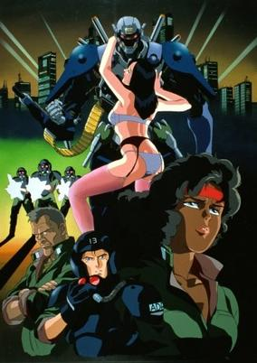

**Studio:** Artmic AIC &nbsp;|&nbsp; **Director:** Takamasa Ikegami Akira Nishimori &nbsp;|&nbsp; **Aired/Released:** May 25 &nbsp;|&nbsp; **Genres:** Science Fiction, Mecha, Japan, Action, Special Squads, Gunfights, Human Enhancement, Cyborg, Cyberpunk, Future, Android, Law And Order, Violence, Cops, Adventure, Thriller, Psychological, Mystery, Dementia

> The year is 2027 in MegaTokyo, six years before the Knight Sabers will make their debut. Boomers (artificial humans) are still a relatively new advancement, and the implementation and integration of boomers into society is still a bit buggy -- sometimes fatally so. Whenever a boomer incident occurs, though, there is the Advanced Police, a special force trained to deal with boomer crimes. Leon McNichol is a rookie in the AD Police, and is just starting to become exposed to the horrors and tragedies one finds every day in MegaTokyo. He and his veteran partner, Gina Marceau, slowly learn about the ever-fading line that separates man from machine.
>
> _Synopsis source: Kitsu_

[Wikipedia](https://en.wikipedia.org/wiki/AD_Police_Files) · [Kitsu](https://kitsu.io/anime/ad-police-files)

---

### Yagami-kun's Family Affairs

**Studio:** Kitty Film Mitaka Studio &nbsp;|&nbsp; **Director:** Shin'ya Sadamitsu &nbsp;|&nbsp; **Aired/Released:** May 25

[Wikipedia](https://en.wikipedia.org/wiki/Yagami-kun%27s_Family_Affairs#Original_video_animation)

---

### Summer with Kuro

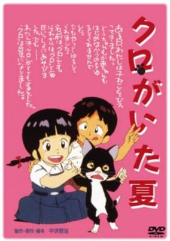

**Studio:** GEN Productions &nbsp;|&nbsp; **Director:** Takeshi Shirato &nbsp;|&nbsp; **Aired/Released:** June 4 &nbsp;|&nbsp; **Genres:** Earth, Japan, World War II, Asia, Anti War, Past, Historical

> Japan, summer of 1945. Nobuko, an elementary school girl, saves a little cat from crows. She desparately wants to keep the cat in her home. It is the time everyone suffers shortage of food, so naturally her parents don't like the idea. But Nobuko manages to convince them. She names the cat Kuro (black). Kuro eventually brings laughter to the family. However, the war situation becomes worse and worse...
>
> _Synopsis source: Kitsu_

[Kitsu](https://kitsu.io/anime/kuro-ga-ita-natsu)

---

### Black Bento

**Studio:** Kyodo Eiga &nbsp;|&nbsp; **Director:** Tetsu Dezaki &nbsp;|&nbsp; **Aired/Released:** June 12

---

### Gude Crest – The Emblem of Gude (Gude Crest: The Emblem of Gude)

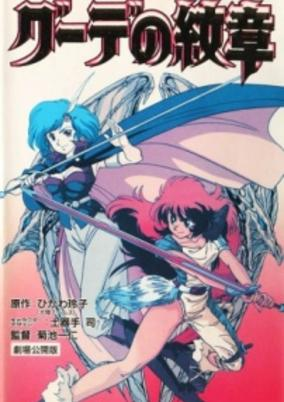

**Studio:** J.C.Staff &nbsp;|&nbsp; **Director:** Kazuhito Kikuchi &nbsp;|&nbsp; **Aired/Released:** June 23 &nbsp;|&nbsp; **Genres:** Fantasy, Fantasy World, Action, Swordplay, Magic, Past, Adventure

> Two partners Effera and Jiliora escape from a slave boat with the aid of their friend Orlin and a young boy named Kilian. When Kilian is killed in the escape Effera and Jiliora take it upon themselves to return Kilian's pendant to his two siblings who are being held captive by Baron Celdion, who is plotting to take over all of the neighboring countries.
>
> _Synopsis source: Kitsu_

[Wikipedia](https://en.wikipedia.org/wiki/Gude_Crest) · [Kitsu](https://kitsu.io/anime/gude-crest)

---

### Milky Passion: Dougenzaka - Ai no Shiro

**Studio:** Animation 501 Continental Shobo &nbsp;|&nbsp; **Director:** Takashi Imanishi &nbsp;|&nbsp; **Aired/Released:** June 23 &nbsp;|&nbsp; **Genres:** Romance

> Based on the Milky Passion manga by Morizono Milk.
>
> _Synopsis source: Kitsu_

[Kitsu](https://kitsu.io/anime/milky-passion-dougenzaka-ai-no-shiro)

---

### Heisei no Cinderella: Kiko-sama Monogatari

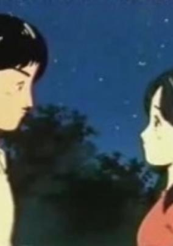

**Studio:** Studio Comet &nbsp;|&nbsp; **Aired/Released:** June 29 &nbsp;|&nbsp; **Genres:** Historical, Romance

> The special is confined to the wedding of Prince Akishino with his chosen Kiko Kawashima.
>
> _Synopsis source: Kitsu_

[Kitsu](https://kitsu.io/anime/heisei-no-cinderella-kiko-sama-monogatari)

---

### Record of Lodoss War

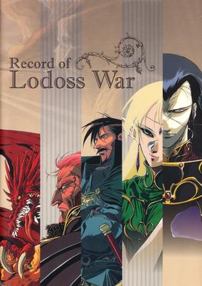

**Studio:** Madhouse &nbsp;|&nbsp; **Director:** Akinori Nagaoka &nbsp;|&nbsp; **Aired/Released:** June 30 &nbsp;|&nbsp; **Genres:** Fantasy World, Fantasy, Adventure, Action, Dragon, Feudal Warfare, Swordplay, Elf, Deity, High Fantasy, Magic, Stereotypes, Parallel Universe, Violence

> Created from the aftermath of the last great battle of the gods, Lodoss and its kingdoms have been plagued by war for thousands of years. As a quiet peace and unity finally become foreseeable over the land, an unknown evil begins to stir. An ancient witch has awakened, bent on preserving the island of Lodoss by creating political unbalance throughout the many kingdoms and keeping any one from maintaining central control. Only a mixed-race party of six young champions, led by the young warrior Parn, stand between this new threat and Lodoss' descent back into the darkness of war and destruction.
>
> _Synopsis source: Kitsu_

[Wikipedia](https://en.wikipedia.org/wiki/Record_of_Lodoss_War) · [Kitsu](https://kitsu.io/anime/lodoss-tou-senki)

---

### Fujiko Fujio A no Mumako

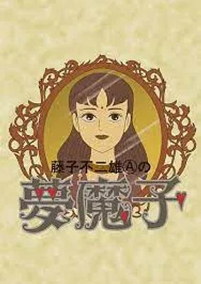

**Studio:** Shin-Ei Animation &nbsp;|&nbsp; **Director:** Toshirō Kuni &nbsp;|&nbsp; **Aired/Released:** July 3 &nbsp;|&nbsp; **Genres:** Fantasy, Horror

> Based on the horror novel by Fujio (A) Fujiko.
>
> _Synopsis source: Kitsu_

[Kitsu](https://kitsu.io/anime/fujiko-fujio-a-no-mumako)

---

### Dragon Ball Z: The Tree of Might (Dragon Ball Z Movie 03: The Tree of Might)

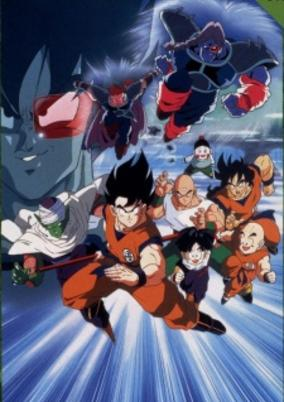

**Studio:** Toei Animation &nbsp;|&nbsp; **Director:** Daisuke Nishio &nbsp;|&nbsp; **Aired/Released:** July 7 &nbsp;|&nbsp; **Genres:** Science Fiction, Action, Fantasy, Martial Arts, Super Power, Adventure, Comedy

> The Saiyajin named Turlus has come to Earth in order to plant a tree that will both destroy the planet and give him infinite strength. Son Goku and the Z Warriors cannot let this happen and duke it out with the invaders for the sake of the planet.
>
> _Synopsis source: Kitsu_

[Kitsu](https://kitsu.io/anime/dragon-ball-z-movie-03-chikyuu-marugoto-chou-kessen)

---

### Kennosuke-sama

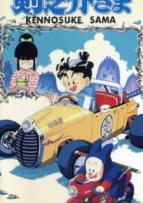

**Studio:** Toei Animation &nbsp;|&nbsp; **Director:** Minoru Okazaki &nbsp;|&nbsp; **Aired/Released:** July 7 &nbsp;|&nbsp; **Genres:** Comedy, Adventure

> A comedy about a family of old-fashioned samurai living in modern-day Tokyo whose young son has to head out for an important date.
>
> _Synopsis source: Kitsu_

[Kitsu](https://kitsu.io/anime/kennosuke-sama)

---

### Pink: Water Bandit, Rain Bandit

**Studio:** Toei Animation &nbsp;|&nbsp; **Director:** Toyoo Ashida &nbsp;|&nbsp; **Aired/Released:** July 7

[Wikipedia](https://en.wikipedia.org/wiki/Pink_(1982_manga))

---

### Soreike! Anpanman: Baikinman no Gyakushuu

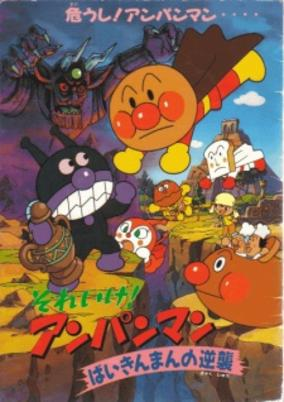

**Studio:** Tokyo Movie Shinsha &nbsp;|&nbsp; **Director:** Akinori Nagaoka &nbsp;|&nbsp; **Aired/Released:** July 14 &nbsp;|&nbsp; **Genres:** Fantasy, Comedy, Kids

> Baikinsennin tells Baikinman about a magical vase called "Mekoisu no tsubo" that could grant him the power to destroy Anpanman. A princess of the perished Yaada-koku, Yaada-hime, also seeks the vase to restore her kingdom to its glory. When Anpanman joins forces with her, a furious chase ensues with both sides trying to get their hands on the vase.
>
> _Synopsis source: Kitsu_

[Wikipedia](https://en.wikipedia.org/wiki/Anpanman#Full-length_movies) · [Kitsu](https://kitsu.io/anime/sore-ike-anpanman-baikinman-no-gyakushuu)

---

### Lupin III: The Hemingway Papers (Lupin the Third: The Hemingway Paper Mystery)

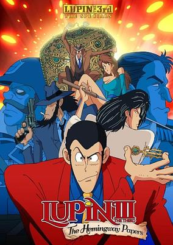

**Studio:** Tokyo Movie Shinsha &nbsp;|&nbsp; **Director:** Osamu Dezaki &nbsp;|&nbsp; **Aired/Released:** July 20 &nbsp;|&nbsp; **Genres:** Present, Action, Adventure, Comedy, Crime, Cops, Thievery, Mystery

> A draft of Ernest Hemingway's final novel might hold the secret to an immense hidden treasure, and master thief Lupin the Third is on the hunt! He’ll have the help of his partners and the beautiful bartender Maria, but he'll have to contend with a local civil war, the mercenary Crazy Mash, and his super-wealthy boss Marces to get it.
>
> _Synopsis source: Kitsu_

[Wikipedia](https://en.wikipedia.org/wiki/List_of_Lupin_III_television_specials#2) · [Kitsu](https://kitsu.io/anime/lupin-iii-the-hemingway-paper-mystery)

---

### Hello Kitty's Thumbelina

**Studio:** Sanrio Grouper Productions &nbsp;|&nbsp; **Director:** Hidemi Kubo &nbsp;|&nbsp; **Aired/Released:** July 21

---

### Keroppi's Big Adventure with Jack and the Beanstalk (Keroppi in the Big Adventure)

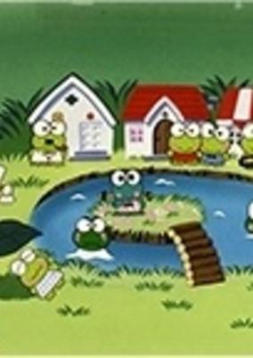

**Studio:** Sanrio Grouper Productions &nbsp;|&nbsp; **Director:** Masami Hata &nbsp;|&nbsp; **Aired/Released:** July 21 &nbsp;|&nbsp; **Genres:** Fantasy, Adventure, Kids, Anthropomorphism

> When Pocapon's belly button gone missing, Keroppi, Den Den, and Ruby go to find it as without it he is unable to play the drums.
>
> _Synopsis source: Kitsu_

[Kitsu](https://kitsu.io/anime/kero-kero-keroppi-no-dai-bouken)

---

### Kim's Cross

**Studio:** Tatsunoko Production &nbsp;|&nbsp; **Director:** Tengo Yamada &nbsp;|&nbsp; **Aired/Released:** July 21

---

### Pokopon's Funny Monkey Story

**Studio:** Sanrio Grouper Productions &nbsp;|&nbsp; **Director:** Masami Hata &nbsp;|&nbsp; **Aired/Released:** July 21

---

### Transformers: Zone

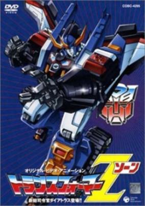

**Studio:** Toei Animation &nbsp;|&nbsp; **Director:** Hiromichi Matano &nbsp;|&nbsp; **Aired/Released:** July 21 &nbsp;|&nbsp; **Genres:** Transforming Craft, Science Fiction, Mecha

> In the distant future, an evil entity known as Violenjiger resurrects nine of the most feared generals in Destron history. While saving some inhabitants of a planet destroyed by these Destrons, Cybertron leader Victory Saber is seriously damaged. The leadership of the Cybertron forces is passed on to the heroic robot Dai-Atlas. Together with Sonic Bomber, Dai-Atlas must protect a mysterious crystal on Earth known as the "Zodiac" from falling into the hands of Violenjiger.
>
> _Synopsis source: Kitsu_

[Kitsu](https://kitsu.io/anime/transformers-zone)

---

### Nineteen 19

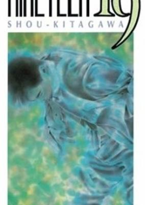

**Studio:** Madhouse &nbsp;|&nbsp; **Director:** Koichi Chigira &nbsp;|&nbsp; **Aired/Released:** July 27 &nbsp;|&nbsp; **Genres:** Romance, Japan, Asia, Earth, Present

> 19-year-old Kubota is ready to find a girlfriend. The perfect chance arises when he meets Masana Fujisaka, his first love, in a club. She's just broken up with her longtime boyfriend and is surprised to run into Kubota, who sees that the perfect opportunity has just arisen.
>
> _Synopsis source: Kitsu_

[Wikipedia](https://en.wikipedia.org/wiki/Nineteen_19) · [Kitsu](https://kitsu.io/anime/nineteen-19)

---

### Riki-Oh 2: Child of Destruction

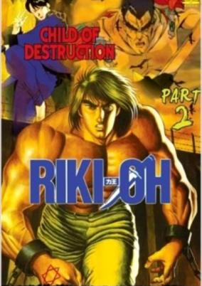

**Studio:** Magic Bus &nbsp;|&nbsp; **Director:** Tetsu Dezaki &nbsp;|&nbsp; **Aired/Released:** August 24 &nbsp;|&nbsp; **Genres:** Action, Violence, Super Power, Martial Arts

> Child of Destruction is the sequel to the RIKI-OH OVA Wall of Hell. Child of Destruction tells us more of Riki's past, as we flash back to his childhood to learn the terrible fate of his mother and how he himself was taken away from his twin brother Nachi during a game of hide-and-seek, with Nachi's plaintive cry of "Are you ready yet?" haunting him through the years. Riki has a six-pointed star emblazoned on his hand, while Nachi has a swastika on his, the significance of which go unexplained. Riki finds himself in the town of Misaki, dotted with illegal nuclear power plants and run by a religious fanatic military organization called "God's Judgment." He is taken prisoner and made to fight in gladiatorial matches in a sprawling arena. He finds his brother, whose special powers have given him the name of "Savior," but his reunion with his resentful sibling turns sour rather quickly. Part 2 is much gorier than Part 1, with Riki smashing his fists into numerous soldier opponents with far less restraint.
>
> _Synopsis source: Kitsu_

[Kitsu](https://kitsu.io/anime/riki-oh-2-child-of-destruction)

---

### City Hunter: Bay City Wars

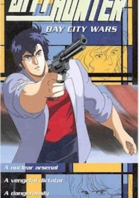

**Studio:** Sunrise &nbsp;|&nbsp; **Director:** Kenji Kodama &nbsp;|&nbsp; **Aired/Released:** August 25 &nbsp;|&nbsp; **Genres:** Gunfights, Present, Earth, Japan, Asia, Action, Comedy, Mystery

> A new island resort has been built in Tokyo bay, and it is run by one of the world's most powerful super computers. The City Hunter gang has been invited to the grand opening party, but only Miki &amp; Kaori have gotten there. Soon, they and the rest of the party goers are taken hostage by an exiled South American dictator called General Gillium. Now it's up to Ryo and Umibozu to free the hostages, and prevent Gillium's daughter from using the super computer to launch a nuclear attack on the USA.
>
> _Synopsis source: Kitsu_

[Wikipedia](https://en.wikipedia.org/wiki/City_Hunter#Anime) · [Kitsu](https://kitsu.io/anime/city-hunter-bay-city-wars)

---

### City Hunter: Million Dollar Conspiracy

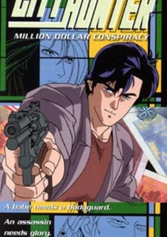

**Studio:** Sunrise &nbsp;|&nbsp; **Director:** Kenji Kodama &nbsp;|&nbsp; **Aired/Released:** August 25 &nbsp;|&nbsp; **Genres:** Gunfights, Present, Earth, Japan, Violent Retribution For Accidental Infringement, Asia, Action, Comedy, Mystery

> Beautiful American Emily O'Hara offers the City Hunter (Ryo Saeba &amp; Kaori Makimura) one million dollars to protect her from a man named Douglas. Ryo &amp; Kaori take the job, but things are not quite what they seem. The real target just might be Ryo, but it's unclear who wants Saeba dead.
>
> _Synopsis source: Kitsu_

[Wikipedia](https://en.wikipedia.org/wiki/City_Hunter#Anime) · [Kitsu](https://kitsu.io/anime/city-hunter-million-dollar-conspiracy)

---

### "Eiji"

**Studio:** I.G Tatsunoko &nbsp;|&nbsp; **Director:** Mizuho Nishikubo &nbsp;|&nbsp; **Aired/Released:** August 25

[Wikipedia](https://en.wikipedia.org/wiki/Eiji_(manga))

---

### Soreike! Anpanman: Minami no Umi o Sukue!

**Studio:** Tokyo Movie Shinsha &nbsp;|&nbsp; **Director:** Shunji Ōga &nbsp;|&nbsp; **Aired/Released:** August 26

---

### OL Kaizo Koza

**Studio:** Tokyo Movie Shinsha &nbsp;|&nbsp; **Director:** Hajime Kamegaki &nbsp;|&nbsp; **Aired/Released:** September 1

---

### Magical Tarurūto-kun

**Studio:** Toei Animation &nbsp;|&nbsp; **Director:** Masahiko Ohkura &nbsp;|&nbsp; **Aired/Released:** September 2

[Wikipedia](https://en.wikipedia.org/wiki/Magical_Taruruto#Anime)

---

### Aries: Shinwa no Seiza Miya

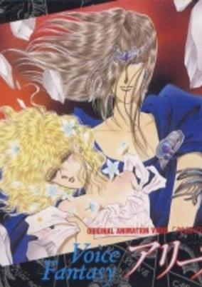

**Studio:** Studio Sign &nbsp;|&nbsp; **Director:** Mitsuo Kusakabe &nbsp;|&nbsp; **Aired/Released:** October 1 &nbsp;|&nbsp; **Genres:** Fantasy, Romance

> Based on the shoujo manga by Fuyuki Rurika.
>
> _Synopsis source: Kitsu_

[Kitsu](https://kitsu.io/anime/aries-shinwa-no-seizakyuu)

---

### Musashi, the Samurai Lord (Musashi)

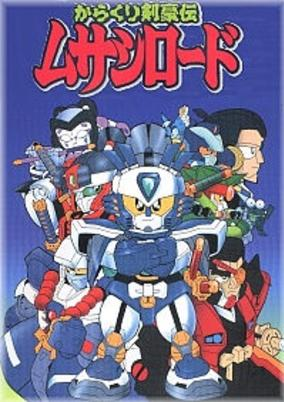

**Studio:** Pierrot &nbsp;|&nbsp; **Director:** Akira Shigino &nbsp;|&nbsp; **Aired/Released:** October 3 &nbsp;|&nbsp; **Genres:** Science Fiction, Action, Martial Arts, Samurai, Mecha, Adventure

> It is the time of civil war. Zipangu is a country where people live together with gimmick warriors, a kind of super human robot. There, people and gimmick warriors struggle to seize power. Musashi, a Samurai gimmick warrior, departs to on a quest to become the best Samurai warrior. Musashi thrives in the series of battles, encountering with many heroes and villains including his lifelong rival, Kojiro, an expert swordsman. Later, Mushashi and Kojiro are sent by their General to escort the Princess, a granddaughter of the general. The princess is spoiled and difficult, so their journey becomes series of misadventures. Soon, they are caught up in a battle to seize control of the Country.
>
> _Synopsis source: Kitsu_

[Wikipedia](https://en.wikipedia.org/wiki/Musashi,_the_Samurai_Lord) · [Kitsu](https://kitsu.io/anime/karakuri-kengou-den-musashi-lord)

---

### RPG Densetsu Hepoi

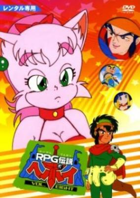

**Studio:** Nihon Ad Systems &nbsp;|&nbsp; **Aired/Released:** October 6 &nbsp;|&nbsp; **Genres:** Fantasy, Fantasy World, Adventure, Comedy, Juujin

> The adventure of Hepoi, a hero of heporis, Ryuuto, the prince of Dragonia, Miiya Miiya a fairy looks like a cat, and Bunzaemon, a merchant, to defeat Dracunes, the King of dark side castles.
>
> _Synopsis source: Kitsu_

[Kitsu](https://kitsu.io/anime/rpg-densetsu-hepoi)

---

### The Three-Eyed One

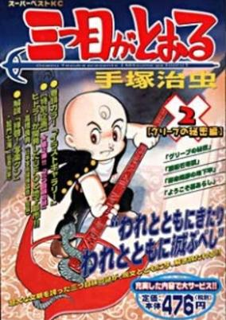

**Studio:** Tezuka Productions &nbsp;|&nbsp; **Director:** Hidehito Ueda &nbsp;|&nbsp; **Aired/Released:** October 10 &nbsp;|&nbsp; **Genres:** Adventure, Earth, Alternative Present, Present, Super Power

> He is a little boy who has a terrible power. On his forehead is a third eye that, if open, releases extremely dangerous mystical energy that turns him into an evil sorcerer, bent on conquering mankind, and able to summon demons and wielding a red harpoon wand called Red Condor. To protect mankind from his terrible power, Sharaku is made to wear a bandage which seals his third eye. While his eye is sealed, Sharaku knows nothing of his true nature or his power, and does not remember his evil half's sinister attempts to conquer the world.
>
> _Synopsis source: Kitsu_

[Wikipedia](https://en.wikipedia.org/wiki/Mitsume_ga_T%C5%8Dru) · [Kitsu](https://kitsu.io/anime/mitsume-ga-tooru)

---

### Sunset on Third Street

**Studio:** Group TAC &nbsp;|&nbsp; **Director:** Hidehito Ueda &nbsp;|&nbsp; **Aired/Released:** October 12

[Wikipedia](https://en.wikipedia.org/wiki/Sunset_on_Third_Street#Anime)

---

### Dragon Ball Z: Bardock – The Father of Goku (Dragon Ball Z Special 1: Bardock)

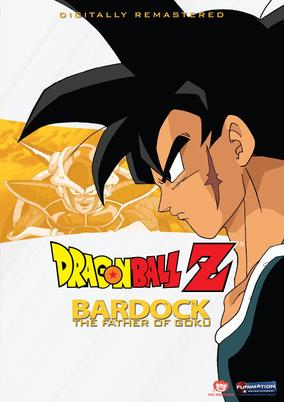

**Studio:** Toei Animation &nbsp;|&nbsp; **Director:** Mitsuo Hashimoto &nbsp;|&nbsp; **Aired/Released:** October 17 &nbsp;|&nbsp; **Genres:** Science Fiction, Action, Martial Arts, Space, Super Power, Fantasy, Adventure, Comedy, Shounen

> Bardock, Son Goku's father, is a low-ranking Saiyan soldier who was given the power to see into the future by the last remaining alien on a planet he just destroyed. He witnesses the destruction of his race and must now do his best to stop Frieza's impending massacre.
>
> _Synopsis source: Kitsu_

[Kitsu](https://kitsu.io/anime/dragon-ball-z-special-1-tatta-hitori-no-saishuu-kessen-freezer-ni-idonda-z-senshi-son-goku-no-chi)

---

### Osu!! Karate Bu (Go!! Karate Club)

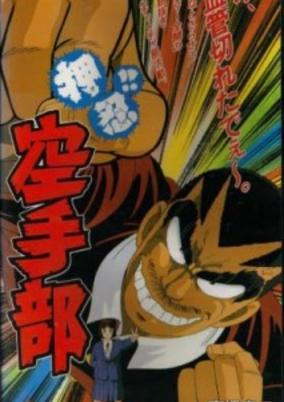

**Studio:** J.C.Staff &nbsp;|&nbsp; **Director:** Osamu Sekida &nbsp;|&nbsp; **Aired/Released:** October 21 &nbsp;|&nbsp; **Genres:** Japan, Action, Asia, Combat, Sports, Comedy, School Clubs, School Life, Violence, Present, Martial Arts

> Tadashi Matsushita has recently entered the Kansai Fifth Technical High School and joined its notorious karate club. There he meets his captain, Yoshiyuki Takagi, an incredibly strong individual. Feared and respected throughout Osaka, Takagi is deep down an honorable and compassionate guy despite his violent endeavors.
>
> _Synopsis source: Kitsu_

[Kitsu](https://kitsu.io/anime/osu-karate-bu)

---

### The Hakkenden (The Hakkenden: Legend of the Dog Warriors)

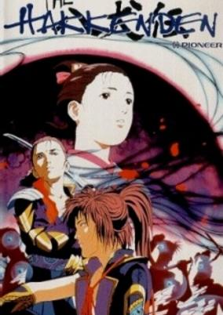

**Studio:** AIC Artmic &nbsp;|&nbsp; **Director:** Takashi Anno &nbsp;|&nbsp; **Aired/Released:** October 25 &nbsp;|&nbsp; **Genres:** Japan, Fantasy, Action, Asia, Swordplay, Drama, Violence, Samurai, Demon, Martial Arts, Historical, Adventure

> "During the blood-soaked feudal wars of Japan, the Awa clan faced certain extinction from a rival clan backed by demonic forces. Their clan's salvation becomes a curse when the family dog brings back the head of the enemy warlord but insists upon marrying the lord's daughter! This unnatural union bears fruit, but they are killed; and their eight unborn pups reincarnate as the eight Dog Warriors - The Hakkenden. The eight reincarnated souls travel their separate paths of violence and retribution, but slowly they come together as a formidable group representing the eight virtues of the bushido to slay the demons and redeem their clan!"
>
> _Synopsis source: Kitsu_

[Wikipedia](https://en.wikipedia.org/wiki/The_Hakkenden) · [Kitsu](https://kitsu.io/anime/the-hakkenden)

---

### Ajin Senshi

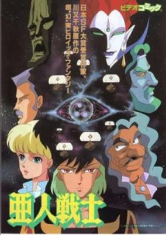

**Studio:** Magic Bus &nbsp;|&nbsp; **Director:** Tsuneo Tominaga &nbsp;|&nbsp; **Aired/Released:** November 17 &nbsp;|&nbsp; **Genres:** Fantasy, Science Fiction

> In the year 2200 an interstellar war is held where the weapons most frequently used are the psychic capacities. The hero, Zero, son of an earthling and an extraterrestrial, the prince and last survivor of a clan of magicians. He will fight against the army of the Manjidara empire, whose forces are such as its head ambition to control the whole universe.
>
> _Synopsis source: Kitsu_

[Kitsu](https://kitsu.io/anime/ajin-senshi)

---

### Devil Hunter Yohko

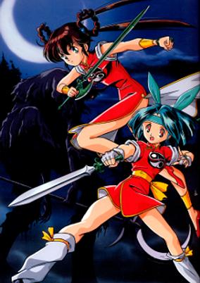

**Studio:** Madhouse &nbsp;|&nbsp; **Director:** Katsuhisa Yamada &nbsp;|&nbsp; **Aired/Released:** December 1 &nbsp;|&nbsp; **Genres:** Ecchi, Action, Comedy, Swordplay, Martial Arts, Magic, Magical Girl, Present, Demon, Super Power, Fantasy, Horror

> Yohko Mono is a regular girl making her way through high school--until she learns that she is the 108th successor to a line of warriors charged with defending the earth against demons. Eventually she must fight her ultimate battle against the demon who started it all.
>
> _Synopsis source: Kitsu_

[Wikipedia](https://en.wikipedia.org/wiki/Devil_Hunter_Yohko) · [Kitsu](https://kitsu.io/anime/devil-hunter-yohko)

---

### In the Summer After the War: 1945 Karafuto

**Director:** Koji Chino &nbsp;|&nbsp; **Aired/Released:** December 8

---

### Chibi Maruko-chan

**Studio:** Nippon Animation &nbsp;|&nbsp; **Director:** Yumiko Suda Tsutomu Shibayama &nbsp;|&nbsp; **Aired/Released:** December 15 &nbsp;|&nbsp; **Genres:** Japan, Elementary School, Slice of Life, Comedy, Present

> Momoko Sakura is an elementary school student who likes popular idol Momoe Yamaguchi and mangas. She is often called "Chibi Maruko-chan" due to her young age and small size. She lives together with her parents, her grandparents and her elder sister in a little town. In school, she has many friends with whom she studies and plays together everyday, including her close pal, Tama-chan; the student committee members, Maruo-kun and Migiwa-san; and the B-class trio: 'little master' Hanawa-kun, Hamaji-Bu Taro and Sekiguchi-kun. This is a fun-loving and enjoyable anime that portrays the simple things in life.
>
> _Synopsis source: Kitsu_

[Kitsu](https://kitsu.io/anime/chibi-maruko-chan)

---

### Circuit no Ōkami II: Modena no Tsurugi

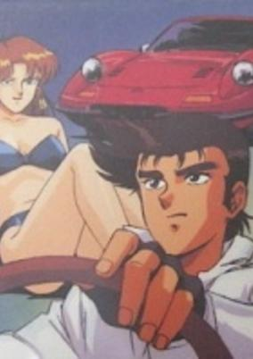

**Studio:** Gainax &nbsp;|&nbsp; **Director:** Yoshihide Kuriyama &nbsp;|&nbsp; **Aired/Released:** December 21 &nbsp;|&nbsp; **Genres:** Comedy, Motorsport

> The adventures of Ken Ferrari, a former racer and motor journalist with an appetite for women. Based on the manga by Satoshi Ikezawa.
>
> _Synopsis source: Kitsu_

[Kitsu](https://kitsu.io/anime/circuit-no-ookami-ii-modena-no-ken)

---

### Mad Bull 34

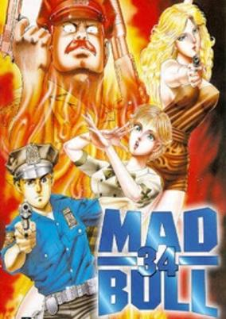

**Studio:** Magic Bus &nbsp;|&nbsp; **Director:** Satoshi Dezaki &nbsp;|&nbsp; **Aired/Released:** December 21 &nbsp;|&nbsp; **Genres:** New York, Action, Earth, Gunfights, United States, Crime, Americas, Law And Order, Violence, Cops

> Daizaburo Edi-Ban, a Japanese-American, joins New York City's toughest precinct, the 34th. On his first day he is partnered up with John Estes, called Sleepy by his friends and Mad Bull by his enemies, a cop who stops crime with his own violent brand of justice. Mad Bull makes no qualms about executing common thieves with shotgun blasts if they even pose a minor threat to him or anyone around them. Mad Bull also often steals from prostitutes and does incredible amounts of property damage while fighting crime. Mad Bull's unpoliceman-like behavior often puts him in hot water with his partner Daizaburo and the 34th precinct. However, despite how reckless or illegal these acts are, a good cause is always revealed (For example, Sleepy uses the money he steals from the prostitutes to fund a venereal disease clinic and a home for battered and raped women). Perrine Valley, a police lieutenant, joins Daizaburo and Sleepy later on to help them tackle more difficult cases involving the mafia and drug-running. Mad Bull 34 is inspired by the high-action buddy cop films of the '70s and '80s.
>
> _Synopsis source: Kitsu_

[Wikipedia](https://en.wikipedia.org/wiki/Mad_Bull_34#Original_video_animation) · [Kitsu](https://kitsu.io/anime/mad-bull-34)

---

### A Wind Named Amnesia

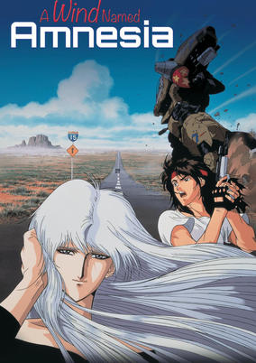

**Studio:** Madhouse &nbsp;|&nbsp; **Director:** Kazuo Yamazaki &nbsp;|&nbsp; **Aired/Released:** December 22 &nbsp;|&nbsp; **Genres:** Science Fiction, Post Apocalypse, Earth, Action, United States, Americas, Future, Dementia, Mecha, Human Enhancement

> It happened quite suddenly, with no warning - all the memories of all the people on Earth, swept away as if by a sudden wind. In a post-catastrophic Earth populated mostly by savages without memories of their past civilisation, one man travels on a journey of enlightenment and hope, across a devastated America.
>
> _Synopsis source: Kitsu_

[Wikipedia](https://en.wikipedia.org/wiki/A_Wind_Named_Amnesia) · [Kitsu](https://kitsu.io/anime/kaze-no-na-wa-amnesia)

---

### Sword for Truth

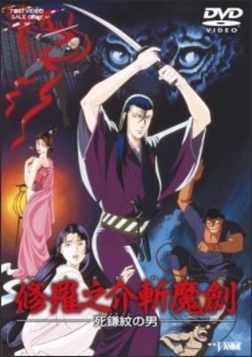

**Studio:** Toei Animation &nbsp;|&nbsp; **Director:** Osamu Dezaki &nbsp;|&nbsp; **Aired/Released:** December 28 &nbsp;|&nbsp; **Genres:** Earth, Tokugawa Period, Swordplay, Thriller, Past, Action, Japan, Asia, Violence, Samurai, Historical

> Shurannosuke Sakaki is a masterless samurai with a razor-sharp katana and a cold-hearted personality. Whenever you see the mark of two crossed scythes on his back, death is sure to follow. Because of his exceptional swordsmanship, Shurannosuke is hired by the Nakura Clan to rescue Princess Mayu from the Seki Ninja. In this mission, he must use his full potential to survive the Seki Ninja's notorious henchmen.
>
> _Synopsis source: Kitsu_

[Wikipedia](https://en.wikipedia.org/wiki/Sword_for_Truth) · [Kitsu](https://kitsu.io/anime/shuranosuke-zanmaken-shikamamon-no-otoko)

---

### Kounai Shasei

---
