# 1991 in Anime

[← Back to index](../README.md)

104 titles · 80 with a matched synopsis/cover art · [source](https://en.wikipedia.org/wiki/1991_in_anime)

## Film

### Doraemon: Nobita no Dorabian Naito ( Doraemon: Nobita's Dorabian Nights ) (Doraemon the Movie: Nobita's Dorabian Nights)

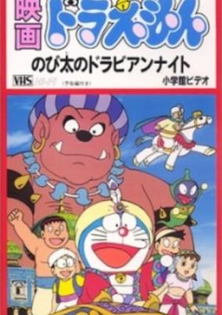

**Studio:** Shin-Ei Animation &nbsp;|&nbsp; **Director:** Tsutomu Shibayama &nbsp;|&nbsp; **Aired/Released:** March 9 &nbsp;|&nbsp; **Genres:** Middle East, Japan, Earth, Asia, Fantasy, Adventure, Comedy, Kids

> Doraemon and Nobita were using special shoes that allows them to jump into the worlds of the books that they want. Nobita let Shizuka use those shoes to enter the world of the book that she wants. Shizuka got lost in one Nobita's Sinbad Legend of the Seven Seas book. After Nobita's mother burned all of his books, Doraemon and the others must find another way to save Shizuka.
>
> _Synopsis source: Kitsu_

[Kitsu](https://kitsu.io/anime/doraemon-nobita-in-dorabian-nights)

---

### Doragon Bōru Zetto: Sūpā Saiyajin da Son Gokū ( Dragon Ball Z: Lord Slug )

**Studio:** Toei Animation &nbsp;|&nbsp; **Director:** Mitsuo Hashimoto &nbsp;|&nbsp; **Aired/Released:** March 9

---

### Magical Taruruto-kun

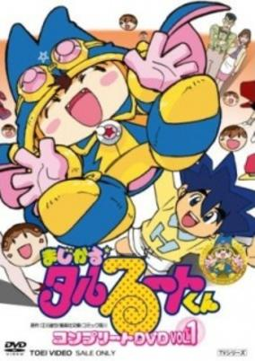

**Studio:** Toei Animation &nbsp;|&nbsp; **Director:** Shigeyasu Yamauchi &nbsp;|&nbsp; **Aired/Released:** March 9 &nbsp;|&nbsp; **Genres:** Contemporary Fantasy, Japan, Earth, Asia, Super Deformed, Magic, Slapstick, Present, Fantasy, Adventure, Comedy, Ecchi, School Life

> Magical Taruruto-kun is a magical boy, fighting, and comedy TV show based on the manga of the same name by Tatsuya Egawa which ran in Weekly Shounen Jump.
>
> _Synopsis source: Kitsu_

[Wikipedia](https://en.wikipedia.org/wiki/Magical_Taruruto#Anime) · [Kitsu](https://kitsu.io/anime/magical-taruruuto-kun)

---

### Ushiro no Shoumen Daare ( Who's Left Behind? ) (Who's Left Behind?)

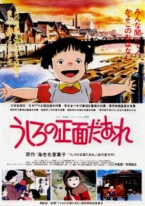

**Studio:** Mushi Production &nbsp;|&nbsp; **Director:** Seiji Arihara &nbsp;|&nbsp; **Aired/Released:** March 9 &nbsp;|&nbsp; **Genres:** Japan, World War II, Asia, Earth, Slice of Life, Coming Of Age, Anti War, War, Drama, Past, Disaster, Historical

> Kayoko is a young girl in 1940, just starting first grade. She's a bit of a crybaby, which is no secret to those around her. She loves playing with friends and singing cute schoolyard chants, and occasionally having fun with her three older brothers. Her mother is pregnant, and so she looks forward to being a big sister, only partially understanding the responsibility that might bring. Meanwhile, the war effort is growing, and it`s only the natural thing to do to be patriotic and support the country... Kayoko goes so far as to contribute her favorite dolly, whose materials could help build explosives. Time passes, and as she grows older, Kayoko sees how the war has affected her life and those around her. Nothing can prepare her for 1945, however, and the bleak times that are soon to come. Based on original creator Kayoko Ebina's real life experience during World War 2 on Showa era.
>
> _Synopsis source: Kitsu_

[Kitsu](https://kitsu.io/anime/ushiro-no-shoumen-daare)

---

### Mobile Suit Gundam F91

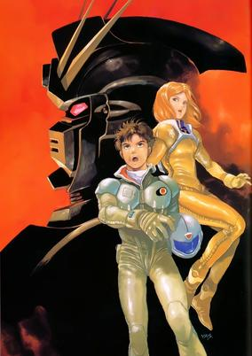

**Studio:** Sunrise &nbsp;|&nbsp; **Director:** Yoshiyuki Tomino &nbsp;|&nbsp; **Aired/Released:** March 16 &nbsp;|&nbsp; **Genres:** Science Fiction, Mecha, Action, Piloted Robot, War, Drama, Future, Violence, Space, Military

> U.C. 0123. Mobile Suit Gundam F91 is Gundam creator Yoshiyuki Tomino's attempt to launch a new Gundam saga, set thirty years after Char's Counterattack. The story of Gundam F91 revolves around teenage space colonist Seabook Arno, his friend Cecily Fairchild, and the efforts of the Crossbone Vanguard militia, led by Cecily's grandfather Meitzer Ronah, to establish an aristocracy known as "Cosmo Babylonia". In keeping with Gundam tradition, the civilian Seabook is forced by circumstance to pilot the F91 Gundam, coincidentally designed in part by his estranged mother, Dr. Monica Arno.
>
> _Synopsis source: Kitsu_

[Wikipedia](https://en.wikipedia.org/wiki/Mobile_Suit_Gundam_F91) · [Kitsu](https://kitsu.io/anime/mobile-suit-gundam-f91)

---

### Tobé! Kujira no Peek ( Fly! Peek the Whale ) (Fly! Peek the Whale)

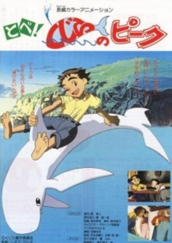

**Studio:** Urban Product &nbsp;|&nbsp; **Director:** Kôji Morimoto &nbsp;|&nbsp; **Aired/Released:** May 22 &nbsp;|&nbsp; **Genres:** Drama, Adventure

> The story of an albino whale used in a circus, and the efforts of young children to free him from captivity.
>
> _Synopsis source: Kitsu_

[Kitsu](https://kitsu.io/anime/tobe-kujira-no-peek)

---

### Fushigi no Umi no Nadia: Gekijōyō Original-ban ( Nadia: The Secret of Blue Water – The Motion Picture ) (Nadia: The Secret of Blue Water - The Motion Picture)

**Studio:** Gainax ; Group TAC &nbsp;|&nbsp; **Director:** Shō Aono &nbsp;|&nbsp; **Aired/Released:** June 29 &nbsp;|&nbsp; **Genres:** Romance, Science Fiction, Action, Historical, Adventure, Mystery

> Three years after the defeat of Gargoyle and Neo-Atlantis, a new threat has surfaced bent on bringing the world under his control. Geiger, using advanced robot technology, is attempting to begin a world war, and take control of the devistated world after the destruction has stopped. Once again, Nadia and Jean must fight to save the world, only this time from itself.
>
> _Synopsis source: Kitsu_

[Kitsu](https://kitsu.io/anime/fushigi-no-umi-no-nadia-original-movie)

---

### Doragon Bōru Zetto: Tobikkiri no Saikyō tai Saikyō ( Dragon Ball Z: Cooler's Revenge )

**Studio:** Toei Animation &nbsp;|&nbsp; **Director:** Mitsuo Hashimoto &nbsp;|&nbsp; **Aired/Released:** July 20

---

### Doragon Kuesuto: Dai no Daibouken ( Dragon Quest: The Adventures of Dai )

**Studio:** Toei Animation &nbsp;|&nbsp; **Director:** Nobutaka Nishizawa &nbsp;|&nbsp; **Aired/Released:** July 20

---

### Gamba to Kawauso no Bouken ( The Adventures of Gamba and Otters )

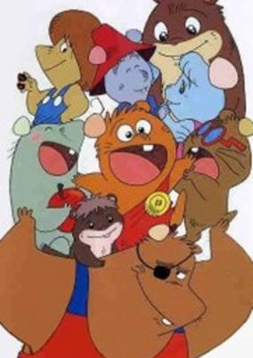

**Studio:** Tokyo Movie Shinsha &nbsp;|&nbsp; **Director:** Shunji Ōga &nbsp;|&nbsp; **Aired/Released:** July 20 &nbsp;|&nbsp; **Genres:** Fantasy, Adventure, Kids

> The final chapter of the Gamba saga, released in theatres 15 years after the original TV series.
>
> _Synopsis source: Kitsu_

[Kitsu](https://kitsu.io/anime/gamba-to-kawauso-no-bouken)

---

### Hello Kitty no Mahō no Mori no Ohime-sama ( Hello Kitty's Princess of the Magic Forest ) (Hello Kitty in The Sleeping Princess)

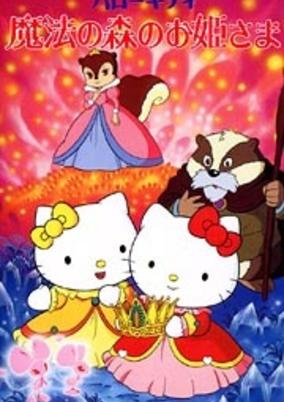

**Studio:** Sanrio; Grouper Productions; Aubec &nbsp;|&nbsp; **Director:** Norio Kashima &nbsp;|&nbsp; **Aired/Released:** July 20 &nbsp;|&nbsp; **Genres:** Magic, Fantasy, Kids, Anthropomorphism

> Kitty and Mimmy have to save a kingdom and break a magical spell on a sleeping princess.
>
> _Synopsis source: Kitsu_

[Kitsu](https://kitsu.io/anime/hello-kitty-no-mahou-no-mori-no-ohime-sama)

---

### Kero Kero Keroppi no Sanjūshi ( Kero Kero Keroppi's Three Musketeers )

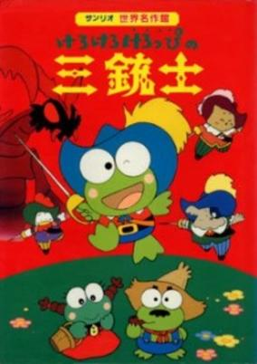

**Studio:** Sanrio; Grouper Productions &nbsp;|&nbsp; **Director:** Masami Hata &nbsp;|&nbsp; **Aired/Released:** July 20 &nbsp;|&nbsp; **Genres:** Fantasy, Kids, Anthropomorphism

> Keroppi version of The Three Musketeers.
>
> _Synopsis source: Kitsu_

[Kitsu](https://kitsu.io/anime/kero-kero-keroppi-no-sanjuushi)

---

### Majikaru Tarurūto-kun: Moero! Yuujou no Mahou Taisen ( Magical Taruruto-kun: Burn! Magic War of Friendship )

**Studio:** Toei Animation &nbsp;|&nbsp; **Director:** Hiroyuki Kakudou &nbsp;|&nbsp; **Aired/Released:** July 20 &nbsp;|&nbsp; **Genres:** Contemporary Fantasy, Japan, Earth, Asia, Super Deformed, Magic, Slapstick, Present, Fantasy, Adventure, Comedy, Ecchi, School Life

> Magical Taruruto-kun is a magical boy, fighting, and comedy TV show based on the manga of the same name by Tatsuya Egawa which ran in Weekly Shounen Jump.
>
> _Synopsis source: Kitsu_

[Wikipedia](https://en.wikipedia.org/wiki/Magical_Taruruto#Anime) · [Kitsu](https://kitsu.io/anime/magical-taruruuto-kun)

---

### Omoide Poro Poro ( Only Yesterday ) (Only Yesterday)

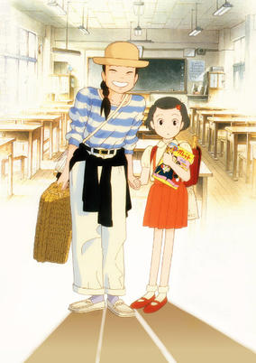

**Studio:** Studio Ghibli &nbsp;|&nbsp; **Director:** Isao Takahata &nbsp;|&nbsp; **Aired/Released:** July 20 &nbsp;|&nbsp; **Genres:** Japan, Asia, Earth, Slice of Life, Countryside, Romance

> Taeko Okajima is a typical "office lady" in a big company in a big city. When she takes a sabbatical to the countryside in Yamagata Prefecture, the hometown of her brother-in-law, the journey recalls her memory of her 5th-grade year. During her stay in Yamagata, she works hard and happily as a farmer and is surrounded by friendly relatives and villagers, bringing up more memories. Their hospitality makes her reconsider her choice of life.
>
> _Synopsis source: Kitsu_

[Wikipedia](https://en.wikipedia.org/wiki/Only_Yesterday_(1991_film)) · [Kitsu](https://kitsu.io/anime/only-yesterday)

---

### Soreike! Anpanman: Tobe! Tobe! Chibigon ( Let's Go! Anpanman: Fly! Fly! Chibigon )

**Studio:** Tokyo Movie Shinsha &nbsp;|&nbsp; **Director:** Akinori Nagaoka &nbsp;|&nbsp; **Aired/Released:** July 20

[Wikipedia](https://en.wikipedia.org/wiki/Anpanman#Full-length_movies)

---

### Taibo no Ryugu Star Adventure ( Taibo's Ryugu Star Adventure )

**Studio:** Sanrio; Grouper Productions &nbsp;|&nbsp; **Director:** Mikasa Mutsuki &nbsp;|&nbsp; **Aired/Released:** July 20

---

### Silent Möbius: The Motion Picture

**Studio:** AIC &nbsp;|&nbsp; **Director:** Kazuo Tomizawa &nbsp;|&nbsp; **Aired/Released:** August 17

[Wikipedia](https://en.wikipedia.org/wiki/Silent_M%C3%B6bius#Films)

---

### Urusei Yatsura: Itsudatte Mai Dārin ( Urusei Yatsura: Always My Darling ) (Urusei Yatsura Movie 6: Always My Darling)

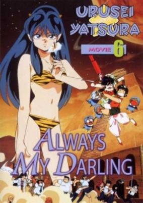

**Studio:** Madhouse &nbsp;|&nbsp; **Director:** Katsuhisa Yamada &nbsp;|&nbsp; **Aired/Released:** August 18 &nbsp;|&nbsp; **Genres:** Romance, Science Fiction, Japan, Comedy, Love Polygon, High School, Humanoid Alien, Alien, Slapstick, Action, Adventure

> Lupica, another one of the legion of space princesses that all seem to have found out about Earth in some tour book, appears and abducts Ataru! But Lupica isn't after Ataru for his great looks or charming personality (because he doesn't have either). Lupica's goal is the greatest love potion in the galaxy, which she intends to use to induce her sweetheart to tie the knot. To get it, she needs the possessor of the greatest lust in the universe...
>
> _Synopsis source: Kitsu_

[Kitsu](https://kitsu.io/anime/urusei-yatsura-movie-6-itsudatte-my-darling)

---

### Roujin Z

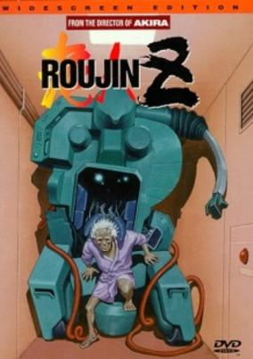

**Studio:** A.P.P.P. &nbsp;|&nbsp; **Director:** Hiroyuki Kitakubo &nbsp;|&nbsp; **Aired/Released:** September 14 &nbsp;|&nbsp; **Genres:** Transforming Craft, Science Fiction, Mecha, Earth, Japan, Piloted Robot, Asia, Comedy, Present

> The Z Project was intended to give the new generation a break from caring for the old. The original intenion was to create a machine to care for them without any intervention. At first glance, it looked like an excellent plan, and many of the younger generation approved of its application. But when old Mr. Takazawa become the test subject for the Z-001 machine, Haruko questioned both the tactics of the hospital and the moral implications of the machine. This is just the beginning, as Haruko has not just the hospital, but the odds against her. But then, she discovers an odd quirk about the machine: it uses a biochip, and it eventually acquires a mind of its own!
>
> _Synopsis source: Kitsu_

[Wikipedia](https://en.wikipedia.org/wiki/Roujin_Z) · [Kitsu](https://kitsu.io/anime/roujin-z)

---

### Ranma Nibunnoichi: Chūgoku Nekonron Daikessen! Okite Yaburi no Gekitō Hen! ( Ranma ½: Big Trouble in Nekonron, China )

**Studio:** Studio Deen &nbsp;|&nbsp; **Director:** Shuji Iuchi &nbsp;|&nbsp; **Aired/Released:** November 2

[Wikipedia](https://en.wikipedia.org/wiki/List_of_Ranma_%C2%BD_episodes#Films_(1991–1994))

---

## OVA releases

### Legend of the Phantom Heroes ( Phantom Yūsha Densetsu )

**Studio:** Magic Bus &nbsp;|&nbsp; **Episodes:** 1 &nbsp;|&nbsp; **Director:** Tetsu Dezaki &nbsp;|&nbsp; **Aired/Released:** January 23

---

### Vampire Wars ( Vanpaiyā Sensō ) (Vampire Wars)

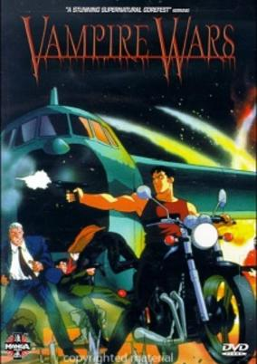

**Studio:** Toei Animation &nbsp;|&nbsp; **Episodes:** 1 &nbsp;|&nbsp; **Director:** Kazuhisa Takenouchi &nbsp;|&nbsp; **Aired/Released:** January 25 &nbsp;|&nbsp; **Genres:** Earth, France, Gunfights, Europe, Vampire, Horror, Humanoid Alien, Alien, Violence, Present, Super Power

> The rural American west is the setting for this OVA, in which a bizarre and brutal attack on a NASA base in Arizona attracts the attention of a French secret service agent, Monsieur Lassar, when a dead CIA agent is found floating on the Seine in Paris. Lassar is convinced that these two events are related, and sets out to prove it. His investigation leads him to film star Lamia Vindaw and a vampire cult that may be far more vicious and dangerous than its eccentric exterior makes it seem.
>
> _Synopsis source: Kitsu_

[Wikipedia](https://en.wikipedia.org/wiki/Vampire_Wars) · [Kitsu](https://kitsu.io/anime/vampire-sensou)

---

### Shakotan★Boogie

**Studio:** Studio Pierrot &nbsp;|&nbsp; **Episodes:** 4 &nbsp;|&nbsp; **Director:** By episode: Hirotaka Kinoshita (1–2) Shinichi Tokairin (3–4) &nbsp;|&nbsp; **Aired/Released:** February 6 – July 17, 1992

[Wikipedia](https://en.wikipedia.org/wiki/Shakotan_Boogie)

---

### Wizardry

**Studio:** Tokyo Movie Shinsha &nbsp;|&nbsp; **Episodes:** 1 &nbsp;|&nbsp; **Director:** Toshiya Shinohara &nbsp;|&nbsp; **Aired/Released:** February 21

[Wikipedia](https://en.wikipedia.org/wiki/Wizardry_(video_game_series))

---

### Psychic Wars ( Sojuu Senshi – Saikikku Wōzu ) (Psychic Wars)

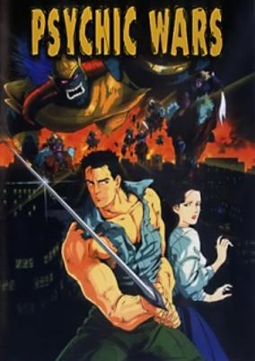

**Studio:** Toei Animation &nbsp;|&nbsp; **Episodes:** 1 &nbsp;|&nbsp; **Director:** Tetsuo Imazawa &nbsp;|&nbsp; **Aired/Released:** February 22 &nbsp;|&nbsp; **Genres:** Earth, Fantasy, Japan, Action, Asia, Horror, Violence, Present, Demon, Super Power

> Ukyo Rettsu, a surgeon, treats a mysterous old woman for a mysterious "cancer." The growth turns out to be a messenger from the ancient past of Japan heralding a demonic invasion of the Earth. Ukyo must go back in time and fight the race of ancient demons.
>
> _Synopsis source: Kitsu_

[Wikipedia](https://en.wikipedia.org/wiki/Psychic_Wars) · [Kitsu](https://kitsu.io/anime/psychic-wars)

---

### Samuraider: Nazo no Tenkousei ( Samuraider: The Mysterious Transfer Student )

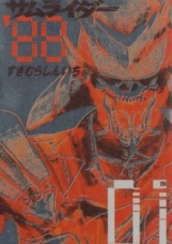

**Studio:** MTV &nbsp;|&nbsp; **Episodes:** 1 &nbsp;|&nbsp; **Director:** Hideaki Oba &nbsp;|&nbsp; **Aired/Released:** February 22 &nbsp;|&nbsp; **Genres:** Action, Delinquent, Samurai

> In a weak combination of samurai movie and Bomber Bikers of Shonan, Tokyo street-punk Masao buys a treas-ured FZR "katana" motorcycle and becomes a knight of the road, attacking criminals with a genuine katana sword. Based on the manga by Shinichi Sugimura in Young Magazine.
>
> _Synopsis source: Kitsu_

[Kitsu](https://kitsu.io/anime/samuraider)

---

### The New Star of the Fallen Mud: Legend of the Incubus ( Shin David no Hoshi: Inma Densetsu )

**Studio:** Studio Junio &nbsp;|&nbsp; **Episodes:** 1 &nbsp;|&nbsp; **Director:** Yōichirō Shimatani &nbsp;|&nbsp; **Aired/Released:** March 8

---

### Burn Up!

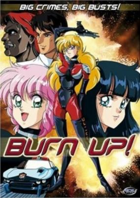

**Studio:** AIC &nbsp;|&nbsp; **Episodes:** 1 &nbsp;|&nbsp; **Director:** Yasunori Ide &nbsp;|&nbsp; **Aired/Released:** March 21 &nbsp;|&nbsp; **Genres:** Ecchi, Japan, Action, Special Squads, Gunfights, Law And Order, Violence, Cops, Science Fiction, Comedy

> To the unsuspecting eye Maki, Reimi and Yuka may not look like ace crime fighters, which might explain why they're stuck on traffic patrol instead of more "exciting" police duties. All that changes when Yuka gets herself kidnapped by a white slave organization run by a politically connected businessman who's got the rest of the police cowed. Now it's up to Maki and Reimi to don skin-tight battle armor, liberate a tank, and make sure that a certain slaver learns that when you play with fire, you're going to get your ass burned!
>
> _Synopsis source: Kitsu_

[Wikipedia](https://en.wikipedia.org/wiki/Burn_Up!) · [Kitsu](https://kitsu.io/anime/burn-up)

---

### Dr. Typhoon

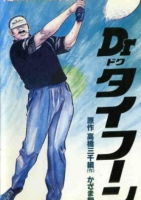

**Episodes:** 1 &nbsp;|&nbsp; **Director:** Eiji Kazama Michitsuna Takahashi &nbsp;|&nbsp; **Aired/Released:** April 3 &nbsp;|&nbsp; **Genres:** Mafia, Sports

> Based on a seinen manga written by Takahashi Michitsuna and illustrated by Kazama Eiji, serialised in Weekly Manga Action.
>
> _Synopsis source: Kitsu_

[Kitsu](https://kitsu.io/anime/dr-typhoon)

---

### Capricorn

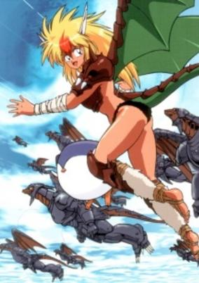

**Studio:** Aubec &nbsp;|&nbsp; **Episodes:** 1 &nbsp;|&nbsp; **Director:** Takashi Imanishi &nbsp;|&nbsp; **Aired/Released:** April 5 &nbsp;|&nbsp; **Genres:** Fantasy, Science Fiction, Fantasy World, Comedy, Dragon, Present, Adventure

> In the blink of an eye, high school student Taku Shimamura finds himself transported to the bizarre world of Slaffleaze, where intelligent creatures govern and the ruling class, led by the villainous Zolba, is plotting the invasion of the world they know as Capricorn, the Earth. Joining together with the oppressed Slaffleaze peasants, Taku must find a way to stop Zolba`s dark forces before the way to the unsuspecting Earth is opened. In order to do so, he must first gain the love and trust of the last of the Yappie, the ancestral guardians of Slaffeaze. This is a task that will take more than a little courage and daring, for the last Yappie is not just a cute young female, she`s also a dragon.
>
> _Synopsis source: Kitsu_

[Kitsu](https://kitsu.io/anime/capricorn)

---

### Okama Report

**Episodes:** 3 &nbsp;|&nbsp; **Director:** Hideo Yamamoto &nbsp;|&nbsp; **Aired/Released:** April 12 – February 6, 1992 &nbsp;|&nbsp; **Genres:** Romance, Comedy, Shounen Ai

> Okama is a man who has some problems. First off, his name means 'gay' in Japanese. Next, he has the hots for himself dressed as a girl. Finally, he ends up working at a transvestite bar where he has befriended a girl named Miki. This is not an easy matter to solve, because she only knows him as his female counterpart named Catherine. So how is a guy dressed as a girl supposed to come out to a girl as a heterosexual male? To make matters worse, she has a boyfriend who is trying everything in the book to get with her. Enter the exciting world of Okama Hakusho where love comes in many different flavors!
>
> _Synopsis source: Kitsu_

[Wikipedia](https://en.wikipedia.org/wiki/Okama_Report#Original_video_animation_(OVA)) · [Kitsu](https://kitsu.io/anime/okama-report)

---

### Shizukanaru Don – Yakuza Side Story

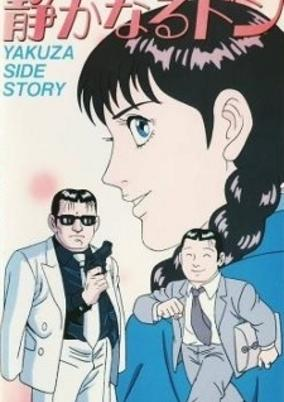

**Studio:** Tokyo Movie Shinsha &nbsp;|&nbsp; **Episodes:** 1 &nbsp;|&nbsp; **Director:** Tatsuo Nitta &nbsp;|&nbsp; **Aired/Released:** April 12 &nbsp;|&nbsp; **Genres:** Mafia, Action, Comedy

> This manga depicts the life of Shizuya Kondou, a man who designs underwear by day and is "don" of a gang at night.
>
> _Synopsis source: Kitsu_

[Wikipedia](https://en.wikipedia.org/wiki/Shizukanaru_Don_%E2%80%93_Yakuza_Side_Story) · [Kitsu](https://kitsu.io/anime/shizukanaru-don-yakuza-side-story)

---

### Sukeban Deka (Delinquent Detective)

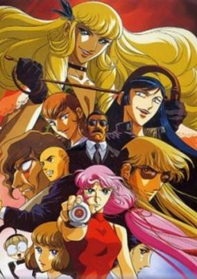

**Studio:** SIDO Limited &nbsp;|&nbsp; **Episodes:** 2 &nbsp;|&nbsp; **Director:** Hirota Takeshi &nbsp;|&nbsp; **Aired/Released:** April 21 – July 21 &nbsp;|&nbsp; **Genres:** Japan, Earth, Action, Asia, Thriller, Detective, Crime, School Life, Violence, Present, Cops, Shoujo, Delinquent, Drama

> Having spent time at a juvenile corrections facility, teenage delinquent Saki Asamiya is given a chance to redeem herself and delay her mother's possible death sentence by working as an undercover cop. Armed with nothing but a special yo-yo, Saki's assignment is to return to her high school and investigate on the corruption and mysterious deaths among the students. But in order to find the answers to the condition of her school, she must confront the wealthy and powerful Mizuchi sisters, who moved in and have taken control after her previous expulsion.
>
> _Synopsis source: Kitsu_

[Wikipedia](https://en.wikipedia.org/wiki/Sukeban_Deka) · [Kitsu](https://kitsu.io/anime/sukeban-deka)

---

### Sweet Spot

**Studio:** Group TAC &nbsp;|&nbsp; **Episodes:** 1 &nbsp;|&nbsp; **Director:** Hideaki Oba &nbsp;|&nbsp; **Aired/Released:** April 21 &nbsp;|&nbsp; **Genres:** Comedy

> These "amusing" adventures of a golf-crazy Office Lady were based on a manga from Weekly Spa! magazine by Yutsuko Chudoji.
>
> _Synopsis source: Kitsu_

[Wikipedia](https://en.wikipedia.org/wiki/Sweet_Spot_(manga)) · [Kitsu](https://kitsu.io/anime/sweet-spot)

---

### Honoo no Tenkousei

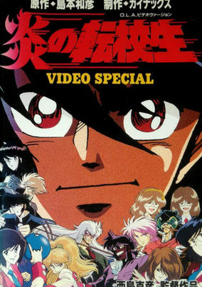

**Studio:** Gainax &nbsp;|&nbsp; **Episodes:** 2 &nbsp;|&nbsp; **Director:** Katsuhiko Nishijima &nbsp;|&nbsp; **Aired/Released:** May 21 &nbsp;|&nbsp; **Genres:** Boxing, Japan, Action, Asia, Earth, Combat, Sports, Parody, Comedy, Slapstick, Stereotypes, Present, Martial Arts, School Life

> Transfer student Takisawa Noboru quickly learns that all disputes at his new school are settled in the boxing ring. Now he finds himself in a series of showdowns with the local top dog, Ibuki Saburo, for the love and respect of the beautiful Yukari.
>
> _Synopsis source: Kitsu_

[Wikipedia](https://en.wikipedia.org/wiki/Hon%C5%8D_no_Tenk%C5%8Dsei) · [Kitsu](https://kitsu.io/anime/honoo-no-tenkousei)

---

### Maison Ikkoku: Bangai-hen - Ikkokujima Nanpa Shimatsuki

**Studio:** Magic Bus &nbsp;|&nbsp; **Episodes:** 1 &nbsp;|&nbsp; **Director:** Setsuko Shibuichi &nbsp;|&nbsp; **Aired/Released:** May 21

[Wikipedia](https://en.wikipedia.org/wiki/Maison_Ikkoku)

---

### Abashiri Ikka

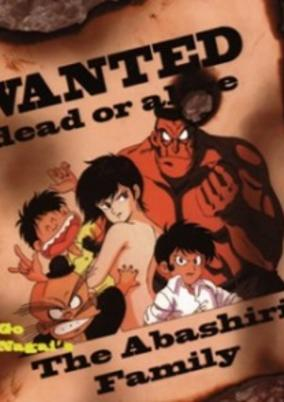

**Studio:** Studio Pierrot ; Tokyo Kids &nbsp;|&nbsp; **Episodes:** 4 &nbsp;|&nbsp; **Director:** Takashi Watanabe &nbsp;|&nbsp; **Aired/Released:** May 21 – November 21 &nbsp;|&nbsp; **Genres:** Ecchi, Mafia, Absurdist Humour, Super Deformed, Crime, Action, Japan, Comedy, Violence

> The Abashiri family is one of the most notorious criminal gangs ever. Papa Abashiri decides that it's about time his little girl is raised more appropriately, as a young lady and not as a member of a deadly gang. He decides to send his dear daughter Kukunosuke to an elite boarding school. The problem is this school doesn't have any intention of graduating their students. Crazed faculty members with homicidal and perverted tendencies, violent and unfriendly classmates, all of them welcome Kukunosuke to her new home. Pretty soon, it's an all-out teacher vs. students war. Will she be able to finish school before school finishes her?
>
> _Synopsis source: Kitsu_

[Wikipedia](https://en.wikipedia.org/wiki/The_Abashiri_Family#OVA) · [Kitsu](https://kitsu.io/anime/abashiri-ikka)

---

### Akai Hayate

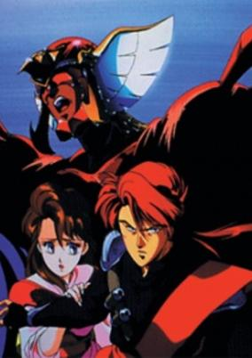

**Studio:** Studio Pierrot &nbsp;|&nbsp; **Episodes:** 4 &nbsp;|&nbsp; **Director:** Osamu Tsuruyama &nbsp;|&nbsp; **Aired/Released:** May 21 – November 21 &nbsp;|&nbsp; **Genres:** Action, Martial Arts, Crime, Violence, Super Power

> Japan is secretly controlled by a tyrannical group of ninjas called the Shinogara. Their finest assassin is a man named Hayate Kanuma, whose father leads the Shinogara. Hayate, however, knows that the secret society's control over Japan is wrong. Sacrificing his own safety, Hayate kills his father. Now he's on the run, safe almost nowhere from his vengeful former comrades except perhaps for the one hiding place he decides upon: his sister. After possibly being fatally wounded, Hayate is able to transfer his soul into his sister's body, temporarily sharing it with her. His sister, Shiori, can awaken Hayate and call upon his ninja abilities when the Shinogara are close at hand but each time she does so, a little more of her true self is lost. This arrangement can't possibly go on forever, so how will Hayate finally defeat the Shinogara?
>
> _Synopsis source: Kitsu_

[Kitsu](https://kitsu.io/anime/akai-hayate)

---

### Eguchi Hisashi no Kotobuki Goro Show

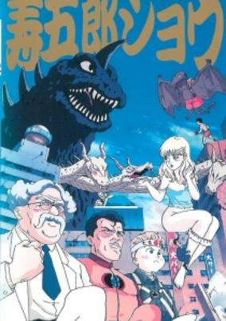

**Studio:** Studio Pierrot ; Kyoto Animation &nbsp;|&nbsp; **Episodes:** 4 &nbsp;|&nbsp; **Director:** By episode: Masakatsu Iijima (1-3) Osamu Nabeshima (4) &nbsp;|&nbsp; **Aired/Released:** May 21 – November 21 &nbsp;|&nbsp; **Genres:** Comedy, Parody, Ecchi

> Based on the gag manga by Hisashi Eguchi. Originally released as a feature part of Studio Pierrot's video magazine show Anime V Comic Rentaman (アニメ・V・コミック レンタマン) along with Abashiri Ikka, Yumemakura Baku Twilight Gekijou and Akai Hayate.
>
> _Synopsis source: Kitsu_

[Kitsu](https://kitsu.io/anime/eguchi-hisashi-no-kotobuki-gorou-show)

---

### Yumemakura Baku Twilight Gekijō

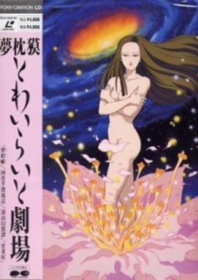

**Studio:** Studio Pierrot ; D.A.S.T Corporation &nbsp;|&nbsp; **Episodes:** 4 &nbsp;|&nbsp; **Director:** By episode: Saeko Aoki (1-2) Shinya Ohira (3) Shinji Hashimoto (4) &nbsp;|&nbsp; **Aired/Released:** May 21 – November 21 &nbsp;|&nbsp; **Genres:** Horror, Psychological

> Originally released as a feature part of Studio Pierrot's video magazine show Anime V Comic Rentaman (アニメ・V・コミック レンタマン) along with Abashiri Ikka, Eguchi Hisashi no Kotobuki Gorou Show and Akai Hayate.
>
> _Synopsis source: Kitsu_

[Kitsu](https://kitsu.io/anime/yumemakura-baku-twilight-gekijou)

---

### Mobile Suit Gundam 0083: Stardust Memory

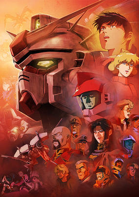

**Studio:** Sunrise &nbsp;|&nbsp; **Episodes:** 13 &nbsp;|&nbsp; **Director:** Mitsuko Kase (1–7) Takashi Imanishi (8–13) &nbsp;|&nbsp; **Aired/Released:** May 23 – September 24, 1992 &nbsp;|&nbsp; **Genres:** Romance, Space Travel, Science Fiction, Mecha, Action, Piloted Robot, Netorare, War, Future, Plot Continuity, Military, Space, Adventure

> U.C. 0083. Three years after the end of the catastrophic One Year War, peace on Earth and the colonies is shattered by the presence of the Delaz Fleet, a rogue Zeon military group loyal to the ideals of the late dictator Gihren Zabi. Delaz Fleet's ace pilot Anavel Gato, once hailed as "The Nightmare of Solomon," infiltrates the Federation's Torrington base in Australia and steals the nuclear-armed Gundam GP02A "Physalis" prototype. Rookie pilot Kou Uraki—with the aid of Anaheim Electronics engineer Nina Purpleton and the crew of the carrier Albion—pilots the Gundam GP01 "Zephyranthes" prototype in an attempt to recover the stolen Gundam unit and prevent another war from breaking out.
>
> _Synopsis source: Kitsu_

[Kitsu](https://kitsu.io/anime/mobile-suit-gundam-0083-stardust-memory)

---

### Bubblegum Crash

**Studio:** Artmic &nbsp;|&nbsp; **Episodes:** 3 &nbsp;|&nbsp; **Director:** By episode: Hiroshi Ishiodori (1–3) Hiroyuki Fukushima (2) &nbsp;|&nbsp; **Aired/Released:** May 25 – December 21

[Wikipedia](https://en.wikipedia.org/wiki/Bubblegum_Crisis#Bubblegum_Crash)

---

### RG Veda

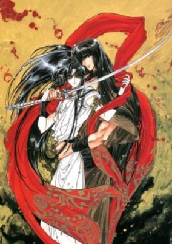

**Studio:** By episode: Usagi Ya (1) Studio Signal (2) &nbsp;|&nbsp; **Episodes:** 2 &nbsp;|&nbsp; **Director:** By episode: Hiroyuki Ebata (1) Takamasa Ikegami (2) &nbsp;|&nbsp; **Aired/Released:** June 1–21, 1992 &nbsp;|&nbsp; **Genres:** Fantasy, Fantasy World, Action, Magic, Adventure, Shoujo

> At the dawn of time, the gods ruled the universe under the leadership of the mighty Tentei. But suddenly, the ferocious general, Taishakuten, appears, and destroys Tentei. Taishakuten declares that a new age has begun, and all who oppose him will die horribly. But legend says that a shimmering six-pointed star will rise into the heavens and restore the world to a golden age. The six points are six warriors, each with the power to move the stars and the hearts of all people...
>
> _Synopsis source: Kitsu_

[Wikipedia](https://en.wikipedia.org/wiki/RG_Veda) · [Kitsu](https://kitsu.io/anime/rg-veda)

---

### Slow Step

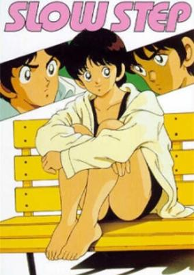

**Studio:** Youmex &nbsp;|&nbsp; **Episodes:** 5 &nbsp;|&nbsp; **Director:** Kunihiko Yuyama &nbsp;|&nbsp; **Aired/Released:** June 1 – November 1 &nbsp;|&nbsp; **Genres:** Romance, Boxing, Japan, Asia, Earth, Combat, Sports, Comedy, Love Polygon, High School, Baseball, School Life, Slice of Life

> Based on the Adachi manga of the same name. The story revolves around a romantic triangle formed by the girl Minatsu Nakazato, a young student and softball player; Shu Akiba, a schoolmate; and Naoto Kadomatsu, an up-and-coming boxer. In reality the three-way relationship is more like three-and-a-half, considering that Naoto is in love with Maria... actually Minatsu herself, who'd once disguised herself to escape some evildoers.
>
> _Synopsis source: Kitsu_

[Wikipedia](https://en.wikipedia.org/wiki/Slow_Step) · [Kitsu](https://kitsu.io/anime/slow-step)

---

### Yami no Shihosha Judge

**Studio:** Animate Film ; J.C.Staff &nbsp;|&nbsp; **Episodes:** 1 &nbsp;|&nbsp; **Director:** Hiroshi Negishi &nbsp;|&nbsp; **Aired/Released:** June 15

[Wikipedia](https://en.wikipedia.org/wiki/Judge_(manga))

---

### Souryuuden (Legend of the Dragon Kings)

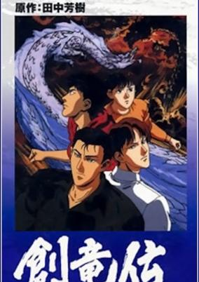

**Studio:** Kitty Film Mitaka Studio &nbsp;|&nbsp; **Episodes:** 12 &nbsp;|&nbsp; **Director:** Osamu Dezaki &nbsp;|&nbsp; **Aired/Released:** June 25 – March 10, 1993 &nbsp;|&nbsp; **Genres:** Fantasy, Action, Dragon, Crime, Plot Continuity, Present, Super Power, Mystery

> The four Ryudo brothers hold an ancient secret - they are descended from the dragons. They have the speed, strength and power of their legendary ancestors - and they're getting stronger. But when pushed to the limit, they become the terrifying, uncontrollable dragons of mythology. These powers have attracted the attention of some powerful enemies - shadowy organizations with unlimited resources and weapons who will stop at nothing to control the brothers.
>
> _Synopsis source: Kitsu_

[Kitsu](https://kitsu.io/anime/sohryuden-legend-of-the-dragon-kings)

---

### The Gakuen Chōjo-tai ( The Academy Supergirl Team ) (The Chohjotai)

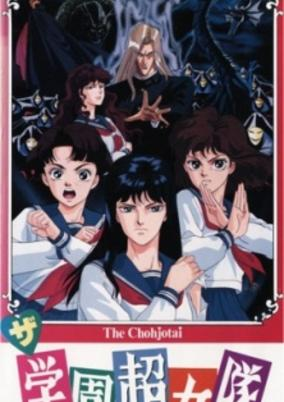

**Studio:** Magic Bus &nbsp;|&nbsp; **Episodes:** 1 &nbsp;|&nbsp; **Director:** Tetsu Dezaki &nbsp;|&nbsp; **Aired/Released:** June 27 &nbsp;|&nbsp; **Genres:** Japan, Action, Asia, Contemporary Fantasy, Earth, School Life, Present, Super Power, Demon

> Anime based on a 1986 novel.
>
> _Synopsis source: Kitsu_

[Kitsu](https://kitsu.io/anime/the-gakuen-choujotai)

---

### Shiawasette Naani ( What is Happiness? )

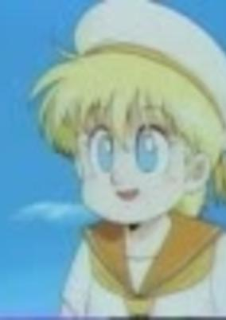

**Studio:** Kyoto Animation ; Gakken &nbsp;|&nbsp; **Episodes:** 1 &nbsp;|&nbsp; **Director:** Tatsuya Ishihara &nbsp;|&nbsp; **Aired/Released:** July 9 &nbsp;|&nbsp; **Genres:** Fantasy, Japan, Angel, Present

> Based on a series of books authored by Ryuho Ookawa. Alto is going home from school, when he finds a girl who calls herself an angel.
>
> _Synopsis source: Kitsu_

[Kitsu](https://kitsu.io/anime/shiawasette-naani)

---

### Kyofu Shinbun

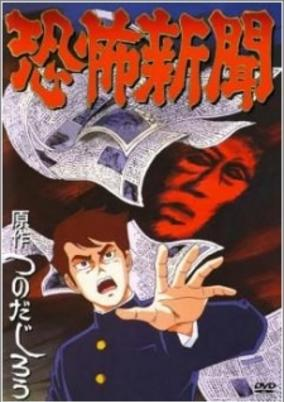

**Studio:** Studio Pierrot &nbsp;|&nbsp; **Episodes:** 2 &nbsp;|&nbsp; **Director:** Takashi Anno &nbsp;|&nbsp; **Aired/Released:** July 21 – September 21 &nbsp;|&nbsp; **Genres:** Horror, Supernatural, Ghost, Shounen

> For reasons unknown to him, Rei receives the Kyoufu Shinbun every morning, a newspaper which foresees deaths and catastrophes... Based on Tsunoda Jirou's classic horror manga "Kyoufu Shinbun", serialized in Weekly Shounen Champion.
>
> _Synopsis source: Kitsu_

[Kitsu](https://kitsu.io/anime/kyoufu-shinbun)

---

### 3×3 Eyes (3x3 Eyes)

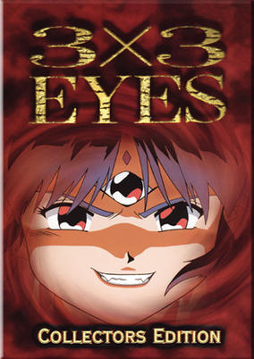

**Studio:** Toei Animation &nbsp;|&nbsp; **Episodes:** 4 &nbsp;|&nbsp; **Director:** Daisuke Nishio &nbsp;|&nbsp; **Aired/Released:** July 25 – March 19, 1992 &nbsp;|&nbsp; **Genres:** Fantasy, Action, Horror, Violence, Present, Demon, Romance

> 3X3 Eyes is the story of a young man named Yakumo Fuuji, who through a strange series of events becomes the immortal slave of the last of a race of 3 Eyed demons. The demon absorbs his soul to save his life, making him immortal in the process. Now, he begins a journey with the female demon in an attempt to find a way of becoming human. Of course, there are many complications along the way, not the least of which being that the demon is a female with a split personality, one achingly cute and the other being no-nonsense destructive power, and the romances that develop between.
>
> _Synopsis source: Kitsu_

[Wikipedia](https://en.wikipedia.org/wiki/3%C3%973_Eyes) · [Kitsu](https://kitsu.io/anime/three-x3-eyes)

---

### ASaTTe DaNCE ( Dance Till Tomorrow ) (Dance Till Tomorrow)

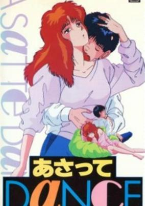

**Studio:** Knack Productions &nbsp;|&nbsp; **Episodes:** 1 &nbsp;|&nbsp; **Director:** By episode: Teruo Kogure (1) Masamune Ochiai (2) &nbsp;|&nbsp; **Aired/Released:** July 25 – October 21 &nbsp;|&nbsp; **Genres:** Romance, Japan, Earth, Asia, Comedy, Ecchi

> Suekichi goes to university and has, as any Japanese university student, time for hobbies. Things change when he attends his great grandfather's funeral and wakes the next morning in his room with a very sexy girl besides him. His great grandfather has left him a *little* inheritance but there are some conditions. Meanwhile, sexy Aya keeps hanging around and refuses to go away. The beginning of a strange relationship which revolves around suspicions and desire.
>
> _Synopsis source: Kitsu_

[Kitsu](https://kitsu.io/anime/asatte-dance)

---

### Hoshikuzu Paradise ( Stardust Paradise )

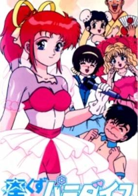

**Studio:** Pastel; OB Planning &nbsp;|&nbsp; **Episodes:** 1 &nbsp;|&nbsp; **Director:** Masato Namiki &nbsp;|&nbsp; **Aired/Released:** July 25 &nbsp;|&nbsp; **Genres:** Ecchi, Comedy, Performance, Idol, Romance

> After his mother passed away, high school student Hiroshi Houshou's long lost father suddenly reappears, along with two new family members: a new mother who is also a famous actress, and her daughter, the popular and beautiful idol singer Rina Yuuki.
>
> _Synopsis source: Kitsu_

[Kitsu](https://kitsu.io/anime/hoshikuzu-paradise)

---

### Yukan Club

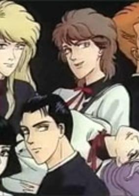

**Studio:** Madhouse &nbsp;|&nbsp; **Episodes:** 2 &nbsp;|&nbsp; **Director:** Setsuko Shibuichi &nbsp;|&nbsp; **Aired/Released:** July 25 – December 14 &nbsp;|&nbsp; **Genres:** Comedy, School Life, Mystery

> St. President school is one of the most wealthy schools around. Everybody in that school respects the Yukan club, the most popular and richest group in the school. This includes Shouchikubai Miroku, Kenbishi Yuuri, Kikumasamune Seishirou, Hakushika Noriko and Kizakura Karen. They go through dangerous adventures to save their school, and of course, just to kill their spare time.
>
> _Synopsis source: Kitsu_

[Kitsu](https://kitsu.io/anime/yuukan-club)

---

### Kekkou Kamen

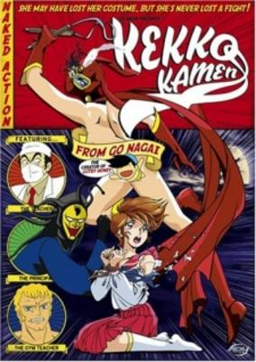

**Studio:** Studio Signal &nbsp;|&nbsp; **Episodes:** 4 &nbsp;|&nbsp; **Director:** By episode: Nobuhiro Kondo (1) Shunichi Tokunaga (2) Kinji Yoshimoto (3–4) &nbsp;|&nbsp; **Aired/Released:** August 1 – March 1, 1992 &nbsp;|&nbsp; **Genres:** Ecchi, Earth, Japan, Asia, Comedy, Absurdist Humour, Present

> At the academy Miami Takashi attends, higher education has sunk to the lowest levels of depravity, with armed hall monitors, teachers who wear masks to hide their identities and special detention sessions in a torture chamber beneath the gym! It's a curriculum designed to chew up sweet young things, and poor Miami's been voted "Least Likely to Survive" in her class! Is there no hope? Can no one save her? Enter Kekko Kamen, the most outrageous superheroine ever! Clad in a red mask, red boots and nothing else, she is the supreme protector of innocents like Miami. Armed with her trusty nunchaku and a body that just won't quit, she'll make chopped pork out of the swine who run this school from hell! But who is she really? The only one who knows for sure is creator Go Nagai and he's not giving anything away... except lots of free peeks at Kekko Kamen's magnificent physique!
>
> _Synopsis source: Kitsu_

[Wikipedia](https://en.wikipedia.org/wiki/Kekko_Kamen) · [Kitsu](https://kitsu.io/anime/kekko-kamen)

---

### Ningyo no Mori ( Mermaid's Forest )

**Studio:** Studio Pierrot ; Victor Entertainment &nbsp;|&nbsp; **Episodes:** 1 &nbsp;|&nbsp; **Director:** Takaya Mizutani &nbsp;|&nbsp; **Aired/Released:** August 16

[Wikipedia](https://en.wikipedia.org/wiki/Mermaid%27s_Forest)

---

### Arslan Senki ( The Heroic Legend of Arslan )

**Studio:** By episode: I.G Tatsunoko (1) Aubec (2) Pierrot ; Daume (3–4) J.C.Staff (5–6) &nbsp;|&nbsp; **Episodes:** 6 &nbsp;|&nbsp; **Director:** Kazuchika Kise (chief director) By episode: Mamoru Hamatsu (1, 5–6) Yoshihiro Yamaguchi (2) Tetsurō Amino (3–4) &nbsp;|&nbsp; **Aired/Released:** August 17 – September 21, 1995

[Wikipedia](https://en.wikipedia.org/wiki/The_Heroic_Legend_of_Arslan)

---

### Ushiro no Hyakutarō

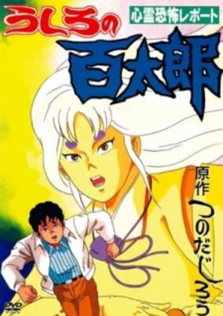

**Studio:** Studio Pierrot &nbsp;|&nbsp; **Episodes:** 2 &nbsp;|&nbsp; **Director:** Seitarô Hara By episode: Isao Shizuya (1) Masaaki Sakurai (2) &nbsp;|&nbsp; **Aired/Released:** August 21 – October 21 &nbsp;|&nbsp; **Genres:** Horror, School Life

> Horror OVA based on the manga by Jirou Tsunoda. The title roughly means "Hyakutarou behind". A boy named Ichitarou Ushiro deals with various horrifying phenomena with the help of his guardian spirit Hyakutarou. 2 episodes: "Kokkuri Satsujin Jiken", "Yuutai Ridatsu".
>
> _Synopsis source: Kitsu_

[Kitsu](https://kitsu.io/anime/ushiro-no-hyakutarou)

---

### Locke the Superman: New World Command ( Chōjin Rokku: Shin Sekai Sentai )

**Studio:** Nippon Animation &nbsp;|&nbsp; **Episodes:** 2 &nbsp;|&nbsp; **Director:** Takeshi Hirota &nbsp;|&nbsp; **Aired/Released:** August 21 – October 23

[Wikipedia](https://en.wikipedia.org/wiki/Locke_the_Superman#New_World_Command)

---

### Detonator Orgun

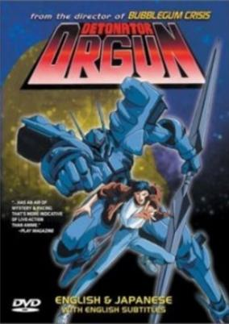

**Studio:** AIC ; Artmic &nbsp;|&nbsp; **Episodes:** 3 &nbsp;|&nbsp; **Director:** Masami Oobari &nbsp;|&nbsp; **Aired/Released:** August 25 – April 25, 1992 &nbsp;|&nbsp; **Genres:** Romance, Science Fiction, Mecha, Earth, Action, Alien, Future

> Fleeing from his own race, Orgun—an alien being with superhuman abilities and unearthly weapons—travels to Earth to find an answer to his origin. There, he bonds with a young man named Tomoru to defend Earth against the Evoluders, who seek nothing but destruction of other civilizations.
>
> _Synopsis source: Kitsu_

[Wikipedia](https://en.wikipedia.org/wiki/Detonator_Orgun) · [Kitsu](https://kitsu.io/anime/detonator-orgun)

---

### Yokohama Meibutsu Otoko Katayama Gumi!

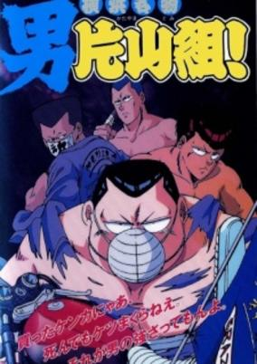

**Studio:** J.C.Staff &nbsp;|&nbsp; **Episodes:** 2 &nbsp;|&nbsp; **Director:** Yoshinori Nakamura &nbsp;|&nbsp; **Aired/Released:** August 25 – March 25, 1992 &nbsp;|&nbsp; **Genres:** Earth, Japan, Action, Asia, Comedy, Delinquent, Violence, School Life

> The city of Yokohama has become a lawless district for biker gangs. One particular gang, the "Crazy Babies", have a 17 year old leader called Hiromi Katayama that is famous throughout the entire Kanagawa alliance as being a strong fighter with a devout sense of morality. However, when a young rookie by the name of Toshi Ikeda wants in, he swears to Katayama that he will uphold the ideals of the Crazy Babies and vows to not fight with anybody for his first probationary month within the gang or else forfeit his chance to join the gang. Ikeda being the fiery young man he is, soon finds himself caught in the middle of a fight and unintentionally sparks off a feud between the gangs of Kanagawa and the dangerous Nagoya based group, The Dragon Star Crew, who have their eye on taking the whole of Kanto. Can Katayama defend Yokohama from the encroaching hoodlums?
>
> _Synopsis source: Kitsu_

[Kitsu](https://kitsu.io/anime/yokohama-meibutsu-otoko-katayama-gumi)

---

### Mahjong Hishō-den - Naki no Ryū: Hiryū no Shō

**Studio:** Gainax ; Magic Bus &nbsp;|&nbsp; **Episodes:** 1 &nbsp;|&nbsp; **Director:** Junichi Nojo (original creator) &nbsp;|&nbsp; **Aired/Released:** August 28

---

### Licca-chan: Fushigi na Maho no Ring ( Licca: The Mysterious Magical Ring ) (Licca: Mysterious Magical Ring)

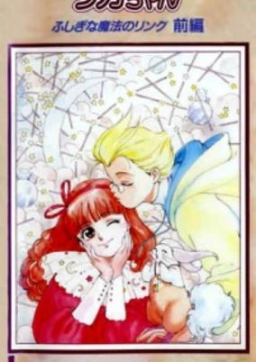

**Studio:** Ajia-do Animation Works &nbsp;|&nbsp; **Episodes:** 2 &nbsp;|&nbsp; **Director:** Fumiko Ishii &nbsp;|&nbsp; **Aired/Released:** August 30 &nbsp;|&nbsp; **Genres:** Fantasy, Adventure

> Second part in the OVA series that was later adapted into a TV show in 1998.
>
> _Synopsis source: Kitsu_

[Kitsu](https://kitsu.io/anime/licca-chan-fushigi-na-mahou-no-ring)

---

### Meisō-Ō Border

**Studio:** Nippon Animation ; Artland &nbsp;|&nbsp; **Episodes:** 1 &nbsp;|&nbsp; **Director:** Akio Tanaka (art) Caribu Marley (story) &nbsp;|&nbsp; **Aired/Released:** September 1

---

### Ishii Hisaichi no Daiseikai ( Hisaichi Ishii's Great Political World )

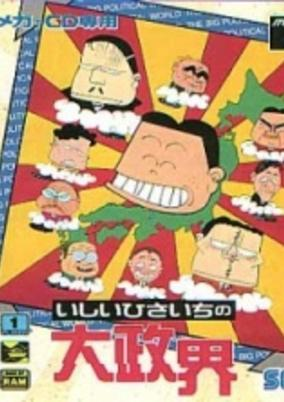

**Studio:** E&G Films &nbsp;|&nbsp; **Episodes:** 1 &nbsp;|&nbsp; **Director:** Masayuki Oozeki &nbsp;|&nbsp; **Aired/Released:** September 6 &nbsp;|&nbsp; **Genres:** Comedy, Parody

> Based the same name gag manga by Hisaichi Ishii.
>
> _Synopsis source: Kitsu_

[Kitsu](https://kitsu.io/anime/ishii-hisaichi-no-dai-seikai)

---

### Legend of Heavenly Sphere Shurato: Dark Genesis ( Tenkū Senki Shurato: Sōsei e no Antō )

**Studio:** Tatsunoko Production &nbsp;|&nbsp; **Episodes:** 6 &nbsp;|&nbsp; **Director:** Yoshihisa Matsumoto &nbsp;|&nbsp; **Aired/Released:** September 16 – March 16, 1992

[Wikipedia](https://en.wikipedia.org/wiki/Legend_of_Heavenly_Sphere_Shurato#Anime_and_OVA)

---

### Money Wars - Nerawareta Waterfront Keikaku

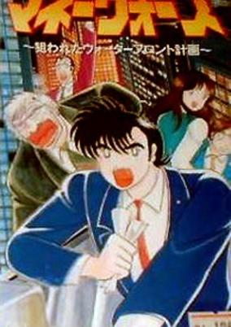

**Studio:** Gainax &nbsp;|&nbsp; **Episodes:** 1 &nbsp;|&nbsp; **Director:** Yoriyasu Kogawa &nbsp;|&nbsp; **Aired/Released:** September 21 &nbsp;|&nbsp; **Genres:** Slice of Life, Politics

> A new waterfront area is being built in Tokyo, and Chinese mafia man Lin Haifeng wants to gain control of it by owning the majority stock of the company in charge of construction. Lin's plan is to use the waterfront as a gateway for the Chinese mafia in an attempt to turn Tokyo into a "New Hong Kong". After his friend Kurihara commits suicide after unknowingly helping Lin get a hold of some stocks, his friend Tsuyoshi Aiba aims to avenge his friend by keeping Lin from taking over the waterfront.
>
> _Synopsis source: Kitsu_

[Kitsu](https://kitsu.io/anime/money-wars-nerawareta-waterfront-keikaku)

---

### Otaku no Video

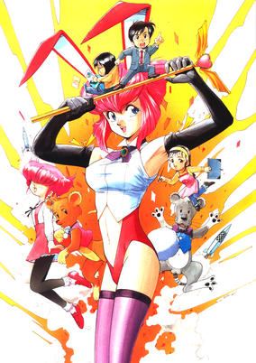

**Studio:** Gainax &nbsp;|&nbsp; **Episodes:** 2 &nbsp;|&nbsp; **Director:** Takeshi Mori &nbsp;|&nbsp; **Aired/Released:** September 27 – December 20 &nbsp;|&nbsp; **Genres:** Earth, Japan, Comedy, Parody, Asia, Present, Magic, Mecha, Historical, Science Fiction

> Somewhat based on the real story of how Gainax was founded, Otaku no Video addresses all aspects of an otaku lifestyle. Ken Kubo is a young man living an average life until he is dragged into a group of otaku. Slowly, he becomes more like them until he decides to abandon his former life to become king of otaku—the otaking! Mixed in are live-action interviews with real otaku, addressing every aspect of hardcore otaku life. Not only are anime and manga fans included, but also sci-fi fans, military fans, and other groups of Japanese geeks.
>
> _Synopsis source: Kitsu_

[Wikipedia](https://en.wikipedia.org/wiki/Otaku_no_Video) · [Kitsu](https://kitsu.io/anime/otaku-no-video)

---

### Doomed Megalopolis ( Teito Monogatari ) (Doomed Megalopolis)

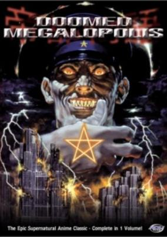

**Studio:** Madhouse &nbsp;|&nbsp; **Episodes:** 4 &nbsp;|&nbsp; **Director:** Rintaro (chief director) By episode: Kazuyoshi Katayama (1) Koichi Chigira (2) Kazunari Kume (3) Masashi Ikeda (4) &nbsp;|&nbsp; **Aired/Released:** September 27 &nbsp;|&nbsp; **Genres:** Fantasy, Asia, Earth, Bakumatsu   Meiji Period, Japan, Action, Horror, Drama, Violence, Demon, Super Power, Historical

> When an evil sorcerer bent on crushing the "greatest city on earth" uses dark powers to awaken the destructive spirit of Tokyo's historic "guardian", Taira no Masakado, occultists, children and scientists become embroiled in a ruinous struggle spanning two decades.
>
> _Synopsis source: Kitsu_

[Wikipedia](https://en.wikipedia.org/wiki/Doomed_Megalopolis) · [Kitsu](https://kitsu.io/anime/teito-monogatari)

---

### Exper Zenon

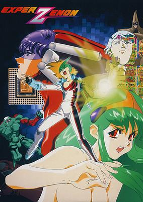

**Studio:** Studio Fantasia &nbsp;|&nbsp; **Episodes:** 1 &nbsp;|&nbsp; **Director:** Yuji Moriyama &nbsp;|&nbsp; **Aired/Released:** September 27 &nbsp;|&nbsp; **Genres:** Battle Royale, Power Suit, Science Fiction, Japan, Action, Sudden Girlfriend Appearance, Present, Super Power

> Tadashi is a high school student and computer-game addict. After a long day spent playing the game Zenon, he is visited in a dream by the heroine, Sartova. In an anime replay of The Last Starfighter, she takes him to the world of Zenon, where the game is played with human lives at stake. The show starts with our hero Hiroshi easily defeating an arcade machine, impressing all of his nerdy friends. When he gets home, he finds a bizarre new game waiting for him on his computer. The game promises him a chance at winning the heart of a beautiful girl, so Hiroshi presses "Yes" to begin...only to have the screen turn to static right in front of him. Skip to the next day. Hiroshi starts telling his friends about this game, and they aren't sure what to believe. But right then, in the middle of the class, a huge electrical storm hits, leaving in its wake a lone white egg. When Hiroshi touches it, the egg opens, revealing a beautiful (and stark naked) green-haired girl. This girl, Hiroko, gives Hiroshi the name Zenon and gives him all sorts of powers, including ESP. That's all well and good, but right afterwards all the way to the very end, Hiroshi/Zenon winds up battling all sorts of evil bad guys and huge meanies non-stop to protect his new sweetheart.
>
> _Synopsis source: Kitsu_

[Kitsu](https://kitsu.io/anime/exper-zenon)

---

### Ozanari Dungeon: The Tower of Wind ( Ozanari Danjon: Kaze no Tō )

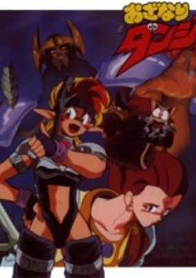

**Studio:** Telecom Animation Film &nbsp;|&nbsp; **Episodes:** 3 &nbsp;|&nbsp; **Director:** Hiroshi Aoyama &nbsp;|&nbsp; **Aired/Released:** September 27 – December 20 &nbsp;|&nbsp; **Genres:** Fantasy, Fantasy World, Action, Comedy, Magic, Anthropomorphism, Past, Adventure

> The king of the Tower of Wind seeks the power of the legendary Dragon's Head, and employs the fighter Moka, the thief Buruman, and the magic user Kiriman to steal it for him. But the Dragon's Head is sealed in the Temple of Fire, and to capture it Moka will have to face the sect that has protected it generation after generation!
>
> _Synopsis source: Kitsu_

[Wikipedia](https://en.wikipedia.org/wiki/Ozanari_Dungeon) · [Kitsu](https://kitsu.io/anime/ozanari-dungeon)

---

### Izumo

**Studio:** Studio Hibari ; Grouper Productions &nbsp;|&nbsp; **Episodes:** 2 &nbsp;|&nbsp; **Director:** Eiichi Yamamoto &nbsp;|&nbsp; **Aired/Released:** September 21 – October 21

---

### Ore no Sora: Keiji-Hen

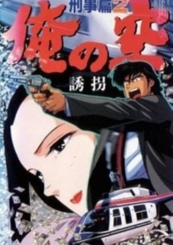

**Studio:** A.P.P.P. &nbsp;|&nbsp; **Episodes:** 2 &nbsp;|&nbsp; **Director:** Takeshi Shirato &nbsp;|&nbsp; **Aired/Released:** October 21 – May 21, 1992 &nbsp;|&nbsp; **Genres:** Cops, Drama, Action

> Yasuda Ippei (Shonozaki Ken) is the son of Yasuda Seijiro (Osugi Ren), the head of Yasuda Group, Japan's biggest business conglomerate. Although he is the son of a distinguished family, he has absolutely no disagreeable areas and is liked by everyone. His academic achievements are exceptional. He completed his entire high school programme in 2 years and qualified for Tokyo University's Faculty of Law without studying for the exams. In order to establish his own concept of justice, Yasuda leaves his position as the heir to the Yasuda Group to attend the police academy. He becomes a detective at Kyobashi Police Precinct and bravely faces great evil.
>
> _Synopsis source: Kitsu_

[Kitsu](https://kitsu.io/anime/ore-no-sora-keiji-hen)

---

### Tomoe ga Yuku! ( Tomoe's Run! )

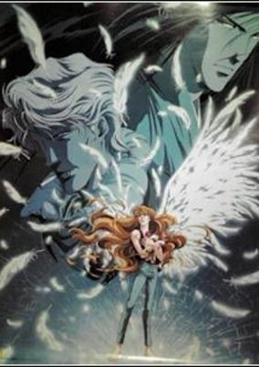

**Studio:** Animate Film &nbsp;|&nbsp; **Episodes:** 2 &nbsp;|&nbsp; **Director:** Takaaki Ishiyama &nbsp;|&nbsp; **Aired/Released:** October 21 – January 21, 1992 &nbsp;|&nbsp; **Genres:** Romance, Japan, Earth, Asia, Action, Gunfights, Thriller, Conspiracy, Crime, Love Polygon, Drama

> The title character of Tomoe ga Yuku! (Tomoe Will Go!) is gutsy enough to roller skate down freeways for thrills. After losing a friend in a roller skating accident, Tomoe joins a stunt group called Green Ship. Although still mourning her friend's death, Tomoe has no reservations about embracing a relationship with the group's leader, Kazusa. Soon she discovers Green Ship is a front for an assassin training camp. She must flee her new life and love and rekindle her fiery spirit in order to fight against the organization which wants her dead.
>
> _Synopsis source: Kitsu_

[Kitsu](https://kitsu.io/anime/tomoe-ga-yuku)

---

### Kyoushoku Soukou Guyver II (The Guyver: Bio-Booster Armor)

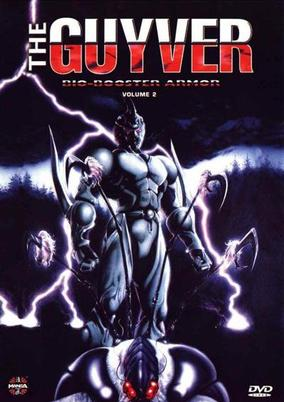

**Studio:** Visual 80 &nbsp;|&nbsp; **Episodes:** 6 &nbsp;|&nbsp; **Director:** Naoto Hashimoto &nbsp;|&nbsp; **Aired/Released:** October 24 – August 21, 1992 &nbsp;|&nbsp; **Genres:** Power Suit, Science Fiction, Action, Horror, Adventure

> Sho and his friend Tetsurou stumble upon an odd alien artifact while walking through the woods. Then, the alien artifact breaks free of its metallic bonds and enters Sho's body, turning him into the Guyver. With this new power, Sho must do battle with the evil Chronos corporation and their genetically enhanced Zoanoids, who seek to get the Guyver back into their labs. No one close to Sho is safe from Chronos. He must fight.
>
> _Synopsis source: Kitsu_

[Kitsu](https://kitsu.io/anime/kyoushoku-soukou-guyver-ii)

---

### Kyūkyoku Chōjin R (Kyukyoku Chojin R)

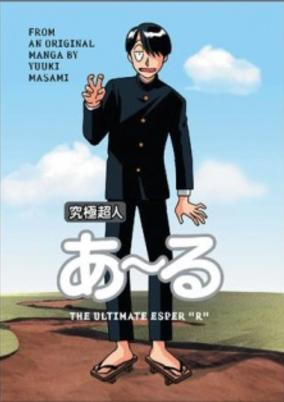

**Studio:** Studio COA &nbsp;|&nbsp; **Episodes:** 1 &nbsp;|&nbsp; **Director:** Masami Yuki &nbsp;|&nbsp; **Aired/Released:** October 24 &nbsp;|&nbsp; **Genres:** Comedy, Science Fiction

> The plot featured R and the Camera Club going on a stamp tour throughout Japan, with the threat of their club being closed down unless they can collect all the stamps by 6:00 PM.
>
> _Synopsis source: Kitsu_

[Wikipedia](https://en.wikipedia.org/wiki/Ky%C5%ABkyoku_Ch%C5%8Djin_R) · [Kitsu](https://kitsu.io/anime/kyuukyoku-choujin-r)

---

### Ucchare Goshogawara

**Studio:** J.C.Staff &nbsp;|&nbsp; **Episodes:** 1 &nbsp;|&nbsp; **Director:** Kazuhiro Ozawa &nbsp;|&nbsp; **Aired/Released:** October 25 &nbsp;|&nbsp; **Genres:** Wrestling, Sports, School Life, Martial Arts

> Musashi Mountain High School third grade Goshogawara is the only member of his school's sumo club. In order to take part in competitions, he tries to attract more members, and thanks to his enthusiasm and sincerity four more people join the club: judo team captain Kaoru Kiyokawa; pro wrestler Takayuki Kannai; skinny thug wannabe Nanno Ippei; and Raiden Goro, a giant guy but a very shy person who also happens to be an expert Go player. The five train together and later take part in a competition against a professional sumo club.
>
> _Synopsis source: Kitsu_

[Kitsu](https://kitsu.io/anime/ucchare-goshogawara)

---

### Chō Bakumatsu Shōnen Seiki Takamaru

**Studio:** J.C.Staff ; Studio Live &nbsp;|&nbsp; **Episodes:** 2 &nbsp;|&nbsp; **Director:** Toyoo Ashida &nbsp;|&nbsp; **Aired/Released:** November 1 – December 20 &nbsp;|&nbsp; **Genres:** Fantasy, Fantasy World, Action, Comedy, Slapstick, Super Power

[Kitsu](https://kitsu.io/anime/choubakumatsu-shounen-seiki-takamaru)

---

### Tsuki ga Noboru made ni ( By the Time the Moon Rises )

**Studio:** Grouper Productions; OB Planning &nbsp;|&nbsp; **Episodes:** 1 &nbsp;|&nbsp; **Director:** Eiichi Yamamoto &nbsp;|&nbsp; **Aired/Released:** November 8 &nbsp;|&nbsp; **Genres:** Japan, Coming Of Age, Anti War, Past, Disaster, Historical

> A father and daughter are on a trip to see a beautiful view of the moon when they encounter an old man. The old man offers them chocolates and recounts his memories of the last summer of World War II. His experiences, both bitter and sweet, speak to universal human nature that transcends the conflict itself—a shared truth within every person, even if they are on opposing sides of a battle. [Written by MAL Rewrite]
>
> _Synopsis source: Kitsu_

[Kitsu](https://kitsu.io/anime/tsuki-ga-noboru-made-ni)

---

### Christmas in January

**Studio:** Magic Bus &nbsp;|&nbsp; **Episodes:** 1 &nbsp;|&nbsp; **Director:** Tetsu Dezaki &nbsp;|&nbsp; **Aired/Released:** November 21 &nbsp;|&nbsp; **Genres:** Romance, Japan, Earth, Asia, Angst, Present

> Nobumasa is a boy who works part-time in a shoe store, where he meets Mizuki, a girl whose abusive family life has left her unable to trust other people. Meanwhile, Nobumasa is unaware that another girl, Seiko, has a crush on him but is unable to express her feelings.
>
> _Synopsis source: Kitsu_

[Kitsu](https://kitsu.io/anime/ichigatsu-ni-wa-christmas)

---

### Ninja Ryūkenden ( Ninja Garden )

**Studio:** Studio Junio &nbsp;|&nbsp; **Episodes:** 1 &nbsp;|&nbsp; **Director:** Mamoru Kanbe &nbsp;|&nbsp; **Aired/Released:** November 22 &nbsp;|&nbsp; **Genres:** Ninja, Action, United States, Martial Arts, Violence, Present, Demon, Science Fiction, Adventure, Thriller

> On a dark, late night in New York City, Ryu is chased and attacked by assassins. After disposing of them, he finds an I.D. card for the Friedman Company. The next day, it is announced that Dr. Ned Friedman has discovered a cure for cancer. But after providing no information at his press conference, a reporter named Sarah decides to investigate with the help of her friends Robert and Jeff. When passing by Dr. Friedman's house one day, Ryu hears the voice of a young girl calling for help. When Sarah and her entourage investigate the house as well, they run into their colleague, Ryu. Upon that, they discover Dr. Friedman has been conducting experiments on live humans using biotechnology, and that it may have something to do with the power of the Evil Gods, whom Ryu had defeated in the past. But when Ryu's friend, Irene, is kidnapped, he must dawn his role as a Dragon Ninja once again to defeat this new enemy and save her.
>
> _Synopsis source: Kitsu_

[Wikipedia](https://en.wikipedia.org/wiki/Ninja_Gaiden#Other_games) · [Kitsu](https://kitsu.io/anime/ninja-gaiden)

---

### Koko wa Green Wood ( Here Is Greenwood ) (Here is Greenwood)

**Studio:** Ajia-do Animation Works ; Studio Pierrot &nbsp;|&nbsp; **Episodes:** 6 &nbsp;|&nbsp; **Director:** Tomomi Mochizuki &nbsp;|&nbsp; **Aired/Released:** November 27 – March 26, 1993 &nbsp;|&nbsp; **Genres:** High School, Present, Earth, Japan, Love Polygon, Asia, Comedy, Romance, School Life, Slice of Life

> Hasukawa Kazuya is in a terrible bind. His brother's new wife is also the woman that Kazuya secretly loves. Determined to avoid them both, Kazuya leaves home to live in the student dorm called Greenwood. There, he hopes to find peace of mind. Unfortunately for Kazuya, stability and peace are the last things one might find at Greenwood - home of the weirdest characters on campus.
>
> _Synopsis source: Kitsu_

[Wikipedia](https://en.wikipedia.org/wiki/Here_Is_Greenwood) · [Kitsu](https://kitsu.io/anime/here-is-greenwood)

---

### Dark Cat

**Studio:** Agent 21 &nbsp;|&nbsp; **Episodes:** 1 &nbsp;|&nbsp; **Director:** Iku Suzuki &nbsp;|&nbsp; **Aired/Released:** November 28 &nbsp;|&nbsp; **Genres:** Japan, Earth, Action, Asia, Tentacle, Horror, School Life, Present, Demon, Super Power

> Hyoi and Ryoi, two brothers with the power to take the form of cats, must unravel the mystery of a creeping, tentacled, demon plague before it consumes them and their classmates. Ultimately, they must confront their old Dark Cat master Jukokubo, though whether they can put an end to the evil he has released remains a mystery.
>
> _Synopsis source: Kitsu_

[Kitsu](https://kitsu.io/anime/dark-cat)

---

### Gall Force: New Era

**Studio:** By episode: AIC (1) Studio Kyūma (2) &nbsp;|&nbsp; **Episodes:** 2 &nbsp;|&nbsp; **Director:** Katsuhito Akiyama &nbsp;|&nbsp; **Aired/Released:** December 1 – February 26, 1992

[Wikipedia](https://en.wikipedia.org/wiki/Gall_Force)

---

### Otohime Connection ( Princess Sister Connection ) (Princess Connection)

**Studio:** Animate Film &nbsp;|&nbsp; **Episodes:** 1 &nbsp;|&nbsp; **Director:** Takayuki Goto &nbsp;|&nbsp; **Aired/Released:** December 1 &nbsp;|&nbsp; **Genres:** Musical Band, Romance, Slice of Life, Mystery

> Special based on the manga by Ooya Kazumi, published in Betsukomi Flower Comics. An all-male pop group doubles as a detective agency. The cute girl member of the agency is kidnapped when one of the men's past returns to trouble them all in the present.
>
> _Synopsis source: Kitsu_

[Kitsu](https://kitsu.io/anime/otohime-connection)

---

### Jingi

**Studio:** Nihon Eizō; J.C. Staff &nbsp;|&nbsp; **Episodes:** 2 &nbsp;|&nbsp; **Director:** By episode: Kiyoshi Murayama (1–2) Kenjirō Yoshida (1) &nbsp;|&nbsp; **Aired/Released:** December 4 – April 8, 1992 &nbsp;|&nbsp; **Genres:** Cops, Drama, Adventure

[Kitsu](https://kitsu.io/anime/jingi)

---

### Nyūin Bokki Monogatari Odaiji ni!

**Studio:** Barque Inc.; Tokyo Kids; Animaruya &nbsp;|&nbsp; **Episodes:** 2 &nbsp;|&nbsp; **Director:** Yoshitaka Koyama &nbsp;|&nbsp; **Aired/Released:** December 5 – 25 &nbsp;|&nbsp; **Genres:** Japan, Asia, Comedy, Ecchi, Earth, Nurse, Slapstick

> Yamashita and Negishi end up in the hospital with broken legs and arms. It's summer vacation and they are very bored, so they start picking on the cute nurse Miyuki.
>
> _Synopsis source: Kitsu_

[Kitsu](https://kitsu.io/anime/nyuuin-bokki-monogatari-odaijini)

---

### Monkey Punch no Sekai: Alice (Alice)

**Studio:** Takahashi Studio &nbsp;|&nbsp; **Episodes:** 1 &nbsp;|&nbsp; **Director:** Kazunori Tanahashi Yuzo Aoki &nbsp;|&nbsp; **Aired/Released:** December 13 &nbsp;|&nbsp; **Genres:** Earth, Ecchi, Japan, Action, Asia, Comedy, Gunfights, Absurdist Humour, Human Enhancement, Cyborg

> Released in 1991, this OVA revolves around a mad scientist and the woman that betrayed him. Her unfaithfulness causes the scientist to turn her into a bionic sex machine that desires to please her man completely. However, she still remains unfaithful, and it is up to the scientist`s son to track her down and exact revenge.
>
> _Synopsis source: Kitsu_

[Kitsu](https://kitsu.io/anime/monkey-punch-no-sekai-alice)

---

### Neko Neko Fantasia (Kitty-Cat Fantasia)

**Studio:** AIC ; Animate Film &nbsp;|&nbsp; **Episodes:** 1 &nbsp;|&nbsp; **Director:** Akira Nishimori &nbsp;|&nbsp; **Aired/Released:** December 13 &nbsp;|&nbsp; **Genres:** Comedy

> "Shiro" is a black cat who loves her family very much. She loves them so much she wants to help them out in times of need and trouble…but it’s difficult to do this if she’s just a cat. So one night, she wishes on the moon to make her able to help, and the next day, she has turned into a human girl.
>
> _Synopsis source: Kitsu_

[Kitsu](https://kitsu.io/anime/neko-neko-fantasia)

---

### Gekkō no Pierce: Yumemi to Gin no Bara no Kishi-dan ( Moonlight Earrings: Yumemi and the Silver Rose Knights ) (Moonlight Pierce)

**Studio:** Studio Pierrot &nbsp;|&nbsp; **Episodes:** 1 &nbsp;|&nbsp; **Director:** Takeshi Mori &nbsp;|&nbsp; **Aired/Released:** December 14 &nbsp;|&nbsp; **Genres:** Fantasy, Romance, Mystery

> Because of a mysterious earring, Yumemi a young japanese student, becomes involved in a mysterious story. She must go to Germany, where she learns that the spirit of an evil prince is haunting her earring...
>
> _Synopsis source: Kitsu_

[Kitsu](https://kitsu.io/anime/gekkou-no-pierce-yumemi-to-gin-no-bara-no-kishidan)

---

## TV series

### Trapp Ikka Monotatari (The Trapp Family Story)

**Studio:** Fuji TV &nbsp;|&nbsp; **Episodes:** 40 &nbsp;|&nbsp; **Director:** Kouzou Kusuba &nbsp;|&nbsp; **Aired/Released:** January 13 – December 28 &nbsp;|&nbsp; **Genres:** Slice of Life, Europe, Coming Of Age, Past, Historical, Music, Romance

> Based on the same story that produced the classic musical 'The Sound of Music', this is the story of Maria, who leaves her life in a convent to take up the responsibility of taking care of Captain Trapp's children.
>
> _Synopsis source: Kitsu_

[Wikipedia](https://en.wikipedia.org/wiki/Trapp_Ikka_Monogatari) · [Kitsu](https://kitsu.io/anime/trapp-ikka-monogatari)

---

### Taiyou no Yuusha Fighbird (Brave of the Sun Fighbird)

**Studio:** Nagoya Broadcasting Network &nbsp;|&nbsp; **Episodes:** 48 &nbsp;|&nbsp; **Director:** Katsuyoshi Yatabe &nbsp;|&nbsp; **Aired/Released:** February 2–1, 1992 &nbsp;|&nbsp; **Genres:** Transforming Craft, Science Fiction, Mecha, Earth, Japan, Action, Super Robot, Asia, Alien, Android, Robot

> An evil alien life form, Dryus, assaulted the Earth. The leader of Space Patrol, Fighbird, pursed Dryus to the Earth. Fighbird combined with an android that Dr. Amano was developing. Fighbird named Hidori Ryutaro and fight against Dryus to protect the peace of the Earth. At first look, he was a normal person, but because he was an alien, Fibird, his acts were a bit away from the normal persons'. Usually, he worked for Dr. Amano as an assistant. He looked uncouth always wearing while coat and glasses. However, once enemy appears, his personality changed dramatically.
>
> _Synopsis source: Kitsu_

[Wikipedia](https://en.wikipedia.org/wiki/The_Brave_of_Sun_Fighbird) · [Kitsu](https://kitsu.io/anime/taiyou-no-yuusha-fighbird)

---

### Getter Robo Go

**Studio:** Toei Animation &nbsp;|&nbsp; **Episodes:** 50 &nbsp;|&nbsp; **Director:** Hiroki Shibata &nbsp;|&nbsp; **Aired/Released:** February 11 – January 27, 1992 &nbsp;|&nbsp; **Genres:** Science Fiction, Mecha, Super Robot, Robot, Action, Adventure, Military

> A new Getter robot is piloted by three youth as they combat the evil terrors that plague the world.
>
> _Synopsis source: Kitsu_

[Wikipedia](https://en.wikipedia.org/wiki/Getter_Robo_Go) · [Kitsu](https://kitsu.io/anime/getter-robo-go)

---

### Future GPX Cyber Formula

**Studio:** Sunrise &nbsp;|&nbsp; **Episodes:** 37 &nbsp;|&nbsp; **Director:** Mitsuo Fukuda &nbsp;|&nbsp; **Aired/Released:** March 15 – December 20 &nbsp;|&nbsp; **Genres:** Science Fiction, Formula Racing, Action, Sports, Future, Motorsport, Adventure

> 14-year-old Kazami Hayato is the youngest driver of Cyber Formula, a Grand Prix in which each vehicle is equipped with computers to aid in racing. With the help of Asurada, the most advanced cybernavigation system, and team Sugo, Hayato races to become the winner of the 10th Cyber Formula Grand Prix. Along the way, Hayato will have to learn what it truly means to be a racer and that victory cannot be achieved simply by driving the best machine. In addition, Kazami will have to gain the respect of the veteran racers, thwart those who attempt to steal Asurada, and participate in races outside of Cyber Formula.
>
> _Synopsis source: Kitsu_

[Wikipedia](https://en.wikipedia.org/wiki/Future_GPX_Cyber_Formula) · [Kitsu](https://kitsu.io/anime/future-gpx-cyber-formula)

---

### Zettai Muteki Raijin-Oh

**Studio:** Sunrise &nbsp;|&nbsp; **Episodes:** 51 &nbsp;|&nbsp; **Director:** Toshifumi Kawase &nbsp;|&nbsp; **Aired/Released:** April 3 – March 25, 1992 &nbsp;|&nbsp; **Genres:** Science Fiction, Mecha, Adventure, School Life

> Suddenly, an evil empire, Jaaku, raids the Earth. But the light appears from the Earth, and fights against Jaaku. It is Raijin Oh operated by Eldran. Eldran has protected the earth since the ancient ages. But he was injured during the fight, and Raijin Oh falls to the ground. On the other hand, Jaaku scatters their weapons, Aku Darmer, all over the world. Meanwhile, in Yosho elementary school, they have extra lessons in the 3rd class of the 5th grade. Eldran leaves Raijin Medal to them and asks them to save the Earth for him, and then he disappeared. In this way, the Earth Defense Agency consisted of elementary students is founded.
>
> _Synopsis source: Kitsu_

[Wikipedia](https://en.wikipedia.org/wiki/Matchless_Raijin-Oh) · [Kitsu](https://kitsu.io/anime/zettai-muteki-raijin-oh)

---

### Kikou Keisatsu Metal Jack

**Studio:** Sunrise &nbsp;|&nbsp; **Episodes:** 37 &nbsp;|&nbsp; **Director:** Kiyoshi Egami &nbsp;|&nbsp; **Aired/Released:** April 8 – December 23 &nbsp;|&nbsp; **Genres:** Mecha, Action, Science Fiction, Cops

> Twenty years into the future, a city now called "Tokyo" has developed into one of the few world-class high-tech centers, "Tokyo City." The main character, Ken Kanzaki, is a young investigator assigned to the criminal investigation section of the Metropolital Police. He is one of the finest sharp shooters in the Police.One day, Ken is ordered to provide security for a party held by for "Zaizen Konzern," a world-class plutocracy. All of a sudden, spector robots appear and distrupt the party. Zaizen, a commander-in-chief, is killed and both Ken and Jun. Zaizen's son,are fatally injured by the robots. Two of the party's guests, an auto-racer, Ryo Aguri,and a wresler, Go Goda, also receive serious injuries. Three severely injured young men are operated upon by scientists from the Metropolitan Police. Several days later, a robot corp led by a mysterious organization called "Ido" appears in the floating-town of the Tokyo Bay. But the Police and the Army have no effective strategies to contain them. At that moment, three young men attired in mechanical suits enter. They are the very three young men, Ken, Ryo and Go, who have been turned into the cyborg investigators through the operation. They call themselves "Armored Police Metal Jacks". "Metal Jacks," dazzlingly switching from "Jack Suits" to "Jack Armors," completely demolish the robot corp and achieve victory, thus signals the beginning of the battle between the high-tech criminals and "Metal Jacks" with a futuristic "Tokyo City" in the background.
>
> _Synopsis source: Kitsu_

[Wikipedia](https://en.wikipedia.org/wiki/Armored_Police_Metal_Jack) · [Kitsu](https://kitsu.io/anime/kikou-keisatsu-metal-jack)

---

### High School Mystery: Gakuen Nanafushigi

**Studio:** Studio Comet &nbsp;|&nbsp; **Episodes:** 41 &nbsp;|&nbsp; **Director:** Shin Misawa &nbsp;|&nbsp; **Aired/Released:** April 12 – March 13, 1992 &nbsp;|&nbsp; **Genres:** Horror, Mystery

> No synopsis has been added for this series yet.Click here to update this information.
>
> _Synopsis source: Kitsu_

[Kitsu](https://kitsu.io/anime/high-school-mystery-gakuen-nanafushigi)

---

### City Hunter '91

**Studio:** Sunrise &nbsp;|&nbsp; **Episodes:** 13 &nbsp;|&nbsp; **Director:** Kiyoshi Egami &nbsp;|&nbsp; **Aired/Released:** April 28 – October 10

[Wikipedia](https://en.wikipedia.org/wiki/City_Hunter)

---

### Dear Brother

**Studio:** Tezuka Productions &nbsp;|&nbsp; **Episodes:** 39 &nbsp;|&nbsp; **Director:** Osamu Dezaki &nbsp;|&nbsp; **Aired/Released:** July 14 – May 31, 1992 &nbsp;|&nbsp; **Genres:** High School, Angst, Plot Continuity, All Girls School, Romance, Slice of Life, Present, Japan, School Life, Shoujo Ai

> When starting at a new school, Nanako is thrust into the world of female rivalry and love. She is chosen into the Sorority, giving her an enviable position according to all the girls left out. However, since Nanako is not from a wealthy family, most girls find it unfair that she was chosen. Nanako is left to protect herself from wicked rumors and mean plots to make her leave the school. Along with her best friend since preschool, and new friends made along the way, she uncovers the past of some of the more popular girls in school and on her journey through high school she learns of love, loss and her own family's secrets...
>
> _Synopsis source: Kitsu_

[Wikipedia](https://en.wikipedia.org/wiki/Dear_Brother) · [Kitsu](https://kitsu.io/anime/onii-sama-e)

---

### Mahou no Princess Minky Momo: Yume wo Dakishimete (Fairy Princess Minky Momo Season 2)

**Studio:** Ashi Productions &nbsp;|&nbsp; **Episodes:** 65 &nbsp;|&nbsp; **Director:** Kunihiko Yuyama &nbsp;|&nbsp; **Aired/Released:** October 2 – December 23, 1992 &nbsp;|&nbsp; **Genres:** Magical Girl, Magic

> After the events of the 1st series, Fenarinarsa continues to drift from Earth, so the King asks for help from the kingdom, Marinarsa, to send their daughter, Momo (Who is identical to the 1st one) to Earth to regain humanity's faith in their dreams.
>
> _Synopsis source: Kitsu_

[Kitsu](https://kitsu.io/anime/mahou-no-princess-minky-momo-yume-wo-dakishimete)

---

### Genji Tsūshin Agedama

**Studio:** Studio Gallop &nbsp;|&nbsp; **Episodes:** 51 &nbsp;|&nbsp; **Director:** Masato Namiki &nbsp;|&nbsp; **Aired/Released:** October 4 – September 25, 1992 &nbsp;|&nbsp; **Genres:** Science Fiction, Parody, Comedy, Action

> Agedama is a small boy going to elementary school and having the usual problems for a boy of his age. He is also secretly a superhero-in-training (called "Agedaman"). Along with Wapuro, his floating computer companion, he fights against a criminal organization who can turn humans into monsters of various types.
>
> _Synopsis source: Kitsu_

[Wikipedia](https://en.wikipedia.org/wiki/Genji_Ts%C5%ABshin_Agedama) · [Kitsu](https://kitsu.io/anime/genji-tsuushin-agedama)

---

### Kinnikuman: Kinnikusei Oui Soudatsu-hen

**Studio:** Toei Animation &nbsp;|&nbsp; **Episodes:** 46 &nbsp;|&nbsp; **Director:** Takeshi Shirato Atsutoshi Umezawa &nbsp;|&nbsp; **Aired/Released:** October 6 – September 27, 1992

[Wikipedia](https://en.wikipedia.org/wiki/Kinnikuman#Television_series)

---

### Moero! Top Striker (Top Striker)

**Studio:** Nippon Animation &nbsp;|&nbsp; **Episodes:** 49 &nbsp;|&nbsp; **Director:** Ryō Yasumura &nbsp;|&nbsp; **Aired/Released:** October 10 – September 24, 1992 &nbsp;|&nbsp; **Genres:** Action, Sports, Soccer

> Hikaru Kicker is a 13-year-old boy who loves football. He has grown up playing with a football at all times ever since his father's friend gave him one when he was still only a baby. Hikaru goes to Italy to learn the sport. He first joins a strong team at Genova, but soon quits this team to join an extremely weak team named "Columbus" with his female friend Anna. Experiencing many hardships and difficulties, their team gradually becomes stronger and stronger, and finally they defeat Margerita, one of the strongest soccer teams in Genova. Soon Hikaru hears that Genova will stage its first soccer tournament. Throughout the tournament, Hikaru and his teammates confront many rivals and develop increasing maturity. Can Hikaru score a goal and which team will win the championship?
>
> _Synopsis source: Kitsu_

[Wikipedia](https://en.wikipedia.org/wiki/Moero!_Top_Striker) · [Kitsu](https://kitsu.io/anime/moero-top-striker)

---

### Dragon Quest: Dai no Daibouken

**Studio:** Toei Animation &nbsp;|&nbsp; **Episodes:** 46 &nbsp;|&nbsp; **Director:** Nobutaka Nishizawa &nbsp;|&nbsp; **Aired/Released:** October 17 – September 24, 1992 &nbsp;|&nbsp; **Genres:** Magic, Fantasy, Comedy, Demon, Martial Arts, Adventure

> After the defeat of the demon lord Hadlar all of the monsters were unleashed from his evil will and moved to the island of Delmurin to live in peace. Dai is the only human living on the island. Having been raised by the kindly monster Brass, Dai's dream is to grow up to be a hero. He gets to become one when Hadlar is resurrected and the previous hero, Avan, comes to train Dai to help in the battle. But Hadlar, announcing that he now works for an even more powerful demon lord, comes to kill Avan. To save his students Avan uses a Self-Sacrifice spell to attack, but is unable to defeat Hadlar. When it seems that Dai and Avan's other student Pop are doomed a mark appears on Dai's forehead and he suddenly gains super powers and is able to fend off Hadlar. The two students then go off on a journey to avenge Avan and bring peace back to the world.
>
> _Synopsis source: Kitsu_

[Kitsu](https://kitsu.io/anime/dragon-quest-dai-no-daibouken)

---

### Yokoyama Mitsuteru Sangokushi

**Studio:** Dai Nippon Printing &nbsp;|&nbsp; **Episodes:** 47 &nbsp;|&nbsp; **Director:** Seiji Okuda &nbsp;|&nbsp; **Aired/Released:** October 18 – September 25, 1992 &nbsp;|&nbsp; **Genres:** Delinquent, Action

> Modern-day bikers make and break alliances with neighboring gangs, fight over the right to use a local petrol station, and are eventually united under a powerful leader. It's a replay of the events of Japan's 16th-century civil war, but with bikes instead of horses and knives instead of swords. Based on the manga by Jiro Ueno in Weekly Playboy.
>
> _Synopsis source: Kitsu_

[Wikipedia](https://en.wikipedia.org/wiki/Sangokushi_(manga)) · [Kitsu](https://kitsu.io/anime/bousou-sengokushi)

---
