# 1992 in Anime

[← Back to index](../README.md)

70 titles · 59 with a matched synopsis/cover art · [source](https://en.wikipedia.org/wiki/1992_in_anime)

## Film

### Sangokushi (dai 1-bu): Eiyū-tachi no Yoake ( Romance of the Three Kingdoms (Part 1): The Heroes of the Dawn )

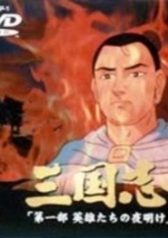

**Studio:** Enoki Films &nbsp;|&nbsp; **Director:** Tomoharu Katsumata &nbsp;|&nbsp; **Aired/Released:** January 25 &nbsp;|&nbsp; **Genres:** Historical, Three Kingdoms

> An anime based on the Romance of the Three Kingdoms novel.
>
> _Synopsis source: Kitsu_

[Kitsu](https://kitsu.io/anime/sangokushi-daiichibu-eiyuu-tachi-no-yoake)

---

### Doraemon Nobita to Kumo no Ōkoku ( Doraemon: Nobita and the Kingdom of Clouds ) (Doraemon the Movie: Nobita and the Kingdom of Clouds)

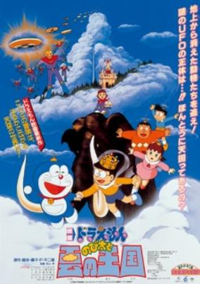

**Studio:** Shin-Ei Animation &nbsp;|&nbsp; **Director:** Tsutomu Shibayama &nbsp;|&nbsp; **Aired/Released:** March 7 &nbsp;|&nbsp; **Genres:** Comedy, Adventure

> During class, Nobita questions the teacher where heaven is located when he was being taught about clouds. Being laughed at, Nobita looks for proof that a heavenly place exists on the clouds, but was explained by Doraemon that it cannot exist scientifically. Disappointed, he was eventually helped by Doraemon to create their own kingdom of clouds. Little did they know that there are creatures who have been living on clouds for a long time.
>
> _Synopsis source: Kitsu_

[Kitsu](https://kitsu.io/anime/doraemon-nobita-and-the-kingdom-of-clouds)

---

### Doragon Bōru Zetto Gekitotsu!! Hyaku-Oku Pawā no Senshi-tachi ( Dragon Ball Z: The Return of Cooler )

**Studio:** Toei Animation &nbsp;|&nbsp; **Director:** Daisuke Nisho &nbsp;|&nbsp; **Aired/Released:** March 7

---

### Majikaru Tarurūto-kun: Suki Suki Hot Tako Yaki ( Magical Taruruto: Good Good Hot Grilled Octopus! )

**Studio:** Toei Animation &nbsp;|&nbsp; **Director:** Yukio Kaizawa &nbsp;|&nbsp; **Aired/Released:** March 7

[Wikipedia](https://en.wikipedia.org/wiki/Magical_Taruruto#Anime)

---

### Soreike! Anpanman Tsumiki-jō no Himitsu ( Let's Go! Anpanman: The Secret of Building Block Castle )

**Studio:** Tokyo Movie Shinsha &nbsp;|&nbsp; **Director:** Akinori Nagaoka &nbsp;|&nbsp; **Aired/Released:** March 14

[Wikipedia](https://en.wikipedia.org/wiki/Anpanman#Full-length_movies)

---

### Candy Candy

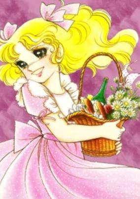

**Studio:** Toei Animation &nbsp;|&nbsp; **Director:** Tetsuo Imazawa &nbsp;|&nbsp; **Aired/Released:** April 25 &nbsp;|&nbsp; **Genres:** Past, Earth, Romance, Slice of Life

> A young girl named Candice White who was left on the doorstep of the "Pony Home", an orphanage, when she was just a baby. The sisters took her first name from a doll she had in her basket, with the name "Candy" on it, and her last name from the snowstorm she was rescued from. Life is quiet and happy.. or.. as quiet as life can be with Candy around. She has a penchant for getting into trouble, climbing trees and tussling with the best of them. However, tragedy begins to strike.
>
> _Synopsis source: Kitsu_

[Wikipedia](https://en.wikipedia.org/wiki/Candy_Candy) · [Kitsu](https://kitsu.io/anime/candy-candy-movie)

---

### Midori ( Chika Gentō Gekiga: Shōjo Tsubaki ) (Midori)

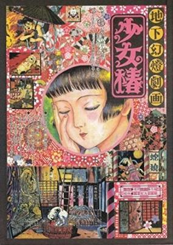

**Studio:** Mippei Eiga Kiryūkan &nbsp;|&nbsp; **Director:** Hiroshi Harada &nbsp;|&nbsp; **Aired/Released:** May 2 &nbsp;|&nbsp; **Genres:** Past, Historical, Japan, Performance, Angst, Horror, Drama

> Behind the colorful curtains and extravagant performances, there lies the dark side of a circus life, hidden away from the smiles and praises of the audience. Set in early 20th century Japan, Midori: Shoujo Tsubaki highlights the misdeeds that occur in circus camps. Midori was an innocent young girl who enjoyed her life as an elementary student to the fullest. However, everything changed after her mother fell ill. Eventually, Midori is forced to stop going to school and, instead, sells flowers in the city. When her mother dies tragically, Midori meets a stranger who leads her towards the circus. What awaits her will change her life forever... In a life where nothing seems to go right, will Midori lose faith and give up? Or will she manage to stay strong in hopes of a better future?
>
> _Synopsis source: Kitsu_

[Wikipedia](https://en.wikipedia.org/wiki/Midori_(1992_film)) · [Kitsu](https://kitsu.io/anime/chika-gentou-gekiga-shoujo-tsubaki)

---

### Hashire Merosu! ( Run Melos! ) (Run Melos!)

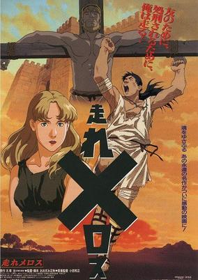

**Studio:** Visual 80 &nbsp;|&nbsp; **Director:** Masaaki Osumi &nbsp;|&nbsp; **Aired/Released:** June 25 &nbsp;|&nbsp; **Genres:** Past, Earth, Historical, Europe, Action, Adventure

> Melos is a good boy from Messina and has come to Syracuse, the magnificent city of temples, to buy a ritual sword for his sister's marriage ceremony. He meets a very talented sculptor and they become friends. Later, the King's guards arrest Melos while he was having a walk in the castle's gardens and Syracuse's King, obsessed by the idea of assassins out to kill him, sentences him to death. Melos is desperate, but most of all he wants to be present at his sister's marriage, so he asks the King for three days to go to Messina for the celebration and then return to Syracuse where he will accept the death penalty. The King does not trust Melos, but, trying to demonstrate that nobody could trust him, asks him to find a volunteer substitute in case he breaks his promise. The sculptor accepts to be Melos' substitute in this case...
>
> _Synopsis source: Kitsu_

[Wikipedia](https://en.wikipedia.org/wiki/Hashire_Melos!#Hashire_Melos!_(1992_film)) · [Kitsu](https://kitsu.io/anime/hashire-melos!)

---

### Zō Ressha ga Yatte Kita ( The Elephant Train Has Arrived )

**Studio:** Mushi Production &nbsp;|&nbsp; **Director:** Mei Kato &nbsp;|&nbsp; **Aired/Released:** July 4

---

### Doragon Bōru Zetto Kyokugen Batoru! San Dai Sūpā Saiyajin ( Dragon Ball Z: Super Android 13! )

**Studio:** Toei Animation &nbsp;|&nbsp; **Director:** Kazuhito Kikuchi &nbsp;|&nbsp; **Aired/Released:** July 11

---

### Doragon Kuesuto: Dai no Daibōken Buchiyabure!! Shinsei Roku Daishōgun ( Dragon Quest: The Adventure of Dai – Six Great Generals )

**Studio:** Toei Animation &nbsp;|&nbsp; **Director:** Nobutaka Nishizawa &nbsp;|&nbsp; **Aired/Released:** July 11

---

### Rokudenashi Blues

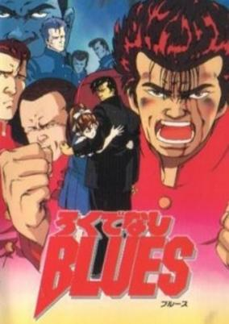

**Studio:** Toei Animation &nbsp;|&nbsp; **Director:** Takao Yoshisawa &nbsp;|&nbsp; **Aired/Released:** July 11 &nbsp;|&nbsp; **Genres:** Delinquent, Comedy, School Life, Sports

> Maeda is a new student in the Teiken High School. He stutters when he's nervous and he's rather clumsy. He gets noted immediately because he hits a teacher during the entrance ceremony. Some clubs search to enlist him as they see in him a force they can use to get even with other clubs. But Maeda is a loner and has only one dream: becoming a boxing champion.
>
> _Synopsis source: Kitsu_

[Wikipedia](https://en.wikipedia.org/wiki/Rokudenashi_Blues) · [Kitsu](https://kitsu.io/anime/rokudenashi-blues)

---

### Senbon Matsubara: Kawa to Ikiru Shōnen-tachi ( One Thousand Pine Groves: The Boys Who Lived with the River )

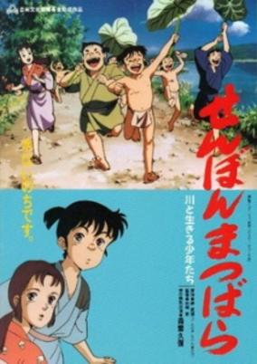

**Studio:** Mushi Production; Magic Bus &nbsp;|&nbsp; **Director:** Tetsu Dezaki &nbsp;|&nbsp; **Aired/Released:** July 11 &nbsp;|&nbsp; **Genres:** Tokugawa Period, Japan, Past, Historical

> After suffering severe floods in 1753, the people of Senbon Matsubara in Shizuoka cooperate on flood prevention around the Kiso, Nagara, and Yuhi rivers. The people of Satsuma (Kumamoto Prefecture) endure great hardships after being forced to undertake the work by the central government, a subtle indication of the bad feeling that would foment into open rebellion the following century.
>
> _Synopsis source: Kitsu_

[Kitsu](https://kitsu.io/anime/senbon-matsubara)

---

### Porco Rosso ( Kurenai no Buta ) (Porco Rosso)

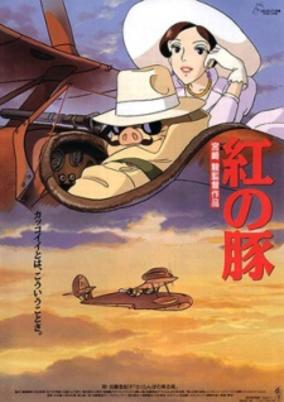

**Studio:** Studio Ghibli &nbsp;|&nbsp; **Director:** Hayao Miyazaki &nbsp;|&nbsp; **Aired/Released:** July 18 &nbsp;|&nbsp; **Genres:** Romance, Pirate, Action, Alternative Past, Air Force, Europe, Anthropomorphism, Military, Historical, Adventure, Comedy

> Porco Rosso is a veteran WWI fighter pilot turned bounty hunter, who has been transformed into an anthropomorphic pig through a rare curse. He was once known as Marco Pagot while still in his human form, but took up a new alias which suits his current image better, "Red Pig." At the beginning of Kurenai no Buta, Porco is reunited with his long-time friend Gina at a hotel, and unexpectedly falls in love with her. Despite his strange form, Gina shows him all the affection that she can muster. But Porco has a love rival to deal with. An American ace fighter named Curtis is also after Gina's heart, and although she rejects his proposals, he is not about to let her go so easily. During his return flight to Milan, Curtis sneaks up behind Porco's plane and shoots him down. The plane is completely destroyed and Porco is proclaimed dead, but due to a stroke of luck, he barely managed to survive the crash, unbeknownst to others. Porco must now continue his journey back by train, and suddenly discovers that there has been a warrant issued for his arrest in Italy. Not only does he need to find Gina, but he must also get his revenge and also deal with the oncoming war that threatens the whole of Europe.
>
> _Synopsis source: Kitsu_

[Wikipedia](https://en.wikipedia.org/wiki/Porco_Rosso) · [Kitsu](https://kitsu.io/anime/porco-rosso)

---

### Sairento Mebiusu 2 ( Silent Möbius 2 )

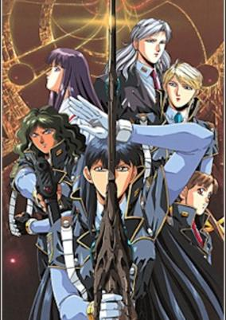

**Studio:** AIC &nbsp;|&nbsp; **Director:** Yasunori Ide &nbsp;|&nbsp; **Aired/Released:** July 18 &nbsp;|&nbsp; **Genres:** Magic, Gunfights, Future, Earth, Demon, Contemporary Fantasy, Dark Fantasy, Japan, Tokyo, Violence

> In a futuristic Tokyo, several policewomen fight a monster. One of them, Katsumi Liqueur, remembers where she saw it before... Katsumi Liqueur, an American-born woman of Japanese descent, travels to Tokyo to visit her mother, Fuyuka, who is sick in the hospital. She takes a shortcut through an alley after her taxi gets stuck in traffic, only to encounter a monster and two policewomen fighting it. Later, she meets their chief, Rally Cheyenne, who, it seems, has been expecting her, though Katsumi has never met her before. The policewomen want Katsumi to help them fight the monster, but Katsumi, who does not want to believe in magic, resists.
>
> _Synopsis source: Kitsu_

[Wikipedia](https://en.wikipedia.org/wiki/Silent_M%C3%B6bius) · [Kitsu](https://kitsu.io/anime/silent-mobius-the-motion-picture)

---

### Kaze no Tairiku ( The Weathering Continent ) (The Weathering Continent)

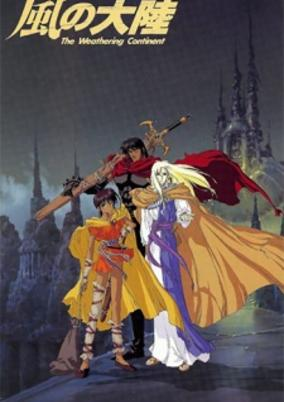

**Studio:** I.G. Tatsunoko &nbsp;|&nbsp; **Director:** Kōichi Mashimo &nbsp;|&nbsp; **Aired/Released:** July 18 &nbsp;|&nbsp; **Genres:** Adventure, Fantasy, Past, Action, Parallel Universe, Fantasy World

> Three adventurers—a warrior, a priest, and a young woman—traverse a land devastated by centuries of environmental calamities searching only for a way to survive. In their journeys they stumble across first the remains of a band of desperate treasure-hunters, and then the treasure they were seeking: Azec Sistra, the legendary City of the Dead. Unfortunately, the bandits responsible for slaughtering the treasure-hunters have also found their way to the city, but more worrisome still are the guardians which protect Azec Sistra from those who would violate the spirits at rest there...
>
> _Synopsis source: Kitsu_

[Wikipedia](https://en.wikipedia.org/wiki/The_Weathering_Continent) · [Kitsu](https://kitsu.io/anime/kaze-no-tairiku)

---

### Ranma ½: Kessen Tougenkyou! Hanayome wo Torimodose! ( Ranma ½: Nihao, My Concubine )

**Studio:** Studio Deen &nbsp;|&nbsp; **Director:** Akira Suzuki &nbsp;|&nbsp; **Aired/Released:** August 1

[Wikipedia](https://en.wikipedia.org/wiki/List_of_Ranma_%C2%BD_episodes#Films_(1991–1994))

---

### Yawara! Soreyuke Koshinuke Kizzu!! ( Yawara!: Go Get 'Em, Wimpy Kids!! )

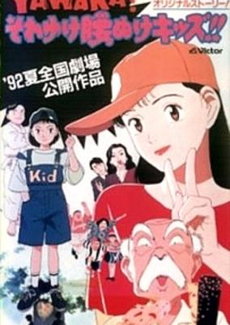

**Studio:** Madhouse &nbsp;|&nbsp; **Director:** Hiroko Tokita &nbsp;|&nbsp; **Aired/Released:** August 1 &nbsp;|&nbsp; **Genres:** Martial Arts, Present, Earth, Japan, Combat, Asia, Action, Comedy, Romance, Slice of Life

> Yawara helps a group of timid grade school kids overcome their fears and compete in a judo competition. One of the kids is Hanazono's cousin, which is how she meets them. Another is a girl who seems a whole lot like Yawara.
>
> _Synopsis source: Kitsu_

[Wikipedia](https://en.wikipedia.org/wiki/Yawara!#Yawara!_Soreyuke_Koshinuke_Kizzu!!) · [Kitsu](https://kitsu.io/anime/yawara-sore-yuke-koshinuke-kids)

---

### Tottoi (Secret of the Seal)

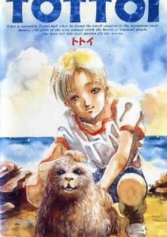

**Studio:** Nippon Animation &nbsp;|&nbsp; **Director:** Kiyozumi Norifumi &nbsp;|&nbsp; **Aired/Released:** August 22 &nbsp;|&nbsp; **Genres:** Earth, Italy, Europe, Present, Adventure, Slice of Life, Kids

> What a sensation Tottoi felt when he discovered the small creature in the mysterious cave! The beauty and pride of wild animals capture the hearts of innocent people who have not lost their passion for nature. Sardinia is abundant in beautiful beaches and mysterious caves which are known as the habitat of a peculiar kind of seal on the verge of extinction. After moving to this island, Tottoi, fascinated by nature, visits different beaches and caves everyday. When he finds a seal cub and its mother in an isolated cave, he is surprised by the humorous movements and innocence of the cub and the dignity of its mother. Tottoi soon becomes attached to the seals, but his secret is revealed to heartless adults. In the name of preservation, a plan is developed to capture them for an aquarium. Now the dignity and pride of the wild seal are in danger. No matter how painful for Tottoi to be separated from his small friends, he must fight for the welfare of the wild mammals and let them go free into the sea.
>
> _Synopsis source: Kitsu_

[Wikipedia](https://en.wikipedia.org/wiki/Tottoi) · [Kitsu](https://kitsu.io/anime/tottoi)

---

### Mobile Suit Gundam 0083: The Last Blitz of Zeon (Mobile Suit Gundam 0083: The Fading Light of Zeon)

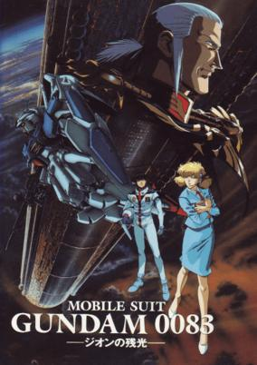

**Studio:** Sunrise &nbsp;|&nbsp; **Director:** Takashi Imanishi &nbsp;|&nbsp; **Aired/Released:** August 29 &nbsp;|&nbsp; **Genres:** Science Fiction, Mecha, Action, Piloted Robot, Space, Adventure

> U.C. 0083 - Three years after the end of the catastrophic One Year War, peace on Earth and the colonies is shattered by the presence of the Delaz Fleet, a rogue Zeon military group loyal to the ideals of the late dictator Gihren Zabi. Delaz Fleet`s ace pilot Anavel Gato, once hailed as "The Nightmare of Solomon", infiltrates the Federation`s Torrington base in Australia and steals the nuclear-armed Gundam GP02A "Physalis" prototype. Rookie pilot Kou Uraki - with the aid of Anaheim Electronics engineer Nina Purpleton and the crew of the carrier Albion - pilots the Gundam GP01 "Zephyranthes" prototype in an attempt to recover the stolen Gundam unit and prevent another war from breaking out.
>
> _Synopsis source: Kitsu_

[Kitsu](https://kitsu.io/anime/mobile-suit-gundam-0083-the-fading-light-of-zeon)

---

### Shō-chan Sora wo Tobu ( Sho Is Flying in the Sky ) (Sho is Flying in the SKy)

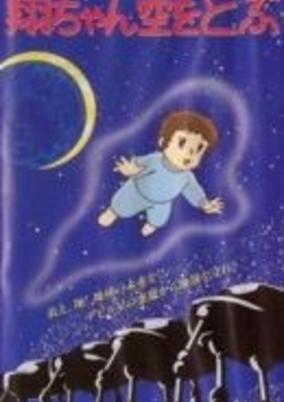

**Studio:** Piano Music Studio; Peter Brothers; Noah Arts Club &nbsp;|&nbsp; **Director:** Takuo Suzuki &nbsp;|&nbsp; **Aired/Released:** November 11 &nbsp;|&nbsp; **Genres:** Science Fiction, Horror

> An anime version of Ikkei Makina's horror novel of the same name. It aired at the same time as the live-action adaptation.
>
> _Synopsis source: Kitsu_

[Kitsu](https://kitsu.io/anime/shou-chan-sora-wo-tobu)

---

### Ginga Eiyū Densetsu: Ōgon no Tsubasa ( Legend of the Galactic Heroes: Golden Wings ) (Legend of the Galactic Heroes: Golden Wings)

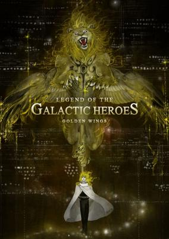

**Studio:** Magic Bus &nbsp;|&nbsp; **Director:** Keizou Shimizu &nbsp;|&nbsp; **Aired/Released:** December 12 &nbsp;|&nbsp; **Genres:** Future, Space, Space Travel, Other Planet, Shipboard, Plot Continuity, Action, Science Fiction, Politics, Drama

> Reinhard von Müsel, a poor nobleman's son, one day discovers that his sister, Annerose, has been sold to the royal family. To get her back he sets out to rise quickly through the military along with his friend Siegfried Kircheis.
>
> _Synopsis source: Kitsu_

[Wikipedia](https://en.wikipedia.org/wiki/Legend_of_the_Galactic_Heroes#Anime) · [Kitsu](https://kitsu.io/anime/ginga-eiyuu-densetsu-gaiden-ougon-no-tsubasa)

---

### Apfelland Monogatari ( The Appleland Story ) (Appleland Story)

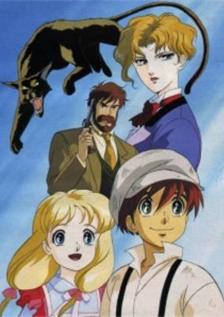

**Studio:** J.C.Staff &nbsp;|&nbsp; **Director:** Kunihiko Yuyama &nbsp;|&nbsp; **Aired/Released:** December 12 &nbsp;|&nbsp; **Genres:** Steampunk, Action, Europe, Historical, Adventure

> Apfelland is a small but beautiful country surrounded by Russia, Austria, and Germany. Vel is a boy who lives in the capital, Charlottenburg. He happens to help a girl Frid. She was kidnapped because radium mine was found in her grandfather's abandoned mine. Aiming at the radium mine, various people gather there, for example, an American who wants to make money, a Polish woman disguised like a man who wants to earn money for the revolution, and the ministry of Apfelland who plots to affiliate with Germany. Vel and Frida are involved in their plots, and they know the secret of the mine.
>
> _Synopsis source: Kitsu_

[Kitsu](https://kitsu.io/anime/apfelland-monogatari)

---

### Chibi Maruko-chan: Watashi no Suki na Uta ( Chibi Maruko-chan: My Favorite Song )

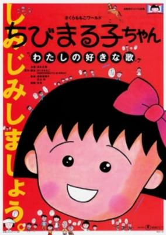

**Studio:** Nippon Animation &nbsp;|&nbsp; **Director:** Yumiko Suda, Tsutomu Shibayama &nbsp;|&nbsp; **Aired/Released:** December 19 &nbsp;|&nbsp; **Genres:** Elementary School, Comedy, Slice of Life, School Life

> Sakura Momoko, who is often referred to as "Chibi Maruko-chan" because of her small size, is a third grade student who lives together with her parents, grandparents and her older sister. At school, her rowdy classmates Oono and Sugiyama have been best friends for as long as anyone can remember. But after a fight during the sports festival, the two boys begin giving each other the cold shoulder, much to the surprise of Maruko and the rest of her class. What's worse, Oono is transferring schools. The two best friends must reconcile before it's too late and Maruko is eager to help.
>
> _Synopsis source: Kitsu_

[Wikipedia](https://en.wikipedia.org/wiki/Chibi_Maruko-chan) · [Kitsu](https://kitsu.io/anime/chibi-maruko-chan-watashi-no-suki-na-uta)

---

## OVA releases

### Handsome Girl * (Handsome Girl)

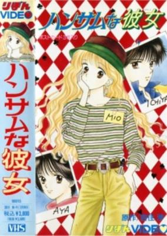

**Studio:** J.C.Staff &nbsp;|&nbsp; **Episodes:** 1 &nbsp;|&nbsp; **Director:** Shunji Ooga &nbsp;|&nbsp; **Aired/Released:** January 21 &nbsp;|&nbsp; **Genres:** Earth, Romance, Japan, Asia, Present

> Hagiwara Mio is a 14-year-old TV actress who has gotten popular. One day on a set, she meets Kumagai Ichiya, who tells her that her acting "stinks". Mio is hurt by his comments, but she finds that she can't get Ichiya out of her mind. It turns out that Ichiya is a promising director, who directed a music video for Mio's friend Sawaki Aya, an idol singer. After the success of this music video, Ichiya is asked to direct a movie, and he wants Mio to be the heroine, because he feels that she is a "handsome" girl like the actresses of old. How will Mio cope with her feelings toward Ichiya?
>
> _Synopsis source: Kitsu_

[Wikipedia](https://en.wikipedia.org/wiki/Handsome_na_Kanojo) · [Kitsu](https://kitsu.io/anime/handsome-girl)

---

### Video Girl Ai

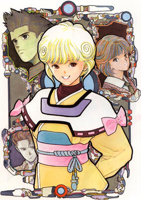

**Studio:** I.G. Tatsunoko &nbsp;|&nbsp; **Episodes:** 6 &nbsp;|&nbsp; **Director:** Mizuho Nishikubo &nbsp;|&nbsp; **Aired/Released:** March 27 &nbsp;|&nbsp; **Genres:** Earth, Ecchi, Romance, Japan, Asia, Sudden Girlfriend Appearance, Love Polygon, Plot Continuity, Present, Comedy

> When Youta is told by the girl he likes, Moemi, that she likes someone else, he rents a video girl tape from a strange video rental shop. When he plays the tape at home, Video Girl Ai emerges from the screen to help him win Moemi's love. But Yohta's VCR had been malfunctioning and now Ai's personality isn't quite what it was designed to be.
>
> _Synopsis source: Kitsu_

[Wikipedia](https://en.wikipedia.org/wiki/Video_Girl_Ai) · [Kitsu](https://kitsu.io/anime/video-girl-ai)

---

### Joker - Marginal City

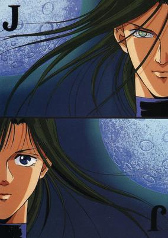

**Studio:** E&G Films; Studio Sign &nbsp;|&nbsp; **Episodes:** 1 &nbsp;|&nbsp; **Director:** Osamu Yamasaki &nbsp;|&nbsp; **Aired/Released:** April 21 &nbsp;|&nbsp; **Genres:** Science Fiction, Action, Human Enhancement, Cyborg, Future, Law And Order, Violence, Romance

> OVA based on the Joker manga by artist Katsumi Michihara (道原かつみ) and writer Yuu Maki (麻城ゆう). Joker is a genetically engineered shape-and-gender-shifter, who created as part of a Special Police Task Force and fights crime of all kinds, but he/she also fits in a little romance around the edges.
>
> _Synopsis source: Kitsu_

[Kitsu](https://kitsu.io/anime/joker-marginal-city)

---

### Sousei Kishi Gaiarth

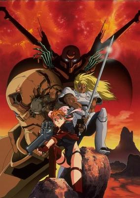

**Studio:** AIC ; Studio Kyuuma &nbsp;|&nbsp; **Episodes:** 3 &nbsp;|&nbsp; **Director:** Shinji Aramaki &nbsp;|&nbsp; **Aired/Released:** April 22 &nbsp;|&nbsp; **Genres:** Science Fiction, Mecha, Post Apocalypse, Action, Swordplay, Android, Adventure

> Gaiarth - a world devastated by a cataclysmic war, where pockets of humanity struggle to survive amidst the wreckage of technologies made magical by ignorance. Gaiarth - a world where artificially intelligent machines doggedly pursue their programmed imperatives: to protect, or destroy, humanity. Gaiarth - a world in which an old and terrible evil has reawakened, threatening to once again bring forth Armageddon!
>
> _Synopsis source: Kitsu_

[Kitsu](https://kitsu.io/anime/sousei-kishi-gaiarth)

---

### Kamasutra: The Ultimate Sex Adventure

**Studio:** E&G Films &nbsp;|&nbsp; **Episodes:** 1 &nbsp;|&nbsp; **Director:** Masayuki Ozeki &nbsp;|&nbsp; **Aired/Released:** April 24

[Wikipedia](https://en.wikipedia.org/wiki/Kamasutra_(manga)#Anime)

---

### K.O. Century Beast Warriors (KO Century Beast Warriors)

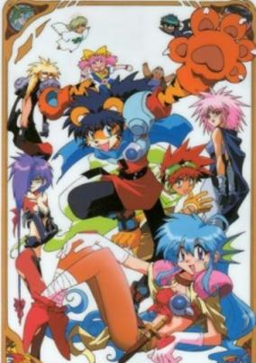

**Studio:** Gainax ; Animate Film &nbsp;|&nbsp; **Episodes:** 7 &nbsp;|&nbsp; **Director:** Hiroshi Negishi &nbsp;|&nbsp; **Aired/Released:** May 2 &nbsp;|&nbsp; **Genres:** Fantasy, Earth, Juujin, Post Apocalypse, Future, Slapstick, Science Fiction, Action, Mecha, Comedy, Disaster, Adventure

> The series is set in the distant future in which the Earth is split in two. The southern hemisphere is placed in another dimension while the inhabitants of the northern hemisphere are able to morph into beast-like humanoids. Eventually the humans of the southern hemisphere, led by Uranus, attack the Beasts. The Three Beasts, Wan Derbard (Wan Dabadadatta) of the Tiger Tribe, Bud Mint (Baado Mint) of the Bird Tribe, and Mei Mer (Mei Mah) of the Mermaid Tribe, are taken prisoner along with Mei Mer's companion Tuttle Millen (Mekka Mannen, also of the Mermaid tribe), but manage to escape thanks to a little girl named Yuuni Charm Password. Together they seek Gaia, which they believe to be a fabulous treasure, but they are pursued by Uranus's minions : V-Darn the vicious mage-knight, V-Sion the warrior woman and Akumako, V-Darn's sadistic imp-like partner.
>
> _Synopsis source: Kitsu_

[Wikipedia](https://en.wikipedia.org/wiki/K.O._Beast) · [Kitsu](https://kitsu.io/anime/ko-seiki-beast-sanjuushi)

---

### Macross II: Lovers Again

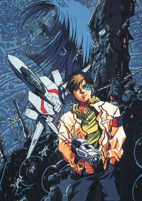

**Studio:** AIC &nbsp;|&nbsp; **Episodes:** 6 &nbsp;|&nbsp; **Director:** Kenichi Yatagai &nbsp;|&nbsp; **Aired/Released:** May 21 &nbsp;|&nbsp; **Genres:** Transforming Craft, Science Fiction, Mecha, Post Apocalypse, Earth, Action, Space Opera, Piloted Robot, Air Force, Humanoid Alien, Shipboard, Alien, Future, Plot Continuity, Space, Military, Music, Adventure

> A.D. 2089 - 80 years have passed since Space War I changed the lives of both human and Zentraedi races. Both races are at peace on Earth when a new alien race called the "Marduk" appear within the Solar System. While covering the first battle between the U.N. Spacy and the Marduk fleet, SNN rookie reporter Hibiki Kanzaki discovers Ishtar, an "Emulator" that enhances the Marduk's combat abilities through singing. Hibiki brings Ishtar to Earth to teach her the values of life and culture. Together with ace Valkyrie pilot Silvie Gena, Hibiki and Ishtar must find a way to save Earth from total destruction at the hands of the Marduk leader Ingues.
>
> _Synopsis source: Kitsu_

[Kitsu](https://kitsu.io/anime/macross-ii-lovers-again)

---

### Spirit of Wonder: China-san no Yuuutsu

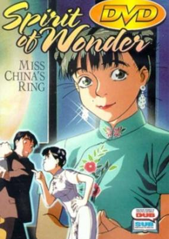

**Studio:** Ajia-do Animation Works &nbsp;|&nbsp; **Episodes:** 1 &nbsp;|&nbsp; **Director:** Mitsuru Hongo &nbsp;|&nbsp; **Aired/Released:** June 3 &nbsp;|&nbsp; **Genres:** Romance, Science Fiction, Fantasy, United Kingdom, Steampunk, Earth, Comedy, Europe, Past

> Sometime during the late 19th century, a young Asian girl has made a place for herself in a seaside town as the owner and operator of the Tenkai restaurant and boarding house.. Yet "Miss China," as the locals call her, is in the dumps. She's got a Mad Scientist named Breckenridge living upstairs who is chronically late with the rent, and she's pining for Jim, a handsome watchmaker's apprentice whom she mistakenly believes is pursuing the local flower girl. But this isn't our world. It is a world that has the Spirit of Wonder, where every so often, just occasionally mind you, amazing things happen. The Mad Scientist actually has come up with an incredible invention, and Jim has an unbelievable plan to use it to give Miss China the most beautiful ring in all the World.
>
> _Synopsis source: Kitsu_

[Wikipedia](https://en.wikipedia.org/wiki/Spirit_of_Wonder) · [Kitsu](https://kitsu.io/anime/spirit-of-wonder-china-san-no-yuuutsu)

---

### Seikima II: Humane Society -Jinruiai ni Michita Shakai-

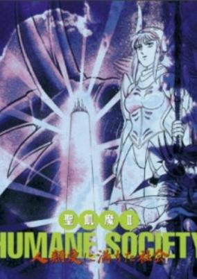

**Studio:** I.G Tatsunoko &nbsp;|&nbsp; **Episodes:** 1 &nbsp;|&nbsp; **Director:** Jun Kamiya &nbsp;|&nbsp; **Aired/Released:** July 1 &nbsp;|&nbsp; **Genres:** Fantasy, Demon

> In the year 199X, mankind faces extinction due to frequent calamities like abnormal weather or huge insect swarms, caused by the power of the demons. However, Rosa, a woman with mysterious powers appears. Not only does she drive back all disasters, she is also revered as the savior of the world. The demons' leader, Demon, is not happy with this. For the sake of his plan to wipe out humanity, he starts the activation of the Tower of Babel, something which causes his life to be targeted by Rosa. On the other hand, Rosa has started the construction of the Tower of Cain. Now an all out battle which will decide the destiny of mankind begins..
>
> _Synopsis source: Kitsu_

[Wikipedia](https://en.wikipedia.org/wiki/Seikima-II#Seikima-II_in_pop_culture) · [Kitsu](https://kitsu.io/anime/seikima-ii-humane-society-jinrui-ai-ni-michita-shakai)

---

### Shiritsu Tantei Toki Shozo no Trouble Note - Hard & Loose

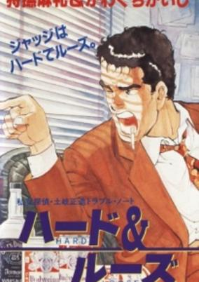

**Studio:** Nippon Animation &nbsp;|&nbsp; **Episodes:** 1 &nbsp;|&nbsp; **Director:** Noboru Ishiguro &nbsp;|&nbsp; **Aired/Released:** July 1 &nbsp;|&nbsp; **Genres:** Detective, Action, Mystery

> Based on the manga by Tsuchiya Garon (aka Marley Carib), art by Kawaguchi Kaiji, serialised in Action in the 80s.
>
> _Synopsis source: Kitsu_

[Kitsu](https://kitsu.io/anime/hard-loose)

---

### Iron Virgin Jun

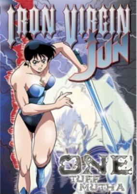

**Studio:** Triangle Staff &nbsp;|&nbsp; **Episodes:** 1 &nbsp;|&nbsp; **Director:** Fumio Maezono &nbsp;|&nbsp; **Aired/Released:** July 21 &nbsp;|&nbsp; **Genres:** Wrestling, Fantasy, Action, Comedy, Ghost, Martial Arts, Dark Fantasy, Super Power

> In the Asuka family, nothing is more important than family tradition. For their lovely young daughter Jun, it means she must get married on her 18th birthday. Although poor little virgin Jun is not above kickin' butt, she just can't stand the thought of marrying someone she doesn't love. Her mother sends out a gang of bloodthirsty goons to drag her to the altar, but Jun would rather beat a hundred suitors into one big bloody mess than get married on her mother's terms, and she's about to prove it.
>
> _Synopsis source: Kitsu_

[Wikipedia](https://en.wikipedia.org/wiki/Iron_Virgin_Jun) · [Kitsu](https://kitsu.io/anime/iron-virgin-jun)

---

### Mikeneko Holmes: The Lord of Ghost Castle

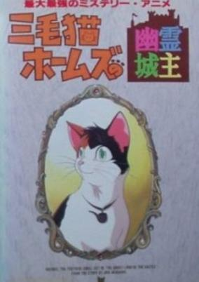

**Studio:** AIC &nbsp;|&nbsp; **Episodes:** 1 &nbsp;|&nbsp; **Director:** Nobuyuki Kitajima &nbsp;|&nbsp; **Aired/Released:** July 21 &nbsp;|&nbsp; **Genres:** Detective, Comedy, Mystery

> Based on Akagawa Jirou's popular book series about hapless detective Katayama Yoshitaro who lives with his sister Harumi and their cat Holmes, which has a sixth sense when it comes to solve mysteries. In this stand alone OVA the aftershow party of Harumi's acting troupe becomes the showplace of murder and tragedy. Luckily Yoshitaro brought Holmes along.
>
> _Synopsis source: Kitsu_

[Kitsu](https://kitsu.io/anime/mikeneko-holmes-no-yuurei-joushu)

---

### Giant Robo (Giant Robo the Animation: The Day the Earth Stood Still)

**Studio:** Mu Animation Studio &nbsp;|&nbsp; **Episodes:** 7 &nbsp;|&nbsp; **Director:** Yasuhiro Imagawa &nbsp;|&nbsp; **Aired/Released:** July 22 &nbsp;|&nbsp; **Genres:** Earth, Action, Mecha, Steampunk, Science Fiction, Special Squads, Plot Continuity, Super Power

> In a future to come humanity enjoys a new age of prosperity thanks to Dr. Shizuma's invention of a revolutionary renewable energy source: the Shizuma Drive. But this peace is threatened by Big Fire, a cabal seeking world domination. Against Big Fire the International Police Organisation dispatches a collection of superpowered warriors and martial artists, together with Daisaku Kusama, inheritor and master of Earth's most powerful robot, Giant Robo. By capturing an abnormal Shizuma Drive which is essential to Big Fire's plans the IPO ignites a desperate conflict between the two groups. The coming battle will test Daisaku's resolve to the utmost, reveal the ghastly truth behind the creation of the Shizuma Drive, and bring human civilization to its knees! Giant Robo is a character-driven adventure in a retro-futuristic setting, drawing on influences from opera, kung-fu cinema, wuxia stories and classic mecha anime. It incorporates characters from the works of the manga author Mitsuteru Yokoyama but it is designed to be a stand-alone story.
>
> _Synopsis source: Kitsu_

[Kitsu](https://kitsu.io/anime/giant-robo-the-animation-chikyuu-ga-seishi-suru-hi)

---

### Hōkago no Tinker Bell

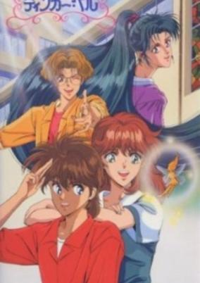

**Studio:** Production Reed &nbsp;|&nbsp; **Episodes:** 1 &nbsp;|&nbsp; **Director:** Yasushi Murayama &nbsp;|&nbsp; **Aired/Released:** July 22 &nbsp;|&nbsp; **Genres:** Romance, Unrequited Love, Comedy, Slice of Life, School Life, Mystery

> Based on a story from the After School Series line of light novels. Kenichi Akizuki and Misako Watanabe work together to solve the mysterious disappearance of their classmate Ryouko Miyazaki. The only clue left by the kidnapper is signed Koushin Okazaki, her late classmate who'd committed suicide to preserve his youth and become like Peter Pan.
>
> _Synopsis source: Kitsu_

[Kitsu](https://kitsu.io/anime/houkago-no-tinker-bell)

---

### Karasu Tengu Kabuto: Ôgon no me no Kemono

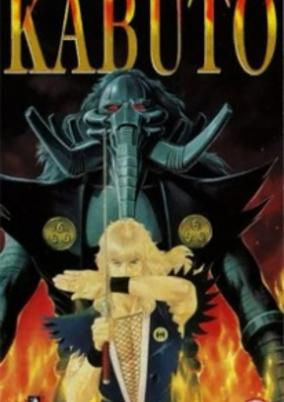

**Studio:** Nakamura Production &nbsp;|&nbsp; **Episodes:** 1 &nbsp;|&nbsp; **Director:** Buichi Terasawa &nbsp;|&nbsp; **Aired/Released:** July 24 &nbsp;|&nbsp; **Genres:** Samurai, Swordplay, Past, Historical, Demon, Dark Fantasy, Violence, Action, Fantasy, Adventure

> Kabuto is a tengu who has to save a princess from fortress which is full of monster-mecha hybrids in an alternate reality of feudal Japan.
>
> _Synopsis source: Kitsu_

[Wikipedia](https://en.wikipedia.org/wiki/Karasu_Tengu_Kabuto#Original_video_animation) · [Kitsu](https://kitsu.io/anime/karasu-tengu-kabuto-ougon-no-me-no-kemono)

---

### Nozomi Witches

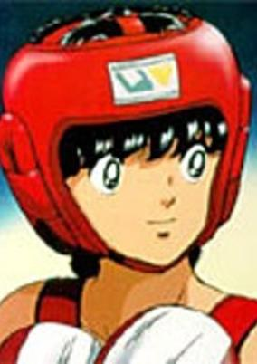

**Studio:** Group TAC &nbsp;|&nbsp; **Episodes:** 3 &nbsp;|&nbsp; **Director:** Gisaburō Sugii &nbsp;|&nbsp; **Aired/Released:** August 5 &nbsp;|&nbsp; **Genres:** Romance, Boxing, Action, Combat, Sports

> Ryoutaro Shiba and his family have just moved into a new housing neighborhood. He soon discovers he is lucky enough to be living next to a beautiful and bewitching girl named Nozomi Egawa. Nozomi is athletic, an actress, and surprisingly more than anything else, she wants Ryoutaro to become a boxer so that he can fulfil her dream. Ryoutaro isn't exactly sure what Nozomi's dream is, but he definitely does not want to become a boxer. Unfortunately for Ryoutaro, he finds himself being dragged to the high school boxing club because Nozomi has written a resume for him claiming that he is a boxing genius! It actually seems that Ryoutaro has a special gift for boxing that he has never known about before. Ryoutaro soon finds himself in the winners' circle. But for how long can he last, and can he really live up to Nozomi's expectations?
>
> _Synopsis source: Kitsu_

[Wikipedia](https://en.wikipedia.org/wiki/Nozomi_Witches) · [Kitsu](https://kitsu.io/anime/nozomi-witches)

---

### Oira Sukeban

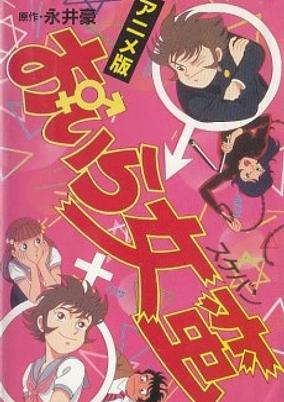

**Studio:** Studio Signal Club &nbsp;|&nbsp; **Episodes:** 1 &nbsp;|&nbsp; **Director:** Yūsaku Saotome &nbsp;|&nbsp; **Aired/Released:** August 21 &nbsp;|&nbsp; **Genres:** Earth, Japan, Action, Asia, Comedy, Absurdist Humour, Martial Arts, Slapstick, Present, Ecchi, School Life

> Does being the only guy in an all girl school sound like paradise? It might be, if the girls knew you were a guy, but to stay in school teenage pervert Banji can't let can't let anyone find out his chromosomes don't match. Banji's status conscious parents want him to go to a good school, but not enough to spend the money on a good co-ed school. Now, in addition to studying math and science, Banji has to learn how to put on a bra and makeup. His life has become a living hell. Not only is he at the bottom of the social pecking order, he must also got to conceal his inner-masculinity from the pretty classmate girl who's stolen his heart while avoiding the female bullies who threaten to expose his less-than-feminine charms in the locker room.
>
> _Synopsis source: Kitsu_

[Wikipedia](https://en.wikipedia.org/wiki/Oira_Sukeban) · [Kitsu](https://kitsu.io/anime/delinquent-in-drag)

---

### Bastard!! Ankoku no Hakaishin (Bastard!!)

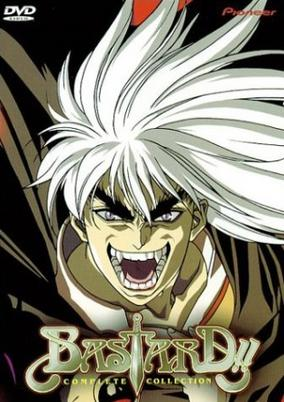

**Studio:** AIC &nbsp;|&nbsp; **Episodes:** 6 &nbsp;|&nbsp; **Director:** Katsuhito Akiyama &nbsp;|&nbsp; **Aired/Released:** August 25 &nbsp;|&nbsp; **Genres:** Magic, Super Power, Fantasy World, Violence, Stereotypes, Action, Fantasy, Adventure, Comedy, Ecchi

> The characters in Bastard!! have forsaken technology and have traded it in for magic and the occult arts. The story revolves around a group of five magicians who set out to rebuild their world after a rampaging God destroys it and tips it into chaos. Driven by their leader Dark Schneider, Gara, Arshes Nei, Abigail and Kall Su set out to conquer kingdoms in the hope of rebuilding them into utopias, with each of the magicians having their own personal agenda in doing so. However, Dark Schneider's often reckless manner and short temper leads him to wreak havoc where ever he goes. He is trapped by a group of clerics in a baby boy, leaving the four without a leader. Fifteen years later, the four still continue their quest but their motives have changed to despotic world domination, and it is up to Dark Schneider to show them the "error of their ways," when he is freed by the clerics who once imprisoned him, so that he may defend them against his former comrades. It has now become Dark Schneider's responsibility to track down each one of his companions and set them on the right path again, but what seems to be the once reckless and amoral Dark Schneider has changed over his fifteen year imprisonment within the boy, Luche Len Len.
>
> _Synopsis source: Kitsu_

[Wikipedia](https://en.wikipedia.org/wiki/Bastard!!) · [Kitsu](https://kitsu.io/anime/bastard)

---

### Hello Harinezumi: Satsui no Ryoubun (Domain of Murder)

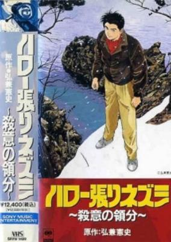

**Studio:** Studio Deen &nbsp;|&nbsp; **Episodes:** 1 &nbsp;|&nbsp; **Director:** Iku Suzuki &nbsp;|&nbsp; **Aired/Released:** September 1 &nbsp;|&nbsp; **Genres:** Japan, Detective, Psychological, Mystery

> On the trail of a missing husband, private investigator Goro crosses paths with a deranged killer.
>
> _Synopsis source: Kitsu_

[Kitsu](https://kitsu.io/anime/domain-of-murder)

---

### Hanappe Bazooka

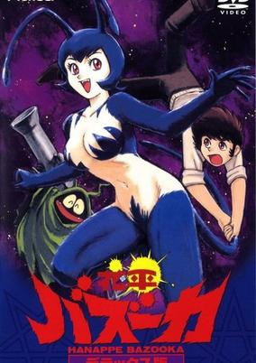

**Studio:** Studio Signal &nbsp;|&nbsp; **Episodes:** 1 &nbsp;|&nbsp; **Director:** Takahiro Ikegami &nbsp;|&nbsp; **Aired/Released:** September 4 &nbsp;|&nbsp; **Genres:** Fantasy, Japan, Magic, Present, Demon, Super Power, Action, Comedy, Ecchi, School Life

> Lecherous high school boy Hanappe is visited by two demons who step from his TV and immediately fall in lust with his mother and sister. The demons turn Hanappe's home into a meeting ground for their demonic friends and grant Hanappe the power of the Hanappe Bazooka. Now his index finger is capable of both a deadly blast and the ability to drive women in a lustful frenzy, but Hanappe isn't very good at controlling it and winds up in serious trouble.
>
> _Synopsis source: Kitsu_

[Wikipedia](https://en.wikipedia.org/wiki/Hanappe_Bazooka) · [Kitsu](https://kitsu.io/anime/hanappe-bazooka)

---

### Ushio to Tora (Ushio and Tora)

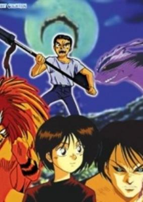

**Studio:** Pastel &nbsp;|&nbsp; **Episodes:** 10 &nbsp;|&nbsp; **Director:** Kunihiko Yuyama &nbsp;|&nbsp; **Aired/Released:** September 21 &nbsp;|&nbsp; **Genres:** Swordplay, Demon, Japan, Action, Fantasy, Horror, Comedy, Supernatural, Shounen

> Ushio thinks his father's tale of an ancient ancestor impaling a demon on a temple altar stone with the legendary Beast Spear is nuts, but when he finds the monster in his own basement, Ushio has to take another look at the family legend! Fortunately, Ushio knows it's best to let sleeping dogs lie and leave captured demons where they are. Unfortunately, the release of the monster's evil energies begins to beckon other demons to Ushio's hometown! To save his friends and family from the invading spirits, Ushio is forced to release Tora from his captivity. But will the cure prove to be worse than the curse? Will Ushio end his life a Tora-snack? Or will the Beast Spear keep Tora in line long enough to save the city?
>
> _Synopsis source: Kitsu_

[Wikipedia](https://en.wikipedia.org/wiki/Ushio_%26_Tora) · [Kitsu](https://kitsu.io/anime/ushio-to-tora)

---

### Tenchi Muyo! Ryo-Ohki

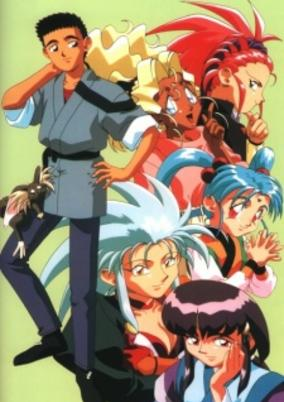

**Studio:** AIC &nbsp;|&nbsp; **Episodes:** 6 &nbsp;|&nbsp; **Director:** Hiroki Hayashi &nbsp;|&nbsp; **Aired/Released:** September 25 &nbsp;|&nbsp; **Genres:** Fantasy, Ecchi, Science Fiction, Japan, Action, Comedy, Sudden Girlfriend Appearance, Humanoid Alien, Alternative Present, Stereotypes, Plot Continuity, Harem, Space

> Tenchi Masaki was a normal 17-year-old boy until the day he accidentally releases the space pirate, Ryoko from a cave she was sealed in 700 years ago as the people thought she was a demon. In a series of events, four other alien girls show up at the Masaki household as Tenchi learns much of his heritage he never knew about and deal with five alien girls who each have some sort of romantic interest in him.
>
> _Synopsis source: Kitsu_

[Wikipedia](https://en.wikipedia.org/wiki/Tenchi_Muyo!_Ryo-Ohki) · [Kitsu](https://kitsu.io/anime/tenchi-muyo-ryo-ohki)

---

### Tokyo Babylon

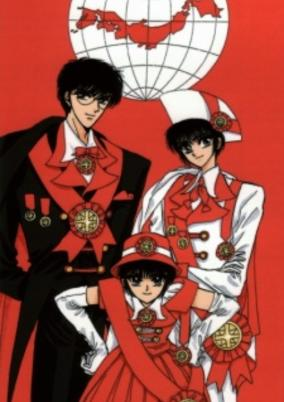

**Studio:** Madhouse &nbsp;|&nbsp; **Episodes:** 2 &nbsp;|&nbsp; **Director:** Koichi Chigira &nbsp;|&nbsp; **Aired/Released:** October 21 &nbsp;|&nbsp; **Genres:** Science Fiction, Earth, Fantasy, Japan, Action, Asia, Detective, Magic, Present, Mystery

> Subaru Sumeragi is the 13th head of the Sumeragi Clan and a most powerful onmyouji. Subaru is hired to exorcise a construction site, but his employer mysteriously died. The only suspect is a man who repeatedly walks away from situations in which he should have died. Then Subaru meets a young woman intent upon cursing the man, saying that he killed her brother. Subaru must figure out how his employer died and fight the evil spirits that are protecting the man with the help of his friend and twin sister, Seishirou Sakurazuka and Hokuto Sumeragi.
>
> _Synopsis source: Kitsu_

[Wikipedia](https://en.wikipedia.org/wiki/Tokyo_Babylon) · [Kitsu](https://kitsu.io/anime/tokyo-babylon)

---

### All Purpose Cultural Cat Girl Nuku Nuku

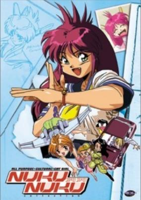

**Studio:** Animate Film &nbsp;|&nbsp; **Episodes:** 6 &nbsp;|&nbsp; **Director:** Yoshio Ishiwata &nbsp;|&nbsp; **Aired/Released:** October 21 &nbsp;|&nbsp; **Genres:** Earth, Japan, Action, Asia, Comedy, Android, Slapstick, School Life, Mecha, Science Fiction, Adventure

> When Ryunosuke's pet cat dies in an accident, his inventor father "resurrects" the cat by placing its brain in an android body made in the form of a young girl. The Android, Nukunuku, has the dual purposes of being a companion/sister for Ryunosuke as well as being a bodyguard for his father. Nukunuku's extreme strength and feline agility are regularly needed to protect Ryunosuke and his father from Ryunusuke's mother who seeks to kidnap them both following her divorce from his father. Her motives towards Ryunusuke are simple motherly love, however her genius-inventor-ex-husband she wants to put to work designing weapons of mass destruction for her weapons company.
>
> _Synopsis source: Kitsu_

[Wikipedia](https://en.wikipedia.org/wiki/All_Purpose_Cultural_Cat_Girl_Nuku_Nuku) · [Kitsu](https://kitsu.io/anime/bannou-bunka-neko-musume)

---

### Gensou Jotan Ellcia (Ellcia)

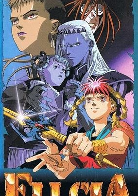

**Studio:** J.C.Staff &nbsp;|&nbsp; **Episodes:** 4 &nbsp;|&nbsp; **Director:** Yoriyasu Kogawa &nbsp;|&nbsp; **Aired/Released:** October 23 &nbsp;|&nbsp; **Genres:** Pirate, Fantasy, Fantasy World, Action, Island, Swordplay, Plot Continuity, Violence, Adventure

> The Sacred Book of the land of Eija has been rediscovered and with it the legends of a mysterious and all powerful ship. Now Princess Crystal of Megaronia has set forth on a quest to recover the ship and its ultimate weaponry. All that stands between her and total domination of the world is a small group of piratical misfits. Swords, sorcery and technology blend to form a mesmerizing tale of Good vs. Evil in Ellcia.
>
> _Synopsis source: Kitsu_

[Kitsu](https://kitsu.io/anime/gensou-jotan-ellcia)

---

### Black Lion

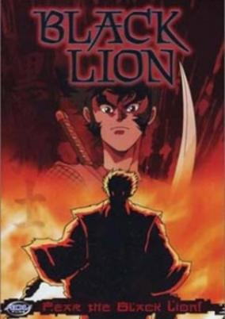

**Studio:** Tokyo Kids; Minami Machi Bugyousho &nbsp;|&nbsp; **Episodes:** 1 &nbsp;|&nbsp; **Director:** Takashi Watanabe &nbsp;|&nbsp; **Aired/Released:** November 21 &nbsp;|&nbsp; **Genres:** Ninja, Science Fiction, Mecha, Earth, Japan, Action, Asia, Alternative Past, Sengoku Period, Swordplay, Cyborg, Past, Stereotypes, Violence, Historical, Adventure

> The year is 1580. Using an army of soldiers equipped with sophisticated weaponry, Nobunaga Oda is on the verge of ruling Japan with an iron fist. One of his enforcers is Ginnai Doma - a fallen samurai reborn into an indestructible killing machine. As Ginnai continues his killing spree on ninjas and those who oppose Nobunaga's rule, Shishimaru of the Iga Ninja - going against the Koga Ninja's plans - pursues a one-man vendetta to avenge the deaths of his comrades and kill the immortal warrior.
>
> _Synopsis source: Kitsu_

[Kitsu](https://kitsu.io/anime/jigen-sengokushi-kuro-no-shishi-jinnai-hen)

---

### Fūma no Kojirō Saishushou: Fuma Hanran-hen

**Studio:** AIC; J.C. Staff &nbsp;|&nbsp; **Episodes:** 1 &nbsp;|&nbsp; **Director:** Hidehito Ueda &nbsp;|&nbsp; **Aired/Released:** November 21

[Wikipedia](https://en.wikipedia.org/wiki/F%C5%ABma_no_Kojir%C5%8D#Special)

---

### Green Legend Ran

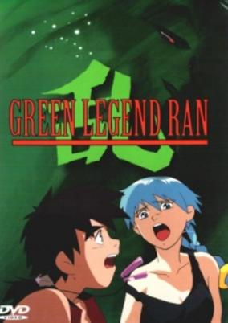

**Studio:** AIC &nbsp;|&nbsp; **Episodes:** 3 &nbsp;|&nbsp; **Director:** Satoshi Saga &nbsp;|&nbsp; **Aired/Released:** November 25 &nbsp;|&nbsp; **Genres:** Desert, Science Fiction, Post Apocalypse, Adventure, Action, Earth, Humanoid Alien, Violence

> A story of future Earth - A warning for mankind: In the future, our planet will be transformed into a strange new world where human life struggles on an Earth without rain or oceans - only vast, parched deserts. Two youths fight for survival on our hostile planet and find hope. The sea, the sky and the land had been completely polluted by mankind when mysterious objects fall from the heavens. These titanic vessels smash into the planet and suck up the air, water, and most living creatures into their womb, stealing away the very essence of Earth`s nature. The few remaining inhabitants struggle for survival against a hostile environment and an oppressive ruling race known as the Rodo. One young, hot-blooded human named Ran, fights against the Rodo and a world in which rain is only a legend. He strives to join an Anti-Rodo group known as the Hazzard, not only to defeat the Rodo, but also to hunt down the man who killed his mother.
>
> _Synopsis source: Kitsu_

[Wikipedia](https://en.wikipedia.org/wiki/Green_Legend_Ran) · [Kitsu](https://kitsu.io/anime/green-legend-ran)

---

### Ys: Tenkuu no Shinden - Adol Christine no Bouken

**Studio:** Tokyo Kids &nbsp;|&nbsp; **Episodes:** 4 &nbsp;|&nbsp; **Director:** Takashi Watanabe &nbsp;|&nbsp; **Aired/Released:** December 16

[Wikipedia](https://en.wikipedia.org/wiki/Ys_(anime))

---

### New Dream Hunter Rem: Setsuriku no Mudenmekyu

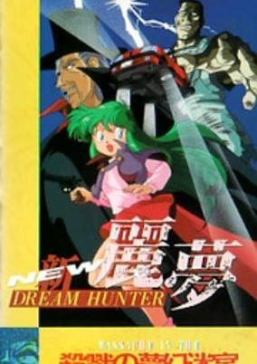

**Studio:** Studio Zain &nbsp;|&nbsp; **Episodes:** 1 &nbsp;|&nbsp; **Director:** Seiji Okuda &nbsp;|&nbsp; **Aired/Released:** December 16 &nbsp;|&nbsp; **Genres:** Magic, Ecchi

> Rem is an ordinary woman in our world but, in the world of dreams, she becomes a dream warrior, defending humanity from the evils there. When dream demons reach the waking world, she fights them with the help of her pets which transform into a tiger and wolf.
>
> _Synopsis source: Kitsu_

[Wikipedia](https://en.wikipedia.org/wiki/Dream_Hunter_Rem) · [Kitsu](https://kitsu.io/anime/new-dream-hunter-rem-setsuriku-no-mudenmekyu)

---

### Download: Namu Amida Butsu wa Ai no Uta (Download: Devil's Circuit)

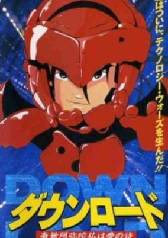

**Studio:** Madhouse &nbsp;|&nbsp; **Episodes:** 1 &nbsp;|&nbsp; **Director:** Rintaro &nbsp;|&nbsp; **Aired/Released:** December 18 &nbsp;|&nbsp; **Genres:** Science Fiction, Cyberpunk, Action, Adventure, Psychological

> An exciting cyberpunk romp directed by Rintaro with veteran animator Kanada Yoshinori about a genius hacker and a gang of hot-rodders.
>
> _Synopsis source: Kitsu_

[Kitsu](https://kitsu.io/anime/download)

---

### Eien no Filena

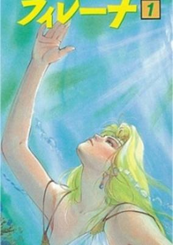

**Studio:** Pierrot &nbsp;|&nbsp; **Episodes:** 6 &nbsp;|&nbsp; **Director:** Yoshikata Nitta &nbsp;|&nbsp; **Aired/Released:** December 21 &nbsp;|&nbsp; **Genres:** Fantasy, Fantasy World, Action, Shoujo Ai, Swordplay, High Fantasy, Adventure

> The story is centered around Filena, a princess who was raised as a boy after her kingdom was conquered.
>
> _Synopsis source: Kitsu_

[Wikipedia](https://en.wikipedia.org/wiki/Eternal_Filena) · [Kitsu](https://kitsu.io/anime/eien-no-filena)

---

## TV series

### Mama wa Shōgaku 4 Nensei (Mama is Just a Fourth Grade Pupil)

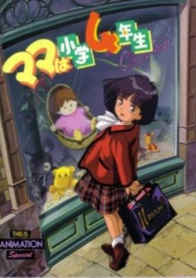

**Studio:** Sunrise Studios &nbsp;|&nbsp; **Episodes:** 51 &nbsp;|&nbsp; **Director:** Shūji Iuchi &nbsp;|&nbsp; **Aired/Released:** January 10 &nbsp;|&nbsp; **Genres:** Elementary School, School Life, Science Fiction, Comedy, Present

> Natsumi Mizuki is a 4th grader whose parents have gone to London. Her Aunt Izumi comes to live with her. Izumi is an aspiring manga writer who is trying to get her first big break, so she doesn't have time for a baby that appears out of thin air on Natsumi's first night alone. The baby's name is Mirai and her mother is *Natsumi*, but 15 years older. Somehow, Mirai had traveled back in time. Now the young Natsumi has to raise Mirai while trying to keep her 4th grade life from falling apart and keep Mirai-chan secret from everyone. She has the dubious help of Izumi and some baby-care gadgets from the future.
>
> _Synopsis source: Kitsu_

[Wikipedia](https://en.wikipedia.org/wiki/Mama_wa_Sh%C5%8Dgaku_4_Nensei) · [Kitsu](https://kitsu.io/anime/mama-wa-shougaku-4-nensei)

---

### Bush Baby, Little Angel of the Grasslands (Bush Baby)

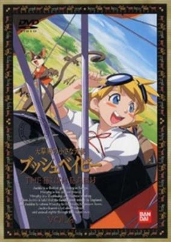

**Studio:** Nippon Animation &nbsp;|&nbsp; **Episodes:** 40 &nbsp;|&nbsp; **Director:** Takayoshi Suzuki &nbsp;|&nbsp; **Aired/Released:** January 12 &nbsp;|&nbsp; **Genres:** Africa, Earth, Adventure

> When Jackie Rhodes, a british girl living in Kenya with her family, finds an ill animal called a Bushbaby, she adopts him, calls him Murphy and nurses him back to health. Murphy, Jackie, her family and their friends go on many adventures involving wild animals, poachers and more. But when Jackie's father is recalled to England, Jackie must leave her life in Africa behind. However, before she can go, Jackie, Murphy and Tembo, a friend of Jackie's father, go on one last adventure: they must cross the dangerous savannah to escape the poachers and corrupt police officers chasing them. Along the way, Jackie teaches the now domesticated Murphy to survive in the wild, so that, before she leaves, she can release him in his natural habitat.
>
> _Synopsis source: Kitsu_

[Wikipedia](https://en.wikipedia.org/wiki/The_Bush_Baby) · [Kitsu](https://kitsu.io/anime/the-bush-baby)

---

### Sailor Moon (Sailor Moon R)

**Studio:** Toei Animation &nbsp;|&nbsp; **Episodes:** 46 &nbsp;|&nbsp; **Director:** Junichi Sato &nbsp;|&nbsp; **Aired/Released:** March 7 &nbsp;|&nbsp; **Genres:** Romance, Earth, Japan, Action, Asia, Magic, Humanoid Alien, Magical Girl, Plot Continuity, Present, Demon, Super Power, Shoujo, Henshin

> The season is divided into two arcs: One arc being an anime filler (to give Takeuchi Naoko time to make the next manga), and the other arc being the actual Black Moon plot. The first arc shows Usagi and Co. having their memories restored from the first season. Their enemies are a pair of aliens, Ail and Ann, who are seeking human energy to restore their life tree. Mamoru had yet to recover his memories and he appeared as the Moonlight Knight rather than Tuxedo Kamen. This arc only lasted for 13 episodes. The second arc introduces Chibi-Usa, a little girl from the future who is searching for the Silver Crystal. The new enemies are the Black Moon Clan, comprising of the Ayakashi sisters (Cooan, Beruche, Karaberas, and Petz), Rubeus, Safir, Esmeraude, Prince Demando, and Wiseman. They too want the Silver Crystal so that they can take over the future. The Sailor Senshi's adventure continues...
>
> _Synopsis source: Kitsu_

[Wikipedia](https://en.wikipedia.org/wiki/Sailor_Moon_(season_1)) · [Kitsu](https://kitsu.io/anime/bishoujo-senshi-sailor-moon-r)

---

### Genki Bakuhatsu Ganbaruger (Energetic Bomb Ganbaruger)

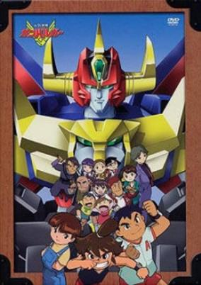

**Studio:** Sunrise &nbsp;|&nbsp; **Episodes:** 47 &nbsp;|&nbsp; **Director:** Toshifumi Kawase &nbsp;|&nbsp; **Aired/Released:** April 1 &nbsp;|&nbsp; **Genres:** Science Fiction, Mecha

> Koutarou's father is trying to train his son in the art of the ninja, but a mis-hit bomb accidently damages a shrine and releases a great demon that Eldoran had been keeping contained. Eldoran manages to contain him, but one of his servants manages to escape as well, and now attempts to free his master. To stop him, Eldoran grants the three mecha Gotiger, King Elephan, and Mach Eagle to Koutarou and his two friends, as well as suits that grant each of them a special power. Miracle Ninja Ganbare Team is born!
>
> _Synopsis source: Kitsu_

[Wikipedia](https://en.wikipedia.org/wiki/Genki_Bakuhatsu_Ganbaruger) · [Kitsu](https://kitsu.io/anime/genki-bakuhatsu-ganbaruger)

---

### Salad Juu Yuushi Tomatoman (Tomatoman)

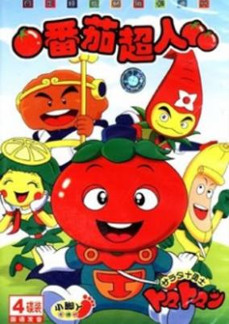

**Studio:** TV Tokyo &nbsp;|&nbsp; **Episodes:** 50 &nbsp;|&nbsp; **Aired/Released:** April 3 &nbsp;|&nbsp; **Genres:** Fantasy, Adventure, Comedy

> Tomato is one of the 10 knights of the salad kindom. Young and clumsy, yet always ends up saving the day and is admired by everyone even the pretty princess peach, who he desperately falls in love with.Every episode they embark on a new journey to solve a new mission. This would be easier if only the insect band didn't get in their way every time.
>
> _Synopsis source: Kitsu_

[Kitsu](https://kitsu.io/anime/tomatoman)

---

### Crayon Shin-chan (Shin Chan)

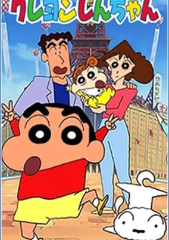

**Studio:** Shin-Ei Animation &nbsp;|&nbsp; **Episodes:** – &nbsp;|&nbsp; **Director:** Mitsuru Hongo &nbsp;|&nbsp; **Aired/Released:** April 13 &nbsp;|&nbsp; **Genres:** Japan, Elementary School, Ecchi, Comedy, School Life, Slice of Life, Kids

> Just because an anime features a young protagonist does not necessarily mean that it is an appropriate series to show your children. Young Shinnosuke, or Shin-chan for short, is a very creative young boy that lives with his eccentric parents, Misae and Hiroshi, as well as his Prima Donna younger sister, Himawari, and has loads of unique friends to boot. Everyday life for little Shin-chan is full of funny (and shocking) moments, most of which stem from his unnatural and sometimes profane use of language, as well as his constant acts of inappropriate behavior. Shin-chan's famous "elephant" gag is one of the most defining moments in Crayon Shin-chan, simply because it is the epitome of crude comedy, one of the core themes of the series.Crayon Shin-chan is a hilarious show about the day in the life of a young, curious boy, that captures the awkwardness of growing up as well as the beauty of being true to one's self, no matter what others say.
>
> _Synopsis source: Kitsu_

[Wikipedia](https://en.wikipedia.org/wiki/Crayon_Shin-chan) · [Kitsu](https://kitsu.io/anime/crayon-shin-chan)

---

### Ashita e Free Kick

**Studio:** Production Reed &nbsp;|&nbsp; **Episodes:** 52 &nbsp;|&nbsp; **Director:** Tetsuro Amino &nbsp;|&nbsp; **Aired/Released:** April 14 &nbsp;|&nbsp; **Genres:** Action, Sports, Soccer

> Shun Godai is a young boy who likes soccer. But his grandfather, a successful businessman, want his grandson to follow his path...
>
> _Synopsis source: Kitsu_

[Kitsu](https://kitsu.io/anime/ashita-e-free-kick)

---

### Aah! Harimanada

**Studio:** TV Tokyo &nbsp;|&nbsp; **Episodes:** 23 &nbsp;|&nbsp; **Director:** Yukio Okazaki &nbsp;|&nbsp; **Aired/Released:** April 23 &nbsp;|&nbsp; **Genres:** Wrestling, Japan, Action, Asia, Combat, Sports, Present, Martial Arts

> When Harimanada makes his grand entrance into the world of Sumo, he causes complete uproar throughout the entire arena. The novelty headmask is clearly not a good idea but not content with just ruffling the feathers of all the spectators, he sends the the entire Sumo Association into a frenzy when he arrogantly declares that he will surpass the legendary Futabayama's consecutive run of 69 victories. Should he fail to achieve such a feat, he will immediately retire all together. Harimanada's impudent remarks cause a huge backlash as every high-ranking Yokuzuna wants the chance to knock him down and humiliate him for showing such arrogance. Thus begins Harimanada's journey to the top as he battles to topple the entire Sumo hierarchy!
>
> _Synopsis source: Kitsu_

[Wikipedia](https://en.wikipedia.org/wiki/Aah!_Harimanada) · [Kitsu](https://kitsu.io/anime/aa-harimanada)

---

### Yadamon (Yadamon: Magical Dreamer)

**Studio:** Group TAC &nbsp;|&nbsp; **Episodes:** 170 &nbsp;|&nbsp; **Director:** Masuji Harada Takashi Yui &nbsp;|&nbsp; **Aired/Released:** August 24 &nbsp;|&nbsp; **Genres:** Fantasy, Comedy, Magical Girl, Adventure

> After causing havoc in the Witch Forest, the queen, Yadamon's mother, banishes her to human world. She does this not only to teach Yadamon a lesson, but also because she has a secret passion for human magazines and books. While at the human world, the queen keeps a close watch at Yadamon which becomes a problem cause she falls asleep almost anywhere. The human world has gone extremely hi-tech. Also, a lot of animals has become extinct. Yadamon finds herself in the island named ''Creature Island'', where genetically re-created species are being made. In the island she meets Jean and his parents Edward and Maria. Yadamon meets many misadventures in the human world due to her curiosity which causes a lot of trouble to the humans and her guardian fairy, Timon, who has the ability to stop time. As Yadamon learns to adapt to human world and use her powers, a new threat is brewing. Kira, the evil witch who was sealed inside a volcano by the queen and the great witch Beril, has escaped. She is out for revenge and has set her eyes to the humans and Yadamon.
>
> _Synopsis source: Kitsu_

[Wikipedia](https://en.wikipedia.org/wiki/Yadamon) · [Kitsu](https://kitsu.io/anime/yadamon)

---

### Hime-chan no Ribbon

**Studio:** Studio Gallop ; NAS &nbsp;|&nbsp; **Episodes:** 61 &nbsp;|&nbsp; **Director:** Hatsuki Tsuji &nbsp;|&nbsp; **Aired/Released:** October 2 &nbsp;|&nbsp; **Genres:** Fantasy, Romance, Japan, Comedy, Middle School, Magic, School Life, Magical Girl, Present

> Erika, the princess of the Magic Kingdom has come to Earth in order to find a human girl who looks just like her. That girl turns out to be Himeko Nonohara, a tomboy's tomboy. Erika must give Himeko a magical item she has created in order to prove her worth as a successor to the crown. Himeko must test this item, a hair ribbon that allows her to transform into any other person she sees, to see if it is worthy. The series follows Himeko's adventures and her budding romance with Daichi, the boy who discovers her secret.
>
> _Synopsis source: Kitsu_

[Wikipedia](https://en.wikipedia.org/wiki/Hime-chan%27s_Ribbon) · [Kitsu](https://kitsu.io/anime/hime-chan-no-ribbon)

---

### Tsuyoshi Shikkari Shinasai

**Studio:** Studio Comet &nbsp;|&nbsp; **Episodes:** 112 &nbsp;|&nbsp; **Director:** Shin Misawa &nbsp;|&nbsp; **Aired/Released:** October 4 &nbsp;|&nbsp; **Genres:** Comedy, School Life, Slice of Life, Drama, Romance

> Tsuyoshi Ikawa lives at home with his popular and beautiful sisters. Despite their qualities, his sisters and his mother are horrible at household chores, including cooking, so all these duties are taken over by Tsuyoshi while his father is away due to being temporarily transferred to another city for work.
>
> _Synopsis source: Kitsu_

[Wikipedia](https://en.wikipedia.org/wiki/Tsuyoshi_Shikkari_Shinasai) · [Kitsu](https://kitsu.io/anime/tsuyoshi-shikkari-shinasai)

---

### Yu Yu Hakusho (Yu Yu Hakusho: Ghost Files)

**Studio:** Fuji TV &nbsp;|&nbsp; **Episodes:** 112 &nbsp;|&nbsp; **Director:** Noriyuki Abe &nbsp;|&nbsp; **Aired/Released:** October 10 &nbsp;|&nbsp; **Genres:** Contemporary Fantasy, Fantasy, Fantasy World, Japan, Action, Asia, Earth, Martial Arts, Stereotypes, Plot Continuity, Violence, Present, Demon, Super Power, Comedy, School Life

> One fateful day, Yuusuke Urameshi, a 14-year-old delinquent with a dim future, gets a miraculous chance to turn it all around when he throws himself in front of a moving car to save a young boy. His ultimate sacrifice is so out of character that the authorities of the spirit realm are not yet prepared to let him pass on. Koenma, heir to the throne of the spirit realm, offers Yuusuke an opportunity to regain his life through completion of a series of tasks. With the guidance of the death god Botan, he is to thwart evil presences on Earth as a Spirit Detective. To help him on his venture, Yuusuke enlists ex-rival Kazuma Kuwabara, and two demons, Hiei and Kurama, who have criminal pasts. Together, they train and battle against enemies who would threaten humanity's very existence.
>
> _Synopsis source: Kitsu_

[Wikipedia](https://en.wikipedia.org/wiki/Yu_Yu_Hakusho) · [Kitsu](https://kitsu.io/anime/yu-yu-hakusho)

---

### Kaze no Naka no Shoujo: Kinpatsu no Jeanie

**Studio:** Nippon Animation &nbsp;|&nbsp; **Episodes:** 52 &nbsp;|&nbsp; **Director:** Ryō Yasumura &nbsp;|&nbsp; **Aired/Released:** October 15

[Wikipedia](https://en.wikipedia.org/wiki/Jeanie_with_the_Light_Brown_Hair_(TV_series))

---

### Mikan Enikki

**Studio:** Nippon Animation &nbsp;|&nbsp; **Episodes:** 30 &nbsp;|&nbsp; **Director:** Noboru Ishiguro &nbsp;|&nbsp; **Aired/Released:** October 16 &nbsp;|&nbsp; **Genres:** Fantasy, Comedy, School Life, Romance, Slice of Life

> A kitten, abandoned and left for dead along with his siblings, is taken in by Tomu Kusanagi, who nurtures him and discovers that the tangerine cat he so adores is actually a genius who can talk, walk, read, and has even acquired a taste for liquor!
>
> _Synopsis source: Kitsu_

[Wikipedia](https://en.wikipedia.org/wiki/Mikan_Enikki) · [Kitsu](https://kitsu.io/anime/mikan-enikki)

---
