# 1993 in Anime

[← Back to index](../README.md)

59 titles · 47 with a matched synopsis/cover art · [source](https://en.wikipedia.org/wiki/1993_in_anime)

## Movies

### Ramayana: Rama Ouji Densetsu ( Ramayana: The Legend of Prince Rama ) (Ramayana: The Legend of Prince Rama)

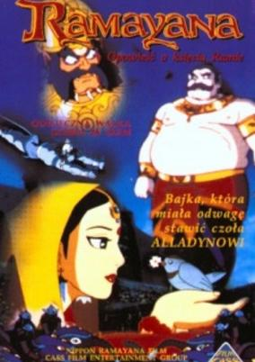

**Studio:** TEM Co., Ltd., Nippon Ramayana Film Co., Ltd.  |  **Director:** Koichi Sasaki, Ram Mohan , Yugo Sako  |  **Aired/Released:** January 25  |  **Genres:** Earth, Fantasy, Adventure, Action, Asia, High Fantasy, Past, Historical

> A theatrical anime movie of the original story of the epic Indian classical "Ramayana" and a joint production between Japan and India. Prince Rama, one of the four Princes of Ayodhya, will be expelled from the palace through a conspiracy. Rama is banished to the forest for 14 years. A girl named Sita and Lakshman, Rama's brother, go with him into the forest. Ravana, the King of Demons, falls in love with Sita and kidnaps her. In order to save his love, Rama goes to Lanka with the help of an army of monkeys and friends of the forest. A feature film based on a story of true love, friendship, and trust, this anime is about 2 hours and 15 minutes long, with musical elements from Indian cinemas in between.
>
> _Synopsis source: Kitsu_

[Kitsu](https://kitsu.io/anime/ramayana-the-legend-of-prince-rama)

---

### Doragon Bōru Zetto Moetsukiro!! Nessen Ressen Chō-Gekisen ( Dragon Ball Z: Broly – The Legendary Super Saiyan )

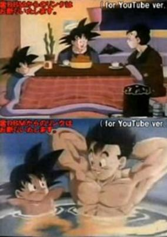

**Studio:** Toei Animation  |  **Director:** Shigeyasu Yamauchi  |  **Aired/Released:** March 6  |  **Genres:** Comedy, Super Power, Fantasy, Slice of Life, Action, Adventure, Martial Arts, Shounen

> In this film, which is believed to take place some time around the 25th World Martial Arts Tournament, Gohan and Goten are having a hot bath outside in the middle of winter. Goku (who is still dead) suddenly appears in front of his sons with the help of his Instant Transmission, and joins them in the tub. While there, the three Saiyans reflect back on the events that occurred during the Cell Games. Inside the house after Chi-Chi appeared, Goku tells his sons about Pikkon and the Other World Tournament. Later, the four members of the Son family appear dressed nicely. Gohan says that the adult division of the Tournament will begin this next year (in 1994), and the special comes to an end.
>
> _Synopsis source: Kitsu_

[Kitsu](https://kitsu.io/anime/dragon-ball-z-zenbu-misemasu-toshi-wasure-dragon-ball-z)

---

### Doraemon: Nobita to Buriki no Rabirinsu ( Doraemon: Nobita and the Tin Labyrinth ) (Doraemon the Movie: Nobita and the Tin Labyrinth)

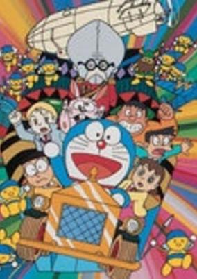

**Studio:** Asatsu ; Shin-Ei Animation  |  **Director:** Tsutomu Shibayama  |  **Aired/Released:** March 6  |  **Genres:** Fantasy

> Nobita's dad stumbled upon a strange advertisement of a fantastic resort on television at midnight. Sleepy as he was, he made a reservation even though he didn't even realize he was talking to the advertisement. The next day he discussed with the family their holiday plans, only to realize he could not find the place anywhere on earth. All of a sudden though, there was a suitcase in Nobita's room and intrigued as he was, he opened it only to find a portal to a beautiful resort managed by tin robots. Better still, it's absolutely free. However, it seems that there is a hidden agenda behind the person who invites them there.
>
> _Synopsis source: Kitsu_

[Kitsu](https://kitsu.io/anime/doraemon-nobita-s-tin-plate-labyrinth)

---

### Dorami-chan: Hello Kyouryuu Kids!! ( Dorami-chan: Hello, Dynosis Kids!! )

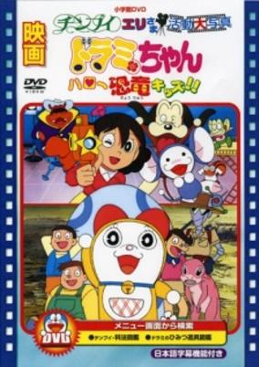

**Studio:** Asatsu ; Shin-Ei Animation  |  **Director:** Keiichi Hara  |  **Aired/Released:** March 6  |  **Genres:** Fantasy

> No synopsis has been added for this series yet.Click here to update this information.
>
> _Synopsis source: Kitsu_

[Kitsu](https://kitsu.io/anime/dorami-chan-hello-kyouryuu-kids)

---

### Dr. Slump & Arale-chan Ncha! Penguin Mura wa Hare no chi Hare ( Dr. Slump and Arale-chan: N-cha! Clear Skies Over Penguin Village ) (Dr. Slump and Arale-chan: N-cha! Clear Skies Over Penguin Village)

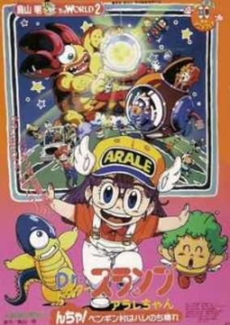

**Studio:** Toei Animation  |  **Director:** Keiichi Hara  |  **Aired/Released:** March 6  |  **Genres:** Comedy, Science Fiction

> At the Penguin Village, the dinosaurs styled monster named Dodongadon appeared. But he was small as Arale and did not have strong power. Arale defeat him very easily, and Dodongadon called his mother Mamangadon. She was huge and had a big power. How Arale can defeat this big monster?
>
> _Synopsis source: Kitsu_

[Kitsu](https://kitsu.io/anime/dr-slump-movie-6-arale-chan-ncha-pengin-mura-wa-hare-nochi-hare)

---

### Kappa no Sanpei ( Kappa: A River Goblin and Sampei )

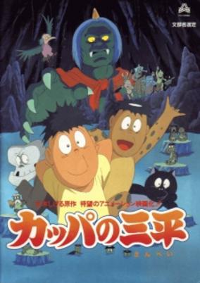

**Studio:** Takahashi Studio  |  **Director:** Toshio Hirata  |  **Aired/Released:** March 13  |  **Genres:** Fantasy, Adventure, Kids

> Sanpei is a lazy little 7 year old boy who rarely concentrates on anything beside eating his school dinners. Despite being constantly jeered at by his classmates for looking like a Kappa, Sanpei is a relatively happy go lucky boy that is quite content with living alone with his grandfather in the mountains. One day, Sanpei's school announces that it will hold a swimming gala with the top prize being an all expenses paid trip to the big city of Tokyo. Sanpei resolves to enter the contest so that he can have the chance to visit Tokyo and meet with his Mother who seems to have been working there for as long as he can remember. Unfortunately, Sanpei is not a very able swimmer and so decides to sneak off to a nearby lake to practice in secret. Sanpei quickly finds himself dragged under the water by a strong undercurrent and drowns only to find himself regain consciousness within the magical realm of the Kappa. Thus begins Sanpei's journey as he befriends one of the Kappa children, Gartaro, and begins to learn the real whereabouts of his Mother and the reason behind his Fathers disappearance...
>
> _Synopsis source: Kitsu_

[Kitsu](https://kitsu.io/anime/kappa-no-sanpei)

---

### Kidō Senshi SD Gundam Matsuri ( Mobile Suit SD Gundam Festival )

**Studio:** Sunrise  |  **Director:** Takashi Imanishi (Part 1), Tetsuro Amino (Parts 2 & 3)  |  **Aired/Released:** March 13

[Wikipedia](https://en.wikipedia.org/wiki/Mobile_Suit_SD_Gundam#Mobile_Suit_SD_Gundam_Festival)

---

### Sangokushi (dai 2-bu): Chōkō Moyu! ( Romance of the Three Kingdoms (Part 2): The Yangtze River Burns! ) (Great Conquest: Romance of Three Kingdoms)

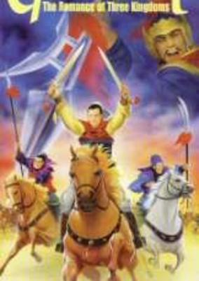

**Studio:** Enoki Films  |  **Director:** Tomoharu Katsumata  |  **Aired/Released:** March 18  |  **Genres:** Three Kingdoms, Past, Historical, Action

> An anime based on the Romance of the Three Kingdoms novel.
>
> _Synopsis source: Kitsu_

[Kitsu](https://kitsu.io/anime/sangokushi-dainibu-choukou-moyu)

---

### Jūbē Ninpūchō ( Ninja Scroll ) (Ninja Scroll)

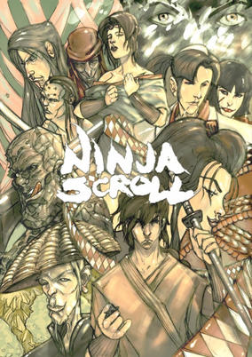

**Studio:** Madhouse  |  **Director:** Yoshiaki Kawajiri  |  **Aired/Released:** June 5  |  **Genres:** Ninja, Japan, Action, Asia, Martial Arts, Horror, Past, Violence, Samurai, Historical, Fantasy, Adventure, Romance

> Jubei Kibagami wanders feudal Japan as an itinerant swordsman-for-hire. After a past betrayal left him masterless, he has no more patience for warring political factions and their schemes. Unfortunately, both past and political intrigue collide when he meets and saves a female ninja named Kagero from a man with the ability to make his body as hard as stone. The sole survivor of a ninja clan, Kagero continues her team's last mission: investigate a mysterious plague that wiped out an entire village. Jubei wants nothing to do with this, but the stone-like man's allies, a group of ninja with supernatural powers known as the Devils of Kimon, make that option difficult. To make matters worse, a government spy poisons Jubei, promising him an antidote if he can unravel the true intentions of the Devils of Kimon and their connection to the plague. The trail leads to shadow leaders, a plot to overthrow the government, and a man that Jubei thought he would never see again.
>
> _Synopsis source: Kitsu_

[Kitsu](https://kitsu.io/anime/juubee-ninpuuchou)

---

### Doragon Bōru Zetto: Ginga Giri-Giri!! Butchigiri no Sugoi Yatsu ( Dragon Ball Z: Bojack Unbound )

**Studio:** Toei Animation  |  **Director:** Yoshihiro Ueda  |  **Aired/Released:** July 10  |  **Genres:** Comedy, Super Power, Fantasy, Slice of Life, Action, Adventure, Martial Arts, Shounen

> In this film, which is believed to take place some time around the 25th World Martial Arts Tournament, Gohan and Goten are having a hot bath outside in the middle of winter. Goku (who is still dead) suddenly appears in front of his sons with the help of his Instant Transmission, and joins them in the tub. While there, the three Saiyans reflect back on the events that occurred during the Cell Games. Inside the house after Chi-Chi appeared, Goku tells his sons about Pikkon and the Other World Tournament. Later, the four members of the Son family appear dressed nicely. Gohan says that the adult division of the Tournament will begin this next year (in 1994), and the special comes to an end.
>
> _Synopsis source: Kitsu_

[Kitsu](https://kitsu.io/anime/dragon-ball-z-zenbu-misemasu-toshi-wasure-dragon-ball-z)

---

### Dr. Slump & Arale-chan Ncha! Penguin Mura yori Ai o Komete ( Dr. Slump and Arale-chan: N-cha! From Penguin Village with Love ) (Dr. Slump and Arale-chan: N-cha! Clear Skies Over Penguin Village)

**Studio:** Toei Animation  |  **Director:** Mitsuo Hashimoto  |  **Aired/Released:** July 10  |  **Genres:** Comedy, Science Fiction

> At the Penguin Village, the dinosaurs styled monster named Dodongadon appeared. But he was small as Arale and did not have strong power. Arale defeat him very easily, and Dodongadon called his mother Mamangadon. She was huge and had a big power. How Arale can defeat this big monster?
>
> _Synopsis source: Kitsu_

[Kitsu](https://kitsu.io/anime/dr-slump-movie-6-arale-chan-ncha-pengin-mura-wa-hare-nochi-hare)

---

### O-Hoshisama no Rail ( Rail of the Star ) (Rail of the Star: A True Story of Children)

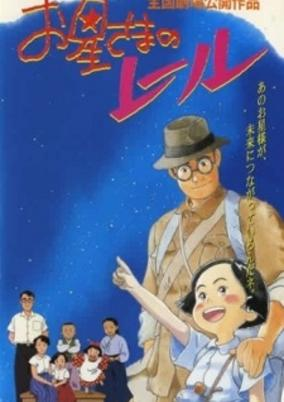

**Studio:** Madhouse  |  **Director:** Toshio Hirata  |  **Aired/Released:** July 10  |  **Genres:** Korea, World War II, Earth, Asia, Coming Of Age, Anti War, Drama, Past, Disaster, Historical

> This is the autobiographic tale of Kobayashi Chitose, a young Japanese girl growing up in a Japanese-occupied North Korea. As World War II progresses, Chitose begins to realize that her family will not be able to escape the effects of the conflict. From the simple disappointment of not being able to get the type of backpack she wants for school, to her father's recruitment as a soldier, the war begins to impact her life in a very real manner. But the end of the war does not mean the end of hardship for her. The Koreans, fed up with years of Japanese rule and persecution, have joined forces with a Chinese-backed communist government and are systematically making life a living horror for the Japanese left in North Korea. Fearing reprisal since he was a Japanese veteran, Chitose's father risks everything to get his family out of the north and to the US-occupied area south of the 38th parallel.
>
> _Synopsis source: Kitsu_

[Kitsu](https://kitsu.io/anime/rail-of-the-star-a-true-story-of-children)

---

### Soreike! Anpanman: Kyōryū Nosshī no Daibōken ( Let's Go! Anpanman: Nosshi the Dinosaur's Big Adventure )

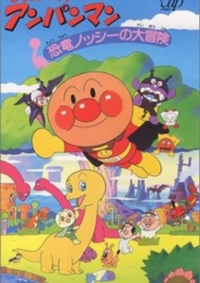

**Studio:** Tokyo Movie Shinsha  |  **Director:** Akinori Nagaoka  |  **Aired/Released:** July 17  |  **Genres:** Comedy, Fantasy, Kids

> 5th Anpanman short movie.
>
> _Synopsis source: Kitsu_

[Kitsu](https://kitsu.io/anime/sore-ike-anpanman-kyouryuu-nosshii-no-daibouken)

---

### Kureyon Shinchan: Akushon Kamen tai Haigure Maō ( Crayon Shin-chan: Action Kamen vs Leotard Devil )

**Studio:** Shin-Ei Animation ; TV Asahi ; ADK  |  **Director:** Mitsuru Hongo  |  **Aired/Released:** July 24

---

### Rokudenashi Burūsu 1993 ( Rokudenashi Blues 1993 )

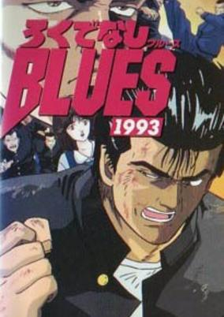

**Studio:** Toei Animation  |  **Director:** Hiroyuki Kakudō  |  **Aired/Released:** July 24  |  **Genres:** Delinquent, Action, Comedy, School Life, Sports

> Sequel to the Rokudenashi Blues movie.
>
> _Synopsis source: Kitsu_

[Kitsu](https://kitsu.io/anime/rokudenashi-blues-1993)

---

### Kidō Keisatsu Patoreibā 2: Za Mūbī ( Patlabor 2: The Movie )

**Studio:** Production I.G  |  **Director:** Mamoru Oshii  |  **Aired/Released:** August 7

---

### San-chōme no Tama: Onegai! Momo-chan o Sagashite!! ( Tama of 3rd Street: Please! Search for Momo-chan!! ) (Tama and Friends)

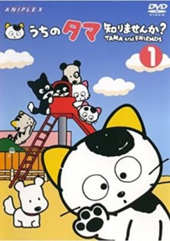

**Studio:** Group TAC  |  **Director:** Hitoshi Nanba  |  **Aired/Released:** August 14  |  **Genres:** Adventure

> The characters are Tama, Momo, Wocket, Tiggle, Rockney, Pimmy, Bupkus, Bengpu, and Chopin. There is no consistent plot. Tama and his friends just have little, family friendly, adventures every episode. The only consistency is when a new friend is made one episode and flash backs.
>
> _Synopsis source: Kitsu_

[Kitsu](https://kitsu.io/anime/three-choume-no-tama-uchi-no-tama-shirimasenka)

---

### Biggu Wōzu: Kami Utsu Akaki Kōya ni ( Big Wars: Red Zone, Divine Annihilation ) (Big Wars)

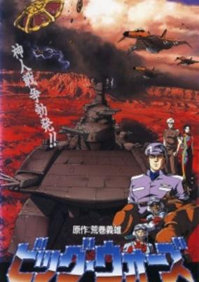

**Studio:** Magic Bus  |  **Director:** Toshifumi Takizawa, Issei Kume  |  **Aired/Released:** September 25  |  **Genres:** Desert, Space Opera, Action, Science Fiction, Air Force, Other Planet, Humanoid Alien, Alien, War, Future, Space, Military

> It is the dawn of the 21st century. Mankind has terraformed and colonized Mars. But we are not alone in the universe. An ancient race of alien beings, known only as "The Gods," has been watching mankind's progress ...and waiting. Now, these mysterious aliens have returned to halt mankind's expansion into space ...by force. Now, the planet named after the God of War will become our final battlefield, as mankind fights a desperate battle with the latest in high-tech, military hardware: hyper-advanced aircraft, orbital fighters, and gigantic, desert battleships brimming with the most advanced weaponry. But will it be enough? The aliens have awesome, incredibly destructive weapons at their disposal—including "Hell"—an unstoppable stealth carrier. But the alien's primary weapon is insidiously quiet and invisible—a mind control plaque. Incurable. Inevitable. Contagious. Humans are powerless to resist its effects, which transforms even the most loyal soldiers into dangerous subversives. Our last hope lies with Captain Akuh and the crew of the Battleship Aoba. If his top-secret mission is successful, mankind will deal a decisive blow to the alien armada. But Akuh's girlfriend is showing signs of nymphomania—the first symptom of alien subversion!
>
> _Synopsis source: Kitsu_

[Wikipedia](https://en.wikipedia.org/wiki/Big_Wars) · [Kitsu](https://kitsu.io/anime/big-wars)

---

### Bonobono

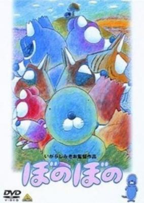

**Studio:** Group TAC  |  **Director:** Mikio Igarashi , Yūji Mutō (animation)  |  **Aired/Released:** November 13  |  **Genres:** Comedy

> The first theatrical Bonobono movie.
>
> _Synopsis source: Kitsu_

[Wikipedia](https://en.wikipedia.org/wiki/Bonobono) · [Kitsu](https://kitsu.io/anime/bonobono-movie)

---

### Gekijō-ban Bishōjo Senshi Sērā Mūn R ( Sailor Moon R: The Movie )

**Studio:** Toei Animation  |  **Director:** Kunihiko Ikuhara  |  **Aired/Released:** December 5

---

### Aoi Kioku: Manmō Kaitaku to Shōnen-tachi ( Blue Memory: Manmo Pioneers and Boys )

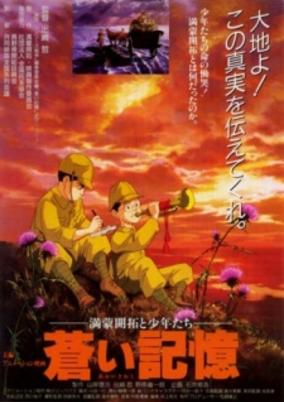

**Studio:** Magic Bus  |  **Director:** Satoshi Dezaki  |  **Aired/Released:** December 18  |  **Genres:** China, World War II, Asia, Drama, Past, Military, Historical, Friendship

> A class of Japanese youths volunteer for the war effort during WWII, but then get stranded in Manchuria.
>
> _Synopsis source: Kitsu_

[Kitsu](https://kitsu.io/anime/aoi-kioku-manmou-kaitaku-to-shounen-tachi)

---

### Ginga Eiyū Densetsu: Arata Naru Tatakai no Jokyoku (Ōvuachua) ( Legend of the Galactic Heroes: Overture to a New War )

**Studio:** Magic Bus ; Kitty Film Mitaka Studio  |  **Director:** Noboru Ishiguro , Keizou Shimizu  |  **Aired/Released:** December 18

[Wikipedia](https://en.wikipedia.org/wiki/Legend_of_the_Galactic_Heroes#Anime)

---

### Kū: Tōi Umi kara Kita Kū ( Coo: Tōi Umi kara Kita Coo )

**Studio:** Toei Animation  |  **Director:** Tetsuo Imazawa  |  **Aired/Released:** December 19

---

### Mother: Saigo no Shōjo Eve ( E.Y.E.S. of Mars ) (E.Y.E.S. of Mars)

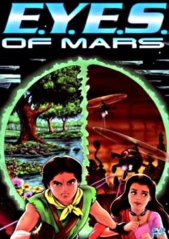

**Studio:** Toei Animation  |  **Director:** Iku Suzuki  |  **Aired/Released:** December 26  |  **Genres:** Science Fiction, Alternative Past, Mars, Coming Of Age, Dystopia, Drama, Past, Friendship, Disaster, Super Power, Adventure

> The future is bleak and urbanized. A government super-power holds the keys to all the doors. Hope lies in a secret organization who kidnaps "gifted" children and teaches them to wield their ability to view the life energy of all living things. A young girl befriends a sempai, a street rat comes to rescue her, and two parents wait helplessly to see their daughter one last time...
>
> _Synopsis source: Kitsu_

[Kitsu](https://kitsu.io/anime/e-y-e-s-of-mars)

---

## OVA releases

### Rei Rei

**Studio:** Aubeck, AIC , KSS , Pink Pineapple  |  **Episodes:** 2  |  **Director:** Yoshisuke Yamaguchi

[Wikipedia](https://en.wikipedia.org/wiki/Rei_Rei)

---

### Koronbusu no Daibōken ( Columbus's Great Adventures )

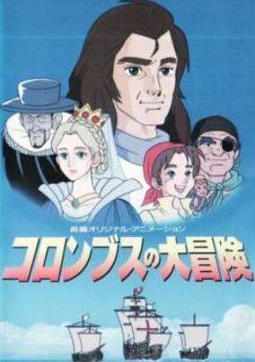

**Studio:** SPO , AB Productions  |  **Episodes:** 1  |  **Director:** Yorifusa Yamaguchi  |  **Aired/Released:** January 1  |  **Genres:** Historical

> As he nears the New World, Christopher Columbus tells cabin boy Paco about his youthful hardships, the difficulties of convincing others of his vision, and the final victory when King Ferdinand and Queen Isabella agreed to sponsor his trip. The sailors are doubtful, though Columbus is vindicated when they arrive on land, but it's not as the planned destination of Japan.
>
> _Synopsis source: Kitsu_

[Kitsu](https://kitsu.io/anime/columbus-no-daibouken)

---

### Offside

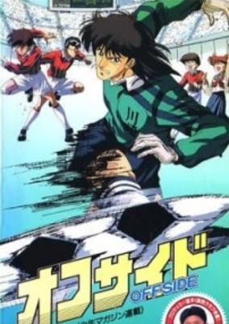

**Studio:** Sakatsu Suzuki, Shigetoshi Tanaka  |  **Episodes:** 1  |  **Director:** Takao Yotsuji , Hisashi Abe  |  **Aired/Released:** January 22  |  **Genres:** Action, Sports, Soccer

[Kitsu](https://kitsu.io/anime/offside-ova)

---

### Aru Kararu no Isan ( Al Caral's Legacy ) (Legacy of Aru Kararu)

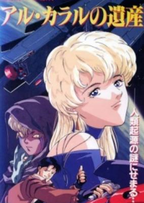

**Studio:** Animate Film , Tokuma Japan Communications , Visual '80  |  **Episodes:** 1  |  **Director:** Kōichi Ishiguro  |  **Aired/Released:** January 25  |  **Genres:** Science Fiction

> In the 26th century, humans discover a humanoid race living on the distant world GO/7498/2, a dark-skinned, golden-eyed people who seem to eke out a primitive, carefree existence. However, a scout team from Earth discovers that there is more to them than meets the eye--they live in symbiosis with vicious reptilian parasites, and the Terran scientists have upset the delicate natural balance.
>
> _Synopsis source: Kitsu_

[Wikipedia](https://en.wikipedia.org/wiki/Aru_Kararu_no_Isan) · [Kitsu](https://kitsu.io/anime/aru-kararu-no-isan)

---

### Oh My Goddess! (Oh! My Goddess)

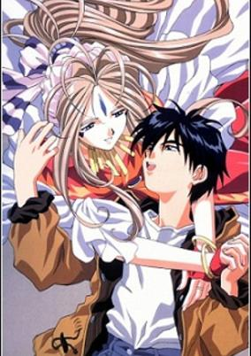

**Studio:** AIC  |  **Episodes:** 5  |  **Director:** Hiroaki Gōda  |  **Aired/Released:** February 2 – May 17, 1994  |  **Genres:** Fantasy, Contemporary Fantasy, Romance, Earth, Japan, Asia, Comedy, Sudden Girlfriend Appearance, Deity, Stereotypes, Plot Continuity, Magic

> When college student Keiichi Morisato dials the wrong number while ordering for some food at his dormitory, he accidentally gets connected to the Goddess Hotline and a beautiful goddess named Belldandy appears out of a mirror in front of him. After getting kicked out of the dorm, Keiichi and Belldandy move to an old shrine and soon afterwards, Belldandy's sisters Urd and Skuld move in.
>
> _Synopsis source: Kitsu_

[Wikipedia](https://en.wikipedia.org/wiki/Oh_My_Goddess!) · [Kitsu](https://kitsu.io/anime/aa-megami-sama-ova)

---

### Moldiver

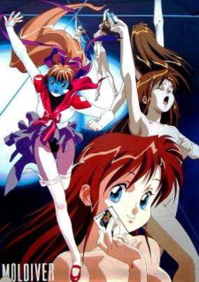

**Studio:** AIC ; Pioneer LDC  |  **Episodes:** 6  |  **Director:** Hirohide Fujiwara  |  **Aired/Released:** February 25 – November 25  |  **Genres:** Power Suit, Science Fiction, Japan, Action, Earth, Comedy, Future, Super Power, Magic, Mecha, Romance

> Hiroshi Ozora invents the Mol Unit, a device that makes its user invincible. His plans of becoming a super hero are short lived however when his sister, Mirai, accidently modifies the suit configuration. Now she is forced to save Tokyo by herself from the evil Machinegal and his gang of all-female androids.
>
> _Synopsis source: Kitsu_

[Wikipedia](https://en.wikipedia.org/wiki/Moldiver) · [Kitsu](https://kitsu.io/anime/moldiver)

---

### Dragon Half

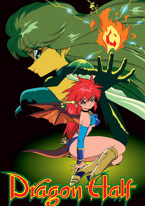

**Studio:** Production I.G.  |  **Episodes:** 2  |  **Director:** Shinya Sadamitsu  |  **Aired/Released:** March 26 – May 28  |  **Genres:** Combat, Comedy, Adventure, Ecchi, Fantasy World, Fantasy, Dragon, Absurdist Humour, Slapstick, Parody

> Mink—the daughter of a dragon and a retired dragonslaying knight—sets out on a journey to get tickets for a concert held by Dick Saucer, world-famous teen idol and dragon hunter. Meanwhile, the corrupt king of the land is trying to take her hostage to get at her mother, and his magic-using daughter seeks to foil Mink's quest out of sheer spite.
>
> _Synopsis source: Kitsu_

[Wikipedia](https://en.wikipedia.org/wiki/Dragon_Half) · [Kitsu](https://kitsu.io/anime/dragon-half)

---

### Kyou kara Ore wa!!

**Studio:** Pierrot  |  **Episodes:** 10  |  **Director:** Takeshi Mori Masami Annō  |  **Aired/Released:** April 1 – December 21, 1997

[Wikipedia](https://en.wikipedia.org/wiki/Ky%C5%8D_Kara_Ore_Wa!!)

---

### Suna no Bara (Desert Rose) – Yuki no Mokushiroku ( Desert Rose ~ The Snow Apocalypse )

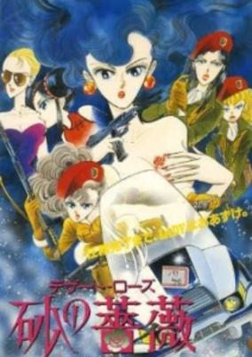

**Studio:** J.C. Staff  |  **Episodes:** 1  |  **Director:** Yasunao Aoki  |  **Aired/Released:** April 25  |  **Genres:** Japan, Action, Asia, Earth, Special Squads, Europe, Law And Order, Present, Cops

> Mariko Rosebank leads a team of all-female anti-terrorist mercenaries, named C.A.T. This all-woman team is sent to guard a meeting of world leaders against a terrorist attack.
>
> _Synopsis source: Kitsu_

[Kitsu](https://kitsu.io/anime/desert-rose)

---

### Battle Angel

**Studio:** Madhouse  |  **Episodes:** 2  |  **Director:** Hiroshi Fukutomi  |  **Aired/Released:** June 21 – August 21

[Wikipedia](https://en.wikipedia.org/wiki/Battle_Angel_(OVA))

---

### Giant Robo: The Day the Earth Stood Still (Giant Robo the Animation: The Day the Earth Stood Still)

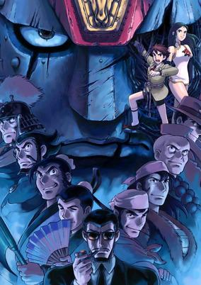

**Studio:** Mu Animation Studio; Phoenix Entertainment  |  **Episodes:** 7  |  **Director:** Yasuhiro Imagawa  |  **Aired/Released:** July 23 – January 25, 1998  |  **Genres:** Earth, Action, Mecha, Steampunk, Science Fiction, Special Squads, Plot Continuity, Super Power

> In a future to come humanity enjoys a new age of prosperity thanks to Dr. Shizuma's invention of a revolutionary renewable energy source: the Shizuma Drive. But this peace is threatened by Big Fire, a cabal seeking world domination. Against Big Fire the International Police Organisation dispatches a collection of superpowered warriors and martial artists, together with Daisaku Kusama, inheritor and master of Earth's most powerful robot, Giant Robo. By capturing an abnormal Shizuma Drive which is essential to Big Fire's plans the IPO ignites a desperate conflict between the two groups. The coming battle will test Daisaku's resolve to the utmost, reveal the ghastly truth behind the creation of the Shizuma Drive, and bring human civilization to its knees! Giant Robo is a character-driven adventure in a retro-futuristic setting, drawing on influences from opera, kung-fu cinema, wuxia stories and classic mecha anime. It incorporates characters from the works of the manga author Mitsuteru Yokoyama but it is designed to be a stand-alone story.
>
> _Synopsis source: Kitsu_

[Kitsu](https://kitsu.io/anime/giant-robo-the-animation-chikyuu-ga-seishi-suru-hi)

---

### Mellow

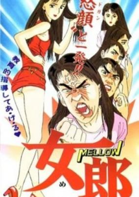

**Studio:** Knack Productions  |  **Episodes:** 1  |  **Director:** Teruo Kogure  |  **Aired/Released:** July 23  |  **Genres:** Comedy, School Life

> A story about a crossdressing teacher handling a delinquent class. Based on the same-name seinen manga by Rin Kasahara.
>
> _Synopsis source: Kitsu_

[Kitsu](https://kitsu.io/anime/mellow)

---

### Dochinpira ( The Gigolo - Dochinpira )

**Studio:** Studio Kikan, Studio Marine  |  **Episodes:** 1  |  **Director:** Hiromitsu Ōta  |  **Aired/Released:** August 27

---

### Mermaid's Scar

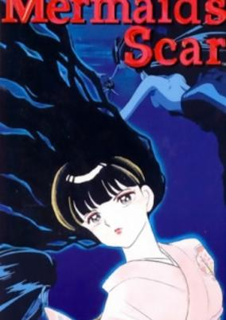

**Studio:** Madhouse  |  **Episodes:** 1  |  **Director:** Morio Asaka  |  **Aired/Released:** September 24  |  **Genres:** Fantasy, Contemporary Fantasy, Earth, Mermaid, Dark Fantasy, Horror, Japan, Asia, Violence, Present, Mystery

> Legend has it that when you eat the flesh of a mermaid, you would live forever. Yuta and Mana are living proof of this... Together, they journey to various places trying to find meaning for their existence, or perhaps even a "cure" for their situation. One day, Yuta and Mana meet Masato, a little boy who seems terrified of his mother Misa. It seems to Yuta and Mana that mother and son have a very unusual relationship. What happens when Yuta and Mana decide to discover the dark secret Masato and Misa are hiding? And what about those monster-like creatures that have been appearing?
>
> _Synopsis source: Kitsu_

[Wikipedia](https://en.wikipedia.org/wiki/Mermaid%27s_Scar) · [Kitsu](https://kitsu.io/anime/mermaid-s-scar)

---

### Yōseiki Suikoden – Masei Kōrin ( Suikoden Demon Century ) (Suikoden Demon Century)

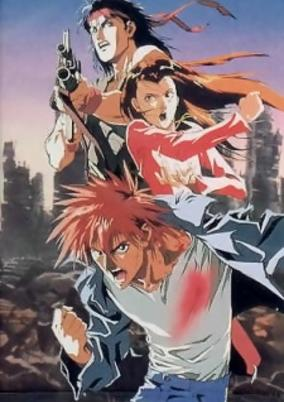

**Studio:** J.C. Staff  |  **Episodes:** 1  |  **Director:** Hiroshi Negishi  |  **Aired/Released:** September 25  |  **Genres:** Post Apocalypse, Japan, Earth, Action, Asia, Martial Arts, Future, Violence, Fantasy

> In the early 21st century, an earthquake destroyed Tokyo. Japan lost its center of government and industry, and turned into a lawless territory. Looking for his sister, Takateru Suga learns that she was kidnapped by the powerful Koryukai gang. He decides to ally himself with a drag queen, two ex-mercenaries and a nun to destroy the crime organization and save his sister!
>
> _Synopsis source: Kitsu_

[Kitsu](https://kitsu.io/anime/youseiki-suikoden)

---

### New Dominion Tank Police (Giant Robo the Animation: The Day the Earth Stood Still)

**Studio:** J.C.Staff  |  **Episodes:** 6  |  **Director:** Norubu Furuse  |  **Aired/Released:** October 21 – October 21, 1994  |  **Genres:** Earth, Action, Mecha, Steampunk, Science Fiction, Special Squads, Plot Continuity, Super Power

> In a future to come humanity enjoys a new age of prosperity thanks to Dr. Shizuma's invention of a revolutionary renewable energy source: the Shizuma Drive. But this peace is threatened by Big Fire, a cabal seeking world domination. Against Big Fire the International Police Organisation dispatches a collection of superpowered warriors and martial artists, together with Daisaku Kusama, inheritor and master of Earth's most powerful robot, Giant Robo. By capturing an abnormal Shizuma Drive which is essential to Big Fire's plans the IPO ignites a desperate conflict between the two groups. The coming battle will test Daisaku's resolve to the utmost, reveal the ghastly truth behind the creation of the Shizuma Drive, and bring human civilization to its knees! Giant Robo is a character-driven adventure in a retro-futuristic setting, drawing on influences from opera, kung-fu cinema, wuxia stories and classic mecha anime. It incorporates characters from the works of the manga author Mitsuteru Yokoyama but it is designed to be a stand-alone story.
>
> _Synopsis source: Kitsu_

[Wikipedia](https://en.wikipedia.org/wiki/Dominion_(manga)) · [Kitsu](https://kitsu.io/anime/giant-robo-the-animation-chikyuu-ga-seishi-suru-hi)

---

### JoJo no Kimyou na Bouken (JoJo's Bizarre Adventure (1993))

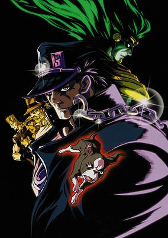

**Studio:** A.P.P.P.  |  **Episodes:** 6 (first run)  |  **Director:** Hiroyuki Kitakubo  |  **Aired/Released:** November 19 – November 18, 1994 (first run)  |  **Genres:** Vampire, Fantasy, Action, Horror, Past, Violence, Super Power, Adventure, Shounen

> Kujo Jotaro is a normal, popular Japanese high-schooler, until he thinks that he is possessed by a spirit, and locks himself in prison. After seeing his grandfather, Joseph Joestar, and fighting Joseph's friend Muhammad Abdul, Jotaro learns that the "Spirit" is actually Star Platinum, his Stand, or fighting energy given a semi-solid form. Later, his mother gains a Stand, and becomes sick. Jotaro learns that it is because the vampire Dio Brando has been revived 100 years after his defeat to Jonathan Joestar, Jotaro's great-great-grandfather. Jotaro decides to join Joseph and Abdul in a trip to Egypt to defeat Dio once and for all.
>
> _Synopsis source: Kitsu_

[Wikipedia](https://en.wikipedia.org/wiki/JoJo%27s_Bizarre_Adventure_(OVA)) · [Kitsu](https://kitsu.io/anime/jojo-s-bizarre-adventure-1993)

---

### Please Save My Earth

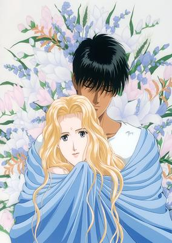

**Studio:** Production I.G  |  **Episodes:** 6  |  **Director:** Kazuo Yamazaki  |  **Aired/Released:** December 17 – September 23, 1994  |  **Genres:** Romance, Science Fiction, Japan, Action, Asia, Earth, Thriller, Tokyo, Love Polygon, Humanoid Alien, Alien, Drama, Plot Continuity, Present, Super Power

> Alice Sakaguchi once dreamt that she is another person living on the moon. The dream is so strange and so real that Alice can't stop thinking about it. She finds out that some of her classmates are having the same kind of dream. They soon discover that they had been seeing flashes of their past lives as a team of scientists on the moon. Alice and her friends then decide to find the other members and piece together what took place back then. Complications arise when they realize that everything that happened in their previous existence continue to haunt and affect their present lives.
>
> _Synopsis source: Kitsu_

[Wikipedia](https://en.wikipedia.org/wiki/Please_Save_My_Earth) · [Kitsu](https://kitsu.io/anime/boku-no-chikyuu-wo-mamotte)

---

### Black Jack

**Studio:** Tezuka Productions  |  **Episodes:** 12  |  **Director:** Osamu Dezaki By episode: Satoshi Kuwahara (11) Masayoshi Nishida (12)  |  **Aired/Released:** December 21 – December 16, 2011

[Wikipedia](https://en.wikipedia.org/wiki/Black_Jack_(manga))

---

## TV series

### Miracle☆Girls

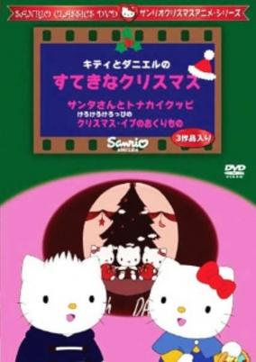

**Studio:** Japan Taps  |  **Episodes:** 51  |  **Director:** By episode: Takashi Anno (1–17) Hiroko Tokita (30–51)  |  **Aired/Released:** January 8 – December 24  |  **Genres:** Kids, Anthropomorphism

> Daniel was supposed to come visit Kitty and Mimmy on Christmas. But due to bad weather in New York, he isn't able to fly. The girls are quite saddened but a miracle happens.
>
> _Synopsis source: Kitsu_

[Wikipedia](https://en.wikipedia.org/wiki/Miracle_Girls) · [Kitsu](https://kitsu.io/anime/kitty-to-daniel-no-suteki-na-christmas)

---

### Wakakusa Monogatari: Nan to Jo-sensei ( Little Women II: Jo's Boys ) (Little Women II: Jo's Boys)

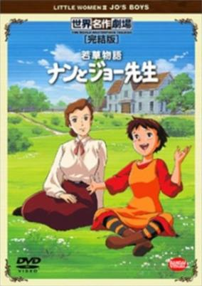

**Studio:** Nippon Animation  |  **Episodes:** 40  |  **Director:** Kōzō Kusuba  |  **Aired/Released:** January 17 – December 19  |  **Genres:** Earth, United States, Americas, Past, School Life, Historical, Slice of Life

> Nan Harding is the new student at Mr. and Mrs. Bhaer's school. Everyone thinks that she is a pain in the head, but not Mrs. Jo. Together with the other kids, they all embark on their personal adventures and misfortunes while learning in school.
>
> _Synopsis source: Kitsu_

[Kitsu](https://kitsu.io/anime/wakakusa-monogatari-nan-to-jo-sensei)

---

### Musekinin Kanchou Tylor ( The Irresponsible Captain Tylor ) (The Irresponsible Captain Tylor)

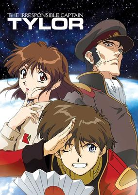

**Studio:** Tatsunoko Production  |  **Episodes:** 26  |  **Director:** Kōichi Mashimo  |  **Aired/Released:** January 25 – July 19  |  **Genres:** Space Travel, Science Fiction, Space Opera, Parody, Comedy, Humanoid Alien, Shipboard, Future, Space, Military

> Justy Ueki Tylor had his life all planned out: join the military, get a cushy desk job, and then retire with a big fat pension check. The perfect plan... until he wandered into a hostage situation and somehow managed to save an admiral! Now Tylor - a man who wouldn't know what discipline was if it bit him on the backside - has been made Captain of the space cruiser Soyokaze. The crew of this run-down ship is the craziest rag-tag team of misfits you're ever likely to see, and they're not too fond of their complacent new leader. But they'd better learn to work together, because they're about to go head to head with the mighty Raalgon Empire. For better or for worse, the Earth's fate has been placed in the hands of a man who's either a total idiot - or an absolute genius!
>
> _Synopsis source: Kitsu_

[Wikipedia](https://en.wikipedia.org/wiki/The_Irresponsible_Captain_Tylor) · [Kitsu](https://kitsu.io/anime/musekinin-kanchou-tylor)

---

### Yuusha Tokkyuu Might Gaine ( The Brave Empress Might Gain )

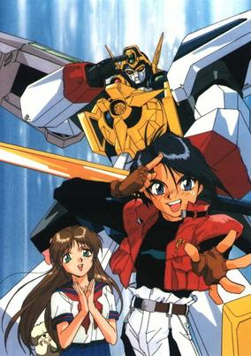

**Studio:** Sunrise  |  **Episodes:** 47  |  **Director:** Shinji Takamatsu  |  **Aired/Released:** January 30 – January 24, 1994  |  **Genres:** Transforming Craft, Science Fiction, Mecha, Action, Piloted Robot, Earth, Mafia, Swordplay, Assassin, Crime, Samurai, Adventure

> Nouvelle Tokio City locates on the place where it used to be Tokyo Bay. At the first glance, the prosperous city seems to enjoy its freedom and peace, but the city is suffering from the crimes. Senmuji Maito is a perfect 15-year-old boy, bright, handsome, smart, and all-around sportsman. Furthermore, he is the leader of Senpuji Trading group, and a multimillionaire. He spends his private fortune to found “Brave Express Squad� which consists of several robots. They are the robots that have various special abilities. Above all, the leader, Gaine, has a super artificial intelligence and has own personality. They can transform into trains. In case of incidents, they will appear anywhere in the world using the highly developed railway system.
>
> _Synopsis source: Kitsu_

[Wikipedia](https://en.wikipedia.org/wiki/The_Brave_Express_Might_Gaine) · [Kitsu](https://kitsu.io/anime/yuusha-tokkyuu-might-gaine)

---

### Nekketsu Saikyou Go-Saurer ( Hot-Blooded Strongest Go-Saurer )

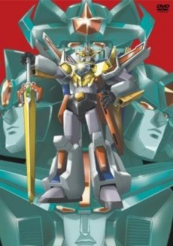

**Studio:** Sunrise  |  **Episodes:** 51  |  **Director:** Toshifumi Kawase  |  **Aired/Released:** March 3 – February 23, 1994  |  **Genres:** Science Fiction, Mecha, Super Robot, Robot, Action

> The Kikaika (literally mechanization) Empire invades our solar system, and in a matter of moments they take over and convert Neptune, Uranus, Saturn, Jupiter,and Mars, and set their sights on Earth. However, one thing stands in their way. Earth's ancient protector and soldier of light, Eldoran. To fight this menace he gifts a 5th-grade class with 3 huge robotic dinosaurs, with the power to merge and form the giant robot Gosaurer, which they then can pilot and use to stop the Kikaika Empire's advances.
>
> _Synopsis source: Kitsu_

[Wikipedia](https://en.wikipedia.org/wiki/Nekketsu_Saiky%C5%8D_Go-Saurer) · [Kitsu](https://kitsu.io/anime/nekketsu-saikyou-go-saurer)

---

### Sailor Moon R

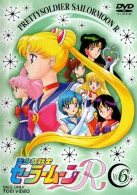

**Studio:** Toei Animation  |  **Episodes:** 43  |  **Director:** Junichi Sato  |  **Aired/Released:** March 6 – March 12, 1994  |  **Genres:** Romance, Earth, Japan, Action, Asia, Magic, Humanoid Alien, Magical Girl, Plot Continuity, Present, Demon, Super Power, Shoujo, Henshin

> The season is divided into two arcs: One arc being an anime filler (to give Takeuchi Naoko time to make the next manga), and the other arc being the actual Black Moon plot. The first arc shows Usagi and Co. having their memories restored from the first season. Their enemies are a pair of aliens, Ail and Ann, who are seeking human energy to restore their life tree. Mamoru had yet to recover his memories and he appeared as the Moonlight Knight rather than Tuxedo Kamen. This arc only lasted for 13 episodes. The second arc introduces Chibi-Usa, a little girl from the future who is searching for the Silver Crystal. The new enemies are the Black Moon Clan, comprising of the Ayakashi sisters (Cooan, Beruche, Karaberas, and Petz), Rubeus, Safir, Esmeraude, Prince Demando, and Wiseman. They too want the Silver Crystal so that they can take over the future. The Sailor Senshi's adventure continues...
>
> _Synopsis source: Kitsu_

[Wikipedia](https://en.wikipedia.org/wiki/Sailor_Moon_R) · [Kitsu](https://kitsu.io/anime/bishoujo-senshi-sailor-moon-r)

---

### Mobile Suit Victory Gundam

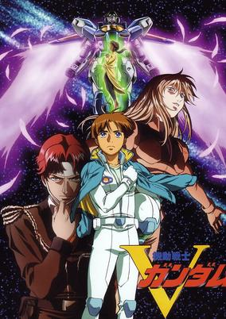

**Studio:** Sunrise  |  **Episodes:** 51  |  **Director:** Yoshiyuki Tomino  |  **Aired/Released:** April 2 – March 25, 1994  |  **Genres:** Earth, Parental Abandonment, Science Fiction, Mecha, Action, Piloted Robot, Coming Of Age, Anti War, Rotten World, War, Future, Robot, Disaster, Plot Continuity, Space, Military

> It is Universal Century 0153. On the space colonies located at Side 2, the Zanscare Empire has come to power and it holds onto that power through liberal use of the guillotine. With its forces invading the Earth and its space fleets preparing to subjugate the other Sides, the Zanscare Empire has nothing to fear from the weakening Earth Federation. It is opposed only by the League Militaire, whose state of the art mobile suits and young pilots comprise the only real resistance movement. Now, thirteen-year-old Uso Evin has been dragged into the war by a battle near his home in Eastern Europe. As the Newtype pilot of the Victory Gundam, he fights not only to defeat the Zanscare Empire but also to find out what has become of his parents, who left him behind when they went into space.
>
> _Synopsis source: Kitsu_

[Wikipedia](https://en.wikipedia.org/wiki/Mobile_Suit_Victory_Gundam) · [Kitsu](https://kitsu.io/anime/mobile-suit-victory-gundam)

---

### Shippuu! Iron Leaguer

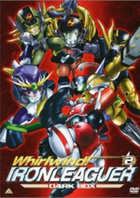

**Studio:** Sunrise  |  **Episodes:** 52  |  **Director:** Tetsurō Amino  |  **Aired/Released:** April 6 – March 29, 1994  |  **Genres:** Mecha, Sports

> Shippuu! Iron Leaguer OVA.
>
> _Synopsis source: Kitsu_

[Wikipedia](https://en.wikipedia.org/wiki/Shipp%C5%AB!_Iron_Leaguer) · [Kitsu](https://kitsu.io/anime/shippuu-iron-leaguer-silver-no-hata-no-moto-ni)

---

### Kenyuu Densetsu Yaiba ( Legendary Brave Swordsman Yaiba ) (Legendary Brave Swordsman Yaiba)

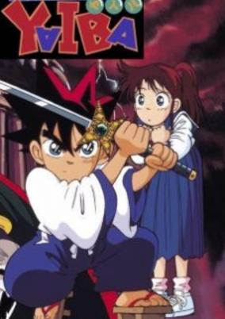

**Studio:** Pastel  |  **Episodes:** 52  |  **Director:** Norihiko Suto (Chief) Kunihiko Yuyama  |  **Aired/Released:** April 9 – April 1, 1994  |  **Genres:** Fantasy, Japan, Adventure, Action, Asia, Earth, Comedy, Tokyo, Martial Arts, Alternative Present

> Kurogane Yaiba is a boy who doesn't want to become what any regular kid would: A samurai. That's why he undergoes a hard training with his father, knowing only the forest as his world. Then, one day, he is sent to Japan, where he has to deal with a whole new civilized reality, meeting the Mine family, the evil Onimaru and even the legendary Musashi, having lots of dangerous adventures, becoming stronger everyday.
>
> _Synopsis source: Kitsu_

[Wikipedia](https://en.wikipedia.org/wiki/Yaiba) · [Kitsu](https://kitsu.io/anime/kenyuu-densetsu-yaiba)

---

### Ninjaboy Rantaro

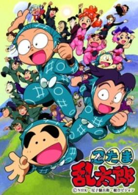

**Studio:** Ajia-do Animation Works  |  **Episodes:** –  |  **Director:** Tsutomu Shibayama  |  **Aired/Released:** April 10 –  |  **Genres:** Ninja, Japan, Comedy

> Rantarou, Shinbei and Kirimaru are ninja apprentices in the Ninja Gakuen, where first grade ones are called "Nintamas" (contraction of the words ninja+tama (egg)). They must learn everything a ninja must know, but as for our heroes, money, food or playing are more interesting. The series show the everyday adventures of our heroes, segmentated in a cartoon fashion, like 2 small episodes in a 30-min show. The cast also includes the teachers (Doi-sensei and crossdressing Yamada-sensei), nintama kunoichis, evil guys (Dokutake ninjas) and even family members of all the cast...
>
> _Synopsis source: Kitsu_

[Wikipedia](https://en.wikipedia.org/wiki/Ninjaboy_Rantaro) · [Kitsu](https://kitsu.io/anime/nintama-rantarou)

---

### GS Mikami

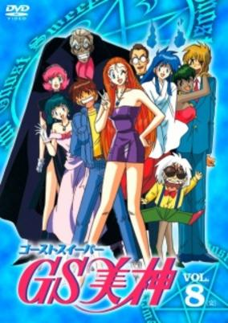

**Studio:** Toei Animation  |  **Episodes:** 45  |  **Director:** Atsutoshi Umezawa  |  **Aired/Released:** April 10 – March 6, 1994  |  **Genres:** Contemporary Fantasy, Fantasy, Japan, Comedy, Present, Super Power

> Reiko Mikami runs a business known as GS (Ghost Sweeper) Mikami, where she exorcises any evil that is bothering people. Her assistant, Tadao, only works for Reiko to see her nude one day. Too bad he isn't getting paid much for his job anyway. Later, Reiko and Tadao meet a spirit named Oniku who comes to help them in solving the mysteries of the supernatural.
>
> _Synopsis source: Kitsu_

[Wikipedia](https://en.wikipedia.org/wiki/Ghost_Sweeper_Mikami) · [Kitsu](https://kitsu.io/anime/ghost-sweeper-gs-mikami)

---

### Dragon League

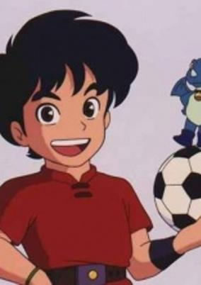

**Studio:** –  |  **Episodes:** 39  |  **Director:** Episodic: Kunitoshi Okajima Animation: Mitsuo Shindou  |  **Aired/Released:** May 7 – March 6, 1994  |  **Genres:** Fantasy, Sports, Adventure, Comedy

> Tokio and his father Amon go to the soccer country of Elevenia where they see a parade of the strongest soccer team of that country, the Winners. Amon challenges the team captain Leon to a soccer battle and, when Amon loses, Leon turns him into a miniature dragon. Tokio sees the fight and decides to challenge against Leon so that Amon can become human again.
>
> _Synopsis source: Kitsu_

[Kitsu](https://kitsu.io/anime/dragon-league)

---

### Muka Muka Paradise

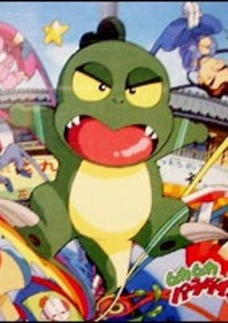

**Studio:** Nippon Animation  |  **Episodes:** 51  |  **Director:** Katsuyoshi Yatabe  |  **Aired/Released:** September 4 – August 26, 1994  |  **Genres:** Comedy, Adventure

> Uiba Shikatani, the daughter of a pet shop owner is heartbroken after some reptile eggs fail to hatch. In his attempts to cheer her up, her father brings home a large, striped egg, which he hopes will successfully hatch (unexpectedly into a green dinosaur whom they call 'Muka-Muka', which are the only words which the baby reptile can speak). Muka-Muka soon becomes the talk of the town and comes into the interest of the town's professor and his wacky inventions, including a time machine which successfully teleports the Shikatani's among other families and their homes to pre-historic times where they encounter several other dinosaurs and enchanted beings on their adventures.
>
> _Synopsis source: Kitsu_

[Wikipedia](https://en.wikipedia.org/wiki/Muka_Muka_Paradise) · [Kitsu](https://kitsu.io/anime/muka-muka-paradise)

---

### Slam Dunk

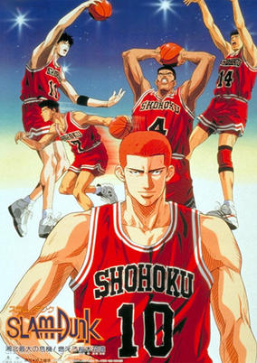

**Studio:** Toei Animation  |  **Episodes:** 101  |  **Director:** Nobutaka Nishizawa  |  **Aired/Released:** October 16 – March 23, 1996  |  **Genres:** Earth, Basketball, Japan, Action, Asia, Sports, Comedy, High School, Friendship, School Life, Plot Continuity, Present, Shounen

> Hanamichi Sakuragi, infamous for this temper, massive height, and fire-red hair, enrolls in Shohoku High, hoping to finally get a girlfriend and break his record of being rejected 50 consecutive times in middle school. His notoriety precedes him, however, leading to him being avoided by most students. Soon, after certain events, Hanamichi is left with two unwavering thoughts: "I hate basketball," and "I desperately need a girlfriend." One day, a girl named Haruko Akagi approaches him without any knowledge of his troublemaking and asks him if he likes basketball. Hanamichi immediately falls head over heels in love with her, blurting out a fervent affirmative. She then leads him to the gymnasium, where she asks him if he can do a slam dunk. In an attempt to impress Haruko, he makes the leap, but overshoots, instead slamming his head straight into the blackboard. When Haruko informs the basketball team's captain of Hanamichi's near-inhuman physical capabilities, he slowly finds himself drawn into the camaraderie and competition of the sport he had previously held resentment for. [Written by MAL Rewrite]
>
> _Synopsis source: Kitsu_

[Wikipedia](https://en.wikipedia.org/wiki/Slam_Dunk_(manga)) · [Kitsu](https://kitsu.io/anime/slam-dunk)

---

### Aoki Densetsu Shoot! ( Blue Legend Shoot! )

**Studio:** Toei Animation  |  **Episodes:** 58  |  **Director:** Daisuke Nishio  |  **Aired/Released:** November 7 – December 25, 1994

[Wikipedia](https://en.wikipedia.org/wiki/Shoot!_(manga))

---

### Shima Shima Tora no Shimajirou

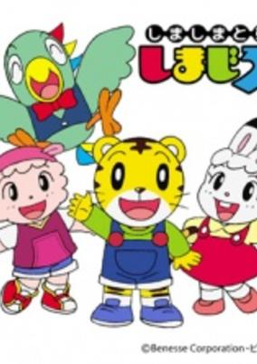

**Studio:** Studio Kikan  |  **Episodes:** 726  |  **Director:** Hisayuki Toriumi  |  **Aired/Released:** December 13 – March 31, 2008  |  **Genres:** Comedy, Magic, Fantasy, Adventure, Kids

> Shimajiro a tiger boy, Mimirin a rabbit girl, Torippii a parrot boy, Ramurin a sheep girl has an adventure in challenge island where they live.
>
> _Synopsis source: Kitsu_

[Wikipedia](https://en.wikipedia.org/wiki/Shima_Shima_Tora_no_Shimajir%C5%8D) · [Kitsu](https://kitsu.io/anime/shima-shima-tora-no-shimajirou)

---
