# 1994 in Anime

[← Back to index](../README.md)

57 titles · 52 with a matched synopsis/cover art · [source](https://en.wikipedia.org/wiki/1994_in_anime)

## Releases

### Dragon Pink

**Studio:** Pink Pineapple &nbsp;|&nbsp; **Director:** Takashi Takai, Wataru Fujii

---

### F³: Frantic, Frustrated & Female

**Studio:** AIC , Pink Pineapple &nbsp;|&nbsp; **Director:** Masakazu Akan

[Wikipedia](https://en.wikipedia.org/wiki/Nageki_no_Kenko_Yuryoji)

---

### Kageyama Tamio no Double Fantasy

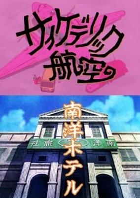

**Studio:** Shin-Ei Animation &nbsp;|&nbsp; **Director:** Katsumi Terahigashi &nbsp;|&nbsp; **Aired/Released:** January 2 &nbsp;|&nbsp; **Genres:** Comedy, Horror

> A 2-part TV special. The first part is a comedic bickering couple taking a sketchy plane for vacation. The second part is a horror a camera crew encounter while staying at the Hotel Southpacific after landing.
>
> _Synopsis source: Kitsu_

[Kitsu](https://kitsu.io/anime/kageyama-tamio-no-double-fantasy)

---

### Akazukin Chacha (Red Riding Hood Chacha)

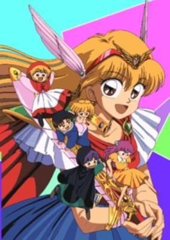

**Studio:** Gallop &nbsp;|&nbsp; **Director:** Hatsuki Tsuji &nbsp;|&nbsp; **Aired/Released:** January 7 &nbsp;|&nbsp; **Genres:** Fantasy, Fantasy World, Parody, Comedy, Mermaid, Magic, Friendship, Slapstick, Magical Girl, Plot Continuity, Adventure, Romance

> Akazukin Chacha is the story of a young magical girl (Mahō Shōjo) named Chacha. Living with her guardian in a cottage on Mochi-mochi mountain is Seravi, who is her teacher and also the fictional world's greatest magician. Chacha is clumsy in casting her spells because, throughout the anime, when she summons something, it often turns out to be something that she didn't mean to cast, for example, spiders (kumo) instead of a cloud (also kumo). At times in the anime when she and her friends are in trouble, however, her spells do work. Living on the same mountain is a boy gifted with enormous strength named Riiya. It is described that Riiya came from a family of werewolves who can instantly change into a wolf whenever they want. Quite far from Mochi-mochi mountain lies Urizuri mountain. Dorothy, also a well known magician in her land, lives in a castle on Urizuri mountain. Living with her is Shiine, her student. Shiine is adept when it comes to casting spells. He is a young wizard and most of his knowledge about magic was taught to him by Dorothy. The first 2 seasons were originally created by the anime team. Most of the stories in season 3 are based on the manga.
>
> _Synopsis source: Kitsu_

[Wikipedia](https://en.wikipedia.org/wiki/Akazukin_Chacha) · [Kitsu](https://kitsu.io/anime/akazukin-chacha)

---

### Kibun wa Uaa Jitsuzai OL Kōza

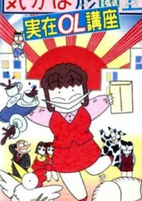

**Studio:** Group TAC &nbsp;|&nbsp; **Director:** Tetsuo Yasumi &nbsp;|&nbsp; **Aired/Released:** January 14 &nbsp;|&nbsp; **Genres:** Comedy

> Follows an office lady who expresses the phrase "Uaa" when in a state of emotional disbelief in situations above her head—which is quite frequent in the office, while dating, and when out on the town with friends.
>
> _Synopsis source: Kitsu_

[Kitsu](https://kitsu.io/anime/kibun-wa-uaa-jitsuzai-ol-kouza)

---

### Tico of the Seven Seas (Tico and Friends)

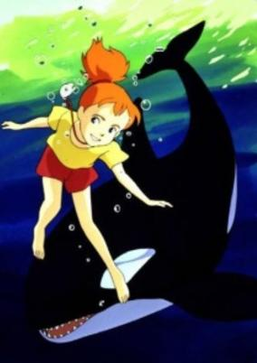

**Studio:** Nippon Animation &nbsp;|&nbsp; **Director:** Jun Takagi &nbsp;|&nbsp; **Aired/Released:** January 16 &nbsp;|&nbsp; **Genres:** Adventure, Slice of Life

> Nanami Simpson is a young girl. Her mother dies when she is young, and she goes to live with her father, Scott Simpson, on board a marine research vessel, the Peperonchino. Her father is a marine biologist, and he is in search of a creature known as the glowing whale. When he finds the bones of one of these, he is saddened, and resolves to change his mission toward preserving and caring for the creatures. Nanami befriends an Orca which she names Tico, and she goes swimming with it every day. Eventually, she learns to breathe underwater which astounds her father. Nanami nearly drowns one day, and one of the glowing whales saves her from certain death and returns her to the vessel, where her father finally gets to see it.
>
> _Synopsis source: Kitsu_

[Wikipedia](https://en.wikipedia.org/wiki/Tico_of_the_Seven_Seas) · [Kitsu](https://kitsu.io/anime/nanatsu-no-umi-no-tico)

---

### Dirty Pair Flash

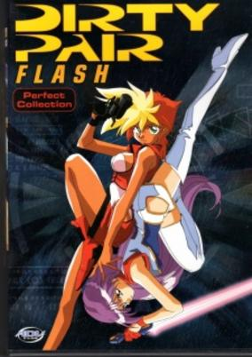

**Studio:** Sunrise , Bandai Visual &nbsp;|&nbsp; **Director:** Tsukasa Sunaga &nbsp;|&nbsp; **Aired/Released:** January 21 &nbsp;|&nbsp; **Genres:** Science Fiction, Ecchi, Action, Comedy, Special Squads, Other Planet, Future, Stereotypes, Law And Order, Plot Continuity, Cops, Adventure

> Kei and Yuri were originally junior auxiliary agents in the Worlds Works and Welfare Agency (W.W.W.A. or 3WA for short) when the two were paired together under the codename "Lovely Angels." Kei was coming off her fourth probation for something she had done, and Yuri's dating exploits were common knowledge, not to mention the two had an instant dislike for each other when they met. At first, Kei and Yuri refused to work with each other, and Kei even resigned from the 3WA. Afterwards, the two continued to work together, although they earned their nickname, "the Dirty Pair" because of all the collateral damage the two (unintentionally) cause in the completion of their cases. And even though the two now get along with one another, they continue to bicker and complain to each other. Although it is often said that these are younger versions of the original Lovely Angels Kei and Yuri, in truth this series is an alternate universe telling of Dirty Pair, set in the years 2248-49.
>
> _Synopsis source: Kitsu_

[Wikipedia](https://en.wikipedia.org/wiki/Dirty_Pair_Flash) · [Kitsu](https://kitsu.io/anime/dirty-pair-flash)

---

### Kattobase! Dreamers —Carp Tanjō Monogatari―

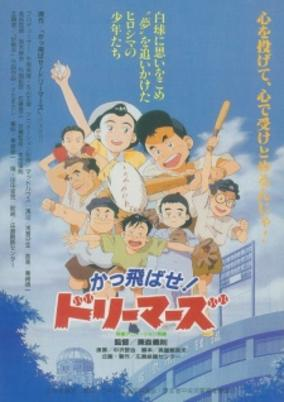

**Studio:** Madhouse &nbsp;|&nbsp; **Director:** Yoshinori Kanemori &nbsp;|&nbsp; **Aired/Released:** January 22 &nbsp;|&nbsp; **Genres:** Sports, Baseball

[Kitsu](https://kitsu.io/anime/kattobase-dreamers-carp-tanjou-monogatari)

---

### Brave Police J-Decker

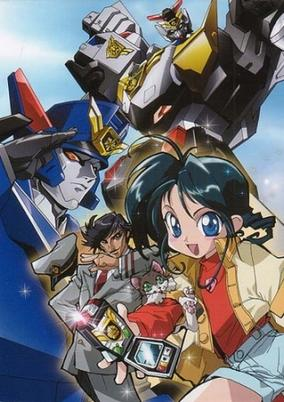

**Studio:** Sunrise &nbsp;|&nbsp; **Director:** Shinji Takamatsu &nbsp;|&nbsp; **Aired/Released:** February 5 &nbsp;|&nbsp; **Genres:** Earth, Transforming Craft, Science Fiction, Mecha, Action, Thievery, Special Squads, Gunfights, Crime, Law And Order, Adventure, Cops

> Grade schooler Yuuta Tominaga stumbles upon Deckerd, a humanoid robot under construction by the Japanese police, built to fight advanced forms of crime. Yuuta's constant contact with Deckerd gives the robot a "heart", or personality; when Yuuta is recruited as the "boss" of the "Brave Police" as a result, a true human/robot partnership occurs.
>
> _Synopsis source: Kitsu_

[Wikipedia](https://en.wikipedia.org/wiki/Brave_Police_J-Decker) · [Kitsu](https://kitsu.io/anime/yuusha-keisatsu-j-decker)

---

### Urotsukidōji III: Return of the Overfiend Director's Edition (Legend of the Galactic Heroes: Overture to a New War)

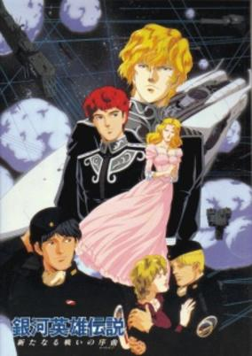

**Studio:** West Cape , Team Mu &nbsp;|&nbsp; **Director:** Hideki Takayama &nbsp;|&nbsp; **Aired/Released:** February 21 &nbsp;|&nbsp; **Genres:** Future, Space, Space Travel, Shipboard, Action, Science Fiction, Politics, Military, Space Battles, Space Opera

> Based on a series of sci-fi novels, this series tells the story of a massive conflict between the Prussia-like Galactic Empire and the Free Planets Alliance. It describes all levels of the war, from the tactical to the strategic, but focuses most on the two opposing militaries' leaders: Reinhard Von Lohengramm and Yang Wen-Li.
>
> _Synopsis source: Kitsu_

[Wikipedia](https://en.wikipedia.org/wiki/Legend_of_the_Overfiend#Return_of_the_Overfiend_(1992–1993)) · [Kitsu](https://kitsu.io/anime/ginga-eiyuu-densetsu-arata-naru-tatakai-no-overture)

---

### Doraemon: Nobita's Three Visionary Swordsmen (Doraemon the Movie: Nobita's Three Visionary Swordsmen)

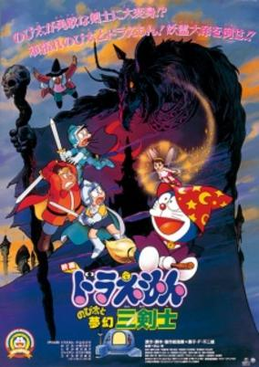

**Studio:** Shin-Ei Animation &nbsp;|&nbsp; **Director:** Tsutomu Shibayama &nbsp;|&nbsp; **Aired/Released:** March 12 &nbsp;|&nbsp; **Genres:** Science Fiction, Fantasy, Adventure, Kids

> Tired of the daily life and being the weakest, slowest, and dumbest, Nobita seeks comfort in his dreams where, using Doraemon's tools, he sets out on a fantasy journey. But when Nobita's dream world gets threatened by an evil sorcerer, Nobita gathers his friends to join him in his dream to fight the evil as the Three Musketeers.
>
> _Synopsis source: Kitsu_

[Kitsu](https://kitsu.io/anime/doraemon-nobita-s-fantastical-three-musketeers)

---

### Dragon Ball Z: Broly – Second Coming (Dragon Ball Z Movie 10: Broly - Second Coming)

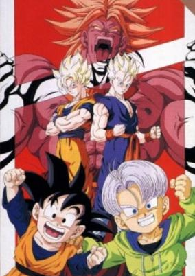

**Studio:** Toei Animation &nbsp;|&nbsp; **Director:** Shigeyasu Yamauchi &nbsp;|&nbsp; **Aired/Released:** March 12 &nbsp;|&nbsp; **Genres:** Super Power, Action, Science Fiction, Fantasy, Martial Arts, Demon, Adventure, Comedy, Shounen

> After his loss to Goku, Broly crash lands and hibernates on earth. After some time, he is awakened by Trunks and Goten, who Broly believes is Kakarott, and goes on a rampage to kill both of them. At the same time, Gohan is on his way to challenge the Legendary Super Saiyan alone.
>
> _Synopsis source: Kitsu_

[Kitsu](https://kitsu.io/anime/dragon-ball-z-movie-10-kiken-na-futari-super-senshi-wa-nemurenai)

---

### Marmalade Boy

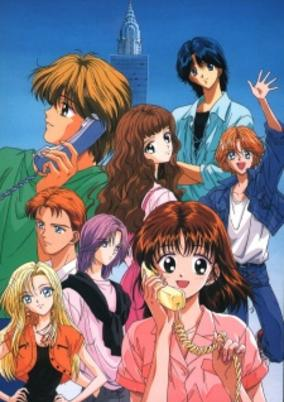

**Studio:** Toei Animation &nbsp;|&nbsp; **Director:** Akinori Yabe &nbsp;|&nbsp; **Aired/Released:** March 13 &nbsp;|&nbsp; **Genres:** Romance, Japan, Love Polygon, High School, Idol, School Life, Plot Continuity, Present, Comedy

> Miki Koishikawa is a high school student who enjoys a very simple life. However, her ordinary life is about to be turned upside down, and she may not be able to handle everything that is coming her way. After a very "fun" holiday in Hawaii, her parents have decided to get a divorce. As if this wasn’t enough of a shock for the poor girl, she also discovers that they will soon be re-marrying and swapping partners with another couple who they met on holiday. In order to include Miki in this shocking turn of events, they ask her to give the new couple a chance, and set up a dinner date with everyone. Miki may have tried to be emotionally prepared for her new parents, but what she was not expecting was their handsome son Matsuura Yuu. Miki develops an instant crush for Yuu. What starts off as a lovely friendship between them soon develops into romantic feelings which they are both finding hard to control. But more trouble is ahead in their relationship, as both Miki and Yuu have admirers of their own who are trying very hard to keep them separated.
>
> _Synopsis source: Kitsu_

[Wikipedia](https://en.wikipedia.org/wiki/Marmalade_Boy) · [Kitsu](https://kitsu.io/anime/marmalade-boy)

---

### Sailor Moon S

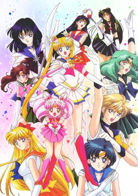

**Studio:** Toei Animation &nbsp;|&nbsp; **Director:** Kunihiko Ikuhara &nbsp;|&nbsp; **Aired/Released:** March 19 &nbsp;|&nbsp; **Genres:** Romance, Japan, Action, Middle School, Magic, Humanoid Alien, Magical Girl, Plot Continuity, Present, Demon, Super Power, Henshin, Shoujo

> This season makes a turning point in the Sailor Moon story. The Sailor Senshi are confronted by a new enemy, the Death Busters. Rei had a premonition that this enemy would rule the world in an era called the Silence. To do this, the Death Busters need to find the three Talismans that would summon the Holy Grail. However, two mysterious Sailor Senshi, Sailor Uranus and Sailor Neptune, plan to find the Talismans before them... but without Sailor Moon's help.
>
> _Synopsis source: Kitsu_

[Wikipedia](https://en.wikipedia.org/wiki/Sailor_Moon_S) · [Kitsu](https://kitsu.io/anime/bishoujo-senshi-sailor-moon-s)

---

### Final Fantasy: Legend of the Crystals (Legend of the Crystals: Final Fantasy)

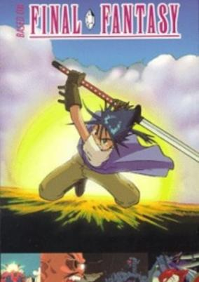

**Studio:** Madhouse &nbsp;|&nbsp; **Director:** Rintaro &nbsp;|&nbsp; **Aired/Released:** March 21 &nbsp;|&nbsp; **Genres:** Post Apocalypse, Mecha, Fantasy, Steampunk, Adventure, Comedy, Swordplay, Bounty Hunter, Other Planet, Action

> A continuation of the events from Final Fantasy V. 200 years after Bartz and his friends saved two worlds from the threat of ExDeath, a threat arises and seeks to take the Crystals for itself. Linaly, a descendant of Bartz, and her friend/protector Prettz journey to the Temple Of Wind to seek the source of this new danger.
>
> _Synopsis source: Kitsu_

[Kitsu](https://kitsu.io/anime/final-fantasy)

---

### Plastic Little

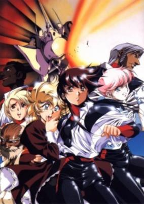

**Studio:** KSS &nbsp;|&nbsp; **Director:** Satoshi Urushihara &nbsp;|&nbsp; **Aired/Released:** March 21 &nbsp;|&nbsp; **Genres:** Science Fiction, Ecchi, Action, Comedy, Other Planet, Future, Mecha, Adventure, Romance, Military

> Set on the planet Yietta, whose colonists make their living by exploiting the planet's unique liquid-gas oceans, Plastic Little begins as the Yietans are finally about to pay off their debts to the Galactic Federation. Unfortunately, there are those who would rather not let Yietta slip through their fingers... Enter Tita, 17 year old captain of the Cha Cha Maru. Together with her crew, Tita specializes in capturing Yietta's exotic life forms for intergalactic pet shops, but through plain bad luck she finds herself, instead, at the core of a sinister plot to take over Yietta! By rescuing 16 year old Elysse from the very clutches of the military, Tita puts the lives of both herself and her crew in mortal peril... but a girl's got to do what a girl's got to do! As the plotters mobilize their forces in a desperate bid to retrieve Elysse, whom they believe possesses a vital computer code, Tita must play a dangerous game of tag with an entire army of professional killers! It's Cat and Mouse on a planetwide scale, with one crucial difference: Mice don't shoot back, but Tita's does!
>
> _Synopsis source: Kitsu_

[Wikipedia](https://en.wikipedia.org/wiki/Plastic_Little) · [Kitsu](https://kitsu.io/anime/plastic-little)

---

### Montana Jones

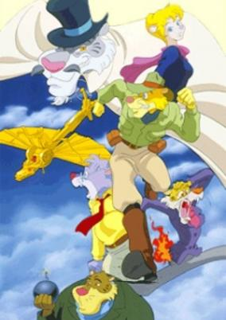

**Studio:** Studio Junio &nbsp;|&nbsp; **Director:** Tetsuo Imazawa &nbsp;|&nbsp; **Aired/Released:** April 2 &nbsp;|&nbsp; **Genres:** Adventure, Detective, Anthropomorphism, Robot Helper, Historical, Comedy

> Boston, 1930: Montana Jones and his cousin professor Alfred Jones travel around the world to search lost treasures in order to bring them to museums. Alfred's mentor professor Gerrit helps them by sending LPs with information. On one trip they meet Melissa, a wealthy reporter, who speaks nearly all languages. She accompanies the two on their trips. Their opponent is Lord Zero, a rich, bizarre art lover and master thief. Lord Zero has two henchmen: Slim and Slam. There is also the inventor Dr. Nitro, who invents strange engines, which to help finding treasures.
>
> _Synopsis source: Kitsu_

[Wikipedia](https://en.wikipedia.org/wiki/Montana_Jones) · [Kitsu](https://kitsu.io/anime/montana-jones)

---

### Haō Taikei Ryū Knight

**Studio:** Sunrise &nbsp;|&nbsp; **Director:** Toshifumi Kawase &nbsp;|&nbsp; **Aired/Released:** April 5

[Wikipedia](https://en.wikipedia.org/wiki/Ha%C5%8D_Taikei_Ry%C5%AB_Knight)

---

### Red Baron

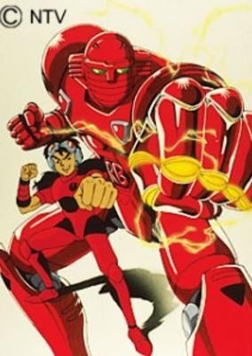

**Studio:** Tōkyō Movie Shinsha &nbsp;|&nbsp; **Director:** Akio Sakai &nbsp;|&nbsp; **Aired/Released:** April 5 &nbsp;|&nbsp; **Genres:** Science Fiction, Mecha, Super Robot, Robot, Action

> In the future, the "Metal Fight" games are the most popular televised sport in the world and many robot contestants compete for the title of Best Metal Fighter in the World. Kurenai Ken, along with teammate Saeba Shoko (who was, at first, adamant), pilots the Super Robot Fighter, Red Baron and enters the contest with dreams of becoming its champion. He must, however, face an army of other rivals from around the world including Kaizer (who is, in fact, Shoko's supposedly "lost" father, Tetsuo Saeba), the Tetsumen Tou ("Iron Fist" - a reference to the original Red Baron TV series) doctors, Tiger and ShinRon.
>
> _Synopsis source: Kitsu_

[Wikipedia](https://en.wikipedia.org/wiki/Red_Baron_(anime)) · [Kitsu](https://kitsu.io/anime/red-baron)

---

### Thunder Jet (Galaxy Warring State Chronicle Rai)

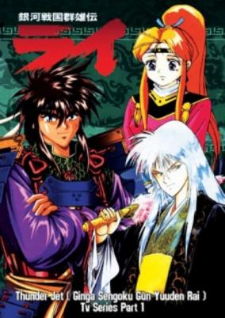

**Studio:** Easy Film &nbsp;|&nbsp; **Director:** Seiji Okuda &nbsp;|&nbsp; **Aired/Released:** April 8 &nbsp;|&nbsp; **Genres:** Swordplay, Conspiracy, War, Science Fiction, Action, Romance, Plot Continuity, Military, Samurai, Space, Adventure

> Rai is a space opera that fuses feudal Chinese and Japanese customs with vast galaxy spanning empires and space-going societies. The story follows the life and times of the samurai Rai, and the quest of several spacefaring factions for control of territory and, of course, the Empire.
>
> _Synopsis source: Kitsu_

[Wikipedia](https://en.wikipedia.org/wiki/Thunder_Jet) · [Kitsu](https://kitsu.io/anime/ginga-sengoku-yuuden-rai)

---

### Yu Yu Hakusho the Movie: Poltergeist Report

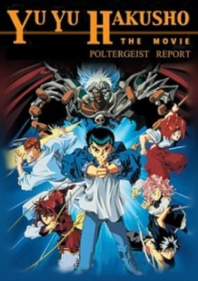

**Studio:** Studio Pierrot &nbsp;|&nbsp; **Director:** Masakatsu Iijima &nbsp;|&nbsp; **Aired/Released:** April 9 &nbsp;|&nbsp; **Genres:** Action, Comedy, Friendship, Demon, Supernatural, Fantasy

> Millennia ago, a war was fought between the Netherworld and the Spirit World. Ultimately, the Netherworld was destroyed and Lord Yakumo, the King of the Netherworld, was banished to the depths of space. Now, five defenders from the Spirit World must team-up against Yakumo's Demon-Gods for possession of five, mystical sites. But Lord Yakumo is dangerously close to reclaiming the Power Sphere—the source of the Netherworld's energy—and once it is again in his possession, our world will become the new Netherworld.
>
> _Synopsis source: Kitsu_

[Kitsu](https://kitsu.io/anime/yu-yu-hakusho-meikai-shitou-hen-honoo-no-kizuna)

---

### New Cutie Honey

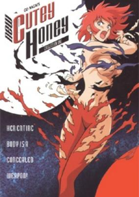

**Studio:** Toei Animation &nbsp;|&nbsp; **Director:** Yasuchika Nagaoka &nbsp;|&nbsp; **Aired/Released:** April 21 &nbsp;|&nbsp; **Genres:** Ecchi, Post Apocalypse, Action, Crime, Android, Demon, Super Power, Magic, Science Fiction, Adventure, Comedy

> Cosplay City is in danger when the evil Dolmeck shows up. Commanding his army of monsters, he plans on destroying everything. Only one person can stop this: Cutey Honey. After she is released from her dormancy, Honey Kisaragi becomes the multi-transformational android Cutey Honey. However, the least is expected when Honey is faced with an old enemy from the past: Panther Zora.
>
> _Synopsis source: Kitsu_

[Wikipedia](https://en.wikipedia.org/wiki/New_Cutie_Honey) · [Kitsu](https://kitsu.io/anime/shin-cutey-honey)

---

### G Gundam (Mobile Fighter G Gundam)

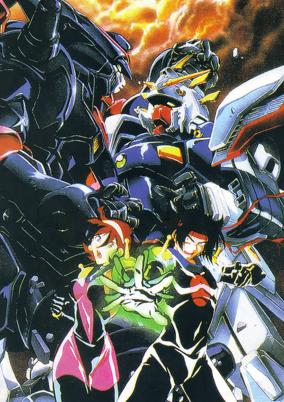

**Studio:** Sunrise &nbsp;|&nbsp; **Director:** Yasuhiro Imagawa &nbsp;|&nbsp; **Aired/Released:** April 22 &nbsp;|&nbsp; **Genres:** Martial Arts, Super Power, Future, Space, Earth, Mecha, Piloted Robot, Parody, Action, Science Fiction

> In the Year FC 60, much of mankind inhabits space colonies which orbit the Earth. Dominance over the colonies is decided once every four years by a large tournament in which each nation sends a single representative to fight the others with a giant robot called a Gundam. Domon Kashuu is selected to represent Neo-Japan in one of these tournaments, but he fights less to ensure his nation's victory than to find his brother, who has been blamed for the deaths of Domon's parents and the disappearance of a very dangerous weapon, the Dark Gundam or Devil Gundam.
>
> _Synopsis source: Kitsu_

[Wikipedia](https://en.wikipedia.org/wiki/G_Gundam) · [Kitsu](https://kitsu.io/anime/mobile-fighter-g-gundam)

---

### Crayon Shin-chan: The Secret Treasure of Buri Buri Kingdom

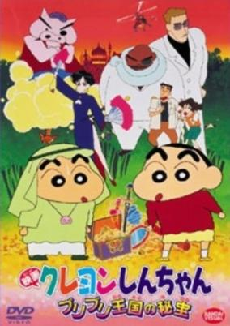

**Studio:** Shin-Ei Animation &nbsp;|&nbsp; **Director:** Hiro Yūki &nbsp;|&nbsp; **Aired/Released:** April 23 &nbsp;|&nbsp; **Genres:** Earth, Asia, Comedy, Present, Ecchi, Slice of Life, School Life, Kids, Family

> An action adventure film set in a imaginary southern island in the Indian Ocean. The evil secret society, "White Snake" abducted Shinnosuke and Prince Sunnokeshi of the Buri Buri Kingdom, who looks very much like Shinnosuke, in order to get the kingdom's hidden treasure in the golden palace underground. Shinnosuke's parents, Hiroshi and Misae fight with Lulu, the major of the palace guard of the kingdom, against White Snake, trying to recapture Shinnosuke and the prince.
>
> _Synopsis source: Kitsu_

[Kitsu](https://kitsu.io/anime/crayon-shin-chan-movie-02-buriburi-oukoku-no-hihou)

---

### Dohyō no Oni-tachi

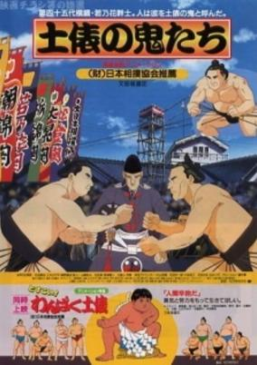

**Studio:** Studio Deen &nbsp;|&nbsp; **Director:** Naoyuki Yoshinaga &nbsp;|&nbsp; **Aired/Released:** May 21 &nbsp;|&nbsp; **Genres:** Sports, Historical

> Animated film about the life of the 45th Yokozuna, Wakanohana Kanji I.
>
> _Synopsis source: Kitsu_

[Kitsu](https://kitsu.io/anime/dohyou-no-oni-tachi)

---

### Dosukoi! Wanpaku Dohyō

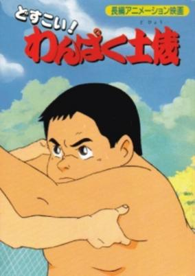

**Studio:** Mook Animation &nbsp;|&nbsp; **Director:** Seijiro Kamiyama &nbsp;|&nbsp; **Aired/Released:** May 21 &nbsp;|&nbsp; **Genres:** Sports

> Shown as a double feature with Dohyou no Oni-tachi.
>
> _Synopsis source: Kitsu_

[Kitsu](https://kitsu.io/anime/dosukoi-wanpaku-dohyou)

---

### Dengeki Oshioki Musume Gōtaman: Gōtaman Tanjō-hen (Butt Attack Punisher Girl Gautaman)

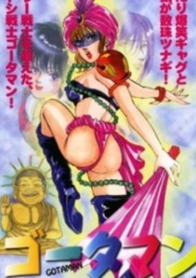

**Studio:** Studio Kikan &nbsp;|&nbsp; **Director:** Iku Suzuki &nbsp;|&nbsp; **Aired/Released:** May 24 &nbsp;|&nbsp; **Genres:** Parody, Ecchi, Comedy, Fantasy, Slapstick, Magical Girl, Female Student, Japan, Present, Action, Religion

> Mari Amachi is a very devout Christian who transfers to Perfect Religion Academy. A school devoted to all religions of the world in effort to make it's students the next world leaders in religion. Her friend Saori is kidnapped by the Black Buddha cult; a group who wishes to take away religious freedom though force and brainwashing. Mari prays to God for help but Buddha answers the call, instead! Mari aspires only to help her friend and she is transformed into Butt Attack Punisher Girl Gotaman. Between fighting bad guys, making a deal with Buddha, and wearing scandalous costumes, is it more than Mari can take?
>
> _Synopsis source: Kitsu_

[Kitsu](https://kitsu.io/anime/dengeki-oshioki-musume-gootaman-gootaman-tanjou-hen)

---

### J League o 100-bai Tanoshiku Miru Hōhō!!

**Studio:** Ajia-do Animation Works &nbsp;|&nbsp; **Director:** Itsumichi Isomura &nbsp;|&nbsp; **Aired/Released:** June 11 &nbsp;|&nbsp; **Genres:** Comedy, Sports, Parody

[Kitsu](https://kitsu.io/anime/j-league-wo-100-bai-tanoshiku-miru-houhou)

---

### Iria: Zeiram the Animation

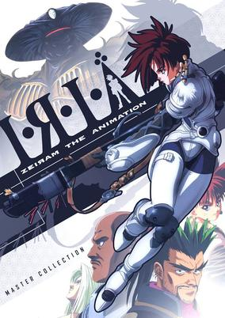

**Studio:** Ashi Productions &nbsp;|&nbsp; **Director:** Tetsurō Amino &nbsp;|&nbsp; **Aired/Released:** June 23 &nbsp;|&nbsp; **Genres:** Power Suit, Science Fiction, Mecha, Action, Parasite, Bounty Hunter, Other Planet, Horror, Alien, Future, Violence, Space, Adventure

> Iria is the story of a girl and the Alien being she loves to hate. The series begins with her brother, Gren, taking a job. He is a bounty hunter, and one well known for his incredible skill. Iria, being a skilled apprentice bounty hunter herself, tags along. What is the job, one might ask. It is to find out what has happened to the crew and cargo of a Space Station. Needless to say, nothing is as it seems, and the war between Iria and Zeiram begins in earnest.
>
> _Synopsis source: Kitsu_

[Kitsu](https://kitsu.io/anime/iria-zeiram-the-animation)

---

### Magical Twilight

**Studio:** Pink Pineapple &nbsp;|&nbsp; **Director:** Toshiaki Komura &nbsp;|&nbsp; **Aired/Released:** July 8

[Wikipedia](https://en.wikipedia.org/wiki/Magical_Twilight)

---

### Dragon Ball Z: Bio-Broly (Dragon Ball Z Movie 11: Bio-Broly)

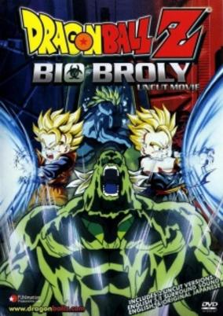

**Studio:** Toei Animation &nbsp;|&nbsp; **Director:** Yoshihiro Ueda &nbsp;|&nbsp; **Aired/Released:** July 9 &nbsp;|&nbsp; **Genres:** Super Power, Martial Arts, Action, Fantasy, Adventure, Comedy, Shounen

> Jaga Bada, Mr. Satan's old sparring partner, has invited Satan to his personal island to hold a grudge match. Trunks and Goten decide to come for the adventure and Android #18 is following Satan for the money he owes her. Little do they know that Jaga Bada's scientist have found a way to resurrect Broly, the legendary Super Saiyan.
>
> _Synopsis source: Kitsu_

[Kitsu](https://kitsu.io/anime/dragon-ball-z-movie-11-super-senshi-gekiha-katsu-no-wa-ore-da)

---

### Slam Dunk: Conquer the Nation, Hanamichi Sakuragi! (Slam Dunk)

**Studio:** Toei Animation &nbsp;|&nbsp; **Director:** Nobutaka Nishizawa &nbsp;|&nbsp; **Aired/Released:** July 9 &nbsp;|&nbsp; **Genres:** Earth, Basketball, Japan, Action, Asia, Sports, Comedy, High School, Friendship, School Life, Plot Continuity, Present, Shounen

> Hanamichi Sakuragi, infamous for this temper, massive height, and fire-red hair, enrolls in Shohoku High, hoping to finally get a girlfriend and break his record of being rejected 50 consecutive times in middle school. His notoriety precedes him, however, leading to him being avoided by most students. Soon, after certain events, Hanamichi is left with two unwavering thoughts: "I hate basketball," and "I desperately need a girlfriend." One day, a girl named Haruko Akagi approaches him without any knowledge of his troublemaking and asks him if he likes basketball. Hanamichi immediately falls head over heels in love with her, blurting out a fervent affirmative. She then leads him to the gymnasium, where she asks him if he can do a slam dunk. In an attempt to impress Haruko, he makes the leap, but overshoots, instead slamming his head straight into the blackboard. When Haruko informs the basketball team's captain of Hanamichi's near-inhuman physical capabilities, he slowly finds himself drawn into the camaraderie and competition of the sport he had previously held resentment for. [Written by MAL Rewrite]
>
> _Synopsis source: Kitsu_

[Wikipedia](https://en.wikipedia.org/wiki/Slam_Dunk_(manga)) · [Kitsu](https://kitsu.io/anime/slam-dunk)

---

### Sangokushi (dai 3-bu): Harukanaru Taichi

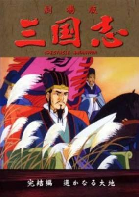

**Studio:** Enoki Films &nbsp;|&nbsp; **Director:** Tomoharu Katsumata &nbsp;|&nbsp; **Aired/Released:** July 9 &nbsp;|&nbsp; **Genres:** Historical, Action, Three Kingdoms

> An anime based on the Romance of the Three Kingdoms novel.
>
> _Synopsis source: Kitsu_

[Kitsu](https://kitsu.io/anime/sangokushi-daisanbu-harukanaru-taichi)

---

### Fatal Fury: The Motion Picture

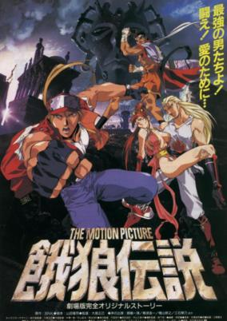

**Studio:** Studio Wombat, Yumeta Company &nbsp;|&nbsp; **Director:** Masami Ōbari &nbsp;|&nbsp; **Aired/Released:** July 16 &nbsp;|&nbsp; **Genres:** Action, Martial Arts, Adventure, Romance, Super Power, Combat

> Young millionaire Laocorn Gaudeamus is on a crusade to recover six pieces of armour said to give the user the powers of Mars—the legendary God of War. Fearing that her twin brother is slowly losing his sanity with every armour piece he collects, Sulia runs to Terry, Andy, Joe and Mai to form their own global crusade to stop Laocorn from opening a potential Pandora's Box and releasing an uncontrollable form of destruction.
>
> _Synopsis source: Kitsu_

[Kitsu](https://kitsu.io/anime/fatal-fury-the-motion-picture)

---

### Pom Poko

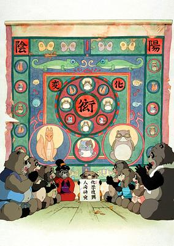

**Studio:** Studio Ghibli &nbsp;|&nbsp; **Director:** Isao Takahata &nbsp;|&nbsp; **Aired/Released:** July 16 &nbsp;|&nbsp; **Genres:** Fantasy, Japan, Asia, Earth, Anthropomorphism, Countryside, Kids

> Faced with the destruction of their habitat due to the growth of Tokyo, a group of tanuki try to defend their homes. They decide to use their transforming talents to try to hold back the new development. Two of them, especially skilled at transforming, are sent to Shikoku to enlist the help of three sages. Meanwhile, the rest of them do their best to disrupt the construction site, at first causing accidents, and then actually haunting the site. However, the humans are very persistent, and soon the tanuki are forced to use more and more extreme measures to save their home.
>
> _Synopsis source: Kitsu_

[Wikipedia](https://en.wikipedia.org/wiki/Pom_Poko) · [Kitsu](https://kitsu.io/anime/pom-poko)

---

### Soreike! Anpanman: Ririkaru Majikaru Mahō no Gakkō

**Studio:** Tokyo Movie Shinsha &nbsp;|&nbsp; **Director:** Akinori Nagaoka, Hiroyuki Yano &nbsp;|&nbsp; **Aired/Released:** July 16

[Wikipedia](https://en.wikipedia.org/wiki/Anpanman#Full-length_movies)

---

### The Life of Guskou Budori

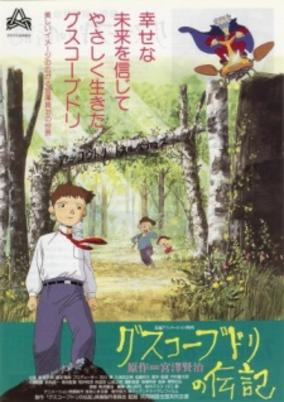

**Studio:** Kyōdō Eiga Zenkoku Keiretsu Kaigi &nbsp;|&nbsp; **Director:** Ryutaro Nakamura &nbsp;|&nbsp; **Aired/Released:** July 16 &nbsp;|&nbsp; **Genres:** Drama

> The Biography of Budori Gusko was the recipient of numerous awards including the Monbusho Selection. The original novella on which the film is based is one of Kenji Miyazawa's more famous works, alongside Matasaburo the Wind Imp, Gauche the Cellist and Night on the Galactic Railroad. The story follows the life of a young boy named Gusuko who lives in the countryside with his parents and little sister. A string of droughts and other natural disasters tear the family apart, and Gusuko is forced to leave home and seek his fortunes on his own. Driven by a desire to improve the quality of life of his poor countrymen, he eventually joins a group of scientists called the Iihatov Volcano Department, and there takes part in scientific projects to fight the natural disasters that drove him from his home.
>
> _Synopsis source: Kitsu_

[Wikipedia](https://en.wikipedia.org/wiki/The_Life_of_Budori_Gusuko#The_Life_of_Guskou_Budori_(1994_film)) · [Kitsu](https://kitsu.io/anime/guskou-budori-no-denki)

---

### Lupin III: Dragon of Doom (Lupin the Third: The Pursuit of Harimao's Treasure)

**Studio:** Tokyo Movie Shinsha &nbsp;|&nbsp; **Director:** Masaharu Okuwaki &nbsp;|&nbsp; **Aired/Released:** July 29 &nbsp;|&nbsp; **Genres:** Action, Adventure, Comedy, Crime, Thievery

> The infamous bandit Harimao hid a treasure, and to retrieve it, Lupin and the gang must gather three lost statues. When the Nazi-like group Neo-Himmel make a run for the goods, Lupin reluctantly partners with the aging "double-O" MI-6 agent Sir Archer and his granddaughter Diana to gather he statues first. Can this unorthodox team bond well enough to see this mission through? Find out in the Pursuit of Harimao's Treasure!
>
> _Synopsis source: Kitsu_

[Wikipedia](https://en.wikipedia.org/wiki/List_of_Lupin_III_television_specials#6) · [Kitsu](https://kitsu.io/anime/lupin-iii-the-pursuit-of-harimao-s-treasure)

---

### Street Fighter II: The Animated Movie

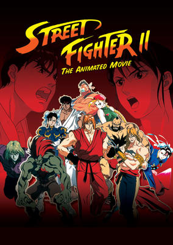

**Studio:** Group TAC , SEDIC, Sony Music Entertainment &nbsp;|&nbsp; **Director:** Gisaburō Sugii &nbsp;|&nbsp; **Aired/Released:** August 6 &nbsp;|&nbsp; **Genres:** Action, Earth, Martial Arts, Violence, Present, Shounen

> Get your quarters ready, because the world's top fighters are about to go head to head in this explosive animated adaptation of the classic Street Fighter II arcade game! M. Bison's plan to crush those who would oppose his organization, Shadowloo, is simple: brainwash the strongest martial artists around with his dreaded psycho power, and turn them into living weapons! To stop him, Interpol agent Chun-Li must team up with Major Guile of the United States Air Force, but that's no small feat. They'll have to put aside their differences and learn to work together, and fast. Bison is closing in on Ryu, a traveling vagabond said to be the best fighter in the world. Fortunately (or not), Ryu is a hard man to find, but the same can't be said of his eternal rival, Ken. And it might just be through Ken that Bison will get what he wants! Can the World Warriors beat Bison to the punch?
>
> _Synopsis source: Kitsu_

[Kitsu](https://kitsu.io/anime/street-fighter-ii-the-movie)

---

### Ghost Sweeper Mikami: The Great Paradise Battle!!

**Studio:** Toei Animation &nbsp;|&nbsp; **Director:** Atsutoshi Umezawa &nbsp;|&nbsp; **Aired/Released:** August 20 &nbsp;|&nbsp; **Genres:** Contemporary Fantasy, Fantasy, Japan, Comedy, Present, Super Power

> Reiko Mikami runs a business known as GS (Ghost Sweeper) Mikami, where she exorcises any evil that is bothering people. Her assistant, Tadao, only works for Reiko to see her nude one day. Too bad he isn't getting paid much for his job anyway. Later, Reiko and Tadao meet a spirit named Oniku who comes to help them in solving the mysteries of the supernatural.
>
> _Synopsis source: Kitsu_

[Wikipedia](https://en.wikipedia.org/wiki/Ghost_Sweeper_Mikami#Film) · [Kitsu](https://kitsu.io/anime/ghost-sweeper-gs-mikami)

---

### Baki the Grappler

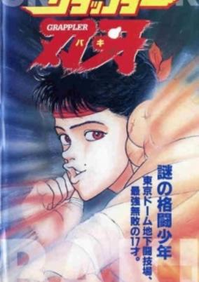

**Studio:** Knack Productions &nbsp;|&nbsp; **Director:** Yuji Asada &nbsp;|&nbsp; **Aired/Released:** August 21 &nbsp;|&nbsp; **Genres:** Martial Arts, Present, Earth, Japan, Violence, Combat, Stereotypes, Asia, Action, Sports

> Baki, a new grappler on the no-holds barred fighting scene, is flying up the ranks. All that is left in his wake are the dead and the defeated. However, no one can tell whether he can keep this up against the previous champion, a fierce fighter who severs his opponents very nerves to win.
>
> _Synopsis source: Kitsu_

[Wikipedia](https://en.wikipedia.org/wiki/Baki_the_Grappler#Original_video_animations) · [Kitsu](https://kitsu.io/anime/grappler-baki-the-ultimate-fighter)

---

### Captain Tsubasa: The Most Powerful Opponent! Holland Youth

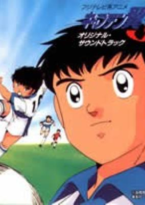

**Studio:** J.C.Staff &nbsp;|&nbsp; **Director:** Yoriyasu Kogawa &nbsp;|&nbsp; **Aired/Released:** August 21 &nbsp;|&nbsp; **Genres:** Present, Earth, Alternative Present, Action, Sports, Soccer

> The first 33 episodes are a summary of the previous series. In the first new episodes a new character, Shingo Aoi, (playing in Italy) is introduced. After that the world cup begins, this time with extraordinary, new countries like Sweden, Thailand or Uzbekistan. Unfortunately the Anime ends in the middle of the world cup after the match Japan-Uzbekistan.
>
> _Synopsis source: Kitsu_

[Wikipedia](https://en.wikipedia.org/wiki/Captain_Tsubasa#Anime) · [Kitsu](https://kitsu.io/anime/captain-tsubasa-j)

---

### Cosmic Fantasy: Galaxy Cougar's Trap

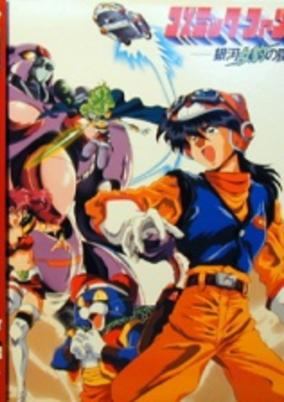

**Studio:** Tokuma Shoten &nbsp;|&nbsp; **Director:** Kazuhiro Ochi &nbsp;|&nbsp; **Aired/Released:** August 25 &nbsp;|&nbsp; **Genres:** Comedy, Science Fiction, Space, Fantasy, Romance, Action, Ecchi, Adventure

> Yuu and Saya are two of the top Cosmic Hunters in the galaxy, and Yuu is enjoying a bit of fame after his most recent adventure. The two are on a date when they are interrupted from a distress signal from their "ally", the feline pervert Nyan. In the meantime, the space pirate Belga begins attacking space freighters in an attempt to lure out Yuu, so she can take him to bed with her. Of course, when he spurns her, she decides that if she can't have him, then no one can.
>
> _Synopsis source: Kitsu_

[Wikipedia](https://en.wikipedia.org/wiki/Cosmic_Fantasy#Other_media) · [Kitsu](https://kitsu.io/anime/cosmic-fantasy-ginga-mehyou-no-wana)

---

### Samurai Shodown: The Motion Picture (Samurai Shodown The Motion Picture)

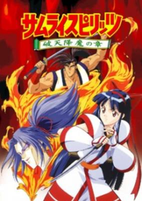

**Studio:** Studio Comet &nbsp;|&nbsp; **Director:** Hiroshi Ishiodori &nbsp;|&nbsp; **Aired/Released:** September 8 &nbsp;|&nbsp; **Genres:** Samurai, Historical, Adventure

> One hundred years after their deaths, six legendary holy warriors are reborn to seek justice against the former comrade who betrayed them into the hands of an evil god! The six warriors search the feudal province of Edo questing for the last Saint Soldier, Haohmaru, and their sworn nemesis Shirou Amakusa. Will the followers of the divine light triumph over the forces of darkness, or is history destined to repeat itself? Before their hundred-year journey has ended, six samurai will prove that the only thing stronger than their holy blades is the steel of their wills!
>
> _Synopsis source: Kitsu_

[Kitsu](https://kitsu.io/anime/samurai-spirits)

---

### I'm Not an Angel

**Studio:** Group TAC &nbsp;|&nbsp; **Director:** Hiroko Tokita &nbsp;|&nbsp; **Aired/Released:** September 21 &nbsp;|&nbsp; **Genres:** Romance, Earth, Japan, Asia, High School, School Life, Present, Comedy

> In a rainy spring day, first year high schooler Midori Saezima saw a tall, handsome fellow student took care of a stray kitten. Without knowing the boy's name, she fell in love with him at the first sight. Due to sickness, Midori returned to school three days after summer vacation -- only to find out that she was "volunteered" as a candidate for student council. After a series of embarrassing accidents, both she and the mysterious boy she had a crush on, Akira Sudo, were elected as members of the student council. Being the first student council of this newly established high school, they are about to create "new traditions" for their school and a bittersweet love story for themselves...
>
> _Synopsis source: Kitsu_

[Wikipedia](https://en.wikipedia.org/wiki/Tenshi_Nanka_Ja_Nai) · [Kitsu](https://kitsu.io/anime/tenshi-nanka-ja-nai)

---

### You're Under Arrest

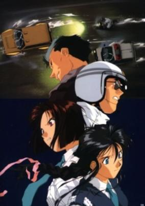

**Studio:** Studio Deen &nbsp;|&nbsp; **Director:** Kazuhiro Furuhashi &nbsp;|&nbsp; **Aired/Released:** September 24 &nbsp;|&nbsp; **Genres:** Romance, Japan, Action, Slice of Life, Comedy, Stereotypes, Law And Order, Present, Motorsport, Cops

> Running late on her first day as a patrol woman for the Bokuto Police Department, spunky moped rider Natsumi Tsujimoto decides to take several shortcuts, only to be chased down and cited by mechanical genius and expert police driver Miyuki Kobayakawa. Upon arrival at the precinct, Natsumi finds out that her new partner is the same woman who ticketed her earlier. At first, she doesn't trust Miyuki, but in a short period of time, they develop an unbreakable friendship that overcomes traffic accidents, reckless drivers and even the strongest typhoons to hit Tokyo.
>
> _Synopsis source: Kitsu_

[Wikipedia](https://en.wikipedia.org/wiki/You%27re_Under_Arrest_(manga)) · [Kitsu](https://kitsu.io/anime/you-re-under-arrest)

---

### Blue Seed

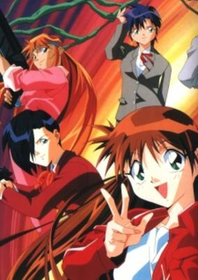

**Studio:** Production I.G. &nbsp;|&nbsp; **Director:** Jun Kamiya &nbsp;|&nbsp; **Aired/Released:** October 5 &nbsp;|&nbsp; **Genres:** Ecchi, Japan, Action, Asia, Comedy, Special Squads, Gunfights, Slapstick, Alternative Present, Stereotypes, Law And Order, Plot Continuity, Violence, Present, Cops, Demon, Super Power, Science Fiction, Adventure, Horror, Romance, Mystery

> Momiji is an average girl until the day she finds she is the descendant of the great Kushinada family. Only she, with her Kushinada blood, can stop the Aragami, demonic plant-like monsters threatening to destroy Japan. Along to help her is the TAC, and a possible love interest in a young man named Kusanagi.
>
> _Synopsis source: Kitsu_

[Wikipedia](https://en.wikipedia.org/wiki/Blue_Seed) · [Kitsu](https://kitsu.io/anime/blue-seed)

---

### DNA²

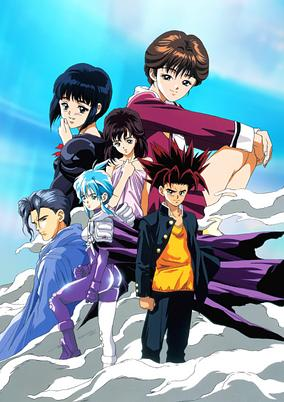

**Studio:** Madhouse , Studio Deen &nbsp;|&nbsp; **Director:** Jun'ichi Sakata &nbsp;|&nbsp; **Aired/Released:** October 7 &nbsp;|&nbsp; **Genres:** Romance, Science Fiction, Ecchi, Action, Comedy, Time Travel, Harem

> Karin, a DNA operator from the future, is on a mission to change the course of History by stopping Junta Momonari from becoming the Mega-Playboy who fathered 100 children and led to the overpopulation of the world. But Junta is no playboy; in fact, he is allergic to girls. But when Karin shoots him with the wrong DNA-altering bullet, he starts sporadically becoming the Mega-Playboy capable of charming any woman. Karin must try to restore the situation to normal before the change to Mega-Playboy becomes irreversible.
>
> _Synopsis source: Kitsu_

[Wikipedia](https://en.wikipedia.org/wiki/DNA%C2%B2) · [Kitsu](https://kitsu.io/anime/dna)

---

### Darkside Blues

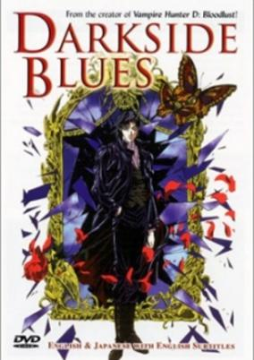

**Studio:** J.C.Staff &nbsp;|&nbsp; **Director:** Nobuyasu Furukawa &nbsp;|&nbsp; **Aired/Released:** October 8 &nbsp;|&nbsp; **Genres:** Violence, Earth, Dystopia, Science Fiction, Future, Super Power, Horror, Psychological, Mystery

> The Persona Century Corporation has purchased nearly every parcel of land on earth. Dissension is not tolerated within the corporation's borders and those who oppose Persona are dealt with swiftly. Of those few places not yet under Persona's control is the free town of Kabuki-cho, also known as "The Dark Side of Tokyo". Within the town, under the leadership of a woman named Mai, is a small resistance group called Messiah. Into this world steps a man who takes the sobriquet of Kabuki-cho: Darkside. Sealed up in another dimension eighteen years ago by Persona Century, Darkside now returns to aid Messiah using his unique mystic power of renewal.
>
> _Synopsis source: Kitsu_

[Wikipedia](https://en.wikipedia.org/wiki/Darkside_Blues) · [Kitsu](https://kitsu.io/anime/darkside-blues)

---

### Macross 7

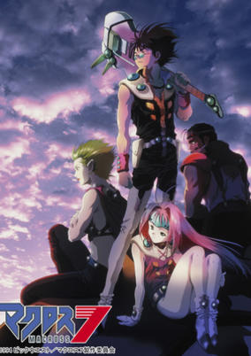

**Studio:** Studio Nue , Ashi Productions &nbsp;|&nbsp; **Director:** Tetsurō Amino &nbsp;|&nbsp; **Aired/Released:** October 16 &nbsp;|&nbsp; **Genres:** Transforming Craft, Science Fiction, Mecha, Adventure, Action, Piloted Robot, Comedy, Shipboard, Alien, Musical Band, Future, Plot Continuity, Space, Music, Romance, Military

> 35 years have passed since Lynn Minmay had brought peace between the Zentradi and the humans in the events of Macross. Nekki Basara is a guitarist and a singer of the band Fire Bomber. Living in a less-developed part of the flying colony City 7 which is looking for a habitable planet, he composes and sings songs in the belief that music holds a greater power. During its flight, an unknown alien race appeared and started laying siege upon City 7. However, its attacks are not conventional -- instead of trying to destroy them, they steal what is known as "spiritia", rendering victims unresponsive and zombie-like. During these battles, Basara always goes out into the middle of the warzone, singing his songs and expecting friend and foe to listen and be moved by his music.
>
> _Synopsis source: Kitsu_

[Wikipedia](https://en.wikipedia.org/wiki/Macross_7) · [Kitsu](https://kitsu.io/anime/macross-7)

---

### Magical Circle Guru Guru

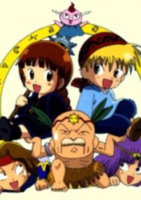

**Studio:** TV Asahi &nbsp;|&nbsp; **Director:** Nobuaki Nakanishi &nbsp;|&nbsp; **Aired/Released:** October 13 &nbsp;|&nbsp; **Genres:** Fantasy, Fantasy World, Adventure, Action, Comedy, Magic

> There is a small village called Jimuna on the continent of Jamu Jamu. This village is home to a girl named Kukuri. She is the last descendent of the Migu Migu Tribe. She is raised by an old witch who teaches her the secret magic of the tribe, but Kukuri is not a good student. In the same village lives a boy named Nike. He has been raised by very strict parents. They discipline their son to become a brave hero of the village. Nike himself does not want to be a hero at all, but he grows up to become a mighty boy. One day the king of the village, Kodai, recruits troops to fight against the ruler of the darkness, Giri. Kukuri and Nike are accepted. The two children, the strong but reluctant hero Nike, and the eager but unskilled little witch Kukuri, set out on a wonderful journey full of adventures and friendship.
>
> _Synopsis source: Kitsu_

[Wikipedia](https://en.wikipedia.org/wiki/Magical_Circle_Guru_Guru) · [Kitsu](https://kitsu.io/anime/mahoujin-guru-guru)

---

### Magic Knight Rayearth

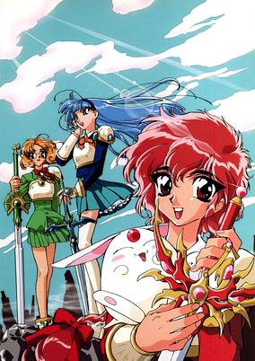

**Studio:** Tōkyō Movie Shinsha &nbsp;|&nbsp; **Director:** Toshihiro Hirano &nbsp;|&nbsp; **Aired/Released:** October 17 &nbsp;|&nbsp; **Genres:** Fantasy, Super Deformed, Magic, Magical Girl, Science Fiction, Action, Mecha, Comedy, Parallel Universe, Fantasy World, Adventure, Romance

> Three young girls, Hikaru, Umi, and Fuu, are transported to a magical world called Cephiro during a field trip to Tokyo Tower. They are soon greeted by Master Mage Clef, who explains to them that they have been summoned to become the Legendary Magic Knights and save Cephiro. The girls are less than enthusiastic about this idea, and only want to return home. Clef further explains that they must seek out the three Rune Gods to help them fight. He bestows armor and magical powers to each of them. They learn from Clef that High Priest Zagato has kidnapped the Pillar of Cephiro, Princess Emeraude. The Pillar of Cephiro has the sole responsibility of keeping Cephiro alive and in balance with her prayers. Without Princess Emeraude, Cephiro would fall into ruin. Hikaru, Umi, and Fuu must fight off Zagato's henchman and find the Rune Gods if they ever want to get back home. They soon learn that friendship and loyalty are the only things they can rely on in the crumbling Cephiro.
>
> _Synopsis source: Kitsu_

[Wikipedia](https://en.wikipedia.org/wiki/Magic_Knight_Rayearth) · [Kitsu](https://kitsu.io/anime/magic-knight-rayearth)

---

### Captain Tsubasa J

**Studio:** Studio Comet &nbsp;|&nbsp; **Director:** Junichi Sato &nbsp;|&nbsp; **Aired/Released:** October 21 &nbsp;|&nbsp; **Genres:** Earth, Action, Sports, Soccer, Alternative Present, Present

> The first 33 episodes are a summary of the previous series. In the first new episodes a new character, Shingo Aoi, (playing in Italy) is introduced. After that the world cup begins, this time with extraordinary, new countries like Sweden, Thailand or Uzbekistan. Unfortunately the Anime ends in the middle of the world cup after the match Japan-Uzbekistan.
>
> _Synopsis source: Kitsu_

[Wikipedia](https://en.wikipedia.org/wiki/Captain_Tsubasa_J) · [Kitsu](https://kitsu.io/anime/captain-tsubasa-j)

---

### Dengeki Oshioki Musume Gōtaman R: Ai to Kanashimi no Final Battle (Butt Attack Punisher Girl Gautaman R)

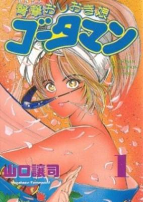

**Studio:** Studio Kikan &nbsp;|&nbsp; **Director:** Hiroshi Yoshida &nbsp;|&nbsp; **Aired/Released:** October 24 &nbsp;|&nbsp; **Genres:** Ecchi, Japan, Parody, Comedy, Slapstick, Magical Girl, Female Student, Present, Action

> Gootaman is back, and ready to bring justice to the Black Buddha gang who are still terrorizing the PR Academy! Unfortunately her alter ego Mari has fallen in love with the group’s leader Tobishima, who has been tasked with killing the bare bottomed hero! Will their romantic feelings overcome his murderous intent, or is Mari destined to be alone as the scantily-clad champion forever?
>
> _Synopsis source: Kitsu_

[Kitsu](https://kitsu.io/anime/dengeki-oshioki-musume-gootaman-r-ai-to-kanashimi-no-final-battle)

---

### Get Going! Godzilland (Recommend! Godzilland)

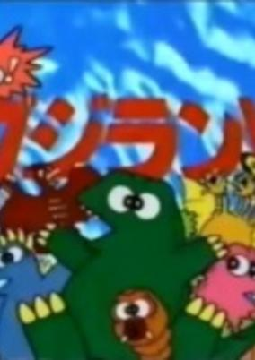

**Studio:** Gakken Video &nbsp;|&nbsp; **Director:** Seinosuke Tanaka & Osamu Nakayama &nbsp;|&nbsp; **Aired/Released:** November 6

> Recommend! Godzilland is a series of four educational OVAs released to VHS in 1994 and 1996 by Gakken. They use Godzilla and other kaiju to teach children about the hiragana alphabet, counting, addition, and subtraction.
>
> _Synopsis source: Kitsu_

[Wikipedia](https://en.wikipedia.org/wiki/Godzilland) · [Kitsu](https://kitsu.io/anime/susume-godzilland)

---

### Sailor Moon S: The Movie (Sailor Moon S Movie: Hearts in Ice)

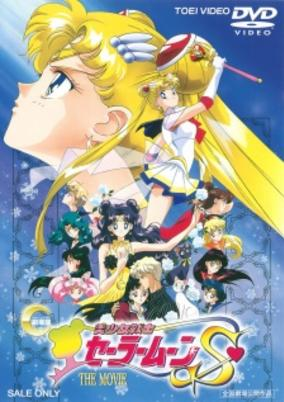

**Studio:** Toei Animation &nbsp;|&nbsp; **Director:** Hiroki Shibata &nbsp;|&nbsp; **Aired/Released:** December 4 &nbsp;|&nbsp; **Genres:** Romance, Japan, Earth, Action, Asia, Magic, Magical Girl, Present, Demon, Super Power, Fantasy, Adventure, Comedy, Shoujo, Henshin

> An unusual snow storm hits Tokyo and the Sailor Senshi discover that an evil snow queen Kaguya, wants to freeze the entire earth. It's up to the Inner Sailor Senshi along with the Outers, to defeat the Queen. Meanwhile, Luna falls in love with a human astronomer named Kakeru whose girlfriend is an astronaut about to take a space shuttle mission. Kakeru becomes ill and Luna wishes she could be a human to help him.
>
> _Synopsis source: Kitsu_

[Kitsu](https://kitsu.io/anime/bishoujo-senshi-sailor-moon-s-kaguya-hime-no-koibito)

---

### Key the Metal Idol

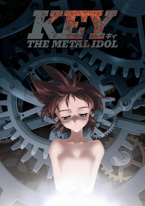

**Studio:** Studio Pierrot &nbsp;|&nbsp; **Director:** Hiroaki Satō &nbsp;|&nbsp; **Aired/Released:** December 16 &nbsp;|&nbsp; **Genres:** Science Fiction, Japan, Asia, Earth, Angst, Drama, Alternative Present, Plot Continuity, Violence, Present, Mecha, Music, Action

> Tokiko Mima, nicknamed "Key," is a 17-year-old girl living in the Japanese countryside who, despite her human-like appearance, is a robot. When Key's grandfather Dr. Murao Mima passes away, he leaves her a dying message, telling her that she can become a real girl if she is able to make thirty thousand friends. Thus, Key moves from the quiet Mamio Valley to the busy streets of Tokyo, where she soon runs into her childhood friend Sakura Kuriyagawa. Key quickly becomes enamored with idol singer Miho Utsuse and wonders if becoming a singer will allow her to make the amount of friends needed for her to become human. But Miho carries a ominous secret: she is connected to Jinsaku Ajou, an old rival of Dr. Mima trying to make new a breakthrough in robotic weaponry. As Key works to become a real girl, Ajou sets a dangerous plan into action, and it turns out there's much more to Key than meets the eye. [Written by MAL Rewrite]
>
> _Synopsis source: Kitsu_

[Wikipedia](https://en.wikipedia.org/wiki/Key_the_Metal_Idol) · [Kitsu](https://kitsu.io/anime/key-the-metal-idol)

---
