# 1995 in Anime

[← Back to index](../README.md)

61 titles · 51 with a matched synopsis/cover art · [source](https://en.wikipedia.org/wiki/1995_in_anime)

## Releases

### Armitage III

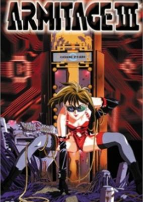

**Genres:** Science Fiction, Action, Thriller, Cyberpunk, Other Planet, Future, Android, Stereotypes, Law And Order, Cops, Mecha, Adventure, Romance

> The year is 2046. Detective Ross Sylibus is transferred to Mars when a country singer on her flight is murdered. Making matters more complicated is that the singer is a "Third"—a robot that looks and feels like a human. Sylibus is partnered with Armitage—a beautiful female cop with a bad attitude. As they investigate the murder of the singer and other women on Mars, they uncover a conspiracy that can have them both killed by the Martian government.
>
> _Synopsis source: Kitsu_

[Wikipedia](https://en.wikipedia.org/wiki/Armitage_III) · [Kitsu](https://kitsu.io/anime/armitage-iii)

---

### The Biography of Confucius

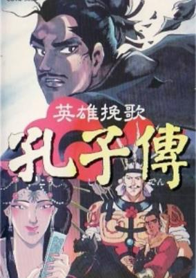

**Genres:** Historical, Adventure, Romance, Drama

> Born in the Chinese state of Lu in 551 B.C., Confucius is raised by his mother after his father dies when he is only three. He marries at 19 and enters the service of the local nobility. At 32, he becomes tutor to the Prince of Lu's children, eventually becoming a politician at 51. His career peaks are the roles of Lu's justice minister and eventually prime minister. The land prospers for four years, but Confucius grows disenchanted with court intrigues. For the following 12 years, he wanders the neighboring states, offering advice to their rulers.
>
> _Synopsis source: Kitsu_

[Kitsu](https://kitsu.io/anime/eiyuu-banka-koushi-den)

---

### Catnapped! (Catnapped)

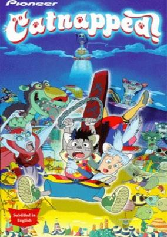

**Genres:** Adventure

> Fifth-grader, Toriyasu, and his little sister, Meeko, have a dog named Papadoll who has been missing for the past week. One night, two cats take the two children to the distant cat land of Banipal Witt, where Papadoll was abducted. Because of his long exposure to Banipal Witt's sun, Papadoll mutated into a giant dog monster, terrorizing the city under the control of the evil Princess Buburina, who has the curse of turning anyone she touches into balloons. Toriyasu, Meeko, and the cats have until the next sunrise to turn Papadoll and the ballooned citizens of Banipal Witt back to normal and return to their home planet—or end up with the same fate as their dog.
>
> _Synopsis source: Kitsu_

[Wikipedia](https://en.wikipedia.org/wiki/Catnapped!) · [Kitsu](https://kitsu.io/anime/totsuzen-neko-no-kuni-banipal-witt)

---

### Cool Devices

[Wikipedia](https://en.wikipedia.org/wiki/Cool_Devices)

---

### Crayon Shin-chan: Unkokusai's Ambition

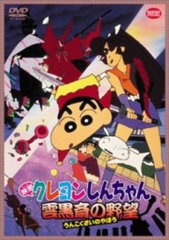

**Genres:** Japan, Earth, Asia, Comedy, Time Travel, Past, Alternative Present, Present, Ecchi, Slice of Life, School Life, Kids

> A member of the Time Patrol finds out that there is a disturbance in Japan, 1570. While heading to that particular time and location to investigate, she is attacked and ends up stuck underground the Nohara residence at the end of the 20th century Japan. Having limited resources at hand, she is forced to ask for the help of the Nohara family. Together they go back in time and meet with a samurai named Fubuki-maru who believes that they are the legendary three persons and dog whom someone from her family would eventually meet in a crucial moment. The lonely samurai asks for their assistance in defeating the man that possesses strange magical powers, the sinister Unkokusai lord.
>
> _Synopsis source: Kitsu_

[Kitsu](https://kitsu.io/anime/crayon-shin-chan-movie-03-unkokusai-no-yabou)

---

### The Diary of Anne Frank

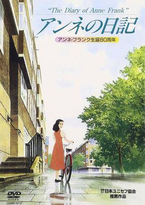

**Genres:** Earth, World War II, Slice of Life, Europe, War, Drama, Past, Historical

> Amsterdam, June 12, 1942. Anne celebrates her 13th birthday and begins her diary, which she calls "Kitty". Hiding for two years from the German threat, the young girl writes about her idealistic views on the world, her ambitions, her fears and her first love, Peter.
>
> _Synopsis source: Kitsu_

[Wikipedia](https://en.wikipedia.org/wiki/Anne_no_Nikki) · [Kitsu](https://kitsu.io/anime/anne-no-nikki)

---

### Doraemon: Nobita's Diary of the Creation of the World (Doraemon the Movie: Nobita's Diary of the Creation of the World)

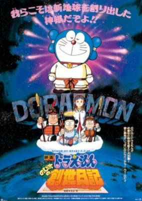

**Genres:** Comedy, Science Fiction, Fantasy, Adventure, Kids

> Nobita had to find a topic for his summer break research homework. As he was blaming everything to Adam and Eve for sinning and causing their descendants to suffer (from homework), Doraemon decided to provide him with a gadget to observe the creation of the world so that he may write it in a diary-like report. Suneo, Giant and Shizuka eventually joined them and together they watch over the birth of tribes and civilizations. Meanwhile, the time patrol is looking for an illegal time machine whose controllers accidentally heard Giant speaking of the genesis diary project. They captured Giant and Suneo; leaving Nobita, Shizuka and Doraemon to watch over the genesis set and to rescue them.
>
> _Synopsis source: Kitsu_

[Kitsu](https://kitsu.io/anime/doraemon-nobita-s-genesis-diary)

---

### Dragon Ball Z: Fusion Reborn (Dragon Ball Z Movie 12: Fusion Reborn)

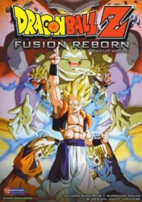

**Genres:** Super Power, Action, Science Fiction, Fantasy, Adventure, Comedy, Shounen

> Not paying attention to his job, a young demon allows the evil cleansing machine to overflow and explode, turning the young demon into the infamous monster Janemba. Goku and Vegeta make solo attempts to defeat the monster, but realize their only option is fusion.
>
> _Synopsis source: Kitsu_

[Kitsu](https://kitsu.io/anime/dragon-ball-z-movie-12-fukkatsu-no-fusion-goku-to-vegeta)

---

### Dragon Ball Z: Wrath of the Dragon (Dragon Ball Z Movie 13: Wrath of the Dragon)

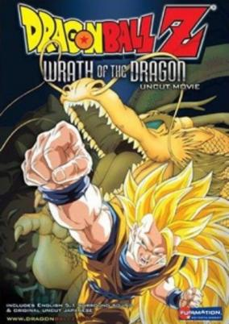

**Genres:** Fantasy, Science Fiction, Action, Super Power, Adventure, Comedy, Shounen

> The Z Warriors discover an unopenable music box and are told to open it with the dragon balls. The contents turn out to be a warrior named Tapion who had sealed himself inside along with a monster called Hildegarn. Goku must now perfect a new technique to defeat the evil monster.
>
> _Synopsis source: Kitsu_

[Kitsu](https://kitsu.io/anime/dragon-ball-z-movie-13-ryuuken-bakuhatsu-goku-ga-yaraneba-dare-ga-yaru)

---

### Dragon Knight: Another Knight on the Town

---

### Dragon Rider

---

### Elementalors

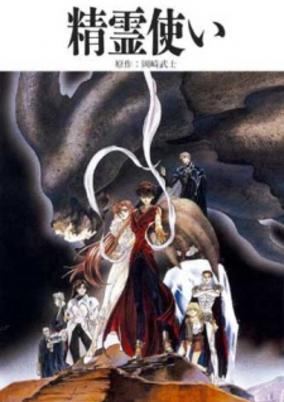

**Genres:** Fantasy, Japan, Earth, Contemporary Fantasy, Action, Asia, Magic, Violence, Present, Adventure, Romance

> Based on the manga by Okazaki Takeshi begun in 1990. After a family tragedy, Kagura is left with only his beloved friend Asami for consolation. Meanwhile, there is a war beginning in the spiritual world. Beings known as "Elementalors" call upon power from spirits to maintain harmony in the world by balancing individual forces of nature. Lord Shiki, a water Elementalor, kidnaps Asami in order to use special powers she posesses to retrieve his daughter, who has been imprisioned for nearly destroying the Earth. Kagura discovers that he is also an Elementalor—a very powerful one. He must join forces with other Elementalors to save Asami and prevent Lord Shiki from causing a great imbalance by releasing his daughter.
>
> _Synopsis source: Kitsu_

[Wikipedia](https://en.wikipedia.org/wiki/Elementalors) · [Kitsu](https://kitsu.io/anime/seirei-tsukai)

---

### Elf Princess Rane

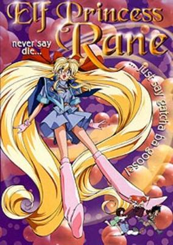

**Genres:** Ecchi, Fantasy, Comedy, Fantasy World, Action, Elf, Absurdist Humour, Adventure

> Gou has woved to find the legendary treasure of Salamander. Searching for it he meets Ren, a fairy, who is looking for the four treasures of Heart. Gou's childhood friend Mari is frustrated with Gou running after treasures, but befriends with another fairy Rin. Gou and Ren's treasure hunt messes with a secret project led by Mari's father. It turns out Salamander isn't what Gou thought it was in the first place...
>
> _Synopsis source: Kitsu_

[Wikipedia](https://en.wikipedia.org/wiki/Elf_Princess_Rane) · [Kitsu](https://kitsu.io/anime/elf-princess-rane)

---

### El-Hazard: The Magnificent World

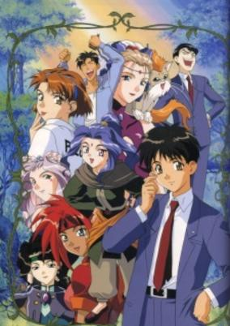

**Genres:** Fantasy, Romance, Fantasy World, Adventure, Action, Parallel Universe, Plot Continuity, Present, Super Power, Comedy

> When Makoto Mizuhara discovers an old monument in his school and awakens a beautiful woman, he, his teacher, his worst enemy and one of his female friends is transported to the magnificent world of El Hazard. There they discovers that they have received some special powers. Makoto and his teacher Fujisawa lands in a jungle and saves a princess from some large bugs. Makoto's friend Nanami lands in a desert. And Makoto's rival, Jinnai lands in the middle of the bug's kingdom and becomes their general, plotting to destroy Makoto and his new friends. After several having his attacks repelled by Makoto several times, Jinnai learns about an ultimate weapon, the demon Ifurita. And so everyone sets of to find Ifurita, and when she's found Makoto learns that she is the same woman that sent them to El Hazard. But the one gaining control of her is Jinnai.
>
> _Synopsis source: Kitsu_

[Kitsu](https://kitsu.io/anime/el-hazard-the-magnificent-world)

---

### Fushigi Yugi: The Mysterious Play (Mysterious Play)

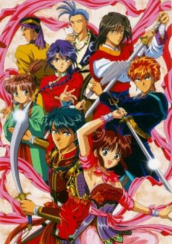

**Genres:** Fantasy, Romance, Adventure, Action, Tone Changes, Fantasy World, Alternative Past, Martial Arts, Bishounen, Love Polygon, Angst, Magic, Past, Reverse Harem, Plot Continuity, Super Power, Historical, Comedy, Shoujo

> While visiting the National Library, junior-high students Miaka Yuuki and Yui Hongo are transported into the world of a mysterious book set in ancient China, "The Universe of The Four Gods." Miaka suddenly finds herself with the responsibility of being the priestess of Suzaku, and must find all of her celestial warriors for the purpose of summoning Suzaku for three wishes; however, the enemy nation of the god Seiryuu has manipulated Yui into becoming the priestess of Seiryuu. As enemies, the former best friends begin their long struggle to summon their respective gods and obtain their wishes... [Written by MAL Rewrite]
>
> _Synopsis source: Kitsu_

[Kitsu](https://kitsu.io/anime/fushigi-yuugi)

---

### Galaxy Fräulein Yuna (Galaxy Fraulein Yuna)

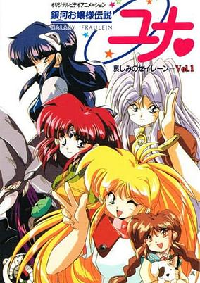

**Genres:** Science Fiction, Mecha, Action, Piloted Robot, Comedy, Henshin, Magic, Adventure

> Yuna Kagurazaka won the interstellar Galaxy Fraulein contest to become the Guardian of the Light. After defeating several threats to galactic peace (As seen in the PC Engine games), old enemies have framed Yuna for attacking and demolishing her hometown. Yuna's friends now must attempt to rescue her from her pending execution, with comedic results.
>
> _Synopsis source: Kitsu_

[Wikipedia](https://en.wikipedia.org/wiki/Galaxy_Fr%C3%A4ulein_Yuna) · [Kitsu](https://kitsu.io/anime/galaxy-fraulein-yuna)

---

### Ghost in the Shell

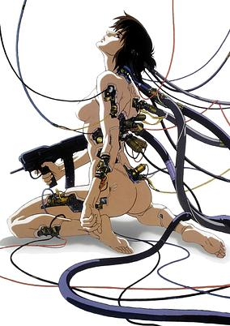

**Genres:** Earth, Science Fiction, Japan, Action, Asia, Special Squads, Detective, Human Enhancement, Cyborg, Cyberpunk, Future, Law And Order, Violence, Virtual Reality, Cops, Mecha, Psychological

> 2029: A female cybernetic government agent, Major Motoko Kusanagi, and the Internal Bureau of Investigations are hot on the trail of “The Puppet Master,” a mysterious and threatening computer virus capable of infiltrating human hosts. Together with her fellow agents from Section 9, Kusanagi embarks on a high-tech race against time to capture the omnipresent entity.
>
> _Synopsis source: Kitsu_

[Wikipedia](https://en.wikipedia.org/wiki/Ghost_in_the_Shell_(1995_film)) · [Kitsu](https://kitsu.io/anime/ghost-in-the-shell)

---

### Golden Boy

[Wikipedia](https://en.wikipedia.org/wiki/Golden_Boy_(manga))

---

### Gundam Wing (Mobile Suit Gundam Wing: Operation Meteor)

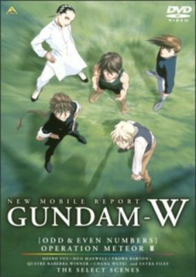

**Genres:** Space, Mecha, Action, Science Fiction, Adventure, Military, Psychological

> Two video releases recapping events from the Gundam Wing TV series. Each Operation Meteor video contains an 'Odd' episode and an 'Even' episode. The 'Odd' episodes feature Heero, Trowa and Wufei, while the 'Even' episodes feature Duo and Quatre. The episodes also featured brief new footages of the characters after the final episode of the TV series.
>
> _Synopsis source: Kitsu_

[Wikipedia](https://en.wikipedia.org/wiki/Gundam_Wing) · [Kitsu](https://kitsu.io/anime/mobile-suit-gundam-wing-operation-meteor)

---

### Gunsmith Cats

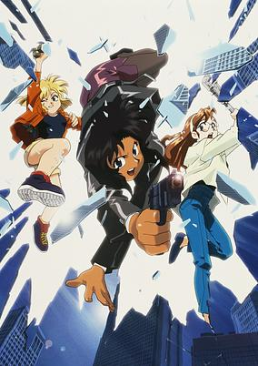

**Genres:** Earth, Action, Gunfights, United States, Detective, Bounty Hunter, Crime, Americas, Present, Motorsport, Comedy, Cops

> Rally Vincent knows her weapons well, while her partner Minne May Hopkins loves to play with explosives. The pair run a gun-shop illegally and one day Bill Collins of the ATF, blackmails Rally and Minnie May into working for the ATF. Little do they know, that they are getting involved in a mission larger than they could imagine.
>
> _Synopsis source: Kitsu_

[Wikipedia](https://en.wikipedia.org/wiki/Gunsmith_Cats) · [Kitsu](https://kitsu.io/anime/gunsmith-cats)

---

### Iczer Girl Iczelion (Iczelion)

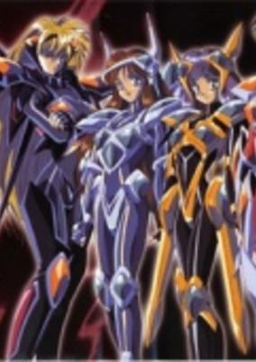

**Genres:** Science Fiction, Action, Adventure

> Iczelion, the final entry in the "Icz" series, is a departure from the previous storyline in most resepcts. Throughout the galaxy, two villians destory and pillage anything in their path. Their names are Cross and Chaos, and they are ready to invade their next target: Earth. The only defense against these warriors are the Iczelions, a fusion of young girls, and Iczels, sentient body armor. Nagisa is a typical high school girl who is about to become the next Iczelion against her will, to defend the planet and save the human race! But not if she has anything to say about it...
>
> _Synopsis source: Kitsu_

[Wikipedia](https://en.wikipedia.org/wiki/Iczer_Girl_Iczelion) · [Kitsu](https://kitsu.io/anime/iczelion)

---

### Idol Project

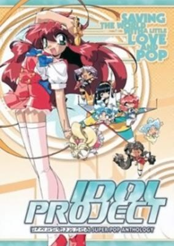

**Genres:** Idol, Future, Stereotypes, Music, Action, Science Fiction, Adventure, Comedy

> Mimu Emilton is a cute fourteen-year-old who has come to the annual Starland Festival to become an idol, just like her role model, Yuri. It is the most celebrated event on a united Earth, and Yuri, now the President of Earth, has encouraged people to join the ranks of Excellent Idols. Unfortunately for Mimu, she can never seem to make it to her audition on time, as misadventure after misadventure lands her in situations (usually involving undergarment exposure, I might add) that she escapes with the help of the current Excellent Idols, whom she befriends. Just as she makes her place on the stage and begins her audition, though, an unknown group of aliens kidnaps her and the Excellent Idols. It is only the beginning of a wild interdimensional goose-chase that places Mimu in the position to save the world, if only she can believe in herself.
>
> _Synopsis source: Kitsu_

[Wikipedia](https://en.wikipedia.org/wiki/Idol_Project) · [Kitsu](https://kitsu.io/anime/idol-project)

---

### Junkers Come Here

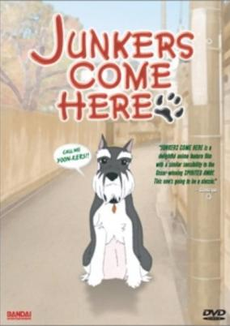

**Genres:** Fantasy, Slice of Life

> This heartwarming and unexpectedly mature story concerns a young girl named Hiromi Nozawa and her dog, Junkers (pronounced Yoon-kers). Hiromi walks us through her childhood troubles of love, schooling, and family bonds. Her companion Junkers accompanies her on this adventure; however, Junkers is no ordinary dog—he can talk and grant 3 wishes.
>
> _Synopsis source: Kitsu_

[Wikipedia](https://en.wikipedia.org/wiki/Junkers_Come_Here#Anime) · [Kitsu](https://kitsu.io/anime/junkers-come-here)

---

### Jurassic Tripper

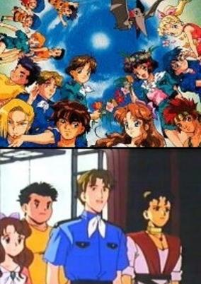

**Genres:** Fantasy, Science Fiction, Adventure, Isekai

> On a school yachting trip, fifteen children of various ages are mysteriously transported to another world where dinosaurs still roam. While attempting to return home, they encounter talking dinosaurs, revolutionaries, pirates, a princess and primitive scientists. These unlikely allies help them escape from soldiers, bandits, vicious dinosaurs, and fanatical priests. Aggression between the two oldest boys leads to a split in ranks, and a sneaky double cross plot. Unlikely romances bloom in this tense atmosphere, and the group learns that each has strengths that can help them get home, if they work together. Losely based on the book Deux ans De Vacances, by Jules Verne from 1888.
>
> _Synopsis source: Kitsu_

[Wikipedia](https://en.wikipedia.org/wiki/Jura_Tripper) · [Kitsu](https://kitsu.io/anime/kyouryuu-boukenki-jura-tripper)

---

### The Katta-kun Story

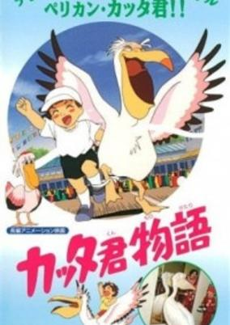

**Genres:** Earth, Anthropomorphism, Adventure, Kids

> An anime starring Katta-kun, a real-life pelican who inhabited the Tokiwa Park in Ube. In this movie, Katta-kun befriends Shu, a little boy whose parents went off to the Middle East because of their work. When war breaks out, Shu and Katta-kun travel to the Middle East to save Shu's parents and end the war. Due to it's hilariously ridiculousness this movie achived cult status in Japan.
>
> _Synopsis source: Kitsu_

[Kitsu](https://kitsu.io/anime/katta-kun-monogatari)

---

### Kazu & Yasu: Birth of a Hero

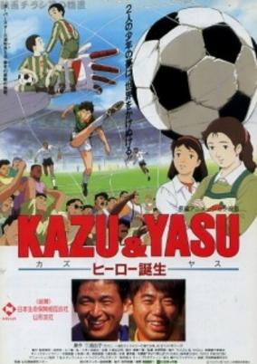

**Genres:** Sports, Soccer

> Based on the real life events. Biography animation depicting the football careers of Kazuyoshi Miura and his elder brother Yasutoshi.
>
> _Synopsis source: Kitsu_

[Kitsu](https://kitsu.io/anime/kazu-yasu-hero-tanjou)

---

### Legend of Crystania: The Motion Picture

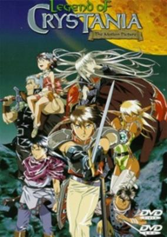

**Genres:** Fantasy, Elf, Magic, Action, Adventure

> Ashram, desperate to find a home for his people, is tricked into selling his soul. 300 years later, Pirotesse's devotion to her king remains unshaken. In the sacred world of Crystania, amidst a civil war waged by shape-changing warriors, she searches for her beloved Ashram. She meets Redon, a young prince obsessed with avenging his murdered parents. Together, they confront Ashram's captor -- the bloodthirsty Barbas, who aspires to rule Crystania as "The God's King".
>
> _Synopsis source: Kitsu_

[Kitsu](https://kitsu.io/anime/hajimari-no-boukenshatachi-legend-of-crystania)

---

### The Legend of the Blue Wolves

---

### Lesson of Darkness

---

### Lesson XX

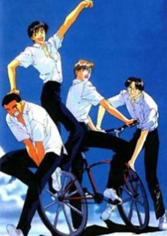

**Genres:** Shounen Ai, Romance

> The story of Lesson XX has a sweet feel to it. It revolves around two boys, Shizuka and Sakura who are friends at a coed boarding school. One day, Shizuka happens to notice Sakura’s sheer beauty when he dives in to take a hit from a baseball. After some mixed up thoughts of who Sakura likes, Shizuka tells him he wishes to kiss him as a joke. But Sakura doesn’t care; he still insists that the two kiss under the starry sky. After this incident, Shizuka thinks it’s best for the two to be away from each other, so as to sort out their thoughts and real feelings. A classic shounen ai/yaoi, incorporating love, misunderstanding, violence and somewhat angst with a sweet end to it.
>
> _Synopsis source: Kitsu_

[Kitsu](https://kitsu.io/anime/lesson-xx)

---

### Let's Go! Anpanman: Let's Defeat the Haunted Ship!!

[Wikipedia](https://en.wikipedia.org/wiki/Anpanman#Full-length_movies)

---

### Lupin III: Farewell to Nostradamus (Lupin the Third: Farewell to Nostradamus)

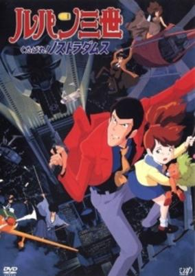

**Genres:** Action, Thievery, Comedy, Adventure, Crime

> After a diamond heist in Brazil, Lupin hides the gem in a doll and boards a plane headed out of the country. While on board, the doll is stolen by a little girl named Julia, whose nanny is none other than Fujiko Mine. Before Lupin can get the doll back, the plane is hijacked and the girl is kidnapped. The kidnappers are after the same thing that Fujiko is after - a book of Nostradamus prophecies hidden in Julia's father's tower. Lupin and the gang join forces to save the girl, get the diamond back, and discover the secrets surrounding the strange book.
>
> _Synopsis source: Kitsu_

[Wikipedia](https://en.wikipedia.org/wiki/Farewell_to_Nostradamus) · [Kitsu](https://kitsu.io/anime/lupin-iii-kutabare-nostradamus)

---

### Lupin III: The Pursuit of Harimao's Treasure (Lupin the Third: The Pursuit of Harimao's Treasure)

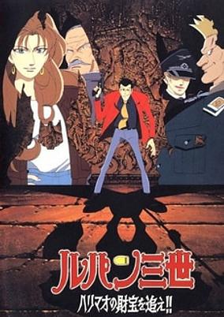

**Genres:** Action, Adventure, Comedy, Crime, Thievery

> The infamous bandit Harimao hid a treasure, and to retrieve it, Lupin and the gang must gather three lost statues. When the Nazi-like group Neo-Himmel make a run for the goods, Lupin reluctantly partners with the aging "double-O" MI-6 agent Sir Archer and his granddaughter Diana to gather he statues first. Can this unorthodox team bond well enough to see this mission through? Find out in the Pursuit of Harimao's Treasure!
>
> _Synopsis source: Kitsu_

[Wikipedia](https://en.wikipedia.org/wiki/List_of_Lupin_III_television_specials#7) · [Kitsu](https://kitsu.io/anime/lupin-iii-the-pursuit-of-harimao-s-treasure)

---

### Macross Plus: Movie Edition

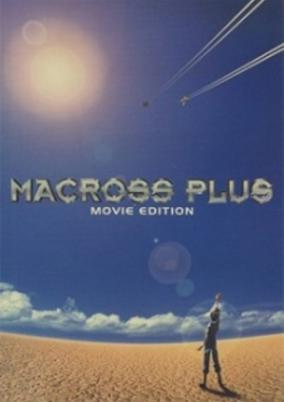

**Genres:** Romance, Science Fiction, Mecha, Action, Piloted Robot, Air Force, Love Polygon, Other Planet, Future, Plot Continuity, Space, Military, Adventure

> A.D. 2040—Thirty years have passed since the battle between the Earth and Zentraedi forces changed the lives of both races. On planet Eden, a top-secret project known as "Supernova" is being held to determine U.N. Spacy's next-generation variable fighter. Competing to win the funding are Shinsei Industries' YF-19 and General Galaxy's YF-21. Piloting the YF-21 is Guld Goa Bowman, a half-human, half-Zentraedi. Shinsei receives its new test pilot in the form of the unruly fighter pilot Isamu Dyson, who was once a friend of Guld. Meanwhile, as Isamu and Guld furiously battle to see which of their fighters is superior, a Virturoid Idol named Sharon Apple is to perform her debut concert on Eden. In charge of Sharon is producer Myung Fang Lone, another former friend of Isamu and Guld. When the three meet each other, old disputes spark from a troubled past. Little do they know that their past incidents—along with the Supernova Project and Sharon Apple—will somehow bring them together.
>
> _Synopsis source: Kitsu_

[Kitsu](https://kitsu.io/anime/macross-plus-movie-edition)

---

### Magical Girl Pretty Sammy

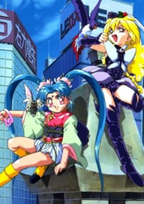

**Genres:** Magic, Magical Girl, Present, Parody, Japan, Action, Fantasy, Comedy

> Sasami's always been kind of neat... but now she's been imbibed with a healthy dose of magic (which she plans to use to right the things wrong with the Earth, and, of course, help keep her brother Tenchi out of trouble). Naturally, there's going to be trouble: this time, it's the mysterious Pixy Misa... and Ryoko going at it against Ayeka (as usual) isn't making things any easier for her!
>
> _Synopsis source: Kitsu_

[Wikipedia](https://en.wikipedia.org/wiki/Magical_Girl_Pretty_Sammy) · [Kitsu](https://kitsu.io/anime/mahou-shoujo-pretty-sammy)

---

### Memories

[Wikipedia](https://en.wikipedia.org/wiki/Memories_(1995_film))

---

### Neon Genesis Evangelion

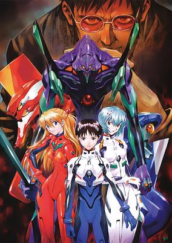

**Genres:** Science Fiction, Mecha, Post Apocalypse, Japan, Earth, Genetic Modification, Action, Asia, Piloted Robot, Middle School, Human Enhancement, Angst, Alien, School Life, Disaster, Plot Continuity, Violence, Psychological, Dementia

> In the year 2015, the world stands on the brink of destruction. Humanity's last hope lies in the hands of Nerv, a special agency under the United Nations, and their Evangelions, giant machines capable of defeating the Angels who herald Earth's ruin. Gendou Ikari, head of the organization, seeks compatible pilots who can synchronize with the Evangelions and realize their true potential. Aiding in this defensive endeavor are talented personnel Misato Katsuragi, Head of Tactical Operations, and Ritsuko Akagi, Chief Scientist. Face to face with his father for the first time in years, 14-year-old Shinji Ikari's average life is irreversibly changed when he is whisked away into the depths of Nerv, and into a harrowing new destiny—he must become the pilot of Evangelion Unit-01 with the fate of mankind on his shoulders. Written by Hideaki Anno, Neon Genesis Evangelion is a heroic tale of a young boy who will become a legend. But as this psychological drama unfolds, ancient secrets beneath the big picture begin to bubble to the surface...
>
> _Synopsis source: Kitsu_

[Wikipedia](https://en.wikipedia.org/wiki/Neon_Genesis_Evangelion) · [Kitsu](https://kitsu.io/anime/neon-genesis-evangelion)

---

### The Ping Pong Club (The Ping-Pong Club)

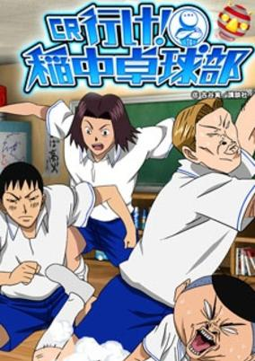

**Genres:** Japan, Earth, Asia, Sports, Ecchi, Comedy, Middle School, School Clubs, Slapstick, School Life, Present

> Inaho Jr. High's Boys Ping Pong Club has only 6 members, the club minimum. Takeda is your average nice guy. Kinoshita is good looking and popular with girls. Unfortunately, the rest are branded as losers. Tanabe is too foreign, while Tanaka is petite and perverse. Maena and Izawa are truly deviant, and their crazed antics have earned the team some powerful enemies. In spite of their differences, the team needs to work together to retain their practice room and club status.
>
> _Synopsis source: Kitsu_

[Wikipedia](https://en.wikipedia.org/wiki/The_Ping_Pong_Club#Anime) · [Kitsu](https://kitsu.io/anime/ike-ina-chuu-takkyuubu)

---

### Romeo no Aoi Sora (Romeo and the Black Brothers)

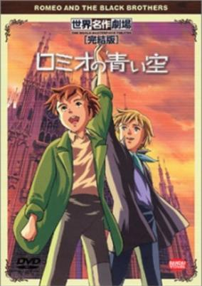

**Genres:** Italy, Adventure, Earth, Europe, Coming Of Age, Past, Friendship, Historical, Slice of Life

> To get the money to pay for a doctor for his father, Romeo bravely sells himself as a chimney sweep. On the way to Milan he meets Alfredo, a mysterious boy on the run heading to the same fate. Upon being separated and sold to their new bosses, the two boys swear eternal friendship. Romeo has to learn the hardships of a chimney sweep's job. His boss' daughter, Angeletta, is a girl with a heart illness who is not allowed to leave her room. She asks Romeo to bring the blue sky to her. Alfredo unites the sweeps in a secret union, the "Black Brothers" to face together the "Wolf Pack" gang, who constantly attack them. With their help, Romeo succeeds in bringing Angeletta's dream to her. Soon the brotherhood faces more hardships than cruel bosses or street hooligans. Alfredo reveals his secret: he has sold himself in the name of his sister Bianca. It is now up to the "Black Brothers" to stand up for the truth, to save Bianca and to protect their leader's life with their own.
>
> _Synopsis source: Kitsu_

[Wikipedia](https://en.wikipedia.org/wiki/Romeo_no_Aoi_Sora) · [Kitsu](https://kitsu.io/anime/romeo-no-aoi-sora)

---

### Ruin Explorers (Ruin Explorers Fam & Ihrie)

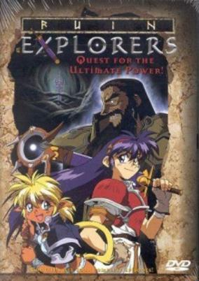

**Genres:** Fantasy, Fantasy World, Adventure, Action, Tone Changes, Super Deformed, Magic, Comedy

> Fam and Ihrie are willing to do almost anything to make a buck. So when these debt-driven damsels discover the potential profits to be hand in recovering a particularly dangerous mystical object, it means mortal peril for an entire civilization. There's no guarantee that they'll live long enough to squander the fabulous wealth they've been promised, and danger lurks around every turn as they cross dark seas in pursuit of legendary evil. Haunted by an unspeakable curse, plagued by doomsday prophecies, plotted against by untrustworthy traveling companions and looked in desperate race to gain the Ultimate Power, Fam and Ihrie are the Ruin Explorers!
>
> _Synopsis source: Kitsu_

[Wikipedia](https://en.wikipedia.org/wiki/Ruin_Explorers) · [Kitsu](https://kitsu.io/anime/hikyou-tanken-fam-ihrlie)

---

### Run

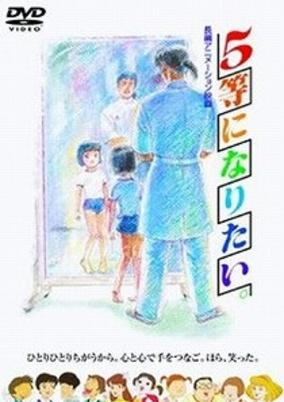

**Genres:** Elementary School, Present, Earth, Japan, Plot Continuity, Asia, Slice of Life, School Life

> Story of a girl born with a bad leg. Ritsuko longs to go to school and make lots of friends but it is not so easy. Her mother is very protective of her and at school she is teased by her classmates for her strange way of walking. Will she manage to keep her smile?
>
> _Synopsis source: Kitsu_

[Kitsu](https://kitsu.io/anime/five-tou-ni-naritai)

---

### Saber Marionette R

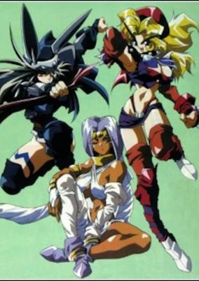

**Genres:** Android, Martial Arts, Future, Space, Mecha, Other Planet, Violence, Plot Continuity, Action, Science Fiction

> Jr., the heir of Romana and his battle sabers Cherry and Lime, who have girl circuits are enjoying their peaceful life in Romana. Suddenly, the evil Star-Face and his sexadolls attack Romana in order to take over so Star-Face can become the next High Official. In order to truly become the next High Official and ruler of Romana, he must first eliminate Jr. This begins a battle for, not only Jr.'s life, but for all of Romana.
>
> _Synopsis source: Kitsu_

[Wikipedia](https://en.wikipedia.org/wiki/Saber_Marionette#Saber_Marionette_R) · [Kitsu](https://kitsu.io/anime/saber-marionette-r)

---

### Sailor Moon SuperS

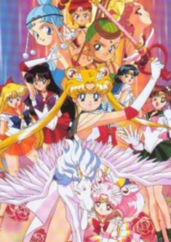

**Genres:** Romance, Magic, Magical Girl, Demon, Shoujo, Henshin

> SuperS centers heavily on Chibi-usa and the Sailor Team. A new enemy, the Dead Moon Circus, has now appeared. Their motive is to find the Golden Dream Mirror that would be used to rule the world. To do this, the enemy attacks innocent victims for their Dream Mirrors and test their energy. Chibi-usa also has a new ally on her side, Pegasus. This season also sees the Sailor Senshi obtaining new powers.
>
> _Synopsis source: Kitsu_

[Wikipedia](https://en.wikipedia.org/wiki/Sailor_Moon_SuperS) · [Kitsu](https://kitsu.io/anime/bishoujo-senshi-sailor-moon-supers)

---

### Sailor Moon SuperS: The Movie (Sailor Moon SuperS the Movie: Black Dream Hole)

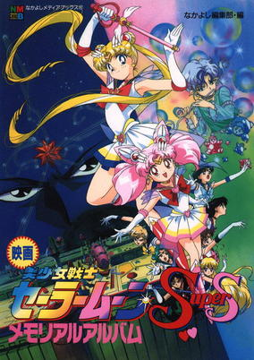

**Genres:** Romance, Magic, Magical Girl, Demon, Henshin, Shoujo

> Everywhere around the world, the children sleep. Unaware of danger lurking in the shadows. But tonight, a strange darkness floats in the wind. And the children, one by one, begin to disappear. It seems to be a supernatural force that feeds on their dreams. The evil queen, Badiyanu, and her loyal fairies assist in using the "Black Dream Hole" to swallow the earth. It is up to Sailor Moon and the Sailor Soldiers to prevent the approaching Darkness.
>
> _Synopsis source: Kitsu_

[Kitsu](https://kitsu.io/anime/bishoujo-senshi-sailor-moon-supers-sailor-9-senshi-shuuketsu-black-dream-hole-no-kiseki)

---

### Saint Tail (Mysterious Thief Saint Tail)

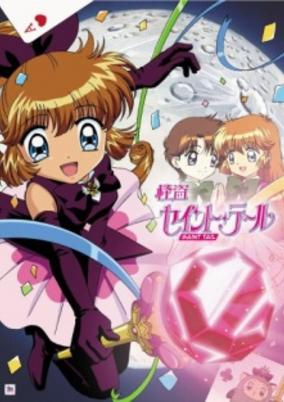

**Genres:** Romance, Earth, Japan, Thievery, Asia, Comedy, School Life, Present, Magic, Adventure

> Meimi Haneoka, 14, is a normal girl during the daytime, but during the night, she assumes the "position" of Saint Tail, a modern-day Robin Hood who steals from thieves and gives items back to their original owners. She is aided by her friend, Seira Mimori, a nun-in-training, and she is chased by her classmate (and soon-to-be love interest), Daiki Asuka (often called "Asuka Jr.").
>
> _Synopsis source: Kitsu_

[Wikipedia](https://en.wikipedia.org/wiki/Saint_Tail) · [Kitsu](https://kitsu.io/anime/kaitou-saint-tail)

---

### The Silent Service (Silent Service)

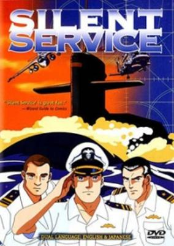

**Genres:** Action, Military

> During the cold war, the Japan Maritime Self-Defense Force jointly developed a nuclear submarine with the United States Navy. On its maiden voyage, the captain of the submarine declares the submarine to be an independent state, "Yamato."
>
> _Synopsis source: Kitsu_

[Wikipedia](https://en.wikipedia.org/wiki/The_Silent_Service) · [Kitsu](https://kitsu.io/anime/silent-service)

---

### Slam Dunk: Shohoku's Greatest Challenge! Burning Hanamichi Sakuragi

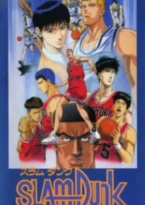

**Genres:** Basketball, Action, Comedy, Slice of Life, School Life, Sports, Shounen

> After losing the titanic match against Kainan High, Team Shohoku and a newly shaven Hanamichi Sakuragi are challenged to an exhibition match by virtual basketball unknowns Ryoukufu High. Coach Anzai sees this as an opportunity for Shohoku to regain their confidence, but Ryoukufu are revealed to have a newly assembled championship calibre lineup and may give Sakuragi &amp; Co their toughest test yet.
>
> _Synopsis source: Kitsu_

[Wikipedia](https://en.wikipedia.org/wiki/Slam_Dunk_(manga)#Anime_films) · [Kitsu](https://kitsu.io/anime/slam-dunk-movie-3)

---

### Slam Dunk: Howling Basketman Spirit!! Hanamichi and Rukawa's Hot Summer

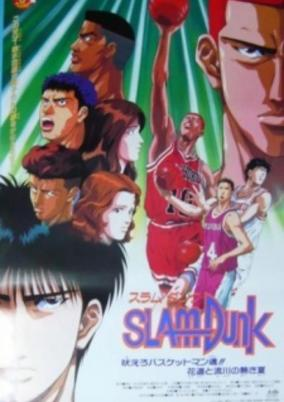

**Genres:** Basketball, Action, Comedy, Slice of Life, School Life, Sports, Shounen

> Ichiro Mizusawa, a player from Rukawa's old junior high school, Tomigoaka, is diagnosed with a crippling leg condition and wants to play one last game with Rukawa. Hanamichi sets out to help the boy and fulfill his wish.
>
> _Synopsis source: Kitsu_

[Wikipedia](https://en.wikipedia.org/wiki/Slam_Dunk_(manga)#Anime_films) · [Kitsu](https://kitsu.io/anime/slam-dunk-movie-4)

---

### Slayers

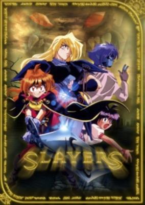

**Genres:** Fantasy, Fantasy World, Action, Comedy, Magic, Plot Continuity, Demon, Adventure

> Powerful, avaricious sorceress Lina Inverse travels around the world, stealing treasures from bandits who cross her path. Her latest victims, a band of thieves, wait in ambush in a forest, thirsting for revenge. When Lina is about to effortlessly pummel her would-be attackers, the swordsman Gourry Gabriev suddenly announces his presence. Assuming Lina to be a damsel in distress, the foolish yet magnanimous man confronts the brigands in order to rescue her. After defeating them posthaste, the oblivious cavalier decides to escort Lina to Atlas City. Though not very keen on this idea, she ends up accepting his offer. However, without realizing it, Lina has chanced upon a mighty magical item among her most recent spoils. Now two mysterious men are hunting the young magician and her self-proclaimed guardian to obtain this powerful object for apparently nefarious purposes. This way they begin their adventure, one where the fate of the world itself may be at stake. [Written by MAL Rewrite]
>
> _Synopsis source: Kitsu_

[Wikipedia](https://en.wikipedia.org/wiki/Slayers) · [Kitsu](https://kitsu.io/anime/slayers)

---

### Slayers The Motion Picture (Slayers: The Motion Picture)

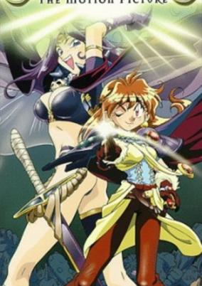

**Genres:** Fantasy, Fantasy World, Action, Comedy, Magic, Super Power, Adventure

> In this prequel movie to the Slayers televison series, Lina Inverse travels to Mipross Island with her rival/traveling companion Naga the Serpent. While they originally came for the hot springs, they soon find them selves mixed up in a conspiracy involving a mazoku named Joyrock. Years ago, he killed all of the elves that inhabited the island and absorbed their power. They are soon joined by an old mage named Rowdy Gabriev, who was in love with one of the elves slaughtered and also wants to defeat Joyrock.
>
> _Synopsis source: Kitsu_

[Wikipedia](https://en.wikipedia.org/wiki/Slayers_The_Motion_Picture) · [Kitsu](https://kitsu.io/anime/slayers-the-motion-picture)

---

### Soar High! Isami

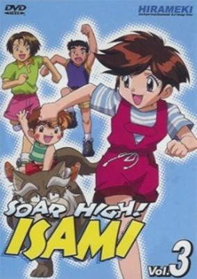

**Genres:** Ninja, Comedy, Alien, Action, Adventure, Romance

> Isami Hanaoka is just a fifth grader who happens to be a descendant of the Shinsengumi. Together with fellow descendants and classmates Soushi Yukimi and Toshi Tsukikage, she discovers in the basement of her home, strange artifacts left behind by their ancestors as well as a message urging them to "Fight the evil Kurotengu organization."
>
> _Synopsis source: Kitsu_

[Wikipedia](https://en.wikipedia.org/wiki/Soar_High!_Isami) · [Kitsu](https://kitsu.io/anime/tobe-isami)

---

### Sorcerer Hunters

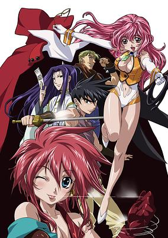

**Genres:** Action, Fantasy World, Adventure, Fantasy, Comedy, Contemporary Fantasy, Magic, Ecchi

> Is someone kidnapping your local virgins? Are mysterious entities sucking the souls out of the peasants? Do you have a sorceress infestation that just won't go away? Big Momma has the perfect cure, a rough and ready team of Sorcerer Hunters ready to take on any rogue magic user that crosses their path. If the charms of the voluptuous Chocolate and Tira Misu can't persuade the naughty wizard to change his ways, then manly Gateau Mocha, suave Marron Glace or over sexed Carrot Glace will stop him cold. Don't miss the titillating tales of Sorcerer Hunters!
>
> _Synopsis source: Kitsu_

[Wikipedia](https://en.wikipedia.org/wiki/Sorcerer_Hunters) · [Kitsu](https://kitsu.io/anime/bakuretsu-hunters)

---

### Stainless Night

---

### Tenchi Universe

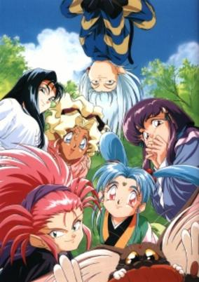

**Genres:** Fantasy, Science Fiction, Comedy, Love Polygon, Other Planet, Space, Romance, Harem

> Tenchi Masaki may be a 17-year-old young man in rural Japan, but little does he know how bad his day will be getting. When a space pirate chased by a pair of Galaxy Police officers crash-lands at his grandfather's temple, Tenchi is sucked into a new adventure that will literally blast him off into outer space and beyond.
>
> _Synopsis source: Kitsu_

[Wikipedia](https://en.wikipedia.org/wiki/Tenchi_Universe) · [Kitsu](https://kitsu.io/anime/tenchi-universe)

---

### Tokyo Revelation

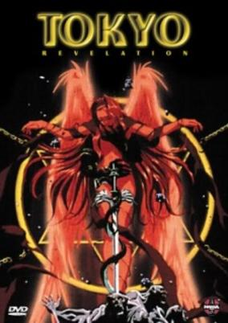

**Genres:** Horror, Action, Demon, Science Fiction

> Handsome and effeminate, quiet but proud, the sinister Akito Kobayashi has a passion for the occult and has developed a computer program to summon demons and the living dead. But little does he know that fellow high school students Kojirou Souma and Saki Yagami are reincarnations of powerful and benevolent spirits. When the pair's friends have become targeted by demons trying to harvest their life energies, they must harness their dark metaphysical powers to destroy Kobayashi's threatening program, or risk losing their loved ones forever. [Written by MAL Rewrite]
>
> _Synopsis source: Kitsu_

[Wikipedia](https://en.wikipedia.org/wiki/Tokyo_Revelation) · [Kitsu](https://kitsu.io/anime/tokyo-revelation)

---

### Twelve Warrior Explosive Eto Rangers

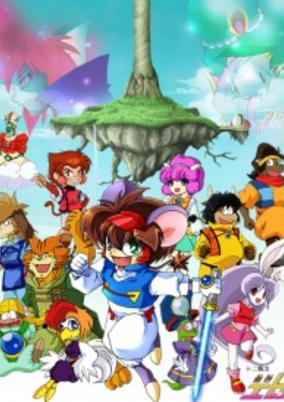

**Genres:** Fantasy World, Action, Comedy, Fantasy

> 12 animals that are symbols of every 12 Luna years fight against dark power that wants to destroy fairy tales and also destroy the world.
>
> _Synopsis source: Kitsu_

[Wikipedia](https://en.wikipedia.org/wiki/Juuni_Senshi_Bakuretsu_Eto_Ranger) · [Kitsu](https://kitsu.io/anime/twelve-senshi-bakuretsu-eto-ranger)

---

### Whisper of the Heart

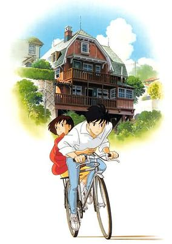

**Genres:** Romance, Japan, Asia, Earth, Comedy, Coming Of Age, Present, Fantasy, Adventure, Slice of Life

> Shizuku Tsukishima is a free-spirited and cheerful 14-year-old girl who is currently enjoying her summer vacation. She loves spending her free time at the local library where she notices that the books she reads are often checked out by a boy named Seiji Amasawa. One day while riding the local train, Shizuku notices a strange cat sitting near her. Why would an ordinary cat ride a train? Curiosity may have killed the cat, but it can also seriously harm a young girl. Shizuku decides to follow the mysterious cat to see where it goes, and soon stumbles upon an antique shop run by a violin maker named Nishi, the grandfather of the mystery boy who shares her taste in literature. Seiji and Shizuku soon become friends and while Seiji is sure of his dreams and how to follow them, Shizuku is still unsure of her own talents. However, when she sees a strange cat statuette, “The Baron”, in the shop, it seems as if that statuette whispers something to her, tugging at her heart and giving her the inspiration she so desperately needed. One voice pushes Shizuku further than she could have ever imagined, changing her life forever.
>
> _Synopsis source: Kitsu_

[Wikipedia](https://en.wikipedia.org/wiki/Whisper_of_the_Heart) · [Kitsu](https://kitsu.io/anime/whisper-of-the-heart)

---

### Wild Knights Gulkeeva

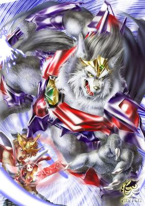

**Genres:** Fantasy, Japan, Action, Earth, Piloted Robot, Swordplay, Juujin, Alternative Present, Plot Continuity, Violence, Super Power, Mecha

> The world we live in is called Earthside in this story. There are the other worlds called Nosfertia, Heavenstia, and Eternalia. When Darknoids from Nosfertia begun invasion to Earthside, Heavenstia sent 3 Animanoids (beast-humans) to prevent it. The lead character Touya had believed that he was a mere human but found he was actually a being of Eternalia. With the help of 3 Animanoids, Touya fights to defend Earthside.
>
> _Synopsis source: Kitsu_

[Wikipedia](https://en.wikipedia.org/wiki/Wild_Knights_Gulkeeva) · [Kitsu](https://kitsu.io/anime/juusenshi-gulkeeva)

---

### World Fairy Tale Series

[Wikipedia](https://en.wikipedia.org/wiki/World_Fairy_Tale_Series)

---

### Zenki

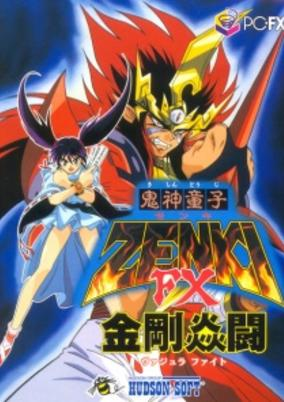

**Genres:** Fantasy, Ecchi, Action, Comedy, Magic, Horror, Violence, Present, Demon

> In ancient times, a great battle was waged between a master mage, Enno Ozuno, and an evil demon goddess, Karuma. Unfortunately, Enno didn't have the strength to defeat her alone and was forced to call upon Zenki, a powerful protector demon. After Karuma was defeated, Enno sealed Zenki away in a pillar located inside his temple. 1,200 years after this epic battle, Enno's descendant, Chiaki, spends her days showing tourists around her hometown of Shikigami-cho and doing exorcisms to pay the bills. One day, two thieves enter the town in hopes of opening a seal in the Ozuno temple and releasing the hidden treasure from within. However, what actually pops out is a dark entity that attaches itself to the henchmen, transforming them into demonic beings. After this transformation, they begin a rampage through the temple, terrorizing poor Chiaki. It is now up to this young progeny to unleash her family's powers to summon Zenki and save Shikigami-cho from these demons, as well as the evil entities sure to follow in their footsteps.
>
> _Synopsis source: Kitsu_

[Wikipedia](https://en.wikipedia.org/wiki/Zenki) · [Kitsu](https://kitsu.io/anime/kishin-douji-zenki)

---

### Zukkoke Trio: Guruguru-sama of Kusunoki Mansion

> There is currently no synopsis for this title.
>
> _Synopsis source: Kitsu_

[Kitsu](https://kitsu.io/anime/zukkoke-sanningumi-kusunoki-yashiki-no-guruguru-sama)

---
