# 1996 in Anime

[← Back to index](../README.md)

56 titles · 38 with a matched synopsis/cover art · [source](https://en.wikipedia.org/wiki/1996_in_anime)

## Releases

### Advancer Tina

**Studio:** Dandelion Animation Studio

---

### Adventures of Kotetsu (The Adventures of Kotetsu)

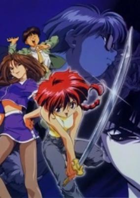

**Studio:** Daia &nbsp;|&nbsp; **Genres:** Ecchi, Fantasy, Japan, Earth, Action, Asia, Comedy, Swordplay, Magic, Slapstick, Present, Science Fiction, Romance

> While walking through the streets of Tokyo, Linn Suzuki comes across a strange device sticking up from the sidewalk. Suddenly, she is set upon by thugs and is helped by a beautiful stranger who takes them all down. It seems young Linn has fled Deep Kyoto from her cruel mistress and has traveled to Edo where she hopes to find her long lost brother, who was last seen working for the Kuon Detective Agency. By chance, this stranger happens to be Miho Kuon and lets Linn stay with her (nicknaming her Kotetsu, or Little Tetsu after her brother, Tetsujin). However, a mysterious agency called the Syndicate are after Miho and Linn is now in the thick of things.
>
> _Synopsis source: Kitsu_

[Wikipedia](https://en.wikipedia.org/wiki/Adventures_of_Kotetsu) · [Kitsu](https://kitsu.io/anime/kotetsu-no-daibouken)

---

### Akiko

**Studio:** Triple X

---

### Apocalypse Zero

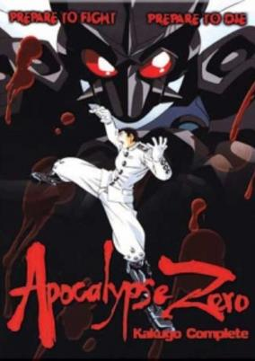

**Studio:** Ashi Productions &nbsp;|&nbsp; **Genres:** Power Suit, Science Fiction, Mecha, Earth, Asia, Japan, Post Apocalypse, Action, Comedy, Horror, Future, Violence, Demon, Super Power, Ecchi

> A series of natural disasters has reduced the world to rubble, with the survivors doing whatever they must to survive in a world gone mad. But one young boy, Kakugo, gifted with amazing martial arts and a superpowerful suit of armor by his late father, has been charged with making the world (or at least his school) a safer place. But his sister has a matching set of skills and equipment, and she`s on a mission to bring peace to the world... by wiping out humanity!
>
> _Synopsis source: Kitsu_

[Wikipedia](https://en.wikipedia.org/wiki/Apocalypse_Zero) · [Kitsu](https://kitsu.io/anime/kakugo-no-susume)

---

### Bakusō Kyōdai Let's & Go!!

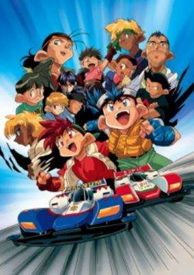

**Studio:** Xebec &nbsp;|&nbsp; **Genres:** Motorsport, Adventure, Sports

> Based on the manga by Tetsuhiro Koshita, Bakusou Kyoudai Let's &amp; Go!! has two main seasons evolving around the Go brothers and the TRF Victorys. The third season, Bakusou Kyoudai Let's &amp; Go!! MAX evolves more around two new main characters, but the primary idea is the same... Racing!Let's &amp; Go!! focuses on Retsu and Go Seiba, two young brothers who receive racing cars called "Mini 4WD" by Dr. Tsuchia. From there on, the series portraits those two boys, training and customizing parts to later on participate on Japans Cup, where all of Japan's racers enter to be the best of the best!
>
> _Synopsis source: Kitsu_

[Wikipedia](https://en.wikipedia.org/wiki/Bakus%C5%8D_Ky%C5%8Ddai_Let%27s_%26_Go!!) · [Kitsu](https://kitsu.io/anime/bakusou-kyoudai-let-s-go)

---

### Birdy the Mighty

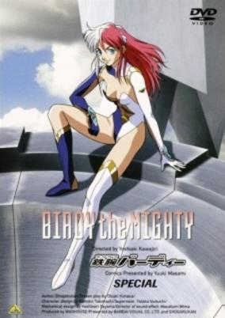

**Studio:** Madhouse &nbsp;|&nbsp; **Genres:** Science Fiction, Japan, Earth, Action, Alien, Violence, Present, Comedy

> Tsutomu, an average middle school kid busy studying for the final exams to enter high school runs into a man running from someone and gets caught up in the chase. In all the confusion he gets accidentally killed. Luckily Birdy (an interplanetary agent) knows a way to save him, unfortunately that means joining bodies to become one. So now he is stuck with this officer and along for the ride capturing criminals and saving lives.
>
> _Synopsis source: Kitsu_

[Wikipedia](https://en.wikipedia.org/wiki/Birdy_the_Mighty) · [Kitsu](https://kitsu.io/anime/tetsuwan-birdy)

---

### Black Jack: The Movie

**Studio:** Tezuka Productions

[Wikipedia](https://en.wikipedia.org/wiki/Black_Jack_(manga)#OVA)

---

### Boys Over Flowers

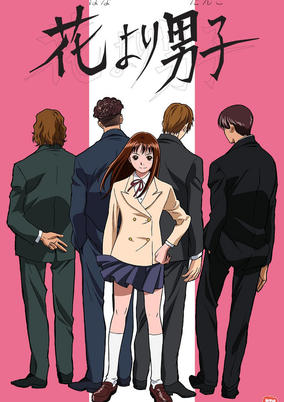

**Studio:** Toei Animation &nbsp;|&nbsp; **Genres:** Romance, Japan, Asia, Earth, Comedy, Tokyo, Love Polygon, High School, Reverse Harem, School Life, Plot Continuity, Present

> Makino Tsukushi, a girl who comes from a poor family, just wants to get through her two last years at Eitoku Gakuen quietly. But once she makes herself known by standing up for her friend to the F4, the four most popular, powerful, and rich boys at the school, she gets the red card: F4's way of a "Declaration of War." But when she doesn't let herself be beaten by them and is starting to fall for one of the F4, Hanazawa Rui, she starts to see that there is more than meets the eye...
>
> _Synopsis source: Kitsu_

[Wikipedia](https://en.wikipedia.org/wiki/Boys_Over_Flowers) · [Kitsu](https://kitsu.io/anime/hana-yori-dango)

---

### Cinderella Monogatari (The Story of Cinderella)

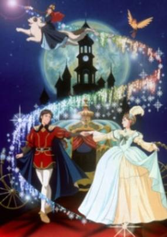

**Studio:** Tatsunoko Production &nbsp;|&nbsp; **Genres:** Romance, Fantasy, Earth, Magic, Adventure, Kids

> Cinderella is the daughter of a wealthy duke who has remarried to provide her with a mother and sisters. When the Duke travels abroad, Cinderella discovers that her new family is anything but a family. With spoiled stepsisters and a harsh stepmother, Cindrella is forced to cook, clean and manage the household. Yet she remains cheerful, gentle and kind to her family, to her animal friends and to a mysterious boy, named Charles, who seems to have a connection with the prince of Emerald Castle. A whole new story on a classic fairytale. When Cinderella's cruel stepmother prevents her from attending the Royal Ball, she gets some unexpected help from the lovable mice Gus and Jaq, and from her Fairy Godmother.
>
> _Synopsis source: Kitsu_

[Wikipedia](https://en.wikipedia.org/wiki/Cinderella_Monogatari) · [Kitsu](https://kitsu.io/anime/the-story-of-cinderella)

---

### City Hunter: The Secret Service

**Studio:** Sunrise

[Wikipedia](https://en.wikipedia.org/wiki/City_Hunter#Anime)

---

### Crayon Shin-chan: Adventure in Henderland

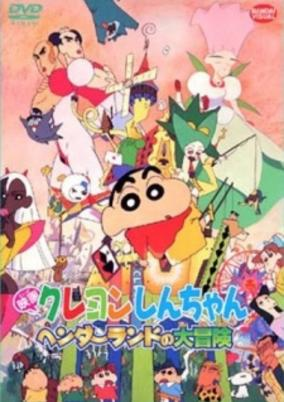

**Studio:** Shin-Ei Animation &nbsp;|&nbsp; **Genres:** Comedy, Ecchi, Slice of Life, School Life, Kids

> A modern horror style fantasy depicting a laughable adventure in Gunma Hender Land, the largest theme park in the north areas around Tokyo. Nohara family fight with Toppema Muppet (a talking doll from Magic World) against two gay 'witch' men Makao and Joma, who came from Another World and try to invade the Real World.
>
> _Synopsis source: Kitsu_

[Kitsu](https://kitsu.io/anime/crayon-shin-chan-movie-04-henderland-no-daibouken)

---

### Detective Conan

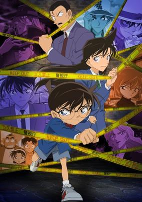

**Studio:** Tokyo Movie Shinsha &nbsp;|&nbsp; **Genres:** Earth, Romance, Japan, Asia, Comedy, Thriller, Detective, Tokyo, Present, Adventure, Cops, Mystery

> Shinichi Kudou, a great mystery expert at only seventeen, is already well known for having solved several challenging cases. One day, when Shinichi sees two suspicious men and decides to follow them, he inadvertently becomes witness to a disturbing illegal activity. When the men catch Shinichi, they dose him with an experimental drug formulated by their criminal organization and abandon him to die. However, to his own astonishment, Shinichi is still alive and soon wakes up, but now, he has the body of a seven-year-old, perfectly preserving his original intelligence. He hides his real identity from everyone, including his childhood friend Ran Mouri and her father, private detective Kogorou Mouri, and takes on the alias of Conan Edogawa (inspired by the mystery writers Arthur Conan Doyle and Ranpo Edogawa). Animated by TMS and adapted from the manga by Gosho Aoyama, Detective Conan follows Shinichi who, as Conan, starts secretly solving the senior Mouri's cases from behind the scenes with his still exceptional sleuthing skills, while covertly investigating the organization responsible for his current state, hoping to reverse the drug's effects someday.
>
> _Synopsis source: Kitsu_

[Wikipedia](https://en.wikipedia.org/wiki/Detective_Conan) · [Kitsu](https://kitsu.io/anime/detective-conan)

---

### Dimensional Adventure Numa Monjar

**Studio:** Production I.G

[Wikipedia](https://en.wikipedia.org/wiki/Chrono_(series)#Dimensional_Adventure_Numa_Monjar)

---

### Doraemon: Nobita and the Galaxy Super-express (Doraemon the Movie: Nobita and the Galaxy Super-express)

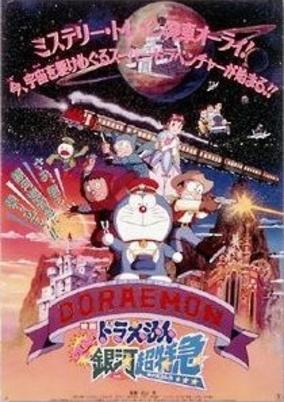

**Studio:** Shin-Ei Animation &nbsp;|&nbsp; **Genres:** Fantasy

> The kids go on a space Mystery Train bound for a space theme park, when a race of alien virus strikes, wanting to take them as host bodies.
>
> _Synopsis source: Kitsu_

[Kitsu](https://kitsu.io/anime/doraemon-nobita-s-galactic-express)

---

### Dragon Ball: The Path to Power (Dragon Ball Movie 4: The Path to Power)

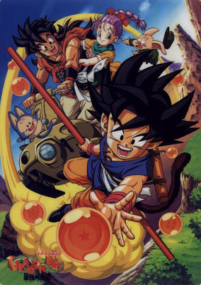

**Studio:** Toei Animation &nbsp;|&nbsp; **Genres:** Martial Arts, Fantasy, Action, Comedy, Super Power, Science Fiction, Adventure, Shounen

> A retelling of Dragon Ball's origin with a different take on the meeting of Goku, Bulma, and Kame-Sen'nin. It also retells the Red Ribbon Army story; but this time they find Goku rather than Goku finding them.
>
> _Synopsis source: Kitsu_

[Kitsu](https://kitsu.io/anime/dragon-ball-movie-4-saikyou-e-no-michi)

---

### Dragon Ball GT

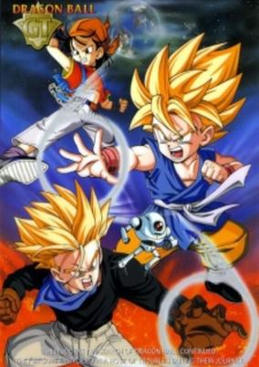

**Studio:** Toei Animation &nbsp;|&nbsp; **Genres:** Space Travel, Science Fiction, Fantasy, Action, Comedy, Martial Arts, Magic, Super Power, Adventure, Shounen

> Dragon Ball GT takes place five years after Gokuu left to train his apprentice Uub, whose training is now complete. During the final stages of Uub's training, Gokuu's old foe Emperor Pilaf infiltrates the Lookout to make a wish on the Black Star Dragon Balls. Due to a slip of the tongue, Pilaf is once again denied world domination and Gokuu is instead turned back into a child. Who could have imagined the dangers that would soon follow this lighthearted event? Making a wish on the Black Star Dragon Balls causes the planet they are used on to explode exactly one year after the wish has been granted. And the Black Star Dragon Balls do not simply scatter across the Earth, they scatter across the entire galaxy. It is up to Gokuu, Trunks, and Pan to retrieve the Balls and save the Earth, but they will find many enemies who are a far greater threat than Emperor Pilaf on their journey throughout the galaxy.
>
> _Synopsis source: Kitsu_

[Wikipedia](https://en.wikipedia.org/wiki/Dragon_Ball_GT) · [Kitsu](https://kitsu.io/anime/dragon-ball-gt)

---

### Dragon Quest Saga: Emblem of Roto

**Studio:** Nippon Animation

[Wikipedia](https://en.wikipedia.org/wiki/Dragon_Quest#Anime)

---

### The File of Young Kindaichi

**Studio:** Toei Animation

[Wikipedia](https://en.wikipedia.org/wiki/List_of_The_File_of_Young_Kindaichi_episodes#Films_(1996–1999))

---

### Famous Dog Lassie

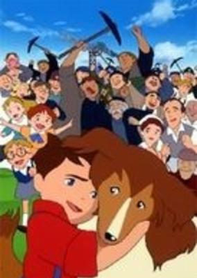

**Studio:** Nippon Animation &nbsp;|&nbsp; **Genres:** Slice of Life, Adventure, Kids

> John is a cheerful and energetic young boy, who lives in a small coal-mining town in England. One day he finds a small dog lost in a flock of sheep. John takes her back home and names the puppy Lassie. Soon they become good friends, just like real siblings. Lassie is a very lovely and smart dog, so everyone in the town loves her very much. But their happy life doesn't last long. Suddenly a coal-mine owner closes his company because there is no more coal left in the coal mine. John goes to meet the coal-mine owner to request a further investigation. The owner accepts John's request, but in exchange for that, he takes Lassie to Scotland. Priscilla, the owner's granddaughter and also John's friend, cannot just stand by and let Lassie suffer in a cage. She opens the cage and sets Lassie free. Lassie sets out on a very long and hard journey from Scotland to her hometown.
>
> _Synopsis source: Kitsu_

[Wikipedia](https://en.wikipedia.org/wiki/Famous_Dog_Lassie) · [Kitsu](https://kitsu.io/anime/meiken-lassie)

---

### Gundam X

**Studio:** Sunrise

[Wikipedia](https://en.wikipedia.org/wiki/Gundam_X)

---

### Hell Teacher Nube

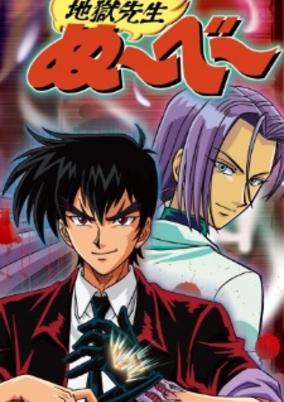

**Studio:** Toei Animation &nbsp;|&nbsp; **Genres:** Fantasy, Japan, Elementary School, Comedy, Horror, School Life, Violence, Present, Super Power, Adventure, Romance

> Nube is a clumsy, easygoing, and very kind teacher, but he has a secret under his glove on the left hand. He has a monster hand, and he also has the ability to sense ghosts and evil spirits. So he protects his dear students from these evil spirits with his monster hand, proving to be very powerful.
>
> _Synopsis source: Kitsu_

[Wikipedia](https://en.wikipedia.org/wiki/Jigoku_Sensei_N%C5%ABb%C4%93#Anime) · [Kitsu](https://kitsu.io/anime/jigoku-sensei-nube)

---

### Hell Teacher Nube

**Studio:** Toei Animation &nbsp;|&nbsp; **Genres:** Fantasy, Japan, Elementary School, Comedy, Horror, School Life, Violence, Present, Super Power, Adventure, Romance

> Nube is a clumsy, easygoing, and very kind teacher, but he has a secret under his glove on the left hand. He has a monster hand, and he also has the ability to sense ghosts and evil spirits. So he protects his dear students from these evil spirits with his monster hand, proving to be very powerful.
>
> _Synopsis source: Kitsu_

[Wikipedia](https://en.wikipedia.org/wiki/Jigoku_Sensei_N%C5%ABb%C4%93#Films) · [Kitsu](https://kitsu.io/anime/jigoku-sensei-nube)

---

### Kaiketsu Zorro (The Magnificent Zorro)

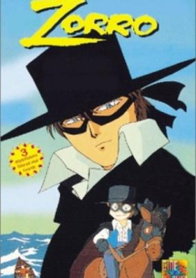

**Studio:** Ashi Productions &nbsp;|&nbsp; **Genres:** Action, Earth, Swordplay, Americas, Past, Historical, Adventure

> Diego Vega returns from his study trip to discover his homeland is under the army's dictatorship. Diego, refusing to watch idly, disguises himself as Zorro to protect the weak and oppressed. Diego is not a coward but he is unable to win the affections of his sweetheart, Lolita, who is attracted to other more noble men. Diego serenades Lolita as Zorro and fights the evils of his homeland, hoping to capture her heart.
>
> _Synopsis source: Kitsu_

[Wikipedia](https://en.wikipedia.org/wiki/Kaiketsu_Zorro) · [Kitsu](https://kitsu.io/anime/kaiketsu-zorro)

---

### Kenji's Trunk

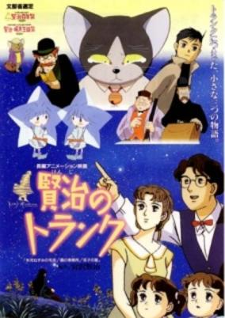

**Studio:** Triangle Staff &nbsp;|&nbsp; **Genres:** Fantasy, Kids

> An omnibus movie consisting of three stories by Miyazawa Kenji.
>
> _Synopsis source: Kitsu_

[Kitsu](https://kitsu.io/anime/kenji-no-trunk)

---

### Kodomo no Omocha

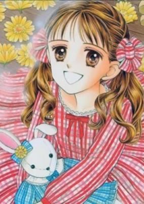

**Studio:** Gallop &nbsp;|&nbsp; **Genres:** Japan, Asia, Elementary School, Earth, Comedy, Slapstick, School Life, Present

> The Kodomo No Omocha OVA is a thirty-minute animation video that was made before the TV series. It covers the first volume of the manga, so it's equivalent to TV episodes 1-6. It relates Sana's troubles with Hayama at school as a result of the "oyakodon baka" situation and culminates when Hayama's dad and sister realize their mistakes thanks to Sana's efforts.
>
> _Synopsis source: Kitsu_

[Wikipedia](https://en.wikipedia.org/wiki/Kodomo_no_Omocha) · [Kitsu](https://kitsu.io/anime/kodomo-no-omocha-ova)

---

### Lupin III: Dead or Alive (Lupin the Third: Dead or Alive)

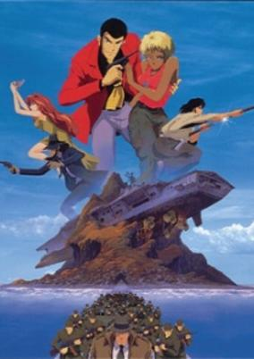

**Studio:** Tokyo Movie Shinsha &nbsp;|&nbsp; **Genres:** Action, Thievery, Comedy, Gunfights, Adventure, Crime

> Lupin, Goemon, and Jigen take a mini-helicopter and head to the mysterious “Drifting Island” looking for a treasure rumored to be hidden somewhere on it. Through their exploration of the island, the trio encounters the lethal “Nanomachine,” the island’s security system. The trio triggers the alarm, springing “the Nanomachine” to life. The key to solving the island’s mystery lies in the small nation of Zufu. This once prosperous nation is now ruled by the ruthless, knife-collecting, General Headhunter. Fujiko does her usual probing and hacks into General Headhunter’s computer hoping to find some crucial information. Zenigata has received a video message from Lupin in which Lupin announces his desire for the priceless treasure. Oleander, a fiery blond officer with some hidden secrets of her own, steps in to help Zenigata. Armed with their newly found information, Lupin, Goemon, Jigen, and Fujiko go back to “Drifting Island,” but this time they are followed by General Headhunter.
>
> _Synopsis source: Kitsu_

[Kitsu](https://kitsu.io/anime/lupin-iii-dead-or-alive)

---

### Lupin III: The Secret of Twilight Gemini

**Studio:** Tokyo Movie Shinsha

[Wikipedia](https://en.wikipedia.org/wiki/List_of_Lupin_III_television_specials#9)

---

### Magic User's Club

**Studio:** Triangle Staff

[Wikipedia](https://en.wikipedia.org/wiki/Magic_User%27s_Club)

---

### Martian Successor Nadesico

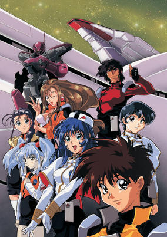

**Studio:** Xebec &nbsp;|&nbsp; **Genres:** Science Fiction, Mecha, Adventure, Action, Space Opera, Piloted Robot, Parody, Comedy, Other Planet, Shipboard, Future, Plot Continuity, Space, Romance, Military

> Akito doesn't want to fight. Despite a childhood spent on the anime Gekiganger 3, a Mecha show, he'd rather cook than pilot a Mecha. Fate intervenes when his home on Mars is destroyed, and he is transported instantly to the Earth, mysteriously. He has questions no one can answer fully, but follows a girl from a chance meeting in hopes to discover any. The girl, Yurika, is captain of the private battleship Nadesico, and in order to follow her, he enlists as their cook. Possessing the nanite implants that allow to control mechas, he's a handy backup pilot for the mechas of the Nadesico. He joins a crew bent on avenging Mars that seems to be composed of only misfits, otakus, and ditzes; however, in reality, they are handpicked experts. They take their own private war back to Mars to face the harsh reality that life may not always be like a Giant Mecha series.
>
> _Synopsis source: Kitsu_

[Wikipedia](https://en.wikipedia.org/wiki/Martian_Successor_Nadesico) · [Kitsu](https://kitsu.io/anime/kidou-senkan-nadesico)

---

### Maya's Life

**Studio:** Mushi Production

---

### Mutant Turtles: Superman Legend

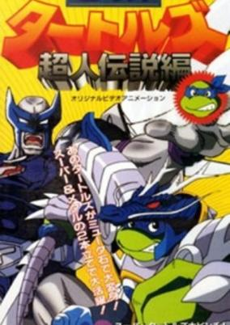

**Studio:** Tsuburaya Productions &nbsp;|&nbsp; **Genres:** Earth, Ninja, New York, Japan, Action, Asia, Comedy, United States, Ghost, Henshin, Americas, Anthropomorphism, Slapstick, Plot Continuity, Present, Super Power, Science Fiction, Adventure

> When the Teenage Mutant Ninja Turtles acquire Mutastones from Crys-Mu, the spirit of light, they acquire the ability to enhance themselves into Super Turtles for a duration of three minutes. Meanwhile, the evil Shredder and his minions Bebop and Rocksteady stumble upon the Dark Mutastone, which transforms them into Devil Shredder, Supermutant Bebop and Supermutant Rocksteady, respectively. But the Turtles have one more trick up their shells: all four of them can combine into their ultimate form—Turtle Saint.
>
> _Synopsis source: Kitsu_

[Kitsu](https://kitsu.io/anime/mutant-ninja-turtles-superman-legend)

---

### My Dear Marie

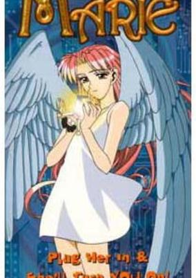

**Studio:** Pierrot &nbsp;|&nbsp; **Genres:** Japan, Asia, Earth, Romance, Science Fiction, Mecha, Sudden Girlfriend Appearance, Android, School Life, Present, Comedy, Ecchi

> Ever met the perfect girl? Did she have the perfect boyfriend? Feel like you can't compete? Why not build your own? When an amateur mad scientist attempts to build a robotic duplicate of this dream girl, Marie is the result. Of course, there are the usual unexpected complications. He built her so well that Marie has a mind of her own and a whole host of questions to go with it. The same questions that each of us ask of life. Where did I come from? Why am I here? Why do I look just like that girl over there?! Well, perhaps we don’t all have to worry about that, but Marie does!
>
> _Synopsis source: Kitsu_

[Wikipedia](https://en.wikipedia.org/wiki/My_Dear_Marie) · [Kitsu](https://kitsu.io/anime/boku-no-marie)

---

### Ninja Cadets

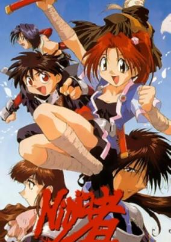

**Studio:** AIC , Youmex &nbsp;|&nbsp; **Genres:** Asia, Japan, Comedy, Action, Ninja, Fantasy, Earth, Swordplay, Martial Arts, Adventure

> During Japan's feudal era, there was a war between two ninja clans: the Byakuro and the Kabusu. One night, the Kabusu staged a fierce attack on the Byakuro castle in hopes of kidnapping the clan's infant princess. Their mission was foiled when a loyal ninja of the Byakuro flees the attack with the princess and disappears, eventually raising her to be a ninja. Several years later, six ninja trainees are given a mission to infiltrate the Kabusu-occupied Byakuro castle and retrieve a sacred scroll to complete their training. But their skills are put to the test when they encounter three members of the Kabusu, who use dark sorcery in an attempt to once again capture the princess - who happens to be one of the trainees.
>
> _Synopsis source: Kitsu_

[Wikipedia](https://en.wikipedia.org/wiki/Ninja_Cadets) · [Kitsu](https://kitsu.io/anime/ninja-cadets)

---

### The Nintama Rantarō Movie

**Studio:** Ajia-do Animation Works

[Wikipedia](https://en.wikipedia.org/wiki/Nintama_Rantar%C5%8D#Films)

---

### Pipi: Unforgettable Fireflies

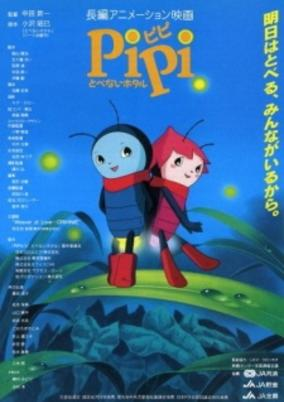

**Studio:** Mushi Production &nbsp;|&nbsp; **Genres:** Fantasy, Drama

> Based on the fairy tale novel series by Akira Ozawa (小沢昭巳).
>
> _Synopsis source: Kitsu_

[Kitsu](https://kitsu.io/anime/pipi-tobenai-hotaru)

---

### Remi, Nobody's Girl (Sans Famille)

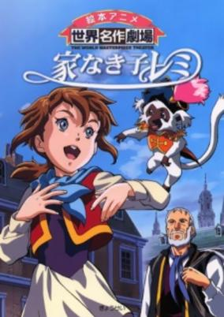

**Studio:** Nippon Animation &nbsp;|&nbsp; **Genres:** Earth, France, Europe, Historical, Adventure, Slice of Life

> Remi, a cheerful and tender-hearted girl, lives with her mother in a French country town. One day her father returns to the town after a long period working away from home in a city. Her father tells Remi that she isn't their real daughter, and Remi is almost sold to an evil slave trader. It is Vitalis, a strolling entertainer, who helps Remi. Vitalis discovers her talent for singing and decides to take her in with his troupe.
>
> _Synopsis source: Kitsu_

[Wikipedia](https://en.wikipedia.org/wiki/Remi,_Nobody%27s_Girl) · [Kitsu](https://kitsu.io/anime/ie-naki-ko-remi)

---

### Rurouni Kenshin

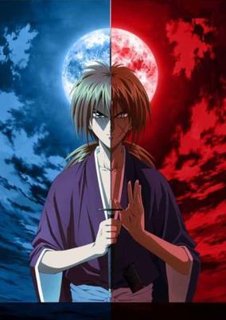

**Studio:** Gallop &nbsp;|&nbsp; **Genres:** Romance, Kyoto, Bakumatsu   Meiji Period, Japan, Adventure, Action, Earth, Asia, Comedy, Swordplay, Tokyo, Martial Arts, Drama, Past, Plot Continuity, Samurai, Super Power, Historical

> In the final years of the Bakumatsu era lived a legendary assassin known as Hitokiri Battousai. Feared as a merciless killer, he was unmatched throughout the country, but mysteriously disappeared at the peak of the Japanese Revolution. It has been ten peaceful years since then, but the very mention of Battousai still strikes terror into the hearts of war veterans.Unbeknownst to them, Battousai has abandoned his bloodstained lifestyle in an effort to repent for his sins, now living as Kenshin Himura, a wandering swordsman with a cheerful attitude and a strong will. Vowing never to kill again, Kenshin dedicates himself to protecting the weak. One day, he stumbles across Kaoru Kamiya at her kendo dojo, which is being threatened by an impostor claiming to be Battousai. After receiving help from Kenshin, Kaoru allows him to stay at the dojo, and so the former assassin temporarily ceases his travels.Rurouni Kenshin: Meiji Kenkaku Romantan tells the story of Kenshin as he strives to save those in need of saving. However, as enemies from both past and present begin to emerge, will the reformed killer be able to uphold his new ideals?[Written by MAL Rewrite]
>
> _Synopsis source: Kitsu_

[Wikipedia](https://en.wikipedia.org/wiki/Rurouni_Kenshin) · [Kitsu](https://kitsu.io/anime/rurouni-kenshin)

---

### Saber Marionette J

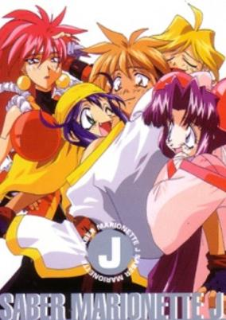

**Studio:** Studio Junio &nbsp;|&nbsp; **Genres:** Science Fiction, Mecha, Post Apocalypse, Action, Comedy, Martial Arts, Anti War, Other Planet, Future, Robot Helper, Android, Plot Continuity, Space, Harem, Adventure, Romance

> In the distant future, since the Earth has become overpopulated, efforts to find and colonize on other planets have begun. However, one of the ships, the "Mesopotamia" malfunctions and all but 6 of its inhabitants are all killed. the remaining 6 manage to escape to a nearby planet named "Terra ll ", which is similar to Earth in many respects. However, all of them are male. Therefore, as to not let their efforts go to waste, they begin to set up 6 countries and to reproduce through cloning and genetic engineering. however, there are still no women, and to make up for it they create lifelike advanced female androids called "Marionettes" which do everyday chores and work. However, they are all emotionless machines. But one day, a ordinary boy named Otaru finds and awakens 3 special battle type Marionettes that have emotions due to a "Maiden Circuit" within them. It's up to him then to teach them and allow their emotions to grow, and when a nearby country threatens with world domination, it's up to to Otaru and his "human" Marionettes to protect their country.
>
> _Synopsis source: Kitsu_

[Wikipedia](https://en.wikipedia.org/wiki/Saber_Marionette_J) · [Kitsu](https://kitsu.io/anime/saber-marionette-j)

---

### Sailor Moon Sailor Stars

**Studio:** Toei Animation

[Wikipedia](https://en.wikipedia.org/wiki/Sailor_Moon_Sailor_Stars)

---

### Sanctuary

**Studio:** PASTEL

[Wikipedia](https://en.wikipedia.org/wiki/Sanctuary_(manga)#Adaptations)

---

### Shamanic Princess

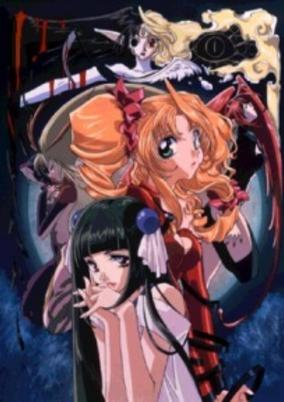

**Studio:** Triangle Staff &nbsp;|&nbsp; **Genres:** Contemporary Fantasy, Fantasy, Action, Magic, Violence, Present, Romance

> From the Guardian World, home of mages, Tiara has been sent on a mission: recover the stolen Throne of Yord, the most powerful magic artifact of all. But Tiara finds herself in a dilemma—the Throne has been taken by her former lover, and there is more to the situation than meets the eye...
>
> _Synopsis source: Kitsu_

[Wikipedia](https://en.wikipedia.org/wiki/Shamanic_Princess) · [Kitsu](https://kitsu.io/anime/shamanic-princess)

---

### Shinran Shōnin to Ōsha-jō no Higeki

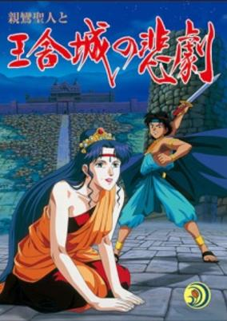

**Studio:** AIC &nbsp;|&nbsp; **Genres:** Historical, Drama

> An spinoff of Sekai no Hikari: Shinran Shounin. It covers the life of Shinran Shounin and his involvement to develop the Mahayana Buddism branch.
>
> _Synopsis source: Kitsu_

[Kitsu](https://kitsu.io/anime/shinran-shounin-to-ousha-jou-no-higeki)

---

### Slayers Return (Slayers Movie 2)

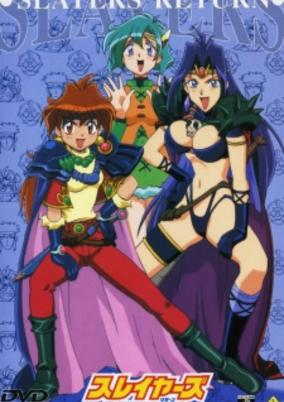

**Studio:** J.C.Staff &nbsp;|&nbsp; **Genres:** Fantasy, Fantasy World, Action, Comedy, Magic, Adventure

> The inhabitants of the village of Biaz, forced to labor in the serivce of the world-domination-happy Zein organization, hires Lina Inverse and Naga The Serpent to drive off the invaders. Lina and Naga agree, lured by stories of Elfin treasure sleeping below Biaz, only to get considerably more trouble -from the Zein and from the treasure - than they ever expected.
>
> _Synopsis source: Kitsu_

[Wikipedia](https://en.wikipedia.org/wiki/Slayers_Return) · [Kitsu](https://kitsu.io/anime/slayers-return)

---

### Sonic the Hedgehog (Sonic the Hedgehog: The Movie)

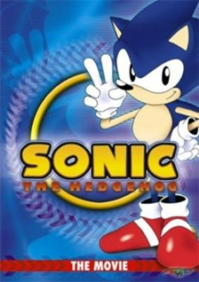

**Studio:** Pierrot &nbsp;|&nbsp; **Genres:** Science Fiction, Fantasy World, Comedy, Adventure

> When Dr. Eggman (Robotnik in the US version) holds the president and his daughter hostage, Sonic must comply to the evil scientist's demand of going to Eggmanland to stop Black Eggman and deactivate the city's generator before it reaches critical mass. Little does Sonic know that it's a trap to activate Hyper Metal Sonic, a robot counterpart built by Eggman to destroy our hero.
>
> _Synopsis source: Kitsu_

[Wikipedia](https://en.wikipedia.org/wiki/Sonic_the_Hedgehog_(OVA)) · [Kitsu](https://kitsu.io/anime/sonic-the-hedgehog)

---

### Soreike! Anpanman Soratobu Ehon to Garasu no Kutsu

**Studio:** Tokyo Movie Shinsha

[Wikipedia](https://en.wikipedia.org/wiki/Anpanman#Full-length_movies)

---

### Spring and Chaos

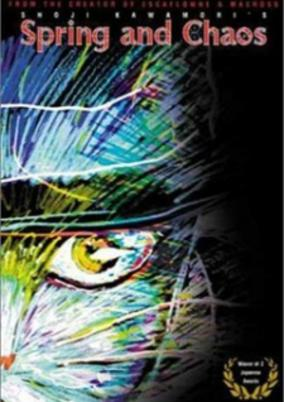

**Studio:** Group TAC &nbsp;|&nbsp; **Genres:** Japan, Anthropomorphism, Past, The Arts, Historical, Slice of Life

> A unique biographical sketch of the life of the great modern Japanese poet Kenji Miyazawa, Spring and Chaos is a highly stylized and intense film that draws on Miyazawa's writing techniques to tell his life story. Miyazawa often used animals as the main characters in his stories and poems, and it is this technique that allows director Shoji Kawamori to recreate Miyazawa's fanciful land of Ihatov and use it as the backdrop for Miyazawa's life. Beautiful and affecting, Spring and Chaos is a fitting tribute to one of Japan's greatest writers.
>
> _Synopsis source: Kitsu_

[Wikipedia](https://en.wikipedia.org/wiki/Spring_and_Chaos) · [Kitsu](https://kitsu.io/anime/spring-and-chaos)

---

### Starship Girl Yamamoto Yohko

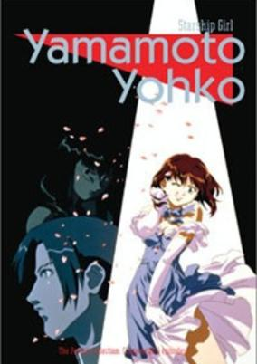

**Studio:** J.C.Staff &nbsp;|&nbsp; **Genres:** Science Fiction, Action, Adventure, Comedy

> Meet Yohko Yamamoto - a cat-eyed, 15-year-old girl in the late 20th century with a love for videogames and Pocky. Because of her exceptional talent with arcade shooters, she's been recruited by Lawson to travel a thousand years into the future to pilot the prototype ship TA-29. Together with Ayano Elizabeth Hakuhoin, Madoka Midoh and Momiji Kagariya, Yohko leads the Terran team against Rouge and Ness' infamous Red Snappers in this epic space adventure.
>
> _Synopsis source: Kitsu_

[Wikipedia](https://en.wikipedia.org/wiki/Starship_Girl_Yamamoto_Yohko) · [Kitsu](https://kitsu.io/anime/soreyuke-uchuu-senkan-yamamoto-yohko)

---

### Those Who Hunt Elves

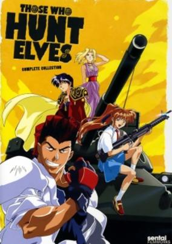

**Studio:** Group TAC &nbsp;|&nbsp; **Genres:** Pirate, Adventure, Fantasy, Action, Comedy, Elf, Martial Arts, Magic, Ecchi

> An actor, a martial artist, a gun-crazy high school student, and their tank are transported from earth to a world of elves and magic. However, the spell to return them home was botched resulting in fragments of the spell being magically imprinted onto their skin. Their solution: run around looking for elves and stripping them wherever they find them.
>
> _Synopsis source: Kitsu_

[Wikipedia](https://en.wikipedia.org/wiki/Those_Who_Hunt_Elves) · [Kitsu](https://kitsu.io/anime/those-who-hunt-elves)

---

### Variable Geo

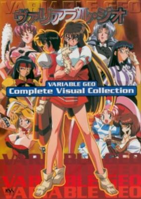

**Studio:** Chaos Project &nbsp;|&nbsp; **Genres:** Ecchi, Action, Waitress, Martial Arts, Super Power

> The special of the day is Variable Geo-a brutal battle between waitresses who serve up generous portions of energy blasts and vicious side orders of murderous martial artistry. For buffed beauties who make below-minimum wages, VG is the perfect way to make some fast cash. The victorious walk away with millions, and the defeated lose everything (namely, all their clothes). But this high-stakes sport has dark forces and dubious practices behind the fun and games. Lethal injections make steroids seem like vitamins. Instead of team prayer, there's demonic possession. Athletic sponsors are malevolent corporations with a more frightening agenda than increased market share. It's all just part of the game.
>
> _Synopsis source: Kitsu_

[Wikipedia](https://en.wikipedia.org/wiki/Variable_Geo_(anime)) · [Kitsu](https://kitsu.io/anime/variable-geo)

---

### Violinist of Hamelin

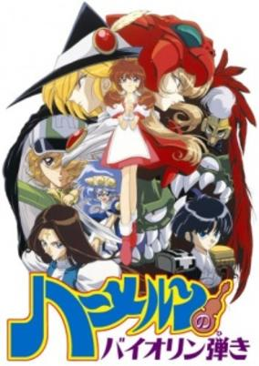

**Studio:** Nippon Animation &nbsp;|&nbsp; **Genres:** Fantasy, Action, Fantasy World, Revenge, Magic, Violence, Demon, Adventure

> Trouble arises in Staccato one day. Demons show up and start to wreak havoc on the townspeople. The entire country seems to be suffering. The source of the problem is that the "barrier" which until now has kept the demons from crossing over to the human world, is weakening. The person who sustains it is losing her strength after holding it up for so many years. That person is Queen Horn of Sforzando. Hell King Bass is trying to break through the barrier and release their "supreme leader," Kestra (Orchestra). One whose power is unparalleled yet is trapped somewhere in the world of the humans.
>
> _Synopsis source: Kitsu_

[Wikipedia](https://en.wikipedia.org/wiki/Violinist_of_Hamelin#Film) · [Kitsu](https://kitsu.io/anime/violinist-of-hamelin)

---

### Violinist of Hamelin

**Studio:** Studio Deen &nbsp;|&nbsp; **Genres:** Fantasy, Action, Fantasy World, Revenge, Magic, Violence, Demon, Adventure

> Trouble arises in Staccato one day. Demons show up and start to wreak havoc on the townspeople. The entire country seems to be suffering. The source of the problem is that the "barrier" which until now has kept the demons from crossing over to the human world, is weakening. The person who sustains it is losing her strength after holding it up for so many years. That person is Queen Horn of Sforzando. Hell King Bass is trying to break through the barrier and release their "supreme leader," Kestra (Orchestra). One whose power is unparalleled yet is trapped somewhere in the world of the humans.
>
> _Synopsis source: Kitsu_

[Wikipedia](https://en.wikipedia.org/wiki/Violinist_of_Hamelin#Anime) · [Kitsu](https://kitsu.io/anime/violinist-of-hamelin)

---

### The Vision of Escaflowne

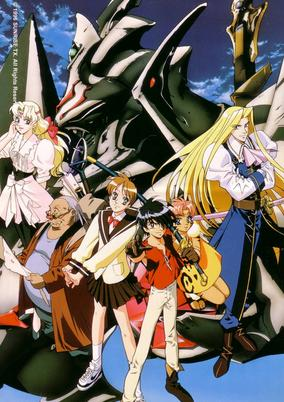

**Studio:** Sunrise &nbsp;|&nbsp; **Genres:** Romance, Transforming Craft, Science Fiction, Mecha, Fantasy, Fantasy World, Steampunk, Action, Piloted Robot, Dragon, Angst, Alternative Present, Parallel Universe, Adventure, Isekai

> Hitomi Kanzaki is just an ordinary 15-year-old schoolgirl with an interest in tarot cards and fortune telling, but one night, a boy named Van Fanel suddenly appears from the sky along with a vicious dragon. Thanks to a premonition from Hitomi, Van successfully kills the dragon, but a pillar of light appears and envelopes them both. As a result, Hitomi finds herself transported to the world of Gaea, a mysterious land where the Earth hangs in the sky. In this new land, Hitomi soon discovers that Van is a prince of the Kingdom of Fanelia, which soon falls under attack by the evil empire of Zaibach. In an attempt to fight them off, Van boards his family's ancient guymelef Escaflowne—a mechanized battle suit—but fails to defeat them, and Fanelia ends up destroyed. Now on the run, Hitomi and Van encounter a handsome Asturian knight named Allen Schezar, whom Hitomi is shocked to find looks exactly like her crush from Earth. With some new allies on their side, Van and Hitomi fight back against the forces of Zaibach as the empire strives to revive an ancient power. [Written by MAL Rewrite]
>
> _Synopsis source: Kitsu_

[Wikipedia](https://en.wikipedia.org/wiki/The_Vision_of_Escaflowne) · [Kitsu](https://kitsu.io/anime/escaflowne)

---

### VS Knight Lamune & 40 Fire

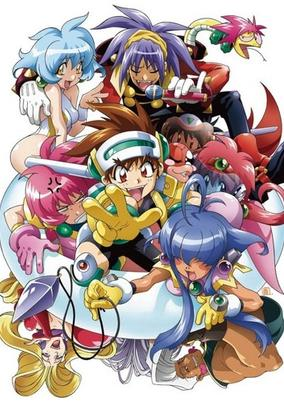

**Studio:** Ashi Productions &nbsp;|&nbsp; **Genres:** Robot, Piloted Robot, Science Fiction, Action, Mecha, Comedy, Parody, Fantasy

> Baba Lamunade is followed home by two strange peddler girls who give him a CD-rom game. After he beats "The Legend of Lamuness", the girls come out of his computer and bring him to DokiDoki Space. He is the third descendant of the hero Lamuness who must stop Don Genosai from resurrecting the great evil Abraham. Accompanied by PQ, his advisor robot, and Parfait and Cacao, he must pilot the Kaizer Fire mecha. However, he needs another pilot, and Da Cider is chosen as the second pilot.
>
> _Synopsis source: Kitsu_

[Wikipedia](https://en.wikipedia.org/wiki/VS_Knight_Lamune_%26_40_Fire) · [Kitsu](https://kitsu.io/anime/vs-knight-lamune-40-fire)

---

### X

**Studio:** Madhouse

[Wikipedia](https://en.wikipedia.org/wiki/X_(1996_film))

---

### Yawara! Special – I've Always Been About You...

**Studio:** Madhouse

[Wikipedia](https://en.wikipedia.org/wiki/Yawara!#Yawara!_Special_–_Zutto_Kimi_no_Koto_ga)

---

### You're Under Arrest

**Studio:** Studio Deen

[Wikipedia](https://en.wikipedia.org/wiki/You%27re_Under_Arrest_(manga))

---
