# 1997 in Anime

[← Back to index](../README.md)

62 titles · 58 with a matched synopsis/cover art · [source](https://en.wikipedia.org/wiki/1997_in_anime)

## Releases

### Agent Aika

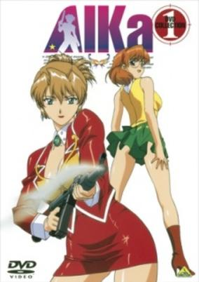

**Genres:** Ecchi, Power Suit, Science Fiction, Action, Earth, Gunfights, Bounty Hunter, Plot Continuity, Adventure, Comedy

> A catastrophic earthquake has left Tokyo, and most of the Earth for that matter, under the sea. Aika is a salvager who retrieves various remains from the watery ruins. When Aika accepts the dangerous mission of locating and obtaining the mysterious Lagu, she discovers that she's not the only one after it.
>
> _Synopsis source: Kitsu_

[Wikipedia](https://en.wikipedia.org/wiki/Agent_Aika) · [Kitsu](https://kitsu.io/anime/agent-aika)

---

### Alien from the Darkness (Special Duty Combat Unit Shinesman)

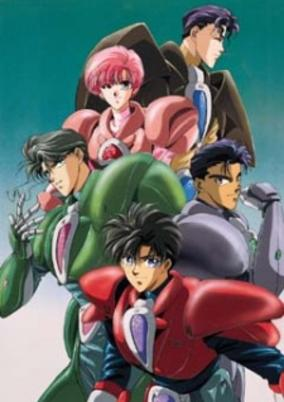

**Genres:** Earth, Power Suit, Parody, Japan, Asia, Action, Science Fiction, Comedy

> Hiroya Matsumoto, hoping to become a great employee as his late father, has just been hired at Raito (Right) Trading Company. Little does he know that he has been recruited for a very mysterious department within the company - the Special Duty Combat Unit, known as SHINESMAN. Their purpose, to fight the terrible (often times hilarious) alien forces that threaten the earth. Like most corporate employees, Matsumoto still has meetings to attend and deadlines to meet. But when the Shinesman rage war against the alien race from Planet Voice, led by their Prince Sasaki, Matsumoto and his co-workers don their office-coloured comat Pro-suits and become: Shinesman Red, Sepia, Salmon Pink, Grey, and Moss Green. If you thought you'd seen it all in Power Rangers, Kamen Rider, or even Dynaman, wait until you take a look at the zaney but corporate world of SHINESMAN!
>
> _Synopsis source: Kitsu_

[Kitsu](https://kitsu.io/anime/tokumu-sentai-shinesman)

---

### Anime Ganbare Goemon

[Wikipedia](https://en.wikipedia.org/wiki/Anime_Ganbare_Goemon)

---

### Armitage III: Poly-Matrix

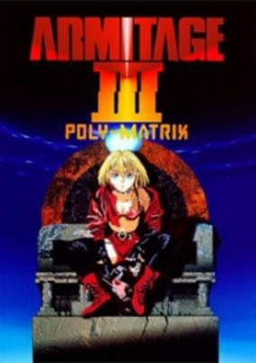

**Genres:** Science Fiction, Action, Gunfights, Thriller, Detective, Cyberpunk, Other Planet, Future, Android, Stereotypes, Law And Order, Violence, Cops, Mecha, Adventure, Romance, Military

> In the year 2046 humans are moving away from using robots and begin to trust them less and less. In this time life becomes very perilous for the beings known as seconds. The seconds are the most recent line of robots, as far as the public knows. This is the world Detective Ross Sylibus lives in. Detective Sylibus is transferred to Mars by his request after his partner was killed by a robot. As he arrives he falls headfirst into a murder where a country singer on his flight was murdered. He steps off the plane and watches as a scene unfolds and he meets his partner, Armitage a female cop with a major attitude. A rash of murders begins when yet more women are killed. As the investigation is continued a secret is uncovered. There is another line of robots known as Thirds. More and more Thirds turn up missing, as a serial killer who is intent on wiping out all the Thirds runs rampant. Armitage in her quest to put the murderer to justice reveals a secret. She herself is a Third.
>
> _Synopsis source: Kitsu_

[Kitsu](https://kitsu.io/anime/armitage-iii-polymatrix)

---

### Battle Athletes

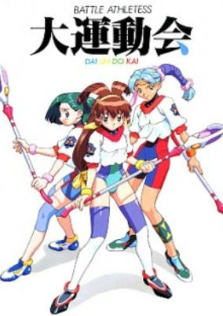

**Genres:** Science Fiction, Ecchi, Sports, Future, Space, Action, Comedy

> It is the year 4999 - mankind has long abandoned war in favor of intergalactic competition through athletic events. One of which is an all-female contest for the coveted "Cosmo Beauty" title. Akari Kanzaki has just entered the University Satellite in hopes of becoming the latest Cosmic Beauty - a title held by her mother long ago. On her first few days in the university, she meets new friends, encounters fierce rivals, and struggles to become the best of all the Battle Athletes.
>
> _Synopsis source: Kitsu_

[Wikipedia](https://en.wikipedia.org/wiki/Battle_Athletes#OVA) · [Kitsu](https://kitsu.io/anime/battle-athletes-ova)

---

### Battle Athletes Victory (Battle Athletes)

**Genres:** Science Fiction, Ecchi, Sports, Future, Space, Action, Comedy

> It is the year 4999 - mankind has long abandoned war in favor of intergalactic competition through athletic events. One of which is an all-female contest for the coveted "Cosmo Beauty" title. Akari Kanzaki has just entered the University Satellite in hopes of becoming the latest Cosmic Beauty - a title held by her mother long ago. On her first few days in the university, she meets new friends, encounters fierce rivals, and struggles to become the best of all the Battle Athletes.
>
> _Synopsis source: Kitsu_

[Wikipedia](https://en.wikipedia.org/wiki/Battle_Athletes#1997_series) · [Kitsu](https://kitsu.io/anime/battle-athletes-ova)

---

### Berserk

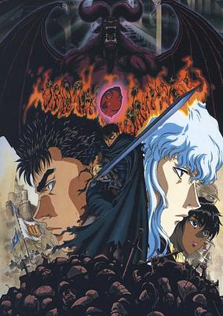

**Genres:** Swordplay, Past, Fantasy World, Alternative Past, Demon, Contemporary Fantasy, Dark Fantasy, Violence, Feudal Warfare, Plot Continuity

> Born from the corpse of his mother, a young mercenary known only as Guts, embraces the battlefield as his only means of survival. Day in and day out, putting his life on the line just to make enough to get by, he moves from one bloodshed to the next. After a run-in with the Band of the Hawk, a formidable troop of mercenaries, Guts is recruited by their charismatic leader Griffith, nicknamed the "White Hawk." As he quickly climbed the ranks in order to become the head of the offensive faction, Guts proves to be a mighty addition to Griffith's force, taking Midland by storm. However, while the band's quest for recognition continues, Guts slowly realizes that the world is not as black-and-white as he once assumed. Set in the medieval era, Berserk is a dark, gritty tale that follows one man's struggle to find his own path, while supporting another's lust for power, and the unimaginable tragedy that begins to turn the wheels of fate.
>
> _Synopsis source: Kitsu_

[Wikipedia](https://en.wikipedia.org/wiki/Berserk_(1997_TV_series)) · [Kitsu](https://kitsu.io/anime/berserk)

---

### Case Closed: The Time-Bombed Skyscraper (Case Closed The Movie: The Time Bombed Skyscraper)

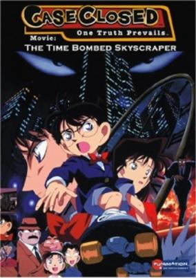

**Genres:** Japan, Action, Asia, Earth, Detective, Law And Order, Present, Cops, Adventure, Comedy, Mystery

> Conan Edogawa is facing a dilemma: Ran Mouri has asked Shinichi Kudou out to the movies and he is unable to provide a convincing excuse not to go. However, when the day of the date arrives, he has more pressing problems to worry about—a great amount of plastic explosives has recently been stolen and the culprit has challenged Shinichi to find and dispose of the bombs he has scattered across the city. Now forced in a race against time, Conan must not only protect the city, but also figure out who the mastermind is and his reason for confronting Shinichi. [Written by MAL Rewrite]
>
> _Synopsis source: Kitsu_

[Kitsu](https://kitsu.io/anime/detective-conan-movie-01-the-timed-skyscraper)

---

### City Hunter: The Motion Picture (City Hunter: The Secret Service)

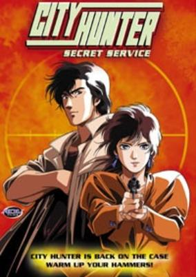

**Genres:** Gunfights, Present, Earth, Japan, Violent Retribution For Accidental Infringement, Asia, Action, Comedy, Mystery

> James McGuire has a dream. He wants to become the president of Guinam and free his people from the military rulers who have been in power up until now. However, one thing stands in McGuire's way: his past. And it's beginning to catch up with him, endangering not only his career, but the life of his long lost daughter. McGuire hires the City Hunter, Ryo Saeba and his partner Kaori to protect his daughter Anna, who herself is a Secret Service agent assigned to bodyguard the presidential hopeful.
>
> _Synopsis source: Kitsu_

[Wikipedia](https://en.wikipedia.org/wiki/City_Hunter#Anime) · [Kitsu](https://kitsu.io/anime/city-hunter-the-secret-service)

---

### Clamp School Detectives

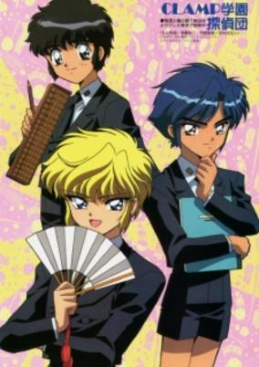

**Genres:** Action, Comedy, Friendship, School Life, Mystery

> The CLAMP school, with its integrated curriculum from kindergarten to post-graduate studies, was founded by the largest of Japanese business empires, the House of Imonoyama. Funded entirely out of its own deep pockets, it was hoped that the school would be a haven for young men and women on whose shoulders our future would rest. The School is open to any talented individual, irrespective of his or her lineage or financial standing and is known to count scores of singularly talented pupils. It is furthermore also famous for its harboring of a remarkable percentage of party animals. Not even the bright and talented minds of CLAMP School can keep the campus free of crimes and mysteries. Or can they? Join Nokoru, Suoh and Akira, our case-cracking kid detectives, as they save the day and even the odd damsel in distress!
>
> _Synopsis source: Kitsu_

[Wikipedia](https://en.wikipedia.org/wiki/Clamp_School_Detectives#Anime) · [Kitsu](https://kitsu.io/anime/clamp-gakuen-tanteidan)

---

### The Crayon Kingdom of Dreams (Crayon Kingdom of Dreams)

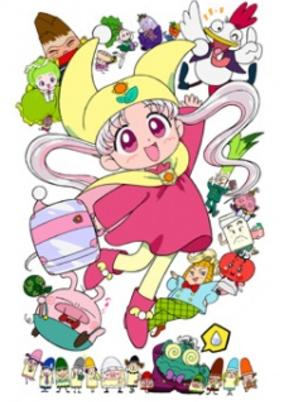

**Genres:** Fantasy, Adventure, Comedy, Anthropomorphism

> The civilians of the Crayon Kingdom have always view their Princess Silver as a twelve-year old girl with a beautiful smile. However, unknown to them, the princess has 12 bad habits. This has created much distress to the Chameleon Prime Minister and the Crayon ministers for it would be embarassing if this gets out. One day, a party was held to celebrate Princess Silver's twelvth birthday. The princess was trying to seek her Prince Charming that she forgot to take notice of her bad habits. One of the boys at the party was so angry that he changed Silver's parents, the King and Queen, into stone. In order to break the curse and save her parents, Silver decided to set on a journey to locate the boy. Together with her companions, Silver begins her adventure.
>
> _Synopsis source: Kitsu_

[Wikipedia](https://en.wikipedia.org/wiki/Yume_no_Crayon_Oukoku) · [Kitsu](https://kitsu.io/anime/yume-no-crayon-oukoku)

---

### Crayon Shin-chan: Pursuit of the Balls of Darkness

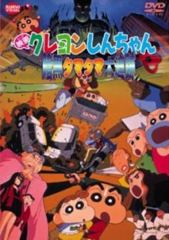

**Genres:** Comedy, Ecchi, Slice of Life, School Life, Kids

> An action comedy film depicting the Nohara family who get caught in a fight between two clans, Tamayura and Tamayomi. Set in Tokyo and Aomori (northern end of Japan's main island). The Tamayomi clan had plotted to revive the evil genie Jarke and to conquer the world. To stop Tamayomi's plot, the three gay brothers (Rose, Lavender and Lemon) from Tamayura clan wrested Jarke's ball, which was a key to revive Jarke, from the bar girl gang of Tamayomi clan, but Shinnosuke's younger sister Himawari swallowed down the ball. The Nohara family, with the three gay brothers and a female detective Yone Higashimatsuyama, fights a fierce battle against the Tamayomi gang chasing them.
>
> _Synopsis source: Kitsu_

[Kitsu](https://kitsu.io/anime/crayon-shin-chan-movie-05-ankoku-tamatama-daitsuiseki)

---

### Cutie Honey Flash (Cutey Honey F)

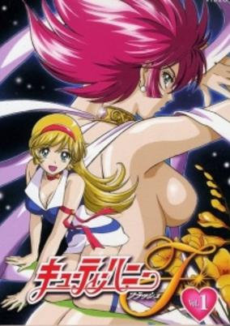

**Genres:** Adventure, Magical Girl, Science Fiction, Action, Romance, Comedy, Magic

> On her sixteenth birthday, Honey Kisaragi goes to meet her father. However, he shows up injured and on the run. Out of nowhere, a group of thugs and a monster show up. A detective, Seiji Hayama, rescues Honey and her father. Unfortunately, the monster captures Honey`s father. A grieving Honey goes home to find it in ruins, but a handsome man gives her hope and a device to use against the monsters who took her father. With them, Honey can transform into multiple forms and destroy Panther Zora, the evil behind this.
>
> _Synopsis source: Kitsu_

[Wikipedia](https://en.wikipedia.org/wiki/Cutie_Honey_Flash) · [Kitsu](https://kitsu.io/anime/cutey-honey-f)

---

### The Day the Earth Moved

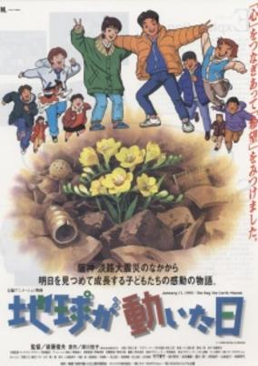

**Genres:** Japan, Drama, Disaster, Present, Historical

> January 16, 1995. Tsuyoshi Takahashi, a young student at Shiokaze elementary, is driven solely to get excellent grades. Because of this he often ignores those around him in his pursuit of perfection. Miho, a young girl in his class that wishes he would appreciate the people around him. Kazu a sickly and bed ridden classmate that lives near him. January 17, the 1995 Kobe / Hyogoken-Nanbu Earthquake strikes killing more than 6000 people and leaving 300 000 more homeless. Measuring 6.9 on the Richter Scale, it was the largest Earthquake to hit Japan since the Great Kanto Earthquake of 1923. In the aftermath of the quake, Tsuyoshi's finds his priorities changing. Dealing with the death of one friend while helping another to cope with a very personal loss, Tsuyoshi is forced to mature into someone who can no longer ignore the suffering around him. (Souce: AniDB)
>
> _Synopsis source: Kitsu_

[Kitsu](https://kitsu.io/anime/chikyuu-ga-ugoita-hi)

---

### Deep Sea Fleet: Submarine 707

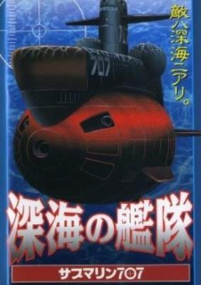

**Genres:** Action, Science Fiction, Adventure, Military, Navy

> A mysterious object attacks and destroys any ship or submarine. Submarine 707 has the mission to search for that mysterious object, when summoned by a whale to follow it. The whale leads them to the world of Mu. But on their way they meet the mysterious object. They find out , it is Commander Red Silver, who had attacked the world of Mu to get Mu's magma sources. Submarine takes up the battle to defeat Red Silver and save Mu, and the world for that matter.
>
> _Synopsis source: Kitsu_

[Wikipedia](https://en.wikipedia.org/wiki/Submarine_707#Release) · [Kitsu](https://kitsu.io/anime/shinkai-no-kantai-submarine-707)

---

### Detatoko Princess (Suddenly Princess)

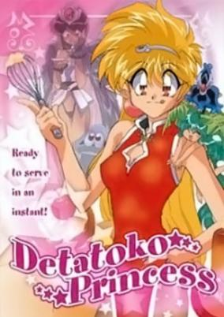

**Genres:** Fantasy, Fantasy World, Adventure, Action, Comedy, Past, Slapstick

> Lapis is the princess of Sorcerland. She's beautiful, powerful and has a sparkling personality; it`s too bad that she's not that bright. She'll go to any length to protect the most innocent of creatures even if it means destroying the kingdom to do so. And lets not forget her obsession with pudding! Detatoko Princess is a laugh-out-loud lampoon of all the fantasy stereotypes you've come to love with a generous heaping scoop of slapstick!
>
> _Synopsis source: Kitsu_

[Wikipedia](https://en.wikipedia.org/wiki/Detatoko_Princess#OVAs) · [Kitsu](https://kitsu.io/anime/detatoko-princess)

---

### Doraemon: Nobita and the Spiral City (Doraemon the Movie: Nobita and the Spiral City)

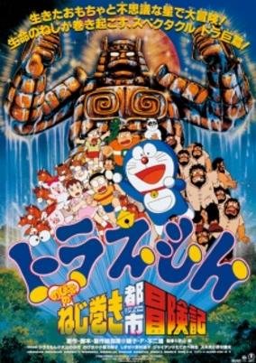

**Genres:** Fantasy, Adventure, Kids

> After Suneo bragged about having a ranch, Nobita was asked whether or not he has one, pressuring him to say yes. Doraemon won a number of lotteries for useless planets in the belt between Mars and Jupiter. When Suneo and the rest came to see the ranch, Nobita happened to read the last of the lottery number to the go-anywhere-door, leading them to a huge dreamlike area. As Nobita's toy horse pranced around because of the wind-up life gadget, Suneo and the others became interested in doing the same to their toys and let them live in the area. So they decided to make their own clockwork city.
>
> _Synopsis source: Kitsu_

[Kitsu](https://kitsu.io/anime/doraemon-nobita-s-adventure-in-clockwork-city)

---

### Doctor Slump

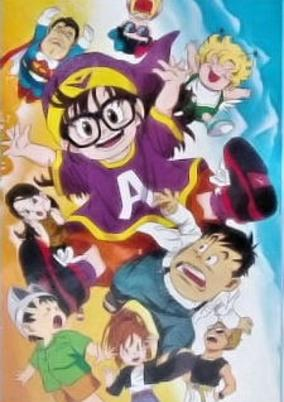

**Genres:** Science Fiction, Comedy, Anthropomorphism, School Life, Slice of Life

> In Penguin Village, humans live alongside talking animals and objects. Senbei Norimaki is one of these humans, and he's an inventor with the lofty dream of creating the world's best robot girl. The product of his efforts is Arale, but depending on your definition of perfect, she's anything but! Not only is Arale severely nearsighted, but she also has no common sense! At least she has super-strength, though that often proves to be a setback as well. Although she means well, Arale only causes trouble for her neighbors in the whimsical Penguin Village!
>
> _Synopsis source: Kitsu_

[Wikipedia](https://en.wikipedia.org/wiki/Dr._Slump#Anime) · [Kitsu](https://kitsu.io/anime/dr-slump)

---

### Dragon Ball GT: A Hero's Legacy

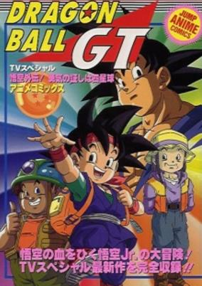

**Genres:** Comedy, Super Power, Fantasy, Action, Adventure, Martial Arts, Shounen

> Years after the end of the Dragonball GT, the story continues in this special with Son Goku's now eldery granddaughter Pan, and a new generation of super saiyajins, the great-great-grandsons of Goku and Vegeta 100 years after the end of DBGT, all the heroes of Earth have died...except for Pan, the granddaughter of Son Goku. Pan has a grandchild named Goku Jr. However, he does not have the bravery of his great-great-grandfather. Pan suffurs a heart attack, and Goku Jr. believes that he might be able to save her with the power of the 4 star Dragon Ball. Along with the school bully, he tries to find the ball...and unleashes his hidden bravery and power.
>
> _Synopsis source: Kitsu_

[Kitsu](https://kitsu.io/anime/dragon-ball-gt-goku-gaiden-yuuki-no-akashi-wa-suushinchuu)

---

### Eat-Man

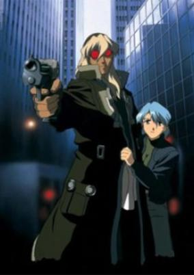

**Genres:** Science Fiction, Action, Gunfights, Crime, Super Power, Adventure

> Meet Bolt Crank, mercenary extraordinaire, and the man who eats metal! Through his travels, he stops along the way to make a few bucks and occasionally rescue damsels in distress. His taste for metal gives him quite an edge as he becomes capable of generating an assortment of weapons from his hand! It's a strange ability, but it seems to come in handy, so to speak. Bolt has an edge over his adversaries, but will that be enough?
>
> _Synopsis source: Kitsu_

[Wikipedia](https://en.wikipedia.org/wiki/Eat-Man#Anime_series) · [Kitsu](https://kitsu.io/anime/eat-man)

---

### Elmer's Adventure: My Father's Dragon

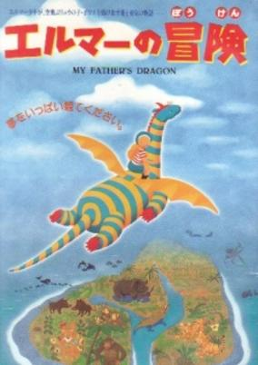

**Genres:** Fantasy, Adventure, Kids

> Elmer is told by a traveling cat about a baby dragon who is being held captive and mistreated on the scary Wild Island. Elmer decides to investigate and battles tigers, crocodiles and gorillas in order to rescue the little dragon.
>
> _Synopsis source: Kitsu_

[Kitsu](https://kitsu.io/anime/elmer-no-bouken-my-father-s-dragon)

---

### The End of Evangelion (Neon Genesis Evangelion: The End of Evangelion)

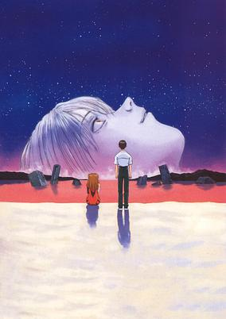

**Genres:** Science Fiction, Mecha, Post Apocalypse, Japan, Action, Piloted Robot, Angst, Drama, Future, Plot Continuity, Violence, Psychological, Dementia

> With the final Angel vanquished, Nerv has one last enemy left to face—the humans under Seele's command. Left in a deep depression nearing the end of the original series, an indecisive Shinji struggles with the ultimatum presented to him: to completely accept mankind's existence, or renounce humanity's individuality. Meanwhile, at the core of a compromised Nerv, Gendou Ikari and Rei Ayanami approach Lilith in an attempt to realize their own ideals concerning the future of the world. The End of Evangelion serves as an alternate ending to the polarizing final episodes of Neon Genesis Evangelion. With the fate of the universe hanging in the balance, the climactic final battle draws near.
>
> _Synopsis source: Kitsu_

[Wikipedia](https://en.wikipedia.org/wiki/The_End_of_Evangelion) · [Kitsu](https://kitsu.io/anime/neon-genesis-evangelion-the-end-of-evangelion)

---

### The File of Young Kindaichi

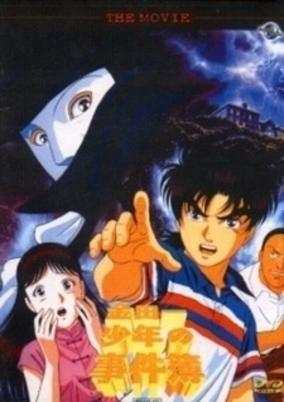

**Genres:** Present, Earth, Japan, Asia, School Life, Detective, Mystery

> Invited for a anniversary celebration, Kindaichi, Miyuki and inspector Kenmochi re-visit the Opera House. There they discover that a play of "The Phantom of the Opera" is being rehearsed again. However, it doesn't take long when members of the acting troupe are killed by the "Phantom". Kindaichi will once again have to solve a murder series in the Opera House.
>
> _Synopsis source: Kitsu_

[Wikipedia](https://en.wikipedia.org/wiki/The_Kindaichi_Case_Files#Anime) · [Kitsu](https://kitsu.io/anime/kindaichi-shounen-no-jikenbo)

---

### Flame of Recca

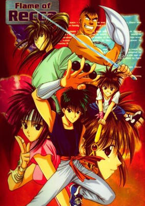

**Genres:** Earth, Japan, Action, Asia, Martial Arts, Crime, Alternative Present, Present, Super Power, Adventure

> Most people think that ninjas are a thing of the past, but Rekka Hanabishi wishes otherwise. Although he comes from a family that makes fireworks, he likes to think of himself as a self-styled, modern-day ninja. Sounds like fun, right? Maybe not. Rekka ends up in lots of fights because he once made the bold announcement that if someone can defeat him, he will become their servant. Then one day, Rekka meets Yanagi Sakoshita, a gentle girl with the ability to heal any wound or injury. Their meeting sets off a chain of events, which culminate into a shocking discovery. Rekka is the last surviving member of a legendary ninja clan that was wiped out centuries ago. Even more astonishing than being an actual ninja, he also wields the power to control fire. What does this mean for Rekka? Who are these strange people after him and Yanagi? Find out in Rekka no Honoo!
>
> _Synopsis source: Kitsu_

[Wikipedia](https://en.wikipedia.org/wiki/Flame_of_Recca#Anime) · [Kitsu](https://kitsu.io/anime/flame-of-recca)

---

### Fujimi Orchestra

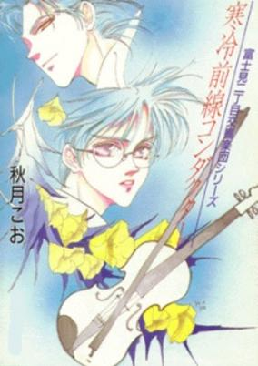

**Genres:** Music, Shounen Ai, Romance, Slice of Life, Psychological, Yaoi

> High school music teacher, Morimura Yuuki, is the concert master and first violinist of the amateur orchestra, Fujimi Orchestra. Surprisingly, a young conductor named Tonoin Kei (known as a musical genius) joins this small orchestra to conduct. Even though Tonoin is a strict conductor, all the members adore him for the notable improvements in their performances and soon Yuuki feels his efforts for the orchestra have been fruitless. Yuuki soon comes to the conclusion that his crush of 3 years likes Tonoin, and he decides to give up on her and leave the orchestra. Tonoin refuses to let him quit, confessing that he loves Yuuki, which reveals that he's gay. Tonoin's love confession confuses Yuuki and it leads to a very horrible misunderstanding.
>
> _Synopsis source: Kitsu_

[Wikipedia](https://en.wikipedia.org/wiki/Fujimi_Orchestra) · [Kitsu](https://kitsu.io/anime/fujimi-orchestra)

---

### Hakugei: Legend of the Moby Dick

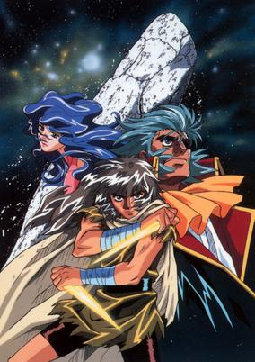

**Genres:** Space Travel, Science Fiction, Mecha, Adventure, Action, Gunfights, Other Planet, Future, Android, Robot, Space

> A courageous young man tries to find the only person who can save his planet from the most terrifying beast in the universe -- the great white whale Moby Dick -- in this futuristic anime adventure set in 4699. But locating the outlaw Captain Ahab and his elusory crew of whale hunters and persuading them to put an end to the leviathan's long reign of terror won't be easy. Will Ahab take up the challenge one more time?
>
> _Synopsis source: Kitsu_

[Kitsu](https://kitsu.io/anime/hakugei-legend-of-the-moby-dick)

---

### Hermes – Winds of Love (Hermes: Winds of Love)

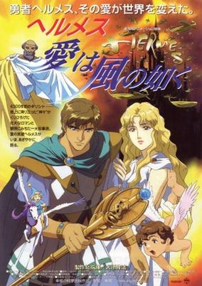

**Genres:** Fantasy

> Thousands of years in the past, a young boy named Hermes is named as a future great hero in a prophecy. Hermes grows up to save a beautiful princess and face the evil king Minos of Crete. The first title in the series of anime films by the Happy Science cult.
>
> _Synopsis source: Kitsu_

[Kitsu](https://kitsu.io/anime/hermes-winds-of-love)

---

### Home of Acorns

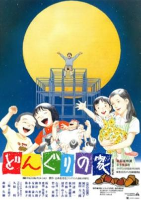

**Genres:** Japan, Slice of Life, Present

> The Takazis' only daughter named Keiko was born seriously handicapped, deaf and dumb and mentally handicapped. Her parents tried to accept her handicap but their suffering continued. Things changed after Keiko entered a deaf and dumb school. Not only Keiko but also her parents grew up with friendship and cooperation of the teachers and friends. They established a group named "Donguri" (acorn) to make a community workshop where the handicapped people could be independent. (source :jfkl.org)
>
> _Synopsis source: Kitsu_

[Kitsu](https://kitsu.io/anime/donguri-no-ie)

---

### Hyper Police

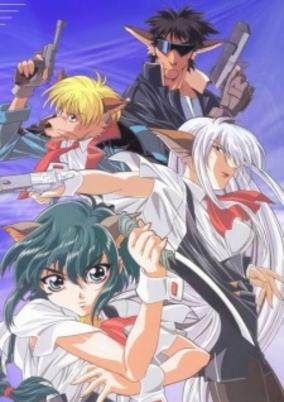

**Genres:** Post Apocalypse, Science Fiction, Japan, Action, Earth, Comedy, Special Squads, Gunfights, Juujin, Bounty Hunter, Future, Stereotypes, Law And Order, Cops, Demon, Romance, Family

> Sasahara Natsuki is a poor bounty hunter in a world where monsters and humans live together. Most of her cases involve monsters infringing upon the rights of humans, who are protected by law from their generally more powerful neighbors. Being half-human and half cat-beast, Natsuki straddles the two societies and tries to understand and respect both while enforcing the law. She is assisted by a werewolf named Batanen who is afraid to admit he loves her; another werewolf named Tommy; and a Kyubi fox demon named Sakura who has her own plans--which include eating Natsuki to complete her her nine tails and thereby her magical powers.
>
> _Synopsis source: Kitsu_

[Wikipedia](https://en.wikipedia.org/wiki/Hyper_Police) · [Kitsu](https://kitsu.io/anime/hyper-police)

---

### In the Beginning: The Bible Stories

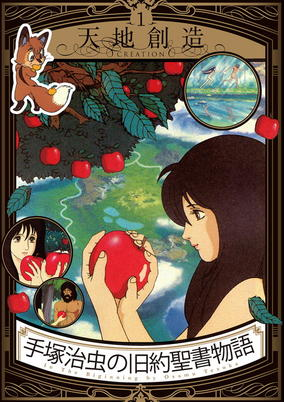

**Genres:** Fantasy, Religion, Past, Historical

> Through the Italian National Broadcasting Network, Tezuka Osamu received an ardent request from the Vatican to make the Bible into animated form. This request was probably made to see how the Bible would be depicted by the non-Christian Tezuka Osamu. Tezuka Osamu accepted the request and spent an entire two years to complete a pilot film. It was about the mythology of Noah's ark, with the enthusiastic Tezuka Osamu not only writing the scenario but also drawing pictures by himself. During production, however, he unfortunately passed away, so Director Dezaki took over the film and completed it.
>
> _Synopsis source: Kitsu_

[Kitsu](https://kitsu.io/anime/in-the-beginning-the-bible-stories)

---

### Jigoku Sensei Nūbē: Gozen 0 toki Nūbē Shisu (Hell Teacher Nube)

**Genres:** Fantasy, Japan, Elementary School, Comedy, Horror, School Life, Violence, Present, Super Power, Adventure, Romance

> Nube is a clumsy, easygoing, and very kind teacher, but he has a secret under his glove on the left hand. He has a monster hand, and he also has the ability to sense ghosts and evil spirits. So he protects his dear students from these evil spirits with his monster hand, proving to be very powerful.
>
> _Synopsis source: Kitsu_

[Wikipedia](https://en.wikipedia.org/wiki/Jigoku_Sensei_N%C5%ABb%C4%93#Films) · [Kitsu](https://kitsu.io/anime/jigoku-sensei-nube)

---

### Jungle de Ikou!

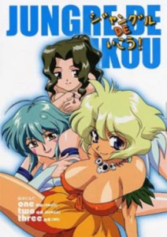

**Genres:** Earth, Ecchi, Japan, Action, Asia, Comedy, Dark Skinned Girl, Slapstick, Alternative Present, Magical Girl, Magic, Adventure

> After meeting a dancing old man in what she thinks is just a crazy dream, a preteen schoolgirl embarks on a series of fanservice-filled magical girl adventures with a little creature named Ongo who might be evil and a shy girl with mysterious powers named Nami.
>
> _Synopsis source: Kitsu_

[Wikipedia](https://en.wikipedia.org/wiki/Jungle_de_Ikou!#Media) · [Kitsu](https://kitsu.io/anime/jungle-de-ikou)

---

### Jungle Emperor Leo

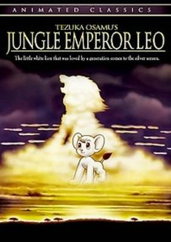

**Genres:** Earth, Fantasy, Africa, Adventure

> This movie focuses on the last half of Osamu Tezuka's revered saga of a white lion's quest to become king of the jungle. Leo's newborn cub, Lune, takes an interest to humans after discovering a music box in the wreckage of an airplane. At the same time, a greedy treasure hunter known as Ham Egg is leading an expedition team of rough-looking men on a trek for the fabled Moonlight Stones, which can supposedly save the world from an energy crisis. Two other humans, (who go by the rather wacky names of Dr. Moustache and Lemonade) try to stop Ham Egg's mad destruction of the jungle. Later, a terrible virus sweeps through the jungle, poisoning many of the animals. Dr. Moustache comes to save them with a cure. The film culminates with a treacherous journey up the legendary Mt. Moon in search of the stones....
>
> _Synopsis source: Kitsu_

[Wikipedia](https://en.wikipedia.org/wiki/Jungle_Emperor_Leo) · [Kitsu](https://kitsu.io/anime/jungle-taitei-1997)

---

### Kigyō Senshi Yamazaki: Long Distance Call

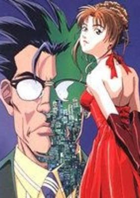

**Genres:** Politics, Science Fiction

> A 42-year-old salaryman is made to serve his company beyond the grave when his brain is installed in a super-powered android body in order to carry out corporate espionage.
>
> _Synopsis source: Kitsu_

[Kitsu](https://kitsu.io/anime/kigyou-senshi-yamazaki-long-distance-call)

---

### Knights of Ramune

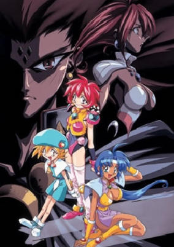

**Genres:** Fantasy, Science Fiction, Mecha, Adventure, Ecchi, Action, Piloted Robot, Comedy, Future, Parallel Universe, Super Power, Space

> To save the galaxy from impending doom, Cacao and Parfait are sent on a mission through time and space to retrieve the Fourth Warrior, Lamunes. Unfortunately, Cacao and Parfait discover Lamunes at the helm of the marauding Giga Genos invasion fleet. World by world, Lamunes is determined to bring the entire galaxy under his tyrannical heel. With the help of a plicky orphan, it's up to Cacao and Parfait to stop Lamunes from taking over the world.
>
> _Synopsis source: Kitsu_

[Wikipedia](https://en.wikipedia.org/wiki/Knights_of_Ramune) · [Kitsu](https://kitsu.io/anime/vs-knight-lamune-40-fresh)

---

### Let's & Go!! The Movie: Tamiya

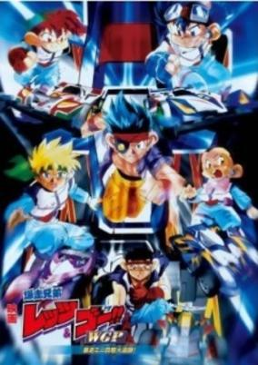

**Genres:** Motorsport, Sports

> After the first season, Retsu and Go have now formed a team called "TRF Victorys" which Tokichi Mikuni, J, and Ryo Takaba are part of. Together, they aim for the World Cup. In this cup, teams from all over the globe enter. Some of the teams are, NA Astrorangers (Americans), Eisen Wofl (Germans), Rosso Estrada (Italians).
>
> _Synopsis source: Kitsu_

[Kitsu](https://kitsu.io/anime/bakusou-kyoudai-let-s-go-wgp)

---

### Let's Go! Anpanman: The Pyramid of the Rainbow

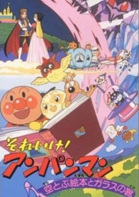

**Genres:** Fantasy, Comedy, Kids

> 8th Anpanman short movie.
>
> _Synopsis source: Kitsu_

[Wikipedia](https://en.wikipedia.org/wiki/Anpanman#Full-length_movies) · [Kitsu](https://kitsu.io/anime/sore-ike-anpanman-sora-tobu-ehon-to-glass-no-kutsu)

---

### Locomotive Teacher

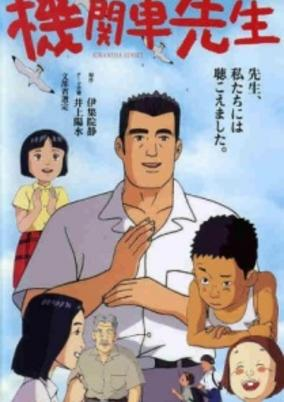

**Genres:** Japan, Elementary School, Slice of Life, Past, School Life, Comedy

> The story depicts the interaction of the children of the island and their teacher, Yoshioka Makotoware who is unable to speak because of a childhood accident. A movie based on the best-selling novel by Shizuka Ijuin.
>
> _Synopsis source: Kitsu_

[Wikipedia](https://en.wikipedia.org/wiki/Kikansha_Sensei) · [Kitsu](https://kitsu.io/anime/kikansha-sensei)

---

### Licca-chan to Yamaneko Hoshi no Tabi

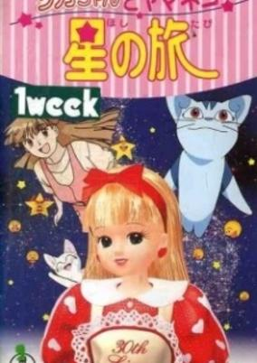

**Genres:** Magic, Fantasy, Adventure, Kids

> Based on the popular Licca doll in Japan. Licca meets a mysterious cat. Licca goes on vacation with her father. The town in the mountains they go to is the site of a festival of the stars that has a mystical background, which is more real than Licca expected when she ends up in the middle of the mystical battle for the festival.
>
> _Synopsis source: Kitsu_

[Kitsu](https://kitsu.io/anime/licca-chan-to-yamaneko-hoshi-no-tabi)

---

### Lupin III: Island of Assassins (Lupin the Third: Island of Assassins)

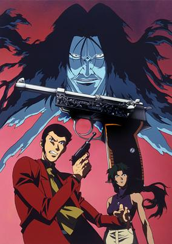

**Genres:** Present, Island, Action, Adventure, Comedy, Crime, Revenge, Thievery, Mystery

> Lupin is framed for the murder of Inspector Zenigata by a mysterious assailant holding a silver-colored Walther P38 pistol Lupin himself once owned. Tracking the true killer leads Lupin to the island of the bloodthirsty Tarantula assassins inside the Devil’s Triangle. After joining the spider-tattooed army against their will, Lupin and his gang make both new friends and enemies as they not only plan to take home the Tarantulas’ massive gold repository for themselves but hunt down the shooter from Lupin’s past. Can Lupin put to rest this demon who haunts his memories with the Walther P38?
>
> _Synopsis source: Kitsu_

[Wikipedia](https://en.wikipedia.org/wiki/List_of_Lupin_III_television_specials#10) · [Kitsu](https://kitsu.io/anime/lupin-iii-walther-p-38)

---

### Neon Genesis Evangelion: Death & Rebirth

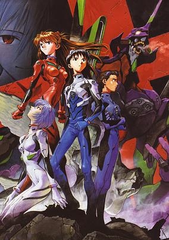

**Genres:** Science Fiction, Mecha, Post Apocalypse, Japan, Genetic Modification, Action, Asia, Earth, Piloted Robot, Psychological

> In the year 2015, more than a decade has passed since the catastrophic event known as Second Impact befell mankind. During this time of recovery, a select few learned of beings known as the Angels—colossal malevolent entities with the intention of triggering the Third Impact and wiping out the rest of humanity. Called into the city of Tokyo-3 by his father Gendou Ikari, teenager Shinji is thrust headlong into humanity's struggle. Separated from Gendou since the death of his mother, Shinji presumes that his father wishes to repair their shattered familial bonds; instead, he discovers that he was brought to pilot a giant machine capable of fighting the Angels, Evangelion Unit-01. Forced to battle against wave after wave of mankind's greatest threat, the young boy finds himself caught in the middle of a plan that could affect the future of humanity forever.
>
> _Synopsis source: Kitsu_

[Kitsu](https://kitsu.io/anime/neon-genesis-evangelion-death-rebirth)

---

### Night Warriors: Darkstalkers' Revenge

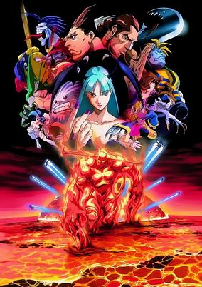

**Genres:** Fantasy, Vampire, Action, Alternative Present, Violence, Present, Super Power, Adventure, Supernatural

> The world is a dark, brooding place populated by humans, but ruled in reality by powerful beings known as the Darkstalkers, and there is constant conflict between them as they try to determine who is the most powerful of them all. Zombies, vampires, werewolves - all of them compete in contests of strength and sheer will to attain their own personal goals. All of this becomes moot when a race of Aztec robots called the Huitzil decide that humanity isn't worth saving, and start waging war on the world, while in the sky, a solar god from outer space plots the conquest of Earth. And the Darkstalkers must become unwilling allies in order to save the world.
>
> _Synopsis source: Kitsu_

[Kitsu](https://kitsu.io/anime/vampire-hunter)

---

### Perfect Blue

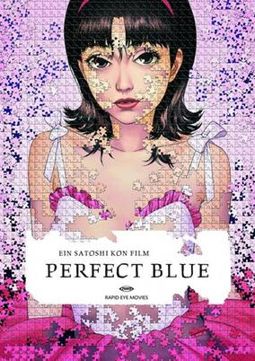

**Genres:** Japan, Asia, Earth, Performance, Thriller, Horror, Idol, Violence, Present, Music, Psychological, Dementia

> Perfect Blue revolves around the main protagonist, Mima Kirigoe, a member of a pop idol group named “CHAM!”. After evaluating her situation, she decides to give up her idol status to pursue a career as an actress, what she believes to be the next step in making a name for herself in the industry. However, one of her most hardcore fans, Me-Mania, is less than happy about the path she has decided to take. Now reborn as an actress, Mima accepts an interesting role, ignoring her manager, Rumi Hidaka's reservations about it. While on set, strange things begin to happen to people who are involved with the film. As time goes on, Mima begins to break down mentally, struggling to distinguish fantasy from reality. Will Mima be able to escape the grip of her stalker and turn in a break out performance, or will she descend into madness?
>
> _Synopsis source: Kitsu_

[Wikipedia](https://en.wikipedia.org/wiki/Perfect_Blue) · [Kitsu](https://kitsu.io/anime/perfect-blue)

---

### Pokémon

[Wikipedia](https://en.wikipedia.org/wiki/Pok%C3%A9mon_(TV_series))

---

### Princess Mononoke

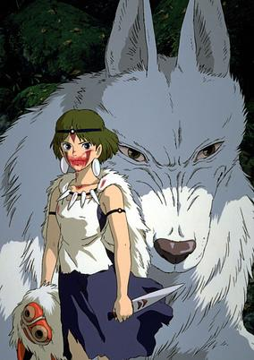

**Genres:** Japan, Action, Adventure, Asia, Earth, Fantasy, Past, Samurai

> A calm village residing in the mountains comes under attack from a demon-possessed boar one day. Ashitaka, a young man and prince of the tribe, engages the creature in an attempt to save his village. During the battle, the boar bites him on the arm, leaving it blackened and cursed. Following his village's traditions, Ashitaka is exiled and becomes a wanderer, looking for a solution to the curse before it engulfs him. Iron Town is a fortress under the leadership of Lady Eboshi. Through the clearing of the surrounding forests, Iron Town produces large amounts of Ironsand, used for gunpowder and other machinery. However, because of the forests destruction, nearby animal clans seek revenge led by a human girl of the Wolf clan called San. When Ashitaka comes to Iron Town, he discovers the area consumed in battle. Horrified, he attempts to create peace and befriend the Wolf Clan. However, after the forest's eradication and the ongoing war between Human and Beast, will the Spirit of the Forest be forgiving and accept Ashitaka's request to expel his curse? [Written by MAL Rewrite]
>
> _Synopsis source: Kitsu_

[Wikipedia](https://en.wikipedia.org/wiki/Princess_Mononoke) · [Kitsu](https://kitsu.io/anime/princess-mononoke)

---

### Psycho Diver: Soul Siren

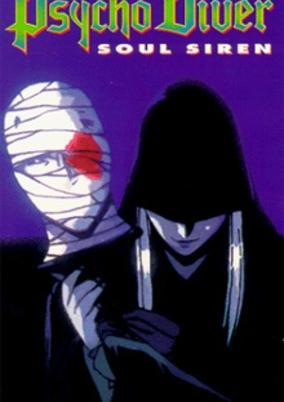

**Genres:** Japan, Future, Asia, Earth, Horror, Science Fiction, Psychological

> Yuki Kano has it all: fame, wealth, the world at her feet. There's also something very wrong with her... from time to time, she's totally unable to sing (which, for a pop star, is not good). Enter Bosujima, a "psycho diver" with the capability to enter people's heads and straighten out what's wrong with them. Well, most of the time, anyway.
>
> _Synopsis source: Kitsu_

[Kitsu](https://kitsu.io/anime/psycho-diver-masei-rakuryu)

---

### Revolutionary Girl Utena

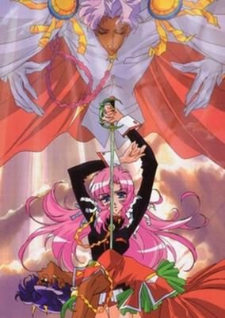

**Genres:** Fantasy, Contemporary Fantasy, Action, Comedy, Middle School, Swordplay, Thriller, High School, Drama, Alternative Present, School Life, Plot Continuity, Present, Magical Girl, Psychological

> "Never lose that strength or nobility, even when you grow up." When Utena was just a child and in the depths of sorrow, she found salvation in those words. They were the words of a prince, who wrapped her in his rosescented embrace and bestowed upon her both a ring and the promise that it would lead her to him again. She never forgot the encounter. In fact, she was so impressed that she aspired to be like the prince and also help those in need. Now a spirited teenager, Utena attends the prestigious Ohtori Academy. However, her strong sense of chivalry soon places her at odds with the school's student council and thrusts her into a series of mysterious and dangerous duels against its members.
>
> _Synopsis source: Kitsu_

[Wikipedia](https://en.wikipedia.org/wiki/Revolutionary_Girl_Utena) · [Kitsu](https://kitsu.io/anime/shoujo-kakumei-utena)

---

### Sakura Diaries

**Genres:** Ecchi, Earth, Sudden Girlfriend Appearance, Romance, Japan, Slice of Life, Asia, Plot Continuity, Present, Comedy

> A Keio University (one of the top three colleges in Japan) exam candidate, Touma Inaba, is interupted when a cute young girl, Urara Kasuga, arrives at his hotel room door. She later turns out to be his cousin who he barely remembers from his childhood. Urara, who had felt something special for him (an other-than-cousinly-love), invites Touma to live with her since he has no place to stay other than the hotel room. Before taking the test, Touma meets Meiko Yotsuba, a beautiful, sophisticated woman also trying to get into Keio. Meiko gets into Keio but Touma does not, due to a cold Urara had given him shortly before. Although he did not make it, he pretends he does to earn the respect of Meiko. Touma is caught up in a love triangle with Urara and Meiko, while struggling to keep Meiko believing he's really a Keio student and still be there for Urara at the same time.
>
> _Synopsis source: Kitsu_

[Wikipedia](https://en.wikipedia.org/wiki/Sakura_Diaries#Anime) · [Kitsu](https://kitsu.io/anime/sakura-diaries)

---

### Sakura Wars: The Gorgeous Blooming Cherry Blossoms

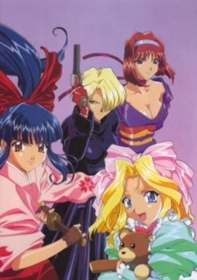

**Genres:** Past, Earth, Mecha, Alternative Past, Piloted Robot, Japan, Performance, Asia, Action, Science Fiction

> The year is around the 1920's and the darkness of the demons have arrived. Now, only the people with large amounts of spirit energy can save the Earth. The Flower Division is now going to be sent out destroy the demons for they're our only hope for survival with their new steam-powered machines and unique fighting techniques.
>
> _Synopsis source: Kitsu_

[Kitsu](https://kitsu.io/anime/sakura-taisen-ouka-kenran)

---

### Slayers Great (Slayers Movie 3)

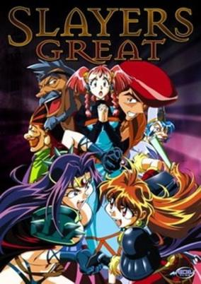

**Genres:** Fantasy, Fantasy World, Adventure, Action, Comedy, Magic

> Laia Einburg wants for her father Galia, who is a talented golom maker, and her equally ambitious brother Huey to end a long running feud. But her luck changes for the worse when Lina Inverse and Naga the Serpent save Laia from a rampaging golem.
>
> _Synopsis source: Kitsu_

[Wikipedia](https://en.wikipedia.org/wiki/Slayers_Great) · [Kitsu](https://kitsu.io/anime/slayers-great)

---

### Slayers Try

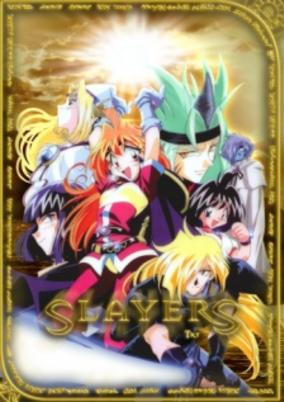

**Genres:** Fantasy World, Adventure, Action, Fantasy, Comedy, Dragon, Swordplay, Magic, Stereotypes, Plot Continuity, Violence, Demon

> Several months have passed (after the end of Slayers Next). The barrier put in place by the mazoku sublords has been broken, and as a result, Lina Inverse and her friends are allowed access to the outside world. There they become wrapped up in a prophecy stating that a dark lord from another dimension, Dark Star Dugradigdo, will enter their world and spread chaos.
>
> _Synopsis source: Kitsu_

[Wikipedia](https://en.wikipedia.org/wiki/Slayers_Try) · [Kitsu](https://kitsu.io/anime/slayers-try)

---

### Spacibo at the End of the Edo Period

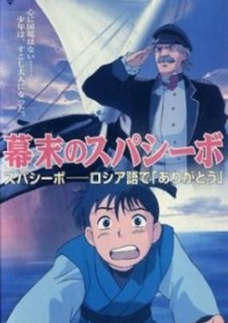

**Genres:** Earth, Bakumatsu   Meiji Period, Japan, Asia, Adventure, Past, Military, Historical, Friendship

> Based on the real life events around Yevfimy Vasilyevich Putyatin, a Russian admiral noted for his diplomatic missions to Japan and China, and the signing of the Treaty of Shimoda in 1855.
>
> _Synopsis source: Kitsu_

[Kitsu](https://kitsu.io/anime/bakumatsu-no-spasibo)

---

### Spur to Glory: The Igaya Chiharu Story

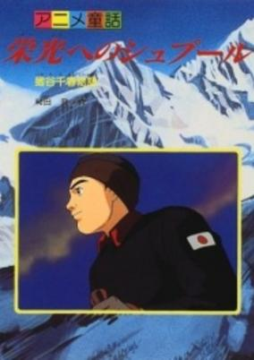

**Genres:** Past, Historical, Japan, Sports

> A biography of Chiharu Igaya, who won a silver medal in men's slalom in Cortina d'Ampezzo Olympics in 1956, and became the first Japanese Winter Olympics medalist.
>
> _Synopsis source: Kitsu_

[Kitsu](https://kitsu.io/anime/eikou-e-no-spur-igaya-chiharu-monogatari)

---

### Spy of Darkness

---

### Starship Girl Yamamoto Yohko II

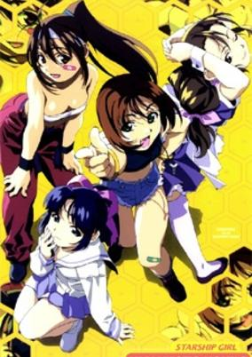

**Genres:** Science Fiction, Action, Adventure

> There is an ancient legend on a distant planet which states (among other things) that four goddesses will one day descend from the skies and all will be right with the world. Of course meanwhile, Yohko and the rest of the Terra team (with one straggler) have crashed on a backwater world, and they have to figure out a way off before their new charge... gets hungry again! Every so often, a celebration takes place in one of the most beautiful places in the Universe... a cosmic Sakura fest! Since the Terra Team has been doing so well, one of them is invited to join the high command as they meet their opposite numbers from NESS. It's a time of celebration and a time of peace... but it seems that someone didn't get the message.
>
> _Synopsis source: Kitsu_

[Wikipedia](https://en.wikipedia.org/wiki/Starship_Girl_Yamamoto_Yohko_II) · [Kitsu](https://kitsu.io/anime/soreyuke-uchuu-senkan-yamamoto-yohko-ii)

---

### Tenchi the Movie 2: The Daughter of Darkness (Tenchi the Movie 2: Daughter of Darkness)

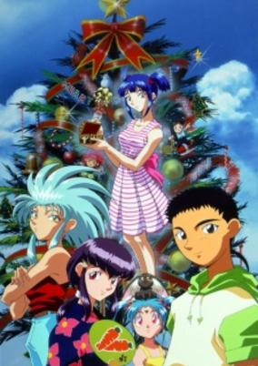

**Genres:** Fantasy, Romance, Science Fiction, Japan, Action, Asia, Earth, Comedy, Sudden Girlfriend Appearance, Harem, Space

> A girl, Mayuka, appears one day claiming to be Tenchi's daughter, much to the shock of the Masaki household. Chaos ensues as Washu attempts to discover Mayuka's background, and the girls adjust to the new presence at their home. The result of her appearance reaches back into the past, and puts Tenchi in danger. Tenchi and Ryoko must travel into the realm of a demon called Yuzuha in order to try and set things right, but their task is not an easy one.
>
> _Synopsis source: Kitsu_

[Kitsu](https://kitsu.io/anime/tenchi-muyo-manatsu-no-eve)

---

### The Dog of Flanders: The Movie (The Dog of Flanders)

**Genres:** Slice of Life, Europe, Past, Friendship, Historical

> Set in 19th-century Belgium, this classic tale, based on the Flemish novel by Oui'da, celebrates the affectionate bond between an innocent boy and his faithful dog. The stunning animation, a masterful combination of traditional and computer-aided animation, captures the natural splendor of the Flanders countryside and recreates the spirit of this classic story that has captivated audiences world wide for more than 130 years. In fact, the popularity of The Dog Of Flanders led the local Belgian government of Flanders to dedicate a statue to Nello and Patrash in 1985, immortalizing their devotion to each other.
>
> _Synopsis source: Kitsu_

[Kitsu](https://kitsu.io/anime/flanders-no-inu-movie)

---

### The King of Braves GaoGaiGar (King of Braves GaoGaiGar)

**Genres:** Space Travel, Transforming Craft, Mecha, Piloted Robot, Science Fiction, Action, Present, Earth, Human Enhancement, Cyborg, Parasite, Humanoid Alien, Alien, Robot Helper, Alternative Present, Plot Continuity, Adventure

> In the year 2005, a race of alien monsters called Zonders emerge from underground and launch a series of attacks on the city of Tokyo. The only defense against these creatures is the secret agency known as the Gutsy Geoid Guard (or 3G) and their ultimate weapon, the awesome giant robot GaoGaiGar. GaoGaiGar's pilot, Guy Shishio, is a former astronaut who was nearly killed two years before when the Zonders first crashed to earth. Guy's life was spared when a mysterious robot lion called Galeon pulled him from the burning shuttle and brought him to Earth. Guy's father, Leo, then used Galeon's technology to rebuild his shattered son as a cyborg, in the hopes that he could stop the aliens when they appear. Now, with Galeon as its core, GaoGaiGar fights to protect Earth. He is aided by a team of transforming robots and by a young boy named Mamoru, who has the power to purify the Zonders' cores, and seems to be connected to the mysterious Galeon.
>
> _Synopsis source: Kitsu_

[Wikipedia](https://en.wikipedia.org/wiki/The_King_of_Braves_GaoGaiGar) · [Kitsu](https://kitsu.io/anime/gaogaigar)

---

### Those Who Hunt Elves 2 (Those Who Hunt Elves)

**Genres:** Pirate, Adventure, Fantasy, Action, Comedy, Elf, Martial Arts, Magic, Ecchi

> An actor, a martial artist, a gun-crazy high school student, and their tank are transported from earth to a world of elves and magic. However, the spell to return them home was botched resulting in fragments of the spell being magically imprinted onto their skin. Their solution: run around looking for elves and stripping them wherever they find them.
>
> _Synopsis source: Kitsu_

[Wikipedia](https://en.wikipedia.org/wiki/Those_Who_Hunt_Elves#Anime) · [Kitsu](https://kitsu.io/anime/those-who-hunt-elves)

---

### Twilight of the Dark Master

**Genres:** Earth, Japan, Genetic Modification, Action, Asia, Human Enhancement, Horror, Violence, Demon, Science Fiction

> Since the beginning of time, monstrous Demons and noble Guardians have battled for Earth - the everlasting gift of the one great Mother, creator of all life. A deep hatred burns between Demon and Guardian; the Guardians prevented the Demons from destroying humanity and the world itself. Eons later, Neo-Shinjuku City: few Demons or Guardians remain to continue their epic war. Humans rule the Earth, with no real memory of either Demons or Guardians. Yet deep within the dark underworld of the city, one supreme Demon is alive and plotting to subjugate mankind. Only one Guardian is left to do battle, and the fate of the human race is at stake. Based on the Graphic Novel "Twilight of the Dark Master (Shihaisha no Tasogare)" (Shinshokan) by Saki Okuse
>
> _Synopsis source: Kitsu_

[Wikipedia](https://en.wikipedia.org/wiki/Twilight_of_the_Dark_Master) · [Kitsu](https://kitsu.io/anime/twilight-of-the-dark-master)

---

### Vampire Princess Miyu

**Genres:** Fantasy, Contemporary Fantasy, Japan, Action, Asia, Earth, Horror, Drama, Present, Demon, Vampire

> Evil Shinma (shape-shifting monsters and vampires) roam the Earth on a mission to unleash their darkness upon the Human race. Miyu Royal Princess from the dark is the Chosen One—the one being who must banish the Evil Shinma from the Earth. She has the power to offer Humans the gift of eternal happiness, yet is herself, trapped between two worlds; destined for perpetual solitude and internal conflict. Miyu's only companion is Larva, once an evil Shimna; now her devoted guardian. Together they share a dark journey through the weakness of the human heart and the tragic loss of innocence. Cut off from humanity by the knowledge of what she is, Miyu lives an endless quest as both the hunter and the hunted, on the edge of darkness.
>
> _Synopsis source: Kitsu_

[Wikipedia](https://en.wikipedia.org/wiki/Vampire_Princess_Miyu) · [Kitsu](https://kitsu.io/anime/kyuuketsuki-miyu-tv)

---

### Violin in the Starry Sky

---
