# 1998 in Anime

[← Back to index](../README.md)

54 titles · 44 with a matched synopsis/cover art · [source](https://en.wikipedia.org/wiki/1998_in_anime)

## Releases

### The Adventures of Mini-Goddess (Oh! My Goddess: The Adventures of Mini-Goddess)

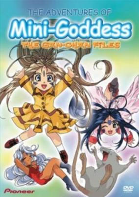

**Genres:** Magic, Deity, Present, Contemporary Fantasy, Super Deformed, Slapstick, Parody, Japan, Stereotypes, Action

> A large collection consisting of the adventures of the Goddesses featured in the anime and manga series Ah My Goddess. Parodies of other works, and a large number of jokes pervade this series of shorts in which the Goddesses torture and hang out with their friend Gan the rat.
>
> _Synopsis source: Kitsu_

[Wikipedia](https://en.wikipedia.org/wiki/Oh_My_Goddess!#The_Adventures_of_Mini-Goddess) · [Kitsu](https://kitsu.io/anime/aa-megami-sama-chichaitte-koto-wa-benri-da-ne)

---

### All Purpose Cultural Cat Girl Nuku Nuku (All Purpose Cultural Cat Girl Nuku Nuku TV)

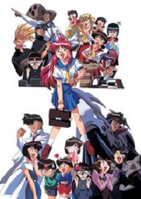

**Genres:** Android, High School, Future, Earth, Mecha, Slapstick, Japan, Stereotypes, Asia, Action

> Each episode centers on Nuku Nuku's adventures and mishaps in high school, and her relationship to students, the overall series plot centers on the evil Mishima Industries' scheme to dominate the world through its products. In opposition to this plan are the slightly nutty Kyuusaku Natsume and Nuku Nuku, the android who acts as a companion to his young son. Nuku Nuku's classmates are all eccentrics, Futaba, the class president, is a domineering control-freak, who cannot leave her authority in school. Chieko Shirakaba is the rich snob with the two yes-girls who always take her side. There is a bookworm, a mystic, a scientist, and a pop singer. All of these are true to their descriptions: the mystic is always foretelling doom via tarot cards, spirits, or some other occult technique. The pop singer never says anything except as a song. The bookworm always has her nose in a book. These eccentricities add to the series' humor.
>
> _Synopsis source: Kitsu_

[Wikipedia](https://en.wikipedia.org/wiki/All_Purpose_Cultural_Cat_Girl_Nuku_Nuku#Anime) · [Kitsu](https://kitsu.io/anime/bannou-bunka-neko-musume-1998)

---

### Beast Wars II: Lio Convoy's Close Call!

---

### Bomberman B-Daman Bakugaiden (Bomber Man & Marbleman's Explosive Side Story)

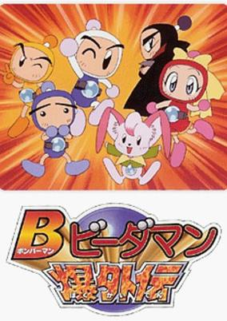

**Genres:** Comedy, Science Fiction

> * Based on the Hudson Soft game. 1000 years ago, the beautiful B-da City was attacked by the Dark B-da in their quest to control the entire Blue Solar System. The heroic B-Daman, drawing on their legendary power and ingenious technology, were able to restore peace to the universe. But, it is only a matter of time before evil forces strike again…Our hero, SHIRO BOM with his friends continue to patrol the Kingdom, fight against Dark B-da, always alert to danger, always ready for fun.
>
> _Synopsis source: Kitsu_

[Wikipedia](https://en.wikipedia.org/wiki/Bomberman_B-Daman_Bakugaiden) · [Kitsu](https://kitsu.io/anime/bomberman-b-daman-bakugaiden)

---

### Brain Powered

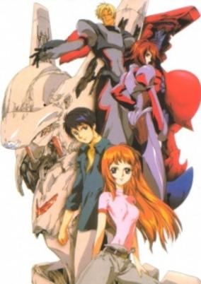

**Genres:** Science Fiction, Mecha, Contemporary Fantasy, Post Apocalypse, Action, Asia, Earth, Piloted Robot, Alien, Future, Stereotypes, Plot Continuity, Military, Adventure

> In the not so distant future much of the earth has been submerged under the sea or destroyed by earthquakes. At the center of the turmoil is the mysterious Orphan. Orphan may or may not be the original cause of the cataclysms. Orphan`s goal is to raise a ship hidden deep beneath the sea to the surface, but doing so would result in the destruction of all humans except for the small number which are loyal to Orphan. Orphan`s agents pilot mysterious mecha known as Grand Cheres, and search the world for mysterious, giant disks which occasionally appear, flying at high speeds and wrecking much of the countryside, or cities, when they hit the ground. After a dying disc almost kills Hime, a Brain Powerd is born from the disc. Brain Powerds are another type of Mecha, similar to but not the same as Grand Cheres. Hime becomes the Brain Powerd`s pilot, forming a symbiotic relationship with the living mecha and joins an International Organization dedicated to stopping Orphan, or at the very least saving humanity should Orphan succeed.
>
> _Synopsis source: Kitsu_

[Wikipedia](https://en.wikipedia.org/wiki/Brain_Powerd#Anime) · [Kitsu](https://kitsu.io/anime/brain-powerd)

---

### Burn-Up Excess (Burn Up Excess)

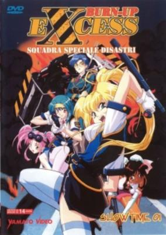

**Genres:** Ecchi, Japan, Action, Asia, Violent Retribution For Accidental Infringement, Special Squads, Gunfights, Law And Order, Present, Cops, Science Fiction, Adventure, Comedy

> Follows the exploits of Team Warrior, a special anti-terror wing of the Neo-Tokyo Police force. Team Warrior is comprised of the habitually broke Rio, gun-crazy Maya, computer specialist Lillica, tech-expert Nanvel, piliot/voyeur Yuji, and is led by the enigmatic Maki. The team faces a number of missions, ranging from bodyguard duty, breaking up robbery and arms rackets, and providing security for a very powerful tank. Rio and company continually thwart the terrorist aims of Ruby, an operative for a shadowy cabal of powerful men. Before the final showdown, the circumstances behind the formation of Team Warrior, how the precocious Rio came to join it, and Maki's painful past will be revealed.
>
> _Synopsis source: Kitsu_

[Wikipedia](https://en.wikipedia.org/wiki/Burn-Up_Excess#Episode_list) · [Kitsu](https://kitsu.io/anime/burn-up-excess)

---

### Blue Submarine No. 6

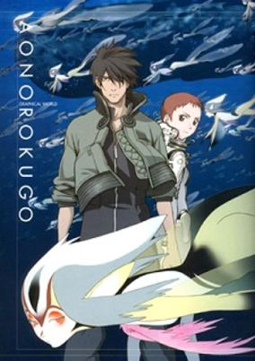

**Genres:** Science Fiction, Post Apocalypse, Genetic Modification, Action, Earth, Human Enhancement, Navy, Future, Military, Mecha, Adventure

> The once famous and well respected scientist Zorndyke has bred a new genre of living being, one that thrives on the oceans and lives to destroy humans. Zorndyke believes it is time that the humans were relieved of their rule of the earth. It is up to Blue Submarine No. 6 and the rest of the Blue fleet to put an end to Zorndyke's madness and creations.
>
> _Synopsis source: Kitsu_

[Wikipedia](https://en.wikipedia.org/wiki/Blue_Submarine_No._6#OVA) · [Kitsu](https://kitsu.io/anime/ao-no-6-gou)

---

### Bubblegum Crisis Tokyo 2040 (Bubblegum Crisis: Tokyo 2040)

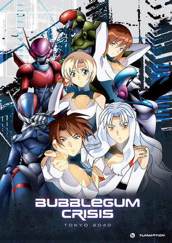

**Genres:** Power Suit, Science Fiction, Mecha, Japan, Action, Asia, Earth, Special Squads, Tokyo, Disaster, Plot Continuity, Adventure

> After a mysterious eathquake levels Tokyo, Genom becomes a powerful influence providing their artificial organic lifeforms called Boomers to rebuild and act as a labor class to humanity. However, some of them ocasionally run amok, and even the specially created AD Police are at a loss to stop them. Lina Yamazaki travels to Tokyo for employment but also hopes to join a vigilante force called the Knight Sabers, who pilot powered suits to destroy these rogue Boomers.
>
> _Synopsis source: Kitsu_

[Wikipedia](https://en.wikipedia.org/wiki/Bubblegum_Crisis_Tokyo_2040) · [Kitsu](https://kitsu.io/anime/bubblegum-crisis-tokyo-2040)

---

### Cardcaptor Sakura

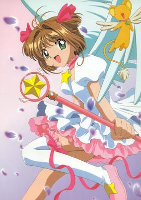

**Genres:** Present, Magical Girl, Japan, Earth, Plot Continuity, Sudden Girlfriend Appearance, Love Polygon, Asia, Coming Of Age, Fantasy, Contemporary Fantasy, Magic, Action, Romance, Super Power, Adventure, Comedy, School Life, Shoujo

> Sakura Kinomoto is your garden-variety ten-year-old fourth grader, until one day, she stumbles upon a mysterious book containing a set of cards. Unfortunately, she has little time to divine what the cards mean because she accidentally stirs up a magical gust of wind and unintentionally scatters the cards all over the world. Suddenly awakened from the book, the Beast of the Seal, Keroberos (nicknamed Kero-chan), tells Sakura that she has released the mystical Clow Cards created by the sorcerer Clow Reed. The Cards are no ordinary playthings. Each of them possesses incredible powers, and because they like acting independently, Clow sealed all the Cards within a book. Now that the Cards are set free, they pose a grave danger upon the world, and it is up to Sakura to prevent the Cards from causing a catastrophe! Appointing Sakura the title of "the Cardcaptor" and granting her the Sealed Key, Keroberos tasks her with finding and recapturing all the Cards. Alongside her best friend Tomoyo Daidouji, and with Kero-chan's guidance, Sakura must learn to balance her new secret duty with the everyday troubles of a young girl involving love, family, and school, all while she takes flight on her magical adventures as Sakura the Cardcaptor. [Written by MAL Rewrite]
>
> _Synopsis source: Kitsu_

[Wikipedia](https://en.wikipedia.org/wiki/Cardcaptor_Sakura#Anime) · [Kitsu](https://kitsu.io/anime/cardcaptor-sakura)

---

### Case Closed: The Fourteenth Target

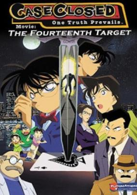

**Genres:** Earth, Japan, Asia, Elementary School, Detective, Law And Order, Present, Cops, Adventure, Comedy, Mystery

> A mysterious attacker has appeared and is assaulting people whose names contain a number from the standard deck of cards in descending order. When Conan points out that all the victims are related to the now famous detective Kogorou Mouri, suspicion immediately falls upon the recently released convict Jou Murakami, as Kogorou was the one responsible for his arrest ten years prior. With potential victims still at risk, Conan and the police are determined to catch the culprit. As the case gradually unfolds, both Conan and his friend Ran Mouri learn more about her parents' separation and the truth on what transpired a decade ago. [Written by MAL Rewrite]
>
> _Synopsis source: Kitsu_

[Kitsu](https://kitsu.io/anime/detective-conan-movie-02-the-fourteenth-target)

---

### Cowboy Bebop

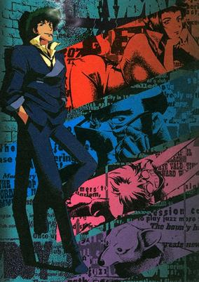

**Genres:** Science Fiction, Space, Drama, Action, Space Travel, Post Apocalypse, Other Planet, Future, Shipboard, Detective, Bounty Hunter, Gunfights, Adventure, Comedy

> In the year 2071, humanity has colonized several of the planets and moons of the solar system leaving the now uninhabitable surface of planet Earth behind. The Inter Solar System Police attempts to keep peace in the galaxy, aided in part by outlaw bounty hunters, referred to as "Cowboys". The ragtag team aboard the spaceship Bebop are two such individuals. Mellow and carefree Spike Spiegel is balanced by his boisterous, pragmatic partner Jet Black as the pair makes a living chasing bounties and collecting rewards. Thrown off course by the addition of new members that they meet in their travels—Ein, a genetically engineered, highly intelligent Welsh Corgi; femme fatale Faye Valentine, an enigmatic trickster with memory loss; and the strange computer whiz kid Edward Wong—the crew embarks on thrilling adventures that unravel each member's dark and mysterious past little by little. Well-balanced with high density action and light-hearted comedy, Cowboy Bebop is a space Western classic and an homage to the smooth and improvised music it is named after.
>
> _Synopsis source: Kitsu_

[Wikipedia](https://en.wikipedia.org/wiki/Cowboy_Bebop) · [Kitsu](https://kitsu.io/anime/cowboy-bebop)

---

### Crayon Shin-chan: Blitzkrieg! Pig's Hoof's Secret Mission

---

### Cyber Team in Akihabara

[Wikipedia](https://en.wikipedia.org/wiki/Cyber_Team_in_Akihabara)

---

### Devil Lady (The Devil Lady)

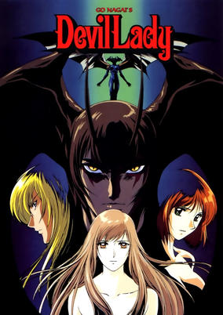

**Genres:** Super Power, Present, Human Enhancement, Dark Fantasy, Japan, Violence, Plot Continuity, Action, Fantasy, Horror

> Fudo Jun is a beautiful supermodel who is idolized by many. She also has a dark secret that not even she knows about at first, for within her veins run the genes that hold the next step in the evolution of mankind. The same blood as the beastlike superhumans that terrorize the city. Unlike the rest of them, though, Jun has managed to hold a tenuous grip onto her humanity, and she is recruited by the mysterious Asuka Ran, member of a secret organization within the government, aimed at controlling, if not eliminating, these berserk destroyers of mankind. Jun, as Devilman Lady, must now exterminate her own kind, but how much longer can she keep her sanity in a situation she never chose in the first place?
>
> _Synopsis source: Kitsu_

[Wikipedia](https://en.wikipedia.org/wiki/Devil_Lady#Anime) · [Kitsu](https://kitsu.io/anime/devilman-lady)

---

### Doraemon: Nobita's Great Adventure in the South Seas (Doraemon the Movie: Nobita's Great Adventure in the South Seas)

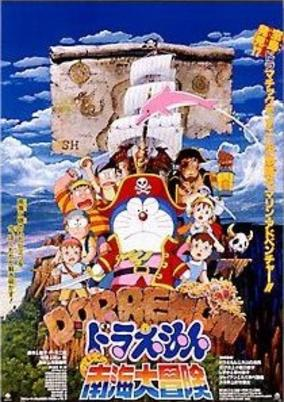

**Genres:** Comedy, Science Fiction, Fantasy, Adventure, Kids

> Finding a treasure is always been so hard! But, nothing is ever impossible for Doraemon and his magic tool. And so, with the help of Doraemon, Nobita and the rest of the gang set sail on a ship to find treasure on an islands. However on their way to the island, the ships have almost been destroyed and resulting Nobita to stray on an island with a young pirate while Doraemon and the rest of the gang somehow involved in a war between pirates.And so, their adventure begins...
>
> _Synopsis source: Kitsu_

[Kitsu](https://kitsu.io/anime/doraemon-nobita-s-south-sea-adventure)

---

### El-Hazard: The Alternative World

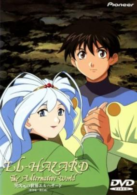

**Genres:** Ecchi, Fantasy, Romance, Action, Comedy, Adventure

> Miz plans to retire as a Great Priestess of Water to married life with her darling Fujisawa and as replacement the young Qawoor Towles arrives to Floristica. Jinnai sees Qawoor's initiation ceremony as a chance to infiltrate Makoto's laboratory but accidentally activates a mysterious thingy that sends them all through the dimensions to a grey industrial city protected by a huge castle in an alternative world.
>
> _Synopsis source: Kitsu_

[Kitsu](https://kitsu.io/anime/el-hazard-the-alternative-world)

---

### Fake

**Genres:** Shounen Ai, Action, Comedy, Romance, Cops, Detective, Mystery

> Dee Laytner and Randy "Ryo" Maclane are two New York cops taking a needed vacation in England. Dee has very strong feelings for Ryo and wants to take this chance to advance their relationship (and if he's lucky, maybe seduce Ryo). Ryo doesn't understand his own feelings for Dee, and doesn't know if he wants to (or should) acknowledge them. Their vacation and relationship is suddenly disturbed when murders and missing person reports keep surfacing around their hotel. The only common tie the cases have is that all of the victims were Japanese or Japanese descent. Dee and Ryo have to solve the case before Ryo, who is half Japanese, becomes the next victim.
>
> _Synopsis source: Kitsu_

[Wikipedia](https://en.wikipedia.org/wiki/Fake_(manga)#Anime) · [Kitsu](https://kitsu.io/anime/fake)

---

### Fire Force DNAsights 999.9

---

### Flint the Time Detective

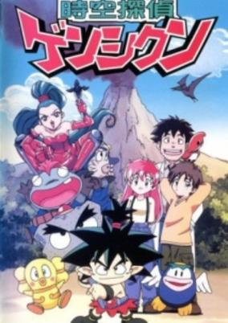

**Genres:** Science Fiction, Fantasy, Japan, Adventure, Action, Comedy, Time Travel, Future, Mystery

> It is the 25th century. The dark lord has 'infected' history with time-devices that could damage history beyond repair. Flint and his father lived in the prehistorics when they got turned into fossiles. They are discovered and Flint ges turned back to his original state. With the help of his father, a boy Tony and a girl Sara he has to travel trough time to bring the time-devices back to the land of time so history will be saved.
>
> _Synopsis source: Kitsu_

[Wikipedia](https://en.wikipedia.org/wiki/Flint_the_Time_Detective) · [Kitsu](https://kitsu.io/anime/flint-the-time-detective)

---

### Galaxy Express 999: Eternal Fantasy

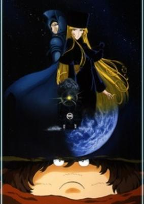

**Genres:** Gunfights, Space, Space Travel, Other Planet, Shipboard, Action, Science Fiction

> Based on the story by manga master Leiji Matsumoto (The Cockpit, Queen Emeraldas), the 55 minute featurette picks up one year after the events of Galaxy Express 999 in which a young boy named Tetsuro and his motherly companion Maetel worked to rid the universe on the Mechanized Empire who had taken over Earth.
>
> _Synopsis source: Kitsu_

[Wikipedia](https://en.wikipedia.org/wiki/Galaxy_Express_999#Publication_history) · [Kitsu](https://kitsu.io/anime/ginga-tetsudou-999-eternal-fantasy)

---

### Gasaraki

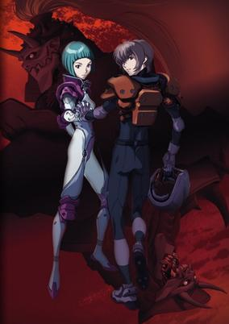

**Genres:** Science Fiction, Mecha, Earth, Action, Asia, Piloted Robot, Plot Continuity, Military, Psychological

> The flames of war explode in the Middle East as two shadow forces unleash monstrous new weapons of mass destruction! But in a world in which giant robots are real, the most dangerous weapon of all lies buried within a human mind. Yushiro, the fourth son of the mysterious and powerful Gowa family, finds himself at the center of events that will change the future of mankind forever! Nothing can prepare the human race for what is about to be unleashed in Gasaraki!
>
> _Synopsis source: Kitsu_

[Wikipedia](https://en.wikipedia.org/wiki/Gasaraki#Anime) · [Kitsu](https://kitsu.io/anime/gasaraki)

---

### Geobreeders: File-X – Get Back the Kitty (Geobreeders: (File-X) Get Back The Kitty)

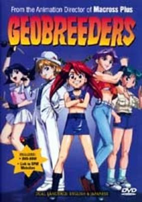

**Genres:** Ecchi, Japan, Action, Asia, Earth, Slice of Life, Comedy, Working Life, Conspiracy, Present, Adventure

> Taba and the Girls of Kagura Total Security Inc. specialize in jobs where their enemy are "Phantom Cats". They have a few run ins with the various Government agencies, as well as a gang of Phantom Cats; blowing up a lot of stuff along the way. When one of their own is kidnapped, they have to get her back.
>
> _Synopsis source: Kitsu_

[Wikipedia](https://en.wikipedia.org/wiki/Geobreeders#Original_video_animation) · [Kitsu](https://kitsu.io/anime/geobreeders-file-x-chibi-neko-dakkan)

---

### Golgo 13: Queen Bee

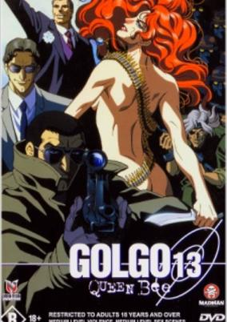

**Genres:** Gunfights, Alternative Present, Americas, Violence, Crime, Conspiracy, United States, Earth, Rotten World, Action, Drama, Adventure, Military

> Master assassin Golgo 13 is hired by the advisor of presidential candidate Robert Hardy to assassinate "Queen Bee," the beautiful and deadly leader of a South American guerilla army. Golgo, however, finds this job too easy and digs further information to find out the true connection between Hardy and Queen Bee.
>
> _Synopsis source: Kitsu_

[Kitsu](https://kitsu.io/anime/golgo-13-queen-bee)

---

### Gundam Wing: Endless Waltz -Special Edition- (Mobile Suit Gundam Wing: Endless Waltz)

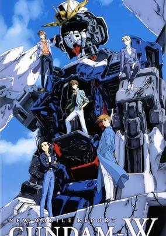

**Genres:** Science Fiction, Mecha, Action, Space Opera, Piloted Robot, War, Space, Military

> After Colony 196 - One year has passed since the war between Earth and its colonies ended. Heero, Duo, Trowa and Quatre bid farewell to their Gundams and jettison them to the sun. Relena Darlian is now the deputy minister of the Earth Sphere Unified Nation. But as the Gundam pilots are adjusting to the peace on Earth, Relena is kidnapped and a new threat appears, led by Marimeia Khushrenada - daughter of the late dictator Treize Khushrenada and heir to the Barton Foundation. To make matters more complicated, Gundam Nataku pilot Wufei has sided with this faction. The Gundam pilots must recover their mobile suits and once again engage in battle before Marimeia's forces succeed on their bid for global domination.
>
> _Synopsis source: Kitsu_

[Kitsu](https://kitsu.io/anime/mobile-suit-gundam-wing-endless-waltz)

---

### His and Her Circumstances

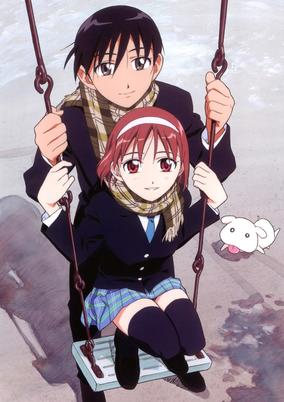

**Genres:** Romance, Japan, Earth, Asia, Comedy, High School, Slapstick, School Life, Plot Continuity, Present, Slice of Life

> Miyazawa Yukino is the perfect student. Kind, intelligent, pretty and modest, it's unbelievable that such a person could exist. Little did everyone know Yukino's perfection was just a facade. An act to fulfill her desire for praise and admiration. Her life took a turn however, as a newcomer to their school Arima Soichiro topped the exam rankings. Arima is more than just intelligent, he's also kind, handsome and modest, an unbelievable person who can actually exist. Even worse luck, Arima found out Yukino's secret, blackmailing her to help him out. Their odd relationship soon develops into friendship and eventually into love. But can their love prevail through the many problems that come their way?
>
> _Synopsis source: Kitsu_

[Wikipedia](https://en.wikipedia.org/wiki/Kare_Kano#Anime) · [Kitsu](https://kitsu.io/anime/kareshi-kanojo-no-jijou)

---

### If I See You in My Dreams

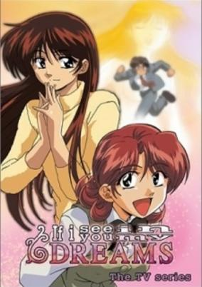

**Genres:** Ecchi, Comedy, Love Polygon, Romance, Japan, Present, Slice of Life

> Fuguno Matsuo has never had a girlfriend all his 24 years in life and what makes things worse is that a fortune teller predicted that he never will. However, when he laid his eye on Nagisa-sensei he fell in-love right away and began earnestly wooing her. Along comes Hamaoka, a co-worker who is smitten with Fuguno, and a love-triangle ensues.
>
> _Synopsis source: Kitsu_

[Wikipedia](https://en.wikipedia.org/wiki/If_I_See_You_in_My_Dreams#Original_video_animation) · [Kitsu](https://kitsu.io/anime/yume-de-aetara-tv)

---

### Initial D (Initial D First Stage)

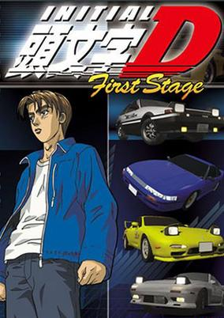

**Genres:** Earth, Drifting, Street Racing, Sports, Action, Japan, Asia, Plot Continuity, Present, Motorsport, Seinen

> Takumi Fujiwara is an aloof, spacey high-schooler who does delivery runs in his dad's Toyota AE86 in the dead of night. Despite working at a gas station and having friends who are car nuts, he doesn't know a single thing about cars. Takumi is introduced into the world of street racing and his natural talent draws attention from all across Gunma. Will Takumi face the challenges or back out from the call of the mountain passes?
>
> _Synopsis source: Kitsu_

[Wikipedia](https://en.wikipedia.org/wiki/Initial_D#Anime) · [Kitsu](https://kitsu.io/anime/initial-d-first-stage)

---

### Kite

[Wikipedia](https://en.wikipedia.org/wiki/Kite_(1998_film))

---

### Let's Go! Anpanman: The Palm of the Hand to the Sun

[Wikipedia](https://en.wikipedia.org/wiki/Anpanman#Full-length_movies)

---

### Lost Universe

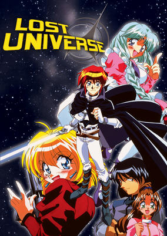

**Genres:** Science Fiction, Adventure, Action, Comedy, Shipboard, Future, Space

> Millie Nocturne has one great goal in life: to be the best in the universe - at absolutely everything! But when she tries her hand at being the "best detective," she ends up an unwilling partner with two people who will change her life forever: Kane Blueriver, the psi-blade-wielding master of the starship Swordbreaker, and Canal, the smart-mouthed holographic image of the ship's computer. Join this unlikely trio on their adventures as they hurtle through space facing off against intergalactic crime lords, rogue starships, and hijackers dressed as chickens... and that's just the tip of the asteroid!
>
> _Synopsis source: Kitsu_

[Wikipedia](https://en.wikipedia.org/wiki/Lost_Universe#Anime) · [Kitsu](https://kitsu.io/anime/lost-universe)

---

### Lupin III: Crisis in Tokyo (Lupin the Third: Crisis in Tokyo)

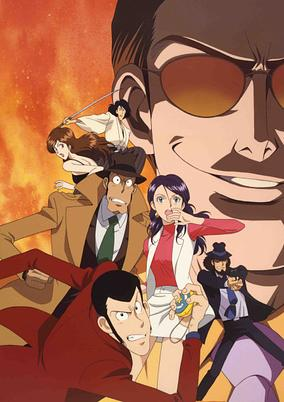

**Genres:** Gunfights, Present, Earth, Japan, Asia, Action, Adventure, Comedy, Crime, Thievery

> Master cat burglar Lupin the Third tries every trick in the book to intercept two old glass photographic plates from being delivered to a mysterious art dealer, named Mr. Suzuki. Lupin's plan misfires, and it doesn't help matters that Goemon and Jigen are suffering from...efficiency problems. And we can't forget the dogged Inspector Zenigata, who has a new tagalong in the Lupin chase: the beautiful young reporter Maria. But what is Maria's connection to the mysterious Mr. Suzuki?
>
> _Synopsis source: Kitsu_

[Wikipedia](https://en.wikipedia.org/wiki/List_of_Lupin_III_television_specials#10) · [Kitsu](https://kitsu.io/anime/lupin-iii-honou-no-kioku-tokyo-crisis)

---

### Master Keaton

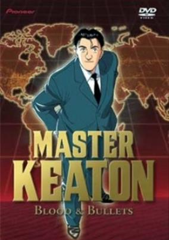

**Genres:** Adventure, France, United Kingdom, Russia, Earth, Europe, Detective, Law And Order, Japan, Present, Historical, Mystery

> Taichi Keaton is a half-British half-Japanese archeologist and SAS veteran of the Falklands War. He solves mysteries and investigates insurance fraud for Lloyd's around the world.
>
> _Synopsis source: Kitsu_

[Wikipedia](https://en.wikipedia.org/wiki/Master_Keaton#Anime) · [Kitsu](https://kitsu.io/anime/master-keaton)

---

### MAZE ☆ The Mega-Burst Space: The Giant of Temporary Threat (Maze: The Mega-Burst Space)

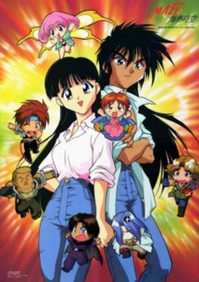

**Genres:** Mecha, Fantasy, Fantasy World, Ecchi, Adventure, Action, Comedy, War, Slapstick, Parallel Universe, Plot Continuity, Isekai

> Maze wakes up in her house, everything is a wreck and she has amnesia. Before she can gather what has happened the girl Mill storms into her house thanking her for having saved her life. She tells Maze that her house suddenly fell down from the sky and crushed Mills pursuers under it. However before long they are both on the run from further pursuers who want their hands on princess Mill. They are only saved when Maze discovers that she has phantom light magical powers and can summon Mills family heirloom mecha. However her performance with the mecha is weak; that is until the sun goes down and she is turned in to a lecherous man. Soon other travellers join them as Maze tries to protect Mill and figure out what she is doing in this fantasy world.
>
> _Synopsis source: Kitsu_

[Kitsu](https://kitsu.io/anime/maze-bakunetsu-jikuu-tv)

---

### Mobile Suit Gundam: The 08th MS Team – Miller's Report

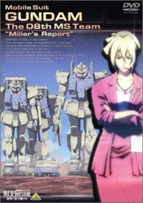

**Genres:** Action, War, Mecha, Science Fiction, Romance, Military

> Shortly after being rescued off the Himalayas, Federation Ensign Shiro Amada is accused of espionage due to his encounter with Zeon's top-secret mobile armor. Intelligence officer Alice Miller is assigned to investigate on Shiro's whereabouts during his disappearance. Her documented findings will determine whether or not Shiro is a traitor, and what his fate will be as commander of the 08th MS Team.
>
> _Synopsis source: Kitsu_

[Kitsu](https://kitsu.io/anime/mobile-suit-gundam-the-08th-ms-team-miller-s-report)

---

### Neo Ranga

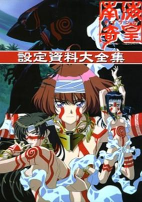

**Genres:** Mecha, Satire, Japan, Earth, Asia, Piloted Robot, Slice of Life, Tokyo, Horror, Alternative Present, Plot Continuity, Violence, Present, Adventure

> An ancient God called Ranga awakens on an isolated island in the South Pacific where it has been slumbering forgotten by mankind. Three sisters living in Tokyo—Minami, Ushio, and Yuuhi Shimabara—discover they have inherited this Island Kingdom, along with the huge God. When Ranga shows up in Tokyo, it soon becomes a source of wonder and conflict for the three sisters that control Ranga, the people who want to destroy it, and ones who want to use it.
>
> _Synopsis source: Kitsu_

[Wikipedia](https://en.wikipedia.org/wiki/Neo_Ranga) · [Kitsu](https://kitsu.io/anime/neo-ranga)

---

### Nightwalker: The Midnight Detective

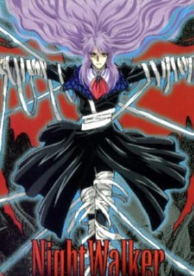

**Genres:** Vampire, Contemporary Fantasy, Action, Angst, Dark Fantasy, Drama, Law And Order, Violence, Present, Horror, Comedy, Mystery

> Shido Tatsuhiko is not only a private eye... he is also a vampire with no real memory of his past. Joined by Yayoi Matsunaga, a female government agent, Riho Yamazaki, an orphaned teenage girl working as his girl Friday and Guni, a little green imp, Shido must face demonic creatures known as Nightbreed. Meanwhile, Cain, the vampire who made him what he is now, is seeking him...
>
> _Synopsis source: Kitsu_

[Kitsu](https://kitsu.io/anime/night-walker-mayonaka-no-tantei)

---

### Ninja Resurrection

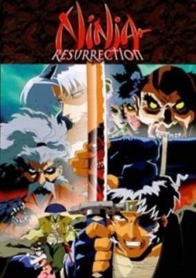

**Genres:** Ninja, Action, Martial Arts, Violence, Samurai, Historical

> Get ready for a nightmarish journey through faith and betrayal as the infamous Jubei Yagyu wields his deadly blades against the forces of good and evil alike. In an orgy of unbelievable savagery, the armies of the Shogun give no quarter as they ruthlessly slaughter their enemies. Trapped on the rocky isthmus of Amakusa, the faithful await divine aid as the demon stirs in their midst. Desperate for vengeance, a Child of Heaven becomes the emissary of Hell. Tortured by visions of Amakusa's final hour, legendary swordsman Jubei Yagyu returns to his ancestral home seeking respite from the bloody duties of a feudal retainer. Life in the village of Yagyu possesses a serenity ill-befitting days of armed rebellion and unholy alliance. For Jubei the tranquility is far too transparent, and soon, chilling rumors reach him. Four dead heroes renew their claim to life, feeding on the fear and violence of the age. Forced to take up the sword once more, Jubei returns to the path of vengeance and damnation in Ninja Resurrection!
>
> _Synopsis source: Kitsu_

[Wikipedia](https://en.wikipedia.org/wiki/Ninja_Resurrection) · [Kitsu](https://kitsu.io/anime/ninja-resurrection)

---

### Outlaw Star

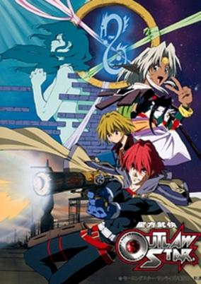

**Genres:** Science Fiction, Space Opera, Gunfights, Bounty Hunter, Crime, Shipboard, Alien, Future, Plot Continuity, Space, Action, Adventure, Comedy

> Gene Starwind has always dreamed of piloting his own ship out into the vast sea of stars. Unfortunately, not all dreams come true, as he spends his days working odd jobs alongside his partner, James Hawking, on the small planet Sentinel III instead. However, this all takes a turn when the duo takes on a job from Rachel Sweet who, unbeknownst to them, is actually a treasure-hunting outlaw. Tasked with protecting a mysterious girl known as Melfina, the meeting irrevocably changes the pair's lives as they are sent out into the great unknown aboard the highly advanced ship, Outlaw Star.Seihou Bukyou Outlaw Star follows Gene and his ragtag crew as they brave the final frontier, navigating the stars in search of answers to the mysteries surrounding Melfina. Encountering dangerous bounty hunters, space pirates, Taoist mages, and even catgirls, there is sure to be an exhilarating adventure around every corner. [Written by MAL Rewrite]
>
> _Synopsis source: Kitsu_

[Wikipedia](https://en.wikipedia.org/wiki/Outlaw_Star#Anime) · [Kitsu](https://kitsu.io/anime/outlaw-star)

---

### Pokémon: The First Movie

---

### Record of Lodoss War: Chronicles of the Heroic Knight

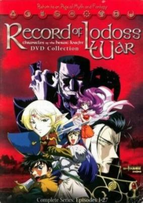

**Genres:** Magic, Dragon, Swordplay, Fantasy World, High Fantasy, Action, Fantasy, Adventure, Romance

> Five years after the death of the Emperor of Marmo in the War of Heroes, Parn is now the Free Knight of Lodoss, he and his old allies now famous through the land. However, the Emperor's right-hand man, Ashram, seeks the scepter of domination to re-unify Lodoss under his former leader's banner. Meanwhile, beyond his attempts at conquest lies a more sinister force beginning to set the stage for the resurrection of the goddess of death and destruction...
>
> _Synopsis source: Kitsu_

[Wikipedia](https://en.wikipedia.org/wiki/Record_of_Lodoss_War#Anime) · [Kitsu](https://kitsu.io/anime/lodoss-tou-senki-eiyuu-kishi-den)

---

### Serial Experiments Lain

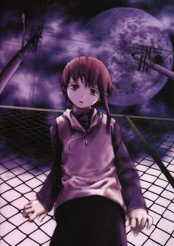

**Genres:** Asia, Present, Japan, Earth, Science Fiction, Cyberpunk, Angst, Plot Continuity, Virtual Reality, Psychological, Mystery, Dementia

> Lain Iwakura, an awkward and introverted fourteen-year-old, is one of the many girls from her school to receive a disturbing email from her classmate Chisa Yomoda—the very same Chisa who recently committed suicide. Lain has neither the desire nor the experience to handle even basic technology; yet, when the technophobe opens the email, it leads her straight into the Wired, a virtual world of communication networks similar to what we know as the internet. Lain's life is turned upside down as she begins to encounter cryptic mysteries one after another. Strange men called the Men in Black begin to appear wherever she goes, asking her questions and somehow knowing more about her than even she herself knows. With the boundaries between reality and cyberspace rapidly blurring, Lain is plunged into more surreal and bizarre events where identity, consciousness, and perception are concepts that take on new meanings. Written by Chiaki J. Konaka, whose other works include Texhnolyze, Serial Experiments Lain is a psychological avant-garde mystery series that follows Lain as she makes crucial choices that will affect both the real world and the Wired. In closing one world and opening another, only Lain will realize the significance of their presence. [Written by MAL Rewrite]
>
> _Synopsis source: Kitsu_

[Wikipedia](https://en.wikipedia.org/wiki/Serial_Experiments_Lain) · [Kitsu](https://kitsu.io/anime/serial-experiments-lain)

---

### Shadow Skill -Eigi-

[Wikipedia](https://en.wikipedia.org/wiki/Shadow_Skill#TV_series)

---

### Silent Möbius

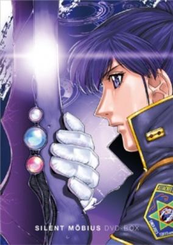

**Genres:** Post Apocalypse, Contemporary Fantasy, Romance, Earth, Science Fiction, Fantasy, Japan, Action, Special Squads, Human Enhancement, Cyborg, Magic, Horror, War, Future, Law And Order, Demon, Comedy

> The year is 2023 and Alien Beings known as "Lucifer Hawks" have begun invading earth from another dimension. All that stands between them and the enslavement of the human race is the Attacked Mystification Police Department - a special division of the Tokyo Police staffed by women with amazing paranormal abilities.
>
> _Synopsis source: Kitsu_

[Wikipedia](https://en.wikipedia.org/wiki/Silent_M%C3%B6bius#TV_series) · [Kitsu](https://kitsu.io/anime/silent-mobius)

---

### Slayers Gorgeous

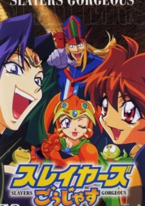

**Genres:** Fantasy World, Action, Fantasy, Comedy, Magic, Super Power, Adventure

> Sorceresses Lina Inverse and Naga the Serpent are enjoying a meal in a villiage when the residents suddenly retreat indoors and two armies - one of men and one of a young girl and a tribe of dragons. Although the ruler of the town originally tries to convince Lina that this is because of a dark legacy, in truth the dragon army is led by his daughter and their battles are over her allowance. Lina agrees to help the ruler while Naga joins his daughter, Marlene.
>
> _Synopsis source: Kitsu_

[Wikipedia](https://en.wikipedia.org/wiki/Slayers_Gorgeous) · [Kitsu](https://kitsu.io/anime/slayers-gorgeous)

---

### Spriggan

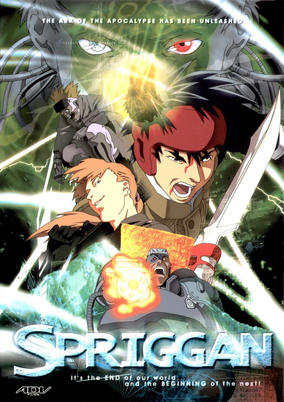

**Genres:** Power Suit, Science Fiction, Mecha, Middle East, Earth, Action, Asia, Gunfights, Cyborg, Violence, Present, Super Power, Adventure, Military

> Deep in the Ararat Mountains of Turkey, a secret organization known as ARCAM has found what is believed to be Noah's Ark. However, the U.S. Machine Corps., a rogue organization of the Pentagon, wants to take over the Ark as a means of global supremacy. Only a special ARCAM operative known as a Spriggan stands in their way. Japanese Spriggan Yu Ominae teams up with French Spriggan Jean-Jacques Mondo to combat members of the U.S. Machine Corps. led by Col. MacDougall—a genetically-enhanced boy with deadly psionic powers. However, they must act fast and stop MacDougall before he uses the Ark for his own agenda.
>
> _Synopsis source: Kitsu_

[Wikipedia](https://en.wikipedia.org/wiki/Spriggan_(movie)) · [Kitsu](https://kitsu.io/anime/spriggan)

---

### Steam Detectives

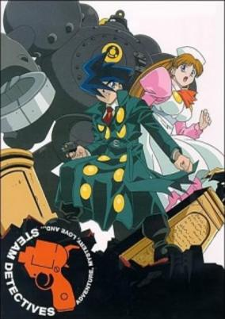

**Genres:** Mecha, Steampunk, Detective, Action, Cops, Mystery

> The scene is Steam City, a London-ish city which represents an entire civilization run by coal and steam power. Because of steam, the city is sometimes covered in a mist. Villains take advantage of the steamy mist to hide and execute their evil plans. Only a few dare venture into what's beyond the steamy mist. They are known as the Steam Detectives: Narutaki (and his convertible all-purpose pistol), his nurse-assistant Lingling, and his Megamaton robot Gohliki.
>
> _Synopsis source: Kitsu_

[Wikipedia](https://en.wikipedia.org/wiki/Steam_Detectives) · [Kitsu](https://kitsu.io/anime/steam-detectives)

---

### Super Milk Chan (Super Milk-Chan)

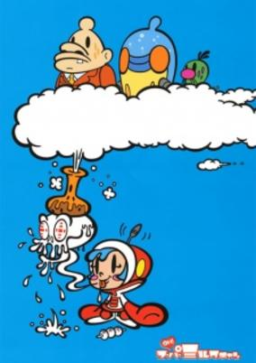

**Genres:** Action, Parody, Comedy, Slapstick, Alternative Present, Present, Science Fiction

> Milk-chan is a girl who lives in a house stuck on the side of a building with her two sidekicks: Tetsu-ko, a paranoid robot that looks like a bottle and Hanage, a green blob with a mustache. Milk is poor and she can't pay the rent, especially after her attempt to extort a local ant family fails. However, she is saved because the president himself offers her a job (some sort of a secret mission). Milk-chan answers the phone to receive missions from The President by saying something like "Hello, Bank of Hokkaido. Just kidding!" After getting her mission, Milk-chan and her sidekicks take off aboard the "Milk-6" helicopter to go on her mission. Did I tell you this is a spoof of 1970s spy thrillers or some sort of Bond movies?
>
> _Synopsis source: Kitsu_

[Wikipedia](https://en.wikipedia.org/wiki/Super_Milk_Chan) · [Kitsu](https://kitsu.io/anime/super-milk-chan)

---

### Tora-san's Forget Me Not

---

### Touch: Miss Lonely Yesterday

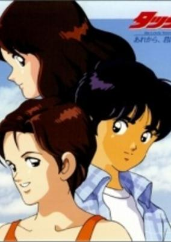

**Genres:** Romance, Japan, Asia, Earth, Love Polygon, School Life, Present, Sports

> Unsure of Tatsuya's feelings, Minami ponders.
>
> _Synopsis source: Kitsu_

[Kitsu](https://kitsu.io/anime/touch-are-kara-kimi-wa-miss-lonely-yesterday)

---

### Trigun

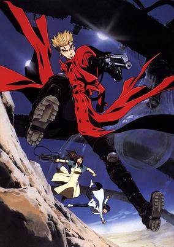

**Genres:** Desert, Science Fiction, Post Apocalypse, Action, Comedy, Gunfights, Angst, Other Planet, Humanoid Alien, Alien, Drama, Future, Slapstick, Law And Order, Violence, Space, Shounen

> Vash the Stampede is the man with a $$60,000,000 bounty on his head. The reason: he's a merciless villain who lays waste to all those that oppose him and flattens entire cities for fun, garnering him the title "The Humanoid Typhoon." He leaves a trail of death and destruction wherever he goes, and anyone can count themselves dead if they so much as make eye contact—or so the rumors say. In actuality, Vash is a huge softie who claims to have never taken a life and avoids violence at all costs. With his crazy doughnut obsession and buffoonish attitude in tow, Vash traverses the wasteland of the planet Gunsmoke, all the while followed by two insurance agents, Meryl Stryfe and Milly Thompson, who attempt to minimize his impact on the public. But soon, their misadventures evolve into life-or-death situations as a group of legendary assassins are summoned to bring about suffering to the trio. Vash's agonizing past will be unraveled and his morality and principles pushed to the breaking point. [Written by MAL Rewrite]
>
> _Synopsis source: Kitsu_

[Wikipedia](https://en.wikipedia.org/wiki/Trigun#1998_series) · [Kitsu](https://kitsu.io/anime/trigun)

---

### Very Private Lesson

**Genres:** Earth, Ecchi, Delinquent, Female Student, Romance, Japan, Comedy, Asia, Present

> Oraku is a lucky man. He has a comfortable job teaching at a local High School. He has Satsuki, a fellow teacher whom he hopes to marry someday. He has Aya, a beautiful student who has fallen in love with him. He has Aya's father, a wealthy man who wants so much for his little girl to be happy that he has sent her to live with Oraku. Oraku is a very lucky man. Of course Aya loves nothing more than to come on to Oraku by lounging around his apartment half naked. Unfortunately for Oraku, Aya's father happens to be wealthy because he is a major crime boss, and he will have Oraku slowly murdered if Aya doesn't remain absolutely pure. Now Oraku must not only restrain himself, but also protect Aya from the hordes of men and woman at school who'd love to get their hands on her body. And of course, if Satsuki or any of the other teachers find out that Oraku is living with one of his students, he will be permanently dismissed from the teaching profession! Oh yes Oraku is lucky...
>
> _Synopsis source: Kitsu_

[Kitsu](https://kitsu.io/anime/kyoukasho-ni-nai)

---

### Yu-Gi-Oh!

**Genres:** Card Games, Proxy Battles, Fantasy, Adventure, Comedy, Friendship, Science Fiction, Shounen

> "Blue Eyes White Dragon will bring victory" while "Red Eyes Black Dragon will bring the potential of victory". A shy duelist stumbles upon the legendary Red Eyes Black Dragon, with that card in his possession, he must learn to bring out his confidence to duel.
>
> _Synopsis source: Kitsu_

[Wikipedia](https://en.wikipedia.org/wiki/Yu-Gi-Oh!_(1998_TV_series)) · [Kitsu](https://kitsu.io/anime/yu-gi-oh-1999)

---

### Kouin Tenshi: Haitoku no Lycéenne

---

### Yokohama Kaidashi Kikou

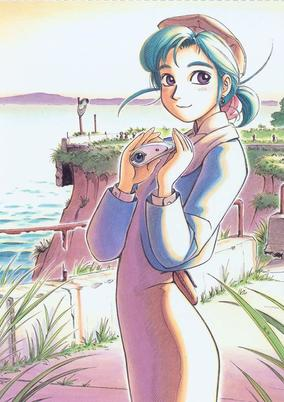

**Genres:** Science Fiction, Japan, Asia, Earth, Slice of Life, Future, Countryside

> This is not so much a story as it is a slice of life. Or rather, it is a look into portions of the life of a girl named Alpha, together with the people around her. Alpha runs a little cafe on the outskirts of Yokohama. There are almost no customers, but Alpha does not mind at all since she has the occasional company of the old man who runs the gasoline stand down the road, as well as that of his grandson Takahiro. This is a Yokohama of the future, when the sea covers most of the land and roads have disappeared under sand or water. Alpha is in fact a robot, looking after the cafe during her owner's indefinite leave of absence.
>
> _Synopsis source: Kitsu_

[Wikipedia](https://en.wikipedia.org/wiki/Yokohama_Kaidashi_Kikou) · [Kitsu](https://kitsu.io/anime/yokohama-kaidashi-kikou)

---
