# 1999 in Anime

[← Back to index](../README.md)

79 titles · 66 with a matched synopsis/cover art · [source](https://en.wikipedia.org/wiki/1999_in_anime)

## Releases

### Trouble Chocolate

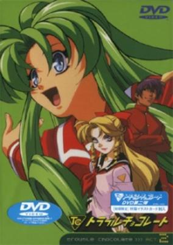

**Studio:** AIC , ROBOT , Hakusensha , Step Visual Corporation &nbsp;|&nbsp; **Aired/Released:** October 8 &nbsp;|&nbsp; **Genres:** Fantasy, Romance, Comedy, Magic, School Life, Science Fiction

> Cacao, a student at Micro Grand Academy, wakes up one morning to find a girl made of wood sleeping in bed with him. She is Hinano, a tree spirit who possessed the body of a wooden puppet after Cacao messed up his magic teacher's spell. Having taken an instant liking to Cacao, Hinano enrolls in his school. Between Hinano, monsters, two strange twins and their four-eyed cat master, a demon boy, odd teachers and students, and the fact that he may have the potential to be one of the greatest magic users of all time, Cacao's life seems to have taken several turns for the worse...and the weird.
>
> _Synopsis source: Kitsu_

[Wikipedia](https://en.wikipedia.org/wiki/Trouble_Chocolate) · [Kitsu](https://kitsu.io/anime/trouble-chocolate)

---

### Ten Tokyo Warriors

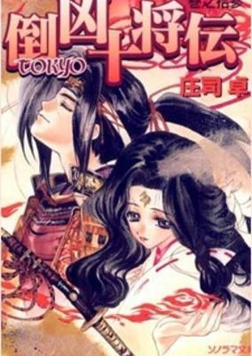

**Aired/Released:** July 23 &nbsp;|&nbsp; **Genres:** Japan, Action, Plot Continuity, Super Power, Adventure, Friendship

> Long ago, in feudal Japan, there was a fierce warrior named the Demon King. He controlled a band of demons, known as the Kyouma. Only the powers of ten warriors sealed the Demon King away and kept the Kyouma under control. But now, Lord Shindigan, a powerful Kyouma is planning to free the Demon King, and the reincarnations of the ten warriors must band together and save the earth.
>
> _Synopsis source: Kitsu_

[Wikipedia](https://en.wikipedia.org/wiki/Ten_Tokyo_Warriors) · [Kitsu](https://kitsu.io/anime/tokyo-juushouden)

---

### A.D. Police: To Protect and Serve

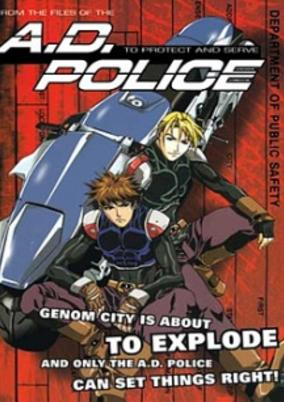

**Studio:** AIC &nbsp;|&nbsp; **Aired/Released:** April 7 &nbsp;|&nbsp; **Genres:** Science Fiction, Mecha, Japan, Action, Mafia, Special Squads, Gunfights, Crime, Cyberpunk, Future, Android, Law And Order, Robot, Plot Continuity, Violence, Cops

> Set a few years before Bubblegum Crisis Tokyo 2040, A.D. Police chronicles the tales of Mega-Tokyo's special police division designed to control rogue Boomers in the city. A.D. Police Officer Kenji Sasaki faces a major dilemma: he loses another partner to a rabid boomer. A day after he's sent off-duty, he receives a new partner in the form of German cop Hans Kleif. Funny thing is that Kenji sucker-punched Hans at a bar the night before. Not only does Kenji face the everyday task of controlling Boomers, he has to learn to adjust with his new partner.&nbsp; (Source: ANN)&nbsp;
>
> _Synopsis source: Kitsu_

[Kitsu](https://kitsu.io/anime/a-d-police)

---

### Amazing Nurse Nanako

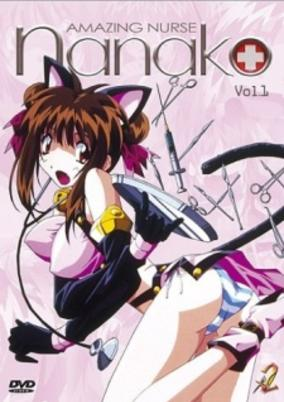

**Studio:** RADIX &nbsp;|&nbsp; **Aired/Released:** July 5 &nbsp;|&nbsp; **Genres:** Nurse, Stereotypes, Slapstick, Plot Continuity, Future, Action, Science Fiction, Comedy, Mecha, Military

> Nanako is a an inept apprentice nurse to the brilliant young Dr. Kouji. Now for some reason, Nanako is always being targeted by various elements which makes Nanako wonder if she has done anything wrong. But there are certain secrets to Nanako's past that only Dr. Kouji and his family know about.
>
> _Synopsis source: Kitsu_

[Wikipedia](https://en.wikipedia.org/wiki/Amazing_Nurse_Nanako) · [Kitsu](https://kitsu.io/anime/nanako-kaitai-shinsho)

---

### Angel Links

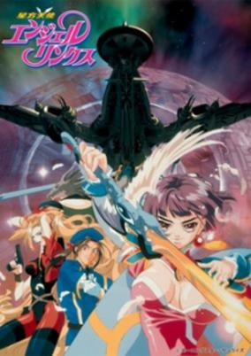

**Studio:** Sunrise , Bandai Visual &nbsp;|&nbsp; **Aired/Released:** April 7 &nbsp;|&nbsp; **Genres:** Science Fiction, Adventure, Action, Space Battles, Space Opera, Gunfights, Other Planet, Shipboard, Drama, Future, Android, Space, Military, Comedy, Romance

> Li Meifon is the head of a free, no expenses paid protection/security agency for escorting ships across outer space. Though only 16, she posesses great skill and leadership qualities while commanding her crew aboard their ship, the "Angel Links." However, some unpleasant memories begin to trouble her and she starts questioning her own past and reason for existence. Join Li Meifon and the rest of the Angel Links crew on their adventures through the Oracion star system as they battle pirates, government organizations, and a Tao master, all while finally uncovering Meifon's dark and mysterious past.
>
> _Synopsis source: Kitsu_

[Wikipedia](https://en.wikipedia.org/wiki/Angel_Links#Anime) · [Kitsu](https://kitsu.io/anime/angel-links)

---

### Arc the Lad

**Studio:** Bee Train &nbsp;|&nbsp; **Aired/Released:** April 5 &nbsp;|&nbsp; **Genres:** Fantasy, Romance, Fantasy World, Adventure, Action, Magic, Horror, Drama, Science Fiction

> The story follows Elk, a bounty hunter in some strange futuristic world. On this world archaic but advanced technology exists side by side with primitive attitudes, beasts and magic. In other words it's got a bit of everything. It also has an evil conspiracy who are able to produce powerful monsters called chimera, who can also appear as human. Naturally it is not long before Elk has rescued a young female beast-master and gained himself some serious enemies.
>
> _Synopsis source: Kitsu_

[Wikipedia](https://en.wikipedia.org/wiki/Arc_the_Lad#Anime) · [Kitsu](https://kitsu.io/anime/arc-the-lad)

---

### Black Heaven (Legend of Black Heaven)

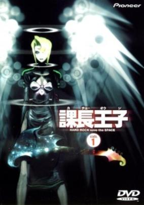

**Studio:** AIC , APPP &nbsp;|&nbsp; **Aired/Released:** July 8 &nbsp;|&nbsp; **Genres:** Earth, Science Fiction, Japan, Asia, Humanoid Alien, Shipboard, Alien, Musical Band, The Arts, Present, Music, Adventure, Comedy, Slice of Life

> Oji Tanaka has a wife, a child and a mundane job as a salary man in Tokyo's modern society. But life wasn't dull for him to begin with; 15 years ago, he was known as "Gabriel", leader of a short-lived heavy metal band called Black Heaven. Oji's life gets a sudden change in direction when he is invited by a mysterious blonde woman named Layla to pick up his Gibson Flying V and once again display his "legendary" guitar skills, not knowing that his music generates power for a massive weapon in an intergalactic war.
>
> _Synopsis source: Kitsu_

[Wikipedia](https://en.wikipedia.org/wiki/Black_Heaven) · [Kitsu](https://kitsu.io/anime/the-legend-of-black-heaven)

---

### Blue Gender

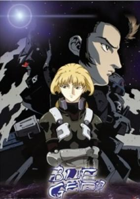

**Studio:** AIC &nbsp;|&nbsp; **Aired/Released:** October 8 &nbsp;|&nbsp; **Genres:** Post Apocalypse, Science Fiction, Mecha, Adventure, Action, Earth, Piloted Robot, Angst, Future, Plot Continuity, Violence, Military, Space, Horror, Romance

> Blue Gender takes place in the not too distant future in a world where things have gone terribly wrong for humanity. Humans have been replaced at the top of the food chain by the Blue, a race of bug-like aliens that have colonized Earth and pushed humans aside. A space station, Second Earth, has been constructed as a safe haven for humans, with the hope of one day reclaiming the Earth once more. Yuji Kaido was cryogenically frozen, having been suffering from a disease known as B-Cells. Once awakened, he joins a team of soldiers that have come to Earth to extract him. Unfortunately, nothing goes according to plan as they make their way back to Second Earth. Yuji will have to deal with the horrors of fighting a bloody war as he and the fighters from Second Earth look to survive. Will they be able to win back Earth without losing their humanity?
>
> _Synopsis source: Kitsu_

[Wikipedia](https://en.wikipedia.org/wiki/Blue_Gender) · [Kitsu](https://kitsu.io/anime/blue-gender)

---

### Break-Age

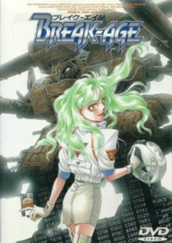

**Studio:** Beam Entertainment &nbsp;|&nbsp; **Aired/Released:** September 25 &nbsp;|&nbsp; **Genres:** Science Fiction, Mecha, Adventure

> In 2007, the inhabitants of Danger Planet II fight their battles using remote-controlled robots or "virtual puppets." Kirio Nimura is a high school student and the strongest puppeteer on the planet, until he falls for Sairi Takahara, who insists that nobody may make advances until they have beaten her puppet, Benkei.
>
> _Synopsis source: Kitsu_

[Kitsu](https://kitsu.io/anime/breakage)

---

### Bucky: The Incredible Kid

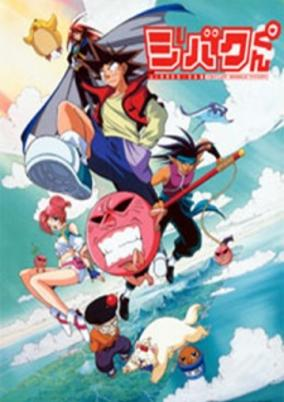

**Studio:** Trans Arts &nbsp;|&nbsp; **Aired/Released:** October 5 &nbsp;|&nbsp; **Genres:** Adventure, Fantasy, Comedy

> Bucky, the protagonist of the history, is a normal boy that lives in the first world. He lives with a single and humble ambition: to dominate the world (in the sense of the whole planet). He is very certain and he would certainly die to reach his dream. One day he meets with Spark, the Great Child of Primas (World One). Spark is known as the strongest Great Child of all of the worlds, and he is a successor's search. After finding Bucky and talk a little with him, Spark without apparent reason choose Bucky his successor. Bucky has just become a Great Child and to win the company of Jibaki, the spirit of the first world.
>
> _Synopsis source: Kitsu_

[Wikipedia](https://en.wikipedia.org/wiki/Jibaku-kun) · [Kitsu](https://kitsu.io/anime/bucky-the-incredible-kid)

---

### Cardcaptor Sakura: The Movie (Cardcaptor Sakura The Movie)

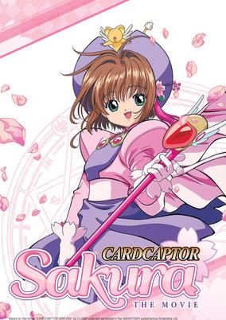

**Studio:** Madhouse &nbsp;|&nbsp; **Aired/Released:** August 21 &nbsp;|&nbsp; **Genres:** Contemporary Fantasy, China, Fantasy, Earth, Action, Asia, Comedy, Magic, Magical Girl, Present, Shoujo

> It's winter vacation and Sakura wins a trip to Hong Kong. Kero, skeptic of her luck in lotteries, questions whether she was merely lucky or was she summoned to Hong Kong upon inevitability. As Sakura strolls through Hong Kong's Bird Street, she senses an evil force calling to her. On chasing two strange birds, she is lead to a phantom world where she learns she was actually made to come to Hong Kong by a woman, Madoushi, who apparently wants revenge on Clow Reed. With Syaoran's mother, Yelan's help and the guidance from Clow Reed's voice, she must fight Madoushi and rescue her friends and loved ones, who have been captured.
>
> _Synopsis source: Kitsu_

[Kitsu](https://kitsu.io/anime/cardcaptor-sakura-the-movie)

---

### Case Closed: The Last Wizard of the Century (Case Closed Movie 3: The Last Wizard of the Century)

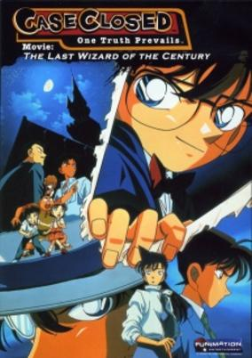

**Studio:** TMS Entertainment &nbsp;|&nbsp; **Aired/Released:** April 17 &nbsp;|&nbsp; **Genres:** Earth, Japan, Action, Asia, Thievery, Detective, Present, Adventure, Comedy, Cops, Mystery

> Kaitou Kid announces to the police that he intends to steal the Russian Imperial Easter Egg, which is currently being held in Osaka. As Conan pursues his rival, he discovers that there's more to this case then simply stopping a robbery.
>
> _Synopsis source: Kitsu_

[Kitsu](https://kitsu.io/anime/detective-conan-movie-03-the-last-wizard-of-the-century)

---

### City Hunter: Death of the Vicious Criminal Ryo Saeba

**Studio:** Sunrise &nbsp;|&nbsp; **Aired/Released:** April 23

[Wikipedia](https://en.wikipedia.org/wiki/City_Hunter#Television_movies)

---

### Corrector Yui

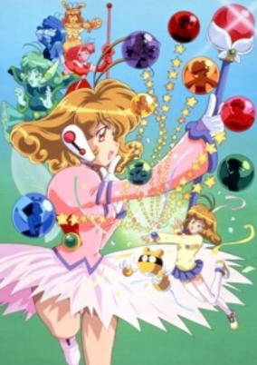

**Studio:** Nippon Animation &nbsp;|&nbsp; **Aired/Released:** April 2 &nbsp;|&nbsp; **Genres:** Fantasy World, Magic, Future, Magical Girl, Virtual Reality, Science Fiction, Adventure, Comedy

> Yui is an average schoolgirl who lives in a future where all computers are supported by a single global network known as COMNET. Yui is a computer-illiterate girl who after a computer-lab accident is approached by IR, a raccoon looking corrector computer program, which tells her she must save COMNET. She must stop the rogue A.I. (Artificial Intelligence) computer program known as Grosser and his hench-programs from taking over the world. Grosser was originally designed to be that manager of all of COMNET. At first she's very reluctant to play the heroine because of her complete lack of knowledge and ability with computers. To save COMNET she must find and gain the trust of the other seven wayward corrector programs. They must also find the creator or COMNET Professor Inukai, to help stop Grosser for good.
>
> _Synopsis source: Kitsu_

[Wikipedia](https://en.wikipedia.org/wiki/Corrector_Yui) · [Kitsu](https://kitsu.io/anime/corrector-yui)

---

### To Heart

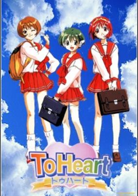

**Studio:** OLM, Inc. &nbsp;|&nbsp; **Aired/Released:** April 2 &nbsp;|&nbsp; **Genres:** High School, Present, Earth, Japan, Asia, Romance, Harem, Slice of Life, School Life, Coming Of Age

> For as long as Akari can remember, she and Hiroyuki have always been friends. But with time, everything changes, and her feelings have turned into something more. As a new semester of high school begins, will the two childhood friends come closer together or drift further apart? Join Hiroyuki, Akari and all their friends—the bubbly Shiho, the quiet Serika, the lovely Kotone, and more—in this heartwarming tale of love, relationships and friendship!
>
> _Synopsis source: Kitsu_

[Wikipedia](https://en.wikipedia.org/wiki/To_Heart) · [Kitsu](https://kitsu.io/anime/to-heart)

---

### Crayon Shin-chan: Explosion! The Hot Spring's Feel Good Final Battle

**Studio:** Shin-Ei Animation &nbsp;|&nbsp; **Aired/Released:** April 17

---

### Crest of the Stars

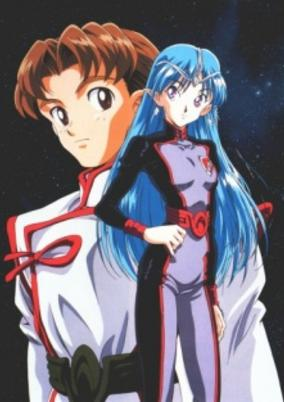

**Studio:** Sunrise &nbsp;|&nbsp; **Aired/Released:** January 3 &nbsp;|&nbsp; **Genres:** Future, Space, Space Travel, Other Planet, Shipboard, Plot Continuity, Action, Science Fiction, Adventure, Genetic Modification, War, Space Battles, Space Opera, Romance, Military

> Based on a science fiction novel series, Crest of the Stars (Seikai no Monsho) is the first installment in this sci-fi saga. The story follows Jinto, whose world was taken over by the largest empire in the galaxy: the Abh. Jinto's father, the planet's prime minister, handed their world over to the Abh in exchange for a standing in the Abh Empire. As a result, Jinto became a prince and was shipped off for an Abh Education. There he meets a princess of the Abh Empire, Lafiel, whom he quickly befriends despite her cold exterior. The Abh Empire is plunged into war soon after and the story continues from there...
>
> _Synopsis source: Kitsu_

[Wikipedia](https://en.wikipedia.org/wiki/Crest_of_the_Stars#Anime) · [Kitsu](https://kitsu.io/anime/seikai-no-monshou)

---

### Cyber Team in Akihabara: Summer Vacation of 2011

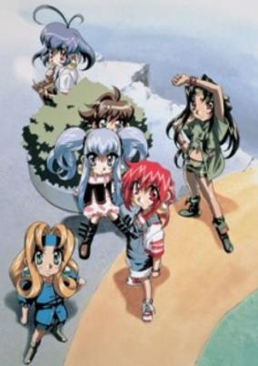

**Studio:** Production I.G , Xebec &nbsp;|&nbsp; **Aired/Released:** August 14 &nbsp;|&nbsp; **Genres:** Science Fiction, Comedy, Mecha, Adventure

> One year after Crane's visit to earth, Hibari dreams about him not being able to sleep well. So, she decides that the Cyberteam has to travel towards the Metatrone and find out if things are ok. Metatrone surveillance system has gone wild, and it's up to Hibari and her friends to fix things out and help Prince Crane.
>
> _Synopsis source: Kitsu_

[Kitsu](https://kitsu.io/anime/akihabara-dennou-gumi-2011-nen-no-natsuyasumi)

---

### Cyborg Kuro-chan

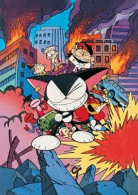

**Studio:** Studio Bogey &nbsp;|&nbsp; **Aired/Released:** October 2 &nbsp;|&nbsp; **Genres:** Comedy, Science Fiction

> Kuro is just an ordinary cat who only wants to protect his owners who are an old couple that can't fend for themselves. One day while on a date with his girlfriend Pooly who is a dog, he is kidnapped by an evil scientist and turned into a robot. Kuro somehow removes the chip that controlled him and notices that people get scared with his new robotic appearance and that he can now talk like a human. He decides to disguise himself with the skin of a stuffed toy and to continue living as a pet.
>
> _Synopsis source: Kitsu_

[Wikipedia](https://en.wikipedia.org/wiki/Cyborg_Kuro-chan#Anime) · [Kitsu](https://kitsu.io/anime/cyborg-kuro-chan)

---

### Di Gi Charat

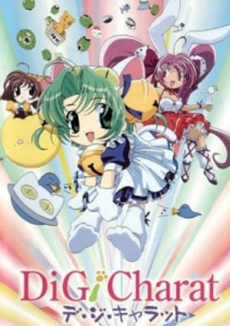

**Studio:** Madhouse &nbsp;|&nbsp; **Aired/Released:** November 30 &nbsp;|&nbsp; **Genres:** Earth, Japan, Asia, Comedy, Tokyo, Super Deformed, Stereotypes, Present, Science Fiction, Fantasy

> Di Gi Charat is a series of shorts created as advertisements for "Digital Gamers", a store in Akihabara. The series follows Dejiko, princess of Di Gi Charat planet, and her companions, Puchiko and Gema, as well as Dejiko's rival, Rabi~en~Rose through daily ordeals they encounter while working at Gamers. Princess Di Gi Charat came from the planet Di Gi Charat given only a cat cap and an outfit to disguise herself. Unfortunately she came with no money, only her guardian Gema and friend Petite Charat. Luckily the three stumbled upon a manager of the store Gamers, who offered them a home if they worked at the store. However Di Gi Charat is a selfish young girl who wishes of becoming a star.
>
> _Synopsis source: Kitsu_

[Wikipedia](https://en.wikipedia.org/wiki/Di_Gi_Charat#Anime) · [Kitsu](https://kitsu.io/anime/di-gi-charat)

---

### Digimon Adventure

**Studio:** Toei Animation &nbsp;|&nbsp; **Aired/Released:** March 6

[Wikipedia](https://en.wikipedia.org/wiki/Digimon_Adventure_(film))

---

### Digimon Adventure (Digimon: The Movie)

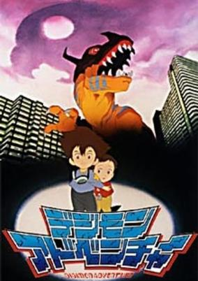

**Studio:** Toei Animation &nbsp;|&nbsp; **Aired/Released:** March 7 &nbsp;|&nbsp; **Genres:** Adventure, Action, Japan, Science Fiction, Present, Fantasy, Proxy Battles, Friendship, Kids, Isekai

> A brother and sister discover the digital world is more than 1s and 0s when a living creature arrives out of the family computer. The adventures of a group of children start with the appearance of a Digital Monster in the real world.
>
> _Synopsis source: Kitsu_

[Wikipedia](https://en.wikipedia.org/wiki/Digimon_Adventure_(1999_TV_series)) · [Kitsu](https://kitsu.io/anime/digimon-adventure-movie)

---

### Juubee-chan: Lovely Gantai no Himitsu (Jubei-chan the Ninja Girl: Secret of the Lovely Eyepatch)

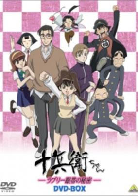

**Aired/Released:** April 6 &nbsp;|&nbsp; **Genres:** Earth, Japan, Action, Comedy, Swordplay, Present, Samurai, Adventure

> Jiyu Nanohana is an ordinary schoolgirl until she runs across a scatterbrained 300 year old samurai who tells her that she is the reincarnation of Yagyu Jubei. With the help of the "Lovely Eyepatch" she transforms into the legendary swordsman whenever she needs to use his awesome fighting ability, which she needs to do quite often as a rival clan is dead set on conquering Yagyu to satisfy an old family grudge.
>
> _Synopsis source: Kitsu_

[Kitsu](https://kitsu.io/anime/jubei-chan-the-ninja-girl)

---

### Doraemon: Nobita Drifts in the Universe (Doraemon the Movie: Nobita Drifts in the Universe)

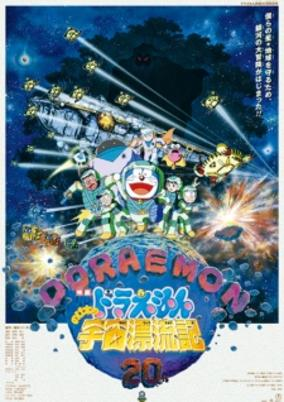

**Studio:** Shin-Ei Animation &nbsp;|&nbsp; **Aired/Released:** March 6 &nbsp;|&nbsp; **Genres:** Comedy, Space, Fantasy, Adventure, Kids

> After bragging about receiving a space trip ticket from his father, Suneo concedes they would have to wait quite a while until they can actually go. So, Nobita and co. turns to Doraemon for it, but they were given a space simulation game to play together instead. Unfortunately an accident with another gadget occurred, leaving Suneo and Giant trapped inside the game, only to be picked up by someone from outer space. Nobita, Shizuka and Doraemon then pursued the UFO that has the game inside it which took them all to a real space adventure.
>
> _Synopsis source: Kitsu_

[Kitsu](https://kitsu.io/anime/doraemon-nobita-gets-lost-in-space)

---

### Doraemon: Nobita's the Night Before a Wedding

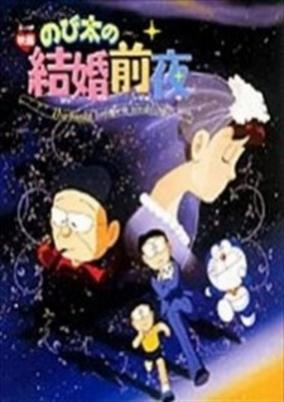

**Studio:** Shin-Ei Animation &nbsp;|&nbsp; **Aired/Released:** March 6 &nbsp;|&nbsp; **Genres:** Fantasy

> Nobita and Doraemon travel into the future to see whether or not Nobita will marry Shizuka. Once they arrive, they find out that instead of travelling to the day of the wedding, they travelled to the day before the wedding. Afterwards, the pair follow the future Nobita and his friends as they try to return a lost cat to its owner.
>
> _Synopsis source: Kitsu_

[Wikipedia](https://en.wikipedia.org/wiki/List_of_Doraemon_films#Short_films) · [Kitsu](https://kitsu.io/anime/doraemon-nobita-s-the-night-before-a-wedding)

---

### The Doraemons: Funny Candy of Okashinana!?

**Studio:** Shin-Ei Animation &nbsp;|&nbsp; **Aired/Released:** March 6

[Wikipedia](https://en.wikipedia.org/wiki/List_of_Doraemon_films#The_Doraemons_films)

---

### Doctor Slump: Arale's Surprise Burn (Doctor Slump: Arale's Surprise)

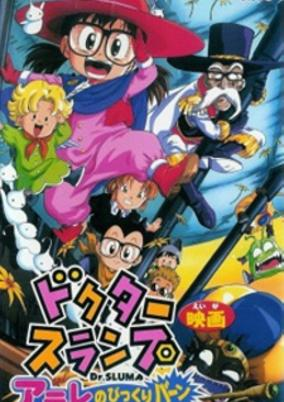

**Studio:** Toei Animation &nbsp;|&nbsp; **Aired/Released:** March 6 &nbsp;|&nbsp; **Genres:** Science Fiction, Comedy

> Arale and company arrive at a nice location for a picnic. They soon discover a beautiful stone with strange powers. Before they know it, a dangerous pirate and his mysterious ship invades their peace and steals the stone. Now it is up to them to retrieve the stone before it is used by evil hands.
>
> _Synopsis source: Kitsu_

[Wikipedia](https://en.wikipedia.org/wiki/List_of_Dr._Slump_films#1990s_films) · [Kitsu](https://kitsu.io/anime/dr-slump-arale-no-bikkuriman)

---

### Ebichu Minds the House

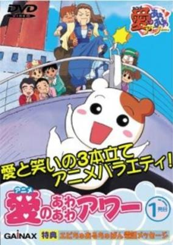

**Studio:** Gainax &nbsp;|&nbsp; **Aired/Released:** August 1 &nbsp;|&nbsp; **Genres:** Asia, Earth, Satire, Comedy, Japan, Ecchi, Anthropomorphism, Present

> Ebichu the hamster seems like the perfect house pet: she cleans, shops, cooks, does laundry, and anything to please her master, known only as "Office Lady" (OL). Unfortunately, OL and her unfaithful boyfriend, combined with Ebichu's uncontrollable exuberance and love for ice cream, often earn her severe and bloody punishment. However, Ebichu doesn't seem to mind the abuse if she achieves her goal of making her beloved master a little bit happier.
>
> _Synopsis source: Kitsu_

[Wikipedia](https://en.wikipedia.org/wiki/Oruchuban_Ebichu) · [Kitsu](https://kitsu.io/anime/oruchuban-ebichu)

---

### Excel Saga

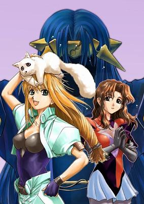

**Studio:** J.C.Staff &nbsp;|&nbsp; **Aired/Released:** October 8 &nbsp;|&nbsp; **Genres:** Satire, Japan, Action, Parody, Comedy, Breaking The Fourth Wall, Super Deformed, Slapstick, Stereotypes, Present, Science Fiction

> Hyperactive Excel does anything and everything to try to please her lord, Il Palazzo, who wants to take over the planet. Excel's misadventures takes her and her partner, the ever-dying Hyatt, all over the world, meeting several strange people as they go. Everything is bizarre and goofy, as any kind of anime or entertainment genre gets mocked and spoofed.
>
> _Synopsis source: Kitsu_

[Wikipedia](https://en.wikipedia.org/wiki/Excel_Saga#Anime) · [Kitsu](https://kitsu.io/anime/excel-saga)

---

### The File of Young Kindaichi 2: Murderous Deep Blue (Young Kindaichi's Casebook: Deep Blue Massacre)

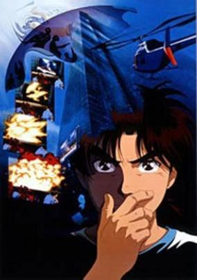

**Studio:** Toei Animation &nbsp;|&nbsp; **Aired/Released:** August 21 &nbsp;|&nbsp; **Genres:** Present, Earth, Japan, Asia, Horror, Detective, Mystery

> The movie is an alternative version to the "Satsuriku no Deep Blue" arc of the 1997 Kindaichi TV series. Kindaichi, Miyuki and Fumi are invited to the resort of the Deep Blue Island by their senpai Akane, the daughter of the president of the Aizawa Group. A group of criminals infiltrate the hotel diguised as waiters to kill the members of the Aizawa Group. The criminals don't know their boss in person, and they don't know either that he's in the hotel with the members of the Aizawa Group.
>
> _Synopsis source: Kitsu_

[Wikipedia](https://en.wikipedia.org/wiki/List_of_The_File_of_Young_Kindaichi_episodes#Films_(1996–1999)) · [Kitsu](https://kitsu.io/anime/kindaichi-shounen-no-jikenbo-satsuriku-no-deep-blue)

---

### Guru Guru Town Hanamaru-kun

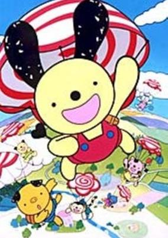

**Studio:** Pierrot &nbsp;|&nbsp; **Aired/Released:** October 3 &nbsp;|&nbsp; **Genres:** Kids

> Guru Guru Town Hanamaru-kun follows the life of some children in a fictional town.
>
> _Synopsis source: Kitsu_

[Kitsu](https://kitsu.io/anime/guru-guru-town-hanamaru-kun)

---

### Gokudo the Adventurer (Gokudo)

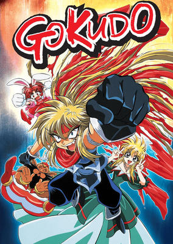

**Studio:** Trans Arts &nbsp;|&nbsp; **Aired/Released:** April 2 &nbsp;|&nbsp; **Genres:** Fantasy, Fantasy World, Adventure, Comedy, Absurdist Humour, Magic

> It all starts when Gokudou steals a pouch from a fortuneteller, thinking that it contains a gem. Instead, it turns out to be a rock, from which emerges Djinn. The genie grants Gokudou the standard three wishes, but our anti-hero doesn't think heavily about his wishes. Gokudou does get his wishes, though not exactly in the fashion that he expected. The best thing he gets out of his wishes is Honou no Maken, a magical sword that enables its owner to do fire attacks and it can be summoned from anywhere in the world. Even with an enchanted sword, Gokudou doesn't get much respect. He gets turned into a woman by Djinn, who is also a shapeshifter. He is followed by Rubette La Late, a potential love interest who is more interested in adventure, karaoke and outperforming Gokudou. He gets whapped on the head a lot, especially by the fortuneteller who reappears throughout the series just to plague Gokudou it seems. Later in the series, he gets another sidekick, a former evil magician named Prince, who is more handsome and a better womanizer than Gokudou.
>
> _Synopsis source: Kitsu_

[Wikipedia](https://en.wikipedia.org/wiki/Gokudo_the_Adventurer) · [Kitsu](https://kitsu.io/anime/gokudou-kun-manyuuki)

---

### Great Teacher Onizuka

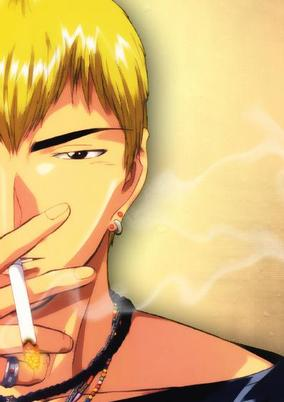

**Studio:** Studio Pierrot &nbsp;|&nbsp; **Aired/Released:** June 30 &nbsp;|&nbsp; **Genres:** Japan, Earth, Asia, Comedy, Coming Of Age, High School, School Life, Present, Slice of Life

> Onizuka is a reformed biker gang leader who has his sights set on an honorable new ambition: to become the world's greatest teacher... for the purpose of meeting sexy high school girls. Okay, so he's mostly reformed. However, strict administrators and a class of ruthless delinquents stand between Onizuka and his goal and they will use any means, however illegal or low, to drive the new teacher away. Perfect, because Onizuka's methods won't be found in any teaching manual; he cares about the difference between legal and illegal activities about as much as he cares for the age difference between himself and a high school girl. So get ready for math that doesn't add up, language you'd be slapped for using, and biology that would make a grown man blush... unless of course, you're the Great Teacher Onizuka. [Written by MAL Rewrite]
>
> _Synopsis source: Kitsu_

[Wikipedia](https://en.wikipedia.org/wiki/Great_Teacher_Onizuka) · [Kitsu](https://kitsu.io/anime/great-teacher-onizuka)

---

### Gundress

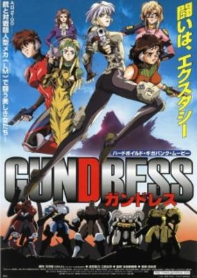

**Aired/Released:** March 20 &nbsp;|&nbsp; **Genres:** Gunfights, Future, Piloted Robot, Science Fiction, Action, Mecha

> In 2100, the newly built Bayside City serves as Japan's premier international port. The Angel Arms Company is established by a former policewoman named Takako, to help wage war on terrorism with armed security suits. When the mayor is assassinated, the women of Angel Arms end up protecting the evil crime-lord Hassan, in hopes that his information will help bring down a global terror ring. Takako's back is to the wall as a band of criminals plot to kill Hassan, and the organization's leader is revealed to be the former lover of Angel Arms' own Alisa.
>
> _Synopsis source: Kitsu_

[Kitsu](https://kitsu.io/anime/gundress)

---

### Hunter × Hunter (Hunter x Hunter)

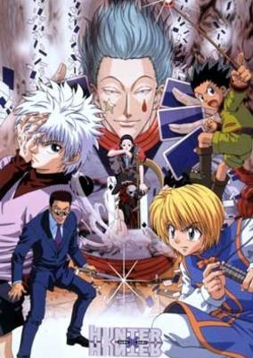

**Studio:** Nippon Animation &nbsp;|&nbsp; **Aired/Released:** October 16 &nbsp;|&nbsp; **Genres:** Adventure, Martial Arts, Alternative Present, Action, Fantasy World, Plot Continuity, Violence, Present, Super Power, Shounen

> Hunters are specialized in a wide variety of fields, ranging from treasure hunting to cooking. They have access to otherwise unavailable funds and information that allow them to pursue their dreams and interests. However, being a hunter is a special privilege, only attained by taking a deadly exam with an extremely low success rate. Gon Freecss, a 12-year-old boy with the hope of finding his missing father, sets out on a quest to take the Hunter Exam. Along the way, he picks up three companions who also aim to take the dangerous test: the revenge-seeking Kurapika, aspiring doctor Leorio Paladiknight, and a mischievous child the same age as Gon, Killua Zoldyck.Hunter x Hunter is a classic shounen that follows the story of four aspiring hunters as they embark on a perilous adventure, fighting for their dreams while defying the odds. [Written by MAL Rewrite]
>
> _Synopsis source: Kitsu_

[Wikipedia](https://en.wikipedia.org/wiki/Hunter_%C3%97_Hunter_(1999_TV_series)) · [Kitsu](https://kitsu.io/anime/hunter-x-hunter)

---

### I'm Gonna Be An Angel!

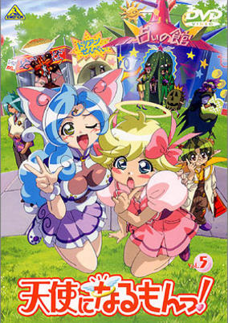

**Studio:** Studio Pierrot &nbsp;|&nbsp; **Aired/Released:** April 7 &nbsp;|&nbsp; **Genres:** Romance, Japan, Fantasy, Comedy, Love Polygon, Angel, High School, Magic, Alien, Slapstick, Alternative Present, Stereotypes, School Life, Demon

> Yuusuke was just a normal kid going to high school. Then one day, the cute and behaloed Noelle fell, quite literally, into his life, naked as a baby and every bit as innocent. Before he can even fathom what's just happened, Yuusuke is inducted into a rather odd family of otherworldly beings. Papa is a Frankenstein monster with a taste for calisthenics. Mama is a gorgeous lady with a penchant for "round objects" -- really! The eldest sister, Sara, is literally invisible; the brother, Gabriel, is a teenage vampire with an attitude problem; and the youngest sister, Ruka, loves inventing things. There's a disapproving Grandma, who's a witch to the nth degree, and her vulture familiar. All Yuusuke wanted was for the beautiful Natsumi to even notice his attention, but now he has an angel-in-training to follow him wherever he goes. And Noelle, too, has a guide on her path to being an angel, the mysterious Michael.
>
> _Synopsis source: Kitsu_

[Wikipedia](https://en.wikipedia.org/wiki/I%27m_Gonna_Be_An_Angel!) · [Kitsu](https://kitsu.io/anime/tenshi-ni-narumon)

---

### Infinite Ryvius

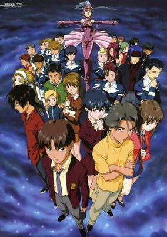

**Studio:** Sunrise &nbsp;|&nbsp; **Aired/Released:** October 6 &nbsp;|&nbsp; **Genres:** Science Fiction, Mecha, Action, Piloted Robot, Angst, Shipboard, Future, Plot Continuity, Violence, Space, Military, Psychological

> The year is AD 2225. Kouji Aiba and Aoi Housen are serving as astronauts in-training in Liebe Delta which is located on the edge of the Geduld Sea. When saboteurs with unknown intents suddenly strike during a routine dive procedure, the space station plummets into the Geduld, a plasma field that links all the planets like a nervous system and crushes any ship that strays too far into it. With all the adults onboard killed, the young astronauts will have to survive this long journey home in midst of the growing tension amongst each other. Meanwhile the organizers of the sabotage look on and prepare to attack once more.
>
> _Synopsis source: Kitsu_

[Wikipedia](https://en.wikipedia.org/wiki/Infinite_Ryvius) · [Kitsu](https://kitsu.io/anime/mugen-no-ryvius)

---

### Jubei-chan: The Ninja Girl (Jubei-chan the Ninja Girl: Secret of the Lovely Eyepatch)

**Studio:** Madhouse &nbsp;|&nbsp; **Aired/Released:** October 6 &nbsp;|&nbsp; **Genres:** Earth, Japan, Action, Comedy, Swordplay, Present, Samurai, Adventure

> Jiyu Nanohana is an ordinary schoolgirl until she runs across a scatterbrained 300 year old samurai who tells her that she is the reincarnation of Yagyu Jubei. With the help of the "Lovely Eyepatch" she transforms into the legendary swordsman whenever she needs to use his awesome fighting ability, which she needs to do quite often as a rival clan is dead set on conquering Yagyu to satisfy an old family grudge.
>
> _Synopsis source: Kitsu_

[Kitsu](https://kitsu.io/anime/jubei-chan-the-ninja-girl)

---

### King of Sushi

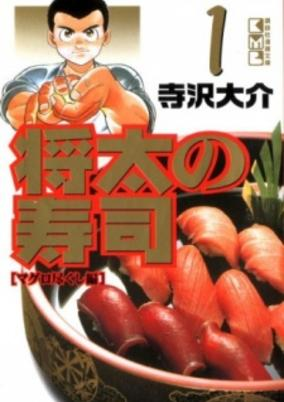

**Studio:** Studio Comet &nbsp;|&nbsp; **Aired/Released:** October 11

> Shouta no Sushi is about a young boy who dreams of being a sushi chef just like his father. The anime steps away from the competitive nature of the manga and focuses on self-sufficiency and policy issues of agriculture, forestry, and fisheries in Japan in order to educate the population (as it was funded by the Ministry of Agriculture, Forestry and Fisheries) using the popular franchise as a proxy.
>
> _Synopsis source: Kitsu_

[Wikipedia](https://en.wikipedia.org/wiki/Sh%C5%8Dta_no_Sushi) · [Kitsu](https://kitsu.io/anime/shouta-no-sushi-kokoro-ni-hibiku-shari-no-aji)

---

### KochiKame: The Movie

**Studio:** Studio Gallop &nbsp;|&nbsp; **Aired/Released:** December 23

---

### Legend of Himiko

**Studio:** Group TAC &nbsp;|&nbsp; **Aired/Released:** January 7 &nbsp;|&nbsp; **Genres:** Fantasy, Adventure, Action, Alternative Past, Plot Continuity

> In a world where the dead walk, where good and evil exist as palpable forces, a darkness is stirring. The undead march against the cities of light, to capture the sacred fire that is the source of their power. But one hope remains. Called into this world by the magical flame, a young girl named Himiko is thrust into the maelstrom of danger, betrayal, and war. For she is heir to the sacred fire, and holds a power that could save its Guardians... if she survives!
>
> _Synopsis source: Kitsu_

[Wikipedia](https://en.wikipedia.org/wiki/Legend_of_Himiko) · [Kitsu](https://kitsu.io/anime/himiko-den)

---

### Let's Go! Anpanman: When the Flower of Courage Opens

**Studio:** TMS Entertainment &nbsp;|&nbsp; **Aired/Released:** July 24

[Wikipedia](https://en.wikipedia.org/wiki/Anpanman#Full-length_movies)

---

### Let's Go! Anpanman: Anpanman and Their Fun Friends

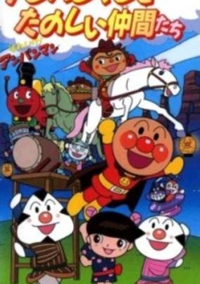

**Studio:** TMS Entertainment &nbsp;|&nbsp; **Aired/Released:** July 24 &nbsp;|&nbsp; **Genres:** Fantasy, Adventure, Kids

[Wikipedia](https://en.wikipedia.org/wiki/Anpanman#Animated_shorts) · [Kitsu](https://kitsu.io/anime/sore-ike-anpanman-anpanman-to-tanoshii-nakama-tachi)

---

### Lupin III: The Columbus Files (Lupin the Third:  The Columbus Files)

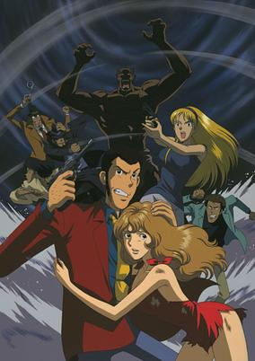

**Studio:** TMS Entertainment &nbsp;|&nbsp; **Aired/Released:** July 30 &nbsp;|&nbsp; **Genres:** Present, Earth, Europe, Action, Science Fiction, Adventure, Comedy, Crime, Thievery

> When Fujiko secures a file that documents the location of the fabled Columbus Egg– a mystical relic found by Christopher Columbus which can be harnessed to control the weather– she quickly recruits Lupin and the gang to track down the long-lost treasure. To prevent a sinister villain from finding the Egg, Fujiko memorizes the file and destroys it. Unfortunately, in the process, she contracts amnesia, changing her personality and wiping her memory of Lupin and his friends almost entirely. Can they restore Fujiko back to normal before the Egg falls into the hands of a madman?
>
> _Synopsis source: Kitsu_

[Wikipedia](https://en.wikipedia.org/wiki/List_of_Lupin_III_television_specials#11) · [Kitsu](https://kitsu.io/anime/lupin-iii-ai-no-da-capo-fujiko-s-unlucky-days)

---

### Magic User's Club

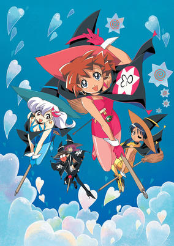

**Studio:** Madhouse , Triangle Staff &nbsp;|&nbsp; **Aired/Released:** July 7 &nbsp;|&nbsp; **Genres:** Comedy, Fantasy, Science Fiction, Love Polygon, Coming Of Age, High School, Magic, School Clubs, Slapstick, Alternative Present, School Life, Romance, Japan, Plot Continuity

> The aliens have been defeated, and the Bell has been transformed into a gigantic cherry tree. Now, the brave Magic User's Club must reconvene to deal with a new problem. Apparently, some inconsiderate persons left a skyscraper sized cherry tree in the middle of Tokyo, and it's become a major inconvenience to everyone in the city. Even though they have no idea who could have done such a thing, the Club feels strangely responsible and springs into action. Meanwhile, a mysterious person is spying on the magic club in the form of a small boy.
>
> _Synopsis source: Kitsu_

[Wikipedia](https://en.wikipedia.org/wiki/Magic_User%27s_Club#TV_series) · [Kitsu](https://kitsu.io/anime/mahou-tsukai-tai)

---

### Magical DoReMi

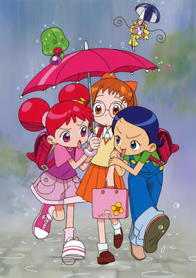

**Studio:** Toei Animation &nbsp;|&nbsp; **Aired/Released:** February 7 &nbsp;|&nbsp; **Genres:** Fantasy, Contemporary Fantasy, Japan, Elementary School, Comedy, Magic, Stereotypes, School Life, Magical Girl, Present

> Harukaze Doremi considers herself to be the unluckiest girl in the world. Her parents are always fighting, her little sister makes fun of her, and her crush pines after another girl. If only Doremi could just wave a magic wand, she would have a much better life—or so she used to think. After a mishap with a real witch, Doremi becomes an apprentice witch herself, and it turns out she's pretty horrible at that, too. Now she and her two friends must study to become better at magic so they can become good witches. That is, if they can focus on their magic studies! The three apprentices will need all the luck they can get if they want to pass the witch exams and become full-fledged witches. Only then will Doremi's debt to the witch Majorika will be repaid. Until then, Doremi will remain a useless little witch girl!
>
> _Synopsis source: Kitsu_

[Wikipedia](https://en.wikipedia.org/wiki/Ojamajo_Doremi#Anime) · [Kitsu](https://kitsu.io/anime/ojamajo-doremi)

---

### Marco: 3000 Leagues in Search of Mother

**Studio:** Nippon Animation &nbsp;|&nbsp; **Aired/Released:** April 2

[Wikipedia](https://en.wikipedia.org/wiki/%E6%AF%8D%E3%82%92%E3%81%9F%E3%81%9A%E3%81%AD%E3%81%A6%E4%B8%89%E5%8D%83%E9%87%8C#MARCO_母をたずねて三千里)

---

### Medabots

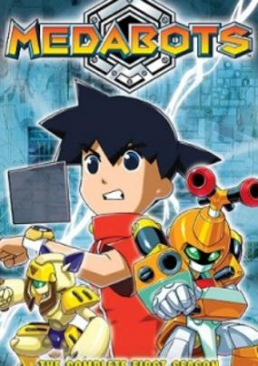

**Studio:** Bee Train &nbsp;|&nbsp; **Aired/Released:** July 2 &nbsp;|&nbsp; **Genres:** Science Fiction, Mecha, Action, Comedy, Proxy Battles, Adventure

> In the 22nd century, Medarots—intelligent robots powered by medals that act as their minds—are commonplace all over the world. They serve their human partners and settle disputes through a combat sporting event known as Robattling. Combatants that take part in robattling for the sake of improving their ranking are known as Meda-fighters, and they aim to climb the ranks to enter the World Tournament and represent their country.Medarot tells the story of ten-year-old Ikki Tenryou stumbling across a rare Beetle medal and gaining his first Medarot, dubbed Metabee. He’s expecting a submissive and loyal robot that would follow his every command, but Metabee does what he wants and doesn’t take kindly to being insulted. Now Ikki is stuck with him, and they must work together to give their competition a Metabee-boppin’ as they robattle their way to the top!
>
> _Synopsis source: Kitsu_

[Wikipedia](https://en.wikipedia.org/wiki/Medabots#Anime) · [Kitsu](https://kitsu.io/anime/medabots)

---

### Microman: The Small Giant

**Studio:** Pierrot &nbsp;|&nbsp; **Aired/Released:** January 4

---

### Microman vs. Gorgon

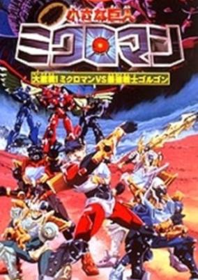

**Studio:** Pierrot &nbsp;|&nbsp; **Aired/Released:** July 31 &nbsp;|&nbsp; **Genres:** Science Fiction, Super Power, Mecha, Action, Adventure

[Kitsu](https://kitsu.io/anime/chiisana-kyojin-microman-daigekisen-microman-vs-saikyou-senshi-gorgon)

---

### Monster Rancher

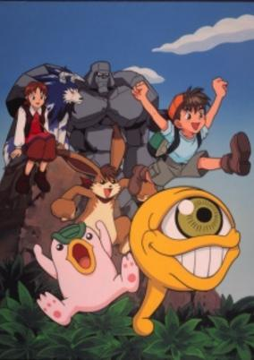

**Studio:** TMS Entertainment &nbsp;|&nbsp; **Aired/Released:** April 17 &nbsp;|&nbsp; **Genres:** Fantasy, Adventure, Proxy Battles, Action, Comedy

> Genki is a boy who loves playing video games. One day he's zapped into the world of Monster Rancher and meets the girl Holly and the monsters Mochi, Suezo, Golem, Tiger and Hare. Together, they are searching for a way to revive the Phoenix, which is the only monster capable of stopping the evil Moo.
>
> _Synopsis source: Kitsu_

[Wikipedia](https://en.wikipedia.org/wiki/Monster_Rancher_(TV_series)) · [Kitsu](https://kitsu.io/anime/monster-farm-enbanseki-no-himitsu)

---

### My Neighbors the Yamadas

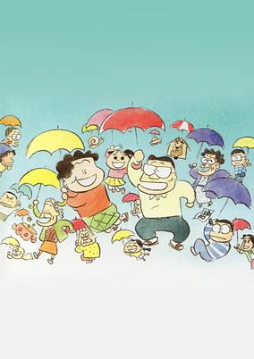

**Studio:** Studio Ghibli &nbsp;|&nbsp; **Aired/Released:** July 17 &nbsp;|&nbsp; **Genres:** Japan, Asia, Earth, Slice of Life, Comedy, Present, Family

> Join in the adventures of the quirky Yamada family -- from the hilarious to the touching -- brilliantly presented in a unique, visually striking comic strip style. Takashi Yamada and his wacky wife Matsuko, who has no talent for housework, navigate their way through the ups and downs of work, marriage, and family life with a sharp-tongued grandmother who lives with them, a teenage son who wishes he had cooler parents, and a pesky daughter whose loud voice is unusual for someone so small. Even the family dog has issues!
>
> _Synopsis source: Kitsu_

[Wikipedia](https://en.wikipedia.org/wiki/My_Neighbors_the_Yamadas) · [Kitsu](https://kitsu.io/anime/tonari-no-yamada-kun)

---

### Now and Then, Here and There

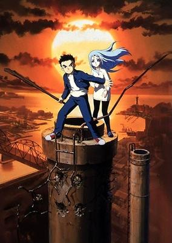

**Studio:** AIC &nbsp;|&nbsp; **Aired/Released:** October 14 &nbsp;|&nbsp; **Genres:** Dark Fantasy, Post Apocalypse, Anti War, Disaster, Rotten World, Dystopia, Action, Fantasy World, Angst, Violence, Drama, Fantasy, Future, Plot Continuity, Military, Science Fiction, Adventure

> Shu is a typical Japanese boy, but has an unbeatable, optimistic and determined attitude. However, when he sees a mysterious girl with strange eyes named Lala-Ru up on a smokestack, he is soon pulled into a strange desert world. Shu soon discovers the true terrors of war, which includes genocide, brutal torture, hunger, thirst, and child exploitation. Now Shu is trying to save Lala-Ru, as well as his hard earned, and often reluctant, new friends from the insane dictator, Hamdo. Whether Shu can possibly accomplish saving those he cares about while still holding up to his values remains to be seen.
>
> _Synopsis source: Kitsu_

[Wikipedia](https://en.wikipedia.org/wiki/Now_and_Then,_Here_and_There) · [Kitsu](https://kitsu.io/anime/now-and-then-here-and-there)

---

### One Piece

**Studio:** Toei Animation &nbsp;|&nbsp; **Aired/Released:** October 20

[Wikipedia](https://en.wikipedia.org/wiki/One_Piece_(1999_TV_series))

---

### Pet Shop of Horrors

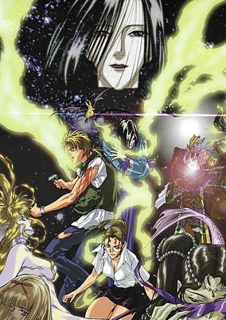

**Studio:** Madhouse &nbsp;|&nbsp; **Aired/Released:** March 2 &nbsp;|&nbsp; **Genres:** Earth, United States, Americas, Anthropomorphism, Horror, Present, Mystery, Josei

> Count D, a quite interesting pet shop owner from an area called Chinatown, sells rare and hard to come by pets to people longing for something special, but with each sale comes a contract. If the rules of the contract are followed, everything goes fine, but if someone should break the rules of the contract, the pet shop cannot be held responsible for anything unfortunate that might happen. Leon Orcot, a homicide detective, has linked many odd and unexplainable deaths together; they all were customers of Count D's pet shop, and he intends to find out why.
>
> _Synopsis source: Kitsu_

[Wikipedia](https://en.wikipedia.org/wiki/Pet_Shop_of_Horrors#Anime_television_series) · [Kitsu](https://kitsu.io/anime/petshop-of-horrors)

---

### Phantom Thief Jeanne

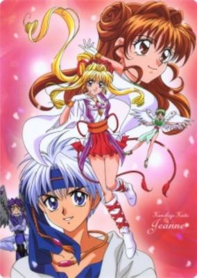

**Studio:** Toei Animation &nbsp;|&nbsp; **Aired/Released:** February 13 &nbsp;|&nbsp; **Genres:** Romance, Fantasy, Japan, Action, Thievery, Comedy, Love Polygon, Angel, Present, Demon, Magic, Adventure, Mystery

> A normal looking high school girl on the outside, Kusakabe Maron is actually the reincarnation of Jeanne d' Arc. With the help of the angel, Fin Fish, Maron works as the thief Jeanne at night to seal the demons that reside in pieces of artwork, preying upon the weak hearts of the owners. She is branded as a thief due to the fact that the artworks disappear after she seals the demons. One day, a new neighbor and classmate appears, as well as a rival in her night job, the thief Sinbad. With her own best friend being the detective's daughter, out to capture her and the appearance of her new rival, Maron's work is anything but easy.
>
> _Synopsis source: Kitsu_

[Wikipedia](https://en.wikipedia.org/wiki/Phantom_Thief_Jeanne#Anime) · [Kitsu](https://kitsu.io/anime/kamikaze-kaitou-jeanne)

---

### Pikachu's Rescue Adventure (Pokemon: Pikachu's Rescue Adventure)

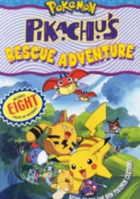

**Studio:** Oriental Light and Magic &nbsp;|&nbsp; **Aired/Released:** July 17 &nbsp;|&nbsp; **Genres:** Fantasy, Adventure, Comedy, Kids

> Pikachu and friends must rescue lost Togepi.
>
> _Synopsis source: Kitsu_

[Wikipedia](https://en.wikipedia.org/wiki/Pikachu%27s_Rescue_Adventure) · [Kitsu](https://kitsu.io/anime/pokemon-pikachu-tankentai)

---

### Pokémon the Movie 2000 (Pokemon: The Movie 2000)

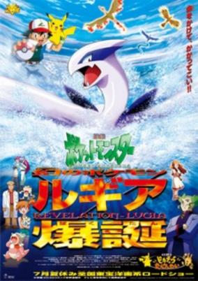

**Studio:** Oriental Light and Magic &nbsp;|&nbsp; **Aired/Released:** July 17 &nbsp;|&nbsp; **Genres:** Fantasy, Adventure, Comedy, Kids, Proxy Battles, Fantasy World

> A greedy collector, Lawrence III, wants to capture the legendary Pokemon, Lugia. But in order to do so, he must capture the Titans of Fire, Ice, and Lightning. The titans are powerful bird-like Pokemon, and if they are disturbed they will wage a war against eachother which will ultimately result in earth's destruction. Ash, Misty, and Tracey get caught up in the situation when they end up being washed ashore onto Shamouti Island. Soon after, Ash meets a girl named Melody who sends him into a mission where he must collect the 3 Orbs which will quell the fighting, but first Ash must gain help from the Beast of the Sea, Lugia, if he's to suceed.
>
> _Synopsis source: Kitsu_

[Wikipedia](https://en.wikipedia.org/wiki/Pok%C3%A9mon_the_Movie_2000) · [Kitsu](https://kitsu.io/anime/pokemon-maboroshi-no-pokemon-lugia-bakutan)

---

### Power Stone

**Studio:** Pierrot &nbsp;|&nbsp; **Aired/Released:** April 3

[Wikipedia](https://en.wikipedia.org/wiki/Power_Stone_(TV_series))

---

### Re-Birthday

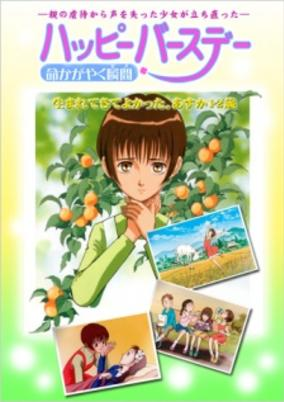

**Studio:** Magic Bus &nbsp;|&nbsp; **Aired/Released:** July 27 &nbsp;|&nbsp; **Genres:** Japan, Elementary School, Slice of Life, Friendship, School Life, Plot Continuity, Present, Kids

> After being abused by her mother physically and mentally Asuka gets taken in by her grandparents. Slowly she learns her own worth as a human being and overcomes many obstacles.
>
> _Synopsis source: Kitsu_

[Kitsu](https://kitsu.io/anime/happy-birthday-inochi-kagayaku-toki)

---

### Reign: The Conqueror

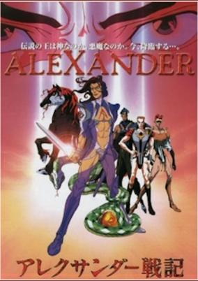

**Studio:** Madhouse &nbsp;|&nbsp; **Aired/Released:** September 14 &nbsp;|&nbsp; **Genres:** Earth, Fantasy, Middle East, Feudal Warfare, Swordplay, Europe, Cyberpunk, Past, Science Fiction, Action, Asia, Plot Continuity, Violence, Military, Historical, Adventure

> Prince Alexander, son of King Philip, and heir to the Macedonian empire, must fend off political saboteurs, assassins, and the jealousy of his own father to ascend to the position of king. Once there, he begins his quest to conquer all nations and become known as the Great King, though an ancient prophecy foretells that he will be the destroyer of the world and forever remembered as the Devil King.
>
> _Synopsis source: Kitsu_

[Kitsu](https://kitsu.io/anime/alexander-senki)

---

### Rerere's Genius Bakabon

**Studio:** Pierrot &nbsp;|&nbsp; **Aired/Released:** October 19 &nbsp;|&nbsp; **Genres:** Comedy

> This story contains a lot of humor and edgy jokes that attract an audience ranging from toddlers to adults. Bakabon and his father turn common sense on its head. After all, common sense, that we take for granted, is frequently nonsensical, but comical. Bakabon's father has his own philosophy and he leaves no stone unturned in his quest for answers. Bakabon joins him in his philosophical quests which drive the people in their town crazy.
>
> _Synopsis source: Kitsu_

[Wikipedia](https://en.wikipedia.org/wiki/Tensai_Bakabon#Anime) · [Kitsu](https://kitsu.io/anime/rerere-no-tensai-bakabon)

---

### Revolutionary Girl Utena: Adolescence of Utena (Revolutionary Girl Utena: The Adolescence of Utena)

**Studio:** J.C. Staff &nbsp;|&nbsp; **Aired/Released:** August 14 &nbsp;|&nbsp; **Genres:** Contemporary Fantasy, Romance, Fantasy, Action, Shoujo Ai, Angst, High School, Magic, School Life, Motorsport, Magical Girl, Dementia

> In a loose retelling of the Revolutionary Girl Utena TV series, Utena Tenjou arrives at Ohtori Academy, only to be immediately swept up in a series of duels for the hand of her classmate Anthy Himemiya and the power she supposedly holds. At the same time, Utena reunites with Touga Kiryuu, a friend from her childhood who seems to know the secrets behind the duels. Utena must discover those secrets for herself, before the power that rules Ohtori claims her and her friends, new and old.
>
> _Synopsis source: Kitsu_

[Wikipedia](https://en.wikipedia.org/wiki/Adolescence_of_Utena) · [Kitsu](https://kitsu.io/anime/shoujo-kakumei-utena-adolescence-mokushiroku)

---

### She and Her Cat

**Studio:** Liden Films &nbsp;|&nbsp; **Aired/Released:** March 4

[Wikipedia](https://en.wikipedia.org/wiki/She_and_Her_Cat)

---

### Space Pirate Mito

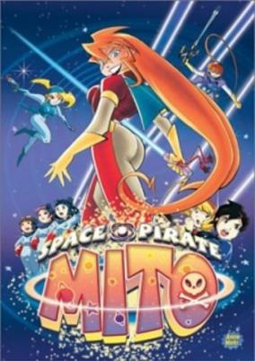

**Studio:** Triangle Staff &nbsp;|&nbsp; **Aired/Released:** January 4 &nbsp;|&nbsp; **Genres:** Power Suit, Shipboard, Japan, Action, Science Fiction, Comedy, Pirate, Space

> Mito isn't just another space pirate, she's a three foot tall childlike alien with enough guts to outshine a supernova. She's known as the galaxy's most dangerous pirate, a wanted criminal who destroys a dozen police space cruisers every day before breakfast. But all she really wants is to be called "Mom."
>
> _Synopsis source: Kitsu_

[Wikipedia](https://en.wikipedia.org/wiki/Space_Pirate_Mito) · [Kitsu](https://kitsu.io/anime/uchuu-kaizoku-mito-no-daibouken)

---

### Soul Hunter

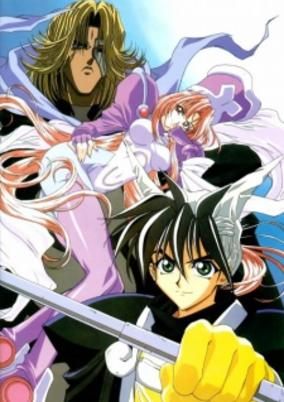

**Studio:** Studio Deen &nbsp;|&nbsp; **Aired/Released:** July 3 &nbsp;|&nbsp; **Genres:** Magic, Super Power, Historical, Demon, Floating Island, Action, Fantasy, Adventure

> Thousands of years ago, it was a time of witchcraft and dark magic. An evil sorceress has bewitched the emperor of the mighty dynasty and he has become a mindless puppet. The country is in shambles, and evil spirits lurk everywhere. The human world is on the verge of utter destruction. A bold mission is planned by the Confederation of the Immortal Masters. They send a young master wizard to hunt down the villains and evil warlocks in the devastated lands.
>
> _Synopsis source: Kitsu_

[Wikipedia](https://en.wikipedia.org/wiki/Hoshin_Engi#First_series_(1999)) · [Kitsu](https://kitsu.io/anime/soul-hunter)

---

### Starship Girl Yamamoto Yohko

**Studio:** J.C.Staff , T-Up &nbsp;|&nbsp; **Aired/Released:** April 4 &nbsp;|&nbsp; **Genres:** Time Travel, Slapstick, Plot Continuity, Action, Science Fiction, Adventure

> In the year 2999: humanity is split into two factions, Terra and Ness, in a war fought by starships. One of the foremost of the pilots is the cocky teenager Yamamoto Yohko, and during one of her missions, she and her crew are sucked into a temporal anomaly (a la Star Trek) that sends her back to our time. Amnesiac, she only thinks of herself as a typical high school student - until a course of events sends her back to her ship the TA-29, with her newfound friends fighting at her side in a war that looks suspiciously like an arcade game (complete with 100 yen ignition costs!).
>
> _Synopsis source: Kitsu_

[Wikipedia](https://en.wikipedia.org/wiki/Starship_Girl_Yamamoto_Yohko) · [Kitsu](https://kitsu.io/anime/soreyuke-uchuu-senkan-yamamoto-yohko-1999)

---

### Steel Angel Kurumi

**Studio:** Oriental Light and Magic &nbsp;|&nbsp; **Aired/Released:** October 5 &nbsp;|&nbsp; **Genres:** Romance, Science Fiction, Japan, Action, Comedy, Maid, Past, Android, Plot Continuity, Mecha, Historical, Adventure, Military

> During Japan's Taisho Era (1912-1926), a scientist named Ayanokoji developed the Steel Angel - an artificial humanoid with superhuman physical abilities. While the Imperial Army wanted to use the Steel Angel as a new means of modern warfare, Ayanokoji wanted his creation to be a new step in the future of mankind. Thus, he defied orders from the Army and secretly made the Steel Angel codenamed "Kurumi". Then one day, a young boy named Nakahito Kagura snuck into Ayanokoji's house as a dare by his friends and stumbled upon Kurumi's lifeless body. A sudden attack by the Imperial Army shook the house, causing Kurumi to fall on Nakahito. At that moment, their lips met, and Kurumi woke up from "the kiss that started a miracle".
>
> _Synopsis source: Kitsu_

[Wikipedia](https://en.wikipedia.org/wiki/Steel_Angel_Kurumi#Anime) · [Kitsu](https://kitsu.io/anime/steel-angel-kurumi)

---

### Tenamonya Voyagers

**Studio:** Pierrot &nbsp;|&nbsp; **Aired/Released:** June 25 &nbsp;|&nbsp; **Genres:** Science Fiction, Adventure, Action, Ecchi, Piloted Robot, Comedy, Other Planet, Shipboard, Future, Slapstick, Stereotypes, Space, Mecha

> Paraila was an agent for a war organization in the space, but suddenly the supreme court of planets accused her of betrayal and she was forced to be a fugitive to escape from jail. Now she forms a team with a clueless school teacher, a bazooka lover girl and Paraila's former sidekick. They will battle against Paraila's enemies, and try to go to earth to escape from space justice.
>
> _Synopsis source: Kitsu_

[Kitsu](https://kitsu.io/anime/tenamonya-voyagers)

---

### Tenchi Forever! The Movie (Tenchi Forever!)

**Studio:** AIC &nbsp;|&nbsp; **Aired/Released:** July 24 &nbsp;|&nbsp; **Genres:** Fantasy, Science Fiction, Action, Comedy, Romance

> It seems like an ordinary day at the Masaki shrine until Tenchi wanders into the forest and disappears. Six months later, the movie picks up with Ryoko and Ayeka's continuing search for him all over Japan. They discover he is in another world with a strange woman―but they have no idea who she is or how to reach him, or even if he wants to see them again. In the other world, Tenchi strives to capture the image of a woman that keeps coming into his mind. The two worlds finally connect―but to what end, none of them know.
>
> _Synopsis source: Kitsu_

[Wikipedia](https://en.wikipedia.org/wiki/Tenchi_Forever!_The_Movie) · [Kitsu](https://kitsu.io/anime/tenchi-muyo-in-love-2-haruka-naru-omoi)

---

### The Big O

**Studio:** Sunrise &nbsp;|&nbsp; **Aired/Released:** October 13 &nbsp;|&nbsp; **Genres:** Android, Fantasy World, Mecha, Piloted Robot, Parody, Action, Angst, Science Fiction, Conspiracy, Dystopia

> Paradigm City is a place without a past. 40 years ago, something happened that wiped the memories of everyone in it. Unfortunately, the people of Paradigm City were very busy before then, making Megadueses (giant robots) and monsters. People who were born after the memory wipe are gaining/recovering memories of the past and using them to build newer threats. With the help of The Big O (a faithful giant robot), his butler Norman and the android Dorothy, Roger Smith keeps Paradigm City safe. As problems mount and more memories surface, Roger's past and Paradigm's future begin to become suspect...
>
> _Synopsis source: Kitsu_

[Wikipedia](https://en.wikipedia.org/wiki/The_Big_O) · [Kitsu](https://kitsu.io/anime/the-big-o)

---

### Tokimeki Memorial

**Studio:** Pierrot &nbsp;|&nbsp; **Aired/Released:** June 17 &nbsp;|&nbsp; **Genres:** High School, Present, Earth, Japan, Asia, Romance, School Life

> Tokimeki Memorial brings together the twelve young girls from Kirameki High School, but revolves around the main girl, Fujisaki Shiori. The story starts at the beginning of the third school year, which is the last year before the main character can choose a girl and date her at the graduation. (Souce: AnimeNfo)
>
> _Synopsis source: Kitsu_

[Wikipedia](https://en.wikipedia.org/wiki/Tokimeki_Memorial#Anime) · [Kitsu](https://kitsu.io/anime/tokimeki-memorial-forever-with-you)

---

### Turn A Gundam (∀ Gundam)

**Studio:** Sunrise &nbsp;|&nbsp; **Aired/Released:** April 9 &nbsp;|&nbsp; **Genres:** Earth, Science Fiction, Mecha, Steampunk, Action, Piloted Robot, Americas, Future, Plot Continuity, Military, Space, Adventure

> It is the Correct Century, two millenniums after a devastating conflict which left the world broken. Earth is now mostly uninhabitable, and thus a remnant of humanity has resided on the Moon while the Earth and its few survivors recover. For years, the "Moonrace," people of the Moon, have continued to check if Earth is fit for resettlement. A boy named Rolan Cehack and two others are sent down to Earth for a reconnaissance mission. Rolan ends up spending a year on the planet working for the Heim Family, aristocrats living in a Victorian-like society. This family, like others of similar wealthy status, celebrates one's coming of age with a ceremony involving a giant stone statue known as the "White Doll." To Rolan's surprise, the Moonrace suddenly touches down on Earth with the intent of taking it by force. During the attack, the White Doll is broken apart, revealing a mobile suit called the "Turn A Gundam" inside. With Rolan in its cockpit, the Turn A causes a standoff between the forces of Earth and Moon. The young pilot, along with the people of both sides, must keep the peace and avoid another all-out, catastrophic war. [Written by MAL Rewrite]
>
> _Synopsis source: Kitsu_

[Wikipedia](https://en.wikipedia.org/wiki/Turn_A_Gundam) · [Kitsu](https://kitsu.io/anime/turn-a-gundam)

---

### You're Under Arrest: The Movie (You're Under Arrest The Movie)

**Studio:** Studio Deen &nbsp;|&nbsp; **Aired/Released:** April 24 &nbsp;|&nbsp; **Genres:** Gunfights, Present, Earth, Japan, Asia, Action, Comedy, Law And Order, Cops, Detective

> Bokutou Precinct rarely deals with criminals more nefarious than speeding sportscar drivers. So when Officers Nikaido Yoriko and Aoi Futaba find a cache of illegal firearms in a stolen car, and a rash of traffic control malfunctions snarls traffic along Tokyo's streets, it is up to Tokyo's finest to figure out what's gone wrong. And of course, it'll take the talents of Kobayakawa Miyuki and Tsujimoto Natsumi to crack the case. But will Miyuki's trusty Mini-Pat and Natsumi's fierce determination be enough to stop a devious mastermind from exploiting the weaknesses of the system and crippling Tokyo—and the world—for good?
>
> _Synopsis source: Kitsu_

[Wikipedia](https://en.wikipedia.org/wiki/You%27re_Under_Arrest_(manga)#Movie) · [Kitsu](https://kitsu.io/anime/you-re-under-arrest-the-movie)

---

### Yu-Gi-Oh!

**Studio:** Toei Animation &nbsp;|&nbsp; **Aired/Released:** March 6 &nbsp;|&nbsp; **Genres:** Card Games, Proxy Battles, Fantasy, Adventure, Comedy, Friendship, Science Fiction, Shounen

> "Blue Eyes White Dragon will bring victory" while "Red Eyes Black Dragon will bring the potential of victory". A shy duelist stumbles upon the legendary Red Eyes Black Dragon, with that card in his possession, he must learn to bring out his confidence to duel.
>
> _Synopsis source: Kitsu_

[Wikipedia](https://en.wikipedia.org/wiki/Yu-Gi-Oh!_(1999_film)) · [Kitsu](https://kitsu.io/anime/yu-gi-oh-1999)

---

### Zeno – For the Infinity of Love

**Studio:** Toei Animation &nbsp;|&nbsp; **Aired/Released:** February 23 &nbsp;|&nbsp; **Genres:** Anti War, Past, Disaster, Historical

> Zeno: Kagirinaki Ai ni is a movie about life and work of Brother Zenon Zebrowski, a Polish missionary in Japan. Brother Zenon was renown for his charitable work among victims of war and the poor in Japan.
>
> _Synopsis source: Kitsu_

[Kitsu](https://kitsu.io/anime/zeno-kagiri-naki-ai-ni)

---

### Charm Point 1 Sister's Rondo

**Aired/Released:** November 30

---

### Zoids

**Studio:** Xebec &nbsp;|&nbsp; **Aired/Released:** September 4 &nbsp;|&nbsp; **Genres:** Comedy, Fantasy World, Piloted Robot, Science Fiction, Action, Mecha, Adventure

> Zoids are beast-like fighting machines used in both everyday use such as transportation, and special use such as war. Some types of Zoids, know as Organoids, are miniature Zoids that are living organisms. These Organoids have the capability to fuse with a non-living Zoid and make it much more powerful. Van (Ban) Freiheit discovers a Zoid Organoid in an abandoned laboratory while running from two strangers piloting Zoids. Also in the laboratory, in an animated suspension tube is a strange girl. He breaks the tube open and takes her and the Organoid with him. Spotting a ruined Shield Liger Zoid outside nearby, the Organoid fuses with it and repairs the damages. Making his escape, Van names the Organoid Zeke, and decides to keep him as a friend. The girl, who says her name is Fiona, wants to find something called Zoids Eve, and so Van, Zeke, and Fiona begin their adventure.
>
> _Synopsis source: Kitsu_

[Kitsu](https://kitsu.io/anime/zoids)

---

### Words Worth

**Studio:** Green Bunny Arms Corporation &nbsp;|&nbsp; **Aired/Released:** August 25

[Wikipedia](https://en.wikipedia.org/wiki/Words_Worth)

---
