# 2000 in Anime

[← Back to index](../README.md)

96 titles · 80 with a matched synopsis/cover art · [source](https://en.wikipedia.org/wiki/2000_in_anime)

## Television series

### Popee the Performer

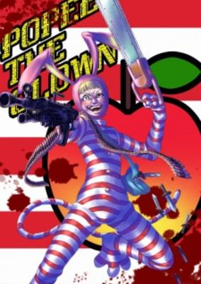

**Studio:** Zuiyo &nbsp;|&nbsp; **Episodes:** 39 &nbsp;|&nbsp; **Director:** Ryuuji Masuda &nbsp;|&nbsp; **Aired/Released:** January 3 – December 28, 2001 &nbsp;|&nbsp; **Genres:** Comedy, Violent Retribution For Accidental Infringement, Alien, Slapstick, Dementia

> Popee the Performer deals with a circus that operates in the middle of the desert. Each episode deals with the small cast of characters attempting at times to rehearse their performances, but it usually dissolves into the characters trying to humorously destroy each other in the usual cartoon manner. The star of the show, Popee, is a clown in an odd red-striped jumpsuit and bunny ears. He is adept at juggling, being a clown, pulling large knives and small bombs out of thin air. He is not adept at ever succeeding in his nefarious plans to hurt his poor assistant or the owner of the circus. His mischievous nature is the driving force of each episode.
>
> _Synopsis source: Kitsu_

[Wikipedia](https://en.wikipedia.org/wiki/Popee_the_Performer) · [Kitsu](https://kitsu.io/anime/popee-the-performer)

---

### Boogiepop Phantom

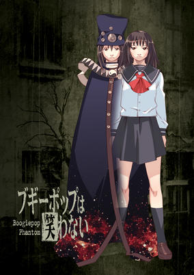

**Studio:** Madhouse &nbsp;|&nbsp; **Episodes:** 12 &nbsp;|&nbsp; **Director:** Takashi Watanabe &nbsp;|&nbsp; **Aired/Released:** January 5 – March 22 &nbsp;|&nbsp; **Genres:** Fantasy, Contemporary Fantasy, Earth, Japan, Asia, Angst, Violence, Present, Horror, Psychological, Mystery, Dementia

> Five years ago, a string of grisly murders shook the city to its core and now the rumors have begun once more. Boogiepop... Everyone knows about Boogiepop: meet her one dark night and you are taken. People tell each other the stories and laugh: no one believes that she can possibly exist in this day and age. Still, strange things appear to be going on and the darkness is taking on many forms. Something is out there. Are you safe?
>
> _Synopsis source: Kitsu_

[Wikipedia](https://en.wikipedia.org/wiki/Boogiepop_Phantom) · [Kitsu](https://kitsu.io/anime/boogiepop-phantom)

---

### Mon Colle Knights (Mon Colle Knights: Legend of the Fire Dragon)

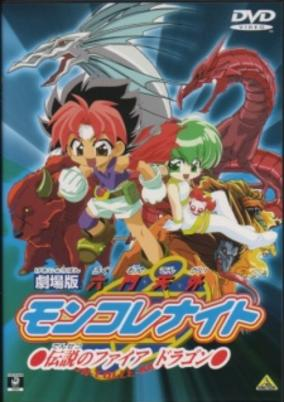

**Studio:** Studio Deen &nbsp;|&nbsp; **Episodes:** 51 &nbsp;|&nbsp; **Director:** Yasunao Aoki &nbsp;|&nbsp; **Aired/Released:** January 10 – December 25 &nbsp;|&nbsp; **Genres:** Comedy, Fantasy, Adventure

> An alternative interpretation of the series' start.
>
> _Synopsis source: Kitsu_

[Wikipedia](https://en.wikipedia.org/wiki/Mon_Colle_Knights) · [Kitsu](https://kitsu.io/anime/rokumon-tengai-mon-colle-knights-movie-densetsu-no-fire-dragon)

---

### Candidate for Goddess

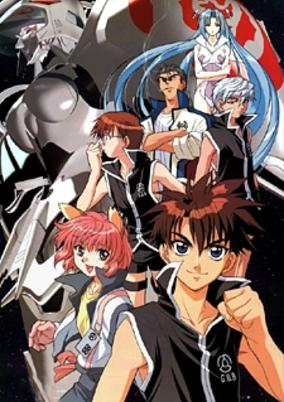

**Studio:** Xebec &nbsp;|&nbsp; **Episodes:** 12 &nbsp;|&nbsp; **Director:** Mitsuru Hongo &nbsp;|&nbsp; **Aired/Released:** January 20 – March 27 &nbsp;|&nbsp; **Genres:** Science Fiction, Mecha, Action, Piloted Robot, Juujin, Alien, Future, Space, Military

> In the future humankind has expanded and colonized other planets. Then an alien species, Victim, attacks the human colonies leaving only one planet, Zion. In an effort to stop Victim from destroying the last planet a training school, GOA, is set up to gather boys from the Zion colonies and train them to become pilots of the Ingrids AKA The Goddesses, five fighting robots that protect Zion. The boys must possess a rare blood type, EO, as well as a special ability, or EX. Zero (Candidate 88) has just arrived in GOA when he falls into the cockpit of the Ingrid Eeva-Leena. Since the synch between pilot and Ingrid are very sensitive everyone believes the Goddess will kill Zero in an attempt to synch. Just before Zero passes out he makes a full synch with the Goddess. Before he can find out more about the incident, his pilot training begins.
>
> _Synopsis source: Kitsu_

[Wikipedia](https://en.wikipedia.org/wiki/Candidate_for_Goddess) · [Kitsu](https://kitsu.io/anime/pilot-candidate)

---

### Carried by the Wind: Tsukikage Ran

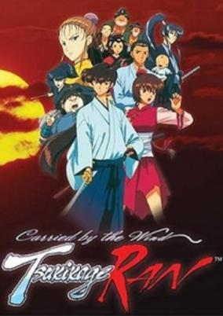

**Studio:** Madhouse &nbsp;|&nbsp; **Episodes:** 13 &nbsp;|&nbsp; **Director:** Akitaro Daichi &nbsp;|&nbsp; **Aired/Released:** January 26 – April 19 &nbsp;|&nbsp; **Genres:** Earth, Japan, Action, Asia, Comedy, Swordplay, Martial Arts, Past, Slapstick, Samurai, Historical, Adventure

> In the Edo or Tokugawa period (1600–1868), Ran, a female wandering samurai whose skill with the katana is only matched by her taste for sake (rice wine), is joined by a chinese martial artist who calls herself Lady Meow of the Iron Cat Fist. Tsukikage Ran has individual episodes that are just short stories of their adventures.
>
> _Synopsis source: Kitsu_

[Kitsu](https://kitsu.io/anime/kazemakase-tsukikage-ran)

---

### The Super Milk-chan Show

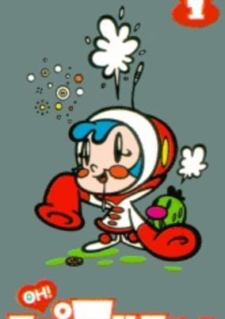

**Studio:** Pierrot &nbsp;|&nbsp; **Episodes:** 12 &nbsp;|&nbsp; **Director:** Takahiro Oomori &nbsp;|&nbsp; **Aired/Released:** January 27 – April 13 &nbsp;|&nbsp; **Genres:** Action, Parody, Comedy, Slapstick, Alternative Present, Plot Continuity, Present, Science Fiction

> Milk-chan is a drooling, potty-mouthed baby who lives in an apartment with an obsolete robot named Tetsuko, a slug named Hanage, and an uncontrollable pet named Robodog. Whenever the President calls, Milk-chan and the gang rush to the scene to solve any type of problem - whether it's stopping a money counterfeiter hungry for Belgian waffles or counselling a school of drunk fish. At the same time, they have to avoid a nagging landlord, as they're six months behind their rent.
>
> _Synopsis source: Kitsu_

[Wikipedia](https://en.wikipedia.org/wiki/The_Super_Milk-chan_Show) · [Kitsu](https://kitsu.io/anime/oh-super-milk-chan)

---

### Mushrambo (Shinzo)

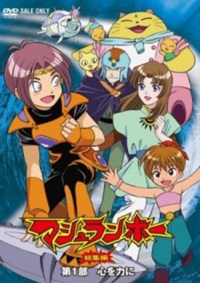

**Studio:** Toei Animation &nbsp;|&nbsp; **Episodes:** 32 &nbsp;|&nbsp; **Director:** Tetsuo Imazawa &nbsp;|&nbsp; **Aired/Released:** February 5 – September 23 &nbsp;|&nbsp; **Genres:** Science Fiction, Adventure, Angst, Fantasy

> In the world of Mushrambo, human life has all but come to an end. After a deadly virus threatened the extinction of mankind, a new race called the Enterrans was created to preserve life on Earth. However, relations between the Enterrans and their creators did not remain peaceful. Soon a war broke out with the Enterrans fighting against the humans and their robots. Ultimately the Enterrans were the victors of this conflict, renaming Earth as Enterra in honor of their victory. Before the last vestiges of humanity fell, one of the few remaining scientists put his daughter, Yakumo Shindou, into a sleep chamber. His hope was that his daughter would one day reawaken and find the human sanctuary known as Shinzo, reviving humanity and restoring peace between humans and Enterrans. Centuries have passed since the war; Yakumo now awakens and meets an Enterran named Mashura who pledges to assist in her quest. Also joined by the Enterrans Sago and Kutal, the group must now work to locate Yakumo's missing memories and locate Shinzo. But not every Enterran is as kind as Yakumo's new friends and some are prepared to commit any atrocity to prevent the return of humanity.
>
> _Synopsis source: Kitsu_

[Wikipedia](https://en.wikipedia.org/wiki/Mushrambo) · [Kitsu](https://kitsu.io/anime/mushrambo)

---

### Miami Guns

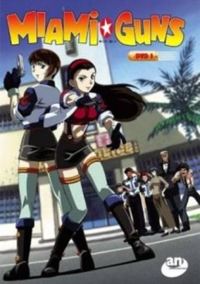

**Studio:** Group TAC &nbsp;|&nbsp; **Episodes:** 13 &nbsp;|&nbsp; **Director:** Yoshitaka Koyama &nbsp;|&nbsp; **Aired/Released:** February 5 – May 20 &nbsp;|&nbsp; **Genres:** Ecchi, Action, Comedy, Gunfights, United States, Absurdist Humour, Cops

> Spoiled rich girl Yao Sakurakouji decides to join the Miami police force to enjoy car chases, gunfights and wanton destruction. The psychotic and not-too-bright Yao is partnered with Lu Amano, the soft-spoken and sharp-tongued daughter of the police chief. Together the dirty duo clean up the streets of Miami and take on a mysterious crime syndicate known only as 'The Organization'.
>
> _Synopsis source: Kitsu_

[Wikipedia](https://en.wikipedia.org/wiki/Miami_Guns) · [Kitsu](https://kitsu.io/anime/miami-guns)

---

### Mighty Cat Masked Niyander

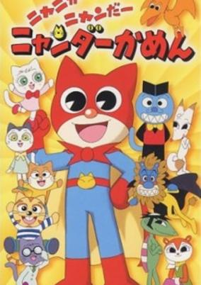

**Studio:** Sunrise &nbsp;|&nbsp; **Episodes:** 83 &nbsp;|&nbsp; **Director:** Tomomi Mochizuki &nbsp;|&nbsp; **Aired/Released:** February 6 – September 30, 2001 &nbsp;|&nbsp; **Genres:** Comedy

> One day a normal cat boy got a power to transform into a super "kamen cat". Whenever he heard people saying "help" he would dash right over there and help them fight against enemies.
>
> _Synopsis source: Kitsu_

[Wikipedia](https://en.wikipedia.org/wiki/Mighty_Cat_Masked_Niyander) · [Kitsu](https://kitsu.io/anime/nyani-ga-nyandaa-nyandaa-kamen)

---

### Ojamajo Doremi Sharp

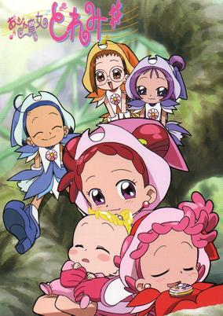

**Studio:** Toei Animation &nbsp;|&nbsp; **Episodes:** 49 &nbsp;|&nbsp; **Director:** Takuya Igarashi Shigeyasu Yamauchi &nbsp;|&nbsp; **Aired/Released:** February 6 – January 28, 2001 &nbsp;|&nbsp; **Genres:** Japan, Fantasy, Contemporary Fantasy, Elementary School, Comedy, Magic, Stereotypes, School Life, Magical Girl, Present

> At the end of the first season, Doremi and her friends all had to give up their witch powers and be normal girls again. This also meant that they couldn't see Majorika, Lala, and the fairies again. The MAHO-Dou was also deserted and the door to the Majokai was locked. The Queen, having seen all this through her crystal ball, secretly makes it so that Doremi and co. all end up heading into the Majokai again, with the excuse to return Majorika's hair dryer. However they end up stumbling into a garden, and one of the roses reveals a baby! The Queen tells the girls that they must raise the baby for a whole year. To help them, they receive newer and stronger witch powers than before! The adventure isn't over yet!
>
> _Synopsis source: Kitsu_

[Wikipedia](https://en.wikipedia.org/wiki/Ojamajo_Doremi_Sharp) · [Kitsu](https://kitsu.io/anime/ojamajo-doremi-sharp)

---

### UFO Baby

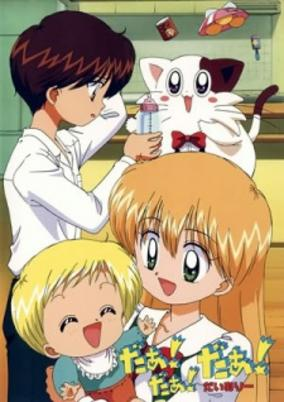

**Studio:** J.C.Staff &nbsp;|&nbsp; **Episodes:** 78 &nbsp;|&nbsp; **Director:** Hiroaki Sakurai &nbsp;|&nbsp; **Aired/Released:** March 28 – February 26, 2002 &nbsp;|&nbsp; **Genres:** Science Fiction, Japan, Asia, Earth, Slice of Life, Comedy, Slapstick, Present

> Miyu is an 8th grade girl, whose parents have been hired by NASA. They take off to America leaving Miyu with Mr. Saionji. Later, Mr. Saionji decides to go on a 1 year long trip to India leaving Miyu alone with his son, Kanata. More complications rise when an Alien baby and his babysitter pet crashes/lands in their house. To make things worse, alien baby starts calling Miyu and Kanata Mom and Dad, also showing ESP power and floating around.
>
> _Synopsis source: Kitsu_

[Wikipedia](https://en.wikipedia.org/wiki/UFO_Baby) · [Kitsu](https://kitsu.io/anime/daa-daa-daa)

---

### Monster Rancher

**Studio:** TMS Entertainment &nbsp;|&nbsp; **Episodes:** 25 &nbsp;|&nbsp; **Director:** Hiroyuki Yano &nbsp;|&nbsp; **Aired/Released:** April 1 – September 30 &nbsp;|&nbsp; **Genres:** Fantasy, Adventure, Proxy Battles, Action, Comedy

> Genki is a boy who loves playing video games. One day he's zapped into the world of Monster Rancher and meets the girl Holly and the monsters Mochi, Suezo, Golem, Tiger and Hare. Together, they are searching for a way to revive the Phoenix, which is the only monster capable of stopping the evil Moo.
>
> _Synopsis source: Kitsu_

[Wikipedia](https://en.wikipedia.org/wiki/Monster_Rancher_(TV_series)) · [Kitsu](https://kitsu.io/anime/monster-farm-enbanseki-no-himitsu)

---

### Digimon Adventure 02

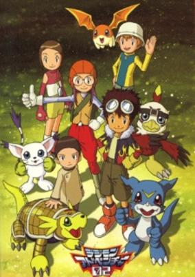

**Studio:** Toei Animation &nbsp;|&nbsp; **Episodes:** 50 &nbsp;|&nbsp; **Director:** Hiroyuki Kakudou &nbsp;|&nbsp; **Aired/Released:** April 2 – March 25, 2001 &nbsp;|&nbsp; **Genres:** Fantasy, Action, Proxy Battles, Adventure, Comedy, Friendship, Kids

> A few years after the adventures of the Chosen Children in the Digital World, a new batch of Chosen Children are summoned to save the Digital World. An evil ruler known as the Digimon Kaiser, or Digimon Emperor, is forcing the Digital World's Digimon into enslavement. The new group of Chosen Children, with the help of their Digimon, then begin a journey to stop the evil Digimon Emperor.
>
> _Synopsis source: Kitsu_

[Wikipedia](https://en.wikipedia.org/wiki/Digimon_Adventure_02) · [Kitsu](https://kitsu.io/anime/digimon-adventure-02)

---

### Hero Hero-kun

**Studio:** Studio Bogey Studio Flag &nbsp;|&nbsp; **Episodes:** 104 &nbsp;|&nbsp; **Director:** Yoshihiro Takamoto &nbsp;|&nbsp; **Aired/Released:** April 3 – January 2, 2001

---

### Gate Keepers

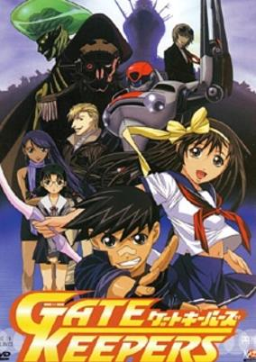

**Studio:** Gonzo &nbsp;|&nbsp; **Episodes:** 24 &nbsp;|&nbsp; **Director:** Junichi Sato &nbsp;|&nbsp; **Aired/Released:** April 3 – September 18 &nbsp;|&nbsp; **Genres:** Earth, Japan, Action, Asia, Comedy, Love Polygon, Humanoid Alien, School Life, Super Power, Mecha, Science Fiction, Fantasy

> It is Tokyo, 1969. Earth is under the attack of the "Invaders." Fortunately, though, the public is unaware of this. But to the secret orginazation, A.E.G.I.S., the threat is very real, and it is up them to stop this invasion. One day on his route to high school, Ukiya Shun observes a battle between a young girl and a group of Invaders. He ends up helping her and discovers that much like the girl, he possesses the ability to generate a "gate" of special power that only a few other people are gifted with. As a result, Ukiya then joins A.E.G.I.S. in an effort to recruit other Gate Keepers in order to protect the city, all while doing his best not to imitate his late father, whom he dispises.
>
> _Synopsis source: Kitsu_

[Wikipedia](https://en.wikipedia.org/wiki/Gate_Keepers) · [Kitsu](https://kitsu.io/anime/gate-keepers)

---

### Platinumhugen Ordian

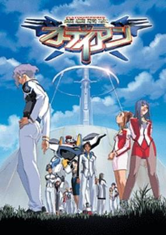

**Studio:** Plum &nbsp;|&nbsp; **Episodes:** 24 &nbsp;|&nbsp; **Director:** Masami Oobari &nbsp;|&nbsp; **Aired/Released:** April 4 – September 19 &nbsp;|&nbsp; **Genres:** Mecha, Action, Science Fiction

> Kananase Yu is just an ordinary high-school student. Since he has mysterious inside knowledge about piloting a mecha, he is recruited by the International Military Organization as a potential test pilot for a new mobile armor. However, apparently there are other young recruits around his age, including one of his classmates, were recruited as test pilot as well. Now Kananase Yu must prove that he is the best to be the test pilot.
>
> _Synopsis source: Kitsu_

[Wikipedia](https://en.wikipedia.org/wiki/Platinumhugen_Ordian) · [Kitsu](https://kitsu.io/anime/platinumhugen-ordian)

---

### Doki Doki Densetsu Mahōjin Guru Guru

**Studio:** Nippon Animation &nbsp;|&nbsp; **Episodes:** 38 &nbsp;|&nbsp; **Director:** Jun Takagi &nbsp;|&nbsp; **Aired/Released:** April 4 – December 26

[Wikipedia](https://en.wikipedia.org/wiki/Magical_Circle_Guru_Guru)

---

### Saiyūki

**Studio:** Pierrot &nbsp;|&nbsp; **Episodes:** 50 &nbsp;|&nbsp; **Director:** Hayato Date &nbsp;|&nbsp; **Aired/Released:** April 4 – March 27, 2001

[Wikipedia](https://en.wikipedia.org/wiki/Saiyuki_(manga)#Anime)

---

### Time Bokan 2000: Kaitou Kiramekiman

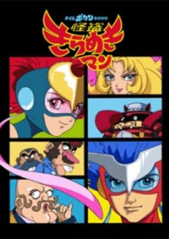

**Studio:** Tatsunoko Production &nbsp;|&nbsp; **Episodes:** 26 &nbsp;|&nbsp; **Director:** Hiroshi Sasagawa &nbsp;|&nbsp; **Aired/Released:** April 5 – October 4 &nbsp;|&nbsp; **Genres:** Science Fiction, Mecha, Action, Adventure, Comedy

> More Time Bokan adventures.
>
> _Synopsis source: Kitsu_

[Kitsu](https://kitsu.io/anime/time-bokan-2000-kaitou-kiramekiman)

---

### Transformers: Robots in Disguise

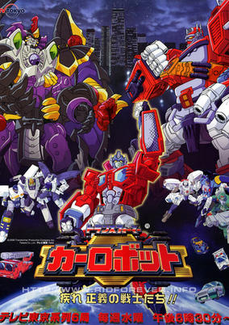

**Studio:** Gallop Dongwoo A&E &nbsp;|&nbsp; **Episodes:** 39 &nbsp;|&nbsp; **Director:** Osamu Sekita &nbsp;|&nbsp; **Aired/Released:** April 5 – December 27 &nbsp;|&nbsp; **Genres:** Transforming Craft, Science Fiction, Mecha, Action, Earth, Comedy, Alien, Future, Adventure

> The evil Gigatron has led his forces of Destrongers to Earth, where they seek to pillage the planet for its vast energy resources in order to fuel their war against the Autobots. If successful, the Destrongers will finally be able to tip the scale of power in the war to their favor, eliminating the Autobots and moving on to conquer the universe. To this end, the Destrongers kidnap the scientist Dr. Ohnishi, Earth’s leading scientist on energy and natural resources. Dr. Oonishi’s son, Koji, is contacted by none other than Fire Convoy, who takes the boy on a mission to rescue his father. Although Fire Convoy and the other Autobots fight valiantly, they are unable to rescue the doctor from the Destrongers. Now it is up to the Autobots and Koji to rescue Dr. Oonishi and protect the Earth and its resources from Gigatron and his army.
>
> _Synopsis source: Kitsu_

[Kitsu](https://kitsu.io/anime/transformers-robots-in-disguise)

---

### Hidamari no Ki (Tree in the Sun)

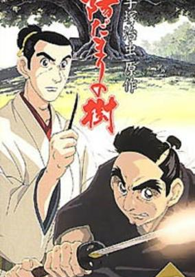

**Studio:** Madhouse &nbsp;|&nbsp; **Episodes:** 25 &nbsp;|&nbsp; **Director:** Gisaburou Sugii &nbsp;|&nbsp; **Aired/Released:** April 5 – September 20 &nbsp;|&nbsp; **Genres:** Bakumatsu   Meiji Period, Japan, Asia, Earth, Past, Violence, Historical

> A story set in the mid-1800's about a young doctor who has been trained in Western-style medicine and a young samurai who is trying to live up to the old traditions of his class and culture. The story is actually based upon real people - the doctor, Ryo-an, was Tezuka's great grandfather. During the Second Year of Ansei (1855) in Edo's Koishigawa are two young men, Manjiro Ibutani and Ryoan Tezuka. Ibutani is a low-ranking samurai who is a gifted swordsman and has a straightforward and strong sense of justice. Tezuka has a more carefree attitude. He has an eye for the ladies, but he is passionate about becoming a doctor. The two opposite characters come of age during the backdrop of the turbulent end of the Tokugawa Period (1600-1868 CE).
>
> _Synopsis source: Kitsu_

[Wikipedia](https://en.wikipedia.org/wiki/Hidamari_no_Ki) · [Kitsu](https://kitsu.io/anime/hidamari-no-ki)

---

### Sakura Wars

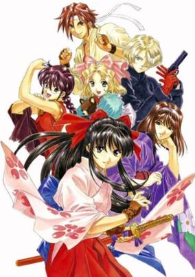

**Studio:** Madhouse &nbsp;|&nbsp; **Episodes:** 25 &nbsp;|&nbsp; **Director:** Ryutaro Nakamura &nbsp;|&nbsp; **Aired/Released:** April 8 – September 23 &nbsp;|&nbsp; **Genres:** Steampunk, Earth, Science Fiction, Mecha, Japan, Action, Asia, Comedy, Alternative Past, Past, Adventure

> Sakura travels to the capital with aspirations of defending the city from the demonic forces of the Black Sanctum Council like her father before her. However, things are not as she imagined as in addition to using her great spiritual energy to pilot a mech called a Kobu, she must also perform on stage as an actor as The Imperial Flower Division's cover is an art theater. Making a fool of herself and ruining a production gets her on everyone's bad side and somehow she must learn to work with them as well as prevent the enemy from destroying several shrines which protect the city.
>
> _Synopsis source: Kitsu_

[Wikipedia](https://en.wikipedia.org/wiki/Sakura_Wars) · [Kitsu](https://kitsu.io/anime/sakura-taisen)

---

### Boys Be...

**Studio:** HAL Film Maker &nbsp;|&nbsp; **Episodes:** 13 &nbsp;|&nbsp; **Director:** Masami Shimoda &nbsp;|&nbsp; **Aired/Released:** April 11 – July 4

[Wikipedia](https://en.wikipedia.org/wiki/Boys_Be...)

---

### Inspector Fabre (Dr. Fabre is a Detective)

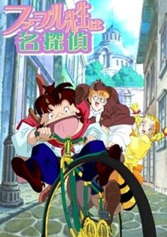

**Studio:** E&G Films &nbsp;|&nbsp; **Episodes:** 26 &nbsp;|&nbsp; **Director:** Masami Furukawa &nbsp;|&nbsp; **Aired/Released:** April 11 – October 17 &nbsp;|&nbsp; **Genres:** Mystery

> The world of insects is full of enchantment and amazement. This animation series is inspired by "the Diary of Insects" written by Jean Henri Fabre, an outstanding French entomologist and author in the 19th Century. In his original works, Mr. Fabre vividly described the life of insects. In this series all the insects and bugs have been personified and drawn into marvelous animated characters. This is the story of the exciting adventures of a crime-buster in the world of insects! Our hero's way of investigation is so unique and always ends with surprising solutions. The interesting ecology of various insects will be described while our 'cool' hero, Inspector Fabre, analyzes and unties the knots of crimes and conspiracy a la fashion of Sherlock Holmes!
>
> _Synopsis source: Kitsu_

[Kitsu](https://kitsu.io/anime/fabre-sensei-wa-meitantei)

---

### Banner of the Stars

**Studio:** Sunrise &nbsp;|&nbsp; **Episodes:** 13 &nbsp;|&nbsp; **Director:** Yasuchika Nagaoka &nbsp;|&nbsp; **Aired/Released:** April 14 – July 14 &nbsp;|&nbsp; **Genres:** Space Travel, Science Fiction, Genetic Modification, Action, Space Battles, Space Opera, Air Force, Shipboard, War, Future, Plot Continuity, Space, Military, Romance

> Three years after their adventure, Lafiel becomes captain on the brand new assault ship Basroil and Jinto finishes his training to become a supply officer and joins Lafiels crew. They set out to join a large fleet with the mission of defending the strategically important Laptic Gate from a force 15 times larger than their own. And to bring even more worries, their new fleet commander is from the Bebous family, a family notorious for their "Spectacular Insanity".
>
> _Synopsis source: Kitsu_

[Wikipedia](https://en.wikipedia.org/wiki/Banner_of_the_Stars) · [Kitsu](https://kitsu.io/anime/seikai-no-senki)

---

### Taro the Space Alien

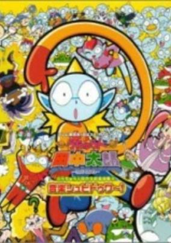

**Episodes:** 24 &nbsp;|&nbsp; **Aired/Released:** April 17 – March 26, 2001 &nbsp;|&nbsp; **Genres:** Comedy, School Life

> Takashi Horimachi is an ordinary curious fifth grader attending "Anytown" Elementary School. One day, a very unusual transfer student named Taro Tanaka joins Takashi's class. Takashi and his classmates have never encountered anyone quite like Taro before. He is blue, has huge glowing eyes, pointy ears, a smooth bald head and one horn. Takashi, obsessed with trying to figure out this strange new visitor, attempts to track Taro's every move; and in the process he continuously falls victim to Taro's hilarious assortment of cosmic jokes and traps.
>
> _Synopsis source: Kitsu_

[Wikipedia](https://en.wikipedia.org/wiki/Taro_the_Space_Alien) · [Kitsu](https://kitsu.io/anime/uchuujin-tanaka-tarou)

---

### Yu-Gi-Oh! Duel Monsters (Yu-Gi-Oh!)

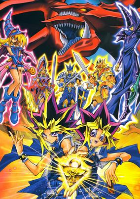

**Studio:** Gallop &nbsp;|&nbsp; **Episodes:** 224 &nbsp;|&nbsp; **Director:** Kunihisa Sugishima &nbsp;|&nbsp; **Aired/Released:** April 18 – September 29, 2004 &nbsp;|&nbsp; **Genres:** Fantasy World, Japan, Adventure, Earth, Action, Asia, Card Games, Proxy Battles, Alternative Present, Present, Virtual Reality, Friendship, Science Fiction, Shounen

> Legend says that the enigmatic Millennium Puzzle will grant one wish to whoever deciphers its ancient secrets. Upon solving it, high school student Yuugi Mutou unleashes "another Yuugi," a peculiar presence contained inside. Now, whenever he is faced with a dilemma, this mysterious alter ego makes an appearance and aids him in his troubles. Wishing to unravel the mystery behind this strange spirit, Yuugi and his companions find themselves competing with several opponents in "Duel Monsters," a challenging card game used by people seeking to steal the Millennium Puzzle in a desperate attempt to harness the great power within. As the questions pile on, it is not long before they figure out that there is more than pride on the line in these duels. [Written by MAL Rewrite]
>
> _Synopsis source: Kitsu_

[Wikipedia](https://en.wikipedia.org/wiki/Yu-Gi-Oh!) · [Kitsu](https://kitsu.io/anime/yu-gi-oh-duel-monsters)

---

### Love Hina

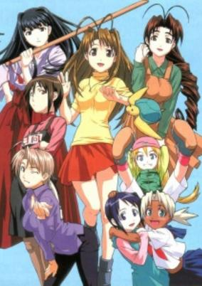

**Studio:** Xebec &nbsp;|&nbsp; **Episodes:** 24 &nbsp;|&nbsp; **Director:** Yoshiaki Iwasaki &nbsp;|&nbsp; **Aired/Released:** April 19 – September 27 &nbsp;|&nbsp; **Genres:** Romance, Ecchi, Japan, Asia, Earth, Slice of Life, Comedy, Violent Retribution For Accidental Infringement, Stereotypes, Present, Harem

> Keitaro Urashima promised a girl when he was young that they would meet up again at Tokyo University in the future. Sadly, in the National Practice Exam, Keitaro ranked 27th from the bottom. Knowing his grandmother owned a hotel, Keitaro intended to stay there while continuing his studies for Tokyo U, only to find out the hotel had long been transformed into an all-girls dormitory. Through an odd twist of fate, Keitaro eventually became the manager of the dorm, beginning his life of living with 5 other girls.
>
> _Synopsis source: Kitsu_

[Wikipedia](https://en.wikipedia.org/wiki/Love_Hina) · [Kitsu](https://kitsu.io/anime/love-hina)

---

### Ceres, Celestial Legend (Ceres)

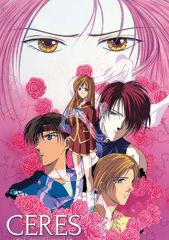

**Studio:** Pierrot &nbsp;|&nbsp; **Episodes:** 24 &nbsp;|&nbsp; **Director:** Hajime Kamegaki &nbsp;|&nbsp; **Aired/Released:** April 20 – September 28 &nbsp;|&nbsp; **Genres:** Earth, Conspiracy, Coming Of Age, Angst, Drama, Reverse Harem, Action, Romance, Japan, Asia, Violence, Present, Super Power, Adventure, Horror, Comedy, Psychological

> Ceres was a tennyo (Celestial maiden) who came down from the heavens to bathe in a stream. She hung her hagoromo (robe) on a tree nearby, which was her key to returning to the heavens. But the robe was stolen and the man who had stolen it forced her to become his wife, thus producing a family full of human and tennyo blood mixed. Now, in modern day time, Aya Mikage is a descendent of Ceres, and has quite an amount of tennyo blood. On her 16th birthday, she and her twin brother, Aki, are thrown a party. At the "party," Aya's grandpa plans to kill her, for she has tennyo powers unlike the rest of the family, and can actually become Ceres herself and destroy the Mikage family. Aya, however, can switch back, so this transformation happens quite frequently. With protector Yuuhi by her side, it is up to Aya to control Ceres and keep her from coming back, but her relationship with an ex-worker for her evil grandpa may be a distraction.
>
> _Synopsis source: Kitsu_

[Wikipedia](https://en.wikipedia.org/wiki/Ceres,_Celestial_Legend) · [Kitsu](https://kitsu.io/anime/ayashi-no-ceres)

---

### NieA_7

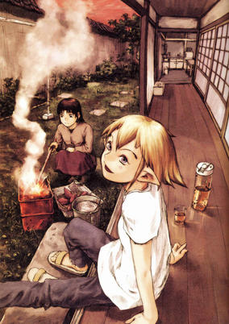

**Studio:** Triangle Staff &nbsp;|&nbsp; **Episodes:** 13 &nbsp;|&nbsp; **Director:** Takuya Sato Tomokazu Tokoro &nbsp;|&nbsp; **Aired/Released:** April 26 – July 19 &nbsp;|&nbsp; **Genres:** Science Fiction, Japan, Earth, Asia, Slice of Life, Comedy, Humanoid Alien, Alien

> In the 21st century, aliens have arrived on Earth and live among humans. In sleepy Enohana, the dirt-poor student Chigasaki Mayuko finds herself living together with NieA, a low-caste ("Under Seven") alien. While Mayuko struggles diligently to make ends meet, NieA seems to be totally unconcerned with the consequences of her actions. As the odd couple throws off the expected sparks, the wrecked alien mothership looms in the background...
>
> _Synopsis source: Kitsu_

[Wikipedia](https://en.wikipedia.org/wiki/NieA_7) · [Kitsu](https://kitsu.io/anime/niea-under-7)

---

### Medabots Spirits

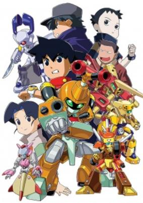

**Studio:** Trans Arts &nbsp;|&nbsp; **Episodes:** 39 &nbsp;|&nbsp; **Director:** Masatsugu Arakawa &nbsp;|&nbsp; **Aired/Released:** July 7 – March 30, 2001 &nbsp;|&nbsp; **Genres:** Science Fiction, Action, Adventure

> The sequel to the famous Medabots series, following the continuing adventures of Ikki and Metabee. The two encountered a strange enemy named Jinkai and the so called Death Medabots. Along with Nae and Erica, they will defeat Jinkai and the Death Medabots.
>
> _Synopsis source: Kitsu_

[Kitsu](https://kitsu.io/anime/medarot-damashii)

---

### Hamtaro

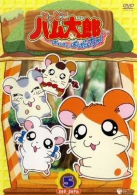

**Studio:** TMS Entertainment &nbsp;|&nbsp; **Episodes:** 296 &nbsp;|&nbsp; **Director:** Osamu Nabeshima &nbsp;|&nbsp; **Aired/Released:** July 7 – March 31, 2006 &nbsp;|&nbsp; **Genres:** Adventure, Slice of Life, Comedy, Anthropomorphism, Kids

> He's small, fluffy, and absolutely adorable: Hamtarou is one perfect little hamster! After moving to a new house with his owner, 5th grader HirokoHaruna, Hamtarou discovers other hamsters and quickly makes friends. The group of hamster explorers call themselves the Ham-Hams, and there's nowhere they won't go. The Ham-Hams go on crazy adventures all around the city while their owners are away, visiting everything from plays to magical lands of candy. Meanwhile, the humans face their own dramas.. Hamtarou meets a huge cast of different personalities, gets himself into—and out of—some pretty tight spots, and even helps Hiroko and her friends out more than once. Through it all, he never stops being unbearably cute. It's Hamtarou time!
>
> _Synopsis source: Kitsu_

[Wikipedia](https://en.wikipedia.org/wiki/Hamtaro) · [Kitsu](https://kitsu.io/anime/hamtaro)

---

### Strange Dawn

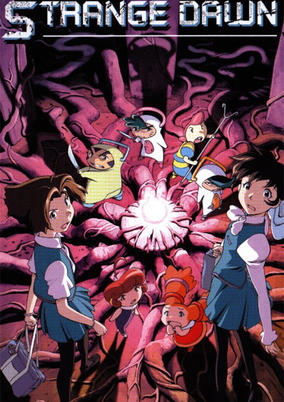

**Studio:** HAL Film Maker &nbsp;|&nbsp; **Episodes:** 13 &nbsp;|&nbsp; **Director:** Shogo Koumoto Junichi Sato (Co-director) &nbsp;|&nbsp; **Aired/Released:** July 11 – September 26 &nbsp;|&nbsp; **Genres:** Fantasy, Parallel Universe, Plot Continuity, Adventure

> Yuko and Eri are two normal girls who are sucked into the alternate world filled with tiny people. The people of this mysterious world sees them as their "Great Protectors" who can protect their land in a time of strife. The two girls set out on a mission with a group of warriors from the village to find out how they were brought here and how might they return home. However, there is a war brewing and these two Great Protectors are the political tool that every faction lusts for to rally the people to their side.
>
> _Synopsis source: Kitsu_

[Wikipedia](https://en.wikipedia.org/wiki/Strange_Dawn) · [Kitsu](https://kitsu.io/anime/strange-dawn)

---

### Brigadoon: Marin & Melan (Brigadoon)

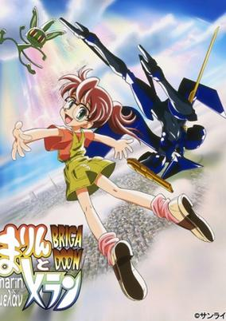

**Studio:** Sunrise &nbsp;|&nbsp; **Episodes:** 26 &nbsp;|&nbsp; **Director:** Yoshitomo Yonetani &nbsp;|&nbsp; **Aired/Released:** July 21 – February 9, 2001 &nbsp;|&nbsp; **Genres:** Loli, Science Fiction, Mecha, Japan, Action, Earth, Fantasy World, Asia, Comedy, Alternative Past, Gunfights, Swordplay, Cyborg, Conspiracy, Coming Of Age, Other Planet, Alien, Drama, Past, Slapstick, Plot Continuity, Violence, Adventure

> Marin is a typical junior high school girl with a sunny disposition and a loving adoptive family. Her life takes a drastic change when a mysterious mirage is seen in the sky above the entire earth. Killer androids called Monomakia descend to earth from the formation in the sky called Brigadoon and begin to hunt down little Marin. She discovers a blue bottle in a shrine as she seeks escape and from the bottle comes a protector, a sword carrying gun slinging alien called Melan Blue, together they must save the earth and deal with family crisis, school prejudice and the police and come to an understanding of Marins past and Melans unexplained mission, as well as learn to trust each other. Set in 1969 Japan with a colorful cast of friends and enemies.
>
> _Synopsis source: Kitsu_

[Kitsu](https://kitsu.io/anime/brigadoon)

---

### Hand Maid May

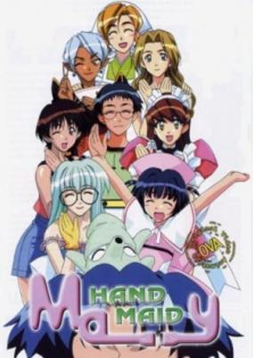

**Studio:** TNK &nbsp;|&nbsp; **Episodes:** 10 &nbsp;|&nbsp; **Director:** Shinichiro Kimura &nbsp;|&nbsp; **Aired/Released:** July 26 – September 27 &nbsp;|&nbsp; **Genres:** Earth, Ecchi, Romance, Science Fiction, Japan, Asia, Comedy, Maid, Love Polygon, Android, Harem

> Saotome Kazuya is a computer whiz. One day his friend Nanbara, threatens him with a computer virus. Trying to stop the virus, Kazuya ends up making a special order. May is a cyberdoll that arrives at his door a few minutes later and she is 1/6th the size of a normal person, which makes for many awkward situations. Not to mention the fact Kazuya can't even afford to keep May. Cyberdyne is not satisfied with Kazuya's non-payments and will do anything to retrieve CBD May.
>
> _Synopsis source: Kitsu_

[Wikipedia](https://en.wikipedia.org/wiki/Hand_Maid_May) · [Kitsu](https://kitsu.io/anime/hand-maid-may)

---

### Dinozaurs: The Series

**Studio:** Sunrise &nbsp;|&nbsp; **Episodes:** 26 &nbsp;|&nbsp; **Director:** Kiyoshi Fukumoto &nbsp;|&nbsp; **Aired/Released:** July 28 – November 30

---

### Descendants of Darkness

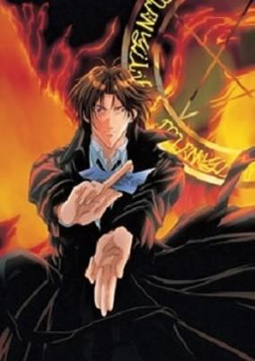

**Studio:** J.C.Staff &nbsp;|&nbsp; **Episodes:** 13 &nbsp;|&nbsp; **Aired/Released:** October 2 – December 18 &nbsp;|&nbsp; **Genres:** Earth, Japan, Action, Fantasy, Contemporary Fantasy, Asia, Comedy, Bishounen, Magic, Horror, Violence, Present, Shounen Ai, Super Power, Vampire

> Even after death, life is full of paperwork and criminals. Tsuzuki Asato is a 26 year old, happy-go-lucky, and dorky shinigami (god of death) whose job is to makes sure that those who are dead remain dead and stay in their proper realms. Even though he's had this job for over 70 years, he is in the worst division with horrible pay. He also has a knack for not keeping partners (since shinigami work in pairs), but now he seems to have one that will stick around; stubborn, smart-mouthed, serious and defensive 16 year old, Kurosaki Hisoka. With each case they investigate, they come closer to the conspiracies of the serial killer Dr. Muraki Kazutaka. Tsuzuki's relationship with Hisoka is growing stronger and closer...but there is a dark past to how Tsuzuki died that will not give him peace.
>
> _Synopsis source: Kitsu_

[Wikipedia](https://en.wikipedia.org/wiki/Descendants_of_Darkness) · [Kitsu](https://kitsu.io/anime/yami-no-matsuei)

---

### Vandread

**Studio:** Gonzo &nbsp;|&nbsp; **Episodes:** 13 &nbsp;|&nbsp; **Director:** Takeshi Mori &nbsp;|&nbsp; **Aired/Released:** October 3 – December 19 &nbsp;|&nbsp; **Genres:** Ecchi, Transforming Craft, Science Fiction, Mecha, Action, Space Opera, Humanoid Alien, Shipboard, Alien, Future, Space

> In Vandread, men are from Mars and women are from Venus! Well, not quite. Technology has allowed mankind to colonize the entire Milky Way galaxy, and in one star system, the men and women live on two different planets, Taraak and Mejere. A bitter and very literal gender war rages, to the point where they don't even see each other as the sames species anymore! Hibiki Tokai, a male third-class laborer from Taraak, ends up stuck on a battleship after a botched attempt at stealing a robot. When female pirates capture the Taraakian Vanguard, things don't look like they could get any worse for Hibiki. Unfortunately, they do; when the male crew of the Vanguard fire on their captured vessel out of desperation, they created a giant wormhole, which sucks the Vanguard and the Mejeran pirate's ships into itself! Now, stuck far away from their home planets, these men and women must learn to work together if they ever wish to make it back home.
>
> _Synopsis source: Kitsu_

[Wikipedia](https://en.wikipedia.org/wiki/Vandread) · [Kitsu](https://kitsu.io/anime/vandread)

---

### Gravitation

**Studio:** Studio Deen &nbsp;|&nbsp; **Episodes:** 13 &nbsp;|&nbsp; **Director:** Bob Shirahata &nbsp;|&nbsp; **Aired/Released:** October 4 – January 10, 2001 &nbsp;|&nbsp; **Genres:** Romance, Japan, Present, Asia, Earth, Bishounen, Musical Band, Plot Continuity, Music, Shounen Ai, Comedy

> All Shuichi ever dreamed about was following in the footsteps of his pop idol, Ryuichi Sakuma and the band Nittle Grasper. Together with his best friend Hiro, Shuichi's formed a band called Bad Luck and they've even managed to get signed to a major recording label! Unfortunately, the studio deadlines are looming and Shuichi still hasn't finished the lyrics for any of the songs. What he needs is a little inspiration... but he's been running a little low in that department lately. While Hiro recommends finding a girlfriend, fate has other things in store for him... Walking through the park late one night, Shuichi's latest lyrics flutter away and land at the feet of a stunning stranger that takes his breath away. Unfortunately, that mysterious stranger happens to be the famous novelist Eiri Yuki, who completely crushes the young singer by telling him he has "zero talent". Now, Shuichi's so annoyed that he's managed to finish his song just so he can find and confront Yuki once again. But, are his actions really motivated by anger, or has he actually fallen in love?
>
> _Synopsis source: Kitsu_

[Wikipedia](https://en.wikipedia.org/wiki/Gravitation_(manga)) · [Kitsu](https://kitsu.io/anime/gravitation)

---

### Gear Fighter Dendoh

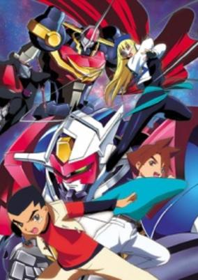

**Studio:** Sunrise &nbsp;|&nbsp; **Episodes:** 38 &nbsp;|&nbsp; **Director:** Mitsuo Fukuda &nbsp;|&nbsp; **Aired/Released:** October 4 – June 27, 2001 &nbsp;|&nbsp; **Genres:** Science Fiction, Mecha, Super Robot, Robot, Space, Action, Adventure, School Life

> The story takes place in the future where war machines from evil mechanical alien empire Garufa finally reaches Earth. In order to protect earth, an Earth defense organization called GEAR (Guard Earth and Advanced Reconnaissance) is formed. GEAR has an ultimate weapon in a form of war mecha, GEAR Fighter Dendoh, which is piloted by two elementary school students, namely Kusanagi Hokuto and Izumo Ginga. Can the friendship between Hokuto and Ginga unleashed the full potential power of Dendoh in order to fight Garufa?
>
> _Synopsis source: Kitsu_

[Wikipedia](https://en.wikipedia.org/wiki/Gear_Fighter_Dendoh) · [Kitsu](https://kitsu.io/anime/gear-fighter-dendoh)

---

### Hajime no Ippo (Fighting Spirit)

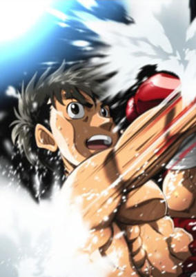

**Studio:** Madhouse &nbsp;|&nbsp; **Episodes:** 75 &nbsp;|&nbsp; **Director:** Satoshi Nishimura &nbsp;|&nbsp; **Aired/Released:** October 4 – March 27, 2002 &nbsp;|&nbsp; **Genres:** Boxing, Earth, Combat, Martial Arts, Slapstick, Sports, Action, Japan, Comedy, Asia, Plot Continuity, Present, Shounen

> Makunouchi Ippo has been bullied his entire life. Constantly running errands and being beaten up by his classmates, Ippo has always dreamed of changing himself, but never has the passion to act upon it. One day, in the midst of yet another bullying, Ippo is saved by Takamura Mamoru, who happens to be a boxer. Ippo faints from his injuries and is brought to the Kamogawa boxing gym to recover. As he regains consciousness, he is awed and amazed at his new surroundings in the gym, though lacks confidence to attempt anything. Takamura places a photo of Ippo's classmate on a punching bag and forces him to punch it. It is only then that Ippo feels something stir inside him and eventually asks Takamura to train him in boxing. Thinking that Ippo does not have what it takes, Takamura gives him a task deemed impossible and gives him a one week time limit. With a sudden desire to get stronger, for himself and his hard working mother, Ippo trains relentlessly to accomplish the task within the time limit. Thus Ippo's journey to the top of the boxing world begins. [Written by MAL Rewrite]
>
> _Synopsis source: Kitsu_

[Wikipedia](https://en.wikipedia.org/wiki/Hajime_no_Ippo) · [Kitsu](https://kitsu.io/anime/hajime-no-ippo)

---

### Argento Soma

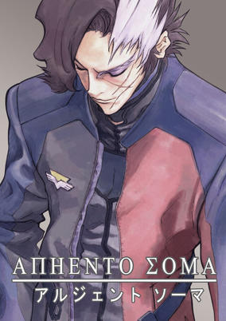

**Studio:** Sunrise &nbsp;|&nbsp; **Episodes:** 25 &nbsp;|&nbsp; **Director:** Kazuyoshi Katayama &nbsp;|&nbsp; **Aired/Released:** October 6 – March 22, 2001 &nbsp;|&nbsp; **Genres:** Science Fiction, Mecha, Earth, Action, Revenge, Angst, Alien, War, Drama, Future, Plot Continuity, Military, Adventure

> In the year 2059, the earth has been plagued by aliens for several years. In an effort to learn more about these aliens, Dr. Noguchi and his assistants Maki Agata and Takuto Kaneshiro try to revive the professor's experiment, a large Bio-Mechanical alien named Frank. During this process the alien comes to 'life' and the lab is subsequently destroyed leaving Takuto the only survivor and the alien disappearing into the wilderness. While Frank roams the wilderness he meets Hattie, an emotionally distressed young girl whose parents are killed in the first 'close encounter' war. Oddly enough she is able to communicate with Frank and soon after they are taken into custody by a secret agency known only as 'Funeral'. Meanwhile, Takuto wakes up in a hospital bed with his life in shambles, and his face disfigured. Motivated by vengeance and heart break, Takuto accepts an offer from the mysterious 'Mr. X' and receives a new identity as a ranking Funeral officer named Ryu Soma.
>
> _Synopsis source: Kitsu_

[Wikipedia](https://en.wikipedia.org/wiki/Argento_Soma) · [Kitsu](https://kitsu.io/anime/argento-soma)

---

### Sci-fi Harry

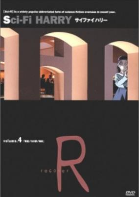

**Studio:** APPP &nbsp;|&nbsp; **Episodes:** 20 &nbsp;|&nbsp; **Director:** Katsuyuki Kodera &nbsp;|&nbsp; **Aired/Released:** October 6 – March 23, 2001 &nbsp;|&nbsp; **Genres:** Earth, Contemporary Fantasy, Fantasy, United States, Magic, Americas, Horror, Alternative Present, Law And Order, Action, Romance, Plot Continuity, Violence, Present, Cops, Super Power, Science Fiction

> Harry is definitely not your average American teenager. Instead, he is the epitome of an "alienated youth" - friendless at school, extremely weird and nervous to the point of paranoia. But a chance occurrence causes Harry to start to demonstrate what appear to be psychic powers - yet he neither believes in them nor consciously controls them. But there are other ominous forces at work who do believe in Harry, and attempt to make use of him in ways that are threatening and frightful.
>
> _Synopsis source: Kitsu_

[Wikipedia](https://en.wikipedia.org/wiki/Sci-Fi_Harry) · [Kitsu](https://kitsu.io/anime/sci-fi-harry)

---

### Legendary Gambler Tetsuya

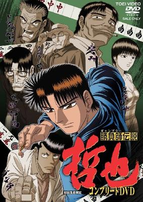

**Studio:** Toei Animation &nbsp;|&nbsp; **Episodes:** 20 &nbsp;|&nbsp; **Director:** Nobutaka Nishizawa &nbsp;|&nbsp; **Aired/Released:** October 7 – March 24, 2001 &nbsp;|&nbsp; **Genres:** Japan, Earth, Asia, Sports, Past, Plot Continuity, Historical

> In the year 1947, the people of Shinjuku are down on their luck. With little money to buy food or necessities, some resort to gambling in order to survive. Traveling Tetsuya chooses to spend his time at Mahjong parlors where he is wiping the floor clean with his adversaries. However, when Tetsuya meets the intensely skilled Boushu-san, he realizes that his skills are still lacking.
>
> _Synopsis source: Kitsu_

[Wikipedia](https://en.wikipedia.org/wiki/Legendary_Gambler_Tetsuya) · [Kitsu](https://kitsu.io/anime/shoubushi-densetsu-tetsuya)

---

### Shin Megami Tensei: Devil Children

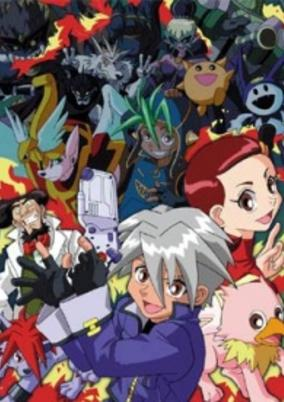

**Studio:** Tokyo Movie &nbsp;|&nbsp; **Episodes:** 50 &nbsp;|&nbsp; **Director:** Yoshio Takeuchi &nbsp;|&nbsp; **Aired/Released:** October 7 – September 29, 2001 &nbsp;|&nbsp; **Genres:** Fantasy, Action, Friendship, Magic, Demon, Science Fiction, Adventure, Kids

> A series based off of the Shin Megami Tensei: Devil Children franchise.
>
> _Synopsis source: Kitsu_

[Kitsu](https://kitsu.io/anime/shin-megami-tensei-devil-children)

---

### Baby Felix

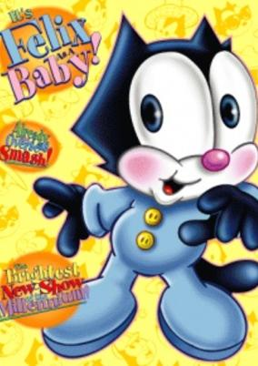

**Studio:** Radix &nbsp;|&nbsp; **Episodes:** 65 &nbsp;|&nbsp; **Aired/Released:** October 8 – June 29, 2001 &nbsp;|&nbsp; **Genres:** Adventure, Comedy, Kids

> A young Felix the Cat and his baby pals find fun and mischief along their travels.
>
> _Synopsis source: Kitsu_

[Wikipedia](https://en.wikipedia.org/wiki/Baby_Felix) · [Kitsu](https://kitsu.io/anime/baby-felix)

---

### Invincible King Tri-Zenon

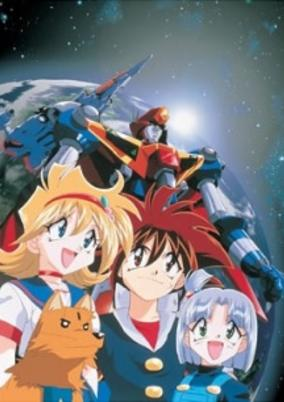

**Studio:** E&G Films &nbsp;|&nbsp; **Episodes:** 22 &nbsp;|&nbsp; **Director:** Takashi Watanabe &nbsp;|&nbsp; **Aired/Released:** October 14 – March 17, 2001 &nbsp;|&nbsp; **Genres:** Science Fiction, Mecha, Action, Comedy

> During the Edo Period, 3 mysterious space capsules were sent down to earth. Fear that it might bring chaos to the earth, the humans at that time buried these 3 objects down beneath the ground and entrusted a piece of descriptive map to the Kamui family. Today, these 3 objects were awaken one by one. The first to awaken, Tri-Zenon, one of the Zenon Guardians is now driven by the descendant of the Kamui family, Akira Kamui, his brother Ai Kamui and his friend Kanna. Aliens who descend to earth with a purpose will now have to face Tri-Zenon.
>
> _Synopsis source: Kitsu_

[Wikipedia](https://en.wikipedia.org/wiki/Invincible_King_Tri-Zenon) · [Kitsu](https://kitsu.io/anime/tri-zenon)

---

### Inuyasha

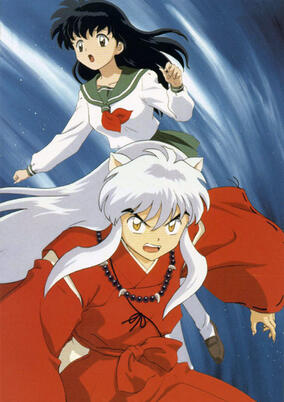

**Studio:** Sunrise &nbsp;|&nbsp; **Episodes:** 167 &nbsp;|&nbsp; **Director:** Masashi Ikeda Yasunao Aoki &nbsp;|&nbsp; **Aired/Released:** October 16 – September 13, 2004 &nbsp;|&nbsp; **Genres:** Adventure, Contemporary Fantasy, Asia, Earth, Comedy, Fantasy, Action, Alternative Past, Swordplay, Juujin, Martial Arts, Time Travel, Love Polygon, Magic, Past, Slapstick, Romance, Japan, Parallel Universe, Plot Continuity, Violence, Demon, Super Power, Shounen, Isekai

> Based on the Shogakukan award-winning manga of the same name, InuYasha follows Kagome Higurashi, a fifteen-year-old girl whose normal life ends when a demon drags her into a cursed well on the grounds of her family's Shinto shrine. Instead of hitting the bottom of the well, Kagome ends up 500 years in the past during Japan's violent Sengoku period with the demon's true target, a wish-granting jewel called the Shikon Jewel, reborn inside of her. After a battle with a revived demon accidentally causes the sacred jewel to shatter, Kagome enlists the help of a young hybrid dog-demon/human named Inuyasha to help her collect the shards and prevent them from falling into the wrong hands. Joining Kagome and Inuyasha on their quest are the orphan fox-demon Shippo, the intelligent monk Miroku, and the lethal demon slayer Sango. Together, they must set aside their differences and work together to find the power granting shards spread across feudal Japan and deal with the threats that arise. [Written by MAL Rewrite]
>
> _Synopsis source: Kitsu_

[Wikipedia](https://en.wikipedia.org/wiki/Inuyasha) · [Kitsu](https://kitsu.io/anime/inuyasha)

---

### Android Kikaider: The Animation (Android Kikaider)

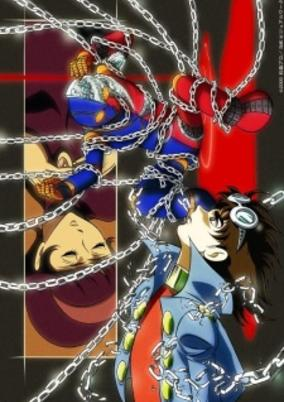

**Studio:** Radix Studio OX &nbsp;|&nbsp; **Episodes:** 13 &nbsp;|&nbsp; **Director:** Tensai Okamura &nbsp;|&nbsp; **Aired/Released:** October 16 – January 8, 2001 &nbsp;|&nbsp; **Genres:** Action, Mecha, Android, Science Fiction

> The genius robotics professor, Dr. Komyoji has created Jiro (who has the ability to transform into Kikaider) – a humanoid robot tasked with the protection of Dr. Komyoji’s son, Masaru, and daughter, Mitsuko. Gifted with a conscience circuit, which has the power to simulate real emotions that helps to distinguish between “right and wrong”, Jiro must protect Mitsuko and Masaru from the evil Dr. Gil who wants Jiro to join his army and aid in his goal of world domination.
>
> _Synopsis source: Kitsu_

[Kitsu](https://kitsu.io/anime/jinzou-ningen-kikaider-the-animation)

---

### Ghost Stories

**Studio:** Pierrot &nbsp;|&nbsp; **Episodes:** 19 &nbsp;|&nbsp; **Director:** Noriyuki Abe &nbsp;|&nbsp; **Aired/Released:** October 22 – March 25, 2001

[Wikipedia](https://en.wikipedia.org/wiki/Ghost_Stories_(2000_TV_series))

---

### Hiwou War Chronicles

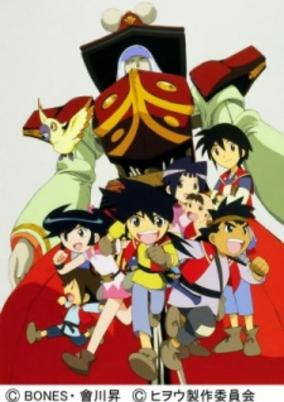

**Studio:** Bones &nbsp;|&nbsp; **Episodes:** 26 &nbsp;|&nbsp; **Director:** Tetsurou Amino &nbsp;|&nbsp; **Aired/Released:** October 24 – May 1, 2001 &nbsp;|&nbsp; **Genres:** Mecha, Japan, Piloted Robot, Alternative Past, Samurai, Historical, Action, Adventure

> 8 years ago, Western Civilization visited 19th century Japan. Mechanized dolls and new steam-powered creations began spreading throughout the country. The Wind Gang is a group of doll and steam users who believe in using their creations to violently bring about a new Industrial Era. They attack and destroy the peaceful village of a young doll user named Hiwou one day. Hiwou and his friends escape with a giant doll named Homura. Hiwou now wants to find his father, so that he can help defeat the Wind Gang, and bring peace back to Japan.
>
> _Synopsis source: Kitsu_

[Wikipedia](https://en.wikipedia.org/wiki/Hiwou_War_Chronicles) · [Kitsu](https://kitsu.io/anime/clockwork-fighters-hiwou-s-war)

---

### Dotto! Koni-chan (.Koni-chan)

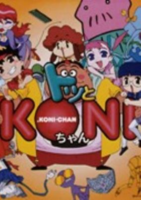

**Studio:** Shaft &nbsp;|&nbsp; **Episodes:** 26 &nbsp;|&nbsp; **Director:** Shinichi Watanabe &nbsp;|&nbsp; **Aired/Released:** November 26 – May 29, 2001 &nbsp;|&nbsp; **Genres:** Japan, Adventure, Parody, Comedy, Super Deformed, Anthropomorphism, Robot Helper, Slapstick

> Koni (whose character is based on the famous Sumo-wrestler) and his gang have lots of crazy and incoherent adventures in their town. From fighting with their "Lovely-Teacher" and dealing with Samurai fish, to confirming if "The Armored-Guy's" wife has an affair and saving the world, Koni, High, Moro, Nari and Afro, the Afro-dog, do the craziest and funniest things to have fun.
>
> _Synopsis source: Kitsu_

[Wikipedia](https://en.wikipedia.org/wiki/Dotto!_Koni-chan) · [Kitsu](https://kitsu.io/anime/dotto-koni-chan)

---

## Original net animations

### Anon Sentai Ranger 5

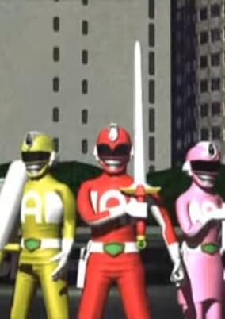

**Studio:** Anon Pictures &nbsp;|&nbsp; **Episodes:** 1 &nbsp;|&nbsp; **Aired/Released:** January 26 &nbsp;|&nbsp; **Genres:** Music, Parody, Super Power, Superhero

> Anon Pictures' parody of Super Sentai opening sequences.
>
> _Synopsis source: Kitsu_

[Kitsu](https://kitsu.io/anime/anon-sentai-ranger-5)

---

### Azumanga Web Daioh

**Studio:** Ajia-do &nbsp;|&nbsp; **Episodes:** 1 &nbsp;|&nbsp; **Director:** Hiroshi Nishikiori &nbsp;|&nbsp; **Aired/Released:** December 28

[Wikipedia](https://en.wikipedia.org/wiki/Azumanga_Daioh)

---

## Original video animations

### The King of Braves GaoGaiGar Final (GaoGaiGar Final)

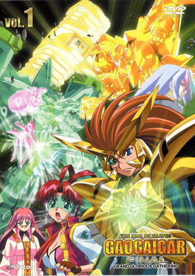

**Studio:** Sunrise &nbsp;|&nbsp; **Episodes:** 8 &nbsp;|&nbsp; **Director:** Yoshitomo Yonetani Yuuji Yamaguchi &nbsp;|&nbsp; **Aired/Released:** January 21 – March 21, 2003 &nbsp;|&nbsp; **Genres:** Space Travel, Transforming Craft, Science Fiction, Mecha, Action, Piloted Robot, Human Enhancement, Cyborg, Other Planet, Humanoid Alien, Alien, Drama, Robot Helper, Android, Alternative Present, Plot Continuity, Present, Space, Adventure

> Following Gutsy Galaxy Guard`s victory over the Zonder Empire and the 31 Primevals, a new threat makes their appearance on Earth. GGG - with Guy Shishio and the newly-constructed GaoFighGar - team up with their French counterpart Chasseur to battle the evil organization BioNet. Among Chasseur`s ranks is Renais Cardiff Shishioh - a former BioNet cyborg with the relentless pursuit of destroying those who took away her humanity. But as GGG and Chasseur fight the BioNet, GGG`s bases around the world are suddenly attacked, and the recently-discovered "Q-Parts" and the original Gao Machines are stolen by Mamoru Amami, who has been abducted and cloned by an even greater threat known as the "Eleven Kings of Sol." Evicted from Earth by the United Nations, GGG must now travel to the far reaches of the galaxy to battle the Eleven Kings of Sol and save Mamoru before it`s too late.
>
> _Synopsis source: Kitsu_

[Wikipedia](https://en.wikipedia.org/wiki/The_King_of_Braves_GaoGaiGar_Final) · [Kitsu](https://kitsu.io/anime/gaogaigar-final)

---

### The Prince and the Coral Sea

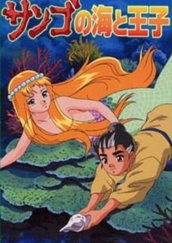

**Studio:** Toei Animation &nbsp;|&nbsp; **Episodes:** 1 &nbsp;|&nbsp; **Aired/Released:** February &nbsp;|&nbsp; **Genres:** Fantasy

> On the island of Okinawa, driven by his kindhearted nature, a boy named Ray determines to stop the destruction of the island's natural forests and coral reef, no matter what he has to give. What will he give to stop a tidal wave from killing the island's people?
>
> _Synopsis source: Kitsu_

[Kitsu](https://kitsu.io/anime/sango-no-umi-to-ouji)

---

### First Kiss Story

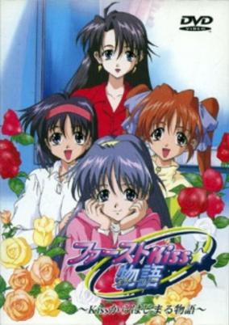

**Studio:** Garyuu Studio &nbsp;|&nbsp; **Episodes:** 1 &nbsp;|&nbsp; **Director:** Kan Fukumoto &nbsp;|&nbsp; **Aired/Released:** February 14 &nbsp;|&nbsp; **Genres:** Present, Earth, Japan, Stereotypes, Asia, Romance

> Kana's having trouble studying for her college entrance exams, and the way her older boyfriend is all but ignoring her isn't helping the matter. It all changes when she meets Shogo, a new teacher at her school and a relative of her father... one that's moving into her house!
>
> _Synopsis source: Kitsu_

[Wikipedia](https://en.wikipedia.org/wiki/First_Kiss_Monogatari) · [Kitsu](https://kitsu.io/anime/first-kiss-monogatari)

---

### Go! Anpanman: Playing with the robot is fun!

**Episodes:** 2 &nbsp;|&nbsp; **Aired/Released:** March 20 – November 22

---

### Black Jack: Sora Kara Kita Kodomo

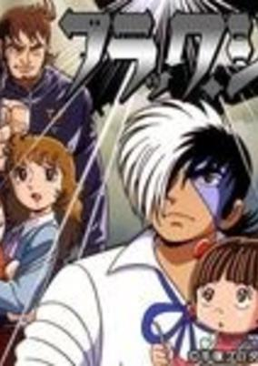

**Studio:** Tezuka Productions &nbsp;|&nbsp; **Episodes:** 1 &nbsp;|&nbsp; **Director:** Shinji Seya &nbsp;|&nbsp; **Aired/Released:** March 22 &nbsp;|&nbsp; **Genres:** Earth, Japan, Asia, Drama, Alternative Present

> An army plane defects from the U-ran (Uranium) Union and lands in Black Jack's garden carrying a family. Their purpose is to have their son, who is suffering from an incurable disease, treated by Black Jack. But it is beyond even BJ's ability to cure the disease.
>
> _Synopsis source: Kitsu_

[Kitsu](https://kitsu.io/anime/black-jack-sora-kara-kita-kodomo)

---

### Karakuri no Kimi (Puppet Princess)

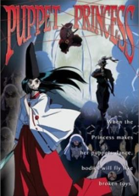

**Studio:** TMS Entertainment &nbsp;|&nbsp; **Episodes:** 1 &nbsp;|&nbsp; **Director:** Hirotoshi Takaya &nbsp;|&nbsp; **Aired/Released:** March 24 &nbsp;|&nbsp; **Genres:** Ninja, Fantasy, Japan, Earth, Action, Asia, Comedy, Swordplay, Martial Arts, Dark Fantasy, Past, Samurai, Historical, Horror

> Princess Rangiku lost her entire family to Lord Karimata, who invaded her home seeking her father's life work, puppets with unique capabilities. As her duty, Rangiku sets out with three of her father's greatest puppet warriors to seek revenge. She can manipulate these to battle the strongest of warriors, however manipulating the puppets leaves her own self vulnerable to direct attacks, so she seeks a ninja warrior named Manajiri to aid and protect her in her quest.
>
> _Synopsis source: Kitsu_

[Wikipedia](https://en.wikipedia.org/wiki/Karakuri_no_Kimi) · [Kitsu](https://kitsu.io/anime/karakuri-no-kimi)

---

### Angelique: White Wing Memoirs

**Studio:** Yumeta Company &nbsp;|&nbsp; **Episodes:** 2 &nbsp;|&nbsp; **Aired/Released:** March 25 – June 27

[Wikipedia](https://en.wikipedia.org/wiki/Angelique_(anime))

---

### FLCL

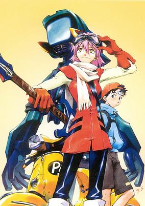

**Studio:** Gainax Production I.G &nbsp;|&nbsp; **Episodes:** 6 &nbsp;|&nbsp; **Director:** Kazuya Tsurumaki &nbsp;|&nbsp; **Aired/Released:** April 26 – March 16, 2001 &nbsp;|&nbsp; **Genres:** Coming Of Age, Android, Slapstick, Alternative Present, Science Fiction, Action, Mecha, Romance, Japan, Comedy, Parody, Asia, Present, Earth, Dementia

> Nothing interesting happens in Naota's life since his brother left for America, leaving him with his grandfather and father in their boring little town. On his way home with Mamimi—his brother's ex-girlfriend—a pink-haired, crazy woman riding a Vespa, named Haruko, suddenly slams into him, kisses him, and then bashes him in the head with her guitar before riding off. The next thing he knows, the crazy girl is working as his housekeeper, two robots sprout from his forehead to do battle, and the surviving one starts living with him as well. I think it's fair to say that Naota has parted ways with his old mundane life.FLCL is a kooky coming-of-age story with surprisingly deep undertones as the twelve-year-old Naota develops through the wild antics of Haruko and matures along the way into adulthood.
>
> _Synopsis source: Kitsu_

[Wikipedia](https://en.wikipedia.org/wiki/FLCL) · [Kitsu](https://kitsu.io/anime/flcl)

---

### Amon: The Apocalypse of Devilman

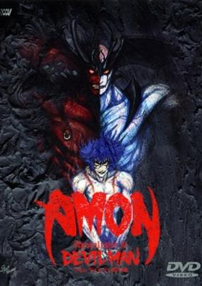

**Studio:** Studio Live &nbsp;|&nbsp; **Episodes:** 1 &nbsp;|&nbsp; **Director:** Kenichi Takeshita &nbsp;|&nbsp; **Aired/Released:** May 24 &nbsp;|&nbsp; **Genres:** Contemporary Fantasy, Earth, Fantasy, Japan, Action, Asia, Dystopia, Horror, Parallel Universe, Violence, Present, Demon, Super Power, Psychological

> Fear runs rampant throughout Tokyo with the revelation that demons in fact exist amongst us. Paranoia and the darker side of humanity boils onto the streets as people turn on one another, suspecting that anyone could in fact be a demon hiding in human clothing. Amidst the growing tensions, tragedy strikes Akira causing his mind to snap, retreating into his subconscious, allowing his Devilish alter-ego Amon to break free from Akira's cage of flesh and wreak havoc on both human and demons alike.
>
> _Synopsis source: Kitsu_

[Kitsu](https://kitsu.io/anime/amon-the-apocalypse-of-devilman)

---

### Angel Sanctuary

**Studio:** HAL Film Maker &nbsp;|&nbsp; **Episodes:** 3 &nbsp;|&nbsp; **Director:** Kiyoko Sayama &nbsp;|&nbsp; **Aired/Released:** May 25 – August 25 &nbsp;|&nbsp; **Genres:** Fantasy, Ecchi, Romance, Japan, Action, Asia, Angel, Angst, Horror, Violence, Present, Demon

> Setsuna Mudo is a college freshman, just trying to get by without running afoul of his bullying seniors. It doesn't help that he's in love with his sister, Sara, who only sees him once a month. But there's more to his life than just keeping his head down. Setsuna is ambushed by mysterious beings, angels, and demons, all professing to know his true destiny. The angels say he is the reincarnation of their leader Alexiel, while the demons claim he led them to war against God himself. As Setsuna struggles with his identity in such strange times, the eternal conflict between Heaven and Hell threatens to reignite. Will he be prepared when it does?
>
> _Synopsis source: Kitsu_

[Wikipedia](https://en.wikipedia.org/wiki/Angel_Sanctuary) · [Kitsu](https://kitsu.io/anime/tenshi-kinryouku)

---

### JoJo no Kimyou na Bouken: Adventure

**Studio:** APPP &nbsp;|&nbsp; **Episodes:** 7 &nbsp;|&nbsp; **Director:** Yasuhito Kikuchi Hideki Futamura Noboru Furuse &nbsp;|&nbsp; **Aired/Released:** May 25 – January 25, 2002

[Wikipedia](https://en.wikipedia.org/wiki/JoJo%27s_Bizarre_Adventure_(TV_series))

---

### Denshin Mamotte Shugogetten

**Studio:** Toei Animation &nbsp;|&nbsp; **Episodes:** 8 &nbsp;|&nbsp; **Director:** Yukio Kaizawa &nbsp;|&nbsp; **Aired/Released:** June 23 – November 30, 2001

[Wikipedia](https://en.wikipedia.org/wiki/Mamotte_Shugogetten)

---

### Space Travelers The Animation (Space Travelers)

**Studio:** Robot Films &nbsp;|&nbsp; **Episodes:** 1 &nbsp;|&nbsp; **Director:** Takashi Ui &nbsp;|&nbsp; **Aired/Released:** June 23 &nbsp;|&nbsp; **Genres:** Pirate, Science Fiction, Mecha, Earth, Action, Space Opera, Post Apocalypse, Air Force, Dystopia, Shipboard, Future, Stereotypes, Space, Military

> In the New Cosmic Century 038, humanity is suddenly attacked by an unknown alien civilization known as the Orbital Ring System. Soon, the entire Earth Civilization Sphere has been cut off from the space colonies, and is under the control of the ORS. Only Hayabusha Jetter, along with his band of misfit space pirates and smugglers, can break through ORS lines.
>
> _Synopsis source: Kitsu_

[Kitsu](https://kitsu.io/anime/space-travelers-the-animation)

---

### Koutetsu Tenshi Kurumi Encore (Steel Angel Kurumi Encore)

**Studio:** OLM &nbsp;|&nbsp; **Episodes:** 4 &nbsp;|&nbsp; **Director:** Naohito Takahashi &nbsp;|&nbsp; **Aired/Released:** July 19 – October 4 &nbsp;|&nbsp; **Genres:** Alternative Past, Past, Android, Romance, Japan, Comedy, Asia, Earth, Historical, Science Fiction

> Four additional short stories of the Steel Angels: Saki becomes a film actress, Karinka goes on a blind date with Kamihito, Kurumi practices the art of becoming a traditional Japanese woman, and the rest of the Steel Angels engage in a contest to win Nakahito's heart.
>
> _Synopsis source: Kitsu_

[Wikipedia](https://en.wikipedia.org/wiki/Steel_Angel_Kurumi_Encore) · [Kitsu](https://kitsu.io/anime/steel-angel-kurumi-encore)

---

### eX-Driver

**Studio:** Actas &nbsp;|&nbsp; **Episodes:** 6 &nbsp;|&nbsp; **Director:** Jun Kawagoe &nbsp;|&nbsp; **Aired/Released:** July 25 – September 25, 2001 &nbsp;|&nbsp; **Genres:** Earth, Japan, Action, Asia, Sports, Slice of Life, Special Squads, Street Racing, Law And Order, Motorsport, Science Fiction, Adventure, Comedy

> Ex-Driver is set in the future, when all transportation is easily controlled by AI. Though like all machines they tend to break down or lose control or re-programmed. This is where three high schoolers with non AI cars, Subaru WRX, Super 7, Lotus comes in to save the day and make sure the public is safe at all times.
>
> _Synopsis source: Kitsu_

[Wikipedia](https://en.wikipedia.org/wiki/%C3%89X-Driver) · [Kitsu](https://kitsu.io/anime/ex-driver)

---

### Geobreeders 2: Mouryou Yuugekitai File-XX Ransen Toppa

**Studio:** Chaos Project &nbsp;|&nbsp; **Episodes:** 4 &nbsp;|&nbsp; **Director:** Shin Misawa &nbsp;|&nbsp; **Aired/Released:** July 26 – March 23, 2001

[Wikipedia](https://en.wikipedia.org/wiki/Geobreeders)

---

### Kirara

**Studio:** Ashi Productions &nbsp;|&nbsp; **Episodes:** 1 &nbsp;|&nbsp; **Director:** Kiyoshi Murayama &nbsp;|&nbsp; **Aired/Released:** September 21

[Wikipedia](https://en.wikipedia.org/wiki/Kirara_(manga))

---

### Labyrinth of Flames

**Studio:** Studio Fantasia &nbsp;|&nbsp; **Episodes:** 2 &nbsp;|&nbsp; **Director:** Katsuhiko Nishijima &nbsp;|&nbsp; **Aired/Released:** September 25 – December 21 &nbsp;|&nbsp; **Genres:** Ecchi, Action, Russia, Comedy, Swordplay, Alternative Present, Samurai, Adventure

> Meet Galan, a Russian spastic geek who`d do anything to be a real, live samurai. But that`s just an impossible dream... or is it? When his friend Natsu, who is a successor of Japanese emigrants family, gives him the gift of an ancient sword, strange events unfold, and even stranger people drop out of the sky to attack. Now Galan must overcome his ineptitude and join a bunch of beautiful women in a wacky romp through a kingdom that time forgot. Hey, what could be better?
>
> _Synopsis source: Kitsu_

[Wikipedia](https://en.wikipedia.org/wiki/Labyrinth_of_Flames) · [Kitsu](https://kitsu.io/anime/honoo-no-labyrinth)

---

### Sin: The Movie

**Studio:** Phoenix Entertainment &nbsp;|&nbsp; **Episodes:** 1 &nbsp;|&nbsp; **Director:** Yasunori Urata Koubun Shizuno (Co-director) &nbsp;|&nbsp; **Aired/Released:** October 24 &nbsp;|&nbsp; **Genres:** Science Fiction, Genetic Modification, Action, Gunfights, Future, Violence, Horror, Cops

> In Sin, Blade must unravel a series of mysterious kidnappings. As he delves into the city's merciless underworld, an elaborate mystery unfold; at is heart, the SinTEK corporation and its leader, the ruthless and beautiful Elexis Sinclair. A Brilliant biochemist, Sinclair will stop at nothing to achieve her goal: a plan that could force the next step of human evolution-or spell doom for mankind.
>
> _Synopsis source: Kitsu_

[Kitsu](https://kitsu.io/anime/sin-the-movie)

---

### De:vadasy (Devadasy)

**Studio:** AIC &nbsp;|&nbsp; **Episodes:** 3 &nbsp;|&nbsp; **Director:** Nobuhiro Kondou &nbsp;|&nbsp; **Aired/Released:** November 25 – January 25, 2001 &nbsp;|&nbsp; **Genres:** Science Fiction, Mecha, Ecchi, Japan, Action, Piloted Robot, Psychological

> For young men like Kei, life is still plagued by nothing but homework and girl trouble. When an unknown force besieges Earth with robotic war machines, however, it is Kei who is chosen to defend the human race.
>
> _Synopsis source: Kitsu_

[Wikipedia](https://en.wikipedia.org/wiki/Devadasy) · [Kitsu](https://kitsu.io/anime/de-vadasy)

---

### Maetel Legend

**Studio:** Vega Entertainment &nbsp;|&nbsp; **Episodes:** 2 &nbsp;|&nbsp; **Director:** Kazuyoshi Yokota &nbsp;|&nbsp; **Aired/Released:** December 13 – March 7, 2001 &nbsp;|&nbsp; **Genres:** Science Fiction, Action, Human Enhancement, Cyborg, Conspiracy, Other Planet, Drama, Future, Friendship, Space

> The artificial sun that lights the frozen planet La Metalle is dying, threatening to extinguish what little life is left there. Queen La Andromeda Prometheum decides that the only way for her people to survive is for them to submit to Hardgear's transformation process, which will turn everyone's body into machines. The Queen's daughters, Emeraldas and Maetel, refuse to submit to this process, and fight to stay human.
>
> _Synopsis source: Kitsu_

[Wikipedia](https://en.wikipedia.org/wiki/Maetel_Legend) · [Kitsu](https://kitsu.io/anime/maetel-legend)

---

### Shin Getter Robo vs. Neo Getter Robo

**Studio:** Brain's Base &nbsp;|&nbsp; **Episodes:** 4 &nbsp;|&nbsp; **Director:** Jun Kawagoe &nbsp;|&nbsp; **Aired/Released:** December 21 – June 25, 2001 &nbsp;|&nbsp; **Genres:** Transforming Craft, Earth, Science Fiction, Mecha, Japan, Action, Super Robot, Piloted Robot, Asia, Future, Robot, Plot Continuity, Violence

> Years after the defeat of the Reptilian Empire, Getter Team has begun training on a new super robot, Neo Getter Robo. But a surprise attack from the Empire's revived leader forces them to recruit a street fighter named Go Ichimonji as Getter One's pilot. Faced with an enormously powerful foe, the new team's only hope for victory may lie in the resurrection of the lost weapon of humanity, Shin Getter Robo.
>
> _Synopsis source: Kitsu_

[Wikipedia](https://en.wikipedia.org/wiki/Shin_Getter_Robo_vs_Neo_Getter_Robo) · [Kitsu](https://kitsu.io/anime/shin-getter-robo-vs-neo-getter-robo)

---

### Try Z

**Episodes:** 1

---

### Koihime

**Episodes:** 2

---

### A Heat for All Seasons

**Episodes:** 3

---

## Films

### A.LI.CE

**Studio:** GAGA Communications, Inc. &nbsp;|&nbsp; **Director:** Kenichi Maejima &nbsp;|&nbsp; **Aired/Released:** February 5 &nbsp;|&nbsp; **Genres:** Science Fiction, Earth, Time Travel, Future

> Alice, the youngest person ever to be sent into space, is the only survivor when her flight crashes back to earth. Not only is she the only survivor, but she learns that she has been mysteriously catapulted 30 years to the future, where a mysterious dictator known as Nero rules the world with and iron fist and has sent his soldiers to capture, or kill her.
>
> _Synopsis source: Kitsu_

[Wikipedia](https://en.wikipedia.org/wiki/A.LI.CE) · [Kitsu](https://kitsu.io/anime/a-li-ce)

---

### One Piece: The Movie

**Studio:** Toei Animation &nbsp;|&nbsp; **Director:** Junji Shimizu &nbsp;|&nbsp; **Aired/Released:** March 4 &nbsp;|&nbsp; **Genres:** Fantasy, Pirate, Fantasy World, Adventure, Action, Comedy, Crime, Super Power, Friendship

> Woonan is the legendary Great Gold Pirate, earning the nickname after accumulating about 1/3 of the gold available in the world. Even after his disappearance, the tales of his gold being stashed away in a remote island continue to persist, a juicy target that other pirates lust for. One of the pirates going to great lengths to attain the treasure is El Drago. He and his crew have hunted down Woonan's former crew members one by one, and along the way, they find the map that will take them to the hidden island. The map is not all they come across; they also manage to come into contact with the straw hat pirates. After a short battle, Luffy and company are robbed and separated from one another. Now they must find a way to make it to the island before El Drago does and take the legendary treasure for themselves.
>
> _Synopsis source: Kitsu_

[Kitsu](https://kitsu.io/anime/one-piece-2000)

---

### Doraemon: A Grandmother's Recollections

**Studio:** Toho Company &nbsp;|&nbsp; **Director:** Ayumu Watanabe &nbsp;|&nbsp; **Aired/Released:** March 4 &nbsp;|&nbsp; **Genres:** Comedy, Science Fiction, Fantasy, Kids

> Nobita misses his granny that died a few years ago, so Doraemon takes Nobita to the past to see his grandmother one more time. But they face through a lot of things such as the younger selves of Nobita and his friends, and young Nobita's mother that doesn't recognize Nobita or Doraemon.
>
> _Synopsis source: Kitsu_

[Kitsu](https://kitsu.io/anime/doraemon-a-grandmother-s-recollections)

---

### Digimon Adventure: Our War Game (Digimon: Our War Game!)

**Studio:** Toei Animation &nbsp;|&nbsp; **Director:** Mamoru Hosoda &nbsp;|&nbsp; **Aired/Released:** March 4 &nbsp;|&nbsp; **Genres:** Adventure, Science Fiction, Japan, Present, Proxy Battles, Comedy, Fantasy, Friendship, Kids, Isekai

> This movie takes place after the Adventure series ends. It begins when a new Digimon Egg is found on the internet, and manages to penetrate into almost every computer system in Japan. When the egg hatches, it's identified as a new kind of Digimon, a Virus-type. It sustains itself by eating data from various system, and starts wreaking havok in Japan. As it consumes more and more data, it continues to evolve. And Taichi and Koushiro decide it's time to stop it. They're off, sending Agumon and Tentomon through the internet to fight off this new enemy. But, with the Virus controlling systems like the American military, all too soon, this digital menace may become all too real. Calling in the help of Yamato and Takeru, they hope that they can stop what's already begun, and maybe save this world a second time.
>
> _Synopsis source: Kitsu_

[Kitsu](https://kitsu.io/anime/digimon-adventure-bokura-no-war-game)

---

### Doraemon: Nobita and the Legend of the Sun King (Doraemon the Movie: Nobita's the Legend of the Sun King)

**Studio:** Shin-Ei Animation &nbsp;|&nbsp; **Director:** Tsutomu Shibayama &nbsp;|&nbsp; **Aired/Released:** March 11 &nbsp;|&nbsp; **Genres:** Comedy, Historical, Fantasy, Adventure, Kids

> Doraemon and its friends open a hole in the time and they're travel to the Country of Mayana, a lost Mayan civilization in the jungle. There, Nobita will know its perfect double, prince Thio, heir to the throne. Both will decide to interchange papers to try to save to the Country of Mayana of the claws of the infernal Ledina witch and her evil forces.
>
> _Synopsis source: Kitsu_

[Kitsu](https://kitsu.io/anime/doraemon-nobita-and-the-legend-of-the-sun-king)

---

### Detective Conan: Captured in Her Eyes (Case Closed Movie 4: Captured In Her Eyes)

**Studio:** TMS Entertainment &nbsp;|&nbsp; **Director:** Kenji Kodama &nbsp;|&nbsp; **Aired/Released:** March 22 &nbsp;|&nbsp; **Genres:** Earth, Japan, Asia, Thriller, Detective, Friendship, Present, Adventure, Comedy, Cops, Mystery

> A series of murders have occurred with police officers as victims. One of the officers is shot right in front of Ran's eyes, and the shock of the incident causes Ran to lose her memory of everyone and everything around her. Now Conan must help Ran regain her lost memories, while also protecting her from the murderer, who is targeting Ran for witnessing the crime.
>
> _Synopsis source: Kitsu_

[Kitsu](https://kitsu.io/anime/detective-conan-movie-04-captured-in-her-eyes)

---

### Crayon Shin-chan: Jungle That Invites Storm

**Studio:** Shin-Ei Animation &nbsp;|&nbsp; **Director:** Keiichi Hara &nbsp;|&nbsp; **Aired/Released:** April 22 &nbsp;|&nbsp; **Genres:** Earth, Asia, Comedy, Ecchi, Slice of Life, School Life, Kids

> An adventure set in a south island. Shinnosuke with his parents and friends joined a tour with the preview of Action Kamen's new movie 'South Sea Millennium Wars' on a luxury liner, but a funky guy who names himself Paradise King and his slave gang of gibbon monkeys took away all the adults to a south island. Gotaro Go, an actor playing the role of Action Kamen, with Shinnosuke, fights a martial-arts battle and air battle against Paradise King.
>
> _Synopsis source: Kitsu_

[Kitsu](https://kitsu.io/anime/crayon-shin-chan-movie-08-arashi-wo-yobu-jungle)

---

### Jin-Roh: The Wolf Brigade

**Studio:** Production I.G &nbsp;|&nbsp; **Director:** Hiroyuki Okiura &nbsp;|&nbsp; **Aired/Released:** June 3 &nbsp;|&nbsp; **Genres:** Romance, Japan, Action, Special Squads, Alternative Past, Gunfights, Thriller, Conspiracy, Angst, Drama, Past, Law And Order, Plot Continuity, Violence, Military, Cops, Psychological

> After witnessing the suicide bombing of a terrorist girl, Constable Kazuki Fuse becomes haunted by her image, and is forced to undergo retraining for his position in the Capital Police's Special Unit. However, unknown to him, he becomes a key player in a dispute between Capital and Local Police forces, as he finds himself increasingly involved with the sister of the very girl he saw die.
>
> _Synopsis source: Kitsu_

[Kitsu](https://kitsu.io/anime/jin-roh-the-wolf-brigade)

---

### Escaflowne (Escaflowne: A Girl in Gaea)

**Studio:** Sunrise Bones &nbsp;|&nbsp; **Director:** Kazuki Akane &nbsp;|&nbsp; **Aired/Released:** June 24 &nbsp;|&nbsp; **Genres:** Steampunk, Fantasy, Mecha, Fantasy World, Action, Parallel Universe, Violence, Science Fiction, Adventure, Romance, Isekai

> Hitomi Kanzaki is in a very depressed mood. She only wants to sleep and fade away. Her misery summons Lord Folken who sends her to Gaea. The people of Gaea think she is the Wing Goddess, who can call upon the legendary Dragon Armor called Escaflowne. On Gaea, King Van, the sole survior of the White Dragon Clan, is also in a depressed state. Swearing an oath to get his revenge on the Black Dragon Clan that obliterated Van's kingdom, he lives by the sword. Now that the Wing Goddess has finally appeared, she posseses Gaea's world fate in her heart. Escaflowne will either lead Gaea to peace or total ruin.
>
> _Synopsis source: Kitsu_

[Wikipedia](https://en.wikipedia.org/wiki/Escaflowne_(film)) · [Kitsu](https://kitsu.io/anime/escaflowne-a-girl-in-gaea)

---

### Pokemon Movie 03: Kesshoutou no Teiou Entei (Pokemon 3: The Movie)

**Studio:** OLM &nbsp;|&nbsp; **Director:** Kunihiko Yuyama &nbsp;|&nbsp; **Aired/Released:** July 8 &nbsp;|&nbsp; **Genres:** Fantasy, Proxy Battles, Action, Adventure, Comedy, Kids

> Mii Snowdon is left on her own after her father disappears while investigating the mysterious letter-shaped pokemon called the Unown. The only clue to her father's disappearance is a box containing several tiles. While playing with these tiles, Mii makes a wish to see her father again, and this wish awakens the Unown—who summon the lion-like, legendary pokemon Entei to act as her father. Meanwhile, Satoshi heads to Greenfield with his faithful pokemon companion, Pikachu, to meet with his friends, Kasumi and Takeshi. When they reach the area, they are shocked to find the place crystallized. They quickly learn that the Unown are responsible for this, and that they will need to be defeated in order to restore Greenfield to its former beauty. The situation becomes personal when Satoshi's mother is kidnapped by Entei. To discover why his mother was taken away, Satoshi, along with his friends and pokemon, must travel the crystallized landscape to confront Entei and the Unown. [Written by MAL Rewrite]
>
> _Synopsis source: Kitsu_

[Kitsu](https://kitsu.io/anime/pokemon-kesshoutou-no-teiou-entei)

---

### Cardcaptor Sakura Movie 2: The Sealed Card

**Studio:** Madhouse &nbsp;|&nbsp; **Director:** Morio Asaka &nbsp;|&nbsp; **Aired/Released:** July 15 &nbsp;|&nbsp; **Genres:** Comedy, Magical Girl, Shoujo

> Following the events of Cardcaptor Sakura Movie 2: The Sealed Card, Kero and Spinel share a plate of takoyaki (octopus balls). They get into a fight over who gets the last piece, and in the process send it flying out the window. They both chase the takoyaki, and each other, in a mighty effort to be the "takoyaki captor".
>
> _Synopsis source: Kitsu_

[Kitsu](https://kitsu.io/anime/cardcaptor-sakura-leave-it-to-kero-chan)

---

### The Boy Who Saw the Wind

**Studio:** Brain's Base &nbsp;|&nbsp; **Director:** Kazuki Ōmori &nbsp;|&nbsp; **Aired/Released:** July 22 &nbsp;|&nbsp; **Genres:** Steampunk, Fantasy, Fantasy World, Coming Of Age, Anti War, Dystopia, Angst, Drama, Past, Violence, Military, Super Power, Adventure

> Young boy Amon has mysterious powers. His dad is the cheif scientist for the Empire of the Golden Snake. He's invented weapons for this country in the past, but does not want his boy's powers to be used for destruction so he burns his research and tries to escape the country with his family. The mom and dad die in the escape and only Amon is left. He runs from the military, ends up on an island where he learns about the ancient people who could fly on the wind and talk to animals (as he can). Amon then ends up in a fishermen's village and makes friends with Maria. After this village is attacked by the Golden Snake army, the two run away with a band of rebels. Together, they try to stop the Empire of the Golden Snake from destroying and conquering everything. Based on the book by C.W. Nicol.
>
> _Synopsis source: Kitsu_

[Wikipedia](https://en.wikipedia.org/wiki/The_Boy_Who_Saw_the_Wind) · [Kitsu](https://kitsu.io/anime/kaze-wo-mita-shounen)

---

### Vampire Hunter D: Bloodlust

**Studio:** Madhouse &nbsp;|&nbsp; **Director:** Yoshiaki Kawajiri &nbsp;|&nbsp; **Aired/Released:** August 25 &nbsp;|&nbsp; **Genres:** Vampire, Romance, Post Apocalypse, Dystopia, Fantasy World, Fantasy, Action, Contemporary Fantasy, Bounty Hunter, Horror, Future, Science Fiction, Supernatural

> The story revolves around D, the infamous "dunpeal" (born of a vampire father and a human mother) outcast and renowned vampire hunter. His prowess at hunting the creatures of the night allowing his acceptance among humans, he is called upon to locate Charlotte Elbourne, the lovely daughter of an affluent family who has been mysteriously kidnapped. When the sun sets, the hunt goes on! Charlotte`s father offers a rich bounty, be she dead or alive, a task D willingly accepts, even with notorious Markus brothers and their gang of bounty hunters seeking the prize as well. Amidst the chase and unknown to all lurks a sinister evil which has been secretly manipulating their every move and has set a chilling trap that none will expect and few will survive. With the tables turned and the secrets revealed, the hunters could quickly become the hunted!
>
> _Synopsis source: Kitsu_

[Kitsu](https://kitsu.io/anime/vampire-hunter-d-bloodlust)

---

### Reign: The Conqueror

**Studio:** Madhouse &nbsp;|&nbsp; **Director:** Rintaro Yoshinori Kanemori &nbsp;|&nbsp; **Aired/Released:** October 7 &nbsp;|&nbsp; **Genres:** Earth, Fantasy, Middle East, Feudal Warfare, Swordplay, Europe, Cyberpunk, Past, Science Fiction, Action, Asia, Plot Continuity, Violence, Military, Historical, Adventure

> Prince Alexander, son of King Philip, and heir to the Macedonian empire, must fend off political saboteurs, assassins, and the jealousy of his own father to ascend to the position of king. Once there, he begins his quest to conquer all nations and become known as the Great King, though an ancient prophecy foretells that he will be the destroyer of the world and forever remembered as the Devil King.
>
> _Synopsis source: Kitsu_

[Kitsu](https://kitsu.io/anime/alexander-senki)

---

### Ah! My Goddess: The Movie

**Studio:** AIC &nbsp;|&nbsp; **Director:** Hiroaki Gouda &nbsp;|&nbsp; **Aired/Released:** October 21 &nbsp;|&nbsp; **Genres:** Fantasy, Romance, Japan, University, Deity, Magic, Drama, Alternative Present, Parallel Universe, Comedy

> For centuries, a god named Celestin has been imprisoned on the moon for betraying the kingdom of Yggdrasil. Released by the fairy Morgan Le Fey, Celestin travels to Earth to reunite with his former pupil, the goddess Belldandy. Things go awry as Celestin erases Belldandy's memories of her boyfriend Keiichi and uses her as a catalyst to wreak havoc on Earth and Yggdrasil.
>
> _Synopsis source: Kitsu_

[Kitsu](https://kitsu.io/anime/aa-megami-sama-movie)

---

### Blood: The Last Vampire

**Studio:** Production I.G &nbsp;|&nbsp; **Director:** Hiroyuki Kitakubo &nbsp;|&nbsp; **Aired/Released:** November 18 &nbsp;|&nbsp; **Genres:** Earth, Vampire, Japan, Action, Asia, Swordplay, Horror, Alternative Present, Violence, Present

> Teropterids are evil beasts which pose as humans and live only to drink human blood. Fortunately for the human world there are groups dedicated to destroying them. A brooding and mysterious girl named Saya is the best teropterid slayer there is, and now, in 1960s Japan, she is sent to a U. S. army base which may be infested...
>
> _Synopsis source: Kitsu_

[Kitsu](https://kitsu.io/anime/blood-the-last-vampire)

---

### Rokumon Tengai Mon Colle Knights Movie: Densetsu no Fire Dragon (Mon Colle Knights: Legend of the Fire Dragon)

**Studio:** Studio Deen &nbsp;|&nbsp; **Director:** Yasunao Aoki &nbsp;|&nbsp; **Aired/Released:** December 21 &nbsp;|&nbsp; **Genres:** Comedy, Fantasy, Adventure

> An alternative interpretation of the series' start.
>
> _Synopsis source: Kitsu_

[Wikipedia](https://en.wikipedia.org/wiki/Mon_Colle_Knights) · [Kitsu](https://kitsu.io/anime/rokumon-tengai-mon-colle-knights-movie-densetsu-no-fire-dragon)

---
