# 2001 in Anime

[← Back to index](../README.md)

119 titles · 98 with a matched synopsis/cover art · [source](https://en.wikipedia.org/wiki/2001_in_anime)

## Television series

### Zoids: New Century (Zoids Shin Seiki/Zero)

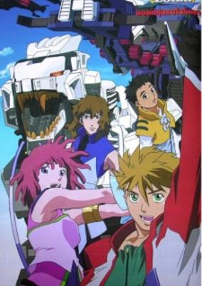

**Studio:** Xebec &nbsp;|&nbsp; **Director:** Takao Kato &nbsp;|&nbsp; **Aired/Released:** January 6 – June 30 &nbsp;|&nbsp; **Genres:** Science Fiction, Mecha, Earth, Action, Piloted Robot, Sports, Adventure, Comedy

> Zoids—powerful animal-shaped combat mechs—are no longer used in warfare, but in organized sporting competitions. The Blitz Team, a group of pilots struggling to carve out a niche for themselves in the Zoid battling leagues, experience a stroke of luck when Bit Cloud, a vagrant junk dealer, wanders into their midst and proves himself capable of piloting the temperamental Liger Zero, a Zoid that refuses to let anyone else into its cockpit. Led by Bit and the Liger, the Blitz Team steadily make their way to the top—but along the way they attract the unwelcome attention of the Backdraft Group, an organization of Zoid pilots that operates outside the laws set down by the Zoid Battle Commission. The Backdraft want powerful Zoids to add to their ranks, and they have their eye on the Liger Zero...
>
> _Synopsis source: Kitsu_

[Kitsu](https://kitsu.io/anime/zoids-shin-seiki-zero)

---

### Beyblade

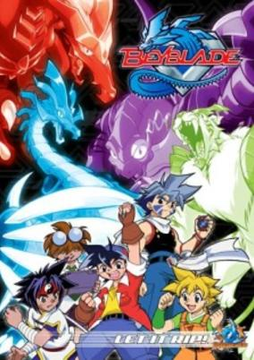

**Studio:** Madhouse &nbsp;|&nbsp; **Director:** Toshifumi Kawase &nbsp;|&nbsp; **Aired/Released:** January 8 – December 24 &nbsp;|&nbsp; **Genres:** Earth, Science Fiction, Action, Human Enhancement, Proxy Battles, Alternative Present, Stereotypes, Present, Adventure, Comedy, Friendship, Sports

> Thirteen-year-old Tyson Granger (Takao Kinomiya), along with his fellow teammates, Kai Hiwatari, Max Tate (Max Mizuhura), and Ray Kon (Rei Kon), strive to become the greatest Beybladers in the world. With the technical help of the team's resident genius, Kenny (Kyouju), and with the powerful strength of their BitBeasts, the Bladebreakers armed with their tops (AKA: Blades) attempt to reach their goal.
>
> _Synopsis source: Kitsu_

[Wikipedia](https://en.wikipedia.org/wiki/Beyblade_(manga)) · [Kitsu](https://kitsu.io/anime/bakuten-shoot-beyblade)

---

### Tales of Eternia The Animation (Tales of Eternia)

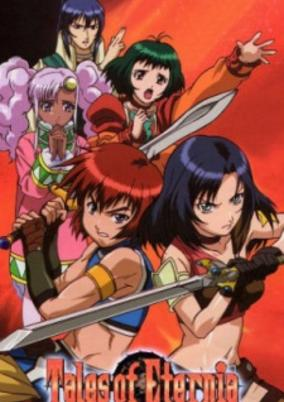

**Studio:** Xebec &nbsp;|&nbsp; **Director:** Shigeru Ueda &nbsp;|&nbsp; **Aired/Released:** January 8 – March 26 &nbsp;|&nbsp; **Genres:** Fantasy, Fantasy World, Action, Plot Continuity, Adventure, Comedy, Romance

> In order to prevent the catastrophe called the Grand Fall, Rid Hershel and his companions Farah, Keel and Meredy have obtained the three Greater Spirits ("Craymels" in the game version) of Inferia. En route to Mount Farlos, Rid is kidnapped by the bounty hunter Marone Blucarno, and the party is compelled to head to Belcarnu, an archipelago far from the major cities of Inferia. A series of adventures forces them to remain on the islands, where a more immediate threat to Inferia sleeps.
>
> _Synopsis source: Kitsu_

[Kitsu](https://kitsu.io/anime/tales-of-eternia)

---

### The Daichis: Earth's Defense Family

**Studio:** Group TAC &nbsp;|&nbsp; **Director:** Tetsu Kimura &nbsp;|&nbsp; **Aired/Released:** January 9 – March 29

[Wikipedia](https://en.wikipedia.org/wiki/The_Family%27s_Defensive_Alliance)

---

### Baki the Grappler

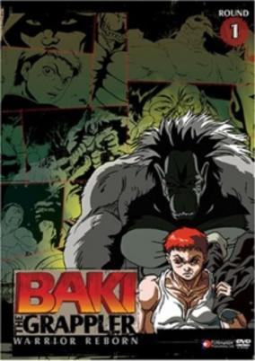

**Studio:** Group TAC &nbsp;|&nbsp; **Director:** Hitoshi Nanba &nbsp;|&nbsp; **Aired/Released:** January 9 – June 26 &nbsp;|&nbsp; **Genres:** Earth, Japan, Action, Asia, Combat, Sports, Martial Arts, Stereotypes, Plot Continuity, Violence, Present

> Baki Hanma is a young fighter who yearns to follow in the footsteps of his father, Yujiro, and become the strongest fighter in the world. Through that he trains tirelessly and fights constantly to hone his skills and develop his body to achieve these goals. Many intense battles lay ahead of Baki as he goes about his quest to be the best and ultimately take the title of "King" from his father.
>
> _Synopsis source: Kitsu_

[Wikipedia](https://en.wikipedia.org/wiki/Baki_the_Grappler) · [Kitsu](https://kitsu.io/anime/baki-the-grappler)

---

### Earth Maiden Arjuna (Arjuna)

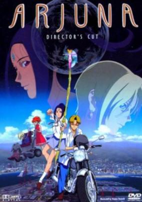

**Studio:** Satelight &nbsp;|&nbsp; **Director:** Shouji Kawamori &nbsp;|&nbsp; **Aired/Released:** January 9 – March 27 &nbsp;|&nbsp; **Genres:** Magical Girl, Plot Continuity, Present, Japan, Contemporary Fantasy, Fantasy, Magic, Romance, Demon, Science Fiction, Adventure

> Juna was just an ordinary high-school girl, right up until the day she died in a motorcycle accident. But there, in the twilight of death, she saw the future of the barren earth destroyed by the Raaja, and was offered a second chance at life if she would stop them. Now she must learn to cast aside her thoughtlessly destructive ways and face her destiny as the Avatar of Time, the one being who can decide the fate of the planet.
>
> _Synopsis source: Kitsu_

[Wikipedia](https://en.wikipedia.org/wiki/Earth_Maiden_Arjuna) · [Kitsu](https://kitsu.io/anime/chikyuu-shoujo-arjuna)

---

### Sadamitsu the Destroyer

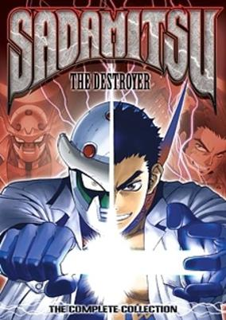

**Studio:** Studio Deen &nbsp;|&nbsp; **Director:** Kouichi Oohata &nbsp;|&nbsp; **Aired/Released:** January 17 – March 21 &nbsp;|&nbsp; **Genres:** Science Fiction, Mecha, Action, Alien, School Life

> Sadamitsu, a high-school delinguents turned to a masked-hero, while not dealing with his rocky relationship with the strong female protagonist, he puts on a motorcycle-helmet-like mask and becomes a semi-robotic superhero who fights. He is assisted by other possibly- mechanical creatures in order to save the earth from the invasion of 20,000,000 escaped alien convicts.
>
> _Synopsis source: Kitsu_

[Wikipedia](https://en.wikipedia.org/wiki/Sadamitsu_the_Destroyer) · [Kitsu](https://kitsu.io/anime/sadamitsu-the-destroyer)

---

### Motto! Ojamajo Doremi (More! Useless Witch Doremi)

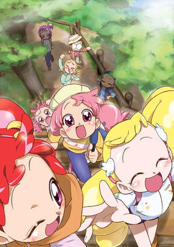

**Studio:** Toei Animation &nbsp;|&nbsp; **Director:** Takuya Igarashi &nbsp;|&nbsp; **Aired/Released:** February 4 – January 27, 2002 &nbsp;|&nbsp; **Genres:** Fantasy, Comedy, Magic, Friendship, Magical Girl

> After the losing of magical ability to become witches, they once again become them. But, now they have to go through tests from the Witches of the Witch World. They also meet a new member, from New York, U.S. comes Momoko (the yellow Ojamajo).
>
> _Synopsis source: Kitsu_

[Wikipedia](https://en.wikipedia.org/wiki/M%C5%8Dtto!_Ojamajo_Doremi) · [Kitsu](https://kitsu.io/anime/motto-ojamajo-doremi)

---

### Salaryman Kintaro

**Studio:** JCF &nbsp;|&nbsp; **Director:** Tomoharu Katsumata &nbsp;|&nbsp; **Aired/Released:** February 18 – March 18

[Wikipedia](https://en.wikipedia.org/wiki/Salary_Man_Kintaro)

---

### Dr. Rin ni Kiitemite!

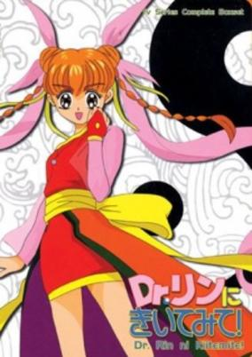

**Studio:** Studio Comet &nbsp;|&nbsp; **Director:** Shin Misawa &nbsp;|&nbsp; **Aired/Released:** March 5 – February 25, 2002 &nbsp;|&nbsp; **Genres:** Romance, Fantasy, Comedy, Magic, School Life

> Kanzaki Meirin, a junior high school student, posseses fusui power which can drive away evil spirits away whenever they appeared. She is in fact, the fortune teller Dr. Rin. She is in love with her best friend, soccer club member, Yuuki Asuka. However, Yuuki does not like fortune-telling and superstitious things.
>
> _Synopsis source: Kitsu_

[Wikipedia](https://en.wikipedia.org/wiki/Dr._Rin_ni_Kiitemite!) · [Kitsu](https://kitsu.io/anime/dr-rin-ni-kiitemite)

---

### Kidou Tenshi Angelic Layer (Battle Doll Angelic Layer)

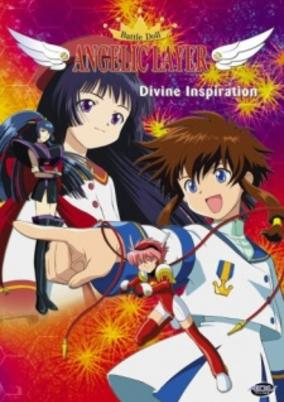

**Studio:** Bones &nbsp;|&nbsp; **Director:** Hiroshi Nishikiori &nbsp;|&nbsp; **Aired/Released:** April 1 – September 23 &nbsp;|&nbsp; **Genres:** Earth, Japan, Action, Asia, Comedy, Proxy Battles, School Life, Plot Continuity, Science Fiction, Sports

> 12-year-old Misaki Suzuhara has just gotten involved in Angelic Layer, a battling game using electronic dolls called angels. Even as a newbie, Misaki shows advanced skills as she meets new friends and enters Angelic Layer tournaments to fight the greatest Angelic Layer champions of the nation.
>
> _Synopsis source: Kitsu_

[Wikipedia](https://en.wikipedia.org/wiki/Battle_Doll_Angelic_Layer) · [Kitsu](https://kitsu.io/anime/angelic-layer)

---

### Cosmic Baton Girl Comet-san☆

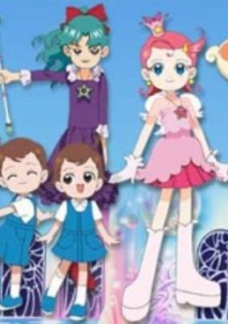

**Studio:** Nippon Animation &nbsp;|&nbsp; **Director:** Mamoru Kanbe &nbsp;|&nbsp; **Aired/Released:** April 1 – January 27, 2002 &nbsp;|&nbsp; **Genres:** Magic, Magical Girl, Science Fiction, Adventure, Comedy

> Comet (12 years old in human years) is the princess of the Harmonica Star country and was to meet the prince of the Tambourine Star country at a ball where he'd pick a bride. But he isn't there and so Comet is sent to Earth to find him. He'll be known by the starlight in his eyes. She finds the Earth and she loves the people she meets there. Meanwhile, Princess Meteor of the Castanet Star country also arrives on Earth in search of the prince. Comet's companion is a little puppy with a star at the end of his tail named Rubba Ball. Of course, Comet was not the first to visit the Earth and love it, another before her did as well and married. Her pet (a white cat with bunny ears and a tiny heart on her tail named Bunny) continued life as a kind of fairy in the forest. Comet's power is drawn from the stars of her home and is channeled through her baton; she also wears a special pendant from where Rubba Ball immerges, and with which she can detect and find the prince.
>
> _Synopsis source: Kitsu_

[Wikipedia](https://en.wikipedia.org/wiki/Princess_Comet) · [Kitsu](https://kitsu.io/anime/cosmic-baton-girl-comet-san)

---

### Super GALS! Kotobuki Ran (Super GALS!)

**Studio:** Pierrot &nbsp;|&nbsp; **Director:** Tsuneo Kobayashi &nbsp;|&nbsp; **Aired/Released:** April 1 – March 31, 2002 &nbsp;|&nbsp; **Genres:** Romance, Japan, Earth, Asia, Slice of Life, Comedy, Friendship, Present

> Sporting designer clothes, make-up, and nails, Ran Kotobuki is the very picture of a trendy, young Shibuya girl, but don't let that fool you. This girl comes from a family of cops, and she’s ready to lay you out flat if you even think about causing trouble in her town! At least, she will... when she’s not distracted with karaoke, shopping, and dodging her homework. Join Ran and her friends as they defend the streets of Shibuya and attempt to shop their way into the history books as the most famous Gals ever!
>
> _Synopsis source: Kitsu_

[Wikipedia](https://en.wikipedia.org/wiki/Super_GALS!_Kotobuki_Ran) · [Kitsu](https://kitsu.io/anime/super-gals)

---

### Digimon Tamers

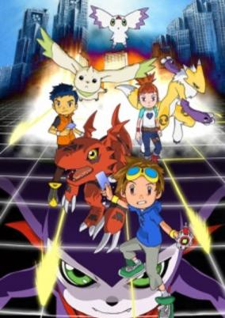

**Studio:** Toei Animation &nbsp;|&nbsp; **Director:** Yukio Kaizawa &nbsp;|&nbsp; **Aired/Released:** April 1 – March 31, 2002 &nbsp;|&nbsp; **Genres:** Earth, Fantasy, Science Fiction, Fantasy World, Japan, Action, Asia, Card Games, Proxy Battles, Parallel Universe, Present, Adventure, Comedy, Friendship, Isekai

> Digimon Tamers takes place in a world where the popular Digimon franchise is all the rage, consisting of a cartoon, video games, and the trading card game. Takato Matsuda is a huge Digimon fan that's particularly obsessed with the card game, and constantly daydreams about the universe therein. One day, he finds a mysterious blue card, which he slides through a scanner toy to use in the popular battle game. His toy suddenly glows and transforms into a Digivice, and Takato's fan-made design, Guilmon, materialises in front of him. Thrilled by the prospect of having a real-life Digimon, Takato embraces his new partner, and his adventures as a Digimon Tamer begin. Takato quickly discovers that being a Digimon Tamer is not all fun and games—in reality, it's much more dangerous than the card games he's accustomed to. Wild Digimon have begun to appear all across Japan, causing rampages that result in chaos and mayhem. Armed with his Digivice, which can scan trading cards to strengthen Guilmon, Takato and his new partner set out to combat the rogue Digimon. They are tasked with protecting the world from Digimon attacks, whilst a mysterious organization determined to eliminate all Digimon and their Tamers lurks in the shadows...
>
> _Synopsis source: Kitsu_

[Wikipedia](https://en.wikipedia.org/wiki/Digimon_Tamers) · [Kitsu](https://kitsu.io/anime/digimon-tamers)

---

### Comic Party

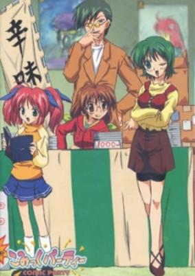

**Studio:** OLM &nbsp;|&nbsp; **Director:** Norihiko Sudo &nbsp;|&nbsp; **Aired/Released:** April 2 – June 25 &nbsp;|&nbsp; **Genres:** The Arts, Japan, Asia, Earth, Comedy, Present, Parody

> Destiny or delusion? It's a hilarious rollercoaster of laughter and confusion when Taishi, the ultimate otaku, drags his friend Kazuki into the swirling world of ambition, hatred, and love—the world of fan comics! Poor clueless Kazuki must sink or swim when he's dumped straight into the middle of a massive comic convention. Lost amidst hoards of buyers, sellers, and cosplayers, Kazuki is about to be baptized by fire, all in order to lead him toward his true calling: to take over the world through fan comics! Meanwhile, Kazuki's childhood friend Mizuki isn't about to let him be dragged from his normal life without a fight! But will she be able to stop the addictive draw of the new world that lies before Kazuki? Little by little, Kazuki is slipping down the path towards destiny—and Taishi is shoving him every step of the way!
>
> _Synopsis source: Kitsu_

[Wikipedia](https://en.wikipedia.org/wiki/Comic_Party) · [Kitsu](https://kitsu.io/anime/comic-party)

---

### Mahou Senshi Louie (Rune Soldier)

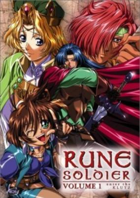

**Studio:** J.C.Staff &nbsp;|&nbsp; **Director:** Yoshitaka Koyama &nbsp;|&nbsp; **Aired/Released:** April 3 – September 18 &nbsp;|&nbsp; **Genres:** Fantasy, Adventure, Action, Comedy, Swordplay, Magic, Past

> Louie, a brawny student at the mage's guild, is reluctantly accepted by three girls (Merrill-thief, Genie-fighter, and Melissa-priestess) as a companion for their adventuring party. As the foursome explore ruins, battle dark creatures, and make new friends, they also uncover a sinister plot within the kingdom.
>
> _Synopsis source: Kitsu_

[Wikipedia](https://en.wikipedia.org/wiki/Rune_Soldier) · [Kitsu](https://kitsu.io/anime/mahou-senshi-louie)

---

### Jungle wa Itsumo Hare nochi Guu (Haré+Guu)

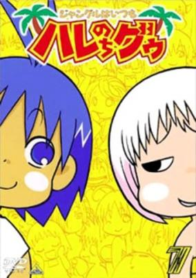

**Studio:** Shin-Ei Animation &nbsp;|&nbsp; **Director:** Tsutomu Mizushima &nbsp;|&nbsp; **Aired/Released:** April 3 – September 25 &nbsp;|&nbsp; **Genres:** Earth, Slice of Life, Comedy, Slapstick, Present, School Life

> Haré was a happy boy living out his days in the jungle with his mother, but then one day Guu showed up and became a member of their household. Throughout the series he faces many hardships as he tries to keep Guu out of trouble in the jungle.
>
> _Synopsis source: Kitsu_

[Wikipedia](https://en.wikipedia.org/wiki/Har%C3%A9%2BGuu) · [Kitsu](https://kitsu.io/anime/jungle-wa-itsumo-hare-nochi-guu)

---

### Star Ocean EX

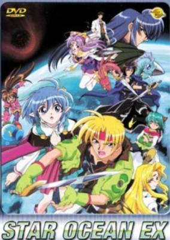

**Studio:** Studio Deen &nbsp;|&nbsp; **Director:** Shunji Yoshida Hiroshi Watanabe &nbsp;|&nbsp; **Aired/Released:** April 3 – September 25 &nbsp;|&nbsp; **Genres:** Fantasy, Science Fiction, Action, Comedy, Other Planet, Magic, Adventure

> Claude C. Kenni, a crewmember on the spaceship Calnus and son of the commander of the ship, is transported to Expel, a backwards planet with swords and magic. He teams up with Rena Lanford, who thinks he is the legendary Warrior of Light, and other characters to investigate the Sorcery Globe, a meteorite that has been causing problems all over the world.
>
> _Synopsis source: Kitsu_

[Wikipedia](https://en.wikipedia.org/wiki/Star_Ocean_EX) · [Kitsu](https://kitsu.io/anime/star-ocean-ex)

---

### Shin Shirayuki-hime Densetsu Prétear (Prétear: The New Legend of Snow White)

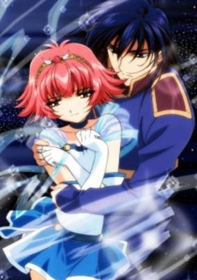

**Studio:** HAL Film Maker &nbsp;|&nbsp; **Director:** Junichi Sato Kiyoko Sayama &nbsp;|&nbsp; **Aired/Released:** April 4 – June 27 &nbsp;|&nbsp; **Genres:** Romance, Earth, Fantasy, Japan, Action, Asia, Bishounen, Love Polygon, Magic, Reverse Harem, Slapstick, Magical Girl, Present, Super Power, Comedy

> A sixteen-year-old girl is struggling to adjust to a new step-family when seven guys appear on the scene revealing that she possesses a special magical power. Shying away from the strange group, she later joins them when a monster places her friend's life in jeopardy. Without training, she must prove herself capable to take up the sacred duty of the Pretear. They must resolve their differences and work together to defeat the evil princess intent on destruction.
>
> _Synopsis source: Kitsu_

[Wikipedia](https://en.wikipedia.org/wiki/Pr%C3%A9tear) · [Kitsu](https://kitsu.io/anime/shin-shirayuki-hime-densetsu-pretear)

---

### SoulTaker

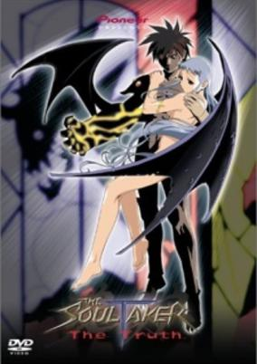

**Studio:** Tatsunoko Production &nbsp;|&nbsp; **Director:** Akiyuki Shinbo &nbsp;|&nbsp; **Aired/Released:** April 4 – July 4 &nbsp;|&nbsp; **Genres:** Science Fiction, Earth, Post Apocalypse, Genetic Modification, Action, Angst, Drama, Super Power, Demon, Horror

> After the human colony on the moon was destroyed by disease, Kyousuke Date and his mother flee to Earth—separated from their family. They take refuge in a cathedral where his mother hides as a nun for reasons unknown to Kyousuke. After dangerous people find their sanctuary, his mother stabs him before she herself is murdered. Days later, Kyousuke finds himself alive and in the house of a mysterious girl who claims to be his twin Runa—and she is not the only one! Runa suffered a similar fate at the hands of her adoptive mother; however her soul was divided into several pieces making "flicker girls" who are being hunted by the evil Kirihara Group. The reason Kyousuke survived: his body's DNA conformed to the disease and he is able to transform into a fearsome alien mutant known as the SoulTaker. Kyousuke begins his battle against a hospital of evil mutants and dangerous corporate assassins in order to save himself and the sister he has never known.
>
> _Synopsis source: Kitsu_

[Wikipedia](https://en.wikipedia.org/wiki/SoulTaker) · [Kitsu](https://kitsu.io/anime/soultaker)

---

### Sister Princess

**Studio:** Zexcs &nbsp;|&nbsp; **Director:** Kiyotaka Ohata &nbsp;|&nbsp; **Aired/Released:** April 4 – September 26 &nbsp;|&nbsp; **Genres:** Romance, Earth, Japan, Asia, Slice of Life, Comedy, Stereotypes, Present, Harem

> Wataru Minakami is a top student who failed his high school entrance exam because of a computer glitch. He later discovered that he was accepted to Stargazer Hill Academy, which is located at a mysterious place called Promised Island. At the request of his father, Wataru is whisked away to the island, and before he can settle in, a dozen of cute and charming girls start to flock him and claim to be his younger sisters. As Wataru gets closer to his newfound siblings, a deeper mystery as to why they were sent to the island comes to play.
>
> _Synopsis source: Kitsu_

[Wikipedia](https://en.wikipedia.org/wiki/Sister_Princess) · [Kitsu](https://kitsu.io/anime/sister-princess)

---

### Geneshaft

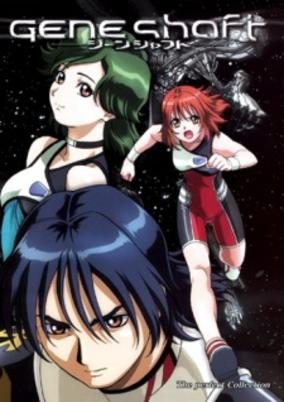

**Studio:** Satelight Studio Gazelle &nbsp;|&nbsp; **Director:** Kazuki Akane &nbsp;|&nbsp; **Aired/Released:** April 5 – June 28 &nbsp;|&nbsp; **Genres:** Science Fiction, Mecha, Genetic Modification, Action, Space Opera, Comedy, Human Enhancement, Conspiracy, Cyberpunk, Shipboard, Alien, Future, Friendship, Disaster, Space, Adventure

> In the 21st century mankind was on the brink of destruction. Through genetic engineering however they eradicated such feelings as love and the desire for power. Since women are naturally less agressive than men, women to man ratio was set to 9:1. Now people are engineered to have skills that others view as being necessary. There is a giant ring that now orbits the earth, that sits there and relays information back to an alien race that sent it. Now a team of five women will try to eradicate the alien threat.
>
> _Synopsis source: Kitsu_

[Wikipedia](https://en.wikipedia.org/wiki/Geneshaft) · [Kitsu](https://kitsu.io/anime/geneshaft)

---

### Haja Kyosei G Dangaiou

**Studio:** AIC &nbsp;|&nbsp; **Director:** Toshiki Hirano &nbsp;|&nbsp; **Aired/Released:** April 6 – July 6

[Wikipedia](https://en.wikipedia.org/wiki/Great_Dangaioh)

---

### Noir

**Studio:** Bee Train &nbsp;|&nbsp; **Director:** Kouichi Mashimo Yuuki Arie (Co-director) &nbsp;|&nbsp; **Aired/Released:** April 6 – September 28

[Wikipedia](https://en.wikipedia.org/wiki/Noir_(TV_series))

---

### Dennou Boukenki Webdiver

**Studio:** Radix &nbsp;|&nbsp; **Director:** Hiroshi Negishi Kunitoshi Okajima &nbsp;|&nbsp; **Aired/Released:** April 6 – March 23, 2002

[Wikipedia](https://en.wikipedia.org/wiki/Denn%C5%8D_B%C5%8Dkenki_Webdiver)

---

### Gyoten Ningen Batseelor

**Studio:** Group TAC &nbsp;|&nbsp; **Director:** Yoshihiro Takamoto &nbsp;|&nbsp; **Aired/Released:** April 7 – March 30, 2002

[Wikipedia](https://en.wikipedia.org/wiki/Gy%C5%8Dten_Ningen_Batseelor)

---

### You're Under Arrest: Fast & Furious

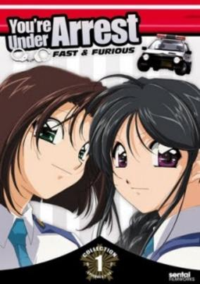

**Studio:** Studio Deen &nbsp;|&nbsp; **Director:** Shougo Koumoto &nbsp;|&nbsp; **Aired/Released:** April 7 – September 29 &nbsp;|&nbsp; **Genres:** Present, Japan, Motorsport, Action, Comedy, Romance, Slice of Life, Law And Order, Cops

> AA! Megami Sama creator, Kosuke Fujishima, is back with the second season of Taiho Schihauzo (You're Under Arrest). Same characters, two policewomen, the gentle Miyuki and the wild Natsumi teamed up together in Bokuto police station`s traffic division. Other characters including Kenichi, the motorcycle cop who has a feeling for Miyuki; Yoriko with her gossip and Aoi, a transvestite. They all ready to take on harmless criminals and costumed weirdos... You think you can have a better police station?
>
> _Synopsis source: Kitsu_

[Wikipedia](https://en.wikipedia.org/wiki/You%27re_Under_Arrest_(manga)) · [Kitsu](https://kitsu.io/anime/you-re-under-arrest-second-season)

---

### Zone of the Enders (Zone of the Enders: Dolores)

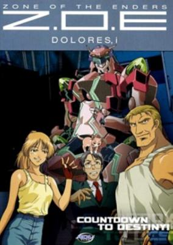

**Studio:** Sunrise &nbsp;|&nbsp; **Director:** Tetsuya Watanabe &nbsp;|&nbsp; **Aired/Released:** April 7 – September 29 &nbsp;|&nbsp; **Genres:** Science Fiction, Mecha, Adventure, Action, Space Battles, Piloted Robot, Other Planet, Future, Space, Comedy, Military, Family

> 49-year-old James Lynx was an officer (LEV pilot) in the United Nations global army, one day he received notification that his wife—a Martian scientist—was killed during a lab experiment. Hateful and resentful for letting her go, his children blamed him and cast him aside, depressed and in despair, James quit the military and took up a job as a transporter between Earth and Mars, he had some slight hope of his wife still being alive and to find her he wanted to be out there. After a few years, he seemed to have given up all hope and turned to drinking, until one day he receives an orbital frame by the name of "Delorez," sent by his dead wife. Once again, he dares to hope and sets off on a wild and wacky adventure to find the truth and to reunite his family.
>
> _Synopsis source: Kitsu_

[Wikipedia](https://en.wikipedia.org/wiki/Z.O.E._Dolores,_I) · [Kitsu](https://kitsu.io/anime/zone-of-the-enders-dolores-i)

---

### Project ARMS

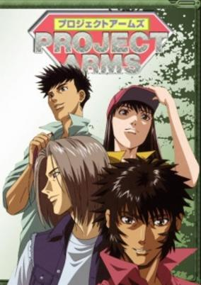

**Studio:** TMS Entertainment &nbsp;|&nbsp; **Director:** Hajime Kamegaki Hirotoshi Takaya Junichi Takaoka &nbsp;|&nbsp; **Aired/Released:** April 7 – September 29 &nbsp;|&nbsp; **Genres:** Earth, Romance, Science Fiction, Japan, Genetic Modification, Action, Asia, Martial Arts, Cyborg, Conspiracy, Alternative Present, School Life, Present, Super Power

> A boy gets involved in an accident when in kindergarten, horribly damaging his arm, but the doctors somehow manage to save it. Now, several years later, his arm seems to be becoming the focus of strange events as it turns out to be more than a normal arm. Meanwhile, a secret organizations is out to get hold of him and the power he possess.
>
> _Synopsis source: Kitsu_

[Wikipedia](https://en.wikipedia.org/wiki/Project_ARMS) · [Kitsu](https://kitsu.io/anime/project-arms)

---

### Galaxy Angel

**Studio:** Madhouse &nbsp;|&nbsp; **Director:** Morio Asaka &nbsp;|&nbsp; **Aired/Released:** April 8 – September 30 &nbsp;|&nbsp; **Genres:** Future, Space, Slapstick, Shipboard, Science Fiction, Comedy

> The Angel Brigade, an elite branch of the Transbaal Empire military, are assigned to search for The Lost Technology, mysterious items from the past that hold unknown powers. Led by the soon to retire Colonel Volcott O' Huey, the Angel Brigade travel to different planets using their specially designed Emblem Frame ships to search for Lost Technology. Unfortunately, they usually mess up somehow and end up getting into all kinds of weird and troublesome situations.
>
> _Synopsis source: Kitsu_

[Wikipedia](https://en.wikipedia.org/wiki/Galaxy_Angel) · [Kitsu](https://kitsu.io/anime/galaxy-angel)

---

### Legend of the Condor Hero (The Legend of Condor Hero)

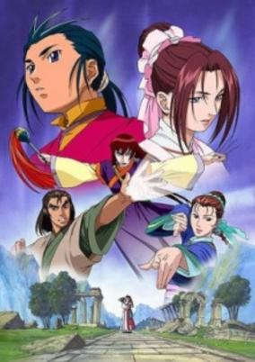

**Studio:** Nippon Animation &nbsp;|&nbsp; **Director:** Jun Takagi Keiji Hayakawa Masami Anno &nbsp;|&nbsp; **Aired/Released:** April 11 – October 28, 2002 &nbsp;|&nbsp; **Genres:** China, Asia, Adventure, Action, Earth, Romance, Martial Arts, Past, Plot Continuity, Violence, Historical

> Youka is a young 13-year-old boy. One day, his Uncle, Kakusei, has him follow in his steps of martial arts and has him study the art of Zenshinkyou. After being mistreated, Youka runs away Zenshinkyou. He stumbles on a Forbidden Tomb where he finds a beautiful young woman, by the name of Shouryuujo. After a short time, Youka is eventually accepted by Shouryuujo to study the techniques of the Koboha under her, and thus begins their adventure through martial arts and love.
>
> _Synopsis source: Kitsu_

[Wikipedia](https://en.wikipedia.org/wiki/The_Legend_of_Condor_Hero) · [Kitsu](https://kitsu.io/anime/shin-chou-kyou-ryo-condor-hero)

---

### Steel Angel Kurumi 2

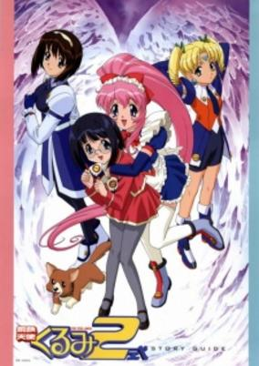

**Studio:** OLM &nbsp;|&nbsp; **Director:** Naohito Takahashi Kouji Fukazawa (Co-director) &nbsp;|&nbsp; **Aired/Released:** April 12 – June 28 &nbsp;|&nbsp; **Genres:** Android, Super Power, Mecha, Shoujo Ai, Action, Science Fiction, Comedy, Romance

> Taking place 75 years after the first series, Steel Angel Kurumi 2 brings the Steel Angels in a new mis-adventure. High school student and aspiring cellist Nako Kagura accidentally discovers and kisses Kurumi Mk. II at her home, thus making her Kurumi's master. But things go awry as Nako's best friend Uruka gets jealous and tries anything - including her father's army of top-secret mecha - to destroy Kurumi and win back Nako. Things get more out of control when Saki Mk. II is awakened by Uruka, and Karinka Mk. II joins in to steal Nako away from Kurumi.
>
> _Synopsis source: Kitsu_

[Wikipedia](https://en.wikipedia.org/wiki/Steel_Angel_Kurumi) · [Kitsu](https://kitsu.io/anime/steel-angel-kurumi-2)

---

### Hanaukyo Maid Team

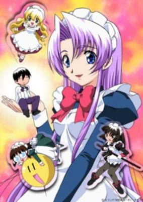

**Studio:** Daume &nbsp;|&nbsp; **Director:** Yasunori Ide &nbsp;|&nbsp; **Aired/Released:** April 13 – June 29 &nbsp;|&nbsp; **Genres:** Earth, Ecchi, Japan, Asia, Slice of Life, Maid, Stereotypes, Present, Harem, Comedy, Romance

> After losing his mother, 14-year-old Taro journeys to Tokyo to live with his grandfather. But he gets the biggest surprise when he discovers that his grandfather's home is a huge mansion with hundreds of beautiful maids ready to serve him. Making matters worse (at least for Taro, but not for our viewing) is that not only does he inherit the Hanaukyo mansion, he gets the services of all of the maids 24 hours a day, 7 days a week.
>
> _Synopsis source: Kitsu_

[Wikipedia](https://en.wikipedia.org/wiki/Hanaukyo_Maid_Team) · [Kitsu](https://kitsu.io/anime/hanaukyou-maid-tai)

---

### Go! Go! Itsutsugo Land

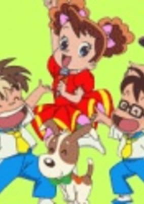

**Studio:** Magic Bus &nbsp;|&nbsp; **Director:** Setsuko Shibuichi &nbsp;|&nbsp; **Aired/Released:** April 14 – March 30, 2002 &nbsp;|&nbsp; **Genres:** Comedy, School Life

> The series is about five quintuplets, Kabuto, Hinoki, Arashi, Kinoko and Kodama Morino, who have all kinds of adventures together. Each has their own talent and personality.
>
> _Synopsis source: Kitsu_

[Wikipedia](https://en.wikipedia.org/wiki/Go!_Go!_Itsutsugo_Land) · [Kitsu](https://kitsu.io/anime/go-go-itsutsugo-land)

---

### PaRappa the Rapper

**Studio:** J.C.Staff Production I.G &nbsp;|&nbsp; **Director:** Kazuya Tsurumaki Hiroaki Sakurai &nbsp;|&nbsp; **Aired/Released:** April 14 – January 11, 2002

[Wikipedia](https://en.wikipedia.org/wiki/PaRappa_the_Rapper_(TV_series))

---

### BASToF Syndrome

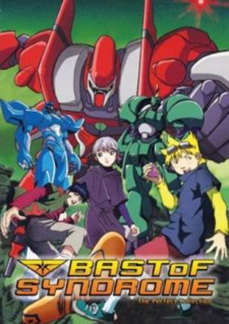

**Studio:** Dongwoo A&E &nbsp;|&nbsp; **Aired/Released:** May 3 – November 15 &nbsp;|&nbsp; **Genres:** Fantasy, Mecha, Science Fiction, Adventure

> The story takes place in the year 2097 and in the city of Xenon. An ultimate cyber game, where players fight as bio-mechanical cyber robots, has been developed. However, there's something wrong. The game's cyberspace and the real world are linked. The damage that occurs in the game's cyberspace creates destruction in the city of Xenon. This all started when players heard a painful scream, saw a ghostly face, and a powerful scent of lemon overcame them. To solve this mystery, the creator of the game assembles a "Dream Team," which is the top three gamers in all of Xenon. The team is composed of rebellious and arrogant teens, who, have to overcome their attitudes and fears to find the answers, answers to the mystery that are much bigger than just the game.
>
> _Synopsis source: Kitsu_

[Wikipedia](https://en.wikipedia.org/wiki/BASToF_Lemon) · [Kitsu](https://kitsu.io/anime/bastof-syndrome)

---

### Shingu: Secret of the Stellar Wars

**Studio:** Madhouse &nbsp;|&nbsp; **Director:** Tatsuo Sato &nbsp;|&nbsp; **Aired/Released:** May 8 – December 4 &nbsp;|&nbsp; **Genres:** Science Fiction, Japan, Earth, Action, Asia, Slice of Life, Future, Plot Continuity, Super Power, Space, Mecha, Adventure

> The world is about to be turned upside down for Hajime Murata. First, a strange alien ship appears over Tokyo, and then a mysterious new transfer student arrives at his school wearing an ancient school uniform. His name is Muryou, and with his arrival, everything begins to change. Students suddenly begin to display amazing psychic powers, a giant white guardian keeps appearing in the skies over the city to fight off gigantic alien creatures, and men with threatening weapons are haunting the shadows of the school grounds. With all these strange events taking place around him, Hajime is determined to figure out the truth about a world he thought he already knew. This is his story: a tale of aliens and humans, starships and spies, and friends who are often more than they appear. Join Hajime as he uncovers the mystery of Shingu: Secret of the Stellar Wars!
>
> _Synopsis source: Kitsu_

[Kitsu](https://kitsu.io/anime/shingu-secret-of-the-stellar-wars)

---

### Offside

**Studio:** Ashi Productions &nbsp;|&nbsp; **Director:** Seiji Okuda &nbsp;|&nbsp; **Aired/Released:** May 10 – January 31, 2002

[Wikipedia](https://en.wikipedia.org/wiki/Offside_(manga))

---

### Chance Triangle Session (Chance Pop Session)

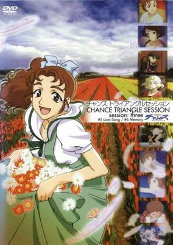

**Studio:** Madhouse &nbsp;|&nbsp; **Director:** Susumu Kudo &nbsp;|&nbsp; **Aired/Released:** May 21 – August 27 &nbsp;|&nbsp; **Genres:** Earth, Japan, Asia, Idol, The Arts, Present, Music, Slice of Life

> This anime is based on a 1999 radio drama about three very different girls: Akari, Yuki and Nozomi; going to see the concert of top pop idol Reika and by going to see this concert their lives are greatly influenced by it. Akari was raised in a very religious background, she is bright and cheerful and a big Reika fan. Yuki is an independent girl who ran away from her home in Hakodate. She is working in the concert hall of Reika's performance. Nozomi is the daughter from a wealthy family in Kobe. She's got one of the VIP seats at the concert. The three girls are so inspired by Reika's performance, that they all enroll in the Akiba music school and endeavor to become pop idols themselves.
>
> _Synopsis source: Kitsu_

[Wikipedia](https://en.wikipedia.org/wiki/Chance_Pop_Session) · [Kitsu](https://kitsu.io/anime/chance-pop-session)

---

### Uniminipet

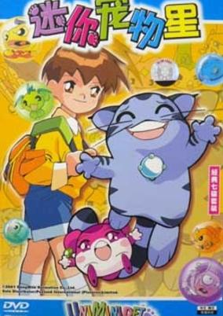

**Studio:** Dongwoo A&E &nbsp;|&nbsp; **Aired/Released:** June 15 – December 7 &nbsp;|&nbsp; **Genres:** Fantasy, Adventure

> Dong Woo is a very pleasant, responsible and cheerful boy. He gets weird feelings every time he opens his closet door and is the only one that can sense these feelings. Why is this? Dong Woo is destined to be "the person that opens the Door". His closet is a secret channel that connects the real world to the fourth dimension world called "Uniland ". Whenever he opens the door, the wavelength from the other world is transferred to him.
>
> _Synopsis source: Kitsu_

[Wikipedia](https://en.wikipedia.org/wiki/Uniminipet) · [Kitsu](https://kitsu.io/anime/uniminipet)

---

### I My Me! Strawberry Eggs

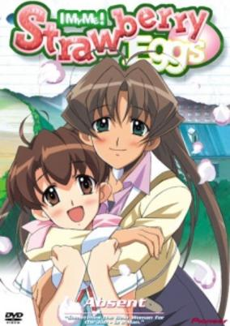

**Studio:** TNK &nbsp;|&nbsp; **Director:** Yuuji Yamaguchi &nbsp;|&nbsp; **Aired/Released:** July 4 – September 26 &nbsp;|&nbsp; **Genres:** Romance, Japan, Earth, Asia, Comedy, Middle School, School Life, Present, Slice of Life

> Amawa Hibiki is a young man just out of college, with an education to be an athletics teacher. He's been having a hard time finding a job since he graduated, so all his money has gone towards living expenses. When his landlady demands his first payment to live in her living establishment upfront, he heads to the local middle school to get hired as a teacher. However, the principal refuses to hire him without hesitation. She will not hire men as teachers and makes it clear that she hates all men, saying they put no love into their passions and work. Amawa does not give up and with the help of his landlady, he crossdresses as a woman without a second thought, and gets hired, so he can earn money and also prove the principal wrong. Now, he has to keep his real gender a secret, and avoid strange situations, including the affections of his students (from both genders).
>
> _Synopsis source: Kitsu_

[Wikipedia](https://en.wikipedia.org/wiki/I_My_Me!_Strawberry_Eggs) · [Kitsu](https://kitsu.io/anime/i-my-me-strawberry-eggs)

---

### Shaman King

**Studio:** Xebec &nbsp;|&nbsp; **Director:** Seiji Mizushima &nbsp;|&nbsp; **Aired/Released:** July 4 – September 25, 2002

[Wikipedia](https://en.wikipedia.org/wiki/Shaman_King_(2001_TV_series))

---

### s.CRY.ed (s-CRY-ed)

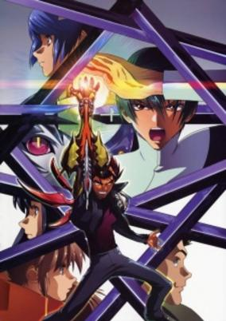

**Studio:** Sunrise &nbsp;|&nbsp; **Director:** Goro Taniguchi Rion Kujo &nbsp;|&nbsp; **Aired/Released:** July 4 – December 26 &nbsp;|&nbsp; **Genres:** Science Fiction, Action, Proxy Battles, Drama, Alternative Present, Present, Super Power, Adventure

> A strange environmental phenomenon 22 years ago in the Kanazawa prefecture caused the land to split and protrude upwards reaching unprecedented heights, creating the secluded area known as The Lost Ground. Kazuma is a young mercenary who lives in the Lost Ground, looking for any work he can find to sustain his livelihood within the harsh environment. He is one of the few people that are gifted with the Alter ability, which allows him to plaster his right arm and torso with a metallic alloy. When this mercenary encounters HOLY, an order whose purpose is to suppress and capture what they call Native Alter Users, and one of the elite members of HOLY, Ryuho, an epic rivalry begins.
>
> _Synopsis source: Kitsu_

[Wikipedia](https://en.wikipedia.org/wiki/S-CRY-ed) · [Kitsu](https://kitsu.io/anime/scryed)

---

### Fruits Basket

**Studio:** Studio Deen &nbsp;|&nbsp; **Director:** Akitaro Daichi &nbsp;|&nbsp; **Aired/Released:** July 5 – December 27

[Wikipedia](https://en.wikipedia.org/wiki/Fruits_Basket_(2001_TV_series))

---

### Magical Nyan Nyan Taruto (Magical Meow Meow Taruto)

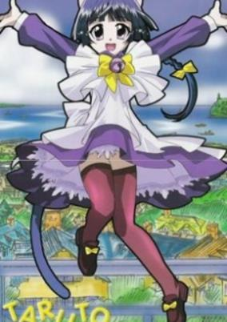

**Studio:** Madhouse TNK &nbsp;|&nbsp; **Director:** Sunaga Tsukasa &nbsp;|&nbsp; **Aired/Released:** July 5 – September 27 &nbsp;|&nbsp; **Genres:** Romance, Comedy, Juujin, Magic, Alternative Present, Present

> Taruto is a little cat who has just moved to a new city with her master's family. Taruto spends her days making friends and exploring her new home town. She also has a knack for getting herself into trouble. And it turns out that Taruto just might be a legendary magical princess. Almost none of Taruto’s friends believe that she can use magic or that she’s a princess, but Taruto is determined to prove it to them. But Taruto's magic is so unpredictable, you never know what's going to happen when she uses it.
>
> _Synopsis source: Kitsu_

[Wikipedia](https://en.wikipedia.org/wiki/Magical_Meow_Meow_Taruto) · [Kitsu](https://kitsu.io/anime/magical-nyan-nyan-taruto)

---

### Cosmo Warrior Zero

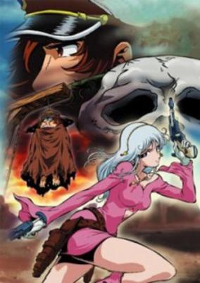

**Studio:** Vega Entertainment &nbsp;|&nbsp; **Director:** Kazuyoshi Yokota &nbsp;|&nbsp; **Aired/Released:** July 6 – September 28 &nbsp;|&nbsp; **Genres:** Science Fiction, Action, Space Opera, Space, Adventure, Military, Shipboard, Pirate

> The long war between the planet Earth and the machine men is finally over, resulting in a peace that is more a victory for the machine men than the Earth. Warrius Zero lost his family in the war to the machine men but despite this he is still is a member of the Earth fleet that is now working in concert with the machine men. His ship, made up of both humans and machine men, has been given a near impossible task: capture the space pirate Captain Harlock. While Zero struggles to accomplish this task, evidence begins to surface that the peace between machine men and Earth may not be as it seems...
>
> _Synopsis source: Kitsu_

[Wikipedia](https://en.wikipedia.org/wiki/Cosmo_Warrior_Zero) · [Kitsu](https://kitsu.io/anime/cosmo-warrior-zero)

---

### Nono-chan

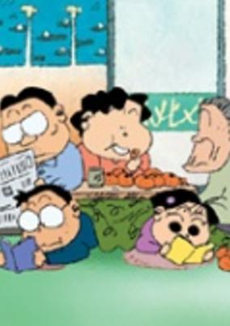

**Studio:** Toei Animation &nbsp;|&nbsp; **Director:** Nobutaka Nishizawa &nbsp;|&nbsp; **Aired/Released:** July 7 – September 28, 2002 &nbsp;|&nbsp; **Genres:** Comedy, Slice of Life

> Nono-chan is the eldest daughter in the Yamada family and a third-grade elementary school student. Her family consists of her father, Mr Yamada Takashi, her mother, Mrs Yamada Matsuko and her brother, Noboru, a junior high student. Together with her grandmother, the family of five makes up a pleasant Japanese family. Everyone is special and everyday is always filled with joy and surprise.
>
> _Synopsis source: Kitsu_

[Wikipedia](https://en.wikipedia.org/wiki/Nono-chan) · [Kitsu](https://kitsu.io/anime/nono-chan)

---

### Seikai no Senki II (Banner of the Stars)

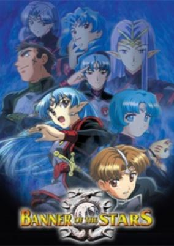

**Studio:** Sunrise &nbsp;|&nbsp; **Director:** Yasuchika Nagaoka &nbsp;|&nbsp; **Aired/Released:** July 11 – September 26 &nbsp;|&nbsp; **Genres:** Space Travel, Science Fiction, Genetic Modification, Action, Space Battles, Space Opera, Air Force, Shipboard, War, Future, Plot Continuity, Space, Military, Romance

> Three years after their adventure, Lafiel becomes captain on the brand new assault ship Basroil and Jinto finishes his training to become a supply officer and joins Lafiels crew. They set out to join a large fleet with the mission of defending the strategically important Laptic Gate from a force 15 times larger than their own. And to bring even more worries, their new fleet commander is from the Bebous family, a family notorious for their "Spectacular Insanity".
>
> _Synopsis source: Kitsu_

[Wikipedia](https://en.wikipedia.org/wiki/Banner_of_the_Stars) · [Kitsu](https://kitsu.io/anime/seikai-no-senki)

---

### Grappler Baki: Saidai Tournament-hen

**Studio:** Group TAC &nbsp;|&nbsp; **Director:** Katsuyoshi Yatabe &nbsp;|&nbsp; **Aired/Released:** July 24 – December 25 &nbsp;|&nbsp; **Genres:** Earth, Japan, Action, Asia, Combat, Sports, Martial Arts, Stereotypes, Plot Continuity, Violence, Present

> Baki Hanma is a young fighter who yearns to follow in the footsteps of his father, Yujiro, and become the strongest fighter in the world. Through that he trains tirelessly and fights constantly to hone his skills and develop his body to achieve these goals. Many intense battles lay ahead of Baki as he goes about his quest to be the best and ultimately take the title of "King" from his father.
>
> _Synopsis source: Kitsu_

[Wikipedia](https://en.wikipedia.org/wiki/Baki_the_Grappler) · [Kitsu](https://kitsu.io/anime/baki-the-grappler)

---

### Samurai Girl Real Bout High School

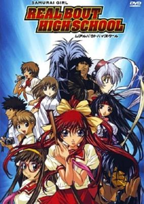

**Studio:** Gonzo &nbsp;|&nbsp; **Director:** Shinichi Tokairin &nbsp;|&nbsp; **Aired/Released:** July 30 – October 22 &nbsp;|&nbsp; **Genres:** Fantasy, Ecchi, Japan, Action, Comedy, Swordplay, Absurdist Humour, Martial Arts, High School, School Life, Present, Samurai, Super Power, Adventure

> At Daimon High School, kids settle their disputes by dueling with each other in the school's official K-Fight battle arena. Ryoko Mitsurugi, samurai girl and undefeated K-Fight champion, is called upon by a mysterious Priestess to protect the Earth from an invasion coming from the alternate universe of Solvania. She must face battles that will test her skills, her friendships, and her heart in order to find her true strength as a samurai warrior.
>
> _Synopsis source: Kitsu_

[Kitsu](https://kitsu.io/anime/samurai-girl-real-bout-high-school)

---

### Cubix

**Studio:** Xebec &nbsp;|&nbsp; **Aired/Released:** August 11 – April 26, 2004

[Wikipedia](https://en.wikipedia.org/wiki/Cubix)

---

### Captain Kuppa

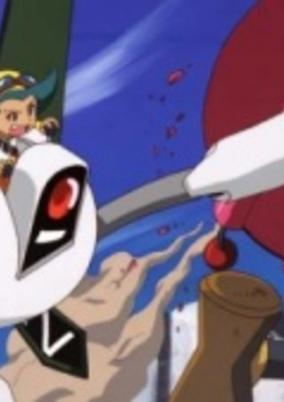

**Studio:** Bee Train &nbsp;|&nbsp; **Director:** Kouichi Mashimo &nbsp;|&nbsp; **Aired/Released:** August 13 – February 11, 2002 &nbsp;|&nbsp; **Genres:** Science Fiction, Action, Adventure

> Sometime in the future, the world was completely dried up and became all desert. They had little rivers and lakes left, which villians and dangerous animals lived. Water has become the most valueable thing on the world. Whoever can control water will rule over the world.
>
> _Synopsis source: Kitsu_

[Wikipedia](https://en.wikipedia.org/wiki/Captain_Kuppa) · [Kitsu](https://kitsu.io/anime/captain-kuppa-desert-pirate)

---

### Shiawase Sou no Okojo-san

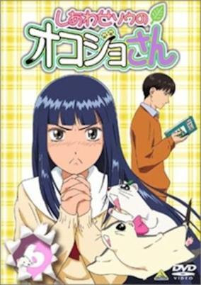

**Studio:** Radix &nbsp;|&nbsp; **Director:** Yuusuke Yamamoto &nbsp;|&nbsp; **Aired/Released:** October 2 – September 24, 2002 &nbsp;|&nbsp; **Genres:** Comedy

> Haruka Tsuchiya is a plain and simple university student who has a pet by the name of Okojo-san. Okojo-san was actually born in one of the mountains in the North and brought to one of the pet shops to be sold. Determined to get out of the pet shop, Okojo-san formulated an escape strategy and ended up in the house of Haruka. There are always funny and strange occurances happening around the two, be it the people or animals who are near them. This is a gag anime in which absurdity is the main feature of the story.
>
> _Synopsis source: Kitsu_

[Wikipedia](https://en.wikipedia.org/wiki/Okojo-san) · [Kitsu](https://kitsu.io/anime/shiawase-sou-no-okojo-san)

---

### Kaze no Yojimbo

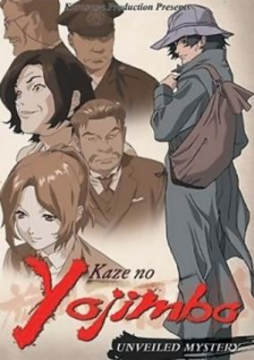

**Studio:** Pierrot &nbsp;|&nbsp; **Director:** Hayato Date &nbsp;|&nbsp; **Aired/Released:** October 2 – March 26, 2002 &nbsp;|&nbsp; **Genres:** Detective, Present, Earth, Japan, Violence, Plot Continuity, Asia, Action, Crime, Mystery

> In search for Araki Genzo, George Kodama finds himself in the small town of Kimujuku. George quickly realizes that he is unwelcome and is warned to leave as soon as possible. With two rival syndicates roaming the streets and a dark violent past, the town of Kimujuku isn't what it appears to be. George challenges the town of Kimujuku in order to reveal the towns dark hidden past and discover the truth.
>
> _Synopsis source: Kitsu_

[Wikipedia](https://en.wikipedia.org/wiki/Kaze_no_Yojimbo) · [Kitsu](https://kitsu.io/anime/kaze-no-yojimbo)

---

### Final Fantasy: Unlimited

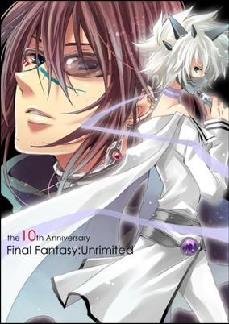

**Studio:** Gonzo &nbsp;|&nbsp; **Director:** Mahiro Maeda &nbsp;|&nbsp; **Aired/Released:** October 2 – March 26, 2002 &nbsp;|&nbsp; **Genres:** Science Fiction, Mecha, Fantasy World, Fantasy, Action, Adventure, Parallel Universe

> Ai and Yu, after reading their parent's research and after their parents' disappearance, they decided to go on search for them. They ride a strange train to the Inner World in search of their parents and meets up with Lisa in the train and together they begin their journey within the Inner World.
>
> _Synopsis source: Kitsu_

[Kitsu](https://kitsu.io/anime/final-fantasy-unlimited)

---

### Chicchana Yukitsukai Sugar (A Little Snow Fairy Sugar)

**Studio:** J.C.Staff &nbsp;|&nbsp; **Director:** Shinichiro Kimura &nbsp;|&nbsp; **Aired/Released:** October 3 – March 27, 2002 &nbsp;|&nbsp; **Genres:** Fantasy, Germany, Contemporary Fantasy, Earth, Comedy, Europe, Past, Music, Slice of Life

> Season Fairies create and control the weather using special musical instruments. They make the wind blow, the snow fall, the sun shine; if it's something weather related, they are the ones who make it happen. Sugar, an apprentice Snow Fairy, and her friends Salt and Pepper, all want to become full-fledged Season Fairies, and the only way to achieve this is to search for and find the "Twinkles" that will make their magical flowers bloom. The only problem is that none of them have any idea what a Twinkle is. They enlist the somewhat unwilling help of Saga, a human girl who can see Season Fairies. Much to her annoyance, Saga's perfectly planned and ordered life has just become a little too lively for her taste. Together, they search for the mysterious Twinkles while trying to perfect their magic.
>
> _Synopsis source: Kitsu_

[Wikipedia](https://en.wikipedia.org/wiki/A_Little_Snow_Fairy_Sugar) · [Kitsu](https://kitsu.io/anime/chicchana-yukitsukai-sugar)

---

### X

**Studio:** Madhouse &nbsp;|&nbsp; **Director:** Yoshiaki Kawajiri &nbsp;|&nbsp; **Aired/Released:** October 3 – March 27, 2002

[Wikipedia](https://en.wikipedia.org/wiki/X_(TV_series))

---

### Otogi Story Tenshi no Shippo (Angel Tales)

**Studio:** Tokyo Kids &nbsp;|&nbsp; **Director:** Kazuhiro Ochi &nbsp;|&nbsp; **Aired/Released:** October 4 – December 20 &nbsp;|&nbsp; **Genres:** Romance, Japan, Fantasy, Slice of Life, Love Polygon, Angel, Magic, Stereotypes, Present, Harem, Comedy

> Goro's down on his luck. He keeps losing jobs and has little money. One day he meets a fortune-teller outside of a pet store who predicts that his luck will change. That night three girls appear in his appartment claiming to be his guardian angels. Soon a total of twelve girls appear to help him, each one a reincarnation of a deceased pet once owned by Goro.
>
> _Synopsis source: Kitsu_

[Wikipedia](https://en.wikipedia.org/wiki/Angel_Tales) · [Kitsu](https://kitsu.io/anime/tenshi-no-shippo)

---

### Vandread: The Second Stage (Vandread)

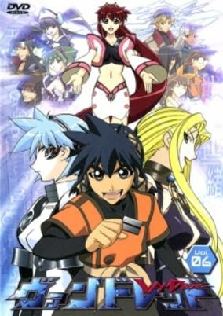

**Studio:** Gonzo &nbsp;|&nbsp; **Director:** Takeshi Mori &nbsp;|&nbsp; **Aired/Released:** October 5 – January 18, 2002 &nbsp;|&nbsp; **Genres:** Ecchi, Transforming Craft, Science Fiction, Mecha, Action, Space Opera, Humanoid Alien, Shipboard, Alien, Future, Space

> In Vandread, men are from Mars and women are from Venus! Well, not quite. Technology has allowed mankind to colonize the entire Milky Way galaxy, and in one star system, the men and women live on two different planets, Taraak and Mejere. A bitter and very literal gender war rages, to the point where they don't even see each other as the sames species anymore! Hibiki Tokai, a male third-class laborer from Taraak, ends up stuck on a battleship after a botched attempt at stealing a robot. When female pirates capture the Taraakian Vanguard, things don't look like they could get any worse for Hibiki. Unfortunately, they do; when the male crew of the Vanguard fire on their captured vessel out of desperation, they created a giant wormhole, which sucks the Vanguard and the Mejeran pirate's ships into itself! Now, stuck far away from their home planets, these men and women must learn to work together if they ever wish to make it back home.
>
> _Synopsis source: Kitsu_

[Wikipedia](https://en.wikipedia.org/wiki/Vandread) · [Kitsu](https://kitsu.io/anime/vandread)

---

### Babel II: Beyond Infinity

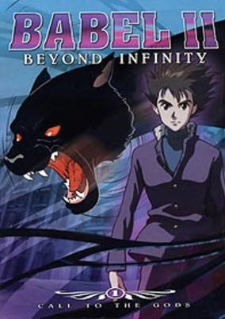

**Studio:** Vega Entertainment &nbsp;|&nbsp; **Aired/Released:** October 5 – December 28 &nbsp;|&nbsp; **Genres:** Gunfights, Super Power, Earth, Human Enhancement, Contemporary Fantasy, Action, Science Fiction, Adventure, Anthropomorphism, Crime

> Life seems simple for Koichi, a young student, until he learns that he is the reincarnation of an alien protector who crashed onto the mantle of responsibility as"defender of the Earth", Koichi/Babel teams up with a trio of super-powered alien companions to battle the the dark forces of an evil cult leader. The war to save humanity takes Babel from the deserts of southern Asia to the upper east side of Manhattan and ultimately to a final showdown with "the master" in a hidden base nestled in the Swiss Alps. The action is fast-paced and deadly. The fate of the world rests in the ability of this courageous youth to tame his latent psychic power and use it to defeat the enemies of mankind.
>
> _Synopsis source: Kitsu_

[Wikipedia](https://en.wikipedia.org/wiki/Babel_II) · [Kitsu](https://kitsu.io/anime/babel-nisei-2001)

---

### Najica Dengeki Sakusen (Najica Blitz Tactics)

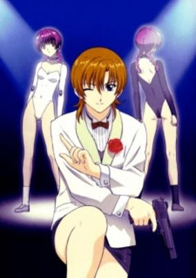

**Studio:** Studio Fantasia &nbsp;|&nbsp; **Director:** Katsuhiko Nishijima &nbsp;|&nbsp; **Aired/Released:** October 5 – December 27 &nbsp;|&nbsp; **Genres:** Science Fiction, Ecchi, Adventure, Action, Human Enhancement, Future, Comedy

> Najica Hiiragi, perfumer and secret agent, is sent out on a number of recovery missions to round up rogue humaritts, androids with combat abilities. Najica is assigned a humaritt partner, Lila, whom Najica is to groom as an agent and receive assistance from along the way. As Najica grows to accept Lila, each new mission they embark on reveals more and more about the capabilities and mysterious origins of the humaritts.
>
> _Synopsis source: Kitsu_

[Wikipedia](https://en.wikipedia.org/wiki/Najica_Blitz_Tactics) · [Kitsu](https://kitsu.io/anime/najica-blitz-tactics)

---

### Geisters: Fractions of the Earth

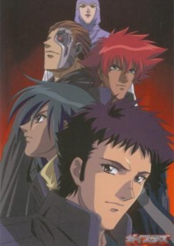

**Studio:** Plum &nbsp;|&nbsp; **Director:** Kouji Ito &nbsp;|&nbsp; **Aired/Released:** October 6 – March 30, 2002 &nbsp;|&nbsp; **Genres:** Science Fiction, Action

> A radio-active asteroid nearly destroys the Earth. Knowing it will be hard to survive the aftermath, many of the survivors leave Earth to live their lives in space colonies. 400 years later, the colonists return to Earth to reclaim their planet. Unfortunately, Earth isn't the same as when they left it.
>
> _Synopsis source: Kitsu_

[Wikipedia](https://en.wikipedia.org/wiki/Geisters) · [Kitsu](https://kitsu.io/anime/geisters-fractions-of-the-earth)

---

### Kirby: Right Back at Ya!

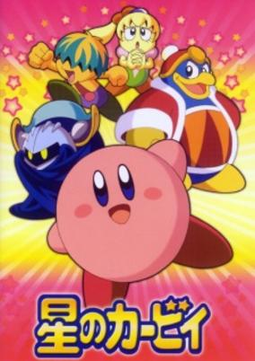

**Studio:** Studio Sign &nbsp;|&nbsp; **Director:** Souji Yoshikawa &nbsp;|&nbsp; **Aired/Released:** October 6 – September 27, 2003 &nbsp;|&nbsp; **Genres:** Fantasy, Comedy, Alien, Parody, Action, Adventure

> A diminuitive pink creature orbiting in space called "Kirby" crash lands into Dream Land. Once getting acquainted with the citizens who live there in Cappy Town, he begins to defend the town from the monsters that King Dedede, the self-proclaimed ruler of Cappy Town, orders from the evil Nightmare Enterprises.
>
> _Synopsis source: Kitsu_

[Kitsu](https://kitsu.io/anime/kirby-right-back-at-ya)

---

### Project ARMS: The 2nd Chapter (Project ARMS)

**Studio:** TMS Entertainment &nbsp;|&nbsp; **Aired/Released:** October 6 – March 30, 2002 &nbsp;|&nbsp; **Genres:** Earth, Romance, Science Fiction, Japan, Genetic Modification, Action, Asia, Martial Arts, Cyborg, Conspiracy, Alternative Present, School Life, Present, Super Power

> A boy gets involved in an accident when in kindergarten, horribly damaging his arm, but the doctors somehow manage to save it. Now, several years later, his arm seems to be becoming the focus of strange events as it turns out to be more than a normal arm. Meanwhile, a secret organizations is out to get hold of him and the power he possess.
>
> _Synopsis source: Kitsu_

[Wikipedia](https://en.wikipedia.org/wiki/Project_ARMS) · [Kitsu](https://kitsu.io/anime/project-arms)

---

### Mahoromatic: Automatic Maiden

**Studio:** Gainax Shaft &nbsp;|&nbsp; **Director:** Hiroyuki Yamaga &nbsp;|&nbsp; **Aired/Released:** October 6 – December 29 &nbsp;|&nbsp; **Genres:** Android, Maid, Slapstick, Stereotypes, Present, Slice of Life, Middle School, Japan, School Life, Comedy, Asia, Earth, Ecchi, Science Fiction, Mecha, Romance, Military

> Vesper is a secret agency fighting an army of alien invaders by using super-powerful battle androids. Mahoro is Vesper's most powerful battle android and has won many battles, but she has little operating time left and soon will cease to function. However, if she lays down her arms and conserves her remaining power, the time she has left can be prolonged to just over a year. Mahoro is given an opportunity to live the remaining time she has as a normal human. She chooses to live as a maid for Suguru, a phenomenally messy middle school student who lives by himself after his family passed away.
>
> _Synopsis source: Kitsu_

[Wikipedia](https://en.wikipedia.org/wiki/Mahoromatic) · [Kitsu](https://kitsu.io/anime/mahoromatic)

---

### Gekitou! Crush Gear Turbo (Crush Gear Turbo The Movie - Kaiservern's Ultimate Challenge)

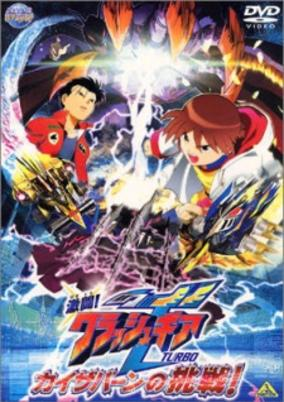

**Studio:** Sunrise &nbsp;|&nbsp; **Director:** Shuji Iuchi &nbsp;|&nbsp; **Aired/Released:** October 7 – January 26, 2003 &nbsp;|&nbsp; **Genres:** Sports

> The very first Gear even made in the world is stolen. The gear, named Kaiservern, beats the prize winners of the Australia convention one after another. Kouya and Manganji, which won a prize in the Asia Convention, become targets too. When the unidentified gear fighter who handles Kaiservern appears in front of Kouya and Manganji, the two boys decide to fight together to win victory over their enemy.
>
> _Synopsis source: Kitsu_

[Wikipedia](https://en.wikipedia.org/wiki/Crush_Gear_Turbo) · [Kitsu](https://kitsu.io/anime/gekitou-crush-gear-turbo-kaizabaan-no-chousen)

---

### Captain Tsubasa: Road to 2002 (Captain Tsubasa)

**Studio:** Group TAC &nbsp;|&nbsp; **Director:** Gisaburo Sugii Isamu Imakake &nbsp;|&nbsp; **Aired/Released:** October 7 – October 6, 2002 &nbsp;|&nbsp; **Genres:** Action, Sports, Soccer

> Tsubasa Oozora loves everything about soccer: the cheer of the crowd, the speed of the ball, the passion of the players, and the excitement that comes from striving to be the best soccer player he can be. His goal is to aim for the World Cup, and to do that, he’s spent countless hours practicing soccer, ever since the moment he could walk on two legs. Now, as he plays for the Barcelona team in a fierce game, it seems as though his dreams are on the verge of coming true.Captain Tsubasa: Road to 2002 tells the story of how Tsubasa climbed his way through the ranks, featuring his roots in the town of Nankatsu as well as his epic journey to master the art of soccer.
>
> _Synopsis source: Kitsu_

[Wikipedia](https://en.wikipedia.org/wiki/Captain_Tsubasa) · [Kitsu](https://kitsu.io/anime/captain-tsubasa-road-to-2002)

---

### Hikaru no Go

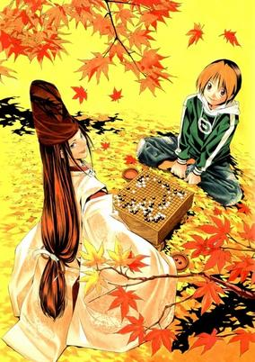

**Studio:** Pierrot &nbsp;|&nbsp; **Director:** Susumu Nishizawa Tetsuya Endo Jun Kamiya &nbsp;|&nbsp; **Aired/Released:** October 10 – March 26, 2003 &nbsp;|&nbsp; **Genres:** Japan, Sports, Asia, Plot Continuity, Present, Comedy

> 12-year-old Shindou Hikaru is just your average 6th grader. One day, while searching through his grandfather's attic, he comes across an old Go board. Upon touching the Go board, Hikaru is possessed by the spirit of Fujiwara no Sai, and continues to be haunted by him soon after. Sai was once a great Go player, who committed suicide and continued to stay in the world as a spirit desiring only to play Go once again. Finally bending to Sai's pleas, Hikaru allows Sai to play Go through himself, unknowingly attempting the first game with the young prodigy Touya Akira. Time has finally started moving, as Sai's quest for the perfect game, "The Hand of God", is set underway. Based on the manga by Yumi Hotta and Takeshi Obata.
>
> _Synopsis source: Kitsu_

[Wikipedia](https://en.wikipedia.org/wiki/Hikaru_no_Go) · [Kitsu](https://kitsu.io/anime/hikaru-no-go)

---

### Tennis no Oujisama (The Prince of Tennis)

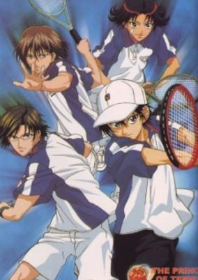

**Studio:** Trans Arts &nbsp;|&nbsp; **Director:** Takayuki Hamana &nbsp;|&nbsp; **Aired/Released:** October 10 – March 23, 2005 &nbsp;|&nbsp; **Genres:** Earth, Japan, Action, Asia, Sports, Tennis, Comedy, Middle School, School Clubs, School Life, Plot Continuity, Present, Shounen

> The world of tennis is harsh and highly competitive. Numerous schools from Japan battle it out to determine the best of the best. Seishin Gakuen Junior High School, more commonly known as Seigaku, is one of the most prominent contestants in this battle of the finest. Their team line-up gets even stronger with the sudden arrival of a young prodigy from the West, Ryouma Echizen, who is determined to prove himself and escape the towering shadow of his legendary father. This fine addition changes the team forever.Prince of Tennis follows the heartwarming and inspirational story of Ryouma on his quest to become one of the best tennis players the country has ever seen. He pushes himself hard so that he can one day surpass his father’s name and his own personal expectations. Alongside the rest of the Seigaku team, Ryouma fights to make his and his teammate's dreams come true.
>
> _Synopsis source: Kitsu_

[Wikipedia](https://en.wikipedia.org/wiki/The_Prince_of_Tennis) · [Kitsu](https://kitsu.io/anime/prince-of-tennis)

---

### Hellsing

**Studio:** Gonzo &nbsp;|&nbsp; **Director:** Umanosuke Iida Yasunori Urata &nbsp;|&nbsp; **Aired/Released:** October 11 – January 17, 2002 &nbsp;|&nbsp; **Genres:** Contemporary Fantasy, Fantasy, United Kingdom, Action, Earth, Special Squads, Gunfights, Europe, Vampire, Horror, Alternative Present, Law And Order, Violence, Present, Cops

> Decades ago, the legendary Dr. Abraham Van Helsing and his companions defeated Count Dracula, one of the world's deadliest vampires. After this success his name was used in the founding of the Hellsing Organization, a British task force with the duty of eliminating supernatural threats.Hellsing follows the exploits of that very organization. Led by Integra Fairbrook Wingates Hellsing, the Hellsing Organization finds its trump card not in the power of man, but in the strength of a monster it has tamed. Alucard, one of the oldest and most powerful vampires in existence, now hunts his fellow monsters at Hellsing's bequest. Alongside new recruit Seras Victoria, Alucard will find that a new threat has arisen, one greater than anything the Hellsing Organization has ever dealt with before.
>
> _Synopsis source: Kitsu_

[Wikipedia](https://en.wikipedia.org/wiki/Hellsing) · [Kitsu](https://kitsu.io/anime/hellsing)

---

### Kokoro Toshokan

**Studio:** Studio Deen &nbsp;|&nbsp; **Director:** Koji Masunari &nbsp;|&nbsp; **Aired/Released:** October 12 – February 17, 2002 &nbsp;|&nbsp; **Genres:** Fantasy, Contemporary Fantasy, Slice of Life, Comedy, Alternative Present, Present

> Kokoro Toshokan, a small library, lies nestled in an unpopulated mountain far away from town. Three sisters, Iina, Aruto and Kokoro, call the library home and run it from day-to-day. Kokoro is just beginning her adventures at the library. Will she become a full-fledged librarian? Will the remote library ever attract readers? Kokoro tries her best to make her dreams come true at Kokoro Library, a place where miracles can happen.
>
> _Synopsis source: Kitsu_

[Wikipedia](https://en.wikipedia.org/wiki/Kokoro_Library) · [Kitsu](https://kitsu.io/anime/kokoro-toshokan)

---

### Kasumin (Mistin)

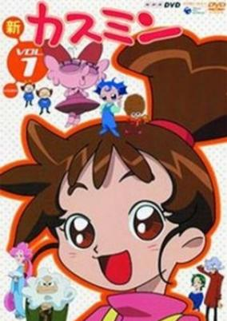

**Studio:** OLM &nbsp;|&nbsp; **Director:** Mitsuru Hongo &nbsp;|&nbsp; **Aired/Released:** October 13 – April 6, 2002 &nbsp;|&nbsp; **Genres:** Fantasy, Kids

> Haruno Kasumi is a fourth-grader. Her parents are zoologists who went over to Africa to carry out their research studies. In order to see off her parents, Kasumi arrived at Kasumi Town. In the middle of the town lies an enormous mansion surrounded by the forest. The mansion belongs to the Kasumi household, the family in which Kasumi will be lodging in and taken care of. There is a mysterious aura about the mansion and Kasumi discovers a series of talking appliances. The Kasumi family refers to these creatures as "Henamon". In return for living in with the family, Kasumi will be helping out with the household chores such as cooking and washing. Surrounded by various interesting characters, Kasumi begins a new chapter in her life.
>
> _Synopsis source: Kitsu_

[Wikipedia](https://en.wikipedia.org/wiki/Kasumin) · [Kitsu](https://kitsu.io/anime/kasumin-1)

---

### Vampiyan Kids

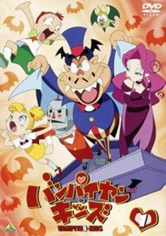

**Studio:** Production I.G &nbsp;|&nbsp; **Director:** Masatsugu Arakawa &nbsp;|&nbsp; **Aired/Released:** October 13 – March 30, 2002 &nbsp;|&nbsp; **Genres:** Comedy, Vampire, Horror, Fantasy, Kids

> Have you ever heard of the Vampirians? One noble family of such vegetarian vampires have been banished from Monsterland for their inability to scare humans. To lift the exile set on the family, Papa, the head of the household, must scare 1000 humans. To this end, he attempts to use his magnificent skills in making new inventions, but always and inevitably fails. To complicate things further, Papa's daughter Sue falls in love with a young human boy and no longer wants to return to Monsterland. Will Papa ever get his family back home?
>
> _Synopsis source: Kitsu_

[Wikipedia](https://en.wikipedia.org/wiki/Vampiyan_Kids) · [Kitsu](https://kitsu.io/anime/vampiyan-kids)

---

### Groove Adventure Rave (Rave Master)

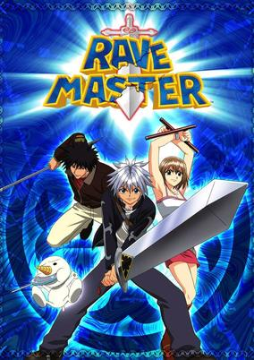

**Studio:** Studio Deen &nbsp;|&nbsp; **Director:** Takashi Watanabe &nbsp;|&nbsp; **Aired/Released:** October 13 – September 28, 2002 &nbsp;|&nbsp; **Genres:** Adventure, Fantasy, Swordplay, Coming Of Age, Magic, Action, Comedy, Fantasy World, Romance

> Long ago, a war was waged between the forces of darkness and light as Dark Brings—stones containing dark power beyond human ability—put the world at risk with their destructive force. In order to stem the tide of darkness, a lone swordsman used holy power known as the Rave to destroy the source of every Dark Brings. The resulting explosion, which came to be known as the Overdrive, destroyed a tenth of the world; fragments of the Rave were scattered throughout.Groove Adventure Rave takes place fifty years after the Overdrive. A group known as Demon Card has collected the remaining Dark Brings, using them to lay siege to a number of towns. Meanwhile, a young swordsman by the name of Haru Glory has inherited both the Rave and its guardian, Plue, making him the next Rave Master. With the aid of an amnesiac drifter by the name of Elie and a silver-manipulating blacksmith by the name of Musica, Haru must scour the world in search of the scattered Rave Stones and put an end to the Dark Brings and Demon Card for once and for all.
>
> _Synopsis source: Kitsu_

[Wikipedia](https://en.wikipedia.org/wiki/Rave_Master) · [Kitsu](https://kitsu.io/anime/groove-adventure-rave)

---

### Cyborg 009: The Cyborg Soldier (Cyborg 009)

**Studio:** Japan Vistec &nbsp;|&nbsp; **Director:** Jun Kawagoe &nbsp;|&nbsp; **Aired/Released:** October 14 – August 27, 2003 &nbsp;|&nbsp; **Genres:** Martial Arts, Cyborg, Action, Mecha, Science Fiction, Adventure

> Skull, the evil leader of the terrorist organization known as Black Ghost, has nine powerful cyborgs under his control. But Dr. Isaac Gilmore, the Black Ghosts cybernetics scientist, decides to go rogue, helping the cyborgs turn against Skull and his evil organization. Black Ghost wishes to start the next major world war by flooding the market with weapons of mass destruction. It seems the nine brave cyborgs have their work cut out for them, as Black Ghost is determined to bring those nine cyborgs down.
>
> _Synopsis source: Kitsu_

[Wikipedia](https://en.wikipedia.org/wiki/Cyborg_009) · [Kitsu](https://kitsu.io/anime/cyborg-009-2001)

---

## Original video animations

### Vandread: Taidou-hen

**Studio:** Gonzo &nbsp;|&nbsp; **Episodes:** 1 &nbsp;|&nbsp; **Director:** Shinji Higuchi Takeshi Mori &nbsp;|&nbsp; **Aired/Released:** January 21 &nbsp;|&nbsp; **Genres:** Transforming Craft, Science Fiction, Mecha, Action, Ecchi, Space Opera, Humanoid Alien, Shipboard, Alien, Future, Space, Adventure, Comedy

> Vandread Gekitouhen (Vandread Turbulence), similiar to Vandread Taidouhen, is an OVA summary of Vandread the Second Stage plus several extra scenes
>
> _Synopsis source: Kitsu_

[Wikipedia](https://en.wikipedia.org/wiki/Vandread_Taidouhen) · [Kitsu](https://kitsu.io/anime/vandread-gekitouhen)

---

### Spirit of Wonder

**Studio:** Ajia-do &nbsp;|&nbsp; **Episodes:** 2 &nbsp;|&nbsp; **Director:** Takashi Anno &nbsp;|&nbsp; **Aired/Released:** January 25 – July 25 &nbsp;|&nbsp; **Genres:** Past, Space, United Kingdom, Europe, Science Fiction, Fantasy, Comedy, Steampunk

> The now 50 year old Scientific Boys Club decides to built a ship that sails to Mars on the "Ethereal Current" - a thesis of the wife of a club member which claims that the universe is flooded with Ethereal energy. On this stream they travel to Mars in order to prove an old theory about channels on Mars built by Martians, but there is no life. Many years later, when both theories are considered to be nonsense, a Mars expedition discovers a stone with the inscription "Scientific Boys Club 1954".
>
> _Synopsis source: Kitsu_

[Wikipedia](https://en.wikipedia.org/wiki/Spirit_of_Wonder) · [Kitsu](https://kitsu.io/anime/spirit-of-wonder-shounen-kagaku-club)

---

### Angelique: Seichi yori Ai wo Komete

**Studio:** Yumeta Company &nbsp;|&nbsp; **Episodes:** 3 &nbsp;|&nbsp; **Director:** Akira Shimizu &nbsp;|&nbsp; **Aired/Released:** January 25 – June 27

[Wikipedia](https://en.wikipedia.org/wiki/Angelique_(video_game_series))

---

### Cat Soup

**Studio:** J.C.Staff &nbsp;|&nbsp; **Episodes:** 1 &nbsp;|&nbsp; **Director:** Tatsuo Satō &nbsp;|&nbsp; **Aired/Released:** February 21 &nbsp;|&nbsp; **Genres:** Comedy, Anthropomorphism, Psychological, Dementia

> The main character, a cat named Nyatto, embarks upon a journey to save his sister's soul, which was ripped in two when Nyatto tried to save her from Death. She trails after him, brain-dead. They encounter many brilliant, mind-bending situations, beginning with a disturbing magic show.
>
> _Synopsis source: Kitsu_

[Wikipedia](https://en.wikipedia.org/wiki/Cat_Soup) · [Kitsu](https://kitsu.io/anime/cat-soup)

---

### Zone of the Enders: 2167 Idolo (Z.O.E. 2167 Idolo)

**Studio:** Sunrise &nbsp;|&nbsp; **Episodes:** 1 &nbsp;|&nbsp; **Director:** Tetsuya Watanabe &nbsp;|&nbsp; **Aired/Released:** February 21 &nbsp;|&nbsp; **Genres:** Science Fiction, Mecha, Action, Piloted Robot, Other Planet, Future, Violence, Military, Space, Romance

> Z.O.E. 2167 Idolo will take place a few years prior to the events of the series Z.O.E Dolores,i, and is centered on the "Deimos Incident," an act of terrorism by the Mars revolutionaries. The BAHRAM army pilots Radium and Viola are the best in their class, and have such have been chosen to do spearhead testing on a new type of weapon; Mars hopes this weapon will liberate them from the UNSF's (United Nations Space Force) tyranny. This new technology called the "Orbital Frame," is powered by an extreamly rare and powerful source of energy known as the metatron ore. This OVA depicts the Deimos incident, and the story leading up to this incident.
>
> _Synopsis source: Kitsu_

[Kitsu](https://kitsu.io/anime/zone-of-the-enders-idolo)

---

### Puni Puni Poemy

**Studio:** J.C.Staff &nbsp;|&nbsp; **Episodes:** 2 &nbsp;|&nbsp; **Director:** Shinichi Watanabe &nbsp;|&nbsp; **Aired/Released:** March 7 – December 19 &nbsp;|&nbsp; **Genres:** Earth, Fantasy, Ecchi, Japan, Asia, Parody, Comedy, Magic, Alien, Slapstick, Alternative Present, Stereotypes, Magical Girl, Plot Continuity, Super Power, Science Fiction

> Poemi Watanabe (a.k.a. Kobayashi) is a 10-year-old girl with aspirations of being a famous voice actress. Unfortunately, her school grades are bad and her voice acting is even worse. But when a mysterious alien kills her parents and wreaks havoc all over Tokyo, Poemi grabs a talking fish, skins it into a wand and becomes the magical girl Puni Puni Poemi to save the day.
>
> _Synopsis source: Kitsu_

[Wikipedia](https://en.wikipedia.org/wiki/Puni_Puni_Poemy) · [Kitsu](https://kitsu.io/anime/puni-puni-poemii)

---

### Animation Runner Kuromi

**Studio:** Yumeta Company &nbsp;|&nbsp; **Episodes:** 1 &nbsp;|&nbsp; **Director:** Akitarou Daichi &nbsp;|&nbsp; **Aired/Released:** March 30 &nbsp;|&nbsp; **Genres:** Earth, Japan, Parody, Asia, Comedy, The Arts, Present

> After being inspired by the fictional anime, "Luis Monde III", Mikiko "Kuromi" Oguro goes to animation school and and finally lands the job of her dreams at Studio Petit. Upon arriving, she meets the head of production. Unfortunately for her, he dies soon after meeting her and passes his position unto her. Now that she's head of production of "Time Journeys", it's up to her to rally up the lazy animator's and finish the second episode in a week.
>
> _Synopsis source: Kitsu_

[Wikipedia](https://en.wikipedia.org/wiki/Animation_Runner_Kuromi) · [Kitsu](https://kitsu.io/anime/animation-seisaku-shinkou-kuromi-chan)

---

### Malice@Doll

**Studio:** Soeishinsha &nbsp;|&nbsp; **Episodes:** 3 &nbsp;|&nbsp; **Director:** Keitaro Motonaga &nbsp;|&nbsp; **Aired/Released:** April 27 – June 22 &nbsp;|&nbsp; **Genres:** Post Apocalypse, Science Fiction, Cyberpunk, Horror, Android, Psychological

> Malice, a sex robot living in an abandoned human city, is assaulted and violated by an mysterious creature. Upon awakening, Malice finds out that she has become human and can pass on her humanity to her fellow machines. However, her gift soon becomes a curse when her fellow robots rage out of control after being exposed to the pleasures of life.
>
> _Synopsis source: Kitsu_

[Wikipedia](https://en.wikipedia.org/wiki/Malice@Doll) · [Kitsu](https://kitsu.io/anime/malice-doll)

---

### Gundam Evolve

**Studio:** Sunrise &nbsp;|&nbsp; **Episodes:** 15 &nbsp;|&nbsp; **Director:** Shuko Murase Yoshitomo Yonetani &nbsp;|&nbsp; **Aired/Released:** May 17 – January 26, 2007 &nbsp;|&nbsp; **Genres:** Piloted Robot, Science Fiction, Mecha, Space, Action, Military

> A series of short films packaged with certain model kits and aired at conventions, the Gundam Evolve series chronicles a number of side-stories, alternative scenes, and even bonus omake from all around the Gundam canon. Featuring a mix of animation media—from traditional cels to 3-D CG rendering to even cel-shaded 2-D animation—these often 3-5 minute shorts cover such events as Domon Kasshu's training (and a bit of a romantic tift with Rain Mikamura) from G Gundam, Amuro Ray battling Quess Paraya from Char's Counterattack, Kamille Bidan training in the Gundam Mk.II from Zeta Gundam, and Canard Pars dueling Prayer Reverie from the Gundam SEED X Astray manga.
>
> _Synopsis source: Kitsu_

[Wikipedia](https://en.wikipedia.org/wiki/Gundam_Evolve) · [Kitsu](https://kitsu.io/anime/gundam-evolve)

---

### Read or Die (R.O.D - Read or Die)

**Studio:** Studio Deen &nbsp;|&nbsp; **Episodes:** 3 &nbsp;|&nbsp; **Director:** Koji Masunari &nbsp;|&nbsp; **Aired/Released:** May 23 – February 6, 2002 &nbsp;|&nbsp; **Genres:** Magic, Super Power, Present, Alternative Present, Plot Continuity, Action, Adventure, Steampunk, Historical, Science Fiction, Mystery

> Yomiko Readman is a lovable, near-sighted bibliomaniac working as a substitute teacher at a Japanese high school. Her real identity, however, is that of a secret agent for the British Library Special Operations Division. Her codename: "The Paper." The moniker denotes her supernatural ability to freely manipulate paper into any object she can imagine, including tools and weapons in her fight against the powerful and self-serving IJIN (Great Historical Figure) Army! Along with her partner, the enigmatic "Ms. Deep," Yomiko travels across the world in attempt to solve the mystery behind the reincarnation of historical figures and their attempt to control the world.
>
> _Synopsis source: Kitsu_

[Wikipedia](https://en.wikipedia.org/wiki/Read_or_Die) · [Kitsu](https://kitsu.io/anime/r-o-d-ova)

---

### Alien 9

**Studio:** J.C.Staff &nbsp;|&nbsp; **Episodes:** 4 &nbsp;|&nbsp; **Director:** Yasuhiro Irie Jiro Fujimoto &nbsp;|&nbsp; **Aired/Released:** June 25 – February 25, 2002 &nbsp;|&nbsp; **Genres:** Science Fiction, Japan, Action, Parasite, Conspiracy, Angst, Horror, Alien, Alternative Present, Violence, Present, Friendship, School Life

> Yuri Ootani, a girl who has been afraid of aliens, has been chosen to be on the alien party with the class president Kumi Kawamura, whose only intention to join the alien party is to get out of presidential duties, as well as Kasumi Tomine who is perfect at everything she does, including fighting all the aliens that come in their way. But can they defeat a massive alien who has already abducted Kasumi?
>
> _Synopsis source: Kitsu_

[Wikipedia](https://en.wikipedia.org/wiki/Alien_Nine) · [Kitsu](https://kitsu.io/anime/alien-nine)

---

### Happy Lesson

**Studio:** Studio Kyuuma Venet Chaos Project &nbsp;|&nbsp; **Episodes:** 5 &nbsp;|&nbsp; **Director:** Hideki Tonokatsu Takafumi Hoshikawa Takeshi Yamaguchi &nbsp;|&nbsp; **Aired/Released:** July 19 – May 23, 2003 &nbsp;|&nbsp; **Genres:** Japan, Comedy, High School, Slapstick, Stereotypes, School Life, Present, Harem, Romance, Slice of Life

> Hitotose Chitose was always alone and untrusting of people but when 5 female teachers appear and started living together with him in his family's house as his mothers, things started to change and pick up, together with Hazuki-nee and Minazuki (his 2 sisters) everyday is a lesson.
>
> _Synopsis source: Kitsu_

[Wikipedia](https://en.wikipedia.org/wiki/Happy_Lesson) · [Kitsu](https://kitsu.io/anime/happy-lesson-tv)

---

### Bible Black

**Studio:** Studio Jam &nbsp;|&nbsp; **Episodes:** 6 &nbsp;|&nbsp; **Director:** Sho Hanebu Kazuyuki Honda &nbsp;|&nbsp; **Aired/Released:** July 21 – June 25, 2003

[Wikipedia](https://en.wikipedia.org/wiki/Bible_Black)

---

### Good Morning Call

**Studio:** Production I.G &nbsp;|&nbsp; **Episodes:** 1 &nbsp;|&nbsp; **Director:** Takayuki Hamana &nbsp;|&nbsp; **Aired/Released:** August 2 &nbsp;|&nbsp; **Genres:** Earth, School Life, Romance, Japan, Comedy, Slice of Life, Asia, Present

> One year has passed since Nao and Uehara accidently moved into the same apartment. Since then, they have become an official couple. With Uehara's 16th birthday coming up, Nao's biggest worry is what to buy him. Everything is going smoothly- that is, until Nao realizes Uehara's birthday has already passed and she spent it acting as a cut model for the handsome hair stylist, Asai.
>
> _Synopsis source: Kitsu_

[Wikipedia](https://en.wikipedia.org/wiki/Good_Morning_Call) · [Kitsu](https://kitsu.io/anime/good-morning-call)

---

### One: Kagayaku Kisetsu e

**Studio:** Arms &nbsp;|&nbsp; **Episodes:** 4 &nbsp;|&nbsp; **Director:** Shigenori Kageyama &nbsp;|&nbsp; **Aired/Released:** August 10 – May 24, 2002 &nbsp;|&nbsp; **Genres:** Earth, High School, School Life, Japan, Asia, Present

> Orihara Kouhei returns to his town after a long disappearance to fullfil the promises he made to several girls in his childhood. He suffered from memory loss, and carries a tragic past. An strange ambience surrounds the OVA...It's almost like a dream, like memories from the past trying to come together in one piece but without being able to...
>
> _Synopsis source: Kitsu_

[Kitsu](https://kitsu.io/anime/one-kagayaku-kisetsu-e)

---

### 10 Tokyo Warriors

**Studio:** T.P.O &nbsp;|&nbsp; **Episodes:** 3 &nbsp;|&nbsp; **Director:** Noboru Ishiguro &nbsp;|&nbsp; **Aired/Released:** August 24 – January 25, 2002 &nbsp;|&nbsp; **Genres:** Action, Fantasy, Adventure, Friendship

> Long ago, in feudal Japan, there was a fierce warrior named the Demon King. He controlled a band of demons, known as the Kyouma. Only the powers of ten warriors sealed the Demon King away and kept the Kyouma under control. But now, Lord Shindigan, a powerful Kyouma is planning to free the Demon King, and the reincarnations of the ten warriors must band together and save the earth.
>
> _Synopsis source: Kitsu_

[Wikipedia](https://en.wikipedia.org/wiki/10_Tokyo_Warriors) · [Kitsu](https://kitsu.io/anime/tokyo-juushouden-fuuma-gogyou-denshou)

---

### X

**Studio:** Madhouse &nbsp;|&nbsp; **Episodes:** 1 &nbsp;|&nbsp; **Director:** Yoshiaki Kawajiri &nbsp;|&nbsp; **Aired/Released:** August 25

[Wikipedia](https://en.wikipedia.org/wiki/X_(TV_series))

---

### Mazinkaiser

**Studio:** Brain's Base &nbsp;|&nbsp; **Episodes:** 7 &nbsp;|&nbsp; **Director:** Masahiko Murata &nbsp;|&nbsp; **Aired/Released:** September 25 – September 20, 2002 &nbsp;|&nbsp; **Genres:** Mecha, Piloted Robot, Science Fiction, Japan, Violence, Action, Present, Asia, Earth, Adventure, Comedy

> Dr. Hell and his Mechanical Beasts are back, and they're more dangerous than ever before. Kouji Kabuto and Tetsuya Tsurugi fight a fierce battle against these hellish machines, which are under the command of Baron Ashura. Unfortunately, they are defeated, with Kouji's Mazinger Z being captured and Tetsuya's Great Mazinger seriously damaged by the enemy. The devious Dr. Hell quickly converts the captured robot into Ashura Mazinger and uses it to attack the Photo Power Lab. At the same time, Kouji is missing in action, which leaves Testuya to defend the lab in the damaged Great Mazinger. But the forces of Dr. Hell are too strong, even for a brave pilot such as Tetsuya, and all seems to be lost. The battle seems to be drawing to a close, until an overpowering blast fired by an unknown robot destroys the entire Mechanical Beast army. Could this mysterious robot be the legendary Mazinkaiser, and who is piloting it?
>
> _Synopsis source: Kitsu_

[Wikipedia](https://en.wikipedia.org/wiki/Mazinkaiser) · [Kitsu](https://kitsu.io/anime/mazinkaiser)

---

### Usagi-chan de Cue!!

**Studio:** Chaos Project &nbsp;|&nbsp; **Episodes:** 3 &nbsp;|&nbsp; **Director:** Tooru Yoshida &nbsp;|&nbsp; **Aired/Released:** November 9 – April 26, 2002 &nbsp;|&nbsp; **Genres:** Ecchi, Juujin, High School, Slapstick, Stereotypes, School Life, Action, Japan, Comedy, Plot Continuity, Present, Harem, Super Power, Magic, Romance

> Mikami Inaba was fighting a person from another school on her school's rooftop. As they fought, her friend Haru appeared. Seeing Mikami distracted, the man charged at her, causing both of them to break the nearby rabbit cages &amp; fall off the roof. As Mikami fell, she desperately grabbed the rabbit. Suddenly, a flash or pink light appeared. Mikami fused with the rabbit, and gained another personality, called Mimika. Now, Mikami only appears when various people threaten her and her friends. Otherwise, she takes on the form of Mimika.
>
> _Synopsis source: Kitsu_

[Wikipedia](https://en.wikipedia.org/wiki/Usagi-chan_de_Cue!!) · [Kitsu](https://kitsu.io/anime/usagi-chan-de-cue)

---

### Memories Off

**Studio:** E&G Films &nbsp;|&nbsp; **Episodes:** 3 &nbsp;|&nbsp; **Aired/Released:** November 21 – March 6, 2002 &nbsp;|&nbsp; **Genres:** High School, Present, Earth, Japan, Asia, Romance, School Life

> Tomoya Mikami's life changed one day when his girlfriend Ayaka was hit by a car and killed on her way to meet Tomoya. He blamed himself for her death and never was the same after the accident. He began acting callously towards Yue and his other friends. Furthermore, every time Tomoya gets involved with a new girl, he sees images of Ayaka in his dreams. He decides he needs to find a way to say goodbye to his lost love once and for all, while dealing with several side romances at the same time.
>
> _Synopsis source: Kitsu_

[Wikipedia](https://en.wikipedia.org/wiki/Memories_Off) · [Kitsu](https://kitsu.io/anime/memories-off)

---

### Kai Doh Maru

**Studio:** Production I.G &nbsp;|&nbsp; **Episodes:** 1 &nbsp;|&nbsp; **Director:** Kanji Wakabayashi &nbsp;|&nbsp; **Aired/Released:** December 19 &nbsp;|&nbsp; **Genres:** Kyoto, Heian Period, Japan, Earth, Action, Asia, Special Squads, Past, Law And Order, Violence, Historical, Magic, Fantasy

> This story takes place during the Heian Period of Japan`s history, when evil spirits still resided in the forests, mountains and rivers. A girl, accompanied by her loved one, battles against these evil spirits, while she is disguised as man. This brave woman, aka "Kaidomaru", with a Chinese character "Flame" tatooed on her upper arm, was one of the "Four Devas". Kaidomaru fights for the honor of her lost love, Raikou Minamotono, who had sacrified his life in order to protect the capital Kyoto, from the evils deeds of a "princess" cursed by a malicious ogre. The princess, whom Kaidomaru used to play with as a child, has now become her ultimate enemy.
>
> _Synopsis source: Kitsu_

[Wikipedia](https://en.wikipedia.org/wiki/Kai_Doh_Maru) · [Kitsu](https://kitsu.io/anime/kai-doh-maru)

---

### Samurai X: Reflection

**Studio:** Studio Deen &nbsp;|&nbsp; **Episodes:** 2 &nbsp;|&nbsp; **Director:** Kazuhiro Furuhashi &nbsp;|&nbsp; **Aired/Released:** December 19 – March 20, 2002 &nbsp;|&nbsp; **Genres:** Romance, Bakumatsu   Meiji Period, Japan, Earth, Action, Asia, Drama, Past, Samurai, Historical

> Kaoru goes to the harbor every day to see if Kenshin has returned. After a while, she starts looking back at her life with Kenshin and all the things that have happened.
>
> _Synopsis source: Kitsu_

[Kitsu](https://kitsu.io/anime/rurouni-kenshin-seisouhen)

---

### Kanzen Shouri Daiteiou

**Studio:** Sunrise &nbsp;|&nbsp; **Episodes:** 1 &nbsp;|&nbsp; **Aired/Released:** December 22 &nbsp;|&nbsp; **Genres:** Science Fiction, Mecha, Super Robot, Piloted Robot, Robot, Action, Adventure, Kids

> When an alien force attacks Earth, a giant sword falls onto the campus of Paradise Elementary School, transforming it into a flying vessel. The fate of the planet lies with one group of kids who must pilot powerful mecha to stop the invaders before it's too late! (Source: Anime-Planet) Note: Originally planned as a TV anime series, this ended up as a promotional video for its manga serialization on magazine Monthly Daiteioh.
>
> _Synopsis source: Kitsu_

[Wikipedia](https://en.wikipedia.org/wiki/Kanzen_Shouri_Daiteioh) · [Kitsu](https://kitsu.io/anime/kanzen-shouri-daiteiou)

---

### Soreyuke Marin-chan

**Episodes:** 3

---

### Blood Shadow

**Episodes:** 3

---

### Immoral Sisters

**Episodes:** 3

---

### Moonlight Lady

**Episodes:** 5

[Wikipedia](https://en.wikipedia.org/wiki/Moonlight_Lady_(anime))

---

## Films

### Initial D: Third Stage

**Studio:** Studio Deen &nbsp;|&nbsp; **Director:** Shin Misawa &nbsp;|&nbsp; **Aired/Released:** January 13 &nbsp;|&nbsp; **Genres:** High School, Present, Earth, Japan, Motorsport, Street Racing, Plot Continuity, Asia, Action, School Life

> Shortly after graduating from high school, Takumi is approached by RedSuns leader Ryosuke Takahashi and offered to join him in forming a professional racing team. Before coming up with an answer to the proposal, Takumi seeks retribution by issuing a rematch to Emperor leader Kyouichi Sudou, who previously defeated him due to an engine failure. He is also challenged by Kai Kogashiwa, a second-generation street racer whose father was once a fierce rival of Takumi's father Bunta.
>
> _Synopsis source: Kitsu_

[Wikipedia](https://en.wikipedia.org/wiki/Initial_D) · [Kitsu](https://kitsu.io/anime/initial-d-third-stage)

---

### One Piece: Nejimaki-jima no Daibouken (One Piece: Clockwork Island Adventure)

**Studio:** Toei Animation &nbsp;|&nbsp; **Director:** Junji Shimizu &nbsp;|&nbsp; **Aired/Released:** March 3 &nbsp;|&nbsp; **Genres:** Fantasy, Pirate, Action, Fantasy World, Comedy, Super Power, Adventure, Friendship

> Informed by the Thief Brothers his ship has been stolen by the Trump Kyoudai (Trump Siblings) who have set up base on Clockwork Island. Monkey D. Luffy, Captain of the Going Merry and aspiring Pirate King works with his crew - Ussop, Zoro, Sanji and Nami to battle their way up Clockwork Island to reclaim their ship.
>
> _Synopsis source: Kitsu_

[Wikipedia](https://en.wikipedia.org/wiki/Clockwork_Island_Adventure) · [Kitsu](https://kitsu.io/anime/one-piece-nejimaki-jima-no-daibouken)

---

### Doraemon: Nobita and the Winged Braves (Doraemon the Movie: Nobita and the Winged Braves)

**Studio:** Shin-Ei Animation &nbsp;|&nbsp; **Director:** Tsutomu Shibayama &nbsp;|&nbsp; **Aired/Released:** March 10 &nbsp;|&nbsp; **Genres:** Fantasy, Adventure, Kids

> Nobita and his friends gathered at Shizuka's house when they heard about the news about missing flocks of bird species. Nobita believed they were taken away by winged creatures and became obsessed on flying on his own. He created mechanical wings and upon the experiment he encountered an actual winged creature flying out of a time-space distortion. Upon helping him whose name is Gusuke, Nobita and his friends were sucked into the distortion and reached Gusuke's home, Birdpia or the world where the winged creatures live.
>
> _Synopsis source: Kitsu_

[Kitsu](https://kitsu.io/anime/doraemon-nobita-s-winged-heroes)

---

### Crayon Shin-chan: The Storm Called: The Adult Empire Strikes Back

**Studio:** Shin-Ei Animation &nbsp;|&nbsp; **Director:** Keiichi Hara &nbsp;|&nbsp; **Aired/Released:** April 21

---

### Detective Conan: Countdown to Heaven (Case Closed Movie 5: Countdown to Heaven)

**Studio:** TMS Entertainment &nbsp;|&nbsp; **Director:** Kenji Kodama &nbsp;|&nbsp; **Aired/Released:** April 21 &nbsp;|&nbsp; **Genres:** Detective, Present, Earth, Japan, Asia, Action, Crime, Conspiracy, Adventure, Comedy, Cops, Mystery

> As a pair of towers in Tokyo are being prepared for their grand opening, there is a series of murders of people connected to the towers. Conan suspects that the mysterious Syndicate may also be involved.
>
> _Synopsis source: Kitsu_

[Kitsu](https://kitsu.io/anime/detective-conan-movie-05-countdown-to-heaven)

---

### Metropolis

**Studio:** Madhouse &nbsp;|&nbsp; **Director:** Rintaro &nbsp;|&nbsp; **Aired/Released:** May 26

[Wikipedia](https://en.wikipedia.org/wiki/Metropolis_(2001_film))

---

### Final Fantasy: The Spirits Within

**Studio:** Square Pictures &nbsp;|&nbsp; **Director:** Hironobu Sakaguchi &nbsp;|&nbsp; **Aired/Released:** July 2 &nbsp;|&nbsp; **Genres:** Science Fiction, Post Apocalypse, Action, Earth, Alien, Future, Military

> The year is 2065, and the planet of Earth is far removed from the place that it was in the past. Deadly alien creatures known as Phantoms have appeared all over the planet, and mere contact with these entities is lethal, whether it be an instant death or a prolonged decline. In order to try and salvage what little of the human race is left, large force-field barriers have been constructed around certain cities to repel the Phantoms. Seeking a more permanent solution to this invasion are scientists Aki Ross and her mentor, Dr. Sid, whose investigations have revealed that there exists a form of spiritual, Gaia energy that can eradicate the Phantom's presence from this world. Aki and Sid aren't alone in their quest through Final Fantasy: The Spirits Within; the human council and the military squad "Deep Eyes" are ready to help. Not everyone is convinced of this plan though. Aki, Sid, Grey, and their allies have to band together against forces both alien and human if they are to have any chance at restoring peace to Earth. An enemy whose mere touch is fatal, the Phantoms appear the more dangerous enemy, but as they will come to find out, their human nemeses are also not to be trifled with.
>
> _Synopsis source: Kitsu_

[Kitsu](https://kitsu.io/anime/final-fantasy-the-spirits-within)

---

### Pokémon 4Ever (Pokemon 4Ever)

**Studio:** OLM &nbsp;|&nbsp; **Director:** Kunihiko Yuyama &nbsp;|&nbsp; **Aired/Released:** July 7 &nbsp;|&nbsp; **Genres:** Fantasy, Proxy Battles, Adventure, Comedy, Kids

> 40 years ago, a Celebi was being attacked by a Pokemon Hunter. Luckily, a young boy named Sammy saved Celebi. Using its Time Traveling power, Celebi transported himself and Sammy 40 years into the future. There, Ash, Misty, and Brock assist Sammy to the healing lake in the forest so they can heal the wounded Celebi. Unfortunately an evil Team Rocket member, Viscious a.k.a. "The Iron Masked Marauder", tries to capture Celebi using his technology. As Ash and Co. try to get away from Viscious, they also run into Jessie, James, and Meowth, who also want to capture Celebi. Soon it becomes a race against time to get Celebi and Sammy back to the forest before Celebi is caught and is used to destroy the forest and themselves.
>
> _Synopsis source: Kitsu_

[Wikipedia](https://en.wikipedia.org/wiki/Pok%C3%A9mon_4Ever) · [Kitsu](https://kitsu.io/anime/pokemon-celebi-toki-wo-koeta-deai)

---

### Digimon Tamers: Battle of Adventurers

**Studio:** Toei Animation &nbsp;|&nbsp; **Director:** Tetsuo Imazawa &nbsp;|&nbsp; **Aired/Released:** July 14 &nbsp;|&nbsp; **Genres:** Adventure, Fantasy, Proxy Battles, Science Fiction, Present, Friendship

> Takato and Guilmon go on vacation to Okinawa and meet a fellow tamer, Minami. Back in Japan, a popular computer pet suddenly becomes a virus, infecting all of the computers who have it. As the virus spreads, Takato tries to figure out why digimon are all attacking his new friend, and what her connection is to the virus.
>
> _Synopsis source: Kitsu_

[Kitsu](https://kitsu.io/anime/digimon-tamers-boukensha-tachi-no-tatakai)

---

### Spirited Away

**Studio:** Studio Ghibli &nbsp;|&nbsp; **Director:** Hayao Miyazaki &nbsp;|&nbsp; **Aired/Released:** July 20 &nbsp;|&nbsp; **Genres:** Fantasy World, Magic, Parallel Universe, Present, Fantasy, Adventure, Isekai, Drama, Supernatural, Romance, Coming Of Age

> Stubborn, spoiled, and naïve, 10-year-old Chihiro Ogino is less than pleased when she and her parents discover an abandoned amusement park on the way to their new house. Cautiously venturing inside, she realizes that there is more to this place than meets the eye, as strange things begin to happen once dusk falls. Ghostly apparitions and food that turns her parents into pigs are just the start—Chihiro has unwittingly crossed over into the spirit world. Now trapped, she must summon the courage to live and work amongst spirits, with the help of the enigmatic Haku and the cast of unique characters she meets along the way. Vivid and intriguing, Sen to Chihiro no Kamikakushi tells the story of Chihiro's journey through an unfamiliar world as she strives to save her parents and return home. [Written by MAL Rewrite]
>
> _Synopsis source: Kitsu_

[Wikipedia](https://en.wikipedia.org/wiki/Spirited_Away) · [Kitsu](https://kitsu.io/anime/spirited-away)

---

### Princess Arete

**Studio:** Studio 4°C &nbsp;|&nbsp; **Director:** Sunao Katabuchi &nbsp;|&nbsp; **Aired/Released:** July 21 &nbsp;|&nbsp; **Genres:** Fantasy, Magic, Fantasy World

> Confined in the castle tower by her father, princess Arete spends her days watching the world outside her window. Sometimes she seeks out to watch the common people at work. The knights of the kingdom compete for the right to marry her and rule the land by competing to see who can find powerful magic objects made by a long dead race of sorcerers. Arete wants none of this. She longs to meet the common people and travel to exotic lands she has only seen in the books she keeps hidden under her bed. One day the sorcerer Boax arrives in a fantastic flying machine and offers to take Arete as his wife and transform her into a proper princess.
>
> _Synopsis source: Kitsu_

[Wikipedia](https://en.wikipedia.org/wiki/Princess_Arete) · [Kitsu](https://kitsu.io/anime/princess-arete)

---

### Millennium Actress

**Studio:** Madhouse &nbsp;|&nbsp; **Director:** Satoshi Kon &nbsp;|&nbsp; **Aired/Released:** July 28 ( Fantasia Film Festival ) &nbsp;|&nbsp; **Genres:** Earth, Romance, Japan, Action, Slice of Life, Performance, Thriller, Historical, Fantasy, Adventure

> At the turn of the millennium, Ginei Studio's dilapidated buildings are set to be demolished. Ex-employee and filmmaker Genya Tachibana decides to honor this occasion with a commemorative documentary about the company's star actress: Chiyoko Fujiwara, the reclusive sweetheart of Shouwa Era cinema. Having finally obtained permission to interview the retired starlet, an enamored Genya drags along cynical cameraman Kyouji Ida to meet her, ready to put his lifelong idol back in the spotlight once more. Hidden in this secluded mountain retreat is a thousand years of history condensed into one lifetime, waiting to be narrated. Chiyoko's recollections take them on an illusionary journey through Japanese cinematic history that transcends the boundaries of reality; the saga of her acting career intertwines with her filmography, the actors in her life blend seamlessly with the characters on screen, and the present melds with the past. Though the actress may have retired at the height of her career 30 years ago, the curtain on her life's stage has yet to fall. [Written by MAL Rewrite]
>
> _Synopsis source: Kitsu_

[Wikipedia](https://en.wikipedia.org/wiki/Millennium_Actress) · [Kitsu](https://kitsu.io/anime/millennium-actress)

---

### Saiyuki: Requiem

**Studio:** Pierrot &nbsp;|&nbsp; **Director:** Hayato Date &nbsp;|&nbsp; **Aired/Released:** August 18 &nbsp;|&nbsp; **Genres:** Fantasy, Contemporary Fantasy, Action, Martial Arts, Magic, Adventure

> The gang is traveling along when they find a girl in need. Of course, they all can't resist going after her. This girl isn't all that she seems... her motive or her "humanity".... and soon the whole gang has Sanzo's past on their hands and one certain young boy who can keep a grudge for decades...
>
> _Synopsis source: Kitsu_

[Kitsu](https://kitsu.io/anime/saiyuki-requiem)

---

### Inochi no Chikyuu: Dioxin no Natsu (The Summer of Dioxin)

**Studio:** Magic Bus &nbsp;|&nbsp; **Director:** Tetsu Dezaki &nbsp;|&nbsp; **Aired/Released:** August 18 &nbsp;|&nbsp; **Genres:** Italy, Europe, Past

> This film was based on a real-life 1976 accident in Italy, when deadly dioxins threatened the area surrounding a biological research laboratory where an explosion took place.
>
> _Synopsis source: Kitsu_

[Kitsu](https://kitsu.io/anime/inochi-no-chikyuu-dioxin-no-natsu)

---

### Cowboy Bebop: The Movie

**Studio:** Sunrise Bones (animation production) Bandai Visual &nbsp;|&nbsp; **Director:** Shinichirō Watanabe &nbsp;|&nbsp; **Aired/Released:** September 1 &nbsp;|&nbsp; **Genres:** Science Fiction, Action, Gunfights, Bounty Hunter, Mars, Other Planet, Future, Space, Mystery

> Another day, another bounty—such is the life of the often unlucky crew of the Bebop. However, this routine is interrupted when Faye, who is chasing a fairly worthless target on Mars, witnesses an oil tanker suddenly explode, causing mass hysteria. As casualties mount due to a strange disease spreading through the smoke from the blast, a whopping three hundred million woolong price is placed on the head of the supposed perpetrator. With lives at stake and a solution to their money problems in sight, the Bebop crew springs into action. Spike, Jet, Faye, and Edward, followed closely by Ein, split up to pursue different leads across Alba City. Through their individual investigations, they discover a cover-up scheme involving a pharmaceutical company, revealing a plot that reaches much further than the ragtag team of bounty hunters could have realized. [Written by MAL Rewrite]
>
> _Synopsis source: Kitsu_

[Kitsu](https://kitsu.io/anime/cowboy-bebop-tengoku-no-tobira)

---

### Inuyasha the Movie: Affections Touching Across Time

**Studio:** Sunrise &nbsp;|&nbsp; **Director:** Toshiya Shinohara &nbsp;|&nbsp; **Aired/Released:** December 22 &nbsp;|&nbsp; **Genres:** Fantasy, Action, Parallel Universe, Demon, Super Power, Historical, Adventure, Comedy, Romance, Shounen, Isekai, Swordplay

> Inu-Yasha has mastered the ultimate attack of the Tetsusaiga and continues his battle for the Shikon Jewel shards with Kagome, Shippo, Sango, and Miroku. Unfortunately, a freak occurance with a jewel shard has brought to life an incarnation of a demonic enemy sealed by Inu-Yashas' father. Inu-Yasha must surpass his father and destroy this demon or every soul in Japan will be consumed.
>
> _Synopsis source: Kitsu_

[Kitsu](https://kitsu.io/anime/inuyasha-toki-wo-koeru-omoi)

---

### Sakura Wars: The Movie

**Studio:** Production I.G &nbsp;|&nbsp; **Director:** Mitsuru Hongo &nbsp;|&nbsp; **Aired/Released:** December 22 &nbsp;|&nbsp; **Genres:** Steampunk, Mecha, Japan, Earth, Action, Asia, Piloted Robot, Alternative Past, Science Fiction, Adventure

> Since a new branch of division to New York has been created, Ohgami has now been assigned to the Paris Division. Now the Flower Division must be able to survive on their own, with the help of their new American-cultured leader.
>
> _Synopsis source: Kitsu_

[Kitsu](https://kitsu.io/anime/sakura-taisen-katsudou-shashin)

---
