# 2002 in Anime

[← Back to index](../README.md)

140 titles · 122 with a matched synopsis/cover art · [source](https://en.wikipedia.org/wiki/2002_in_anime)

## Television series

### Secret of Cerulean Sand

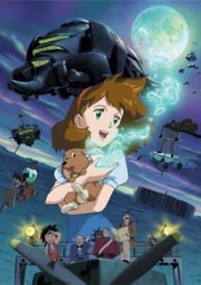

**Studio:** Telecom Animation Film &nbsp;|&nbsp; **Episodes:** 26 &nbsp;|&nbsp; **Director:** Yuuichiro Yano &nbsp;|&nbsp; **Aired/Released:** January 5 – June 29 &nbsp;|&nbsp; **Genres:** Desert, Science Fiction, Fantasy, Steampunk, Adventure, Earth, Action, Asia, Alternative Past, Past, Friendship, Plot Continuity

> Jane's mother dies when she is born, and her father, a rich English aristocrat, soon remarries to a woman with a son, William, who despises his new father and brother. George and Jane grow up with a dream to make a flying machine. George believes the distant Asian sands hold a secret: a mysterious cerulean sand which can make machines fly. He goes on an expedition to find it, and soon is reported executed for treason. William disappears too. After she recieves an unsigned letter holding a handful of pale-blue sand which floats in the air, Jane is sure her brother is alive and leaves to the East to find him and prove him innocent. There are many mysteries to unravel in store for Jane and her new friends on her journey. But perhaps a mystery should forever remain a mystery...
>
> _Synopsis source: Kitsu_

[Wikipedia](https://en.wikipedia.org/wiki/Secret_of_Cerulean_Sand) · [Kitsu](https://kitsu.io/anime/patapata-hikousen-no-bouken)

---

### Panyo Panyo Di Gi Charat

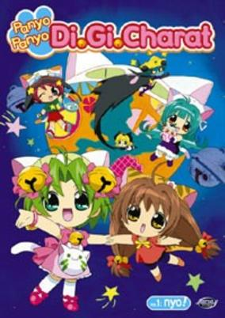

**Studio:** Madhouse &nbsp;|&nbsp; **Episodes:** 48 &nbsp;|&nbsp; **Director:** Shigehito Takayanagi &nbsp;|&nbsp; **Aired/Released:** January 6 – April 3, 2003 &nbsp;|&nbsp; **Genres:** Comedy

> Deijiko is the princess of the planet of Di Gi Charat. After reading a book, she is influenced to want to help everyone be happy. She leaves the castle and pretends to be a normal girl. She tries to make everyone happy by taking various jobs around the town and thereby making all sorts of new friends and inevitably, enemies.
>
> _Synopsis source: Kitsu_

[Wikipedia](https://en.wikipedia.org/wiki/Panyo_Panyo_Di_Gi_Charat) · [Kitsu](https://kitsu.io/anime/panyo-panyo-di-gi-charat)

---

### Beyblade V-Force

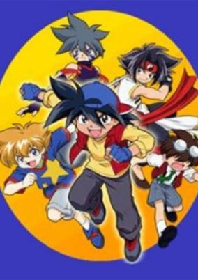

**Studio:** Nippon Animation &nbsp;|&nbsp; **Episodes:** 51 &nbsp;|&nbsp; **Director:** Yoshio Takeuchi &nbsp;|&nbsp; **Aired/Released:** January 7 – December 30 &nbsp;|&nbsp; **Genres:** Science Fiction, Earth, Action, Proxy Battles, Stereotypes, Adventure, Comedy, Friendship, Sports

> The Bladebreakers have to join forces once again because a mysterious group under the lead of Oozuma has defeated them, but the real enemy is not Oozuma. The real threath is formed by a group of people who use cyber-BitBeasts to capture the original ones from the Bladebreakers.
>
> _Synopsis source: Kitsu_

[Wikipedia](https://en.wikipedia.org/wiki/Beyblade_V-Force) · [Kitsu](https://kitsu.io/anime/bakuten-shoot-beyblade-2002)

---

### Mirage of Blaze

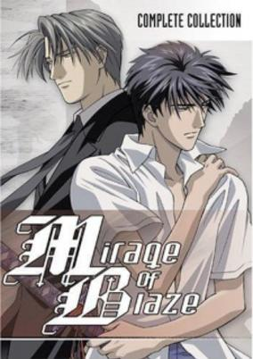

**Studio:** Madhouse &nbsp;|&nbsp; **Episodes:** 13 &nbsp;|&nbsp; **Director:** Susumu Kudo &nbsp;|&nbsp; **Aired/Released:** January 7 – April 8 &nbsp;|&nbsp; **Genres:** Fantasy, Contemporary Fantasy, Japan, Past, Shounen Ai, Samurai, Historical, Action, Romance, School Life

> Takaya Ougi is just a typical high school guy who wants nothing more than to protect his best friend and live a normal life. Enter Nobutsuna Naoe, an older man who informs Takaya that he is in fact the reincarnation of Lord Kagetora. Naoe, himself a possessor, awakens Takaya's abilities to exorcise evil spirits and fight the Fuedal Underworld. While most possessors remember their former lives before being reincarnated, Takaya does not. Naoe is thankful for this, considering his passionate and abusive past with his Lord Kagetora. As Takaya improves his abilities, he also begins to remember what Naoe did because of his love for him. Meanwhile the dark forces of the Hojo and Fuma clans begin their attack as the Fuedal Underworld descends upon the living world.
>
> _Synopsis source: Kitsu_

[Wikipedia](https://en.wikipedia.org/wiki/Mirage_of_Blaze) · [Kitsu](https://kitsu.io/anime/mirage-of-blaze)

---

### Full Metal Panic!

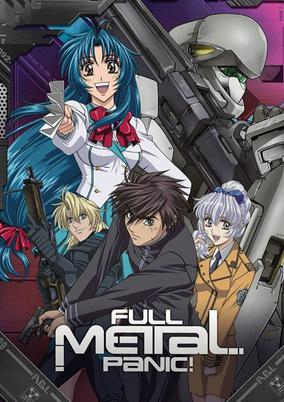

**Studio:** Gonzo &nbsp;|&nbsp; **Episodes:** 24 &nbsp;|&nbsp; **Director:** Kouichi Chigira &nbsp;|&nbsp; **Aired/Released:** January 8 – June 18 &nbsp;|&nbsp; **Genres:** Romance, Science Fiction, Mecha, Earth, Japan, Action, Asia, Piloted Robot, Comedy, Future, Slapstick, Parallel Universe, Plot Continuity, Military

> Equipped with cutting-edge weaponry and specialized troops, a private military organization named Mithril strives to extinguish the world's terrorism and all threats to peace on earth. The organization is powered by the "Whispered," individuals who possess intuitive knowledge and the remarkable ability to create powerful devices and machinery. Seventeen-year-old Sousuke Sagara, a sergeant working for Mithril, has been assigned to protect Kaname Chidori, a Whispered candidate. He is ordered to join her high school class and be as close to her as possible to prevent her from falling into enemy hands—that is, if he can safely blend in with their fellow classmates without revealing his true identity. Sousuke, who was raised on a battlefield and has very little knowledge of an average high school student's lifestyle, must adapt to a normal school life to safeguard Kaname. However, enemy forces have already begun making their move, and Sousuke is about to find out that the adversary coming for the Whispered girl may be a lot more familiar than he expects. [Written by MAL Rewrite]
>
> _Synopsis source: Kitsu_

[Wikipedia](https://en.wikipedia.org/wiki/Full_Metal_Panic!) · [Kitsu](https://kitsu.io/anime/full-metal-panic)

---

### Ultimate Muscle

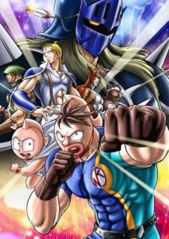

**Studio:** Toei Animation &nbsp;|&nbsp; **Episodes:** 51 &nbsp;|&nbsp; **Director:** Toshiaki Komura &nbsp;|&nbsp; **Aired/Released:** January 9 – December 25 &nbsp;|&nbsp; **Genres:** Science Fiction, Action, Sports, Comedy, Martial Arts

> Kinnikuman II Sei takes place several years after the events of the original Kinnikuman. Mantarou Kinniku is the 59th prince of Planet Kinniku and son of the renowned wrestler, King Suguru. Lazy, immature, and cowardly, Mantarou seems to have little in common with his heroic father. When a powerful group calling themselves the dMP threatens the Earth, only someone as powerful as Kinnikuman stands a chance against them. Not knowing the current whereabouts of the King, a plan is formed to have his son Mantarou take up the mantle. The idea of fighting super villains does not sit well with Mantarou, who initially runs away from his duty. He flees to Earth where he encounters Meat, his father’s old trainer. Despite Mantarou's shortcomings, Meat sees King Suguru in him, and believes he can set the prince on the right path. Thus begins Mantarou's journey to better himself and save the world.
>
> _Synopsis source: Kitsu_

[Wikipedia](https://en.wikipedia.org/wiki/Kinnikuman) · [Kitsu](https://kitsu.io/anime/kinnikuman-nisei)

---

### Please Teacher!

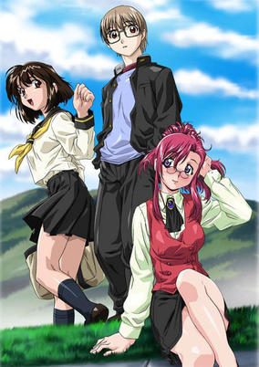

**Studio:** Daume &nbsp;|&nbsp; **Episodes:** 12 &nbsp;|&nbsp; **Director:** Yasunori Ide &nbsp;|&nbsp; **Aired/Released:** January 10 – March 28 &nbsp;|&nbsp; **Genres:** Romance, Earth, Japan, Asia, Sudden Girlfriend Appearance, Humanoid Alien, Alien, School Life, Present, Science Fiction, Comedy

> Kusanagi Kei, a high-school student living with his aunt and uncle, has an encounter with a female alien. This alien is revealed to be a new teacher at his school. Later, he is forced to marry this alien to preserve her secrets. From there, various romantically-inclined problems crop up repeatedly.
>
> _Synopsis source: Kitsu_

[Wikipedia](https://en.wikipedia.org/wiki/Please_Teacher!) · [Kitsu](https://kitsu.io/anime/onegai-teacher)

---

### Nana Seven of Seven (Pokemon: Jirachi Wishmaker)

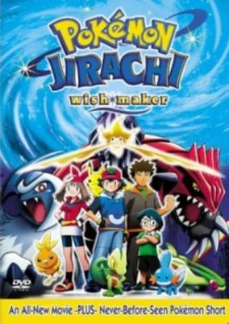

**Studio:** A.C.G.T . &nbsp;|&nbsp; **Episodes:** 25 &nbsp;|&nbsp; **Director:** Yasuhiro Imagawa &nbsp;|&nbsp; **Aired/Released:** January 10 – June 27 &nbsp;|&nbsp; **Genres:** Fantasy, Adventure, Comedy, Kids

> This is the 6th Movie. Satoshi, Haruka, Takeshi, and Masato come upon the festival of the Wishing Star of Seven Nights. During their enjoyment, the legendary pokemon, Jirachi, decends from the heavens and befriends Masato. Jirachi, with the power to grant any wish, is sought after by many people wanting to claim its power. One man seeks to use its legendary power to revive an ancient pokemon known as Groudon, unaware of the dangers hidden within Jirachi's powers
>
> _Synopsis source: Kitsu_

[Wikipedia](https://en.wikipedia.org/wiki/Seven_of_Seven) · [Kitsu](https://kitsu.io/anime/pokemon-advanced-generation-nanayo-no-negaiboshi-jirachi)

---

### Aquarian Age : Sign for Evolution (Aquarian Age: Sign for Evolution)

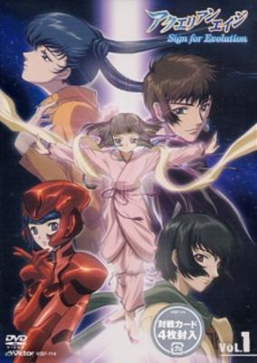

**Studio:** Madhouse &nbsp;|&nbsp; **Episodes:** 13 &nbsp;|&nbsp; **Director:** Yoshimitsu Oohashi &nbsp;|&nbsp; **Aired/Released:** January 11 – March 29 &nbsp;|&nbsp; **Genres:** Earth, Romance, Japan, Contemporary Fantasy, Asia, Coming Of Age, Musical Band, Idol, Plot Continuity, Present, Music, Super Power, Action, Science Fiction, Fantasy, Adventure

> Five supernatural factions have been fighting against each other for who knows how many centuries, with the beginning of Aquarian Age always in mind. Kyouta, soon begins to see visions of mystical girls fighting, except they do exist. Soon he and his girlfriend Yoriko become involved and the battle for Earth and Aquarian Age lies in their hands.
>
> _Synopsis source: Kitsu_

[Wikipedia](https://en.wikipedia.org/wiki/Aquarian_Age) · [Kitsu](https://kitsu.io/anime/aquarian-age)

---

### RahXephon

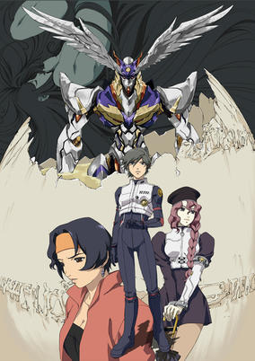

**Studio:** Bones &nbsp;|&nbsp; **Episodes:** 26 &nbsp;|&nbsp; **Director:** Yutaka Izubuchi &nbsp;|&nbsp; **Aired/Released:** January 21 – September 11 &nbsp;|&nbsp; **Genres:** Post Apocalypse, Air Force, Thriller, Conspiracy, Navy, War, Piloted Robot, Mecha, Japan, Plot Continuity, Military, Music, Action, Science Fiction, Romance, Psychological, Mystery

> In the year 2012 Japan was invaded by the Mu. Human-like beings from another dimension with blue blood. In the year 2015 Tokyo is attacked by invaders, who are repelled by a humanoid weapon called a Dolem. During the chaos, Ayato Kamina meets Reika Mishima, a classmate. During that same day, he is attacked by government officials but a woman named Haruka comes to his rescue, informing him that she was sent to get him by the Organization TERRA, and that Tokyo had been sealed in a time rift where time flows one third as fast as the outside world. He flees from Haruka onto a train where he sees Reika once more. Arriving at the Room of Rah, he follows her to a tremendous egg where the Dolem RahXephon is hatched from, and upon her singing his mother appears atop the Dolem that had stopped the TERRA Invasion. In the battle Ayato's mother is injured, and Ayato flees Tokyo Jupiter with Haruka.
>
> _Synopsis source: Kitsu_

[Wikipedia](https://en.wikipedia.org/wiki/RahXephon) · [Kitsu](https://kitsu.io/anime/rahxephon)

---

### Kanon

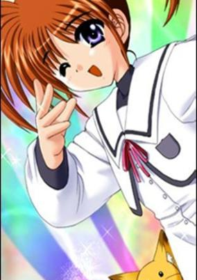

**Studio:** Toei Animation &nbsp;|&nbsp; **Episodes:** 13 &nbsp;|&nbsp; **Director:** Naoyuki Ito &nbsp;|&nbsp; **Aired/Released:** January 31 – March 28 &nbsp;|&nbsp; **Genres:** Magic, Music, Magical Girl

> The original video performed by hitomi (under the name Minami Hokuto) that inspired Magical Girl Lyrical Nanoha. It is from Triangle Heart ~Lyrical Toy Box~, a merchandise CD released on June 29, 2001 for the eroge video game Triangle Heart 3. The CD contains a large amount of fan material, including a number of visual novel-like stories called "mini-scenarios". One of them, entitled "Magical Girl Lyrical Nanoha", cast Nanoha Takamachi (a minor character in the TH3 canon) as a magical girl and served as a prototype for the Magical Girl Lyrical Nanoha anime series.
>
> _Synopsis source: Kitsu_

[Wikipedia](https://en.wikipedia.org/wiki/Kanon_(video_game)) · [Kitsu](https://kitsu.io/anime/mahou-shoujo-lyrical-nanoha-lyrical-toy-box)

---

### Genma Wars

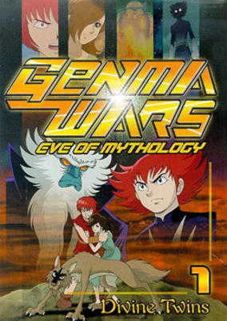

**Studio:** E&G Films &nbsp;|&nbsp; **Episodes:** 13 &nbsp;|&nbsp; **Director:** Tsuneo Tominaga &nbsp;|&nbsp; **Aired/Released:** February 2 – May 11 &nbsp;|&nbsp; **Genres:** Science Fiction, Adventure, Horror

> In the distant future, monsters and inhumans roam the land, and the ruling Evil King seeks a human woman to bear him powerful, force-adept heirs. Non offers herself to the Evil King in order to save her village from Ape Clan raiders, and gives him twin sons, Loof and Jin. She and her sons are exiled by the ungrateful villagers, however, and Non's companion Nue (a Demon Clan member changed into a wolf for disobedience) takes Loof to be raised by his father, the Evil King. The Evil One's Queen Parome despises humans, however, and her malevolence towards Loof deepens...
>
> _Synopsis source: Kitsu_

[Wikipedia](https://en.wikipedia.org/wiki/Genma_Wars) · [Kitsu](https://kitsu.io/anime/genma-taisen-shinwa-zenya-no-shou)

---

### Useless Witch Doremi Kaboom!

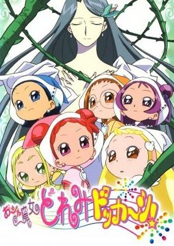

**Studio:** Toei Animation &nbsp;|&nbsp; **Episodes:** 51 &nbsp;|&nbsp; **Director:** Takuya Igarashi &nbsp;|&nbsp; **Aired/Released:** February 3 – January 26, 2003 &nbsp;|&nbsp; **Genres:** Fantasy, Comedy, Magic, Magical Girl

> Hana now becomes a peer of the Ojamajo. When Majotourbillon's spirit revives, the witches now have to break her curse. From the help from Pao-chan, Doremi, Hana, and the other witches are able to defeat the curses.
>
> _Synopsis source: Kitsu_

[Wikipedia](https://en.wikipedia.org/wiki/Ojamajo_Doremi_Dokk%C4%81n!) · [Kitsu](https://kitsu.io/anime/ojamajo-doremi-dokkaan)

---

### Galaxy Angel Z

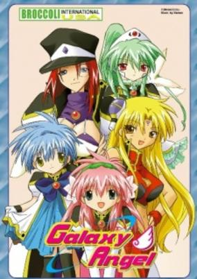

**Studio:** Madhouse &nbsp;|&nbsp; **Episodes:** 9 &nbsp;|&nbsp; **Director:** Morio Asaka &nbsp;|&nbsp; **Aired/Released:** February 3 – March 31 &nbsp;|&nbsp; **Genres:** Future, Space, Slapstick, Shipboard, Science Fiction, Comedy

> The Angel Brigade, an elite branch of the Transbaal Empire military, are assigned to search for The Lost Technology, mysterious items from the past that hold unknown powers. Led by the soon to retire Colonel Volcott O' Huey, the Angel Brigade travel to different planets using their specially designed Emblem Frame ships to search for Lost Technology. Unfortunately, they usually mess up somehow and end up getting into all kinds of weird and troublesome situations.
>
> _Synopsis source: Kitsu_

[Wikipedia](https://en.wikipedia.org/wiki/Galaxy_Angel) · [Kitsu](https://kitsu.io/anime/galaxy-angel)

---

### Kick Off 2002 (Kick Off (2002))

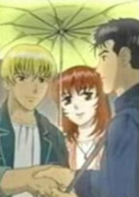

**Studio:** KBS Media &nbsp;|&nbsp; **Episodes:** 26 &nbsp;|&nbsp; **Director:** Kim Dae Jun &nbsp;|&nbsp; **Aired/Released:** February 18 – September 2 &nbsp;|&nbsp; **Genres:** Sports

> No synopsis has been added for this series yet.Click here to update this information.
>
> _Synopsis source: Kitsu_

[Wikipedia](https://en.wikipedia.org/wiki/Kick_Off_2002) · [Kitsu](https://kitsu.io/anime/kick-off-2002)

---

### Rockman.EXE

**Studio:** Xebec &nbsp;|&nbsp; **Episodes:** 56 &nbsp;|&nbsp; **Director:** Takao Kato &nbsp;|&nbsp; **Aired/Released:** March 4 – March 31, 2003

[Wikipedia](https://en.wikipedia.org/wiki/Rockman.EXE_(anime))

---

### Gun Frontier

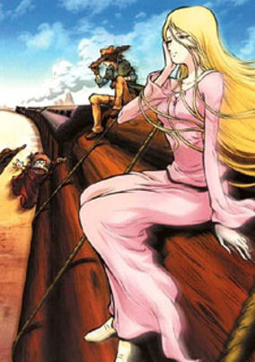

**Studio:** Vega Entertainment &nbsp;|&nbsp; **Episodes:** 13 &nbsp;|&nbsp; **Director:** Soichiro Zen &nbsp;|&nbsp; **Aired/Released:** March 28 – June 20 &nbsp;|&nbsp; **Genres:** Adventure, Earth, Gunfights, Swordplay, Americas, Drama, Action, Samurai, Historical, Science Fiction

> It is a harsh and barren wasteland, where the weak aren't allowed to dream. It is also a sacred land for true men, for there is no place a man can feel more alive. This is the Gun Frontier. Sea Pirate Captain Harlock and the errant samurai, Tochiro arrive in the United States on the Western Frontier. Along with a mysterious woman they meet along the way, the two friends challenge sex rings, bandits, and corrupt sheriff. They are searching for a lost clan of Japanese immigrants, and they will tear Gun Frontier from end to end until they find it.
>
> _Synopsis source: Kitsu_

[Wikipedia](https://en.wikipedia.org/wiki/Gun_Frontier_(manga)) · [Kitsu](https://kitsu.io/anime/gun-frontier)

---

### Psychic Academy

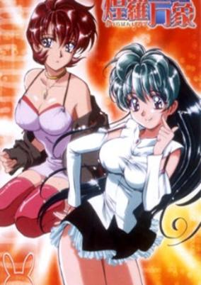

**Studio:** E&G Films &nbsp;|&nbsp; **Episodes:** 24 &nbsp;|&nbsp; **Director:** Shigeru Yamazaki &nbsp;|&nbsp; **Aired/Released:** March 29 – September 13 &nbsp;|&nbsp; **Genres:** Ecchi, Romance, Love Polygon, Magic, School Life, Super Power, Comedy

> Insecure Ai Shiomi begins attending the prestigous Psychic Academy for psychically gifted students, following in the footsteps of his legendary older brother.
>
> _Synopsis source: Kitsu_

[Wikipedia](https://en.wikipedia.org/wiki/Psychic_Academy) · [Kitsu](https://kitsu.io/anime/psychic-academy)

---

### Happy☆Lesson

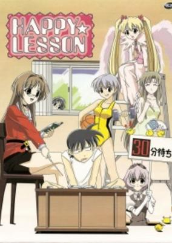

**Studio:** Studio Hibari &nbsp;|&nbsp; **Episodes:** 13 &nbsp;|&nbsp; **Director:** Iku Suzuki &nbsp;|&nbsp; **Aired/Released:** April 1 – June 30 &nbsp;|&nbsp; **Genres:** Japan, Comedy, High School, Slapstick, Stereotypes, School Life, Present, Harem, Romance, Slice of Life

> Hitotose Chitose was always alone and untrusting of people but when 5 female teachers appear and started living together with him in his family's house as his mothers, things started to change and pick up, together with Hazuki-nee and Minazuki (his 2 sisters) everyday is a lesson.
>
> _Synopsis source: Kitsu_

[Wikipedia](https://en.wikipedia.org/wiki/Happy_Lesson) · [Kitsu](https://kitsu.io/anime/happy-lesson-tv)

---

### Tokyo Underground

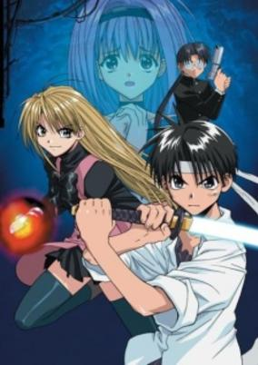

**Studio:** Pierrot &nbsp;|&nbsp; **Episodes:** 26 &nbsp;|&nbsp; **Director:** Hayato Date &nbsp;|&nbsp; **Aired/Released:** April 2 – September 24 &nbsp;|&nbsp; **Genres:** Japan, Action, Swordplay, Conspiracy, Coming Of Age, Violence, Present, Super Power, Science Fiction, Adventure, Romance

> Under the capital city of Tokyo, Japan, there exists a large, vast, and unknown world known as Underground. There, people known as Elemental Users exist; people who have the ability to control the elements: Fire, Water, Lightning, Magnetism, Freeze, etc. Meet Rumina Asagi and his best friend Ginnosuke Isuzu, two average high school freshmen who reside in Tokyo. When they meet Gravity User, Chelsea Rorec, and the Miko of Life, Ruri Sarasa, their whole lives change into one big adventure.
>
> _Synopsis source: Kitsu_

[Wikipedia](https://en.wikipedia.org/wiki/Tokyo_Underground) · [Kitsu](https://kitsu.io/anime/tokyo-underground)

---

### Tenchi Muyou! GXP

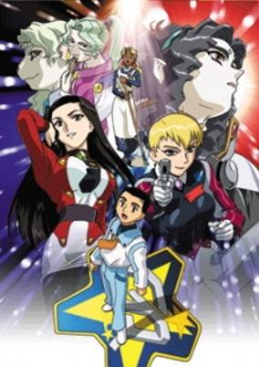

**Studio:** AIC &nbsp;|&nbsp; **Episodes:** 26 &nbsp;|&nbsp; **Director:** Shinichi Watanabe &nbsp;|&nbsp; **Aired/Released:** April 2 – September 25 &nbsp;|&nbsp; **Genres:** Romance, Space Travel, Science Fiction, Ecchi, Comedy, Crime, Shipboard, Alien, Slapstick, Law And Order, Present, Space, Harem, Cops, Mecha, Action

> Seina Yamada is unlucky... so unlucky that when he stumbles upon a recruiter looking for his senpai Tenchi he gets taken instead. Forced into the Galaxy Police, his luck begins to change. A natural to randomly jumping near pirates, he is assigned his own decoy to draw out pirates. His luck brings him into the lives of four women who have a habit of cancelling out his bad luck, turning it into good. Armed with this luck, they pilot the most powerful ships in the Tenchi Universe to defeat the Da Ruma pirates. Now the only uncertainty is whether the sexy Amane Kaunaq, a former model turned into a GP detective, sturdy Kiriko Masaki, who has known Seina for years, the mysterious Ryoko Balta, a former pirate named after the legendary one, or the child-like Neju Na Melmas, a powerful 2000 year-old priestess, will win Seina.
>
> _Synopsis source: Kitsu_

[Wikipedia](https://en.wikipedia.org/wiki/Tenchi_Muyo!_GXP) · [Kitsu](https://kitsu.io/anime/tenchi-muyo-gxp)

---

### Chobits

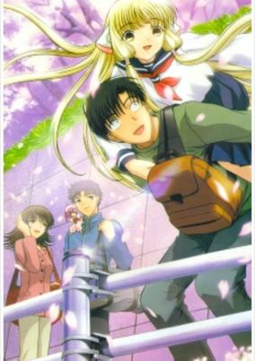

**Studio:** Madhouse &nbsp;|&nbsp; **Episodes:** 26 &nbsp;|&nbsp; **Director:** Morio Asaka &nbsp;|&nbsp; **Aired/Released:** April 3 – September 25 &nbsp;|&nbsp; **Genres:** Earth, Android, Slapstick, Science Fiction, Romance, Japan, Comedy, Asia, Plot Continuity, Ecchi

> When computers start to look like humans, can love remain the same? Hideki Motosuwa is a young country boy who is studying hard to get into college. Coming from a poor background, he can barely afford the expenses, let alone the newest fad: Persocoms, personal computers that look exactly like human beings. One evening while walking home, he finds an abandoned Persocom. After taking her home and managing to activate her, she seems to be defective, as she can only say one word, "Chii," which eventually becomes her name. Unlike other Persocoms, however, Chii cannot download information onto her hard drive, so Hideki decides to teach her about the world the old-fashioned way, while studying for his college entrance exams at the same time. Along with his friends, Hideki tries to unravel the mystery of Chii, who may be a "Chobit," an urban legend about special units that have real human emotions and thoughts, and love toward their owner. But can romance flourish between a Persocom and a human? [Written by MAL Rewrite]
>
> _Synopsis source: Kitsu_

[Wikipedia](https://en.wikipedia.org/wiki/Chobits) · [Kitsu](https://kitsu.io/anime/chobits)

---

### Rizelmine

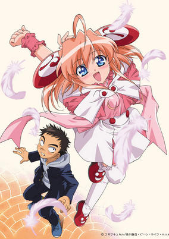

**Studio:** Madhouse Imagin &nbsp;|&nbsp; **Episodes:** 24 &nbsp;|&nbsp; **Director:** Yasuhiro Matsumura &nbsp;|&nbsp; **Aired/Released:** April 3 – December 22 &nbsp;|&nbsp; **Genres:** Romance, Science Fiction, Ecchi, Japan, Loli, Comedy, Sudden Girlfriend Appearance, School Life

> Iwaki Tomonori is an average 15-year-old boy who likes older women. He happens to have a crush on his teacher, but soon thereafter, learns she has become engaged. He heads home brokenhearted, only to find a 12-year-old girl named Rizel at his home, who he learns the Japanese government has married him to against his will. Furthermore, he learns Rizel is no ordinary girl; she is a biochemically engineered human, and her creators (her "papa"s, as they are often referred to) promise to waive multiple bills of Iwaki's parents in exchange to be allowed to stay at their house, and thus Iwaki's life with Rizel begins.
>
> _Synopsis source: Kitsu_

[Wikipedia](https://en.wikipedia.org/wiki/Rizelmine) · [Kitsu](https://kitsu.io/anime/rizelmine)

---

### .hack//Sign

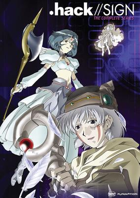

**Studio:** Bee Train &nbsp;|&nbsp; **Episodes:** 26 &nbsp;|&nbsp; **Director:** Koichi Mashimo &nbsp;|&nbsp; **Aired/Released:** April 4 – September 26 &nbsp;|&nbsp; **Genres:** Fantasy World, Alternative Present, Virtual Reality, Super Power, Magic, Science Fiction, Fantasy, Adventure, Mystery, Isekai

> Tsukasa wakes up inside The World, a massive online role-playing game full of magic and monsters, and finds himself unable to log out. With no knowledge of what's happening in the real world, Tsukasa must discover how he ended up stuck in the game, and what connection he has with the fabled Key of the Twilight—an item that's rumored to grant ultimate control over the digital realm.
>
> _Synopsis source: Kitsu_

[Wikipedia](https://en.wikipedia.org/wiki/.hack//Sign) · [Kitsu](https://kitsu.io/anime/hack-sign)

---

### Magical☆Shopping Arcade Abenobashi

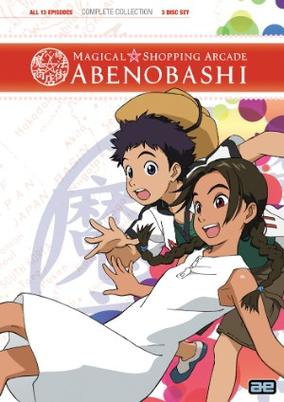

**Studio:** Madhouse &nbsp;|&nbsp; **Episodes:** 13 &nbsp;|&nbsp; **Director:** Masayuki Kojima &nbsp;|&nbsp; **Aired/Released:** April 4 – June 27 &nbsp;|&nbsp; **Genres:** Fantasy World, Adventure, Contemporary Fantasy, Parody, Fantasy, Comedy, Super Deformed, Coming Of Age, Angst, Magic, Slapstick, Parallel Universe, Plot Continuity, Present, Ecchi, Isekai

> Childhood friends Arumi and Sasshi are residents of the Abenobashi commercial district in Abeno-ku, Osaka. After an accident, they find themselves transported to an alternate sword and sorcery world. Their attempt to get back to reality finds them traversing a series of nonsensical worlds built on science fiction, war, fantasy, dating sim games and American movies. Each alternate Abenobashi is a surreal manifestation of Sasshi's otaku interests, populated by analogs of the protagonist's relatives and acquaintances and a blue-haired stranger known as Eutus.
>
> _Synopsis source: Kitsu_

[Wikipedia](https://en.wikipedia.org/wiki/Magical_Shopping_Arcade_Abenobashi) · [Kitsu](https://kitsu.io/anime/abenobashi-mahou-shoutengai)

---

### Daigunder

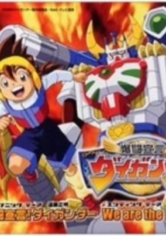

**Studio:** Brain's Base &nbsp;|&nbsp; **Episodes:** 39 &nbsp;|&nbsp; **Director:** Hiroyuki Yano &nbsp;|&nbsp; **Aired/Released:** April 5 – December 27 &nbsp;|&nbsp; **Genres:** Science Fiction, Mecha, Action, Super Robot, Robot, Adventure

> Akira Akebono, a young boy who is competing in a robot tournament where many of the robots are capable of transforming into animal forms. Akira wants to win the ultimate prize, the Titan Belt, with the help of his group of robots, all of which are capable of forming into the robot Daigunder. Daigunder is the creation of Akira's father, Professor Hajime Akebono. Together with a girl named Haruka, they compete under the name of Team Akira. However, Team Akira faces opposition from not only their competition, but a robot named Ginzan who is under the control of the evil Professor Maelstrom.
>
> _Synopsis source: Kitsu_

[Wikipedia](https://en.wikipedia.org/wiki/Daigunder) · [Kitsu](https://kitsu.io/anime/bakuto-sengen-daigander)

---

### Forza! Hidemaru

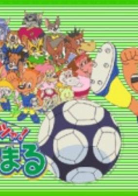

**Studio:** Gallop &nbsp;|&nbsp; **Episodes:** 26 &nbsp;|&nbsp; **Director:** Yoshihiro Takamoto &nbsp;|&nbsp; **Aired/Released:** April 6 – September 28 &nbsp;|&nbsp; **Genres:** Sports, Soccer, Anthropomorphism

> A soccer anime with a cast of wacky animals in sports getup seems far out of its time in the early 21st century, but it was the year of the World Cup in Japan and South Korea, and the very young audience sees these tropes with fresh eyes. Hidemaru is a feisty fox; his friends include bunnies, dogs, horses, and a couple of hefty hippo girls. Based on a manga Hidemaru the Soccer Boy by Makoto Mizobuchi, serialized in CoroCoro Comics.
>
> _Synopsis source: Kitsu_

[Wikipedia](https://en.wikipedia.org/wiki/Forza!_Hidemaru) · [Kitsu](https://kitsu.io/anime/forza-hidemaru)

---

### Mirmo Zibang!

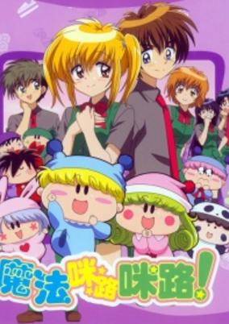

**Studio:** Studio Hibari &nbsp;|&nbsp; **Episodes:** 172 &nbsp;|&nbsp; **Director:** Kenichi Kasai &nbsp;|&nbsp; **Aired/Released:** April 6 – September 27, 2005 &nbsp;|&nbsp; **Genres:** Fantasy, Present, Comedy, Middle School, Earth, Japan, Asia, School Life, Contemporary Fantasy, Magic, Romance, Adventure, Kids

> Kaede is a cheerful and energetic eighth grader. When it comes to boys, however, she is hopelessly shy. One day, on her way home from school, Kaede walks into a mysterious shop and buys a colorful cocoa mug. When she reaches home, she casually peeks into the bottom of the mug and discovers an engraved note, which says, "If you read this message aloud while pouring hot cocoa into the mug, a love fairy ("muglox") will appear and grant your every wish." The skeptical but curious Kaede follows the directions and announces her wish to date Yuuki, the class heartthrob. Suddenly, the adorable blue Mirumo appears! We soon find out, however, that this cute little muglox would rather eat chocolate and create mischief than help Kaede. Mirumo, it seems, is prince of the muglox world. Horrified at the prospect of having to marry Rirumu, his princess bride-to-be, Mirumo has escaped the muglox world. Hot on his heels, however, are Rirumu, Yashichi the bounty hunter, and a cast of hundreds of muglox ranging from the good to the bad to the nutty. This gang of adorable troublemakers will see to it that school life for Kaede and her friends is never the same...
>
> _Synopsis source: Kitsu_

[Wikipedia](https://en.wikipedia.org/wiki/Mirmo!) · [Kitsu](https://kitsu.io/anime/wagamama-fairy-mirumo-de-pon)

---

### Searching for the Full Moon

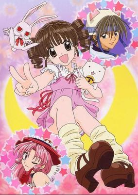

**Studio:** Studio Deen &nbsp;|&nbsp; **Episodes:** 52 &nbsp;|&nbsp; **Director:** Toshiyuki Kato &nbsp;|&nbsp; **Aired/Released:** April 6 – March 29, 2003 &nbsp;|&nbsp; **Genres:** Romance, Japan, Earth, Asia, Idol, Present, Music, Comedy

> 12-year-old Mitsuki Kouyama's dream to become a professional singer is shattered when she's diagnosed with throat cancer. If a tumor isn't horrific enough, how about being met by two angels of death shortly after? Meroko Yui and Takuto Kira, of the shinigami duo "Negi Ramen," inform Mitsuki that she has just one year left to live. Instead of getting discouraged, however, Mitsuki decides to make the most of her last year, and pursues her singing dream with a passion. Aided by Meroko and Takuto, Mitsuki finds success and failure, love and loss, and deals with her fate and other difficult subjects the best she can. Full Moon wo Sagashite is the story of a little girl who refuses to let something as insignificant as fate slow her down.
>
> _Synopsis source: Kitsu_

[Wikipedia](https://en.wikipedia.org/wiki/Full_Moon_o_Sagashite) · [Kitsu](https://kitsu.io/anime/full-moon-wo-sagashite)

---

### Tokyo Mew Mew

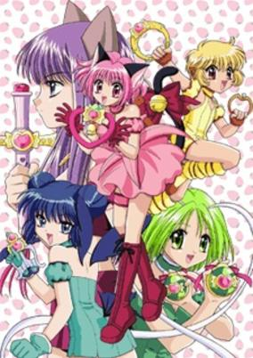

**Studio:** Pierrot &nbsp;|&nbsp; **Episodes:** 52 &nbsp;|&nbsp; **Director:** Noriyuki Abe &nbsp;|&nbsp; **Aired/Released:** April 6 – March 29, 2003 &nbsp;|&nbsp; **Genres:** Romance, Contemporary Fantasy, Earth, Japan, Action, Asia, Waitress, Juujin, Humanoid Alien, Alien, Magical Girl, Super Power, Magic, Science Fiction, Fantasy, Adventure, Comedy

> The story of Tokyo Mew Mew begins when the main protagonist, Ichigo Momomiya, attends an endangered species exhibit with her crush (and hopefully future boyfriend) Masaya Aoyama. Their peaceful day takes a turn towards drastic when an earthquake strikes and Ichigo, as well as four other girls, are enveloped in a mysterious light. The next day, Ichigo begins to behave like a cat and learns from two scientists that her DNA has been combined with that of an iriomote cat as part of Project μ, which aims to protect the world from alien invaders! Aliens have come to reclaim Earth in the name of their ancestors who inhabited the planet three million years ago. To get rid of the humans now inhabiting the planet, the aliens have released parasites that infect animals and turn them into monsters. With the DNA of the iriomote cat now inside her, Ichigo can transform into Mew Ichigo and use her powers to fight off the invaders. Ichigo will not have to fight alone, as the four other Mew Mews take to the stage and join in the battle to protect Earth.
>
> _Synopsis source: Kitsu_

[Wikipedia](https://en.wikipedia.org/wiki/Tokyo_Mew_Mew) · [Kitsu](https://kitsu.io/anime/tokyo-mew-mew)

---

### Lightning Super Express Hikarian

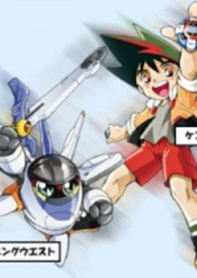

**Studio:** Tokyo Kids &nbsp;|&nbsp; **Episodes:** 52 &nbsp;|&nbsp; **Director:** Hideaki Ooba &nbsp;|&nbsp; **Aired/Released:** April 7 – March 30, 2003 &nbsp;|&nbsp; **Genres:** Action, Science Fiction, Adventure, Comedy, Kids

> The second season of Chou Tokkyuu Hikarian.
>
> _Synopsis source: Kitsu_

[Wikipedia](https://en.wikipedia.org/wiki/Hikarian) · [Kitsu](https://kitsu.io/anime/denkou-chou-tokkyuu-hikarian)

---

### Cheeky Angel

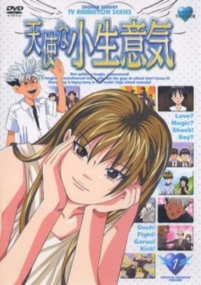

**Studio:** TMS Entertainment &nbsp;|&nbsp; **Episodes:** 50 &nbsp;|&nbsp; **Director:** Masaharu Okuwaki &nbsp;|&nbsp; **Aired/Released:** April 7 – March 30, 2003 &nbsp;|&nbsp; **Genres:** Romance, Earth, Japan, Fantasy, Asia, Comedy, High School, Reverse Harem, School Life, Present, Magic, Gender Bender

> Megumi-chan is a girl with a secret past. She used to be a boy until she met a person she thought was a magic user. This person gave him/her a magical book from which a genie appears to grant one wish when blood is applied to it. Megumi made the wish to be a man in a man's body but the genie has a twist: he grants wishes backwards so he turns Megumi-kun aged 9 to Megumi-chan. Years pass and Megumi enters High School where she immediately beats up the school bully who of course falls in love with her. She is looking for that book again to be able to reverse the spell placed upon her.
>
> _Synopsis source: Kitsu_

[Wikipedia](https://en.wikipedia.org/wiki/Cheeky_Angel) · [Kitsu](https://kitsu.io/anime/tenshi-na-konamaiki)

---

### Digimon Frontier

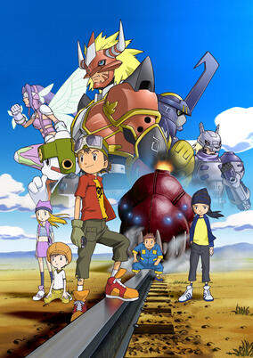

**Studio:** Toei Animation &nbsp;|&nbsp; **Episodes:** 50 &nbsp;|&nbsp; **Director:** Yukio Kaizawa &nbsp;|&nbsp; **Aired/Released:** April 7 – March 30, 2003 &nbsp;|&nbsp; **Genres:** Fantasy, Fantasy World, Adventure, Action, Anthropomorphism, Parallel Universe, Plot Continuity, Present, Proxy Battles, Comedy, Friendship, Isekai

> With five new kids and an exciting new mission in the Digital World, Digimon Frontier brings back all the great action and adventure of the last three seasons. Takuya, Kouji, Izumi, Junpei. and Tomoki meet each other in a train that takes them to the Digital World where a war against evil is being fought. The Angel digimon, Cherubimon, one of The three angels sent to save the World from the power-hungry Lucemon, has turned to the dark side and the entire Digital World is in peril. To fight this great battle, the five CHOSEN ONES must find the Densetsu no Spirit (Legendary Spirit).
>
> _Synopsis source: Kitsu_

[Wikipedia](https://en.wikipedia.org/wiki/Digimon_Frontier) · [Kitsu](https://kitsu.io/anime/digimon-frontier)

---

### Pita Ten (Pita-Ten)

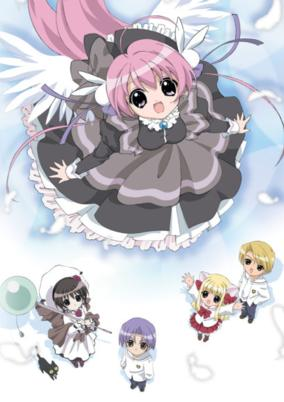

**Studio:** Madhouse &nbsp;|&nbsp; **Episodes:** 26 &nbsp;|&nbsp; **Director:** Toshifumi Kawase &nbsp;|&nbsp; **Aired/Released:** April 7 – September 29 &nbsp;|&nbsp; **Genres:** Contemporary Fantasy, Japan, Asia, Elementary School, Earth, Comedy, Sudden Girlfriend Appearance, Angel, Present, Fantasy, Romance, School Life, Kids

> Kotaro was pretty much supposed to be your average boy, worried about the pressures of education while enjoying a simple life with his friends. Much to his despair, he one day finds the overly cheerful Misha at his door, asking to be friends out of nowhere. Even more shocking is that Misha is an apprentice angel, yet she does more bad then good. Along with Kotaro's school friends Takashi and Koboshi and the so called devil Shia (once again being able to do more good then bad), the group of friends spend their days getting into all sorts of adventures and troubles. Based on the manga by Koge-Donbo.
>
> _Synopsis source: Kitsu_

[Wikipedia](https://en.wikipedia.org/wiki/Pita-Ten) · [Kitsu](https://kitsu.io/anime/pita-ten)

---

### Azumanga Daioh The Animation (Azumanga Daioh: The Animation)

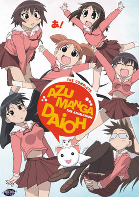

**Studio:** J.C.Staff &nbsp;|&nbsp; **Episodes:** 26 &nbsp;|&nbsp; **Director:** Hiroshi Nishikiori &nbsp;|&nbsp; **Aired/Released:** April 9 – October 1 &nbsp;|&nbsp; **Genres:** Present, High School, Slapstick, Earth, Asia, Japan, Comedy, Slice of Life, School Life, Friendship

> Chiyo Mihama begins her high school career as one of the strangest students in her freshman class—a tiny, 10-year-old academic prodigy with a fondness for plush dolls and homemade cooking. But her homeroom teacher, Yukari Tanizaki, is the kind of person who would hijack a student's bike to avoid being late, so "strange" is a relative word. There certainly isn't a shortage of peculiar girls in Yukari-sensei's homeroom class. Accompanying Chiyo are students like Tomo Takino, an energetic tomboy with more enthusiasm than brains; Koyomi Mizuhara, Tomo's best friend whose temper has a fuse shorter than Chiyo; and Sakaki, a tall, athletic beauty whose intimidating looks hide a gentle personality and a painful obsession with cats. In addition, transfer student Ayumu Kasuga, a girl with her head stuck in the clouds, fits right in with the rest of the girls—and she has a few interesting theories about Chiyo's pigtails! Together, this lovable group of girls experience the ups and downs of school life, their many adventures filled with constant laughter, surreal absurdity, and occasionally even touching commentary on the bittersweet, temporal nature of high school. [Written by MAL Rewrite]
>
> _Synopsis source: Kitsu_

[Wikipedia](https://en.wikipedia.org/wiki/Azumanga_Daioh) · [Kitsu](https://kitsu.io/anime/azumanga-daioh)

---

### The Twelve Kingdoms

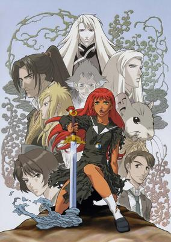

**Studio:** Pierrot &nbsp;|&nbsp; **Episodes:** 45 &nbsp;|&nbsp; **Director:** Tsuneo Kobayashi &nbsp;|&nbsp; **Aired/Released:** April 9 – August 30, 2003 &nbsp;|&nbsp; **Genres:** Fantasy, Fantasy World, Adventure, Action, Swordplay, High Fantasy, Coming Of Age, Angst, Dark Fantasy, Past, Parallel Universe, Plot Continuity, Magic

> Nakajima Youko is your average somewhat timid high school student. One day, a strange man named Keiki appears before her, swearing allegiance. Before she could properly register what was happening, demon-like creatures attack Youko and her friends, after which they are pulled into a different world. A world unlike what she has ever known. Separated from Keiki, Youko and her friends must do whatever they can if they wish to survive in this new world.
>
> _Synopsis source: Kitsu_

[Wikipedia](https://en.wikipedia.org/wiki/The_Twelve_Kingdoms) · [Kitsu](https://kitsu.io/anime/juuni-kokuki)

---

### Ai Yori Aoshi

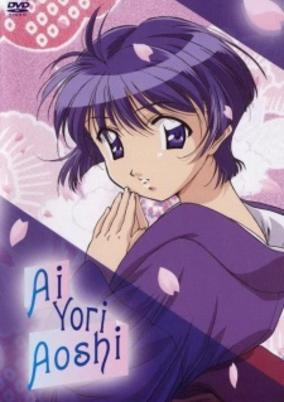

**Studio:** J.C.Staff &nbsp;|&nbsp; **Episodes:** 24 &nbsp;|&nbsp; **Director:** Masami Shimoda &nbsp;|&nbsp; **Aired/Released:** April 11 – September 26 &nbsp;|&nbsp; **Genres:** Romance, Earth, Japan, Slice of Life, Asia, Comedy, Sudden Girlfriend Appearance, University, School Life, Present, Harem

> Kaoru Hanabishi, a college student who lives alone, met a beautiful but bewildered girl dressed in a kimono at a train station. He volunteered to guide her way to the address she was looking for, which happened to be in his neighborhood, but turned out to be an empty lot. Not knowing what to do next, Kaoru invited the devastated girl to his apartment and asked for any additional clues to her destination. She supplied him with a photo of two children whom Kauru immediately identified as himself and Aoi Sakuraba, his childhood friend. It turned out that the girl in front of him is Aoi Sakuraba herself, his betrothed fiancee who came all the way to Tokyo to marry him. Her revelation was not only surprising but also reminded the deepest part of Kaoru's memory for why he left the Hanabishi family in the first place.
>
> _Synopsis source: Kitsu_

[Wikipedia](https://en.wikipedia.org/wiki/Ai_Yori_Aoshi) · [Kitsu](https://kitsu.io/anime/ai-yori-aoshi)

---

### My Family

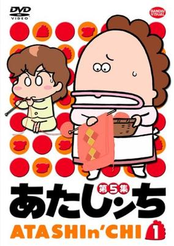

**Studio:** Shin-Ei Animation &nbsp;|&nbsp; **Episodes:** 330 &nbsp;|&nbsp; **Director:** Akitaro Daichi Tetsuo Yasumi &nbsp;|&nbsp; **Aired/Released:** April 19 – September 19, 2009 &nbsp;|&nbsp; **Genres:** Slice of Life, Comedy

> Outrageous misadventures of an almost normal family with a housewife, her husband, and their two kids Yuusuke and Mikan. Wacky humor about this weird family's daily life.
>
> _Synopsis source: Kitsu_

[Wikipedia](https://en.wikipedia.org/wiki/Atashin%27chi) · [Kitsu](https://kitsu.io/anime/atashin-chi)

---

### Whistle!

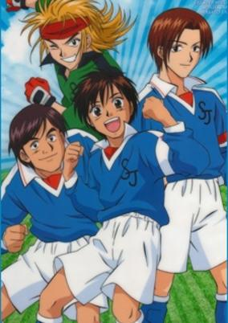

**Studio:** Studio Comet &nbsp;|&nbsp; **Episodes:** 39 &nbsp;|&nbsp; **Director:** Hiroshi Fukutomi &nbsp;|&nbsp; **Aired/Released:** May 6 – February 3, 2003 &nbsp;|&nbsp; **Genres:** Earth, Soccer, Sports, Action, Japan, Asia, Present, School Life

> Kazamatsuri Shou's dream has always been to become a professional soccer player, but he has one problem: he's not very good at the game. He was accepted to the prestigious Musashi no Mori Junior High, known for its top rate soccer team, but he was never able to rise beyond the rank of third stringer. After transferring to Sakura Jousui Junior High, he can finally play soccer. And, with the support of his new friends and teammates, his strong determination, and lots of hard work, his soccer skills are developing rapidly and setting Shou well on his way to achieving his dream.
>
> _Synopsis source: Kitsu_

[Wikipedia](https://en.wikipedia.org/wiki/Whistle!) · [Kitsu](https://kitsu.io/anime/whistle)

---

### Jing: King of Bandits

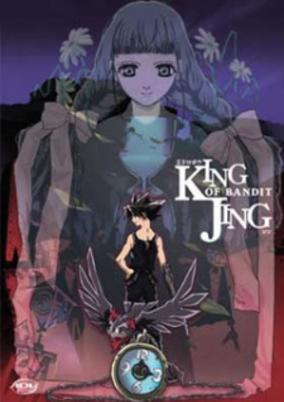

**Studio:** Studio Deen &nbsp;|&nbsp; **Episodes:** 13 &nbsp;|&nbsp; **Director:** Hiroshi Watanabe &nbsp;|&nbsp; **Aired/Released:** May 15 – August 14 &nbsp;|&nbsp; **Genres:** Fantasy, Contemporary Fantasy, Adventure, Dystopia, Fantasy World, Action, Comedy, Crime, Science Fiction

> Jing may appear to be a young boy, but his remarkable skills make him one of the most feared thieves on the planet. Along with his feathered partner Kir, Jing travels from town to town, stealing anything of value regardless of the amount of security. But when he's in a pinch, he has one more trick up his sleeve: Kir bonds with Jing's right arm to perform the effectively deadly "Kir Royale" attack. And because of all this, Jing is infamously known by many as the "King of Bandits."
>
> _Synopsis source: Kitsu_

[Kitsu](https://kitsu.io/anime/ou-dorobou-jing)

---

### She, The Ultimate Weapon

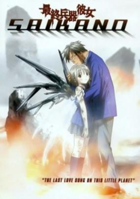

**Studio:** Gonzo &nbsp;|&nbsp; **Episodes:** 13 &nbsp;|&nbsp; **Director:** Mitsuko Kase &nbsp;|&nbsp; **Aired/Released:** July 2 – September 24 &nbsp;|&nbsp; **Genres:** Anti War, Alternative Present, Drama, Disaster, War, Japan, Present, Asia, Earth, Romance, Angst, Plot Continuity, Cyborg, Science Fiction, School Life

> Shuuji and Chise are third year students at a high school in Hokkaido. The shy Chise is finally confessing to Shuuji, and finally the two of them are starting to exchange diary awkwardly. One day, Shuuji tries to escape from a sudden enemy air raid on Sapporo. While desperately escaping from the air raid, Shuuji sees a scene that he could not forget for his life. He sees Chise, with a huge weapon looking as if it was part of her hand, shooting the enemy fighters down one by one. Apparently, Chise is the ultimate weapon with destructive power which is important for the war.
>
> _Synopsis source: Kitsu_

[Wikipedia](https://en.wikipedia.org/wiki/Saikano) · [Kitsu](https://kitsu.io/anime/saikano)

---

### Samurai Deeper Kyo

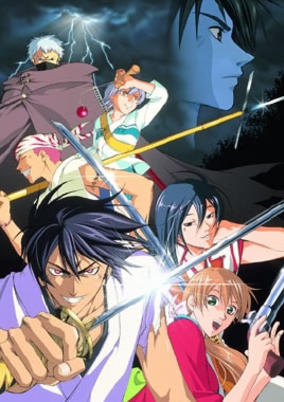

**Studio:** Studio Deen &nbsp;|&nbsp; **Episodes:** 26 &nbsp;|&nbsp; **Director:** Junji Nishimura &nbsp;|&nbsp; **Aired/Released:** July 2 – December 24 &nbsp;|&nbsp; **Genres:** Fantasy, Japan, Action, Asia, Martial Arts, Love Polygon, Past, Plot Continuity, Samurai, Demon, Historical, Adventure, Comedy

> In the year 1600, at the fog-covered battlefield of Sekigahara, a fierce battle was waged by two exemplary swordsmen. One was Kyoushirou Mibu, a skilled and noble warrior in possession of the unique powers of the Mibu Clan. The other was the thousand-man slayer, with eyes and hair the color of blood, "Demon Eyes" Kyou. Their legendary clash was cut short when a meteor from the heavens fell down upon that battlefield, leaving both to vanish in its wake.Samurai Deeper Kyou begins four years after that battle, when a gun-wielding bounty hunter by the name of Yuya Shiina hunts down Kyoushirou—now a perverted, traveling medicine-man who has built up a large debt. On her way to claim his bounty, they are attacked by an inhuman monster that seeks to devour Kyoushirou. This encounter awakens "Demon Eyes" Kyou, whose mind has been trapped inside of Kyoushirou's body ever since that fateful battle. Thus begins a grand tale of legendary two swordsmen and the discovery of their secrets.
>
> _Synopsis source: Kitsu_

[Wikipedia](https://en.wikipedia.org/wiki/Samurai_Deeper_Kyo) · [Kitsu](https://kitsu.io/anime/samurai-deeper-kyou)

---

### G-On Riders

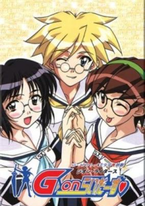

**Studio:** Shaft TNK &nbsp;|&nbsp; **Episodes:** 13 &nbsp;|&nbsp; **Director:** Shinichiro Kimura &nbsp;|&nbsp; **Aired/Released:** July 2 – October 1 &nbsp;|&nbsp; **Genres:** Ecchi, Science Fiction, Japan, Parody, Comedy, Alien, Alternative Present, Stereotypes, School Life, Action

> At Saint Hoshikawa School there is a secret group called the G-On Riders. Students with superior strength and ability are chosen to be in the group, which was formed to fight against alien attacks on the earth. However, many of the problems that the members face are ones amongst themselves, and the same is true for the invaders. And another student at the school, Ichiro, tries desperately to confess his love to Yuki, one of the Riders.
>
> _Synopsis source: Kitsu_

[Wikipedia](https://en.wikipedia.org/wiki/G-On_Riders) · [Kitsu](https://kitsu.io/anime/g-on-riders)

---

### Witch Hunter Robin

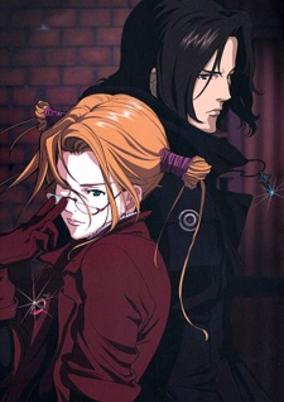

**Studio:** Sunrise &nbsp;|&nbsp; **Episodes:** 26 &nbsp;|&nbsp; **Director:** Shuko Murase &nbsp;|&nbsp; **Aired/Released:** July 3 – December 25 &nbsp;|&nbsp; **Genres:** Earth, Science Fiction, Japan, Asia, Contemporary Fantasy, Fantasy, Special Squads, Detective, Coming Of Age, Magic, Action, Cops, Mystery

> Witches are individuals with special powers like ESP, telekinesis, mind control, etc. (not the typical hogwart and newt potions). Robin, a 15-year-old craft user, arrives from Italy to Japan to work for an organization named STN Japan Division (STN-J) as a replacement for one of STN-J's witch hunters who was recently killed. Unlike other divisions of STN, STN-J tries to capture the witches alive in order to learn why and how they became witches in the first place.
>
> _Synopsis source: Kitsu_

[Wikipedia](https://en.wikipedia.org/wiki/Witch_Hunter_Robin) · [Kitsu](https://kitsu.io/anime/witch-hunter-robin)

---

### UFO Princess Valkyrie (UFO Ultramaiden Valkyrie)

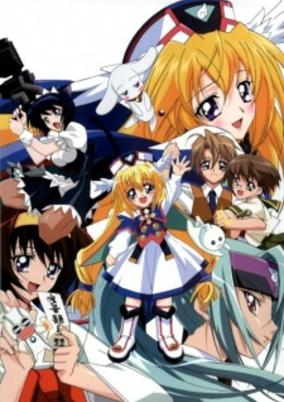

**Studio:** TNK &nbsp;|&nbsp; **Episodes:** 12 &nbsp;|&nbsp; **Director:** Shigeru Ueda &nbsp;|&nbsp; **Aired/Released:** July 4 – September 19 &nbsp;|&nbsp; **Genres:** Fantasy, Ecchi, Science Fiction, Comedy, Maid, Deity, Angel, Alien, Stereotypes, Magic

> UFO Princess Warukyure, aka UFO Princess Walkyrie is about a princess from outer space who accidentally crashes on earth, where Kazuto desperately tries to maintain the public bath of his grandfather. Due to circumstances, Kazuto receives part of princess Walkyrie's soul which forces her to stay there with him. But that's not the only problem ... because her soul lost strength, the princess transforms both mentally and physically into a little kid!
>
> _Synopsis source: Kitsu_

[Wikipedia](https://en.wikipedia.org/wiki/UFO_Ultramaiden_Valkyrie) · [Kitsu](https://kitsu.io/anime/ufo-princess-valkyrie)

---

### Fortune Dogs

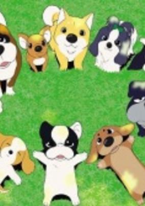

**Studio:** Vega Entertainment &nbsp;|&nbsp; **Episodes:** 39 &nbsp;|&nbsp; **Director:** Hiroshi Saito &nbsp;|&nbsp; **Aired/Released:** July 4 – March 29, 2003 &nbsp;|&nbsp; **Genres:** Adventure

> A French Bulldog is adopted from the Happy Kennel by a girl named Ai and is given the name Alex. She tells him stories and reads to him from a book titled The Adventures of Freddy about dog who leaves home to find the Fortune Tree. However, he is separated from Ai when he mistakenly follows a girl wearing the same clothes as Ai on a bus. Adopting the name Freddy, after the hero in Ai's storybook, Alex begins his quest to return to Ai. But before he can return to his owner, Freddy and his new friends must find the Fortune Tree and save it from dying, otherwise all the humans in the world will lose their good will and no longer care about their pets.
>
> _Synopsis source: Kitsu_

[Wikipedia](https://en.wikipedia.org/wiki/Fortune_Dogs) · [Kitsu](https://kitsu.io/anime/fortune-dogs)

---

### Ground Defense Force! Mao-chan

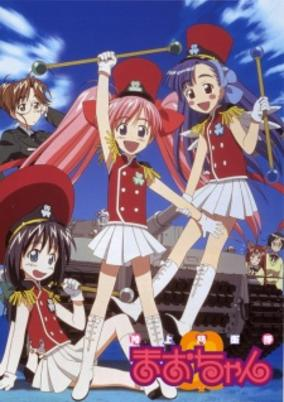

**Studio:** Xebec &nbsp;|&nbsp; **Episodes:** 26 &nbsp;|&nbsp; **Director:** Yoshiaki Iwasaki &nbsp;|&nbsp; **Aired/Released:** July 4 – December 26 &nbsp;|&nbsp; **Genres:** Earth, Parental Abandonment, Japan, Asia, Parody, Comedy, Air Force, Absurdist Humour, Humanoid Alien, Alien, Navy, School Life, Present, Military, Super Power, Magic, Science Fiction, Kids

> Mao Onigawara is a happy 8-year-old grade-schooler and the granddaughter of Chief of Staff of Ground Defense Force. Equipped with her cloverleaf-shaped badge which enables her to transform (but gives her no special power whatsoever), Mao and her best friends (granddaughters of Chief of Staff of Air and Marine Defense Force, respectively) will defend Japan against the invasion from "cute aliens," who are way too cute to be dealt with regular armed forces.
>
> _Synopsis source: Kitsu_

[Wikipedia](https://en.wikipedia.org/wiki/Ground_Defense_Force!_Mao-chan) · [Kitsu](https://kitsu.io/anime/ground-defence-mao-chan)

---

### Shrine of the Morning Mist

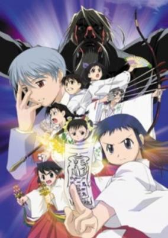

**Studio:** Chaos Project GANSIS &nbsp;|&nbsp; **Episodes:** 26 &nbsp;|&nbsp; **Director:** Yuuji Moriyama &nbsp;|&nbsp; **Aired/Released:** July 4 – December 26 &nbsp;|&nbsp; **Genres:** Fantasy, Contemporary Fantasy, Earth, Deity, Magic, Slapstick, Magical Girl, Science Fiction, Action, Japan, Comedy, Asia, Plot Continuity, Present, Super Power, Slice of Life, School Life

> Since childhood, Tadahiro Amatsu has two different-colored eyes - one brown and one light hazel. But because of a dark secret behind his left eye, he's become a target for the masked sorcerer Ayatara Miramune and his band of demons. To combat the demons appearing all over town, Yuzu Hieda, a priestess in training, recruits four other girls from her high school. Under the supervision of Yuzu's elder sister Kurako, the five young priestesses must undergo months of training to master their abilities.
>
> _Synopsis source: Kitsu_

[Wikipedia](https://en.wikipedia.org/wiki/Shrine_of_the_Morning_Mist) · [Kitsu](https://kitsu.io/anime/asagiri-no-miko)

---

### Dragon Drive

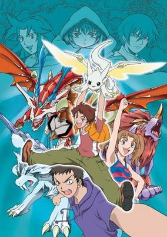

**Studio:** Madhouse &nbsp;|&nbsp; **Episodes:** 38 &nbsp;|&nbsp; **Director:** Toshifumi Kawase &nbsp;|&nbsp; **Aired/Released:** July 4 – March 27, 2003 &nbsp;|&nbsp; **Genres:** Fantasy, Adventure, Dragon, Proxy Battles, School Life, Action, Comedy, Fantasy World, Plot Continuity, Science Fiction

> If there's one word to describe Reiji Ozora, it would be "quitter." He can never find the motivation to finish anything, and loses interest at the drop of a hat. This all changes when his best friend Maiko introduces him to the new game "Dragon Drive." In this virtual reality game, each player is assigned a dragon tailored to match their personality and strength. Reiji hopes for a big, strong, scary beast, but instead, he is stuck with Chibi, a cute, friendly-looking dragon smaller than he is. How disappointing—except it turns out that Chibi is the rarest dragon of them all! Reiji finally discovers something he can remain interested in, and works hard to train both himself and his newfound friend. Soon this training will be put to use to save the world, for there are people who have dark aspirations for Dragon Drive!
>
> _Synopsis source: Kitsu_

[Wikipedia](https://en.wikipedia.org/wiki/Dragon_Drive) · [Kitsu](https://kitsu.io/anime/dragon-drive)

---

### Princess Tutu

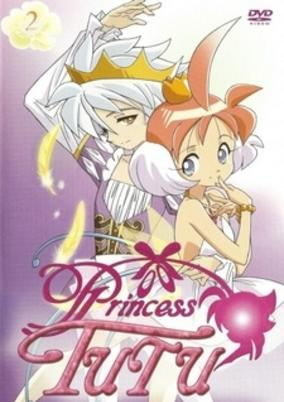

**Studio:** HAL Film Maker &nbsp;|&nbsp; **Episodes:** 38 &nbsp;|&nbsp; **Director:** Junichi Sato Kiyoko Sayama &nbsp;|&nbsp; **Aired/Released:** August 16 – May 23, 2003 &nbsp;|&nbsp; **Genres:** Contemporary Fantasy, Romance, Fantasy, Fantasy World, Performance, Alternative Past, Middle School, Love Polygon, Magic, Anthropomorphism, Past, School Life, Magical Girl, Plot Continuity, Music, Comedy

> In a fairy tale come to life, the clumsy, sweet, and gentle Ahiru (Japanese for "duck") seems like an unlikely protagonist. In reality, Ahiru is just as magical as the talking cats and crocodiles that inhabit her town—for Ahiru really is a duck! Transformed by the mysterious Drosselmeyer into a human girl, Ahiru soon learns the reason for her existence. Using her magical egg-shaped pendant, Ahiru can transform into Princess Tutu—a beautiful and talented ballet dancer whose dances relieve people of the turmoil in their hearts. With her newfound ability, Ahiru accepts the challenge of collecting the lost shards of her prince's heart, for long ago he had shattered it in order to seal an evil raven away for all eternity. Princess Tutu is a tale of heroes and their struggle against fate. Their beliefs, their feelings, and ultimately their actions will determine whether this fairy tale can reach its "happily ever after." Note: Princess Tutu aired in two parts. The first part included 13 25-minute episodes, while the second part consisted of 24 12-minute episodes with a 25-minute final episode.
>
> _Synopsis source: Kitsu_

[Wikipedia](https://en.wikipedia.org/wiki/Princess_Tutu) · [Kitsu](https://kitsu.io/anime/princess-tutu)

---

### Maou Dante (Demon Lord Dante)

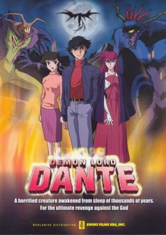

**Studio:** Magic Bus &nbsp;|&nbsp; **Episodes:** 13 &nbsp;|&nbsp; **Director:** Kenichi Maejima &nbsp;|&nbsp; **Aired/Released:** August 31 – November 23 &nbsp;|&nbsp; **Genres:** Fantasy, Japan, Action, Religion, Dark Fantasy, Violence, Demon, Horror

> While sleeping one night, Ryo Utsugi had a nightmare of monsters attacking him. One day he learns a mysterious power to let him hear voices and have visions of girls getting killed, but one night he hears the same voice.
>
> _Synopsis source: Kitsu_

[Wikipedia](https://en.wikipedia.org/wiki/Demon_Lord_Dante) · [Kitsu](https://kitsu.io/anime/maou-dante)

---

### Overman King Gainer

**Studio:** Sunrise &nbsp;|&nbsp; **Episodes:** 26 &nbsp;|&nbsp; **Director:** Yoshiyuki Tomino &nbsp;|&nbsp; **Aired/Released:** September 7 – March 22, 2003 &nbsp;|&nbsp; **Genres:** Earth, Post Apocalypse, Science Fiction, Mecha, Action, Asia, Russia, Piloted Robot, Coming Of Age, Future, Plot Continuity, Adventure

> Sometime in the distant future, mankind is forced to live in domed cities while the rest of the world is left to recover from years of environmental hardships. In the Siberian Dome-polis, professional gamer Gainer Sanga and mercenary Gain Bijou commandeer an Overman and lead a mass exodus out of the city.
>
> _Synopsis source: Kitsu_

[Wikipedia](https://en.wikipedia.org/wiki/Overman_King_Gainer) · [Kitsu](https://kitsu.io/anime/overman-king-gainer)

---

### Hungry Heart: Wild Striker

**Studio:** Nippon Animation &nbsp;|&nbsp; **Episodes:** 52 &nbsp;|&nbsp; **Director:** Satoshi Saga &nbsp;|&nbsp; **Aired/Released:** September 11 – September 10, 2003 &nbsp;|&nbsp; **Genres:** Japan, Action, Sports, Soccer, High School, School Life, Present, Comedy, Slice of Life

> Kyosuke Kano has lived under the shadow of his successful brother Seisuke all his life who is a professional soccer player. Tired of being compared and downgraded at, he abandoned playing soccer until a boy from his new highschool discovered him and asked him to join their team. Kyosuke joins it and befriends two other first year players named Rodrigo and Sakai with the dream of becomming professional soccer players themselves.
>
> _Synopsis source: Kitsu_

[Kitsu](https://kitsu.io/anime/hungry-heart-wild-striker)

---

### Mahoromatic ~Something More Beautiful~ (Mahoromatic: Automatic Maiden)

**Studio:** Gainax Shaft &nbsp;|&nbsp; **Episodes:** 14 &nbsp;|&nbsp; **Director:** Hiroyuki Yamaga &nbsp;|&nbsp; **Aired/Released:** September 26 – January 16, 2003 &nbsp;|&nbsp; **Genres:** Android, Maid, Slapstick, Stereotypes, Present, Slice of Life, Middle School, Japan, School Life, Comedy, Asia, Earth, Ecchi, Science Fiction, Mecha, Romance, Military

> Vesper is a secret agency fighting an army of alien invaders by using super-powerful battle androids. Mahoro is Vesper's most powerful battle android and has won many battles, but she has little operating time left and soon will cease to function. However, if she lays down her arms and conserves her remaining power, the time she has left can be prolonged to just over a year. Mahoro is given an opportunity to live the remaining time she has as a normal human. She chooses to live as a maid for Suguru, a phenomenally messy middle school student who lives by himself after his family passed away.
>
> _Synopsis source: Kitsu_

[Wikipedia](https://en.wikipedia.org/wiki/Mahoromatic) · [Kitsu](https://kitsu.io/anime/mahoromatic)

---

### Petite Princess Yucie

**Studio:** Gainax AIC &nbsp;|&nbsp; **Episodes:** 26 &nbsp;|&nbsp; **Director:** Masahiko Ootsuka &nbsp;|&nbsp; **Aired/Released:** September 30 – March 24, 2003 &nbsp;|&nbsp; **Genres:** Fantasy, Romance, Comedy, Magic

> Petite Princess Yucie follows the adventures of country-girl Yucie as she is admitted by chance to the prestigious Princess Academy, where the daughters of royalty and nobles attend to learn magic, dance, etiquette, defense, art and music. There, she experiences many things in her quest to collect the "fragments" of the Eternal Tiara in hopes that she may become the legendary Platinum Princess, who is chosen every 1,000 years. Yucie, along with the four other Princess candidates who are initially her rivals but are won over by her offer of friendship, must grow in heart--if not in height--to become worthy of the Tiara. Yucie is a spunky heroine who is a genius of smiles, and who, despite her common lifestyle, is actually the daughter of a noble and former hero who has retreated from courtly life and lives in the countryside.
>
> _Synopsis source: Kitsu_

[Wikipedia](https://en.wikipedia.org/wiki/Petite_Princess_Yucie) · [Kitsu](https://kitsu.io/anime/puchi-puri-yuushi)

---

### Monkey Typhoon

**Studio:** Studio Egg &nbsp;|&nbsp; **Episodes:** 52 &nbsp;|&nbsp; **Director:** Mamoru Hamatsu &nbsp;|&nbsp; **Aired/Released:** October 1 – September 30, 2003 &nbsp;|&nbsp; **Genres:** Science Fiction, Adventure, Action, Comedy

> Four years into the future, the world has lost its balance... 10 thousand metres of vast woodland is gone, preventing humans to live and leaving a desert to spread endlessly. And so, they head into the world of Meshichi, to live together with the Anbots. As if guided by fate, Sanzou and Gokyuu meet. Traveling together, Sanzou - a young man shrouded in mystery, Gokyuu - the strongest and worst Anbot around, Tongoh - an Anbot fond of drinking, Jou - someone who is great with machines, Suuji - a female Anbot thief, and last but not least, Mioto. And so, their journey begins to the boundless East, to the land where the sun was born!
>
> _Synopsis source: Kitsu_

[Wikipedia](https://en.wikipedia.org/wiki/Monkey_Typhoon) · [Kitsu](https://kitsu.io/anime/monkey-typhoon)

---

### Ghost in the Shell: Stand Alone Complex

**Studio:** Production I.G &nbsp;|&nbsp; **Episodes:** 26 &nbsp;|&nbsp; **Director:** Kenji Kamiyama &nbsp;|&nbsp; **Aired/Released:** October 1 – October 1, 2003 &nbsp;|&nbsp; **Genres:** Earth, Science Fiction, Mecha, Japan, Action, Asia, Special Squads, Gunfights, Detective, Human Enhancement, Cyborg, Cyberpunk, Future, Android, Law And Order, Politics, Cops, Military

> In the not so distant future, mankind has advanced to a state where complete body transplants from flesh to machine is possible. This allows for great increases in both physical and cybernetic prowess and blurring the lines between the two worlds. However, criminals can also make full use of such technology, leading to new and sometimes, very dangerous crimes. In response to such innovative new methods, the Japanese Government has established Section 9, an independently operating police unit which deals with such highly sensitive crimes. Led by Daisuke Aramaki and Motoko Kusanagi, Section 9 deals with such crimes over the entire social spectrum, usually with success. However, when faced with a new A level hacker nicknamed "The Laughing Man," the team is thrown into a dangerous cat and mouse game, following the hacker's trail as it leaves its mark on Japan. [Written by MAL Rewrite]
>
> _Synopsis source: Kitsu_

[Kitsu](https://kitsu.io/anime/ghost-in-the-shell-stand-alone-complex)

---

### Spiral: The Bond of Reasoning (Spiral: Bond of Reasoning)

**Studio:** J.C.Staff &nbsp;|&nbsp; **Episodes:** 25 &nbsp;|&nbsp; **Director:** Mamoru Hosoda &nbsp;|&nbsp; **Aired/Released:** October 1 – March 25, 2003 &nbsp;|&nbsp; **Genres:** Action, Comedy, Detective, Angst, Plot Continuity, Mystery

> Ayumu Narumi's older brother Kiyotaka, a renowned detective and piano player, disappears all of a sudden. The only clue Narumi has, are the Blade Children. Two years later a row of murders and incidents begin, relating to the Blade Children. Together with school journalist, Hiyono Yuizaki, Narumi tries to figure out their destiny.
>
> _Synopsis source: Kitsu_

[Kitsu](https://kitsu.io/anime/spiral-suiri-no-kizuna)

---

### Hanada Shounen-shi

**Studio:** Madhouse &nbsp;|&nbsp; **Episodes:** 25 &nbsp;|&nbsp; **Director:** Masayuki Kojima &nbsp;|&nbsp; **Aired/Released:** October 2 – March 26, 2003 &nbsp;|&nbsp; **Genres:** Contemporary Fantasy, Japan, Asia, Elementary School, Earth, Slice of Life, Comedy, Coming Of Age, Angst, Drama, Past, School Life

> Young Ichiro Hanada lives with his parents and grandfather in a quiet rural town. He is a little brat who constantly teases his sister, insults his mother, fights with everybody, and eats a lot. Ichiro has a near-death experience when he is hit by a truck, and when he wakes up he can see and talk to spirits. The spirits of people who have just died but who cannot pass on yet seek him out. They have some unresolved issue in their lives that is holding them back, and Ichiro must help them out.
>
> _Synopsis source: Kitsu_

[Wikipedia](https://en.wikipedia.org/wiki/Hanada_Sh%C5%8Dnen_Shi) · [Kitsu](https://kitsu.io/anime/hanada-shounen-shi)

---

### Heat Guy J (HeatGuy J)

**Studio:** Satelight &nbsp;|&nbsp; **Episodes:** 25 &nbsp;|&nbsp; **Director:** Kazuki Akane &nbsp;|&nbsp; **Aired/Released:** October 2 – March 26, 2003 &nbsp;|&nbsp; **Genres:** Science Fiction, Mecha, Action, Earth, Mafia, Gunfights, Law And Order, Adventure, Cops

> In the city of Judoh, Claire Leonelli has inherited leadership of the Mafia group "Vampire" following the death of his father. To keep Claire's and other criminal activities in check, the city's Bureau of Urban Safety has Special Services Division operative Daisuke Aurora and the super android codenamed "J" (whose identity is apparently kept in secrecy, as androids are banned in the city). With both of them around, crime now has little room to breathe in Judoh.
>
> _Synopsis source: Kitsu_

[Wikipedia](https://en.wikipedia.org/wiki/Heat_Guy_J) · [Kitsu](https://kitsu.io/anime/heatguy-j)

---

### Bomberman Jetters

**Studio:** Studio Deen &nbsp;|&nbsp; **Episodes:** 52 &nbsp;|&nbsp; **Director:** Katsuyuki Kodera &nbsp;|&nbsp; **Aired/Released:** October 2 – September 24, 2003 &nbsp;|&nbsp; **Genres:** Action, Comedy, Science Fiction, Adventure, Mystery

> Deep Space, many different cultures have come together to live on planet Jet. To keep the peace an organization known as the Jetters is formed. This space police group fight against the villains known as the "Hige hige dan" making sure that the universe is safe. The leader of the Jetters Mighty is a powerful Bomberman, who is looked up to and respected....his brother however is a lazy crude slacker named Shirobon. Suddenly Mighty disappears and Shiro finds himself placed in a new situation. Shiro steps up and become a responsible Bomberman, and with the new friends he made of the Jetters it may become possible for him to be the next "Jetters leader."
>
> _Synopsis source: Kitsu_

[Wikipedia](https://en.wikipedia.org/wiki/Bomberman_Jetters) · [Kitsu](https://kitsu.io/anime/bomberman-jetters)

---

### Naruto

**Studio:** Pierrot &nbsp;|&nbsp; **Episodes:** 220 &nbsp;|&nbsp; **Director:** Hayato Date &nbsp;|&nbsp; **Aired/Released:** October 3 – February 8, 2007

[Wikipedia](https://en.wikipedia.org/wiki/Naruto_(TV_series))

---

### Sister Princess : Re Pure

**Studio:** Zexcs &nbsp;|&nbsp; **Episodes:** 13 &nbsp;|&nbsp; **Director:** Nagisa Miyazaki Tsubame Shimotaya &nbsp;|&nbsp; **Aired/Released:** October 4 – December 25 &nbsp;|&nbsp; **Genres:** Romance, Earth, Japan, Asia, Slice of Life, Comedy, Stereotypes, Present, Harem

> Wataru Minakami is a top student who failed his high school entrance exam because of a computer glitch. He later discovered that he was accepted to Stargazer Hill Academy, which is located at a mysterious place called Promised Island. At the request of his father, Wataru is whisked away to the island, and before he can settle in, a dozen of cute and charming girls start to flock him and claim to be his younger sisters. As Wataru gets closer to his newfound siblings, a deeper mystery as to why they were sent to the island comes to play.
>
> _Synopsis source: Kitsu_

[Wikipedia](https://en.wikipedia.org/wiki/Sister_Princess) · [Kitsu](https://kitsu.io/anime/sister-princess)

---

### Mobile Suit Gundam SEED

**Studio:** Sunrise &nbsp;|&nbsp; **Episodes:** 50 &nbsp;|&nbsp; **Director:** Mitsuo Fukuda &nbsp;|&nbsp; **Aired/Released:** October 5 – September 27, 2003 &nbsp;|&nbsp; **Genres:** Space Travel, Science Fiction, Mecha, Action, Piloted Robot, Human Enhancement, Shipboard, War, Drama, Future, Robot, Disaster, Plot Continuity, Violence, Space, Military, Romance

> C.E. 71: In the midst of war between the Naturals (OMNI) and Coordinators (ZAFT), a unit from ZAFT is dispatched to hijack the Earth Alliance's newly developed mobile suits on the neutral colony of Heliopolis. Orb Civilian Coordinator Kira Yamato attends the technical college on Heliopolis. After ZAFT hijacks 4 of the 5 mobile suits, Kira stumbles upon the last one, Strike, forced to pilot it to save his and his friend's lives. During this confusion, Kira also reunites with his childhood Coordinator friend, Athrun Zala, who ironically turns out to be a ZAFT soldier and one of the hijackers at Heliopolis. Having control of Strike, Kira joins the Earth Alliance boarding the ship known as Archangel, to protect his friends while despairing over becoming the enemy of his childhood friend and people.
>
> _Synopsis source: Kitsu_

[Wikipedia](https://en.wikipedia.org/wiki/Mobile_Suit_Gundam_SEED) · [Kitsu](https://kitsu.io/anime/mobile-suit-gundam-seed)

---

### GetBackers

**Studio:** Studio Deen &nbsp;|&nbsp; **Episodes:** 49 &nbsp;|&nbsp; **Director:** Kazuhiro Furuhashi Keitaro Motonaga &nbsp;|&nbsp; **Aired/Released:** October 5 – September 20, 2003 &nbsp;|&nbsp; **Genres:** Contemporary Fantasy, Earth, Japan, Adventure, Action, Asia, Martial Arts, Present, Super Power, Comedy, Mystery, Drama, Shounen

> Mido Ban and Amano Ginji are known as the Get Backers, retrievers with a success rate of 100%. Whatever is lost or stolen, they can definitely get it back. Despite their powerful abilities and enthusiastic behavior, Ban and Ginji are terminally broke no matter what they do simply because few people would actually desire to hire them. As a result, the pair of them tend to do dangerous jobs, often leading to unwanted re-encounters with their old (and dangerous) friends.
>
> _Synopsis source: Kitsu_

[Wikipedia](https://en.wikipedia.org/wiki/GetBackers) · [Kitsu](https://kitsu.io/anime/getbackers)

---

### Galaxy Angel 3

**Studio:** Madhouse &nbsp;|&nbsp; **Episodes:** 26 &nbsp;|&nbsp; **Director:** Shigehito Takayanagi &nbsp;|&nbsp; **Aired/Released:** October 6 – March 31, 2003 &nbsp;|&nbsp; **Genres:** Future, Space, Slapstick, Shipboard, Science Fiction, Comedy

> The Angel Brigade, an elite branch of the Transbaal Empire military, are assigned to search for The Lost Technology, mysterious items from the past that hold unknown powers. Led by the soon to retire Colonel Volcott O' Huey, the Angel Brigade travel to different planets using their specially designed Emblem Frame ships to search for Lost Technology. Unfortunately, they usually mess up somehow and end up getting into all kinds of weird and troublesome situations.
>
> _Synopsis source: Kitsu_

[Wikipedia](https://en.wikipedia.org/wiki/Galaxy_Angel) · [Kitsu](https://kitsu.io/anime/galaxy-angel)

---

### Super Heavy God Gravion

**Studio:** Gonzo &nbsp;|&nbsp; **Episodes:** 13 &nbsp;|&nbsp; **Director:** Masami Oobari &nbsp;|&nbsp; **Aired/Released:** October 8 – December 17 &nbsp;|&nbsp; **Genres:** Transforming Craft, Science Fiction, Mecha, Japan, Earth, Ecchi, Piloted Robot, Violent Retribution For Accidental Infringement, Maid, Alien, Future, Slapstick, Stereotypes, Robot, Action, Comedy

> The year is now 2041 AD. A new enemy called Zeravire suddenly appears in the solar system, destroying all military installations it comes across. However, a wealthy man named Klein Sandman is already aware of this planned invasion and had been secretly preparing his army for battle. His trump card is Gravion, a giant robot that utilizes gravity as its source of energy. Meanwhile a young man named Eiji secretly enters Sandman's base in search for his missing sister. It is there that he meets another young man by the name of Toga... These two must now fight together with four other individuals aboard the super robot, Gravion to fend off the Zeravire threat.
>
> _Synopsis source: Kitsu_

[Wikipedia](https://en.wikipedia.org/wiki/Gravion) · [Kitsu](https://kitsu.io/anime/choujuushin-gravion)

---

### Kiddy Grade

**Studio:** Gonzo &nbsp;|&nbsp; **Episodes:** 24 &nbsp;|&nbsp; **Director:** Keiji Gotoh &nbsp;|&nbsp; **Aired/Released:** October 9 – March 19, 2003 &nbsp;|&nbsp; **Genres:** Science Fiction, Mecha, Action, Space Opera, Special Squads, Detective, Cyborg, Conspiracy, Crime, Other Planet, Future, Law And Order, Plot Continuity, Space, Super Power, Ecchi

> After fighting in numerous interstellar wars, mankind forms the Galactic Union to bring stability and to prevent conflicts between different planets. However, disputes between members of the union itself persists. In the Star Century year 0165, the Galactic Organization of Trade and Tariffs (GOTT) was formed. This organization utilizes the superpowered ES taskforce to maintain order. Eclair and Lumiere are two low-ranking ES members who carry out missions for GOTT. However, as they begin to see more and more of the galaxy, they soon realize that what they know about GOTT, the Galactic Union, and even themselves might not be all there is to it...
>
> _Synopsis source: Kitsu_

[Wikipedia](https://en.wikipedia.org/wiki/Kiddy_Grade) · [Kitsu](https://kitsu.io/anime/kiddy-grade)

---

### Haibane Renmei

**Studio:** Radix &nbsp;|&nbsp; **Episodes:** 13 &nbsp;|&nbsp; **Director:** Tomokazu Tokoro &nbsp;|&nbsp; **Aired/Released:** October 10 – December 19 &nbsp;|&nbsp; **Genres:** Fantasy, Contemporary Fantasy, Fantasy World, Slice of Life, Angel, Angst, Alternative Present, Countryside, Plot Continuity, Psychological, Mystery

> All Rakka remembers before emerging from her cocoon is the sensation of falling. Confused, she is welcomed into this new world as one of the Haibane, a group of youth with small gray wings and bright halos. Together, they live in the Old Home on the outskirts of Grie, a quiet town where wingless, halo-less people live. There are many rules governing the world of Haibane Renmei: the most important one being that Haibane cannot go near or touch the massive walls that surround the town. Only beings known as Toga may come and go as they please. Although her daily life is quiet, there is much Rakka and the other Haibane do not know, or are not allowed to know. Rakka will work through her own doubts and questions as she figures out what she is doing in this world, while working towards the goal of each Haibane: to get beyond the walls on their Day of Flight. But this is not a light task: failure means being branded as one who is Sin-bound.
>
> _Synopsis source: Kitsu_

[Wikipedia](https://en.wikipedia.org/wiki/Haibane_Renmei) · [Kitsu](https://kitsu.io/anime/haibane-renmei)

---

### Diary of a Fishing Fool

**Studio:** Toei Animation &nbsp;|&nbsp; **Episodes:** 36 &nbsp;|&nbsp; **Director:** Tetsuo Imazawa &nbsp;|&nbsp; **Aired/Released:** November 2 – September 13, 2003 &nbsp;|&nbsp; **Genres:** Comedy, Slice of Life

> Hamazaki Densuke (Hama-chan) is an unavaricious white-collar worker who does not have any interest in success and self-protection. Even though he incurs the wrath of his superior and stir ill feelings from his wife, Hama-chan prefers to take things at his own stride and goes fishing. He feels that there are more important things in life than work and enjoys the simple things in life such as fishing.
>
> _Synopsis source: Kitsu_

[Wikipedia](https://en.wikipedia.org/wiki/Tsuribaka_Nisshi) · [Kitsu](https://kitsu.io/anime/tsuri-baka-nisshi)

---

### Piano: The Melody of a Young Girl's Heart

**Studio:** OLM &nbsp;|&nbsp; **Episodes:** 10 &nbsp;|&nbsp; **Director:** Norihiko Sudo &nbsp;|&nbsp; **Aired/Released:** November 11 – January 13, 2003 &nbsp;|&nbsp; **Genres:** Romance, Japan, Asia, Earth, Slice of Life, Middle School, Coming Of Age, School Life, Present, Music

> When Miu was young, she was fascinated by the piano and took up lessons. When the show opens, Miu is in middle school. She is shy, a soft-spoken girl who doesn't have a lot of confidence in herself. Her friends would describe her as "sweet" and "quiet." At this point, Miu has been taking piano lessons for some time and while people have told her that she's gotten very good over the years, Miu herself feels she's not really good at anything—including the piano. Her teacher, Mr. Shirakawa, is often frustrated with her playing. Although she plays every note exactly correct, her heart just isn't in it... Meanwhile, Miu's come of the age when she's noticing boys and this shy young lady has noticed the handsome Kazuya Takahashi—even if he hasn't noticed her. This is Miu's story. The story of a young girl who is on a journey to discover the melody within her own heart and the courage to express it.
>
> _Synopsis source: Kitsu_

[Kitsu](https://kitsu.io/anime/piano)

---

### Pokemon Advanced Generation (Pokemon Chronicles)

**Studio:** OLM &nbsp;|&nbsp; **Episodes:** 192 &nbsp;|&nbsp; **Director:** Kunihiko Yuyama Masamitsu Hidaka Yuuji Asada &nbsp;|&nbsp; **Aired/Released:** November 21 – September 14, 2006 &nbsp;|&nbsp; **Genres:** Fantasy, Adventure, Comedy, Proxy Battles, Kids

> Pokémon Chronicles is a TV series comprised of the English-dubbed versions of a number of Pokémon TV specials. Many of the episodes are from the Weekly Pokémon Broadcasting Station show in Japan, but it also contained The Legend of Thunder! and shorts from the Pikachu's Winter Vacation series. The series, in each episode, basically focuses on the lives of the many of the recurring/main characters Ash Ketchum met on his journey, like Sakura, Misty, her sisters, Casey, and Tracey. Ash only makes two appearances in the series in brief cameos.
>
> _Synopsis source: Kitsu_

[Wikipedia](https://en.wikipedia.org/wiki/Pok%C3%A9mon_(TV_series)) · [Kitsu](https://kitsu.io/anime/pokemon-housoukyoku)

---

### Knight Hunters Eternity

**Studio:** ufotable &nbsp;|&nbsp; **Episodes:** 13 &nbsp;|&nbsp; **Director:** Hitoyuki Matsui &nbsp;|&nbsp; **Aired/Released:** November 28 – March 20, 2003 &nbsp;|&nbsp; **Genres:** Action

> Koua is an academy that brings Japanese's most talented people and students together. The mission is to train talented people to bear the world's future leadership. However, recently, the suicide rate in the academy is increasing and there is hardly any information being released to the public. Fujimiya Aya is sent to infiltrate this school carrying out criminal investigation and disguise himself as a teacher. In fact, actually, there is a connection between Koua academy and the global terrorist activities that are frequently occur. Therefore Persia assigns Hidaka Ken and Kudou Youji as well into this mission to solve the truth and connection of the incident behind Koua academy.
>
> _Synopsis source: Kitsu_

[Wikipedia](https://en.wikipedia.org/wiki/Wei%C3%9F_Kreuz) · [Kitsu](https://kitsu.io/anime/weiss-kreuz-gluhen)

---

## Original video animations

### Detective Conan: 16 Suspects

**Studio:** TMS Entertainment &nbsp;|&nbsp; **Episodes:** 1 &nbsp;|&nbsp; **Director:** Yasuichiro Yamamoto &nbsp;|&nbsp; **Aired/Released:** January 16

[Wikipedia](https://en.wikipedia.org/wiki/List_of_Case_Closed_OVAs)

---

### Hunter x Hunter: Original Video Animation

**Studio:** Nippon Animation &nbsp;|&nbsp; **Episodes:** 8 &nbsp;|&nbsp; **Director:** Satoshi Saga &nbsp;|&nbsp; **Aired/Released:** January 17 – April 17

[Wikipedia](https://en.wikipedia.org/wiki/List_of_Hunter_%C3%97_Hunter_OVA_episodes)

---

### Digital Juice

**Studio:** Studio 4°C &nbsp;|&nbsp; **Episodes:** 6 &nbsp;|&nbsp; **Director:** Kouji Morimoto Osamu Kobayashi Tatsuyuki Tanaka Kazuyoshi Yaginuma &nbsp;|&nbsp; **Aired/Released:** January 25

[Wikipedia](https://en.wikipedia.org/wiki/Digital_Juice_(anime))

---

### Love Hina Again

**Studio:** Xebec &nbsp;|&nbsp; **Episodes:** 3 &nbsp;|&nbsp; **Director:** Yoshiaki Iwasaki &nbsp;|&nbsp; **Aired/Released:** January 26 – March 27 &nbsp;|&nbsp; **Genres:** Present, Earth, University, Japan, Love Polygon, Stereotypes, Asia, Comedy, Ecchi, Romance

> Keitaro has finally passed the entrance exams, and is officially a Toudai student. But after breaking his leg in an accident in the entrance ceremony, he thought and re-evaluated himself. Having new goals, Keitaro follows Seta on an overseas archeology trip. During his absence, however, all was not well in Hinata Lodge. Urashima Kanako, Keitaro's sister, arrives on the scene. She claims to be the new manager of Hinata Lodge starts to go against all the tenants. Things become even more complicated when they recieve a letter from Keitaro. The tenants and Kanako made a big mess trying to get the letter, but Seta's car crashes in before anyone could read the letter...
>
> _Synopsis source: Kitsu_

[Wikipedia](https://en.wikipedia.org/wiki/Love_Hina) · [Kitsu](https://kitsu.io/anime/love-hina-again)

---

### Gakuen Senki Muryou Special (Shingu: Secret of the Stellar Wars)

**Studio:** Madhouse &nbsp;|&nbsp; **Episodes:** 1 &nbsp;|&nbsp; **Aired/Released:** January 26 &nbsp;|&nbsp; **Genres:** Science Fiction, Japan, Earth, Action, Asia, Slice of Life, Future, Plot Continuity, Super Power, Space, Mecha, Adventure

> The world is about to be turned upside down for Hajime Murata. First, a strange alien ship appears over Tokyo, and then a mysterious new transfer student arrives at his school wearing an ancient school uniform. His name is Muryou, and with his arrival, everything begins to change. Students suddenly begin to display amazing psychic powers, a giant white guardian keeps appearing in the skies over the city to fight off gigantic alien creatures, and men with threatening weapons are haunting the shadows of the school grounds. With all these strange events taking place around him, Hajime is determined to figure out the truth about a world he thought he already knew. This is his story: a tale of aliens and humans, starships and spies, and friends who are often more than they appear. Join Hajime as he uncovers the mystery of Shingu: Secret of the Stellar Wars!
>
> _Synopsis source: Kitsu_

[Wikipedia](https://en.wikipedia.org/wiki/Gakuen_Senki_Muryou) · [Kitsu](https://kitsu.io/anime/shingu-secret-of-the-stellar-wars)

---

### Shootfighter Tekken

**Studio:** AIC &nbsp;|&nbsp; **Episodes:** 3 &nbsp;|&nbsp; **Director:** Yukio Nishimoto &nbsp;|&nbsp; **Aired/Released:** January 31 – April 26

[Wikipedia](https://en.wikipedia.org/wiki/Tough_(manga))

---

### Voices of a Distant Star

**Studio:** CoMix Wave Films &nbsp;|&nbsp; **Episodes:** 1 &nbsp;|&nbsp; **Director:** Makoto Shinkai &nbsp;|&nbsp; **Aired/Released:** February 2 &nbsp;|&nbsp; **Genres:** Future, Space, Earth, Japan, Asia, Science Fiction, Romance, Drama, Mecha

> Hoshi no Koe, using full 2D and 3D digital animation, is a story of a long distance love and mail messages between a boy and girl. Set in 2046 after the discovery of the ruins of an alien civilization on Mars, man has been able to make leaps in technology and is planning to send an expedition into space in the next year. Nagamine Mikako and Terao Noboru are junior high school students. However, while Noboru will be entering senior high next winter, Mikako is selected to join the space expedition.
>
> _Synopsis source: Kitsu_

[Wikipedia](https://en.wikipedia.org/wiki/Voices_of_a_Distant_Star) · [Kitsu](https://kitsu.io/anime/voices-of-a-distant-star)

---

### Arcade Gamer Fubuki

**Studio:** Shaft &nbsp;|&nbsp; **Episodes:** 4 &nbsp;|&nbsp; **Director:** Yuuji Muto &nbsp;|&nbsp; **Aired/Released:** February 25 – January 25, 2003 &nbsp;|&nbsp; **Genres:** Ecchi, Action, Japan, Parody, Super Power, Comedy, Shounen

> Fubuki Sakuragasaki is a powerful gamer who, with the power of her Passion Panties, climbs up the ranks of the BAG (Best of Arcade Gamer) tournament to become the greatest Arcade Gamer in the world. However, the evil Gulasic Group is out to conquer the world through said tournament, and their gaming skills will prove to be a challenge. Fubuki must team up with the legendary Mr. Mystery to combat the four Gods of Gaming and make the world of arcade gaming safe for all.
>
> _Synopsis source: Kitsu_

[Wikipedia](https://en.wikipedia.org/wiki/Arcade_Gamer_Fubuki) · [Kitsu](https://kitsu.io/anime/arcade-gamer-fubuki)

---

### Trava: Fist Planet

**Studio:** Madhouse &nbsp;|&nbsp; **Episodes:** 4 &nbsp;|&nbsp; **Director:** Katsuhito Ishii Takeshi Koike &nbsp;|&nbsp; **Aired/Released:** March 2 – July 3 &nbsp;|&nbsp; **Genres:** Power Suit, Science Fiction, Mecha, Comedy, Other Planet, Future, Space, Action

> Ace pilot Trava and his personal mechanic buddy Shinkai, on their way to mark an out-of-the-way planet, pick up Mikuru, a girl with no memory. The three are about to discover that the planet is more than it seems.
>
> _Synopsis source: Kitsu_

[Kitsu](https://kitsu.io/anime/trava)

---

### Sweat Punch

**Studio:** Studio 4°C &nbsp;|&nbsp; **Episodes:** 5 &nbsp;|&nbsp; **Director:** Kazuto Nakazawa &nbsp;|&nbsp; **Aired/Released:** March 2 – July 1, 2006 &nbsp;|&nbsp; **Genres:** Mecha, Robot Helper, Science Fiction, Historical, Action, Fantasy

> Sweat Punch is a series of five Studio 4°C shorts collected as a direct-to-DVD package film entitled Deep Imagination.
>
> _Synopsis source: Kitsu_

[Wikipedia](https://en.wikipedia.org/wiki/Sweat_Punch) · [Kitsu](https://kitsu.io/anime/sweat-punch)

---

### Canary

**Studio:** Soeishinsha &nbsp;|&nbsp; **Episodes:** 1 &nbsp;|&nbsp; **Director:** Keitaro Motonaga &nbsp;|&nbsp; **Aired/Released:** March 22 &nbsp;|&nbsp; **Genres:** Japan, High School, School Clubs, Musical Band, Slapstick, Stereotypes, School Life, Present, Music, Fantasy, Romance

> Mika Katagiri wants her band to perform at the upcoming local festival. However, complications arise. Their keyboardist, Jun, refuses to play, and their stage has been cancelled. Refusing to give up, Mika and her band strive to find a way to play at the festival, using any means necessary.
>
> _Synopsis source: Kitsu_

[Wikipedia](https://en.wikipedia.org/wiki/Canary_(video_game)) · [Kitsu](https://kitsu.io/anime/canary)

---

### Otogi Story Tenshi no Shippo Specials (Angel Tales)

**Studio:** Tokyo Kids &nbsp;|&nbsp; **Episodes:** 2 &nbsp;|&nbsp; **Director:** Kazuhiro Ochi &nbsp;|&nbsp; **Aired/Released:** March 25 – July 25 &nbsp;|&nbsp; **Genres:** Romance, Japan, Fantasy, Slice of Life, Love Polygon, Angel, Magic, Stereotypes, Present, Harem, Comedy

> Goro's down on his luck. He keeps losing jobs and has little money. One day he meets a fortune-teller outside of a pet store who predicts that his luck will change. That night three girls appear in his appartment claiming to be his guardian angels. Soon a total of twelve girls appear to help him, each one a reincarnation of a deceased pet once owned by Goro.
>
> _Synopsis source: Kitsu_

[Wikipedia](https://en.wikipedia.org/wiki/Otogi_Story_Tenshi_no_Shippo) · [Kitsu](https://kitsu.io/anime/tenshi-no-shippo)

---

### In a Distant Time

**Studio:** Zexcs &nbsp;|&nbsp; **Episodes:** 2 &nbsp;|&nbsp; **Director:** Iku Suzuki &nbsp;|&nbsp; **Aired/Released:** March 27 – January 23, 2003 &nbsp;|&nbsp; **Genres:** Bishounen, Historical, Demon, Reverse Harem, Action, Fantasy, Adventure, Romance

> Whisked away to the land of Kyou, Akane learns that she is the Ryuujin no Miko, and meets the Hachiyou, her protectors. They must defeat Akuram, a demon who wants to destroy Kyou using the power of Azusa, a woman who has the power to absorb human energy. If Akane and the Hachiyou cannot defeat Akuram and bring peace to Kyou, Azusa'a power will destroy the humans.
>
> _Synopsis source: Kitsu_

[Wikipedia](https://en.wikipedia.org/wiki/In_a_Distant_Time) · [Kitsu](https://kitsu.io/anime/harukanaru-toki-no-naka-de-ajisai-yumegatari)

---

### Angelique: Twin Collection

**Studio:** Yumeta Company &nbsp;|&nbsp; **Episodes:** 8 &nbsp;|&nbsp; **Aired/Released:** March 27 – June 25, 2003 &nbsp;|&nbsp; **Genres:** Science Fiction, Fantasy

> As the title implies, this series features a pair of characters per episode. Each DVD has one music video for each character, plus one part of an eight part story. Annoyingly, the music videos are for the short versions of the songs, not the full versions... to get those, you had to buy the Twin Collection CDs.
>
> _Synopsis source: Kitsu_

[Wikipedia](https://en.wikipedia.org/wiki/Angelique_(video_game_series)) · [Kitsu](https://kitsu.io/anime/angelique-twin-collection)

---

### Araiso Private High School Student Council Executive Committee

**Studio:** Nippon Animation &nbsp;|&nbsp; **Episodes:** 2 &nbsp;|&nbsp; **Director:** Shinji Sato &nbsp;|&nbsp; **Aired/Released:** March 29 – July 26 &nbsp;|&nbsp; **Genres:** Martial Arts, School Life, Comedy, Shounen Ai, Sports

> Kubota Makoto and Tokitoh Minoru (characters from Kazuya Minekura's manga Wild Adaptor—though no reference is made to the darker storyline of WA in this light-hearted anime)—are the muscle of their high school's all-powerful student council. They defend the student body from disorder—generated by both humans and demons—while avoiding their classes.
>
> _Synopsis source: Kitsu_

[Wikipedia](https://en.wikipedia.org/wiki/Araiso_Private_High_School_Student_Council_Executive_Committee) · [Kitsu](https://kitsu.io/anime/shiritsu-araiso-koutougakkou-seitokai-shikkoubu)

---

### Lupin III: Return of Pycal

**Studio:** TMS Entertainment &nbsp;|&nbsp; **Episodes:** 1 &nbsp;|&nbsp; **Director:** Mamoru Hamatsu &nbsp;|&nbsp; **Aired/Released:** April 3

[Wikipedia](https://en.wikipedia.org/wiki/Lupin_the_Third)

---

### She and Her Cat : Their Standing Points (The Cat Returns)

**Studio:** CoMix Wave Films &nbsp;|&nbsp; **Episodes:** 1 &nbsp;|&nbsp; **Director:** Makoto Shinkai &nbsp;|&nbsp; **Aired/Released:** April 19 &nbsp;|&nbsp; **Genres:** High School, Fantasy World, Earth, Contemporary Fantasy, Japan, Asia, Fantasy, Adventure, Comedy

> Haru Yoshioka is your ordinary high school girl who has trouble making decisions for herself. One day, she spots a strange cat crossing the road with a small present... and a truck headed straight for it! Haru doesn’t even stop to think before jumping in front of the truck and getting them both to safety. This one selfless act initiates a chain of events that sends Haru on an epic adventure. The cat she saved turns out to be no ordinary feline, but Lune, Prince of the Cats. In honour of her bravery and for saving his life, he offers to marry her. Haru mutters a reply which is taken to be a "yes", and for better or for worse, her fate is sealed. Alongside her cat companions Muta and the Baron, she's aided from above by a raven named Toto, and must travel to the cat world in order to rectify this misunderstanding. Her journey is tougher than it seems: If she cannot escape from the claws of the King of the Cats and find her true self, she will be turned into a cat forever. Haru may start off as an everyday girl, but after her descent into the world of cats, she returns a different beast entirely.
>
> _Synopsis source: Kitsu_

[Wikipedia](https://en.wikipedia.org/wiki/She_and_Her_Cat) · [Kitsu](https://kitsu.io/anime/the-cat-returns)

---

### Gate Keepers 21

**Studio:** Gonzo &nbsp;|&nbsp; **Episodes:** 6 &nbsp;|&nbsp; **Director:** Hiroshi Yamaguchi &nbsp;|&nbsp; **Aired/Released:** April 24 – January 8, 2003 &nbsp;|&nbsp; **Genres:** Contemporary Fantasy, Fantasy, Action, Magic, School Life, Super Power, Mecha, Science Fiction

> Thirty-two years have passed since the initial defeat of the Invaders. A.E.G.I.S is all but dismantled now and has become an underground organization consisting of only a few Gate Keepers left to save humanity. One of the members, Ayane Isuzu, is sick of society as a whole, though she continues to defeat the Invaders out of spite for her father. Suddenly, she learns of the revival of Machine General (Kikai Shogun) and Devil Count (Akuma Hakushaku), but a mysterious ghost girl now accompanies them. It is up to Ayane and the remnants of A.E.G.I.S to stop them and save humanity once again.
>
> _Synopsis source: Kitsu_

[Wikipedia](https://en.wikipedia.org/wiki/Gate_Keepers_21) · [Kitsu](https://kitsu.io/anime/gate-keepers-21)

---

### Galerians: Rion

**Episodes:** 3 &nbsp;|&nbsp; **Aired/Released:** April 24 &nbsp;|&nbsp; **Genres:** Science Fiction, Post Apocalypse, Action, Human Enhancement, Cyberpunk, Angst, Horror, Future, Super Power, Adventure, Military, Psychological, Mystery

> Six years have passed since Rion discovered his own identity as an artificial being, yet succeeded in destroying the genocidal Mother Computer, Dorothy, before perishing himself. Now reactivated by Lilia, Rion awakens to find that Dorothy managed to execute one final catastrophic program, rendering a new evil crew to finish her goal of human annihilation. It is a fully 3D CGI animated OVA based on the hit PlayStation game, called Galerians, released in August, 1999.
>
> _Synopsis source: Kitsu_

[Kitsu](https://kitsu.io/anime/galerians-rion)

---

### Galaxy Angel Music Collection: Shouen to Shien no Cassoulet

**Studio:** Madhouse &nbsp;|&nbsp; **Episodes:** 1 &nbsp;|&nbsp; **Director:** Morio Asaka Yoshimitsu Oohashi &nbsp;|&nbsp; **Aired/Released:** April 25 &nbsp;|&nbsp; **Genres:** Future, Space, Slapstick, Shipboard, Science Fiction, Comedy

> The Angel Brigade, an elite branch of the Transbaal Empire military, are assigned to search for The Lost Technology, mysterious items from the past that hold unknown powers. Led by the soon to retire Colonel Volcott O' Huey, the Angel Brigade travel to different planets using their specially designed Emblem Frame ships to search for Lost Technology. Unfortunately, they usually mess up somehow and end up getting into all kinds of weird and troublesome situations.
>
> _Synopsis source: Kitsu_

[Wikipedia](https://en.wikipedia.org/wiki/Galaxy_Angel) · [Kitsu](https://kitsu.io/anime/galaxy-angel)

---

### Cosplay Complex

**Studio:** TNK &nbsp;|&nbsp; **Episodes:** 3 &nbsp;|&nbsp; **Director:** Shinichiro Kimura &nbsp;|&nbsp; **Aired/Released:** May 25 – October 26 &nbsp;|&nbsp; **Genres:** Ecchi, Japan, Earth, Asia, Parody, Comedy, School Clubs, School Life, Present

> Meet Chako and her friends from the Cosplay Association at East Oizuki Academy! They're the hottest new cosplay team in Japan...fresh from a winning streak of local battles, they're set to sweep the Cosplay World Series! Yeah, right. In reality, Chako and her friends are barely able to keep their club alive at all. Feeble club membership and a lack of sponsorship might be the end of their cosplay dreams before they can even start. But don't you dare underestimate this group of spunky girls! They'll survive a barrage of pervy newcomers, cosplay rivalries, costume disasters and dating mishaps in order to reach their ultimate goal of competing in the World Series. The clothing flies as the girls suit up (and strip down) for Cosplay Complex!
>
> _Synopsis source: Kitsu_

[Wikipedia](https://en.wikipedia.org/wiki/Cosplay_Complex) · [Kitsu](https://kitsu.io/anime/cosplay-complex)

---

### Megami Kouhosei Special Curriculum

**Studio:** Xebec &nbsp;|&nbsp; **Episodes:** 1 &nbsp;|&nbsp; **Director:** Shinichi Yamaoka &nbsp;|&nbsp; **Aired/Released:** May 25 &nbsp;|&nbsp; **Genres:** Space, Mecha, Action, Science Fiction, Military

> A retelling of the TV series from the point of view of one of the Goddess Pilots.
>
> _Synopsis source: Kitsu_

[Wikipedia](https://en.wikipedia.org/wiki/The_Candidate_for_Goddess) · [Kitsu](https://kitsu.io/anime/candidate-for-goddess-ova)

---

### Mahou no Star Magical Emi: Kumo Hikaru

**Studio:** Ajia-do &nbsp;|&nbsp; **Episodes:** 1 &nbsp;|&nbsp; **Director:** Takashi Anno &nbsp;|&nbsp; **Aired/Released:** May 25 &nbsp;|&nbsp; **Genres:** Idol, Present, Earth, Japan, Music, Asia, Comedy, Slice of Life

> Kazuki Mai, an elementary schoolgirl, wanted to be a magician but her skills weren't good enough for here to join her grandparents' Magiccarat troupe. One day she sees a light enter a strange heart-shaped mirror. The light is actually a mirror fairy named Topo, who takes over her favourite stuffed toy, a flying squirrel and gives her a bracelet with the 4 card suits. The bracelet can turn into a bubble wand which transforms Mai into the 18 year old magician Magical Emi, who uses her magic to help people and participate in her grandparents' shows.
>
> _Synopsis source: Kitsu_

[Wikipedia](https://en.wikipedia.org/wiki/Magical_Emi,_the_Magic_Star) · [Kitsu](https://kitsu.io/anime/mahou-no-star-magical-emi-kumo-hikaru)

---

### .hack//Liminality

**Studio:** Bee Train &nbsp;|&nbsp; **Episodes:** 4 &nbsp;|&nbsp; **Director:** Koichi Mashimo &nbsp;|&nbsp; **Aired/Released:** June 20 – April 10, 2003 &nbsp;|&nbsp; **Genres:** Science Fiction, Japan, Earth, Asia, Detective, Future, Mystery

> While playing the newly released MMORPG "The World," Minase Mai and Tomonari Kasumi collapsed in the real world and were sent to the hospital after hearing a mysterious sound. Only Mai had recovered while her friend Kasumi had slipped into a mysterious coma. Mai is later approached by the creator of "The World," Tokuoka Junichiro, who unveils to her that, just like her friend, six other players across the country had also collapsed while playing "The World" and are now in mysterious comas. What exactly is "The World," what is this mysterious sound Mai keeps on hearing, and why are people slipping into comas from this game? Minase, Junichiro and their acquaintances set off to get to the bottom of this problem before any further harm happens. [Written by MAL Rewrite]
>
> _Synopsis source: Kitsu_

[Wikipedia](https://en.wikipedia.org/wiki/.hack//Liminality) · [Kitsu](https://kitsu.io/anime/hack-liminality)

---

### Futari Ecchi (Step Up Love Story)

**Studio:** Chaos Project &nbsp;|&nbsp; **Episodes:** 4 &nbsp;|&nbsp; **Director:** Yuuji Moriyama &nbsp;|&nbsp; **Aired/Released:** July 26 – January 22, 2004 &nbsp;|&nbsp; **Genres:** Ecchi, Japan, Earth, Asia, Slice of Life, Comedy, Housewives, Present, Romance, Seinen

> Makoto and Yura Onoda are a newly-wed couple with zero sexual experience. Yura is a shy and naive 25-year-old woman whose good looks grab men's attention, something that she dislikes because she gets embarrassed very easily. Her husband Makoto is of the same age, but as opposed to his wife, he loves having dirty thoughts about other women. Physically though, Makoto is truly faithful to Yura. Both of them may be virgins, but now that they are married, they are ready to dive into the world of sex, "practicing" as often as possible. However, the world of sex is complex, so they need all the help they can get to find their way through it. Thankfully, their friends, acquaintances, and porn media lend them a helping hand.
>
> _Synopsis source: Kitsu_

[Wikipedia](https://en.wikipedia.org/wiki/Futari_Ecchi) · [Kitsu](https://kitsu.io/anime/futari-ecchi)

---

### Ultra Maniac (Ultramaniac - Magical Girl)

**Studio:** Ashi Productions &nbsp;|&nbsp; **Episodes:** 1 &nbsp;|&nbsp; **Director:** Shinichi Masaki Nanako Shimazaki &nbsp;|&nbsp; **Aired/Released:** August 6 &nbsp;|&nbsp; **Genres:** Romance, Japan, Comedy, Middle School, Magic, Slapstick, Alternative Present, Stereotypes, School Life, Magical Girl

> Hideo Middle School eighth-grader Ayu Tateishi, as a member of the tennis club, is of course a cool girl who is popular among the girls in the school. Actually, she's an ordinary girl pretending to be cool, because Kaji-kun of the baseball team likes her. She is adored by the transfer student Nina Sakura. Nina actually has a huge secret?! Because she is a young witch who transferred from the magic kingdom. She's a real witch which a magic computer and a magical treasure box. But this magic always causes big problems!! Now back to the boys. Of course there's Tetsushi Kaji, the up-and-coming ace of the baseball team, who is very popular among the girls, and his best friend, the calm and quiet member of the tennis club, Hiroki Tsujiai, and many others. This story is a school love comedy set at Hideo Middle School, starring the cool beauty Ayu, the young witch Nina, the baseball team's Kaji-kun, and the tennis team's Tsujiai-kun. Also, there are original characters that Yoshizumi-sensei designed specifically for the anime, so please look forward to it!
>
> _Synopsis source: Kitsu_

[Wikipedia](https://en.wikipedia.org/wiki/Ultra_Maniac) · [Kitsu](https://kitsu.io/anime/ultra-maniac)

---

### Nurse Witch Komugi-chan Magikarte

**Studio:** Kyoto Animation Tatsunoko Production &nbsp;|&nbsp; **Episodes:** 5 &nbsp;|&nbsp; **Director:** Yasuhiro Takemoto &nbsp;|&nbsp; **Aired/Released:** August 23 – April 2, 2004 &nbsp;|&nbsp; **Genres:** Earth, Japan, Asia, Parody, Comedy, Violent Retribution For Accidental Infringement, Slapstick, Magical Girl, Present, Magic

> Ungrar, the King of Viruses, has escaped from his prison cell in Vaccine World. Maya, the Goddess of Vaccine World sends Mugimaru down to Earth to find a human to accept the powers of Vaccine World and become the Magical Nurse. He finds the best (and the only willing) person for the job when he meets Komugi Nakahara. Komugi is a playful, lazy, and easily distracted (typical) teenager whose dream is to become a cosplay idol. Balancing her career with the Kiri-Pro Promotion Company and her new job battling Ungrar's loyal henchman, the Magical Maid Koyori, Komugi delights audiences in this parody anime series.
>
> _Synopsis source: Kitsu_

[Wikipedia](https://en.wikipedia.org/wiki/Nurse_Witch_Komugi-chan_Magikarte) · [Kitsu](https://kitsu.io/anime/nurse-witch-komugi-chan)

---

### Yukikaze

**Studio:** Gonzo &nbsp;|&nbsp; **Episodes:** 5 &nbsp;|&nbsp; **Director:** Masahiko Ookura &nbsp;|&nbsp; **Aired/Released:** August 25 – August 26, 2005 &nbsp;|&nbsp; **Genres:** Air Force, War, Science Fiction, Other Planet, Future, Present, Earth, Action, Space, Military, Psychological

> This full 3DCG digital animation has story takes place in the far future after a pillar of huge fog appeared suddenly in the South Pole. This pillar, known as Jam, is actually a passage for an earth invasion. In order to oppose the threat, the United Nations established an earth defense mechanism. Fukai Zero is a hero registered to the main force of earth defense and the special 5th flight squadron. His reconnaissance plane, Yukikaze (windblown snow) is the best tactical reconnaissance plane. His job is to collect battle information return safely to the base with the information. But one day when he about to finish his duty, an unidentified machine attacked him...
>
> _Synopsis source: Kitsu_

[Wikipedia](https://en.wikipedia.org/wiki/Yukikaze_(novel)) · [Kitsu](https://kitsu.io/anime/yukikaze)

---

### Haré+Guu Deluxe

**Studio:** Shin-Ei Animation &nbsp;|&nbsp; **Episodes:** 6 &nbsp;|&nbsp; **Director:** Tsutomu Mizushima &nbsp;|&nbsp; **Aired/Released:** August 25 – January 25, 2003 &nbsp;|&nbsp; **Genres:** Elementary School, Earth, Slice of Life, Comedy, Slapstick, Alternative Present, School Life, Present

> After the events in the city, Haré and family come back to the Jungle. But it is never calm for Haré as he first must deal with an unstable substitute teacher, then with some big news: Weda is pregnant. The answer to how and who will change his family forever. Poor Haré, now has to deal with a father in addition to his drunk mother and Guu, and soon a sibling too.
>
> _Synopsis source: Kitsu_

[Wikipedia](https://en.wikipedia.org/wiki/Jungle_wa_itsumo_Hale_nochi_Guu_Deluxe) · [Kitsu](https://kitsu.io/anime/jungle-wa-itsumo-hare-nochi-guu-deluxe)

---

### Saiyuki Interactive

**Studio:** Pierrot &nbsp;|&nbsp; **Episodes:** 1 &nbsp;|&nbsp; **Aired/Released:** September 19

[Wikipedia](https://en.wikipedia.org/wiki/Saiyuki_(manga))

---

### Mega Man : Wishing upon a Star (MegaMan: Wishing upon a Star)

**Studio:** Ashi Productions &nbsp;|&nbsp; **Episodes:** 3 &nbsp;|&nbsp; **Director:** Katsumi Minoguchi &nbsp;|&nbsp; **Aired/Released:** September 20 &nbsp;|&nbsp; **Genres:** Mecha, Action, Science Fiction, Adventure

> "This Anime (Episode 2, to be exact), where Rockman travels from the Game-World to the real world, to learn some cultural differences about Japan, was intended to be a Special Episode for the original Mega Man Cartoon Series by Ruby-Spears, which aired around 1995 in the US. As it seems, the special was finished before Ruby-Spears decided to redo their whole show with a completely new design, better suited for American audiences. Thus, not fitting the new style anymore, it never was included in the series. Still, two more episodes about the same story were produced a bit later, this time under the main title "Rockman" (unlike Episode 2, where he's called Mega Man, even in the japanese dub). It's unknown if these 3 Episodes ever saw an official release, until 2002, when Capcom of Japan decided to finally (re)release them on DVD for Rockman's 15th Anniversary (all featuring a Japanese and English dub, but no subs). It's unknown if there are any more secret animated works of the original Rockman game-series."
>
> _Synopsis source: Kitsu_

[Wikipedia](https://en.wikipedia.org/wiki/Mega_Man) · [Kitsu](https://kitsu.io/anime/rockman-hoshi-ni-negai-wo)

---

### Ichi The Killer: Episode 0

**Studio:** AIC &nbsp;|&nbsp; **Episodes:** 1 &nbsp;|&nbsp; **Director:** Shinji Ishihira &nbsp;|&nbsp; **Aired/Released:** September 27 &nbsp;|&nbsp; **Genres:** Earth, Japan, Action, Asia, Martial Arts, Crime, Horror, Violence, Present, Psychological, Dementia

> A masochistic mobster meets his match in the dark streets of Tokyo. His nemesis, Ichi, is a psychopathic killer with an unrelenting thirst for bloodshed. A horrifying secret burns in his mind, and his hands deal death without mercy. At last, the shrouds of mystery are parted to reveal the origin of the monster. The city will know its greatest fear at the unveiling of Ichi the Killer.
>
> _Synopsis source: Kitsu_

[Kitsu](https://kitsu.io/anime/ichi-the-killer-episode-0)

---

### Please Teacher! : Secret Couple (Please Teacher!)

**Studio:** Daume &nbsp;|&nbsp; **Episodes:** 1 &nbsp;|&nbsp; **Aired/Released:** October 25 &nbsp;|&nbsp; **Genres:** Romance, Earth, Japan, Asia, Sudden Girlfriend Appearance, Humanoid Alien, Alien, School Life, Present, Science Fiction, Comedy

> Kusanagi Kei, a high-school student living with his aunt and uncle, has an encounter with a female alien. This alien is revealed to be a new teacher at his school. Later, he is forced to marry this alien to preserve her secrets. From there, various romantically-inclined problems crop up repeatedly.
>
> _Synopsis source: Kitsu_

[Wikipedia](https://en.wikipedia.org/wiki/Please_Teacher!) · [Kitsu](https://kitsu.io/anime/onegai-teacher)

---

### Vandread : Gekitou-hen

**Studio:** Gonzo &nbsp;|&nbsp; **Episodes:** 1 &nbsp;|&nbsp; **Director:** Shinji Higuchi &nbsp;|&nbsp; **Aired/Released:** October 25 &nbsp;|&nbsp; **Genres:** Alien, Future, Space, Mecha, Transforming Craft, Shipboard, Humanoid Alien, Action, Science Fiction, Ecchi

> Though Hibiki and crew defeated a super-huge battleship of the earth in the last of the first stage, they noticed five battleships further aiming at Mejeiru and Tarahk. And, crew of NIRVANA learnt Tarahk and Mejeiru which were their home had been faced to the crisis of Karitori (reaping). Travel to their home is speed up so that they may inform of the crisis. On the way, current information of the earth having been brought by girl Misty who had come to travel with them was worse than they can imagine. Hibiki and crew noticed a true fight was in the future. VANDREAD is finally changed into final system by the attack of the enemy who becomes violent more and more. Can they save their home? And, what happens to the relations between Hibiki and Dita?
>
> _Synopsis source: Kitsu_

[Wikipedia](https://en.wikipedia.org/wiki/Vandread) · [Kitsu](https://kitsu.io/anime/vandread-the-second-stage)

---

### Saint Seiya : The Hades Chapter – Sanctuary

**Studio:** Toei Animation &nbsp;|&nbsp; **Episodes:** 13 &nbsp;|&nbsp; **Director:** Shigeyasu Yamauchi &nbsp;|&nbsp; **Aired/Released:** November 9 – July 25, 2003 &nbsp;|&nbsp; **Genres:** Deity, Super Power, Violence, Plot Continuity, Action, Science Fiction, Fantasy, Adventure, Henshin, Shounen

> Hades is planning to take over the world, to achieve that goal, he sends out deceased Gold Saints to take Athena's head. Seiya and the other Bronze Saints come to help but their help isn't appreciated by the remaining Gold Saints that are still alive.
>
> _Synopsis source: Kitsu_

[Wikipedia](https://en.wikipedia.org/wiki/Saint_Seiya) · [Kitsu](https://kitsu.io/anime/saint-seiya-the-hades-chapter-sanctuary)

---

### I''s

**Studio:** Pierrot Arms &nbsp;|&nbsp; **Episodes:** 2 &nbsp;|&nbsp; **Director:** Shigenori Kageyama &nbsp;|&nbsp; **Aired/Released:** December 9 – March 19, 2003

[Wikipedia](https://en.wikipedia.org/wiki/I%22s)

---

### Happy World!

**Studio:** Zexcs &nbsp;|&nbsp; **Episodes:** 3 &nbsp;|&nbsp; **Director:** Takashi Ikehata &nbsp;|&nbsp; **Aired/Released:** December 13 – June 27, 2003 &nbsp;|&nbsp; **Genres:** High School, Magic, Angel, Present, Earth, Contemporary Fantasy, Japan, Asia, Fantasy, Comedy

> Oomura Takeshi is one unlucky fellow. He has has this case of bad luck ever since he was little. One day, while on his normal runs with bad luck, he meets an Angel named Elle, and he finds out that his father wished the curse of bad luck upon him. Takeshi has the oppurtunity to pass on the curse, but accepts it to save a young girl. For his noble act, Elle becomes human and lives with Takeshi to protect him from the curse, which is something Takeshi isn't particularly happy with.
>
> _Synopsis source: Kitsu_

[Wikipedia](https://en.wikipedia.org/wiki/Happy_World!) · [Kitsu](https://kitsu.io/anime/happy-world)

---

### Sakura Taisen: Sumire (Sakura Wars: The Movie)

**Studio:** Radix &nbsp;|&nbsp; **Episodes:** 1 &nbsp;|&nbsp; **Director:** Hitoyuki Matsui &nbsp;|&nbsp; **Aired/Released:** December 18 &nbsp;|&nbsp; **Genres:** Earth, Mecha, Alternative Past, Piloted Robot, Japan, Asia, Action, Science Fiction, Adventure, Steampunk

> Since a new branch of division to New York has been created, Ohgami has now been assigned to the Paris Division. Now the Flower Division must be able to survive on their own, with the help of their new American-cultured leader.
>
> _Synopsis source: Kitsu_

[Wikipedia](https://en.wikipedia.org/wiki/Sakura_Wars) · [Kitsu](https://kitsu.io/anime/sakura-taisen-katsudou-shashin)

---

### I'll/CKBC

**Studio:** M.S.C &nbsp;|&nbsp; **Episodes:** 2 &nbsp;|&nbsp; **Director:** Itsuro Kawasaki &nbsp;|&nbsp; **Aired/Released:** December 18 – March 26, 2003

[Wikipedia](https://en.wikipedia.org/wiki/I%27ll_(manga))

---

### Green Green

**Studio:** Media Factory &nbsp;|&nbsp; **Episodes:** 1 &nbsp;|&nbsp; **Aired/Released:** December 20

[Wikipedia](https://en.wikipedia.org/wiki/Green_Green_(video_game))

---

### Space Pirate Captain Herlock: The Endless Odyssey

**Studio:** Madhouse &nbsp;|&nbsp; **Episodes:** 13 &nbsp;|&nbsp; **Director:** Rintaro &nbsp;|&nbsp; **Aired/Released:** December 21 – December 21, 2003 &nbsp;|&nbsp; **Genres:** Science Fiction, Fantasy, Action, Space Opera, Space, Adventure, Pirate

> On an archaelogical mission to the end of the known universe, Professor Daiba unwitting unleashes an ancient horror from its confines. Five years later the malevolent alien force sets in motion a plan which reunites the various crewmembers of the Arcadia to sail the stars once more as well as bring Tadashi Daiba to meet Harlock for the first time (again).
>
> _Synopsis source: Kitsu_

[Kitsu](https://kitsu.io/anime/space-pirate-captain-herlock-outside-legend-the-endless-odyssey)

---

### Macross Zero

**Studio:** Satelight &nbsp;|&nbsp; **Episodes:** 5 &nbsp;|&nbsp; **Director:** Shoji Kawamori &nbsp;|&nbsp; **Aired/Released:** December 21 – October 20, 2004 &nbsp;|&nbsp; **Genres:** Fantasy, Romance, Science Fiction, Mecha, Fantasy World, Action, Air Force, Future, Plot Continuity, Military, Adventure

> Taking place one year before the Zentraedi arrive on Earth, Macross Zero chronicles the final days of the war between the U.N. Spacy and anti-U.N. factions. After being shot down by the anti-U.N.'s newest fighter plane, ace pilot Shin Kudo finds himself on the remote island of Mayan, where technology is almost non-existent. While Shin stays on the island to heal his wounds, the tranqulity of the island is shattered by a battle that involves the UN's newest fighter - the VF-0.
>
> _Synopsis source: Kitsu_

[Wikipedia](https://en.wikipedia.org/wiki/Macross_Zero) · [Kitsu](https://kitsu.io/anime/macross-zero)

---

### Wind: A Breath of Heart

**Studio:** Ajia-do &nbsp;|&nbsp; **Episodes:** 1 &nbsp;|&nbsp; **Director:** Sata &nbsp;|&nbsp; **Aired/Released:** December 27 &nbsp;|&nbsp; **Genres:** Present, Earth, Japan, Stereotypes, Asia, Comedy, School Life

> Set four months after the resolution of the game the anime Wind is based on (via Hikari's ending), the entire gang is planning a big Christmas party. However, with the reappearance of Hikari, weird things start to happen in the city of Kazune. How will things turn out?
>
> _Synopsis source: Kitsu_

[Kitsu](https://kitsu.io/anime/wind-a-breath-of-heart)

---

### Kojin Taxi

**Episodes:** 5

---

### Shokuzai no Kyoushitsu

**Episodes:** 2

---

### Shintaisou: Kari

**Episodes:** 4

---

### Flutter of Birds: Tori-tachi no Habataki

**Episodes:** 2

---

### D+vine Luv

**Episodes:** 4

---

### Little Monica Monogatari

**Episodes:** 2

---

## Films

### Turn A Gundam I: Earth Light (∀ Gundam I: Earth Light)

**Studio:** Sunrise &nbsp;|&nbsp; **Director:** Yoshiyuki Tomino &nbsp;|&nbsp; **Aired/Released:** February 9 &nbsp;|&nbsp; **Genres:** Space, Earth, Mecha, Piloted Robot, Action, Science Fiction, Military

> A movie retelling of the first half of the Turn A Gundam series.
>
> _Synopsis source: Kitsu_

[Wikipedia](https://en.wikipedia.org/wiki/Turn_A_Gundam) · [Kitsu](https://kitsu.io/anime/turn-a-gundam-i-earth-light)

---

### Turn A Gundam II: Moonlight Butterfly (∀ Gundam I: Earth Light)

**Studio:** Sunrise &nbsp;|&nbsp; **Director:** Yoshiyuki Tomino &nbsp;|&nbsp; **Aired/Released:** February 10 &nbsp;|&nbsp; **Genres:** Space, Earth, Mecha, Piloted Robot, Action, Science Fiction, Military

> A movie retelling of the first half of the Turn A Gundam series.
>
> _Synopsis source: Kitsu_

[Wikipedia](https://en.wikipedia.org/wiki/Turn_A_Gundam) · [Kitsu](https://kitsu.io/anime/turn-a-gundam-i-earth-light)

---

### One Piece: Chopper Kingdom of Strange Animal Island

**Studio:** Toei Animation &nbsp;|&nbsp; **Director:** Junji Shimizu &nbsp;|&nbsp; **Aired/Released:** March 2

[Wikipedia](https://en.wikipedia.org/wiki/List_of_One_Piece_films)

---

### Digimon Tamers: Runaway Locomon

**Studio:** Toei Animation &nbsp;|&nbsp; **Director:** Tetsuharu Nakamura &nbsp;|&nbsp; **Aired/Released:** March 2 &nbsp;|&nbsp; **Genres:** Comedy, Adventure, Science Fiction, Japan, Fantasy, Proxy Battles, Present, Friendship

> Locomon, a train digimon, has suddenly appeared in the real world. All the tamers scramble to stop the train before it reaches its final destination: the portal into the Digital world.
>
> _Synopsis source: Kitsu_

[Kitsu](https://kitsu.io/anime/digimon-tamers-bousou-digimon-tokkyuu)

---

### Doraemon: Nobita in the Robot Kingdom (Doraemon the Movie: Nobita in the Robot Kingdom)

**Studio:** Shin-Ei Animation &nbsp;|&nbsp; **Director:** Tsutomu Shibayama &nbsp;|&nbsp; **Aired/Released:** March 9 &nbsp;|&nbsp; **Genres:** Comedy, Fantasy, Adventure, Kids

> Doraemon and friends travels into another world via the time machine; where humans and robots are living together. However they soon find out that the Empress of Robot Kingdom was trying to capture robots there and turn them emotionless. As the situation goes tense, our heroes sets out to stop the Empress and her plan.
>
> _Synopsis source: Kitsu_

[Kitsu](https://kitsu.io/anime/doraemon-nobita-robot-kingdom)

---

### A Tree of Palme

**Studio:** Palm Studio &nbsp;|&nbsp; **Director:** Takashi Nakamura &nbsp;|&nbsp; **Aired/Released:** March 16 &nbsp;|&nbsp; **Genres:** Fantasy, Mecha, Adventure, Romance

> Palme is a puppet created by a man to care for his sickly wife. After her death Palme becomes paralyzed with sorrow, that is, until a woman being pursed happens to cross paths with Palme and his creator and ask them to deliver something precious to a sacred place called Tama. Palme, mistaking her for his masters late wife, accepts the request. This becomes his first step to becoming more human in order to understand his own feelings.
>
> _Synopsis source: Kitsu_

[Wikipedia](https://en.wikipedia.org/wiki/A_Tree_of_Palme) · [Kitsu](https://kitsu.io/anime/palme-no-ki)

---

### Patlabor Movie 3: WXIII

**Studio:** Madhouse &nbsp;|&nbsp; **Director:** Fumihiko Takayama &nbsp;|&nbsp; **Aired/Released:** March 30 &nbsp;|&nbsp; **Genres:** Science Fiction, Mecha, Japan, Action, Detective, Angst, Cops

> When the level of Labor accidents begin to escalate around Tokyo Bay, police detectives Kusumi and Hata are assigned to investigate. What they discover leads to a series of government cover-ups, conspiracy concerning a new biological weapon entitled WXIII-Wasted Thirteen and a tragic, personal connection to Hata. The only hope to stop this threat is to cooperate with the military and lead WXIII into a showdown with the Labors of Special Vehicle Division 2.
>
> _Synopsis source: Kitsu_

[Kitsu](https://kitsu.io/anime/mobile-police-patlabor-wxiii)

---

### Crayon Shin-chan: The Storm Called: The Battle of the Warring States

**Studio:** Shin-Ei Animation &nbsp;|&nbsp; **Director:** Keiichi Hara &nbsp;|&nbsp; **Aired/Released:** April 20 &nbsp;|&nbsp; **Genres:** Japan, Asia, Earth, Comedy, Sengoku Period, Samurai, Historical, Romance, Kids

> A full-scale historical drama set in the last days (the year 1574) of the Sengoku Era of feudal Japan. It is the story of the Nohara family, who has been transferred into the Sengoku Era by time warp, and a tragic love between a princess Ren Kasuga (a daughter of the feudal lord Kasuga at the Province of Musashi) and a samurai warrior Matabei Ijiri (a retainer of the Lord Kasuga).
>
> _Synopsis source: Kitsu_

[Kitsu](https://kitsu.io/anime/crayon-shin-chan-movie-10-arashi-wo-yobu-appare-sengoku-daikassen)

---

### eX-Driver the Movie

**Studio:** Actas &nbsp;|&nbsp; **Director:** Akira Nishimori &nbsp;|&nbsp; **Aired/Released:** April 20 &nbsp;|&nbsp; **Genres:** Earth, Science Fiction, Action, Sports, United States, Americas, Future, Street Racing, Motorsport, Adventure, Comedy

> After winning domestic preliminary round, Lisa, Lorna, and Soichi advance to ex-Driver world race competition held in Los Angeles as representative team from Japan. Like a bad omen, they encountered a reckless AI car the first night they arrived at Los Angeles. Although they successfully stopped the car, the local police department is not very happy about that and insists to examine their car overnight. However, the problem did not stop just there. The daughter of the United States team`s sponsor, Angela, has gone missing. Lorna realized that Angela was on the reckless AI car before. Soichi who guessed that Angel could be in danger then start looking for her. But Soichi got captured by a mysterious man, and he shocked to find Angela is also there. During the confinement inside a warehouse, Soichi finds out that apparently there is a connection between the series of incident and illegal gambling on the ex-Driver world race competition. Now Soichi must escape from the warehouse with Angela...
>
> _Synopsis source: Kitsu_

[Wikipedia](https://en.wikipedia.org/wiki/EX-Driver_the_Movie) · [Kitsu](https://kitsu.io/anime/ex-driver-the-movie)

---

### Detective Conan: The Phantom of Baker Street (Case Closed: The Phantom of Baker Street)

**Studio:** TMS Entertainment &nbsp;|&nbsp; **Director:** Kenji Kodama &nbsp;|&nbsp; **Aired/Released:** April 20 &nbsp;|&nbsp; **Genres:** Earth, Adventure, Action, Thriller, Detective, Virtual Reality, Cops, Mystery

> Conan was invited to a party with many other guests. They were there to test a new virtual game system, when a murder mystery occured. Now Conan must go into the game system to figure out who the murderer is with the help of the famous book character Sherlock Holmes. The lives of 49 kids testing the game are in his hands.
>
> _Synopsis source: Kitsu_

[Kitsu](https://kitsu.io/anime/detective-conan-movie-06-the-phantom-of-baker-street)

---

### Armitage III: Dual-Matrix

**Studio:** AIC &nbsp;|&nbsp; **Director:** Katsuhito Akiyama &nbsp;|&nbsp; **Aired/Released:** June 25 &nbsp;|&nbsp; **Genres:** Science Fiction, Mecha, Earth, Action, Cyborg, Cyberpunk, Future, Android, Violence, Space, Adventure, Family

> A few years after they first met, Naomi Armitage and Ross Syllabus have started a family. Despite their normal lives, they must keep their identities a secret because many people believe that Robots do not deserve equal status with humans. Ross has an opportunity to abolish these ideas on Earth through a vote, but organizations in the shadows are working so that it doesn't happen.
>
> _Synopsis source: Kitsu_

[Kitsu](https://kitsu.io/anime/armitage-iii-dual-matrix)

---

### Pokémon Heroes (Pokemon Heroes)

**Studio:** OLM &nbsp;|&nbsp; **Director:** Kunihiko Yuyama &nbsp;|&nbsp; **Aired/Released:** July 13 &nbsp;|&nbsp; **Genres:** Fantasy, Action, Adventure, Comedy, Kids

> Long ago, on an island called Altomare, there lived an old man and woman. One day, the couple found two small children lying on the shore, badly wounded. The couple took them in and took care of them, and the children quickly recovered. But then, the island was attacked by monsters. Within moments the island fell into the monsters' wrath. Next, before the old man and lady's eyes, the children who they had taken care of transformed into the Eon Pokemon, Latios and Latias. They called their family from the sky. They came, and carried a stone with them containing the power to force the monsters away. This gem was known as the "Soul Dew." Peace returned to the island; however, later in the present, a criminal duo—Zannâ and Rion—us seeking Latios and Latias in order to take control of the Soul Dew. Taking a short break in Altomare, Satoshi befriends Latias and is now dragged into the situation helping to save Altomare from becoming swallowed up by destruction again.
>
> _Synopsis source: Kitsu_

[Wikipedia](https://en.wikipedia.org/wiki/Pok%C3%A9mon_Heroes) · [Kitsu](https://kitsu.io/anime/pokemon-mizu-no-miyako-no-mamorigami-latias-to-latios)

---

### The Cat Returns

**Studio:** Studio Ghibli &nbsp;|&nbsp; **Director:** Hiroyuki Morita &nbsp;|&nbsp; **Aired/Released:** July 20 &nbsp;|&nbsp; **Genres:** Contemporary Fantasy, Earth, Fantasy World, Japan, Asia, Fantasy, Comedy, High School, Adventure

> Haru Yoshioka is your ordinary high school girl who has trouble making decisions for herself. One day, she spots a strange cat crossing the road with a small present... and a truck headed straight for it! Haru doesn’t even stop to think before jumping in front of the truck and getting them both to safety. This one selfless act initiates a chain of events that sends Haru on an epic adventure. The cat she saved turns out to be no ordinary feline, but Lune, Prince of the Cats. In honour of her bravery and for saving his life, he offers to marry her. Haru mutters a reply which is taken to be a "yes", and for better or for worse, her fate is sealed. Alongside her cat companions Muta and the Baron, she's aided from above by a raven named Toto, and must travel to the cat world in order to rectify this misunderstanding. Her journey is tougher than it seems: If she cannot escape from the claws of the King of the Cats and find her true self, she will be turned into a cat forever. Haru may start off as an everyday girl, but after her descent into the world of cats, she returns a different beast entirely.
>
> _Synopsis source: Kitsu_

[Wikipedia](https://en.wikipedia.org/wiki/The_Cat_Returns) · [Kitsu](https://kitsu.io/anime/the-cat-returns)

---

### Beyblade: Fierce Battle (Beyblade the Movie: Decisive Battle! Takao VS Daichi)

**Studio:** Nippon Animation Synergy Japan &nbsp;|&nbsp; **Director:** Takuo Suzuki &nbsp;|&nbsp; **Aired/Released:** August 17 &nbsp;|&nbsp; **Genres:** Science Fiction, Action, Proxy Battles, Adventure, Comedy, Friendship, Sports

> The Bladebreakers are on a well deserved vacation. But, a hyperactive kid named Daichi continues to pursue Tyson for a rematch after his defeat in the Beyblade World Championships. The Bladebreakers' vacation eventually takes a turn for the worst once they encounter mysterious Beybladers who claim to be the Dark Spirits sealed inside a strange temple. With Daichi under their control, the Shadow Bladers seek to destroy the world with their Dark BitBeasts. Together, Tyson, Max, Ray, and Kai must save not only Daichi... but the world as well...
>
> _Synopsis source: Kitsu_

[Kitsu](https://kitsu.io/anime/bakuten-shoot-beyblade-the-movie-gekitou-takao-vs-daichi)

---

### Millennium Actress

**Studio:** Madhouse &nbsp;|&nbsp; **Director:** Satoshi Kon &nbsp;|&nbsp; **Aired/Released:** September 14 &nbsp;|&nbsp; **Genres:** Earth, Romance, Japan, Action, Slice of Life, Performance, Thriller, Historical, Fantasy, Adventure

> At the turn of the millennium, Ginei Studio's dilapidated buildings are set to be demolished. Ex-employee and filmmaker Genya Tachibana decides to honor this occasion with a commemorative documentary about the company's star actress: Chiyoko Fujiwara, the reclusive sweetheart of Shouwa Era cinema. Having finally obtained permission to interview the retired starlet, an enamored Genya drags along cynical cameraman Kyouji Ida to meet her, ready to put his lifelong idol back in the spotlight once more. Hidden in this secluded mountain retreat is a thousand years of history condensed into one lifetime, waiting to be narrated. Chiyoko's recollections take them on an illusionary journey through Japanese cinematic history that transcends the boundaries of reality; the saga of her acting career intertwines with her filmography, the actors in her life blend seamlessly with the characters on screen, and the present melds with the past. Though the actress may have retired at the height of her career 30 years ago, the curtain on her life's stage has yet to fall. [Written by MAL Rewrite]
>
> _Synopsis source: Kitsu_

[Wikipedia](https://en.wikipedia.org/wiki/Millennium_Actress) · [Kitsu](https://kitsu.io/anime/millennium-actress)

---

### Tamala 2010: A Punk Cat in Space

**Director:** t.o.L &nbsp;|&nbsp; **Aired/Released:** October 19 &nbsp;|&nbsp; **Genres:** Science Fiction, Comedy, Psychological, Dementia

> It's the year 2010 on the planet of cats, where lies Meguro City, a megalopolis entirely controlled by the super-corporation Catty &amp; Co. The nefarious influence of this corporate empire extends malignantly across the feline galaxy. Tamala, a carefree, one-year-old kitten, decides to flee this cruel reality and boards her spaceship in search of her planet of origin.
>
> _Synopsis source: Kitsu_

[Kitsu](https://kitsu.io/anime/tamala-2010-a-punk-cat-in-space)

---

### Blue Gender: The Warrior

**Studio:** AIC &nbsp;|&nbsp; **Director:** Koichi Oohata &nbsp;|&nbsp; **Aired/Released:** November 20 &nbsp;|&nbsp; **Genres:** Earth, Post Apocalypse, Romance, Science Fiction, Mecha, Action, Future, Violence, Military, Space, Adventure, Horror

> It is a time of chaos. Earth is no longer what it used to be. It has been infested with a bug like species called the Blue. 20 years ago Yuji Kaido, who has a mysterious disease, is put into suspended animation until a cure is found. When he wakes up Yuji learns that it’s been more than 20 years since he was put into suspended animation, and the world is now controlled by these creatures. He then decides to join a group of soldiers fighting against the Blue for hope of a better future.
>
> _Synopsis source: Kitsu_

[Kitsu](https://kitsu.io/anime/blue-gender-the-warrior)

---

### Inuyasha: The Castle Beyond the Looking Glass (InuYasha the Movie 2: The Castle Beyond the Looking Glass)

**Studio:** Sunrise &nbsp;|&nbsp; **Director:** Toshiya Shinohara &nbsp;|&nbsp; **Aired/Released:** December 21 &nbsp;|&nbsp; **Genres:** Fantasy, Action, Comedy, Magic, Parallel Universe, Demon, Historical, Adventure, Romance, Shounen, Isekai, Swordplay

> Inuyasha and company have finally destroyed Naraku. And each start to go in their separate ways. Sango going to find her younger brother Kohaku; Miroku back to his old home; Inuyasha, Kagome and Shippou go to gather the rest of the Shikon shards. Unfortunately this peace is not to last. Shortly afterwards the full moon rises, and just keeps rising each night bringing with it the promise of danger. Kagura and Kanna go in search of a mirror, where locked inside is the ruler of the eternal night, Kaguya. To set her free they must gather five items and drop them into the five lakes of Fuji. Setting her free means the worst danger for Inuyasha and the others. Who are forced to face this new threat.
>
> _Synopsis source: Kitsu_

[Kitsu](https://kitsu.io/anime/inuyasha-kagami-no-naka-no-mugenjo)

---
