# 2003 in Anime

[← Back to index](../README.md)

139 titles · 116 with a matched synopsis/cover art · [source](https://en.wikipedia.org/wiki/2003_in_anime)

## Television series

### Lime-iro Senkitan

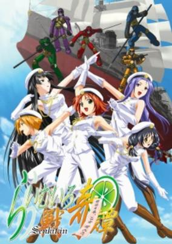

**Studio:** Studio Hibari &nbsp;|&nbsp; **Episodes:** 13 &nbsp;|&nbsp; **Director:** Iku Suzuki &nbsp;|&nbsp; **Aired/Released:** January 4 – March 29 &nbsp;|&nbsp; **Genres:** Mecha, Ecchi, Action, Harem, Historical

> Around the the 37th year of the Meiji Era (1904), in the midst of the Russo-Japanese war, the small Japanese army, in need of assistance, uses its special flying (thanks to a benevolent demon) ship, the Amanohara, to attack Russia's major base at Port Arthur (Lushun). Umakai Shintaro, a Russian diplomat originally from Japan, defects and goes to Sapporo to teach at a girls academy. However, that girls academy is not typical—it is on board the Amanohara, and the five girls Shintaro teaches are known as the Raimu Unit—girls with the ability to summon powerful beings to fight for them. Shintaro eventually becomes their teacher and general in battle, and so the six embark on a weird and excessively erotic journey, as Shintaro helps the girls overcome their weaknesses, become stronger for the final stand at Lushun, and also understand the motives of the "Russian Spiritual Corps" that assist the opponent, which, unfortunately, has one member whom Shintaro knew well...
>
> _Synopsis source: Kitsu_

[Wikipedia](https://en.wikipedia.org/wiki/Lime-iro_Senkitan) · [Kitsu](https://kitsu.io/anime/raimuiro-senkitan)

---

### Stratos 4

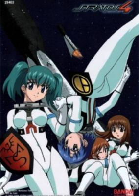

**Studio:** Studio Fantasia &nbsp;|&nbsp; **Episodes:** 13 &nbsp;|&nbsp; **Director:** Takeshi Mori &nbsp;|&nbsp; **Aired/Released:** January 5 – March 30 &nbsp;|&nbsp; **Genres:** Earth, Science Fiction, Ecchi, Japan, Action, Asia, Air Force, Parasite, Alien, Plot Continuity, Military, Comedy

> The Earth has developed a defense system against large meteorites that are on a collision course with it. This protection system is made up of the Comet Blasters based in several space stations as the 1st line of defense, using nuclear warheads launched by spaceships. The 2nd line of defense consists of the Meteor Sweepers launching from ground airbases using hypersonic planes with special missiles to deal with the resulting debris from the blasts. Mikaze is a troubled girl that is a trainee pilot for a Meteor Sweeper team that dreams of becoming a prestigious Comet Blaster pilot. Stratos 4 revolves around Mikaze's and her teammates' challenges to become real pilots, while the Earth faces the threats that come from space.
>
> _Synopsis source: Kitsu_

[Wikipedia](https://en.wikipedia.org/wiki/Stratos_4) · [Kitsu](https://kitsu.io/anime/stratos-4)

---

### Mr. Stain on Junk Alley

**Episodes:** 13 &nbsp;|&nbsp; **Director:** Ryuji Masuda &nbsp;|&nbsp; **Aired/Released:** January 6 – March 25 &nbsp;|&nbsp; **Genres:** Comedy

> Mr. Stain, an artist/inventor, and his cat friend, Palvan, have numerous adventures concerning art supplies and junk found in Junk Alley.
>
> _Synopsis source: Kitsu_

[Wikipedia](https://en.wikipedia.org/wiki/Mr._Stain_on_Junk_Alley) · [Kitsu](https://kitsu.io/anime/garakuta-doori-no-stain)

---

### Beyblade G-Revolution

**Studio:** Nippon Animation &nbsp;|&nbsp; **Episodes:** 52 &nbsp;|&nbsp; **Director:** Toshifumi Kawase Mitsuo Hashimoto &nbsp;|&nbsp; **Aired/Released:** January 6 – December 29

[Wikipedia](https://en.wikipedia.org/wiki/Beyblade_(manga))

---

### MØUSE

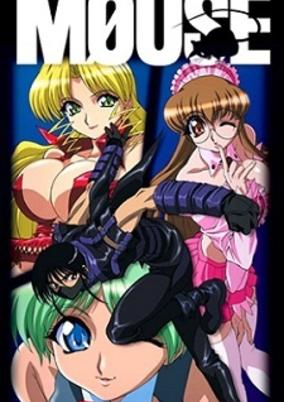

**Studio:** Studio Deen &nbsp;|&nbsp; **Episodes:** 12 &nbsp;|&nbsp; **Director:** Yorifusa Yamaguchi &nbsp;|&nbsp; **Aired/Released:** January 6 – March 24 &nbsp;|&nbsp; **Genres:** Earth, Science Fiction, Ecchi, Japan, Action, Asia, Thievery, Comedy, Maid, Present, Harem, Cops

> Teacher Sorata Muon carries on his family's centuries-old old tradition of being the master thief Mouse who can steal anything after properly alerting authorities of his intentions so they can be there yet fail to stop him. He is assisted by 3 nubile female assistants who also use the teaching cover and who, in typical Satoru Akahori, favor tight/skimpy/bondage outfits over their ample curves as they constantly pursue Sorata much more than he pursues them, although the girls do get some attention from their master. Not only is Mouse pursued by the girls &amp; the local law enforcement authorities, there is also a secret art protection society employing the services of a former ally of Sorata's after his pretty little hide, all in 15 minute episodes.
>
> _Synopsis source: Kitsu_

[Wikipedia](https://en.wikipedia.org/wiki/M%C3%98USE) · [Kitsu](https://kitsu.io/anime/mouse)

---

### Wolf's Rain

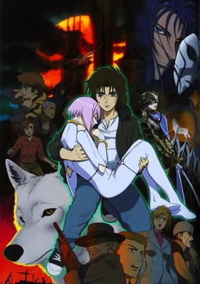

**Studio:** Bones &nbsp;|&nbsp; **Episodes:** 26 &nbsp;|&nbsp; **Director:** Tensai Okamura &nbsp;|&nbsp; **Aired/Released:** January 7 – July 29 &nbsp;|&nbsp; **Genres:** Post Apocalypse, Earth, Fantasy, Adventure, Action, Russia, Dystopia, Drama, Future, Plot Continuity, Science Fiction, Mystery

> In a dying world, there exists an ancient legend: when the world ends, the gateway to paradise will be opened. This utopia is the sole salvation for the remnants of life in this barren land, but the legend also dictates that only wolves can find their way to this mythical realm. Though long thought to be extinct, wolves still exist and live amongst humans, disguising themselves through elaborate illusions. A lone wolf named Kiba finds himself drawn by an intoxicating scent to Freeze City, an impoverished town under the rule of the callous Lord Orkham. Here, Kiba discovers that wolves Hige, Tsume, and Toboe have been drawn in by the same aroma. By following the fragrance of "Lunar Flowers," said to be the key to opening the door to their ideal world, the wolves set off on a journey across desolate landscapes and crumbling cities to find their legendary promised land. However, they are not the only ones seeking paradise, and those with more sinister intentions will do anything in their power to reach it first. [Written by MAL Rewrite]
>
> _Synopsis source: Kitsu_

[Wikipedia](https://en.wikipedia.org/wiki/Wolf%27s_Rain) · [Kitsu](https://kitsu.io/anime/wolf-s-rain)

---

### Licensed by Royalty

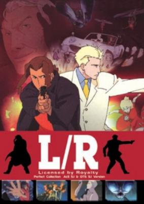

**Studio:** TNK &nbsp;|&nbsp; **Episodes:** 12 &nbsp;|&nbsp; **Director:** Itsuro Kawasaki &nbsp;|&nbsp; **Aired/Released:** January 8 – March 26 &nbsp;|&nbsp; **Genres:** Action, Special Squads, Detective, Conspiracy, Law And Order, Plot Continuity, Adventure, Cops, Mystery

> Jack Hofner and Rowe Rikenbacker are Cloud 7's L/R. Their job is to protect the Royal family of Ishtar, their treasures, and their reputation. Jack &amp; Rowe face one of the toughest missions of their career when they are assigned to protect Noelle, a candidate for the 15 Year Princesse contest. It starts out simple, but soon all of Cloud 7 are involved in a web of intrigue that includes bombings, corruption and murder.
>
> _Synopsis source: Kitsu_

[Wikipedia](https://en.wikipedia.org/wiki/Licensed_by_Royalty) · [Kitsu](https://kitsu.io/anime/licensed-by-royal)

---

### Machine Robo Rescue

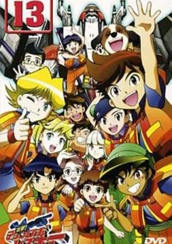

**Studio:** Sunrise &nbsp;|&nbsp; **Episodes:** 53 &nbsp;|&nbsp; **Director:** Mamoru Kanbe &nbsp;|&nbsp; **Aired/Released:** January 8 – January 3, 2004 &nbsp;|&nbsp; **Genres:** Science Fiction, Mecha, Action, Super Robot, Robot

> In the future, age is not a factor to determine whether someone can perform a certain task or not, but special talent and training. An organization, Machine Robo Rescue (MRR), was established for robots and children to become partner and rescue people from danger. Then 12 children with various abilities were selected and introduced as part of this program: Robo Rescue! Meet Oozora Taiyou, one of the children who were chosen as a part of MRR program. After being late on his first day of training, he went to perform a hot rescue with JETROBO. However, a mysterious Robot from mysterious organization, "The Star"(?), appeared before MRR team to interfere with the rescue. What are the motives of the mysterious organization? And what are their goals? Life as one of the children chosen as part of MRR has started for Oozora Taiyou. Bumpy and hard training is just ahead for MRR team in order to protect many people's life!
>
> _Synopsis source: Kitsu_

[Wikipedia](https://en.wikipedia.org/wiki/Machine_Robo_Rescue) · [Kitsu](https://kitsu.io/anime/shutsugeki-machine-robo-rescue)

---

### Nanaka 6/17

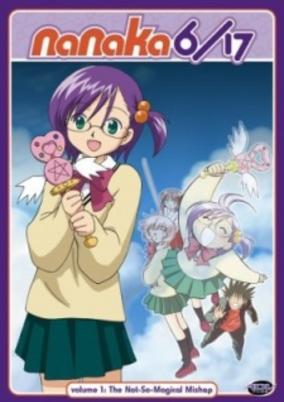

**Studio:** J.C.Staff &nbsp;|&nbsp; **Episodes:** 12 &nbsp;|&nbsp; **Director:** Hiroaki Sakurai &nbsp;|&nbsp; **Aired/Released:** January 9 – March 27 &nbsp;|&nbsp; **Genres:** Japan, Comedy, Love Polygon, School Life, Present, Romance, Slice of Life

> Seventeen-year-old Nanaka Kirisato is a high school student serious about her studies and goals in life. She frequently criticizes her best friend, Nenji Nagihara, for being a childish delinquent who spends his time fighting other boys. Then one day, after a heated argument with Nenji, she falls off a flight of stairs and suffers a brain injury, resulting in her mind reverting to that of a six-year-old. With this in mind, Nanaka's father and Nenji must keep her injury a secret as she struggles to live a normal life and grow up all over again.
>
> _Synopsis source: Kitsu_

[Wikipedia](https://en.wikipedia.org/wiki/Nanaka_6/17) · [Kitsu](https://kitsu.io/anime/nanaka-6-17)

---

### .hack//Legend Of The Twilight

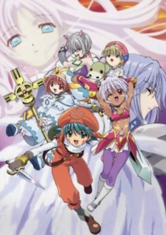

**Studio:** Bee Train &nbsp;|&nbsp; **Episodes:** 12 &nbsp;|&nbsp; **Director:** Kouji Sawai &nbsp;|&nbsp; **Aired/Released:** January 9 – March 27 &nbsp;|&nbsp; **Genres:** Science Fiction, Fantasy, Action, Comedy, Magic, Virtual Reality, Adventure

> Winning the legendary characters "Kite" and "Black Rose" from an event held by the creators of the MMORPG "The World," Shugo and his twin sister Rena steps into "The World." Together they completed events and quests, along with their new friends Ouka, Mirelle, Hotaru, and Sanjuro. Soon after, mysterious monsters appeared, and death by these monsters caused players to slip into a coma in the real world. Only Shugo and Rena can solve this problem, but why are they being targeted, and what secrets is the game hiding? [Written by MAL Rewrite]
>
> _Synopsis source: Kitsu_

[Wikipedia](https://en.wikipedia.org/wiki/.hack//Legend_Of_The_Twilight) · [Kitsu](https://kitsu.io/anime/hack-legend-of-the-twilight)

---

### Someday's Dreamers

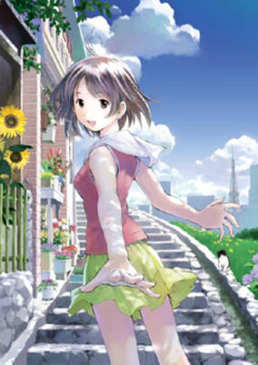

**Studio:** J.C.Staff &nbsp;|&nbsp; **Episodes:** 12 &nbsp;|&nbsp; **Director:** Masami Shimoda &nbsp;|&nbsp; **Aired/Released:** January 10 – March 28 &nbsp;|&nbsp; **Genres:** Fantasy, Japan, Contemporary Fantasy, Earth, Asia, Slice of Life, Magic, Alternative Present, Plot Continuity, Present

> Yume Kikuchi, a girl who can use magic, goes to Tokyo to be an apprentice mage to the handsome Masami Oyamada (a professional mage). In Tokyo, Yume learns about magic, helping people, and various other things on her way to being a mage. But she soon also finds out that even just magic alone isn't enough to make someone truly happy...
>
> _Synopsis source: Kitsu_

[Wikipedia](https://en.wikipedia.org/wiki/Someday%27s_Dreamers) · [Kitsu](https://kitsu.io/anime/mahou-tsukai-ni-taisetsu-na-koto)

---

### Transformers Armada

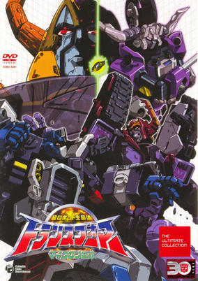

**Studio:** Actas &nbsp;|&nbsp; **Episodes:** 52 &nbsp;|&nbsp; **Director:** Hidehito Ueda &nbsp;|&nbsp; **Aired/Released:** January 10 – December 26 &nbsp;|&nbsp; **Genres:** Space Travel, Transforming Craft, Science Fiction, Mecha, Earth, Action, Other Planet, Alien, Robot Helper, Present, Space

> On the mechanical planet of Cybertron live super robotic organisms known as Transformers. There, mainly consisting of convoys, the Cybertron army, and their old enemy Destron fell into conflict to gain hold of a new power to join their side. A new breed of Transformers known as the Microns. But, grieving over the battle the Microns set off to the other end of the universe. 4 million years later, on Earth, 3 young children activated a mysterious panel inside a cave. And somehow, that was the dormant Micron...
>
> _Synopsis source: Kitsu_

[Kitsu](https://kitsu.io/anime/transformers-armada)

---

### Crush Gear Nitro

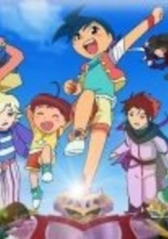

**Studio:** Sunrise &nbsp;|&nbsp; **Episodes:** 50 &nbsp;|&nbsp; **Director:** Hideharu Iuchi &nbsp;|&nbsp; **Aired/Released:** February 2 – January 25, 2004 &nbsp;|&nbsp; **Genres:** Science Fiction, Action, Motorsport, Sports

> Story about a young boy name: Mahha Masaru, who dreamt of having a crush gear fight with the others even though he doesn't have his very own crush gear! One day, a sudden chance came to him and he got the legendary crush gear which look similer to the one that was used by Kouya Marino and finally he can go and paticipate in his own crush gear fight with his friends and foe!!
>
> _Synopsis source: Kitsu_

[Wikipedia](https://en.wikipedia.org/wiki/Crush_Gear_Nitro) · [Kitsu](https://kitsu.io/anime/crush-gear-nitro)

---

### Ashita no Nadja (Tomorrow's Nadja)

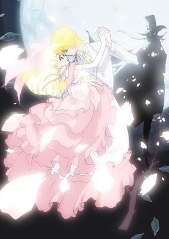

**Studio:** Toei Animation &nbsp;|&nbsp; **Episodes:** 50 &nbsp;|&nbsp; **Director:** Takuya Igarashi &nbsp;|&nbsp; **Aired/Released:** February 2 – January 25, 2004 &nbsp;|&nbsp; **Genres:** Steampunk, Romance, France, Italy, Earth, Asia, Performance, Europe, Conspiracy, Coming Of Age, Angst, Americas, Musical Band, Drama, Past, Plot Continuity, Historical, Adventure

> This story takes place about one hundred years ago. Nadja is a bright, cheerful girl who was raised in an orphanage near London, England. Nadja was entrusted to the orphanage when she was a baby. So she thought her father and mother were dead. But before her thirteenth birthday, she found out that her mother might be alive.. Nadja sets out on a journey to find her mother! With all of Europe as the stage, Nadja's exciting adventure begins!
>
> _Synopsis source: Kitsu_

[Wikipedia](https://en.wikipedia.org/wiki/Ashita_no_Nadja) · [Kitsu](https://kitsu.io/anime/ashita-no-nadja)

---

### Gunparade March (Gunparade March: A New Song for the March)

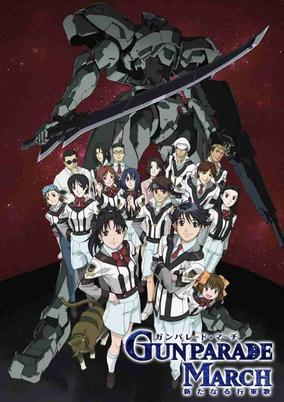

**Studio:** J.C.Staff &nbsp;|&nbsp; **Episodes:** 12 &nbsp;|&nbsp; **Director:** Katsushi Sakurabi &nbsp;|&nbsp; **Aired/Released:** February 6 – April 24 &nbsp;|&nbsp; **Genres:** Romance, Science Fiction, Mecha, Dystopia, Japan, Earth, Action, Asia, Piloted Robot, Slice of Life, High School, Alien, Drama, Friendship, Alternative Present, School Life, Present, Military

> It began in 1945, at the end of the Pacific War. Alien invaders filled the earth's Skies, and mankind was forced to confront an unprecedented threat. For the first time in human history, people of all cultures came together under one banner. This war has now been raging for over fifty years. Countless lives have been lost, and the Japanese military is now forced to rely on young people such as Atsushi Hayami and his high school class, also known as Unit 5121. This new generation fearlessly struggles on with the aid of the HWT humanoid combat machines and the devastating PBE bomb.
>
> _Synopsis source: Kitsu_

[Wikipedia](https://en.wikipedia.org/wiki/Gunparade_March) · [Kitsu](https://kitsu.io/anime/gunparade-march-arata-naru-kougunka)

---

### Tenshi no Shippo Chu!

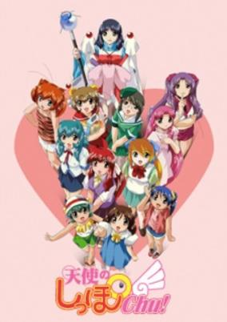

**Studio:** Tokyo Kids &nbsp;|&nbsp; **Episodes:** 11 &nbsp;|&nbsp; **Director:** Norio Kashima &nbsp;|&nbsp; **Aired/Released:** March 6 – April 3 &nbsp;|&nbsp; **Genres:** Romance, Contemporary Fantasy, Fantasy, Earth, Japan, Asia, Slice of Life, Love Polygon, Angel, Magic, Stereotypes, Present, Harem

> Somewhere, there was a young man. A kind hearted young man who loved animals but, the most unfortunate things happen to him. The place where he works going bankrupt, bumping into a signboard as he walks in the streets. He is just completely burdened with bad luck. However, his life completely changes when he meets a fortune teller. With the power of the fortune teller, "Guardian Angels" are called through a mobile phone and a group of cute girls appear. These Guardian Angels, who came from the other world, were actually reincarnations of the pets that the young man had once taken care of before. They are now back to repay his kindness. This sequel takes place a year after the last series. We go back to the time when the 12 Guardian Angels goes to Goro Mutsume. Once again, we have the voice talents of Nogawa Sakura, Chiba Saeko, Kawasumi Ayako and a whole extravanganza of other voice actors / actresses. Lets see how the Guardian Angels grow up!
>
> _Synopsis source: Kitsu_

[Wikipedia](https://en.wikipedia.org/wiki/Tenshi_no_Shippo_Chu!) · [Kitsu](https://kitsu.io/anime/tenshi-no-shippo-chu)

---

### Kappamaki (Kappamaki and the Sushi Kids)

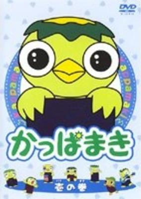

**Studio:** Trans Arts &nbsp;|&nbsp; **Episodes:** 130 &nbsp;|&nbsp; **Director:** Seiji Kishi &nbsp;|&nbsp; **Aired/Released:** March 31 – September 26 &nbsp;|&nbsp; **Genres:** Comedy, Slice of Life

> Kappamaki and his sushi friends are cute-cool-charming characters who soothe your grating feelings and heal your weary heart. They are all adorable characters originally made with clay by Miss Eri Okamoto. Kappamaki and the Sushi Kids are living in a small and peaceful village surrounded by unspoiled nature - flowers, fields, green forest with a crystal-clear river flowing through it. All the inhabitants including Kappamaki and his friends are naïve, honest and tenderhearted. There is a school, a park, houses, business offices and shops just like an ordinary small village anywhere. A friendly guy says that it is a typical Alpine village with the glamour of Paris and the atmosphere of Venice... Is it, really?! OK. Let's take a closer look... Oh, my goodness! The village looks as if it is made of sushi tools - The banks of the canals are sushi pails. The buildings are piled-up sushi baskets etc... This series of animated shorts is full of humorous mishaps and heart-warming tales giving smiles and chuckles to everybody. They are also educational and entertaining describing friendship and kindness. So, please enjoy the mind-healing tales in this fantasy land.
>
> _Synopsis source: Kitsu_

[Kitsu](https://kitsu.io/anime/kappamaki)

---

### E's Otherwise

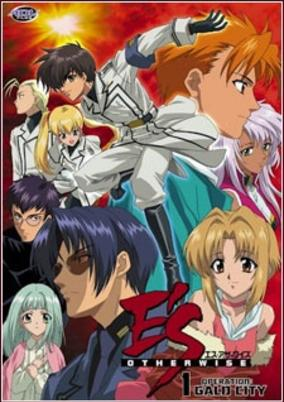

**Studio:** Pierrot &nbsp;|&nbsp; **Episodes:** 26 &nbsp;|&nbsp; **Director:** Masami Shimoda &nbsp;|&nbsp; **Aired/Released:** April 1 – September 23 &nbsp;|&nbsp; **Genres:** Science Fiction, Action, Future, Super Power, Adventure, Comedy, Military

> Kai, who has powers different from the rest, together with his sickly sister Hikaru was protected by an organization called ASHURUM. Scouted by Eiji, Kai was delegated to the ASHURUM special force AESES and undergo intensive training. Whenever he was free, Kai visited Hikaru at the hospital belongs to the organization, but Hikaru's condition never improved. So, one year later, with amazing growth from the intensive training, Kai decides to escape from the organization.
>
> _Synopsis source: Kitsu_

[Wikipedia](https://en.wikipedia.org/wiki/E%27s_Otherwise) · [Kitsu](https://kitsu.io/anime/e-s-otherwise)

---

### Air Master

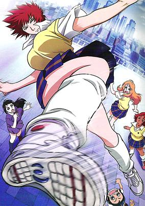

**Studio:** Toei Animation &nbsp;|&nbsp; **Episodes:** 27 &nbsp;|&nbsp; **Director:** Daisuke Nishio &nbsp;|&nbsp; **Aired/Released:** April 2 – October 1 &nbsp;|&nbsp; **Genres:** Earth, Ecchi, Japan, Action, Asia, Combat, Comedy, Shoujo Ai, Martial Arts, Plot Continuity, Violence, Present

> A former gymnast, Aikawa Maki has turned her skills to a different way of life - street fighting. The only thing that truly makes her feel alive is violence.
>
> _Synopsis source: Kitsu_

[Wikipedia](https://en.wikipedia.org/wiki/Air_Master) · [Kitsu](https://kitsu.io/anime/air-master)

---

### Bouken Yuuki Pluster World (Adventure Hero Pluster World)

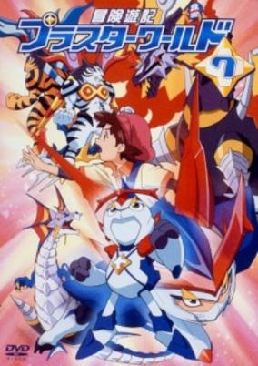

**Studio:** Actas Brain's Base &nbsp;|&nbsp; **Episodes:** 52 &nbsp;|&nbsp; **Director:** Yuji Himaki &nbsp;|&nbsp; **Aired/Released:** April 3 – March 25, 2004 &nbsp;|&nbsp; **Genres:** Science Fiction, Action

> Sent to a strange world, a young boy must team up with monsters, becoming one with them to battle evil.
>
> _Synopsis source: Kitsu_

[Wikipedia](https://en.wikipedia.org/wiki/Pluster_World) · [Kitsu](https://kitsu.io/anime/bouken-yuuki-pluster-world)

---

### Kaleido Star

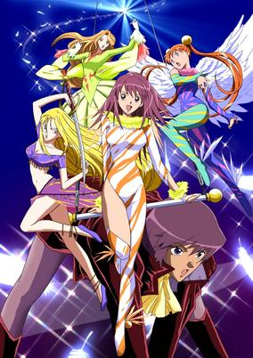

**Studio:** Gonzo &nbsp;|&nbsp; **Episodes:** 51 &nbsp;|&nbsp; **Director:** Junichi Satō Yoshimasa Hiraike (Season 2) &nbsp;|&nbsp; **Aired/Released:** April 3 – March 27, 2004 &nbsp;|&nbsp; **Genres:** Earth, Sports, Comedy, Performance, United States, Coming Of Age, Americas, Slapstick, Plot Continuity, Present, Fantasy

> As a talented young acrobat, Sora has dreamed of sharing a stage with the performers of Kaleido Stage, a world renowned circus that combines graceful acrobatics, dazzling costumes, and stunts that keep audiences on the edge of their seats. She makes the move from Japan to California to audition for the show, in hopes of one day basking in the glitz and glamour. However, finding her place in such a competitive world will not be easy. Sora will shed blood, sweat, and tears on her path to becoming a performer, buoyed by the friends she makes along the way. Of course, there will also be rivals and other individuals who do not believe Sora has what it takes to shine as brightly as Kaleido Stage needs her to. Sora will need to endure these trials and tribulations in her quest to become a star, earning the respect of both those who doubt her abilities and by those who are threatened by her. Watch as Sora flies through the bright lights in Kaleido Star!
>
> _Synopsis source: Kitsu_

[Wikipedia](https://en.wikipedia.org/wiki/Kaleido_Star) · [Kitsu](https://kitsu.io/anime/kaleido-star)

---

### Uchuu no Stellvia (Stellvia of the Universe)

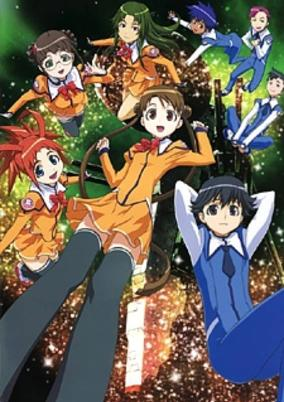

**Studio:** Xebec &nbsp;|&nbsp; **Episodes:** 26 &nbsp;|&nbsp; **Director:** Tatsuo Satō &nbsp;|&nbsp; **Aired/Released:** April 3 – September 25 &nbsp;|&nbsp; **Genres:** Romance, Science Fiction, Action, Shipboard, Future, Disaster, Space

> The year is 2356 A.D. - 189 years after a distant supernova caused a global catastrophe that wiped out 99% of the world population. To keep track on all space activities, mankind has built colossal space stations called "foundations" all over the Solar System. After passing the Space Academy entrance exams, Shima Katase embarks to the Earth-based foundation Stellvia to fulfill her dream of seeing the galaxy and to prevent another interstellar catastrophe from destroying Earth.
>
> _Synopsis source: Kitsu_

[Wikipedia](https://en.wikipedia.org/wiki/Uchuu_no_Stellvia) · [Kitsu](https://kitsu.io/anime/uchuu-no-stellvia)

---

### D.N.Angel

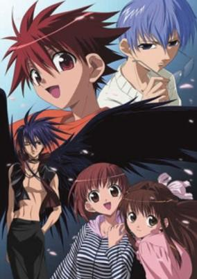

**Studio:** Xebec &nbsp;|&nbsp; **Episodes:** 26 &nbsp;|&nbsp; **Director:** Keiji Gotō (ep 20) Kōji Yoshikawa Nobuyoshi Habara &nbsp;|&nbsp; **Aired/Released:** April 3 – September 25 &nbsp;|&nbsp; **Genres:** Earth, Action, Fantasy, Thievery, Slice of Life, Comedy, Crime, Love Polygon, Angel, Coming Of Age, Angst, Magic, Alternative Present, School Life, Super Power, Romance

> Daisuke Niwa is a clumsy, block-headed, and wimpy middle school student who has few redeeming qualities. On his 14th birthday, he finally decides to confess his love to his longtime crush Risa Harada, but is rejected. In an unexpected turn of events, however, Daisuke finds himself transforming into Dark Mousy, the infamous phantom thief, whenever his mind is set on Risa. Though Daisuke is unaware of this strange heritage, his mother is certainly not: since before the boy was born, his mother had been planning for him to steal valuable works of art and let the name of the elusive art thief be known. With doubt and confusion constantly clouding his mind, Daisuke finds himself struggling in his relationships with classmates and family. And it is not long before Daisuke realizes that he is not the only one with a fated family legacy—his greatest adversary could be the one classmate he is most unwilling to fight. [Written by MAL Rewrite]
>
> _Synopsis source: Kitsu_

[Wikipedia](https://en.wikipedia.org/wiki/D.N.Angel) · [Kitsu](https://kitsu.io/anime/d-n-angel)

---

### Mugen Senki Portriss

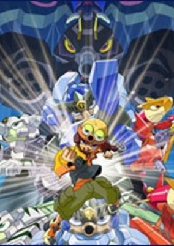

**Studio:** Sunrise Dongwoo A&E &nbsp;|&nbsp; **Episodes:** 52 &nbsp;|&nbsp; **Director:** Akira Shigino Jongsik Nam &nbsp;|&nbsp; **Aired/Released:** April 5 – March 27, 2004 &nbsp;|&nbsp; **Genres:** Science Fiction, Mecha, Action

> In a raving world, legendary knights stood up. Will they become gods of war or world saviors? Three Portriss Knights and sole human boy are now going to change the World! Portriss Planet, home of where robots live in peace. However, this peacefulness was ruined by the sudden appearance of a Dictator "Dark Portriss". Dark Portriss plans to attain infinite powers through the use of the "Space-time destroying Cannon". The only ones able to stop this are the Portriss Knights! A boy, Yuuma, accidentally got into the Portriss World, and the Portrisses` adventure begins!
>
> _Synopsis source: Kitsu_

[Wikipedia](https://en.wikipedia.org/wiki/Tank_Knights_Fortress) · [Kitsu](https://kitsu.io/anime/mugen-senki-portriss)

---

### Mermaid Melody: Pichi Pichi Pitch

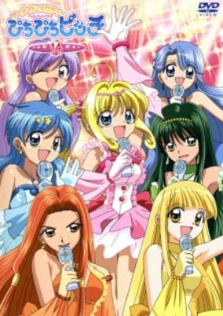

**Studio:** Actas SynergySP &nbsp;|&nbsp; **Episodes:** 52 &nbsp;|&nbsp; **Director:** Yoshitaka Fujimoto &nbsp;|&nbsp; **Aired/Released:** April 5 – March 27, 2004 &nbsp;|&nbsp; **Genres:** Earth, Romance, Fantasy, Contemporary Fantasy, Japan, Asia, Slice of Life, Mermaid, Magic, Magical Girl, Present, Music, Adventure, Comedy

> As the mermaid princess of the North Pacific (one of the seven mermaid kingdoms), Lucia entrusts a magical pearl to a boy who falls overboard a ship one night. Lucia must travel to the human world to reclaim her pearl and protect the mermaid kingdoms. Using the power of music Lucia is able to protect herself and the mermaid kingdoms from a growing evil force.
>
> _Synopsis source: Kitsu_

[Wikipedia](https://en.wikipedia.org/wiki/Mermaid_Melody_Pichi_Pichi_Pitch) · [Kitsu](https://kitsu.io/anime/mermaid-melody-pichi-pichi-pitch)

---

### Zentrix

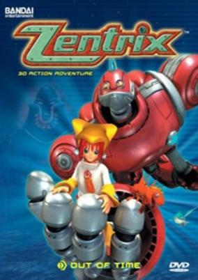

**Studio:** Madhouse &nbsp;|&nbsp; **Episodes:** 26 &nbsp;|&nbsp; **Director:** Felix Ip Tony Tang &nbsp;|&nbsp; **Aired/Released:** April 5 – September 27 &nbsp;|&nbsp; **Genres:** Science Fiction, Mecha, Adventure

> The series is set in Zentrix City, a seemingly "perfect" city. Emperor Jarad is a scientist who with the help of scientists Dr. Roark and Dr. Coy, created a super-computer called OmnicronPsy, which manages all of the city's higher and day-to-day functions, controlling a wide variety of machines and robots, allowing humankind to live a seemingly "perfect" life. However OmnicronPsy, using His super-intelligence, decides that it would make a better ruler than Jarad, and starts to break down the coding that stops him from revolting and harming the Royal Family. Discovering this, Jarad and Dr. Roark head back in time 7 years to stop the revolt from ever happening. To accomplish this they plan to shut down the six Zentrium chips that power OmnicronPsy. Upon discovering this, Jarad's daughter and only heir, Princess Megan, proceeds to follow him to the past while OmnicronPsy concurrently undoes his restriction codes and sends his Robo Guards to hunt her down.
>
> _Synopsis source: Kitsu_

[Wikipedia](https://en.wikipedia.org/wiki/Zentrix) · [Kitsu](https://kitsu.io/anime/jikuu-boukenki-zentrix)

---

### Mousou Kagaku Series: Wandaba Style

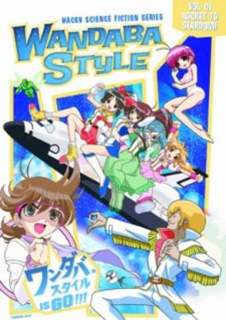

**Studio:** TNK &nbsp;|&nbsp; **Episodes:** 12 &nbsp;|&nbsp; **Director:** Yoshihiro Takamoto &nbsp;|&nbsp; **Aired/Released:** April 5 – June 21 &nbsp;|&nbsp; **Genres:** Earth, Ecchi, Space Travel, Science Fiction, Japan, Asia, Comedy, Present, Android, Idol

> Genius scientist Tsukumo Susumu knows each and every single theory behind aerodynamics that exists on earth despite being only 13 years old. He wants to travel to the moon without the use of fossil fuels that power rockets. So begins his heavy research using his knowledge in the laws of physics, scientific theory and his wild imagination. His test subjects are the unpopular idol group Mix JUICE (Himawari, Yuri, Ayame, Sakura). They come up with all sorts of crazy ideas to become the first humans to successfully hold a concert on the face of the moon. Will the four girls from Mix JUICE be able to struggle their way to the moon successfully?
>
> _Synopsis source: Kitsu_

[Wikipedia](https://en.wikipedia.org/wiki/Wandaba_Style) · [Kitsu](https://kitsu.io/anime/wandaba-style)

---

### Mythical Detective Loki Ragnarok

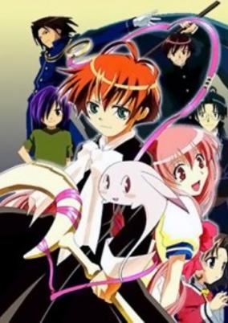

**Studio:** Studio Deen &nbsp;|&nbsp; **Episodes:** 26 &nbsp;|&nbsp; **Director:** Hiroshi Watanabe &nbsp;|&nbsp; **Aired/Released:** April 5 – September 27 &nbsp;|&nbsp; **Genres:** Contemporary Fantasy, Detective, Magic, Comedy, Mystery

> Loki, the Norse god of mischief, has been exiled to the human world for what was apparently a bad joke. Along with being exiled, he's forced to take the form of a child. He's told the only way he can get back to the world of the gods is if he can collect auras of evil that take over human hearts, and so to do this he runs a detective agency. Loki is soon joined by a human girl named Mayura who is a maniac for mysteries, and she soon helps out in her own way. However, soon other Norse gods begin to appear, and most have the intent to assassinate Loki for reasons unclear.
>
> _Synopsis source: Kitsu_

[Wikipedia](https://en.wikipedia.org/wiki/Mythical_Detective_Loki_Ragnarok) · [Kitsu](https://kitsu.io/anime/matantei-loki-ragnarok)

---

### Firestorm

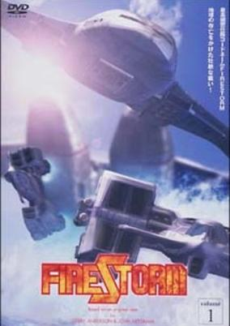

**Studio:** Trans Arts &nbsp;|&nbsp; **Episodes:** 26 &nbsp;|&nbsp; **Director:** Kenji Terada &nbsp;|&nbsp; **Aired/Released:** April 6 – September 28 &nbsp;|&nbsp; **Genres:** Earth, Science Fiction, Mecha, Action, Humanoid Alien, Alien, Navy, Future, Military

> It is the year 2104 AD. The terrible war is over and peace seemed close in the world. However, there is one thing that can bring down this peace. That is the criminal organisation who's power and actions are widespread across the world... The Black Orchid. From the main countries of the world, the "Storm Force" was formed to take down the Black Orchid. They are also known under the code name "Fire Storm".
>
> _Synopsis source: Kitsu_

[Wikipedia](https://en.wikipedia.org/wiki/Firestorm_(TV_series)) · [Kitsu](https://kitsu.io/anime/firestorm)

---

### Astro Boy (Astro Boy (2003))

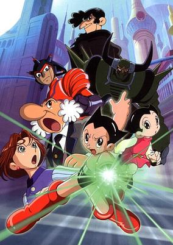

**Studio:** Tezuka Productions &nbsp;|&nbsp; **Episodes:** 50 &nbsp;|&nbsp; **Director:** Kazuya Konaka Keiichirō Mochizuki (ep 1) &nbsp;|&nbsp; **Aired/Released:** April 6 – March 28, 2004 &nbsp;|&nbsp; **Genres:** Science Fiction, Mecha, Action, Super Power, Adventure, Kids

> Astro is a robotic boy that posses super human powers and an artificial intelligence system that is unparalleled to any robot. His creator, Dr. Tenma, created him to replace his late son, Tovio. Dr. Tenma soon destroys his laboratory, after the creation of Astro, and shuts down Astro. Soon after, Dr. O'Shay, the head of the Ministry of Science revives Astro, and tries to give him a normal life as a 6th grade student that helps the police agency keep renegade robots and bigot humans from causing harm. Astro faces extreme racism for being a robot, and he must discover the truth about his creator Dr. Tenma.
>
> _Synopsis source: Kitsu_

[Wikipedia](https://en.wikipedia.org/wiki/Astro_Boy_(2003_TV_series)) · [Kitsu](https://kitsu.io/anime/astro-boy-2003)

---

### Zatch Bell!

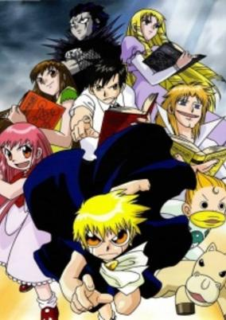

**Studio:** Toei Animation &nbsp;|&nbsp; **Episodes:** 150 &nbsp;|&nbsp; **Director:** Tetsuji Nakamura Yukio Kaizawa &nbsp;|&nbsp; **Aired/Released:** April 6 – March 26, 2006 &nbsp;|&nbsp; **Genres:** Japan, Action, Comedy, Magic, Proxy Battles, Slapstick, Present, Demon, Super Power, Adventure, Friendship

> Takamine Kiyomaro, a depressed don't-care-about-the-world guy, was suddenly given a little demon named Gash Bell to take care of. Little does he know that Gash is embroiled into an intense fight to see who is the ruler of the demon world. All of the demons have to pick a master on Earth and duke it out with other demons until one survives. Needless to say, Kiyomaro becomes Gash's master, and through their many battles, Kiyomaro learns the importance of friendship and courage.
>
> _Synopsis source: Kitsu_

[Wikipedia](https://en.wikipedia.org/wiki/Zatch_Bell!) · [Kitsu](https://kitsu.io/anime/konjiki-no-gash-bell)

---

### Human Crossing

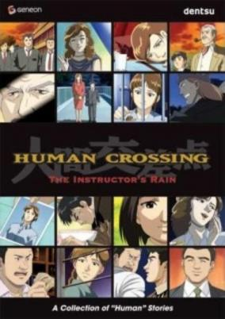

**Studio:** A.C.G.T . &nbsp;|&nbsp; **Episodes:** 13 &nbsp;|&nbsp; **Director:** Akira Kumeichi Kazunari Kume Kazunari Kumi &nbsp;|&nbsp; **Aired/Released:** April 6 – June 29 &nbsp;|&nbsp; **Genres:** Earth, Romance, Japan, Slice of Life, School Life, Present, Sports

> Though seemingly unconnected, the characters in HUMAN CROSSING all have something in common. They are dealing with the sometimes joyous, but often horrific realities of everyday life. Set in modern day Japan, this compilation of short stories explores the lives of people from all walks of life. The animation used here is subtle, with realistic renderings that fully express the range of emotions experienced by the film`s characters. HUMAN CROSSING taps into the dramatic potential of reality, focusing on the isolated, sometimes lonely nature of urban life. Ultimately, however, the film suggests that perhaps there is an inter-connectedness between people that binds even the most disparate strangers together.
>
> _Synopsis source: Kitsu_

[Wikipedia](https://en.wikipedia.org/wiki/Human_Crossing) · [Kitsu](https://kitsu.io/anime/human-crossing)

---

### Sonic X

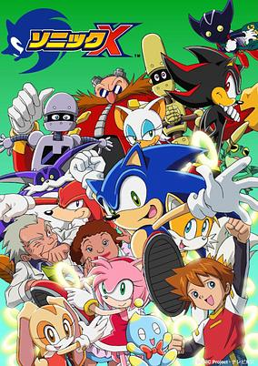

**Studio:** TMS Entertainment &nbsp;|&nbsp; **Episodes:** 78 &nbsp;|&nbsp; **Director:** Hajime Kamegaki &nbsp;|&nbsp; **Aired/Released:** April 6 – March 28, 2004 &nbsp;|&nbsp; **Genres:** Science Fiction, Action, Comedy, Time Travel, Mecha, Adventure, Kids

> Back on Sonic's home planet, Eggman has collected all 7 of the Chaos Emeralds, and is about to have absolute power when Sonic interferes, causing an explosion that sends everyone from their world to Earth. Sonic and his friends team up with 12 year old Christopher Thorndyke to collect all the Chaos Emeralds and defeat the evil Dr. Eggman.
>
> _Synopsis source: Kitsu_

[Wikipedia](https://en.wikipedia.org/wiki/Sonic_X) · [Kitsu](https://kitsu.io/anime/sonic-x)

---

### Di Gi Charat Nyo!

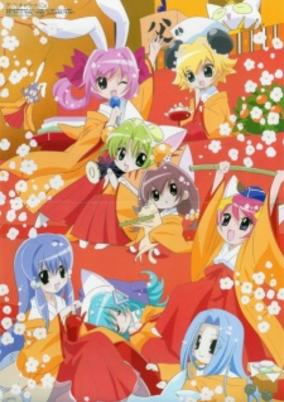

**Studio:** Madhouse &nbsp;|&nbsp; **Episodes:** 104 &nbsp;|&nbsp; **Director:** Hiroaki Sakurai &nbsp;|&nbsp; **Aired/Released:** April 6 – March 28, 2004 &nbsp;|&nbsp; **Genres:** Comedy, Science Fiction, Fantasy

> Di Gi Charat (a.k.a. Dejiko) - along with Petit Charat (a.k.a. Puchiko) and Gema - travels to Earth as part of her training to become a full-fledged princess. They crash on a small town in Japan, where they meet the Omocha brothers (who spend most of their time thinking how cute Puchiko is) and Mr. &amp; Mrs. Ankoro (an elderly couple that makes Japanese sweets).
>
> _Synopsis source: Kitsu_

[Wikipedia](https://en.wikipedia.org/wiki/Di_Gi_Charat_Nyo!) · [Kitsu](https://kitsu.io/anime/di-gi-charat-nyo)

---

### Dear Boys (Hoop Days)

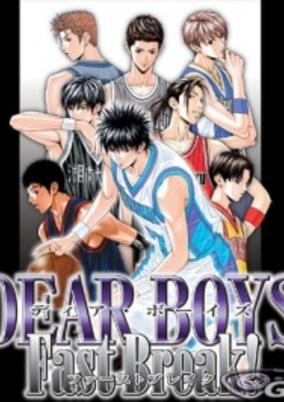

**Studio:** A.C.G.T . &nbsp;|&nbsp; **Episodes:** 26 &nbsp;|&nbsp; **Director:** Susumu Kudo &nbsp;|&nbsp; **Aired/Released:** April 7 – September 29 &nbsp;|&nbsp; **Genres:** Earth, Basketball, Japan, Action, Asia, Sports, School Clubs, School Life, Present

> Aikawa Kazuhiko was the captain of Tendoji high school prestigious basketball team. He moves into a new town to attend Mizuho high school and joins its basketball team. However, Mizuho high's basketball team is far from being prestigious, in fact, it's now defunct. Nevertheless to say, Kazuhiko's persistence, passion and basketball skills inspired other team members of the dysfunctional basketball team to gear up and start practicing again. The goal is to play in the national tournaments where all young basketball players meet their opponents to compete with them. The tale of youth of the five protagonists: Fujiwara Takumi, Ishii Tsutomu, Dobashi Kenji, Miura Ranmaru and Aikawa Kazuhiko have just began along with the live of Mizuho high school basketball team.
>
> _Synopsis source: Kitsu_

[Wikipedia](https://en.wikipedia.org/wiki/Dear_Boys) · [Kitsu](https://kitsu.io/anime/dear-boys)

---

### Croket!

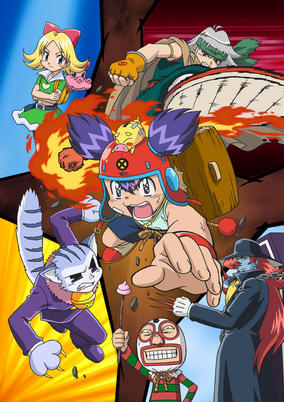

**Studio:** OLM &nbsp;|&nbsp; **Episodes:** 104 &nbsp;|&nbsp; **Director:** Naohito Takahashi &nbsp;|&nbsp; **Aired/Released:** April 7 – March 27, 2005 &nbsp;|&nbsp; **Genres:** Fantasy, Comedy, Action, Adventure, Slapstick, Kids, Shounen, Friendship, Plot Continuity

> The "Forbidden Treasure" is an extraordinary artefact who can grant any wishes. The people seeking it are called the Bankers, and our hero, Corokke, is one of them.
>
> _Synopsis source: Kitsu_

[Wikipedia](https://en.wikipedia.org/wiki/Croket!) · [Kitsu](https://kitsu.io/anime/corokke)

---

### Last Exile

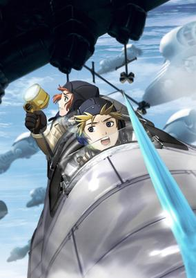

**Studio:** Gonzo &nbsp;|&nbsp; **Episodes:** 26 &nbsp;|&nbsp; **Director:** Koichi Chigira &nbsp;|&nbsp; **Aired/Released:** April 8 – September 30 &nbsp;|&nbsp; **Genres:** Fantasy, Science Fiction, Steampunk, Fantasy World, Action, Air Force, War, Military, Adventure

> In the world of Prester, flight is the dominant mode of transportation, made possible by Claudia Fluid: a liquidized form of the crystals that are produced on the planet. An organization known solely as "the Guild" has absolute authority over the skies, with a monopoly on the engines that make use of this fluid. Moreover, as ecological disasters destabilize the warring countries of Anatoray and Disith, the Guild also arbitrates in the disputes between the two. Caught in the middle of the conflict are Sky Couriers, piloting small, two-person vanships that fly freely through the sky. Last Exile follows the adventures of two teenagers who dream of surpassing their parents: Claus Valca, son of a famous vanship pilot, and Lavie Head, Claus' best friend and navigator. Their job as couriers entails passing through an air current called the Grand Stream that separates the hostile nations, which even standard airships struggle to survive. However, when they take on a high-rated delivery to bring an orphan girl named Alvis Hamilton to the battleship Silvana, they get dragged into a much greater conflict that pits them against the might of the Guild.
>
> _Synopsis source: Kitsu_

[Wikipedia](https://en.wikipedia.org/wiki/Last_Exile) · [Kitsu](https://kitsu.io/anime/last-exile)

---

### Kino's Journey

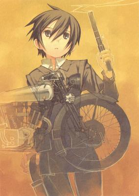

**Studio:** A.C.G.T . &nbsp;|&nbsp; **Episodes:** 13 &nbsp;|&nbsp; **Director:** Ryutaro Nakamura &nbsp;|&nbsp; **Aired/Released:** April 8 – July 8 &nbsp;|&nbsp; **Genres:** Fantasy, Steampunk, Dystopia, Adventure, Fantasy World, The Arts, Action, Slice of Life

> Based on a hit light novel series by Keiichi Sigsawa, the philosophical Kino's Journey employs the time-honored motif of the road trip as a vehicle for self-discovery and universal truth. Deeply meditative and cooler than zero, the series follows the existential adventures of the apt marksman Kino along with talking motorcycle Hermes as they travel the world and learn much about themselves in the process. Imaginative, thought-provoking, and sometimes disturbing, Kino's journey is documented in an episodic style with an emphasis on atmosphere rather than action or plot, though still prevalent.
>
> _Synopsis source: Kitsu_

[Wikipedia](https://en.wikipedia.org/wiki/Kino%27s_Journey) · [Kitsu](https://kitsu.io/anime/kino-no-tabi-the-beautiful-world)

---

### Scrapped Princess

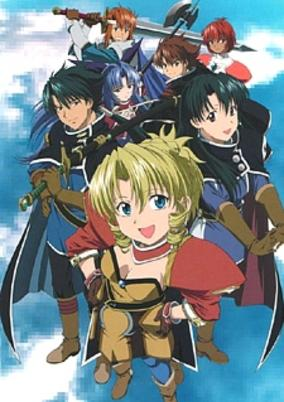

**Studio:** Bones &nbsp;|&nbsp; **Episodes:** 24 &nbsp;|&nbsp; **Director:** Sōichi Masui &nbsp;|&nbsp; **Aired/Released:** April 8 – October 7 &nbsp;|&nbsp; **Genres:** Earth, Post Apocalypse, Fantasy, Science Fiction, Action, Religion, Swordplay, High Fantasy, Magic, Future, Plot Continuity, Super Power, Mecha, Adventure, Comedy

> Pacifica Casull is the most feared and hated person by the followers of the God Mauser. Known as the Scrapped Princess, she is the poison that will destroy the world. To avoid being killed by the zealots of Mauser, Pacifica and her adoptive brother and sister leave the village of Manhurin. Her brother, Shannon, is an expert with the sword while Racquel is proficient with magic. At every step of the way, however, someone is constantly trying to kill Pacifica, hoping to somehow avert the catastrophe that is supposed to befall the world on her 16th birthday.
>
> _Synopsis source: Kitsu_

[Wikipedia](https://en.wikipedia.org/wiki/Scrapped_Princess) · [Kitsu](https://kitsu.io/anime/scrapped-princess)

---

### Kasumin (Season 3)

**Studio:** OLM &nbsp;|&nbsp; **Episodes:** 26 &nbsp;|&nbsp; **Director:** Mitsuru Hongo &nbsp;|&nbsp; **Aired/Released:** April 9 – October 1

[Wikipedia](https://en.wikipedia.org/wiki/Kasumin)

---

### Wonder Bebil-kun

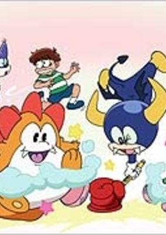

**Studio:** Radix &nbsp;|&nbsp; **Episodes:** 30 &nbsp;|&nbsp; **Director:** Takahiro Ōmori &nbsp;|&nbsp; **Aired/Released:** April 11 – February 6, 2004 &nbsp;|&nbsp; **Genres:** Comedy, Fantasy

> No synopsis has been added for this series yet.Click here to update this information.
>
> _Synopsis source: Kitsu_

[Kitsu](https://kitsu.io/anime/wonder-bebil-kun)

---

### Narue no Sekai (The World of Narue)

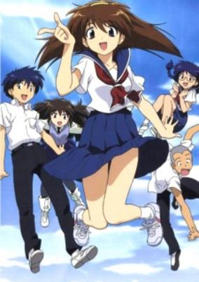

**Studio:** Studio Live &nbsp;|&nbsp; **Episodes:** 12 &nbsp;|&nbsp; **Director:** Toyoo Ashida &nbsp;|&nbsp; **Aired/Released:** April 12  – June 28 &nbsp;|&nbsp; **Genres:** Earth, Romance, Science Fiction, Japan, Asia, Comedy, Sudden Girlfriend Appearance, Humanoid Alien, Present

> Meet Narue, an adorable schoolgirl with a secret. She's really an alien with powers right out of a sci-fi comic! But growing up is never easy, and sometimes it doesn't help when you're from outer space. Join our spunky heroine as she faces androids, alien invaders, and her first date with the boy next door. It's the sci-fi comedy that's a direct hit to your heart!
>
> _Synopsis source: Kitsu_

[Wikipedia](https://en.wikipedia.org/wiki/Narue_no_Sekai) · [Kitsu](https://kitsu.io/anime/narue-no-sekai)

---

### Ninja Scroll: The Series

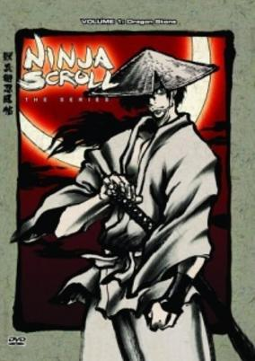

**Studio:** Madhouse &nbsp;|&nbsp; **Episodes:** 13 &nbsp;|&nbsp; **Director:** Tatsuo Satō &nbsp;|&nbsp; **Aired/Released:** April 15 – July 15 &nbsp;|&nbsp; **Genres:** Ninja, Ecchi, Fantasy, Action, Swordplay, Martial Arts, Dark Fantasy, Violence, Samurai, Demon, Magic, Adventure, Horror

> Fourteen years after defeating the immortal warrior Himuro Genma and thwarting the Shogun of the Dark's evil plans, Kibagami Jubei continues to roam all over Japan as a masterless swordsman. During his journey, he meets Shigure, a priestess who has never seen the world outside her village. But when a group of demons destroys the village and kills everyone, Jubei becomes a prime target after acquiring the Dragon Jewel—a stone with an unknown origin. Meanwhile, Shigure—along with the monk Dakuan and a young thief named Tsubute—travels to the village of Yagyu. And with two demon clans now hunting down Shigure, Dakuan must once again acquire the services of Jubei to protect the Priestess of Light.
>
> _Synopsis source: Kitsu_

[Kitsu](https://kitsu.io/anime/juubee-ninpuuchou-ryuuhougyoku-hen)

---

### Tantei Gakuen Q (Detective School Q)

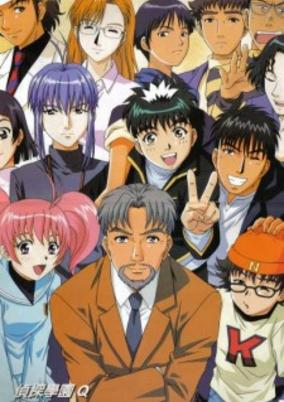

**Studio:** Pierrot &nbsp;|&nbsp; **Episodes:** 45 &nbsp;|&nbsp; **Director:** Noriyuki Abe &nbsp;|&nbsp; **Aired/Released:** April 15 – March 20, 2004 &nbsp;|&nbsp; **Genres:** Earth, Japan, Asia, Detective, Stereotypes, School Life, Present, Comedy, Cops, Mystery

> Kyuu is your average boy with a knack for logic and reasoning. Desiring to become a detective, he finds out about the existence of the Dan Detective School (DDS); a famed school where students are allowed to bear arms. Together with Megu, a girl with photographic memory, the martial arts master Kinta, the genius programmer Kazuma and the mysterious Ryuu, Kyuu tackles many well planned out crimes, always seeking the truth.
>
> _Synopsis source: Kitsu_

[Wikipedia](https://en.wikipedia.org/wiki/Detective_School_Q) · [Kitsu](https://kitsu.io/anime/tantei-gakuen-q)

---

### Gad Guard

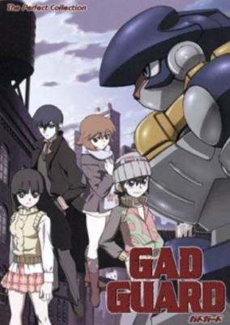

**Studio:** Gonzo &nbsp;|&nbsp; **Episodes:** 26 &nbsp;|&nbsp; **Director:** Hiroshi Nishikiori &nbsp;|&nbsp; **Aired/Released:** April 16 – September 25 &nbsp;|&nbsp; **Genres:** Science Fiction, Mecha, Action, Future, Adventure

> Several hundred years in the future, the resources of the Earth runs out, and the progression of the human race has stagnated. The world is now divided into "Units". A boy named Hajiki Sanada lives with his mother and sister in Unit 74, in a place called "Night Town", in which all electricity is shut down at midnight. The key in this story is an object called the GAD. GADs have the ability to reconstruct materials while reacting to feelings of an organic life. The size and shape of the resulting product seem to be different depending on the kinds of feelings that the life possesses. When Hajiki comes in contact with one by accident, it transforms into a huge robot--a Tekkoudo, or "Iron Giant"--which Hajiki names Lightning. And soon he realizes that he isn't the only one with a Tekkoudo, and must find out how to deal with those others who he feels are the "same" as himself.
>
> _Synopsis source: Kitsu_

[Wikipedia](https://en.wikipedia.org/wiki/Gad_Guard) · [Kitsu](https://kitsu.io/anime/gad-guard)

---

### Texhnolyze

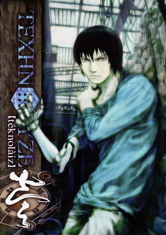

**Studio:** Madhouse &nbsp;|&nbsp; **Episodes:** 22 &nbsp;|&nbsp; **Director:** Hiroshi Hamasaki &nbsp;|&nbsp; **Aired/Released:** April 17 – September 25 &nbsp;|&nbsp; **Genres:** Science Fiction, Dystopia, Action, Gunfights, Cyberpunk, Drama, Violence, Psychological

> Cult-favorite Yoshitoshi ABe tempts us to witness man's downward spiral in a future overrun by violence, greed, and depravity. After Ichise loses an arm and leg, he's equipped with experimental robotic limbs against his will. When an army of men transformed into terrifying machines invades his city, Ichise rages against humanity's demise—but can his actions actually be the catalyst?
>
> _Synopsis source: Kitsu_

[Wikipedia](https://en.wikipedia.org/wiki/Texhnolyze) · [Kitsu](https://kitsu.io/anime/texhnolyze)

---

### Umeyon Ekisu

**Studio:** TMS Entertainment &nbsp;|&nbsp; **Episodes:** 13 &nbsp;|&nbsp; **Aired/Released:** May 2 – July 27

---

### Submarine Super 99

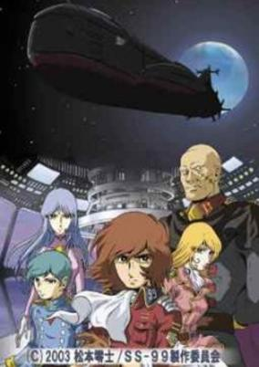

**Studio:** Vega Entertainment &nbsp;|&nbsp; **Episodes:** 13 &nbsp;|&nbsp; **Director:** Hiromichi Matano &nbsp;|&nbsp; **Aired/Released:** May 8 – July 31 &nbsp;|&nbsp; **Genres:** Earth, Science Fiction, Action, Navy, Future, Military, Adventure

> Dr. Oki , the genius scientist who designed a new type of submarine is missing. His son, Susumu, smells an evil scheme of unknown group. He knows everything of his father's submarine called "Super 99" – equipment, weapons, functions and capacity. Susumu thinks that to find his father is to reveal the secret organization, Helmet Party, and stop their conspiracy. With the help of his friends and Marine Corps, he sets out to an underwater quest, not knowing how dangerous his endeavour is…
>
> _Synopsis source: Kitsu_

[Wikipedia](https://en.wikipedia.org/wiki/Submarine_Super_99) · [Kitsu](https://kitsu.io/anime/submarine-super-99)

---

### Saint Beast : Seijuu Kourin-hen

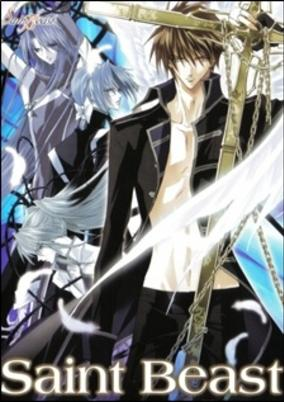

**Studio:** Tokyo Kids &nbsp;|&nbsp; **Episodes:** 6 &nbsp;|&nbsp; **Director:** Harume Kosaka &nbsp;|&nbsp; **Aired/Released:** May 8 – June 13 &nbsp;|&nbsp; **Genres:** Earth, Fantasy, Action, Bishounen, Angel, Magic, Shounen Ai

> The seal which was imprisoning the fallen angels, Kirin no Yuda and Houou no Ruka, is broken and the two decide to get revenge on the God who had cast them to Hell by getting rid of the Heavens that had once been their home. Soon the guardian angels on Earth begin disappearing, and no one in Heaven can explain the happenings. But there is a sense of a vengeful animal spirit at work, and so the four Saint Beasts are called upon to investigate. The 4 Gods of Beasts attempt to rescue the guardian angels, as well as to find out what this evil animal spirit is...
>
> _Synopsis source: Kitsu_

[Wikipedia](https://en.wikipedia.org/wiki/Saint_Beast) · [Kitsu](https://kitsu.io/anime/saint-beast)

---

### Ultra Maniac (Ultramaniac - Magical Girl)

**Studio:** Ashi Productions &nbsp;|&nbsp; **Episodes:** 26 &nbsp;|&nbsp; **Director:** Shin'ichi Masaki &nbsp;|&nbsp; **Aired/Released:** May 20 – November 11 &nbsp;|&nbsp; **Genres:** Romance, Japan, Comedy, Middle School, Magic, Slapstick, Alternative Present, Stereotypes, School Life, Magical Girl

> Hideo Middle School eighth-grader Ayu Tateishi, as a member of the tennis club, is of course a cool girl who is popular among the girls in the school. Actually, she's an ordinary girl pretending to be cool, because Kaji-kun of the baseball team likes her. She is adored by the transfer student Nina Sakura. Nina actually has a huge secret?! Because she is a young witch who transferred from the magic kingdom. She's a real witch which a magic computer and a magical treasure box. But this magic always causes big problems!! Now back to the boys. Of course there's Tetsushi Kaji, the up-and-coming ace of the baseball team, who is very popular among the girls, and his best friend, the calm and quiet member of the tennis club, Hiroki Tsujiai, and many others. This story is a school love comedy set at Hideo Middle School, starring the cool beauty Ayu, the young witch Nina, the baseball team's Kaji-kun, and the tennis team's Tsujiai-kun. Also, there are original characters that Yoshizumi-sensei designed specifically for the anime, so please look forward to it!
>
> _Synopsis source: Kitsu_

[Wikipedia](https://en.wikipedia.org/wiki/Ultra_Maniac) · [Kitsu](https://kitsu.io/anime/ultra-maniac)

---

### Cinderella Boy

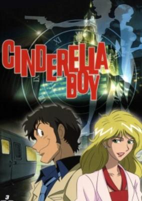

**Studio:** Magic Bus &nbsp;|&nbsp; **Episodes:** 13 &nbsp;|&nbsp; **Director:** Tsuneo Tominaga &nbsp;|&nbsp; **Aired/Released:** June 24 – September 13 &nbsp;|&nbsp; **Genres:** Action, Comedy, Adventure, Mystery

> Ranma and his partner Rera run a detective agency in Giraffe City. An arranged accident leaves Rera and Ranma in an unfortunate state where the two detectives swap bodies at the stroke of midnight. With Ranma dissapearing and the beautiful Rera appearing.
>
> _Synopsis source: Kitsu_

[Wikipedia](https://en.wikipedia.org/wiki/Cinderella_Boy) · [Kitsu](https://kitsu.io/anime/cinderella-boy)

---

### Divergence Eve

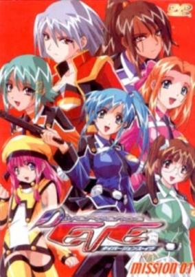

**Studio:** Radix &nbsp;|&nbsp; **Episodes:** 13 &nbsp;|&nbsp; **Director:** Hiroshi Negishi &nbsp;|&nbsp; **Aired/Released:** July 2 – September 24 &nbsp;|&nbsp; **Genres:** Power Suit, Science Fiction, Mecha, Ecchi, Action, Horror, Shipboard, Alien, Future, Space, Adventure, Comedy, Military

> In the 24th Century, Intergalactic Space Travel has become a reality. One of the first outposts in the far reaches of space is WATCHER'S NEST - an inflation hole drive portal - which has recently come under attack by a mysterious force known simply as GHOUL... A group of young female cadets assigned to the portal are unexpectedly thrown into a hornet's nest of trouble as they finalize their training to become an elite pilot in the Seraphim Squadron.
>
> _Synopsis source: Kitsu_

[Wikipedia](https://en.wikipedia.org/wiki/Divergence_Eve) · [Kitsu](https://kitsu.io/anime/divergence-eve)

---

### Happy Lesson Advance

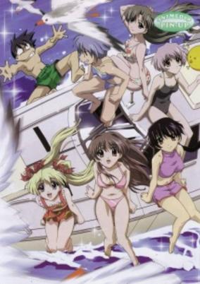

**Studio:** Studio Hibari &nbsp;|&nbsp; **Episodes:** 13 &nbsp;|&nbsp; **Director:** Iku Suzuki &nbsp;|&nbsp; **Aired/Released:** July 3 – September 28 &nbsp;|&nbsp; **Genres:** Japan, Earth, Asia, Comedy, High School, Slapstick, Stereotypes, School Life, Present, Harem, Romance, Slice of Life

> Hitotose Chitose is now living together with his 5 teachers as his mothers when a mysterious girl appears and becomes their neighbor which turns out that that person is Nagatsuki Kuron who wants Mu-chan to be her mother so another sibling rivalry ensues as to who would end up as Mu-chan's child.
>
> _Synopsis source: Kitsu_

[Wikipedia](https://en.wikipedia.org/wiki/Happy_Lesson_Advance) · [Kitsu](https://kitsu.io/anime/happy-lesson-advance)

---

### Da Capo (D.C.~Da Capo~)

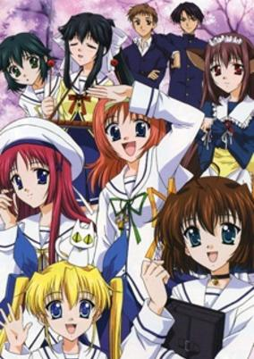

**Studio:** feel. Zexcs &nbsp;|&nbsp; **Episodes:** 26 &nbsp;|&nbsp; **Director:** Nagisa Miyazaki &nbsp;|&nbsp; **Aired/Released:** July 5 – December 27 &nbsp;|&nbsp; **Genres:** Fantasy, Earth, Love Polygon, Coming Of Age, Magic, Action, Thievery, Slice of Life, Comedy, Crime, Angel, Angst, Alternative Present, School Life, Super Power, Romance

> Every year the flowers bloom. Mysterious Cherry Blossoms blooming all over a crescent shaped island. That island is the island of Hatsune... The main character who goes to Kazami Academy, Asakura Junnichi, has the power to see the dreams of other people in his sleep. He was also taught magic by an old lady that allows him to create sweets. One day, Junnichi seems to have seen someone's dream again while he was sleeping. Inside that dream, a girl who was a childhood friend of his appeared. But, he was woken up by his sister Asakura Nemu, forcing him to come back to his regular life. Nemu doesn't actually have any blood relation to Junnichi but their bond is deeper than other real brothers and sisters. So deep that it gives the illusion that they're lovers. It was another peaceful normal day waking up early in the morning and going to Kazami Academy. Together with childhood friend Amakase Miharu, the academy idol Shirakawa Kotori, the two sisters Mizukoshi Moe and Mako who prefer eating nabe on the school roof for lunch. Going through their day as usual, their childhood friend, Yoshino Sakura, who they thought had moved to America suddenly appears. It was a surprise for Junnichi and Nemu. Sakura tells them, "I came to finish the promise we made during our childhood"...
>
> _Synopsis source: Kitsu_

[Wikipedia](https://en.wikipedia.org/wiki/Da_Capo_(visual_novel)) · [Kitsu](https://kitsu.io/anime/da-capo)

---

### Takahashi Rumiko Gekijou

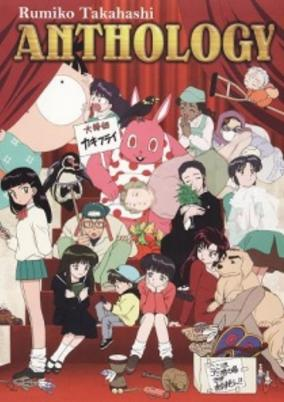

**Studio:** TMS Entertainment &nbsp;|&nbsp; **Episodes:** 13 &nbsp;|&nbsp; **Director:** Akira Nishimori &nbsp;|&nbsp; **Aired/Released:** July 6 – September 28 &nbsp;|&nbsp; **Genres:** Japan, Earth, Slice of Life, Asia, Comedy, Tokyo, Present, Romance

> Rumic World TV (2003) consists of thirteen independent series based on short stories from 1987-2000 by Takahashi Rumiko. The episode order is not sorted based on the year the story was written. For example, the first episode "Tragedy of P"'s story was written in 1991 while the last episode "Senmuno inu"'s story was written in 1994.
>
> _Synopsis source: Kitsu_

[Wikipedia](https://en.wikipedia.org/wiki/Takahashi_Rumiko_Gekijou) · [Kitsu](https://kitsu.io/anime/rumiko-takahashi-anthology)

---

### Shadow Star Narutaru

**Studio:** Planet &nbsp;|&nbsp; **Episodes:** 13 &nbsp;|&nbsp; **Director:** Toshiaki Iino &nbsp;|&nbsp; **Aired/Released:** July 8 – September 30 &nbsp;|&nbsp; **Genres:** Earth, Science Fiction, Japan, Asia, Angst, Horror, Alien, Drama, Violence, Present, Thriller, Supernatural, Seinen, Psychological, Plot Continuity, Elementary School, School Life, Proxy Battles, Crime, Alternative Present

> During her summer holiday at her grandparents house Tamai Shiina, a young and cheerful schoolgirl, meets a strange looking creature. They befriend each other and Shiina names it "Hoshimaru: The Round Star." When Shiina returns home after the summer to go back to school, she starts meeting other kids that also have befriended a strange creature like Hoshimaru. But she soon finds out that not all these creatures and their masters are as friendly as Hoshimaru.
>
> _Synopsis source: Kitsu_

[Wikipedia](https://en.wikipedia.org/wiki/Shadow_Star_Narutaru) · [Kitsu](https://kitsu.io/anime/narutaru-mukuro-naru-hoshi-tama-taru-ko)

---

### Green Green

**Studio:** Studio Matrix &nbsp;|&nbsp; **Episodes:** 12 &nbsp;|&nbsp; **Director:** Chisaku Matsumoto Yūji Mutō &nbsp;|&nbsp; **Aired/Released:** July 13 – September 28

[Wikipedia](https://en.wikipedia.org/wiki/Green_Green_(anime))

---

### Sumeba Miyako no Cosmos-sou Suttoko Taisen Dokkoida (Dokkoida?!)

**Studio:** ufotable &nbsp;|&nbsp; **Episodes:** 12 &nbsp;|&nbsp; **Director:** Takuya Nonaka &nbsp;|&nbsp; **Aired/Released:** July 13 – September 28 &nbsp;|&nbsp; **Genres:** Power Suit, Science Fiction, Mecha, Earth, Japan, Action, Parody, Asia, Comedy, Absurdist Humour, Humanoid Alien, Alien, Alternative Present, Present, Adventure

> The Galaxy Federation Police (GFP) desperately wants to cover-up its personnel shortage with new mechanized power-suits. Suzuo, 19-years old, desperately needs a job. Tampopo needs an earthling to fit the prototype of her company's suit and declares Suzuo the perfect candidate! Strong competitors and the wacky A-class criminals fight against our hero in diapers, but they must not recognize each other out of costume or the test results will be a failure- but it's OK if they all live in the same apartment building to save money, right?
>
> _Synopsis source: Kitsu_

[Wikipedia](https://en.wikipedia.org/wiki/Dokkoida%3F!) · [Kitsu](https://kitsu.io/anime/dokkoida)

---

### Onegai Twins

**Studio:** Daume &nbsp;|&nbsp; **Episodes:** 12 &nbsp;|&nbsp; **Director:** Yasunori Ide &nbsp;|&nbsp; **Aired/Released:** July 15 – October 14 &nbsp;|&nbsp; **Genres:** Comedy, Drama, Romance

> Two weeks have passed since the dilemma between Maiku, Karen and Miina was resolved, but their lives are more hectic than ever. Karen has become possessed in her newly discovered brother and Miina is desperate for attention as well, which leaves little time for Maiku to concentrate on his work. Therefore he decides to head out in the woods and set up a camp, where he can be work in peace. But, as always, we have Morino who is up to no good. To make things a bit more interesting, she organizes a field trip to Maiku's camp site, and encourages everyone to make some good summer memories.
>
> _Synopsis source: Kitsu_

[Wikipedia](https://en.wikipedia.org/wiki/Onegai_Twins) · [Kitsu](https://kitsu.io/anime/onegai-twins-ova)

---

### Popotan

**Studio:** Shaft &nbsp;|&nbsp; **Episodes:** 12 &nbsp;|&nbsp; **Director:** Shinichiro Kimura &nbsp;|&nbsp; **Aired/Released:** July 18 – October 3 &nbsp;|&nbsp; **Genres:** Ecchi, Earth, Comedy

> Beautiful sisters Ai, Mai, Mii, their android maid Mea and slippery pet ferret Unagi make an amazing journey together through time and space without ever leaving their beloved mansion behind! Following the clues of the strange dandelion-like "Popotan," the girls are theoretically seeking the person who has the answers to their most personal questions, but they seem to have more than enough time to take side trips, meet new friends, visit hot springs and occasionally operate the X-mas shop they keep in the house along the way! Yet, the girls' ultimate destiny holds more than a few surprises of its own, and not every moment is filled with hilarity, as moving through time means having to leave friends behind as well.
>
> _Synopsis source: Kitsu_

[Wikipedia](https://en.wikipedia.org/wiki/Popotan) · [Kitsu](https://kitsu.io/anime/popotan)

---

### Ikkitousen (Ikki Tousen)

**Studio:** J.C.Staff &nbsp;|&nbsp; **Episodes:** 13 &nbsp;|&nbsp; **Director:** Takashi Watanabe &nbsp;|&nbsp; **Aired/Released:** July 20 – October 22 &nbsp;|&nbsp; **Genres:** Earth, Japan, Action, Asia, Ecchi, Martial Arts, Plot Continuity, Violence, Present, Super Power, School Life

> In Ikkitousen, the Kanto region of Japan is locked in the middle of a turf war between seven different high schools. Among the students of these schools are a select few who are in possession of sacred beads. These magatama harbor the souls of warriors who fought during the Three Kingdoms Era of Chinese history. Not only are these students blessed with abilities that draw from the souls they are tied to, but they are also blessed, or maybe cursed, with the fates of these warriors from the past. One of these students is Hakufu Sonsaku; a young, caring, dim-witted girl who has recently transferred into Nanyo Academy and will be living with her cousin, Koukin Shuyu. Hakufu’s arrival creates an almost immediate sense of tension due to her power as a fighter and the possibility that she may be the one who carries the spirit of the Chinese warlord, Sun Ce. The most powerful fighters at Nanyo, known as “The Big Four” are shaken by her presence and determined to stop Hakufu from achieving the goal given to her by her mother: to conquer those who challenge her and unite the seven schools.
>
> _Synopsis source: Kitsu_

[Wikipedia](https://en.wikipedia.org/wiki/Ikkitousen) · [Kitsu](https://kitsu.io/anime/ikkitousen)

---

### Full Metal Panic? Fumoffu

**Studio:** Kyoto Animation &nbsp;|&nbsp; **Episodes:** 12 &nbsp;|&nbsp; **Director:** Yasuhiro Takemoto &nbsp;|&nbsp; **Aired/Released:** August 26 – November 18 &nbsp;|&nbsp; **Genres:** Japan, Action, Present, Comedy, Asia, Earth, High School, Slapstick, School Life

> It's back-to-school mayhem with Kaname Chidori and her war-freak classmate Sousuke Sagara as they encounter more misadventures in and out of Jindai High School. But when Kaname gets into some serious trouble, Sousuke takes the guise of Bonta-kun—the gun-wielding, butt-kicking mascot. And while he struggles to continue living as a normal teenager, Sousuke also has to deal with protecting his superior officer Teletha Testarossa, who has decided to take a vacation from Mithril and spend a couple of weeks as his and Kaname's classmate.
>
> _Synopsis source: Kitsu_

[Wikipedia](https://en.wikipedia.org/wiki/Full_Metal_Panic%3F_Fumoffu) · [Kitsu](https://kitsu.io/anime/full-metal-panic-fumoffu)

---

### R.O.D the TV ( Read Or Die ) (R.O.D -The TV-)

**Studio:** J.C.Staff &nbsp;|&nbsp; **Episodes:** 26 &nbsp;|&nbsp; **Director:** Koji Masunari &nbsp;|&nbsp; **Aired/Released:** September 1 – March 16, 2004 &nbsp;|&nbsp; **Genres:** Science Fiction, Japan, Action, Plot Continuity, Present, Super Power, Adventure, Comedy

> Five years have passed since the occurrence of the incident known as the "Human Annihilation Mission." In Japan, a novelist is dealing with writer's block after her friend has gone missing. In Hong Kong, three sisters, masters in the use of paper, run their own detective agency to solve cases that involve books. When these people are brought together, a bond greater than blood is formed - a bond that will be sorely tested by the evil powers intent on taking over the world. Join Anita, Maggie, Michelle, and Nenene as they travel the globe in order to save the world from the evil mastermind, Mr. Carpenter! Of course, that's if they can find the time to put down the books they're reading...
>
> _Synopsis source: Kitsu_

[Wikipedia](https://en.wikipedia.org/wiki/R.O.D_the_TV) · [Kitsu](https://kitsu.io/anime/r-o-d)

---

### IGPX : Immortal Grand Prix

**Studio:** Bee Train Production I.G &nbsp;|&nbsp; **Episodes:** 5 &nbsp;|&nbsp; **Director:** Mashimo Kouichi &nbsp;|&nbsp; **Aired/Released:** September 15 – September 19

[Wikipedia](https://en.wikipedia.org/wiki/IGPX)

---

### Papuwa

**Studio:** Nippon Animation &nbsp;|&nbsp; **Episodes:** 26 &nbsp;|&nbsp; **Director:** Ken'ichi Nishida &nbsp;|&nbsp; **Aired/Released:** September 30 – March 30, 2004 &nbsp;|&nbsp; **Genres:** Adventure, Comedy

> In this sequel series, events continue four years after they left off in the first series. Papuwa-kun is a mysterious boy who lives on a new tropical island full of the same crazy creatures. Along with his maid, Liquid, and his new amnestic friend, "Rotarou", they lead nonsensical adventures as they try to evade and confuse the Ganma Army, Special Corps, and even the Shinsengumi from discovering Rotarou's real secret and taking him away.
>
> _Synopsis source: Kitsu_

[Wikipedia](https://en.wikipedia.org/wiki/Papuwa) · [Kitsu](https://kitsu.io/anime/papuwa)

---

### Midnight Horror School

**Studio:** Milky Cartoon &nbsp;|&nbsp; **Episodes:** 52 &nbsp;|&nbsp; **Director:** Naomi Iwata &nbsp;|&nbsp; **Aired/Released:** October 1 – March 24, 2004 &nbsp;|&nbsp; **Genres:** Comedy

> The school has 26 students with each name of them beginning with a letter of the alphabet in order and a color, 3 teachers, 3 classrooms, a library, a cafeteria, a music room, a playroom, a fountain, a skeleton playground, a graveyard and several school staff.
>
> _Synopsis source: Kitsu_

[Kitsu](https://kitsu.io/anime/midnight-horror-school)

---

### Shinkon Gattai Godannar !! (Marriage of God & Soul Godannar!!)

**Studio:** OLM AIC ASTA &nbsp;|&nbsp; **Episodes:** 13 &nbsp;|&nbsp; **Director:** Yasuchika Nagaoka &nbsp;|&nbsp; **Aired/Released:** October 1 – December 24 &nbsp;|&nbsp; **Genres:** Future, Piloted Robot, Sudden Girlfriend Appearance, Post Apocalypse, Alien, Ecchi, Robot, Science Fiction, Japan, Action, Asia, Earth, Romance, Mecha, Comedy

> Five years ago, while battling an alien force known as the "Mimesis," Dannar pilot Goh Saruwatari first met Anna Aoi. Today, on the day of their wedding, the ceremony is interrupted when the Mimesis strike again. As Goh struggles in his battle against the alien threat, Anna stumbles upon a top secret robot known as the "Neo-Okusaer" and uses it as a last-resort to save her fiancee. At that moment, Dannar and Neo-Okusaer merge to become the mighty robot "Godannar."
>
> _Synopsis source: Kitsu_

[Wikipedia](https://en.wikipedia.org/wiki/Shinkon_Gattai_Godannar) · [Kitsu](https://kitsu.io/anime/shinkon-gattai-godannar)

---

### Saiyuki Reload

**Studio:** Pierrot &nbsp;|&nbsp; **Episodes:** 25 &nbsp;|&nbsp; **Director:** Tetsuya Endō &nbsp;|&nbsp; **Aired/Released:** October 2 – March 25, 2004 &nbsp;|&nbsp; **Genres:** Magic, Martial Arts, Demon, Contemporary Fantasy, Action, Fantasy, Comedy, Adventure

> Priest Genjo Sanzo and companions Cho Hakkai, Sha Gojyo, and Son Goku maintain their westward journey to stop the resurrection of the demon Gyoumao. As the reputation of the Sanzo Ikkou precedes them, they continue to fight demon assassins at every turn, but they must also deal with increasing tensions within their group in order to defeat a powerful enemy.
>
> _Synopsis source: Kitsu_

[Wikipedia](https://en.wikipedia.org/wiki/Saiyuki_Reload_(TV_series)) · [Kitsu](https://kitsu.io/anime/saiyuki-reload)

---

### Yami to Boushi to Hon no Tabibito (Traveller Yami)

**Studio:** Studio Deen &nbsp;|&nbsp; **Episodes:** 13 &nbsp;|&nbsp; **Director:** Yuji Yamaguchi &nbsp;|&nbsp; **Aired/Released:** October 2 – December 25 &nbsp;|&nbsp; **Genres:** Fantasy, Swordplay, Plot Continuity, Action, Magic, Ecchi, Drama, Shoujo Ai, Adventure, Mystery

> Hatsuki is a highschool student living with her sister, Hatsumi, who she has a huge crush on. On Hatsumi's 16th birthday, she is suddenly surrounded by a green light and disappears in front of Hatsuki. She manages to follow Hatsumi with the help of a being resembling a fat baby chick (literally), ending up in a place called "The Great Library", which is full of different worlds stored in books. Hatsumi wasn't there, though, so the search for Hatsuki's great love begins and involves traveling from book to book.
>
> _Synopsis source: Kitsu_

[Wikipedia](https://en.wikipedia.org/wiki/Yami_to_B%C5%8Dshi_to_Hon_no_Tabibito) · [Kitsu](https://kitsu.io/anime/yami-to-boushi-to-hon-no-tabibito)

---

### Avenger

**Studio:** Bee Train &nbsp;|&nbsp; **Episodes:** 13 &nbsp;|&nbsp; **Director:** Kōichi Mashimo &nbsp;|&nbsp; **Aired/Released:** October 2 – December 25

[Wikipedia](https://en.wikipedia.org/wiki/Avenger_(TV_series))

---

### Gilgamesh

**Studio:** Group TAC &nbsp;|&nbsp; **Episodes:** 26 &nbsp;|&nbsp; **Director:** Masahiko Murata &nbsp;|&nbsp; **Aired/Released:** October 2 – March 18, 2004 &nbsp;|&nbsp; **Genres:** Future, Fantasy World, Dark Fantasy, Violence, Conspiracy, Dystopia, Plot Continuity, Action, Fantasy, Drama, Super Power, Science Fiction

> The half-divine King of Uruk, Gilgamesh, was considered but a paltry legend... until his majestic tomb was discovered in the Middle East. This imperial crypt drew scientists from across the globe to the land, and with that came recognition of their fame. In a joint effort, they built Heaven's Gate in pursuit of advancing human knowledge. One day, a group of terrorists driven by greed attack Heaven's Gate, causing an explosion within the facility for archaeological excavation. The resulting phenomenon had much more impact than anyone could have imagined. More specifically, it triggered the birth of supernatural beings. In the midst of this mess, two siblings by the names of Kiyoko and Tatsuya encounter mysterious men with supernatural powers who, despite the scientific crisis around them, claim the ability to restore good to the world. Nevertheless, these seemingly heroic and all-powerful creatures act under the rule of factions. Are they here to save the world, or destroy it?
>
> _Synopsis source: Kitsu_

[Wikipedia](https://en.wikipedia.org/wiki/Gilgamesh_(manga)) · [Kitsu](https://kitsu.io/anime/gilgamesh)

---

### Cromartie High School

**Studio:** Production I.G &nbsp;|&nbsp; **Episodes:** 26 &nbsp;|&nbsp; **Director:** Hiroaki Sakurai &nbsp;|&nbsp; **Aired/Released:** October 3 – March 26, 2004 &nbsp;|&nbsp; **Genres:** Delinquent, High School, Absurdist Humour, Present, School Life, Action, Japan, Asia, Earth, Comedy, Parody

> Takashi Kamiyama is your typical mild-mannered high school student—polite, aloof, and pacifistic, with a slightly above-average IQ. But would your average high school student really enroll himself at the infamous Cromartie High School, known as a breeding ground for the toughest delinquents out there? Apparently so, as that is exactly what Takashi does, though for reasons he'd rather leave unmentioned. However, one thing is for sure: the "hard-boiled rabbit in a den full of hungry lions" is never going to have another dull day. And how could he, now that he's surrounded by mohawked punks, obnoxious robots, and... gorillas? And was that Freddie Mercury riding a horse down the corridor? Follow Takashi as he earnestly dedicates his new high school life to better his school's reputation while his classmates are hellbent on wreaking havoc.
>
> _Synopsis source: Kitsu_

[Wikipedia](https://en.wikipedia.org/wiki/Cromartie_High_School) · [Kitsu](https://kitsu.io/anime/sakigake-cromartie-koukou)

---

### Battle Programmer Shirase

**Studio:** AIC &nbsp;|&nbsp; **Episodes:** 15 &nbsp;|&nbsp; **Director:** Hiroki Hayashi &nbsp;|&nbsp; **Aired/Released:** October 4 – January 4, 2004 &nbsp;|&nbsp; **Genres:** Earth, Ecchi, Slapstick, Contemporary Fantasy, Fantasy, Stereotypes, Present, Slice of Life, Japan, Comedy, Loli, Asia, Science Fiction

> Battle Programmer Shirase, also known as BPS, is a free programmer with super hacking abilities who doesn't work for money. What he does work for is certainly something that only people like him would appreciate. But, his demeanor certainly doesn't suit the jobs he is hired for. With the evil King of America causing trouble via the internet, Shirase is nothing but busy as each new adventure brings even more interesting people into the picture.
>
> _Synopsis source: Kitsu_

[Wikipedia](https://en.wikipedia.org/wiki/Battle_Programmer_Shirase) · [Kitsu](https://kitsu.io/anime/battle-programmer-shirase)

---

### UFO Princess Valkyrie 2 : Juunigatsu no Yasoukyoku (UFO Ultramaiden Valkyrie 2: December Nocturne)

**Studio:** TNK &nbsp;|&nbsp; **Episodes:** 12 &nbsp;|&nbsp; **Director:** Nobuhiro Takagi &nbsp;|&nbsp; **Aired/Released:** October 4 – December 20 &nbsp;|&nbsp; **Genres:** Deity, Juujin, Ecchi, Alien, Romance, Comedy, Fantasy, Science Fiction, Earth

> Valkyrie, Kazuto, Akina, Hydra, and friends are back for more when the Key of time suddenly appears along with many other mysterious happenings. All seemed to be linked to a person named "Valkyrie Ghost" whose only goal is stealing Kazuto for herself. As they team up against this seeming unbeatable foe they dig deeper into the mysterious past of Valkyrie's home planet, Valhalla.
>
> _Synopsis source: Kitsu_

[Wikipedia](https://en.wikipedia.org/wiki/UFO_Princess_Valkyrie_2) · [Kitsu](https://kitsu.io/anime/ufo-princess-valkyrie-2-juunigatsu-no-yasoukyoku)

---

### Binzume Yousei (Bottle Fairy)

**Studio:** Xebec &nbsp;|&nbsp; **Episodes:** 13 &nbsp;|&nbsp; **Director:** Yoshiaki Iwasaki &nbsp;|&nbsp; **Aired/Released:** October 4 – December 27 &nbsp;|&nbsp; **Genres:** Slapstick, Present, Japan, Comedy, Asia, Contemporary Fantasy, Magic, Earth, Fantasy, Slice of Life

> Kururu, Chiriri, Sarara, and Hororo are four little fairies that live inside bottles on their “Sensei”’s desk. Together, they have misadventures trying to understand the human world, seeking advice from the totally misinformed grade schooler next door.
>
> _Synopsis source: Kitsu_

[Wikipedia](https://en.wikipedia.org/wiki/Binzume_Yosei) · [Kitsu](https://kitsu.io/anime/binzume-yousei)

---

### Rockman.EXE Axess (MegaMan: Axess)

**Studio:** Xebec &nbsp;|&nbsp; **Episodes:** 51 &nbsp;|&nbsp; **Director:** Takao Kato &nbsp;|&nbsp; **Aired/Released:** October 4 – September 25, 2004 &nbsp;|&nbsp; **Genres:** Action, Mecha, Science Fiction, Adventure, Comedy

> Netto's father Yuuichirou Hikari has made a scientific breakthrough by introducing the "synchro chips". If an operator and his or her navi are in a special enviroment known as a "dimensional area", they can fuse together in the real world via a technique called "cross fusion"! Yuuichirou's first test subject, Misaki Gorou, attempts the process and sadly fails. Netto offers to try with Rockman, but his father forbids it. Cross Fusion puts enormous strain on the operator's health, and battling in the real world could mean death.
>
> _Synopsis source: Kitsu_

[Wikipedia](https://en.wikipedia.org/wiki/Rockman_EXE_Axess) · [Kitsu](https://kitsu.io/anime/rockman-exe-axess)

---

### Planetes

**Studio:** Sunrise &nbsp;|&nbsp; **Episodes:** 26 &nbsp;|&nbsp; **Director:** Goro Taniguchi &nbsp;|&nbsp; **Aired/Released:** October 4 – April 17, 2004 &nbsp;|&nbsp; **Genres:** Space Travel, Science Fiction, Angst, Shipboard, Future, Plot Continuity, Space, Romance

> In 2075, space travel is no longer just a dream, but an everyday reality for mankind. Advancements in science and technology have led to the colonization of the moon, the commercialization of outer space, and the formation of large space corporations. Ai Tanabe, an upbeat woman whose interests lie in the cosmos, joins Technora Corporation as a member of their Debris Section, a department dedicated to the removal of dangerous space junk between the orbits of the Earth and Moon. However, Ai soon discovers how unappreciated her job is. As the laughingstock of Technora, the Debris Section is severely understaffed, poorly funded, and is forced to use a dilapidated spaceship nicknamed the "Toy Box" for debris retrieval. Undeterred, Ai perseveres and gradually becomes acquainted with the strange personalities that make up the Debris Section's staff, such as the bumbling but good-natured chief clerk Philippe Myers; the mysterious and tight-lipped temp worker Edelgard Rivera; and the hotheaded and passionate Hachirota Hoshino, who longs for a spaceship to call his own. Winner of the Seiun Award in 2005, Planetes is an unconventional sci-fi series that portrays the vastness of space as a backdrop for the personal lives of ordinary people—people who may have been born on Earth, but whose hopes and dreams lie amongst the stars. [Written by MAL Rewrite]
>
> _Synopsis source: Kitsu_

[Wikipedia](https://en.wikipedia.org/wiki/Planetes) · [Kitsu](https://kitsu.io/anime/planetes)

---

### Fullmetal Alchemist

**Studio:** Bones &nbsp;|&nbsp; **Episodes:** 51 &nbsp;|&nbsp; **Director:** Seiji Mizushima &nbsp;|&nbsp; **Aired/Released:** October 4 – October 2, 2004

[Wikipedia](https://en.wikipedia.org/wiki/Fullmetal_Alchemist_(TV_series))

---

### Kyougoku Natsuhiko: Kousetsu Hyaku Monogatari (Requiem from the Darkness)

**Studio:** TMS Entertainment &nbsp;|&nbsp; **Episodes:** 13 &nbsp;|&nbsp; **Director:** Hideki Tonokatsu &nbsp;|&nbsp; **Aired/Released:** October 4 – December 27 &nbsp;|&nbsp; **Genres:** Pirate, Past, Historical, Dark Fantasy, Japan, Bakumatsu   Meiji Period, Violence, Plot Continuity, Action, Angst, Fantasy, Horror, Psychological, Mystery

> Tired of writing riddles for children, Yamaoka Momosuke plans on gathering spooky and gruesome stories and publishing them in an anthology called Hyakumonogatari ("One Hundred Tales"). While researching these old myths and legends he comes across a mysterious trio who call themselves the Ongyou. They are detectives who are investigating the legends to reveal their truths...and bring those in the wrong to justice. Each time Momosuke meets the Ongyou he must face horrible truths and battle with his morals, but he's seeing things he shouldn't be seeing...
>
> _Synopsis source: Kitsu_

[Wikipedia](https://en.wikipedia.org/wiki/Requiem_from_the_Darkness) · [Kitsu](https://kitsu.io/anime/kousetsu-hyaku-monogatari)

---

### Kimi ga Nozomu Eien (Rumbling Hearts)

**Studio:** Studio Fantasia &nbsp;|&nbsp; **Episodes:** 14 &nbsp;|&nbsp; **Director:** Tetsuya Watanabe &nbsp;|&nbsp; **Aired/Released:** October 5 – January 4, 2004 &nbsp;|&nbsp; **Genres:** Romance, Japan, Earth, Slice of Life, Asia, Love Polygon, Angst, Drama, Present

> At first, Takayuki Narumi is befriended by Mitsuki Hayase only because Mitsuki's best friend, Haruka Suzumiya has a crush on him; however since then, Takayuki, his pal Shinji Taira, and Mitsuki have grown to be the best of friends. Then one day, Haruka confesses to Takayuki her love for him. Not wanting to hurt her feelings, Takayuki agrees to go out with her. After a few incidents, their relationship gets intimate, even while Takayuki and Mitsuki begin to realize their feelings for each other. But when tragedy strikes, things are never the same for these four friends again.
>
> _Synopsis source: Kitsu_

[Wikipedia](https://en.wikipedia.org/wiki/Kimi_ga_Nozomu_Eien) · [Kitsu](https://kitsu.io/anime/kimi-ga-nozomu-eien)

---

### Ginga Tetsudou Monogatari (The Galaxy Railways)

**Studio:** Planet &nbsp;|&nbsp; **Episodes:** 26 &nbsp;|&nbsp; **Director:** Yukio Nishimoto &nbsp;|&nbsp; **Aired/Released:** October 5 – April 11, 2004 &nbsp;|&nbsp; **Genres:** Future, Space, Space Travel, Other Planet, Shipboard, Plot Continuity, Action, Science Fiction, Adventure, Special Squads, Space Opera

> The story begins on planet Destiny, which claimed to be where the center of the Universe is, where all the terminals of "The Galaxy Railways" are gathered. The main character, Yuuki Manabu (20 years old), carrying on his dead Father and Brother's will, joined SDF (Space Defense Force) to protect the safety of the Galaxy Railways. SDF, in order to uphold the reputation of maintaining the best transportation schedules within the Universe, deals with accidents, natural disasters, rescue operations, space pirates along all lines of the railway. Layla Destiny Shura is a mysterious beauty unifying SDF and all lines on The Galaxy Railways. She possesses the ability to see the destiny of planets, human beings and living things. Even though possessing such powers, she, being a "Guardian of Destiny", is unable to tell passengers leaving this station what difficulties lies ahead of them. However, appearances of those who uses evil powers to change the destinies of these travelers triggers another of her hidden ability. "Destiny is changed by the individual's oneself. Tomorrow's happiness is grabbed by the individual's own hands." In what manner will Yuuki's destiny be seen by Layla? And, how will Yuuki deal with his destiny amidst the greatest crisis approaching The Galaxy Railways?
>
> _Synopsis source: Kitsu_

[Wikipedia](https://en.wikipedia.org/wiki/Ginga_Tetsudou_Monogatari) · [Kitsu](https://kitsu.io/anime/the-galaxy-railways)

---

### Takahashi Rumiko Gekijou Ningyo no Mori

**Studio:** TMS Entertainment &nbsp;|&nbsp; **Episodes:** 11 &nbsp;|&nbsp; **Director:** Masaharu Okuwaki &nbsp;|&nbsp; **Aired/Released:** October 5 – December 21 &nbsp;|&nbsp; **Genres:** Romance, Contemporary Fantasy, Fantasy, Earth, Japan, Asia, Slice of Life, Mermaid, Magic, Magical Girl, Present, Music, Adventure, Comedy

> After the final battle against Gaito, Sara had given her life to remain with him. The sea world is now at peace, but only with six mermaid princesses. While Caren, Noel, and Coco have returned to their kingdoms, it should be time for Lucia, Hanon, and Rina to do the same. After all, Mitsuki Tarou is leaving for Germany, and Doumoto Kaito is heading to Hawaii. Lucia is devestated, and when things couldn't get any worse, Kaito is lost at sea! Worst of all, a strange angel named Michel has appeared, wanting the mermaids to join him. But on the lighter side, Sara's spirit tells Lucia of Sara's successor, a young mermaid named Seira. The mermaids are in for another adventure!
>
> _Synopsis source: Kitsu_

[Wikipedia](https://en.wikipedia.org/wiki/Mermaid_Saga) · [Kitsu](https://kitsu.io/anime/mermaid-melody-pichi-pichi-pitch-pure)

---

### PopoloCrois

**Studio:** TMS Entertainment &nbsp;|&nbsp; **Episodes:** 26 &nbsp;|&nbsp; **Director:** Kazuhiro Ochi &nbsp;|&nbsp; **Aired/Released:** October 5 – March 28, 2004

[Wikipedia](https://en.wikipedia.org/wiki/Popolocrois_(TV_series))

---

### F-Zero: Falcon Densetsu (F-Zero: GP Legend)

**Studio:** Ashi Productions &nbsp;|&nbsp; **Episodes:** 51 &nbsp;|&nbsp; **Director:** Ami Tomobuki &nbsp;|&nbsp; **Aired/Released:** October 7 – September 28, 2004 &nbsp;|&nbsp; **Genres:** Future, Space, Mecha, Action, Science Fiction, Motorsport, Adventure, Sports

> Rick Wheeler was a police detective who got into a fatal car accident while pursuing the criminal Zoda. He was placed into artificial coldsleep for 150 years. Wheeler is brought back to life by Jody Summer and Dr. Stewart, who work with a group of good racers who try to keep prize money out of the hands of unsavory people like the Dark Million Organization run by Black Shadow and Deathborn.
>
> _Synopsis source: Kitsu_

[Kitsu](https://kitsu.io/anime/f-zero-gp-legend)

---

### Gungrave

**Studio:** Madhouse &nbsp;|&nbsp; **Episodes:** 26 &nbsp;|&nbsp; **Director:** Toshiyuki Tsuru &nbsp;|&nbsp; **Aired/Released:** October 7 – March 30, 2004 &nbsp;|&nbsp; **Genres:** Present, Gunfights, Fantasy World, Contemporary Fantasy, Violence, Plot Continuity, Crime, Revenge, Rotten World, Mafia, Dystopia, Science Fiction, Drama, Action, Super Power

> Brandon Heat and Harry MacDowel, two friends so close they could be called brothers, receive an abrupt and violent reminder one fateful day of how appallingly merciless the world around them can be. Their whole lives before then were simple and easygoing, consisting largely of local brawls, seducing women, and committing petty theft to make a living and pass the time. What they failed to realize is that in this cruel world, happiness is fleeting, and change is inevitable. Enter Millennion, the largest and most infamous mafia syndicate in the area, which accepts Brandon and Harry into their ranks and starts them at the bottom of the food chain. Harry has ambitions to ascend the ranks and one day replace Big Daddy as the supreme leader of Millennion, while Brandon only wishes to support his friend and appease Big Daddy who has taken custody of the woman Brandon loves. Based off the third-person shooter video game under the same name, Gungrave is an epic story of friendship, betrayal, and avarice that spans the course of several years, ultimately tying back to the gripping and foreboding first episode, all the while building up to the story's thrilling conclusion. [Written by MAL Rewrite]
>
> _Synopsis source: Kitsu_

[Wikipedia](https://en.wikipedia.org/wiki/Gungrave_(TV_series)) · [Kitsu](https://kitsu.io/anime/gungrave)

---

### Peace Maker Kurogane

**Studio:** Gonzo &nbsp;|&nbsp; **Episodes:** 24 &nbsp;|&nbsp; **Director:** Tomohiro Hirata &nbsp;|&nbsp; **Aired/Released:** October 8 – March 24, 2004 &nbsp;|&nbsp; **Genres:** Past, Swordplay, Japan, Tokugawa Period, Bakumatsu   Meiji Period, Asia, Violence, Shinsengumi, Action, Comedy, Samurai, Historical

> Although traumatized by witnessing the murder of his parents by one of the Choushuu, Ichimura Tetsunosuke's thirst for revenge lead him to desire strength. At the age of 15, Tetsunosuke approached the Shinsengumi, wanting to become one of its members. However, Tetsunosuke lacked the skill, mind and will to emotionlessly cut down whoever threatened peace and the Shinsengumi. Even with the support of his brother Tatsunosuke and his newfound friends of the Shinsengumi, little did Tetsunosuke know the blood and pain he would have to face being part of this historical group.
>
> _Synopsis source: Kitsu_

[Wikipedia](https://en.wikipedia.org/wiki/Peacemaker_Kurogane) · [Kitsu](https://kitsu.io/anime/peace-maker-kurogane)

---

### Gunslinger Girl

**Studio:** Madhouse &nbsp;|&nbsp; **Episodes:** 13 &nbsp;|&nbsp; **Director:** Morio Asaka &nbsp;|&nbsp; **Aired/Released:** October 9 – February 19, 2004 &nbsp;|&nbsp; **Genres:** Cyborg, Gunfights, Present, Earth, Human Enhancement, Violence, Plot Continuity, Italy, Europe, Action, Science Fiction, Crime, Drama, Military, Psychological

> In the heart of Italy, the Social Welfare Agency rescues young girls from hospital beds and gives them a second chance at life using the latest in cybernetic advancements. With their artificially enhanced bodies, the girls are brainwashed and trained as assassins to carry out the dirty work of the Italian Government. Despite all the modifications, they are still just children at heart, struggling for recognition from those they love, even knowing the love they feel is manufactured. This tragic tale unfolds as these girls grapple with their emotions in an agency that treats them as nothing but ruthless killers. [Written by MAL Rewrite]
>
> _Synopsis source: Kitsu_

[Wikipedia](https://en.wikipedia.org/wiki/Gunslinger_Girl) · [Kitsu](https://kitsu.io/anime/gunslinger-girl)

---

### Shingetsutan Tsukihime (Lunar Legend Tsukihime)

**Studio:** J.C.Staff &nbsp;|&nbsp; **Episodes:** 12 &nbsp;|&nbsp; **Director:** Katsushi Sakurabi &nbsp;|&nbsp; **Aired/Released:** October 10 – December 26 &nbsp;|&nbsp; **Genres:** Vampire, Super Power, Present, Earth, Contemporary Fantasy, Japan, Violence, Plot Continuity, Asia, Fantasy, Horror, Romance, Drama, Action, Mystery

> Shiki Toono sustained a life threatening injury as a child, and due to that incident he was sent away from the Toono household and was given to a relative to be raised. Years later, when Shiki is in high school, the head of the Toono household—his father—dies, and he is ordered to move back in by his sister Akiha, who is the new head of the household. However, Shiki holds a huge secret. Ever since that injury, he has been seeing lines on objects, and only with a special pair of glasses is he able to stop seeing them. Also he is unable to remember anything well from the time before his accident. The day he moves back to the Toono household is the day he stumbles upon a woman named Arcueid Brunstud and decapitates her with one stab of his knife in a temporary fit of insanity. When she suddenly showed up beside him later alive and well, and ask him to be her bodyguard, Shiki's journey to unravel the mysteries of his past begins.
>
> _Synopsis source: Kitsu_

[Wikipedia](https://en.wikipedia.org/wiki/Shingetsutan_Tsukihime) · [Kitsu](https://kitsu.io/anime/shingetsutan-tsukihime)

---

### Ai Yori Aoshi: Enishi

**Studio:** J.C.Staff &nbsp;|&nbsp; **Episodes:** 12 &nbsp;|&nbsp; **Director:** Masami Shimoda &nbsp;|&nbsp; **Aired/Released:** October 13 – December 29 &nbsp;|&nbsp; **Genres:** Present, Earth, Japan, Stereotypes, Asia, Romance, Harem, Slice of Life, Comedy

> Two years after meeting Aoi, Kaoru and gang are still up to their normal habits. Kaoru now in grad school and the tenants being as rowdy as ever what will become of Aoi and Kaoru's love. Two years has passed since Aoi and Kaoru were freed from the bonds of their families. They continue to live their normal lives with their usual friends in their house.
>
> _Synopsis source: Kitsu_

[Kitsu](https://kitsu.io/anime/ai-yori-aoshi-enishi)

---

### Maburaho

**Studio:** J.C.Staff &nbsp;|&nbsp; **Episodes:** 24 &nbsp;|&nbsp; **Director:** Shinichiro Kimura &nbsp;|&nbsp; **Aired/Released:** October 14 – April 6, 2004 &nbsp;|&nbsp; **Genres:** Present, Ghost, Japan, Sudden Girlfriend Appearance, Love Polygon, Ecchi, Fantasy, Magic, Comedy, School Life, Harem, Romance

> In the world of Maburaho, everyone is born with the ability to use magic and are thus labeled magicians. However, the magical ability of each person is not equal. The number of times you can use magic determines the amount of respect you receive, and since one’s magical power is determined at birth by traits and genetics, those who have a bloodline stemming from famous magicians are highly sought after. Having the lowest magic count in Aoi Academy, Kazuki Shikimori is looked down upon by his classmates and seen as a nearly worthless magician. However, his bloodline consists of many great magicians throughout the ages, meaning that while he may not be a great magician, his offspring could be. This leads to him being sought after by three different young women: Yuna Miyama, a transfer student who declares herself his wife upon arrival, Rin Kamishiro, a prideful swordswoman of a traditional family who wants to kill him so she will be free to pursue her own desires, and Kuriko Kazetsubaki, a member of an influential family who bluntly tries to seduce him for his genes. Now he has to deal with not only the jealousy of all the guys in his school, but also various women chasing after him!
>
> _Synopsis source: Kitsu_

[Wikipedia](https://en.wikipedia.org/wiki/Maburaho) · [Kitsu](https://kitsu.io/anime/maburaho)

---

### Mujin Wakusei Survive

**Studio:** Madhouse Telecom Animation Film &nbsp;|&nbsp; **Episodes:** 52 &nbsp;|&nbsp; **Director:** Yuichiro Yano &nbsp;|&nbsp; **Aired/Released:** October 16 – October 28, 2004 &nbsp;|&nbsp; **Genres:** Shipboard, Thriller, Alien, Other Planet, Angst, Adventure, Plot Continuity, Science Fiction, Future, Space, Action, Fantasy, Slice of Life

> The story is set in the 22nd century where space travel, planet colonization and anti-gravity basketball are practically everyday things. Planet Earth has become uninhabitable, and therefore people live in colonies on the surrounding planets. On a school field trip, a mistake causes the protagonist, a young transfer student named Luna, her pet robot, and six of her classmates to be thrown through a gravity storm and crash land on a seemingly uninhabited planet. There, with Luna as their leader, the robot cat Chako, the lone wolf Kaoru, the spoiled rich boy Howard, the shy Sharla, the obedient Bell, the prideful musician Menori and the young genius Shingo must fight for their survival. But is the planet really uninhabited, or is there someone or something out there, waiting in the shadows?
>
> _Synopsis source: Kitsu_

[Wikipedia](https://en.wikipedia.org/wiki/Uninhabited_Planet_Survive!) · [Kitsu](https://kitsu.io/anime/mujin-wakusei-survive)

---

### Futatsu no Spica (Twin Spica)

**Studio:** Group TAC &nbsp;|&nbsp; **Episodes:** 20 &nbsp;|&nbsp; **Director:** Tomomi Mochizuki &nbsp;|&nbsp; **Aired/Released:** November 1 – March 27, 2004 &nbsp;|&nbsp; **Genres:** Coming Of Age, Future, Science Fiction, High School, Plot Continuity, Japan, School Life, Asia, Earth

> When Kamogawa Asumi was just a baby, her mother was grievously injured when a rocket crashed to the ground. Five years later, having been in a coma all the time, Asumi's mother finally dies, and the little girl struggles to come to terms with the death of a mother she barely remembers. In the midst of her turmoil, she meets "Lion-san," a strange figure wearing a lion mask and claiming to be a ghost. Lion-san helps Asumi to bury her mother's ashes, and finally, Asumi reaches her own decision: "When I grow up, I'm going to be a rocket pilot."
>
> _Synopsis source: Kitsu_

[Wikipedia](https://en.wikipedia.org/wiki/Futatsu_no_Spica) · [Kitsu](https://kitsu.io/anime/futatsu-no-spica)

---

### Bobobo-bo Bo-bobo

**Studio:** Toei Animation &nbsp;|&nbsp; **Episodes:** 76 &nbsp;|&nbsp; **Director:** Hiroki Shibata &nbsp;|&nbsp; **Aired/Released:** November 8 – October 15, 2005 &nbsp;|&nbsp; **Genres:** Adventure, Martial Arts, Future, Slapstick, Science Fiction, Action, Comedy, Parody, Super Power

> Bobobo is a man with the incredible power of hearing the voices of hair and using his own to fight. He uses his power to fight off the Margarita Empire and all of Emperor Tsuru Tsurulina's minions who are stealing the hair off of anyone they find to power up their emperor.
>
> _Synopsis source: Kitsu_

[Wikipedia](https://en.wikipedia.org/wiki/Bobobo-bo_Bo-bobo) · [Kitsu](https://kitsu.io/anime/bobobo-bo-bo-bobo)

---

### Chrno Crusade (Chrono Crusade)

**Studio:** Gonzo &nbsp;|&nbsp; **Episodes:** 24 &nbsp;|&nbsp; **Director:** Yuu Kou &nbsp;|&nbsp; **Aired/Released:** November 25 – June 10, 2004 &nbsp;|&nbsp; **Genres:** Past, Gunfights, New York, Plot Continuity, Americas, Alternative Past, United States, Contemporary Fantasy, Earth, Fantasy, Action, Comedy, Demon, Historical, Romance, Drama

> World War I revealed some of the deepest horrors of humanity, but the years following it would reveal horrors of another kind. In the 1920’s, monstrous demons began appearing in surprisingly high numbers across America, manifesting as sin incarnate. To combat this menace, a holy organization known as the Order of Magdalene established branches across the country, all governed by the Council of the Catholic Church. The New York branch is home to the young and reckless Sister Rosette Christopher and her demon hunting partner, Chrno. Armed to the teeth with holy guns and bullets, the two are renowned for accomplishing their job, but also causing extensive property damage at the same time. This doesn’t exactly please the head of their branch, Sister Kate Valentine, though Rosette is still greatly appreciated by the branch’s minister, Father Ewan Remington, and their weapon developer, Edward Hamilton. Chrno, however, leaves them with a sense of unease; there’s more to him than there appears to be, and even more behind the bond that he and Rosette share. Placing their lives in each other’s hands, the two of them must continue to fight off the increasingly mounting demonic menace, discover its source, and hopefully complete Rosette’s own personal mission of finding her missing brother, Joshua.
>
> _Synopsis source: Kitsu_

[Wikipedia](https://en.wikipedia.org/wiki/Chrono_Crusade) · [Kitsu](https://kitsu.io/anime/chrno-crusade)

---

## Original video animations

### Hand Maid Mai

**Studio:** Tokyo Kids &nbsp;|&nbsp; **Episodes:** 1 &nbsp;|&nbsp; **Director:** Shigeru Kimiya &nbsp;|&nbsp; **Aired/Released:** January 18

[Wikipedia](https://en.wikipedia.org/wiki/Hand_Maid_May)

---

### Memories Off 2nd

**Studio:** Picture Magic Rikuentai &nbsp;|&nbsp; **Episodes:** 3 &nbsp;|&nbsp; **Director:** Takahiro Okao &nbsp;|&nbsp; **Aired/Released:** January 22 – May 21 &nbsp;|&nbsp; **Genres:** Earth, Romance, Japan, Asia, Present

> Shirakawa Hotaru, a girl who's in love with Inami Ken, finally confesses her love. From there on, they were happy couples, until one summer. Ken met a new friend, Tobise Tomoe, who is Hotaru's best friend. Tomoe seems to have her own charm. Ken, now have two paths to choose from; to be with Shirakawa Hotaru or Tobise Tomoe. Otherwise, he will lose them both.
>
> _Synopsis source: Kitsu_

[Wikipedia](https://en.wikipedia.org/wiki/Memories_Off_2nd) · [Kitsu](https://kitsu.io/anime/memories-off-2nd)

---

### Hunter x Hunter: Greed Island

**Studio:** Nippon Animation &nbsp;|&nbsp; **Episodes:** 8 &nbsp;|&nbsp; **Director:** Yukihiro Matsushita &nbsp;|&nbsp; **Aired/Released:** February 5 – April 16 &nbsp;|&nbsp; **Genres:** Adventure, Action, Comedy, Card Games, Alternative Present, Present, Virtual Reality, Super Power, Fantasy World, Shounen

> After the battle with the Spiders, the search for Ging continues as Gon and Killua decided to once again attempt to purchase the rare game "Greed Island". However, Gon came up with a better plan, which was to volunteer to complete the game for the billionaire who owned it. But some training must be done, as Gon and Killua's abilities are still at a developing stage and "Greed Island" is no simple game for anyone to play with. It is the infamous game that could easily lead to one's death. Based on the manga by Togashi Yoshihiro.
>
> _Synopsis source: Kitsu_

[Kitsu](https://kitsu.io/anime/hunter-x-hunter-greed-island)

---

### Early Reins

**Studio:** OLM &nbsp;|&nbsp; **Episodes:** 1 &nbsp;|&nbsp; **Director:** Yūji Asada &nbsp;|&nbsp; **Aired/Released:** February 14 &nbsp;|&nbsp; **Genres:** Action, Earth, Gunfights, United States, Americas, Past, Violence, Adventure

> Early Reins features six beautiful women on a train en route to Sunshine Hill in the early 1800s. When the train is highjacked by robbers and the soldiers on board are caught unawares, another surprise is in store: these lovely ladies can fight! The heroine emerges as Margarette, a young woman determined to become a sheriff although she is somewhat lacking in experience. She gains plenty on this trip, however, and the ragtag team of Western warriors joins forces with another passenger, Spencer, to fight some nefarious bandits and guide the train to safety.
>
> _Synopsis source: Kitsu_

[Kitsu](https://kitsu.io/anime/early-reins)

---

### Munto

**Studio:** Kyoto Animation &nbsp;|&nbsp; **Episodes:** 1 &nbsp;|&nbsp; **Director:** Yoshiji Kigami &nbsp;|&nbsp; **Aired/Released:** March 18 &nbsp;|&nbsp; **Genres:** Romance, Fantasy, Floating Island, Fantasy World, Magic, Parallel Universe

> Akuto, the main source of energy is running low and the Heavens, a world of islands, hidden beyond time, floating above ours, has united against the Magical Kingdom whom uses the most energy. To save both the Magical Kingdom and the Heavens and restore the flow of akuto, the Magical King Munto must follow a vision and find the girl Yumemi in the lower world. Yumemi herself is just a normal girl except that she is the only one who can see the islands of the Heavens floating above. When Munto appears before her she starts thinking about hers and others responsibility to the world.
>
> _Synopsis source: Kitsu_

[Wikipedia](https://en.wikipedia.org/wiki/Munto) · [Kitsu](https://kitsu.io/anime/munto)

---

### Sakura Taisen: Ecole de Paris (Sakura Wars: School of Paris)

**Studio:** Radix &nbsp;|&nbsp; **Episodes:** 3 &nbsp;|&nbsp; **Director:** Hitoyuki Matsui &nbsp;|&nbsp; **Aired/Released:** March 19 – August 20 &nbsp;|&nbsp; **Genres:** Science Fiction, Mecha, Steampunk, Action, Adventure, Harem

> An unseen evil lurks in the streets of Paris. Unless something is done, the darkness will unleash its destruction and consume all that is good. The City of Love will be lost to her people forever. All hope rests within the hearts of five young ladies. The only problem is, they don't even know it yet. But will an apprenticed nun, a reserved aristocrat, a hardened criminal, a traveling circus emcee and a Japanese girl experiencing loss set aside their unique differences and come together as one for the defense of many. The Paris Fighting Troup is born.
>
> _Synopsis source: Kitsu_

[Kitsu](https://kitsu.io/anime/sakura-taisen-ecole-de-paris)

---

### Piyoko ni Omakase pyo!

**Studio:** Madhouse &nbsp;|&nbsp; **Episodes:** 8 &nbsp;|&nbsp; **Director:** Hiroaki Sakurai &nbsp;|&nbsp; **Aired/Released:** March 21 – May 3

[Wikipedia](https://en.wikipedia.org/wiki/Di_Gi_Charat)

---

### Harukanaru Toki no Naka de 2: Shiroki Ryuu no Miko

**Studio:** Yumeta Company &nbsp;|&nbsp; **Episodes:** 3 &nbsp;|&nbsp; **Director:** Junko Okazaki &nbsp;|&nbsp; **Aired/Released:** March 23 – February 2, 2005 &nbsp;|&nbsp; **Genres:** Fantasy, Bishounen, Magic, Historical, Demon, Romance

> Harukanaru Toki no Naka de 2 takes place 100 years after the original Harukanaru Toki no Naka de story. In the past that is, very little time has gone by in the future. Kyou, which resembles Kyoto in the Heian period, is in turmoil because of a power struggle going on between the emperor and the retired emperor, and the people of Kyou are falling into desperation, fearing the coming of the end of the world. Karin was walking with her friends when suddenly she is brought by the White Dragon to the land of Kyou. She was chosen as the new priestess of the White Dragon and she must fight against the evil with the help of her guardians while meantime, she keeps having visions of a mysterious man...
>
> _Synopsis source: Kitsu_

[Kitsu](https://kitsu.io/anime/harukanaru-toki-no-naka-de-2-shiroki-ryuu-no-miko)

---

### Onegai☆Teacher: Reminiscence Disc (Please Teacher!)

**Episodes:** 1 &nbsp;|&nbsp; **Aired/Released:** March 28 &nbsp;|&nbsp; **Genres:** Romance, Earth, Japan, Asia, Sudden Girlfriend Appearance, Humanoid Alien, Alien, School Life, Present, Science Fiction, Comedy

> Kusanagi Kei, a high-school student living with his aunt and uncle, has an encounter with a female alien. This alien is revealed to be a new teacher at his school. Later, he is forced to marry this alien to preserve her secrets. From there, various romantically-inclined problems crop up repeatedly.
>
> _Synopsis source: Kitsu_

[Wikipedia](https://en.wikipedia.org/wiki/Please_Teacher!) · [Kitsu](https://kitsu.io/anime/onegai-teacher)

---

### Lingerie Senshi Papillon Rose (Papillon Rose OVA)

**Studio:** Studio Kelmadick &nbsp;|&nbsp; **Episodes:** 1 &nbsp;|&nbsp; **Director:** Shinji Tobita &nbsp;|&nbsp; **Aired/Released:** April 25 &nbsp;|&nbsp; **Genres:** Contemporary Fantasy, Ecchi, Fantasy, Japan, Earth, Asia, Parody, Slice of Life, Comedy, Magic, Slapstick, Stereotypes, Magical Girl, Present, Demon, Henshin, Science Fiction

> Tsubomi is a savvy and horny school girl who works at a lingerie club, a gentlemen's bar where scantily clad young women serve drinks to the patrons. She is useless at her job but is blackmailing her boss so she won't get fired. One day she runs into a gorgeous young man who she takes to bed. She meets into a perverted talking cat with a butterfly on its forehead, who recruits her to be a magical soldier. She has to fight off a dominatrix elf woman called Beene, a minion of Regina Apis, a matriarch bent on chaos and forming her new Dynasty. Tsubomi is learning of her powers when she is rescued by an oddly familiar masked man, known only as Dandelion. The plot of this anime is completely farcical and parodies the magical girl genre and Sailor Moon in particular.
>
> _Synopsis source: Kitsu_

[Wikipedia](https://en.wikipedia.org/wiki/Lingerie_Senshi_Papillon_Rose) · [Kitsu](https://kitsu.io/anime/lingerie-senshi-papillon-rose)

---

### Mizuiro

**Studio:** OLM &nbsp;|&nbsp; **Episodes:** 2 &nbsp;|&nbsp; **Director:** Kiyotaka Isako &nbsp;|&nbsp; **Aired/Released:** April 25 – October 10 &nbsp;|&nbsp; **Genres:** Romance, Earth, Japan, Asia, Present

> Brother and younger sister-in-law live in the house which parents are often away from. Yuki who is the younger sister is secretly yearning for Kenji who is the elder brother. However, one girl came to show up from the closet in Kenji's room after a certain night. Moreover, her body is transparent, and she looks like the ghost. Her name is Hiyori. She is a friend in their childhood. They are pleased with reunion though Kenji and Yuki are perplexed with the way of Hiyori's strange appearance. However, Yuki gets the mind shaken as Kenji and Hiyori become intimate, and the pain in her mind in the childhood is recalled. At the childhood, Yuki was going to pass the light blue toy ring which Kenji had had to Hiyori in exchange for Hiyori's yoyo. However, because Hiyori became sick, and had moved, the promise was not an accomplishment. Their events in the childhood seem to be related to Hiyori's showing up in front of them. A painful love story of Kenji and two girls progresses.
>
> _Synopsis source: Kitsu_

[Wikipedia](https://en.wikipedia.org/wiki/Mizuiro) · [Kitsu](https://kitsu.io/anime/mizuiro-2003)

---

### Generation of Chaos III: Toki no Fuuin

**Studio:** Idea Factory &nbsp;|&nbsp; **Episodes:** 2 &nbsp;|&nbsp; **Director:** Yoshiaki Sato &nbsp;|&nbsp; **Aired/Released:** May 21 – June 25

[Wikipedia](https://en.wikipedia.org/wiki/Generation_of_Chaos)

---

### Guardian Hearts

**Studio:** VENET &nbsp;|&nbsp; **Episodes:** 6 &nbsp;|&nbsp; **Director:** Yasuhiro Kuroda &nbsp;|&nbsp; **Aired/Released:** May 23 – November 28 &nbsp;|&nbsp; **Genres:** Earth, Romance, Science Fiction, Japan, Ecchi, Asia, Comedy, Love Polygon, Humanoid Alien, Alien, School Life, Plot Continuity, Harem, Super Power, Magic

> Maya, Kurusu, and Chelsea hit it off really well when trying to get revenge on Guardian Hearts for making them suffer. Maya and company thought that Guardian Hearts usually appears when Kazuya is getting along with a girl. Not knowing that Guardian Hearts is actually Hina, they leave her alone with Kazuya in an attempt to lure Guardian Hearts.
>
> _Synopsis source: Kitsu_

[Wikipedia](https://en.wikipedia.org/wiki/Guardian_Hearts) · [Kitsu](https://kitsu.io/anime/guardian-hearts)

---

### Eiken

**Studio:** J.C.Staff &nbsp;|&nbsp; **Episodes:** 2 &nbsp;|&nbsp; **Director:** Kiyotaka Ōhata Alan Smithee &nbsp;|&nbsp; **Aired/Released:** June 25 – June 23, 2004

[Wikipedia](https://en.wikipedia.org/wiki/Eiken_(manga))

---

### Shin Hokuto no Ken (New Fist of the North Star)

**Studio:** A.C.G.T . &nbsp;|&nbsp; **Episodes:** 3 &nbsp;|&nbsp; **Director:** Takashi Watanabe &nbsp;|&nbsp; **Aired/Released:** July 24 – May 28, 2004 &nbsp;|&nbsp; **Genres:** Action, Violence, Earth, Post Apocalypse, Martial Arts, Super Power, Science Fiction

> In a post-apocalyptic Earth, the water has become entirely toxic, except for some kept safe in a reservoir. A fortified zone has been created by a man named Sanga, he calls it The Lastland. A group of villagers have discovered safe water, and Sanga wants it. He and his band of killers go to kill everyone and steal it. As they do a mysterious man appears out of nowhere, instantly killing some of Sanga's men. His name is Kenshiro, and he can beat any man with his martial art, Hokuto Shin Ken. Sanga will do anything for the water, and Kenshiro will do anything to try and stop him.
>
> _Synopsis source: Kitsu_

[Wikipedia](https://en.wikipedia.org/wiki/Shin_hokuto_no_ken) · [Kitsu](https://kitsu.io/anime/new-fist-of-the-north-star)

---

### Butsu Zone

**Studio:** Xebec &nbsp;|&nbsp; **Episodes:** 1 &nbsp;|&nbsp; **Aired/Released:** July 24

[Wikipedia](https://en.wikipedia.org/wiki/Butsu_Zone)

---

### Triangle Heart: Sweet Songs Forever

**Studio:** Seven Arcs &nbsp;|&nbsp; **Episodes:** 4 &nbsp;|&nbsp; **Director:** Akiyuki Simbo &nbsp;|&nbsp; **Aired/Released:** July 24 – December 26 &nbsp;|&nbsp; **Genres:** Violence, Action, Present, Gunfights, Swordplay, Martial Arts, Plot Continuity, Adventure, Romance

> Fiasse is a world-renowned singer. She is now the headmistress of a special Singing School who does a Charity World Tour every year. Her mother left behind a inheritance for her after she died and some shady people are after Fiasse and the inheritance. Bring in Ellis, and two siblings who are master of the swords to protect Fiasse. The World Tour is coming up and Fiasse will continue the show. Ellis, Kyoya, Miyuki and company must protect their childhood friend at all costs.
>
> _Synopsis source: Kitsu_

[Kitsu](https://kitsu.io/anime/triangle-heart-sweet-songs-forever)

---

### Yuuwaku

**Episodes:** 2

---

### Flutter of Birds II: Tenshi-tachi no Tsubasa

---

### Darling

---

### Mahou Shoujo Ai

---

### Wet Summer Days

[Wikipedia](https://en.wikipedia.org/wiki/Wet_Summer_Days)

---

### Momiji

---

### Xpress Train

---

### Megami Kyouju

---

### Heart Cocktail Again

**Studio:** Hal Film Maker &nbsp;|&nbsp; **Episodes:** 1 &nbsp;|&nbsp; **Director:** Nishikubo Mizuho &nbsp;|&nbsp; **Aired/Released:** October 22 &nbsp;|&nbsp; **Genres:** Romance

> An OVA produced to celebrate the 20th anniversary of Watase Seizou's Heart Cocktail manga.
>
> _Synopsis source: Kitsu_

[Kitsu](https://kitsu.io/anime/heart-cocktail-again)

---

### Kingdom of Chaos: Born to Kill

**Studio:** Idea Factory &nbsp;|&nbsp; **Episodes:** 4 &nbsp;|&nbsp; **Director:** Taisuke Katou &nbsp;|&nbsp; **Aired/Released:** October 24 – April 23, 2004 &nbsp;|&nbsp; **Genres:** Fantasy, Action

> Neverland is a world where humans, demons and dieux live peacefully. Lord of the Kingdom of Bjor, wants to conquer the world... Anime based on the online game "Kingdom of Chaos (K.O.C.)".
>
> _Synopsis source: Kitsu_

[Kitsu](https://kitsu.io/anime/kingdom-of-chaos-born-to-kill)

---

### .hack//Gift

**Studio:** Bee Train &nbsp;|&nbsp; **Episodes:** 1 &nbsp;|&nbsp; **Director:** Kōichi Mashimo Shinya Kawatsura &nbsp;|&nbsp; **Aired/Released:** November 16 &nbsp;|&nbsp; **Genres:** Fantasy World, Fantasy, Magic, Future, Slapstick, Comedy, Parody, Virtual Reality

> As an expression of gratitude for the heroes of both the ".hack//Sign" and the ".hack" game series, Helba has prepared a special event for all the characters to find the newly established "Twilight Hot Springs." The characters can get their well deserved rest and relaxation by having a soak in the wonderful hot springs, but there is only one problem—the hot springs are hidden and there have been mysterious player murders. With the only clue being the word “GIFT," the race has begun to find the culprit and the location of the hot springs. [Written by MAL Rewrite]
>
> _Synopsis source: Kitsu_

[Wikipedia](https://en.wikipedia.org/wiki/.hack//Gift) · [Kitsu](https://kitsu.io/anime/hack-gift)

---

### Kidou Shinsengumi Moeyo Ken (Moeyo Ken)

**Studio:** Trinet Entertainment Picture Magic &nbsp;|&nbsp; **Episodes:** 4 &nbsp;|&nbsp; **Director:** Hideki Tonokatsu &nbsp;|&nbsp; **Aired/Released:** November 19 – February 18, 2004 &nbsp;|&nbsp; **Genres:** Shinsengumi, Action, Comedy, Samurai, Historical, Adventure

> Set in the Meiji era, Kidou Shinsengumi Moeyo Ken tells the story of Kondou Yuuko, Hijikata Toshie and Okita Kaoru. These three are the daughters of former Shinsengumi members and, in the same fashion as their fathers were, they get called upon to protect Japan from its current problems. Much of their work deals with vanquishing the mysterious paranormal phenomena springing up ever more frequently in the Kyoto area and defending the city from any other dangers that may arise.
>
> _Synopsis source: Kitsu_

[Wikipedia](https://en.wikipedia.org/wiki/Kidou_Shinsengumi_Moeyo_Ken) · [Kitsu](https://kitsu.io/anime/kidou-shinsengumi-moeyo-ken)

---

### Aquarian Age : Saga II – Don't Forget Me... (Aquarian Age: Sign for Evolution)

**Episodes:** 1 &nbsp;|&nbsp; **Aired/Released:** November 21 &nbsp;|&nbsp; **Genres:** Earth, Romance, Japan, Contemporary Fantasy, Asia, Coming Of Age, Musical Band, Idol, Plot Continuity, Present, Music, Super Power, Action, Science Fiction, Fantasy, Adventure

> Five supernatural factions have been fighting against each other for who knows how many centuries, with the beginning of Aquarian Age always in mind. Kyouta, soon begins to see visions of mystical girls fighting, except they do exist. Soon he and his girlfriend Yoriko become involved and the battle for Earth and Aquarian Age lies in their hands.
>
> _Synopsis source: Kitsu_

[Wikipedia](https://en.wikipedia.org/wiki/Aquarian_Age) · [Kitsu](https://kitsu.io/anime/aquarian-age)

---

### Nyancos: Hello! Our Brilliant Future

**Episodes:** 1 &nbsp;|&nbsp; **Aired/Released:** December 17 &nbsp;|&nbsp; **Genres:** Science Fiction, Space

> Nyancos are UFO-riding cat women from space. They are whimsical, charming, and love all things beautiful and artistic as they watch worlds blossom. The OVA contains no dialogue, only background music.
>
> _Synopsis source: Kitsu_

[Kitsu](https://kitsu.io/anime/nyancos-hello-our-brilliant-future)

---

### Moekan The Animation

**Studio:** Axis Noside &nbsp;|&nbsp; **Episodes:** 3 &nbsp;|&nbsp; **Director:** Kazuhisa Ōno &nbsp;|&nbsp; **Aired/Released:** December 19 – July 23, 2004 &nbsp;|&nbsp; **Genres:** Ecchi, Romance, Science Fiction, Mecha, Comedy, Island, Maid, Absurdist Humour, Super Deformed, Android

> An anarchistic country that is said to dominate the world exists on a vast island known as Moekko Island. This is where the final works of AC Company's android combat maids (resembling beautiful young girls) are done, also where these maids get there communication training. A new maid is to come to the island to be trained, Rinia, she is a young looking girl, who has lost her all of her memories, she tries very hard to impress the owner at Moekko island, but just ends up making a lot of trouble around the mansion. Takahiro, the owner of Moekko island, a depressive young man who has also lost his memories is seen as a very unhappy person who thinks Rinia will only be trouble around the mansion. As time passes, Takahiro slowly grows attached to Rinia's attempted ways of helping and so starts a beautiful relationship among the quiet island.
>
> _Synopsis source: Kitsu_

[Wikipedia](https://en.wikipedia.org/wiki/Moekan) · [Kitsu](https://kitsu.io/anime/moekan-the-animation)

---

### Jungle wa Itsumo Hare nochi Guu Final

**Studio:** Shin-Ei Animation &nbsp;|&nbsp; **Episodes:** 7 &nbsp;|&nbsp; **Director:** Tsutomu Mizushima &nbsp;|&nbsp; **Aired/Released:** December 21 – June 25, 2004 &nbsp;|&nbsp; **Genres:** Earth, Slapstick, Alternative Present, Comedy, Slice of Life, Present

> Haré's family receives a video letter from Weda's home in the city. Witnessing how sad and lonely Weda's mother and Bel are without her, Weda decides to take Haré and Guu back to the city for a while. After Haré complains about being bored and lonely without his friends in the jungle (as part of his plot to persuade his mother to take him back), Weda decides to send him to a private school in the city, where he instanly falls in love with a pretty girl named Rita. But, of course, Guu wants part of the action too.
>
> _Synopsis source: Kitsu_

[Wikipedia](https://en.wikipedia.org/wiki/Jungle_wa_Itsumo_Hale_Nochi_Guu_Final) · [Kitsu](https://kitsu.io/anime/jungle-wa-itsumo-hare-nochi-guu-final)

---

### Comic Party Revolution

**Studio:** Chaos Project &nbsp;|&nbsp; **Episodes:** 4 &nbsp;|&nbsp; **Director:** Junichi Sakata &nbsp;|&nbsp; **Aired/Released:** December 22 – November 26, 2004

[Wikipedia](https://en.wikipedia.org/wiki/Comic_Party_Revolution)

---

## Films

### One Piece : Dead End Adventure

**Studio:** Toei Animation &nbsp;|&nbsp; **Director:** Konosuke Uda &nbsp;|&nbsp; **Aired/Released:** March 1

[Wikipedia](https://en.wikipedia.org/wiki/One_Piece)

---

### Crayon Shin-chan: The Storm Called: Yakiniku Road of Honor

**Studio:** Shin-Ei Animation &nbsp;|&nbsp; **Director:** Tsutomu Mizushima &nbsp;|&nbsp; **Aired/Released:** April 19 &nbsp;|&nbsp; **Genres:** Comedy, Ecchi, Slice of Life, School Life, Kids

> A slapstick comedy going back to the basic, 'laughable' style of the TV series. One day, the Nohara family was looking forward to having an ultra-rich yakiniku dinner, but they were put on the Wanted List on suspicion of heinous crimes because of a scheme of a mysterious organization named Sweet Boys. The Nohara family must run from Sweet Boys' pursuit but to eat yakiniku for dinner they need to stop escaping and decide to meet the boss of Sweet Boys, who is based in Atami (a hot spring/resort city in Shizuoka Prefecture).
>
> _Synopsis source: Kitsu_

[Kitsu](https://kitsu.io/anime/crayon-shin-chan-movie-11-arashi-wo-yobu-eikou-no-yakiniku-road)

---

### Detective Conan: Crossroad in the Ancient Capital (Case Closed Movie 07: Crossroad in the Ancient Capital)

**Studio:** TMS Entertainment &nbsp;|&nbsp; **Director:** Kenji Kodama &nbsp;|&nbsp; **Aired/Released:** April 19 &nbsp;|&nbsp; **Genres:** Japan, Action, Swordplay, Detective, Present, Adventure, Comedy, Cops, Mystery

> Mouri Kogoro is called to a special case in the ancient capital of Kyoto. There, Conan meets Heiji and they team up once again to solve the case, recover the stolen Healing Buddha statue, and even discover the identity of Heiji's first love.
>
> _Synopsis source: Kitsu_

[Kitsu](https://kitsu.io/anime/detective-conan-movie-07-crossroad-in-the-ancient-capital)

---

### RahXephon: Pluralitas Concentio (RahXephon: Harmonic Convergence)

**Studio:** Bones &nbsp;|&nbsp; **Director:** Yutaka Izubuchi (Chief) Tomoki Kyoda &nbsp;|&nbsp; **Aired/Released:** April 19 &nbsp;|&nbsp; **Genres:** Post Apocalypse, Romance, Science Fiction, Mecha, Japan, Action, Piloted Robot, Alien, War, Military, Psychological

> Ayato Kamina was separated from the girl he loved, Haruka Mishima, when an event occurred that was thought to have killed everyone outside of Tokyo. But one day three years later, invaders suddenly attacked the city. It was then that he meets an agent of TERRA, Haruka Shitow, who tells him that she will give him the truth about the world. It is the beginning of a series of strange events, which involve him activating a giant mecha, the RahXephon and finding out that many people, including his own mother, has blue blood, and that he was actually living in a self-encased dimension where time moves slower than that of the outside world.
>
> _Synopsis source: Kitsu_

[Kitsu](https://kitsu.io/anime/rahxephon-pluralitas-concentio)

---

### Pokémon: Jirachi Wish Maker (Pokemon: Jirachi Wishmaker)

**Aired/Released:** July 19 &nbsp;|&nbsp; **Genres:** Fantasy, Adventure, Comedy, Kids

> This is the 6th Movie. Satoshi, Haruka, Takeshi, and Masato come upon the festival of the Wishing Star of Seven Nights. During their enjoyment, the legendary pokemon, Jirachi, decends from the heavens and befriends Masato. Jirachi, with the power to grant any wish, is sought after by many people wanting to claim its power. One man seeks to use its legendary power to revive an ancient pokemon known as Groudon, unaware of the dangers hidden within Jirachi's powers
>
> _Synopsis source: Kitsu_

[Kitsu](https://kitsu.io/anime/pokemon-advanced-generation-nanayo-no-negaiboshi-jirachi)

---

### Ougon no Hou: El Cantare no Rekishikan (The Golden Laws)

**Studio:** Group TAC &nbsp;|&nbsp; **Director:** Keizō Shimizu (Satoru Arisa, Zhi-yi) Marisuke Eguchi (Prometheus) Masami Suda (Hermes, Buddha) Yukiyoshi Hane (Jesus, Moses) &nbsp;|&nbsp; **Aired/Released:** October 11 &nbsp;|&nbsp; **Genres:** Fantasy, Earth, Time Travel, Past, Historical

> In the year 2403 AD a young student named Satoru is visited by a time traveler from the future, a cute girl named Alisa. The two go back in time together to explore the 21st century when a malfunction sends them hurdling through seemingly random episodes of religious and perhaps historic importance. Japan's answer to Scientology, Kyoufuku no Kagaku (幸福の科学, also known as The Institute for Research in Human Happiness), returns with their third animated feature.
>
> _Synopsis source: Kitsu_

[Kitsu](https://kitsu.io/anime/the-golden-laws)

---

### Tokyo Godfathers

**Studio:** Madhouse &nbsp;|&nbsp; **Director:** Satoshi Kon &nbsp;|&nbsp; **Aired/Released:** November 8 &nbsp;|&nbsp; **Genres:** Adventure, Earth, Tokyo, Drama, Japan, Comedy, Asia, Present

> It’s Christmas Eve and three homeless friends have experienced their own Christmas miracle: while rummaging in a dump for food, they discover a newborn baby. Despite having nothing, the three take the baby in and name her Kiyoko, meaning Pure One. They embark in search of Kiyoko’s mother, based on the little they know about her from her meager belongings. But the night is young, and the city is vast. Before they know it, these three become entangled in a series of events including kidnapping, death, and a mysterious red envelope. Kind transwoman Hana, runaway teenager Miyuki, and belligerent Gin make an unlikely trio as they care for the baby and try to find where she belongs. By finally looking towards the future, they are also able to confront their pasts, coming just a little bit closer to finding their own place in the world.
>
> _Synopsis source: Kitsu_

[Wikipedia](https://en.wikipedia.org/wiki/Tokyo_Godfathers) · [Kitsu](https://kitsu.io/anime/tokyo-godfathers)

---

### Fuyu no Hi (Winter Days)

**Studio:** Imagica &nbsp;|&nbsp; **Director:** Kihachiro Kawamoto &nbsp;|&nbsp; **Aired/Released:** November 22 &nbsp;|&nbsp; **Genres:** Japan, Past, Historical

> Fuyu no Hin is a 2003 animated film directed by Kihachiro Kawamoto. It is based upon the renga of the same name by the 17th-century Japanese poet Basho. The creation of the film followed the traditional collaborative nature of the source material—the visuals for each of the 36 stanzas were independently created by 35 different animators. As well as many Japanese animators, Kawamoto assembled leading names of animation from across the world. Each animator was asked to contribute at least 30 seconds to illustrate their stanza, and most of the sequences are under a minute (Yuriy Norshteyn's, though, is nearly two minutes long). The released film consists of the 40-minute animation, followed by an hour-long "Making of" documentary, including interviews with the animators. Fuyu no Hi won the Grand Prize of the Japan Media Arts Festival in 2003.
>
> _Synopsis source: Kitsu_

[Wikipedia](https://en.wikipedia.org/wiki/Winter_Days) · [Kitsu](https://kitsu.io/anime/fuyu-no-hi)

---

### Interstella 5555: The 5tory of the 5ecret 5tar 5ystem

**Studio:** Toei Animation &nbsp;|&nbsp; **Director:** Kazuhisa Takenouchi &nbsp;|&nbsp; **Aired/Released:** December 1 &nbsp;|&nbsp; **Genres:** Humanoid Alien, Shipboard, Alien, Alternative Present, Musical Band, Future, Science Fiction, Music, Adventure

> This music video is the visual realization of "Discovery", an album by Daft Punk. It tells the story of a band of four extraterrestrial musicians who are kidnapped and brought back to Earth by an evil manager. Their only hopes lie with a space pilot from their home planet who, after receiving a distress call broadcasted during the abduction, seeks out to rescue them.
>
> _Synopsis source: Kitsu_

[Kitsu](https://kitsu.io/anime/interstella-5555-the-5tory-of-the-5ecret-5tar-5ystem)

---

### InuYasha the Movie: Swords of an Honorable Ruler (InuYasha the Movie 3: Swords of an Honorable Ruler)

**Studio:** Sunrise &nbsp;|&nbsp; **Director:** Toshiya Shinohara &nbsp;|&nbsp; **Aired/Released:** December 20 &nbsp;|&nbsp; **Genres:** Fantasy, Magic, Action, Comedy, Parallel Universe, Demon, Historical, Adventure, Romance, Shounen, Isekai, Swordplay

> Izayoi and Inu no Taishou, Inuyasha's parents, are having problems with a human named Setsuna no Takemaru. Sou'unga a magical sword that has been sealed away for 700 years is found. Now everyone is after the sword and its powers but it seems the sword has something else in mind.
>
> _Synopsis source: Kitsu_

[Kitsu](https://kitsu.io/anime/inuyasha-tenka-hadou-no-ken)

---

### Kochira Katsushikaku Kameari Kouenmae Hashutsujo: UFO Shuurai! Tornado Daisakusen!!

**Studio:** Gallop &nbsp;|&nbsp; **Director:** Shinji Takamatsu &nbsp;|&nbsp; **Aired/Released:** December 20 &nbsp;|&nbsp; **Genres:** Action, Comedy, Cops

> More movie mayhem for Ryoutsu.
>
> _Synopsis source: Kitsu_

[Kitsu](https://kitsu.io/anime/kochira-katsushikaku-kameari-kouenmae-hashutsujo-the-movie-2-ufo-shuurai-tornado-daisakusen)

---
