# 2004 in Anime

[← Back to index](../README.md)

180 titles · 159 with a matched synopsis/cover art · [source](https://en.wikipedia.org/wiki/2004_in_anime)

## Television series

### Koukaku Kidoutai: Stand Alone Complex 2nd GIG

**Studio:** Production I.G &nbsp;|&nbsp; **Episodes:** 26 &nbsp;|&nbsp; **Director:** Kenji Kamiyama &nbsp;|&nbsp; **Aired/Released:** January 1 – January 8, 2005

---

### Divergence Eve 2: Misaki Chronicles (Misaki Chronicle: Divergence Eve)

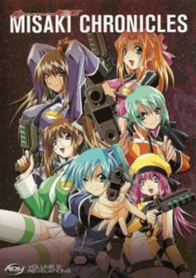

**Studio:** Radix &nbsp;|&nbsp; **Episodes:** 13 &nbsp;|&nbsp; **Director:** Hiroshi Negishi &nbsp;|&nbsp; **Aired/Released:** January 3 – March 27 &nbsp;|&nbsp; **Genres:** Power Suit, Earth, Ecchi, Time Travel, Shipboard, Alien, Future, Science Fiction, Action, Space, Mecha, Adventure, Military

> Through the long distance warp called the "Exodus Project", Worns, Ryer and the other crew members of "Watchers Nest" manage to escape from the Earth. Misaki, who was attending the final battle with "Ghoul" at that time, isn't present there and before her eyes, the earth changes and gets enclosed by a time barrier. Ryer and the others search for a way to escape from this space time maze, but the earth changes to various forms. Innumerable "Nows" appear due to varying time axes. And also Misaki, who should have disappeared because of the Exodus Project incident, still afortiori. Before Ryer and the others, different forms of Misaki appear. The Misaki from training school, the Misaki from her childhood days. Are these reflections caused by the conflicts that exist inside Misaki? She awakens a second time and when she derives the response, that history is leading into a completely differnet direction now. Will Misaki, Ryer and the others be able to find a real happy end?!
>
> _Synopsis source: Kitsu_

[Kitsu](https://kitsu.io/anime/divergence-eve-2-misaki-chronicles)

---

### Mezzo DSA

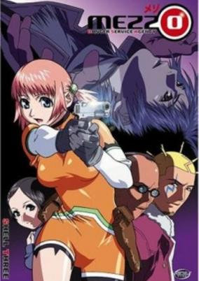

**Studio:** Arms &nbsp;|&nbsp; **Episodes:** 13 &nbsp;|&nbsp; **Director:** Yasuomi Umetsu &nbsp;|&nbsp; **Aired/Released:** January 4 – March 28 &nbsp;|&nbsp; **Genres:** Asia, Present, Japan, Comedy, Action, Violence, Earth, Bounty Hunter, Crime, Alternative Present, Science Fiction, Adventure, Mystery

> Mikura, Kurokawa, and Harada are the 3 members of the Danger Service Agency (DSA). Mikura is the brawns of the group, Harada is the brains, and Kurokawa is just a bitter ex-cop that likes to think he's in charge. They'll take on any job as long as it involves lots of danger and, of course, money. If you want to live long enough to eat dinner, you better not cross them. Their biggest case, however, could prove to be finding out why someone wants Kurokawa assassinated.
>
> _Synopsis source: Kitsu_

[Wikipedia](https://en.wikipedia.org/wiki/Mezzo_DSA) · [Kitsu](https://kitsu.io/anime/mezzo-dsa)

---

### Gokusen (The Gokusen)

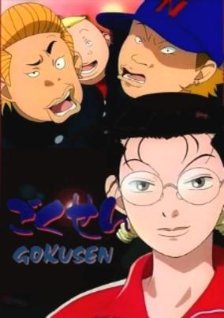

**Studio:** Madhouse &nbsp;|&nbsp; **Episodes:** 13 &nbsp;|&nbsp; **Director:** Yūzō Satō &nbsp;|&nbsp; **Aired/Released:** January 7 – March 31 &nbsp;|&nbsp; **Genres:** Mafia, Delinquent, High School, Slapstick, School Life, Action, Japan, Comedy, Slice of Life, Present, Josei

> Kumiko Yamaguchi is smart, enthusiastic, and ready to start her dream job as a math teacher at Shirokin Academy. But as her first day opens on atrocious students and cowering teachers, Kumiko realizes that the all-boys high school is a cesspool of delinquents with no intention of improving themselves. However, what her rowdy students don't know is that behind her dorky facade, Kumiko is the acting head of a powerful yakuza clan, and she has the skills to prove it! Capable of overpowering even the strongest of gangsters in seconds, Kumiko must keep her incredible strength and criminal influence a secret in order to keep her job. Unfortunately, with the vice principal constantly trying to get her fired and Shin Sawada, the leader of her class of delinquents, suspecting she's stronger than she lets on, Kumiko has a difficult teaching career ahead of her. [Written by MAL Rewrite]
>
> _Synopsis source: Kitsu_

[Wikipedia](https://en.wikipedia.org/wiki/Gokusen) · [Kitsu](https://kitsu.io/anime/gokusen)

---

### SD Gundam Force

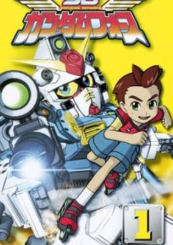

**Studio:** Sunrise &nbsp;|&nbsp; **Episodes:** 52 &nbsp;|&nbsp; **Director:** Yūichi Abe &nbsp;|&nbsp; **Aired/Released:** January 7 – December 29 &nbsp;|&nbsp; **Genres:** Mecha, Action, Parody, Comedy, Gunfights, Fantasy, Adventure

> The land of Neotopia is attacked by the Dark Axis, evil invaders from another dimension who wish to conquer this land. Neotopia's answer: the secret Super Dimensional Guard and their defenders, the Gundam Force. Led by Captain Gundam, the Gundam Force and its team of Gundams with special abilities are aided by a boy named Shute as they stop at nothing to defend the land from the Dark Axis and to defeat them once and for all.
>
> _Synopsis source: Kitsu_

[Wikipedia](https://en.wikipedia.org/wiki/Superior_Defender_Gundam_Force) · [Kitsu](https://kitsu.io/anime/sd-gundam-force)

---

### Jubei-chan 2: The Counterattack of Siberia Yagyu

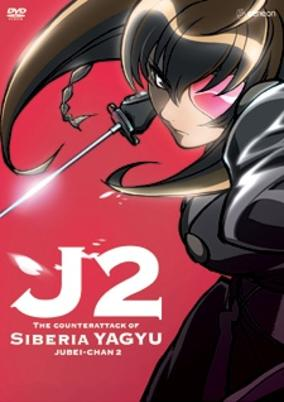

**Studio:** Madhouse &nbsp;|&nbsp; **Episodes:** 13 &nbsp;|&nbsp; **Director:** Hiroshi Nagahama &nbsp;|&nbsp; **Aired/Released:** January 8 – April 1 &nbsp;|&nbsp; **Genres:** Earth, Swordplay, Martial Arts, Action, Japan, Comedy, Asia, Present, Samurai, Adventure

> Three hundred years ago, in the frigid land of Siberia, Jubei Yagyu engaged in a fierce battle with Kitaretsusai of the Northern Yagyu clan. The duel was costly, as his daughter Freesia was frozen in suspended animation. As a result of global warming in the present day, Freesia breaks free from her icy grave and moves to Japan as a middle school transfer student, where she befriends Jiyuu Nanohana. Little does Jiyuu know that Freesia is targeting her to acquire the coveted Lovely Eye Patch, which Freesia believes is rightfully hers.
>
> _Synopsis source: Kitsu_

[Wikipedia](https://en.wikipedia.org/wiki/Jubei-chan_2) · [Kitsu](https://kitsu.io/anime/jubei-chan-the-ninja-girl-2)

---

### Maria Watches Over Us

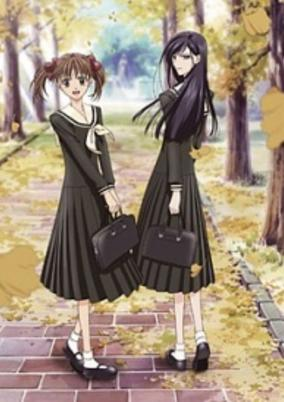

**Studio:** Studio Deen &nbsp;|&nbsp; **Episodes:** 13 &nbsp;|&nbsp; **Director:** Yukihiro Matsushita &nbsp;|&nbsp; **Aired/Released:** January 8 – March 31 &nbsp;|&nbsp; **Genres:** Earth, Coming Of Age, High School, All Girls School, School Life, Japan, Slice of Life, Asia, Present, Shoujo Ai, Romance

> When Yumi Fukuzawa entered the Lillian Girls' Academy, a prestigious all-girls Catholic school in Tokyo, she never imagined she would catch the eye of beautiful and demure Sachiko Ogasawara, one of the school's most popular students. Now Sachiko has offered to be Yumi's soeur, her "sister" and guide for all her years at the academy. The whole idea has Yumi completely flustered—after all, they hardly know each other! The entire campus is abuzz with rumors about the two of them, but Yumi is conflicted over accepting Sachiko's offer. While she admires Sachiko, being her soeur would also mean constantly being at the center of the entire school's attention!
>
> _Synopsis source: Kitsu_

[Wikipedia](https://en.wikipedia.org/wiki/Maria_Watches_Over_Us) · [Kitsu](https://kitsu.io/anime/maria-sama-ga-miteru)

---

### Area 88

**Studio:** Group TAC &nbsp;|&nbsp; **Episodes:** 12 &nbsp;|&nbsp; **Director:** Isamu Imakake &nbsp;|&nbsp; **Aired/Released:** January 9 – March 26

[Wikipedia](https://en.wikipedia.org/wiki/Area_88)

---

### Gravion Zwei (Super Heavy God Gravion Zwei)

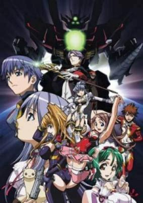

**Studio:** Gonzo &nbsp;|&nbsp; **Episodes:** 12 &nbsp;|&nbsp; **Director:** Masami Ōbari &nbsp;|&nbsp; **Aired/Released:** January 9 – March 26 &nbsp;|&nbsp; **Genres:** Transforming Craft, Ecchi, Maid, Alien, Drama, Future, Stereotypes, Robot, Piloted Robot, Science Fiction, Action, Mecha, Plot Continuity, Adventure, Comedy

> After Gravion was able to use its ultimate attack, the Zeravire threat seemed to have temporary stopped. However when it rises back up all of a sudden, the Earth Gult and its trump card, the super robot Gravion, is needed to defend this world again. All this while, the EFA is planning to create their own weapons to counter the Zeravire, the Grand Trooper. Now as they attempt to fend off the Zeravire, the people of the Earth Gult and EFA must protect their future as well as confront their pasts, and unveil the mysteries of the Zeravire.
>
> _Synopsis source: Kitsu_

[Wikipedia](https://en.wikipedia.org/wiki/Gravion_Zwei) · [Kitsu](https://kitsu.io/anime/choujuushin-gravion-zwei)

---

### Yumeria

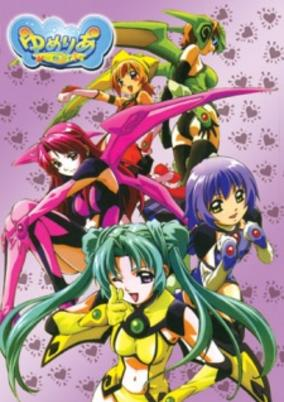

**Studio:** Studio Deen &nbsp;|&nbsp; **Episodes:** 12 &nbsp;|&nbsp; **Director:** Keitaro Motonaga &nbsp;|&nbsp; **Aired/Released:** January 9 – March 26 &nbsp;|&nbsp; **Genres:** Fantasy, Power Suit, Earth, Ecchi, Action, Japan, Comedy, Asia, Present, Harem, Super Power

> On his 16th birthday, Tomokazu Mikuri had a realistic dream where he sees a girl battling a giant floating monstrosity. When he wakes up, he is surprised that the girl is actually sleeping next to him... Whenever he sleeps from now on, he ends up back at the dream world, and more and more people that he knows keep showing up there too. He finds out from a mysterious masked woman in the dream world named Silk that they are fighting against one named Faydoom, and he is the one who provides the powers to those girls so that they can fight these monsters. And so it goes...
>
> _Synopsis source: Kitsu_

[Wikipedia](https://en.wikipedia.org/wiki/Yumeria) · [Kitsu](https://kitsu.io/anime/yumeria)

---

### Transformers: Energon (Transformers Energon)

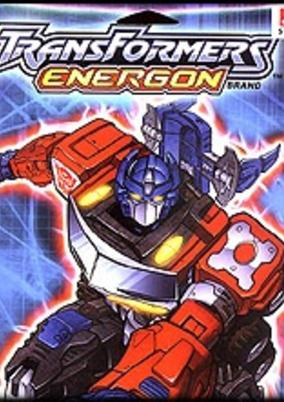

**Studio:** Actas &nbsp;|&nbsp; **Episodes:** 51 &nbsp;|&nbsp; **Director:** Yutaka Satō (1-5) Jun Kawagoe (1-13) Takashi Sano (6-51) &nbsp;|&nbsp; **Aired/Released:** January 9 – December 24 &nbsp;|&nbsp; **Genres:** Transforming Craft, Earth, Other Planet, Alien, Future, Robot Helper, Science Fiction, Action, Mecha, Space, Adventure

> It has been 10 years since the fateful battle with Unicron. Many of the Decepticons who fought in the battle against Unicron have joined forces with the Autobos to mine for Energon, an alternate energy source. But a new source of evil has a risen, Alpha Q who plans to steal the Energon from the Autobots with the help of Scorponok and the Terrorcons. This new evil is trying to revive Megatron and Unicron in order to rekindle the old flames of war.
>
> _Synopsis source: Kitsu_

[Kitsu](https://kitsu.io/anime/transformers-superlink)

---

### Monkey Turn

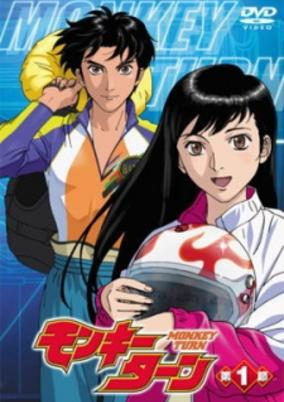

**Studio:** OLM &nbsp;|&nbsp; **Episodes:** 25 &nbsp;|&nbsp; **Director:** Kunitoshi Okajima &nbsp;|&nbsp; **Aired/Released:** January 11 – June 27 &nbsp;|&nbsp; **Genres:** Sports

> Based on Kawai Katsutoshi's manga of the same name, published in Weekly Shounen Sunday, Monkey Turn is a sports anime based around professional speed boat racing. The anime's protagonist, Tadano Kenji, is too short to follow his dream of becoming a professional baseball player, but his baseball coach recommends him to boat racing. One day Tadano-san unexpectedly meets his old girlfriend and they exchange promises: in return for her being faithful to him, he is charged with becoming Japan's best racer within three years. The eponymous "Monkey Turn" is a boat maneuver Kenji-san thought up while visiting his girlfriend. The Monkey Turn gives Kenji quite the advantage over other boaters, but is it enough for him become the best?
>
> _Synopsis source: Kitsu_

[Wikipedia](https://en.wikipedia.org/wiki/Monkey_Turn) · [Kitsu](https://kitsu.io/anime/monkey-turn)

---

### Burn Up Scramble

**Studio:** AIC &nbsp;|&nbsp; **Episodes:** 12 &nbsp;|&nbsp; **Director:** Hiroki Hayashi &nbsp;|&nbsp; **Aired/Released:** January 12 – March 29 &nbsp;|&nbsp; **Genres:** Contemporary Fantasy, Ecchi, Violent Retribution For Accidental Infringement, Special Squads, Gunfights, Conspiracy, Future, Stereotypes, Law And Order, Science Fiction, Action, Japan, Comedy, Violence, Cops

> AD. 2023, Tokyo. Because of the change of the society such as internationalization and enlargement of the trading, the dark side of the society also continues changing. The criminals are getting deep, and their organizations are increasing its size, then the peace and security is getting worse. The government takes it seriously, and decides to introduce an innovative system. In order to cope with the special criminals, an extralegal police is founded. It is a special criminal team, Warriors, which consists of a few elite members.
>
> _Synopsis source: Kitsu_

[Wikipedia](https://en.wikipedia.org/wiki/Burn_Up_Scramble) · [Kitsu](https://kitsu.io/anime/burn-up-scramble)

---

### Chou Henshin Cosprayers (The Cosmopolitan Prayers)

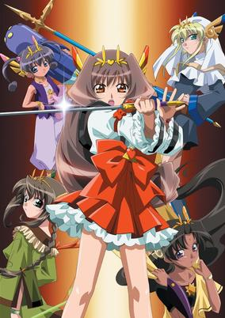

**Studio:** Imagin Studio Live &nbsp;|&nbsp; **Episodes:** 8 &nbsp;|&nbsp; **Director:** Takeo Takahashi &nbsp;|&nbsp; **Aired/Released:** January 13 – March 2 &nbsp;|&nbsp; **Genres:** Ecchi, Action, Present, Super Power, Magic, Science Fiction, Fantasy, Adventure, Comedy

> Koto unknowingly seals away the Sun Goddess Amaterasu, and now she is in a different world and can't return. Meeting priestesses who combat the evil in this strange place she learns that Black Towers throughout the land keep Amatersu sealed away and are guarded by evil monsters. Koto must now find a way to help defeat these monsters and return the world to the way it was.
>
> _Synopsis source: Kitsu_

[Wikipedia](https://en.wikipedia.org/wiki/The_Cosmopolitan_Prayers) · [Kitsu](https://kitsu.io/anime/cosprayers)

---

### Daphne in the Brilliant Blue

**Studio:** J.C.Staff &nbsp;|&nbsp; **Episodes:** 24 &nbsp;|&nbsp; **Director:** Takashi Ikehata &nbsp;|&nbsp; **Aired/Released:** January 15 – July 3 &nbsp;|&nbsp; **Genres:** Earth, Bounty Hunter, Future, Science Fiction, Action, Japan, Comedy, Asia, Cops, Psychological, Mystery, Ecchi, Seinen

> In the future, water has covered much of the Earth due to the effects of global warming. The orphaned Maia Mizuki, 15, just graduated from middle school and has already applied for employment in the elite paramilitary Ocean Agency, part of the futuristic world government. Only the best, most intelligent, and physically fit students are eligible for admission. Maia, the series' protagonist, is set to become one of the few. But her ideal life quickly falls apart. To her disappointment, Maia unexpectedly fails her entrance exams. Making matters worse, she promptly gets evicted from her house, pick pocketed, taken hostage, then shot. She is "saved" by two women (Rena and Shizuka) that are part of an unorthodox help-for-hire organization called Nereids (inspired by the Greek mythological Nereids ). With nowhere to go, Maia joins up with Nereids, taking jobs from capturing wanted criminals to chasing stray cats, often with unexpected results. Gloria and Yu later join up with Nereids. "Daphne" in the title refers to a subplot that starts midway into the series and eventually become important to Maia. "Brilliant Blue" refers to the fact that this is a world covered by water with almost no land. The world consists of vast oceans, a few islands, and floating cities.
>
> _Synopsis source: Kitsu_

[Wikipedia](https://en.wikipedia.org/wiki/Daphne_in_the_Brilliant_Blue) · [Kitsu](https://kitsu.io/anime/hikari-to-mizu-no-daphne)

---

### Diamond Daydreams

**Studio:** Studio Deen &nbsp;|&nbsp; **Episodes:** 12 &nbsp;|&nbsp; **Director:** Bob Shirohata &nbsp;|&nbsp; **Aired/Released:** January 20 – April 5 &nbsp;|&nbsp; **Genres:** Earth, Coming Of Age, Romance, Japan, Asia, Present, Slice of Life

> If a couple sees the diamond dust together, then they will certainly find eternal happiness. Or so it is said. This is a drama about the romances, friendships and conflicts of six girls from Hokkaido and how the diamond dust affects them and eventually links them together in the search for happiness.
>
> _Synopsis source: Kitsu_

[Wikipedia](https://en.wikipedia.org/wiki/Diamond_Daydreams) · [Kitsu](https://kitsu.io/anime/kita-e-diamond-dust-drops)

---

### Futari wa Pretty Cure

**Studio:** Toei Company &nbsp;|&nbsp; **Episodes:** 49 &nbsp;|&nbsp; **Director:** Daisuke Nishio &nbsp;|&nbsp; **Aired/Released:** February 1 – January 30, 2005 &nbsp;|&nbsp; **Genres:** Fantasy, Japan, Earth, Action, Asia, Magic, Magical Girl, Present, Comedy

> The Courageous Warriors of the Garden of Hope have summoned Nagisa, Honoka, and Hikari to protect their kingdom from a witch who plans to steal the Diamond Line, which is a set of jewelry the queen of the Garden of Hope wears to a ceremony every year to replenish the water of the kingdom. The witch plans to resurrect the Dark Lord and if she does so, not only will the Garden of Hope be destroyed, but other kingdoms in the galaxies, including the Garden of Rainbows and the Garden of Light.
>
> _Synopsis source: Kitsu_

[Wikipedia](https://en.wikipedia.org/wiki/Futari_wa_Pretty_Cure) · [Kitsu](https://kitsu.io/anime/futari-wa-precure-max-heart-movie)

---

### Kaiketsu Zorori

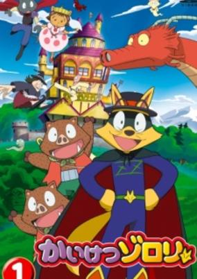

**Studio:** Ajia-do &nbsp;|&nbsp; **Episodes:** 52 &nbsp;|&nbsp; **Director:** Tsutomu Shibayama (eps 53-149) &nbsp;|&nbsp; **Aired/Released:** February 1 – February 6, 2005 &nbsp;|&nbsp; **Genres:** Comedy, Adventure

> Adapted from the popular storybooks of the same name by Yutaka Hara, Kaiketsu Zorori follows the adventures of a scheming fox named Zorori, who is determined to become the King of Mischief with his very own castle and beautiful bride. Although Zorori is notorious for his pranks and tricks, his conniving plots often backfire and end up helping his targets, and despite appearing to be villainous and immoral, he is actually caring and sentimental. Nevertheless, Zorori has the wits, intelligence, and dexterity to always find a solution out of the most hopeless of situations. Travelling with a pair of twin boar bandits, Ishishi and Noshishi, he continues on his journey to make his deceased mother proud.
>
> _Synopsis source: Kitsu_

[Wikipedia](https://en.wikipedia.org/wiki/Kaiketsu_Zorori) · [Kitsu](https://kitsu.io/anime/kaiketsu-zorori)

---

### Paranoia Agent

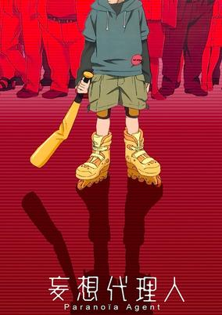

**Studio:** Madhouse &nbsp;|&nbsp; **Episodes:** 13 &nbsp;|&nbsp; **Director:** Satoshi Kon &nbsp;|&nbsp; **Aired/Released:** February 3 – May 18 &nbsp;|&nbsp; **Genres:** Earth, Thriller, Law And Order, Japan, Asia, Violence, Present, Cops, Psychological, Mystery, Supernatural, Drama

> The infamous Shounen Bat (Lil' Slugger) is terrorizing the residents of Musashino City. Flying around on his rollerblades and beating people down with a golden baseball bat, the assailant seems impossible to catch—much less understand. His first victim, the well-known yet timid character designer Tsukiko Sagi, is suspected of orchestrating the attacks. Believed only by her anthropomorphic pink stuffed animal, Maromi, Tsukiko is just one of Shounen Bat's many victims. As Shounen Bat continues his relentless assault on the town, detectives Keiichi Ikari and Mitsuhiro Maniwa begin to investigate the identity of the attacker. However, more and more people fall victim to the notorious golden bat, and news of the assailant begins circulating around the town. Paranoia starts to set in as chilling rumors spread amongst adults and children alike. Will the two detectives be able to unravel the truth behind Shounen Bat, or will the paranoia get to them first? [Written by MAL Rewrite]
>
> _Synopsis source: Kitsu_

[Wikipedia](https://en.wikipedia.org/wiki/Paranoia_Agent) · [Kitsu](https://kitsu.io/anime/paranoia-agent)

---

### Yugo the Negotiator

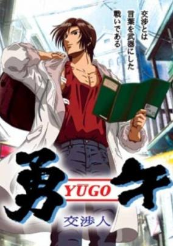

**Studio:** G&G Direction (Pakistan Chapter) Artland (Russia Chapter) &nbsp;|&nbsp; **Episodes:** 13 &nbsp;|&nbsp; **Director:** Seiji Kishi (Pakistan Chapter) Shinya Hanai (Russia Chapter) &nbsp;|&nbsp; **Aired/Released:** February 24 – May 25 &nbsp;|&nbsp; **Genres:** Russia, Asia, Action, Thriller, Plot Continuity, Present, Military, Psychological, Mystery

> "Negotiation means, you turn words into weapons" This is the realization of the popular comic Yu-go that was published in Kondasha Afternoon Magazine over a period of 10 years. Beppu Yuugo is the world's most successfull negotiator. His only weapons are "words." Yuugo doesn't kill people. Neither does he threaten them with brute violence. With rich knowledge and a calm judgement, he believes in the humans inside them. Doing only that he has managed many dangerous negotiations successfully until now. Now two of the many episodes have been chosen very carefully, one taking place in Russia, the other one in Pakistan. In the burning desert and the freezing Siberia Yuugo begins his negotiations.
>
> _Synopsis source: Kitsu_

[Wikipedia](https://en.wikipedia.org/wiki/Yugo_the_Negotiator) · [Kitsu](https://kitsu.io/anime/yugo-the-negotiator)

---

### Hit wo Nerae!

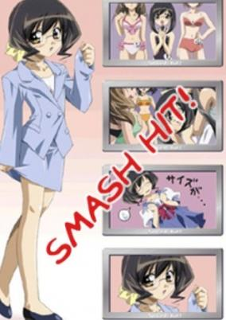

**Studio:** Imagin Studio Live &nbsp;|&nbsp; **Episodes:** 8 &nbsp;|&nbsp; **Director:** Takeo Takahashi &nbsp;|&nbsp; **Aired/Released:** March 9 – April 27 &nbsp;|&nbsp; **Genres:** Ecchi, Japan, Slice of Life, Comedy, Stereotypes, Plot Continuity, Present

> Mitsuki Ikuta works for the Houchiku Corporation, making movies. To all who know her, she is perceived as being a very infantile woman, still wearing childish fashions. A fan of the detective movie genre, she suddenly finds herself chosen to be the main producer of a new film—but it's a "hero movie" (a genre generally considered childish). Determined to succeed, regardless, she takes on the job.
>
> _Synopsis source: Kitsu_

[Wikipedia](https://en.wikipedia.org/wiki/Hit_wo_Nerae!) · [Kitsu](https://kitsu.io/anime/smash-hit)

---

### Hi no Tori (Bird of Fire)

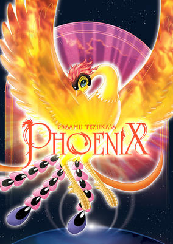

**Studio:** Tezuka Productions &nbsp;|&nbsp; **Episodes:** 13 &nbsp;|&nbsp; **Director:** Ryousuke Takahashi &nbsp;|&nbsp; **Aired/Released:** March 21 – June 27 &nbsp;|&nbsp; **Genres:** Science Fiction, Post Apocalypse, Earth, Alternative Past, Religion, War, Drama, Past, Future, Parallel Universe, Plot Continuity, Historical, Adventure

> Hi no Tori is a collection of stories that all have something in common. The Phoenix, whose blood is believed to give an eternal life to one who drinks it. Therefore many seek to kill it, but as the Phoenix of the tale, it's reborn from the ashes. Stories take place in future and the past, where humans fight with each other as always, and everyone is afraid to die. But still, every story teaches a lesson: Life is beginning of an eternity, an never-ending cycle.
>
> _Synopsis source: Kitsu_

[Wikipedia](https://en.wikipedia.org/wiki/Hi_no_Tori) · [Kitsu](https://kitsu.io/anime/hi-no-tori)

---

### Massugu ni Ikou. (Season 2)

**Studio:** Yumeta Company &nbsp;|&nbsp; **Episodes:** 5 &nbsp;|&nbsp; **Director:** Kiyotaka Isako &nbsp;|&nbsp; **Aired/Released:** March 27 – April 1 &nbsp;|&nbsp; **Genres:** Comedy, Slice of Life, Romance

> Mametarou is a Crossbreed and this is about his daily activities and the friends he makes with his girlfriend, Hanako.
>
> _Synopsis source: Kitsu_

[Kitsu](https://kitsu.io/anime/massugu-ni-ikou-2004)

---

### Kenran Butou Sai: The Mars Daybreak (Mars Daybreak)

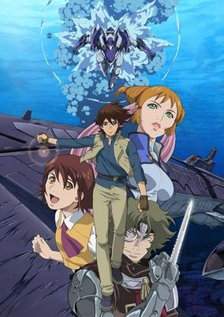

**Studio:** Bones &nbsp;|&nbsp; **Episodes:** 26 &nbsp;|&nbsp; **Director:** Kunihiro Mori &nbsp;|&nbsp; **Aired/Released:** April 1 – September 23 &nbsp;|&nbsp; **Genres:** Pirate, Science Fiction, Mecha, Piloted Robot, Comedy, Crime, Mars, Other Planet, Navy, Space, Military, Adventure, Romance

> Mars is now almost entirely covered in water. Humanity exists in large city-ships that float through the open seas. But life is hard for those who live on Mars—the economy is in bad shape, work is scarce, and food is expensive and highly prized. Gram and his friends try to do the best they can, but the work keeps drying up. Some have taken to a life of piracy to combat the corruption in the government; one such group is the pirates of the feared Ship of Aurora. And the Earth government, which rules Mars, has dispatched a new team of military pilots to combat them. In their specialized mecha called Round Bucklers, they must make the seas of Mars safe for humanity. Caught in the wrong place at the wrong time, Gram finds himself on the run with the most notorious pirates on Mars. But here's the thing—he's starting to like them!
>
> _Synopsis source: Kitsu_

[Wikipedia](https://en.wikipedia.org/wiki/Mars_Daybreak) · [Kitsu](https://kitsu.io/anime/kenran-butou-sai-the-mars-daybreak)

---

### Koi Kaze

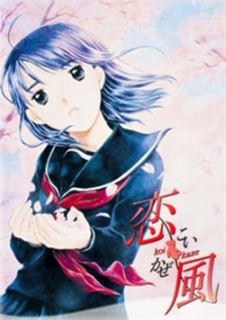

**Studio:** A.C.G.T &nbsp;|&nbsp; **Episodes:** 13 &nbsp;|&nbsp; **Director:** Takahiro Omori &nbsp;|&nbsp; **Aired/Released:** April 2 – June 18 &nbsp;|&nbsp; **Genres:** Romance, Earth, Japan, Asia, Slice of Life, Coming Of Age, Drama, Plot Continuity, Present, Psychological

> Saeki Koushirou works as a wedding planner, but his own love life is a shambles. His background makes it difficult for him to commit himself wholeheartedly to love. The child of a divorced couple, he lives with his father. He has a mother and a sister, but he has not seen them in years. After being dumped by his girlfriend, a chance encounter with a female high school student shakes Koushirou's calm and awakens new feelings in him—but he learns that the girl is in fact his sister, who will now be staying with his father and him. Yet, the feelings in Koushirou's heart...
>
> _Synopsis source: Kitsu_

[Wikipedia](https://en.wikipedia.org/wiki/Koi_Kaze) · [Kitsu](https://kitsu.io/anime/koi-kaze)

---

### Kono Minikuku mo Utsukushii Sekai (This Ugly Yet Beautiful World)

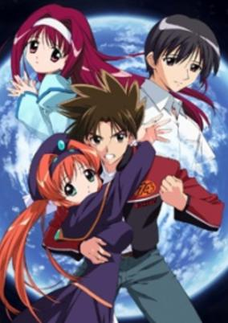

**Studio:** Gainax Shaft &nbsp;|&nbsp; **Episodes:** 12 &nbsp;|&nbsp; **Director:** Shouji Saeki &nbsp;|&nbsp; **Aired/Released:** April 2 – June 18 &nbsp;|&nbsp; **Genres:** Ecchi, Science Fiction, Asia, Earth, Sudden Girlfriend Appearance, Romance, Japan, Present, Super Power, Magic, Comedy

> High school student Takeru Takemoto works part time as a (motor)bike courier. During one of his deliveries, he saw a mysterious light passing him and fell into a forest. What he had found was a beautiful girl coming out from a glowing cocoon, calling herself "Hikari." While Takeru was quite embarrassed because of Hikari's nudity, a strange monster suddenly showed up and immediately attacked the two. Both Takeru and Hikari demonstrated the power of their other selves before Takeru had a clue of what's going on.
>
> _Synopsis source: Kitsu_

[Wikipedia](https://en.wikipedia.org/wiki/Kono_Minikuku_mo_Utsukushii_Sekai) · [Kitsu](https://kitsu.io/anime/kono-minikuku-mo-utsukushii-sekai)

---

### Tenjho Tenge

**Studio:** Madhouse &nbsp;|&nbsp; **Episodes:** 24 &nbsp;|&nbsp; **Director:** Toshifumi Kawase &nbsp;|&nbsp; **Aired/Released:** April 2 – September 17 &nbsp;|&nbsp; **Genres:** Ecchi, Japan, Action, Asia, Earth, Delinquent, Martial Arts, High School, School Clubs, Drama, School Life, Plot Continuity, Violence, Present, Super Power, Comedy

> For some people, high school represents the opportunity for a fresh start. You can take new classes and make new friends. For Souichiro Nagi and Bob Makihara, though, high school means something different: the chance to become the top fighters in the entire student body! Too bad Toudou Academy is the hardest possible place to realize their dreams. Their new high school is no ordinary academic institution. Rather than concentrating on classic subjects like math and science, Toudou Academy was created for the sole purpose of reviving the martial arts in Japan! As a result, Souichiro's aspirations to become top dog are cut short when he runs afoul of Masataka Takayanagi and Maya Natsume. The two upperclassmen easily stop the freshmen duo's rampage across school, but rather than serving as a deterrent, it only stokes their competitive fire. What kind of monstrous fighters attend Toudou Academy? Are there any stronger than Masataka and Maya? And why in the world is Maya's younger sister stalking Souichiro? Learn the answers to these questions and more in Tenjou Tenge!
>
> _Synopsis source: Kitsu_

[Wikipedia](https://en.wikipedia.org/wiki/Tenjho_Tenge) · [Kitsu](https://kitsu.io/anime/tenjou-tenge)

---

### Saiyuki Gunlock

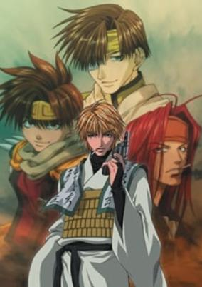

**Studio:** Pierrot &nbsp;|&nbsp; **Episodes:** 26 &nbsp;|&nbsp; **Director:** Tetsuya Endō &nbsp;|&nbsp; **Aired/Released:** April 2 – September 24 &nbsp;|&nbsp; **Genres:** Fantasy, Action, Comedy, Contemporary Fantasy, Martial Arts, Magic, Demon, Adventure

> The Sanzo Ikkou continues its westward journey, on a mission to prevent a demonic resurrection. As Genjo Sanzo, Cho Hakkai, Sha Gojyo, and Son Goku fight their way to their goal, their path is fraught with internal strife. When they encounter a formidable pair of adversaries from the west, the cohesion of the group -- and the fate of the mission -- may be at stake.
>
> _Synopsis source: Kitsu_

[Wikipedia](https://en.wikipedia.org/wiki/Saiyuki_Gunlock) · [Kitsu](https://kitsu.io/anime/saiyuki-reload-gunlock)

---

### Mermaid Melody Pichi Pichi Pitch Pure (Mermaid Melody: Pichi Pichi Pitch)

**Studio:** Actas Synergy Japan &nbsp;|&nbsp; **Episodes:** 39 &nbsp;|&nbsp; **Director:** Yoshitaka Fujimoto &nbsp;|&nbsp; **Aired/Released:** April 3 – December 25 &nbsp;|&nbsp; **Genres:** Earth, Romance, Fantasy, Contemporary Fantasy, Japan, Asia, Slice of Life, Mermaid, Magic, Magical Girl, Present, Music, Adventure, Comedy

> As the mermaid princess of the North Pacific (one of the seven mermaid kingdoms), Lucia entrusts a magical pearl to a boy who falls overboard a ship one night. Lucia must travel to the human world to reclaim her pearl and protect the mermaid kingdoms. Using the power of music Lucia is able to protect herself and the mermaid kingdoms from a growing evil force.
>
> _Synopsis source: Kitsu_

[Wikipedia](https://en.wikipedia.org/wiki/Mermaid_Melody_Pichi_Pichi_Pitch) · [Kitsu](https://kitsu.io/anime/mermaid-melody-pichi-pichi-pitch)

---

### Sgt. Frog

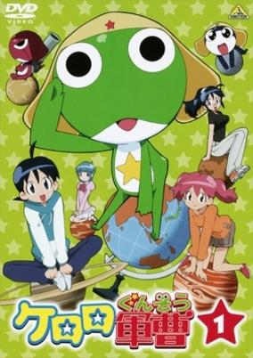

**Studio:** Sunrise &nbsp;|&nbsp; **Episodes:** 358 &nbsp;|&nbsp; **Director:** Junichi Sato (until 2006 ) Yusuke Yamamoto (#1–103) Nobuhiro Kondo (#104–358) &nbsp;|&nbsp; **Aired/Released:** April 3 – April 4, 2011 &nbsp;|&nbsp; **Genres:** Japan, Asia, Earth, Parody, Comedy, Alien, Slapstick, Present, Space, Science Fiction

> Unsuspecting inhabitants of the planet Earth are going about their business, enjoying a bright and particularly beautiful sunny day, when a young Japanese boy spots a shiny object falling from the sky... Has an alien invasion finally begun? Elsewhere in Japan, Keroro, frog sergeant and leader of the Space Invasion Army Special Tactics Platoon of the 58th Planet in the Gamma Planetary System, has discovered the perfect hideout. He infiltrates the home of the Hinata family in an attempt to establish a headquarters that he and his troops could use to prepare for world domination... but earthlings Fuyuki and Natsumi Hinata are too much for him to handle! Natsumi instinctively calls them out of hiding, leaving the hapless sergeant no option but to reveal his secret identity. The two siblings soon welcome the sergeant to their home, all thanks to Fuyuki’s generos—err... curiosity. The Sergeant has successfully infiltrated his first target area! Or has he? Join Keroro Gunsou in his dastardly attempt to take over the world!
>
> _Synopsis source: Kitsu_

[Wikipedia](https://en.wikipedia.org/wiki/Sgt._Frog) · [Kitsu](https://kitsu.io/anime/keroro-gunsou)

---

### Aishiteruze Baby

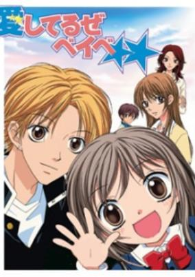

**Studio:** TMS Entertainment &nbsp;|&nbsp; **Episodes:** 26 &nbsp;|&nbsp; **Director:** Masaharu Okuwaki &nbsp;|&nbsp; **Aired/Released:** April 3 – October 9 &nbsp;|&nbsp; **Genres:** Romance, Earth, Japan, Asia, Coming Of Age, Present, Comedy

> Katakura Kippei is in every way a high school playboy. Spending his days flirting with any female he can see, responsibility is the last thing on his mind. Life takes an unexpected turn for him as one day he returns home to find himself with the fulltime task of caring for his 5-year-old cousin. Kippei's aunt Miyako had disappeared, appearing to have abandoned his cousin, Yuzuyu. With Kippei's lack of responsibility and knowledge of childcare and Yuzuyu's injured heart with the disappearance of her mother, their time together is in for a bumpy ride.
>
> _Synopsis source: Kitsu_

[Wikipedia](https://en.wikipedia.org/wiki/Aishiteruze_Baby) · [Kitsu](https://kitsu.io/anime/aishiteruze-baby)

---

### Kyou kara Maou! (King From Now On!)

**Studio:** Studio Deen &nbsp;|&nbsp; **Episodes:** 78 &nbsp;|&nbsp; **Director:** Junji Nishimura &nbsp;|&nbsp; **Aired/Released:** April 3 – February 25, 2006 &nbsp;|&nbsp; **Genres:** Fantasy World, Fantasy, Action, Swordplay, Bishounen, Past, Parallel Universe, Demon, Adventure, Comedy

> Kyou kara Maou! revolves around Yuri Shibuya, your average Japanese teenager. One day, Yuri sees a classmate being harassed by bullies. Thanks to this intervention, his friend is able to escape, but unfortunately Yuri becomes the new target of the bullies in the process and gets his head shoved into a toilet. But instead of water, the toilet contains a swirling portal that sucks him into another world, largely resembling medieval Europe. There, he is told that he will become the next Demon King due to his black hair and black eyes, traits only possessed by the demon's royal lineage. Yuri's arrival is met with some skepticism by some of the demons, who view him as unworthy to be their king. However, after Yuri wins a duel by utilizing his magical powers, the demons slowly begin to acknowledge him as their monarch. Yuri must now learn what it takes be a true Demon King, as he tries to keep the peace between demons and humans in this strange new realm.
>
> _Synopsis source: Kitsu_

[Wikipedia](https://en.wikipedia.org/wiki/Kyou_kara_Maou!) · [Kitsu](https://kitsu.io/anime/kyou-kara-maou)

---

### Dan Doh!!

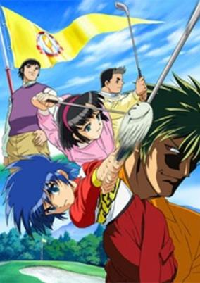

**Studio:** Tokyo Kids &nbsp;|&nbsp; **Episodes:** 26 &nbsp;|&nbsp; **Director:** Hidetoshi Ōmori &nbsp;|&nbsp; **Aired/Released:** April 3 – September 25 &nbsp;|&nbsp; **Genres:** Japan, Sports, Present, Adventure

> Dandoh was playing a baseball game with friends Yuka and Kohei and hits a wild fly ball which crashes into the principal's potted plants. Rather than getting mad, the principal admires Dandoh's swing and introduces him to the world of golf. It's now an adventure in golf as Dandoh is under the watchful eye of a former pro-golfer. They enter a tournament together and play for a shot at the national championships.
>
> _Synopsis source: Kitsu_

[Wikipedia](https://en.wikipedia.org/wiki/Dan_Doh!!) · [Kitsu](https://kitsu.io/anime/dan-doh)

---

### Midori Days

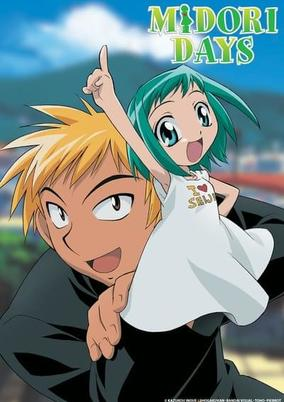

**Studio:** Pierrot &nbsp;|&nbsp; **Episodes:** 13 &nbsp;|&nbsp; **Director:** Tsuneo Kobayashi &nbsp;|&nbsp; **Aired/Released:** April 4 – June 27 &nbsp;|&nbsp; **Genres:** Contemporary Fantasy, Earth, Ecchi, Sudden Girlfriend Appearance, High School, School Life, Romance, Japan, Comedy, Asia, Present

> There isn't a single person in Sakuradamon High who hasn't heard the legends about Seiji "The Mad Dog" Sawamura's demonically powerful right hand. His reputation makes it fairly difficult for him to approach girls, and after being rejected 20 times straight, he half-jokingly vows to finish high school with his right hand for a girlfriend. Much to his surprise, after waking up the next morning, Seiji discovers that his demon right hand has mysteriously turned into a miniature girl, Midori Kasugano, who reveals that she has had a crush on Seiji for the past three years. Because their situation is not ideal for either of them, Seiji attempts to return Midori to normal. But after causing a big misunderstanding at the Kasugano household, the pair decide to keep their predicament between them until a solution is found. Thus begins an odd relationship, and what could be the only chance for Midori to finally be with the one she loves. [Written by MAL Rewrite]
>
> _Synopsis source: Kitsu_

[Wikipedia](https://en.wikipedia.org/wiki/Midori_Days) · [Kitsu](https://kitsu.io/anime/midori-no-hibi)

---

### Legendz: Yomigaeru Ryuuou Densetsu (Legendz: Tale of the Dragon Kings)

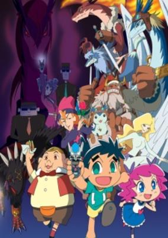

**Studio:** Gallop &nbsp;|&nbsp; **Episodes:** 50 &nbsp;|&nbsp; **Director:** Akitarō Daichi &nbsp;|&nbsp; **Aired/Released:** April 4 – March 27, 2005 &nbsp;|&nbsp; **Genres:** Earth, Fantasy, Comedy, Dragon, United States, Americas, Proxy Battles, Action, Adventure

> When a crafty toy company "Wiz" also known in this show as Dark Wiz Company, finds crystals with the faint DNA of monsters known as "Legendz" are found and made into a battle game. A young boy named Shu receives one these crystals known as "soul figures" from his father after a baseball game. Legendz rapidly became popular and more and more children played it. Wiz employeys start to track down Shu for his special soul figure, for his soul figure can revive real legendz not just the little kiddy digital images! How will Shu fight his way to victory and claim this soul figure as his own?
>
> _Synopsis source: Kitsu_

[Kitsu](https://kitsu.io/anime/legendz-tale-of-the-dragon-kings)

---

### The Marshmallow Times

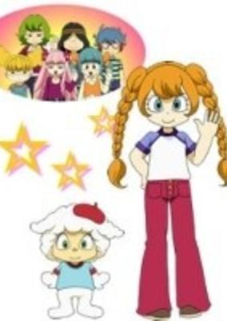

**Studio:** Seoul Movie Studio Comet &nbsp;|&nbsp; **Episodes:** 52 &nbsp;|&nbsp; **Director:** Hiroshi Fukutomi Seung Il Lee &nbsp;|&nbsp; **Aired/Released:** April 4 – March 27, 2005 &nbsp;|&nbsp; **Genres:** School Life, Slice of Life

> The series focuses on 7 children and a sheep-like character. Together, they work together as a team and hang out together. They wear various fashion through the series. They also have different colored hair. Sandy, a girl who has a pet sheep-like character named Cloud and 6 other children, Jasmine, Lime, Basil, Clove, Nattsu, and Cinnamon, became friends, they become a news reporter team. Each episode has the children dressed in various clothes.
>
> _Synopsis source: Kitsu_

[Wikipedia](https://en.wikipedia.org/wiki/The_Marshmallow_Times) · [Kitsu](https://kitsu.io/anime/the-marshmallow-times)

---

### Hanaukyou Maid-tai: La Verite (Hanaukyo Maid Team: La Verite)

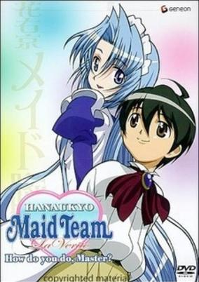

**Studio:** Daume &nbsp;|&nbsp; **Episodes:** 12 &nbsp;|&nbsp; **Director:** Takuya Nonaka &nbsp;|&nbsp; **Aired/Released:** April 4 – June 20 &nbsp;|&nbsp; **Genres:** Ecchi, Japan, Asia, Earth, Slice of Life, Comedy, Swordplay, Maid, Stereotypes, Present, Harem, Romance

> After his mother passes away, Taro Hanaukyo is invited to his grandfather's home. There, he meets a beautiful maid named Mariel and finds out that his grandfather has retired to a remote island and has given him ownership of his estate. Taro also discovers that not only is the estate a colossal mansion, it has hundreds of gorgeous maids ready to serve him 24 hours a day, seven days a week.
>
> _Synopsis source: Kitsu_

[Kitsu](https://kitsu.io/anime/hanaukyou-maid-tai-la-verite)

---

### Get Ride! AMDriver

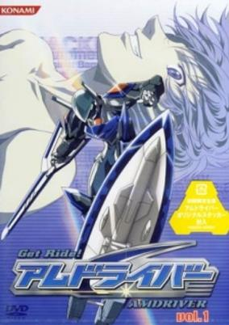

**Studio:** Studio Deen &nbsp;|&nbsp; **Episodes:** 51 &nbsp;|&nbsp; **Director:** Isao Torada &nbsp;|&nbsp; **Aired/Released:** April 5 – March 28, 2005 &nbsp;|&nbsp; **Genres:** Power Suit, Science Fiction, Mecha, Action, Adventure

> In the future, human beings are attacked by beings called the Bug-chine, which appeared a few years back. No normal human weapon can defeat the Bug-chine, but there is hope. It is the AMDrivers that will save the earth. They are solders using the latest "AM Technology". With overwhelming power, they will beat the Bug-chine one after another and become heroes, as well as capture the hearts of their fans.
>
> _Synopsis source: Kitsu_

[Wikipedia](https://en.wikipedia.org/wiki/Get_Ride!_Amdriver) · [Kitsu](https://kitsu.io/anime/get-ride-amdriver)

---

### Sensei no Ojikan: Dokidoki School Hours (Doki Doki School Hours)

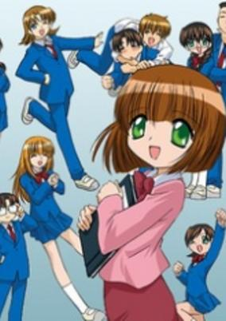

**Studio:** J.C.Staff Studio Guts Studio Matrix &nbsp;|&nbsp; **Episodes:** 13 &nbsp;|&nbsp; **Director:** Yoshiaki Iwasaki &nbsp;|&nbsp; **Aired/Released:** April 5 – June 28 &nbsp;|&nbsp; **Genres:** Earth, Japan, Asia, Comedy, High School, Slapstick, Stereotypes, School Life, Present, Slice of Life

> Meet Suzuki Mika, teacher at Okitsu High School. Mika-sensei is a good teacher, but she has a small problem... literally. Although she's 27, she is only 148 cm tall, and has the face of a child. As a result, it is often difficult for Mika-sensei to get anyone to take her seriously.
>
> _Synopsis source: Kitsu_

[Wikipedia](https://en.wikipedia.org/wiki/Doki_Doki_School_Hours) · [Kitsu](https://kitsu.io/anime/sensei-no-ojikan-doki-doki-school-hours)

---

### Mutsu Enmei Ryuu Gaiden: Shura no Toki (Time of Shura)

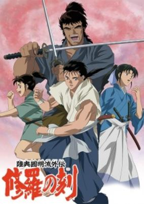

**Studio:** Studio Comet &nbsp;|&nbsp; **Episodes:** 26 &nbsp;|&nbsp; **Director:** Shin Misawa &nbsp;|&nbsp; **Aired/Released:** April 6 – September 28 &nbsp;|&nbsp; **Genres:** Romance, Earth, Japan, Adventure, Action, Asia, Swordplay, Martial Arts, War, Past, Samurai, Historical

> Legends tell of an invincible martial art known as Mutsu Enmei-Ryu, an unarmed style that allows the user to defeat any number of armed opponents using incredible speed and strength. This is the story of three generations of those who bear the name Mutsu, and their encounters and battles with the strongest fighters of their era.
>
> _Synopsis source: Kitsu_

[Wikipedia](https://en.wikipedia.org/wiki/Shura_no_Toki_-_Age_of_Chaos) · [Kitsu](https://kitsu.io/anime/shura-no-toki)

---

### Shinkon Gattai Godannar!! (Season 2) (Marriage of God & Soul Godannar!!)

**Studio:** AIC ASTA OLM &nbsp;|&nbsp; **Episodes:** 13 &nbsp;|&nbsp; **Director:** Yasuchika Nagaoka &nbsp;|&nbsp; **Aired/Released:** April 6 – June 29 &nbsp;|&nbsp; **Genres:** Future, Piloted Robot, Sudden Girlfriend Appearance, Post Apocalypse, Alien, Ecchi, Robot, Science Fiction, Japan, Action, Asia, Earth, Romance, Mecha, Comedy

> Five years ago, while battling an alien force known as the "Mimesis," Dannar pilot Goh Saruwatari first met Anna Aoi. Today, on the day of their wedding, the ceremony is interrupted when the Mimesis strike again. As Goh struggles in his battle against the alien threat, Anna stumbles upon a top secret robot known as the "Neo-Okusaer" and uses it as a last-resort to save her fiancee. At that moment, Dannar and Neo-Okusaer merge to become the mighty robot "Godannar."
>
> _Synopsis source: Kitsu_

[Wikipedia](https://en.wikipedia.org/wiki/Shinkon_Gattai_Godannar) · [Kitsu](https://kitsu.io/anime/shinkon-gattai-godannar)

---

### Madlax

**Studio:** Bee Train &nbsp;|&nbsp; **Episodes:** 26 &nbsp;|&nbsp; **Director:** Kōichi Mashimo &nbsp;|&nbsp; **Aired/Released:** April 6 – September 28 &nbsp;|&nbsp; **Genres:** Earth, Action, Asia, Gunfights, Crime, Rotten World, Plot Continuity, Military, Magic, Psychological, Mystery

> In the country of Gazth-Sonika, civil war rages. There, a mercenary called Madlax plies her trade, with almost supernatural skill. In the seemingly peaceful country of Nafrece, Margaret Burton lives a tranquil life. As separate as their lives may seem, the two are connected by ties of mystery, and by a holy book that is also sought by the shadowy organisation, Enfant. As Margaret and Madlax follow the path of their destiny, they come ever closer to uncovering the truth - with no guarantee that it is a truth they can bear to learn.
>
> _Synopsis source: Kitsu_

[Wikipedia](https://en.wikipedia.org/wiki/Madlax) · [Kitsu](https://kitsu.io/anime/madlax)

---

### Monster

**Studio:** Madhouse &nbsp;|&nbsp; **Episodes:** 74 &nbsp;|&nbsp; **Director:** Masayuki Kojima &nbsp;|&nbsp; **Aired/Released:** April 7 – September 28, 2005

[Wikipedia](https://en.wikipedia.org/wiki/Monster_(anime))

---

### Ragnarok: The Animation (Ragnarok the Animation)

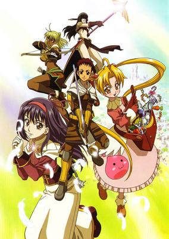

**Studio:** G&G Entertainment Gonzo &nbsp;|&nbsp; **Episodes:** 26 &nbsp;|&nbsp; **Director:** Seiji Kishi Kim Jung Ryool &nbsp;|&nbsp; **Aired/Released:** April 7 – September 29 &nbsp;|&nbsp; **Genres:** Adventure, Fantasy World, Action, Fantasy, Comedy, Swordplay, Magic

> A great evil is sweeping over the realm; an evil that the young swordsman Roan and his life-long companion, the acolyte Yufa, must face head on! For these two travel toward their destiny, from the highest towers to the depths of the underworld, through forest and desert alike. With an ever-growing cast of fellow heroes, fate will grasp these travelers by their very souls and propel the band of skilled adventurers towards a noble end. Or ignoble, if they don't watch their step! Monsters are afoot and the way rife with danger and magic, the path forward may be unclear... But where will is strong, there is a way! Lessons wait in the depths of darkness, and good must prevail. The journey starts now!
>
> _Synopsis source: Kitsu_

[Kitsu](https://kitsu.io/anime/ragnarok)

---

### Burst Angel

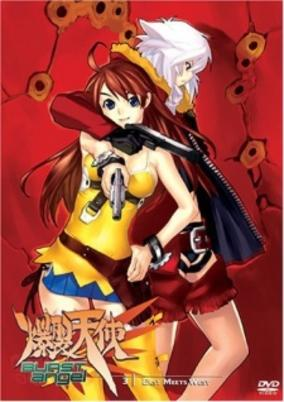

**Studio:** Gonzo &nbsp;|&nbsp; **Episodes:** 24 &nbsp;|&nbsp; **Director:** Koichi Ohata &nbsp;|&nbsp; **Aired/Released:** April 7 – September 15 &nbsp;|&nbsp; **Genres:** Science Fiction, Mecha, Ecchi, Japan, Action, Asia, Earth, Piloted Robot, Gunfights, Cyborg, Conspiracy, Crime, Future, Violence, Super Power, Adventure, Comedy, Cyberpunk

> In Japan's not-too-distant future, crime has become so common that the government has legalised firearms for citizens to use in self-defence. To combat this new wave of wrongdoing, the Recently Armed Police of Tokyo was established in hopes of hunting down criminals with lethal force. Kyohei Tachibana is a gifted culinary student who dreams of saving up enough money to become a pastry chef in France. When four young mercenaries ask him to be their cook, he's forced into making a tough choice. As Jo, Meg, Sei, and Amy take on the bloodiest jobs in the chaotic city of Tokyo, Kyohei accepts an imminent descent into the world of crime—and he'll do a lot more than just cooking!
>
> _Synopsis source: Kitsu_

[Wikipedia](https://en.wikipedia.org/wiki/Burst_Angel) · [Kitsu](https://kitsu.io/anime/bakuretsu-tenshi)

---

### Melody of Oblivion (The Melody of Oblivion)

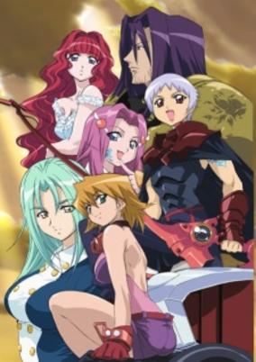

**Studio:** J.C.Staff &nbsp;|&nbsp; **Episodes:** 24 &nbsp;|&nbsp; **Director:** Hiroshi Nishikiori &nbsp;|&nbsp; **Aired/Released:** April 7 – September 22 &nbsp;|&nbsp; **Genres:** Science Fiction, Japan, Action, Asia, Earth, Rotten World, Angst, Drama, Future, Plot Continuity, Super Power, Space, Mecha, Fantasy, Adventure, Horror, Psychological

> A great war occurred in the 20th century between humans and monsters. Since that time, the monsters rule the world in fear but keep relatively hidden from public view. A boy named Bokka ponders the past and wonders what became of the Meros Warriors who defended the world so bravely against the demons. He soon meets Kurofune and learns of the power of the Meros and the I-bar machines they ride in battle. Warriors are the only ones who can see and hear the Melody of Oblivion, a phantom girl hidden away waiting to be rescued and be the savior of mankind. During a battle between Kurofune and a demon, Bokka discovers something only his wildest dreams could possibly imagine...he too can hear that melody. Throughout his journeys, Bokka meets many monsters and their agents, friends, and companions as he discovers the true extent of his new powers. He must continue to battle evil in the hope of releasing Boukyaku no Senritsu and free a world that has forgotten its once beautiful melody.
>
> _Synopsis source: Kitsu_

[Wikipedia](https://en.wikipedia.org/wiki/Melody_of_Oblivion) · [Kitsu](https://kitsu.io/anime/boukyaku-no-senritsu)

---

### Kinnikuman II Sei: Ultimate Muscle

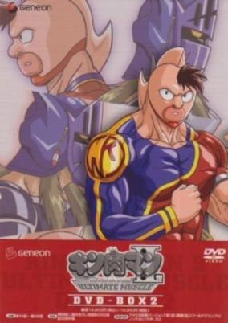

**Studio:** Toei Animation &nbsp;|&nbsp; **Episodes:** 13 &nbsp;|&nbsp; **Director:** Toshiaki Komura &nbsp;|&nbsp; **Aired/Released:** April 8 – July 1 &nbsp;|&nbsp; **Genres:** Science Fiction, Action, Sports, Martial Arts, Comedy

> The Chojin Crown, the tournament which Mantaro (Kid Muscle) reluctantly participates in. After going along with the obstacles (most of which were created to try and eliminate him), he qualified.
>
> _Synopsis source: Kitsu_

[Wikipedia](https://en.wikipedia.org/wiki/Kinnikuman_Nisei_-_Ultimate_Muscle) · [Kitsu](https://kitsu.io/anime/kinnikuman-ii-sei-ultimate-muscle)

---

### Tetsujin 28-go (Tetsujin 28)

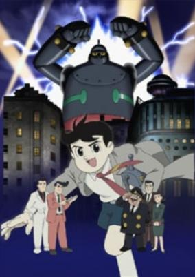

**Studio:** Palm Studio &nbsp;|&nbsp; **Episodes:** 26 &nbsp;|&nbsp; **Director:** Yasuhiro Imagawa &nbsp;|&nbsp; **Aired/Released:** April 8 – September 30 &nbsp;|&nbsp; **Genres:** Science Fiction, Mecha, Earth, Japan, Action, Asia, Piloted Robot, Tokyo, Human Enhancement, Proxy Battles, Android, Law And Order, Plot Continuity, Cops, Adventure

> In post-WWII Japan, Prof. Shikishima has built up Shikishima Industries to be a technological powerhouse, working on developing robots. However, at the heart of their success lurks a dark secret from the war, something that cost the life of Prof. Kaneda, the mentor of Prof. Shikishima. Now Kaneda's son, Shoutarou, is about to learn the truth, and it will change him forever.
>
> _Synopsis source: Kitsu_

[Wikipedia](https://en.wikipedia.org/wiki/Tetsujin_28-go_(2004_TV_series)) · [Kitsu](https://kitsu.io/anime/tetsujin-28-go-2004)

---

### Tweeny Witches

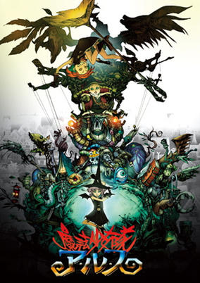

**Studio:** Studio 4°C &nbsp;|&nbsp; **Episodes:** 40 &nbsp;|&nbsp; **Director:** Yoshiharu Ashino &nbsp;|&nbsp; **Aired/Released:** April 9 – March 4, 2005 &nbsp;|&nbsp; **Genres:** Fantasy, Fantasy World, Action, Adventure, Magic, Parallel Universe, Plot Continuity, Present, Comedy

> Arusu believes in magic. With all her heart, she believes that magic is possible and that it can be used for good deeds and fun games. But suddenly, she finds herself transported into another world, ruled by a mysterious elite of witches—and these witches don't seem to be in it for the fun. They're hard at work capturing sprites, the native magical beings of the world, and forcing them into slavery. Once Arusu realizes that her new surroundings aren't just a dream, she sets out to change things.
>
> _Synopsis source: Kitsu_

[Wikipedia](https://en.wikipedia.org/wiki/Tweeny_Witches) · [Kitsu](https://kitsu.io/anime/mahou-shoujo-tai-arusu)

---

### Pugyuru

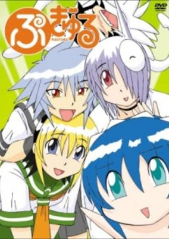

**Studio:** Creators Dot Com &nbsp;|&nbsp; **Episodes:** 13 &nbsp;|&nbsp; **Director:** Hajime Kurihara &nbsp;|&nbsp; **Aired/Released:** April 12 – July 5 &nbsp;|&nbsp; **Genres:** Earth, Japan, Fantasy, Asia, Comedy, Maid, Super Deformed, Anthropomorphism, Slapstick, Present, School Life

> One day, an ordinal high school girl, Ma$%^&amp;* (her name is left to your imagination), met Cheko, who was a maid came from a village of maids. She could melt, fly, and pull her head off .... Anyway, strange @people began to come, for example, a snow fairly who disliked cold, a large squid that could speak, scary persons, and the like. Pyguru is a world of absurdity drawn by a hope of comedy, Konnotohiro.
>
> _Synopsis source: Kitsu_

[Wikipedia](https://en.wikipedia.org/wiki/Pugyuru) · [Kitsu](https://kitsu.io/anime/pugyuru)

---

### Gantz

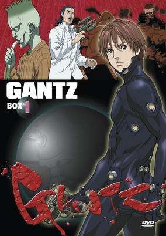

**Studio:** Gonzo &nbsp;|&nbsp; **Episodes:** 13 &nbsp;|&nbsp; **Director:** Ichiro Itano &nbsp;|&nbsp; **Aired/Released:** April 13 – June 22 &nbsp;|&nbsp; **Genres:** Science Fiction, Horror, Drama, Action, Psychological, Alien, Violence, Supernatural, Humanoid Alien, Ecchi, Seinen, Angst

> If you are chosen by the bizarre black sphere known as Gantz, you are already dead—yet you might be able to reclaim your mortality. First, Gantz demands that you undertake brutal missions of madness, killing aliens hidden among the population. It is your only chance and you have no choice. You must play this disturbing game. And if you die again—and you likely will—it's permanent.
>
> _Synopsis source: Kitsu_

[Wikipedia](https://en.wikipedia.org/wiki/Gantz) · [Kitsu](https://kitsu.io/anime/gantz)

---

### Initial D Fourth Stage

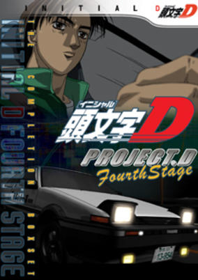

**Studio:** A.C.G.T &nbsp;|&nbsp; **Episodes:** 24 &nbsp;|&nbsp; **Director:** Tsuneo Tominaga &nbsp;|&nbsp; **Aired/Released:** April 17 – February 18, 2006 &nbsp;|&nbsp; **Genres:** Earth, Japan, Action, Asia, Sports, Drifting, Street Racing, Plot Continuity, Present, Motorsport, Seinen

> Takumi Fujiwara and brothers Keisuke and Ryousuke Takahashi have formed "Project D," a racing team aimed at bringing their driving skills to their full potential outside their prefecture. Using the internet, Project D issues challenges to other racing teams and posts results of their races. Managed by Ryousuke, the team has Takumi engaging in downhill battles with his AE86, while Keisuke challenges opponents uphill. Among their rivals are the Seven-Star Leaf (SSR) and Todo-juku.
>
> _Synopsis source: Kitsu_

[Wikipedia](https://en.wikipedia.org/wiki/Initial_D_Fourth_Stage) · [Kitsu](https://kitsu.io/anime/initial-d-fourth-stage)

---

### Love♥Love?

**Studio:** Imagin Studio Live &nbsp;|&nbsp; **Episodes:** 9 &nbsp;|&nbsp; **Director:** Takeo Takahashi &nbsp;|&nbsp; **Aired/Released:** May 4 – June 29 &nbsp;|&nbsp; **Genres:** Ecchi, Japan, Loli, Harem, Comedy, Romance

> Naoto Ooizumi is the writer of the CosPrayers TV show, although this is a secret known only to the producer of the show, Mitsuki Ikuta. He has a crush on one of the actresses in the show, Natsumi Yagami. As the show proceeds so does their relationship, with many wacky twists and turns along the way.
>
> _Synopsis source: Kitsu_

[Wikipedia](https://en.wikipedia.org/wiki/LOVE%E2%99%A5LOVE%3F) · [Kitsu](https://kitsu.io/anime/love-love)

---

### Samurai Champloo

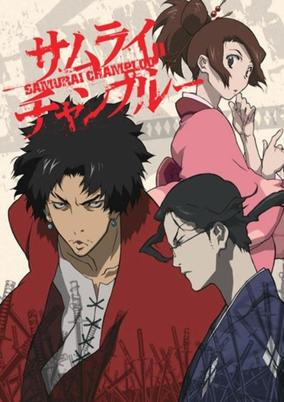

**Studio:** Manglobe &nbsp;|&nbsp; **Episodes:** 26 &nbsp;|&nbsp; **Director:** Shinichirō Watanabe &nbsp;|&nbsp; **Aired/Released:** May 20 – March 19, 2005 &nbsp;|&nbsp; **Genres:** Adventure, Tokugawa Period, Japan, Action, Asia, Earth, Comedy, Swordplay, Martial Arts, Past, Slapstick, Stereotypes, Plot Continuity, Violence, Samurai, Historical

> Fuu Kasumi is a young and clumsy waitress who spends her days peacefully working in a small teahouse. That is, until she accidentally spills a drink all over one of her customers! With a group of samurai now incessantly harassing her, Fuu desperately calls upon another samurai in the shop, Mugen, who quickly defeats them with his wild fighting technique, utilizing movements reminiscent to that of breakdancing. Unfortunately, Mugen decides to pick a fight with the unwilling ronin Jin, who wields a more precise and traditional style of swordfighting, and the latter proves to be a formidable opponent. The only problem is, they end up destroying the entire shop as well as accidentally killing the local magistrate's son. For their crime, the two samurai are captured and set to be executed. However, they are rescued by Fuu, who hires the duo as her bodyguards. Though she no longer has a place to return to, the former waitress wishes to find a certain samurai who smells of sunflowers and enlists the help of the now exonerated pair to do so. Despite initially disapproving of this idea, the two eventually agree to assist the girl in her quest; thus, the trio embark upon an adventure to find this mysterious warrior—that is, if Fuu can keep Mugen and Jin from killing each other. Set in an alternate Edo Period of Japan, Samurai Champloo follows the journey of these three eccentric individuals in an epic quest full of action, comedy, and dynamic sword fighting, all set to the beat of a unique hip-hop infused soundtrack. [Written by MAL Rewrite]
>
> _Synopsis source: Kitsu_

[Wikipedia](https://en.wikipedia.org/wiki/Samurai_Champloo) · [Kitsu](https://kitsu.io/anime/samurai-champloo)

---

### Samurai 7

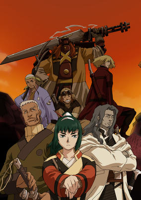

**Studio:** Gonzo &nbsp;|&nbsp; **Episodes:** 26 &nbsp;|&nbsp; **Director:** Toshifumi Takizawa &nbsp;|&nbsp; **Aired/Released:** June 12 – December 25 &nbsp;|&nbsp; **Genres:** Science Fiction, Mecha, Fantasy World, Fantasy, Action, Alternative Past, Swordplay, Martial Arts, Angel, Past, Plot Continuity, Samurai, Historical

> In the far distant future, on a planet that might have been called "earth", there was a war between samurai who mechanized their bodies. After the long war, people enjoyed a modest peace. Facing starvation and abductions at the hands of fearsome mechanized bandits (Nobuseri), the farmers of Kanna Village make the dangerous choice to hire samurai for protection. The village's water priestess, Kirara, her younger sister, Komachi, and a heartbroken villager, Rikichi, set off to hire willing samurai with nothing to offer but rice from their meager harvests. Through dangerous encounters and a bit of luck, seven samurai of varying specialties and experience are gathered for an epic battle against the bandits and the merchants that influence them. Samurai 7 is based loosely upon Kurosawa Akira's famous movie "Seven Samurai"/"Shichinin no Samurai"
>
> _Synopsis source: Kitsu_

[Wikipedia](https://en.wikipedia.org/wiki/Samurai_7) · [Kitsu](https://kitsu.io/anime/samurai-7)

---

### Kurau Phantom Memory

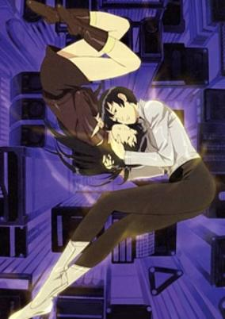

**Studio:** Bones &nbsp;|&nbsp; **Episodes:** 24 &nbsp;|&nbsp; **Director:** Yasuhiro Irie &nbsp;|&nbsp; **Aired/Released:** June 25 – December 16 &nbsp;|&nbsp; **Genres:** Science Fiction, Action, Tone Changes, Piloted Robot, Gunfights, Europe, Parasite, Alien, Drama, Future, Violence, Super Power, Space

> It is the year 2100, and on the colonized Moon, a project is under way to explore new aspects of energy. Amami Kurau is the daughter of the chief scientist on the project, and on her 12th birthday, she accompanies her father to the lab to observe the experiments. Then something goes awry, and Kurau is struck by twin bolts of light. In the aftermath, her father is dismayed to find that his daughter is no longer his daughter. Rather, her body is now home to two energy entities with fantastic powers.
>
> _Synopsis source: Kitsu_

[Wikipedia](https://en.wikipedia.org/wiki/Kurau_Phantom_Memory) · [Kitsu](https://kitsu.io/anime/kurau-phantom-memory)

---

### Hani Hani: Operation Sanctuary

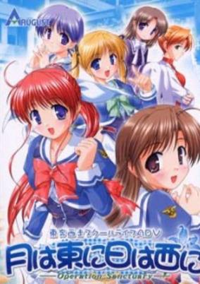

**Studio:** Radix &nbsp;|&nbsp; **Episodes:** 13 &nbsp;|&nbsp; **Director:** Shōsei Jinno &nbsp;|&nbsp; **Aired/Released:** June 30 – September 22 &nbsp;|&nbsp; **Genres:** Romance, Sudden Girlfriend Appearance, School Life, Harem, Science Fiction, Comedy

> Naoki Kuzumi, a junior in high school, had lost his parents in an accident five years ago, and is living with his aunt, uncle, and cousin Matsuri. He always thought his life was ordinary, besides the fact that he can't remember what happened in his youth. One sunny day as he is taking a nap on a bench, a redheaded girl -- Mikoto -- literally falls on him from the sky. For some reason, she thinks he's her younger brother. Naoki's time period is a temporal shelter for those in the future, when many are suffering from an incurable disease. When she heard her younger brother Yuusuke had been taken to Naoki's time, Mikoto herself had gone back in time.
>
> _Synopsis source: Kitsu_

[Kitsu](https://kitsu.io/anime/tsuki-wa-higashi-ni-hi-wa-nishi-ni-operation-sanctuary)

---

### Wind: A Breath of Heart

**Studio:** Radix &nbsp;|&nbsp; **Episodes:** 13 &nbsp;|&nbsp; **Director:** Mitsuhiro Tougou &nbsp;|&nbsp; **Aired/Released:** June 30 – September 22

---

### Monkey Turn V

**Studio:** OLM &nbsp;|&nbsp; **Episodes:** 25 &nbsp;|&nbsp; **Director:** Katsuhito Akiyama &nbsp;|&nbsp; **Aired/Released:** July 4 – December 19 &nbsp;|&nbsp; **Genres:** Sports

> Based on Kawai Katsutoshi's manga of the same name, published in Weekly Shounen Sunday, Monkey Turn is a sports anime based around professional speed boat racing. The anime's protagonist, Tadano Kenji, is too short to follow his dream of becoming a professional baseball player, but his baseball coach recommends him to boat racing. One day Tadano-san unexpectedly meets his old girlfriend and they exchange promises: in return for her being faithful to him, he is charged with becoming Japan's best racer within three years. The eponymous "Monkey Turn" is a boat maneuver Kenji-san thought up while visiting his girlfriend. The Monkey Turn gives Kenji quite the advantage over other boaters, but is it enough for him become the best?
>
> _Synopsis source: Kitsu_

[Wikipedia](https://en.wikipedia.org/wiki/Monkey_Turn) · [Kitsu](https://kitsu.io/anime/monkey-turn)

---

### Maria-sama ga Miteru: Haru (Maria Watches Over Us: Printemps)

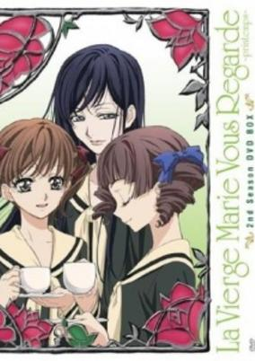

**Studio:** Studio Deen &nbsp;|&nbsp; **Episodes:** 13 &nbsp;|&nbsp; **Director:** Yukihiro Matsushita &nbsp;|&nbsp; **Aired/Released:** July 4 – September 26 &nbsp;|&nbsp; **Genres:** Japan, Earth, Asia, Slice of Life, Coming Of Age, High School, All Girls School, School Life, Present, Shoujo Ai, Romance

> The spring term is beginning for the students at Lillian Girls' Academy. Friends are reunited, but for the Yamayuri Council, it's a bittersweet time. Yoko, Eriko, and Sei are busy preparing to depart Lillian while Sachiko, Rei, and Shimako are doing their best to ensure that their dear sisters receive a memorable commencement. Sei's departure will leave a sizable hole in the White Roses, and filling it won't be easy. But is there anyone who could appeal to Shimako enough to become the next Rosa Gigantea en bouton?
>
> _Synopsis source: Kitsu_

[Kitsu](https://kitsu.io/anime/maria-sama-ga-miteru-haru)

---

### Agatha Christie's Great Detectives Poirot and Marple

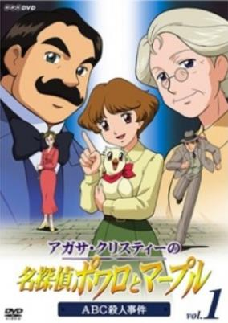

**Studio:** OLM &nbsp;|&nbsp; **Episodes:** 39 &nbsp;|&nbsp; **Director:** Naohito Takahashi &nbsp;|&nbsp; **Aired/Released:** July 4 – May 15, 2005 &nbsp;|&nbsp; **Genres:** Detective, Historical, Mystery

> Young Mabel West is the daughter of mystery writer Raymond West, who wants her to lead a normal life. Rebelling against this, Mabel wants to be a great detective, and sets out for London to become assistant to none other than Hercule Poirot, the great Belgian detective who resides there. She finally wins the reluctant approval of her father, and embarks on an exciting life of mystery and suspense—his only demand being that she occasionally spend some time with her great-aunt, Jane Marple, in the small village of St. Mary Mead.
>
> _Synopsis source: Kitsu_

[Wikipedia](https://en.wikipedia.org/wiki/Agatha_Christie%27s_Great_Detectives_Poirot_and_Marple) · [Kitsu](https://kitsu.io/anime/agatha-christie-no-meitantei-poirot-to-marple)

---

### Girls Bravo

**Studio:** AIC Spirits &nbsp;|&nbsp; **Episodes:** 11 &nbsp;|&nbsp; **Director:** Ei Aoki &nbsp;|&nbsp; **Aired/Released:** July 5 – September 27 &nbsp;|&nbsp; **Genres:** Ecchi, Romance, Japan, Asia, Comedy, Violent Retribution For Accidental Infringement, Sudden Girlfriend Appearance, Love Polygon, High School, Americas, Slapstick, Stereotypes, School Life, Plot Continuity, Present, Harem, Fantasy

> Small for his age, Yukinari has been bullied and abused by girls all his life. Now in high school, he has developed a rare condition: whenever girls touch him, or even come close, he breaks out in hives. Imagine his surprise, when he is suddenly transported to the city of Seiren on a mystic world invisibly orbiting the Earth, and populated with vast numbers of women and very few men. Fortunately, he has a new friend, Miharu-chan, whose touch inexplicably doesn't affect him.
>
> _Synopsis source: Kitsu_

[Wikipedia](https://en.wikipedia.org/wiki/Girls_Bravo) · [Kitsu](https://kitsu.io/anime/girls-bravo-first-season)

---

### Fafner in the Azure (Fafner of the Blue Sky)

**Studio:** Xebec &nbsp;|&nbsp; **Episodes:** 26 &nbsp;|&nbsp; **Director:** Nobuyoshi Habara &nbsp;|&nbsp; **Aired/Released:** July 5 – December 27 &nbsp;|&nbsp; **Genres:** Romance, Science Fiction, Mecha, Earth, Floating Island, Genetic Modification, Action, Post Apocalypse, Piloted Robot, Human Enhancement, Coming Of Age, Alien, Drama, Military

> Tatsumiyajima is the central island in the middle of a small cluster of islands, in a sleepy backwater of the Japanese isles. Not much happens there, and the island's young people go to school knowing that their lives are likely to remain peaceful and undisturbed. Or so they have been taught... but the truth is different. The fate of mankind is on the line, and Tatsumiyajima is the last line of defense against a hostile and incomprehensible enemy. At the center of it all, fighting for Humanity's continued existence, is the giant robot Fafner, the dragon that guards this final treasure of mankind.
>
> _Synopsis source: Kitsu_

[Wikipedia](https://en.wikipedia.org/wiki/Fafner_in_the_Azure) · [Kitsu](https://kitsu.io/anime/soukyuu-no-fafner-dead-aggressor)

---

### Otogizoushi (Otogi Zoshi: The Legend of Magatama)

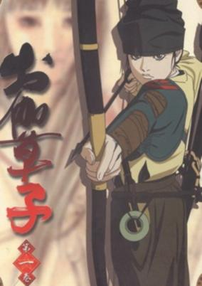

**Studio:** Production I.G &nbsp;|&nbsp; **Episodes:** 26 &nbsp;|&nbsp; **Director:** Mizuho Nishikubo &nbsp;|&nbsp; **Aired/Released:** July 7 – March 30, 2005 &nbsp;|&nbsp; **Genres:** Japan, Earth, Asia, Plot Continuity, Violence, Samurai, Historical, Fantasy, Adventure

> The year is 972 A.D. in Kyoto, the capital of ancient Japan. Kyoto is becoming a corrupt and run-down city; selfish samurai and onmyoji, who care only about gaining political power are everywhere. To make matters worse the city is suffering from famine and widespread disease. Unable to ignore the condition of the city any longer, the Imperial Court decides to send Minamoto no Raiko, a famous samurai well-known for his archery skills, to recover a legendary gem said to hold mysterious power to save the world. However Raiko also falls ill to disease. Instead his youngest sister, Hikaru, decides secretely to make the journey in his place. Hikaru meets many people, and has many adventures while on her trip for the legendary gem.
>
> _Synopsis source: Kitsu_

[Wikipedia](https://en.wikipedia.org/wiki/Otogi_Zoshi_(TV_series)) · [Kitsu](https://kitsu.io/anime/otogizoushi)

---

### Galaxy Angel X

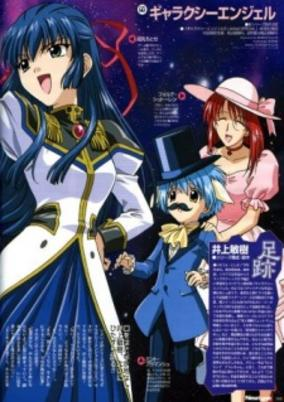

**Studio:** Madhouse feel. &nbsp;|&nbsp; **Episodes:** 26 &nbsp;|&nbsp; **Director:** Morio Asaka Yoshimitsu Ōhashi Shigehito Takayanagi &nbsp;|&nbsp; **Aired/Released:** July 7 – September 29 &nbsp;|&nbsp; **Genres:** Science Fiction, Parody, Comedy, Other Planet, Shipboard, Future, Slapstick, Space

> Starting out with the new Galaxy Angel, Chitose Karasuma, the Angel Troupe continue their search for The Lost Technology while running into different kinds of mishaps.
>
> _Synopsis source: Kitsu_

[Wikipedia](https://en.wikipedia.org/wiki/Galaxy_Angel_X) · [Kitsu](https://kitsu.io/anime/galaxy-angel-4)

---

### Ninin ga Shinobuden (Ninja Nonsense)

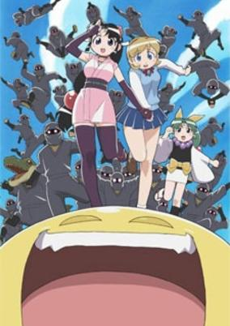

**Studio:** ufotable &nbsp;|&nbsp; **Episodes:** 12 &nbsp;|&nbsp; **Director:** Haruo Sotozaki &nbsp;|&nbsp; **Aired/Released:** July 10 – September 25 &nbsp;|&nbsp; **Genres:** Ninja, Earth, Japan, Asia, Parody, Comedy, Slapstick, Present, Martial Arts

> Kaede is a normal school girl who was studying for her exams for school when suddenly she is interrupted by Shinobu, a girl who is a ninja-in-training, attempting to complete her exam. The problem is, in order for her to successfully complete her exam, she must steal one of Kaede's panties! In Kaede's attempt to stop Shinobu from stealing her panties, an unexpected friendship is forged between the two. Kaede soon becomes engrossed in Shinobu's world, surrounded by partying ninjas and a yellow pac-man like thing by the name of Onsokumaru, who claims to be the master of all ninjas! [Written by MAL Rewrite]
>
> _Synopsis source: Kitsu_

[Wikipedia](https://en.wikipedia.org/wiki/Ninin_ga_Shinobuden) · [Kitsu](https://kitsu.io/anime/two-x2-shinobuden)

---

### DearS

**Studio:** Daume &nbsp;|&nbsp; **Episodes:** 12 &nbsp;|&nbsp; **Director:** Iku Suzuki &nbsp;|&nbsp; **Aired/Released:** July 11 – September 26 &nbsp;|&nbsp; **Genres:** Ecchi, Earth, Japan, Asia, Comedy, Sudden Girlfriend Appearance, Humanoid Alien, Alien, Slapstick, Stereotypes, Present, Harem, Science Fiction, Romance

> One year ago, a UFO containing 150 aliens crash-landed off the shores of Kasai. Because no one could fix their ship, the Japanese Government decided to bestow upon them the designation "DearS" and make them into Japanese citizens, teaching them the language, customs, and culture of Japan. However, in order for them to become more familiar with human society, a home-stay program has been enacted to allow them to mingle with other humans. One misty morning, a truck carrying a capsule that housed one of these aliens ends up dropping it into the riverbank, releasing her from her confinement. She is eventually found by a high school student named Takeya Ikuhara, who saves her from being hit by a truck and takes pity on her, despite being extremely distrustful of their race and wanting nothing to do with them. Upon being named Ren, she imprints upon him as her "Master" and serves as his personal "Slave," leaving him with a "DearS" who wants to remain with him no matter what and bringing his ordinary, alien-free days to an end.
>
> _Synopsis source: Kitsu_

[Wikipedia](https://en.wikipedia.org/wiki/DearS) · [Kitsu](https://kitsu.io/anime/dears)

---

### Elfen Lied

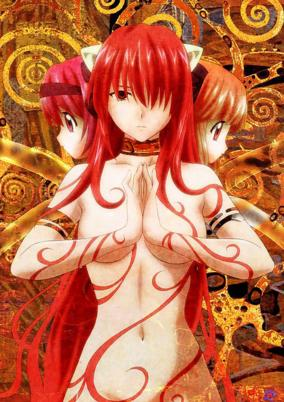

**Studio:** Arms &nbsp;|&nbsp; **Episodes:** 13 &nbsp;|&nbsp; **Director:** Mamoru Kanbe &nbsp;|&nbsp; **Aired/Released:** July 25 – October 17 &nbsp;|&nbsp; **Genres:** Science Fiction, Japan, Action, Asia, Earth, Gunfights, Angst, Horror, Drama, Violence, Present, Harem, Super Power, Romance, Psychological, Ecchi, Supernatural

> Lucy is a special breed of human referred to as "Diclonius," born with a short pair of horns and invisible telekinetic hands that lands her as a victim of inhumane scientific experimentation by the government. However, once circumstances present her an opportunity to escape, Lucy, corrupted by the confinement and torture, unleashes a torrent of bloodshed as she escapes her captors. During her breakout, she receives a crippling head injury that leaves her with a split personality: someone with the mentality of a harmless child possessing limited speech capacity. In this state of instability, she stumbles upon two college students, Kouta and his cousin Yuka, who unknowingly take an injured fugitive into their care, unaware of her murderous tendencies. This act of kindness will change their lives, as they soon find themselves dragged into the shadowy world of government secrecy and conspiracy. [Written by MAL Rewrite]
>
> _Synopsis source: Kitsu_

[Wikipedia](https://en.wikipedia.org/wiki/Elfen_Lied) · [Kitsu](https://kitsu.io/anime/elfen-lied)

---

### Monkey Punch: Manga Katsudou Daishashin

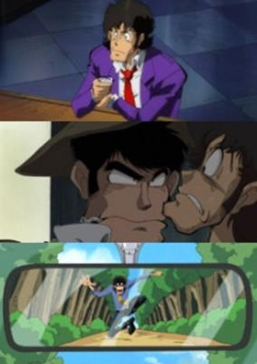

**Studio:** TMS Entertainment &nbsp;|&nbsp; **Episodes:** 12 &nbsp;|&nbsp; **Director:** Shunji Ōga &nbsp;|&nbsp; **Aired/Released:** August 1 – June 25, 2005 &nbsp;|&nbsp; **Genres:** Ecchi, Earth, Action, Comedy, Gunfights, Detective, Violence, Parody, Adventure

> A TV series from Monkey Punch with a 1-hour premiere episode. Mankatsu will feature standard "Monkey characters" and ecchi-gags found in all Monkey Punch series.
>
> _Synopsis source: Kitsu_

[Kitsu](https://kitsu.io/anime/monkey-punch-manga-katsudou-dai-shashin)

---

### Sweet Valerian

**Studio:** Madhouse &nbsp;|&nbsp; **Episodes:** 18 &nbsp;|&nbsp; **Director:** Hiroaki Sakurai &nbsp;|&nbsp; **Aired/Released:** August 1 – December 19 &nbsp;|&nbsp; **Genres:** Japan, Earth, Asia, Alien, Present, Super Power, Magic, Magical Girl, Action, Comedy, School Life

> The Stress Team floats over the city, locating stressed out people and transforming them into monsters. To combat this, three girls reluctantly transform into the Sweet Valerians, bunny defenders of justice.
>
> _Synopsis source: Kitsu_

[Wikipedia](https://en.wikipedia.org/wiki/Sweet_Valerian) · [Kitsu](https://kitsu.io/anime/sweet-valerian)

---

### Space Symphony Maetel (Space Symphonic Poem Maetel: Galaxy Express 999 Side Story)

**Studio:** Azeta Pictures &nbsp;|&nbsp; **Episodes:** 13 &nbsp;|&nbsp; **Director:** Shinichi Masaki &nbsp;|&nbsp; **Aired/Released:** August 6 – October 29 &nbsp;|&nbsp; **Genres:** Space Travel, Science Fiction, Action, Space Opera, Human Enhancement, Cyborg, Other Planet, Shipboard, Drama, Future, Plot Continuity, Space

> Maetel abandoned her mother and her home planet, the doomed and frozen La Metal, where people must become cyborgs to survive. When she is beckoned to return, her options seem slim: follow her mother's path (and with it a robot mind and the contempt of all humans), or run away and fight with humans against the machines. Yet, she is not without comrades and defenders. If she can accept the friendship of beings of metal who desire peace, and oppose those who think being made of flesh and blood is enough to make one human, she may still have a chance to find her own path.
>
> _Synopsis source: Kitsu_

[Wikipedia](https://en.wikipedia.org/wiki/Space_Symphony_Maetel) · [Kitsu](https://kitsu.io/anime/uchuu-koukyoushi-maetel-ginga-tetsudou-999-gaiden)

---

### Gantz 2nd Stage (Gantz: Second Stage)

**Studio:** Gonzo &nbsp;|&nbsp; **Episodes:** 13 &nbsp;|&nbsp; **Director:** Ichirō Itano &nbsp;|&nbsp; **Aired/Released:** August 26 – November 18 &nbsp;|&nbsp; **Genres:** Science Fiction, Ecchi, Japan, Earth, Action, Asia, Gunfights, Angst, Horror, Alien, Drama, Plot Continuity, Violence, Present, Psychological, Seinen

> Kurono Kei and his ex-elementary school classmate, Kato Masaru have survived the first two ordeals that the unknown black sphere Gantz has sent them through. Exploding body parts, struggling to stay alive till the last second and seeing your fellow comrades fall in a pile of blood and gore are the norm to them now. They are aware now that Gantz can call them up along with any new deeds, at any time for another confrontation with aliens. Will Kato's experiences in the Gantz world give him the same courage in the real world? With fellow veteran Gantzer Kei Kishimoto currently staying at Kurono's home as his "adopted pet", can Kurono stave off his growing lust for her mammaries? What the heck is Gantz?
>
> _Synopsis source: Kitsu_

[Kitsu](https://kitsu.io/anime/gantz-2nd-stage)

---

### Fuujin Monogatari (Windy Tales)

**Studio:** Production I.G &nbsp;|&nbsp; **Episodes:** 13 &nbsp;|&nbsp; **Director:** Junji Nishimura &nbsp;|&nbsp; **Aired/Released:** September 11 – February 26, 2005 &nbsp;|&nbsp; **Genres:** Earth, Japan, Fantasy, Contemporary Fantasy, Asia, Slice of Life, Middle School, Coming Of Age, Friendship, School Life

> Nao, an 8th grader, is one of the only two members of a Digital Camera Club, where she also serves as the manager. It's a mystery that she shoots nothing else but the skies and clouds. One day, she finds a cat on a rooftop where she usually shoots her camera. It's a cat that knows how to manipulate the flow of the wind. Shocked to find a strange animal, Nao loses her footing and falls off from the rooftop! Miki is the other member of the club, and also Nao's best friend. Mr. Taiki is the teacher who's taught the cat how to manipulate the flow of the wind. Ryoko is a girl who has a huge crush on Mr. Taiki. And there's Jun, who helps Nao and Miki look for a cat that can fly. Then, there's Yukio, who is the widow of Mr. Taiki's deceased brother. On the outskirts of this big city, a town of the "Wind Handlers," has been formed—and a mysterious Wind Festival is about to begin...
>
> _Synopsis source: Kitsu_

[Wikipedia](https://en.wikipedia.org/wiki/Fuujin_Monogatari) · [Kitsu](https://kitsu.io/anime/fuujin-monogatari)

---

### Curry no Kuni no Coburoux

**Studio:** Artland &nbsp;|&nbsp; **Episodes:** 13 &nbsp;|&nbsp; **Director:** Ryō Hirayama &nbsp;|&nbsp; **Aired/Released:** September 20 – December 13

> Coburoux is a prince of Curry Kingdom. Although he is a prince, he goes to the school for common people, and he is treated like other students. In fact, he is scolded by the teacher, is made to stand during class as a punishment, go some errands for a chef, and is teased by a girl whom he loves. He is always worried, and wonders whether the prince should be better. Being surrounded by weird friends and strange people in Curry Kingdom, he spends worrying days.
>
> _Synopsis source: Kitsu_

[Kitsu](https://kitsu.io/anime/curry-no-kuni-no-coburoux)

---

### Bouken Ou Beet (Beet the Vandel Buster)

**Studio:** Toei Animation &nbsp;|&nbsp; **Episodes:** 52 &nbsp;|&nbsp; **Director:** Tatsuya Nagamine &nbsp;|&nbsp; **Aired/Released:** September 30 – September 29, 2005 &nbsp;|&nbsp; **Genres:** Fantasy, Fantasy World, Adventure, Action, Magic, Super Power

> It is the dark century and the people are suffering under the rule of the devil, Vandel, who is able to manipulate monsters. The Vandel Busters are a group of people who hunt these devils, and among them, the Zenon Squad is known to be the strongest busters on the continent. A young boy, Beet, dreams of joining the Zenon Squad. However, one day, as a result of Beet's fault, the Zenon squad was defeated by the devil, Beltose. The five dying busters sacrificed their life power into their five weapons, Saiga. After giving their weapons to Beet, they passed away. Years have passed since then and the young Vandel Buster, Beet, begins his adventure to carry out the Zenon Squad's will to put an end to the dark century.
>
> _Synopsis source: Kitsu_

[Wikipedia](https://en.wikipedia.org/wiki/Bouken_ou_Beet) · [Kitsu](https://kitsu.io/anime/beet-the-vandel-buster)

---

### My-HiME

**Studio:** Sunrise &nbsp;|&nbsp; **Episodes:** 26 &nbsp;|&nbsp; **Director:** Masakazu Obara &nbsp;|&nbsp; **Aired/Released:** October 1 – April 1, 2005 &nbsp;|&nbsp; **Genres:** Romance, Ecchi, Japan, Fantasy, Action, Tone Changes, Asia, Earth, Comedy, Conspiracy, Drama, Slapstick, Stereotypes, Plot Continuity, Present, Super Power, Magic, Mecha, Shoujo Ai, School Life

> Thirteen girls, each with the ability to materialize "Elements" and summon metallic guardians called "Childs" have been brought to Fuuka Academy to battle mysterious creatures called Orphans. Each with a different personality and background, they must decide who they truly care about and why they fight.
>
> _Synopsis source: Kitsu_

[Wikipedia](https://en.wikipedia.org/wiki/My-HiME) · [Kitsu](https://kitsu.io/anime/mai-hime)

---

### Kakyuusei 2: Hitomi no Naka no Shoujo-tachi (Kakyusei 2)

**Studio:** Arms &nbsp;|&nbsp; **Episodes:** 13 &nbsp;|&nbsp; **Director:** Yōsei Morino &nbsp;|&nbsp; **Aired/Released:** October 2 – December 25 &nbsp;|&nbsp; **Genres:** Romance, Japan, High School, School Clubs, Stereotypes, School Life, Plot Continuity, Present, Comedy, Harem

> Many people have fond memories of meeting a certain teenage boy in their younger years. However, their ages vary widely, and each remembers him as a teen. This story follows the intricate intertwining of their various stories and how this young man, who apparently lives outside of time, has affected each of them.
>
> _Synopsis source: Kitsu_

[Wikipedia](https://en.wikipedia.org/wiki/Kaky%C5%ABsei) · [Kitsu](https://kitsu.io/anime/kakyuusei-2-hitomi-no-naka-no-shoujotachi)

---

### Kannazuki no Miko (Destiny of the Shrine Maiden)

**Studio:** TNK &nbsp;|&nbsp; **Episodes:** 12 &nbsp;|&nbsp; **Director:** Tetsuya Yanagisawa &nbsp;|&nbsp; **Aired/Released:** October 2 – December 18 &nbsp;|&nbsp; **Genres:** Romance, Contemporary Fantasy, Science Fiction, Mecha, Fantasy, Japan, Earth, Action, Asia, Piloted Robot, Shoujo Ai, Deity, Angst, Drama, School Life, Plot Continuity, Present, Magic

> Kannazuki no Miko begins in the village of Mahoroba, where time passes slowly for both man and nature. Two students from the village's prestigious Ototachibana Academy might as well be night and day. Himeko is shy and unassertive, while Chikane is bold and elegant. Despite this, they love each other, and nothing can come between them, no matter how hard they try. On the two girls' shared birthday, a sinister voice corrupts one of their friends into attacking them, and just when it seemed grimmest, the lunar and solar priestess powers that lay dormant in the two girls awaken, dispelling the evil. That was only the first hurdle, however. The two must now fend off the countless others who would threaten their well-being—even the people closest to them!
>
> _Synopsis source: Kitsu_

[Wikipedia](https://en.wikipedia.org/wiki/Kannazuki_no_Miko) · [Kitsu](https://kitsu.io/anime/kannazuki-no-miko)

---

### To Heart: Remember My Memories

**Studio:** AIC ASTA OLM &nbsp;|&nbsp; **Episodes:** 13 &nbsp;|&nbsp; **Director:** Keitaro Motonaga &nbsp;|&nbsp; **Aired/Released:** October 2 – December 25 &nbsp;|&nbsp; **Genres:** Romance, Science Fiction, Mecha, Japan, Earth, Asia, Love Polygon, High School, Android, School Life, Present, Harem, Slice of Life

> Time flies by; Hiroyuki and Akari are 12th-graders now. Both of them and their friends have grown up gradually in someway, physically or mentally, but one of their best friends is missing: the lifelike android Multi. To their surprise, Multi is brought to their campus again without notice, yet she is no longer the same Multi they have known.
>
> _Synopsis source: Kitsu_

[Kitsu](https://kitsu.io/anime/to-heart-remember-my-memories)

---

### Rockman.EXE Stream

**Studio:** Xebec &nbsp;|&nbsp; **Episodes:** 51 &nbsp;|&nbsp; **Director:** Takao Kato &nbsp;|&nbsp; **Aired/Released:** October 2 – September 24, 2005 &nbsp;|&nbsp; **Genres:** Mecha, Action, Science Fiction, Adventure, School Life

> A comet burns in the sky, its brilliant light shining down upon the people of Earth. At that time, a giant army of viruses invade the real world, crushing everything in their path. Netto and Enzan use cross fusion to intervene, but are whisked away to an unknown location, only to be confronted by the one responsible for the attack - Duo!
>
> _Synopsis source: Kitsu_

[Wikipedia](https://en.wikipedia.org/wiki/Rockman.EXE_Stream) · [Kitsu](https://kitsu.io/anime/rockman-exe-stream)

---

### Viewtiful Joe

**Studio:** Group TAC &nbsp;|&nbsp; **Episodes:** 51 &nbsp;|&nbsp; **Director:** Takaaki Ishiyama &nbsp;|&nbsp; **Aired/Released:** October 2 – September 24, 2005 &nbsp;|&nbsp; **Genres:** Action, Science Fiction, Comedy

> Joe, a red-headed movie buff, and Silvia, his girlfriend, are having a bit of relationship trouble. Silvia feels that Joe is taking her for-granted and wants to do something together for once, so Joe decides to take her to see an old action movie featuring his favorite hero, Captain Blue. What started out as a cute movie date takes a turn for the worst when Silvia is pulled into the movie by the leader of the evil organization, Jado. Joe follows her into the mysterious "Movieland," and is granted a powerful device known as a V-Watch by Captain Blue himself. With it, he transforms into the action hero named "Viewtiful Joe" and goes off to rescue his girlfriend before she can be used by Jado to take over the world. It's a long road to go from average Joe to full-blown hero, but he'll give it his all to save both his girl and the world—and he'll do it in the most "view-ti-ful" way possible.
>
> _Synopsis source: Kitsu_

[Wikipedia](https://en.wikipedia.org/wiki/Viewtiful_Joe_(TV_series)) · [Kitsu](https://kitsu.io/anime/viewtiful-joe)

---

### Uta Kata (Utakata)

**Studio:** Hal Film Maker &nbsp;|&nbsp; **Episodes:** 12 &nbsp;|&nbsp; **Director:** Keiji Gotoh &nbsp;|&nbsp; **Aired/Released:** October 3 – December 19 &nbsp;|&nbsp; **Genres:** Romance, Earth, Fantasy, Japan, Asia, Angst, Magic, Magical Girl, Present

> On the last day of the school year, 14-year-old Ichika Tachibana comes across an old, busted mirror in an unused campus building. When Manatsu, a mysterious girl from inside the mirror, steps out and offers her friendship for the summer, she also offers Ichika magical powers. Now, Manatsu must help Ichika unlock the powers of the 12 Djinn in order to complete her magic training... but perhaps this is something that will prove too difficult a task. Some offers may appear to be too good to be true and this one just may turn out to do more harm than good.
>
> _Synopsis source: Kitsu_

[Wikipedia](https://en.wikipedia.org/wiki/Uta_Kata) · [Kitsu](https://kitsu.io/anime/uta-kata)

---

### W~Wish

**Studio:** Picture Magic Trinet Entertainment &nbsp;|&nbsp; **Episodes:** 13 &nbsp;|&nbsp; **Director:** Osamu Sekita &nbsp;|&nbsp; **Aired/Released:** October 3 – December 26

[Wikipedia](https://en.wikipedia.org/wiki/W~Wish)

---

### Magical Girl Lyrical Nanoha

**Studio:** Seven Arcs &nbsp;|&nbsp; **Episodes:** 13 &nbsp;|&nbsp; **Director:** Akiyuki Shinbo &nbsp;|&nbsp; **Aired/Released:** October 3 – December 26 &nbsp;|&nbsp; **Genres:** Fantasy, Japan, Contemporary Fantasy, Earth, Action, Asia, Magic, Stereotypes, Magical Girl, Plot Continuity, Present, Super Power, Comedy

> Third grader Takamachi Nanoha stumbled upon an injured talking ferret after hearing his telepathic cries for help. The ferret turned out to be Yuuno, an archeologist and mage from another world who had accidentally scattered the dangerous Jewel Seeds throughout Earth. Without the strength to collect the Jewel Seeds, Yuuno had resumed a ferret form and needed someone else to take on the task for him. He gave a red jewel to Nanoha explaining to her with this she could transform and use magic to combat the monsters that threatened them due to the Jewel Seeds. But the monsters are the least of their worries, as Yuuno and Nanoha are not the only ones out to collect the Jewel Seeds.
>
> _Synopsis source: Kitsu_

[Wikipedia](https://en.wikipedia.org/wiki/Magical_Girl_Lyrical_Nanoha) · [Kitsu](https://kitsu.io/anime/mahou-shoujo-lyrical-nanoha)

---

### Zoids Fuzors

**Studio:** Tokyo Kids &nbsp;|&nbsp; **Episodes:** 26 &nbsp;|&nbsp; **Director:** Kouji Makita &nbsp;|&nbsp; **Aired/Released:** October 3 – April 3, 2005 &nbsp;|&nbsp; **Genres:** Science Fiction, Mecha, Adventure

> R.D. is a delivery boy who works for a company called Mach Storm in order to earn money to search for the legendary Alpha Zoid. A Zoid that he heard rumours about from his dad that he passionately believes in. Mach Storm also doubles as a Zoid Battling team. In R.D.'s first Coliseum Zoid Battle, he encounters a team that can fuse Zoids. R.D. soon discovers that he has a Zoid that can computably fuse with his Zoid, Liger Zero. After this happens R.D.'s adventure to discover the truth about the Alpha Zoid begins.
>
> _Synopsis source: Kitsu_

[Kitsu](https://kitsu.io/anime/zoids-fuzors)

---

### Ton-Ton Atta to Niigata no Mukashibanashi

**Studio:** Group TAC &nbsp;|&nbsp; **Episodes:** 13 &nbsp;|&nbsp; **Aired/Released:** October 3 – December 26 &nbsp;|&nbsp; **Genres:** Comedy

[Kitsu](https://kitsu.io/anime/ton-ton-atta-to-niigata-no-mukashi-banashi)

---

### Final Approach

**Studio:** Trinet Entertainment Zexcs &nbsp;|&nbsp; **Episodes:** 13 &nbsp;|&nbsp; **Director:** Takashi Yamamoto &nbsp;|&nbsp; **Aired/Released:** October 3 – December 26 &nbsp;|&nbsp; **Genres:** Romance, Japan, Comedy, Sudden Girlfriend Appearance, Super Deformed, Present, Slice of Life

> Ever since their parents died a few years ago, Ryo and his sister Akane have been living alone together. Despite their difficult situation, they are still living reasonably happy and normal lives. However, everything is about to be flipped upside-down due to a secret government project. Due to increasingly low birth rates in Japan, the Japanese government is testing a program in which two young people are forced to marry. Ryo wants no part of it, but he is given little choice in the matter; his new fiancée, Shizuka, comes to his home late one night with several dozen government issued bodyguards, who are there to ensure the success of the new couple. Unlike Ryo, Shizuka couldn’t be more willing to go along with this new program, and eagerly goes about her wifely duties, despite his objections. With meddling friends, pushy bodyguards, and an overenthusiastic new fiancée, Ryo’s life has taken a turn in a direction the young man certainly didn’t expect.
>
> _Synopsis source: Kitsu_

[Wikipedia](https://en.wikipedia.org/wiki/Final_Approach_(anime)) · [Kitsu](https://kitsu.io/anime/final-approach)

---

### Samurai Gun

**Studio:** Studio Egg &nbsp;|&nbsp; **Episodes:** 13 &nbsp;|&nbsp; **Director:** Kazuhito Kikuchi &nbsp;|&nbsp; **Aired/Released:** October 4 – December 14 &nbsp;|&nbsp; **Genres:** Martial Arts, Past, Samurai, Historical, Action

> It is the beginning of the industrial revolution, and feudal Japan is in turmoil. The ruling Shogun are wielding their abusive powers to instill fear and dominance over their oppressed subjects. Beatings, imprisonment, rape and even murder are the adopted tactics chosen to maintain their reign. The bloodshed must end. A group of Samurai have banded together, and, with the development of new weapons and new technology, they have both the will and the hardware to stand up and fight. Ichimatsu is one of these fighters. By day, he works incognito at a local tavern, in the evenings he frequents the brothels, and by the dark of night, he doles out some big-time, gun-barrel justice. He is here to help. He is Samurai Gun.
>
> _Synopsis source: Kitsu_

[Wikipedia](https://en.wikipedia.org/wiki/Samurai_Gun) · [Kitsu](https://kitsu.io/anime/samurai-gun)

---

### Ryuusei Sentai Musumet

**Studio:** TNK &nbsp;|&nbsp; **Episodes:** 13 &nbsp;|&nbsp; **Director:** Shigeru Kimiya &nbsp;|&nbsp; **Aired/Released:** October 4 – December 27 &nbsp;|&nbsp; **Genres:** Ecchi, Romance, Comedy, Super Power, Science Fiction, Adventure

> One day, seven shooting stars fell on to the ground. The shooting stars were colored by seven colors, and they had terrible powers. Those who took the shooting star were tuned into monsters by embodying their desires. Dr. Mishina and Dr. Kishiwada obtained the red, green, and blue stars secretly, and they studied the stars. Finally, they could successfully control their power by putting a special helmet on. The newly developed helmet, "Musumet", was as large as an automobile helmet. Putting Musumet on the head, it turned a person's body into the strongest one on the earth. Furthermore, it received the signal from the brain and amplified the inherent power and ability unlimitedly. To utilize the power of "Musumet", to keep the world peace, and to protect from the disasters caused by the remaining shooting stars, Dr. Mishima and Dr. Kishida founded a secret organization "MET". However, he died before he accomplished his aim. The bereaved daughters, Aoi, Midori, and Kurenai, made up their minds to become Musmet in order to execute the father's will. Even if they turned into Musumet, their wearing wouldn't change except helmets, gloves, and boots. Therefore, they had to go to the scenes wearing their own clothes. The girls had to go to the incident spots occasionally wearing school uniforms, occasionally gymnasium suits, occasionally swimming suits, depending the case, they had to go there even if they were naked, and they would do great jobs. On the other hand, at other times, they were ordinal adolescent girls who were dreaming of lovely meetings with boyfriends. Whether would they cope with the world peace and boyfriends at the same time?
>
> _Synopsis source: Kitsu_

[Kitsu](https://kitsu.io/anime/ryuusei-sentai-musumet)

---

### Kappa no Kaikata (How to Breed Kappas)

**Studio:** Picture Magic &nbsp;|&nbsp; **Episodes:** 26 &nbsp;|&nbsp; **Director:** Miyazaki Nagisa &nbsp;|&nbsp; **Aired/Released:** October 4 – April 4, 2005 &nbsp;|&nbsp; **Genres:** Japan, Earth, Asia, Comedy, Present

> A young man passes a pet shop on his way home, and seeing a kappa in the window, decides to buy it on a whim. He brings the creature home, and names him Kaatan. He's never owned a kappa before, so he relies heavily on a book he purchased on the subject of raising and training kappa. The books gives several good tips for bringing up a smart and well behaved kappa, and it all seems very simple. Unfortunately, putting these techniques into practice and actually making them work is not quite as easy as the book implies. Kaatan seems to understand things at first, but usually ends up either forgetting what he's learned, or isn't interested in learning in the first place. However, this particular young man has a lot of patience, and continues his possibly fruitless effort to raise Kaatan into a pet he can be proud of.
>
> _Synopsis source: Kitsu_

[Wikipedia](https://en.wikipedia.org/wiki/Kappa_no_Kaikata) · [Kitsu](https://kitsu.io/anime/kappa-no-kaikata)

---

### School Rumble

**Studio:** Studio Comet &nbsp;|&nbsp; **Episodes:** 26 &nbsp;|&nbsp; **Director:** Shinji Takamatsu &nbsp;|&nbsp; **Aired/Released:** October 5 – March 29, 2005 &nbsp;|&nbsp; **Genres:** Romance, Japan, Earth, Asia, Parody, Slice of Life, Comedy, Love Polygon, High School, Slapstick, School Life, Present

> Just the words "I love you," and everything changes—such is the nature of the bittersweet trials of high school romance. Tenma Tsukamoto, a second year, is on a quest to confess her feelings to the boy she likes. Kenji Harima, a delinquent with a sizable reputation, is in a similar situation, as he cannot properly convey his feelings to the one he loves. Between school, friends, rivalries, and hobbies, these two will find that high school romance is no walk in the park, especially as misunderstandings further complicate their plight.School Rumble is a high-octane romantic comedy full of relatable situations, as Tenma and Kenji both try to win the hearts of those they desire. [Written by MAL Rewrite]
>
> _Synopsis source: Kitsu_

[Wikipedia](https://en.wikipedia.org/wiki/School_Rumble) · [Kitsu](https://kitsu.io/anime/school-rumble)

---

### Tsukuyomi: Moon Phase

**Studio:** Shaft &nbsp;|&nbsp; **Episodes:** 25 &nbsp;|&nbsp; **Director:** Akiyuki Shinbo &nbsp;|&nbsp; **Aired/Released:** October 5 – March 29, 2005 &nbsp;|&nbsp; **Genres:** Contemporary Fantasy, Earth, Fantasy, Japan, Asia, Loli, Vampire, Magic, Present, Comedy, Romance

> Morioka Kouhei wants to become a photographer. Unfortunately, he has the tendency to unintentionally capture the images of ghosts on film. One day, he visits an old castle in Germany where he meets a vampire girl, Hazuki. It turns out that Hazuki is confined in the castle against her will. She tries to turn Kouhei into her slave by sucking his blood, with the intent to have him break the device sealing her in the castle. Although Kouhei proves to be immune to the vampire's curse, he is eventually forced to help her. Hazuki successfully escapes from the castle and leaves for Japan to look for her mother. When she arrives in Japan, she goes to Kohei's house where he lives with his grandfather, who agrees to take in the girl. Due to his own childhood experiences, the sympathetic Kouhei agrees to aid Hazuki in her quest. However, other vampires, including Elfried and Count Kinkell, manage to track Hazuki to Japan. They will stop at nothing to retrieve her.
>
> _Synopsis source: Kitsu_

[Kitsu](https://kitsu.io/anime/tsukuyomi-moon-phase)

---

### Fantastic Children

**Studio:** Nippon Animation &nbsp;|&nbsp; **Episodes:** 26 &nbsp;|&nbsp; **Director:** Takashi Nakamura &nbsp;|&nbsp; **Aired/Released:** October 5 – March 29, 2005 &nbsp;|&nbsp; **Genres:** Romance, Science Fiction, Earth, Thriller, Future, Fantasy, Adventure, Mystery

> A group of enigmatic white-haired children has been spotted at different times and places in Europe for over 500 years. Always with the appearance of 11-year-olds, they behave far more mature than they should be, never grow old, and seem to have supernatural power. What they have been seeking is a girl, and the only clue they have is a picture with a crescent moon. Now, in the year of 2012, an athletic boy named Tohma is about to be involved in this centuries-long mystery.
>
> _Synopsis source: Kitsu_

[Wikipedia](https://en.wikipedia.org/wiki/Fantastic_Children) · [Kitsu](https://kitsu.io/anime/fantastic-children)

---

### Bleach

**Studio:** Pierrot &nbsp;|&nbsp; **Episodes:** 366 &nbsp;|&nbsp; **Director:** Noriyuki Abe &nbsp;|&nbsp; **Aired/Released:** October 5 – March 27, 2012

[Wikipedia](https://en.wikipedia.org/wiki/Bleach_(TV_series))

---

### Desert Punk

**Studio:** Gonzo &nbsp;|&nbsp; **Episodes:** 24 &nbsp;|&nbsp; **Director:** Takayuki Inagaki &nbsp;|&nbsp; **Aired/Released:** October 6 – March 30, 2005 &nbsp;|&nbsp; **Genres:** Ecchi, Desert, Post Apocalypse, Japan, Earth, Action, Asia, Comedy, Violent Retribution For Accidental Infringement, Gunfights, Bounty Hunter, Future, Slapstick, Science Fiction, Adventure

> In the future, Japan is a wasteland. In the Great Kantou Desert, scattered humans seek out a living in the hot sand. Among them, a short-statured man they call "Sunabouzu" makes a living as a bounty hunter. Like a demon of the sand, he seems unbeatable. Yet, like all men, he has a particular weakness for the opposite sex...
>
> _Synopsis source: Kitsu_

[Wikipedia](https://en.wikipedia.org/wiki/Desert_Punk) · [Kitsu](https://kitsu.io/anime/desert-punk)

---

### Gankutsuou (Gankutsuou: The Count of Monte Cristo)

**Studio:** Gonzo &nbsp;|&nbsp; **Episodes:** 24 &nbsp;|&nbsp; **Director:** Mahiro Maeda &nbsp;|&nbsp; **Aired/Released:** October 6 – March 30, 2005 &nbsp;|&nbsp; **Genres:** France, Earth, Thriller, Europe, Conspiracy, Future, Plot Continuity, Science Fiction, Mystery

> Gankutsuou is an anime loosely based on the novel The Count of Monte Cristo by Alexandre Dumas. It tells the story of Albert Morcerf, a young aristocrat who happens to befriend a wealthy nobleman, The Count of Monte Cristo, through a series of bizarre events. Fascinated by the Count's charm, Albert invites him to meet his friends and family, all of whom happen to be part of the upper class society of Paris, France. Unfortunately, little does Albert realize that the Count has ulterior motives in mind. [Written by MAL Rewrite]
>
> _Synopsis source: Kitsu_

[Kitsu](https://kitsu.io/anime/gankutsuou)

---

### Yu-Gi-Oh! GX

**Studio:** Gallop &nbsp;|&nbsp; **Episodes:** 180 &nbsp;|&nbsp; **Director:** Hatsuki Tsuji &nbsp;|&nbsp; **Aired/Released:** October 6 – March 26, 2008 &nbsp;|&nbsp; **Genres:** Fantasy, Action, Comedy, Card Games, Proxy Battles, Friendship, Science Fiction, Shounen

> Duel Academy, one of the most prestigious schools in Duel Monster's history. There students learn the fundamentals of becoming not just duelists, but large business owners. Yuki Judai is a new student with only one thing on his mind, to become the next King Of Games. Judai meets several friends, teachers, and even enemies at the large Dueling school. There he'll have to face off against several different Dorms to become number one duelist. Slifer Red, Ra Yellow, and Obelisk Blue are the three dorms. Will Judai be able to pass all of them? Based on Kazuki Takahashi's world famous anime and manga Yu-Gi-Oh!.
>
> _Synopsis source: Kitsu_

[Wikipedia](https://en.wikipedia.org/wiki/Yu-Gi-Oh!_GX) · [Kitsu](https://kitsu.io/anime/yu-gi-oh-duel-monsters-gx)

---

### Ring ni Kakero 1

**Studio:** Toei Animation &nbsp;|&nbsp; **Episodes:** 12 &nbsp;|&nbsp; **Director:** Toshiaki Komura &nbsp;|&nbsp; **Aired/Released:** October 6 – December 15 &nbsp;|&nbsp; **Genres:** Earth, Boxing, Japan, Action, Combat, Sports, Present

> In order to fulfill their dead father's wish, the siblings, Takane Kiku and Takane Ryuji aims for the champopn title of the boxing arena. The sister, Kiku, will act as the trainer while her brother, Ryuji, will concentrate on the role of the boxer and learn the Boomerang. His battle with many rivals has led to the growth and maturity of Ryuji. The junior high boxing tournament has began and Ryuji will be fighting with his arch-rival, Kenzaki Jun. The battle begins.
>
> _Synopsis source: Kitsu_

[Kitsu](https://kitsu.io/anime/ring-ni-kakero-1)

---

### Harukanaru Toki no Naka de: Hachiyou Shou (Haruka: Beyond the Stream of Time – A Tale of the Eight Guardians)

**Studio:** Yumeta Company &nbsp;|&nbsp; **Episodes:** 26 &nbsp;|&nbsp; **Director:** Aki Tsunaki &nbsp;|&nbsp; **Aired/Released:** October 6 – March 30, 2005 &nbsp;|&nbsp; **Genres:** Bishounen, Magic, Reverse Harem, Parallel Universe, Historical, Demon, Fantasy

> Akane Motomiya and her friends Tenma and Shimon are pulled by a demon into another world, where Akane becomes the Priestess of the Dragon God. The people of this world tell her that she is the only one who can stop the demons from taking over; meanwhile, the demons want to use her power for their own ends. Luckily, Akane has the Hachiyou, eight men with powers of their own who are sworn to protect the Dragon Priestess.
>
> _Synopsis source: Kitsu_

[Kitsu](https://kitsu.io/anime/harukanaru-toki-no-naka-de-hachiyou-shou)

---

### Tactics

**Studio:** Studio Deen &nbsp;|&nbsp; **Episodes:** 25 &nbsp;|&nbsp; **Director:** Hiroshi Watanabe &nbsp;|&nbsp; **Aired/Released:** October 6 – March 30, 2005

[Wikipedia](https://en.wikipedia.org/wiki/Tactics_(manga))

---

### Beck: Mongolian Chop Squad

**Studio:** Madhouse &nbsp;|&nbsp; **Episodes:** 26 &nbsp;|&nbsp; **Director:** Osamu Kobayashi &nbsp;|&nbsp; **Aired/Released:** October 7 – March 31, 2005

[Wikipedia](https://en.wikipedia.org/wiki/Beck_(manga))

---

### Futakoi (Twin Love)

**Studio:** Telecom Animation Film &nbsp;|&nbsp; **Episodes:** 13 &nbsp;|&nbsp; **Director:** Nobuo Tomisawa &nbsp;|&nbsp; **Aired/Released:** October 7 – December 30 &nbsp;|&nbsp; **Genres:** Japan, Earth, Asia, Comedy, Middle School, Stereotypes, School Life, Present, Harem, Romance

> With his mother dead and his father working abroad, Futami Nozomu returns to the town where he lived as a child, to attend high school and work part-time at a local shrine. He soon finds himself caught up in a local legend of twin girls loving the same man. And there are many twin girls in this town....
>
> _Synopsis source: Kitsu_

[Wikipedia](https://en.wikipedia.org/wiki/Futakoi) · [Kitsu](https://kitsu.io/anime/futakoi)

---

### Zipang

**Studio:** Studio Deen &nbsp;|&nbsp; **Episodes:** 26 &nbsp;|&nbsp; **Director:** Kazuhiro Furuhashi &nbsp;|&nbsp; **Aired/Released:** October 8 – April 1, 2005 &nbsp;|&nbsp; **Genres:** World War II, Earth, Japan, Action, Asia, Navy, War, Past, Plot Continuity, Military, Historical, Science Fiction

> Mirai, an improved Kongou-class Aegis guided missile destroyer, is one of the newest and most advanced ships in the entire Japanese Self Defense Force (SDF). Her crew, also one of the newest, is lead by Capt. Umezu Saburo and Executive Officer Kadomatsu Yosuke. While running scheduled training exercises one day, Mirai encounters a fierce storm that throws their navigation systems into temporary disarray. After a few minutes of recovery, the crew is shocked to discover that they've been transported back in time to June 4, 1942—The Battle of Midway, during World War II. Letting history take its course for this battle, they manage to avoid the conflict firsthand and make a vow to remain annonymous, changing history as little as possible. However, when the crew comes across the dying Lt. Commander Kusaka Takumi, XO. Kadomatsu's instincts to save lives takes over, changing the course of history more than he could've imagined.
>
> _Synopsis source: Kitsu_

[Wikipedia](https://en.wikipedia.org/wiki/Zipang_(anime)) · [Kitsu](https://kitsu.io/anime/zipang)

---

### Rozen Maiden

**Studio:** Nomad &nbsp;|&nbsp; **Episodes:** 12 &nbsp;|&nbsp; **Director:** Kou Matsuo &nbsp;|&nbsp; **Aired/Released:** October 8 – December 24 &nbsp;|&nbsp; **Genres:** Fantasy, Contemporary Fantasy, Japan, Earth, Action, Asia, Slice of Life, Sudden Girlfriend Appearance, Coming Of Age, Angst, Magic, Anthropomorphism, Plot Continuity, Present, Comedy

> Sakurada Jun spends his days online, ordering whatever he takes a liking to, only to return it before the payment is due. Due to psychological trauma from school, Jun generally keeps contact with people as little as possible. One day he finds instructions online that tell him to put his order into his desk drawer. Rubbing it off as a joke, Jun mindlessly does so only to find that his order instantly disappears from his drawer. A package suddenly appears, containing a beautiful antique doll. When wound up, this doll comes to life. Sadly for Jun, this doll Shinku views Jun as an equivalent for a servant. Despite the constant demands Jun now receives from Shinku, she slowly helps him overcome his fears of human contact as well as protect him from the deadly battles that come into his life due to her appearance. Based on the manga by PEACH-PIT.
>
> _Synopsis source: Kitsu_

[Wikipedia](https://en.wikipedia.org/wiki/Rozen_Maiden) · [Kitsu](https://kitsu.io/anime/rozen-maiden)

---

### Gundam SEED Destiny (Mobile Suit Gundam Seed Destiny Final Plus: The Chosen Future)

**Studio:** Sunrise &nbsp;|&nbsp; **Episodes:** 50 &nbsp;|&nbsp; **Director:** Mitsuo Fukuda &nbsp;|&nbsp; **Aired/Released:** October 9 – October 1, 2005 &nbsp;|&nbsp; **Genres:** Science Fiction, Mecha, Genetic Modification, Action, Piloted Robot, Human Enhancement, Angst, Future, Space, Military

> A remake of the final episode of Gundam Seed Destiny, with added scenes and minor changes. Also includes an after war epilogue. What lies ahead in the future of the Cosmic Era?
>
> _Synopsis source: Kitsu_

[Wikipedia](https://en.wikipedia.org/wiki/Gundam_SEED_Destiny) · [Kitsu](https://kitsu.io/anime/mobile-suit-gundam-seed-destiny-final-plus-the-chosen-future)

---

### Genshiken

**Studio:** Palm Studio &nbsp;|&nbsp; **Episodes:** 12 &nbsp;|&nbsp; **Director:** Takashi Ikehata &nbsp;|&nbsp; **Aired/Released:** October 11 – December 27 &nbsp;|&nbsp; **Genres:** Earth, Japan, Asia, Parody, Slice of Life, Comedy, University, School Clubs, Stereotypes, School Life, Present

> Sasahara Kanji is a college freshman who decides to join a student society to share his hidden thoughts on manga, anime and gaming. When he first visited Genshiken, short for "Gendai Shikaku Bunka Kenkyuu Kai" (Society for the Study of Modern Visual Culture), his groundless pride was destroyed by the plotting of Madarame, a sophomore student in Genshiken, but he still couldn't admit that he is an otaku. However, as he participates in society activities such as visiting dojin (private publishing) shops and anime festivals, and hangs out with other society members Kosaka (a hardcore otaku despite his extreme eccentricities and good looks), Kosaka's girlfriend Kasukabe Saki (who isn't really an otaku), Ohno (a cosplayer) and the others, he opens his mind and resolves that he will make his way into the otaku world. With their help, Sasahara slowly adjusts to otaku life in Genshiken.
>
> _Synopsis source: Kitsu_

[Wikipedia](https://en.wikipedia.org/wiki/Genshiken) · [Kitsu](https://kitsu.io/anime/genshiken)

---

### Black Jack

**Studio:** Tezuka Productions &nbsp;|&nbsp; **Episodes:** 61 &nbsp;|&nbsp; **Director:** Satoshi Kuwabara &nbsp;|&nbsp; **Aired/Released:** October 11 – March 6, 2006

[Wikipedia](https://en.wikipedia.org/wiki/Black_Jack_(manga))

---

### Yakitate!! Japan

**Studio:** Sunrise &nbsp;|&nbsp; **Episodes:** 69 &nbsp;|&nbsp; **Director:** Yasunao Aoki &nbsp;|&nbsp; **Aired/Released:** October 12 – March 14, 2006 &nbsp;|&nbsp; **Genres:** France, Japan, Earth, Asia, Comedy, Cooking, Slapstick, Plot Continuity, Present

> Yakitate means "fresh baked", but the word "Japan" is actually a pun - pan means bread in Japanese, so Kazuma is out to make Japan, a unique Japanese bread to compete with the best bread from around the world! Azuma became obsessed with bread when he was six years old. His sister yelled that their family should start having bread for breakfast sometimes, but their grandfather refused to even consider it, as he would only eat natto, miso soup, and rice for breakfast. Kazuma agreed, saying he didn`t like bread, but his sister kidnaps him and takes him to a bread store to show him the wonders of fresh-baked bread. Not only is Kazuma converted, but the owner discovers that Kazuma has the magical "Hands of the Sun" whose warmth makes them particularly suited to making bread. The owner packs up shop and goes to Tokyo to fulfill his dream of making Japan, but Kazuma continues his bread-baking dream as well, and ends up going to Tokyo himself when he`s sixteen, to compete for a spot at the foremost bread store in Japan - Pantasia!
>
> _Synopsis source: Kitsu_

[Wikipedia](https://en.wikipedia.org/wiki/Yakitate!!_Japan) · [Kitsu](https://kitsu.io/anime/yakitate-japan)

---

### Grenadier: The Beautiful Warrior

**Studio:** Studio Live Group TAC &nbsp;|&nbsp; **Episodes:** 12 &nbsp;|&nbsp; **Director:** Hiroshi Kōjina &nbsp;|&nbsp; **Aired/Released:** October 14 – January 13, 2005

[Wikipedia](https://en.wikipedia.org/wiki/Grenadier_(manga))

---

### Legend of DUO

**Studio:** Marine Entertainment Radix &nbsp;|&nbsp; **Episodes:** 12 &nbsp;|&nbsp; **Director:** Koichi Kikuchi &nbsp;|&nbsp; **Aired/Released:** October 27 – December 1, 2005 &nbsp;|&nbsp; **Genres:** Fantasy, Post Apocalypse, Action, Gunfights, Swordplay, Vampire, Horror, Violence, Shounen Ai

> The fate of mankind is doomed in the early 21st century due to losing "purana," an essence of living force supporting all life forms. Not willing to witness the extinction of mankind, a vampire named Duo disclosed the secret of purana to humans, saving the latter from destruction. However, just like Prometheus in Greek mythology got punished for bringing fire to mankind, Duo is punished for breaking the taboo. The vampire sent to punish him is Zieg, Duo's best friend, or, more than the best friend.
>
> _Synopsis source: Kitsu_

[Wikipedia](https://en.wikipedia.org/wiki/Legend_of_DUO) · [Kitsu](https://kitsu.io/anime/legend-of-duo)

---

### Gakuen Alice

**Studio:** Group TAC &nbsp;|&nbsp; **Episodes:** 26 &nbsp;|&nbsp; **Director:** Takahiro Omori &nbsp;|&nbsp; **Aired/Released:** October 30 – May 14, 2005 &nbsp;|&nbsp; **Genres:** Japan, Contemporary Fantasy, Earth, Action, Asia, Elementary School, Comedy, Alternative Present, School Life, Plot Continuity, Present, Super Power, Magic

> Mikan Sakura is a normal 10-year-old girl. Optimistic, energetic, and overall a very sweet child, Mikan is the complete opposite of the aloof, intelligent, and somewhat cold-hearted, Hotaru Imai. Despite their glaring differences, the two girls have been best friends for a very long time. So when Hotaru suddenly transfers to Alice Academy, a prestigious school in the city, her best friend is devastated—especially when she hears of the horrible rumors regarding the academy's harsh treatment of students. Beset with worry, Mikan runs away to see her best friend! Upon her arrival, Mikan learns of "Alices," individuals gifted with various supernatural abilities, and that the school is an institution built by the government to train and protect them. Discovering that she has her own unique powers, Mikan enrolls in the academy, and, after a lot of trouble, finally reunites with Hotaru.Gakuen Alice is a heartwarming comedy that follows Mikan and her friends' adventures in the academy, as well as their attempt to uncover the mysteries surrounding the problematic, fire-wielding student Natsume Hyuuga. [Written by MAL Rewrite]
>
> _Synopsis source: Kitsu_

[Wikipedia](https://en.wikipedia.org/wiki/Gakuen_Alice) · [Kitsu](https://kitsu.io/anime/gakuen-alice)

---

### Ginyuu Mokushiroku Meine Liebe

**Studio:** Bee Train &nbsp;|&nbsp; **Episodes:** 13 &nbsp;|&nbsp; **Director:** Kōichi Mashimo &nbsp;|&nbsp; **Aired/Released:** November 4 – February 3, 2005 &nbsp;|&nbsp; **Genres:** Europe, Bishounen, Past, Stereotypes, Fantasy

> The first season begins with introducing the characters, their past and their ambitions. Orpherus, Eduard, Camus, Lui, and Naoji are five noblemen who attend the prestigious Rozenstolz academy, and who are a part of the Strahl class—a class for potential candidates for the advisory positions in the royal palace in the small European country of Kuchen. Isaac is an English writer who visits Kuchen. While still students, the five noblemen are forced to deal with corrupted politicians, secret agents, attempted murder and ambitious individuals from both inside and outside of school who threatens to break the fragile peace in their country, and even assassinate the king.
>
> _Synopsis source: Kitsu_

[Wikipedia](https://en.wikipedia.org/wiki/Gin%27yuu_Mokushiroku_Meine_Liebe) · [Kitsu](https://kitsu.io/anime/ginyuu-mokushiroku-meine-liebe)

---

### Major S1

**Studio:** Studio Hibari &nbsp;|&nbsp; **Episodes:** 26 &nbsp;|&nbsp; **Director:** Kenichi Kasai &nbsp;|&nbsp; **Aired/Released:** November 13 – May 21, 2005

[Wikipedia](https://en.wikipedia.org/wiki/Major_(manga))

---

### Onmyou Taisenki

**Studio:** Sunrise &nbsp;|&nbsp; **Episodes:** 52 &nbsp;|&nbsp; **Director:** Masakazu Hishida &nbsp;|&nbsp; **Aired/Released:** November 30 – September 29, 2005 &nbsp;|&nbsp; **Genres:** Japan, Adventure, Action, High School, Proxy Battles, Plot Continuity, Super Power, Fantasy

> All his life, Riku Tachibana has been raised by his grandfather. For some reason, the old man has always been fond of strange hand gestures, and they've rubbed off on Riku, who performs them almost subconsciously, to his classmates' great amusement. One day, however, it suddenly becomes clear to Riku what his grandfather has been surreptitiously teaching him. And the teachings could mean the difference between life and death for Riku.
>
> _Synopsis source: Kitsu_

[Wikipedia](https://en.wikipedia.org/wiki/Onmy%C5%8D_Taisenki) · [Kitsu](https://kitsu.io/anime/onmyou-tai-senki)

---

### Kimagure Robot

**Studio:** Studio 4°C &nbsp;|&nbsp; **Episodes:** 10 &nbsp;|&nbsp; **Director:** Chie Uratani (ep 3) Masahiko Kubo (ep 4) Nobutake Ito (ep 10) Yasuhiro Aoki (eps 6-7, 9) Yasuyuki Shimizu (eps 2, 8) Yoshiharu Ashino (ep 1) Yumi Chiba (ep 5) &nbsp;|&nbsp; **Aired/Released:** December 22 &nbsp;|&nbsp; **Genres:** Science Fiction, Mecha, Comedy, Robot Helper, Robot, Fantasy

> A brilliant, slightly crazy, and extremely eccentric scientist toils away his days in his lab, creating robots to carry out different tasks. A robot to grant three wishes, a robot to help you write your diary, a robot that intentionally misbehaves in order to keep its master from becoming bored… the robots are each built for a very specific purpose, and can’t really do much of anything else. Luckily for mankind, however, these robots are much more useful than they appear to be at first glance… most of the time, anyway.
>
> _Synopsis source: Kitsu_

[Wikipedia](https://en.wikipedia.org/wiki/Kimagure_Robot) · [Kitsu](https://kitsu.io/anime/kimagure-robot)

---

## Original video animations

### Hijikata Toshizou: Shiro no Kiseki

**Studio:** Studio 4°C &nbsp;|&nbsp; **Episodes:** 1 &nbsp;|&nbsp; **Director:** Chie Uratani &nbsp;|&nbsp; **Aired/Released:** January 12 &nbsp;|&nbsp; **Genres:** Bakumatsu   Meiji Period, Tokugawa Period, Shinsengumi, Past, Samurai, Historical, Action

> A biographical sketch of the life and ideals of Hijikata Toshizou, Vice Commander of the Shinsengumi, fighting to uphold the Shogunate during the Meiji revolution.
>
> _Synopsis source: Kitsu_

[Kitsu](https://kitsu.io/anime/hijikata-toshizo-shiro-no-kiseki)

---

### Tenshi no Shippo Chu!: Tenshi no Utagoe

**Studio:** Tokyo Kids &nbsp;|&nbsp; **Episodes:** 1 &nbsp;|&nbsp; **Aired/Released:** January 22 &nbsp;|&nbsp; **Genres:** Magic, Fantasy, Romance

> This special is a compilation video of the whole season in which each girl has a her own individual song sung by her respective voice actress. It highlights her story and there is a karaoke text frame on the bottom for the watcher to sing-a-long.
>
> _Synopsis source: Kitsu_

[Kitsu](https://kitsu.io/anime/tenshi-no-shippo-chu-shoushuuhen-tenshi-no-utagoe)

---

### Tenbatsu Angel Rabbie☆

**Studio:** AIC Spirits &nbsp;|&nbsp; **Episodes:** 1 &nbsp;|&nbsp; **Director:** Shinji Ishihira &nbsp;|&nbsp; **Aired/Released:** January 23 &nbsp;|&nbsp; **Genres:** Magic, Science Fiction, Comedy

> Long years after a war destroys most of the earth, Lasty Farson is one of the "angels" sent to points in history to set things right. Lasty is hopelessly clumsy and inept, but once she transforms into Angel Rabbie, she's the best there is. On her first day as a debut angel, she's late, but she is sent to earth and ends up battling old robots from the war--a tall order for a rookie angel.
>
> _Synopsis source: Kitsu_

[Wikipedia](https://en.wikipedia.org/wiki/Tenbatsu!_Angel_Rabbie) · [Kitsu](https://kitsu.io/anime/tenbatsu-angel-rabbie)

---

### Wolf's Rain OVA

**Studio:** Bones &nbsp;|&nbsp; **Episodes:** 4 &nbsp;|&nbsp; **Director:** Tensai Okamura &nbsp;|&nbsp; **Aired/Released:** January 23 – February 25 &nbsp;|&nbsp; **Genres:** Science Fiction, Fantasy, Drama, Adventure, Psychological

> As the world accelerates toward its own destruction, Kiba and Cheza—with the help of Tsume, Hige, Toboe, and Blue—race to reach true paradise before the entire world is rendered uninhabitable. Now reunited, Cher and Hubb decide to accompany the wolves in hopes of seeing the journey through to its end, while a distraught and confused Quent wanders aimlessly into the wasteland with his mind fixated on revenge. Meanwhile, Lord Darcia the Third has finally put his plot into motion and pursues Cheza, pitting him against the pack. As everything falls apart yet simultaneously falls into place, the wolves struggle to survive in an increasingly dangerous environment. Though the end draws near, paradise seems further away than ever before. [Written by MAL Rewrite]
>
> _Synopsis source: Kitsu_

[Kitsu](https://kitsu.io/anime/wolf-s-rain-ova)

---

### Animation Seisaku Shinkou Kuromi-chan 2

**Studio:** Yumeta Company &nbsp;|&nbsp; **Episodes:** 1 &nbsp;|&nbsp; **Director:** Akitarō Daichi &nbsp;|&nbsp; **Aired/Released:** January 28

[Wikipedia](https://en.wikipedia.org/wiki/Animation_Runner_Kuromi)

---

### Shadow Skill: Kurudaryuu Kousatsuhou no Himitsu

**Studio:** Tandm &nbsp;|&nbsp; **Episodes:** 1 &nbsp;|&nbsp; **Director:** Kazuya Ichikawa &nbsp;|&nbsp; **Aired/Released:** February 10 &nbsp;|&nbsp; **Genres:** Fantasy, Action, Martial Arts, Violence, Adventure

> The story takes place in warrior kingdom where a deadly martial art called Shadow Skill is practiced to defend the continued existence of the kingdom. Dreaming of becoming an invincible warrior one day, like the legendary warrior named Scar Face who has defeated 2,000 opponents, the boy named Cau Ban trains hard with his older adopted sister Elle who has mastered Shadow Skill. A deadly combat breaks out when a rouge pack of intruders suddenly assaults the castle to steal a box that contains a secret...
>
> _Synopsis source: Kitsu_

[Kitsu](https://kitsu.io/anime/shadow-skill-kurudaryuu-kousatsuhou-no-himitsu)

---

### Tokyo Daigaku Monogatari

**Studio:** Shinkuukan &nbsp;|&nbsp; **Episodes:** 2 &nbsp;|&nbsp; **Director:** Jiro Fujimoto &nbsp;|&nbsp; **Aired/Released:** February 24 – March 24 &nbsp;|&nbsp; **Genres:** Romance, Japan, Earth, Asia, Comedy, University, High School, Slapstick, School Life, Plot Continuity, Present, Ecchi

> Based on long running manga by Tatsuya Egawa (Golden Boy). It tells the tale of final-year high-schooler, Murakami Naoki who falls for Mizuno Haruka as they make university entrance exams preparations.
>
> _Synopsis source: Kitsu_

[Wikipedia](https://en.wikipedia.org/wiki/Tokyo_Daigaku_Monogatari) · [Kitsu](https://kitsu.io/anime/tokyo-daigaku-monogatari)

---

### Phantom The Animation (Phantom: The Animation)

**Studio:** Arcs Create &nbsp;|&nbsp; **Episodes:** 3 &nbsp;|&nbsp; **Director:** Keitaro Motonaga &nbsp;|&nbsp; **Aired/Released:** February 27 – November 26 &nbsp;|&nbsp; **Genres:** Romance, Earth, Action, Mafia, Gunfights, United States, Assassin, Crime, Americas, Drama, Plot Continuity, Violence

> Zwei was an ordinary person, until one day, while walking the streets a night, he witnessed a brutal assassination. He managed to avoid the sniper, a young girl named Ein, but was soon captured, and had the memories of his former life erased. He is spared death only by accepting a condition: to train to become an assassin alongside Ein. Now, he must find a way to free himself from this shady world and reclaim his life once again.
>
> _Synopsis source: Kitsu_

[Kitsu](https://kitsu.io/anime/phantom-the-animation)

---

### Kidou Senshi Gundam SEED MSV Astray

**Studio:** Sunrise &nbsp;|&nbsp; **Episodes:** 2 &nbsp;|&nbsp; **Director:** Katsuyoshi Yatabe &nbsp;|&nbsp; **Aired/Released:** March 1 – July 1

---

### Hunter x Hunter: Greed Island Final

**Studio:** Nippon Animation &nbsp;|&nbsp; **Episodes:** 14 &nbsp;|&nbsp; **Director:** Takeshi Hirota &nbsp;|&nbsp; **Aired/Released:** March 3 – August 18 &nbsp;|&nbsp; **Genres:** Adventure, Action, Fantasy World, Card Games, Alternative Present, Present, Virtual Reality, Super Power, Shounen

> Continuing with their adventure at Greed Island, Gon and Killua train furiously under the guidance of Biscuit for better preparation at attempting the game. With their abilities vastly improving and the threat of player killers menacing Greed Island, Gon and company continue the game despite the dangers that they will face with the game activities and encounters with other players. Based on the manga by Togashi Yoshihiro.
>
> _Synopsis source: Kitsu_

[Kitsu](https://kitsu.io/anime/hunter-x-hunter-greed-island-final)

---

### Angelique

**Studio:** Yumeta Company &nbsp;|&nbsp; **Episodes:** 3 &nbsp;|&nbsp; **Director:** Asumi Matsumura &nbsp;|&nbsp; **Aired/Released:** March 17 – March 23, 2005

[Wikipedia](https://en.wikipedia.org/wiki/Angelique_(video_game_series))

---

### Fuichin-san

**Studio:** Animaruya &nbsp;|&nbsp; **Episodes:** 1 &nbsp;|&nbsp; **Aired/Released:** March 20 &nbsp;|&nbsp; **Genres:** Historical, Drama, Kids

> Based on Ueda Toshiko's shoujo manga.
>
> _Synopsis source: Kitsu_

[Wikipedia](https://en.wikipedia.org/wiki/Fuichin-san) · [Kitsu](https://kitsu.io/anime/fuichin-san)

---

### Interlude

**Studio:** Toei Animation &nbsp;|&nbsp; **Episodes:** 3 &nbsp;|&nbsp; **Director:** Tatsuya Nagamine (ep 2) &nbsp;|&nbsp; **Aired/Released:** March 25 – August 27

[Wikipedia](https://en.wikipedia.org/wiki/Interlude_(video_game))

---

### Dai Yamato Zero-go (Great Yamato No. 0)

**Studio:** JCF &nbsp;|&nbsp; **Episodes:** 5 &nbsp;|&nbsp; **Director:** Tomoharu Katsumata &nbsp;|&nbsp; **Aired/Released:** March 31 – June 15, 2007 &nbsp;|&nbsp; **Genres:** Science Fiction, Space

> In the galactic group there are more than 100,000,000,000 galaxies, and the Milky Way galaxy, the one which includes Earth's solar system, is only one of these... one of many in the immensity of outer space. This story starts in the year 3199, when a mighty enemy attacks the Milky Way from a neighbouring galaxy. The enemy engages the combined forces of the Milky Way, an Alliance of many stellar nations, and defeats them one after another. The remaining Milky Way Alliance forces are reduced to just six fleets. After the Alliance headquarters is destroyed, and when the collapse of the central Milky Way Alliance is imminent, the Great Yamato "Zero" surprises everyone and embarks on a mission to assist the Milky Way Alliance in one last great battle.
>
> _Synopsis source: Kitsu_

[Wikipedia](https://en.wikipedia.org/wiki/Dai_Yamato_Zero-go) · [Kitsu](https://kitsu.io/anime/dai-yamato-zero-go)

---

### Shin Getter Robo (New Getter Robo)

**Studio:** Brain's Base &nbsp;|&nbsp; **Episodes:** 13 &nbsp;|&nbsp; **Director:** Jun Kawagoe Yasuhiro Geshi (ep 8) &nbsp;|&nbsp; **Aired/Released:** April 9 – September 10 &nbsp;|&nbsp; **Genres:** Transforming Craft, Science Fiction, Mecha, Earth, Japan, Adventure, Action, Asia, Post Apocalypse, Piloted Robot, Alternative Past, Time Travel, Plot Continuity, Violence, Demon, Horror

> Humanity is under attack by demonic creatures called Oni. Unable to fight back by any other means, the scientist Dr. Saotome creates a series of giant robots that harness the mysterious power of Getter Rays, giving them the strength necessary to fight the Oni. The strongest of these is Getter Robo, and Saotome must enlist three very different men to pilot it - martial artist Ryoma Nagare, criminal leader Hayato Jin, and monk Benkei Musashibou. Together, the Getter Team fights to end the Oni menace forever.
>
> _Synopsis source: Kitsu_

[Wikipedia](https://en.wikipedia.org/wiki/Shin_Getter_Robo) · [Kitsu](https://kitsu.io/anime/new-getter-robo)

---

### Cossette no Shouzou (Le Portrait de Petit Cossette)

**Studio:** Daume &nbsp;|&nbsp; **Episodes:** 3 &nbsp;|&nbsp; **Director:** Akiyuki Simbo &nbsp;|&nbsp; **Aired/Released:** April 11 – December 22 &nbsp;|&nbsp; **Genres:** Fantasy, Earth, Sudden Girlfriend Appearance, Thriller, Angst, Dark Fantasy, Horror, Drama, Romance, The Arts, Japan, Asia, Parallel Universe, Present, Magic, Psychological

> The anime is about art student Eiri Kurahashi, who works in an antique shop. One day, he sees the image of a girl in an antique glass. To his shock, she appears to be moving and living out her life before his eyes. He becomes infatuated with the girl, and one night at midnight, somehow makes contact with her. He learns her name is Cossette, and that she was an aristocrat's daughter during the 18th century. She reveals to him that her spirit has been entrapped within the glass by her murder, which was perpetrated by her betrothed, the artist Marcelo Orlando. To set her free, she tells Eiri, a man must be willing to take upon himself punishment for the sins Marcelo committed.
>
> _Synopsis source: Kitsu_

[Wikipedia](https://en.wikipedia.org/wiki/Cossette_no_Shouzou) · [Kitsu](https://kitsu.io/anime/le-portrait-de-petit-cossette)

---

### Kono Shihai kara no Sotsugyou: Ozaki Yutaka

**Studio:** Toei Animation &nbsp;|&nbsp; **Episodes:** 1 &nbsp;|&nbsp; **Director:** Hosoda Mamoru Kado Yuriko &nbsp;|&nbsp; **Aired/Released:** April 21 &nbsp;|&nbsp; **Genres:** Historical, Slice of Life

> A compilation OVA of 5 stories portraying the life of Ozaki Yutaka, a famous Japanese musician in the 80s and early 90s who died young.
>
> _Synopsis source: Kitsu_

[Kitsu](https://kitsu.io/anime/kono-shihai-kara-no-sotsugyou)

---

### Galaxy Angel S

**Studio:** Madhouse &nbsp;|&nbsp; **Episodes:** 1 &nbsp;|&nbsp; **Director:** Shigehito Takayanagi &nbsp;|&nbsp; **Aired/Released:** April 23

[Wikipedia](https://en.wikipedia.org/wiki/Galaxy_Angel)

---

### Aoi Umi no Tristia

**Studio:** ufotable &nbsp;|&nbsp; **Episodes:** 2 &nbsp;|&nbsp; **Director:** Hitoyuki Matsui &nbsp;|&nbsp; **Aired/Released:** April 23 – July 23 &nbsp;|&nbsp; **Genres:** Mecha, Fantasy World, Action, Alternative Present, Present, Adventure

> An ocean city, Tristia. Tristia used to be prospering playing an important role of the maritime trade, and it was as beautiful as to be praised as "marine jewelry". However, that was a long time ago. The attack of the dragons deprived the city of their original brightness. The people in Tristia worked hard to reconstruct their city, but everything they did went wrong, and the city became desolated on the contrary. At the end of their hope, they asked a Great Artisan for the recovery of the city, Prospero Flanka. Prospero was a legendary inventor who had revived cities that otherwise would have been ruined. The long-awaited day came when the Great Artisan Prosper arrived in the city... However, it was only one girl who stood at the port of the city. Prospero sent his grand daughter, Nanoka, for him.
>
> _Synopsis source: Kitsu_

[Wikipedia](https://en.wikipedia.org/wiki/Tristia_of_the_Deep-Blue_Sea) · [Kitsu](https://kitsu.io/anime/aoi-umi-no-tristia)

---

### Lime-iro Senkitan: Nankoku Yume Roman

**Studio:** Studio Hibari &nbsp;|&nbsp; **Episodes:** 2 &nbsp;|&nbsp; **Director:** Iku Suzuki &nbsp;|&nbsp; **Aired/Released:** April 23 – June 25 &nbsp;|&nbsp; **Genres:** Ecchi, Romance, Mecha, Japan, Action, Comedy, Special Squads, Alternative Past, Proxy Battles, Harem

> After battle in first season battleship Amanohara was serious damaged and need to repair. It land on island where a Gogyou festival just begin. Umakai Shintaro and his five girls student who know as Raimu Unit begin enjoy a peace time in that island. But the enemy still follow them around. How Umakai Shintaro and his five girls student fight against the enemy. Still his five girls student begin try to draw his attention into them.
>
> _Synopsis source: Kitsu_

[Kitsu](https://kitsu.io/anime/raimuiro-senkitan-nankoku-yume-roman)

---

### Onegai☆Twins: Natsu wa Owaranai (Please Twins)

**Studio:** Daume &nbsp;|&nbsp; **Episodes:** 1 &nbsp;|&nbsp; **Director:** Yasunori Ide &nbsp;|&nbsp; **Aired/Released:** April 28 &nbsp;|&nbsp; **Genres:** Romance, Parental Abandonment, Earth, Japan, Ecchi, Asia, Comedy, Sudden Girlfriend Appearance, Love Polygon, School Life, Present, Science Fiction, Harem

> Maiku Kamishiro's past has always been somewhat of a mystery to him. The only clue he has to who his family might be is an old photograph showing two young children, a boy and a girl, playing in a small pool outside of a blue house. In an attempt to find his family, he moves to this blue house and begins working as a programmer. He's living a comfortable life until the day two very different girls show up at his door, both in possession of the same photograph, and both claiming to be his twin. With no way to prove who is a relative and who is a stranger, Maiku allows both girls to move in with him until they know for sure.
>
> _Synopsis source: Kitsu_

[Wikipedia](https://en.wikipedia.org/wiki/Please_Twins!) · [Kitsu](https://kitsu.io/anime/onegai-twins)

---

### Memories Off 3.5

**Studio:** Picture Magic Rikuentai &nbsp;|&nbsp; **Episodes:** 4 &nbsp;|&nbsp; **Director:** Toshikatsu Tokoro &nbsp;|&nbsp; **Aired/Released:** May 12 – October 20 &nbsp;|&nbsp; **Genres:** Romance, Earth, Japan, Asia, Present

> This series is made up of two seperate stories with a few overlapping characters. The first story, Omoide no Kanata e, is about Shogo and his current girlfriend Neo. Kanata, a former girlfriend of Shogo's shows up one day and causes Shogo and Neo to think about their current situations. The second story, Inori no Todoku Koro, is about girl called Inori and her boyfriend Isshu. They had made a promise to always go to the fireworks festival together, since that was the place that they orginally became a couple. This year, Isshu says he cannot attend because of his work so Inori goes alone and recalls the previous two years.
>
> _Synopsis source: Kitsu_

[Wikipedia](https://en.wikipedia.org/wiki/Memories_Off_3.5) · [Kitsu](https://kitsu.io/anime/memories-off-3-5-omoide-no-kanata-e)

---

### Natsu-iro no Sunadokei (Sandglass of Summer Colors)

**Studio:** Picture Magic Rikuentai &nbsp;|&nbsp; **Episodes:** 2 &nbsp;|&nbsp; **Director:** Takahiro Okao &nbsp;|&nbsp; **Aired/Released:** May 21 – July 23 &nbsp;|&nbsp; **Genres:** Romance, Japan, Earth, Asia, Time Travel, Plot Continuity, Present, Science Fiction

> Makimura Koutarou has made up his mind: during the summer vacation, he is going to confess his love to the seemingly unapproachable Serizawa Kaho. Yet, on the night before, he has a run-in with a strange girl - an encounter which propels him into the future. There, he learns that not only has Kaho-chan become his girlfriend, but she has also died in a tragic accident. Returning to his own time, Koutarou sets out to change the future and save his love.
>
> _Synopsis source: Kitsu_

[Wikipedia](https://en.wikipedia.org/wiki/Natsuiro_no_Sunadokei) · [Kitsu](https://kitsu.io/anime/natsuiro-no-sunadokei)

---

### Happy☆Lesson The Final

**Studio:** Studio Ranmaru &nbsp;|&nbsp; **Episodes:** 3 &nbsp;|&nbsp; **Director:** Saburo Omiya &nbsp;|&nbsp; **Aired/Released:** May 25 – October 22 &nbsp;|&nbsp; **Genres:** Japan, Comedy, High School, Slapstick, Stereotypes, School Life, Present, Harem, Romance

> When Mitsuki learns that the highschool is going to destroy the old school building, she is saddened at the thought of so many memories being erased. Chitose and the rest of the moms spring into action to stop the demolition. During their efforts, Fumitsuki, Chitose, and Mitsuki finally realize their true feelings.
>
> _Synopsis source: Kitsu_

[Wikipedia](https://en.wikipedia.org/wiki/Happy_Lesson_The_Final) · [Kitsu](https://kitsu.io/anime/happy-lesson-the-final)

---

### Steady x Study

**Studio:** Idea Factory &nbsp;|&nbsp; **Episodes:** 1 &nbsp;|&nbsp; **Director:** Kenichi Oonuki &nbsp;|&nbsp; **Aired/Released:** May 26 &nbsp;|&nbsp; **Genres:** Romance

> Nakane Makoto is a freshman in the private school of Kamimori Academy in Harajuku. He enters the drama club because his best friend, Wakabayashi asked him to do so, but it turns out the club is on the verge of dissolution. A girl from Makoto's class, Saitou Koyuki is also a member of the club. In the meanwhile, Makoto's schoolmate since junior high - now a student of the other class - Abegawa Nozomi seeks to launch a so called "study club". Both clubs get into a pinch, as the student council won't finance their activity for this year, and even the day of a performance is approaching... Can the drama club survive this crisis?
>
> _Synopsis source: Kitsu_

[Kitsu](https://kitsu.io/anime/steady-x-study)

---

### Stratos 4 OVA

**Studio:** Studio Fantasia &nbsp;|&nbsp; **Episodes:** 2 &nbsp;|&nbsp; **Director:** Takeshi Mori &nbsp;|&nbsp; **Aired/Released:** May 28 – August 1 &nbsp;|&nbsp; **Genres:** Earth, Science Fiction, Ecchi, Japan, Action, Asia, Air Force, Parasite, Alien, Plot Continuity, Military, Comedy

> The Earth has developed a defense system against large meteorites that are on a collision course with it. This protection system is made up of the Comet Blasters based in several space stations as the 1st line of defense, using nuclear warheads launched by spaceships. The 2nd line of defense consists of the Meteor Sweepers launching from ground airbases using hypersonic planes with special missiles to deal with the resulting debris from the blasts. Mikaze is a troubled girl that is a trainee pilot for a Meteor Sweeper team that dreams of becoming a prestigious Comet Blaster pilot. Stratos 4 revolves around Mikaze's and her teammates' challenges to become real pilots, while the Earth faces the threats that come from space.
>
> _Synopsis source: Kitsu_

[Wikipedia](https://en.wikipedia.org/wiki/Stratos_4) · [Kitsu](https://kitsu.io/anime/stratos-4)

---

### Makasete Iruka! (Grrl Power!)

**Studio:** CoMix Wave Films &nbsp;|&nbsp; **Episodes:** 1 &nbsp;|&nbsp; **Director:** Akitarō Daichi &nbsp;|&nbsp; **Aired/Released:** June 10 &nbsp;|&nbsp; **Genres:** Earth, Japan, Action, Asia, Slice of Life, Comedy, Slapstick, School Life, Present

> Meet Umi, Sora and Ao, the three hardest working school girls in all of Japan. As the proprietors of the best odd-jobs service around, they'll take on any task and guarantee the result! Unfortunately, spending your whole day doing other people's homework and cleaning sewers doesn't leave much time to go to school yourself, so when the girls take on the task of convincing someone else to go back to school, it may prove to be their hardest job ever! Have these junior Jills of all trades finally met their match? Find out in Grrl Power!
>
> _Synopsis source: Kitsu_

[Wikipedia](https://en.wikipedia.org/wiki/Makasete_Iruka!) · [Kitsu](https://kitsu.io/anime/makasete-iruka)

---

### Wind: A Breath of Heart OVA

**Studio:** Venet &nbsp;|&nbsp; **Episodes:** 3 &nbsp;|&nbsp; **Director:** Tsuneo Tominaga &nbsp;|&nbsp; **Aired/Released:** June 25 – December 22 &nbsp;|&nbsp; **Genres:** Romance, Fantasy, Japan, Earth, Asia, Comedy, Plot Continuity, Present, School Life

> Kazenone City, it is a city that made people feel nostalgic and wonder. It was also the home country of Okano Makoto and his little sister, Hinata. They came back this town in order to look for their mother who had disappeared suddenly. Their friends and childhood friends welcomed their return. Makoto began to notice something important through the encounter with them. With the tone of a harmonica, and with their thoughts in their hearts, the fantastic tale began in this mysterious town.
>
> _Synopsis source: Kitsu_

[Kitsu](https://kitsu.io/anime/wind-a-breath-of-heart-ova)

---

### Teizokurei Daydream (Ghost Talker's Daydream)

**Studio:** HAL Film Maker &nbsp;|&nbsp; **Episodes:** 4 &nbsp;|&nbsp; **Director:** Osamu Sekita &nbsp;|&nbsp; **Aired/Released:** June 25 – December 23 &nbsp;|&nbsp; **Genres:** Contemporary Fantasy, Ecchi, Fantasy, Japan, Earth, Asia, Horror, Drama, Violence, Present, Comedy

> Saiki Misaki has been able to see ghosts since she was a kid. Now, working at an S&amp;M club, her spare time goes to sending the spirits off to the other world by having to make them realize they're dead and have to leave. This would supposedly be a little bit easier if you didnt have a background of hardship and loneliness... and a perverted employer.
>
> _Synopsis source: Kitsu_

[Wikipedia](https://en.wikipedia.org/wiki/Teizokurei_Daydream) · [Kitsu](https://kitsu.io/anime/teizokurei-daydream)

---

### Ojamajo Doremi Na-i-sho

**Studio:** Toei Animation &nbsp;|&nbsp; **Episodes:** 13 &nbsp;|&nbsp; **Director:** Junichi Sato &nbsp;|&nbsp; **Aired/Released:** June 26 – December 11 &nbsp;|&nbsp; **Genres:** Fantasy, Earth, Japan, Contemporary Fantasy, Asia, Elementary School, Comedy, Magic, Idol, School Life, Magical Girl, Present, Music

> Na-i-sho is a 13 episode OAV series detailing the summer between the ~motto~ and the Dokkaan season. It is a bit more mature than the TV seasons, and looks to develop each of the five witches romantically. Hana is back to a baby, and the mahou shop is a bakery.
>
> _Synopsis source: Kitsu_

[Kitsu](https://kitsu.io/anime/ojamajo-doremi-na-i-sho)

---

### Hikaru no Go: Memories

**Studio:** Pierrot &nbsp;|&nbsp; **Episodes:** 1 &nbsp;|&nbsp; **Aired/Released:** June 30

[Wikipedia](https://en.wikipedia.org/wiki/Hikaru_no_Go)

---

### Kishin Houkou Demonbane

**Studio:** Group TAC View Works &nbsp;|&nbsp; **Episodes:** 1 &nbsp;|&nbsp; **Director:** Shintaro Inokawa &nbsp;|&nbsp; **Aired/Released:** July 1 &nbsp;|&nbsp; **Genres:** Mecha, Earth, Action, Piloted Robot, Comedy, United States, Detective, Conspiracy, Crime, Americas, Science Fiction

> Lily Bridge, a young journalist, arrives at Arkham City, hoping to find a big scoop. However, with all the strange things occuring around the city, only the exceptional findings are news-worthy, such as the mysterious mecha known as Demonbane. However, upon finding a small piece of machinery that seemed to be connected with the Hadou Combine, Lily is determined to find the truth. Little does she know, she enters into a dark world, involving herself with Demonbane and the powerful forces that control the city.
>
> _Synopsis source: Kitsu_

[Wikipedia](https://en.wikipedia.org/wiki/Kishin_Houkou_Demonbane) · [Kitsu](https://kitsu.io/anime/kishin-houkou-demonbane)

---

### Cosplay Complex: Extra Identification

**Studio:** TNK &nbsp;|&nbsp; **Episodes:** 1 &nbsp;|&nbsp; **Director:** Shinichiro Kimura &nbsp;|&nbsp; **Aired/Released:** July 3

[Wikipedia](https://en.wikipedia.org/wiki/Cosplay_Complex)

---

### Kidou Senshi Gundam MS IGLOO: 1-nen Sensou Hiroku

**Studio:** Sunrise &nbsp;|&nbsp; **Episodes:** 3 &nbsp;|&nbsp; **Director:** Takashi Imanishi &nbsp;|&nbsp; **Aired/Released:** July 19 – November 3 &nbsp;|&nbsp; **Genres:** Science Fiction, Mecha, Piloted Robot, Shipboard, Space, Military

> The year is Universal Century 0079. Oliver May is a technical officer in the Zeon 603rd Technical Evaluation Unit , in charge of testing new military technology. Stationed in the Jotunheim, a civilian transport ship that was converted into military use, Oliver must head into battle and experience the One Year War, only this time from the perspective of a weapon tester who struggles to make an impact on an evolving war during changing times.
>
> _Synopsis source: Kitsu_

[Wikipedia](https://en.wikipedia.org/wiki/Mobile_Suit_Gundam_MS_IGLOO) · [Kitsu](https://kitsu.io/anime/kidou-senshi-gundam-ms-igloo-ichinen-sensou-hiwa)

---

### Re: Cutie Honey

**Studio:** Gainax Toei Animation &nbsp;|&nbsp; **Episodes:** 3 &nbsp;|&nbsp; **Director:** Hideaki Anno &nbsp;|&nbsp; **Aired/Released:** July 24 – September 25 &nbsp;|&nbsp; **Genres:** Ecchi, Science Fiction, Earth, Japan, Action, Asia, Comedy, Gunfights, Cyborg, Android, Alternative Present, Magical Girl, Present, Super Power, Shoujo Ai

> A mysterious organization known as Panther Claw make their presence known by terrorizing Tokyo and giving the cops a run for their money. Police are further baffled by the appearance of a lone cosplaying vigilante who thwarts all of Panther Claw's evil schemes before disappearing. That cosplayer is Honey Kisaragi, the result of the late Professor Kisaragi's prize experiment. A master of disguise, Honey can magically alter her physical appearance and outfits. But with a push of the heart-shaped button on her choker, she transforms herself into Cutie Honey, the scantily-clad, sword-wielding warrior of love and justice.
>
> _Synopsis source: Kitsu_

[Kitsu](https://kitsu.io/anime/re-cutie-honey)

---

### Honoo no Mirage: Minagiwa no Hangyakusha (Mirage of Blaze: Rebels of the River Edge)

**Studio:** Madhouse &nbsp;|&nbsp; **Episodes:** 3 &nbsp;|&nbsp; **Director:** Fumie Muroi &nbsp;|&nbsp; **Aired/Released:** July 28 – November 26 &nbsp;|&nbsp; **Genres:** Contemporary Fantasy, Fantasy, Japan, Angst, Past, Shounen Ai, Samurai, Historical, Action, Romance

> Takaya was sent to Kyoto to investigate the re-awakening of Ikko sect and Araki Murashige, a member of the Ikko sect who deserted the clan.With the help of his vassal Haruie, Takaya is finally successful in tracing Araki who hunts down a 400-years-old mandala (Buddhist artifact for meditating) that was made of the hair of the deceased Araki clansmen. Unfortunately, by the time they meet, Haruie recognizes Araki as Shintarou, her lover in her past-life. Takaya orders her to eliminate Araki, who is a threat, but will she be able to do it. Furthermore Takaya finally meets Naoe...
>
> _Synopsis source: Kitsu_

[Kitsu](https://kitsu.io/anime/mirage-of-blaze-rebels-of-the-river-edge)

---

### Sensei no Ojikan: Dokidoki School Hours OVA (Doki Doki School Hours)

**Studio:** J.C.Staff Studio Guts Studio Matrix &nbsp;|&nbsp; **Episodes:** 7 &nbsp;|&nbsp; **Aired/Released:** August 4 – February 2, 2005 &nbsp;|&nbsp; **Genres:** Earth, Japan, Asia, Comedy, High School, Slapstick, Stereotypes, School Life, Present, Slice of Life

> Meet Suzuki Mika, teacher at Okitsu High School. Mika-sensei is a good teacher, but she has a small problem... literally. Although she's 27, she is only 148 cm tall, and has the face of a child. As a result, it is often difficult for Mika-sensei to get anyone to take her seriously.
>
> _Synopsis source: Kitsu_

[Wikipedia](https://en.wikipedia.org/wiki/Doki_Doki_School_Hours) · [Kitsu](https://kitsu.io/anime/sensei-no-ojikan-doki-doki-school-hours)

---

### Ajisai no Uta

**Studio:** Group TAC &nbsp;|&nbsp; **Episodes:** 4 &nbsp;|&nbsp; **Aired/Released:** August 19 – January 19, 2006 &nbsp;|&nbsp; **Genres:** School Life, Historical, Comedy

> This is a heartwarming story about a family during the Edo era. The main character, Kuritaro, lives with his father and a stray dog. Despite his mother's death, he continues to live a cheerful life.
>
> _Synopsis source: Kitsu_

[Kitsu](https://kitsu.io/anime/ajisai-no-uta)

---

### Mahou Sensei Negima!: Introduction Film (Negima!)

**Studio:** Xebec &nbsp;|&nbsp; **Episodes:** 3 &nbsp;|&nbsp; **Director:** Hiroshi Nishikiori &nbsp;|&nbsp; **Aired/Released:** August 25 – March 24, 2005 &nbsp;|&nbsp; **Genres:** Contemporary Fantasy, Romance, Fantasy, Earth, Japan, Asia, Comedy, Middle School, Magic, All Girls School, Slapstick, Stereotypes, School Life, Present, Harem, Super Power, Ecchi, Shounen

> 10-year-old Negi Springfield is a wizard-in-training, and needs only to pass one more test in order to become a Master Wizard. Unfortunately, his final task is a bizarre one—to become a English teacher at an all-females boarding school. As soon as he arrives, he completely embarrasses one of his students, Asuna Kagurazaka, and replaces the teacher she loves, which garners her hatred. To make matters worse, Asuna learns that Negi is a wizard, and promises to tell unless he helps her out. But unfortunately, circumstances force them to work together to do many things, from fighting evil wizards to helping the class pass their final exam, with a lot of humor, magic, and romances thrown in.
>
> _Synopsis source: Kitsu_

[Wikipedia](https://en.wikipedia.org/wiki/Mahou_Sensei_Negima) · [Kitsu](https://kitsu.io/anime/mahou-sensei-negima)

---

### Nurse Witch Komugi-chan Magikarte Z

**Studio:** Tatsunoko Production &nbsp;|&nbsp; **Episodes:** 2 &nbsp;|&nbsp; **Director:** Hiroshi Matsuzono (ep 1) Yoshitomo Yonetani (ep 2) &nbsp;|&nbsp; **Aired/Released:** September 10 – September 22, 2005 &nbsp;|&nbsp; **Genres:** Earth, Japan, Asia, Parody, Comedy, Magic, Slapstick, Magical Girl, Present

> Sequel to the first series.
>
> _Synopsis source: Kitsu_

[Wikipedia](https://en.wikipedia.org/wiki/Nurse_Witch_Komugi-chan_Magikarte_Z) · [Kitsu](https://kitsu.io/anime/nurse-witch-komugi-chan-magikarte-z)

---

### Kaleido Star: Aratanaru Tsubasa - Extra Stage (Kaleido Star)

**Studio:** Gonzo &nbsp;|&nbsp; **Episodes:** 1 &nbsp;|&nbsp; **Director:** Junichi Satō Yoshimasa Hiraike &nbsp;|&nbsp; **Aired/Released:** September 24 &nbsp;|&nbsp; **Genres:** Earth, Sports, Comedy, Performance, United States, Coming Of Age, Americas, Slapstick, Plot Continuity, Present, Fantasy

> As a talented young acrobat, Sora has dreamed of sharing a stage with the performers of Kaleido Stage, a world renowned circus that combines graceful acrobatics, dazzling costumes, and stunts that keep audiences on the edge of their seats. She makes the move from Japan to California to audition for the show, in hopes of one day basking in the glitz and glamour. However, finding her place in such a competitive world will not be easy. Sora will shed blood, sweat, and tears on her path to becoming a performer, buoyed by the friends she makes along the way. Of course, there will also be rivals and other individuals who do not believe Sora has what it takes to shine as brightly as Kaleido Stage needs her to. Sora will need to endure these trials and tribulations in her quest to become a star, earning the respect of both those who doubt her abilities and by those who are threatened by her. Watch as Sora flies through the bright lights in Kaleido Star!
>
> _Synopsis source: Kitsu_

[Wikipedia](https://en.wikipedia.org/wiki/Kaleido_Star) · [Kitsu](https://kitsu.io/anime/kaleido-star)

---

### Ichigeki Sacchuu!! Hoihoi-san

**Studio:** Daume &nbsp;|&nbsp; **Episodes:** 1 &nbsp;|&nbsp; **Director:** Takuya Satō &nbsp;|&nbsp; **Aired/Released:** September 30 &nbsp;|&nbsp; **Genres:** Science Fiction, Japan, Earth, Asia, Slice of Life, Gunfights, Robot Helper, Comedy

> The time is the near future. Cockroaches and other household pests have become immune to all forms of insecticides. In response to this crisis, a Japanese company has created small, doll-like, insect exterminating robots called Hoi Hoi-san. A competing company has also released their own version, Combat-san. Because of their adorable appearance, these little robots have become somewhat of a phenomenon and have gained many fans. Late at night, in the home of one such fan, Hoi Hoi-san and Combat-san search for insects to exterminate... but Combat-san is not above trying to exterminate Hoi Hoi-san while she's at it.
>
> _Synopsis source: Kitsu_

[Wikipedia](https://en.wikipedia.org/wiki/Ichigeki_Sacchu!!_HoiHoi-san) · [Kitsu](https://kitsu.io/anime/ichigeki-sacchuu-hoihoi-san)

---

### Top wo Nerae 2! Diebuster (Gunbuster 2)

**Studio:** Gainax &nbsp;|&nbsp; **Episodes:** 6 &nbsp;|&nbsp; **Director:** Kazuya Tsurumaki &nbsp;|&nbsp; **Aired/Released:** October 3 – August 25, 2006 &nbsp;|&nbsp; **Genres:** Science Fiction, Mecha, Action, Space Battles, Space Opera, Piloted Robot, Shipboard, War, Future, Android, Plot Continuity, Space, Military, Comedy

> While Gunbuster's final mission destroyed the space monsters' star system, the intergalactic war still continues. Earth's only hope lies in the hands of "TOPLESS," an elite mecha group with children possessing supernatural powers and new Buster Machines. Among their ranks is a rookie named Nono and the ace pilot Lal'C—whom Nono looks at as a "big sister." Together with their teammates Nicholas and Chiko, they must aim for the top and protect all of mankind from the wrath of the space monsters.
>
> _Synopsis source: Kitsu_

[Wikipedia](https://en.wikipedia.org/wiki/Gunbuster_2) · [Kitsu](https://kitsu.io/anime/top-wo-nerae-2)

---

### Sakura Taisen: Le Nouveau Paris (Sakura Wars: The New Paris)

**Studio:** Radix &nbsp;|&nbsp; **Episodes:** 3 &nbsp;|&nbsp; **Director:** Yūsuke Yamamoto &nbsp;|&nbsp; **Aired/Released:** October 20 – March 16, 2005 &nbsp;|&nbsp; **Genres:** France, Steampunk, Earth, Action, Piloted Robot, Special Squads, Europe, Past, Law And Order, Cops, Mecha, Science Fiction, Adventure

> After Ichiro Ogami's departure, the girls of the Paris Flower Defense Force are left debating who will be the next captain, while a centuries-old threat surfaces.
>
> _Synopsis source: Kitsu_

[Kitsu](https://kitsu.io/anime/sakura-taisen-le-nouveau-paris)

---

### Netrun-mon the Movie

**Studio:** Studio Hibari &nbsp;|&nbsp; **Episodes:** 1 &nbsp;|&nbsp; **Aired/Released:** November 24 &nbsp;|&nbsp; **Genres:** Ecchi, Fantasy World, Stereotypes, Present, Virtual Reality, Comedy

> "Netrun-mon THE MOVIE #1" is an original animation DVD convceived by Netrunner Magazine to celebrate their 5th birthday. This 30-min OVA is directed by Poyoyon Rock (of "Popotan" fame) and stars cute Netrunner characters Nin'i-tan and friends.
>
> _Synopsis source: Kitsu_

[Kitsu](https://kitsu.io/anime/netrun-mon-the-movie)

---

### Akane Maniax

**Studio:** Media Factory Silver &nbsp;|&nbsp; **Episodes:** 3 &nbsp;|&nbsp; **Director:** Tetsuya Watanabe &nbsp;|&nbsp; **Aired/Released:** November 25 – August 26, 2005 &nbsp;|&nbsp; **Genres:** Romance, Japan, Earth, Asia, Comedy, High School, Slapstick, School Life, Plot Continuity, Present, Mecha

> Jouji Gouda is a new transfer student at Hakuryo High. He fell in love at first sight and boldly proposed to Akane Suzumiya, representative of his class, on his first day at the new school. Although Akane finds him very annoying, hot-blooded and simple-minded Jouji never gives up and would do anything to express his love towards Akane.
>
> _Synopsis source: Kitsu_

[Wikipedia](https://en.wikipedia.org/wiki/Akane_Maniax) · [Kitsu](https://kitsu.io/anime/akane-maniax)

---

### Tales of Phantasia The Animation (Tales of Phantasia)

**Studio:** Actas &nbsp;|&nbsp; **Episodes:** 4 &nbsp;|&nbsp; **Director:** Takuo Tominaga &nbsp;|&nbsp; **Aired/Released:** November 25 – February 24, 2006 &nbsp;|&nbsp; **Genres:** Adventure, Fantasy, Fantasy World, Swordplay, High Fantasy, Martial Arts, Time Travel, Magic, War, Action, Plot Continuity, Military, Super Power

> Tragedy strikes the lives of Cless Alvein, a young swordsman, and Chester Barklight, a young archer, as they return to their village of Totus to find it razed to the ground by the mysterious Black Knight. To take over the world, the Black Knight seeks to claim the power of the Demon King, Dhaos—sealed away by the ancestors of Cless and a young cleric named Mint Adnade. Dhaos's reawakening signals not only the end of the Black Knight, but potentially the world. Cless and Mint must now journey a century into the past to rally allies capable of vanquishing the Demon King for once and for all.Tales of Phantasia The Animation follows Cless and Mint's journey through time to long ago, where they forge an alliance with the half-elf sorceress Arche Klaine and the summoner Klarth F. Lester. Together, they strive to defeat Dhaos and his army in saving the past as well as the years to come.
>
> _Synopsis source: Kitsu_

[Wikipedia](https://en.wikipedia.org/wiki/Tales_of_phantasia_the_ANIMATION) · [Kitsu](https://kitsu.io/anime/tales-of-phantasia-the-animation)

---

### Tenkuu Danzai Skelter+Heaven

**Studio:** Minami Machi Bugyousho &nbsp;|&nbsp; **Episodes:** 1 &nbsp;|&nbsp; **Director:** Yoshiaki Sato &nbsp;|&nbsp; **Aired/Released:** December 8 &nbsp;|&nbsp; **Genres:** Earth, Power Suit, Science Fiction, Mecha, Japan, Action, Asia, Tokyo, Alien, Plot Continuity

> In the distant future, a mysterious floating object appears suddenly in the center of the city. The top secret mission unit "Alta Mira Agency" or AA is commissioned by the Defense Agency to deal with this mysterious invader. In charge of the robot training is Hunagai Otsuya. He must choose one of the girls to receive special training which she will receive in secret. They must use the "Battle Soles" to push back the enemy even at the cost of their lives.
>
> _Synopsis source: Kitsu_

[Kitsu](https://kitsu.io/anime/tenkuu-danzato-skelter-heaven)

---

### Tsuki wa Higashi ni Hi wa Nishi ni: Operation Sanctuary OVA

**Studio:** Radix &nbsp;|&nbsp; **Episodes:** 4 &nbsp;|&nbsp; **Director:** Jinno Shousei &nbsp;|&nbsp; **Aired/Released:** December 12 &nbsp;|&nbsp; **Genres:** Comedy, Science Fiction, Harem, Drama, Romance

> Episodes based on Mikoto scenario.
>
> _Synopsis source: Kitsu_

[Kitsu](https://kitsu.io/anime/tsuki-wa-higashi-ni-hi-wa-nishi-ni-operation-sanctuary-ova)

---

### Kujibiki Unbalance

**Studio:** Palm Studio &nbsp;|&nbsp; **Episodes:** 3 &nbsp;|&nbsp; **Director:** Takashi Ikehata &nbsp;|&nbsp; **Aired/Released:** December 22 – April 22, 2005 &nbsp;|&nbsp; **Genres:** Romance, Japan, Earth, Asia, Parody, Comedy, Middle School, School Life, Present

> Chihiro Enomoto is a freshman that just got to a new school called Rikkyoin High School. He lost his parents in a traffic accident when he was 10. Since then, he has been living only with his elder sister Shinobu. He is good at cooking and cleaning, and does all the housekeeping jobs. He fell in love with Tokino at first sight when he met her in the school library on the first day of school. Another girl named Ritsuko, a childhood friend of Chihiro and the chair of student council, falls in the love with the boy instantly after this long-awaited reunion. But she is not the only one who is in love with him. This is the story about a one-year campaign among the candidates for the next students government leaders, who are also chosen by the lot (kujibiki), in order to gain the position.
>
> _Synopsis source: Kitsu_

[Wikipedia](https://en.wikipedia.org/wiki/Kujibiki_Unbalance) · [Kitsu](https://kitsu.io/anime/kujibiki-unbalance)

---

## Films

### Dead Leaves

**Studio:** Production I.G &nbsp;|&nbsp; **Director:** Hiroyuki Imaishi &nbsp;|&nbsp; **Aired/Released:** January 16 &nbsp;|&nbsp; **Genres:** Genetic Modification, Gunfights, Cyborg, Slapstick, Action, Comedy, Violence, Space, Super Power, Science Fiction, Adventure, Psychological

> Pandy and Retro awaken naked on Earth with no recollection of their past. They embark on a devastating crime spree in search of food, clothing and transportation, but are captured by authorities and sent to the infamous lunar penitentiary named Dead Leaves. While incarcerated, they quickly discover that Dead Leaves is also a top-secret cloning facility, occupied by villainous guards and deformed genetic experiments. Ultra-manic chaos and hyper-violent bedlam ensue as they organize a prison break with the aid of their fellow mutant inmates.
>
> _Synopsis source: Kitsu_

[Wikipedia](https://en.wikipedia.org/wiki/Dead_Leaves) · [Kitsu](https://kitsu.io/anime/dead-leaves)

---

### Nitaboh

**Studio:** WAO World &nbsp;|&nbsp; **Director:** Akio Nishizawa [ ja ] &nbsp;|&nbsp; **Aired/Released:** February 21 &nbsp;|&nbsp; **Genres:** Earth, Japan, Asia, Slice of Life, The Arts, Plot Continuity, Music, Historical

> At a young age, Nitaroh is stricken with an illness that leaves him blind. He inherits the shamisen once used by his mother and is taught its basics by a blind traveling shamisen player. In time, with the help of friends old and new, he walks the paths that leads to his ultimate fate—that of founder of the Tsugaru style of shamisen playing.
>
> _Synopsis source: Kitsu_

[Wikipedia](https://en.wikipedia.org/wiki/Nitaboh_(film)) · [Kitsu](https://kitsu.io/anime/nitaboh)

---

### Ghost in the Shell 2: Innocence

**Studio:** Production I.G &nbsp;|&nbsp; **Director:** Mamoru Oshii &nbsp;|&nbsp; **Aired/Released:** March 6 &nbsp;|&nbsp; **Genres:** Science Fiction, Mecha, Earth, Japan, Asia, Special Squads, Detective, Human Enhancement, Cyborg, Cyberpunk, Future, Law And Order, Virtual Reality, Cops, Military, Psychological

> The year is 2032. With the advancement of medical technology humanity has grown into a more technologically driven creature, creating a breed of cyborg citizen. Along with the development of cybernetics, the world has seen rapid development in the field of artificial intelligence, making androids a commercially viable venture. A recent string of murders perpetrated by a prototype female android has drawn the attention of Section 9, a unit specializing in counter cyber-terrorism. With none of the victims' families pressing charges, suspicions arise regarding the nature of the androids and their production. Months have passed since the end of the Puppet Master incident, and with the Major still missing investigative duties fall to her cyborg commando partner Batou and his newly recruited biological partner, Togusa. Can the two overcome their differences and discover the truth behind this string of murders?
>
> _Synopsis source: Kitsu_

[Kitsu](https://kitsu.io/anime/ghost-in-the-shell-2-innocence)

---

### One Piece: The Cursed Holy Sword

**Studio:** Toei Company &nbsp;|&nbsp; **Director:** Kazuhisa Takenōchi &nbsp;|&nbsp; **Aired/Released:** March 6

---

### Appleseed

**Studio:** Digital Frontier &nbsp;|&nbsp; **Director:** Shinji Aramaki &nbsp;|&nbsp; **Aired/Released:** April 17 &nbsp;|&nbsp; **Genres:** Power Suit, Post Apocalypse, Gunfights, Human Enhancement, Cyborg, Future, Piloted Robot, Science Fiction, Action, Mecha, Cops, Military

> Growing out of the chaos of a global war, the city of Utopia is populated by humans and bioroids (artificial humans). On the surface, everything is harmonious, but tensions lurk. Into this seemingly perfect society comes a survivor of the wars, Deunan Knute, who carries a legacy that will turn out to be of critical importance to the future of humanity.
>
> _Synopsis source: Kitsu_

[Wikipedia](https://en.wikipedia.org/wiki/Appleseed_(2004_film)) · [Kitsu](https://kitsu.io/anime/appleseed-movie)

---

### Crayon Shin-chan: Fierceness That Invites Storm! The Kasukabe Boys of the Evening Sun

**Studio:** Shin-Ei Animation &nbsp;|&nbsp; **Director:** Tsutomu Mizushima &nbsp;|&nbsp; **Aired/Released:** April 17

---

### Detective Conan: Magician of the Silver Sky (Case Closed Movie 08: Magician of the Silver Sky)

**Studio:** TMS Entertainment &nbsp;|&nbsp; **Director:** Yasuichiro Yamamoto &nbsp;|&nbsp; **Aired/Released:** April 17 &nbsp;|&nbsp; **Genres:** Japan, Earth, Action, Asia, Thievery, Thriller, Detective, Present, Cops, Adventure, Comedy, Mystery

> Kaito Kid strikes again in this new annual installment of the Detective Conan movies. An actress asked for Mouri Kogoro to protect a precious jewel of hers which Kid has vowed to steal. On the day of the theft, Kaito Kid dressed up as Shinichi and matched wits with Conan, and fled in the end. To thank them, the actress invited Kogoro and family and friends to Sapporo, but a bigger scheme, and a great emergency is just about to unravel high above the clouds in the plane that they're taking...
>
> _Synopsis source: Kitsu_

[Kitsu](https://kitsu.io/anime/detective-conan-movie-08-magician-of-the-silver-sky)

---

### Steamboy

**Studio:** Sunrise &nbsp;|&nbsp; **Director:** Katsuhiro Otomo &nbsp;|&nbsp; **Aired/Released:** July 17 &nbsp;|&nbsp; **Genres:** Earth, Science Fiction, United Kingdom, Steampunk, Action, Alternative Past, Europe, Past, Historical, Adventure, Military

> Ray is a young wunderkind inventor living in Victorian England. His life is turned upside down when he receives a special package hailing from the United States, sent by his grandfather, Lloyd Steam. The package contains a device called a Steam Ball, a device so powerful that it can drive any machine that requires steam with a nearly limitless amount of energy. Ray is instructed to not let the Steam Ball fall into the wrong hands, which include the mighty O'Hara Foundation, who desperately want to bring the Steam Ball back into their control so they can achieve their less than noble goals. He will need to use every bit of his brilliance in order to dodge the countless goons that are sent to snatch the device from him. It will be a battle between good and evil, a battle for redemption, a battle for the future!
>
> _Synopsis source: Kitsu_

[Wikipedia](https://en.wikipedia.org/wiki/Steamboy) · [Kitsu](https://kitsu.io/anime/steamboy)

---

### Mind Game

**Studio:** Studio 4°C &nbsp;|&nbsp; **Director:** Masaaki Yuasa &nbsp;|&nbsp; **Aired/Released:** August 7

[Wikipedia](https://en.wikipedia.org/wiki/Mind_Game_(film))

---

### Yu-Gi-Oh!: The Movie

**Studio:** Gallop &nbsp;|&nbsp; **Director:** Hatsuki Tsuji &nbsp;|&nbsp; **Aired/Released:** August 13 &nbsp;|&nbsp; **Genres:** Fantasy, Action, Comedy, Card Games, Proxy Battles, Adventure, Friendship, Science Fiction, Shounen

> Anubis, an ancient Egyptian evil that was defeated by Yugi's alter ego centuries ago, has returned to exact revenge. Wielding the power of the Eighth Millennium Item, Anubis is determined to destroy Yugi and take over the world.
>
> _Synopsis source: Kitsu_

[Kitsu](https://kitsu.io/anime/yu-gi-oh-hikari-no-pyramid)

---

### Naruto the Movie: Ninja Clash in the Land of Snow

**Studio:** Pierrot &nbsp;|&nbsp; **Director:** Tensai Okamura &nbsp;|&nbsp; **Aired/Released:** August 21 &nbsp;|&nbsp; **Genres:** Ninja, Action, Fantasy World, Adventure, Martial Arts, Super Power, Historical, Comedy, Shounen

> A land forever covered in ice... A princess missing for ten years... And one high-spirited ninja named Naruto! Naruto and the rest of Squad 7 take on a new mission: bring popular movie star Yukie Fujikaze to the Land of Snow, where they're filming the final scenes of her latest movie. Trouble is, she's even more headstrong than Naruto, and she doesn't want to go! Her reluctance may be connected to what else lies in wait for them--three rogue Snow ninja and a tyrannical ruler seeking the key to a mysterious treasure...
>
> _Synopsis source: Kitsu_

[Kitsu](https://kitsu.io/anime/naruto-the-movie-ninja-clash-in-the-land-of-snow)

---

### Howl's Moving Castle

**Studio:** Studio Ghibli &nbsp;|&nbsp; **Director:** Hayao Miyazaki &nbsp;|&nbsp; **Aired/Released:** November 20 &nbsp;|&nbsp; **Genres:** Fantasy, Steampunk, Air Force, Magic, War, Romance, Fantasy World, Demon, Adventure

> Sophie, a quiet girl working in a hat shop, finds her life thrown into turmoil when she is literally swept off her feet by a handsome but mysterious wizard named Howl. The vain and vengeful Witch of the Waste, jealous of their friendship, puts a spell on Sophie. In a life-changing adventure, Sophie climbs aboard Howl's magnificent flying castle and enters a magical world on a quest to break the spell.
>
> _Synopsis source: Kitsu_

[Wikipedia](https://en.wikipedia.org/wiki/Howl%27s_Moving_Castle_(film)) · [Kitsu](https://kitsu.io/anime/howl-s-moving-castle)

---

### The Place Promised in Our Early Days

**Studio:** CoMix Wave Inc. &nbsp;|&nbsp; **Director:** Makoto Shinkai &nbsp;|&nbsp; **Aired/Released:** November 20 &nbsp;|&nbsp; **Genres:** Romance, Science Fiction, Japan, Earth, Asia, Alternative Present, Countryside, Present, Military

> In an alternate-reality 1974 Japan, the country is split, with the southern islands controlled by America and the northern lands claimed by the Soviet Union. Hokkaido, referred to as Ezo in Kumo no Mukou Yakusoku no Basho, decides to construct a tower into the sky designed by Ekusun Tsukinoe. By 1996, Hokkaido Tower's construction is complete and three students of Aomori have big dreams concerning this tower. Hiroki Fujisawa and Takuya Shirakawa are considered child prodigies, and both harbor romantic feelings for Sayuri Sawatari, though neither of them would dare admit it. When a drone crashes down, the two boys resolve to repair it and fly to the top of Hokkaido Tower. Assisting them is their boss at the military plant, Mr. Okabe. They name the drone Bella Ciela, but before their dreams of flying it are realized, Sayuri vanishes. Unbeknownst to them, her disappearance is related closely to the tower that the two dream of reaching.
>
> _Synopsis source: Kitsu_

[Wikipedia](https://en.wikipedia.org/wiki/The_Place_Promised_in_Our_Early_Days) · [Kitsu](https://kitsu.io/anime/the-place-promised-in-our-early-days)

---

### Blade of the Phantom Master

**Studio:** OLM Digital &nbsp;|&nbsp; **Director:** Jōji Shimura &nbsp;|&nbsp; **Aired/Released:** December 4 &nbsp;|&nbsp; **Genres:** Desert, Korea, Adventure, Alternative Past, Magic, Violence, Action, Fantasy

> Blade of the Phantom Master takes place in the fictional land of Jushin, modeled after feudal Korea. In Jushin, there once lived secret government agents called the amheng osa (or angyō onshi in the Japanese version), who traveled the countryside in disguise. They were charged by the king with finding and punishing corrupt government officials, and bringing justice to the country's citizens. At the start of the series, Jushin has been destroyed, fractured into numerous fiefdoms and kingdoms, many of which are ruled by corrupt and tyrannical warlords. Blade of the Phantom Master follows the adventures of one of the remaining amheng osa, Munsu, as he continues to wander the countryside and deals with the chaos caused by Jushin's fall.
>
> _Synopsis source: Kitsu_

[Wikipedia](https://en.wikipedia.org/wiki/Blade_of_the_Phantom_Master) · [Kitsu](https://kitsu.io/anime/shin-angyo-onshi)

---

### InuYasha The Movie 4: Fire on the Mystic Island

**Studio:** Sunrise &nbsp;|&nbsp; **Director:** Toshiya Shinohara &nbsp;|&nbsp; **Aired/Released:** December 23 &nbsp;|&nbsp; **Genres:** Fantasy, Japan, Adventure, Earth, Action, Asia, Alternative Past, Swordplay, Past, Parallel Universe, Demon, Super Power, Historical, Comedy, Romance, Shounen, Isekai

> The mysterious island of Houraijima has reappeared after 50 years, and with its reappearance has brought the attack of four gods, the Shitoushin, who have their eyes set on the powers that protect and sustain the island. Now it's up to Inuyasha and his friends, along with Sesshoumaru, to find a way to defeat the powerful Shitoushin.
>
> _Synopsis source: Kitsu_

[Kitsu](https://kitsu.io/anime/inu-yasha-fire-on-the-mystic-island)

---
