# 2005 in Anime

[← Back to index](../README.md)

234 titles · 211 with a matched synopsis/cover art · [source](https://en.wikipedia.org/wiki/2005_in_anime)

## Television series

### Magical Canan (Magical Kanan)

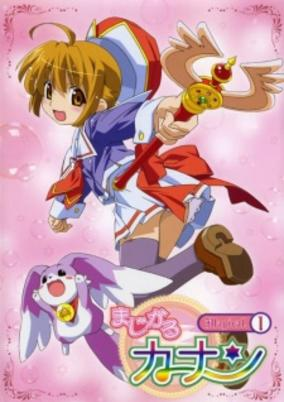

**Studio:** AIC &nbsp;|&nbsp; **Episodes:** 13 &nbsp;|&nbsp; **Director:** Masahi Abe &nbsp;|&nbsp; **Aired/Released:** January 1 – March 26 &nbsp;|&nbsp; **Genres:** Fantasy, Contemporary Fantasy, Japan, Magic, Magical Girl

> Five dangerous "seeds" have been stolen from their vault in the world of Evergreen and taken to Earth. Natsuki, an agent of the Queen, has been sent to retrieve them. However, he cannot do this alone and enlists the aid of Chihaya, a middle school student, who is "the only one" who can help him. With his aid she transforms into Magical Warrior Carmine in order to save the humans possessed by the seeds. Questions abound though, such as why Chihaya's mother appears to know all about this secret activity, why Chihaya remembers her father who reportedly died before her birth, and why she dreams of Evergreen, which she has never seen.
>
> _Synopsis source: Kitsu_

[Wikipedia](https://en.wikipedia.org/wiki/Magical_Canan) · [Kitsu](https://kitsu.io/anime/magical-canan)

---

### Lime-iro Ryuukitan X

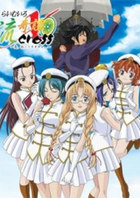

**Studio:** A.C.G.T. &nbsp;|&nbsp; **Episodes:** 13 &nbsp;|&nbsp; **Director:** Tsuneo Tominaga &nbsp;|&nbsp; **Aired/Released:** January 5 – March 30 &nbsp;|&nbsp; **Genres:** Romance, Mecha, Harem, Historical, Ecchi

> It was Meiji 38 (1905), the Russo-Japanese War that had begun since the previous year was getting hard. In this severe circumstance, they reorganized the Raimu Squad. The members of the Raimu Squad were the girls. They were just like other ordinary girls who went to schools and yearned for love, except that they had "Raimu." Inukai Tsuyoshiro was a young man who was newly chosen to be the leader of the squad. He was ambitious to fight for Japan. When the young man met the five girls, the new chapter of "Raimu" began.
>
> _Synopsis source: Kitsu_

[Wikipedia](https://en.wikipedia.org/wiki/Lime-iro_Ryuukitan_X) · [Kitsu](https://kitsu.io/anime/raimuiro-ryuukitan-x)

---

### Starship Operators

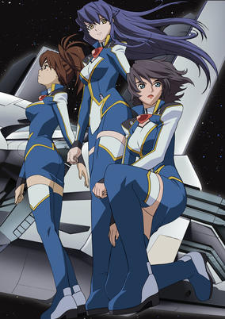

**Studio:** J.C.Staff &nbsp;|&nbsp; **Episodes:** 13 &nbsp;|&nbsp; **Director:** Takashi Watanabe &nbsp;|&nbsp; **Aired/Released:** January 5 – March 30 &nbsp;|&nbsp; **Genres:** Space Travel, Science Fiction, Action, Space Battles, Space Opera, Coming Of Age, Shipboard, War, Future, Plot Continuity, Space, Military

> For the 73rd class of cadets of the Defense University of the small planet Kibi, a shakedown cruise on the fleet's new starship "Amaterasu" is a fitting lead-up to graduation. As they are returning to their home planet, however, they are shocked to hear news of a declaration of war by the aggressive Kingdom against Kibi. When their planetary government surrenders without a struggle, the cadets decide to launch their own war, aboard the "Amaterasu". To gain funding, they make a deal with a galactic news network - and find themselves the "stars" of their own "reality show". Unfortunately, this is the kind of reality show that can get you killed...
>
> _Synopsis source: Kitsu_

[Wikipedia](https://en.wikipedia.org/wiki/Starship_Operators) · [Kitsu](https://kitsu.io/anime/starship-operators)

---

### Jinki: Extend

**Studio:** Feel &nbsp;|&nbsp; **Episodes:** 12 &nbsp;|&nbsp; **Director:** Masahiko Murata &nbsp;|&nbsp; **Aired/Released:** January 6 – March 24 &nbsp;|&nbsp; **Genres:** Science Fiction, Mecha, Earth, Action, Piloted Robot

> Aoba is a young girl who loves to build models of robots. She lived alone with her grandmother until her grandmother passes away. Shortly after she is kidnapped and brought to a secret base where she discovers a huge robot. The piloted robots fight against Ancient-Jinki in The Grand Savanna, but the true meaning behind the fights is hidden. Aoba works hard at the base so one day she can pilot one of the robots and discover these secrets.
>
> _Synopsis source: Kitsu_

[Kitsu](https://kitsu.io/anime/jinki-extend)

---

### Xenosaga: The Animation

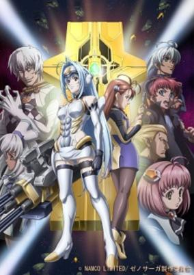

**Studio:** Toei Animation &nbsp;|&nbsp; **Episodes:** 12 &nbsp;|&nbsp; **Director:** Gō Koga (chief) Shigeyasu Yamauchi &nbsp;|&nbsp; **Aired/Released:** January 6 – March 24 &nbsp;|&nbsp; **Genres:** Space Travel, Science Fiction, Mecha, Action, Piloted Robot, Air Force, Gunfights, Parasite, Humanoid Alien, Shipboard, Alien, Future, Android, Space, Military

> The year is T.C. 4767. Four thousand years have passed since humanity abandoned its birthplace, the planet Earth. Beset by the hostile alien Gnosis, mankind is now scrambling to find ways to defeat this threat to their existence. The development of KOS-MOS (a specialized android with amazing capabilities) by Vector engineer Shion Uzuki was one response to the threat. But when their ship is destroyed by the Gnosis, Shion and her companions find themselves thrust into the middle of a battle with no clear sides...
>
> _Synopsis source: Kitsu_

[Kitsu](https://kitsu.io/anime/xenosaga-the-animation)

---

### Negima! (Negima!? Magister Negi Magi)

**Studio:** Xebec &nbsp;|&nbsp; **Episodes:** 26 &nbsp;|&nbsp; **Director:** Nagisa Miyazaki &nbsp;|&nbsp; **Aired/Released:** January 6 – March 30 &nbsp;|&nbsp; **Genres:** Fantasy World, Comedy, Middle School, Magic, All Girls School, Slapstick, Alternative Present, Stereotypes, School Life, Harem, Fantasy, Adventure, Ecchi, Romance, Shounen

> A remake of the Negima anime with its own original story. Wizard Negi Springfield may be a boy, but he has a man-sized job to do! Fresh from the Academy of Magic, Negi continues his training as an instructor at Mahora Academy in Japan. But before he can get his Masters in magic, the 31 schoolgirls of Class 3-A are gonna keep him up all night cramming for a final exam in will power. Temptation aside, Negi has more on his syllabus than flirting and spells. Darkness is closing in, and Negi is gonna need help from his lovely student bodies to drive the ghouls from their school. These girls want to prove that they're the best in class, and extra credit is available to the cuties that aren't afraid of after-hours phantom fighting!
>
> _Synopsis source: Kitsu_

[Wikipedia](https://en.wikipedia.org/wiki/Negima!) · [Kitsu](https://kitsu.io/anime/negima)

---

### Air

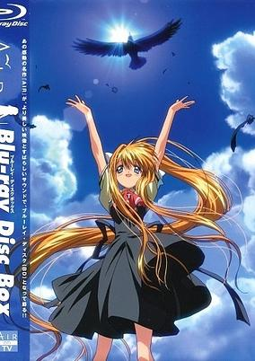

**Studio:** Kyoto Animation &nbsp;|&nbsp; **Episodes:** 13 &nbsp;|&nbsp; **Director:** Tatsuya Ishihara &nbsp;|&nbsp; **Aired/Released:** January 7 – March 25 &nbsp;|&nbsp; **Genres:** Music, Drama, Romance, Supernatural

> A special video for the Tori no Uta OP from Air which was included in the Blu-ray release of the series. It contains original animation covering scenes from the visual novel that were not shown in the series.
>
> _Synopsis source: Kitsu_

[Wikipedia](https://en.wikipedia.org/wiki/Air_(visual_novel)) · [Kitsu](https://kitsu.io/anime/tori-no-uta-music)

---

### The World of Golden Eggs

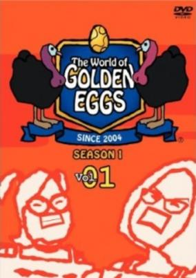

**Studio:** Plus Heads Studio Crocodile &nbsp;|&nbsp; **Episodes:** 26 &nbsp;|&nbsp; **Director:** Yoshihiko Dai &nbsp;|&nbsp; **Aired/Released:** January 7 – December 9, 2006 &nbsp;|&nbsp; **Genres:** Comedy, Parody

> The citizens of Turkey's Hill model a bizzare American-esque town and engage in non-sequitur behavior.
>
> _Synopsis source: Kitsu_

[Wikipedia](https://en.wikipedia.org/wiki/The_World_of_Golden_Eggs) · [Kitsu](https://kitsu.io/anime/the-world-of-golden-eggs)

---

### Ah! My Goddess

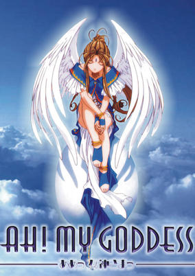

**Studio:** AIC &nbsp;|&nbsp; **Episodes:** 26 &nbsp;|&nbsp; **Director:** Hiroaki Gōda &nbsp;|&nbsp; **Aired/Released:** January 7 – July 8 &nbsp;|&nbsp; **Genres:** Contemporary Fantasy, Romance, Fantasy, Earth, Japan, Asia, Sudden Girlfriend Appearance, Deity, Angel, Magic, Plot Continuity, Present, Comedy

> In a world where humans can have their wish granted via the Goddess Help Hotline, a human, Keiichi Morisato, summons the Goddess Belldandy by accident and jokes that she should stay with him forever. Unfortunately for him, his "wish" is granted. Suddenly, Keiichi is now living with this gorgeous woman all alone, causing him to be kicked out of the all-male dormitory he was staying in. But soon, after they find lodging in a Buddhist temple, Keiichi and Belldandy's relationship begins to blossom. Although they are both awkward and rather uncomfortable with one another at first, what awaits these two strangers could turn out to be an unexpected romance. [Written by MAL Rewrite]
>
> _Synopsis source: Kitsu_

[Wikipedia](https://en.wikipedia.org/wiki/Ah!_My_Goddess) · [Kitsu](https://kitsu.io/anime/aa-megami-sama-tv)

---

### Transformers Galaxy Force (Transformers Cybertron)

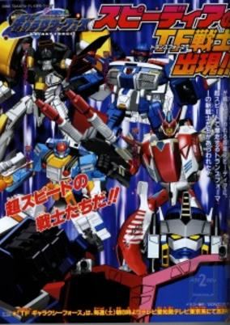

**Studio:** Gonzo &nbsp;|&nbsp; **Episodes:** 52 &nbsp;|&nbsp; **Director:** Hiroyuki Kakudō (chief) Manabu Ono &nbsp;|&nbsp; **Aired/Released:** January 8 – December 31 &nbsp;|&nbsp; **Genres:** Space Travel, Transforming Craft, Science Fiction, Mecha, Action, Other Planet, Alien, Robot Helper, Space, Adventure

> Forced to abandon their home planet of Cybertron due to the threat of the Blackhole, Optimus Prime prepares to lead his autobot warriors to Earth. Just as they are leaving they are confronted by Vector Prime who warns Optimus Prime of the threat to the galaxy if the four Cyber Planet Keys are not gathered in time. However, Megatron has plans of his own for the universe. As they embark on the search, they land on new planets which are inhabited by different Transformer races as well as the Convoys who lead these planets.
>
> _Synopsis source: Kitsu_

[Wikipedia](https://en.wikipedia.org/wiki/Transformers_Galaxy_Force) · [Kitsu](https://kitsu.io/anime/transformers-galaxy-force)

---

### Peach Girl (Peach Girl: Super Pop Love Hurricane)

**Studio:** Studio Comet &nbsp;|&nbsp; **Episodes:** 25 &nbsp;|&nbsp; **Director:** Hiroshi Ishiodori &nbsp;|&nbsp; **Aired/Released:** January 8 – June 25 &nbsp;|&nbsp; **Genres:** Romance, Earth, Japan, Asia, Love Polygon, Coming Of Age, High School, Stereotypes, School Life, Plot Continuity, Present, Slice of Life

> Peach Girl is about an average high school girl, Momo Adachi, who everyone thinks is a beach bunny/slut because of her tanned skin. The actual reason she is so tanned is because she was on the swim team and tans very easily. She likes a boy, Toji, who she heard only likes non-tanned girls. This causes her to question who she is and have low self esteem. She spends a lot of time trying to remake herself into the girl she believes he wants; however, she has a friend, Sae, who likes to go behind Momo's back and make her life terrible, mostly by trying to take Toji away from her. All the while there's another boy, Kairi, who is in love with Momo.
>
> _Synopsis source: Kitsu_

[Wikipedia](https://en.wikipedia.org/wiki/Peach_Girl) · [Kitsu](https://kitsu.io/anime/peach-girl)

---

### Gallery Fake

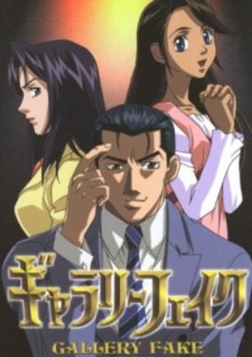

**Studio:** TMS Entertainment Tokyo Kids Minami Machi Bugyousho &nbsp;|&nbsp; **Episodes:** 37 &nbsp;|&nbsp; **Director:** Akira Nishimori (eps 1-12) Osamu Yamasaki (eps 13-37) &nbsp;|&nbsp; **Aired/Released:** January 9 – September 25 &nbsp;|&nbsp; **Genres:** The Arts, Present, Mystery

> Fujita Reiji is the owner of an art gallery, Gallery Fake. He deals with fake items, and is also familiar with the black market. However, he has a special talent for art, and used to work for the Metropolitan Museum of Art in New York as a curator.
>
> _Synopsis source: Kitsu_

[Wikipedia](https://en.wikipedia.org/wiki/Gallery_Fake) · [Kitsu](https://kitsu.io/anime/gallery-fake)

---

### Suki na Mono wa Suki Dakara Shou ga Nai!! (Sukisho)

**Studio:** Zexcs &nbsp;|&nbsp; **Episodes:** 12 &nbsp;|&nbsp; **Director:** Haruka Ninomiya &nbsp;|&nbsp; **Aired/Released:** January 9 – March 27 &nbsp;|&nbsp; **Genres:** Romance, Japan, Comedy, Angst, High School, Drama, School Life, Present, Shounen Ai, Slice of Life

> Hashiba Sora has fallen from a 4th story window and has lost all of his memories. When Fujimori Sunao comes to his school as his new room mate, Fujimori tells Hashiba that he is called Ran. Fujimori and Hashiba both have a split personality which they developed in their youth. Their split personalities, Yoru and Ran, are deeply in love. Even though it creeps Fujimori and Hashiba out what their other selves do with each other at night, they also start to fall for each other. Because of their relationship, Hashiba Sora finds out a lot of shocking facts about their youth.
>
> _Synopsis source: Kitsu_

[Wikipedia](https://en.wikipedia.org/wiki/Sukisho) · [Kitsu](https://kitsu.io/anime/sukisho)

---

### Witch Village Story

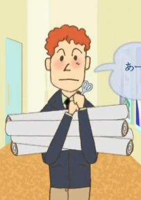

**Episodes:** 24 &nbsp;|&nbsp; **Aired/Released:** January 9 – June 19 &nbsp;|&nbsp; **Genres:** Slice of Life

[Kitsu](https://kitsu.io/anime/witch-village-story)

---

### Ultimate Girls

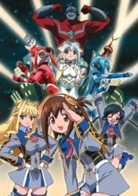

**Studio:** Studio Matrix &nbsp;|&nbsp; **Episodes:** 12 &nbsp;|&nbsp; **Director:** Yuji Mutoh &nbsp;|&nbsp; **Aired/Released:** January 10 – March 28 &nbsp;|&nbsp; **Genres:** Power Suit, Science Fiction, Ecchi, Earth, Japan, Asia, Comedy, Present, Magic

> During a monster attack on the city, which is something that happens quite often, Silk and her two friends try get close to the attacking monster for a better view. An unfortunate choice of location to watch from leads to UFO-man, the city's giant protector, to land on the girls crushing them to death. Feeling sorry, UFO-man blames their death on the monster and promises to bring Silk and her friends back to life by lending them his power but the catch is that they now have to become the city's protector as well.
>
> _Synopsis source: Kitsu_

[Wikipedia](https://en.wikipedia.org/wiki/Ultimate_Girls) · [Kitsu](https://kitsu.io/anime/ultimate-girls)

---

### Mahoraba ~Heartful Days

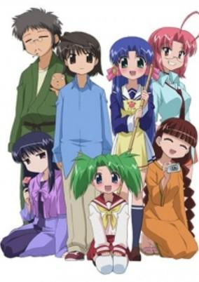

**Studio:** Studio Deen &nbsp;|&nbsp; **Episodes:** 26 &nbsp;|&nbsp; **Director:** Shinichiro Kimura &nbsp;|&nbsp; **Aired/Released:** January 10 – June 27 &nbsp;|&nbsp; **Genres:** Earth, Japan, Asia, Slice of Life, Comedy, Slapstick, Present, Romance

> Shiratori Ryuushi is a young artist-in-training, about to start studying at a vocational school. Arriving at his new lodgings, Narutakisou, he finds himself the focus of attention for the collection of weirdos that inhabit the place. He also meets and falls for the landlady, Aoba Kozue, who seems to be both lovely and charming. However, Kozue is not what she seems to be... in fact, she's more.
>
> _Synopsis source: Kitsu_

[Wikipedia](https://en.wikipedia.org/wiki/Mahoraba) · [Kitsu](https://kitsu.io/anime/mahoraba-heartful-days)

---

### Damekko Doubutsu

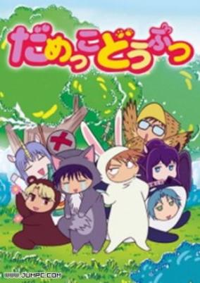

**Studio:** Magic Bus &nbsp;|&nbsp; **Episodes:** 26 &nbsp;|&nbsp; **Director:** Setsuko Shibuichi &nbsp;|&nbsp; **Aired/Released:** January 17 – February 21 &nbsp;|&nbsp; **Genres:** Fantasy, Comedy, Juujin, Slapstick, Present, Slice of Life

> Uruno, a useless wolf, is on the road searching for a new place to call home. He soon comes upon a whole forest full of "useless animals"-- that is, animals that don't live up to their species' usual character. After a short fight with the smoking, bad-tempered rabbit, Usahara, Uruno decides that he wants to move on... but changes his mind upon meeting Chiiko, a clumsy cheetah girl. It's love at first sight for Uruno, and after deciding to stay for her, he continues to hope that even though he's a good-for-nothing, he'll win her over someday. That is, if living with the other strange residents of the forest-- including the aformentioned smoking rabbit, a sake-drinking unicorn, a near-sighted eagle, an orca that cannot swim, and a shy pegasus --doesn't get to him first.
>
> _Synopsis source: Kitsu_

[Wikipedia](https://en.wikipedia.org/wiki/Damekko_D%C5%8Dbutsu) · [Kitsu](https://kitsu.io/anime/damekko-doubutsu)

---

### Girls Bravo : Second Season (Girls Bravo)

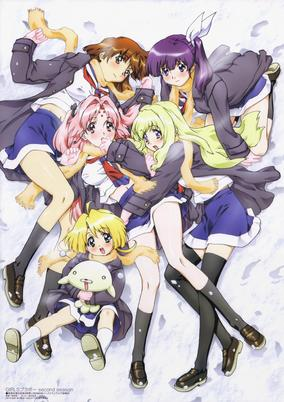

**Studio:** AIC &nbsp;|&nbsp; **Episodes:** 13 &nbsp;|&nbsp; **Director:** Ei Aoki &nbsp;|&nbsp; **Aired/Released:** January 27 – April 21 &nbsp;|&nbsp; **Genres:** Ecchi, Romance, Japan, Asia, Comedy, Violent Retribution For Accidental Infringement, Sudden Girlfriend Appearance, Love Polygon, High School, Americas, Slapstick, Stereotypes, School Life, Plot Continuity, Present, Harem, Fantasy

> Small for his age, Yukinari has been bullied and abused by girls all his life. Now in high school, he has developed a rare condition: whenever girls touch him, or even come close, he breaks out in hives. Imagine his surprise, when he is suddenly transported to the city of Seiren on a mystic world invisibly orbiting the Earth, and populated with vast numbers of women and very few men. Fortunately, he has a new friend, Miharu-chan, whose touch inexplicably doesn't affect him.
>
> _Synopsis source: Kitsu_

[Wikipedia](https://en.wikipedia.org/wiki/Girls_Bravo) · [Kitsu](https://kitsu.io/anime/girls-bravo-first-season)

---

### Shin Chou Kyou Ryo: Condor Hero II (Legend of the Condor Hero II)

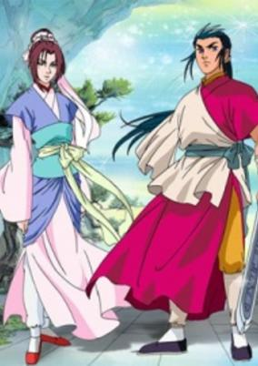

**Studio:** Nippon Animation &nbsp;|&nbsp; **Episodes:** 26 &nbsp;|&nbsp; **Aired/Released:** January 30 – September 2, 2006 &nbsp;|&nbsp; **Genres:** Martial Arts, Swordplay, Past, Earth, Historical, China, Feudal Warfare, Plot Continuity, Asia, Action

> Continuation of Legend of the Condor Hero.
>
> _Synopsis source: Kitsu_

[Wikipedia](https://en.wikipedia.org/wiki/The_Legend_of_Condor_Hero) · [Kitsu](https://kitsu.io/anime/shin-chou-kyou-ryo-condor-hero-ii)

---

### Buzzer Beater

**Studio:** TMS Entertainment &nbsp;|&nbsp; **Episodes:** 13 &nbsp;|&nbsp; **Director:** Shigeyuki Miya &nbsp;|&nbsp; **Aired/Released:** February 5 – April 30 &nbsp;|&nbsp; **Genres:** Science Fiction, Basketball, Action, Sports, Humanoid Alien, Alien, Future

> Hideyoshi is a homeless boy living in New York in the near future, who survives by hustling other kids in basketball games. But now he's been drafted into a pro team-a pro team with a very unique goal. There once was a time when humans dominated the game of basketball. But times have changed, and now the physically superior alien players have taken over the game, and there are barely any human players left. But Hideyoshi's team-the first all-human team to compete in the Space League-intends to change all that, and bring the championship back home to Earth.
>
> _Synopsis source: Kitsu_

[Wikipedia](https://en.wikipedia.org/wiki/Buzzer_Beater_(manga)) · [Kitsu](https://kitsu.io/anime/buzzer-beater)

---

### Futari wa Precure: Max Heart (Pretty Cure Max Heart)

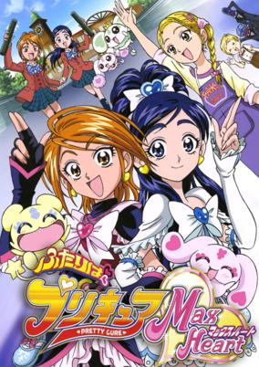

**Studio:** Toei Animation &nbsp;|&nbsp; **Episodes:** 47 &nbsp;|&nbsp; **Director:** Daisuke Nishio &nbsp;|&nbsp; **Aired/Released:** February 6 – January 29, 2006 &nbsp;|&nbsp; **Genres:** Fantasy, Japan, Earth, Action, Asia, Magic, Magical Girl, Present, Super Power, Comedy

> Shortly after the fall of the Wicked King, the Queen of the Garden of Light lost her memory and came to Earth, in the form of a 12-year-old girl named Hikari Kujou. Now, she—with the help of Nagisa and Honoka, endowed with new costumes and powers—must find the 12 Heartiels, which hold the key to restoring the Queen's lost memories. For together once again, they are Pretty Cure.
>
> _Synopsis source: Kitsu_

[Wikipedia](https://en.wikipedia.org/wiki/Pretty_Cure_Max_Heart) · [Kitsu](https://kitsu.io/anime/futari-wa-precure-max-heart)

---

### Masuda Kousuke Gekijou Gag Manga Biyori

**Studio:** Artland &nbsp;|&nbsp; **Episodes:** 12 &nbsp;|&nbsp; **Director:** Akitarō Daichi &nbsp;|&nbsp; **Aired/Released:** February 7 – April 25 &nbsp;|&nbsp; **Genres:** Present, Earth, Parody, Japan, Violence, Asia, Fantasy, Comedy

> Gyagu Manga Biyori is an anime that is about absolutely nothing. It is comprised of 12 short stories (5 minutes long each) that only build up a small amount of plot for each story. The anime feeds off the stupidest things, but is quite humorous.
>
> _Synopsis source: Kitsu_

[Wikipedia](https://en.wikipedia.org/wiki/Gag_Manga_Biyori) · [Kitsu](https://kitsu.io/anime/gyagu-manga-biyori)

---

### Koi Koi 7 (Koi Koi Seven)

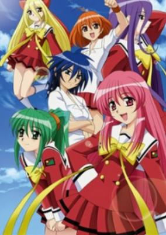

**Studio:** Studio Flag &nbsp;|&nbsp; **Episodes:** 13 &nbsp;|&nbsp; **Director:** Yoshitaka Fujimoto &nbsp;|&nbsp; **Aired/Released:** April 2 – June 25 &nbsp;|&nbsp; **Genres:** Ecchi, Science Fiction, Mecha, Japan, Action, Comedy, Student Government, Shoujo Ai, Cyborg, High School, All Girls School, Android, Friendship, Slapstick, School Life, Harem, Super Power, Romance

> Tanaka Tetsuro is excited at getting a full scholarship at a new high school, far away from his family. What he does not know is that he will be the only boy in an all girl school, and that there is a girl head-over-heels in love with him, waiting for his arrival. But his special friendship with the very cute and dynamic Asuka also causes him to get into a lot of trouble with the powerful student council leadership, as they are at open war with Asuka and her five friends, a group of super amazon warriors called the Koi Koi Seven.
>
> _Synopsis source: Kitsu_

[Wikipedia](https://en.wikipedia.org/wiki/Koi_Koi_7) · [Kitsu](https://kitsu.io/anime/koi-koi-7)

---

### Twin Princess of Wonder Planet

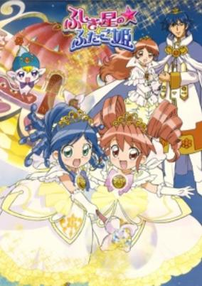

**Studio:** Hal Film Maker &nbsp;|&nbsp; **Episodes:** 51 &nbsp;|&nbsp; **Director:** Junichi Sato (chief) Shōgo Kōmoto &nbsp;|&nbsp; **Aired/Released:** April 2 – March 25, 2006 &nbsp;|&nbsp; **Genres:** Magic, Comedy

> In the hollow Mysterious Planet, seven kingdoms co-exist, all of them lit by the Sun's Blessing from the Kingdom of the Sun, in the middle of the planet. The light of the core sun is necessary for the continued existence of all the kingdoms. Yet, something is causing the Sun's Blessing to weaken. If something isn't done, it will be the end of life in the Mysterious Planet. Fortunately, the twin princesses of the Sun Kingdom, Fine and Rein, have been endowed with the magic of the Prominence, and are looking for a way to fix things.
>
> _Synopsis source: Kitsu_

[Wikipedia](https://en.wikipedia.org/wiki/Twin_Princess_of_Wonder_Planet) · [Kitsu](https://kitsu.io/anime/fushigiboshi-no-futagohime)

---

### MÄR (Mars of Destruction)

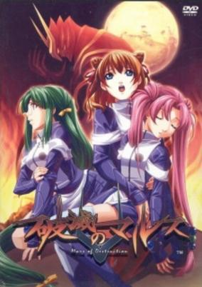

**Studio:** SynergySP &nbsp;|&nbsp; **Episodes:** 102 &nbsp;|&nbsp; **Director:** Masaharu Okuwaki Keiichiro Kawaguchi (eps 53-102) &nbsp;|&nbsp; **Aired/Released:** April 3 – March 25, 2007 &nbsp;|&nbsp; **Genres:** Alien, Gunfights, Earth, Mecha, Power Suit, Japan, Violence, Humanoid Alien, Asia, Action

> Several months after a probe returning from Mars burns up during reentry, strange creatures dubbed "Ancients" begin to appear throughout Tokyo. Aggressive and dangerous, they cannot be killed with ordinary weapons. As scientists struggle to find the cause of their sudden appearance, the monsters wreak havoc across the world. Humanity finds hope in the form of the MARS suit—a new weapon developed to take down these enemies. The suit, however, can only be worn by those with specific DNA. Enter Takeru Hinata, an ordinary teen with a troubled past and one of the few capable of piloting the only weapon against the Ancients. With the help of the AAST, a special police force established to defeat the dangerous creatures, the young man battles against demons both personal and global whilst trying to discover the true nature of Earth's new aggressors. [Written by MAL Rewrite]
>
> _Synopsis source: Kitsu_

[Wikipedia](https://en.wikipedia.org/wiki/M%C3%84R) · [Kitsu](https://kitsu.io/anime/mars-of-destruction)

---

### Onegai My Melody

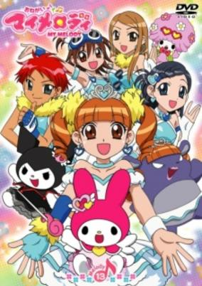

**Studio:** Studio Comet &nbsp;|&nbsp; **Episodes:** 52 &nbsp;|&nbsp; **Director:** Makoto Moriwaki &nbsp;|&nbsp; **Aired/Released:** April 3 – March 26, 2006 &nbsp;|&nbsp; **Genres:** Japan, Slice of Life, Comedy, Magic, Present, Fantasy

> My Melody arrives on Earth much to the surprise of her rival Kuromi. Together with one of the junior high school students, Yumeno Uta, they decide to protect the dreams of the people with the help of magic.
>
> _Synopsis source: Kitsu_

[Wikipedia](https://en.wikipedia.org/wiki/Onegai_My_Melody) · [Kitsu](https://kitsu.io/anime/onegai-my-melody)

---

### Izumo: Flash of a Brave Sword

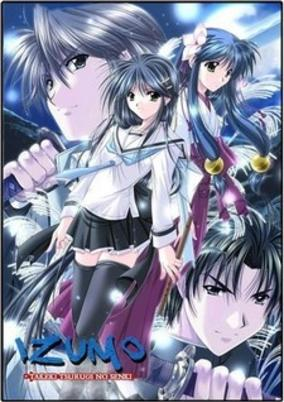

**Studio:** Studio Kyuuma Trinet Entertainment &nbsp;|&nbsp; **Episodes:** 12 &nbsp;|&nbsp; **Director:** Tsuneo Tominaga &nbsp;|&nbsp; **Aired/Released:** April 3 – June 19 &nbsp;|&nbsp; **Genres:** Fantasy, Fantasy World, Action, Swordplay, High Fantasy, Martial Arts, Magic, Parallel Universe, Plot Continuity, Violence, Present, Adventure, Romance

> Yagi Takeru has been living in the Touma family's house since his parents are gone. He was raised by Touma Rokunosuke, the head of the house. He is surrounded by many people such as Yamato Takeshi, his best friend-cum-rival from the kendo club, the Shiratori sisters, Kotono and Asuka, and his childhood friend, Oosu Seri. Life has been blissful until one day, an earthquake strikes the school and everything changes. Takeru awakens to find that the school looks as if it has been abandoned for centuries and reduced to ruins. He also realize that all the teachers and students have disappeared as well. He meets up with Seri and Asuka and they fled from the ruins, only to realize that the town they used to live in is completely empty. Subsequently, people wrapped in cloaks appear before him. They were told that they have been brought to another world.
>
> _Synopsis source: Kitsu_

[Kitsu](https://kitsu.io/anime/izumo-takeki-tsurugi-no-senki)

---

### Emma – A Victorian Romance (Emma: A Victorian Romance)

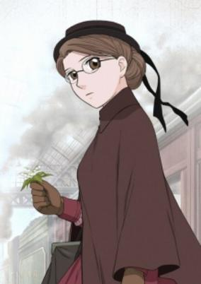

**Studio:** Pierrot &nbsp;|&nbsp; **Episodes:** 12 &nbsp;|&nbsp; **Director:** Tsuneo Kobayashi &nbsp;|&nbsp; **Aired/Released:** April 3 – June 19 &nbsp;|&nbsp; **Genres:** Romance, Earth, Victorian Period, United Kingdom, Slice of Life, Maid, Europe, Past, Plot Continuity, Historical

> In 19th-century London, class lines are sharply drawn, and the social standing to which people are born dictates the path their lives will follow. Emma, an honest and hardworking young maid, never felt her place in life to be a burden. But then she met William, a member of the gentry and the eldest son of a wealthy family. His warm smile and earnest affection threaten to capture her heart... but can love truly conquer all?
>
> _Synopsis source: Kitsu_

[Wikipedia](https://en.wikipedia.org/wiki/Emma_(manga)) · [Kitsu](https://kitsu.io/anime/eikoku-koi-monogatari-emma)

---

### The Law of Ueki

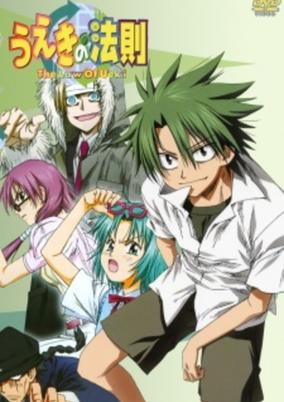

**Studio:** Studio Deen &nbsp;|&nbsp; **Episodes:** 51 &nbsp;|&nbsp; **Director:** Hiroshi Watanabe &nbsp;|&nbsp; **Aired/Released:** April 4 – March 27, 2006 &nbsp;|&nbsp; **Genres:** Fantasy World, Japan, Adventure, Action, Asia, Earth, Combat, Comedy, Violence, Present, Super Power

> Kousuke Ueki, a student of the Hinokuni Junior High School, is picked by a Celestial King Candidate, Koba-sen, to participate in a competition where people battle out to become the Celestial King and only the strongest will prevail. Embodied with the ability to turn garbage into trees, Kousuke will be joining in the battle against other junior high school students in this selection. This sets the premise for the earth-friendly battle where the students will pit their powers against the rest, with a reward of the Blank Talent giving motive for students to win.
>
> _Synopsis source: Kitsu_

[Wikipedia](https://en.wikipedia.org/wiki/The_Law_of_Ueki) · [Kitsu](https://kitsu.io/anime/the-law-of-ueki)

---

### Taiko Drum Master

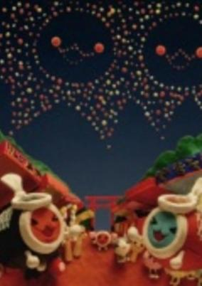

**Studio:** Studio Bingo &nbsp;|&nbsp; **Episodes:** 26 &nbsp;|&nbsp; **Aired/Released:** April 4 – May 15, 2006 &nbsp;|&nbsp; **Genres:** Virtual Reality

> A series of four minute claymation shows. Each episode shows the different antics of the various Taiko no Tatsujin characters.
>
> _Synopsis source: Kitsu_

[Wikipedia](https://en.wikipedia.org/wiki/Taiko_Drum_Master) · [Kitsu](https://kitsu.io/anime/taiko-no-tatsujin)

---

### Comic Party Revolution

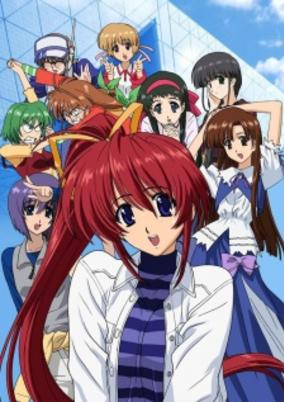

**Studio:** Chaos Project Radix &nbsp;|&nbsp; **Episodes:** 13 &nbsp;|&nbsp; **Director:** Yasunori Yamada (eps 5-13) (chief) Junichi Sakata (eps 1-4) Mitsuhiro Tōgō (eps 5-13) &nbsp;|&nbsp; **Aired/Released:** April 4 – June 28 &nbsp;|&nbsp; **Genres:** Japan, Asia, Earth, Parody, Comedy, Coming Of Age, Slapstick, The Arts, Present

> Sendo Kazuki, failed the entrance exam for the art college he was applying to, His childhood friend, Kuhonbutsu Taishi forced Kazuki to enter the doujin (private publishing) world.
>
> _Synopsis source: Kitsu_

[Wikipedia](https://en.wikipedia.org/wiki/Comic_Party_Revolution) · [Kitsu](https://kitsu.io/anime/comic-party-revolution)

---

### Elemental Gelade

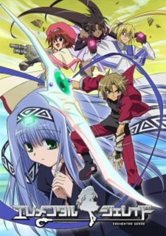

**Studio:** Xebec &nbsp;|&nbsp; **Episodes:** 26 &nbsp;|&nbsp; **Director:** Shigeru Ueda &nbsp;|&nbsp; **Aired/Released:** April 5 – September 27 &nbsp;|&nbsp; **Genres:** Contemporary Fantasy, Fantasy, Romance, Pirate, Fantasy World, Adventure, Action, Comedy, Gunfights, Super Power, Magic

> After a routine raid, the rookie sky pirate Coud finds a most unusual cargo in his mates' cargo hold: Ren, an "Edel Reid", a race prized by humans for granting special combat power to their partners through "Reacting". He quickly discovers, however, that Ren is even more prized than he expected. The pirate ship is visited by three members of the Edel Reid Complete Protection Agency "Arc Aire", who try to purchase her. When Coud refuses, the ship is suddenly attacked by a mysterious force, and Coud's captain charges him with Ren's protection.
>
> _Synopsis source: Kitsu_

[Wikipedia](https://en.wikipedia.org/wiki/Elemental_Gelade) · [Kitsu](https://kitsu.io/anime/elemental-gelade)

---

### Aquarion

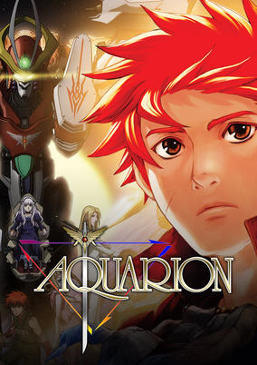

**Studio:** Satelight &nbsp;|&nbsp; **Episodes:** 26 &nbsp;|&nbsp; **Director:** Shōji Kawamori &nbsp;|&nbsp; **Aired/Released:** April 5 – September 27 &nbsp;|&nbsp; **Genres:** Fantasy, Romance, Transforming Craft, Science Fiction, Mecha, Post Apocalypse, Action, Earth, Piloted Robot, Angel, Coming Of Age, Dystopia, Henshin, Drama, Future, Friendship, Slow When It Comes To Love, Disaster, Super Power

> Humanity is dominated by fear when the Shadow Angels invade after 12,000 years of slumber. There is hope, however—Mechanical Angel Aquarion, a fighting machine powered by the intertwined souls of pilots known as Elements. With prophecy being fulfilled, and the end of the world approaching, the last hope for the new century takes flight. For mankind to survive, one among the Elements must rise.
>
> _Synopsis source: Kitsu_

[Wikipedia](https://en.wikipedia.org/wiki/Genesis_of_Aquarion) · [Kitsu](https://kitsu.io/anime/sousei-no-aquarion)

---

### Mushiking: The Guardians of the Forest

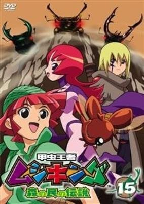

**Studio:** TMS Entertainment &nbsp;|&nbsp; **Episodes:** 52 &nbsp;|&nbsp; **Director:** Shigeyasu Yamauchi &nbsp;|&nbsp; **Aired/Released:** April 6 – March 29, 2006 &nbsp;|&nbsp; **Genres:** Fantasy

> Based off of the game. Popo, and his family were harmoniously living with the insects in the forest until one day when his father left him and gave him a mysterious pendant with magical powers. Now, with mysterious events happened to his mother, he must travel with his newly found companions to the forest to solve the mysteries bound in the east.
>
> _Synopsis source: Kitsu_

[Kitsu](https://kitsu.io/anime/kouchuu-ouja-mushiking-mori-no-tami-no-densetsu)

---

### Eyeshield 21

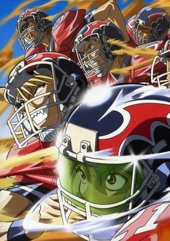

**Studio:** Gallop &nbsp;|&nbsp; **Episodes:** 145 &nbsp;|&nbsp; **Director:** Masayoshi Nishida (Chief) Shin Katagai (eps 104-145) &nbsp;|&nbsp; **Aired/Released:** April 6 – March 19, 2008 &nbsp;|&nbsp; **Genres:** Japan, Earth, Action, Asia, Sports, Comedy, United States, High School, Americas, School Clubs, Slapstick, School Life, Plot Continuity, Violence, Present

> Sena is like any other shy kid starting high school; he's just trying to survive. Constantly bullied, he's accustomed to running away. Surviving high school is about to become a lot more difficult after Hiruma, captain of the school's American football team, witnesses Sena's incredible agility and speed during an escape from some bullies. Hiruma schemes to make Sena the running back of his school team, The Devil Bats, hoping that it will turn around the squad's fortunes from being the laughingstock of Japan's high school leagues, to title contender. To protect his precious star player from rivaling recruiters, he enlists Sena as "team secretary," giving him a visored helmet and the nickname "Eyeshield 21" to hide his identity. The Devilbats will look to make their way to the Christmas Bowl, an annual tournament attended by the best football teams in Japan, with "Eyeshield 21" leading the way. Will they be able to win the Christmas Bowl? Will Sena be able to transform from a timid, undersized freshman to an all-star player? Put on your pads and helmet to find out!
>
> _Synopsis source: Kitsu_

[Wikipedia](https://en.wikipedia.org/wiki/Eyeshield_21) · [Kitsu](https://kitsu.io/anime/eyeshield-21)

---

### Strawberry 100%

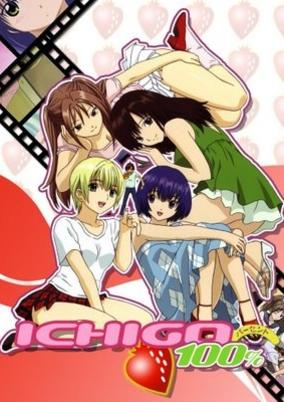

**Studio:** Madhouse &nbsp;|&nbsp; **Episodes:** 12 &nbsp;|&nbsp; **Director:** Osamu Sekita &nbsp;|&nbsp; **Aired/Released:** April 6 – June 22 &nbsp;|&nbsp; **Genres:** Ecchi, Romance, Japan, Asia, Earth, Stereotypes, Present, Harem, Comedy

> One day, Manaka Junpei walks to the roof of his school and encounters a beautiful girl falling down from above him and accidentally exposing her strawberry panties. The embarrassed girl runs away before Junpei can find out whom she is. He wishes to become a filmmaker, and this whole experienced seemed like it would make the perfect scene in a movie. And so he goes on a search for the girl with the strawberry panties in order to reenact it all on film. But he will soon discover that finding that one girl will not be that easy...
>
> _Synopsis source: Kitsu_

[Wikipedia](https://en.wikipedia.org/wiki/Strawberry_100%25) · [Kitsu](https://kitsu.io/anime/ichigo-100)

---

### Glass Mask

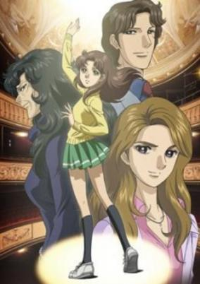

**Studio:** Tokyo Movie Shinsha &nbsp;|&nbsp; **Episodes:** 51 &nbsp;|&nbsp; **Director:** Mamoru Hamatsu &nbsp;|&nbsp; **Aired/Released:** April 6 – March 29, 2006 &nbsp;|&nbsp; **Genres:** Japan, Asia, Earth, Performance, Present, The Arts, Shoujo, Romance

> Two Girls. One Dream. And the entire world for a stage. At 13 years old, Maya Kitajima seems destined to spend the rest of her life toiling in a crowded restaurant alongside her bitter and unstable mother. But when her incredible acting talent is discovered by the legendary diva Chigusa Tsukikage, Maya finds a new future filled with both golden opportunities and terrifying risks. For Ayumi Himekawa, success has always been assured, yet she longs to be recognized for her own talents and skills, not her famous parents' connections. For both, the ultimate prize is the role of The Crimson Goddess in the play of the same name, a part created by Chigusa. To achieve this goal, both Maya and Ayumi must seek out and conquer every acting challenge, pushing the limits of their talent and endurance to the utmost, until they are worthy of the part… But for one to win, the other must fail!
>
> _Synopsis source: Kitsu_

[Wikipedia](https://en.wikipedia.org/wiki/Glass_Mask) · [Kitsu](https://kitsu.io/anime/glass-no-kamen-2005)

---

### Loveless

**Studio:** J.C.Staff &nbsp;|&nbsp; **Episodes:** 12 &nbsp;|&nbsp; **Director:** Yū Kō &nbsp;|&nbsp; **Aired/Released:** April 7 – June 30

[Wikipedia](https://en.wikipedia.org/wiki/Loveless_(manga))

---

### Futakoi Alternative

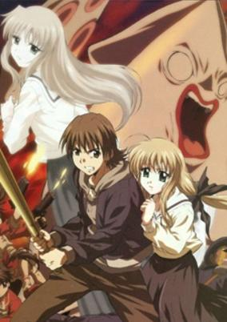

**Studio:** Feel Studio Flag Ufotable &nbsp;|&nbsp; **Episodes:** 13 &nbsp;|&nbsp; **Director:** Takayuki Hirao &nbsp;|&nbsp; **Aired/Released:** April 7 – June 30 &nbsp;|&nbsp; **Genres:** Ecchi, Romance, Japan, Action, Asia, Earth, Mafia, Comedy, Angst, Drama, Slapstick, Plot Continuity, Present

> The Futaba Detective Agency, being run by Rentarou, who has taken over the family business, after his father's death 3 weeks ago. Along w/ Sara &amp; Souju, his live-in identical twin assistants. He ends up running afoul of the local Yakuza.
>
> _Synopsis source: Kitsu_

[Wikipedia](https://en.wikipedia.org/wiki/Futakoi_Alternative) · [Kitsu](https://kitsu.io/anime/futakoi-alternative)

---

### Best Student Council

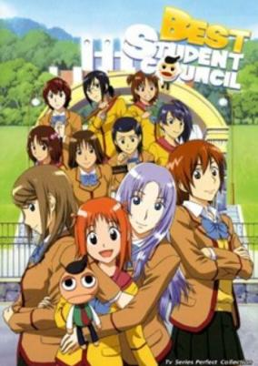

**Studio:** J.C.Staff &nbsp;|&nbsp; **Episodes:** 26 &nbsp;|&nbsp; **Director:** Yoshiaki Iwasaki &nbsp;|&nbsp; **Aired/Released:** April 7 – September 29 &nbsp;|&nbsp; **Genres:** Fantasy, Contemporary Fantasy, Japan, Asia, Earth, Comedy, Shoujo Ai, Coming Of Age, High School, All Girls School, Slapstick, Stereotypes, School Life, Present, Slice of Life

> Randou Rino is a young girl with a head full of air and a talking puppet on her hand. She is accepted into the illustrious Gokujou all-girl's school, and is summarily, almost curiously, accepted as part of the even more illustrious Gokujou Student Council, who has more power and business ventures than most large businesses. Now a part of the student council, she befriends the talented members of the Gokujou Student Council, leaving one to wonder how a girl with seemingly no talents or redeeming qualities would get chosen for such a group.
>
> _Synopsis source: Kitsu_

[Wikipedia](https://en.wikipedia.org/wiki/Best_Student_Council) · [Kitsu](https://kitsu.io/anime/gokujou-seitokai)

---

### Speed Grapher

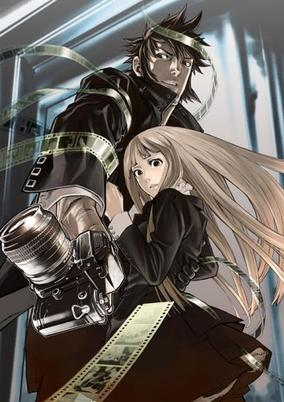

**Studio:** Gonzo &nbsp;|&nbsp; **Episodes:** 24 &nbsp;|&nbsp; **Director:** Kunihisa Sugishima &nbsp;|&nbsp; **Aired/Released:** April 8 – September 30 &nbsp;|&nbsp; **Genres:** Earth, Ecchi, Japan, Genetic Modification, Action, Asia, Gunfights, Human Enhancement, Conspiracy, Crime, Rotten World, Horror, Plot Continuity, Violence, Super Power, Mystery

> Ten years after the Bubble War, the dichotomy between the rich and the poor in the world becomes more prominent and Japan is no exception. The rich seek to satisfy their desires and derive pleasure for themselves, and Tokyo has materialized into such a city as a result. Saiga, once a war photographer, works for Hibara Ginza in the capitalist state of Tokyo. He infiltrates the Roppongi Club, a secretive base located in the red light district of the city, to collect information about them. However, he was caught in the process and brought forward to a girl called Kagura who was in the midst of a ritual. His contact with Kagura awakens his special ability: the power to make things explode when photographed. In order to unravel the mystery behind the Roppongi Club and Kagura, Saiga begins his solitary battle.
>
> _Synopsis source: Kitsu_

[Wikipedia](https://en.wikipedia.org/wiki/Speed_Grapher) · [Kitsu](https://kitsu.io/anime/speed-grapher)

---

### He Is My Master

**Studio:** Gainax Shaft &nbsp;|&nbsp; **Episodes:** 12 &nbsp;|&nbsp; **Director:** Shouji Saeki &nbsp;|&nbsp; **Aired/Released:** April 8 – July 1 &nbsp;|&nbsp; **Genres:** Ecchi, Earth, Japan, Asia, Comedy, Violent Retribution For Accidental Infringement, Maid, Slapstick, Present, Slice of Life

> Izumi Sawatari and her younger sister, Mitsuki Sawatari, have run away from home and are in need of employment. The only jobs available are as maids in the mansion of 14-year-old millionaire, Yoshitaka Nakabayashi. What seems like simple work is soon revealed to be far more than the girls bargained for when they find Yoshitaka to be an authoritative employer who demands they call him "Master".
>
> _Synopsis source: Kitsu_

[Wikipedia](https://en.wikipedia.org/wiki/He_Is_My_Master) · [Kitsu](https://kitsu.io/anime/kore-ga-watashi-no-goshujin-sama)

---

### Tsubasa Chronicle (Tsubasa RESERVoir CHRoNiCLE)

**Studio:** Bee Train &nbsp;|&nbsp; **Episodes:** 52 &nbsp;|&nbsp; **Director:** Kōichi Mashimo Hiroshi Morioka (2nd Season, along with Mashimo) &nbsp;|&nbsp; **Aired/Released:** April 9 – October 15 &nbsp;|&nbsp; **Genres:** Fantasy, Fantasy World, Adventure, Action, Alternative Past, Swordplay, High Fantasy, Martial Arts, Bishounen, Past, Alternative Present, Parallel Universe, Plot Continuity, Present, Magic, Romance

> During an excavation at the mysterious ruins in Clow Country, Syaoran discovers his childhood friend Princess Sakura appear on the site with wings that disperse into many feathers. As the feather's disappear to different dimensions, so does Sakura's memory. In attempts to save Sakura's life and restore her memory, Syaoran travels through to another world to find a solution. There's only one thing left he can do. Travel through to different dimensions to collect Sakura's feathers. Helping out with the quest is Kurogane, an exiled ninja from Japan Country who wishes to return to his world, the runaway magician, Fay, who desires to jump between each world never to return to his own and the white meat-bun shaped creature, Mokona.
>
> _Synopsis source: Kitsu_

[Wikipedia](https://en.wikipedia.org/wiki/Tsubasa_Chronicle) · [Kitsu](https://kitsu.io/anime/tsubasa-chronicle)

---

### Zoids: Genesis (Zoids Genesis)

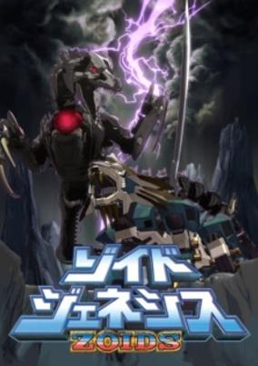

**Studio:** Shogakukan Music & Digital Entertainment &nbsp;|&nbsp; **Episodes:** 50 &nbsp;|&nbsp; **Director:** Kazunori Mizuno &nbsp;|&nbsp; **Aired/Released:** April 10 – March 26, 2006 &nbsp;|&nbsp; **Genres:** Science Fiction, Mecha, Post Apocalypse, Fantasy World, Action, Piloted Robot, Plot Continuity, Adventure, Comedy, Military

> Natural disasters have devastated planet Zi, killing off almost all life. A thousand years later humans have gradually re-established civilization, salvaging ancient Zoids through diving and mining efforts. In a village whose most previous item is a giant sword which they worship as a holy symbol. A teenage boy discovers an ancient Liger-type Zoid while on a deep water salvage operation. Suddenly the village is attacked by skeletal Bio-Zoids intent on stealing a powerful generator located in the village. Our teenage hero awakens the Liger and discovers that the town`s sacred sword is the Liger`s weapon, together they fight off the mysterious Bio-Zoids. At least for now...
>
> _Synopsis source: Kitsu_

[Kitsu](https://kitsu.io/anime/zoids-genesis)

---

### King of Braves GaoGaiGar Final Grand Glorious Gathering

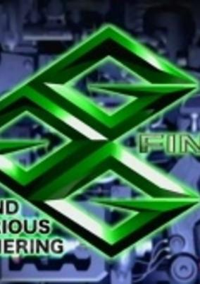

**Studio:** Sunrise &nbsp;|&nbsp; **Episodes:** 12 &nbsp;|&nbsp; **Director:** Yoshitomo Yonetani &nbsp;|&nbsp; **Aired/Released:** April 11 – June 27 &nbsp;|&nbsp; **Genres:** Super Power, Mecha, Action, Science Fiction

> Following Gutsy Galaxy Guard's victory over the Zonder Empire and the 31 Primevals, a new threat makes their appearance on Earth. GGG - with Guy Shishio and the newly-constructed GaoFighGar - team up with their French counterpart Chasseur to battle the evil organization BioNet. Among Chasseur's ranks is Renais Cardiff Shishioh - a former BioNet cyborg with the relentless pursuit of destroying those who took away her humanity. But as GGG and Chasseur fight the BioNet, GGG's bases around the world are suddenly attacked, and the recently-discovered "Q-Parts" and the original Gao Machines are stolen by Mamoru Amami, who has been abducted and cloned by an even greater threat known as the "Eleven Kings of Sol." Evicted from Earth by the United Nations, GGG must now travel to the far reaches of the galaxy to battle the Eleven Kings of Sol and save Mamoru before it's too late.
>
> _Synopsis source: Kitsu_

[Wikipedia](https://en.wikipedia.org/wiki/King_of_Braves_GaoGaiGar_Final) · [Kitsu](https://kitsu.io/anime/gaogaigar-final-grand-glorious-gathering)

---

### Basilisk

**Studio:** Gonzo &nbsp;|&nbsp; **Episodes:** 24 &nbsp;|&nbsp; **Director:** Fumitomo Kizaki &nbsp;|&nbsp; **Aired/Released:** April 13 – September 21

[Wikipedia](https://en.wikipedia.org/wiki/Basilisk_(manga))

---

### Honey and Clover

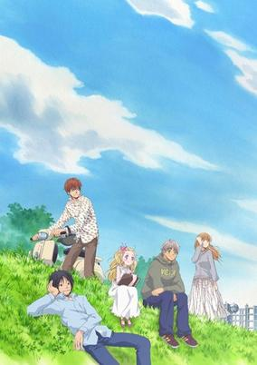

**Studio:** J.C.Staff &nbsp;|&nbsp; **Episodes:** 24 &nbsp;|&nbsp; **Director:** Ken'ichi Kasai &nbsp;|&nbsp; **Aired/Released:** April 15 – September 27 &nbsp;|&nbsp; **Genres:** Romance, Japan, Asia, Earth, Slice of Life, Comedy, University, Love Polygon, Coming Of Age, Slapstick, The Arts, Plot Continuity, Present, Josei

> Yuuta, Takumi, and Shinobu share a six-tatami room apartment with no bath. The rent is low and it's perfect for poor college students such as themselves. Shinobu is a mysterious, quirky person, who does things on a whim. Takumi is passionate both in work and love, and Yuuta is a simple person with simple dreams and desires. That is, until he meets Hagumi, a petite girl with enormous amount of talent. Hagumi is fondly called Hagu by Shuuji, who serves as Hagu's guardian. Hagu meets Ayumi, nicknamed Ayu, and they become close friends almost instantly. Meanwhile, Ayu falls for one of the boys... The joys of falling in love, the pain of letting go, discovering one's self, and finding the courage to move on—these are some of the things that the characters in Hachimitsu to Clover experience as they take part in the play staged by fate.
>
> _Synopsis source: Kitsu_

[Wikipedia](https://en.wikipedia.org/wiki/Honey_and_Clover) · [Kitsu](https://kitsu.io/anime/honey-and-clover)

---

### Eureka Seven

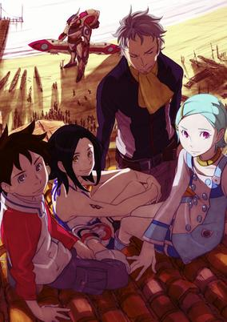

**Studio:** Bones &nbsp;|&nbsp; **Episodes:** 50 &nbsp;|&nbsp; **Director:** Tomoki Kyoda &nbsp;|&nbsp; **Aired/Released:** April 17 – April 2, 2006 &nbsp;|&nbsp; **Genres:** Romance, Science Fiction, Mecha, Post Apocalypse, Action, Tone Changes, Earth, Piloted Robot, Air Force, Coming Of Age, Angst, Alien, Future, Plot Continuity, Violence, Military, Adventure, Drama

> In the backwater town of Bellforest lives a 14-year-old boy named Renton Thurston. He desires to leave his home behind and join the mercenary group known as Gekkostate, hoping to find some adventure to brighten up his mundane life. However, stuck between his grandfather's insistence to become a mechanic like him and the pressure of his deceased father's legacy, the only excitement Renton finds is in his pastime of riding the Trapar wave particles that are dispersed throughout the air, an activity akin to surfing. Everything changes when an unknown object crashes through Renton's garage, discovered to be a Light Finding Operation—a robot capable of riding the Trapar waves—specifically known as the Nirvash typeZERO. Its pilot is a young girl named Eureka, a member of the Gekkostate, who requests a tune-up for the Nirvash. Their meeting sparks the beginning of Renton's involvement with the Gekkostate as he takes off alongside Eureka as the co-pilot of the Nirvash.
>
> _Synopsis source: Kitsu_

[Wikipedia](https://en.wikipedia.org/wiki/Eureka_Seven) · [Kitsu](https://kitsu.io/anime/eureka-seven)

---

### Doraemon

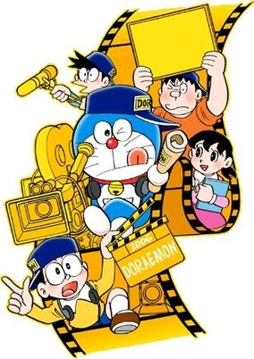

**Studio:** Shin-Ei Animation &nbsp;|&nbsp; **Director:** Kōzō Kusuba (2005-04-15; 2005-04-15) (chief) Tsutomu Shibayama (chief) Shinnosuke Yakuwa Soichiro Zen (2009) &nbsp;|&nbsp; **Aired/Released:** April 22 – present &nbsp;|&nbsp; **Genres:** Comedy, Science Fiction, Kids, Time Travel, Future, Present, Mecha, Robot Helper, Robot, Slapstick

> Doraemon (2005) is the most recent anime series based on Fujiko Fujio's manga of the same name. It is the 2005 version of 1979 series, with certain changes in the animation and other things. Doraemon is a cat-like robot who appears in the present to steer Nobita/Noby, who is a dumb, naive and clumsy boy on the right path in order to secure his future. Nobita's love interest is Shizuka Minamoto/Sue, his frenemies are Takeshi Goda/Big G and Suneo/Sneech.
>
> _Synopsis source: Kitsu_

[Wikipedia](https://en.wikipedia.org/wiki/Doraemon_(2005_anime)) · [Kitsu](https://kitsu.io/anime/doraemon-2005)

---

### Trinity Blood

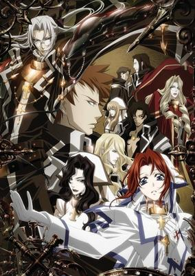

**Studio:** Gonzo &nbsp;|&nbsp; **Episodes:** 24 &nbsp;|&nbsp; **Director:** Tomohiro Hirata &nbsp;|&nbsp; **Aired/Released:** April 29 – October 28 &nbsp;|&nbsp; **Genres:** Science Fiction, Post Apocalypse, Earth, Europe, Human Enhancement, Conspiracy, Vampire, Future, Violence, Super Power, Action

> The background is in the distant future after the destruction brought about by Armageddon. The war between the vampires and the humans continue to persist. In order to protect the humans from the vampires, the Vatican has to rely on other allies to counter the situation. The protagonist, Abel Nightroad, is a traveling priest from the Vatican and a crusnik, a vampire that drinks the blood of vampires. He is a member of the "Ax", a special operations group led by Cardinal Catherina Sforza. He encounters a young girl called Esther, who decides to go with him to Rome and train at the Vatican. Soon after he meets her, the order of Rozencreuz, led by Abel's twin, Cain, tries to continue the war so they can rule the world. It's up to Abel and the AX to try and stop them.
>
> _Synopsis source: Kitsu_

[Wikipedia](https://en.wikipedia.org/wiki/Trinity_Blood) · [Kitsu](https://kitsu.io/anime/trinity-blood)

---

### New Legend of the Heroes of the Warring Nations – The Ten Sanada Brave Soldiers

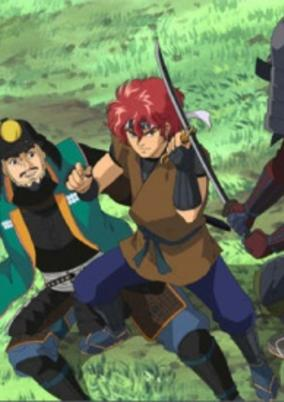

**Studio:** G&G Entertainment Group TAC &nbsp;|&nbsp; **Episodes:** 12 &nbsp;|&nbsp; **Director:** Keizō Shimizu &nbsp;|&nbsp; **Aired/Released:** May 7 – July 23 &nbsp;|&nbsp; **Genres:** Ninja, Japan, Action, Asia, Earth, Sengoku Period, Swordplay, Past, Military, Samurai, Historical, Comedy

> In the Fifth Year of the Keicho era, the Tokugawa clan sought to solidify their control of Japan. Hidetada Tokugawa has come to the doorsteps of Ueda Castle with the intentions of having the Sanada clan open its doors to him. But the Sanada and their retainers have other plans...
>
> _Synopsis source: Kitsu_

[Kitsu](https://kitsu.io/anime/shinshaku-sengoku-eiyuu-densetsu-sanada-juu-yuushi-the-animation)

---

### Absolute Boy

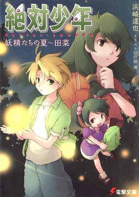

**Studio:** Ajia-do &nbsp;|&nbsp; **Episodes:** 26 &nbsp;|&nbsp; **Director:** Tomomi Mochizuki &nbsp;|&nbsp; **Aired/Released:** May 21 – November 19 &nbsp;|&nbsp; **Genres:** Fantasy, Japan, Asia, Earth, Contemporary Fantasy, Sports, Coming Of Age, Plot Continuity, Present, Science Fiction, Mystery

> Aizawa Ayumu is a young boy, who is sent to a small town called Tana to live with his father for a while. Even though he doesn't want to go, he agrees to do so when his mother offers him a mountain bike. Ayumu used to live in Tana before, and now his memories of the time are shrouded in mystery - apparently something happened when he was a child. Enter Miku, a young girl who knows more than she tells, weird glowing lights floating around, reflections of UFOish objects in the eyes of cats and dogs, a nosy female announcer, a forest with a mysterious past, and a weird boy called Wakkun, who wears the clothes Ayumu used to when he was a child, and you get the world of Zettai Shonen, where mysteries remain mysteries amidst a slow, normal, everyday life.
>
> _Synopsis source: Kitsu_

[Wikipedia](https://en.wikipedia.org/wiki/Absolute_Boy) · [Kitsu](https://kitsu.io/anime/zettai-shounen)

---

### The Snow Queen (The Snow Queen (TV))

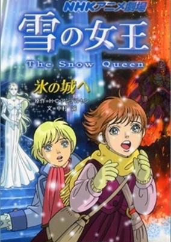

**Studio:** TMS Entertainment &nbsp;|&nbsp; **Episodes:** 36 &nbsp;|&nbsp; **Director:** Osamu Dezaki &nbsp;|&nbsp; **Aired/Released:** May 22 – February 12, 2006 &nbsp;|&nbsp; **Genres:** Fantasy, Adventure, Earth, Contemporary Fantasy, Past

> Based on the children's story by Hans Christian Andersen. Gerda and Kai have been neighbors and best friends since childhood. Gerda is eleven, Kai twelve. They were happy children who worked and played as they should. All that changed when the Snow Queen's mirror broke. The shards spread all through the world, each containing evil. If a shard went inside your eye, it would turn your heart to ice. A shard went into Kai's eye. After that, he grew cold to those he loved. One night, the Snow Queen came in her carriage and took Kai back to her ice castle at the farthest north point of the world. Everyone in Kai and Gerda's village didn't know where he went and believed he died from drowning in the frozen-over lake. Gerda doesn't believe this, for she dreamed of seeing Kai enter the carriage. When a drunk man admits that he also saw this, Gerda starts realizing that maybe what she saw wasn't a dream. She packs her things and goes on a journey to save Kai and bring him back home.
>
> _Synopsis source: Kitsu_

[Wikipedia](https://en.wikipedia.org/wiki/The_Snow_Queen_(Japanese_TV_series)) · [Kitsu](https://kitsu.io/anime/yuki-no-joou)

---

### Patalliro Saiyuuki!

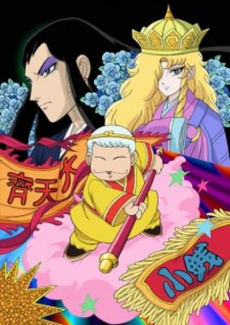

**Studio:** Magic Bus &nbsp;|&nbsp; **Episodes:** 26 &nbsp;|&nbsp; **Director:** Kenichi Maejima &nbsp;|&nbsp; **Aired/Released:** June 7 – November 29 &nbsp;|&nbsp; **Genres:** Super Power, Contemporary Fantasy, Parody, Shounen Ai, Fantasy, Adventure, Comedy

> Genjou Sanzou is a Buddhist monk who has been sent by the Emperor on a journey to find the sacred Buddhist scriptures. One day, Sanzou meets an Earth Deity who tells him that Buddha has sent him a disciple: the mischievous Monkey Deity Son Goku, who was sealed inside of a mountain for five hundred years after wreaking havoc in Heaven! Together with the alcohol-loving playboy Cho Hakkai; the heavenly army General Sagojyou; and their horse, the Dragon Crown Prince Ryuuba; there are plenty of adventures to be had from fighting off monsters to bishounen contests.
>
> _Synopsis source: Kitsu_

[Wikipedia](https://en.wikipedia.org/wiki/Patalliro!) · [Kitsu](https://kitsu.io/anime/patalliro-saiyuki)

---

### Kamichu! (The Goddess is a Middle School Student)

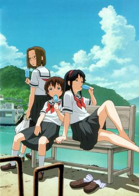

**Studio:** Brain's Base &nbsp;|&nbsp; **Episodes:** 12 &nbsp;|&nbsp; **Director:** Koji Masunari &nbsp;|&nbsp; **Aired/Released:** June 29 – September 27 &nbsp;|&nbsp; **Genres:** Contemporary Fantasy, Fantasy, Romance, Japan, Asia, Earth, Middle School, Deity, Coming Of Age, Anthropomorphism, School Life, Present, Comedy, Slice of Life

> Yurie Hitotsubashi was just an average middle school student living in the city of Onomichi on Japan's inland sea in the easygoing times of the 1980s. She spent her days worrying about exams and trying to get Kenji, the clueless boy she likes, to notice her. Then during lunch one day she suddenly announces to her friend Mitsue that the night before she had become a goddess. Their classmate Matsuri quickly latches on to Yurie's newfound divinity as a way to promote her family's bankrupt Shinto shrine. She hopes that replacing their hapless local god, Yashima-sama, with Yurie will make the shrine more popular (and profitable). Now, with Matsuri as her manager, Yurie has to grant wishes, cure curses, meet aliens, and attend god conventions. All the while attending school and working-up the courage to confess to Kenji.
>
> _Synopsis source: Kitsu_

[Wikipedia](https://en.wikipedia.org/wiki/Kamichu!) · [Kitsu](https://kitsu.io/anime/kamichu)

---

### Ah My Buddha

**Studio:** Studio Deen &nbsp;|&nbsp; **Episodes:** 13 &nbsp;|&nbsp; **Director:** Keitaro Motonaga &nbsp;|&nbsp; **Aired/Released:** July 1 – September 16 &nbsp;|&nbsp; **Genres:** Ecchi, Japan, Asia, Earth, Comedy, Violent Retribution For Accidental Infringement, School Life, Violence, Present, Harem, Romance

> Satonaka Ikkou, a 16 year old boy, is a first year trainee at the Saienji Buddhist Temple. He was sent there by his parents to be trained by his grandmother, the Saienji Priestess. At the temple he finds himself surrounded by beautiful female priestesses-in-training. Upon seeing a girl naked, Ikko has the ability to turn into a super-monk, performing massive exorcisms for the good of the temple.
>
> _Synopsis source: Kitsu_

[Wikipedia](https://en.wikipedia.org/wiki/Ah_My_Buddha) · [Kitsu](https://kitsu.io/anime/amaenaide-yo)

---

### Sugar Sugar Rune

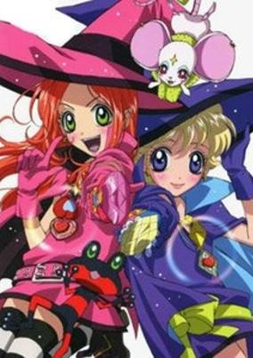

**Studio:** Pierrot &nbsp;|&nbsp; **Episodes:** 51 &nbsp;|&nbsp; **Director:** Yukihiro Matsushita &nbsp;|&nbsp; **Aired/Released:** July 2 – June 24, 2006 &nbsp;|&nbsp; **Genres:** Romance, Fantasy, Japan, Asia, Earth, Comedy, Bishounen, Magic, School Life, Magical Girl, Plot Continuity

> Chocolat Meilleure and Vanilla Mieux are two witches who are pitched in a contest to see who will become the new Queen of the Witch World. They must travel to the Human World and collect the hearts of humans. Whoever collects the most "human hearts" wins. Even though they're rivals, the two are still best friends. Join them on this adventure!
>
> _Synopsis source: Kitsu_

[Wikipedia](https://en.wikipedia.org/wiki/Sugar_Sugar_Rune) · [Kitsu](https://kitsu.io/anime/sugar-sugar-rune)

---

### My Wife is a High School Girl

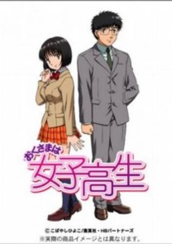

**Studio:** Madhouse &nbsp;|&nbsp; **Episodes:** 13 &nbsp;|&nbsp; **Director:** Jun Shishido &nbsp;|&nbsp; **Aired/Released:** July 2 – September 24 &nbsp;|&nbsp; **Genres:** Romance, Ecchi, Japan, Asia, Earth, Slice of Life, High School, Slapstick, Stereotypes, School Life, Present, Comedy

> Asami Onohara is a seventeen-year old high-school student with a secret which has not been revealed to anyone: She is already married. Her husband, Kyosuke Ichimaru, is a Physics teacher in the same high school as her. However, even though they are officially a married couple, Asami's father forbids them to have any sexual contact until after Asami has graduated. Asami has to hide the fact that she is married to Kyosuke while trying desperately to further their relationship, and it does not help when there are so many interferences and obstacles from her father and other third parties.
>
> _Synopsis source: Kitsu_

[Wikipedia](https://en.wikipedia.org/wiki/My_Wife_is_a_High_School_Girl) · [Kitsu](https://kitsu.io/anime/okusama-wa-joshikousei-2005)

---

### Moeyo Ken TV

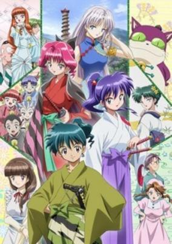

**Studio:** Picture Magic Trinet Entertainment &nbsp;|&nbsp; **Episodes:** 13 &nbsp;|&nbsp; **Director:** Toshikatsu Tokoro &nbsp;|&nbsp; **Aired/Released:** July 2 – September 24 &nbsp;|&nbsp; **Genres:** Fantasy, Japan, Shinsengumi, Asia, Earth, Comedy, Alternative Past, Historical, Adventure

> Set in an alternate version of the Meiji Era, a boy named Sakamoto Ryunosuke returns to Kyoto from Shanghai with his monster (youkai) Nekomaru. The law states that in order to live freely with humans, a youkai must be liscensed. The Kidou Shinsengumi Co. Ltd. is responsible for the capture of unliscensed youkais but must fight with the Tsubamegumi, who resents the new law. It turns out that Ryunosuke is the son of the owner of the Shinsengumis.
>
> _Synopsis source: Kitsu_

[Wikipedia](https://en.wikipedia.org/wiki/Moeyo_Ken_TV) · [Kitsu](https://kitsu.io/anime/kidou-shinsengumi-moeyo-ken-tv)

---

### D.C.S.S: Da Capo Second Season (D.C.S.S. ~Da Capo Second Season~)

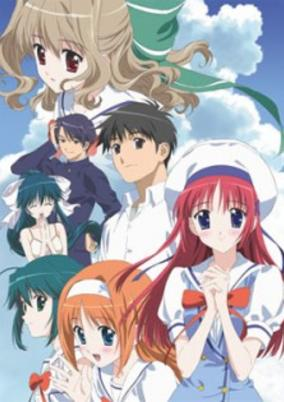

**Studio:** Feel &nbsp;|&nbsp; **Episodes:** 26 &nbsp;|&nbsp; **Director:** Munenori Nawa &nbsp;|&nbsp; **Aired/Released:** July 2 – December 24 &nbsp;|&nbsp; **Genres:** Romance, Japan, Asia, Earth, Sudden Girlfriend Appearance, High School, Stereotypes, School Life, Plot Continuity, Present, Harem, Comedy

> Hatsune-Jima was once well-known for its cherry trees, which would bloom no matter what time of year it was. Two years ago, the island's cherry trees lost this ability and all became ordinary cherry trees that bloom only in the spring. Jun'ichi Asakura is now a graduating senior at Kazami Academy, and is surrounded by many close friends, old and new alike. On a stormy summer day, a mysterious young girl, Aisia, arrives at Jun'ichi's door. She is looking for Sakura's grandmother to study magic, ultimately hoping to bring happiness to everyone. When she discovers that grandmother Yoshino had long since passed away, she joyfully assumes (thanks to his error in judgment) that Jun'ichi is able to teach her. Even though she finally understands that the only magic he's capable of is conjuring Japanese confections, Aisia continues her search for magic on Hatsune-Jima. Amid the chaos of her search, Kazami Academy hires new medical staff.
>
> _Synopsis source: Kitsu_

[Wikipedia](https://en.wikipedia.org/wiki/D.C.S.S._~Da_Capo_Second_Season~) · [Kitsu](https://kitsu.io/anime/da-capo-second-season)

---

### Paniponi Dash! (Pani Poni Dash!)

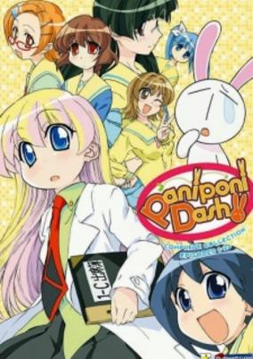

**Studio:** Gansis Shaft &nbsp;|&nbsp; **Episodes:** 26 &nbsp;|&nbsp; **Director:** Shin Ōnuma Akiyuki Shinbo &nbsp;|&nbsp; **Aired/Released:** July 4 – December 26 &nbsp;|&nbsp; **Genres:** Japan, Parody, Comedy, Super Deformed, High School, Humanoid Alien, Shipboard, Alien, Slapstick, School Life, Present

> The 11-year-old Miyamoto Rebecca becomes the new teacher of a classroom which is full of weirdos. Despite her cute looks she's a little beast and can be pretty sarcastic and offensive. The school is not safe anymore now that she's in charge of a class and her students, Himeko, Ichijou, Rei and a white rabbit who took a liking to Rebecca help her to rough up the school and the neighbor with its teacher "ojii-chan."
>
> _Synopsis source: Kitsu_

[Wikipedia](https://en.wikipedia.org/wiki/Paniponi_Dash!) · [Kitsu](https://kitsu.io/anime/paniponi-dash)

---

### Oku-sama wa Mahō Shōjo: Bewitched Agnes (My Wife is a High School Girl)

**Studio:** Studio Deen &nbsp;|&nbsp; **Episodes:** 13 &nbsp;|&nbsp; **Director:** Hiroshi Nishikiori &nbsp;|&nbsp; **Aired/Released:** July 4 – September 26 &nbsp;|&nbsp; **Genres:** Romance, Ecchi, Japan, Asia, Earth, Slice of Life, High School, Slapstick, Stereotypes, School Life, Present, Comedy

> Asami Onohara is a seventeen-year old high-school student with a secret which has not been revealed to anyone: She is already married. Her husband, Kyosuke Ichimaru, is a Physics teacher in the same high school as her. However, even though they are officially a married couple, Asami's father forbids them to have any sexual contact until after Asami has graduated. Asami has to hide the fact that she is married to Kyosuke while trying desperately to further their relationship, and it does not help when there are so many interferences and obstacles from her father and other third parties.
>
> _Synopsis source: Kitsu_

[Kitsu](https://kitsu.io/anime/okusama-wa-joshikousei-2005)

---

### Gun Sword (Gun x Sword)

**Studio:** AIC ASTA &nbsp;|&nbsp; **Episodes:** 26 &nbsp;|&nbsp; **Director:** Gorō Taniguchi &nbsp;|&nbsp; **Aired/Released:** July 4 – September 26 &nbsp;|&nbsp; **Genres:** Science Fiction, Mecha, Adventure, Action, Piloted Robot, Gunfights, Other Planet, Future, Plot Continuity, Violence, Space

> Van, a lanky and apathetic swordsman, is on a journey to kill the murderer of his fiancé. The only characteristic he has to go by is that the murderer has a claw for an arm, hence the murderer being referred to as The Claw Man. During his travels, Van happens to pass through the city of Evergreen, which is defending itself from bandits who aim to rob the city of its treasury. It is in this city that Van meets Wendy Garret, a timid young girl who is looking for her kidnapped brother. When the city pleads for Van's assistance to defend it, he refuses, claiming it has nothing to do with him and thus leaves the city on its own to deal with the peril. Soon after, Van comes across the raiding bandits himself and they eventually tick off the swordsman to a degree where he takes action against them for his own personal vendetta. Surprisingly, Van learns that the bandits had ties with The Claw Man, and in kidnapping Wendy's brother for a reason they did not disclose. After the bandits are dealt with easily, Van and, much to his chagrin, Wendy continue the journey in search of The Claw Man. Little do they know, however, that The Claw Man is involved with something more atrocious than either could fathom.
>
> _Synopsis source: Kitsu_

[Wikipedia](https://en.wikipedia.org/wiki/Gun_Sword) · [Kitsu](https://kitsu.io/anime/gun-x-sword)

---

### Play Ball

**Studio:** Eiken &nbsp;|&nbsp; **Episodes:** 13 &nbsp;|&nbsp; **Director:** Satoshi Dezaki (chief) Setsuko Shibuichi &nbsp;|&nbsp; **Aired/Released:** July 5 – September 27

[Wikipedia](https://en.wikipedia.org/wiki/Play_Ball_(manga))

---

### Akahori's Heretical Hour Love Game

**Studio:** Radix &nbsp;|&nbsp; **Episodes:** 13 &nbsp;|&nbsp; **Director:** Hitoyuki Matsui &nbsp;|&nbsp; **Aired/Released:** July 5 – September 27 &nbsp;|&nbsp; **Genres:** Japan, Earth, Comedy, Slapstick, Alternative Present, Magical Girl, Magic, Parody

> Akahori Gedou Hour Rabuge is an anime series that combined episodes of two related stories into one broadcast block.Zettai Seigi Love Pheromone Yoshizumi Aimi and Sasajima Kaoruko are comic duo, Their dream is to become popular and stand on the Broadway stage.However, their names are not well-known, and they have to do part-time jobs.To make their names popular, they decided to do side job. It is heroines of justice, They will beat villains one after another, but after that, there is nothing but ruins. People are afraid of them and even rumor that they are evil.
>
> _Synopsis source: Kitsu_

[Wikipedia](https://en.wikipedia.org/wiki/Akahori_Gedou_Hour_Rabuge) · [Kitsu](https://kitsu.io/anime/love-pheromone)

---

### Suzuka

**Studio:** Studio Comet &nbsp;|&nbsp; **Episodes:** 26 &nbsp;|&nbsp; **Director:** Hiroshi Fukutomi &nbsp;|&nbsp; **Aired/Released:** July 7 – December 29

[Wikipedia](https://en.wikipedia.org/wiki/Suzuka_(manga))

---

### Tide-Line Blue

**Studio:** Telecom Animation Film &nbsp;|&nbsp; **Episodes:** 12 &nbsp;|&nbsp; **Director:** Umanosuke Iida &nbsp;|&nbsp; **Aired/Released:** July 7 – September 29 &nbsp;|&nbsp; **Genres:** Steampunk, Science Fiction, Post Apocalypse, Action, Asia, Earth, Navy, Future, Plot Continuity, Military, Adventure

> The catastrophe, "Hammer of Eden," resulted in the loss of six billion lives and the flooding of 90% of the land. The New United Nations were formed to pursue peace on the ruined lands 14 years later. Keel is a boy living in a town called Yabitsu, an area which prospered due to the energy from the nuclear generator brought by the catastrophe. His next kin, Aoi, is the secretary general of the New United Nations. She views the catastrophe as an opportunity to create a new world in which nations can help one another overcome differences in races and religions. However, her efforts to realise that vision fail because of the unwillingness of the nations to change. Gould, a military officer, feels that the only way to make an order is through the military. Using Ulysses, a nuclear submarine, along with his crew, including Keel's brother Tean, Gould carries out a coup to declare war against the New United Nations in his attack on Yabitsu.
>
> _Synopsis source: Kitsu_

[Wikipedia](https://en.wikipedia.org/wiki/Tide-Line_Blue) · [Kitsu](https://kitsu.io/anime/tide-line-blue)

---

### Shuffle!

**Studio:** Asread &nbsp;|&nbsp; **Episodes:** 26 &nbsp;|&nbsp; **Director:** Naoto Hosoda &nbsp;|&nbsp; **Aired/Released:** July 8 – January 6, 2006 &nbsp;|&nbsp; **Genres:** Fantasy, Romance, Japan, Asia, Earth, Contemporary Fantasy, Ecchi, Sudden Girlfriend Appearance, High School, Alternative Present, School Life, Plot Continuity, Harem, Magic, Comedy, Drama

> In present times, Gods and Demons coexist together with Humans after the door between each of these worlds had opened. Tsuchimi Rin is a normal young high school student attending Verbena Academy, spending his days living peacefully with his childhood friend Kaede. Unexpectedly, one day the King of Gods, the King of Demons and their families move into be Rin's next door neighbors. Apparently the daughter of the Gods, Sia, and the daughter of the demons, Nerine, are both deeply in love with Rin after having met him in the past. Along with his playful friendship with upperclassmen Asa and his encounter with the silent but cute Primula, Rin has much on his hands dealing with the affections of each of these girls. Based on the eroge by Navel.
>
> _Synopsis source: Kitsu_

[Wikipedia](https://en.wikipedia.org/wiki/Shuffle!) · [Kitsu](https://kitsu.io/anime/shuffle)

---

### Petopeto-san

**Studio:** Xebec M2 &nbsp;|&nbsp; **Episodes:** 13 &nbsp;|&nbsp; **Director:** Akira Nishimori &nbsp;|&nbsp; **Aired/Released:** July 9 – October 1 &nbsp;|&nbsp; **Genres:** Fantasy, Contemporary Fantasy, Japan, Asia, Earth, Slice of Life, Comedy, Middle School, Slapstick, School Life, Present, Romance

> In a Japan not quite like our own, the "youkai" (supernatural creatures) have started living together with humans. Now, in an ordinary school, all sorts of "monsters" attend regular classes. A human boy, Oohashi Shingo, finds himself attracted to one of these creatures, a "petopeto" called Fujimura Hatoko. Petoko, as she is called, is a minor monster, with only the power to stick to something she adores. Like Shingo....
>
> _Synopsis source: Kitsu_

[Wikipedia](https://en.wikipedia.org/wiki/Petopeto-san) · [Kitsu](https://kitsu.io/anime/petopeto-san)

---

### Full Metal Panic! The Second Raid

**Studio:** Kyoto Animation &nbsp;|&nbsp; **Episodes:** 13 &nbsp;|&nbsp; **Director:** Yasuhiro Takemoto &nbsp;|&nbsp; **Aired/Released:** July 14 – October 20 &nbsp;|&nbsp; **Genres:** Science Fiction, Earth, Mecha, Japan, Action, Asia, Piloted Robot, Gunfights, Plot Continuity, Violence, Military

> This series is set about two months after the events ocurred in the Tuatha de Danaan at the end of the original series. Mithril becomes aware of a secret organization that has technology able to counter the ECS (Electronic Cloaking System) mode. This organization, known as Amalgam, also has "Black Technology," obtained from "Whispered" like Kaname Chidori, and like the other intelligence agencies, they intend to obtain more; however, when Sousuke's mission to protect Chidori is terminated by Mithril, all seems to be in place for Amalgam's plans...
>
> _Synopsis source: Kitsu_

[Wikipedia](https://en.wikipedia.org/wiki/Full_Metal_Panic!_The_Second_Raid) · [Kitsu](https://kitsu.io/anime/full-metal-panic-the-second-raid)

---

### Ichigo Mashimaro (Strawberry Marshmallow)

**Studio:** Daume &nbsp;|&nbsp; **Episodes:** 12 &nbsp;|&nbsp; **Director:** Takuya Satō &nbsp;|&nbsp; **Aired/Released:** July 15 – October 14 &nbsp;|&nbsp; **Genres:** Japan, Earth, Asia, Slice of Life, Comedy, Present, School Life, Elementary School

> "Cute girls doing cute things in cute ways." Everyday things make up the fabric of life—whether it's making friends, going to school, trying to make money, or celebrating a holiday. Ichigo Mashimaro is a heartwarming series that follows the daily lives of Itou Chika, her sister Nobue, and her friends Miu, Matsuri, and Ana. [Written by MAL Rewrite]
>
> _Synopsis source: Kitsu_

[Wikipedia](https://en.wikipedia.org/wiki/Ichigo_Mashimaro) · [Kitsu](https://kitsu.io/anime/ichigo-mashimaro)

---

### Oden-kun

**Studio:** Studio Egg &nbsp;|&nbsp; **Episodes:** 156 &nbsp;|&nbsp; **Director:** Michiya Katō &nbsp;|&nbsp; **Aired/Released:** August 4 – February 27, 2009 &nbsp;|&nbsp; **Genres:** Comedy

> In an odd dimensional bubble inside the kettle of an Oden food cart exists Oden village. The residents of Oden village spend their idyllic days waiting for customers to come and eat them. In the meantime, Oden-kun helps other troubled dwellers to realize their dreams. One day, he hears that a customer's mother suffers from cancer so he leaves the kettle and after being eaten, faces the cancer cell Gannosuke. Oden-kun's dream is to meet his own mother. Looking forward to this day, Oden-kun spends his days doing one good deed a day.
>
> _Synopsis source: Kitsu_

[Kitsu](https://kitsu.io/anime/oden-kun)

---

### Guyver: The Bioboosted Armor

**Studio:** OLM &nbsp;|&nbsp; **Episodes:** 26 &nbsp;|&nbsp; **Director:** Katsuhito Akiyama &nbsp;|&nbsp; **Aired/Released:** August 6 – February 18, 2006 &nbsp;|&nbsp; **Genres:** Power Suit, Action, Parasite, Conspiracy, Dark Fantasy, Horror, School Life, Present, Super Power, Science Fiction, Adventure

> Sho Fukamachi, a normal teenager accidentally found an alien object called Unit and thus, changed his life forever. The Unit bonded with Sho, resulting in an incredibly powerful life-form called Guyver. With this great power, Sho battles the mysterious Chronos organization and it's Zoanoids, in order to protect his friends and his world. Unknown to Sho, the battle against Chronos will lead to the discovery of the origins of human, their destiny, and the Creators...
>
> _Synopsis source: Kitsu_

[Kitsu](https://kitsu.io/anime/kyoushoku-soukou-guyver-2005)

---

### G.I. Joe: Sigma 6

**Studio:** Gonzo &nbsp;|&nbsp; **Episodes:** 26 &nbsp;|&nbsp; **Director:** Kobun Shizuno &nbsp;|&nbsp; **Aired/Released:** September 10 – October 28, 2006 &nbsp;|&nbsp; **Genres:** Science Fiction, Military, Action, Anime Influenced

> The toyline was accompanied by a 26-episode animated series produced by the Japanese animation studio Gonzo, which aired on Fox, G4, and YTV.
>
> _Synopsis source: Kitsu_

[Kitsu](https://kitsu.io/anime/g-i-joe-sigma-6)

---

### Rockman.EXE Beast

**Studio:** Xebec &nbsp;|&nbsp; **Episodes:** 25 &nbsp;|&nbsp; **Director:** Takao Kato &nbsp;|&nbsp; **Aired/Released:** October 1 – April 1, 2006 &nbsp;|&nbsp; **Genres:** Mecha, Action, Science Fiction, Adventure

> Trill, a mysterious navi said to have originated from the world of Beyondard, is discovered. And new beast-type enemies, the Zoanoroids, want him for his special power. Netto Hikari and Rockman must protect their new friend while they try to figure out what Trill is really and his connection to the two legendary cyber beasts, Grega and Faltzer.
>
> _Synopsis source: Kitsu_

[Wikipedia](https://en.wikipedia.org/wiki/Rockman.EXE_Beast) · [Kitsu](https://kitsu.io/anime/rockman-exe-beast)

---

### Idaten Jump

**Studio:** Trans Arts &nbsp;|&nbsp; **Episodes:** 52 &nbsp;|&nbsp; **Director:** Takayuki Hamana &nbsp;|&nbsp; **Aired/Released:** October 1 – September 30, 2006 &nbsp;|&nbsp; **Genres:** Sports, Cycling, School Life, Kids, Parallel Universe, Comedy, Adventure

> Sho liked MTB very much and he always practiced at the practice field, “X-Zone”, with his friends, Takumi and Makoto. Takumi was a good mechanic and Makoto was a competitive girl rider. One day, he was challenged by a MTB team, “Shark Tooth”, of Samejima brothers’ betting the X-Zone. For Sho, X-Zone was a memorable place where he had spent days with his dead father, and he couldn’t lose the game. The day came, and during the race with the leader of Shark Tooth, black smoke suddenly covered around, and they were sent to another world. When he came to, he found Kakeru, Makoto, and his MTB, “Flame Caesar”, were also there. While they were wondering what had happened, MTB riders came. They challenged Sho to a MTB bout. They said Sho had to collect 10 pieces of emblems by winning MTB bout, “Idaten Battle”. This is how Sho came down to compete in Idaten Battle at various courses, such as, volcanos, ruins, deserts, snowy montains, and grave yards. Whether will show win the race to come back to his world?
>
> _Synopsis source: Kitsu_

[Wikipedia](https://en.wikipedia.org/wiki/Idaten_Jump) · [Kitsu](https://kitsu.io/anime/idaten-jump)

---

### Magical Girl Lyrical Nanoha A's

**Studio:** Seven Arcs &nbsp;|&nbsp; **Episodes:** 13 &nbsp;|&nbsp; **Director:** Keizou Kusakawa &nbsp;|&nbsp; **Aired/Released:** October 2 – December 25 &nbsp;|&nbsp; **Genres:** Fantasy, Contemporary Fantasy, Science Fiction, Japan, Adventure, Action, Asia, Earth, Juujin, Magic, Humanoid Alien, Magical Girl, Plot Continuity, Present, Military, Super Power, Comedy

> After the events of the Lost Logia case, Nanoha waits patiently for the day she can reunite with her newfound friend, Fate. Although being an exceptionally powerful mage, Nanoha spends her days normally with her friends on Earth. But peace is once again suddenly shattered, as Nanoha is without warning attacked by a powerful mage. A group of violent mages have been attacking anything with magic power for their own goals. Nanoha and Fate, along with their friends Yuuno, Arf, Chrono and the Space/Time Administration Bureau must once more band together to stop these renegade mages from hurting anyone or anything else. Takes place after the first season of Lyrical Nanoha.
>
> _Synopsis source: Kitsu_

[Wikipedia](https://en.wikipedia.org/wiki/Magical_Girl_Lyrical_Nanoha_A%27s) · [Kitsu](https://kitsu.io/anime/mahou-shoujo-lyrical-nanoha-a-s)

---

### Canvas 2 (Canvas 2: Rainbow Colored Sketch)

**Studio:** Zexcs &nbsp;|&nbsp; **Episodes:** 24 &nbsp;|&nbsp; **Director:** Itsuro Kawasaki &nbsp;|&nbsp; **Aired/Released:** October 2 – March 26, 2006 &nbsp;|&nbsp; **Genres:** Romance, Japan, Asia, Earth, Love Polygon, High School, School Life, Present, Comedy, Slice of Life

> Kamikura Hiroki is an art student at the local school Nadesico Academy (High School and college level) whom intends to be an art teacher in the future. He is also the advisor to the high school arts society where his cousin, Housen Elis, attends. While Elis is a painter like Hiroki, Hiroki seems to have given up on his dreams and no longer paints. There appears to be some mysterious trauma in the both of their pasts which may have changed them. Meanwhile, the high school hires a new PE teacher, Kikyo Kiri. On the first day, she bumps into Hiroki and is stunned. Here is the boy she confessed to and he refused her...
>
> _Synopsis source: Kitsu_

[Wikipedia](https://en.wikipedia.org/wiki/Canvas_2) · [Kitsu](https://kitsu.io/anime/canvas-2-niji-iro-no-sketch)

---

### Happy Seven: The TV Manga

**Studio:** Studio Hibari &nbsp;|&nbsp; **Episodes:** 13 &nbsp;|&nbsp; **Director:** Tsutomu Yabuki &nbsp;|&nbsp; **Aired/Released:** October 3 – December 26 &nbsp;|&nbsp; **Genres:** Fantasy, Japan, Comedy, Middle School, School Clubs, Slapstick, School Life, Present, Super Power

> Amano Sakogami is a girl who has an unnatural amount of bad luck. One day, she stumbles into the clubroom of the Better Fortune Research Organization, which consists of a boy and seven other girls who secretly use the power of the luck deities to fight against the Magatsugami, monsters who can affect a person's luck &amp; well-being. Amano soon becomes the club's manager, and joins the club in their fight against the Magatsugami and their controller, Kukitomoe.
>
> _Synopsis source: Kitsu_

[Wikipedia](https://en.wikipedia.org/wiki/Happy_Seven) · [Kitsu](https://kitsu.io/anime/happy-seven-the-tv-manga)

---

### To heart 2

**Studio:** OLM &nbsp;|&nbsp; **Episodes:** 13 &nbsp;|&nbsp; **Director:** Norihiko Sutō &nbsp;|&nbsp; **Aired/Released:** October 4 – January 3, 2006 &nbsp;|&nbsp; **Genres:** Romance, Japan, Asia, Earth, Slice of Life, Coming Of Age, High School, School Life, Present, Harem, Comedy

> Following her graduation from middle school, Konomi Yuzuhara enters the same high school as Takaaki Kono, her childhood friend. As the new school year begins, they meet their childhood friend Tamaki Kosaka, as well as many new accquaintances. Unbeknownst to the group, their encounters with each other will soon lead to many memorable adventures.
>
> _Synopsis source: Kitsu_

[Wikipedia](https://en.wikipedia.org/wiki/To_heart_2) · [Kitsu](https://kitsu.io/anime/to-heart-2)

---

### Gunparade Orchestra

**Studio:** Brain's Base &nbsp;|&nbsp; **Episodes:** 24 &nbsp;|&nbsp; **Director:** Yutaka Satō (Chief) Toshiya Shinohara &nbsp;|&nbsp; **Aired/Released:** October 4 – March 28, 2006 &nbsp;|&nbsp; **Genres:** Science Fiction, Mecha, Japan, Action, Asia, Earth, Piloted Robot, Coming Of Age, High School, Alien, Alternative Present, School Life, Present, Romance, Slice of Life, Military

> The story focuses and revolves around the 108th Guard Squad, stationed in Aomori. A poorly equipped unit with very little military standing, it is often viewed as a 'reject camp' for pilots not making the grade for the elite units based in Hokkaido. The apparent helpless nature of this force is hardly a deterrent for the encroaching enemy armies, ever closing in on both the 108th and the rest of the empire. The young pilots of the 108th, who had dreamed on returning home, are plunged forcefully and unwillingly into a war.
>
> _Synopsis source: Kitsu_

[Wikipedia](https://en.wikipedia.org/wiki/Gunparade_Orchestra) · [Kitsu](https://kitsu.io/anime/gunparade-orchestra)

---

### Card Wang: Mix Master (Mix Master: King of Cards)

**Studio:** Nippon Animation &nbsp;|&nbsp; **Episodes:** 39 &nbsp;|&nbsp; **Director:** Soung-Cheol Ko Kenichi Nishida &nbsp;|&nbsp; **Aired/Released:** October 4 – July 18, 2006 &nbsp;|&nbsp; **Genres:** Fantasy World, Action, Adventure, Proxy Battles, Card Games, Fantasy

> Mix Masters is a Korea-Japan co-produced anime series, also known by the name Mix Master: King of Cards. It is a co-production by Nippon Animation of Japan and Sunwoo Entertainment and KBS of Korea. The story centers on the fantasy and adventure card game, Mix Master, and the transference of this game from a video game to the real world after a scientist's new invention goes terribly wrong. Creatures from the video game called henches run loose upon the real world and it is up to the Mix Master to stop those creatures from causing trouble. All the while, an evil leader from the video game, Prince Brad, causes trouble for them for some nefarious purpose.
>
> _Synopsis source: Kitsu_

[Wikipedia](https://en.wikipedia.org/wiki/Mix_Master) · [Kitsu](https://kitsu.io/anime/mix-master-king-of-cards)

---

### Angel Heart

**Studio:** TMS Entertainment &nbsp;|&nbsp; **Episodes:** 50 &nbsp;|&nbsp; **Director:** Toshiki Hirano &nbsp;|&nbsp; **Aired/Released:** October 4 – September 26, 2006 &nbsp;|&nbsp; **Genres:** Japan, Action, Asia, Earth, Comedy, Gunfights, Crime, Plot Continuity, Present, Military, Romance, Mystery

> A young Taiwanese assassin codenamed "Glass Heart" committed suicide by jumping off a building, and her heart was pierced by metal fence. Miraculously, her life was saved by heart transplantation. During her recovery she began to experience strange dreams, which lead her to Japan looking for the donor of her heart, who happens to be Kaori Makimura, former partner of City Hunter Ryo Saeba. The author mentioned in the first tankoubon volume that Angel Heart only shares the same characters of City Hunter but not its continuation. The events are all parallel universe, therefore it has nothing to do with City Hunter.
>
> _Synopsis source: Kitsu_

[Wikipedia](https://en.wikipedia.org/wiki/Angel_Heart_(manga)) · [Kitsu](https://kitsu.io/anime/angel-heart)

---

### Animal Lane

**Studio:** Gallop &nbsp;|&nbsp; **Episodes:** 51 &nbsp;|&nbsp; **Director:** Jongsik Nam Yukio Nishimoto &nbsp;|&nbsp; **Aired/Released:** October 4 – September 26, 2006 &nbsp;|&nbsp; **Genres:** Comedy, Fantasy, Adventure

> On the first day her family moved to their new house, 5-year-old Ami-chan made friends with three talking animals who came out of a door in her bedroom floor, which she finds out leads to Animal Yokocho, another world. The three are Issa, an overly innocent, soft-spoken panda, Kenta, a highly strung, red-scarf-loving bear who puts on an almost constant tough-guy act, and Iyo, a rabbit who usually holds her own well-being and enjoyment over the happiness (and safety) of her friends. Even at only 5 years old, Ami-chan is easily the most rational of the group, and she's a little wary at first, but she eventually comes around and starts spending her free time with them. A typical day involves Ami-chan and the three doing different things to pass the time, often playing a seemingly innocent game, but in AniYoko style. Unfortunately for Ami-chan, the AniYoko version usually turns out to be drastically different, much less logical, and usually more dangerous than the ordinary version.
>
> _Synopsis source: Kitsu_

[Wikipedia](https://en.wikipedia.org/wiki/Animal_Yokoch%C5%8D) · [Kitsu](https://kitsu.io/anime/animal-yokochou)

---

### Capeta

**Studio:** Studio Comet &nbsp;|&nbsp; **Episodes:** 52 &nbsp;|&nbsp; **Director:** Shin Misawa &nbsp;|&nbsp; **Aired/Released:** October 4 – September 26, 2006 &nbsp;|&nbsp; **Genres:** Formula Racing, Japan, Action, Asia, Earth, Sports, Plot Continuity, Present, Motorsport

> Taira Kappeita, or Capeta, was a 4th grader boy. He had lost his mother when he had been very little. Although he pretended to be tough in front of his father, actually he felt lonely. One day, his father brought junk parts home from his workplace and made a racing cart. Soon, they went to a circuit to drive the cart. However, Capeta found that its frame was bent and it could hardly run straight. But, with his technique he managed the cart. Furthermore, he followed soon after the fast cart and he could nearly leave it behind. The driver in the cart was Minamoto Naomi, the champion of the East Japan Junior Cart. Looking at their chase, Naomi's mother, Minamoto Nanako, advised Capeta to take part in the official race.
>
> _Synopsis source: Kitsu_

[Wikipedia](https://en.wikipedia.org/wiki/Capeta) · [Kitsu](https://kitsu.io/anime/capeta)

---

### Cluster Edge

**Studio:** Sunrise &nbsp;|&nbsp; **Episodes:** 25 &nbsp;|&nbsp; **Director:** Hitoyuki Matsui (chief) Masashi Ikeda &nbsp;|&nbsp; **Aired/Released:** October 5 – March 29, 2006 &nbsp;|&nbsp; **Genres:** Science Fiction, Fantasy, Steampunk, Action, Alternative Past, Gunfights, Swordplay, Super Power, Military

> Cluster Edge Academy isn't just any school; it's THE school, where the offspring of the elite come together to prepare for their roles running a world where artificial soldiers and religious sects are major factors in the battle for total control. Which may be part of why new transfer student Agate Fluorite doesn't quite seem to fit in. It's not just that Agate's enthusiastic attitude stands out among the somber, brooding balance of the student body. There's something about him that demands notice, even from jaded honors students like Beryl Jasper, and from the moment of arrival he's been at the center of a series of mysteries that not even Agate understands. Because Agate's not just another student, he's part of a something so momentous, and dangerous, that the world that built Cluster Edge may not survive its passing.
>
> _Synopsis source: Kitsu_

[Wikipedia](https://en.wikipedia.org/wiki/Cluster_Edge) · [Kitsu](https://kitsu.io/anime/cluster-edge)

---

### Akagi

**Studio:** Madhouse &nbsp;|&nbsp; **Episodes:** 26 &nbsp;|&nbsp; **Director:** Yūzō Satō &nbsp;|&nbsp; **Aired/Released:** October 5 – March 29, 2006 &nbsp;|&nbsp; **Genres:** Music

> Based on a manga by Hakoda Maki serialised in Comic Blade Brownie. A pizza delivery boy must save the world! Young Kenta Akagi has never been anywhere except for his hometown of Lutzheim, where he currently ekes out an existence as a pizza delivery boy. Faraway places, strange foreign folks, the wars they fight, and the adventures they have are just stories to him, until he meets a young girl - the kind of girl that wars are fought over! People seem afraid of her, but Kenta doesn't understand why. All he knows is that he seems to remember her from somewhere, and that he has to protect her no matter what! Note: This short animation clip was released as part of the special Comic Blade Digital DVD sold at Animate.
>
> _Synopsis source: Kitsu_

[Wikipedia](https://en.wikipedia.org/wiki/Akagi_(manga)) · [Kitsu](https://kitsu.io/anime/r2-rise-r-to-the-second-power)

---

### Hell Girl

**Studio:** Studio Deen &nbsp;|&nbsp; **Episodes:** 26 &nbsp;|&nbsp; **Director:** Takahiro Omori &nbsp;|&nbsp; **Aired/Released:** October 5 – April 5, 2006 &nbsp;|&nbsp; **Genres:** Japan, Asia, Earth, Revenge, Angst, Horror, Drama, Violence, Present, Psychological, Mystery

> Have you heard of Jigoku Tsuushin (Hell Correspondence)? Those with a powerful grudge may only access this mysterious website at midnight, allowing them to enter anyone's name and have that person be ferried straight to hell. Ai Enma, the Hell Girl, will not judge whether or not the chosen target deserves punishment; she will merely exact revenge on them for you, provided your pain or suffering move her. Not much is known about this young girl other than that she swiftly carries out her tasks with the help of three straw dolls. There is just one catch, however—as payment for carrying out such a request, the user must condemn themselves to an afterlife in hell. [Written by MAL Rewrite]
>
> _Synopsis source: Kitsu_

[Wikipedia](https://en.wikipedia.org/wiki/Hell_Girl) · [Kitsu](https://kitsu.io/anime/jigoku-shoujo)

---

### Aria the Animation

**Studio:** Hal Film Maker &nbsp;|&nbsp; **Episodes:** 13 &nbsp;|&nbsp; **Director:** Junichi Sato &nbsp;|&nbsp; **Aired/Released:** October 6 – December 29 &nbsp;|&nbsp; **Genres:** Fantasy, Slice of Life, Mars, Other Planet, Future, Space, Science Fiction

> Akari Mizunashi, at the age of 15, has left everything behind to travel to a sparkling planet covered in water, Aqua, formerly known as Mars. By the 24th century, humans have found a way to colonize the formerly uninhabitable planet. More than anything, Akari wants to be an "undine" - a female gondolier who navigates the canals of the Aquan city of Neo-Venezia. The city itself is a faithful replication of Manhome's (Earth) city of Venice. To make sure that residents and tourists alike get the most from Neo-Venezia's many wonders, companies offering guided tours via gondola were formed, one of which is named Aria Company. As she begins her training with the prestigious Aria Company, will she be up to the challenges that await her on the path to achieve her dream? ARIA The ANIMATION’s gentle poetry will take you to the truth: It’s all about savoring each moment of the journey along the way.
>
> _Synopsis source: Kitsu_

[Wikipedia](https://en.wikipedia.org/wiki/Aria_the_Animation) · [Kitsu](https://kitsu.io/anime/aria-the-animation)

---

### IGPX: Immortal Grand Prix (IGPX: Immortal Grand Prix (2005))

**Studio:** Production I.G &nbsp;|&nbsp; **Episodes:** 26 &nbsp;|&nbsp; **Director:** Mitsuru Hongo &nbsp;|&nbsp; **Aired/Released:** October 6 – January 18, 2006 &nbsp;|&nbsp; **Genres:** Future, Mecha, Piloted Robot, Motorsport, Plot Continuity, Science Fiction, Sports, Coming Of Age

> In the year 2048, people are raving about a fighting race called “Immortal Grand Prix”, or IGPX in short, which is faster and more exciting than any of the existing motor sports. The phenomenon is so big that an entire city was built for the racing industry where competitions take place on a huge track. In the “Immortal Grand Prix,” two teams of three IG machines, high-tech humanoid mechs driven by humans, race at speeds greater than 400km/h. The teams make three laps of a 60 km course while intercepting the opponent as they vie for a first place finish. The best machine performance, the best pilots and the best teamwork are the only factors that can make them the winners.
>
> _Synopsis source: Kitsu_

[Kitsu](https://kitsu.io/anime/igpx-immortal-grand-prix)

---

### Shakugan no Shana : Season I (Shakugan no Shana: Season I)

**Studio:** J.C.Staff &nbsp;|&nbsp; **Episodes:** 24 &nbsp;|&nbsp; **Director:** Takashi Watanabe &nbsp;|&nbsp; **Aired/Released:** October 6 – March 23, 2006 &nbsp;|&nbsp; **Genres:** Contemporary Fantasy, Fantasy, Romance, Japan, Action, Asia, Earth, Love Polygon, Magic, Stereotypes, Plot Continuity, Present, Demon, Super Power, School Life

> The world has become a slaughtering ground for the Crimson Denizens, mysterious beings from a parallel universe who thrive on the life energy of humans. These merciless murderers only leave behind scant remainders of souls called "Torches," which are mere residues that will eventually be destroyed, along with the very fact of the victims' existence from the minds of the living. In an ambitious endeavor to put an end to this invisible, hungry massacre, warriors called Flame Hazes relentlessly fight these monsters. One fateful day, Yuuji Sakai ceases to be a regular high schooler—he becomes trapped in a crevice of time and is suddenly attacked by a Denizen. Coming to his rescue just in the nick of time is a nameless hunter who seems no different from an ordinary young girl except for her blazing eyes and burning crimson hair. However, before Yuuji can learn anything more about his situation, he discovers that he has already been reduced to a Torch—merely a scrap of memory waiting to be extinguished. [Written by MAL Rewrite]
>
> _Synopsis source: Kitsu_

[Wikipedia](https://en.wikipedia.org/wiki/Shakugan_no_Shana) · [Kitsu](https://kitsu.io/anime/shakugan-no-shana)

---

### Bouken Ou Beet Excellion (Beet the Vandel Buster)

**Studio:** Toei Animation &nbsp;|&nbsp; **Episodes:** 25 &nbsp;|&nbsp; **Director:** Tatsuya Nagamine &nbsp;|&nbsp; **Aired/Released:** October 6 – March 30, 2006 &nbsp;|&nbsp; **Genres:** Fantasy, Fantasy World, Adventure, Action, Magic, Super Power

> It is the dark century and the people are suffering under the rule of the devil, Vandel, who is able to manipulate monsters. The Vandel Busters are a group of people who hunt these devils, and among them, the Zenon Squad is known to be the strongest busters on the continent. A young boy, Beet, dreams of joining the Zenon Squad. However, one day, as a result of Beet's fault, the Zenon squad was defeated by the devil, Beltose. The five dying busters sacrificed their life power into their five weapons, Saiga. After giving their weapons to Beet, they passed away. Years have passed since then and the young Vandel Buster, Beet, begins his adventure to carry out the Zenon Squad's will to put an end to the dark century.
>
> _Synopsis source: Kitsu_

[Wikipedia](https://en.wikipedia.org/wiki/Beet_the_Vandel_Buster) · [Kitsu](https://kitsu.io/anime/beet-the-vandel-buster)

---

### Black Cat

**Studio:** Gonzo &nbsp;|&nbsp; **Episodes:** 24 &nbsp;|&nbsp; **Director:** Shin Itagaki &nbsp;|&nbsp; **Aired/Released:** October 7 – March 31, 2006

[Wikipedia](https://en.wikipedia.org/wiki/Black_Cat_(manga))

---

### My-Otome (My-Otome Zwei)

**Studio:** Sunrise &nbsp;|&nbsp; **Episodes:** 26 &nbsp;|&nbsp; **Director:** Masakazu Obara &nbsp;|&nbsp; **Aired/Released:** October 7 – March 31, 2006 &nbsp;|&nbsp; **Genres:** Post Apocalypse, Science Fiction, Mecha, Fantasy, Ecchi, Action, Slice of Life, Comedy, Maid, Human Enhancement, Cyborg, Other Planet, Anthropomorphism, All Girls School, Future, Stereotypes, Plot Continuity, Military, Super Power, Magic

> My-Otome Zwei takes place one year after the events of My-Otome. Arika is now a full-fledged Otome (though still under the tutelage of Miss Maria) and Nagi is incarcerated in a prison somewhere in Aries. The various nations are at peace with one another and plan to hold S.O.L.T. (Strategic Otome Limitation Talks) to discuss limiting the numbers of Otome. A mission to destroy a meteor threatening to collide with Earl sets into motion a chain of events which result in a mysterious shadowy figure attacking Garderobe and several Otome as well as a new, more powerful version of Slave appearing across the planet. To make matters worse, Queen Mashiro disappears following an argument with Arika. The series follows Arika's search for Mashiro as well as Garderobe's attempts to uncover the truth behind the shadowy figure.
>
> _Synopsis source: Kitsu_

[Wikipedia](https://en.wikipedia.org/wiki/My-Otome) · [Kitsu](https://kitsu.io/anime/mai-otome-zwei)

---

### Solty Rei

**Studio:** Gonzo AIC &nbsp;|&nbsp; **Episodes:** 24 &nbsp;|&nbsp; **Director:** Yoshimasa Hiraike &nbsp;|&nbsp; **Aired/Released:** October 7 – March 31, 2006 &nbsp;|&nbsp; **Genres:** Science Fiction, Mecha, Post Apocalypse, Action, Tone Changes, Comedy, Bounty Hunter, Crime, Other Planet, Drama, Future, Android, Violence, Space, Super Power

> In a future-based disaster-ridden city with an enormous gap between the rich and the poor, it is hard to tell which humans are walking around with cybernetic body parts. This makes Roy Revant's job as a renegade bounty hunter/bodyguard-for-hire even more difficult. When a young girl with unbeliveable strength rescues him from a particularly dangerous criminal, Roy realizes that perhaps help can be found in the strangest of places. Joining together with a few others, they engage in a battle to find out the truth behind the giant conglomerates that are supposedly serving mankind and making life better. Solty, an android who has lost her memory, has escaped and is being hunted by the RUC Security Bureau. She encounters the bounty hunter Roy and he adopts her as his daughter after being hired as a bodygaurd for Miranda.
>
> _Synopsis source: Kitsu_

[Wikipedia](https://en.wikipedia.org/wiki/Solty_Rei) · [Kitsu](https://kitsu.io/anime/solty-rei)

---

### Blood+

**Studio:** Production I.G &nbsp;|&nbsp; **Episodes:** 50 &nbsp;|&nbsp; **Director:** Junichi Fujisaku &nbsp;|&nbsp; **Aired/Released:** October 8 – September 23, 2006 &nbsp;|&nbsp; **Genres:** Vampire, Gunfights, Swordplay, Present, Earth, Japan, Russia, Violence, Plot Continuity, Reverse Harem

> Saya Otonashi is a seemingly ordinary girl living a mundane life with her adoptive family in Okinawa City. In fact, her only peculiarities are suffering from anemia and being unable to remember any of her life beyond the previous year. However, Saya's forgotten past quickly comes back to haunt her—one night, she is attacked at school by a creature that feeds on human blood. Just when all hope seems lost, a mysterious man named Haji appears and fends off the creature temporarily. But when her rescuer forces her to drink his blood, Saya suddenly enters a trance and slays the monster with ease, using her own blood as a catalyst. Saya then learns of an organization named Red Shield, founded for the sole purpose of defeating the hellish beasts. Now Saya and Haji must work together with Red Shield to fight these fearsome monsters and unlock the secrets to the girl's past. [Written by MAL Rewrite]
>
> _Synopsis source: Kitsu_

[Wikipedia](https://en.wikipedia.org/wiki/Blood%2B) · [Kitsu](https://kitsu.io/anime/blood)

---

### Ginban Kaleidoscope (Skating Rink Kaleidoscope)

**Studio:** Karaku &nbsp;|&nbsp; **Episodes:** 12 &nbsp;|&nbsp; **Director:** Shinji Takamatsu &nbsp;|&nbsp; **Aired/Released:** October 9 – December 25 &nbsp;|&nbsp; **Genres:** Contemporary Fantasy, Fantasy, Japan, Action, Asia, Earth, Sports, Present, Romance

> With $10 billion worth of beauty (or so she says), Sakurano Tazusa is a contestant for the selection of the Japanese representative at the winter Olympics' figure skating competition. However, her ability is questionable in the eyes of the media and public, as she constantly falls during critical moments in her competitions. During a particular fall, at the same time, a Canadian teen by the name of Pete Pumps perishes as an accident occurs during an air stunt. Before being allowed to pass on into the after life, Pete possess' Tazusa supposedly for a hundred days, living on in her body. Despite the discontent and anger Tazusa faced having her body and privacy invaded by this Canadian ghost, she moves her focus onto improving herself in hopes to be selected for the Olympics.
>
> _Synopsis source: Kitsu_

[Wikipedia](https://en.wikipedia.org/wiki/Ginban_Kaleidoscope) · [Kitsu](https://kitsu.io/anime/ginban-kaleidoscope)

---

### Fighting Beauty Wulong

**Studio:** TMS Entertainment &nbsp;|&nbsp; **Episodes:** 25 &nbsp;|&nbsp; **Director:** Yoshio Suzuki &nbsp;|&nbsp; **Aired/Released:** October 10 – March 26, 2006 &nbsp;|&nbsp; **Genres:** Wrestling, Japan, Action, Asia, Earth, Martial Arts, Present, Ecchi

> At first glance, Mao Ran is a normal cute girl, but she is a master of a martial arts handed down by Mao family. One day, she is tricked by her grandfather, and forced to take part in the fighting match, "Prime Mat". First, she is reluctant to fight, but fighting against the rivals, she is gradually fascinated by the "fighting".
>
> _Synopsis source: Kitsu_

[Wikipedia](https://en.wikipedia.org/wiki/Fighting_Beauty_Wulong) · [Kitsu](https://kitsu.io/anime/fighting-beauty-wulong)

---

### Lamune

**Studio:** Trinet Entertainment Picture Magic &nbsp;|&nbsp; **Episodes:** 12 &nbsp;|&nbsp; **Director:** Jun Takada &nbsp;|&nbsp; **Aired/Released:** October 11 – December 27 &nbsp;|&nbsp; **Genres:** Romance, Japan, Asia, Earth, Slice of Life, Present

> Lamune tells the story of a boy named Kenji and his childhood friend Nanami. Although, everyone seems to know that they have a relationship, neither are determined to push it anymore than close friends. The story goes through flashbacks, explaining why they are such close friends and any action doesn't seem to push them apart, but draw them closer.
>
> _Synopsis source: Kitsu_

[Wikipedia](https://en.wikipedia.org/wiki/Lamune) · [Kitsu](https://kitsu.io/anime/lamune)

---

### Noein: to your other self

**Studio:** Satelight &nbsp;|&nbsp; **Episodes:** 24 &nbsp;|&nbsp; **Director:** Kazuki Akane &nbsp;|&nbsp; **Aired/Released:** October 12 – March 29, 2006 &nbsp;|&nbsp; **Genres:** Science Fiction, Fantasy World, Japan, Asia, Earth, Parallel Universe, Plot Continuity, Present, Adventure, Slice of Life

> In the near future, a violent battle takes place between the dimension La'cryma (protector of humanity) and the dimension Shangri-La, bent on the annihilation of all space-time. A group known as the Dragon Calvary is dispatched through space and time, searching for the only thing that can stop the invasion: the Dragon's Torque. In the present, twelve-year old Haruka and her friend Yuu, are contemplating running away from home when they meet a member of the Dragon Calvary named Karasu (Crow). He believes that Haruka possesses the Dragon's Torque and claims to be Yuu from fifteen years in the future...
>
> _Synopsis source: Kitsu_

[Kitsu](https://kitsu.io/anime/noein-mou-hitori-no-kimi-e)

---

### Paradise Kiss

**Studio:** Madhouse &nbsp;|&nbsp; **Episodes:** 12 &nbsp;|&nbsp; **Director:** Osamu Kobayashi &nbsp;|&nbsp; **Aired/Released:** October 14 – December 30 &nbsp;|&nbsp; **Genres:** Romance, Japan, Asia, Earth, Slice of Life, University, School Life, Plot Continuity, Present, Comedy, Josei

> Third-year high school student Yukari Hayasaka has no time for frivolous things. She needs to study hard and attend cram school so she can do well on her university exams. She doesn't care which university she gets into; she just wants to leave the town she's grown bored of. Too bad her parents have other opinions on the subject. One day, while Yukari is walking down the street, a guy with multiple piercings and bleached hair flags her down. Suspicious of the stranger, she tries to get away from him but fails and ultimately ends up meeting his friends: a group of third-year fashion design students at a prestigious art school. They want her to be their model for their final project, but Yukari thinks it will only get in the way of her studies. But the more she gets to know them, the more she grows to admire the way they go after their dreams. Will modeling for this eccentric group of would-be fashion designers give Yukari a much-needed push to strive for her own goals? And what about her attraction to the group's leader, George Koizumi? Can a relationship between them work? Watch Paradise Kiss to find out!
>
> _Synopsis source: Kitsu_

[Wikipedia](https://en.wikipedia.org/wiki/Paradise_Kiss) · [Kitsu](https://kitsu.io/anime/paradise-kiss)

---

### Rozen Maiden: Traumend (Rozen Maiden: Träumend)

**Studio:** Nomad &nbsp;|&nbsp; **Episodes:** 12 &nbsp;|&nbsp; **Director:** Kou Matsuo &nbsp;|&nbsp; **Aired/Released:** October 21 – January 27, 2006 &nbsp;|&nbsp; **Genres:** Contemporary Fantasy, Fantasy World, Japan, Action, Asia, Earth, Comedy, Anthropomorphism, Drama, Parallel Universe, Present, Super Power, Magic

> As summer break arrives for the students, Jun Sakurada is busily studying on his own in the library, making up for time lost while he had confined himself to his home. Meanwhile, his Rozen Maiden doll, Shinku, has been having troubling dreams of late. The pain and sadness of defeating Suigintou was overwhelming, despite the inevitable battle they waged. After waking suddenly from a nightmare, she finds Suigintou's companion spirit wandering; upon giving chase, she discovers that the seventh Doll-- Barasuishou-- has awakened. She now realizes that Suigintou's fate may very well befall the other Dolls, for the appearance of the last Doll signals the beginning of the end of the Alice Games.
>
> _Synopsis source: Kitsu_

[Kitsu](https://kitsu.io/anime/rozen-maiden-traumend)

---

### Mushishi (Mushi-Shi)

**Studio:** Artland &nbsp;|&nbsp; **Episodes:** 26 &nbsp;|&nbsp; **Director:** Hiroshi Nagahama &nbsp;|&nbsp; **Aired/Released:** October 23 – June 19, 2006 &nbsp;|&nbsp; **Genres:** Contemporary Fantasy, Fantasy, Japan, Asia, Earth, Slice of Life, Alternative Past, Detective, Drama, Past, Countryside, Historical, Adventure, Mystery

> "Mushi": the most basic forms of life in the world. They exist without any goals or purposes aside from simply "being." They are beyond the shackles of the words "good" and "evil." Mushi can exist in countless forms and are capable of mimicking things from the natural world such as plants, diseases, and even phenomena like rainbows. This is, however, just a vague definition of these entities that inhabit the vibrant world of Mushishi, as to even call them a form of life would be an oversimplification. Detailed information on Mushi is scarce because the majority of humans are unaware of their existence. So what are Mushi and why do they exist? This is the question that a "Mushi-shi," Ginko, ponders constantly. Mushi-shi are those who research Mushi in hopes of understanding their place in the world's hierarchy of life. Ginko chases rumors of occurrences that could be tied to Mushi, all for the sake of finding an answer. It could, after all, lead to the meaning of life itself. [Written by MAL Rewrite]
>
> _Synopsis source: Kitsu_

[Wikipedia](https://en.wikipedia.org/wiki/Mushishi) · [Kitsu](https://kitsu.io/anime/mushishi)

---

### Dae Jang Geum: Jang Geum's Dream

**Studio:** Sonokong Heewon Entertainment &nbsp;|&nbsp; **Episodes:** 26 &nbsp;|&nbsp; **Aired/Released:** October 29 – April 29, 2006 &nbsp;|&nbsp; **Genres:** Korea, Slice of Life, Cooking, Past, Historical, Adventure, Comedy

> Story is about the girl Jang Geum who wants to be a cook. She gets accepted as a palace servant. Clever and cheerful Jang Geum quickly finds friends. But all to soon she encounters intrigue and corruption. A Korean/Japanese joint production.
>
> _Synopsis source: Kitsu_

[Wikipedia](https://en.wikipedia.org/wiki/Jang_Geum%27s_Dream) · [Kitsu](https://kitsu.io/anime/dae-jang-geum-jang-geum-s-dream)

---

### Karin

**Studio:** J.C.Staff &nbsp;|&nbsp; **Episodes:** 24 &nbsp;|&nbsp; **Director:** Shinichiro Kimura &nbsp;|&nbsp; **Aired/Released:** November 3 – May 11, 2006 &nbsp;|&nbsp; **Genres:** Romance, Japan, Asia, Earth, Comedy, Vampire, High School, School Life, Plot Continuity, Present

> Vampires—supernatural beings that feed on the life essence of the unsuspecting at night—have been around for centuries. However, high schooler Karin Maaka is unusual, even among her own kind. Unlike her vampire family, ever since she was a child, Karin has suffered from polycythemia: a rare disorder which causes her to periodically produce excessive amounts of blood. And the more blood she produces, the more anemic and lightheaded she gets, ultimately leading to frequent nosebleeds. Her only solution? Force her excess blood onto random strangers, which surprisingly causes these "victims" to become livelier and happier than before. With her siblings—Anju, her reserved yet affectionate younger sister, and Ren, her womanizing elder brother—helping her abilities remain a secret by altering the affected humans' memories, no one is the wiser. That is, until Karin's newly transferred classmate, Kenta Usui, finds her behavior suspicious. And to make matters even more complicated, Karin feels her blood reacting unusually to Kenta's presence. [Written by MAL Rewrite]
>
> _Synopsis source: Kitsu_

[Wikipedia](https://en.wikipedia.org/wiki/Chibi_Vampire) · [Kitsu](https://kitsu.io/anime/karin)

---

### Ginga Legend Weed

**Studio:** Studio Deen &nbsp;|&nbsp; **Episodes:** 26 &nbsp;|&nbsp; **Director:** Toshiyuki Kato &nbsp;|&nbsp; **Aired/Released:** November 3 – May 11, 2006 &nbsp;|&nbsp; **Genres:** Japan, Asia, Earth, Adventure

> A dog named Weed happens to hear that he is the son of Gin, the great leader of Ohu who lead the dogs of Ohu to victory in a fight against monsterous bear, Akakabuto. Weed wants to find his father no matter what. On a journey to find his father Weed meets many friends and enemies.
>
> _Synopsis source: Kitsu_

[Wikipedia](https://en.wikipedia.org/wiki/Ginga_Legend_Weed) · [Kitsu](https://kitsu.io/anime/ginga-densetsu-weed)

---

### Gaiking: Legend of Daiku-Maryu

**Studio:** Toei Animation &nbsp;|&nbsp; **Episodes:** 39 &nbsp;|&nbsp; **Director:** Masahiro Hosoda &nbsp;|&nbsp; **Aired/Released:** November 12 – September 24, 2006 &nbsp;|&nbsp; **Genres:** Science Fiction, Mecha, Super Robot, Piloted Robot, Robot, Action

> A boy, Tsuwabaki Daiya found a black fire in an ocean when he and his father were in a small boat. A big monster came out of the fire, and the father and the crews were disappeared into the sea. When he was about to become the next victim, a large mecka dragon appeared and saved him. 5 years later since then, Daiya becomes a junior high school student. A big monster reappear, and he meets the mecha dragon,"Daiku Maryu". The head of the dragon separates from the body, and it turns into the body of a super robot, Gaiking. He gets in Gaiking, fights against the monster, and beats it. He learns that there is an enemy that plots to conquer the world, and he leaves for another world, Darius, to stop the plot.
>
> _Synopsis source: Kitsu_

[Kitsu](https://kitsu.io/anime/gaiking)

---

### D.I.C.E.

**Studio:** Xebec &nbsp;|&nbsp; **Episodes:** 40 &nbsp;|&nbsp; **Director:** Jun Kamiya &nbsp;|&nbsp; **Aired/Released:** December 6 – September 19, 2006 &nbsp;|&nbsp; **Genres:** Transforming Craft, Mecha, Action, Piloted Robot, Science Fiction, Adventure, Kids

> DICE (DNA Integrated Cybernetic Enterprises) is a large organization established to deal with problems in the Sarbylion galaxy. DICE F-99 is the only unit comprised entirely of children. When a problem arises, DICE is called to the rescue. And when their special training and skills aren`t enough, they rely on their Dinobreakers, which can transform from Vehicle Mode to Dino Mode, to help get the job done! Always on call, always on alert - DICE is ready for action!
>
> _Synopsis source: Kitsu_

[Wikipedia](https://en.wikipedia.org/wiki/D.I.C.E.) · [Kitsu](https://kitsu.io/anime/d-i-c-e)

---

### Major S2

**Studio:** Studio Hibari &nbsp;|&nbsp; **Episodes:** 26 &nbsp;|&nbsp; **Director:** Kenichi Kasai &nbsp;|&nbsp; **Aired/Released:** December 10 – June 10, 2006

[Wikipedia](https://en.wikipedia.org/wiki/Major_(manga))

---

### Minami no Shima no Chiisana Hikouki Birdy

**Studio:** Studio Deen &nbsp;|&nbsp; **Episodes:** 105 &nbsp;|&nbsp; **Director:** Bob Shirohata &nbsp;|&nbsp; **Aired/Released:** December 26 – April 2, 2007

---

## Films

### Digital Monster X-Evolution

**Studio:** Toei Animation &nbsp;|&nbsp; **Director:** Hiroyuki Kakudou &nbsp;|&nbsp; **Aired/Released:** January 3

[Wikipedia](https://en.wikipedia.org/wiki/List_of_Digimon_films)

---

### Hurdle

**Studio:** Magic Bus &nbsp;|&nbsp; **Director:** Satoshi Dezaki &nbsp;|&nbsp; **Aired/Released:** January 15 &nbsp;|&nbsp; **Genres:** Drama

> Yuuki has to move from Yokohama to a rural city and becomes the target of bullying.
>
> _Synopsis source: Kitsu_

[Kitsu](https://kitsu.io/anime/hurdle)

---

### The Prince of Tennis: A Gift from Atobe (Prince of Tennis: National Championship Chapter)

**Studio:** Trans Arts &nbsp;|&nbsp; **Director:** Takayuki Hamana &nbsp;|&nbsp; **Aired/Released:** January 29 &nbsp;|&nbsp; **Genres:** Middle School, Tennis, Action, Comedy, Sports, Shounen

> Seigaku continues their road to winning the National Championship, but only the best schools remain as they'll have to go toe-to-toe with old rivals and new foes in the National Tournament.
>
> _Synopsis source: Kitsu_

[Wikipedia](https://en.wikipedia.org/wiki/The_Prince_of_Tennis) · [Kitsu](https://kitsu.io/anime/prince-of-tennis-the-national-tournament)

---

### The Prince of Tennis: Two Samurais, The First Game (The Prince of Tennis: The Two Samurai)

**Studio:** Production I.G &nbsp;|&nbsp; **Director:** Takayuki Hamana &nbsp;|&nbsp; **Aired/Released:** January 29 &nbsp;|&nbsp; **Genres:** Earth, Sports, Tennis, Present, Action

> The regular players from Seigaku participates in an exhibition game aboard a cruise ship. However, they discover that the event is being run by a corrupt millionaire heavily involved in illegal gambling and betting, who demands that they lose the match on purpose. To add to the confusion, one of the players on the rival team introduces himself as Ryoma's brother.
>
> _Synopsis source: Kitsu_

[Wikipedia](https://en.wikipedia.org/wiki/Tennis_no_%C5%8Cjisama_%E2%80%93_Futari_no_Samurai) · [Kitsu](https://kitsu.io/anime/prince-of-tennis-the-two-samurai-the-first-game)

---

### Air

**Studio:** Toei Animation &nbsp;|&nbsp; **Director:** Osamu Dezaki &nbsp;|&nbsp; **Aired/Released:** February 5

[Wikipedia](https://en.wikipedia.org/wiki/Air_(2005_film))

---

### Kino's Journey: Life Goes On

**Studio:** A.C.G.T &nbsp;|&nbsp; **Director:** Takashi Watanabe &nbsp;|&nbsp; **Aired/Released:** February 19 &nbsp;|&nbsp; **Genres:** Fantasy World, Fantasy, Adventure, Steampunk

> A prequel to the Kino no Tabi series, Kino is being trained by their teacher. they learn how to ride Hermes and becomes gifted with excellent marksmanship. However, their guilt revolving the real Kino is with them when she decides to set off on a journey. Shizou even directs her to Kino's real mother. All the while, Kino is becoming confused with their real identity.
>
> _Synopsis source: Kitsu_

[Wikipedia](https://en.wikipedia.org/wiki/Kino%27s_Journey) · [Kitsu](https://kitsu.io/anime/kino-no-tabi-nanika-wo-suru-tame-ni-life-goes-on)

---

### One Piece: Baron Omatsuri and the Secret Island

**Studio:** Toei Animation &nbsp;|&nbsp; **Director:** Mamoru Hosoda &nbsp;|&nbsp; **Aired/Released:** March 5

[Wikipedia](https://en.wikipedia.org/wiki/List_of_One_Piece_films)

---

### Duel Masters: Curse of the Death Phoenix

**Studio:** Studio Hibari &nbsp;|&nbsp; **Director:** Waruo Suzuki &nbsp;|&nbsp; **Aired/Released:** March 12 &nbsp;|&nbsp; **Genres:** Action, Adventure, Comedy, Proxy Battles, Card Games

> Shobu has returned after his 3 years training with all his friends in Battle Arena tournament. However, Shobu encounters a new enemy Zakira and his followers, the Fua Duelists. Zakira is a strong kaijudo duelist like Hakuoh. After kidnapping Hakuoh, they turn him into an enemy! Shobu and his friends try to stop them, but will they make it in time? Or will Shobu lose everything and end up devastated!?
>
> _Synopsis source: Kitsu_

[Wikipedia](https://en.wikipedia.org/wiki/Duel_Masters) · [Kitsu](https://kitsu.io/anime/duel-masters-charge)

---

### Rockman. EXE: The Program of Light and Darkness

**Studio:** Xebec &nbsp;|&nbsp; **Director:** Takao Kato &nbsp;|&nbsp; **Aired/Released:** March 12

[Wikipedia](https://en.wikipedia.org/wiki/MegaMan_NT_Warrior)

---

### The Old Crocodile

**Studio:** Yamamura Animation &nbsp;|&nbsp; **Director:** Koji Yamamura &nbsp;|&nbsp; **Aired/Released:** March 25 &nbsp;|&nbsp; **Genres:** Earth, Drama, Past

> A very old crocodile, so old that he had witnessed the building of the pyramids, was suffering from rheumatism, and no longer able to catch his food. In desperation, he decided to eat his great grand son. Although his thousands of years of longevity entitled him to much respect, the family decided he would have to be put down. Unable to bear the disrespect of his family, the old crocodile said goodbye to the Nile. One day the old crocodile met an octopus. The octopus treated her new friend to a variety of fish that she caught just for him. When the night fell, he couldn’t restrain himself from eating one of the octopus’s legs. Since then, the old crocodile began to help himself to the octopus’ leg every night…
>
> _Synopsis source: Kitsu_

[Kitsu](https://kitsu.io/anime/the-old-crocodile)

---

### Detective Conan: Strategy Above the Depths (Case Closed Movie 09: Strategy Above the Depths)

**Studio:** TMS Entertainment &nbsp;|&nbsp; **Director:** Yasuichiro Yamamoto &nbsp;|&nbsp; **Aired/Released:** April 9 &nbsp;|&nbsp; **Genres:** Action, Detective, Present, Cops, Adventure, Comedy, Mystery

> Fifteen years ago, Daiichi Yachiyo Maru, a cargo ship, crashed into a large iceberg in northern Pacific Ocean, and sank, along with the captain and crew. Now, in Nishitama, a ship designer of Yatsushiro Shipbuilder, which belonged to Yatsushiro Financial Combine, suffered from a sudden heart attack while he was driving, and died in a traffic accident. Six months have passed since then. Conan, Ran, and Kogoro are enjoying their trip in the Aphrodite. The Aphrodite is a luxury liner, which is sailing for the Pacific Ocean as its maiden voyage. However, there is a suspicious person, and finally a murder occurs. It's the beginning of a horrible plot occurring in the ocean, where there is no place to escape.
>
> _Synopsis source: Kitsu_

[Kitsu](https://kitsu.io/anime/detective-conan-movie-09-strategy-above-the-depths)

---

### Futari wa Pretty Cure: Max Heart Movie

**Studio:** Toei Animation &nbsp;|&nbsp; **Director:** Junji Shimizu &nbsp;|&nbsp; **Aired/Released:** April 16 &nbsp;|&nbsp; **Genres:** Fantasy, Japan, Earth, Action, Asia, Magic, Magical Girl, Present, Comedy

> The Courageous Warriors of the Garden of Hope have summoned Nagisa, Honoka, and Hikari to protect their kingdom from a witch who plans to steal the Diamond Line, which is a set of jewelry the queen of the Garden of Hope wears to a ceremony every year to replenish the water of the kingdom. The witch plans to resurrect the Dark Lord and if she does so, not only will the Garden of Hope be destroyed, but other kingdoms in the galaxies, including the Garden of Rainbows and the Garden of Light.
>
> _Synopsis source: Kitsu_

[Wikipedia](https://en.wikipedia.org/wiki/Futari_wa_Pretty_Cure) · [Kitsu](https://kitsu.io/anime/futari-wa-precure-max-heart-movie)

---

### Crayon Shin-chan: The Legend Called Buri Buri 3 Minutes Charge

**Studio:** Shin-Ei Animation &nbsp;|&nbsp; **Director:** Yūji Mutō &nbsp;|&nbsp; **Aired/Released:** April 16 &nbsp;|&nbsp; **Genres:** Comedy, Ecchi, Slice of Life, School Life, Kids

> An action comedy including parodies of tokusatsu monster/hero genre, such as "Godzilla" and "Ultraman". A time-space conditioner from the future, Miraiman, suddenly appears before the Nohara family, and he requests the family to fight against giant monsters who appear from time-space distortion one after another, in order to save the world from destruction. Every time monsters appear, Shinnosuke's parents, father Hiroshi and mother Misae go to the world three minute later, transform themselves into righteous heroes and defeat them within the time limit of three minutes. Hiroshi and Misae become wrapped up in getting rid of monsters, and Misae stops doing the housework. Then, a strong monster appears, and he cannot be defeated within three minutes. Shinnosuke rises up against the monster.
>
> _Synopsis source: Kitsu_

[Kitsu](https://kitsu.io/anime/crayon-shin-chan-movie-13-densetsu-wo-yobu-buriburi-3-pun-dai-shingeki)

---

### Mobile Suit Zeta Gundam : A New Translation – Heir to the Stars (Mobile Suit Zeta Gundam: A New Translation - Heir to the Stars)

**Studio:** Sunrise &nbsp;|&nbsp; **Director:** Yoshiyuki Tomino &nbsp;|&nbsp; **Aired/Released:** May 28 &nbsp;|&nbsp; **Genres:** Future, Space, Earth, Mecha, Space Travel, Transforming Craft, Piloted Robot, Violence, Americas, Action

> Digitally remastered compilation movies for the Zeta Gundam TV series with some new footage. Part of Gundam's 25th Anniversary celebration.
>
> _Synopsis source: Kitsu_

[Wikipedia](https://en.wikipedia.org/wiki/Mobile_Suit_Zeta_Gundam) · [Kitsu](https://kitsu.io/anime/mobile-suit-zeta-gundam-a-new-translation-heir-to-the-stars)

---

### Tomorrow Will Be a Brighter Day (The Princess of Yoshino)

**Studio:** AYCO &nbsp;|&nbsp; **Director:** Yoshio Takeuchi &nbsp;|&nbsp; **Aired/Released:** June 30 &nbsp;|&nbsp; **Genres:** Historical, Fantasy, Comedy, Slice of Life

> A girl prays to the Princess of Yoshino for a cherry to be in full bloom tomorrow. That is because the Princess is one of the spirit family governing all the cherries in the world and because the brother of the girl will go campaigning tomorrow. Since it's a ONA click on website to watch the video in raw Japanese.
>
> _Synopsis source: Kitsu_

[Kitsu](https://kitsu.io/anime/yoshino-no-hime)

---

### Go! Anpanman: Happy's Big Adventure

**Studio:** TMS Entertainment &nbsp;|&nbsp; **Director:** Hiroyuki Yano &nbsp;|&nbsp; **Aired/Released:** July 16 &nbsp;|&nbsp; **Genres:** Kids

> Part of the "Let's start with Anpanman" series of educational animation for kindergarten children featuring characters from Anpanman.
>
> _Synopsis source: Kitsu_

[Wikipedia](https://en.wikipedia.org/wiki/Anpanman) · [Kitsu](https://kitsu.io/anime/anpanman-to-hajime-yo-iro-kazu-katachi-wakarukana-iro-katachi)

---

### Kahei's Ocean (KAHEY - A Certain Captain's Life)

**Studio:** Doga Kobo &nbsp;|&nbsp; **Director:** Toshiro Kuni &nbsp;|&nbsp; **Aired/Released:** July 16 &nbsp;|&nbsp; **Genres:** Historical

> Biopic of Takadaya Kahei.
>
> _Synopsis source: Kitsu_

[Kitsu](https://kitsu.io/anime/kahei-no-umi)

---

### Pokémon: Lucario and the Mystery of Mew (Pokemon: Lucario and the Mystery of Mew)

**Studio:** OLM &nbsp;|&nbsp; **Director:** Kunihiko Yuyama &nbsp;|&nbsp; **Aired/Released:** July 16 &nbsp;|&nbsp; **Genres:** Fantasy, Action, Adventure, Kids

> This is the 8th Movie. In the town of Lohta, a festival is thrown praising "Aaron the Wave Leader Hero" who, according to the legend passed down through the town's generations, stopped a war centuries ago by using the power of "the Tree of the World's Origin." Satoshi and Pikachu participate in a battle to decide this year's hero and after their victory, they are chosen as the "Wave Leader Hero." A grand dance party is held in the castle to celebrate the victor, but suddenly the phantom Pokemon Mew appears and takes Pikachu. Soon afterwards, the Wave Leader Pokemon "Lucario" is freed from his centuries-long seal and meets Satoshi. Satoshi must solve the various mysteries of where Pikachu is, what Mew's after, what the secret of the legend of the Wave Leader is and how it ties in with Lucario's hidden past as he makes his way to "the Tree of the World's Origin" with Lucario.
>
> _Synopsis source: Kitsu_

[Kitsu](https://kitsu.io/anime/pokemon-advanced-generation-mew-to-hadou-no-yuusha-lucario)

---

### Fullmetal Alchemist: The Movie – Conqueror of Shamballa (Fullmetal Alchemist: The Movie - Conqueror of Shamballa)

**Studio:** Bones &nbsp;|&nbsp; **Director:** Seiji Mizushima &nbsp;|&nbsp; **Aired/Released:** July 23 &nbsp;|&nbsp; **Genres:** Germany, Earth, Action, Europe, Past, Violence, Military, Historical, Fantasy, Comedy, Shounen

> In desperation, Edward Elric sacrificed his body and soul to rescue his brother Alphonse, and is now displaced in the heart of Munich, Germany. He struggles to adapt to a world completely foreign to him in the wake of the economic crisis that followed the end of World War I. Isolated and unable to return home with his alchemy skills, Edward continues to research other methods of escaping the prison alongside colleagues who bear striking resemblances to many of the people he left behind. As dissent brews among the German citizenry, its neighbors also feel the unrest of the humiliated nation. Meanwhile, Alphonse continues to investigate Edward's disappearance, delving into the science of alchemy in the hopes of finally reuniting with his older brother. [Written by MAL Rewrite]
>
> _Synopsis source: Kitsu_

[Kitsu](https://kitsu.io/anime/fullmetal-alchemist-the-conqueror-of-shamballa)

---

### Naruto the Movie: Legend of the Stone of Gelel (Naruto the Movie 2: Legend of the Stone of Gelel)

**Studio:** Pierrot &nbsp;|&nbsp; **Director:** Hirotsugu Kawasaki &nbsp;|&nbsp; **Aired/Released:** August 6 &nbsp;|&nbsp; **Genres:** Ninja, Adventure, Action, Martial Arts, Super Power, Fantasy, Comedy, Shounen

> Naruto, Shikamaru, and Sakura are executing their mission of delivering a lost pet to a certain village. However, right in the midst of things, troops led by the mysterious knight, Temujin, attack them. In the violent battle, the three become separated. Temujin challenges Naruto to a fight and at the end of the fierce battle, both fall together from a high cliff. Furthermore, Shikamaru, having been left behind, beholds a giant moving fortress as it appears before his very eyes. In order to get a grasp on the situation, he infiltrates the fortress by himself, however once there he witnesses a frightening sight...
>
> _Synopsis source: Kitsu_

[Kitsu](https://kitsu.io/anime/naruto-movie-2-daigekitotsu-maboroshi-no-chiteiiseki-dattebayo)

---

### Zatch Bell: Attack of Mechavulcan (Gash Bell The 1st Movie: Unlisted Demon)

**Studio:** Toei Animation &nbsp;|&nbsp; **Director:** Takuya Igarashi &nbsp;|&nbsp; **Aired/Released:** August 6 &nbsp;|&nbsp; **Genres:** Fantasy, Adventure, Friendship

> During the Summer holidays, Gash and gang decide to head for Fuji Mountain for a picnic gathering. There, they encounter a girl with a white magical book. Her name is Kotoha and her book has a message saying that Gash's mother is located a cave in the forest. However, when they eventually found the cave, there was already a blond-haired youth by the name of Wiseman. In order to rescue Wiseman, Gash and the others attempt to proceed into the depths of the cave and stumble upon the entrance to another world. Soon later, the strongest warrior, the Black Knight, appeared before them. Thinking that Gash was the one who stole the 101th magical book, the Black Knight started to attack them. Gash and Kiyomaro have to find the real criminal in exactly 24 hours, or else they will be stuck in the alternative world forever.
>
> _Synopsis source: Kitsu_

[Wikipedia](https://en.wikipedia.org/wiki/Zatch_Bell!) · [Kitsu](https://kitsu.io/anime/konjiki-no-gash-bell-101-banme-no-mamono)

---

### Tsubasa RESERVoir CHRoNiCLE the Movie: The Princess in the Birdcage Kingdom

**Studio:** Production I.G &nbsp;|&nbsp; **Director:** Itsuro Kawasaki &nbsp;|&nbsp; **Aired/Released:** August 20 &nbsp;|&nbsp; **Genres:** Fantasy, Fantasy World, Action, Bishounen, Parallel Universe, Adventure

> In their continuing journey to find the feathers that are the fragments of Sakura's lost memory, Syaoran, Kurogane, Fai, and Sakura move through time and space with Mokona. Here, they visit the "Land of the Birdcage," a seemingly peaceful country where people and birds live together, each person having a bird companion. After a boy named Koruri confuses Syaoran and Sakura for "bodyguards" and attacks them, they learn that the king of the country possesses a mysterious power. Princess Tomoyo, Koruri, and the other oppressed citizens, having had their birds taken from them, live in hiding within the forest. In order to take back Sakura's feather, Syaoran and the others stand up against the scheming king.
>
> _Synopsis source: Kitsu_

[Kitsu](https://kitsu.io/anime/tsubasa-chronicle-tori-kago-no-kuni-no-himegimi)

---

### xxxHOLiC the Movie: A Midsummer Night's Dream

**Studio:** Production I.G &nbsp;|&nbsp; **Director:** Tsutomu Mizushima &nbsp;|&nbsp; **Aired/Released:** August 20 &nbsp;|&nbsp; **Genres:** Fantasy, Contemporary Fantasy, Japan, Earth, Asia, Present, Comedy, Psychological, Mystery

> Yuuko receives a letter from an unknown sender. It is an invitation to an auction. Seven avid collectors were invited to an old mansion. They all admit that they accepted the invitation to complete their collections. They waited for the host, but he does not make an appearance. And one by one the collectors disappear. The strange host and a mysterious girl. A night where odd things happen one after another. What is being auctioned? Who is the host? The cunning and foolish people who are obsessed with "possessions" and the host's "timeless" passion. What is waiting at the end of this enigmatic series of riddles? And what is the conclusion of the sad love story behind them? Mystery leads to mystery, and reaches the unexpected!
>
> _Synopsis source: Kitsu_

[Kitsu](https://kitsu.io/anime/xxxholic-manatsu-no-yoru-no-yume)

---

### The Glass Rabbit (Glass Rabbit)

**Studio:** Magic Bus &nbsp;|&nbsp; **Director:** Setsuko Shibuichi &nbsp;|&nbsp; **Aired/Released:** September 9 &nbsp;|&nbsp; **Genres:** Past, Historical, Japan, World War II, Slice of Life, Anti War, Disaster, Drama, Coming Of Age

> Toshiko Ei and her family are residents of Tokyo. Her father is a respected and skilled glass craftsmen so the family makes a good living. However, the Ei family soon finds itself having to suffer through many tragic hardships as a result of World War II.
>
> _Synopsis source: Kitsu_

[Wikipedia](https://en.wikipedia.org/wiki/The_Glass_Rabbit) · [Kitsu](https://kitsu.io/anime/glass-no-usagi)

---

### Nagasaki 1945 ~ The Angelus Bells

**Studio:** Mushi Production &nbsp;|&nbsp; **Director:** Seiji Arihara &nbsp;|&nbsp; **Aired/Released:** September 9 &nbsp;|&nbsp; **Genres:** Japan, World War II, Asia, Earth, Past, Historical, Military

> August 1945. In a converted theological seminary on the outskirts of Nagasaki, a young doctor works to help his patients, as unsettling news comes of a new weapon used by the Americans on the city of Hiroshima. When the second nuclear weapon is dropped on Nagasaki, the hospital staff must work to save lives in the midst of the concentric circles of death that their city has become.
>
> _Synopsis source: Kitsu_

[Kitsu](https://kitsu.io/anime/nagasaki-1945-angelus-no-kane)

---

### Final Fantasy VII: Advent Children

**Studio:** Visual Works &nbsp;|&nbsp; **Director:** Tetsuya Nomura &nbsp;|&nbsp; **Aired/Released:** September 14 &nbsp;|&nbsp; **Genres:** Earth, Swordplay, Martial Arts, Future, Action, Fantasy World, Super Power, Fantasy

> Two years ago, the world was changed forever. The young Cloud Strife and his band of friends may have defeated Sephiroth and thwarted his plan to crash a giant meteor into the Earth, but this victory was not without great cost. The highly populated city of Midgar was nearly ripped apart in the conflict. Fortunately, many of the city's citizens were able to evacuate to safety, and in the years afterward have formed a new home called Edge.Final Fantasy VII: Advent Children revolves around Cloud and Tifa as they try to make new lives for themselves, as well as for those around them, in this new city. Together they run a courier service, and tend to their mutual friend Barret’s adopted daughter Marlene and a young orphan by the name of Denzel. Denzel, Cloud, and scores of children are suffering from a mysterious new illness called "Geostigma." The children of the city have one other threat looming over their heads—a trio of powerful men are kidnapping infected kids for unknown reasons. Cloud is determined to save these young ones, not only from Geostigma, but from the kidnappers as well. He has no idea, however, that these men share a link to his old enemy, Sephiroth, and Cloud’s quest to vanquish them will bring him back into conflict with the demons of his past. If there is any hope in conquering these threats, it lays within the bonds of friendship between Cloud and his allies who saved the world once, and now must do so again.
>
> _Synopsis source: Kitsu_

[Kitsu](https://kitsu.io/anime/final-fantasy-vii-advent-children)

---

### Pretty Cure MaxHeart The 2nd Movie: Friends of the Snow-Laden Sky

**Studio:** Toei Animation &nbsp;|&nbsp; **Director:** Junji Shimizu &nbsp;|&nbsp; **Aired/Released:** December 10

[Wikipedia](https://en.wikipedia.org/wiki/List_of_Pretty_Cure_films)

---

### In the Night of the Storm

**Studio:** Group TAC &nbsp;|&nbsp; **Director:** Gisaburō Sugii &nbsp;|&nbsp; **Aired/Released:** December 10 &nbsp;|&nbsp; **Genres:** Earth, Anthropomorphism, Friendship, Fantasy, Adventure, Comedy

> A story about a goat and a wolf who become friends on a stormy night, and how they overcome differences and hardships.
>
> _Synopsis source: Kitsu_

[Wikipedia](https://en.wikipedia.org/wiki/Arashi_no_Yoru_ni) · [Kitsu](https://kitsu.io/anime/arashi-no-yoru-ni)

---

### Mushiking: The Road to the Greatest Champion (Mushiking: The King of Beetles the movie "The Road to the Greatest Champion")

**Studio:** TMS Entertainment &nbsp;|&nbsp; **Director:** Shunji Ōga &nbsp;|&nbsp; **Aired/Released:** December 17 &nbsp;|&nbsp; **Genres:** Fantasy, Adventure

> Mushiking movie.
>
> _Synopsis source: Kitsu_

[Kitsu](https://kitsu.io/anime/kouchuu-ouja-mushiking-greatest-champion-e-no-michi)

---

### Black Jack: The Two Doctors Of Darkness

**Studio:** Tezuka Productions &nbsp;|&nbsp; **Director:** Makoto Tezuka &nbsp;|&nbsp; **Aired/Released:** December 17 &nbsp;|&nbsp; **Genres:** Kyoto, Japan, Action, Asia, Earth

> The mega-corporate Daedalus Group is under attack by a small group of activists known as the Ghost of Icarus. While taking care of some of the victims of the bombing, Black Jack encounters Dr. Kiriko, also known as Death Incarnate, who just like him, asks his patients huge sums of money but instead of saving them, he offers them a painless death. When the activist group requests both doctors’ collaboration, Black Jack finds himself caught in a spiral of life, death and treason while trying to save his patients' lives and avoid the breaking of a biological war that could destroy humanity.
>
> _Synopsis source: Kitsu_

[Kitsu](https://kitsu.io/anime/black-jack-futari-no-kuroi-isha)

---

## OVAs & Specials

### The Tuna Cop

**Studio:** Gallop &nbsp;|&nbsp; **Episodes:** 1 &nbsp;|&nbsp; **Aired/Released:** January 2

[Wikipedia](https://en.wikipedia.org/wiki/Kochira_Katsushika-ku_Kameari_Kouen-mae_Hashutsujo)

---

### Guardian Hearts-Power UP!

**Studio:** VENET &nbsp;|&nbsp; **Episodes:** 4 &nbsp;|&nbsp; **Director:** Yasuhiro Kuroda &nbsp;|&nbsp; **Aired/Released:** January 28 – March 25 &nbsp;|&nbsp; **Genres:** Ecchi, Contemporary Fantasy, Japan, Action, Earth, Parody, Shoujo Ai, Love Polygon, Stereotypes, Magical Girl, Present, Harem, Super Power, Magic, Fantasy, Comedy, Romance

> Sequel to the madcap Guardian Hearts OVA series, continuing with Kazuya's misadventures.
>
> _Synopsis source: Kitsu_

[Wikipedia](https://en.wikipedia.org/wiki/Guardian_Hearts_Power_Up!) · [Kitsu](https://kitsu.io/anime/guardian-hearts-power-up)

---

### Grenadier: The Beautiful Warrior Specials

**Studio:** Group TAC Studio Live &nbsp;|&nbsp; **Episodes:** 6 &nbsp;|&nbsp; **Director:** Hiroshi Koujina &nbsp;|&nbsp; **Aired/Released:** January 28 – June 29

[Wikipedia](https://en.wikipedia.org/wiki/Grenadier_(manga))

---

### My-Hime Specials (My-Hime)

**Studio:** Sunrise &nbsp;|&nbsp; **Episodes:** 27 &nbsp;|&nbsp; **Aired/Released:** January 28 – January 27, 2010 &nbsp;|&nbsp; **Genres:** Romance, Ecchi, Japan, Fantasy, Action, Tone Changes, Asia, Earth, Comedy, Conspiracy, Drama, Slapstick, Stereotypes, Plot Continuity, Present, Super Power, Magic, Mecha, Shoujo Ai, School Life

> Thirteen girls, each with the ability to materialize "Elements" and summon metallic guardians called "Childs" have been brought to Fuuka Academy to battle mysterious creatures called Orphans. Each with a different personality and background, they must decide who they truly care about and why they fight.
>
> _Synopsis source: Kitsu_

[Wikipedia](https://en.wikipedia.org/wiki/My-HiME) · [Kitsu](https://kitsu.io/anime/mai-hime)

---

### New Legend of the Heroes of the Warring Nations – The Ten Sanada Brave Soldiers

**Studio:** T.P.O &nbsp;|&nbsp; **Episodes:** 1 &nbsp;|&nbsp; **Director:** Keizō Shimizu &nbsp;|&nbsp; **Aired/Released:** January 29 &nbsp;|&nbsp; **Genres:** Ninja, Japan, Action, Asia, Earth, Sengoku Period, Swordplay, Past, Military, Samurai, Historical, Comedy

> In the Fifth Year of the Keicho era, the Tokugawa clan sought to solidify their control of Japan. Hidetada Tokugawa has come to the doorsteps of Ueda Castle with the intentions of having the Sanada clan open its doors to him. But the Sanada and their retainers have other plans...
>
> _Synopsis source: Kitsu_

[Kitsu](https://kitsu.io/anime/shinshaku-sengoku-eiyuu-densetsu-sanada-juu-yuushi-the-animation)

---

### Rain, the Little Girl, and My Letter

**Episodes:** 1 &nbsp;|&nbsp; **Director:** Empire Boy &nbsp;|&nbsp; **Aired/Released:** February 14 &nbsp;|&nbsp; **Genres:** Romance, Fantasy World, Magic

> Katari, a young girl who dreams of becoming a novelist, writes a love letter to a boy at her school. Unwittingly, she is creating a "short story" that will move a little girl's heart.
>
> _Synopsis source: Kitsu_

[Kitsu](https://kitsu.io/anime/ame-to-shoujo-to-watashi-no-tegami)

---

### Kyou kara Maou! Great Complete Collection (King From Now On!)

**Studio:** Studio Deen &nbsp;|&nbsp; **Episodes:** 9 &nbsp;|&nbsp; **Aired/Released:** February 19 – August 20 &nbsp;|&nbsp; **Genres:** Fantasy World, Fantasy, Action, Swordplay, Bishounen, Past, Parallel Universe, Demon, Adventure, Comedy

> Kyou kara Maou! revolves around Yuri Shibuya, your average Japanese teenager. One day, Yuri sees a classmate being harassed by bullies. Thanks to this intervention, his friend is able to escape, but unfortunately Yuri becomes the new target of the bullies in the process and gets his head shoved into a toilet. But instead of water, the toilet contains a swirling portal that sucks him into another world, largely resembling medieval Europe. There, he is told that he will become the next Demon King due to his black hair and black eyes, traits only possessed by the demon's royal lineage. Yuri's arrival is met with some skepticism by some of the demons, who view him as unworthy to be their king. However, after Yuri wins a duel by utilizing his magical powers, the demons slowly begin to acknowledge him as their monarch. Yuri must now learn what it takes be a true Demon King, as he tries to keep the peace between demons and humans in this strange new realm.
>
> _Synopsis source: Kitsu_

[Wikipedia](https://en.wikipedia.org/wiki/Kyo_Kara_Maoh!) · [Kitsu](https://kitsu.io/anime/kyou-kara-maou)

---

### Fairy Musketeers Little Red Riding Hood (Fairy Musketeers)

**Studio:** Madhouse &nbsp;|&nbsp; **Episodes:** 1 &nbsp;|&nbsp; **Director:** Tetsuro Araki &nbsp;|&nbsp; **Aired/Released:** February 20 &nbsp;|&nbsp; **Genres:** Fantasy, Fantasy World, Adventure, Plot Continuity, Present, Super Power, Comedy

> Long, long ago, there existed a world of magic and science. God, afraid of man's potential, split the world in to the world of science, Elde, and the world of magic, Fandavale. One day in Fandavale, a terrible witch named Cendrillon (Cinderella) revives. Cendrillon plots to rule both worlds, and searches for the "key" which holds tremendous power. A young boy from Elde by the name of Sōta meets a mysterious girl from Fandavale, Akazukin, and her talking wolf companion, Val. Sōta learns that he is the key Cendrillon is searching for. Now it is up to Akazukin, Val, and the other Fairy Musketeers to protect Sōta from Cendrillon and her Nightmarelians who wish to obtain the power he mysteriously possesses.
>
> _Synopsis source: Kitsu_

[Wikipedia](https://en.wikipedia.org/wiki/Otogi-J%C5%ABshi_Akazukin) · [Kitsu](https://kitsu.io/anime/otogi-jushi-akazukin)

---

### Battle Fairy Girl Help! Mave-chan

**Studio:** Studio Fantasia &nbsp;|&nbsp; **Episodes:** 1 &nbsp;|&nbsp; **Director:** Takeshi Mori &nbsp;|&nbsp; **Aired/Released:** February 24 &nbsp;|&nbsp; **Genres:** Fantasy, Fantasy World, Air Force, Parallel Universe, Present, Super Power, Parody, Science Fiction, Comedy

> Rei goes to an anime convention and ends up in a world created by the desires of anime fans. Rei doesn't know how to get back and the world starts to collapse because the convention is coming to a close.
>
> _Synopsis source: Kitsu_

[Kitsu](https://kitsu.io/anime/sentou-yousei-shoujo-tasukete-mave-chan)

---

### School Days

**Studio:** Animation Planet &nbsp;|&nbsp; **Episodes:** 1 &nbsp;|&nbsp; **Aired/Released:** February 25

[Wikipedia](https://en.wikipedia.org/wiki/School_Days_(video_game))

---

### Sky of Iriya, Summer of UFO

**Studio:** Toei Animation &nbsp;|&nbsp; **Episodes:** 6 &nbsp;|&nbsp; **Director:** Naoyuki Itō &nbsp;|&nbsp; **Aired/Released:** February 25 – June 29 &nbsp;|&nbsp; **Genres:** Romance, Japan, Earth, Asia, Sudden Girlfriend Appearance, Conspiracy, Angst, War, Drama, Present, Science Fiction

> Asaba Naoyuki is an ordinary high school student. As a member of his school's press club, he's just spent the summer camping outside the local military base, in hopes of seeing the UFOs that are secretly kept there, according to local legend. Returning to school, he meets a strange girl, Iriya Kana, and gradually comes to realize that she is more than merely strange - and that a dark secret lies beneath the world that he knows.
>
> _Synopsis source: Kitsu_

[Wikipedia](https://en.wikipedia.org/wiki/Iriya_no_Sora,_UFO_no_Natsu) · [Kitsu](https://kitsu.io/anime/iriya-no-sora-ufo-no-natsu)

---

### W: Wish Omake (Double Wish)

**Studio:** Picture Magic Trinet Entertainment &nbsp;|&nbsp; **Episodes:** 4 &nbsp;|&nbsp; **Director:** Osamu Sekita &nbsp;|&nbsp; **Aired/Released:** February 25 – August 26 &nbsp;|&nbsp; **Genres:** High School, School Life, Present, Harem, Romance, Slice of Life

> Based on a game by Princess Soft The main character, Junna has a twin sister Senna. He is an ordinal student of an elite school. However, in the past, a traffic accident deprived him of his parents and his memory. Junna survived the accident, and he has lived only with his sister though he has been looked after by his relatives. And present... The life with Senna in the same high school is so pleasant that he can forget the severe past. Because he has been in the world where there is only Senna, his lives in this town, such as the beginning of a new life, new environments, and the meetings, are so refreshing. However, he begins to recall the memories he lost in the accident. Though he enjoys happy and pleasant days, he is tossed by the past, the present, and the future. What is the truth hidden in his memory?
>
> _Synopsis source: Kitsu_

[Wikipedia](https://en.wikipedia.org/wiki/W_Wish) · [Kitsu](https://kitsu.io/anime/w-wish)

---

### Stratos 4 Advance

**Studio:** Studio Fantasia &nbsp;|&nbsp; **Episodes:** 6 &nbsp;|&nbsp; **Director:** Takeshi Mori &nbsp;|&nbsp; **Aired/Released:** March 5 – January 27, 2006 &nbsp;|&nbsp; **Genres:** Science Fiction, Action, Air Force, Alien, Comedy, Military

> Having failed the Comet Blaster exams mysteriously, Mikaze and her friends are sent back to the Shimoji Island base, where, with three new Meteor Sweeper trainees around, they have been promoted to instructor positions. Meanwhile, more comets are on their way to Earth, and the mysteries behind the rift in the Cosmic Emergency Management Agency—as well as the alien parasites—begins to unravel.
>
> _Synopsis source: Kitsu_

[Kitsu](https://kitsu.io/anime/stratos-4-advance)

---

### Growlanser IV: Wayfarer of Time

**Studio:** feel. Zexcs &nbsp;|&nbsp; **Episodes:** 1 &nbsp;|&nbsp; **Director:** Masahiko Murata &nbsp;|&nbsp; **Aired/Released:** March 10 &nbsp;|&nbsp; **Genres:** Fantasy, Fantasy World, Action, Swordplay, Past, Politics

> A promotional ova that came with the PS2 game, Growlanser IV Returns which is an add-on featuring a compilation of three short stories that is told in visual novel style. Since it is a promotional ova, various main characters from Growlanser I, Growlanser II, and Growlanser III do appear in the ED. Actually, some of the fairies of these main characters do appear in Growlanser IV as that the entire Growlanser story is based on anti-war featuring time freeze, time traveling, and parallel worlds.
>
> _Synopsis source: Kitsu_

[Kitsu](https://kitsu.io/anime/growlanser-iv-wayfarer-of-the-time)

---

### Bludgeoning Angel Dokuro-chan

**Studio:** HAL Film Maker Nomad &nbsp;|&nbsp; **Episodes:** 4 &nbsp;|&nbsp; **Director:** Tsutomu Mizushima &nbsp;|&nbsp; **Aired/Released:** March 13 – September 22 &nbsp;|&nbsp; **Genres:** Fantasy, Japan, Asia, Earth, Contemporary Fantasy, Comedy, Violent Retribution For Accidental Infringement, Angel, Slapstick, Violence, Present, Magic, Ecchi

> In the future, a junior high student, Kusakabe Sakura, will offend God by inventing immortality so that women will stop aging after they turn twelve. Dokuro-chan is an angel from the future sent to kill him. However, Dokuro-chan thinks that Sakura can be spared, so her idea is to constantly occupy Sakura so that he will never be able to invent the technology. Sometimes the angel will go crazy and kill him with her bat, Excalibolg, but she can revive him easily. "Pi-piru-piru-piru-pi-piru-pi!"
>
> _Synopsis source: Kitsu_

[Wikipedia](https://en.wikipedia.org/wiki/Bludgeoning_Angel_Dokuro-chan) · [Kitsu](https://kitsu.io/anime/bokusatsu-tenshi-dokuro-chan)

---

### DearS : Is It a Golden Ball? (DearS)

**Studio:** Daume &nbsp;|&nbsp; **Episodes:** 1 &nbsp;|&nbsp; **Aired/Released:** March 16 &nbsp;|&nbsp; **Genres:** Ecchi, Earth, Japan, Asia, Comedy, Sudden Girlfriend Appearance, Humanoid Alien, Alien, Slapstick, Stereotypes, Present, Harem, Science Fiction, Romance

> One year ago, a UFO containing 150 aliens crash-landed off the shores of Kasai. Because no one could fix their ship, the Japanese Government decided to bestow upon them the designation "DearS" and make them into Japanese citizens, teaching them the language, customs, and culture of Japan. However, in order for them to become more familiar with human society, a home-stay program has been enacted to allow them to mingle with other humans. One misty morning, a truck carrying a capsule that housed one of these aliens ends up dropping it into the riverbank, releasing her from her confinement. She is eventually found by a high school student named Takeya Ikuhara, who saves her from being hit by a truck and takes pity on her, despite being extremely distrustful of their race and wanting nothing to do with them. Upon being named Ren, she imprints upon him as her "Master" and serves as his personal "Slave," leaving him with a "DearS" who wants to remain with him no matter what and bringing his ordinary, alien-free days to an end.
>
> _Synopsis source: Kitsu_

[Wikipedia](https://en.wikipedia.org/wiki/DearS) · [Kitsu](https://kitsu.io/anime/dears)

---

### Tenjho Tenge : The Ultimate Fight (Tenjho Tenge)

**Studio:** Madhouse &nbsp;|&nbsp; **Episodes:** 2 &nbsp;|&nbsp; **Director:** Toshifumi Kawase &nbsp;|&nbsp; **Aired/Released:** March 16 &nbsp;|&nbsp; **Genres:** Ecchi, Japan, Action, Asia, Earth, Delinquent, Martial Arts, High School, School Clubs, Drama, School Life, Plot Continuity, Violence, Present, Super Power, Comedy

> For some people, high school represents the opportunity for a fresh start. You can take new classes and make new friends. For Souichiro Nagi and Bob Makihara, though, high school means something different: the chance to become the top fighters in the entire student body! Too bad Toudou Academy is the hardest possible place to realize their dreams. Their new high school is no ordinary academic institution. Rather than concentrating on classic subjects like math and science, Toudou Academy was created for the sole purpose of reviving the martial arts in Japan! As a result, Souichiro's aspirations to become top dog are cut short when he runs afoul of Masataka Takayanagi and Maya Natsume. The two upperclassmen easily stop the freshmen duo's rampage across school, but rather than serving as a deterrent, it only stokes their competitive fire. What kind of monstrous fighters attend Toudou Academy? Are there any stronger than Masataka and Maya? And why in the world is Maya's younger sister stalking Souichiro? Learn the answers to these questions and more in Tenjou Tenge!
>
> _Synopsis source: Kitsu_

[Wikipedia](https://en.wikipedia.org/wiki/Tenjho_Tenge) · [Kitsu](https://kitsu.io/anime/tenjou-tenge)

---

### Fullmetal Alchemist: Reflections

**Studio:** Bones &nbsp;|&nbsp; **Episodes:** 1 &nbsp;|&nbsp; **Aired/Released:** March 19 &nbsp;|&nbsp; **Genres:** Comedy, Military, Fantasy, Drama, Adventure, Shounen

> A reflection on what happened during the FMA TV series.
>
> _Synopsis source: Kitsu_

[Kitsu](https://kitsu.io/anime/fullmetal-alchemist-reflections)

---

### Karas

**Studio:** Tatsunoko Production &nbsp;|&nbsp; **Episodes:** 6 &nbsp;|&nbsp; **Director:** Keiichi Satō &nbsp;|&nbsp; **Aired/Released:** March 25 – October 26, 2007

[Wikipedia](https://en.wikipedia.org/wiki/Karas_(anime))

---

### Kochikame: Ryoutsu vs. Nakimushi Idol!? Nihon 1-shuu Dai Sugoroku Game!!

**Studio:** Gallop &nbsp;|&nbsp; **Episodes:** 1 &nbsp;|&nbsp; **Aired/Released:** March 27 &nbsp;|&nbsp; **Genres:** Comedy, Cops

> A Kochikame special pitting Ryoutsu against Aidoru.
>
> _Synopsis source: Kitsu_

[Kitsu](https://kitsu.io/anime/kochira-katsushikaku-kameari-kouenmae-hashutsujo-ryoutsu-vs-nakimushi-aidoru-nihon-ikkai-dai-sug)

---

### Tenjho Tenge : The Past Chapter (Tenjho Tenge)

**Studio:** Madhouse &nbsp;|&nbsp; **Episodes:** 1 &nbsp;|&nbsp; **Aired/Released:** March 30 &nbsp;|&nbsp; **Genres:** Ecchi, Japan, Action, Asia, Earth, Delinquent, Martial Arts, High School, School Clubs, Drama, School Life, Plot Continuity, Violence, Present, Super Power, Comedy

> For some people, high school represents the opportunity for a fresh start. You can take new classes and make new friends. For Souichiro Nagi and Bob Makihara, though, high school means something different: the chance to become the top fighters in the entire student body! Too bad Toudou Academy is the hardest possible place to realize their dreams. Their new high school is no ordinary academic institution. Rather than concentrating on classic subjects like math and science, Toudou Academy was created for the sole purpose of reviving the martial arts in Japan! As a result, Souichiro's aspirations to become top dog are cut short when he runs afoul of Masataka Takayanagi and Maya Natsume. The two upperclassmen easily stop the freshmen duo's rampage across school, but rather than serving as a deterrent, it only stokes their competitive fire. What kind of monstrous fighters attend Toudou Academy? Are there any stronger than Masataka and Maya? And why in the world is Maya's younger sister stalking Souichiro? Learn the answers to these questions and more in Tenjou Tenge!
>
> _Synopsis source: Kitsu_

[Wikipedia](https://en.wikipedia.org/wiki/Tenjho_Tenge) · [Kitsu](https://kitsu.io/anime/tenjou-tenge)

---

### Air Recap

**Studio:** Kyoto Animation &nbsp;|&nbsp; **Episodes:** 1 &nbsp;|&nbsp; **Director:** Tatsuya Ishihara &nbsp;|&nbsp; **Aired/Released:** April 1 &nbsp;|&nbsp; **Genres:** Mecha, Transforming Craft, Science Fiction, Adventure, Kids

> Episode 43.5, "Distribution", is a comedic special show which commemorates 500 episodes of Transformers in Japan (however, since that total includes assorted Japanese series, the west is still some distance away from this number). When aired in Japan, it did not air in the usual timeslot for Superlink, and is not in any sort of chronological order - It features the Autobots playing a video game training simulator, which they certainly do not have time to do between episodes 42 and 44.
>
> _Synopsis source: Kitsu_

[Wikipedia](https://en.wikipedia.org/wiki/Air_(video_game)) · [Kitsu](https://kitsu.io/anime/transformers-superlink-special)

---

### Ah! My Goddess Specials

**Studio:** AIC &nbsp;|&nbsp; **Episodes:** 3 &nbsp;|&nbsp; **Aired/Released:** April 1 &nbsp;|&nbsp; **Genres:** Magic, Fantasy, Comedy, Romance

> Due to the recent events that happened on the last episodes of the season, the Goddess have some stability problems with their body systems. The always adult looking Urd becomes a little girl and has a fateful encounter with a boy, whereas little Skuld becomes an adult and wants to experiment adulthood together with Keiichi.
>
> _Synopsis source: Kitsu_

[Wikipedia](https://en.wikipedia.org/wiki/Oh_My_Goddess!) · [Kitsu](https://kitsu.io/anime/aa-megami-sama-specials)

---

### Doraemon Specials

**Aired/Released:** April 15 &nbsp;|&nbsp; **Genres:** Comedy, Science Fiction, Kids, Time Travel, Future, Present, Mecha, Robot Helper, Robot, Slapstick

> Doraemon (2005) is the most recent anime series based on Fujiko Fujio's manga of the same name. It is the 2005 version of 1979 series, with certain changes in the animation and other things. Doraemon is a cat-like robot who appears in the present to steer Nobita/Noby, who is a dumb, naive and clumsy boy on the right path in order to secure his future. Nobita's love interest is Shizuka Minamoto/Sue, his frenemies are Takeshi Goda/Big G and Suneo/Sneech.
>
> _Synopsis source: Kitsu_

[Wikipedia](https://en.wikipedia.org/wiki/Doraemon_(2005_TV_series)) · [Kitsu](https://kitsu.io/anime/doraemon-2005)

---

### Elfen Lied: In the Passing Rain, or, How Can a Girl Have Reached Such Feelings? (Elfen Lied: In the Passing Rain)

**Studio:** Arms &nbsp;|&nbsp; **Episodes:** 1 &nbsp;|&nbsp; **Director:** Mamoru Kanbe &nbsp;|&nbsp; **Aired/Released:** April 21 &nbsp;|&nbsp; **Genres:** Fantasy, Horror, Drama, Ecchi, Psychological

> Having been accepted into the Kaede Inn, Nana struggles to find some way to contribute, though she inadvertently brings more trouble than assistance. However, Nana's worries are directed more towards fellow resident Nyu, whom she had only known as Lucy, the violent Diclonius. Fearful that Nyu will unleash the same horrific savagery—violence that scars Nana to this day—upon those close to her, Nana faces a dilemma: attempt to live peacefully alongside Lucy with all the uncertainty that that entails or dispose of the source of her worries, shattering the relationships she has formed at the inn. As Nana struggles to come to a decision, Nyu recalls a painful memory of one of her dearest friends and one of her greatest rivals. [Written by MAL Rewrite]
>
> _Synopsis source: Kitsu_

[Kitsu](https://kitsu.io/anime/elfen-lied-special)

---

### CLAMP School Detectives Shorts

**Studio:** Pierrot &nbsp;|&nbsp; **Episodes:** 13 &nbsp;|&nbsp; **Director:** Osamu Nabeshima &nbsp;|&nbsp; **Aired/Released:** April 22 &nbsp;|&nbsp; **Genres:** Comedy

> DVD extras featuring characters from the original series
>
> _Synopsis source: Kitsu_

[Kitsu](https://kitsu.io/anime/aru-hibi-no-clamp-gakuen-tanteidan)

---

### Utakata: Summer Pair of Early Winter (Utakata)

**Studio:** HAL Film Maker &nbsp;|&nbsp; **Episodes:** 1 &nbsp;|&nbsp; **Director:** Keiji Gotō &nbsp;|&nbsp; **Aired/Released:** April 22 &nbsp;|&nbsp; **Genres:** Romance, Earth, Fantasy, Japan, Asia, Angst, Magic, Magical Girl, Present

> On the last day of the school year, 14-year-old Ichika Tachibana comes across an old, busted mirror in an unused campus building. When Manatsu, a mysterious girl from inside the mirror, steps out and offers her friendship for the summer, she also offers Ichika magical powers. Now, Manatsu must help Ichika unlock the powers of the 12 Djinn in order to complete her magic training... but perhaps this is something that will prove too difficult a task. Some offers may appear to be too good to be true and this one just may turn out to do more harm than good.
>
> _Synopsis source: Kitsu_

[Wikipedia](https://en.wikipedia.org/wiki/Uta_Kata) · [Kitsu](https://kitsu.io/anime/uta-kata)

---

### Munto 2: Beyond the Walls of Time

**Studio:** Kyoto Animation &nbsp;|&nbsp; **Episodes:** 1 &nbsp;|&nbsp; **Director:** Yoshiji Kigami &nbsp;|&nbsp; **Aired/Released:** April 29 &nbsp;|&nbsp; **Genres:** Magic, Robot, Super Power, Present, Future, Earth, Mecha, Japan, Asia, Floating Island

> Two years have passed since the catastrophic event known as the "Continent's Dropping" from the first OVA episode. Yumemi still has not forgotten her ability to see the world above, but now she's in the last years of middle school, tests and real life take over. Unknown to the people of the world, Akuto the world still thrives, but the war rages on. In need of help, Gaz, sends Munto down to Earth once more to find the "Girl of Destiny" in order to save Heaven from its untimely demise. Yumemi must once again confront the world only she sees, and not even her friends Ichiko and Suzune can help her.
>
> _Synopsis source: Kitsu_

[Wikipedia](https://en.wikipedia.org/wiki/Munto) · [Kitsu](https://kitsu.io/anime/munto-toki-no-kabe-wo-koete)

---

### Monsieur Greenpeas: 10 Short Stories

**Episodes:** 10 &nbsp;|&nbsp; **Director:** Yasuo Kurita &nbsp;|&nbsp; **Aired/Released:** April 30 &nbsp;|&nbsp; **Genres:** Comedy

> On the Ryoku Tama Shinshi DVD release there were 10 short stories included. These original stop-motion animation stories were not present in the feature film. The first short story is actually a prequel to the feature film telling the viewer why Monsieur Greenpeas went the the city. The rest of the episodes are more side-stories and flesh out the characters.
>
> _Synopsis source: Kitsu_

[Kitsu](https://kitsu.io/anime/ryoku-tama-shinshi-10-short-stories)

---

### Haruwo

**Studio:** CoMix Wave Films &nbsp;|&nbsp; **Episodes:** 1 &nbsp;|&nbsp; **Director:** Tact Aoki &nbsp;|&nbsp; **Aired/Released:** May 5 &nbsp;|&nbsp; **Genres:** Post Apocalypse, Japan, Crime, Rotten World, Future, Disaster, Action

> In a violent post-apocalyptic Japan, a reckless juvenile delinquent named Haruwo takes on the Yakuza, but their new bouncer may be more than he can handle... Over a year in the making, this half-hour short was entirely the work of one person--even the music! "Haruwo" animator Shao Guee writes, "I didn't make this film for money, just for fun. I hope people all over the world will have a chance to see it. If you like it, please tell your friends about it. That's all I want. My thanks to everyone who helped me make this project a reality."
>
> _Synopsis source: Kitsu_

[Kitsu](https://kitsu.io/anime/haruwo)

---

### I'm My Little Sister's Secret

**Studio:** Vega Entertainment &nbsp;|&nbsp; **Episodes:** 1 &nbsp;|&nbsp; **Director:** Yukiyo Teramoto &nbsp;|&nbsp; **Aired/Released:** May 18 &nbsp;|&nbsp; **Genres:** Romance, Japan, Asia, Earth, Present

> Yori and his twin sister Iku used to be very close as children but lately Yori has grown colder toward Iku and is always eager to stay away from her. Iku was confused by Yori's attitude. Actually Yori is in love with Iku and that forbidden love is causing Yori sleepless nights since Yori and Iku are sharing the same room with bunk beds. Yori tried to ease his intense desire for Iku by bedding Iku's best friend. He had even applied to attend a boarding school in another city to take him far away from Iku. Yori lost his resolve to stay quiet about his feelings when Iku started to talk about having a boyfriend and going on dates. Now Yori want to have his little sister and he confessed. Iku loves her big brother and wanted them to stay together, so Iku is willing to anything to keep them together. But Yori wanted to have Iku as a lover, not as a sister loyal to her twin.
>
> _Synopsis source: Kitsu_

[Wikipedia](https://en.wikipedia.org/wiki/Boku_wa_Im%C5%8Dto_ni_Koi_o_Suru) · [Kitsu](https://kitsu.io/anime/boku-wa-imouto-ni-koi-wo-suru)

---

### Open Your Mind

**Studio:** Aniplex &nbsp;|&nbsp; **Episodes:** 1 &nbsp;|&nbsp; **Director:** Hiroyuki Hayashi &nbsp;|&nbsp; **Aired/Released:** May 24 &nbsp;|&nbsp; **Genres:** Fantasy, Earth

> The plot of Open Your Mind follows the extraterrestrial origin of life, coming from outerspace as six deities (Intermission act), evolving into water (Sho-ho) then emerging to the air (Hyakkin) and to the ground (Ku-nu). Each one of these creatures rules one of the six elements of the godai philosophy, i.e. Earth, Water, Fire, Wind (referred to as kaze in the Hyakkin chant), Sky and Consciousness (referred to as "Awakening" in the movie's title).
>
> _Synopsis source: Kitsu_

[Wikipedia](https://en.wikipedia.org/wiki/Mezame_No_Hakobune) · [Kitsu](https://kitsu.io/anime/mezame-no-hakobune)

---

### Konjiki no Gash Bell!!: 00F – The Man With the Golden Tits (Gash Bell The 1st Movie: Unlisted Demon)

**Studio:** Toei Animation &nbsp;|&nbsp; **Episodes:** 1 &nbsp;|&nbsp; **Aired/Released:** May 25 &nbsp;|&nbsp; **Genres:** Fantasy, Adventure, Friendship

> During the Summer holidays, Gash and gang decide to head for Fuji Mountain for a picnic gathering. There, they encounter a girl with a white magical book. Her name is Kotoha and her book has a message saying that Gash's mother is located a cave in the forest. However, when they eventually found the cave, there was already a blond-haired youth by the name of Wiseman. In order to rescue Wiseman, Gash and the others attempt to proceed into the depths of the cave and stumble upon the entrance to another world. Soon later, the strongest warrior, the Black Knight, appeared before them. Thinking that Gash was the one who stole the 101th magical book, the Black Knight started to attack them. Gash and Kiyomaro have to find the real criminal in exactly 24 hours, or else they will be stuck in the alternative world forever.
>
> _Synopsis source: Kitsu_

[Wikipedia](https://en.wikipedia.org/wiki/Zatch_Bell!) · [Kitsu](https://kitsu.io/anime/konjiki-no-gash-bell-101-banme-no-mamono)

---

### UFO Ultramaiden Valkyrie 3: Bride of Celestial Souls' Day

**Studio:** TNK &nbsp;|&nbsp; **Episodes:** 6 &nbsp;|&nbsp; **Director:** Yoshihiro Takamoto &nbsp;|&nbsp; **Aired/Released:** May 25 – October 25 &nbsp;|&nbsp; **Genres:** Magic, Alien, Deity, Earth, Science Fiction, Fantasy, Comedy, Ecchi, Romance, Juujin

> The third season doesn`t have a particular story behind everything (like "Valkyrie Ghost" in the second season). It just tells 6 stories about the life of Kazuto &amp; Co. with some additions: Raine and Chorus get a house on earth, the last three Valhalla princesses each get an episode, and in the last episode Kazuto and Valkyrie, who in the same episode managed to stay adult, &gt;try&lt; to marry again.
>
> _Synopsis source: Kitsu_

[Wikipedia](https://en.wikipedia.org/wiki/UFO_Ultramaiden_Valkyrie) · [Kitsu](https://kitsu.io/anime/ufo-princess-valkyrie-3-seiresetsu-no-hanayome)

---

### Shuffle! Prologue

**Studio:** asread . &nbsp;|&nbsp; **Episodes:** 1 &nbsp;|&nbsp; **Aired/Released:** May 27 &nbsp;|&nbsp; **Genres:** Comedy, Magic, School Life, Harem, Fantasy, Romance

> Shuffle! Prologue is a short OVA teaser for the Shuffle! anime series based on the visual novel of the same name. While some of the animation was reused for the first episode of the anime series, most of Shuffle! Prologue is unique animation not repeated in the series, although the story itself is retold.
>
> _Synopsis source: Kitsu_

[Wikipedia](https://en.wikipedia.org/wiki/Shuffle!_Prologue) · [Kitsu](https://kitsu.io/anime/shuffle-prologue)

---

### Kyou mo Kyou to te Tape wa Mawaru

**Episodes:** 1 &nbsp;|&nbsp; **Aired/Released:** June 2 &nbsp;|&nbsp; **Genres:** Comedy

> A story of sisters who make a living by a slightly different recording work. A sister in charge of recording and a sister in charge of editing. Born on exactly the same day, with the same father, but different mothers. But today the tape turns like this without hesitation.
>
> _Synopsis source: Kitsu_

[Kitsu](https://kitsu.io/anime/kyou-mo-kyou-to-te-tape-wa-mawaru)

---

### Ichigo Mashimaro Episode 0 (Strawberry Marshmallow)

**Studio:** Daume &nbsp;|&nbsp; **Episodes:** 1 &nbsp;|&nbsp; **Aired/Released:** June 8 &nbsp;|&nbsp; **Genres:** Japan, Earth, Asia, Slice of Life, Comedy, Present, School Life, Elementary School

> "Cute girls doing cute things in cute ways." Everyday things make up the fabric of life—whether it's making friends, going to school, trying to make money, or celebrating a holiday. Ichigo Mashimaro is a heartwarming series that follows the daily lives of Itou Chika, her sister Nobue, and her friends Miu, Matsuri, and Ana. [Written by MAL Rewrite]
>
> _Synopsis source: Kitsu_

[Wikipedia](https://en.wikipedia.org/wiki/Strawberry_Marshmallow) · [Kitsu](https://kitsu.io/anime/ichigo-mashimaro)

---

### Bleach: 13 Court Guard Squads Omake

**Studio:** Pierrot &nbsp;|&nbsp; **Episodes:** 1 &nbsp;|&nbsp; **Aired/Released:** June 12

[Wikipedia](https://en.wikipedia.org/wiki/Bleach_(TV_series))

---

### Sweet Valerian Specials

**Studio:** Madhouse &nbsp;|&nbsp; **Episodes:** 8 &nbsp;|&nbsp; **Aired/Released:** June 22 – September 28 &nbsp;|&nbsp; **Genres:** Japan, Earth, Asia, Alien, Present, Super Power, Magic, Magical Girl, Action, Comedy, School Life

> The Stress Team floats over the city, locating stressed out people and transforming them into monsters. To combat this, three girls reluctantly transform into the Sweet Valerians, bunny defenders of justice.
>
> _Synopsis source: Kitsu_

[Wikipedia](https://en.wikipedia.org/wiki/Sweet_Valerian) · [Kitsu](https://kitsu.io/anime/sweet-valerian)

---

### Samurai Gun Special

**Studio:** Studio Egg &nbsp;|&nbsp; **Episodes:** 1 &nbsp;|&nbsp; **Aired/Released:** June 29 &nbsp;|&nbsp; **Genres:** Martial Arts, Past, Samurai, Historical, Action

> It is the beginning of the industrial revolution, and feudal Japan is in turmoil. The ruling Shogun are wielding their abusive powers to instill fear and dominance over their oppressed subjects. Beatings, imprisonment, rape and even murder are the adopted tactics chosen to maintain their reign. The bloodshed must end. A group of Samurai have banded together, and, with the development of new weapons and new technology, they have both the will and the hardware to stand up and fight. Ichimatsu is one of these fighters. By day, he works incognito at a local tavern, in the evenings he frequents the brothels, and by the dark of night, he doles out some big-time, gun-barrel justice. He is here to help. He is Samurai Gun.
>
> _Synopsis source: Kitsu_

[Wikipedia](https://en.wikipedia.org/wiki/Samurai_Gun) · [Kitsu](https://kitsu.io/anime/samurai-gun)

---

### Mars of Destruction

**Studio:** WAO World &nbsp;|&nbsp; **Episodes:** 1 &nbsp;|&nbsp; **Director:** Yoshiaki Sato &nbsp;|&nbsp; **Aired/Released:** July 6 &nbsp;|&nbsp; **Genres:** Power Suit, Science Fiction, Mecha, Japan, Action, Asia, Earth, Gunfights, Humanoid Alien, Alien, Violence, Horror

> Several months after a probe returning from Mars burns up during reentry, strange creatures dubbed "Ancients" begin to appear throughout Tokyo. Aggressive and dangerous, they cannot be killed with ordinary weapons. As scientists struggle to find the cause of their sudden appearance, the monsters wreak havoc across the world. Humanity finds hope in the form of the MARS suit—a new weapon developed to take down these enemies. The suit, however, can only be worn by those with specific DNA. Enter Takeru Hinata, an ordinary teen with a troubled past and one of the few capable of piloting the only weapon against the Ancients. With the help of the AAST, a special police force established to defeat the dangerous creatures, the young man battles against demons both personal and global whilst trying to discover the true nature of Earth's new aggressors. [Written by MAL Rewrite]
>
> _Synopsis source: Kitsu_

[Kitsu](https://kitsu.io/anime/mars-of-destruction)

---

### Full Metal Panic! The Second Raid Episode 00 (Full Metal Panic! The Second Raid)

**Studio:** Kyoto Animation &nbsp;|&nbsp; **Episodes:** 1 &nbsp;|&nbsp; **Aired/Released:** July 6 &nbsp;|&nbsp; **Genres:** Gunfights, Earth, Mecha, Piloted Robot, Japan, Violence, Plot Continuity, Asia, Action, Science Fiction

> This series is set about two months after the events ocurred in the Tuatha de Danaan at the end of the original series. Mithril becomes aware of a secret organization that has technology able to counter the ECS (Electronic Cloaking System) mode. This organization, known as Amalgam, also has "Black Technology," obtained from "Whispered" like Kaname Chidori, and like the other intelligence agencies, they intend to obtain more; however, when Sousuke's mission to protect Chidori is terminated by Mithril, all seems to be in place for Amalgam's plans...
>
> _Synopsis source: Kitsu_

[Wikipedia](https://en.wikipedia.org/wiki/Full_Metal_Panic!) · [Kitsu](https://kitsu.io/anime/full-metal-panic-the-second-raid)

---

### Gakkou no Kaidan

**Studio:** Studio Ranmaru Trinet Entertainment WAO World &nbsp;|&nbsp; **Episodes:** 10 &nbsp;|&nbsp; **Director:** Hiroshi Kugimiya (eps 5-8) Yukimatsu Ito (eps 3-4) Yukio Okazaki (eps 1-2) Yusaku Saotome (eps 9-10) &nbsp;|&nbsp; **Aired/Released:** July 6 – August 15, 2009 &nbsp;|&nbsp; **Genres:** Fantasy, Horror, Comedy, Mystery

> OVAs included in the August and September issues of Comic Bun Bun between 2005 and 2009. In 2005 and 2006, the anime came on VHS tapes. It switched to DVD in 2007.
>
> _Synopsis source: Kitsu_

[Wikipedia](https://en.wikipedia.org/wiki/Gakk%C5%8D_no_Kaidan_(novel_series)) · [Kitsu](https://kitsu.io/anime/gakkou-no-kaidan-sp)

---

### Stag Beetle Tsumami

**Episodes:** 84 &nbsp;|&nbsp; **Aired/Released:** July 10 – November 2010 &nbsp;|&nbsp; **Genres:** Comedy

> Tsumami is the half-human, half stag beetle daughter of a female fashion model and a big male stag beetle. She has jaws on top of her head and loves to eat watermelons. She is a troublemaker, causing problems to other people!
>
> _Synopsis source: Kitsu_

[Kitsu](https://kitsu.io/anime/kuwagata-tsumami)

---

### Banner of the Stars II Recap (Banner of the Stars III)

**Studio:** Sunrise &nbsp;|&nbsp; **Episodes:** 1 &nbsp;|&nbsp; **Aired/Released:** July 22 &nbsp;|&nbsp; **Genres:** Future, Space, Human Enhancement, Space Travel, Other Planet, Shipboard, Plot Continuity, Action, Science Fiction, Romance

> Jinto and Lafiel were riding on a light-armed transport ship "Bokbrusue" and navigating at the planar space of the Hyde System. This was for Jinto to govern the Hyde System, which returned to Empirial rule after the Union retreated, officially as an Earl. However, the government of Martin, Jinto`s motherland, resisted obstinately against the Empirial rule. On the other side, "Daiichi Jyuurin Sentai" (the First Devastation Fleet), formed with the new ship type "Attack Vessel", travelled to the Hyde System for drilling practices, but...
>
> _Synopsis source: Kitsu_

[Wikipedia](https://en.wikipedia.org/wiki/Banner_of_the_Stars_II) · [Kitsu](https://kitsu.io/anime/seikai-no-senki-iii)

---

### Lupin III: Angel Tactics

**Studio:** TMS Entertainment &nbsp;|&nbsp; **Episodes:** 1 &nbsp;|&nbsp; **Director:** Shigeyuki Miya &nbsp;|&nbsp; **Aired/Released:** July 22

[Wikipedia](https://en.wikipedia.org/wiki/List_of_Lupin_III_television_specials)

---

### Love Love 7 DVD Specials (Koi Koi Seven)

**Episodes:** 7 &nbsp;|&nbsp; **Aired/Released:** July 22 – January 27, 2006 &nbsp;|&nbsp; **Genres:** Ecchi, Science Fiction, Mecha, Japan, Action, Comedy, Student Government, Shoujo Ai, Cyborg, High School, All Girls School, Android, Friendship, Slapstick, School Life, Harem, Super Power, Romance

> Tanaka Tetsuro is excited at getting a full scholarship at a new high school, far away from his family. What he does not know is that he will be the only boy in an all girl school, and that there is a girl head-over-heels in love with him, waiting for his arrival. But his special friendship with the very cute and dynamic Asuka also causes him to get into a lot of trouble with the powerful student council leadership, as they are at open war with Asuka and her five friends, a group of super amazon warriors called the Koi Koi Seven.
>
> _Synopsis source: Kitsu_

[Wikipedia](https://en.wikipedia.org/wiki/Koi_Koi_Seven) · [Kitsu](https://kitsu.io/anime/koi-koi-7)

---

### Platonic Chain: Ansatsu Jikkouchuu

**Studio:** ACiD FiLM &nbsp;|&nbsp; **Episodes:** 1 &nbsp;|&nbsp; **Aired/Released:** July 25 &nbsp;|&nbsp; **Genres:** Science Fiction, Slice of Life

> A DVD-only story that replaces episode 16 ("Oyaji Camera") of the TV series. There is a system where anyone can submit a picture of a person that annoys them for 100 yen. When a million photos of the same person are collected, a killer is hired for the resulting 100.000.000 yen.
>
> _Synopsis source: Kitsu_

[Kitsu](https://kitsu.io/anime/platonic-chain-ansatsu-jikkouchuu)

---

### Fushigiboshi no☆Futagohime Recap

**Studio:** HAL Film Maker &nbsp;|&nbsp; **Episodes:** 1 &nbsp;|&nbsp; **Aired/Released:** July 31 &nbsp;|&nbsp; **Genres:** Magic, Comedy

> In the hollow Mysterious Planet, seven kingdoms co-exist, all of them lit by the Sun's Blessing from the Kingdom of the Sun, in the middle of the planet. The light of the core sun is necessary for the continued existence of all the kingdoms. Yet, something is causing the Sun's Blessing to weaken. If something isn't done, it will be the end of life in the Mysterious Planet. Fortunately, the twin princesses of the Sun Kingdom, Fine and Rein, have been endowed with the magic of the Prominence, and are looking for a way to fix things.
>
> _Synopsis source: Kitsu_

[Wikipedia](https://en.wikipedia.org/wiki/Twin_Princess_of_Wonder_Planet) · [Kitsu](https://kitsu.io/anime/fushigiboshi-no-futagohime)

---

### Saikano: Another Love Song

**Studio:** Studio Fantasia &nbsp;|&nbsp; **Episodes:** 2 &nbsp;|&nbsp; **Director:** Mitsuko Kase &nbsp;|&nbsp; **Aired/Released:** August 5 – September 9 &nbsp;|&nbsp; **Genres:** Science Fiction, Earth, Japan, Action, Asia, Cyborg, Angst, War, Drama, Alternative Present, Plot Continuity, Present, Military, Romance

> In the sky over Hakata city, fighter planes were flying and bombers are dropping bombs one after another. It became a sea of flames around Fukuoka Dome. At that time, a light appeared in the sky. In the shower of missiles, it intercepted enemy planes by its energy cannon. It was another “Ultimate Weapon”. In the meantime, Chise was suffered from the fact that she’d been turned into a weapon against her will, and she was thinking about Shuji. However, the army continued sending her to the battle fields. Whether another ultimate weapon is an enemy or a friend? This OVA will reveal another truth that wasn’t described in TV series.
>
> _Synopsis source: Kitsu_

[Kitsu](https://kitsu.io/anime/saikano-another-love-song)

---

### Banner of the Stars III

**Studio:** Sunrise &nbsp;|&nbsp; **Episodes:** 2 &nbsp;|&nbsp; **Director:** Yasuchika Nagaoka &nbsp;|&nbsp; **Aired/Released:** August 6 &nbsp;|&nbsp; **Genres:** Romance, Space Travel, Science Fiction, Genetic Modification, Space Battles, Space Opera, Human Enhancement, Other Planet, Shipboard, Future, Plot Continuity, Space, Action, Military

> Jinto and Lafiel were riding on a light-armed transport ship "Bokbrusue" and navigating at the planar space of the Hyde System. This was for Jinto to govern the Hyde System, which returned to Empirial rule after the Union retreated, officially as an Earl. However, the government of Martin, Jinto`s motherland, resisted obstinately against the Empirial rule. On the other side, "Daiichi Jyuurin Sentai" (the First Devastation Fleet), formed with the new ship type "Attack Vessel", travelled to the Hyde System for drilling practices, but...
>
> _Synopsis source: Kitsu_

[Wikipedia](https://en.wikipedia.org/wiki/Banner_of_the_Stars_III) · [Kitsu](https://kitsu.io/anime/seikai-no-senki-iii)

---

### Harunohi

**Episodes:** 1 &nbsp;|&nbsp; **Aired/Released:** August 10 &nbsp;|&nbsp; **Genres:** Supernatural

> A short film by Shigeyoshi Tsukahara.
>
> _Synopsis source: Kitsu_

[Kitsu](https://kitsu.io/anime/shunyo-to-watashi)

---

### Bincho-Tan

**Studio:** Ishikawa Pro &nbsp;|&nbsp; **Episodes:** 1 &nbsp;|&nbsp; **Director:** Naoya Ishikawa &nbsp;|&nbsp; **Aired/Released:** August 14 &nbsp;|&nbsp; **Genres:** Japan, Asia, Earth, Slice of Life, Coming Of Age, Countryside, Music

> Binchou-tan wakes up in her tattered wooden hut only to discover that her water barrel is almost empty. She decides to go to the nearby stream, only to find the fast-flowing water to be brown. Walking the path to town, past green fields, Binchou-tan finally reaches an old water pump on the central marketplace, and fills her wooden bucket. On the way home it starts to rain, so she lets the rain fill the bucket to the rim, preparing herself for the next work day.
>
> _Synopsis source: Kitsu_

[Wikipedia](https://en.wikipedia.org/wiki/Binch%C5%8D-tan_(manga)) · [Kitsu](https://kitsu.io/anime/binchou-tan-jishu-seisaku-movie-aozora-ni-wasure-mono)

---

### Majokko Tsukune-chan

**Studio:** Xebec &nbsp;|&nbsp; **Episodes:** 6 &nbsp;|&nbsp; **Director:** Hiroaki Sakurai &nbsp;|&nbsp; **Aired/Released:** August 24 – January 25, 2006 &nbsp;|&nbsp; **Genres:** Comedy, Magic, Slapstick, Magical Girl

> In this surreal comedy, the witch Tsukune-chan travels the countryside doling out just deserts, be they good or bad.
>
> _Synopsis source: Kitsu_

[Wikipedia](https://en.wikipedia.org/wiki/Majokko_Tsukune-chan) · [Kitsu](https://kitsu.io/anime/majokko-tsukune-chan)

---

### Prayers

**Studio:** PPM &nbsp;|&nbsp; **Episodes:** 2 &nbsp;|&nbsp; **Director:** Yusaku Saotome &nbsp;|&nbsp; **Aired/Released:** August 26 – November 25 &nbsp;|&nbsp; **Genres:** Science Fiction, Musical Band, Future, Music

> It is the year of 2014, Shibuya is independent from Japan, and it becomes an independent nation. It is a town of chaos where only young people are living. The life necessity, such as electricity, water, and food are transported by the pipelines out from the Shibuya. The pipelines are running like cobweb in the sky, the young people in Shibuya looked like bugs trapped in the cobweb. In this city, there are people called "Prayers". They earn money by the battle of music. They turn music into electric signals and inject them into brains, and destroy opponents' mind and bodies each others. (Source: AnimeNfo) Originally created as 4-episode-OVA, it was canceled after 2 episodes.
>
> _Synopsis source: Kitsu_

[Kitsu](https://kitsu.io/anime/prayers)

---

### Air in Summer

**Studio:** Kyoto Animation &nbsp;|&nbsp; **Episodes:** 2 &nbsp;|&nbsp; **Director:** Tatsuya Ishihara &nbsp;|&nbsp; **Aired/Released:** August 28 – September 4 &nbsp;|&nbsp; **Genres:** Comedy, Fantasy, Historical, Drama, Romance

> An extension of the summer-arc in the Air TV-series, showing more of what happened during Kanna's, Ryuya's and Uraha's journey to find Kanna's mother.
>
> _Synopsis source: Kitsu_

[Wikipedia](https://en.wikipedia.org/wiki/Air_in_Summer) · [Kitsu](https://kitsu.io/anime/air-in-summer)

---

### Hotori: Tada Saiwai wo Koinegau

**Studio:** Sunrise &nbsp;|&nbsp; **Episodes:** 1 &nbsp;|&nbsp; **Director:** Takashi Anno &nbsp;|&nbsp; **Aired/Released:** August 28 &nbsp;|&nbsp; **Genres:** Science Fiction, Mecha, Japan, Asia, Earth, Tokyo, Future, Android, Friendship

> At the Personality Plant, robots are being built and slowly outfitted with the artificial memories of real people. Suzu is one such robot, being made to replace the young boy a family has lost. By chance, he meets Hotori, a young girl suffering from progressive memory loss. The two children become friends and attempt to define themselves in the light of their changing memories.
>
> _Synopsis source: Kitsu_

[Kitsu](https://kitsu.io/anime/hotori-tada-saiwai-wo-koinegau)

---

### Navia Dratp

**Episodes:** 5 &nbsp;|&nbsp; **Aired/Released:** September 2 – October 27 &nbsp;|&nbsp; **Genres:** Fantasy, Music

> Short anime series released online by Bandai to promote their collectible miniatures game series, Navia Dratp.
>
> _Synopsis source: Kitsu_

[Kitsu](https://kitsu.io/anime/navia-dratp)

---

### Tenchi Muyo! Ryo Ohki: Final Confrontations

**Studio:** AIC &nbsp;|&nbsp; **Episodes:** 1 &nbsp;|&nbsp; **Director:** Masaki Kajishima (chief) &nbsp;|&nbsp; **Aired/Released:** September 14 &nbsp;|&nbsp; **Genres:** Space, Action, Science Fiction, Comedy, Harem

> After a 'modified' ending to the Choubimaru incident, the punishments for the offending parties is metted-out, as well as a surprise marriage proposal by Misao to Mashisu. It almost didn't happen... until Mihoshi and Misao's mother Mitoto steps in and gives her and her family's approval, much to the dismay of FORMER G.P. Marshall Minami Kuramitsu. Otherwise, life goes on as usual for the Masaki clan. But soon when the question of how Tenchi's mother had died is presented, the answer nearly causes a rift between Tenchi, his father and his grandfather, for which only Tenchi's future mother-in-law Rea can solve... as well as the resolution of Noike's unusual secret.
>
> _Synopsis source: Kitsu_

[Wikipedia](https://en.wikipedia.org/wiki/Tenchi_Muyo!_Ryo-Ohki) · [Kitsu](https://kitsu.io/anime/tenchi-muyo-ryo-ohki-3-plus-1)

---

### Final Fantasy VII: Last Order

**Studio:** Madhouse &nbsp;|&nbsp; **Episodes:** 1 &nbsp;|&nbsp; **Director:** Morio Asaka &nbsp;|&nbsp; **Aired/Released:** September 14 &nbsp;|&nbsp; **Genres:** Science Fiction, Fantasy World, Action, Swordplay, Future, Fantasy, Adventure

> After the destruction of Nibelheim at the hands of Sephiroth, Zack and Cloud are on the run from Shinra Inc. As they make their way back to Midgar, they recall the horrible events that happened at Nibelheim, as well as fight for survival against Shinra.
>
> _Synopsis source: Kitsu_

[Kitsu](https://kitsu.io/anime/final-fantasy-vii-last-order)

---

### Mankatsu Special

**Studio:** TMS Entertainment &nbsp;|&nbsp; **Episodes:** 1 &nbsp;|&nbsp; **Aired/Released:** September 14 &nbsp;|&nbsp; **Genres:** Comedy, Parody, Action, Ecchi

> Mate Crime: Mine Fujiko and Naomi deal with biological weapons and arms dealer Ramon.
>
> _Synopsis source: Kitsu_

[Kitsu](https://kitsu.io/anime/monkey-punch-manga-katsudou-dai-shashin-crime-mate-special)

---

### Ghost in the Shell: Stand Alone Complex – The Laughing Man (Ghost in the Shell: Stand Alone Complex - The Laughing Man)

**Studio:** Production I.G &nbsp;|&nbsp; **Episodes:** 1 &nbsp;|&nbsp; **Director:** Kenji Kamiyama &nbsp;|&nbsp; **Aired/Released:** September 23 &nbsp;|&nbsp; **Genres:** Science Fiction, Japan, Action, Asia, Earth, Special Squads, Gunfights, Human Enhancement, Conspiracy, Cyberpunk, Future, Law And Order, Mecha, Cops, Psychological, Mystery

> In 2024, the terrorist incident known as "The Laughing Man Incident" occurred in which Ernest Serano, president of the groundbreaking micromachine company, Sereno Genomics, was kidnapped and ransomed. One day, the case having remained unsolved for six years, Detective Yamaguchi, who has been investigating "The Laughing Man Incident," sends word that he wants to meet with Togusa from Public Safety Section 9. However, soon after sending this message, Yamaguchi, crucial to the success of the case, dies in an accident. Many days pass and in the midst of a police interview relay concerning suspicions behind interceptors, a forewarning is received from "The Laughing Man" of his next crime. The incorporeal hacker begins to move once again.
>
> _Synopsis source: Kitsu_

[Kitsu](https://kitsu.io/anime/ghost-in-the-shell-stand-alone-complex-the-laughing-man)

---

### Fantastic Children Alternate Ending (Fantastic Children)

**Studio:** Nippon Animation &nbsp;|&nbsp; **Episodes:** 1 &nbsp;|&nbsp; **Aired/Released:** September 23 &nbsp;|&nbsp; **Genres:** Romance, Science Fiction, Earth, Thriller, Future, Fantasy, Adventure, Mystery

> A group of enigmatic white-haired children has been spotted at different times and places in Europe for over 500 years. Always with the appearance of 11-year-olds, they behave far more mature than they should be, never grow old, and seem to have supernatural power. What they have been seeking is a girl, and the only clue they have is a picture with a crescent moon. Now, in the year of 2012, an athletic boy named Tohma is about to be involved in this centuries-long mystery.
>
> _Synopsis source: Kitsu_

[Wikipedia](https://en.wikipedia.org/wiki/Fantastic_Children) · [Kitsu](https://kitsu.io/anime/fantastic-children)

---

### Ghost in the Shell: Stand Alone Complex – The Laughing Man – Tachikomatic Days (Ghost in the Shell: Stand Alone Complex: Tachikomatic Days Fan Disc)

**Studio:** Production I.G &nbsp;|&nbsp; **Episodes:** 1 &nbsp;|&nbsp; **Aired/Released:** September 23 &nbsp;|&nbsp; **Genres:** Mecha, Science Fiction, Comedy

> Tachikomatic Days shorts released on a fan disc compilation. Later re-released on a BD box with all the Tachikoma shorts.
>
> _Synopsis source: Kitsu_

[Wikipedia](https://en.wikipedia.org/wiki/Tachikoma) · [Kitsu](https://kitsu.io/anime/ghost-in-the-shell-stand-alone-complex-tachikoma-no-hibi-fan-disc)

---

### I like what I like, so there!: Let's Go to a Hot Spring!

**Studio:** Zexcs &nbsp;|&nbsp; **Episodes:** 1 &nbsp;|&nbsp; **Aired/Released:** September 23 &nbsp;|&nbsp; **Genres:** Comedy, School Life, Shounen Ai, Slice of Life

> A bonus DVD only episode where the boys go to a hot spring.
>
> _Synopsis source: Kitsu_

[Kitsu](https://kitsu.io/anime/suki-na-mono-wa-suki-dakara-shou-ga-nai-onsen-ni-ikou)

---

### In a Distant Time: Character Endings

**Studio:** Yumeta Company &nbsp;|&nbsp; **Episodes:** 8 &nbsp;|&nbsp; **Aired/Released:** September 23 – April 16, 2006 &nbsp;|&nbsp; **Genres:** Magic, Fantasy, Historical, Romance

> Short clips about what happens after the TV series.
>
> _Synopsis source: Kitsu_

[Kitsu](https://kitsu.io/anime/harukanaru-toki-no-naka-de-character-endings)

---

### Gintama : Jump Festa 2005 Special (Gintama)

**Studio:** Sunrise &nbsp;|&nbsp; **Episodes:** 1 &nbsp;|&nbsp; **Aired/Released:** September 24 &nbsp;|&nbsp; **Genres:** Ninja, Science Fiction, Bakumatsu   Meiji Period, Japan, Action, Asia, Earth, Parody, Comedy, Alternative Past, Breaking The Fourth Wall, Humanoid Alien, Alien, Past, Slapstick, Parallel Universe, Samurai, Historical

> The Amanto, aliens from outer space, have invaded Earth and taken over feudal Japan. As a result, a prohibition on swords has been established, and the samurai of Japan are treated with disregard as a consequence. However one man, Gintoki Sakata, still possesses the heart of the samurai, although from his love of sweets and work as a yorozuya, one might not expect it. Accompanying him in his jack-of-all-trades line of work are Shinpachi Shimura, a boy with glasses and a strong heart, Kagura with her umbrella and seemingly bottomless stomach, as well as Sadaharu, their oversized pet dog. Of course, these odd jobs are not always simple, as they frequently have run-ins with the police, ragtag rebels, and assassins, oftentimes leading to humorous but unfortunate consequences. Who said life as an errand boy was easy? [Written by MAL Rewrite]
>
> _Synopsis source: Kitsu_

[Wikipedia](https://en.wikipedia.org/wiki/Gintama) · [Kitsu](https://kitsu.io/anime/gintama)

---

### D.C.S.S: Da Capo Second Season Omake (D.C.S.S. ~Da Capo Second Season~)

**Studio:** feel. &nbsp;|&nbsp; **Episodes:** 2 &nbsp;|&nbsp; **Aired/Released:** October 5 – April 5, 2006 &nbsp;|&nbsp; **Genres:** Romance, Japan, Asia, Earth, Sudden Girlfriend Appearance, High School, Stereotypes, School Life, Plot Continuity, Present, Harem, Comedy

> Hatsune-Jima was once well-known for its cherry trees, which would bloom no matter what time of year it was. Two years ago, the island's cherry trees lost this ability and all became ordinary cherry trees that bloom only in the spring. Jun'ichi Asakura is now a graduating senior at Kazami Academy, and is surrounded by many close friends, old and new alike. On a stormy summer day, a mysterious young girl, Aisia, arrives at Jun'ichi's door. She is looking for Sakura's grandmother to study magic, ultimately hoping to bring happiness to everyone. When she discovers that grandmother Yoshino had long since passed away, she joyfully assumes (thanks to his error in judgment) that Jun'ichi is able to teach her. Even though she finally understands that the only magic he's capable of is conjuring Japanese confections, Aisia continues her search for magic on Hatsune-Jima. Amid the chaos of her search, Kazami Academy hires new medical staff.
>
> _Synopsis source: Kitsu_

[Wikipedia](https://en.wikipedia.org/wiki/D.C.S.S._~Da_Capo_Second_Season~) · [Kitsu](https://kitsu.io/anime/da-capo-second-season)

---

### Kino's Journey : Tower Country

**Studio:** A.C.G.T. &nbsp;|&nbsp; **Episodes:** 1 &nbsp;|&nbsp; **Aired/Released:** October 19 &nbsp;|&nbsp; **Genres:** Fantasy World, Fantasy, Adventure, Steampunk

> A prequel to the Kino no Tabi series, Kino is being trained by their teacher. they learn how to ride Hermes and becomes gifted with excellent marksmanship. However, their guilt revolving the real Kino is with them when she decides to set off on a journey. Shizou even directs her to Kino's real mother. All the while, Kino is becoming confused with their real identity.
>
> _Synopsis source: Kitsu_

[Wikipedia](https://en.wikipedia.org/wiki/Kino%27s_Journey) · [Kitsu](https://kitsu.io/anime/kino-no-tabi-nanika-wo-suru-tame-ni-life-goes-on)

---

### Gun x Sword-san (Gun x Sword)

**Studio:** AIC ASTA &nbsp;|&nbsp; **Episodes:** 13 &nbsp;|&nbsp; **Aired/Released:** October 21 – October 25, 2006 &nbsp;|&nbsp; **Genres:** Science Fiction, Mecha, Adventure, Action, Piloted Robot, Gunfights, Other Planet, Future, Plot Continuity, Violence, Space

> Van, a lanky and apathetic swordsman, is on a journey to kill the murderer of his fiancé. The only characteristic he has to go by is that the murderer has a claw for an arm, hence the murderer being referred to as The Claw Man. During his travels, Van happens to pass through the city of Evergreen, which is defending itself from bandits who aim to rob the city of its treasury. It is in this city that Van meets Wendy Garret, a timid young girl who is looking for her kidnapped brother. When the city pleads for Van's assistance to defend it, he refuses, claiming it has nothing to do with him and thus leaves the city on its own to deal with the peril. Soon after, Van comes across the raiding bandits himself and they eventually tick off the swordsman to a degree where he takes action against them for his own personal vendetta. Surprisingly, Van learns that the bandits had ties with The Claw Man, and in kidnapping Wendy's brother for a reason they did not disclose. After the bandits are dealt with easily, Van and, much to his chagrin, Wendy continue the journey in search of The Claw Man. Little do they know, however, that The Claw Man is involved with something more atrocious than either could fathom.
>
> _Synopsis source: Kitsu_

[Wikipedia](https://en.wikipedia.org/wiki/Gun_Sword) · [Kitsu](https://kitsu.io/anime/gun-x-sword)

---

### Eureka Seven Recap (Eureka Seven)

**Studio:** Bones &nbsp;|&nbsp; **Episodes:** 1 &nbsp;|&nbsp; **Aired/Released:** October 22 &nbsp;|&nbsp; **Genres:** Romance, Science Fiction, Mecha, Post Apocalypse, Action, Tone Changes, Earth, Piloted Robot, Air Force, Coming Of Age, Angst, Alien, Future, Plot Continuity, Violence, Military, Adventure, Drama

> In the backwater town of Bellforest lives a 14-year-old boy named Renton Thurston. He desires to leave his home behind and join the mercenary group known as Gekkostate, hoping to find some adventure to brighten up his mundane life. However, stuck between his grandfather's insistence to become a mechanic like him and the pressure of his deceased father's legacy, the only excitement Renton finds is in his pastime of riding the Trapar wave particles that are dispersed throughout the air, an activity akin to surfing. Everything changes when an unknown object crashes through Renton's garage, discovered to be a Light Finding Operation—a robot capable of riding the Trapar waves—specifically known as the Nirvash typeZERO. Its pilot is a young girl named Eureka, a member of the Gekkostate, who requests a tune-up for the Nirvash. Their meeting sparks the beginning of Renton's involvement with the Gekkostate as he takes off alongside Eureka as the co-pilot of the Nirvash.
>
> _Synopsis source: Kitsu_

[Wikipedia](https://en.wikipedia.org/wiki/Eureka_Seven) · [Kitsu](https://kitsu.io/anime/eureka-seven)

---

### Kochikame: Ryou-san to Chuuken Lucky Monogatari – Kameari Dai Houimou wo Kawase!!

**Studio:** Gallop &nbsp;|&nbsp; **Episodes:** 1 &nbsp;|&nbsp; **Aired/Released:** October 23 &nbsp;|&nbsp; **Genres:** Comedy, Cops

> A Kochikame television special.
>
> _Synopsis source: Kitsu_

[Kitsu](https://kitsu.io/anime/kochira-katsushikaku-kameari-kouenmae-hashutsujo-ryou-san-to-chyuuken-rakkii-monogatari-kameari-d)

---

### Loveless Specials

**Studio:** J.C.Staff &nbsp;|&nbsp; **Episodes:** 6 &nbsp;|&nbsp; **Aired/Released:** November 1 – April 27, 2006

[Wikipedia](https://en.wikipedia.org/wiki/Loveless_(manga))

---

### Soukyuu no Fafner: Dead Aggressor – Arcadian Memory (Fafner of the Blue Sky)

**Studio:** Xebec &nbsp;|&nbsp; **Episodes:** 2 &nbsp;|&nbsp; **Aired/Released:** November 2 – January 12, 2006 &nbsp;|&nbsp; **Genres:** Romance, Science Fiction, Mecha, Earth, Floating Island, Genetic Modification, Action, Post Apocalypse, Piloted Robot, Human Enhancement, Coming Of Age, Alien, Drama, Military

> Tatsumiyajima is the central island in the middle of a small cluster of islands, in a sleepy backwater of the Japanese isles. Not much happens there, and the island's young people go to school knowing that their lives are likely to remain peaceful and undisturbed. Or so they have been taught... but the truth is different. The fate of mankind is on the line, and Tatsumiyajima is the last line of defense against a hostile and incomprehensible enemy. At the center of it all, fighting for Humanity's continued existence, is the giant robot Fafner, the dragon that guards this final treasure of mankind.
>
> _Synopsis source: Kitsu_

[Wikipedia](https://en.wikipedia.org/wiki/Fafner_in_the_Azure) · [Kitsu](https://kitsu.io/anime/soukyuu-no-fafner-dead-aggressor)

---

### Ghibli ga Ippai Special Short Short

**Studio:** Studio Ghibli &nbsp;|&nbsp; **Episodes:** 10 &nbsp;|&nbsp; **Director:** Hayao Miyazaki &nbsp;|&nbsp; **Aired/Released:** November 16 &nbsp;|&nbsp; **Genres:** Slice of Life

> A DVD release with a collection of commercials and TV spots produced by Studio Ghibli or its subsidiary Studio Kajino between the years 2000 and 2005.
>
> _Synopsis source: Kitsu_

[Kitsu](https://kitsu.io/anime/ghibli-ga-ippai-special-short-short)

---

### Monster Farm 5: Circus Caravan OVA – Kessei!! Orcoro Circus

**Episodes:** 1 &nbsp;|&nbsp; **Aired/Released:** November 16

[Wikipedia](https://en.wikipedia.org/wiki/Monster_Rancher_EVO)

---

### Rebirth Moon Divergence

**Studio:** Wao World &nbsp;|&nbsp; **Episodes:** 1 &nbsp;|&nbsp; **Director:** Naotaka Hayashi &nbsp;|&nbsp; **Aired/Released:** November 23 &nbsp;|&nbsp; **Genres:** Fantasy, Action, Swordplay

> Ires and his father, Leglight are peddlers. Near Gramnoa,they met a genius "tempest", Yuan. Yuan thinks they are bandits, and began to fight. Leglight wields his mystic weapon, and beats him back. However, right after that, he is swallowed into black light leaving the weapon, a "device", and a message, “Visit Oldman in Gramnoa”. To look for his father, he leaves for Gramnoa.
>
> _Synopsis source: Kitsu_

[Kitsu](https://kitsu.io/anime/rebirth-moon-divergence)

---

### Kamichu! Specials (The Goddess is a Middle School Student)

**Studio:** Brain's Base &nbsp;|&nbsp; **Episodes:** 4 &nbsp;|&nbsp; **Aired/Released:** November 23 – March 29, 2006 &nbsp;|&nbsp; **Genres:** Contemporary Fantasy, Fantasy, Romance, Japan, Asia, Earth, Middle School, Deity, Coming Of Age, Anthropomorphism, School Life, Present, Comedy, Slice of Life

> Yurie Hitotsubashi was just an average middle school student living in the city of Onomichi on Japan's inland sea in the easygoing times of the 1980s. She spent her days worrying about exams and trying to get Kenji, the clueless boy she likes, to notice her. Then during lunch one day she suddenly announces to her friend Mitsue that the night before she had become a goddess. Their classmate Matsuri quickly latches on to Yurie's newfound divinity as a way to promote her family's bankrupt Shinto shrine. She hopes that replacing their hapless local god, Yashima-sama, with Yurie will make the shrine more popular (and profitable). Now, with Matsuri as her manager, Yurie has to grant wishes, cure curses, meet aliens, and attend god conventions. All the while attending school and working-up the courage to confess to Kenji.
>
> _Synopsis source: Kitsu_

[Wikipedia](https://en.wikipedia.org/wiki/Kamichu!) · [Kitsu](https://kitsu.io/anime/kamichu)

---

### Visions of Frank

**Episodes:** 9 &nbsp;|&nbsp; **Aired/Released:** November 25 &nbsp;|&nbsp; **Genres:** Anthropomorphism, Dementia

> A series of 9 animated shorts based on the Frank comics by Jim Woodring, featuring computer/CGI, traditional cel, stop-motion, and even sand painting techniques. Contributing animators and musicians include COCOA, Eri Yoshimura, Naomi Nagata, TAMAPRO/DROP, Taruto Fuyama, Masaki Maito, Kanako Kawagushi, Masaya Sakaue, Bill Frisell, Dame Darcy, and Woodring himself.
>
> _Synopsis source: Kitsu_

[Wikipedia](https://en.wikipedia.org/wiki/Frank_(comics)) · [Kitsu](https://kitsu.io/anime/visions-of-frank)

---

### King of Fighters: Another Day

**Studio:** Production I.G &nbsp;|&nbsp; **Episodes:** 4 &nbsp;|&nbsp; **Director:** Masaki Tachibana &nbsp;|&nbsp; **Aired/Released:** December 2 – March 3, 2006 &nbsp;|&nbsp; **Genres:** Action, Martial Arts, Present, Adventure

> The four episodes are set in Southtown, the imaginary city well known to all fans as the stage of numerous death matches throughout the KOF series. Many past heroes of the saga make their appearance here, and the four plots intertwine to create a large-scale drama, that is also linked to the story of KOF Maximum Impact 2.
>
> _Synopsis source: Kitsu_

[Kitsu](https://kitsu.io/anime/king-of-fighters-another-day)

---

### Always My Santa (Itsudatte My Santa!)

**Studio:** TNK &nbsp;|&nbsp; **Episodes:** 2 &nbsp;|&nbsp; **Director:** Noriyuki Nakamura &nbsp;|&nbsp; **Aired/Released:** December 7 &nbsp;|&nbsp; **Genres:** Parental Abandonment, Japan, Asia, Earth, Comedy, Slapstick, Stereotypes, Magical Girl, Present, Fantasy, Ecchi, Romance, Sudden Girlfriend Appearance

> Mai, a Santa in training, appears in front of an unlucky boy named Santa on Christmas Eve, promising him that she will make him happy for one night.
>
> _Synopsis source: Kitsu_

[Wikipedia](https://en.wikipedia.org/wiki/Itsudatte_My_Santa!) · [Kitsu](https://kitsu.io/anime/itsudatte-my-santa)

---

### Ichitaka's Delusion Diary

**Studio:** Arms Pierrot &nbsp;|&nbsp; **Episodes:** 5 &nbsp;|&nbsp; **Aired/Released:** December 9 – May 26, 2006

[Wikipedia](https://en.wikipedia.org/wiki/I%22s)

---

### I''s Pure

**Studio:** Arms Pierrot &nbsp;|&nbsp; **Episodes:** 6 &nbsp;|&nbsp; **Director:** Mamoru Kanbe &nbsp;|&nbsp; **Aired/Released:** December 9 – June 23, 2006 &nbsp;|&nbsp; **Genres:** High School, Present, Japan, Sudden Girlfriend Appearance, Plot Continuity, Comedy, Ecchi, Romance, School Life

> Seto Ichitaka has a crush on Yoshizuki Iori, a girl in his class who has become so popular she now has her own fan club at school. But only a miracle could make him be with her, since the day he first saw Iori-chan, Ichitaka has been too shy to even talk to her. This miracle happened and now he and Iori are working together on the Freshmen Welcoming Party. It seems that things start to look bright for Seto, but then a special childhood friend is coming for a visit...
>
> _Synopsis source: Kitsu_

[Wikipedia](https://en.wikipedia.org/wiki/I%22s_Pure) · [Kitsu](https://kitsu.io/anime/i-s-pure)

---

### Ichigo 100% Special 2 (Strawberry 100%)

**Studio:** Madhouse &nbsp;|&nbsp; **Episodes:** 1 &nbsp;|&nbsp; **Aired/Released:** December 14 &nbsp;|&nbsp; **Genres:** Ecchi, Romance, Japan, Asia, Earth, Stereotypes, Present, Harem, Comedy

> One day, Manaka Junpei walks to the roof of his school and encounters a beautiful girl falling down from above him and accidentally exposing her strawberry panties. The embarrassed girl runs away before Junpei can find out whom she is. He wishes to become a filmmaker, and this whole experienced seemed like it would make the perfect scene in a movie. And so he goes on a search for the girl with the strawberry panties in order to reenact it all on film. But he will soon discover that finding that one girl will not be that easy...
>
> _Synopsis source: Kitsu_

[Wikipedia](https://en.wikipedia.org/wiki/Strawberry_100%25) · [Kitsu](https://kitsu.io/anime/ichigo-100)

---

### Kyou Kara Maou! Recap (King From Now On!)

**Episodes:** 1 &nbsp;|&nbsp; **Aired/Released:** December 16 &nbsp;|&nbsp; **Genres:** Fantasy World, Fantasy, Action, Swordplay, Bishounen, Past, Parallel Universe, Demon, Adventure, Comedy

> Kyou kara Maou! revolves around Yuri Shibuya, your average Japanese teenager. One day, Yuri sees a classmate being harassed by bullies. Thanks to this intervention, his friend is able to escape, but unfortunately Yuri becomes the new target of the bullies in the process and gets his head shoved into a toilet. But instead of water, the toilet contains a swirling portal that sucks him into another world, largely resembling medieval Europe. There, he is told that he will become the next Demon King due to his black hair and black eyes, traits only possessed by the demon's royal lineage. Yuri's arrival is met with some skepticism by some of the demons, who view him as unworthy to be their king. However, after Yuri wins a duel by utilizing his magical powers, the demons slowly begin to acknowledge him as their monarch. Yuri must now learn what it takes be a true Demon King, as he tries to keep the peace between demons and humans in this strange new realm.
>
> _Synopsis source: Kitsu_

[Wikipedia](https://en.wikipedia.org/wiki/Kyo_Kara_Maoh!) · [Kitsu](https://kitsu.io/anime/kyou-kara-maou)

---

### The Wings of Rean

**Studio:** Sunrise &nbsp;|&nbsp; **Episodes:** 6 &nbsp;|&nbsp; **Director:** Yoshiyuki Tomino &nbsp;|&nbsp; **Aired/Released:** December 16 – August 18, 2006 &nbsp;|&nbsp; **Genres:** Fantasy, Mecha, Fantasy World, Japan, Asia, Piloted Robot, Military, Science Fiction

> Because his friends fired a rocket into the US Army camp, Suzuki was wanted by the US Army and the police. While he was running away the sea surface suddenly rose, and when a brilliant light appeared he saw a strange looking battleship flying in the air. He was dumped into the sea and when he crawled onto the battleship there was a beautiful girl standing there. She said her name was Lyx, the princess of another world, and added, "My Father is Japanese, Shinjiro Sakomizu. Please help me, Suzuki." Based on the novel series by the Gundam creator Yoshiyuki Tomino.
>
> _Synopsis source: Kitsu_

[Wikipedia](https://en.wikipedia.org/wiki/The_Wings_of_Rean) · [Kitsu](https://kitsu.io/anime/rean-no-tsubasa)

---

### Saint Beast: Thousands of Noons & Nights Chapter

**Studio:** Madhouse &nbsp;|&nbsp; **Episodes:** 2 &nbsp;|&nbsp; **Director:** Masayuki Sakoi &nbsp;|&nbsp; **Aired/Released:** December 17 – March 18, 2006 &nbsp;|&nbsp; **Genres:** Bishounen, Magic, Angel, Shounen Ai, Fantasy

> Long ago there was a war in Heaven which resulted in Judas and Luca – two of the six specially-chosen, talented and strong Saint Beasts – being cast out and imprisoned in Hell for leading the rebellion. But before that Heaven had been a peaceful place where the angels happily lived their lives. In this time, Judas, Luca, Goh, Shin, Rey and Gai are adolescent angels in Heaven who, on the day of Benediction, are made into adults by the supreme god Zeus. With each of the six having their own special abilities and new adult bodies to get used to, opportunities to meet each other arise and new friendships are formed.
>
> _Synopsis source: Kitsu_

[Wikipedia](https://en.wikipedia.org/wiki/Saint_Beast) · [Kitsu](https://kitsu.io/anime/saint-beast-ikusen-no-hiru-to-yoru-hen)

---

### One Piece : The Detective Memoirs of Chief Straw Hat Luffy

**Studio:** Toei Animation &nbsp;|&nbsp; **Episodes:** 1 &nbsp;|&nbsp; **Aired/Released:** December 18

[Wikipedia](https://en.wikipedia.org/wiki/One_Piece)

---

### Ah! My Buddha Special (Ah My Buddha)

**Studio:** Studio Deen &nbsp;|&nbsp; **Episodes:** 1 &nbsp;|&nbsp; **Aired/Released:** December 21 &nbsp;|&nbsp; **Genres:** Ecchi, Japan, Asia, Earth, Comedy, Violent Retribution For Accidental Infringement, School Life, Violence, Present, Harem, Romance

> Satonaka Ikkou, a 16 year old boy, is a first year trainee at the Saienji Buddhist Temple. He was sent there by his parents to be trained by his grandmother, the Saienji Priestess. At the temple he finds himself surrounded by beautiful female priestesses-in-training. Upon seeing a girl naked, Ikko has the ability to turn into a super-monk, performing massive exorcisms for the good of the temple.
>
> _Synopsis source: Kitsu_

[Wikipedia](https://en.wikipedia.org/wiki/Ah_My_Buddha) · [Kitsu](https://kitsu.io/anime/amaenaide-yo)

---

### Honey and Clover Specials (Honey and Clover)

**Studio:** J.C.Staff &nbsp;|&nbsp; **Episodes:** 2 &nbsp;|&nbsp; **Aired/Released:** December 23 – February 24, 2006 &nbsp;|&nbsp; **Genres:** Romance, Japan, Asia, Earth, Slice of Life, Comedy, University, Love Polygon, Coming Of Age, Slapstick, The Arts, Plot Continuity, Present, Josei

> Yuuta, Takumi, and Shinobu share a six-tatami room apartment with no bath. The rent is low and it's perfect for poor college students such as themselves. Shinobu is a mysterious, quirky person, who does things on a whim. Takumi is passionate both in work and love, and Yuuta is a simple person with simple dreams and desires. That is, until he meets Hagumi, a petite girl with enormous amount of talent. Hagumi is fondly called Hagu by Shuuji, who serves as Hagu's guardian. Hagu meets Ayumi, nicknamed Ayu, and they become close friends almost instantly. Meanwhile, Ayu falls for one of the boys... The joys of falling in love, the pain of letting go, discovering one's self, and finding the courage to move on—these are some of the things that the characters in Hachimitsu to Clover experience as they take part in the play staged by fate.
>
> _Synopsis source: Kitsu_

[Wikipedia](https://en.wikipedia.org/wiki/Honey_and_Clover) · [Kitsu](https://kitsu.io/anime/honey-and-clover)

---

### To Heart 2 Special (To Heart 2)

**Studio:** OLM &nbsp;|&nbsp; **Episodes:** 1 &nbsp;|&nbsp; **Aired/Released:** December 24 &nbsp;|&nbsp; **Genres:** Romance, Japan, Asia, Earth, Slice of Life, Coming Of Age, High School, School Life, Present, Harem, Comedy

> Following her graduation from middle school, Konomi Yuzuhara enters the same high school as Takaaki Kono, her childhood friend. As the new school year begins, they meet their childhood friend Tamaki Kosaka, as well as many new accquaintances. Unbeknownst to the group, their encounters with each other will soon lead to many memorable adventures.
>
> _Synopsis source: Kitsu_

[Wikipedia](https://en.wikipedia.org/wiki/To_Heart_2) · [Kitsu](https://kitsu.io/anime/to-heart-2)

---

### Monster Special Edition

**Studio:** Madhouse &nbsp;|&nbsp; **Episodes:** 2 &nbsp;|&nbsp; **Aired/Released:** December 27 – December 28

[Wikipedia](https://en.wikipedia.org/wiki/Monster_(manga))

---

### Fafner in the Azure : Dead Aggressor – Right of Left (Fafner of the Blue Sky)

**Studio:** Xebec &nbsp;|&nbsp; **Episodes:** 1 &nbsp;|&nbsp; **Aired/Released:** December 30 &nbsp;|&nbsp; **Genres:** Romance, Science Fiction, Mecha, Earth, Floating Island, Genetic Modification, Action, Post Apocalypse, Piloted Robot, Human Enhancement, Coming Of Age, Alien, Drama, Military

> Tatsumiyajima is the central island in the middle of a small cluster of islands, in a sleepy backwater of the Japanese isles. Not much happens there, and the island's young people go to school knowing that their lives are likely to remain peaceful and undisturbed. Or so they have been taught... but the truth is different. The fate of mankind is on the line, and Tatsumiyajima is the last line of defense against a hostile and incomprehensible enemy. At the center of it all, fighting for Humanity's continued existence, is the giant robot Fafner, the dragon that guards this final treasure of mankind.
>
> _Synopsis source: Kitsu_

[Wikipedia](https://en.wikipedia.org/wiki/Fafner_in_the_Azure) · [Kitsu](https://kitsu.io/anime/soukyuu-no-fafner-dead-aggressor)

---

### 2005 Space Odyssey

**Episodes:** 1 &nbsp;|&nbsp; **Aired/Released:** December 31 &nbsp;|&nbsp; **Genres:** Science Fiction, Space, Dementia

> Experimental short film by Michio Mihara.
>
> _Synopsis source: Kitsu_

[Kitsu](https://kitsu.io/anime/two-thousand-and-five-nen-uchuu-no-tabi)

---
